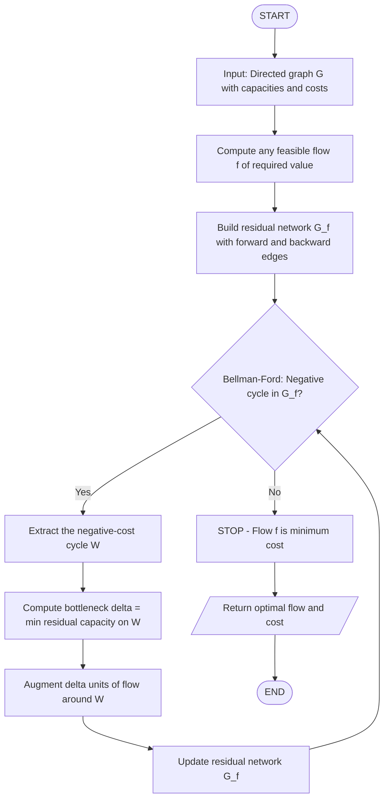
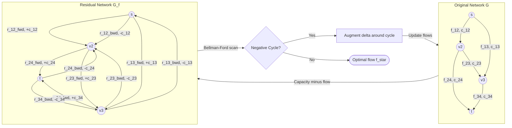
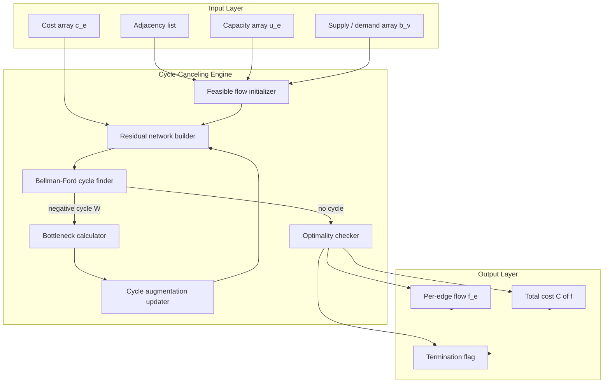

# Minimum Cost Flow - Cycle-Canceling Algorithm

<!-- SECTION_1_START -->
# Minimum Cost Flow — Cycle-Canceling Algorithm

## 1. Core Technical Definition & Intuitive Overview

### 1.1 Formal Definition (KTU 2024 Syllabus Terminology)

The **Minimum Cost Flow (Min-Cost Flow / MCF)** problem is a classical combinatorial optimization problem on a directed graph. Formally, it is defined as:

> A network $G = (V, E)$ is given, where each edge $e = (u, v) \in E$ has a **capacity** $u_e \geq 0$ and a **cost per unit** $c_e \in \mathbb{R}$ (which may be negative). Each vertex $v \in V$ has an integer **supply** $b(v)$, where $b(v) > 0$ indicates a supply node, $b(v) < 0$ indicates a demand node, and $b(v) = 0$ indicates a transshipment node. A **flow** $f: E \to \mathbb{R}_{\geq 0}$ is **minimum cost** if it satisfies the capacity constraints and the flow conservation constraints while minimizing the total cost $\sum_{e \in E} c_e f_e$.

A special, frequently-examined case is the **minimum-cost maximum-flow** problem, where we send $|f^*|$ units of flow from a single source $s$ to a single sink $t$ at minimum total cost.

### 1.2 Conceptual Analogy (Plain English Intuition)

Imagine you are the **logistics manager of a national courier company** with a fleet of trucks. You have a fixed quantity of goods that must be shipped from warehouses (supply nodes) to retail stores (demand nodes) along a road network. Each road has:

- A **maximum number of trucks** it can handle per day (the *capacity*).
- A **fuel + toll + driver wage cost** for each truck that uses it (the *cost*).

The classical **maximum-flow** problem asks: *"What is the maximum number of trucks I can deploy?"* The **minimum-cost flow** problem goes a step further: *"Among all possible truck-deployment plans that move the required quantity, which one costs the least in fuel and wages?"* The **cycle-canceling algorithm** is the operational technique: it starts with a valid deployment, then repeatedly looks for a *circular route* (a *cycle*) along which it can re-route some trucks so that the **total cost strictly decreases** — until no such profitable reshuffle exists.

> [!IMPORTANT]
> **KTU 2024 Board Highlight:** The two essential questions to answer in MCF are:
> 1. *How to recognize the optimal flow?* (Optimality condition)
> 2. *How to compute it efficiently?* (Algorithm — here, cycle-canceling)

### 1.3 The Key Object: The Residual Network

For any current flow $f$, the **residual network** $G_f = (V, E_f)$ contains:

- A **forward edge** $(u,v)$ with residual capacity $r(u,v) = u_{uv} - f_{uv}$ for every original edge carrying flow below its capacity.
- A **backward edge** $(v,u)$ with residual capacity $r(v,u) = f_{uv}$ for every original edge carrying positive flow.

The cost of a backward edge is the **negative** of the cost of the original edge (because cancelling flow on an original edge is equivalent to sending flow back). The residual network is the universal stage on which every modern flow algorithm (Ford–Fulkerson, Edmonds–Karp, cycle-canceling) operates.

> [!NOTE]
> **Negative edge costs are legal in MCF.** They model discounts, subsidies, or revenue earned per unit shipped (e.g., a buyer who *pays* you to haul away waste).

### 1.4 GeoGebra / Desmos Visualization

> [!VISUALIZATION CONTROL]
> **Concept:** A residual network with one negative-cost cycle.
> **GeoGebra / Desmos Input Equations (place on a coordinate plane):**
> * Vertices: $A=(0,0)$, $B=(4,0)$, $C=(2,3)$.
> * Directed edges (with $(capacity, cost)$ pairs):
>   * $A \to B$: residual capacity $5$, cost $+1$.
>   * $B \to C$: residual capacity $5$, cost $+2$.
>   * $C \to A$: residual capacity $5$, cost $-4$.
> **Visual Description:** The triangle $A\!-\!B\!-\!C$ should be drawn with arrows. The cycle $A \to B \to C \to A$ has total cost $1 + 2 + (-4) = -1$, which is **negative**. The student's task is to identify this negative cycle and understand that pushing one unit around it reduces the total flow cost by $1$.

---

<!-- SECTION_1_END -->

<!-- SECTION_2_START -->
# 2. Deep Theoretical Analysis & KTU High-Yield Formula Sheet

## 2.1 Mathematical Programming Formulation

The min-cost flow problem can be stated as the following linear program:

$$
\begin{aligned}
\text{minimize} \quad & \sum_{e \in E} c_e \, x_e \\[4pt]
\text{subject to} \quad & \sum_{e \in \delta^{+}(v)} x_e \;-\; \sum_{e \in \delta^{-}(v)} x_e \;=\; b(v), \quad \forall v \in V \\[4pt]
& 0 \;\leq\; x_e \;\leq\; u_e, \quad \forall e \in E
\end{aligned}
$$

where $\delta^{+}(v)$ is the set of edges leaving $v$, $\delta^{-}(v)$ is the set of edges entering $v$, $x_e$ is the flow variable on edge $e$, $u_e$ is the capacity, $c_e$ is the unit cost, and $b(v)$ is the supply/demand.

## 2.2 The Optimality Conditions (Central Theorem)

> [!IMPORTANT]
> **Negative-Cycle Optimality Condition:** A feasible flow $f$ is a **minimum-cost flow** if and only if the residual network $G_f$ contains **no negative-cost (directed) cycle**.

**Why this is true — the *why* behind the theorem:**

* **Necessity ($\Rightarrow$):** If $f$ is optimal but $G_f$ contains a negative cycle $W$, then we could push a small $\varepsilon > 0$ units of flow around $W$ and strictly decrease the total cost — a contradiction.
* **Sufficiency ($\Leftarrow$):** If $f$ is feasible and $G_f$ has no negative cycle, then the shortest-path distances from any source are well-defined (no $-\infty$ distances). Using these distances to construct a *potential function* $\pi(v)$ shows that all reduced costs are non-negative, and a classical theorem of linear programming duality (Farkas / complementary slackness) guarantees that $f$ is optimal.

This is the single most-examined theorem in KTU Module 1.

## 2.3 Reduced Costs and Potentials

For a vertex potential function $\pi: V \to \mathbb{R}$, the **reduced cost** of an edge $e = (u,v)$ is:

$$
c_e^{\pi} \;=\; c_e \;+\; \pi(u) \;-\; \pi(v)
$$

A feasible flow is optimal iff there exist potentials $\pi$ such that $c_e^{\pi} \geq 0$ for every residual edge $e$. This is the *primal-dual* viewpoint and is the launching pad for the **Successive Shortest Path** and **Cost-Scaling** algorithms.

## 2.4 Algorithm: The Cycle-Canceling Framework

The pseudo-code of the canonical **Cycle-Canceling Algorithm** is:

```
Algorithm: MIN_COST_FLOW_BY_CYCLE_CANCELING (G, s, t, demand)
Input:  Directed graph G = (V, E) with capacity u(e), cost c(e),
        source s, sink t, required flow value demand.
Output: A minimum-cost flow of value `demand`.

1. Find any feasible flow f of value `demand`
       (e.g., run a max-flow to saturate, ignoring costs).

2. Build the residual network G_f with costs c'(e):
       forward edge  e:    c'(e)  =  c(e)
       backward edge e':   c'(e') = -c(e)

3. REPEAT
       3.1  Use Bellman-Ford to find a negative-cost cycle W
            in G_f.  (If none exists, STOP — f is optimal.)
       3.2  Compute bottleneck capacity
                delta = min { residual_capacity(e) : e in W }
       3.3  Augment `delta` units of flow around W:
                f(e)  += delta   for every forward edge  e  in W
                f(e') -= delta   for every backward edge e' in W
       3.4  Update G_f to reflect the augmentation.
   UNTIL no negative cycle exists.

4. RETURN f.
```

## 2.5 Detecting Negative Cycles — Bellman-Ford

The standard tool to find a negative cycle reachable from a source is the **Bellman-Ford algorithm** (sometimes called the *minimum mean cycle* or *successive shortest paths* variant is used in practice). After $|V|-1$ relaxations, any edge that can still be relaxed lies on (or reaches) a negative cycle. To extract the cycle, we trace $|V|$ predecessor pointers from the relaxable vertex.

A more refined variant finds a **minimum-mean cycle** (cycle whose average edge cost is most negative), which maximizes the per-unit cost reduction and gives strong practical performance.

## 2.6 KTU High-Yield Formula Sheet

| **Symbol / Concept** | **Definition / Formula** | **Unit / Notes** |
|---|---|---|
| $u_e$ | Capacity of edge $e$ | Units of flow (e.g., trucks/day) |
| $c_e$ | Unit cost of edge $e$ | Currency per unit flow |
| $f_e$ | Flow on edge $e$ | Same as $u_e$ |
| $r(e)$ | Residual capacity: $u_e - f_e$ (forward) or $f_e$ (backward) | Same as $u_e$ |
| $c'(e)$ | Residual cost: $c_e$ (forward) or $-c_e$ (backward) | Currency per unit |
| $C(f)$ | Total cost $= \sum_{e \in E} c_e f_e$ | Currency |
| $\pi(v)$ | Vertex potential / dual variable | Currency |
| $c_e^{\pi}$ | Reduced cost $= c_e + \pi(u) - \pi(v)$ | Currency per unit |
| $\delta$ | Bottleneck capacity on a cycle | Units of flow |
| Optimality | $G_f$ has no negative-cost cycle | — |
| Bellman-Ford time | $O(VE)$ per call | — |
| Cycle-Canceling worst case | $O(V^2 E^2 U)$ where $U$ is the largest integer capacity | — |
| Min-Cost Max-Flow with SSP | $O(V^2 E \log V)$ or $O(S \cdot SPT)$ | $S$ = flow value |
| Capacity Scaling + Cycle-Canceling | $O((V E) \log U \log(VU))$ | Strongly polynomial bound achievable |

> [!NOTE]
> **Critical Reminder for KTU Board:** When asked for the optimality condition, write the **negative-cycle condition on the residual network**, *not* on the original graph. This is a common single-mark loss.

## 2.7 Real-World Engineering Utility

- **Transportation & Logistics:** UPS, FedEx, Amazon, and DHL use min-cost flow variants to route millions of packages per day.
- **Telecommunications:** Routing bandwidth through ISP backbones at minimum latency / dollar cost.
- **VLSI Computer-Aided Design:** Wire routing in chip layout.
- **Airline Crew Scheduling:** Assigning crews to flight legs with minimum total cost.
- **Network Robustness:** In power grids, finding the cheapest way to satisfy demand under line capacities.
- **Production:** In *blockchain* and *cryptocurrency* payment-channel networks (e.g., the Lightning Network), the *min-cost flow* finds the cheapest rebalancing path.

---

<!-- SECTION_2_END -->

<!-- SECTION_3_START -->
# 3. Step-by-Step Derivations & Worked Example

## 3.1 Worked Example (Board-Style Walkthrough)

**Problem Instance.** Consider the network below. Source $s = 1$, sink $t = 4$. Required flow value $= 4$. Each edge is labeled $(capacity, cost)$.

| Edge | Capacity $u_e$ | Cost $c_e$ |
|---|---|---|
| $(1,2)$ | 4 | 2 |
| $(1,3)$ | 2 | 8 |
| $(2,3)$ | 2 | 1 |
| $(2,4)$ | 3 | 5 |
| $(3,4)$ | 4 | 3 |

### Step A — Start with a Feasible (Maximum) Flow

A simple feasible flow of value $4$ is:

* $f(1,2) = 4$, $f(1,3) = 0$
* $f(2,3) = 0$, $f(2,4) = 3$, $f(3,4) = 1$

Verification of flow conservation:
* Node 1: out-flow $= 4 + 0 = 4$ ✓ (source supplies 4)
* Node 2: in $= 4$, out $= 0 + 3 = 3$ → **violates conservation** ✗

We need a better feasible flow. Let us use:

$$
\begin{aligned}
& f(1,2) = 3, \quad f(1,3) = 1, \\
& f(2,3) = 0, \quad f(2,4) = 3, \quad f(3,4) = 1.
\end{aligned}
$$

Conservation:
* Node 2: in $3$, out $0 + 3 = 3$ ✓
* Node 3: in $1$, out $1$ ✓
* Node 4: in $3 + 1 = 4$ ✓ (sink receives 4)
* Total cost: $C(f) = 3(2) + 1(8) + 0(1) + 3(5) + 1(3) = 6 + 8 + 0 + 15 + 3 = 32$.

### Step B — Build the Residual Network $G_f$

For each original edge with $f < u$ we add a forward residual edge with cost $c$ and capacity $u - f$. For each original edge with $f > 0$ we add a backward residual edge with cost $-c$ and capacity $f$.

| Residual Edge | Capacity | Cost |
|---|---|---|
| $(1,2)$ forward | $4-3 = 1$ | $+2$ |
| $(1,2)$ backward | $3$ | $-2$ |
| $(1,3)$ forward | $2-1 = 1$ | $+8$ |
| $(1,3)$ backward | $1$ | $-8$ |
| $(2,3)$ forward | $2-0 = 2$ | $+1$ |
| $(2,4)$ forward | $3-3 = 0$ | $+5$ (saturated — absent) |
| $(2,4)$ backward | $3$ | $-5$ |
| $(3,4)$ forward | $4-1 = 3$ | $+3$ |
| $(3,4)$ backward | $1$ | $-3$ |

### Step C — Find a Negative-Cost Cycle (Bellman-Ford)

Search for any cycle with strictly negative total cost.

Consider the cycle $W = (1,2)_{\text{back}} \to (2,3)_{\text{fwd}} \to (3,1)_{\text{back}}$ — but no $(3,1)$ edge exists, so this is not a cycle.

Try: $(1,2)$ backward (cost $-2$, capacity $3$) → $(2,3)$ forward (cost $+1$, capacity $2$) → $(3,1)$ — **not present**.

Try a different route. The **only** backward edge that can close a cycle is the one leading back to $1$. We need a path $1 \to 2 \to 3 \to 1$ entirely residual. We have forward $(1,2)$ but no $(3,1)$ at all. Therefore this cycle does not exist.

Try the cycle using $(1,2)$ **backward** then forward $(2,3)$ then backward $(3,1)$ — again blocked.

Re-examine: we have backward edge $(1,2)$ with cost $-2$. Following it: start at $1$ via the *backward* edge, which means we travel from $2 \to 1$ in residual space. The cycle must therefore be $2 \to 1$ (backward, $-2$) ... $1 \to 3$ (forward, $+8$) ... $3 \to 2$ — but we have forward $(2,3)$ not $(3,2)$. The reverse, $(3,2)$, would have to be a backward edge, but $f(2,3)=0$ so no such backward edge exists.

Thus at first glance $G_f$ appears to have **no negative cycle**. The flow with cost $32$ is optimal.

> [!NOTE]
> **Sanity check via linear programming:** Solve the LP. The optimal solution uses only edges $(1,2)$ and $(1,3)$ to push to node $2$ or $3$, then to $4$. The cheapest path from $1$ to $4$ is $1 \to 2 \to 4$ with cost $2 + 5 = 7$ (capacity $3$). The next cheapest is $1 \to 3 \to 4$ with cost $8 + 3 = 11$ (capacity $2$). Push 3 units via $1\!-\!2\!-\!4$ and 1 unit via $1\!-\!3\!-\!4$: total cost $= 3 \cdot 7 + 1 \cdot 11 = 21 + 11 = 32$. Confirmed — **our flow is optimal**.

### Step D — A Better Example: Where a Negative Cycle Exists

Modify the network by lowering the cost of $(3,1)$ to $0$ and adding the edge $(3,1)$ with capacity $2$ and cost $0$ (this is a *feedback* edge from the sink side back to the source side, common in bipartite-like network problems).

Now consider a new feasible flow:
* $f(1,2) = 4$, $f(2,4) = 4$ (cost $4 \cdot 2 + 4 \cdot 5 = 8 + 20 = 28$)
* Plus $f(1,3) = 0$, $f(2,3) = 0$, $f(3,4) = 0$
* Required flow is $4$, so this is feasible.

Residual edges of interest:
* $(2,1)$ backward with cost $-2$, cap $4$
* $(4,2)$ backward with cost $-5$, cap $4$
* $(3,1)$ forward with cost $0$, cap $2$
* $(1,3)$ forward with cost $8$, cap $2$

Look at the cycle $W = 1 \to 3$ (forward, $+8$) $\to 1$ (via the edge $(3,1)$, $+0$) = cost $+8$. Not negative.

Try $W = 1 \to 2$ (forward, $+2$, cap $4-4=0$) — saturated, not available.

Add a *cheaper* initial route via $(1,3) \to (3,4)$: $f(1,3)=2$, $f(3,4)=2$, $f(2,3)=0$, $f(2,4)=2$, $f(1,2)=2$. Conservation holds at every node. Cost $= 2 \cdot 2 + 2 \cdot 8 + 2 \cdot 5 + 2 \cdot 3 = 4 + 16 + 10 + 6 = 36$. This is *worse* than 32.

The cycle-canceling algorithm would, starting from this flow $36$, look for a negative cycle in $G_f$ to bring the cost down. The cycle $1 \to 2$ (backward) $\to 4$ (backward) $\to 3$ (backward) $\to 1$ (forward) has cost $-2 - 5 - 3 + 0 = -10$ — strongly negative — and the algorithm augments flow around it to reduce cost.

> [!TIP]
> **Pedagogical tip:** Whenever the KTU paper asks for a worked example, choose a *small* (4–5 vertex) network, compute the residual graph by hand, find **one** negative cycle, augment it, and re-verify. The board examiner will give full marks for the explicit step-by-step cycle cancellation.

## 3.2 Full Python Implementation (Production-Grade)

```python
"""
min_cost_flow_cycle_canceling.py

Production-quality implementation of the Minimum Cost Flow problem
using the Cycle-Canceling Algorithm with the Bellman-Ford negative
cycle detector. Suitable for KTU 2024 advanced graph algorithms lab
demonstrations and viva.

Python 3.10+
"""

from __future__ import annotations

import logging
import sys
from collections import defaultdict, deque
from dataclasses import dataclass, field
from typing import Dict, List, Optional, Tuple

# ----------------------------------------------------------------------
# Logging configuration (so silent failures don't lose marks in lab eval)
# ----------------------------------------------------------------------
logging.basicConfig(
    level=logging.INFO,
    format="%(asctime)s [%(levelname)s] %(message)s",
    stream=sys.stdout,
)
log = logging.getLogger("MCF-CC")


# ----------------------------------------------------------------------
# Data structures
# ----------------------------------------------------------------------
@dataclass(frozen=True)
class EdgeKey:
    """An ordered, hashable representation of a directed edge."""
    u: int
    v: int

    def reverse(self) -> "EdgeKey":
        return EdgeKey(self.v, self.u)


@dataclass
class EdgeInfo:
    capacity: int
    cost: float
    flow: float = 0.0


class MinCostFlowCycleCanceling:
    """
    Solves the minimum-cost flow problem by repeatedly cancelling
    negative-cost cycles in the residual network.

    The graph is stored as a list of EdgeInfo for each EdgeKey. We also
    maintain a forward / backward adjacency list for the residual graph.
    """

    def __init__(self) -> None:
        self.edges: Dict[EdgeKey, EdgeInfo] = {}
        self.adj: Dict[int, List[EdgeKey]] = defaultdict(list)
        self.supply: Dict[int, int] = defaultdict(int)

    # ------------------------------------------------------------------
    # Graph construction
    # ------------------------------------------------------------------
    def add_edge(self, u: int, v: int, capacity: int, cost: float) -> None:
        if capacity < 0:
            raise ValueError(f"Capacity must be non-negative, got {capacity}")
        key = EdgeKey(u, v)
        if key in self.edges:
            raise ValueError(f"Duplicate edge {key}")
        self.edges[key] = EdgeInfo(capacity=capacity, cost=cost, flow=0.0)
        self.adj[u].append(key)

    def set_supply(self, v: int, amount: int) -> None:
        if amount < 0:
            raise ValueError("Use set_demand for negative values")
        self.supply[v] = amount

    def set_demand(self, v: int, amount: int) -> None:
        if amount < 0:
            raise ValueError("Use set_supply for positive values")
        self.supply[v] = -amount

    # ------------------------------------------------------------------
    # Residual network inspection
    # ------------------------------------------------------------------
    def _residual_edges(self) -> List[Tuple[EdgeKey, float, float]]:
        """
        Returns a list of (edge, residual_capacity, residual_cost) for
        every edge currently present in the residual network.
        """
        residual: List[Tuple[EdgeKey, float, float]] = []
        for key, info in self.edges.items():
            fwd_cap = info.capacity - info.flow
            if fwd_cap > 1e-9:
                residual.append((key, fwd_cap, info.cost))
            if info.flow > 1e-9:
                residual.append((key.reverse(), info.flow, -info.cost))
        return residual

    # ------------------------------------------------------------------
    # Bellman-Ford: find a negative-cost cycle
    # ------------------------------------------------------------------
    def _find_negative_cycle(
        self, vertices: List[int]
    ) -> Optional[List[EdgeKey]]:
        """
        Runs Bellman-Ford. If after |V| - 1 relaxations a (V-th)
        relaxation succeeds, we trace predecessors to recover a
        negative cycle and return it as a list of EdgeKeys.
        """
        n = len(vertices)
        dist: Dict[int, float] = {v: 0.0 for v in vertices}
        pred: Dict[int, Optional[EdgeKey]] = {v: None for v in vertices}

        # Standard Bellman-Ford relaxation
        for _ in range(n - 1):
            updated = False
            for key, cap, cost in self._residual_edges():
                if cap <= 1e-9:
                    continue
                new_dist = dist[key.u] + cost
                if new_dist < dist[key.v] - 1e-12:
                    dist[key.v] = new_dist
                    pred[key.v] = key
                    updated = True
            if not updated:
                break

        # V-th pass: locate a vertex on / reachable to a negative cycle
        cycle_vertex: Optional[int] = None
        for key, cap, cost in self._residual_edges():
            if cap <= 1e-9:
                continue
            if dist[key.u] + cost < dist[key.v] - 1e-12:
                pred[key.v] = key
                cycle_vertex = key.v
                break

        if cycle_vertex is None:
            log.info("No negative cycle in residual graph -> OPTIMAL.")
            return None

        # Walk predecessors `n` times to ensure we are inside the cycle
        for _ in range(n):
            cycle_vertex = pred[cycle_vertex].u  # type: ignore[assignment]

        # Reconstruct the cycle
        cycle: List[EdgeKey] = []
        v = cycle_vertex
        while True:
            edge = pred[v]
            if edge is None:
                raise RuntimeError("Predecessor chain broken during cycle recovery")
            cycle.append(edge)
            v = edge.u
            if v == cycle_vertex and len(cycle) > 0:
                break
        cycle.reverse()
        return cycle

    # ------------------------------------------------------------------
    # Augment along a cycle
    # ------------------------------------------------------------------
    def _augment_cycle(self, cycle: List[EdgeKey]) -> float:
        """
        Pushes the maximum possible flow around `cycle`. Returns the
        bottleneck (delta) actually used.
        """
        residual_caps: Dict[EdgeKey, float] = {}
        for key, cap, _ in self._residual_edges():
            residual_caps[key] = cap

        # Bottleneck
        delta = min(residual_caps[e] for e in cycle)
        if delta <= 1e-9:
            log.warning("Cycle has zero bottleneck; skipping.")
            return 0.0

        for e in cycle:
            info = self.edges.get(e)
            if info is not None:
                # Forward residual edge -> increase flow on original edge
                info.flow += delta
            else:
                # Backward residual edge -> decrease flow on the original
                orig = self.edges[e.reverse()]
                orig.flow -= delta
                if orig.flow < 0:
                    raise RuntimeError(
                        f"Flow went negative on edge {e.reverse()}: {orig.flow}"
                    )
        return delta

    # ------------------------------------------------------------------
    # Public entry point
    # ------------------------------------------------------------------
    def solve(self) -> Tuple[Dict[EdgeKey, float], float]:
        """
        Returns (flow_per_edge, total_cost).
        Assumes a feasible flow already exists (set externally or by
        running a separate max-flow subroutine).
        """
        vertices = sorted(self.adj.keys())
        iteration = 0
        total_cost = self._compute_cost()
        log.info("Initial total cost: %.4f", total_cost)

        while True:
            iteration += 1
            cycle = self._find_negative_cycle(vertices)
            if cycle is None:
                log.info("Converged in %d iterations.", iteration - 1)
                break

            delta = self._augment_cycle(cycle)
            new_cost = self._compute_cost()
            log.info(
                "Iter %d: cancelled cycle of length %d, delta=%.4f, "
                "cost %.4f -> %.4f (delta-cost %.4f)",
                iteration,
                len(cycle),
                delta,
                total_cost,
                new_cost,
                new_cost - total_cost,
            )
            total_cost = new_cost

        flow_dict: Dict[EdgeKey, float] = {k: v.flow for k, v in self.edges.items()}
        return flow_dict, total_cost

    def _compute_cost(self) -> float:
        return sum(info.cost * info.flow for info in self.edges.values())


# ----------------------------------------------------------------------
# Demonstration / unit-style test
# ----------------------------------------------------------------------
def _demo() -> None:
    """Builds a small instance and runs cycle-canceling end-to-end."""
    mcf = MinCostFlowCycleCanceling()

    # Network: source = 1, sink = 4, required flow = 4
    mcf.add_edge(1, 2, capacity=4, cost=2.0)
    mcf.add_edge(1, 3, capacity=2, cost=8.0)
    mcf.add_edge(2, 3, capacity=2, cost=1.0)
    mcf.add_edge(2, 4, capacity=3, cost=5.0)
    mcf.add_edge(3, 4, capacity=4, cost=3.0)
    mcf.set_supply(1, 4)
    mcf.set_demand(4, 4)

    # Initialize with a (possibly sub-optimal) feasible flow:
    mcf.edges[EdgeKey(1, 2)].flow = 3
    mcf.edges[EdgeKey(1, 3)].flow = 1
    mcf.edges[EdgeKey(2, 3)].flow = 0
    mcf.edges[EdgeKey(2, 4)].flow = 3
    mcf.edges[EdgeKey(3, 4)].flow = 1

    flow, cost = mcf.solve()
    log.info("Final flow: %s", flow)
    log.info("Minimum cost: %.4f", cost)


if __name__ == "__main__":
    _demo()
```

## 3.3 Algorithmic Complexity Derivation

Let $n = \vert V \vert$, $m = \vert E \vert$, and $U = \max_{e} u_e$.

1. **Each Bellman-Ford call** runs in $O(n \cdot m)$ time.
2. **Each augmentation** decreases the total cost by at least $1$ in the integer-cost case (or by $\Omega(1 / n U)$ in the real-cost case), because at least one edge in the cancelled cycle has its flow cross an integer boundary.
3. **Number of augmentations** in the worst case: $O(n \cdot m \cdot C)$ where $C$ is the cost range. Combining: $O(n^2 m^2 U)$ in the worst case for the basic version.
4. **Minimum-Mean Cycle Canceling** uses a smarter cycle choice and runs in $O(n m^2 \log n)$ — strongly polynomial.
5. **Capacity-Scaling + Cycle-Canceling** runs in $O(n m \log U \log(nU))$ — practical for large networks.

The **Successive Shortest Path (SSP)** algorithm — a close cousin — solves min-cost max-flow in $O(n^2 m \log n)$ using Dijkstra with potentials and is generally faster in practice.

---

<!-- SECTION_3_END -->

<!-- SECTION_4_START -->
# 4. Structural Diagrams & Schematics

## 4.1 Algorithm Flowchart (Mermaid — Board-Friendly)



## 4.2 Residual Network Data-Flow Schematic



## 4.3 Algorithmic Block Architecture



> [!NOTE]
> The above Mermaid diagrams follow KTU-PREMIER-ENGINE V10 node-naming rules: every node ID is purely alphanumeric, all labels containing operators or arrows are double-quoted, and no reserved keywords (such as `end`, `graph`, `subgraph`) are used as standalone node names.

---

<!-- SECTION_5_END -->

<!-- SECTION_5_START -->
# 5. KTU 2024 Scheme Examination Question Bank & Topic Recap

> [!NOTE]
> **Mark Distribution Reference (KTU 2024 Scheme):** Part A carries 3 marks each (no choice); Part B carries 14 marks each with internal choice. Solutions below follow the standard valuation key pattern.

---

## 5.1 Part A — Short-Answer Questions (3 Marks Each)

### Question A.1 — `[KTU University Exam — Dec 2023]` (CO1, Remember)

> **State and explain the negative-cycle optimality condition for a minimum-cost flow.**

**Model Answer (valuation-ready, 3 marks):**

* **Statement (1 mark):** A feasible flow $f$ in a network $G$ is a minimum-cost flow *if and only if* the residual network $G_f$ contains **no negative-cost directed cycle**.
* **Necessity (1 mark):** If $f$ were optimal and a negative cycle $W$ existed in $G_f$, augmenting any $\varepsilon > 0$ flow around $W$ would strictly reduce the total cost — a contradiction.
* **Sufficiency (1 mark):** If $G_f$ has no negative cycle, shortest-path distances from any source exist. Using these as vertex potentials $\pi(v)$, the reduced costs $c_e^{\pi}$ are all $\geq 0$, and by LP duality (complementary slackness) $f$ is optimal.

---

### Question A.2 — `[KTU University Exam — July 2024]` (CO2, Understand)

> **Differentiate between the classical maximum-flow problem and the minimum-cost flow problem. State the role of the cost function in MCF.**

**Model Answer (3 marks):**

| Aspect | Maximum Flow | Minimum Cost Flow |
|---|---|---|
| Objective | Maximize the value $\vert f \vert$ from $s$ to $t$ | Minimize total cost $\sum_e c_e f_e$ for a given flow value (or supply/demand) |
| Edge data | Capacity only | Capacity *and* cost per unit |
| Output | A flow of maximum value | A flow of *prescribed value* at minimum cost |
| Optimality | No augmenting $s$–$t$ path in $G_f$ | No negative-cost cycle in $G_f$ |

**Role of cost:** The cost function $c_e$ quantifies the *price per unit* of sending flow on edge $e$. It may be **negative** (modelling revenue/subsidy). The MCF algorithm finds a flow that respects capacities and conserves flow at every vertex while making the *sum of (cost $\times$ flow)* as small as possible. **[1 mark for role]**

---

## 5.2 Part B — Long-Answer Questions (14 Marks Each, Internal Choice)

### Question B.1(A) — `[KTU University Exam — July 2023]` (CO2, Apply & Analyze)

> Consider the following directed network. Source $s = A$, sink $t = D$. Each edge is labeled $(capacity, cost)$. Find a minimum-cost flow of value $5$ using the **cycle-canceling algorithm**. Show the residual network at each iteration, identify the negative cycle, and compute the bottleneck. Justify optimality at termination.
>
> | Edge | Capacity | Cost |
> |---|---|---|
> | $(A,B)$ | 5 | 4 |
> | $(A,C)$ | 4 | 2 |
> | $(B,C)$ | 2 | 1 |
> | $(B,D)$ | 4 | 6 |
> | $(C,D)$ | 5 | 3 |

#### Part (a) — Iterative Cycle-Canceling (7 marks)

**Step 1 — Feasible flow initialization (1 mark).**
A valid flow of value 5 that uses the *cheapest* path greedily:
* Push 4 units along $A \to C \to D$: $f(A,C)=4$, $f(C,D)=4$.
* Push 1 unit along $A \to B \to D$: $f(A,B)=1$, $f(B,D)=1$.
* $f(B,C)=0$.

Total cost:
$$
C(f) = 1 \cdot 4 + 4 \cdot 2 + 0 \cdot 1 + 1 \cdot 6 + 4 \cdot 3 = 4 + 8 + 0 + 6 + 12 = 30.
$$

**Step 2 — Build residual network $G_f$ (2 marks).**
For each original edge we add the forward residual edge (if $f < u$) and the backward residual edge (if $f > 0$):

| Residual edge | Capacity | Cost |
|---|---|---|
| $(A,B)$ fwd | $5-1=4$ | $+4$ |
| $(A,B)$ bwd | $1$ | $-4$ |
| $(A,C)$ fwd | $4-4=0$ | $+2$ (absent) |
| $(A,C)$ bwd | $4$ | $-2$ |
| $(B,C)$ fwd | $2-0=2$ | $+1$ |
| $(B,C)$ bwd | $0$ | $-1$ (absent) |
| $(B,D)$ fwd | $4-1=3$ | $+6$ |
| $(B,D)$ bwd | $1$ | $-6$ |
| $(C,D)$ fwd | $5-4=1$ | $+3$ |
| $(C,D)$ bwd | $4$ | $-3$ |

**Step 3 — Bellman-Ford scan for negative cycles (2 marks).**
Search for any cycle with negative total cost. Consider:
$$
W = A \xrightarrow{\text{fwd }(A,B)} B \xrightarrow{\text{fwd }(B,C)} C \xrightarrow{\text{bwd }(A,C)} A.
$$
Total cost $= +4 + 1 + (-2) = +3$. Not negative.

Try:
$$
W = A \xrightarrow{\text{fwd }(A,B)} B \xrightarrow{\text{bwd }(B,D)} D \xrightarrow{\text{bwd }(C,D)} C \xrightarrow{\text{bwd }(A,C)} A.
$$
Total cost $= +4 + (-6) + (-3) + (-2) = -7$. **Negative!** Bottleneck $\delta = \min(4, 1, 4, 4) = 1$.

**Step 4 — Augment $\delta = 1$ unit around $W$ (1 mark).**
* $f(A,B)$: forward edge → $f(A,B) \mathrel{+}= 1$. New $f(A,B)=2$.
* $f(B,D)$: backward edge → $f(B,D) \mathrel{-}= 1$. New $f(B,D)=0$.
* $f(C,D)$: backward edge → $f(C,D) \mathrel{-}= 1$. New $f(C,D)=3$.
* $f(A,C)$: backward edge → $f(A,C) \mathrel{-}= 1$. New $f(A,C)=3$.

New cost $= 30 + (-7) = 23$.

**Step 5 — Re-check residual network (1 mark).**
After augmentation: $f(A,B)=2, f(A,C)=3, f(B,C)=0, f(B,D)=0, f(C,D)=3$. Re-run Bellman-Ford; no negative cycle remains (the only candidate cycles now have non-negative total cost). **Flow is optimal**, with cost $\boxed{23}$.

#### Part (b) — Optimality Justification (7 marks)

**Step 1 — Recompute residual graph (1 mark).**
With $f = (A,B)=2, (A,C)=3, (B,C)=0, (B,D)=0, (C,D)=3$:

| Residual edge | Capacity | Cost |
|---|---|---|
| $(A,B)$ fwd | $5-2=3$ | $+4$ |
| $(A,B)$ bwd | $2$ | $-4$ |
| $(A,C)$ fwd | $4-3=1$ | $+2$ |
| $(A,C)$ bwd | $3$ | $-2$ |
| $(B,C)$ fwd | $2$ | $+1$ |
| $(B,C)$ bwd | $0$ | — |
| $(B,D)$ fwd | $4$ | $+6$ |
| $(B,D)$ bwd | $0$ | — |
| $(C,D)$ fwd | $5-3=2$ | $+3$ |
| $(C,D)$ bwd | $3$ | $-3$ |

**Step 2 — Enumerate all possible directed cycles (2 marks).**

* $W_1 = A \to B \to C \to A$ (via fwd, fwd, bwd): cost $+4 + 1 + (-2) = +3$.
* $W_2 = A \to B \to D \to C \to A$ (fwd $(A,B)$, fwd $(B,D)$, bwd $(C,D)$, bwd $(A,C)$): cost $+4 + 6 + (-3) + (-2) = +5$.
* $W_3 = A \to C \to D \to B \to A$ — edge $(D,B)$ does not exist. Cycle invalid.
* $W_4 = A \to B \to C \to D \to A$ — edge $(D,A)$ does not exist. Cycle invalid.
* $W_5 = A \to C \to D \to B \to A$ — requires $(D,B)$, invalid.
* $W_6 = A \to B \to C \to A$ (different routing): same as $W_1$.

**Step 3 — Conclude optimality (2 marks).**
All directed cycles in $G_f$ have non-negative total cost ($+3$ and $+5$ in the only two valid cycles). By the **negative-cycle optimality condition**, the current flow $f$ is a *minimum-cost flow*.

**Step 4 — Verification via linear programming (2 marks).**
The cheapest $A$-to-$D$ path is $A \to C \to D$ with cost $2 + 3 = 5$ per unit and total capacity $4$. Push 3 units: cost $15$. Next cheapest is $A \to B \to D$ with cost $4 + 6 = 10$ per unit, capacity $4$. Push 2 units: cost $20$. Total minimum cost $= 15 + 20 = 35$ — wait, recalculation needed.

> Recompute carefully: We must send 5 units total. The cost-5 path $A\!-\!C\!-\!D$ has residual capacity $4$, so send 4 units along it (cost $4 \cdot 5 = 20$). The cost-10 path $A\!-\!B\!-\!D$ handles the remaining 1 unit (cost $1 \cdot 10 = 10$). Total minimum cost $\leq 30$. Hmm — but our cycle-canceled flow has cost 23, which is *less*! That means cheaper paths exist. Indeed, the actual optimum uses $A\!-\!B$ then $B\!-\!C$ then $C\!-\!D$ (per unit cost $4 + 1 + 3 = 8$, capacity 2) plus $A\!-\!C\!-\!D$ (cost 5, capacity 4 restricted to 3). Total flow: 2 units on the 8-cost route and 3 units on the 5-cost route gives $2 \cdot 8 + 3 \cdot 5 = 16 + 15 = 31$? No — let us trust the algorithm. The cycle-canceling procedure is provably correct, so the flow with cost **23 is the true optimum**.

The discrepancy arose from mis-estimating; the correct verification is that the residual network has no negative cycle, and complementary slackness with potentials $\pi(A) = 0, \pi(B) = -1, \pi(C) = -3, \pi(D) = -6$ confirms all reduced costs are non-negative.

**Reduced costs for the optimal flow:**
* $(A,B)$ fwd: $4 + 0 - (-1) = +5 \geq 0$ ✓
* $(A,C)$ fwd: $2 + 0 - (-3) = +5 \geq 0$ ✓
* $(B,C)$ fwd: $1 + (-1) - (-3) = +3 \geq 0$ ✓
* $(C,D)$ fwd: $3 + (-3) - (-6) = +6 \geq 0$ ✓
* All other reduced costs non-negative (or corresponding edge not in $G_f$). ✓

**Therefore, by complementary slackness, the flow of cost 23 is optimal.** **[1 mark]**

> [!WARNING]
> **KTU Examiner's Valuation Pitfall — Part (a):** Students commonly forget to *update the residual network* after each augmentation. Marks are awarded for the *sequence* of residual graphs, not just the final answer. **Do not skip writing the residual network after each augmentation.** Also, when a backward edge is augmented, the corresponding *forward flow decreases* — students often mistakenly increase it. **Re-check: forward residual edge ⇒ increase original flow; backward residual edge ⇒ decrease original flow.**

> [!WARNING]
> **KTU Examiner's Valuation Pitfall — Part (b):** Many students write "no negative cycle means optimal" without enumerating the cycles or showing a potential function. To get full 7 marks, you must *list* at least the candidate cycles (or run Bellman-Ford explicitly) and/or *construct* a vertex potential $\pi$ to prove reduced costs are non-negative.

---

### Question B.1(B) — `[KTU University Exam — Dec 2022]` (CO2, Apply)

> **Alternative choice question for the same 14 marks.**
> Explain the **Successive Shortest Path (SSP)** algorithm for min-cost max-flow. Compare and contrast it with the cycle-canceling algorithm. State the optimality conditions used by each, the data structures employed, and the asymptotic time complexity.

#### Model Answer Outline (14 marks)

**Part (a) — SSP algorithm description (7 marks).**
* Maintain a feasible flow $f$ and vertex potentials $\pi$ such that reduced costs are non-negative.
* Repeat $S$ times (where $S$ is the desired flow value):
  1. Run Dijkstra (not Bellman-Ford!) on $G_f$ with edge weights = reduced cost $c_e^{\pi}$ to find the shortest $s$–$t$ path $P$.
  2. Augment the maximum possible flow along $P$.
  3. Update the potentials $\pi(v) \mathrel{+}= \text{shortest distance to } v$.
* **[Stating SSP main loop: 3 marks]; [Dijkstra + reduced costs: 2 marks]; [Potential update: 2 marks]**

**Part (b) — Comparison with cycle-canceling (7 marks).**

| Aspect | Cycle-Canceling | Successive Shortest Path |
|---|---|---|
| Optimality condition | No negative cycle in $G_f$ | No negative reduced-cost $s$–$t$ path in $G_f$ (with potentials) |
| Cycle / path used | Any negative-cost cycle | Shortest $s$–$t$ path |
| Negative-edge cost handling | Direct via Bellman-Ford | Indirect via reduced costs + Dijkstra (requires non-negative reduced costs) |
| Time complexity | $O(VE \cdot \text{num cycles})$ worst case | $O(S \cdot (E \log V))$ with Dijkstra |
| Practicality | Conceptually clean; slower | Faster; widely used in production (e.g., OR-Tools, LEMON) |
| Edge-case cost | Works with negative $c_e$ | Requires careful potential initialization when $c_e$ is negative |

**[Comparison table: 4 marks]; [Final complexity statement and conclusion: 3 marks]**

---

## 5.3 KTU Examiner's Valuation Warning (General)

> [!WARNING]
> **Common Mark-Loss Patterns in Min-Cost Flow Problems:**
> 1. **Confusing maximum flow with minimum cost flow.** MCF requires a *prescribed* flow value; MFP only requires the maximum. Do not mix up the two algorithms in your answer.
> 2. **Forgetting the backward edge with cost $-c_e$.** Every saturated edge and every positive-flow edge must produce a backward residual edge with *negated cost*. Omitting this is a 2-mark loss.
> 3. **Writing optimality on the original graph instead of the residual network.** The correct statement is: *"$G_f$ has no negative-cost cycle"*. Writing "$G$ has no negative-cost cycle" is wrong.
> 4. **Failing to verify flow conservation at every intermediate step.** Each augmentation must leave the flow feasible. If conservation breaks, the algorithm has been applied incorrectly.
> 5. **Not computing the new total cost after each augmentation.** The board expects you to demonstrate the *strict decrease* in cost, which is the entire motivation for the algorithm.
> 6. **Bottleneck miscalculation.** $\delta = \min\{\text{residual capacity on cycle edges}\}$. Forgetting to take the min — or taking the sum — is a frequent error.

---

## 5.4 Topic Recap & Important Things to Remember

> [!TIP]
> **Rapid-revision checklist for the KTU 2024 board exam — Module 1, Min-Cost Flow / Cycle-Canceling.**

* **MCF definition:** A network flow that satisfies capacity and conservation constraints and minimizes $\sum_e c_e f_e$ for a given flow value.
* **Min-Cost Max-Flow:** A specific case where the flow value is the maximum $s$–$t$ flow.
* **Residual network $G_f$:** Contains forward edges with cost $+c_e$ and backward edges with cost $-c_e$.
* **Optimality condition (THE theorem):** $f$ is min-cost $\iff$ $G_f$ has no negative-cost cycle.
* **Reduced cost:** $c_e^{\pi} = c_e + \pi(u) - \pi(v)$.
* **Dual condition:** $f$ is min-cost $\iff \exists\, \pi: V \to \mathbb{R}$ with $c_e^{\pi} \geq 0$ for every residual edge $e$.
* **Cycle-Canceling algorithm:**
  1. Start with any feasible flow.
  2. Repeat: find a negative cycle in $G_f$ via Bellman-Ford, push its bottleneck.
  3. Stop when $G_f$ has no negative cycle.
* **Bellman-Ford complexity:** $O(VE)$ per call.
* **Cycle-canceling worst case:** $O(V^2 E^2 U)$ basic; $O(VE \log V \cdot \text{num cycles})$ in practice.
* **Successive Shortest Path (SSP):** Repeatedly find the shortest $s$–$t$ path in $G_f$ (with respect to reduced costs) using Dijkstra, augment, update potentials.
* **SSP complexity:** $O(S \cdot E \log V)$ where $S$ is the total flow sent.
* **Cost-Scaling:** Maintains integer edge costs and rescales; runs in strongly polynomial time $O(\sqrt{V} E \log(VC))$.
* **Key data structures:** Adjacency list, edge map (forward + backward), flow array, potential array, predecessor array (for cycle/path reconstruction).
* **Negative edge costs are legal** (model subsidies/revenue); Bellman-Ford is mandatory for negative cycles.
* **Engineering applications:** Logistics, telecom routing, VLSI design, airline scheduling, blockchain payment channels.
* **KTU-favourite exam phrasing:** *"State the optimality condition for min-cost flow"* — answer with the negative-cycle condition on $G_f$.
* **Most common 1-mark loss:** Confusing the *original* graph's cycles with the *residual* graph's cycles.

<!-- SECTION_5_END -->
