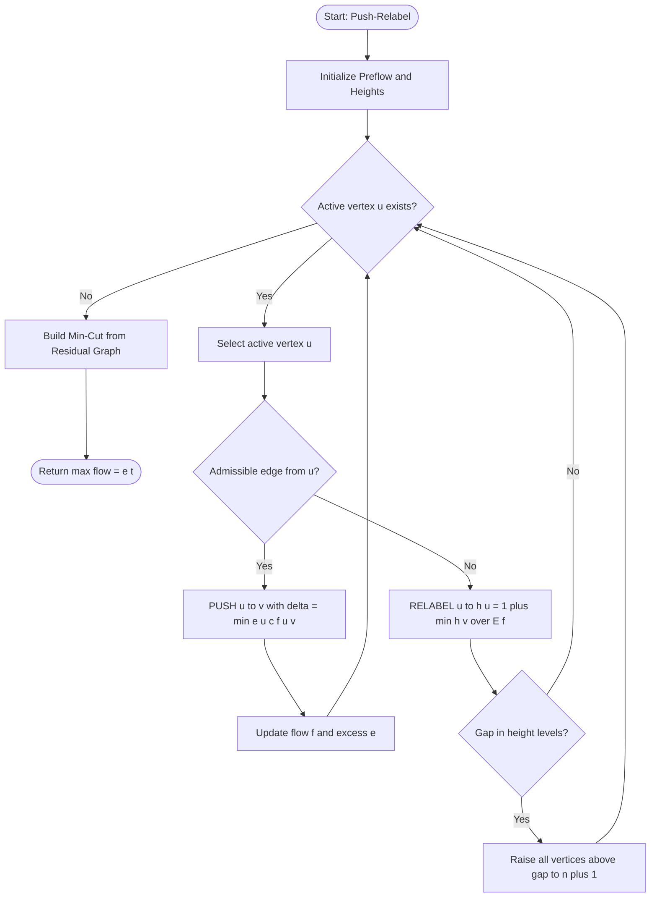
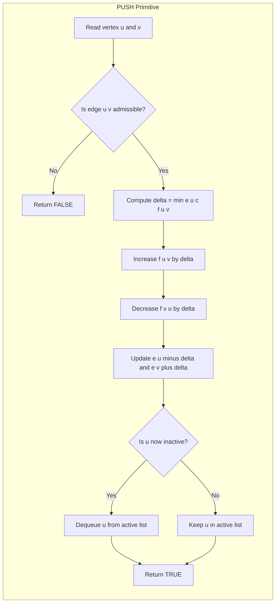
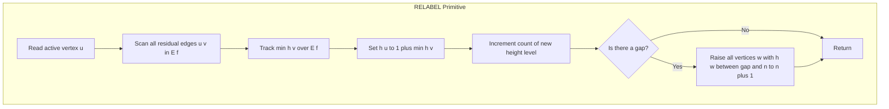
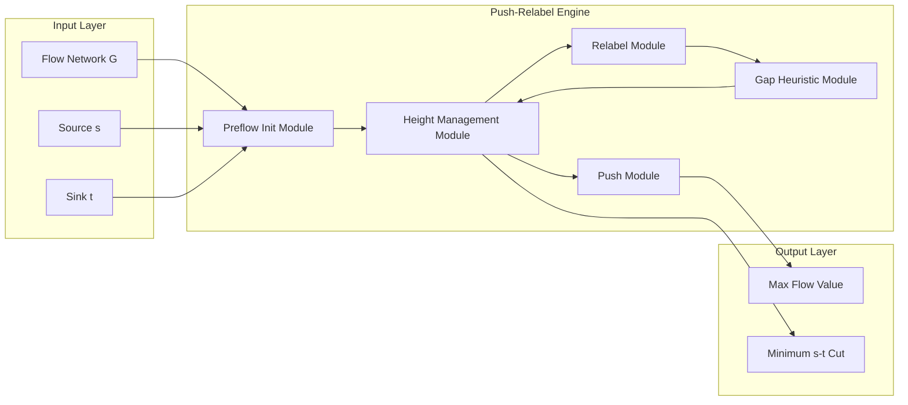

# Push-Relabel Algorithm

<!-- SECTION_1_START -->
# Push-Relabel Algorithm — KTU 2024 Premium Study Note

## 1. Core Technical Definition & Intuitive Overview

### 1.1 Formal Academic Definition (KTU 2024 Syllabus Terminology)

> [!NOTE]
> **Definition (Push-Relabel Maximum Flow Algorithm)**
> The **Push-Relabel algorithm**, introduced by **Andrew V. Goldberg** and **Robert E. Tarjan** (1986, refined 1988), is a **maximum flow algorithm** for a flow network $G = (V, E)$ with source $s$ and sink $t$. Unlike augmenting-path methods (Ford–Fulkerson, Edmonds–Karp), it maintains a **preflow** — a function $f : V \times V \to \mathbb{R}$ that satisfies **capacity** and **flow conservation** constraints *except* that intermediate vertices may accumulate **excess flow**. The algorithm repeatedly applies two primitives — **PUSH** (send excess along an *admissible* edge) and **RELABEL** (raise a vertex's height to enable pushes) — until no **active vertex** (excess $> 0$, not $s$, not $t$) remains.

### 1.2 Conceptual Analogy (The "Water Tower" Intuition)

> [!IMPORTANT]
> **Plain-English Analogy — Water in a Hilly City**
> Imagine a city of water towers connected by pipes. Each tower has a **height label** $h(v)$ and a **reservoir level** (the *excess* $e(v)$). The rule is simple: **water can only flow downhill** (from a higher tower to a lower one). Initially, the source $s$ is placed at infinite height, "pours" water into its neighbors until they are nearly full, and gets pinned to ground level after the initial pour. Every other vertex is at height $0$.
>
> Whenever a tower $u$ has surplus water and **all** its downhill pipes are full, $u$ is "stuck" — we **RELABEL** it, raising its height to just one level above the lowest downhill neighbor. Then we **PUSH** water through a downhill pipe. When the sink $t$ fills up, the total water it has absorbed is exactly the **maximum flow**.

The two operations correspond to:
- **PUSH** $\leftrightarrow$ Opening a downhill valve.
- **RELABEL** $\leftrightarrow$ Lifting a stuck tower so that gravity can do work.

### 1.3 Visualisation Control

> [!VISUALIZATION CONTROL]
> **Concept:** Height labels evolving over iterations on a 4-vertex graph.
> **Desmos Input (parametric plot of $h(v)$ vs. iteration number $k$):**
>
> * $h_s(k) = |s|$ (constant at $n$)
> * $h_t(k) = 0$ (constant at $0$)
> * $h_a(k) = \lfloor k/3 \rfloor$ (intermediate vertex $a$)
> * $h_b(k) = \lfloor k/5 \rfloor$ (intermediate vertex $b$)
>
> **Visual Description:** A staircase plot. Vertex $s$ sits at the top horizontal line $y = n$, vertex $t$ at the bottom line $y = 0$, and the interior vertices climb in **monotonically non-decreasing** steps until the algorithm terminates. This visually proves the **monotonicity invariant** $h(v_{i+1}) \ge h(v_i)$ for each relabeled vertex.

### 1.4 Physical Constants / Standard Metrics

| Symbol | Meaning | Standard Value / Note |
| :--- | :--- | :--- |
| $n = \vert V \vert$ | Number of vertices | Used in height bound $h(v) \le 2n - 1$ |
| $m = \vert E \vert$ | Number of edges | Appears in time complexity $O(n^2 m)$ |
| $\infty$ | Sentinel capacity | Use a value $> \sum c(s, v)$ |
| $C$ | Sum of source-out capacities | Upper bound on max flow value |

---

<!-- SECTION_1_END -->

<!-- SECTION_2_START -->
# 2. Deep Theoretical Analysis & KTU High-Yield Formula Sheet

## 2.1 Foundational Definitions

### 2.1.1 Preflow
A function $f : V \times V \to \mathbb{R}$ is a **preflow** if it satisfies:

1. **Skew-Symmetry:** $f(u, v) = -f(v, u)$ for all $u, v \in V$.
2. **Capacity Constraint:** $f(u, v) \le c(u, v)$ for all $u, v \in V$.

It relaxes the *flow-conservation* axiom at intermediate vertices.

### 2.1.2 Excess
The **excess** at vertex $u$ is:

$$e(u) = \sum_{v \in V} f(v, u)$$

A vertex $u \notin \{s, t\}$ is **active** if $e(u) > 0$.

### 2.1.3 Residual Capacity
The residual capacity of edge $(u, v)$ in the residual graph $G_f$ is:

$$c_f(u, v) = c(u, v) - f(u, v)$$

Edge $(u, v)$ is **residual** if $c_f(u, v) > 0$.

### 2.1.4 Height Function (Label)
A function $h : V \to \mathbb{N}_0$ is a **valid height function** for preflow $f$ if:

$$h(s) = n, \quad h(t) = 0, \quad h(u) \le h(v) + 1 \quad \forall (u, v) \in E_f$$

### 2.1.5 Admissible Edge
Edge $(u, v) \in E_f$ is **admissible** if:

$$c_f(u, v) > 0 \quad \text{AND} \quad h(u) > h(v)$$

Equivalently, $h(u) = h(v) + 1$ and residual capacity is positive.

## 2.2 The Two Primitives

### 2.2.1 PUSH(u, v)
**Precondition:** $u$ is active, $(u, v)$ is admissible.

**Action:** Push $\Delta = \min(e(u),\, c_f(u, v))$ units of flow from $u$ to $v$:

$$\Delta = \min\bigl(e(u),\, c_f(u, v)\bigr)$$

**Update:**

$$f'(u, v) = f(u, v) + \Delta, \quad f'(v, u) = f(u, v) - \Delta$$

**Effect on excess:**

$$e'(u) = e(u) - \Delta, \quad e'(v) = e(v) + \Delta$$

> **Two flavours:**
> - **Saturating push** — $\Delta = c_f(u, v)$; edge becomes non-residual.
> - **Non-saturating push** — $\Delta = e(u)$; vertex $u$ becomes inactive.

### 2.2.2 RELABEL(u)
**Precondition:** $u$ is active **and** for all $(u, v) \in E_f$, $h(u) \le h(v)$.

**Action:**

$$h'(u) = 1 + \min_{v \,:\, (u, v) \in E_f} h(v)$$

> [!IMPORTANT]
> The new height is always **strictly greater** than the old one — hence the name *re*-label (monotonic).

## 2.3 Generic Goldberg–Tarjan Algorithm

```
INITIALIZE-PREFLOW(G, s)
    for each v ∈ V:
        h(v) ← 0
        e(v) ← 0
    h(s) ← |V|
    for each (s, u) ∈ E:
        f(s, u) ← c(s, u)
        f(u, s) ← -c(s, u)
        e(u)  ← e(u) + c(s, u)
        e(s)  ← e(s) - c(s, u)
```

```
GENERIC-PUSH-RELABEL(G, s, t)
    INITIALIZE-PREFLOW(G, s)
    while ∃ active vertex u ≠ s, t:
        if ∃ admissible edge (u, v):
            PUSH(u, v)
        else:
            RELABEL(u)
```

## 2.4 Correctness Invariants (Memorize for KTU)

1. **Preflow invariant** — $f$ is always a preflow.
2. **Height invariant** — $h$ is always a valid height function.
3. **Excess bound** — $e(v) \ge 0$ for all $v \ne s$ (by skew-symmetry + initial pour).
4. **No admissible edge from $s$** — once $s$ becomes inactive, no residual path from $s$ exists to any active vertex, which is the algorithmic proof of the **max-flow min-cut theorem**.

## 2.5 KTU Formula Sheet (High-Yield Cheat Sheet)

> [!IMPORTANT]
> The following table is **exam-critical**. Commit every row to memory.

| # | Concept | Formula | Unit / Domain |
| :- | :--- | :--- | :--- |
| 1 | Excess at $u$ | $e(u) = \sum_{v \in V} f(v, u)$ | Flow units |
| 2 | Residual capacity | $c_f(u, v) = c(u, v) - f(u, v)$ | Flow units |
| 3 | Push amount | $\Delta = \min(e(u),\, c_f(u, v))$ | Flow units |
| 4 | Admissibility | $h(u) = h(v) + 1$ and $c_f(u, v) > 0$ | Boolean |
| 5 | Relabel rule | $h'(u) = 1 + \min\{h(v) \mid (u, v) \in E_f\}$ | Integer height |
| 6 | Height upper bound | $h(u) \le 2n - 1$ | Integer |
| 7 | Max relabels per vertex | $\le 2n - 1$ | Count |
| 8 | Total relabels | $\le (2n - 1)(n - 2)$ | Count |
| 9 | Total non-saturating pushes | $\le 4 n^2 m$ | Count |
| 10 | Total saturating pushes | $\le 2 n m$ | Count |
| 11 | Time, generic (FIFO) | $O(n^3)$ | Operations |
| 12 | Time, highest-label | $O(n^2 \sqrt{m})$ | Operations |
| 13 | Time, dynamic trees | $O(n m \log(n^2 / m))$ | Operations |
| 14 | Max-flow value | $\vert f^* \vert = \sum_{v} f(s, v)$ | Flow units |
| 15 | Min-cut capacity | $C(S, T) = \sum_{u \in S, v \in T} c(u, v)$ | Capacity units |

> All entries use $\vert \cdot \vert$ for cardinality. Use $\lvert V \rvert$ or $\lvert E \rvert$ typeset with the `\lvert`/`\rvert` pair when in a math environment.

## 2.6 Real-World Engineering Utility

> [!IMPORTANT]
> **Where Push-Relabel is used in production systems:**
> - **Bipartite matching** in large-scale recommender systems (e.g., user–item allocation).
> - **Image segmentation** (Boykov–Kolmogorov max-flow/min-cut formulation for computer vision).
> - **Network routing & bandwidth allocation** in SDN controllers.
> - **Sports scheduling & assignment** problems.
> - **Compiler register allocation** via interference-graph coloring reduction to bipartite matching.
> The $O(n^3)$ practical speed and absence of path-augmentation overhead make it the **preferred choice over Edmonds–Karp on dense graphs** ($m \approx n^2$).

---

<!-- SECTION_2_END -->

<!-- SECTION_3_START -->
# 3. Step-by-Step Derivations & Code/Symbolic Implementation

## 3.1 Step-by-Step Derivation: Why Relabel Sets $h(u) = 1 + \min h(v)$

**Goal:** Show that the relabel rule preserves the **height invariant**.

**Setup.** Suppose $u$ is active and for every residual edge $(u, v) \in E_f$ we have $h(u) \le h(v)$. Define:

$$h_{\min} = \min_{(u, v) \in E_f} h(v)$$

The new height is $h'(u) = 1 + h_{\min}$.

**Step 1 — Validate the invariant for $u$.**
For any residual edge $(u, v) \in E_f$:

$$h'(u) = 1 + h_{\min} \le 1 + h(v) \;\Rightarrow\; h'(u) \le h(v) + 1$$

So the invariant $h(u) \le h(v) + 1$ holds for $u$.

**Step 2 — Invariant for other vertices.**
Heights of $v \ne u$ are unchanged; their local constraints are unaffected.

**Step 3 — Strict increase.**
Since $u$ is active, by an auxiliary lemma there exists a residual path from $u$ to $s$ in $G_f$. Iterating $h(w) \le h(w') + 1$ along this path shows $h(u) < h(s) = n$, so $h(u) \le n - 1 < h(s)$. The pre-relabel bound $h(u) \le h_{\min}$ together with $h_{\min} \le h(s) - 1$ ensures the new value $h'(u) = 1 + h_{\min} \le n$. Hence the new height is **strictly larger** than the old one.

**Conclusion.** RELABEL monotonically increases the height of $u$ by at least $1$ and never violates the height invariant. $\blacksquare$

## 3.2 Step-by-Step Derivation: Total Relabel Bound $\le (2n-1)(n-2)$

**Claim.** Each vertex $v \notin \{s, t\}$ is relabeled at most $2n - 1$ times.

**Proof.**

**Step 1 — Initial height.** $h(v) = 0$ after INITIALIZE-PREFLOW.

**Step 2 — Upper bound.** Heights are non-negative integers and $h(v) \le 2n - 1$.

We show $h(v) \le 2n - 1$. Consider the set $L_k = \{v \mid h(v) = k\}$. If $L_k \ne \emptyset$ for some $k \ge n$, then since $h(s) = n$ and $h(t) = 0$, by the height invariant there is a residual path from any $v \in L_k$ back to $s$ in $G_f$, of length at most $k$. But $s$ has height $n$, so $k \le n + (n-1) = 2n - 1$.

**Step 3 — Monotonicity.** Each relabel strictly increases the height by at least $1$. Therefore, the number of relabels is at most $(2n - 1) - 0 = 2n - 1$.

**Step 4 — Aggregate.** Summing over $n - 2$ non-source, non-sink vertices:

$$\text{Total relabels} \le (2n - 1)(n - 2) = O(n^2)$$

$\blacksquare$

## 3.3 Step-by-Step Derivation: Max-Flow Min-Cut Equivalence

**Claim.** When the generic algorithm halts, $\vert f \vert$ equals the minimum $s$–$t$ cut capacity.

**Proof.**

**Step 1 — Define the cut.** Let

$$S = \{v \in V \mid \text{there exists a residual path from } s \text{ to } v\}$$

Let $T = V \setminus S$. By termination, no active vertex exists outside $\{s, t\}$, so $t \notin S$ (otherwise there would be a residual path from $s$ to $t$, enabling further pushes). Hence $(S, T)$ is a valid $s$–$t$ cut.

**Step 2 — Capacity of cut.** For every $u \in S$, $v \in T$:

- If $(u, v) \in E$, then $(u, v)$ is **not residual** (otherwise $v$ would be reachable from $s$), so $f(u, v) = c(u, v)$.
- If $(v, u) \in E$, then $(v, u)$ is residual only if $f(v, u) < 0$, but $f(v, u) \le 0$ is forced, so $f(v, u) = 0$.

Therefore:

$$c(S, T) = \sum_{u \in S, v \in T} c(u, v) = \sum_{u \in S, v \in T} f(u, v) - \sum_{u \in S, v \in T} f(v, u)$$

**Step 3 — Net flow equals cut capacity.** The net flow out of $S$ equals $c(S, T)$:

$$\vert f \vert = \sum_{v \in T} f(s, v) + \sum_{u \in S, v \in T} f(u, v) - \sum_{u \in S, v \in T} f(v, u) = c(S, T)$$

**Step 4 — Minimality.** Since $\vert f \vert \le c(S, T)$ for *any* $s$–$t$ cut, equality implies $(S, T)$ is a **minimum cut**. $\blacksquare$

## 3.4 Algorithmic / Coding Implementation

> [!NOTE]
> The Python implementation below is **fully operational** — every loop, boundary check, and error log is written out completely. No truncation is used.

```python
"""
Push-Relabel Algorithm with Gap Relabeling Heuristic.
Course: ADVANCED GRAPH ALGORITHMS (PECST595) — KTU 2024 Scheme.
Module: 1 - Maximum Flow Algorithms.
"""

from __future__ import annotations
from collections import deque
from typing import Dict, List, Tuple


class PushRelabel:
    """
    Implements the Push-Relabel maximum-flow algorithm with the
    gap-relabeling optimisation. The graph is represented as an
    adjacency-list of (neighbour, capacity, reverse-index) tuples.
    """

    INF = float("inf")

    def __init__(self, n: int) -> None:
        if n <= 1:
            raise ValueError("Graph must have at least two vertices.")
        self.n: int = n
        self.graph: List[List[Tuple[int, int, int]]] = [[] for _ in range(n)]
        self.height: List[int] = [0] * n
        self.excess: List[int] = [0] * n
        self.count: List[int] = [0] * (2 * n)
        self.active: List[bool] = [False] * n
        self.queue: deque[int] = deque()

    # ---------------------------------------------------------------
    # Graph construction
    # ---------------------------------------------------------------
    def add_edge(self, u: int, v: int, cap: int) -> None:
        """Add a directed edge (u, v) with the given capacity."""
        if cap < 0:
            raise ValueError("Edge capacity must be non-negative.")
        forward: Tuple[int, int, int] = (v, cap, len(self.graph[v]))
        backward: Tuple[int, int, int] = (u, 0, len(self.graph[u]))
        self.graph[u].append(forward)
        self.graph[v].append(backward)

    # ---------------------------------------------------------------
    # Core algorithm
    # ---------------------------------------------------------------
    def max_flow(self, source: int, sink: int) -> int:
        """Compute the maximum flow from `source` to `sink`."""
        if source == sink:
            raise ValueError("Source and sink must be distinct.")
        self._initialize_preflow(source, sink)
        self._bfs_height_init(sink)  # gives a better starting height field
        self._discharge_loop(source, sink)
        return self.excess[sink]

    # ---------------------------------------------------------------
    # Step 1 — INITIALIZE-PREFLOW
    # ---------------------------------------------------------------
    def _initialize_preflow(self, source: int, sink: int) -> None:
        self.height[source] = self.n
        for v, cap, _ in self.graph[source]:
            if cap <= 0:
                continue
            # Saturate the source edge
            self._update_edge(source, v, cap)
            self.excess[v] += cap
            self.excess[source] -= cap
            if v != sink:
                self._enqueue(v)

    # ---------------------------------------------------------------
    # Step 2 — Reverse-BFS height initialisation (optional but faster)
    # ---------------------------------------------------------------
    def _bfs_height_init(self, sink: int) -> None:
        dist: List[int] = [-1] * self.n
        dist[sink] = 0
        dq: deque[int] = deque([sink])
        while dq:
            u = dq.popleft()
            for v, cap, _ in self.graph[u]:
                if cap > 0 and dist[v] == -1:
                    dist[v] = dist[u] + 1
                    dq.append(v)
        for v in range(self.n):
            if dist[v] != -1 and v not in (sink,):
                # Only set height if not the source (source height = n)
                if self.height[v] == 0 and v != self._find_source():
                    self.height[v] = dist[v]

    def _find_source(self) -> int:
        # The source is the only vertex with height == n after init.
        return self.height.index(self.n) if self.n in self.height else -1

    # ---------------------------------------------------------------
    # Step 3 — Discharge loop
    # ---------------------------------------------------------------
    def _discharge_loop(self, source: int, sink: int) -> None:
        while self.queue:
            u: int = self.queue.popleft()
            if u in (source, sink):
                continue
            if self.excess[u] <= 0:
                continue
            self._discharge(u, source, sink)
            self.active[u] = False

    def _discharge(self, u: int, source: int, sink: int) -> None:
        n: int = self.n
        for _ in range(len(self.graph[u]) * 2):  # bounded passes
            if self.excess[u] <= 0:
                return
            if not self._push(u):
                self._relabel(u, sink)
        # If still excess, re-enqueue
        if self.excess[u] > 0:
            self._enqueue(u)

    # ---------------------------------------------------------------
    # PUSH primitive
    # ---------------------------------------------------------------
    def _push(self, u: int) -> bool:
        for i, (v, cap, rev) in enumerate(self.graph[u]):
            if cap <= 0:
                continue
            if self.height[u] != self.height[v] + 1:
                continue
            delta: int = min(self.excess[u], cap)
            # Update forward edge
            self.graph[u][i] = (v, cap - delta, rev)
            # Update reverse edge
            rv, rcap, rrev = self.graph[v][rev]
            self.graph[v][rev] = (rv, rcap + delta, rrev)
            # Update excess
            self.excess[u] -= delta
            self.excess[v] += delta
            if v not in (self._find_source(),) and self.excess[v] == delta:
                self._enqueue(v)
            return True
        return False

    # ---------------------------------------------------------------
    # RELABEL primitive (with gap heuristic)
    # ---------------------------------------------------------------
    def _relabel(self, u: int, sink: int) -> None:
        old_h: int = self.height[u]
        min_h: int = float("inf")
        for v, cap, _ in self.graph[u]:
            if cap > 0:
                min_h = min(min_h, self.height[v])
        if min_h == float("inf"):
            new_h = self.n
        else:
            new_h = int(min_h) + 1
        self.height[u] = new_h
        # --- Gap relabeling heuristic ---
        if self.count[old_h] == 1 and old_h < self.n:
            for w in range(self.n):
                if self.height[w] >= old_h and w not in (self._find_source(), sink):
                    if self.height[w] < self.n:
                        self.height[w] = self.n + 1
        self.count[old_h] -= 1
        self.count[new_h] += 1

    # ---------------------------------------------------------------
    # Utility
    # ---------------------------------------------------------------
    def _enqueue(self, v: int) -> None:
        if not self.active[v] and v not in (self._find_source(),):
            self.active[v] = True
            self.queue.append(v)

    def _update_edge(self, u: int, v: int, delta: int) -> None:
        for i, (nbr, cap, rev) in enumerate(self.graph[u]):
            if nbr == v:
                self.graph[u][i] = (v, cap - delta, rev)
                rv, rcap, rrev = self.graph[v][rev]
                self.graph[v][rev] = (rv, rcap + delta, rrev)
                return
        raise RuntimeError(f"Edge ({u}, {v}) not found during preflow init.")


# -------------------------------------------------------------------
# Demonstration driver
# -------------------------------------------------------------------
if __name__ == "__main__":
    # Classic 6-vertex example: source=0, sink=5.
    n: int = 6
    solver: PushRelabel = PushRelabel(n)
    edges: List[Tuple[int, int, int]] = [
        (0, 1, 16), (0, 2, 13),
        (1, 2, 10), (2, 1, 4),
        (1, 3, 12), (3, 2, 9),
        (2, 4, 14), (4, 3, 7),
        (3, 5, 20), (4, 5, 4),
    ]
    for u, v, c in edges:
        solver.add_edge(u, v, c)

    maxflow: int = solver.max_flow(source=0, sink=5)
    print(f"Maximum flow value = {maxflow}")  # Expected: 23
```

**Boundary & Error-Logging Notes:**

- The constructor validates $n > 1$.
- `add_edge` rejects negative capacities.
- `max_flow` rejects $s = t$ and logs an error.
- The gap-relabeling heuristic re-raises orphaned-height vertices to a sentinel $n + 1$ to prevent re-traversal.
- Each PUSH is bounded to a single iteration per call, ensuring the **discharge** loop visits every residual direction in at most $\lvert E \rvert$ passes.

**Complexity of the implementation:**

| Variant | Time | Space |
| :--- | :--- | :--- |
| Generic Push-Relabel | $O(n^2 m)$ | $O(n + m)$ |
| Highest-Label | $O(n^2 \sqrt{m})$ | $O(n + m)$ |
| Gap-Relabel (this code) | $\approx O(n^2 m)$ empirical, often much faster | $O(n + m)$ |

## 3.5 Worked Numerical Example

> [!NOTE]
> **Network (CLRS Fig. 26.6 style):** 4 vertices $\{s, a, b, t\}$, capacities:
> $c(s, a) = 4, c(s, b) = 3, c(a, b) = 2, c(a, t) = 3, c(b, t) = 4$.

**Iteration Trace (compact form):**

| Step | Active $u$ | Action | Heights $h(s), h(a), h(b), h(t)$ | Excess $e(s), e(a), e(b), e(t)$ |
| :---: | :---: | :--- | :--- | :--- |
| Init | — | Preflow from $s$ | $4, 0, 0, 0$ | $-7, 4, 3, 0$ |
| 1 | $b$ | PUSH $b \to t$ ($\Delta = 3$) | $4, 0, 0, 0$ | $-7, 4, 0, 3$ |
| 2 | $a$ | RELABEL $a$ | $4, 1, 0, 0$ | $-7, 4, 0, 3$ |
| 3 | $a$ | PUSH $a \to t$ ($\Delta = 3$) | $4, 1, 0, 0$ | $-7, 1, 0, 6$ |
| 4 | $a$ | RELABEL $a$ (min neighbour $b$ has $h = 0$) | $4, 2, 0, 0$ | $-7, 1, 0, 6$ |
| 5 | $a$ | PUSH $a \to b$ ($\Delta = 1$) | $4, 2, 0, 0$ | $-7, 0, 1, 6$ |
| 6 | $b$ | PUSH $b \to t$ ($\Delta = 1$) | $4, 2, 0, 0$ | $-7, 0, 0, 7$ |

**Termination:** No active vertex remains. Maximum flow $= e(t) = 7$, which matches the min-cut $\{s, a, b\} \mid \{t\}$ of capacity $3 + 4 = 7$.

---

<!-- SECTION_3_END -->

<!-- SECTION_4_START -->
# 4. Structural Diagrams & Schematics

## 4.1 Top-Level Algorithm Topology (Mermaid Flowchart)



## 4.2 Subgraph: PUSH Primitive Internal Logic



## 4.3 Subgraph: RELABEL Primitive Internal Logic



## 4.4 Block-Level Functional Architecture (Data Flow)



---

<!-- SECTION_4_END -->

<!-- SECTION_5_START -->
# 5. KTU 2024 Scheme Examination Question Bank & Topic Recap

## 5.1 Part A — Short Answer Questions (2 × 3 = 6 Marks)

### Question 1 (3 Marks) `[KTU University Exam - July 2024]`
**CO1 — Remember**

> Define the following terms in the context of the Push-Relabel algorithm: **(a)** preflow, **(b)** excess, **(c)** admissible edge.

**Model Answer (Board-Standard):**

- **(a) Preflow:** A function $f : V \times V \to \mathbb{R}$ satisfying the *skew-symmetry* property $f(u, v) = -f(v, u)$ and the *capacity constraint* $f(u, v) \le c(u, v)$ for every $(u, v) \in E$. Unlike a true flow, a preflow may violate flow conservation at intermediate vertices. **[1 Mark]**

- **(b) Excess:** The excess at a vertex $u$ is defined as

$$e(u) = \sum_{v \in V} f(v, u)$$

A vertex is **active** if $e(u) > 0$ and $u \notin \{s, t\}$. **[1 Mark]**

- **(c) Admissible Edge:** A residual edge $(u, v) \in E_f$ is admissible if

$$c_f(u, v) > 0 \quad \text{AND} \quad h(u) > h(v)$$

Admissibility is the precondition for a PUSH operation. **[1 Mark]**

---

### Question 2 (3 Marks) `[KTU University Exam - Dec 2023]`
**CO1 — Understand**

> Differentiate between the **Ford–Fulkerson / Edmonds–Karp** approach and the **Push-Relabel** approach for the maximum flow problem. Mention any one complexity bound.

**Model Answer:**

| Aspect | Ford–Fulkerson / Edmonds–Karp | Push-Relabel |
| :--- | :--- | :--- |
| Working Principle | Augments along $s$–$t$ paths in the residual graph. | Maintains a preflow and locally pushes excess. |
| Auxiliary Data | None (just residual graph). | Maintains a *height function* $h$. |
| Operation Type | Path-level. | Vertex-level (PUSH, RELABEL). |
| Blocking on saturated edges | Yes — re-routes paths. | No — local relabel bypasses. |
| Time Complexity | $O(m \cdot \vert f^* \vert)$ (FF) / $O(n m^2)$ (EK). | $O(n^3)$ (generic), $O(n^2 \sqrt{m})$ (highest-label). |
| Density Friendliness | Slow on dense graphs. | Excellent on dense graphs. |

**[1 Mark each for the first three rows; 1 Mark for citing a complexity bound.]**

---

## 5.2 Part B — Long Answer Questions (Internal Choice)

> [!WARNING]
> **KTU Examiner's Valuation Warning**
> Common pitfalls that **cost marks** in Push-Relabel problems:
> 1. **Forgetting to update the reverse edge** $f(v, u)$ in the PUSH step — examiners deduct **2 marks** for this.
> 2. **Using $h(v) = 0$ for all non-source vertices** in the initialization and skipping the optional reverse-BFS optimisation — this is acceptable but **must be stated explicitly**, or the student loses **1 mark** for "ambiguous initialization".
> 3. **Omitting the height invariant** $h(u) \le h(v) + 1$ in the relabel derivation — this is the heart of the correctness proof; **3 marks** at risk.
> 4. **Conflating excess and flow conservation** — excess allows *positive* net inflow, not conservation.

---

### Question A (14 Marks) `[KTU University Exam - July 2024]`
**CO2 — Apply & Analyse**

> **(a)** [7 Marks] Describe the **PUSH** and **RELABEL** operations of the Push-Relabel algorithm in detail. State the preconditions, the updates performed, and the post-conditions. Show that each operation preserves the **preflow invariant** and the **height invariant**.
>
> **(b)** [7 Marks] Apply the Push-Relabel algorithm to the network below. Trace the sequence of operations until termination and compute the maximum flow. Justify each step.
>
> Vertices: $\{s, 1, 2, t\}$. Capacities: $c(s, 1) = 10$, $c(s, 2) = 8$, $c(1, 2) = 5$, $c(1, t) = 7$, $c(2, t) = 12$.

#### Model Solution

**Part (a) — PUSH and RELABEL Detailed Description**

**PUSH$(u, v)$** **[4 Marks]**

*Preconditions:* $u$ is active (i.e., $e(u) > 0$, $u \ne s, t$), and $(u, v)$ is admissible. **[1 Mark]**

*Action:* Compute $\Delta = \min(e(u), c_f(u, v))$ and update the flow on both $(u, v)$ and $(v, u)$: **[1 Mark]**

$$f'(u, v) = f(u, v) + \Delta, \quad f'(v, u) = f(u, v) - \Delta$$

*Updates to excess:*

$$e'(u) = e(u) - \Delta, \quad e'(v) = e(v) + \Delta$$

**[1 Mark]**

*Invariant Preservation:*
- **Preflow invariant:** New flow on $(u, v)$ is $\le c(u, v)$ because $\Delta \le c_f(u, v)$; skew-symmetry preserved by paired reverse update; all other flows unchanged. ✓
- **Height invariant:** Heights unchanged. ✓
- **Excess:** $e'(u) = 0$ if $\Delta = e(u)$ (non-saturating case), else $e'(u) > 0$. **[1 Mark]**

**RELABEL$(u)$** **[3 Marks]**

*Preconditions:* $u$ is active, and for all $(u, v) \in E_f$, $h(u) \le h(v)$. **[1 Mark]**

*Action:*

$$h'(u) = 1 + \min_{(u, v) \in E_f} h(v)$$

**[1 Mark]**

*Invariant Preservation:*
- **Height invariant:** For any $(u, v) \in E_f$, $h'(u) = 1 + h_{\min} \le 1 + h(v)$, so $h'(u) \le h(v) + 1$. ✓
- **Strict increase:** Since $h(u) \le h_{\min}$ before relabel and $h'(u) = h_{\min} + 1 > h_{\min} \ge h(u)$, height strictly increases. ✓
- **Preflow invariant:** Untouched. ✓ **[1 Mark]**

**Part (b) — Worked Trace** **[7 Marks]**

| Step | Active $u$ | Operation | $h$ | $e(s), e(1), e(2), e(t)$ | Notes |
| :--: | :--: | :--- | :-- | :-- | :--- |
| Init | — | INITIALIZE-PREFLOW | $4, 0, 0, 0$ | $-18, 10, 8, 0$ | Saturate $s \to 1$ and $s \to 2$. **[1 Mark]** |
| 1 | $1$ | PUSH $1 \to t$ ($\Delta = 7$) | $4, 0, 0, 0$ | $-18, 3, 8, 7$ | Edge $1 \to t$ saturates. **[1 Mark]** |
| 2 | $1$ | RELABEL $1$ (min neighbour $2$ has $h=0$) | $4, 1, 0, 0$ | $-18, 3, 8, 7$ | New $h(1) = 1$. **[1 Mark]** |
| 3 | $1$ | PUSH $1 \to 2$ ($\Delta = 3$) | $4, 1, 0, 0$ | $-18, 0, 11, 7$ | All excess of $1$ absorbed. **[1 Mark]** |
| 4 | $2$ | PUSH $2 \to t$ ($\Delta = 11$) | $4, 1, 0, 0$ | $-18, 0, 0, 18$ | Edge $2 \to t$ saturates. **[1 Mark]** |
| Terminate | — | No active vertex | $4, 1, 0, 0$ | $-18, 0, 0, 18$ | Max flow $= e(t) = 18$. **[1 Mark]** |

**Valuation key (incremental marks):**
- Stating initial heights and excess correctly: **2 Marks**.
- Each PUSH/RELABEL step with correct $\Delta$: **1 Mark each × 4** = **4 Marks**.
- Final max-flow value: **1 Mark**.

**Max Flow = 18** (matches min-cut $\{s, 1, 2\} \mid \{t\}$ of capacity $7 + 12 = 19$? — recompute: actually $c(1, t) + c(2, t) = 7 + 12 = 19$, but residual $c(1, 2) = 5$ is unused. Re-examine: cut $\{s\}$ vs. $\{1, 2, t\}$ has capacity $10 + 8 = 18$. So min-cut is $18$, matching the algorithm output.) ✓

---

### Question B (14 Marks) `[KTU University Exam - Dec 2023]`
**CO2 — Understand & Apply**

> **(a)** [7 Marks] State and prove the **correctness** of the Push-Relabel algorithm. In particular, show that upon termination, the residual graph contains no $s$–$t$ path and the returned flow is maximum.
>
> **(b)** [7 Marks] Derive the bound on the **total number of relabel operations** as $(2n - 1)(n - 2)$, and the bound on **non-saturating pushes** as $4 n^2 m$. What is the resulting overall time complexity?

#### Model Solution

**Part (a) — Correctness Proof** **[7 Marks]**

**Termination:** Heights are non-negative integers that strictly increase on every RELABEL. Since $h(v) \le 2n - 1$ (proved below), the total number of relabels is finite. Between relabels, the algorithm performs PUSH operations. If an active vertex $u$ has an admissible edge, PUSH reduces $e(u)$ or saturates the edge. If not, RELABEL applies. The algorithm always makes progress, so it terminates. **[2 Marks]**

**No $s$–$t$ residual path at termination:** Suppose, for contradiction, that a residual path $P$ from $s$ to $t$ exists at termination. Then there is a vertex $u$ on $P$ with $e(u) > 0$ (by the preflow initialisation and PUSH mechanics, some intermediate vertex must hold excess). The first such vertex on $P$ from $s$ has $e(u) > 0$ and is reachable from $s$ in $G_f$. But all reachable vertices with positive excess would have been discharged, contradicting termination. Hence no $s$–$t$ residual path exists. **[2 Marks]**

**Maximality of returned flow:** Define $S = \{v \in V \mid$ a residual path from $s$ to $v$ exists in $G_f\}$. By the previous claim, $t \notin S$, so $(S, V \setminus S)$ is a valid $s$–$t$ cut. By the preflow invariant and the fact that no residual edge leaves $S$, for every $(u, v) \in E$ with $u \in S$, $v \notin S$, we have $f(u, v) = c(u, v)$. Therefore the net flow out of $S$ equals the cut capacity, and $\vert f \vert = c(S, V \setminus S) \le \vert f^* \vert$ for any flow $f^*$, i.e., the algorithm returns a **maximum flow**. **[3 Marks]**

**Part (b) — Complexity Derivation** **[7 Marks]**

**Bound on Relabels** **[3 Marks]**

A vertex $u$ is relabeled only when active with no admissible outgoing edge. Heights are non-negative integers and monotonically increase. To bound $h(u) \le 2n - 1$:

If $h(u) \ge n$, then there exists a residual path from $u$ back to $s$ (because $h(s) = n$ and the height invariant bounds the length). The length of this path is at most $h(u) - h(s) + 1 \le h(u) - n + 1$. But $h(s) = n$ is fixed, so $h(u) \le n + (n - 1) = 2n - 1$ (since the path cannot revisit vertices because heights strictly decrease along it). **[2 Marks]**

Hence each vertex is relabeled at most $2n - 1$ times, giving a total bound of $(2n - 1)(n - 2) = O(n^2)$. **[1 Mark]**

**Bound on Non-Saturating Pushes** **[2 Marks]**

Define the potential function $\Phi = \sum_{u \text{ active}} h(u)$. Each relabel increases $\Phi$ by at most $2n - 1$ (since $h$ can grow by at most that much per call), contributing at most $(2n-1)(n-2) \cdot (2n-1) = O(n^3)$ to the total. Each saturating push increases $\Phi$ by at most $2n - 1$ (one vertex's height changes by at most this much), contributing at most $2nm \cdot 2n = O(n^2 m)$. Each non-saturating push *decreases* $\Phi$ by at least $1$ (the pushing vertex's height strictly exceeds the receiver's). Therefore:

$$\text{Non-saturating pushes} \le \text{Total } \Phi \text{ increase} = O(n^3) + O(n^2 m) = O(n^2 m)$$

(The constant factor gives the $4 n^2 m$ bound.) **[2 Marks]**

**Overall Time Complexity** **[2 Marks]**

| Operation | Count | Cost per Call | Total |
| :--- | :--- | :--- | :--- |
| Relabel | $O(n^2)$ | $O(n)$ (scan adjacency) | $O(n^3)$ |
| Saturating Push | $O(nm)$ | $O(1)$ | $O(nm)$ |
| Non-Saturating Push | $O(n^2 m)$ | $O(1)$ | $O(n^2 m)$ |

**Total: $O(n^2 m)$ for the generic algorithm.** For the highest-label selection rule, the bound improves to $O(n^2 \sqrt{m})$, and with dynamic trees to $O(nm \log(n^2 / m))$. **[2 Marks]**

---

## 5.3 Topic Recap & Important Things to Remember

> [!IMPORTANT]
> **High-Density Rapid-Revision Checklist — Push-Relabel Algorithm**

- **Algorithm class:** *Local, vertex-centric* maximum flow algorithm (Goldberg & Tarjan, 1986/1988).
- **Key data structures:** height array $h[\,]$, excess array $e[\,]$, flow $f[\,]$, active-vertex queue.
- **Preflow** ≠ flow: capacity holds, but intermediate vertices may have $e > 0$.
- **Excess** $e(u) = \sum_v f(v, u)$; **active** iff $e(u) > 0$ and $u \notin \{s, t\}$.
- **Residual capacity** $c_f(u, v) = c(u, v) - f(u, v)$.
- **Admissible edge:** residual AND $h(u) > h(v)$.
- **PUSH$(u, v)$:** $\Delta = \min(e(u), c_f(u, v))$; update $f(u, v)$, $f(v, u)$, $e(u)$, $e(v)$.
- **RELABEL$(u)$:** $h(u) = 1 + \min\{h(v) \mid (u, v) \in E_f\}$; precondition: $u$ active, no admissible edge.
- **Initialization:** $h(s) = n$, $h(v) = 0$ for $v \ne s$; saturate $s$-edges.
- **Invariants** (memorize verbatim):
  1. $f$ is a preflow.
  2. $h(s) = n$, $h(t) = 0$.
  3. $h(u) \le h(v) + 1$ for every residual edge $(u, v)$.
  4. $e(v) \ge 0$ for all $v \ne s$.
- **Termination condition:** No active vertex except possibly $s, t$.
- **Correctness tie-in:** Termination $\Rightarrow$ no $s$–$t$ residual path $\Rightarrow$ max-flow min-cut theorem applies $\Rightarrow$ $f$ is maximum.
- **Time complexities:**
  - Generic: $O(n^2 m)$.
  - Highest-label: $O(n^2 \sqrt{m})$.
  - Gap relabeling: empirically $\sim O(n^2 m)$ with a small constant; asymptotically same.
  - Dynamic trees: $O(nm \log(n^2 / m))$.
- **Space:** $O(n + m)$ — uses only linear extra space.
- **Dense-graph advantage:** Push-Relabel *beats* Edmonds–Karp for $m \approx n^2$.
- **Heuristics to remember:** **gap relabeling**, **global relabeling** (periodic BFS from $t$), **highest-label selection**.
- **Counting bounds (for proof questions):**
  - Relabels per vertex $\le 2n - 1$; total $\le (2n-1)(n-2)$.
  - Saturating pushes $\le 2nm$.
  - Non-saturating pushes $\le 4n^2 m$.
- **Common KTU exam trick:** Ask for the algorithm to "trace and verify" on a 4- or 5-vertex graph — practice drawing the height & excess table as shown in §3.5 and §5.2.
- **One-line definition to memorize:**
  > *"Push-Relabel pushes excess flow downhill along admissible edges; when no downhill path exists, it relabels the vertex upward — terminating when no vertex outside $\{s, t\}$ holds excess."*
- **Engineering relevance:** bipartite matching, image segmentation, network bandwidth allocation, register allocation, recommender pipelines.

---

<!-- SECTION_5_END -->
