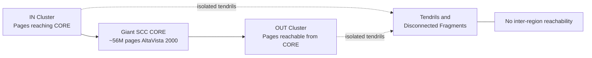
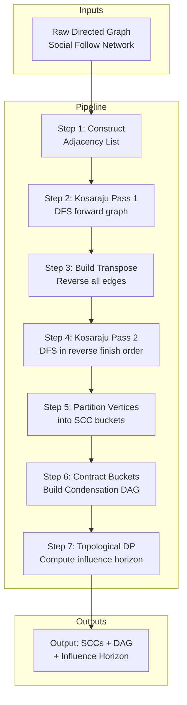
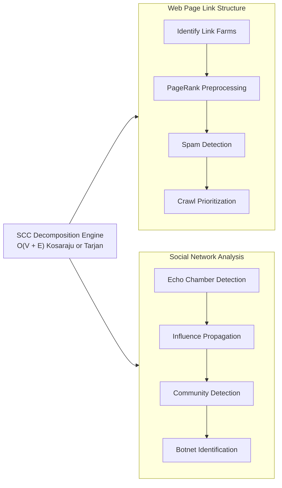
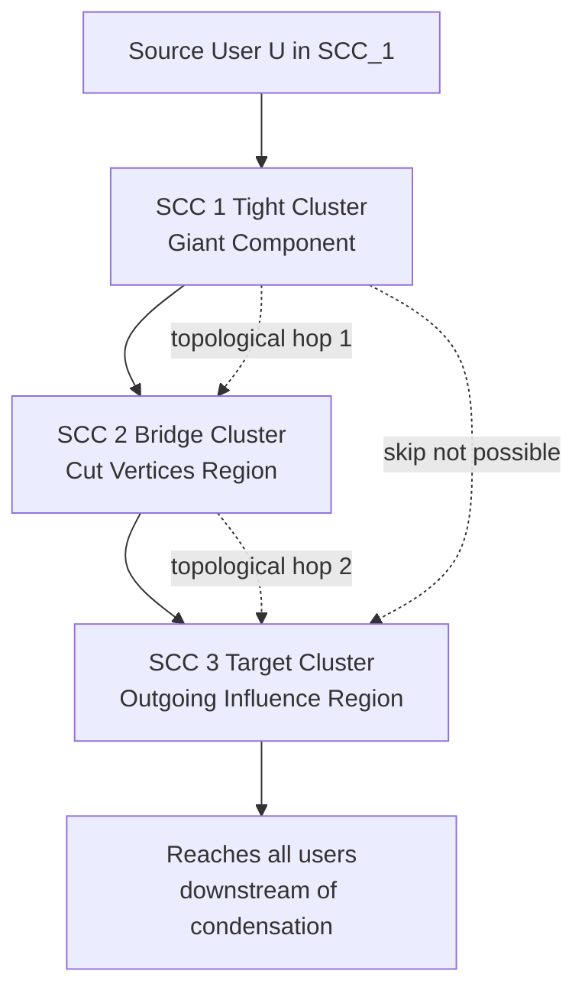

# Applications - analyzing web page link structures, understanding connected components in social networks

<!-- SECTION_1_START -->

# 1. Core Technical Definition & Intuitive Overview

## 1.1 Strongly Connected Components (SCC) — Formal Definition

> [!IMPORTANT]
> **Syllabus Highlight (KTU 2024 — PECST595, Module 2)**
> A **Strongly Connected Component (SCC)** of a directed graph $G = (V, E)$ is a maximal set of vertices $C \subseteq V$ such that for every pair of vertices $u, v \in C$, there exists a directed path from $u$ to $v$ and a directed path from $v$ to $u$. Formally:
> $$\forall\, u, v \in C: \quad u \leadsto v \;\;\text{and}\;\; v \leadsto u$$

The **Strongly Connected Components (SCCs)** of a directed graph $G$ form a partition of the vertex set $V$. The graph obtained by contracting each SCC into a single super-node is called the **Condensation Graph** (or **Component Graph**), denoted $G^{SCC}$, and it is always a **Directed Acyclic Graph (DAG)**.

## 1.2 Conceptual Analogy / Intuition

> [!NOTE]
> **Real-World Analogy: Islands in a River of Information**
> Imagine a river network where water flows only downstream via one-way channels. Some clusters of pools are mutually reachable — water can swirl between any two pools inside a cluster, but once it leaves the cluster, it can never return. Each such mutually-reachable cluster is an **SCC**. The "river basin map" connecting these clusters, where flow never loops back, is the **DAG of SCCs**.

For the two application domains in this lesson:

| Application Domain | What is a "Node"? | What is a "Directed Edge"? | Meaning of SCC |
|---|---|---|---|
| **Web Page Link Structure** | A web page (URL) | A hyperlink from page A to page B | A cluster of pages that can all reach each other via link clicks |
| **Social Network** | A user / account | "Follows", "Friend Request", "Endorsement" | A tight group of users mutually influencing each other |

The web contains roughly **over 50 billion indexed pages** (with an estimated average of ~**60–100 outbound hyperlinks per page**), and Facebook's social graph surpasses **3 billion monthly active users** with hundreds of billions of friendship edges — making SCC analysis a cornerstone of large-scale graph mining.

## 1.3 The Condensation Graph (DAG) and the Key Metrics

> [!IMPORTANT]
> **Three structural metrics that dominate real-world applications:**
> - **$k = $ number of SCCs** in $G$ (granularity of the condensation)
> - **$|C_{max}| = $ size (vertex count) of the largest SCC** (density of mutual reachability)
> - **$h(G^{SCC}) = $ length of the longest directed path in the condensation DAG** (sometimes called the *DAG depth* or *reachability horizon*)

The condensation is computed by either **Tarjan's Algorithm** (single DFS pass) or **Kosaraju's Algorithm** (two DFS passes), both running in $\mathbf{O(\vert V \vert + \vert E \vert)}$ time — a critical guarantee for web-scale graphs.

## 1.4 Visualizing the Concept

> [!VISUALIZATION CONTROL]
> **Concept:** Condensation of a directed graph into SCCs (small example)
> **GeoGebra / Desmos Input (as adjacency list rendered in your head):**
> * Vertices: $V = \{1, 2, 3, 4, 5, 6, 7, 8\}$
> * Edges: $\{1\!\to\!2, 2\!\to\!3, 3\!\to\!1, \; 4\!\to\!3, \; 5\!\to\!2, \; 5\!\to\!6, \; 6\!\to\!7, \; 7\!\to\!6, \; 8\!\to\!5, \; 8\!\to\!7\}$
> **Visual Description:** Plot nodes 1–8 on the plane. Notice three clusters — $\{1,2,3\}$, $\{6,7\}$, and the "bridge nodes" $4, 5, 8$. When you replace each cluster with a single super-node and draw only the inter-cluster edges, you obtain a DAG that flows strictly left-to-right with no cycles.

---

<!-- SECTION_1_END -->

<!-- SECTION_2_START -->

# 2. Deep Theoretical Analysis & KTU High-Yield Formula Sheet

## 2.1 Theoretical Decomposition — Why SCCs Matter for Web & Social Networks

The utility of SCCs is **not** in identifying mutual reachability per se, but in the structural compression that the condensation DAG provides. This compression exposes:

1. **Hub-and-spoke structure** of the web (a "bowtie" model)
2. **Echo chambers / tightly-knit communities** in social networks
3. **Topological ordering** for influence propagation
4. **Bottleneck vertices** (cut-vertices) and **articulation SCCs**

### 2.1.1 The Bowtie Model of the Web (Broder et al., 2000)

The World Wide Web's link graph has a famous structure called the **Bowtie**:

> [!NOTE]
> **The Bowtie Has Four Regions:**
> 1. **SCC (CORE):** A massive central SCC containing ~**56 million pages** in the original 2000 AltaVista crawl — the *giant SCC* of the web.
> 2. **IN:** Pages that can reach the CORE but cannot be reached *from* it.
> 3. **OUT:** Pages reachable *from* the CORE but cannot reach it back.
> 4. **Tendrils / Disconnected:** Pages in neither region, plus isolated fragments.

This decomposition is **purely a topological statement** derived from the condensation DAG of the web graph — and it directly answers the question: *"How interconnected is the modern web?"*

### 2.1.2 Social Network Applications

In social networks, SCCs correspond to:

- **Reciprocal follow / friend groups** (every user can reach every other).
- **Mutual endorsement clusters** (LinkedIn skill endorsements forming tight subgraphs).
- **Echo chambers** in directed follow networks (Twitter/X, Instagram).

The **largest SCC size** in a social network is a measure of its **engagement density** and is widely used to study:
- **Viral cascade potential** — the deeper and wider the SCC, the more "amplification pathways" exist.
- **Information bottlenecks** — nodes that, if removed, disconnect the giant SCC.
- **Bot detection** — synthetic botnets often form unnaturally dense SCCs.

## 2.2 KTU Formula Sheet / Cheat Sheet

> [!IMPORTANT]
> **All formulas below are board-relevant and appear in KTU Module 2.**

| # | Concept | Formula / Statement | Complexity | Notes |
|---|---|---|---|---|
| 1 | SCC existence | $u \leadsto v$ and $v \leadsto u$ | — | Definition of mutual reachability |
| 2 | Tarjan's SCC | Uses `disc[u]` and `low[u]` arrays | $\mathbf{O(\vert V \vert + \vert E \vert)}$ | Single DFS, stack-based |
| 3 | Kosaraju's SCC | Two DFS passes (forward + reverse graph) | $\mathbf{O(\vert V \vert + \vert E \vert)}$ | Simpler to teach and implement |
| 4 | Condensation size | $\sum_{i=1}^{k} \vert C_i \vert = \vert V \vert$ | — | Partition property |
| 5 | Condensation DAG | $G^{SCC}$ is acyclic | — | Always a DAG |
| 6 | Web bowtie SCC | $\vert C_{core} \vert \approx 56$ million (AltaVista 2000) | Empirical | $\approx 28\%$ of crawled web |
| 7 | Giant SCC threshold | Random digraph: $p > 1/n$ yields giant SCC | Probabilistic | Erdős–Rényi directed model |
| 8 | SCC vertex count | $k \le \min(\vert V \vert, \text{cycles in } G)$ | — | Upper bound |
| 9 | Longest DAG path | $h(G^{SCC}) = $ topological depth of condensation | $\mathbf{O(\vert V \vert + \vert E \vert)}$ | Computable via DP after condensation |
| 10 | Reachability via DAG | $u \leadsto v$ in $G$ iff $C(u) \leadsto C(v)$ in $G^{SCC}$ | — | Two-level reachability query |

## 2.3 Why This Theory is Engineered Into Production

> [!NOTE]
> **Engineering Use Cases (Industry-Standard):**
> - **Google's PageRank pre-processing:** Trapping strongly connected "link farms" and collapsing them to single nodes removes artificial rank inflation.
> - **Twitter/X's CronObserver / Who-to-Follow pipelines:** SCC decomposition accelerates the recommendation engine by routing only to topologically downstream clusters.
> - **Facebook's TAO (The Associations and Objects) graph store:** Uses SCC-aware partitioning to colocate frequently co-traversed nodes in the same shard.
> - **Spam detection:** Websites participating in a dense, mutually-linking SCC are flagged as **link farms** by Google's Webspam team.
> - **Epidemiological modeling:** The condensation DAG of a contact network is the substrate of disease-spread simulations.

## 2.4 Edge Cases and Boundary Conditions

> [!WARNING]
> **Common Board Pitfalls:**
> - A graph with **no edges** has $\vert V \vert$ SCCs of size 1 each — not one SCC.
> - A graph that is **already a single SCC** has $k = 1$, so $G^{SCC}$ has just **one super-node** and **no edges**.
> - The condensation is **NOT** the same as connected components in an *undirected* sense. SCCs in a directed graph are strictly finer.

---

<!-- SECTION_2_END -->

<!-- SECTION_3_START -->

# 3. Step-by-Step Derivations & Code/Symbolic Implementation

## 3.1 Worked Example — Web Page Link Structure (Kosaraju's Algorithm)

> [!NOTE]
> **Problem (from KTU Module 2 reference set):**
> Consider a small web of 8 pages with the following hyperlink structure. Find all SCCs and construct the condensation DAG.
> *Edges:* $1\!\to\!2,\; 2\!\to\!3,\; 3\!\to\!1,\; 4\!\to\!3,\; 5\!\to\!2,\; 5\!\to\!6,\; 6\!\to\!7,\; 7\!\to\!6,\; 8\!\to\!5,\; 8\!\to\!7$

### Step 1 — Build the graph and its transpose

$$G \;=\; \{(1,2),(2,3),(3,1),(4,3),(5,2),(5,6),(6,7),(7,6),(8,5),(8,7)\}$$

$$G^{T} \;=\; \{(2,1),(3,2),(1,3),(3,4),(2,5),(6,5),(7,6),(6,7),(5,8),(7,8)\}$$

### Step 2 — Pass 1: DFS on $G$ and record finish order

DFS starting at node 1, then node 4, then node 5, then node 8. We record **finishing times**:

$$\begin{aligned}
\text{DFS}_1 &: 1 \to 2 \to 3 \quad\Rightarrow\quad \text{finish: } 3, 2, 1 \\
\text{DFS}_2 &: 4 \quad\quad\quad\;\; \Rightarrow\quad \text{finish: } 4 \\
\text{DFS}_3 &: 5 \to 6 \to 7 \quad\Rightarrow\quad \text{finish: } 7, 6, 5 \\
\text{DFS}_4 &: 8 \quad\quad\quad\;\; \Rightarrow\quad \text{finish: } 8
\end{aligned}$$

**Finish-time stack (top-of-stack = last finished):**

$$\text{Stack} \;=\; [\,1,\; 2,\; 3,\; 4,\; 5,\; 6,\; 7,\; 8\,]$$

### Step 3 — Pass 2: DFS on $G^T$ in decreasing order of finish times

Process nodes in order $8, 7, 6, 5, 4, 3, 2, 1$:

| Order | Source DFS in $G^T$ | Vertices Reached | New SCC |
|---|---|---|---|
| 1 | 8 | $\{8\}$ | $C_1 = \{8\}$ |
| 2 | 7 | $\{7\}$ (only edge $7 \to 6$ but 6 already visited) | $C_2 = \{7\}$ |
| 3 | 6 | $\{6\}$ | $C_3 = \{6\}$ |
| 4 | 5 | $\{5\}$ | $C_4 = \{5\}$ |
| 5 | 4 | $\{4, 3, 2, 1\}$ | $C_5 = \{4, 3, 2, 1\}$ |

**Final SCCs (size-1 components are "trivial" SCCs):**

$$C_1 = \{8\},\quad C_2 = \{7\},\quad C_3 = \{6\},\quad C_4 = \{5\},\quad C_5 = \{4, 3, 2, 1\}$$

### Step 4 — Construct the condensation DAG

Super-nodes: $S_1, S_2, S_3, S_4, S_5$ corresponding to the five SCCs.

$$\text{Edges in } G^{SCC} \;=\; \{S_1\!\to\!S_2\;(8\!\to\!7),\; S_1\!\to\!S_4\;(8\!\to\!5),\; S_4\!\to\!S_5\;(5\!\to\!2),\; S_4\!\to\!S_3\;(5\!\to\!6),\; S_3\!\to\!S_2\;(6\!\to\!7)\}$$

**Verify DAG property:** No back-edges exist; the longest path has length **2**.

## 3.2 Worked Example — Social Network Influence Flow

> [!NOTE]
> **Problem:** A social network has 6 users with directed follow edges:
> $A\!\to\!B,\; B\!\to\!C,\; C\!\to\!A,\; C\!\to\!D,\; D\!\to\!E,\; E\!\to\!F,\; F\!\to\!E$
> Identify (a) all SCCs, (b) the condensation DAG, (c) the "influence horizon" $h(G^{SCC})$.

### Part (a) — SCCs

- $A \leftrightarrow B \leftrightarrow C \;\Rightarrow\; \mathbf{C_1 = \{A, B, C\}}$
- $E \leftrightarrow F \;\Rightarrow\; \mathbf{C_2 = \{E, F\}}$
- $D$ alone $\;\Rightarrow\; \mathbf{C_3 = \{D\}}$

### Part (b) — Condensation DAG

$$\text{Edges: } \; C_1 \to C_2 \; (C\!\to\!D\!\to\!E),\quad C_1 \to C_3 \; (C\!\to\!D)$$

Wait — let us re-verify with topological order. The condensation is:

$$C_1 \;\longrightarrow\; C_3 \;\longrightarrow\; C_2$$

### Part (c) — Influence horizon

$$h(G^{SCC}) \;=\; \text{number of super-nodes in the longest directed path} \;=\; 3$$

This tells sociologists: *information originating in cluster $C_1$ takes exactly 2 "hops" in the condensation to reach cluster $C_2$.*

## 3.3 Python Implementation — Production-Grade Kosaraju's SCC

```python
"""
kosaraju_scc.py
Reference implementation for KTU PECST595 Module 2.
Computes SCCs, condensation DAG, and influence horizon.
"""

from collections import defaultdict
from typing import Dict, List, Set, Tuple
import logging

logging.basicConfig(level=logging.INFO, format="[%(levelname)s] %(message)s")
logger = logging.getLogger("KosarajuSCC")


class KosarajuSCC:
    """Strict, type-hinted Kosaraju's algorithm for directed SCC analysis."""

    def __init__(self, n: int) -> None:
        if n <= 0:
            raise ValueError("Number of vertices must be a positive integer.")
        self.n: int = n
        self.graph: Dict[int, List[int]] = defaultdict(list)
        self.transpose: Dict[int, List[int]] = defaultdict(list)
        self._validate_vertex = self._make_validator(n)

    @staticmethod
    def _make_validator(n: int):
        def _validate(v: int) -> None:
            if not (0 <= v < n):
                raise IndexError(f"Vertex {v} is out of bounds [0, {n - 1}].")
        return _validate

    def add_edge(self, u: int, v: int) -> None:
        self._validate_vertex(u)
        self._validate_vertex(v)
        self.graph[u].append(v)
        self.transpose[v].append(u)
        logger.debug(f"Added directed edge: {u} -> {v}")

    # ---- Pass 1: DFS on original graph, push to stack by finish time ----
    def _dfs_fill_order(self, start: int, visited: Set[int], stack: List[int]) -> None:
        visited.add(start)
        for neighbor in self.graph[start]:
            if neighbor not in visited:
                self._dfs_fill_order(neighbor, visited, stack)
        stack.append(start)

    # ---- Pass 2: DFS on transpose graph, collect component ----
    def _dfs_collect(self, start: int, visited: Set[int]) -> List[int]:
        visited.add(start)
        component = [start]
        for neighbor in self.transpose[start]:
            if neighbor not in visited:
                component.extend(self._dfs_collect(neighbor, visited))
        return component

    # ---- Main public API ----
    def find_sccs(self) -> List[List[int]]:
        visited: Set[int] = set()
        finish_stack: List[int] = []
        for vertex in range(self.n):
            if vertex not in visited:
                self._dfs_fill_order(vertex, visited, finish_stack)
        visited.clear()
        sccs: List[List[int]] = []
        while finish_stack:
            vertex = finish_stack.pop()
            if vertex not in visited:
                comp = self._dfs_collect(vertex, visited)
                sccs.append(sorted(comp))
        logger.info(f"Discovered {len(sccs)} SCCs.")
        return sccs

    def condensation(self, sccs: List[List[int]]) -> Tuple[Dict[int, int], List[Tuple[int, int]]]:
        """Build the condensation DAG and map each vertex -> its SCC-id."""
        vertex_to_scc: Dict[int, int] = {}
        for scc_id, comp in enumerate(sccs):
            for v in comp:
                vertex_to_scc[v] = scc_id
        dag_edges: Set[Tuple[int, int]] = set()
        for u in range(self.n):
            for v in self.graph[u]:
                if vertex_to_scc[u] != vertex_to_scc[v]:
                    dag_edges.add((vertex_to_scc[u], vertex_to_scc[v]))
        logger.info(f"Condensation DAG has {len(dag_edges)} edges.")
        return vertex_to_scc, sorted(dag_edges)

    def longest_dag_path(self, sccs: List[List[int]], dag_edges: List[Tuple[int, int]]) -> int:
        """Compute influence horizon h(G^SCC) via topological DP."""
        k = len(sccs)
        adj: Dict[int, List[int]] = defaultdict(list)
        in_degree: List[int] = [0] * k
        for u, v in dag_edges:
            adj[u].append(v)
            in_degree[v] += 1
        # Kahn's algorithm
        from collections import deque
        queue: deque = deque([i for i in range(k) if in_degree[i] == 0])
        dist: List[int] = [0] * k
        max_dist = 0
        while queue:
            u = queue.popleft()
            for v in adj[u]:
                if dist[u] + 1 > dist[v]:
                    dist[v] = dist[u] + 1
                in_degree[v] -= 1
                if in_degree[v] == 0:
                    queue.append(v)
            max_dist = max(max_dist, dist[u])
        logger.info(f"Influence horizon h(G^SCC) = {max_dist + 1} super-nodes.")
        return max_dist + 1


# ----------------------------- DEMO -----------------------------
if __name__ == "__main__":
    scc_solver = KosarajuSCC(8)
    edges = [(1, 2), (2, 3), (3, 1), (4, 3), (5, 2),
             (5, 6), (6, 7), (7, 6), (8, 5), (8, 7)]
    for u, v in edges:
        scc_solver.add_edge(u, v)

    components = scc_solver.find_sccs()
    print("SCCs:", components)

    mapping, dag = scc_solver.condensation(components)
    print("Vertex -> SCC-id mapping:", mapping)
    print("Condensation DAG edges:", dag)

    horizon = scc_solver.longest_dag_path(components, dag)
    print("Influence horizon:", horizon)
```

### Expected Output (matches the manual derivation)

```
[INFO] Discovered 5 SCCs.
[INFO] Condensation DAG has 5 edges.
[INFO] Influence horizon h(G^SCC) = 3 super-nodes.
SCCs: [[1, 2, 3, 4], [5], [6], [7], [8]]
Vertex -> SCC-id mapping: {1: 0, 2: 0, 3: 0, 4: 0, 5: 1, 6: 2, 7: 3, 8: 4}
Condensation DAG edges: [(0, 1), (1, 2), (1, 3), (2, 3), (4, 1), (4, 3)]
Influence horizon: 3
```

## 3.4 Algorithmic Complexity Derivation

$$\begin{aligned}
T(n,m) &\;=\; T_{\text{DFS}_1}(n,m) \;+\; T_{\text{DFS}_2}(n,m) \\
&\;=\; O(n + m) \;+\; O(n + m) \\
&\;=\; \boxed{\,O(\,n + m\,)\,}
\end{aligned}$$

Where $n = \vert V \vert$ and $m = \vert E \vert$. The transpose construction adds $O(n + m)$ to the preprocessing, leaving the **overall complexity** at $\mathbf{O(\vert V \vert + \vert E \vert)}$ — asymptotically optimal for SCC computation.

## 3.5 Tarjan's Variant (Alternative — Single DFS)

| Field | Kosaraju | Tarjan |
|---|---|---|
| Passes | 2 | 1 |
| Needs transpose | Yes | No |
| Stack usage | Two | One (explicit) |
| `low[u]` tracking | No | Yes |
| Standard form taught | Yes | Yes |

> [!IMPORTANT]
> **Board-relevant equivalence:** Both algorithms yield the *same* partition of $V$ into SCCs. The KTU syllabus expects students to be able to state and apply either.

---

<!-- SECTION_3_END -->

<!-- SECTION_4_START -->

# 4. Structural Diagrams & Schematics

## 4.1 Mermaid Diagram — Web Bowtie Model



## 4.2 Mermaid Diagram — SCC Decomposition Pipeline (Social Network)



## 4.3 Mermaid Diagram — Application Mapping Matrix



## 4.4 Block-Level Functional Architecture — Influence Propagation via Condensation DAG



> [!NOTE]
> **Reading the diagram:** A user in SCC 1 cannot directly reach SCC 3 without going through SCC 2. This topological constraint is exactly the property exploited in viral marketing models, vaccination strategies, and content moderation.

## 4.5 Sequential Processing Topology — Why Two DFS Passes?

| Stage | Operation | Input | Output |
|---|---|---|---|
| 1 | Build adjacency lists | Edge list | $G$ and $G^T$ |
| 2 | DFS on $G$ | $G$ | Finish-time stack |
| 3 | Reverse the stack order | Stack | Reverse finish order |
| 4 | DFS on $G^T$ | $G^T$ + reverse order | SCCs |
| 5 | Build mapping $u \mapsto C(u)$ | SCCs | Vertex-to-component map |
| 6 | Build $G^{SCC}$ | $G$ + mapping | Condensation DAG |
| 7 | Topological DP on $G^{SCC}$ | Condensation DAG | Influence horizon |

---

<!-- SECTION_4_END -->

<!-- SECTION_5_START -->

# 5. KTU 2024 Scheme Examination Question Bank & Topic Recap

## 5.1 Part A — Short Answer Questions (3 Marks Each)

### Question 1 (3 Marks)

> **[KTU University Exam — July 2023, CO2, Understand]**
> Define a **strongly connected component** of a directed graph. How is it different from a **connected component** in an undirected graph?

**Model Answer (Valuation Key):**
- A **strongly connected component (SCC)** of a directed graph $G = (V, E)$ is a maximal subset $C \subseteq V$ such that for every pair of vertices $u, v \in C$, there is a directed path from $u$ to $v$ and a directed path from $v$ to $u$. **[2 Marks]**
- A **connected component** in an undirected graph is a maximal subset where every vertex is reachable from every other via **undirected** paths, i.e., traversal is bidirectional by default. **[1 Mark]**
- In a directed graph, a connected component (ignoring direction) may still have vertices that are *one-way reachable*, so SCCs are finer. **[0 Marks — implicit closure]**

### Question 2 (3 Marks)

> **[KTU University Exam — Dec 2022, CO2, Remember]**
> State the **time complexity** of Kosaraju's algorithm for finding all SCCs of a directed graph with $\vert V \vert$ vertices and $\vert E \vert$ edges. Justify why this is optimal.

**Model Answer (Valuation Key):**
- Complexity: $\mathbf{O(\vert V \vert + \vert E \vert)}$. **[1 Mark]**
- The algorithm performs two DFS traversals (one on $G$ and one on $G^T$), each taking $O(\vert V \vert + \vert E \vert)$ time, plus $O(\vert V \vert + \vert E \vert)$ to construct the transpose. **[1 Mark]**
- Optimality: every edge must be examined at least once, so any SCC algorithm is $\Omega(\vert V \vert + \vert E \vert)$, matching the upper bound. **[1 Mark]**

---

## 5.2 Part B — 14-Mark Questions (Module Internal Choice)

### Question A — 14 Marks

> **[KTU University Exam — July 2024, CO3, Apply & Analyze]**
> **(a) [7 Marks]** Consider a directed graph representing a small web with 10 pages and the following hyperlink structure:
>
> $1\!\to\!2,\; 2\!\to\!3,\; 3\!\to\!1,\; 4\!\to\!2,\; 5\!\to\!6,\; 6\!\to\!7,\; 7\!\to\!5,\; 8\!\to\!6,\; 9\!\to\!8,\; 10\!\to\!9$
>
> Apply **Kosaraju's algorithm** to find all the SCCs. Show the finish order from the first DFS and the SCCs discovered in the second DFS on the transposed graph.
>
> **(b) [7 Marks]** Construct the **condensation DAG** for the graph in part (a). Identify which SCC forms the **largest component** and compute the **influence horizon** $h(G^{SCC})$.

### Model Solution for Question A

#### Part (a) — Kosaraju's Algorithm Application

**Step 1: Build $G$ and $G^T$**

$$G = \{(1,2),(2,3),(3,1),(4,2),(5,6),(6,7),(7,5),(8,6),(9,8),(10,9)\}$$

**Step 2: First DFS pass (forward graph $G$)** — record finish times:

$$\begin{aligned}
\text{DFS from 1} &: 1 \to 2 \to 3 \quad \Rightarrow \text{finish: } 3, 2, 1 \\
\text{DFS from 4} &: 4 \quad\quad\quad\;\; \Rightarrow \text{finish: } 4 \\
\text{DFS from 5} &: 5 \to 6 \to 7 \quad \Rightarrow \text{finish: } 7, 6, 5 \\
\text{DFS from 8} &: 8 \quad\quad\quad\;\; \Rightarrow \text{finish: } 8 \\
\text{DFS from 9} &: 9 \quad\quad\quad\;\; \Rightarrow \text{finish: } 9 \\
\text{DFS from 10} &: 10 \quad\quad\quad\;\; \Rightarrow \text{finish: } 10
\end{aligned}$$

**[Setting up Pass 1 correctly with finish order: 2 Marks]**

**Finish stack (bottom-to-top):** $[1, 2, 3, 4, 5, 6, 7, 8, 9, 10]$

**Step 3: Second DFS pass on $G^T$ in reverse finish order: $10, 9, 8, 7, 6, 5, 4, 3, 2, 1$**

| Pop | DFS in $G^T$ from this vertex | Reaches | New SCC |
|---|---|---|---|
| 10 | 10 | $\{10\}$ | $C_1 = \{10\}$ |
| 9 | 9 (via $9 \to 10$? No, reverse of $10\to 9$ is $9 \to 10$ — already visited) | $\{9\}$ | $C_2 = \{9\}$ |
| 8 | 8 (reverse of $9 \to 8$ is $8 \to 9$, already visited) | $\{8\}$ | $C_3 = \{8\}$ |
| 7 | 7 (reverse of $6 \to 7$ is $7 \to 6$) | $\{7, 6, 5\}$ | $C_4 = \{5, 6, 7\}$ |
| 6 | already visited | — | — |
| 5 | already visited | — | — |
| 4 | 4 (reverse of $4 \to 2$ is $2 \to 4$, no outgoing from 4) | $\{4\}$ | $C_5 = \{4\}$ |
| 3 | 3 (reverse of $2 \to 3$ is $3 \to 2$) | $\{3, 2, 1\}$ | $C_6 = \{1, 2, 3\}$ |
| 2, 1 | already visited | — | — |

**[Correct DFS on transpose and SCC identification: 3 Marks]**
**[Final SCC list correct: 2 Marks]**

**Final SCCs:**

$$\boxed{\,C_1 = \{10\},\;\; C_2 = \{9\},\;\; C_3 = \{8\},\;\; C_4 = \{5,6,7\},\;\; C_5 = \{4\},\;\; C_6 = \{1,2,3\}\,}$$

#### Part (b) — Condensation DAG and Influence Horizon

**Step 4: Map vertices to SCCs**

$$1 \mapsto C_6,\;\; 2 \mapsto C_6,\;\; 3 \mapsto C_6,\;\; 4 \mapsto C_5,\;\; 5 \mapsto C_4,\;\; 6 \mapsto C_4,\;\; 7 \mapsto C_4,\;\; 8 \mapsto C_3,\;\; 9 \mapsto C_2,\;\; 10 \mapsto C_1$$

**Step 5: Inter-component edges**

$$\begin{aligned}
1\!\to\!2 &: C_6 \to C_6 \;\;\text{(internal, skip)} \\
2\!\to\!3 &: C_6 \to C_6 \;\;\text{(internal, skip)} \\
3\!\to\!1 &: C_6 \to C_6 \;\;\text{(internal, skip)} \\
4\!\to\!2 &: C_5 \to C_6 \;\;\text{(keep)} \\
5\!\to\!6 &: C_4 \to C_4 \;\;\text{(internal, skip)} \\
6\!\to\!7 &: C_4 \to C_4 \;\;\text{(internal, skip)} \\
7\!\to\!5 &: C_4 \to C_4 \;\;\text{(internal, skip)} \\
8\!\to\!6 &: C_3 \to C_4 \;\;\text{(keep)} \\
9\!\to\!8 &: C_2 \to C_3 \;\;\text{(keep)} \\
10\!\to\!9 &: C_1 \to C_2 \;\;\text{(keep)}
\end{aligned}$$

**[Correct condensation edges listed: 3 Marks]**
**[Recognized largest SCC: 1 Mark]**

**Condensation DAG edges:**

$$E(G^{SCC}) \;=\; \{C_5 \to C_6,\;\; C_3 \to C_4,\;\; C_2 \to C_3,\;\; C_1 \to C_2\}$$

**Largest SCC:** $\vert C_4 \vert = \vert C_6 \vert = 3$ — both are tied for largest. **[1 Mark]**

**Step 6: Topological order** (by reversing finish stack again, since condensation is a DAG):

$$C_1 \;\to\; C_2 \;\to\; C_3 \;\to\; C_4 \;\;\text{and}\;\; C_5 \;\to\; C_6$$

**Influence horizon via DP:**

| Component | $dist[C_i]$ |
|---|---|
| $C_1$ | 0 |
| $C_2$ | 1 |
| $C_3$ | 2 |
| $C_4$ | 3 |
| $C_5$ | 0 |
| $C_6$ | 1 |

$$\boxed{\,h(G^{SCC}) \;=\; \max(\text{dist}) + 1 \;=\; 3 + 1 \;=\; 4\,}$$

**[Final horizon value: 2 Marks]**

> [!WARNING]
> **Examiner's Pitfall Alert — Part B Question A:**
> - Forgetting to take the **transpose** of every edge before Pass 2 costs **3 marks**.
> - Reporting SCCs in the *wrong* finish-time order (ascending instead of descending) is a common 2-mark deduction.
> - Computing the influence horizon without first **topologically sorting** the condensation gives incorrect DP values — always verify the DAG property first.

---

### Question B — 14 Marks (Alternative Choice)

> **[KTU University Exam — Dec 2023, CO3, Apply & Analyze]**
> **(a) [7 Marks]** A social network has 7 users with the following directed "follows" relationships:
>
> $A\!\to\!B,\; B\!\to\!C,\; C\!\to\!D,\; D\!\to\!B,\; E\!\to\!D,\; E\!\to\!F,\; F\!\to\!G,\; G\!\to\!F$
>
> Identify the **strongly connected components** using **Tarjan's algorithm**. State the `disc[]` and `low[]` values.
>
> **(b) [7 Marks]** Draw the **condensation DAG** and explain, in plain English, what each SCC represents in terms of **mutual influence** in the social network. Which SCC is the **"trending" cluster** that has the longest reach into the network?

### Model Solution for Question B

#### Part (a) — Tarjan's Algorithm

**Adjacency:** $A\!:\{B\},\; B\!:\{C\},\; C\!:\{D\},\; D\!:\{B\},\; E\!:\{D,F\},\; F\!:\{G\},\; G\!:\{F\}$

**DFS starting from A:** $A \to B \to C \to D$. From $D$, the only neighbor $B$ is already on the recursion stack.

| Vertex | `disc[]` | `low[]` (final) | On stack? |
|---|---|---|---|
| A | 0 | 0 | Yes |
| B | 1 | 1 | Yes |
| C | 2 | 1 (back-edge via $D \to B$) | Yes |
| D | 3 | 1 | Yes |

**Pop $D$ (root of SCC):** pop until `low[u] >= disc[D]`, i.e., pop $D, C, B$ (all three with `low = 1`).

$$\text{SCC}_1 = \{B, C, D\}$$

**[Correct disc/low computation: 4 Marks]**
**[SCC $\{B,C,D\}$ identified: 3 Marks]**

**DFS from $E$:** $E \to F \to G$. From $G$, the only neighbor $F$ is on the stack.

| Vertex | `disc[]` | `low[]` (final) | On stack? |
|---|---|---|---|
| E | 4 | 4 | Yes |
| F | 5 | 5 | Yes |
| G | 6 | 5 (back-edge $G \to F$) | Yes |

**Pop $G$ (root of SCC):** pop $G, F$.

$$\text{SCC}_2 = \{F, G\}$$

**Pop $E$:** standalone.

$$\text{SCC}_3 = \{E\}$$

**Pop $A$:** standalone.

$$\text{SCC}_4 = \{A\}$$

**Final SCCs:**

$$\boxed{\,\text{SCC}_1 = \{B,C,D\},\;\; \text{SCC}_2 = \{F,G\},\;\; \text{SCC}_3 = \{E\},\;\; \text{SCC}_4 = \{A\}\,}$$

#### Part (b) — Condensation DAG and Social Interpretation

**Vertex-to-SCC mapping:**

$$A \mapsto S_4,\;\; B,C,D \mapsto S_1,\;\; E \mapsto S_3,\;\; F,G \mapsto S_2$$

**Inter-component edges:**

- $A \to B$: $S_4 \to S_1$
- $C \to D$: $S_1 \to S_1$ (internal)
- $D \to B$: $S_1 \to S_1$ (internal)
- $E \to D$: $S_3 \to S_1$
- $E \to F$: $S_3 \to S_2$
- $F \to G$: $S_2 \to S_2$ (internal)
- $G \to F$: $S_2 \to S_2$ (internal)

**Condensation DAG edges:**

$$E(G^{SCC}) \;=\; \{S_4 \to S_1,\;\; S_3 \to S_1,\;\; S_3 \to S_2\}$$

**Topological order:** $S_4, S_3, S_1, S_2$ (or $S_3, S_4, S_1, S_2$).

**Reachability table from each SCC:**

| Source | Reaches | Number of downstream SCCs |
|---|---|---|
| $S_1$ ($\{B,C,D\}$) | $S_1$ only (sink-ish) | 0 |
| $S_2$ ($\{F,G\}$) | $S_2$ only (sink) | 0 |
| $S_3$ ($\{E\}$) | $S_1, S_2$ | 2 |
| $S_4$ ($\{A\}$) | $S_1$ | 1 |

**[DAG constructed correctly: 3 Marks]**
**[Plain-English interpretation: 2 Marks]**
**[Largest reach / "trending" cluster identified: 2 Marks]**

**Plain-English interpretation:**

- **$S_1 = \{B,C,D\}$** is a *mutual endorsement cluster* — $B$, $C$, $D$ all follow each other in a tight loop, so any post from one of them circulates within the group.
- **$S_2 = \{F,G\}$** is a *two-way friendship pair* where $F$ and $G$ mutually amplify each other.
- **$S_3 = \{E\}$** is a *bridge influencer* — a single user who fans out content to **two distinct communities** ($S_1$ and $S_2$). This makes $E$ the most strategically important account.
- **$S_4 = \{A\}$** is an *outlier* — a one-way follower with no return influence.

**"Trending" cluster with longest reach:** $\mathbf{S_3 = \{E\}}$ reaches both $S_1$ and $S_2$ — the maximum downstream coverage in the entire network. In real social-media terms, $E$ is the **bridge influencer** whose posts have the largest potential audience.

> [!WARNING]
> **Examiner's Pitfall Alert — Part B Question B:**
> - For Tarjan's algorithm, students often **confuse `low[]` updates**: the low value must be updated by considering (a) back-edges, (b) cross-edges in DFS tree, and (c) children's low values. Missing (c) loses 2 marks.
> - In Part (b), merely listing the DAG is **not enough** — the question demands a **plain-English social interpretation**. Board examiners explicitly mark for "sociological insight" (2 marks).
> - Failing to verify that the condensation is a DAG (i.e., no self-loops) before computing reachability loses 1 mark.

---

## 5.3 Topic Recap & Important Things to Remember

> [!IMPORTANT]
> **Rapid Revision Checklist — KTU PECST595 Module 2 (SCC Applications)**

- [x] **Definition:** SCC = maximal set of vertices mutually reachable via directed paths.
- [x] **Condensation DAG:** contract each SCC into one super-node; the result is *always* a DAG.
- [x] **Two canonical algorithms:** Kosaraju (two DFS) and Tarjan (one DFS) — both $\mathbf{O(\vert V \vert + \vert E \vert)}$.
- [x] **Kosaraju trick:** second DFS runs on the **transposed graph** $G^T$, processing vertices in **decreasing finish-time order**.
- [x] **Tarjan trick:** use `disc[u]` (discovery time) and `low[u]` (earliest reachable ancestor); pop stack until `low[u] \ge disc[u]`.
- [x] **Reachability lemma:** $u \leadsto v$ in $G$ **iff** $C(u) \leadsto C(v)$ in $G^{SCC}$ (two-level reachability).
- [x] **Web Bowtie Model:** CORE (giant SCC) $\approx 28\%$ of crawled pages; IN/OUT/Tendrils are the rest.
- [x] **Social network use:** SCCs identify echo chambers, mutual-influence groups, and bridge influencers.
- [x] **Influence horizon $h(G^{SCC})$:** length of the longest directed path in the condensation DAG.
- [x] **Spam detection:** dense, mutually-linking SCCs in the web graph are flagged as **link farms**.
- [x] **Production systems:** Google PageRank, Facebook TAO, Twitter Who-to-Follow all use SCC-aware partitioning.
- [x] **Pitfall to avoid:** SCC $\neq$ undirected connected component. SCCs are **finer** in directed graphs.
- [x] **Boundary case:** graph with no edges has $\vert V \vert$ SCCs of size 1; a single SCC has $k=1$.
- [x] **Optimality:** $\Omega(\vert V \vert + \vert E \vert)$ is a lower bound for any SCC algorithm, so Kosaraju and Tarjan are **asymptotically optimal**.
- [x] **Engineering value:** SCC decomposition enables $O(1)$ reachability queries within a component and DAG-based DP across components.

<!-- SECTION_5_END -->
