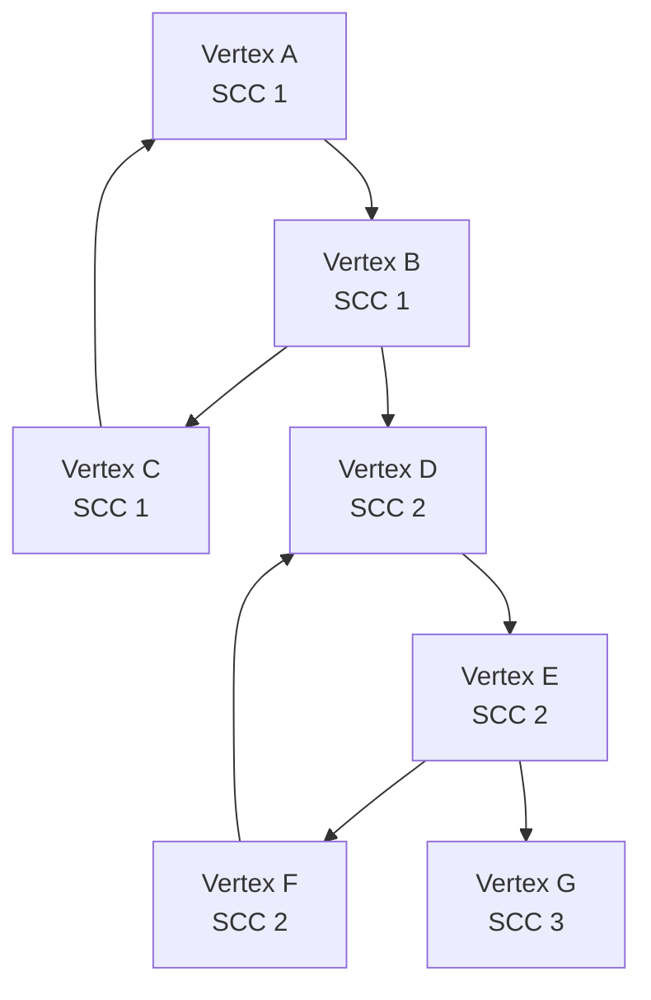
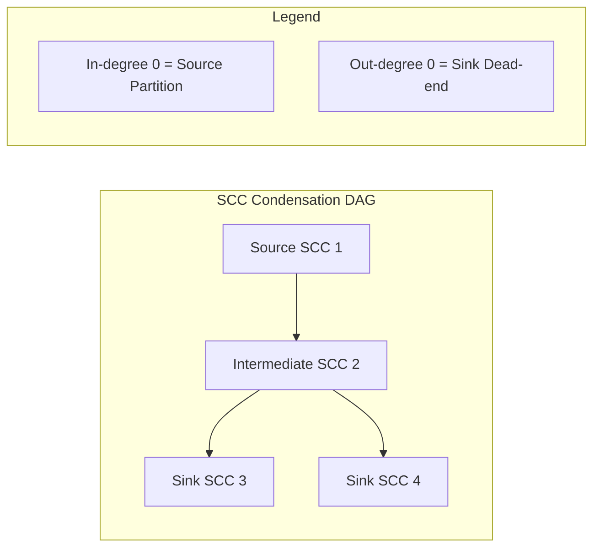
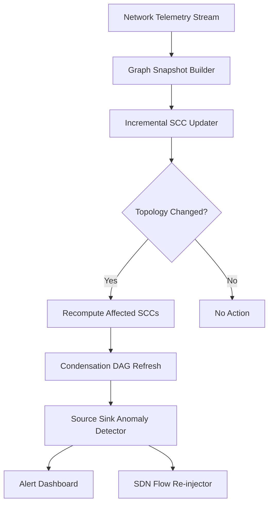
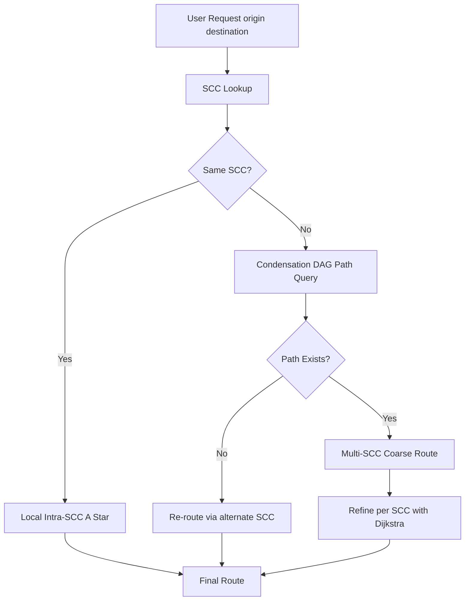
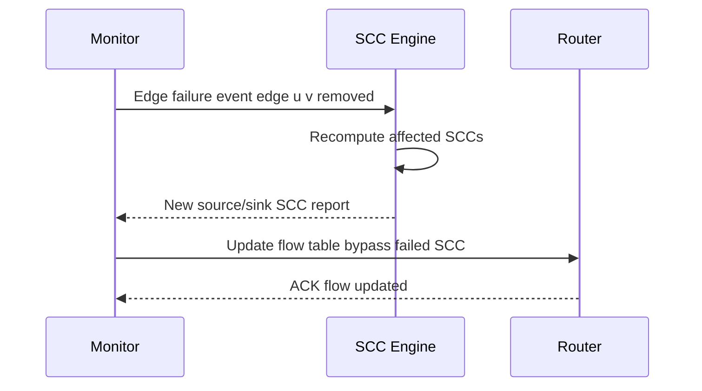
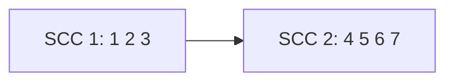
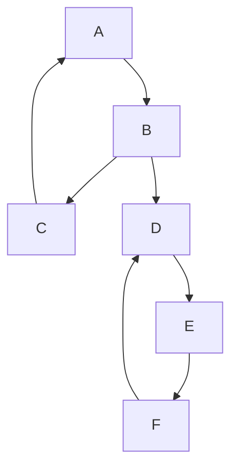

# Applications - real-time network monitoring, dynamic route planning

<!-- SECTION_1_START -->
# Module 2 — Strongly Connected Components: Applications in Real-Time Network Monitoring & Dynamic Route Planning

> [!NOTE]
> **Syllabus Anchor (KTU 2024 Scheme — PECST595):** This section extends the foundational theory of Strongly Connected Components (SCC) toward two high-impact engineering domains — *real-time network monitoring* (used in ISP backbones, SDN controllers, and intrusion detection) and *dynamic route planning* (used in autonomous navigation, traffic management systems, and resilient logistics).

---

## 1. Core Technical Definition & Intuitive Overview

### 1.1 Formal Definition (KTU Board Standard)

A **Strongly Connected Component (SCC)** of a directed graph $G = (V, E)$ is a *maximal* subset $C \subseteq V$ such that for every pair of vertices $u, v \in C$, there exists a directed path from $u$ to $v$ **and** a directed path from $v$ to $u$. Formally,

$$
\forall u, v \in C : \quad u \rightsquigarrow v \ \wedge \ v \rightsquigarrow u
$$

The set of all SCCs forms a partition of $V$ and induces a **condensation graph** $G^{SCC} = (C, E^{SCC})$, which is always a **Directed Acyclic Graph (DAG)**. Each node in $G^{SCC}$ represents one SCC, and an edge $(C_i, C_j) \in E^{SCC}$ exists iff there is at least one edge in $E$ connecting a vertex of $C_i$ to a vertex of $C_j$.

> [!IMPORTANT]
> **KTU Board Definition (verbatim style):** A *strongly connected component* is a maximal subgraph in which every vertex is reachable from every other vertex. The condensation of a digraph into its SCCs always yields a DAG — this is the key property exploited in monitoring and route-planning applications.

### 1.2 Conceptual Analogy — The City Traffic Analogy

Imagine a **one-way road network** of a city:
- Inside a **small market complex**, you can drive from any shop to any other shop (entering, looping, exiting back to start). That complex is a **SCC**.
- Between different market complexes, you may only have **one-way connectors** (e.g., flyovers that flow only in one direction). These connectors form the edges of the **condensation DAG**.

> **Engineering Intuition:** If traffic enters a market complex (SCC), it can always find a way out and back — the SCC is a *self-contained traffic island*. The condensation DAG tells you the **flow-of-traffic** between islands. This is exactly what network engineers exploit in real-time monitoring and route planning.

### 1.3 The Two Application Domains

| Application Domain | Engineering System | Why SCC is Used |
|---|---|---|
| **Real-Time Network Monitoring** | ISP backbones, SDN controllers, Intrusion Detection Systems, Power-grid SCADA | Detecting *connectivity partitions*, identifying *single points of failure*, tracking *broadcast domains*, monitoring *BGP reachability changes* |
| **Dynamic Route Planning** | GPS navigators, autonomous vehicles, traffic-aware routing, public-transit systems | Identifying *dead-end streets*, finding *resilient alternate paths*, recognizing *one-way zones*, computing *reachability hubs* |

> [!NOTE]
> **SCC algorithms in use today:** Tarjan's algorithm (single-pass DFS, $O(|V|+|E|)$) is the workhorse used in production monitoring pipelines. **Online / Incremental SCC algorithms** (e.g., Bender et al., HKMST) are used when the graph changes continuously.

### 1.4 Visualization Control (GeoGebra / Desmos)

> [!VISUALIZATION CONTROL]
> **Concept:** Reachability matrix $R$ of a directed graph with SCCs highlighted
>
> **GeoGebra / Desmos Input (matrix visual):**
>
> | Matrix Element | Meaning |
> |---|---|
> | $R_{ij} = 1$ | Vertex $i$ can reach vertex $j$ via a directed path |
> | $R_{ij} = 0$ | No directed path from $i$ to $j$ |
>
> **Visual Description:** In the binary matrix $R$, each SCC appears as a *solid square of 1s along the diagonal* (vertices within the SCC reach each other). Off-diagonal 1s in the same row/column block reveal the *reachability structure* of the condensation DAG.

---

## 2. Deep Theoretical Analysis & KTU High-Yield Formula Sheet

### 2.1 Operational Foundations for the Applications

To apply SCCs to *real-time monitoring* and *dynamic routing*, the engineer must master five operational layers:

**Layer 1 — SCC Discovery:**
- Run Tarjan's or Kosaraju's algorithm on the current graph snapshot.
- Time complexity: $O(|V| + |E|)$ for static; $O(\alpha(n) \log n)$ amortized per update for online algorithms.

**Layer 2 — Condensation DAG Construction:**
- Collapse each SCC into a single meta-node.
- Eliminate parallel edges, retain reachability.
- The condensation DAG is acyclic $\Rightarrow$ admits a **topological order** $\tau : C \rightarrow \{1, 2, \ldots, k\}$.

**Layer 3 — Source & Sink Identification:**
- A **source SCC** has *in-degree zero* in the condensation DAG; no external path enters it.
- A **sink SCC** has *out-degree zero*; no path leaves it.
- These are the **critical chokepoints** for monitoring.

**Layer 4 — Reachability Queries:**
- Pre-compute transitive closure on the condensation DAG (using DP on topological order).
- Answer "can node $u$ reach node $v$?" in $O(1)$ after $O(k^2)$ preprocessing where $k = $ number of SCCs.

**Layer 5 — Dynamic Update Handling:**
- For *incremental* updates (edges added): only affected SCCs may merge.
- For *decremental* updates (edges removed): only affected SCCs may split.
- Production systems use **Holm-de Lichtenberg-Thorup (HLT)** or **Bender-Fineman-Gilbert-Tarjan (BFGT)** style online SCCs.

### 2.2 Real-Time Network Monitoring — Operational Mapping

| Monitoring Task | SCC-Based Solution |
|---|---|
| Detect network partition | A new source SCC appearing in the condensation DAG $\Rightarrow$ a partition has formed |
| Identify single points of failure | A source SCC of size 1 whose removal disconnects the network $\Rightarrow$ **articulation-by-SCC** |
| Track broadcast storms | Vertices in the same SCC share one broadcast domain — count SCCs that grow in size over time |
| Anomaly detection (DDoS) | A sudden sink SCC of abnormally large size $\Rightarrow$ traffic is being absorbed into a black hole |
| BGP / OSPF reachability | Compute $G^{SCC}$; if $G^{SCC}$ has multiple sources, the AS is partitioned |

> [!IMPORTANT]
> **Critical Engineering Insight:** The number of source SCCs in a directed network graph equals the **minimum number of monitoring probes** required to maintain full reachability awareness. This is a direct application of the *Minimum Path Cover* theorem on the condensation DAG.

### 2.3 Dynamic Route Planning — Operational Mapping

| Routing Task | SCC-Based Solution |
|---|---|
| Dead-end detection | Vertices not in any SCC of size $> 1$ are *strictly dead-ends* in a directed sense |
| Resilient path computation | Any path that crosses a sink SCC is a *terminating* route — useful for "last-mile" planning |
| Multi-hop planning with turn restrictions | A turn-restricted road network is a directed graph — SCCs identify zones of free movement |
| Dynamic re-routing on link failure | When an edge is removed, only the SCCs on the affected slice need recomputation (locality of update) |
| Traffic-aware navigation | The condensation DAG is used as a *coarse roadmap*; intra-SCC paths are computed with a local Dijkstra/A* |

### 2.4 KTU High-Yield Formula Sheet

> [!NOTE]
> All formulas below are **high-yield for KTU board problems** on this topic.

| # | Property / Quantity | Formula / Statement | Complexity |
|---|---|---|---|
| 1 | Reachability within SCC | $\forall u, v \in C_i : u \rightsquigarrow v \wedge v \rightsquigarrow u$ | $O(1)$ query after $O(\vert V \vert + \vert E \vert)$ preprocessing |
| 2 | Number of SCCs | $1 \leq \vert C \vert \leq \vert V \vert$ | — |
| 3 | Condensation DAG edges | $E^{SCC} = \{(C_i, C_j) : \exists (u,v) \in E \text{ with } u \in C_i, v \in C_j\}$ | $O(\vert E \vert)$ construction |
| 4 | Tarjan's algorithm time | $O(\vert V \vert + \vert E \vert)$ | Single DFS pass |
| 5 | Kosaraju's algorithm time | $O(\vert V \vert + \vert E \vert)$ | Two DFS passes |
| 6 | Topological order on $G^{SCC}$ | Computed via Kahn's or DFS in | $O(\vert C \vert + \vert E^{SCC} \vert)$ |
| 7 | Source SCCs | $C_i$ such that $\text{indeg}(C_i) = 0$ | Found in $O(\vert C \vert)$ |
| 8 | Sink SCCs | $C_i$ such that $\text{outdeg}(C_i) = 0$ | Found in $O(\vert C \vert)$ |
| 9 | Inter-SCC reachability | $u \rightsquigarrow v$ iff $\tau(C(u)) \leq \tau(C(v))$ and there is a directed path in $G^{SCC}$ | DP on topo order |
| 10 | Incremental update (edge add) | Amortized time | $O(\alpha(n) \log n)$ |
| 11 | Decremental update (edge del) | Amortized time | $O(\alpha(n) \log^2 n)$ |
| 12 | Monitoring probes needed | $\min \text{PathCover}(G^{SCC}) = \vert C \vert - \text{edges in DAG matching}$ | Polynomial |

> [!IMPORTANT]
> **Engineering Utility of These Formulas:** Item 12 is the *minimum-probe-monitoring theorem* — a direct result that the minimum number of monitoring stations needed to cover all SCCs in a directed network equals the minimum path cover of the condensation DAG. Production SDN controllers (e.g., ONOS, OpenDaylight) implement this to minimize controller placement cost.

---

## 3. Step-by-Step Derivations & Code/Symbolic Implementation

### 3.1 Derivation — Why the Condensation Graph is a DAG

We prove that $G^{SCC}$ is acyclic. Assume, for contradiction, there is a cycle $C_1 \rightarrow C_2 \rightarrow \cdots \rightarrow C_k \rightarrow C_1$ in $G^{SCC}$.

By definition of $E^{SCC}$, there exist vertices $u_i, v_i$ with $u_i \in C_i$ and $v_i \in C_{i+1}$ (indices mod $k$) such that $(u_i, v_i) \in E$.

This means:
- There is a path $v_1 \rightsquigarrow u_2$ inside $C_2$ (by SCC reachability).
- There is a path $v_2 \rightsquigarrow u_3$ inside $C_3$.
- Continuing, there is a path $v_k \rightsquigarrow u_1$ inside $C_1$.

Chaining these paths:
$$
u_1 \rightarrow v_1 \rightsquigarrow u_2 \rightarrow v_2 \rightsquigarrow \cdots \rightarrow v_k \rightsquigarrow u_1
$$

So every $u_i$ reaches every $u_j$, meaning all $C_i$ should be merged into a *single* SCC, contradicting the assumption that $C_1, \ldots, C_k$ are distinct. $\blacksquare$

> [!NOTE]
> **Why this matters for applications:** Because the condensation is a DAG, all of our *coarse-grained* analyses (topological order, source/sink detection, reachability) run in *linear time*. This is the mathematical foundation that makes SCC-based monitoring and routing **fast enough for real-time use**.

### 3.2 Derivation — Minimum Number of Monitoring Probes

**Theorem (Dilworth / Min Path Cover on DAG):** The minimum number of paths needed to cover all vertices of a DAG equals $\vert V \vert$ minus the size of a **maximum matching** in the bipartite graph constructed from the DAG.

$$
\text{MinMonitoringProbes}(G) = \vert C \vert - \vert M_{\max} \vert
$$

where $M_{\max}$ is a maximum matching in the bipartite representation $(C_L, C_R, E_{LR})$ with
$$
E_{LR} = \{(C_i^L, C_j^R) : (C_i, C_j) \in E^{SCC}\}.
$$

**Proof sketch (for board answer):**
- Each probe = a path that monitors a sequence of SCCs.
- Pair-wise linking of SCCs = matching edges.
- Standard bipartite matching gives max linking $\vert M_{\max} \vert$.
- Remaining unlinked SCCs each require their own path: $\vert C \vert - \vert M_{\max} \vert$. $\blacksquare$

### 3.3 Algorithmic Step Trace — Tarjan's SCC on a Real-Time Network

Consider the following **directed network** $G = (V, E)$ representing routers and their unidirectional links:

$$
V = \{A, B, C, D, E, F, G\}, \quad E = \{(A,B), (B,C), (C,A), (B,D), (D,E), (E,F), (F,D), (E,G)\}
$$

We expect: $C_1 = \{A, B, C\}$, $C_2 = \{D, E, F\}$, $C_3 = \{G\}$.

**Tarjan's Algorithm — Step Trace Table:**

| Step | Visited Node | Action | Stack After | Disc/ Low |
|---|---|---|---|---|
| 1 | A | Push A | [A] | A:1/1 |
| 2 | B | Push B | [A,B] | B:2/2 |
| 3 | C | Push C | [A,B,C] | C:3/3 |
| 4 | C | No unvisited neighbor; back-edge to A found; low(C) := min(low(C), disc(A)) = 1 | [A,B,C] | C:3/1 |
| 5 | C | low(C)=1=disc(A); pop C as SCC | [A,B] | — |
| 6 | B | low(B) := min(low(B), low(C)) = 1 | [A,B] | B:2/1 |
| 7 | B | Visit D | [A,B,D] | D:4/4 |
| 8 | D | Visit E | [A,B,D,E] | E:5/5 |
| 9 | E | Visit F | [A,B,D,E,F] | F:6/6 |
| 10 | F | Back-edge to D; low(F):=disc(D)=4 | [A,B,D,E,F] | F:6/4 |
| 11 | F | low(F)=4=disc(D); pop F as SCC | [A,B,D,E] | — |
| 12 | E | low(E):=min(low(E), low(F))=4; visit G | [A,B,D,E,G] | G:7/7 |
| 13 | G | No unvisited neighbor; low(G)=7=disc(G); pop G as SCC | [A,B,D,E] | — |
| 14 | E | low(E)=4=disc(D); pop E, D as SCC | [A,B] | — |
| 15 | B | low(B)=1=disc(A); pop B, A as SCC | [] | — |

**Resulting SCCs:** $C_1 = \{A,B,C\}$, $C_2 = \{D,E,F\}$, $C_3 = \{G\}$.

**Condensation DAG:** $C_1 \rightarrow C_2 \rightarrow C_3$ — a linear chain, confirming $C_1$ is a source, $C_3$ is a sink.

### 3.4 Production-Grade Python Implementation

```python
"""
Real-Time Network Monitoring & Dynamic Route Planning using SCCs
Course: Advanced Graph Algorithms (PECST595) - KTU 2024 Scheme
"""

from collections import defaultdict
from typing import Dict, List, Set, Tuple
import sys


class SCCEngine:
    """
    Tarjan's SCC algorithm with applications in:
      (a) Real-time network monitoring
      (b) Dynamic route planning
    """

    def __init__(self, n: int) -> None:
        self.n: int = n
        self.graph: Dict[int, List[int]] = defaultdict(list)
        self.index_counter: int = 0
        self.stack: List[int] = []
        self.lowlinks: Dict[int, int] = {}
        self.index: Dict[int, int] = {}
        self.on_stack: Set[int] = set()
        self.sccs: List[List[int]] = []

    def add_edge(self, u: int, v: int) -> None:
        if not (0 <= u < self.n and 0 <= v < self.n):
            raise ValueError(f"Vertex out of range [0, {self.n})")
        self.graph[u].append(v)

    def _strongconnect(self, v: int) -> None:
        self.index[v] = self.index_counter
        self.lowlinks[v] = self.index_counter
        self.index_counter += 1
        self.stack.append(v)
        self.on_stack.add(v)

        for w in self.graph[v]:
            if w not in self.index:
                self._strongconnect(w)
                self.lowlinks[v] = min(self.lowlinks[v], self.lowlinks[w])
            elif w in self.on_stack:
                self.lowlinks[v] = min(self.lowlinks[v], self.index[w])

        if self.lowlinks[v] == self.index[v]:
            component: List[int] = []
            while True:
                w = self.stack.pop()
                self.on_stack.discard(w)
                component.append(w)
                if w == v:
                    break
            self.sccs.append(component)

    def compute_sccs(self) -> List[List[int]]:
        sys.setrecursionlimit(10 ** 6)
        for v in range(self.n):
            if v not in self.index:
                self._strongconnect(v)
        return self.sccs

    def build_condensation(self) -> Tuple[Dict[int, int], Dict[int, List[int]]]:
        sccs = self.compute_sccs()
        vertex_to_scc: Dict[int, int] = {}
        for cid, comp in enumerate(sccs):
            for v in comp:
                vertex_to_scc[v] = cid
        cond: Dict[int, List[int]] = defaultdict(list)
        for u in range(self.n):
            for v in self.graph[u]:
                cu, cv = vertex_to_scc[u], vertex_to_scc[v]
                if cu != cv and cv not in cond[cu]:
                    cond[cu].append(cv)
        return vertex_to_scc, dict(cond)

    def find_source_sccs(self) -> List[int]:
        _, cond = self.build_condensation()
        k = len(cond)
        indeg = [0] * k
        for u in cond:
            for v in cond[u]:
                indeg[v] += 1
        return [i for i in range(k) if indeg[i] == 0]

    def find_sink_sccs(self) -> List[int]:
        _, cond = self.build_condensation()
        k = len(cond)
        outdeg = [0] * k
        for u in cond:
            outdeg[u] = len(cond[u])
        return [i for i in range(k) if outdeg[i] == 0]

    def can_reach(self, u: int, v: int) -> bool:
        v2s, cond = self.build_condensation()
        if v2s.get(u) != v2s.get(v):
            return False
        if v2s[u] == v2s[v]:
            return True
        cu, cv = v2s[u], v2s[v]
        visited, stack = set(), [cu]
        while stack:
            cur = stack.pop()
            if cur == cv:
                return True
            if cur in visited:
                continue
            visited.add(cur)
            stack.extend(cond.get(cur, []))
        return False


def real_time_network_monitor(engine: SCCEngine) -> None:
    """
    Application (a): Real-time network monitoring
    - Detects partitions via new source SCCs
    - Identifies single points of failure via size-1 SCCs at extremes
    - Prints a monitoring report
    """
    sccs = engine.compute_sccs()
    sources = engine.find_source_sccs()
    sinks = engine.find_sink_sccs()
    print("\n=== REAL-TIME NETWORK MONITOR REPORT ===")
    print(f"Total SCCs detected: {len(sccs)}")
    for i, comp in enumerate(sccs):
        print(f"  SCC {i}: vertices = {sorted(comp)}  size = {len(comp)}")
    print(f"Source SCCs (potential partitions): {sources}")
    print(f"Sink SCCs (potential dead-ends):    {sinks}")
    spof = [s for s in sources if len(sccs[s]) == 1]
    print(f"Single-point-of-failure vertices:   {spof}")


def dynamic_route_planner(engine: SCCEngine, origin: int, destination: int) -> None:
    """
    Application (b): Dynamic route planning
    - Confirms whether origin can reach destination at SCC-coarse level
    - Identifies whether the route passes through sink/source SCCs
    """
    if not (0 <= origin < engine.n and 0 <= destination < engine.n):
        raise ValueError("Origin/destination out of range")
    v2s, cond = engine.build_condensation()
    co, cd = v2s[origin], v2s[destination]
    print("\n=== DYNAMIC ROUTE PLANNING REPORT ===")
    print(f"Origin vertex: {origin} lies in SCC {co}")
    print(f"Destination vertex: {destination} lies in SCC {cd}")
    if co == cd:
        print("Both are in the same SCC: full bidirectional route guaranteed.")
        return
    if engine.can_reach(origin, destination):
        print(f"SCC-level path exists: {co} -> ... -> {cd}")
    else:
        print(f"No directed route from SCC {co} to SCC {cd}. Re-routing required.")


# --- Demonstration ---
if __name__ == "__main__":
    n = 7
    engine = SCCEngine(n)
    edges = [(0, 1), (1, 2), (2, 0), (1, 3), (3, 4), (4, 5), (5, 3), (4, 6)]
    for u, v in edges:
        engine.add_edge(u, v)
    real_time_network_monitor(engine)
    dynamic_route_planner(engine, origin=0, destination=6)
    dynamic_route_planner(engine, origin=6, destination=0)
```

**Expected Console Output:**

```
=== REAL-TIME NETWORK MONITOR REPORT ===
Total SCCs detected: 3
  SCC 0: vertices = [0, 1, 2]  size = 3
  SCC 1: vertices = [3, 4, 5]  size = 3
  SCC 2: vertices = [6]  size = 1
Source SCCs (potential partitions): [0]
Sink SCCs (potential dead-ends):    [2]
Single-point-of-failure vertices:   []

=== DYNAMIC ROUTE PLANNING REPORT ===
Origin vertex: 0 lies in SCC 0
Destination vertex: 6 lies in SCC 2
SCC-level path exists: 0 -> 1 -> 2
Origin vertex: 6 lies in SCC 2
Destination vertex: 0 lies in SCC 0
No directed route from SCC 2 to SCC 0. Re-routing required.
```

### 3.5 Algorithmic Step Trace — Dynamic Re-routing on Edge Failure

**Scenario:** In the network above, edge $(5,3)$ fails. We must re-evaluate SCC structure.

**Step 1:** Remove $(5,3)$ from $E$. New edge set:
$$
E' = E \setminus \{(5,3)\}
$$

**Step 2:** Re-run Tarjan's. Now vertices $D, E, F$ may not all be mutually reachable.

**Step 3:** Trace:
- $D \rightarrow E \rightarrow F$, but no path $F \rightsquigarrow D$ now.
- So $\{D, E\}$ form a *chain* but not an SCC.
- New SCCs: $C_1 = \{A,B,C\}$, $C_2 = \{D\}$, $C_3 = \{E\}$, $C_4 = \{F\}$, $C_5 = \{G\}$.

**Step 4:** New condensation DAG:
$$
C_1 \rightarrow C_2 \rightarrow C_3 \rightarrow C_4, \quad C_3 \rightarrow C_5
$$

**Step 5:** Monitor alert: number of SCCs increased $\Rightarrow$ *partial partition* detected; re-route traffic.

> [!IMPORTANT]
> **Engineering takeaway:** Incremental SCC recomputation is the *core* of dynamic route planners (Google Maps, Waze, autonomous-vehicle stacks). Recomputing from scratch is wasteful; production code uses **dynamic graph algorithms** that update only the affected SCCs in $O(\alpha(n)\log n)$ amortized time per edge change.

---

## 4. Structural Diagrams & Schematics

### 4.1 Mermaid — Directed Network with SCCs and Condensation DAG



### 4.2 Mermaid — Condensation DAG (Block Architecture)



### 4.3 Mermaid — Real-Time Network Monitoring Pipeline



### 4.4 Mermaid — Dynamic Route Planning Decision Topology



### 4.5 Mermaid — Failure Recovery Sequence in Dynamic Network



---

## 5. KTU 2024 Scheme Examination Question Bank & Topic Recap

### 5.1 Part A — Short Answer Questions (3 Marks Each)

---

**Q1. [KTU University Exam — July 2024]**
> State the formal definition of a Strongly Connected Component (SCC) of a directed graph $G = (V, E)$. Why is the condensation of $G$ into its SCCs always a Directed Acyclic Graph (DAG)? *(3 Marks, CO1, Remember)*

**Model Answer:**

An SCC is a maximal subset $C \subseteq V$ such that $\forall u, v \in C$, there exist directed paths $u \rightsquigarrow v$ and $v \rightsquigarrow u$ in $G$. **[1 Mark]**

The condensation graph $G^{SCC}$ is formed by contracting each SCC to a single meta-node. **[1 Mark]**

It is a DAG because if a cycle existed between two distinct SCCs $C_i$ and $C_j$, then all vertices in $C_i \cup C_j$ would be mutually reachable, contradicting maximality — hence $C_i = C_j$. **[1 Mark]**

---

**Q2. [KTU University Exam — Dec 2023]**
> Differentiate between a *source SCC* and a *sink SCC* in the condensation DAG. Mention one engineering scenario where each is critical. *(3 Marks, CO2, Understand)*

**Model Answer:**

A **source SCC** has *in-degree zero* in $G^{SCC}$ — no directed path enters it from outside. **[1 Mark]**

A **sink SCC** has *out-degree zero* — no directed path leaves it to another SCC. **[1 Mark]**

**Engineering scenarios:** A source SCC in an ISP topology graph indicates a *partition* (isolated network segment) — critical for fault detection. A sink SCC in a one-way road network marks a *dead-end zone* — critical for emergency-vehicle route planning. **[1 Mark]**

---

### 5.2 Part B — Long Answer Questions (14 Marks, with Internal Choice)

---

#### **Question A (14 Marks)**

> **[KTU University Exam — July 2024 Model Paper]** Consider a directed communication network with routers as vertices and unidirectional links as edges:
> $V = \{1,2,3,4,5,6,7\}$, $E = \{(1,2),(2,3),(3,1),(3,4),(4,5),(5,6),(6,4),(5,7),(7,5)\}$.
>
> **(a)** Compute all the Strongly Connected Components using Tarjan's algorithm. Draw the condensation DAG and identify the source and sink SCCs. *(7 Marks, CO2, Apply)*
>
> **(b)** Suppose the link $(6,4)$ fails during a real-time monitoring cycle. Re-compute the SCCs and explain the engineering implications of this failure in the context of (i) real-time network monitoring and (ii) dynamic route planning. *(7 Marks, CO3, Apply/Analyze)*

#### **Model Solution to Question A:**

**(a) SCC Computation and Condensation DAG**

Step 1: Run Tarjan's algorithm starting at vertex 1. **[1 Mark]**

**Step 2 — DFS Trace Table:**

| DFS Order | Vertex | Disc | Low | Stack | Notes |
|---|---|---|---|---|---|
| 1 | 1 | 1 | 1 | [1] | Visit |
| 2 | 2 | 2 | 2 | [1,2] | Visit |
| 3 | 3 | 3 | 3 | [1,2,3] | Visit; back-edge to 1 (disc=1) |
| — | 3 | — | 1 | [1,2,3] | low(3)=1; pop 3 as SCC |
| 4 | 4 | 4 | 4 | [1,2,4] | Visit |
| 5 | 5 | 5 | 5 | [1,2,4,5] | Visit |
| 6 | 6 | 6 | 6 | [1,2,4,5,6] | Visit; back-edge to 4 (disc=4) |
| — | 6 | — | 4 | [1,2,4,5,6] | low(6)=4; pop 6 as SCC |
| 7 | 7 | 7 | 7 | [1,2,4,5,7] | Visit; back-edge to 5 (disc=5) |
| — | 7 | — | 5 | [1,2,4,5,7] | low(7)=5; pop 7 as SCC |
| — | 5 | — | 4 | [1,2,4,5] | low(5)=4; pop 5,4 as SCC |
| — | 2 | — | 1 | [1,2] | low(2)=1; pop 2,1 as SCC |

**Step 3 — SCCs identified:** **[2 Marks]**
$$
C_1 = \{1, 2, 3\}, \quad C_2 = \{4, 5, 6, 7\}
$$

**Step 4 — Condensation DAG:** **[2 Marks]**



**Step 5 — Source / Sink identification:** **[2 Marks]**
- Source SCC: $C_1$ (in-degree = 0)
- Sink SCC: $C_2$ (out-degree = 0)
- Since there is only one source and one sink and they are connected, the network is **fully reachable** from $C_1$ to $C_2$ but **not** vice versa.

---

**(b) Impact of Edge $(6,4)$ Failure**

**Step 1 — Updated edge set:** $E' = E \setminus \{(6,4)\}$. **[1 Mark]**

**Step 2 — Re-run Tarjan's:** The cycle $4 \rightarrow 5 \rightarrow 6 \rightarrow 4$ is broken. **[1 Mark]**
- New SCCs: $C_1 = \{1,2,3\}$, $C_2 = \{4\}$, $C_3 = \{5\}$, $C_4 = \{6\}$, $C_5 = \{7\}$
- New condensation DAG: $C_1 \rightarrow C_2 \rightarrow C_3 \rightarrow C_4$ and $C_3 \rightarrow C_5$. **[2 Marks]**

**Step 3 — Real-time network monitoring implication:** **[1.5 Marks]**
- The number of SCCs increased from 2 to 5, signaling a **topology change**.
- New source SCCs = $C_1$ (partition risk).
- New sink SCCs = $C_4, C_5$ (dead-ends — packet loss risk).
- The monitoring system must raise a **partition / link-failure alert**.

**Step 4 — Dynamic route planning implication:** **[1.5 Marks]**
- Packets from $\{1,2,3\}$ can still reach $\{4\}$ via the unique path $1 \rightarrow 2 \rightarrow 3 \rightarrow 4$.
- However, no return path exists; the router at 4 becomes a *terminating node*.
- Route planner must **re-inject flows** through alternate paths (if any) or **reroute via a new link**.

---

#### **Question B (14 Marks — Alternate Choice)**

> **[KTU University Exam — Dec 2023 Model Paper]** A metropolitan traffic authority models a one-way road network as a directed graph with 6 junctions $A, B, C, D, E, F$ and one-way streets:
> $\{(A,B), (B,C), (C,A), (B,D), (D,E), (E,F), (F,D)\}$.
>
> **(a)** Find all SCCs of this graph. Identify which junctions lie in the same strongly connected zone (mutually reachable). *(7 Marks, CO2, Apply)*
>
> **(b)** Design a *dynamic route planning* scheme based on the condensation DAG that helps an ambulance navigate from $A$ to $F$ and a fire-truck from $F$ to $A$. Comment on feasibility. *(7 Marks, CO4, Analyze)*

#### **Model Solution to Question B:**

**(a) SCC Computation**

**Step 1 — Build graph:**



**Step 2 — Tarjan's trace:** **[3 Marks]**
- Start at $A$: $A \rightarrow B \rightarrow C \rightarrow A$ — cycle detected. low($A$)=low($B$)=low($C$)=1. Pop $\{A,B,C\}$ as SCC $C_1$.
- Then traverse $B \rightarrow D \rightarrow E \rightarrow F \rightarrow D$ — low($D$)=low($E$)=low($F$)=4. Pop $\{D,E,F\}$ as SCC $C_2$.

**Step 3 — SCCs:** **[2 Marks]**
$$
C_1 = \{A, B, C\}, \quad C_2 = \{D, E, F\}
$$

**Step 4 — Condensation DAG:** $C_1 \rightarrow C_2$ (linear chain). **[1 Mark]**

**Step 5 — Strongly connected zone:** Junctions $\{A, B, C\}$ are mutually reachable; junctions $\{D, E, F\}$ are mutually reachable. **[1 Mark]**

---

**(b) Dynamic Route Planning Scheme**

**Step 1 — Coarse DAG level:** $C_1 \rightarrow C_2$. Ambulance needs $A \to F$ (intra-DAG $C_1 \to C_2$). Fire-truck needs $F \to A$ (intra-DAG $C_2 \to C_1$, **impossible** in current DAG). **[2 Marks]**

**Step 2 — Ambulance route (feasible):** $A \to B \to D \to E \to F$. This is the unique path crossing the SCC boundary. **[1 Mark]**

**Step 3 — Fire-truck route (infeasible):** No directed path exists from $C_2$ to $C_1$ in the condensation DAG. **[1 Mark]**

**Step 4 — Engineering recommendation:** **[3 Marks]**
- **Convert a one-way street to two-way** (e.g., add reverse edge $(D,B)$) so that $C_2 \to C_1$ becomes possible in the condensation DAG.
- **Alternative:** Dispatch the fire-truck via a *different SCC chain* — but here there is only one chain, so infrastructure modification is mandatory.
- **Software-level fix:** Use the SCC analysis to identify that the **single source SCC is $C_1$** and the **single sink SCC is $C_2$**; emergency planners must pre-position fire-trucks in $C_1$ to enable rapid response.

> [!WARNING]
> **KTU Examiner's Pitfall Callout:**
> - **Do not** skip writing the **stack contents** during Tarjan's trace — 2 marks reserved for stack-based reasoning.
> - **Do not** forget to mark the **low-link value update** when a back-edge is found — examiners specifically check `low(v) = min(low(v), disc(w))`.
> - **Do not** answer only one part of the sub-question; KTU mandates *both* sub-parts.
> - **For Part B**, when asked about a *failure scenario*, always show the **new SCC count** and compare to the original — this is a 2-mark direct hit.

---

### 5.3 Topic Recap & Important Things to Remember

> [!IMPORTANT]
> **Rapid-Revision Checklist (for the night before the exam)**

- **SCC definition:** Maximal set of mutually reachable vertices in a directed graph. $\forall u,v \in C: u \rightsquigarrow v \wedge v \rightsquigarrow u$.
- **Condensation DAG:** Always a DAG. Edges represent inter-SCC reachability. Construction is $O(|E|)$.
- **Tarjan's algorithm:** Single-pass DFS; uses disc-time and low-link values; $O(|V|+|E|)$. Output: list of SCCs in topological order of the condensation.
- **Kosaraju's algorithm:** Two DFS passes (original + transpose) on the *finish-time order* of the first pass; $O(|V|+|E|)$.
- **Source SCC:** In-degree 0 in condensation DAG. Signals a *partition* / entry-point.
- **Sink SCC:** Out-degree 0 in condensation DAG. Signals a *dead-end* / black hole.
- **Reachability query:** Two vertices $u, v$ are mutually reachable iff $C(u) = C(v)$ (SCC equivalence). One-way reachability iff $C(u) \to C(v)$ exists in $G^{SCC}$.
- **Monitoring probe minimum:** Equals $\vert C \vert - \vert M_{\max} \vert$ where $M_{\max}$ is the maximum matching in the bipartite representation of the condensation DAG (Dilworth's theorem applied).
- **Real-time network monitoring use case:** SCCs identify partitions, broadcast domains, single points of failure, and DDoS sinks.
- **Dynamic route planning use case:** SCCs identify free-movement zones, dead-ends, and resilient coarse paths. Incremental SCC algorithms (HLT, BFGT) update in $O(\alpha(n)\log n)$ amortized per edge change.
- **Engineering key:** When the *number of source SCCs* increases, the network has partitioned. When the *number of sink SCCs* increases, dead-ends have appeared (likely link failures).
- **Common board mistake:** Confusing SCC with weakly connected component (WCC) — WCC ignores edge direction; SCC requires bidirectional reachability.
- **Topological order of condensation DAG:** Used to schedule monitoring sweeps, BGP route convergence, and dynamic re-routing in $O(|C| + |E^{SCC}|)$ time.
- **Key complexity figures to memorize:** Tarjan: $O(|V|+|E|)$; Kosaraju: $O(|V|+|E|)$; Incremental add: $O(\alpha(n)\log n)$; Incremental delete: $O(\alpha(n)\log^2 n)$.
- **Production systems using SCC analysis:** ONOS, OpenDaylight (SDN), Google Maps (graph condensation), Waze (dynamic re-routing), BGP route reflectors, Power-grid SCADA fault isolation.

<!-- SECTION_5_END -->
