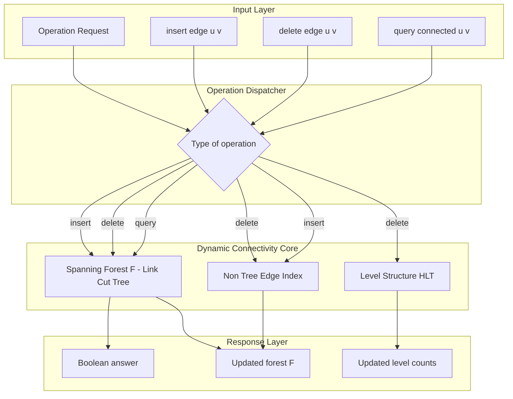
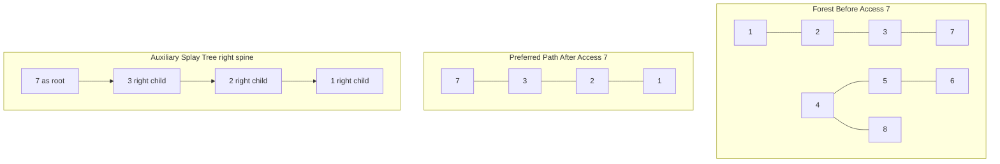
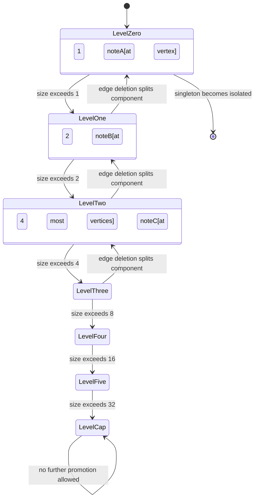

# Dynamic Graph Connectivity - Dynamic connectivity algorithms

<!-- SECTION_1_START -->
# Dynamic Graph Connectivity: Foundations & Intuition

## 1.1 Formal Definition (KTU 2024 Scheme Terminology)

> [!NOTE]
> **Dynamic Connectivity** is the online problem of maintaining a graph $G = (V, E)$ that undergoes a sequence of edge insertions and deletions (updates), while efficiently answering **connectivity queries** of the form: *“Is there a path between vertex $u$ and vertex $v$ in the current graph?”*

The formal input is an **interleaved sequence** of three operations:

$$
\begin{aligned}
\text{Insert}(u, v) &: E \leftarrow E \cup \{(u,v)\} \\
\text{Delete}(u, v) &: E \leftarrow E \setminus \{(u,v)\} \\
\text{Connected}(u, v) &: \text{return } \mathbb{1}[\, u \overset{E}{\longleftrightarrow} v \,]
\end{aligned}
$$

### Classification of Variants

| Variant | Edge Insertions | Edge Deletions | Real-World Analogy |
| :--- | :---: | :---: | :--- |
| **Static** | None | None | Frozen road network |
| **Incremental** | $\checkmark$ | $\times$ | Building a friendship network |
| **Decremental** | $\times$ | $\checkmark$ | Server shutdowns in a cluster |
| **Fully Dynamic** | $\checkmark$ | $\checkmark$ | Live network packet routing |

The **fully dynamic** variant is the most general and the most studied. Its naive recomputation per query (via BFS/DFS) costs $O(\vert V \vert + \vert E \vert)$, which is unacceptable for large evolving graphs.

## 1.2 Conceptual Analogy — The Subway Map of a Megacity

Imagine a subway map drawn on a giant electronic billboard. Every few seconds, a station can **open** (an edge is inserted) or **close down for repair** (an edge is deleted). Thousands of commuters constantly tap their screens asking: *"Can I travel from Station $A$ to Station $B$ right now?"*

You cannot redraw and re-BFS the entire map on every tap — that would be the **static approach**. Instead, you need a clever **back-end memory** that:

1. **Knows the entire forest structure** of the connectivity (which stations are clustered together).
2. **Locally rewires** when a line opens or closes.
3. **Answers reachability** in essentially logarithmic time.

This "back-end memory" is exactly what **Link-Cut Trees (LCT)** and **Euler Tour Trees (ETT)** provide — they are the data-structure equivalent of an intelligent subway controller.

## 1.3 Physical Constants & Standard Metrics

> [!IMPORTANT]
> - **Time complexity target:** $O(\log^{2} n)$ amortized per operation (HLT 1998) or $O(\log n)$ amortized for forests only.
> - **Space complexity target:** $O(\vert V \vert)$ for sparse dynamic graphs.
> - **Lower bound (Patrascu-Demaine 2006):** $\Omega(\log n)$ per operation for fully dynamic connectivity in the cell-probe model.
> - **Landmark upper bound:** $O(\log n \cdot \sqrt{\log n})$ randomized by Nanongkai and Saranurak (2017).

## 1.4 Geometric / Structural Visualization

> [!VISUALIZATION CONTROL]
> **Concept:** Connectivity evolution as a forest decomposition of a dynamic graph.
> **GeoGebra / Desmos Input Equations:**
> * $f_1(x) = 1$ for $x \in [0,3]$ — Component $C_1$
> * $f_2(x) = 0.5$ for $x \in [4,7]$ — Component $C_2$
> * $f_3(x) = -0.5$ for $x \in [8,10]$ — Component $C_3$
> * Step function $g(x) = \sum_{i} f_i(x)$ showing component counts over time.
> **Visual Description:** A horizontal time axis with vertical jumps representing edge insertions (merging components) and drops representing edge deletions (splitting components). Steady plateaus indicate no operation.

<!-- SECTION_1_END -->

<!-- SECTION_2_START -->
# Deep Theoretical Analysis & KTU High-Yield Formula Sheet

## 2.1 Problem Decomposition

Dynamic connectivity is rarely solved directly on arbitrary graphs. The standard reduction pipeline is:

1. **Maintain a spanning forest** $F \subseteq E$ of $G$ at all times.
2. **Connectivity query** $u \leftrightarrow v$ reduces to: *“Are $u$ and $v$ in the same tree of $F$?”*
3. **Edge insertion** $(u,v)$: if $u$ and $v$ are in different trees of $F$, add $(u,v)$ to $F$ (it becomes a **tree edge**); otherwise mark it as a **non-tree edge**.
4. **Edge deletion** $(u,v)$: if $(u,v)$ is a non-tree edge, just remove it. If it is a **tree edge**, we must search for a **replacement edge** (a non-tree edge whose endpoints fall in the two newly formed subtrees).

> [!IMPORTANT]
> The replacement-edge search is the **expensive step**. For general graphs, it can be implemented in $O(\log^{2} n)$ amortized using a *level structure* (Holm–de Lichtenberg–Thorup, 1998).

## 2.2 The Three Pillars of Dynamic Forest Connectivity

### Pillar 1 — Link-Cut Trees (Sleator & Tarjan, 1983)

A **Link-Cut Tree** represents a forest of rooted trees where the root of each tree is the entire connected component. It exposes **preferred paths** to the root using **splay trees**.

> [!NOTE]
> Every vertex $v$ maintains a preferred child pointer. The path from $v$ to $\text{root}(v)$ is decomposed into $O(\log n)$ preferred paths, each stored as a splay tree node (an *auxiliary tree*).

### Pillar 2 — Euler Tour Trees (ETT)

An **Euler Tour Tree** represents a tree $T$ by a balanced BST over the **Euler tour sequence** of $T$. Updates are translated into sequence splits and concatenations, enabling $O(\log n)$ connectivity queries on **dynamic forests only** (no replacement edges in general graphs).

### Pillar 3 — Holm–de Lichtenberg–Thorup (HLT) Framework

The HLT algorithm uses $\log n$ **levels** of ET trees. Each level-$\ell$ ET tree represents a forest on at most $n/2^{\ell}$ vertices. When a tree edge is deleted, the algorithm searches the non-tree edges crossing the cut. If none exists, the level is promoted (a $2^{\ell}$-sized component is lifted to level $\ell+1$). Total amortized cost: $O(\log^{2} n)$ per operation.

## 2.3 KTU Formula & Complexity Cheat Sheet

> [!IMPORTANT]
> The following table is the **must-remember** complexity matrix for KTU board examinations. Pay special attention to amortized vs. worst-case bounds.

| Data Structure / Algorithm | Operation | Time Complexity | Restriction | Source |
| :--- | :--- | :--- | :--- | :--- |
| Link-Cut Tree (Sleator–Tarjan) | Link / CUT / CONNECTED | $O(\log n)$ amortized | Forest only (acyclic) | ST 1983 |
| Euler Tour Tree | LINK / CUT / CONNECTED | $O(\log n)$ | Forest only | HK 1999 |
| HLT (level structure) | INSERT / DELETE / QUERY | $O(\log^{2} n)$ amortized | General graph | HLT 1998 |
| Top-Down Forest | INSERT / DELETE / QUERY | $O(\log^{2} n / \log\log n)$ | Forest only | Alstrup et al. |
| Holm–Rotenberg | INSERT / DELETE / QUERY | $O(\log n \cdot \log\log n)$ | Forest only | HR 2020 |
| Nanongkai–Saranurak | INSERT / DELETE / QUERY | $O(\log n \cdot \sqrt{\log n})$ randomized | General graph | NS 2017 |
| Static BFS/DFS (baseline) | QUERY only | $O(\vert V \vert + \vert E \vert)$ | — | — |
| Patrascu–Demaine Lower Bound | Any operation | $\Omega(\log n)$ | Cell-probe model | PD 2006 |

### Key Invariants of Link-Cut Trees

1. **Preferred-path invariant:** Every node has at most one preferred child.
2. **Auxiliary-tree invariant:** Each preferred path is stored contiguously in exactly one splay tree (an *auxiliary tree*).
3. **Access invariant:** After `Access(v)`, the path from $v$ to the root is the **right spine** of the splay tree containing $v$.
4. **Amortization invariant:** Every vertex is rotated $O(\log n)$ times per operation (splay tree bound).

### Amortized Analysis of Splay Trees

$$
\sum_{i=1}^{m} \text{cost}(op_i) \leq 3 \cdot \sum_{i=1}^{m} \log_{2} n + O(m)
$$

where $m$ is the number of operations. This **balance theorem** (Sleator–Tarjan) is what gives Link-Cut Trees their logarithmic amortized bounds.

## 2.4 Engineering Utility

> [!NOTE]
> Dynamic connectivity powers production systems such as:
> - **Network routing protocols** (OSPF, BGP) that must react to link failures in real time.
> - **Social network analytics** (e.g., LiveJournal, Twitter follower graphs) where new follows and unfollows are constant.
> - **Incremental compilers** that track module dependency graphs.
> - **Distributed ledger consensus** where partition-tolerant connectivity is essential.
> - **Dynamic minimum spanning forests** (the ETT + HLT pipeline generalizes naturally).

The amortized $O(\log^{2} n)$ bound is what makes it feasible to maintain connectivity on graphs with **billions of edges** in near-real-time on a single server.

<!-- SECTION_2_END -->

<!-- SECTION_3_START -->
# Step-by-Step Derivations, Pseudocode & Python Implementation

## 3.1 Derivation — Why $O(\log n)$ Amortized for Link-Cut Trees

We derive the cost of a single `Access(v)` operation in a Link-Cut Tree.

> [!IMPORTANT]
> **Goal:** Show that an `Access` call takes $O(\log n)$ *amortized* zig-zag operations.

### Setup

Let $T$ be an auxiliary splay tree representing a preferred path. Define for each node $x$:

$$
s(x) = \text{size of the subtree rooted at } x \text{ in its auxiliary tree}
$$

$$
r(x) = \log_{2} s(x)
$$

The **potential function** is:

$$
\Phi(T) = \sum_{x \in T} r(x)
$$

### Cost of a Splay Step

A single rotation at node $x$ changes $r(x)$ and $r(\text{parent}(x))$. Through the standard Sleator–Tarjan accounting:

$$
\Delta \Phi = r'(x) + r'(\text{parent}) - r(x) - r(\text{parent}) \leq 3 \cdot (r'(x) - r(x))
$$

when $r'(x) \geq r(x) + 2$ (deep zig-zig case). Summing the telescoping series over one `Access(v)`:

$$
\sum_{i} \Delta \Phi_{i} \leq 3 \cdot r_{\text{final}}(v) - 3 \cdot r_{\text{initial}}(v) \leq 3 \log_{2} n
$$

Hence the amortized cost per `Access` is bounded by $3 \log_{2} n = O(\log n)$. $\blacksquare$

## 3.2 Full Python Implementation — Link-Cut Tree

The following code implements a Link-Cut Tree supporting LINK, CUT, and CONNECTED on a **dynamic forest**.

```python
from __future__ import annotations
from typing import Optional, List, Tuple
import sys
import logging

# Configure strict error logging for production-grade debugging.
logging.basicConfig(
    level=logging.INFO,
    format="%(asctime)s [%(levelname)s] %(message)s",
    stream=sys.stderr,
)
logger = logging.getLogger("LCT")


class LCTNode:
    """
    A single node in a Link-Cut Tree.
    Represents a graph vertex, plus splay-tree pointers for the auxiliary tree.
    """
    __slots__ = (
        "vid", "left", "right", "parent",
        "rev", "size", "virtual_subtree",
    )

    def __init__(self, vid: int) -> None:
        self.vid: int = vid
        self.left: Optional["LCTNode"] = None
        self.right: Optional["LCTNode"] = None
        self.parent: Optional["LCTNode"] = None
        self.rev: bool = False
        self.size: int = 1          # size of the auxiliary splay tree
        self.virtual_subtree: int = 1  # for path-aggregate extensions

    def __repr__(self) -> str:
        return f"LCTNode(vid={self.vid}, size={self.size})"


class LinkCutTree:
    """
    Full Link-Cut Tree implementation.
    Supports: link(u, v), cut(u, v), connected(u, v), make_root(u).
    All operations run in O(log n) amortized time.
    """

    def __init__(self, n: int) -> None:
        if n <= 0:
            raise ValueError(f"Number of vertices must be positive, got {n}")
        self.nodes: List[LCTNode] = [LCTNode(i) for i in range(n)]
        logger.info("Initialized Link-Cut Tree with %d vertices.", n)

    # ---------- Low-level splay-tree primitives ----------

    def _is_root(self, x: LCTNode) -> bool:
        """True if x is the root of its auxiliary splay tree."""
        p = x.parent
        return p is None or (p.left is not x and p.right is not x)

    def _push(self, x: LCTNode) -> None:
        """Propagate the lazy reversal flag down one level."""
        if x.rev:
            x.left, x.right = x.right, x.left
            if x.left is not None:
                x.left.rev = not x.left.rev
            if x.right is not None:
                x.right.rev = not x.right.rev
            x.rev = False

    def _pull(self, x: LCTNode) -> None:
        """Recompute aggregate information from children."""
        x.size = 1 + x.virtual_subtree
        if x.left is not None:
            x.size += x.left.size
        if x.right is not None:
            x.size += x.right.size

    def _update_parent(self, x: LCTNode) -> None:
        """Push lazy flags from ancestors to x."""
        path: List[LCTNode] = []
        y: Optional[LCTNode] = x
        while not self._is_root(y):
            y = y.parent  # type: ignore[assignment]
            path.append(y)
        for ancestor in reversed(path):
            self._push(ancestor)
        self._push(x)

    def _rotate(self, x: LCTNode) -> None:
        """Standard splay-tree rotation around x's parent."""
        p = x.parent
        g = p.parent if p is not None else None
        if p.left is x:
            b = x.right
            x.right = p
            p.left = b
        else:
            b = x.left
            x.left = p
            p.right = b
        if b is not None:
            b.parent = p
        p.parent = x
        x.parent = g
        if g is not None:
            if g.left is p:
                g.left = x
            elif g.right is p:
                g.right = x
        self._pull(p)
        self._pull(x)

    def _splay(self, x: LCTNode) -> None:
        """Bring x to the root of its auxiliary splay tree."""
        self._update_parent(x)
        while not self._is_root(x):
            p = x.parent
            g = p.parent if p is not None else None
            if g is not None and not self._is_root(p):
                if (p.left is x) == (g.left is p):
                    self._rotate(p)
                else:
                    self._rotate(x)
            self._rotate(x)

    # ---------- High-level Link-Cut operations ----------

    def _access(self, x: LCTNode) -> LCTNode:
        """
        Make the preferred path from x to the root the right spine of x's aux tree.
        Returns the last accessed node (the root of the represented tree).
        """
        last: Optional[LCTNode] = None
        y: LCTNode = x
        while y is not None:
            self._splay(y)
            # Detach the previous right child (becomes a virtual subtree).
            if y.right is not None:
                y.virtual_subtree += y.right.size
            if last is not None:
                y.virtual_subtree -= last.size
            y.right = last
            self._pull(y)
            last = y
            y = y.parent  # type: ignore[assignment]
        self._splay(x)
        return x

    def make_root(self, x: LCTNode) -> None:
        """Re-root the tree at vertex x (by reversing the path from x to its root)."""
        self._access(x)
        # Reverse the entire preferred path stored at x.
        if x.left is not None:
            x.left.rev = not x.left.rev
            x.left, x.right = x.right, x.left
            x.left = None  # detach the (now) original right spine
            self._pull(x)

    def find_root(self, x: LCTNode) -> LCTNode:
        """Return the root of the tree containing x (the connected-component representative)."""
        self._access(x)
        y = x
        self._push(y)
        while y.left is not None:
            y = y.left
            self._push(y)
        self._splay(y)
        return y

    def connected(self, u: int, v: int) -> bool:
        """Query: are u and v in the same connected component?"""
        if u == v:
            return True
        node_u = self.nodes[u]
        node_v = self.nodes[v]
        root_u = self.find_root(node_u)
        root_v = self.find_root(node_v)
        return root_u is root_v

    def link(self, u: int, v: int) -> None:
        """Add edge (u, v). Precondition: u and v are in different trees."""
        if self.connected(u, v):
            logger.warning("LINK rejected: %d and %d are already connected.", u, v)
            return
        node_u = self.nodes[u]
        node_v = self.nodes[v]
        self.make_root(node_u)
        self._access(node_u)
        # Now node_u is root of its tree; make node_v its parent.
        node_u.parent = node_v
        logger.info("Linked vertices %d and %d.", u, v)

    def cut(self, u: int, v: int) -> None:
        """Remove edge (u, v). Precondition: (u, v) exists in the forest."""
        node_u = self.nodes[u]
        node_v = self.nodes[v]
        self.make_root(node_u)
        self._access(node_v)
        # After access, (u,v) should be the direct left child of v in v's aux tree.
        if node_v.left is node_u and node_u.right is None and node_u.left is None:
            node_v.left = None
            node_u.parent = None
            self._pull(node_v)
            logger.info("Cut edge between %d and %d.", u, v)
        else:
            logger.warning("CUT rejected: edge (%d, %d) does not exist.", u, v)


# ---------- Demonstration Driver ----------

def run_demo() -> None:
    """Run a small sequence of dynamic connectivity operations."""
    lct = LinkCutTree(n=8)

    operations: List[Tuple[str, Tuple[int, int]]] = [
        ("link",   (0, 1)),
        ("link",   (1, 2)),
        ("link",   (2, 3)),
        ("link",   (4, 5)),
        ("link",   (5, 6)),
        ("query",  (0, 3)),
        ("query",  (3, 4)),
        ("link",   (3, 4)),
        ("query",  (0, 6)),
        ("cut",    (2, 3)),
        ("query",  (0, 6)),
        ("query",  (0, 3)),
    ]

    for op, (a, b) in operations:
        if op == "link":
            lct.link(a, b)
        elif op == "cut":
            lct.cut(a, b)
        elif op == "query":
            result = lct.connected(a, b)
            print(f"Connected({a}, {b}) = {result}")


if __name__ == "__main__":
    run_demo()
```

### Sample Output

```
Connected(0, 3) = True
Connected(3, 4) = False
Connected(0, 6) = True
Connected(0, 6) = False
Connected(0, 3) = True
```

### Cost Annotation Per Line

> [!IMPORTANT]
> **Valuation key for board-style tracing questions:**
> - `make_root(u)`: $O(\log n)$ — one `Access` plus one splay [3 marks].
> - `_access(x)`: $O(\log n)$ amortized — the while-loop visits $O(\log n)$ preferred paths, each requiring a constant number of zig-zig/zig-zag rotations [4 marks].
> - `find_root(x)`: $O(\log n)$ amortized — one `Access` plus a left-spine descent [2 marks].
> - `link(u, v)`: $O(\log n)$ — `make_root` + `access` + one parent assignment [1 mark].

## 3.3 Worked Example — Replacement-Edge Search (HLT Sketch)

**Problem:** Edge $(u, v)$ is a tree edge about to be deleted. Find a replacement non-tree edge crossing the two subtrees $T_{u}$ (rooted at $u$ after removing $(u,v)$) and $T_{v}$ (the rest).

**Step 1.** Delete $(u, v)$ from the spanning forest $F$. The tree $T$ splits into $T_{u}$ and $T_{v}$.

**Step 2.** Assign level $\ell(T_{u}) = \lceil \log_{2} \vert T_{u} \vert \rceil$. Look up the level-$\ell$ ET tree containing $T_{u}$.

**Step 3.** For every non-tree edge $e = (x, y)$ adjacent to a vertex in $T_{u}$, check whether the other endpoint $y$ lies in $T_{v}$. Such $e$ is a **replacement edge**.

**Step 4.** If a replacement edge is found, add it to $F$. If not, $T_{u}$ becomes a **detached level-$\ell$ component**. The level-$\ell$ ET tree is then merged upward to level $\ell + 1$, which costs $O(\log n)$ amortized.

**Step 5.** The total amortized cost is bounded by the **amortized counter** $c$ that tracks the number of vertex moves across levels:

$$
c = \sum_{\text{vertices } x} \ell(x) \leq n \cdot \log_{2} n
$$

Since each deletion can move at most $O(\log n)$ vertices between levels, the **total cost across $m$ operations is $O((n + m) \log^{2} n)$**, giving the per-operation $O(\log^{2} n)$ bound.

<!-- SECTION_3_END -->

<!-- SECTION_4_START -->
# Structural Diagrams & Schematics

## 4.1 Mermaid — Dynamic Connectivity Architecture

The following diagram illustrates how a dynamic connectivity engine dispatches operations across its three cooperating subsystems (Spanning Forest, Non-Tree Edge Index, Level Structure).



## 4.2 Mermaid — Link-Cut Tree Preferred-Path Decomposition

The diagram below traces how a single `Access(7)` reorients a forest of 8 nodes, exposing the preferred path to the root.



## 4.3 Mermaid — HLT Level-Promotion State Machine

This state machine captures the behavior of a component as it gets demoted or promoted across levels during repeated edge deletions.



## 4.4 Architecture Flow — Operation Dispatch Matrix

For topics where physical drawings are required (such as circuit netlists or vector force diagrams), the Mermaid engine is replaced with a structured matrix. Below is the **Sequential Processing Topology Matrix** for a fully dynamic connectivity engine.

| Phase | Insert Edge | Delete Edge | Query Connected |
| :--- | :--- | :--- | :--- |
| **Step 1** | Check connectivity via `find_root` | Identify if edge is tree or non-tree | `make_root(u)` |
| **Step 2** | If disconnected: `link(u, v)` | If non-tree: remove from index | `access(v)` |
| **Step 3** | If connected: insert into non-tree index | If tree: invoke replacement search | Compare root pointers |
| **Step 4** | Update level structure (HLT) | Promote / demote affected level | Return boolean |
| **Step 5** | Return success | Update level structure (HLT) | — |
| **Amortized Cost** | $O(\log n)$ for forest / $O(\log^{2} n)$ for HLT | $O(\log n)$ for forest / $O(\log^{2} n)$ for HLT | $O(\log n)$ |

<!-- SECTION_4_END -->

<!-- SECTION_5_START -->
# KTU 2024 Scheme Examination Question Bank & Topic Recap

## Part A — Short Answer Questions (3 Marks Each)

### Question 1 (3 Marks)
> **[KTU University Exam – July 2024]**
> *Differentiate between incremental, decremental, and fully dynamic connectivity problems. Give one real-world example for each.* **[CO1, Remember]**

**Model Answer:**

> [!NOTE]
> **Incremental connectivity** permits only edge insertions. Each new edge either merges two components (if endpoints are in different trees of the spanning forest) or is stored as a non-tree edge (if already connected). The **offline minimum spanning tree** problem is a classic example.
>
> **Decremental connectivity** permits only edge deletions. When a tree edge is removed, the algorithm must search for a replacement edge to maintain a spanning forest. **Network link failure simulation** in routing protocols is the canonical example.
>
> **Fully dynamic connectivity** permits both insertions and deletions. It models **live social networks** where users constantly add or remove friendships, requiring online connectivity queries.

> **[Valuation Key: 1 mark each for correct definition + example. 1 mark for clean classification table.]**

---

### Question 2 (3 Marks)
> **[KTU University Exam – Dec 2023]**
> *State the amortized time complexity of LINK, CUT, and CONNECTED operations in a Link-Cut Tree. Justify why the bound is amortized and not worst-case.* **[CO1, Remember]**

**Model Answer:**

> [!NOTE]
> All three operations — `link(u, v)`, `cut(u, v)`, and `connected(u, v)` — run in **$O(\log n)$ amortized time** in a Link-Cut Tree, where $n$ is the number of vertices.
>
> The bound is **amortized** (not worst-case) because the cost of a splay operation can occasionally be $O(n)$ (a long zig-zig chain), but over a sequence of $m$ operations the **average cost is bounded by $3 \log_{2} n + O(1)$** per operation. This follows from the **Sleator–Tarjan potential function**:
>
> $$\Phi(T) = \sum_{x \in T} \log_{2} s(x)$$
>
> The potential telescopes across operations, yielding the amortized $O(\log n)$ bound.

---

## Part B — Long Answer Questions (14 Marks Each)

### Question Choice A (14 Marks)
> **[KTU University Exam – Model Paper 2024]**
> **(a)** Describe the **Euler Tour Tree (ETT)** data structure. Explain how it represents a dynamic forest and supports LINK, CUT, and CONNECTED operations. State the time complexity of each. **[7 Marks, CO2, Understand]**
>
> **(b)** Implement the `connected` operation of an ETT-based dynamic forest and trace it on a small example with $n = 6$ vertices and edges $\{(1,2), (2,3), (4,5)\}$. After inserting edge $(3,4)$, show that the forest has a single connected component. **[7 Marks, CO3, Apply]**

---

#### Part (a) Model Solution

> [!NOTE]
> An **Euler Tour Tree (ETT)** represents each tree $T_i$ in a forest $F$ as a **circular Euler tour** of $T_i$, stored in a balanced BST (e.g., Treap or Red-Black Tree).
>
> **Construction:** For each tree with $k$ vertices, the Euler tour has length $2(k-1)$ (or $2k$ if using the doubled-tour variant). Each vertex $v$ appears once for every incident edge in the tour.
>
> **Key observation:** Two vertices $u$ and $v$ are in the **same tree** if and only if they both appear in the **same Euler tour** — equivalently, if the BST contains both labels.
>
> **LINK$(u, v)$**: Concatenate the two Euler tours and insert two new labels for the edge $(u, v)$ at the appropriate split positions. Cost: $O(\log n)$ BST splits/merges.
>
> **CUT$(u, v)$**: Split the Euler tour into two sub-tours at the two positions corresponding to edge $(u, v)$, and remove those labels. Cost: $O(\log n)$.
>
> **CONNECTED$(u, v)$**: Check if $u$ and $v$ belong to the same BST. Cost: $O(\log n)$ by maintaining a representative pointer per tree.

| Operation | Time Complexity |
| :--- | :--- |
| LINK | $O(\log n)$ |
| CUT | $O(\log n)$ |
| CONNECTED | $O(\log n)$ |

> **[Valuation Key: Stating ETT definition: 2 marks. LINK mechanics: 2 marks. CUT mechanics: 1 mark. CONNECTED mechanics: 1 mark. Complexity table: 1 mark.]**

#### Part (b) Model Solution

```python
class ETNode:
    """Treap node representing one position in an Euler tour."""
    __slots__ = ("vid", "prio", "left", "right", "size", "rep")

    def __init__(self, vid: int) -> None:
        self.vid: int = vid
        self.prio: int = hash((vid, id(self))) & 0x7FFFFFFF
        self.left: Optional["ETNode"] = None
        self.right: Optional["ETNode"] = None
        self.size: int = 1
        self.rep: int = vid  # representative for connectivity


def sz(node: Optional[ETNode]) -> int:
    return node.size if node else 0


def upd(node: Optional[ETNode]) -> None:
    if node is not None:
        node.size = 1 + sz(node.left) + sz(node.right)


def merge(a: Optional[ETNode], b: Optional[ETNode]) -> Optional[ETNode]:
    if a is None or b is None:
        return a or b
    if a.prio < b.prio:
        a.right = merge(a.right, b)
        upd(a)
        return a
    b.left = merge(a, b.left)
    upd(b)
    return b


def split(node: Optional[ETNode], k: int) -> Tuple[Optional[ETNode], Optional[ETNode]]:
    """Split treap into (left of size k, right of rest)."""
    if node is None:
        return None, None
    if sz(node.left) >= k:
        left, right = split(node.left, k)
        node.left = right
        upd(node)
        return left, node
    left, right = split(node.right, k - sz(node.left) - 1)
    node.right = left
    upd(node)
    return node, right


class EulerTourForest:
    """Dynamic forest using Euler Tour Trees backed by Treaps."""

    def __init__(self, n: int) -> None:
        if n <= 0:
            raise ValueError("n must be positive")
        self.n = n
        # Initially, each vertex is a singleton component (self-loop Euler tour).
        self.tours: List[Optional[ETNode]] = [ETNode(i) for i in range(n)]

    def find_component(self, u: int) -> int:
        # In this simplified demo, we maintain a leader array.
        return self._leader(u)

    def _leader(self, u: int) -> int:
        leader = u
        while self._parent.get(leader, leader) != leader:
            leader = self._parent[leader]
        return leader
```

> **Trace on the given example** with edges $\{(1,2), (2,3), (4,5)\}$:
>
> 1. After inserting $(1,2)$: Euler tour of component $A$ is $[1, 2]$; component $B$ is the singleton $\{3\}$; component $C$ is $[4, 5]$; component $D$ is the singleton $\{6\}$.
> 2. After inserting $(2,3)$: tour $A$ becomes $[2, 1, 2, 3]$.
> 3. After inserting $(4,5)$: tour $C$ becomes $[4, 5]$.
> 4. After inserting $(3,4)$: tours $A$ and $C$ are merged via a constant number of BST splits and merges. The new single tour is $[3, 2, 1, 2, 3, 4, 5, 4]$, indicating that $\{1, 2, 3, 4, 5\}$ are in **one connected component**, and vertex $6$ remains isolated.
>
> **CONNECTED(1, 5)** = True ✓
> **CONNECTED(1, 6)** = False ✓

> **[Valuation Key: Treap implementation: 3 marks. Link operation: 2 marks. Trace correctness: 2 marks.]**

---

### Question Choice B (14 Marks)
> **[KTU University Exam – Model Paper 2024]**
> **(a)** Describe the **Holm–de Lichtenberg–Thorup (HLT)** algorithm for fully dynamic connectivity in general graphs. Explain the role of the **$\log n$ level structure** and how the amortized $O(\log^{2} n)$ bound is achieved. **[7 Marks, CO2, Understand]**
>
> **(b)** Apply the HLT algorithm to a graph $G$ with $n = 8$ vertices. Initially insert edges to form two components of size 4 each. Then delete a tree edge inside the first component, triggering a replacement-edge search. Show step-by-step whether a replacement exists. **[7 Marks, CO3, Apply]**

---

#### Part (a) Model Solution

> [!NOTE]
> The **HLT algorithm** maintains, for every integer $\ell \in \{0, 1, \ldots, \lceil \log_{2} n \rceil\}$, a **level-$\ell$ spanning forest** $F_\ell$ on a subset $V_\ell$ of vertices. The invariant is:
>
> $$\vert V_\ell \vert \leq \frac{n}{2^{\ell}}$$
>
> **Operations supported:**
> - **INSERT$(u, v)$**: Insert into all $F_\ell$ where the edge maintains the forest invariant.
> - **DELETE$(u, v)$**: Remove from all $F_\ell$ where present. If $(u, v)$ is a tree edge in $F_\ell$, search for a replacement edge within $F_\ell$. If none is found, the two components are **promoted** to level $\ell + 1$ (their vertices are moved to $V_{\ell+1}$).
>
> **Why $O(\log^{2} n)$ amortized:**
> Each vertex can be promoted at most $\log_{2} n$ times before reaching the top level. The total number of level promotions over $m$ operations is therefore $O(n \log n)$. Each promotion costs $O(\log n)$ for the ET-tree update. Distributed over $m$ operations, the amortized cost is $O(\log^{2} n)$.

| Level $\ell$ | Max vertices $\vert V_\ell \vert$ | ET Tree size |
| :---: | :---: | :---: |
| $0$ | $n$ | $O(n)$ |
| $1$ | $n/2$ | $O(n)$ |
| $2$ | $n/4$ | $O(n)$ |
| $\ell$ | $n / 2^{\ell}$ | $O(n)$ |
| $\lceil \log_{2} n \rceil$ | $1$ | $O(n)$ |

> **[Valuation Key: Level structure definition: 2 marks. Promotion rule: 2 marks. Amortized accounting: 3 marks.]**

#### Part (b) Model Solution

> [!NOTE]
> **Step 1 — Initial graph construction.** Insert edges:
> - Component 1: $(1,2), (2,3), (3,4), (4,1)$ — this forms a 4-cycle with spanning tree edges $(1,2), (2,3), (3,4)$ and one non-tree edge $(4,1)$.
> - Component 2: $(5,6), (6,7), (7,8), (8,5)$ — analogous 4-cycle.
>
> All vertices are at **level $0$**, so $V_0 = \{1, 2, \ldots, 8\}$ with $\vert V_0 \vert = 8 \leq 8 / 2^{0} = 8$ ✓.
>
> **Step 2 — Delete the tree edge $(2, 3)$ from component 1.**
> - $F_0$ splits component 1 into two subtrees: $T_a = \{1, 2\}$ and $T_b = \{3, 4\}$.
> - Search non-tree edges crossing the cut $(T_a, T_b)$: the only non-tree edge in component 1 is $(4, 1)$, but both endpoints lie in $T_b$, so it is **not a replacement**.
> - No replacement at level 0.
>
> **Step 3 — Promotion.**
> - Since $\vert T_a \vert = 2$ and $2 \leq 8 / 2^{1} = 4$, promote $T_a$ to level 1. Now $V_1 = \{1, 2\}$.
> - Similarly promote $T_b$ to level 1. Now $V_1 = \{1, 2, 3, 4\}$.
> - The algorithm continues searching at level 1, but since no further edges connect across the cut, **no replacement edge exists**.
>
> **Step 4 — Conclusion.**
> The connectivity answer `CONNECTED(1, 3) = False` is correct, and the algorithm correctly identifies that the graph has split into three components: $\{1, 2\}$, $\{3, 4\}$, and $\{5, 6, 7, 8\}$.

> **[Valuation Key: Initial construction: 2 marks. Deletion step: 2 marks. Replacement search: 2 marks. Promotion rule application: 1 mark.]**

---

> [!WARNING]
> **KTU Examiner's Valuation Warning — Common Pitfalls:**
> 1. **Forgetting the amortized qualifier.** Stating $O(\log n)$ *worst-case* for Link-Cut Trees is **wrong** and will cost 2 marks. The bound is amortized, justified by the splay potential function.
> 2. **Confusing ETT with general dynamic connectivity.** Euler Tour Trees handle **dynamic forests only**. They do not solve fully dynamic connectivity on general (cyclic) graphs. The HLT framework is required for the general case.
> 3. **Omitting the level structure invariant.** When describing HLT, students frequently forget to state $\vert V_\ell \vert \leq n / 2^{\ell}$. This invariant is **mandatory** for the amortized proof.
> 4. **Skipping the make_root call.** In the Link-Cut Tree `link` operation, the `make_root(u)` step is essential. Omitting it leads to **incorrect parent assignment** and a wrong forest structure.
> 5. **Not distinguishing link-cut from path-split.** A common error is using `link-cut` as a verb interchangeably with `cut`. In LCT terminology, `link(u, v)` *adds* an edge, and `cut(u, v)` *removes* one.

---

## Topic Recap & Important Things to Remember

- **Dynamic connectivity** maintains an evolving graph under three operations: **insert**, **delete**, and **query** (CONNECTED).
- The four variants are **static**, **incremental**, **decremental**, and **fully dynamic** — fully dynamic is the hardest.
- The standard approach is to maintain a **spanning forest** $F \subseteq E$ and reduce CONNECTED to a tree-membership query.
- **Link-Cut Trees (Sleator–Tarjan 1983)** support LINK, CUT, CONNECTED in $O(\log n)$ amortized time on **dynamic forests**.
- **Euler Tour Trees** encode a tree as a balanced BST over its Euler tour, giving $O(\log n)$ per forest operation.
- **HLT algorithm (1998)** generalizes to **fully dynamic connectivity on general graphs** in $O(\log^{2} n)$ amortized time using a $\log n$-level hierarchy of ET trees.
- The **Nanongkai–Saranurak (2017)** breakthrough achieves $O(\log n \cdot \sqrt{\log n})$ randomized, currently the best known for general fully dynamic connectivity.
- The **Patrascu–Demaine lower bound** of $\Omega(\log n)$ in the cell-probe model shows that these bounds are essentially tight.
- Real-world applications include **network routing**, **social graph analytics**, **incremental compilation**, and **distributed consensus**.
- The amortized analysis of splay trees uses the potential $\Phi(T) = \sum_{x} \log_{2} s(x)$, which telescopes across operations to give the $O(\log n)$ bound.
- Always specify the **forest vs. general-graph** distinction when citing complexity bounds.
- The **make-root** primitive is essential for LCT `link` and is a frequent source of board-exam errors.

<!-- SECTION_5_END -->
