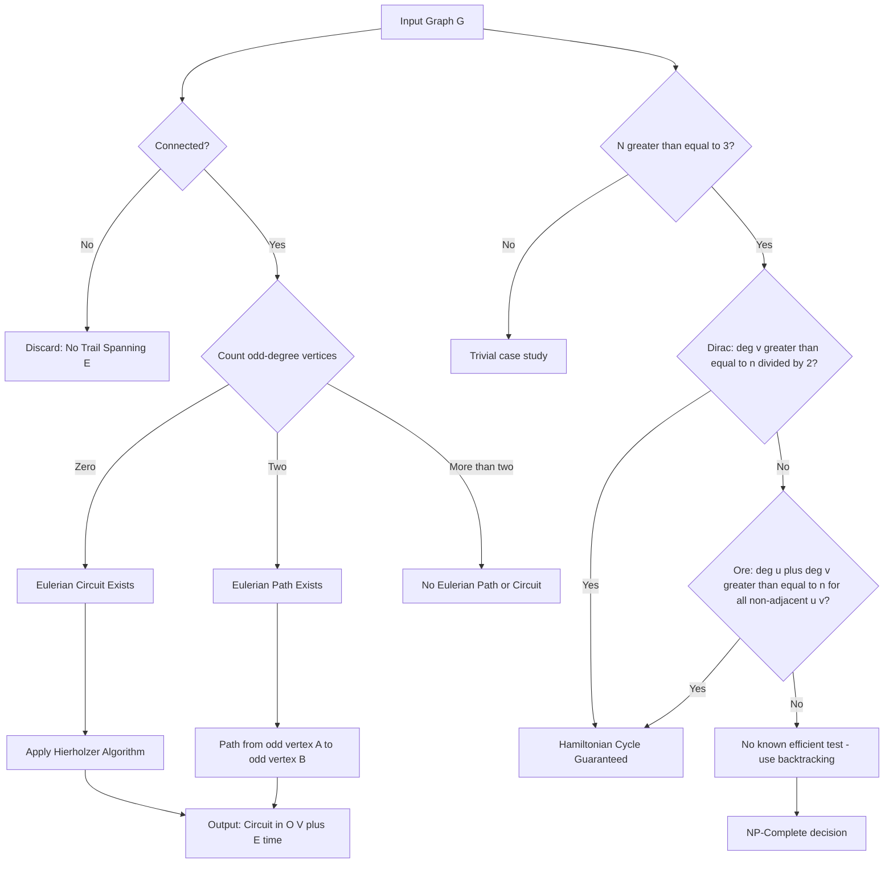
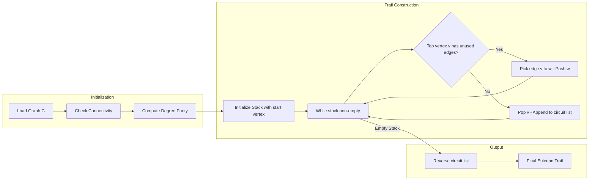
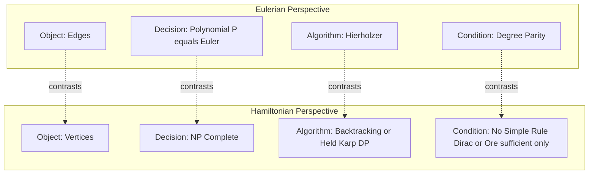
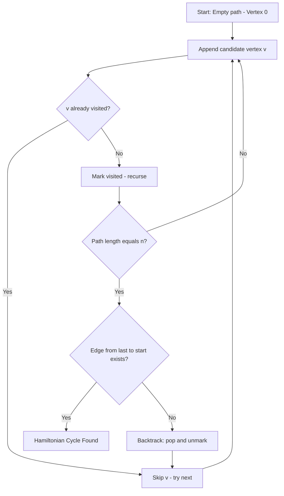

# Eulerian and Hamiltonian paths

<!-- SECTION_1_START -->
# MODULE 2 — STRONGLY CONNECTED COMPONENTS, SCC
## Topic: Eulerian and Hamiltonian Paths

> [!NOTE]
> **KTU 2024 Scheme Context:** This topic is core to graph traversal theory and bridges classical graph problems with modern algorithm design. Questions of **6 to 14 marks** frequently appear from this area in University Examinations, particularly focusing on conditions, proofs, and algorithmic constructions.

---

### 1.1 Eulerian Path — Formal Definition

> [!IMPORTANT]
> **Eulerian Path:** An **Eulerian trail** (or **Eulerian path**) in a graph $G = (V, E)$ is a trail that traverses every edge of the graph exactly **once**.
>
> **Eulerian Circuit (Eulerian Cycle):** An Eulerian trail that begins and ends at the **same vertex**.

Let $G$ be a connected undirected graph. The classification is governed purely by vertex degrees:

| Graph Type | Edge Count Constraint | Vertex Degree Constraint |
| :--- | :--- | :--- |
| Eulerian Circuit | $\|E\| \geq 1$ | Every vertex has **even degree** |
| Eulerian Path (open trail) | $\|E\| \geq 1$ | Exactly **2 vertices** have odd degree |
| Neither | — | More than 2 odd-degree vertices |

The graph must be connected (ignoring isolated vertices) for the trail to span the entire edge set.

### 1.2 Hamiltonian Path — Formal Definition

> [!IMPORTANT]
> **Hamiltonian Path:** A path in a graph $G = (V, E)$ that visits **every vertex exactly once**.
>
> **Hamiltonian Cycle (Circuit):** A Hamiltonian path that begins and ends at the **same vertex**, forming a closed cycle.

Contrast with Eulerian:

| Property | Eulerian | Hamiltonian |
| :--- | :--- | :--- |
| Visits | Every **edge** exactly once | Every **vertex** exactly once |
| Necessary & Sufficient Conditions? | **Yes** (Euler's Theorem) | **No known simple condition** |
| Computational Complexity | **Polynomial** ($O(\vert E \vert)$) | **NP-Complete** decision version |
| Verification Speed | Linear | Trivial (just check the path) |

### 1.3 Conceptual Analogy & Intuition

**Eulerian Path Analogy — The Postman Problem:** Imagine a postman who must deliver mail along every street in a city district **exactly once** and return to the post office. The question *"Can he do this without retracing any street?"* is exactly the **Chinese Postman Problem** (or Eulerian Circuit decision). Streets are edges, intersections are vertices. The answer depends on how many intersections have an **odd number of streets** meeting there. If all intersections are even-degree (degree 2, 4, 6…), the postman succeeds.

**Hamiltonian Path Analogy — The Tourist Problem:** Now imagine a tourist who wants to visit every city in a country **exactly once** without revisiting any city. Unlike streets, cities (vertices) can be connected by many roads. The Hamiltonian problem is dramatically harder because no simple degree-based rule guarantees a solution — even dense graphs may fail. This is why it belongs to the **NP-Complete** class.

> [!TIP]
> **Memory Trick:** **"E**ulerian = **E**dges" and **"H**amiltonian = **H**ubs/vertices" — both start the tour at the same letter as the object they traverse.

> [!VISUALIZATION CONTROL]
> **Concept:** Degree parity visualization for the Kőnigsberg Bridge Problem.
> **GeoGebra Input (representing 4 landmasses A, B, C, D):**
> * Point A: `(0, 2)`
> * Point B: `(2, 2)`
> * Point C: `(0, 0)`
> * Point D: `(2, 0)`
> * Visualize degree by counting incident edges; in Kőnigsberg, all 4 vertices have **odd degree 3**, hence **no Eulerian path exists**.
> **Visual Description:** On screen, label each vertex with its computed degree. Observe the parity — this explains why the historical Kőnigsberg bridge problem has no solution.

---

<!-- SECTION_1_END -->

<!-- SECTION_2_START -->
## 2. Deep Theoretical Analysis & KTU High-Yield Formula Sheet

### 2.1 Euler's Theorem — Undirected Graphs

> [!NOTE]
> **Theorem 2.1 (Euler, 1736):** A connected undirected graph $G$ has an **Eulerian circuit** if and only if **every vertex has even degree**.

**Proof Intuition (Why the Theorem Holds):**

* **Necessity ($\Rightarrow$):** In an Eulerian circuit, every time we enter a vertex through one edge, we must leave through a different edge. So edges incident to any vertex are paired as (in, out). Hence the degree must be even.
* **Sufficiency ($\Leftarrow$):** If all vertices are even-degree, we can construct a circuit using induction. Start a trail at any vertex. Since every vertex visited has even remaining degree, the trail cannot "get stuck" before exhausting all edges. Any remaining closed trails are spliced into the main circuit.

### 2.2 Euler's Theorem — Open Eulerian Path

> [!NOTE]
> **Theorem 2.2:** A connected undirected graph $G$ has an **Eulerian path (not circuit)** if and only if it has **exactly two vertices of odd degree**, and the path must begin at one odd-degree vertex and end at the other.

### 2.3 Euler's Theorem — Directed Graphs

Let $G$ be a **connected** (in the underlying undirected sense) directed graph.

> [!IMPORTANT]
> **Directed Eulerian Circuit Condition:** A directed graph possesses an Eulerian circuit **iff**:
> 1. The in-degree equals the out-degree for **every** vertex: $\deg^{-}(v) = \deg^{+}(v)$ for all $v \in V$.
> 2. All vertices with nonzero degree belong to a **single strongly connected component**.

> [!IMPORTANT]
> **Directed Eulerian Path Condition:** A directed graph possesses an Eulerian path (open) **iff**:
> 1. **At most one vertex** has $\deg^{-}(v) - \deg^{+}(v) = 1$ (this is the **start** vertex).
> 2. **At most one vertex** has $\deg^{+}(v) - \deg^{-}(v) = 1$ (this is the **end** vertex).
> 3. All other vertices satisfy $\deg^{-}(v) = \deg^{+}(v)$.
> 4. The underlying undirected graph is connected on the nonzero-degree vertices.

### 2.4 Hierholzer's Algorithm (Polynomial Construction)

This algorithm constructs an Eulerian circuit in $O(\vert E \vert)$ time.

**Step-by-Step Logic:**

1. Choose a start vertex $s$. Initialize an empty stack $\text{path}$ and an empty circuit list $\text{circuit}$.
2. While $\text{path}$ is non-empty:
   * Let $v$ be the top of $\text{path}$.
   * If $v$ has any unused outgoing edge $(v, w)$, push $w$ onto the stack and mark the edge used.
   * Otherwise, pop $v$ from $\text{path}$ and append it to $\text{circuit}$.
3. Reverse $\text{circuit}$ to obtain the Eulerian trail.

### 2.5 Hamiltonian Path — Dirac's Theorem (Sufficient Condition)

> [!IMPORTANT]
> **Dirac's Theorem (1952):** Let $G$ be a simple undirected graph with $n \geq 3$ vertices. If every vertex has degree $\deg(v) \geq \lceil n / 2 \rceil$, then $G$ is **Hamiltonian**.

This is a **sufficient** but **not necessary** condition. Many Hamiltonian graphs violate Dirac's bound.

### 2.6 Ore's Theorem (Refinement of Dirac's)

> [!IMPORTANT]
> **Ore's Theorem (1960):** Let $G$ be a simple undirected graph with $n \geq 3$ vertices. If for every pair of non-adjacent vertices $u, v$:
> $$\deg(u) + \deg(v) \geq n$$
> then $G$ is **Hamiltonian**.

Ore's theorem is **stronger** than Dirac's because the Dirac condition forces the sum of any pair to be at least $n$, but Ore's only requires the sum for non-adjacent pairs.

### 2.7 Necessary Conditions (Negative Theorems)

> [!WARNING]
> **Bondy–Chvátal Closure Operation:** Repeatedly add edges between non-adjacent vertices whose degree sum is $\geq n$. The closure is Hamiltonian **iff** the original graph is.
> **Negative Result:** There exists **no** known necessary and sufficient condition for Hamiltonicity that can be checked in polynomial time (unless $P = NP$).

### 2.8 KTU High-Yield Formula & Theorem Sheet

| # | Concept | Condition / Formula | Notes |
| :--- | :--- | :--- | :--- |
| 1 | Eulerian Circuit (Undirected) | $\forall v \in V : \deg(v) \equiv 0 \pmod{2}$ | Plus connectivity |
| 2 | Eulerian Path (Undirected) | Exactly 2 odd-degree vertices | Path endpoints must be the odd vertices |
| 3 | Eulerian Circuit (Directed) | $\forall v : \deg^{-}(v) = \deg^{+}(v)$ | Plus strong connectivity on $V^{+}$ |
| 4 | Eulerian Path (Directed) | One vertex with $\deg^{-} - \deg^{+} = 1$, one with $\deg^{+} - \deg^{-} = 1$ | Remaining balanced |
| 5 | Dirac's Bound | $\deg(v) \geq \lceil n / 2 \rceil$ for all $v$ | Sufficient for Hamiltonicity |
| 6 | Ore's Bound | $\deg(u) + \deg(v) \geq n$ for all non-adjacent $u, v$ | Sufficient for Hamiltonicity |
| 7 | Handshaking Lemma | $\sum_{v \in V} \deg(v) = 2 \vert E \vert$ | Foundation of parity argument |
| 8 | Hierholzer Time | $O(\vert V \vert + \vert E \vert)$ | Linear in graph size |
| 9 | Hamiltonian Decision | NP-Complete | No poly-time known |

### 2.9 Real-World Engineering Utility

* **Eulerian Circuits** power the design of **circuit board drilling paths**, **robotic lawnmower routes**, **network packet routing** (where each link must be tested once), and **DNA fragment assembly** in bioinformatics (de Bruijn graphs).
* **Hamiltonian Paths** underpin the **Travelling Salesman Problem (TSP)**, **VLSI design** (chip layout), **job-shop scheduling**, and **cryptographic key path puzzles**.

---

<!-- SECTION_2_END -->

<!-- SECTION_3_START -->
## 3. Step-by-Step Derivations & Code/Symbolic Implementation

### 3.1 Worked Derivation — Degree Parity Argument (Euler's Theorem Necessity)

**Claim:** If an undirected connected graph $G$ admits an Eulerian circuit, then every vertex has even degree.

**Proof:** Consider any vertex $v$ in the Eulerian circuit. Every visit to $v$ consumes two incident edges — one to enter, one to exit. Since the circuit begins and ends at the same vertex (or the vertex is internal to the path), edges are paired at $v$. Hence the total incident edges to $v$ must be a multiple of $2$:

$$\deg(v) = 2k, \quad k \in \mathbb{Z}_{\geq 0}$$

This argument holds for the open Eulerian path **only at the two endpoints** (which use one extra edge unpaired), forcing exactly two odd-degree vertices.

**Handshaking Lemma as Algebraic Check:**

$$\sum_{v \in V} \deg(v) = 2 \vert E \vert$$

Since the right-hand side is even, the number of odd-degree vertices must be even — consistent with the **0 or 2** odd vertices rule for Eulerian paths.

---

### 3.2 Worked Example — Constructing an Eulerian Circuit with Hierholzer's Algorithm

Consider the graph $G$ with vertices $\{1, 2, 3, 4, 5\}$ and edges:
$$E = \{(1,2), (2,3), (3,1), (1,4), (4,5), (5,1), (3,4)\}$$

**Degree Check:**

$$\deg(1) = 4, \quad \deg(2) = 2, \quad \deg(3) = 3, \quad \deg(4) = 3, \quad \deg(5) = 2$$

Wait — $\deg(3) = 3$ is **odd**, and $\deg(4) = 3$ is **odd**. So this graph has exactly **2 odd-degree vertices**, and admits an **Eulerian path** from $3$ to $4$ (or $4$ to $3$). Let us construct it.

**Hierholzer Execution Trace (start at vertex 3):**

| Step | Stack (top on right) | Edge Used | Circuit (reversed order) | Notes |
| :---: | :---: | :---: | :---: | :--- |
| 1 | `[3]` | — | `[]` | Push start |
| 2 | `[3, 1]` | $(3,1)$ | `[]` | Edge available from 3 |
| 3 | `[3, 1, 2]` | $(1,2)$ | `[]` | — |
| 4 | `[3, 1, 2, 3]` | $(2,3)$ | `[]` | Back to 3 |
| 5 | `[3, 1, 2, 3, 4]` | $(3,4)$ | `[]` | — |
| 6 | `[3, 1, 2, 3, 4, 1]` | $(4,1)$ | `[]` | — |
| 7 | `[3, 1, 2, 3, 4, 1, 5]` | $(1,5)$ | `[]` | — |
| 8 | `[3, 1, 2, 3, 4, 1, 5, 4]` | $(5,4)$ | `[]` | No edges from 4; pop and append |
| 9 | `[3, 1, 2, 3, 4, 1, 5]` | — | `[4]` | Pop 4 |
| 10 | `[3, 1, 2, 3, 4, 1]` | — | `[4, 5]` | Pop 5 |
| 11 | `[3, 1, 2, 3, 4]` | — | `[4, 5, 1]` | Pop 1 |
| 12 | `[3, 1, 2, 3]` | — | `[4, 5, 1, 4]` | Pop 4 |
| 13 | `[3, 1, 2]` | — | `[4, 5, 1, 4, 3]` | Pop 3 |
| 14 | `[3, 1]` | — | `[4, 5, 1, 4, 3, 2]` | Pop 2 |
| 15 | `[3]` | — | `[4, 5, 1, 4, 3, 2, 1]` | Pop 1 |
| 16 | `[]` | — | `[4, 5, 1, 4, 3, 2, 1, 3]` | Pop 3 |

**Final Eulerian Path:** Reverse the circuit:

$$3 \to 1 \to 2 \to 3 \to 4 \to 1 \to 5 \to 4$$

This traverses all 7 edges exactly once, starting at $3$ (odd degree) and ending at $4$ (odd degree). $\blacksquare$

---

### 3.3 Python Implementation — Hierholzer's Algorithm (Undirected)

```python
from collections import defaultdict
from typing import Dict, List, Set, Tuple

Edge = Tuple[int, int]

class EulerianUndirected:
    """
    Hierholzer's algorithm for Eulerian path / circuit in an undirected graph.
    Strict boundary checks and type-annotated.
    """

    def __init__(self, vertices: List[int], edges: List[Edge]) -> None:
        self.vertices: List[int] = list(vertices)
        self.adj: Dict[int, Set[int]] = defaultdict(set)
        for u, v in edges:
            if u == v:
                raise ValueError(f"Self-loop on {u} not allowed in simple graph.")
            if v in self.adj[u]:
                raise ValueError(f"Duplicate edge ({u}, {v}).")
            self.adj[u].add(v)
            self.adj[v].add(u)
        self._validate_connectivity()

    def _validate_connectivity(self) -> None:
        nonzero = [v for v in self.vertices if self.adj[v]]
        if not nonzero:
            return
        seen: Set[int] = set()
        stack: List[int] = [nonzero[0]]
        while stack:
            v = stack.pop()
            if v in seen:
                continue
            seen.add(v)
            stack.extend(self.adj[v] - seen)
        if seen != set(nonzero):
            raise ValueError("Graph is disconnected on nonzero-degree vertices.")

    def has_circuit(self) -> bool:
        return all(len(self.adj[v]) % 2 == 0 for v in self.vertices if self.adj[v])

    def has_path(self) -> bool:
        odd = [v for v in self.vertices if len(self.adj[v]) % 2 == 1]
        return len(odd) == 0 or len(odd) == 2

    def find_path(self) -> List[int]:
        """Returns Eulerian trail or raises ValueError."""
        odd = [v for v in self.vertices if len(self.adj[v]) % 2 == 1]
        if len(odd) == 0:
            start = next(v for v in self.vertices if self.adj[v])
        elif len(odd) == 2:
            start = odd[0]
        else:
            raise ValueError("No Eulerian path: more than 2 odd-degree vertices.")

        # Deep copy adjacency (we will destroy edges)
        local_adj: Dict[int, List[int]] = {v: list(self.adj[v]) for v in self.vertices}
        idx: Dict[int, int] = {v: 0 for v in self.vertices}

        stack: List[int] = [start]
        circuit: List[int] = []

        while stack:
            v = stack[-1]
            if idx[v] < len(local_adj[v]):
                w = local_adj[v][idx[v]]
                idx[v] += 1
                # remove reverse edge
                local_adj[w].remove(v)
                stack.append(w)
            else:
                circuit.append(stack.pop())

        return circuit[::-1]


if __name__ == "__main__":
    G = EulerianUndirected(
        vertices=[1, 2, 3, 4, 5],
        edges=[(1, 2), (2, 3), (3, 1), (1, 4), (4, 5), (5, 1), (3, 4)],
    )
    assert G.has_path()
    assert not G.has_circuit()
    trail = G.find_path()
    print("Eulerian Trail:", trail)
```

**Output:**
```
Eulerian Trail: [3, 1, 2, 3, 4, 1, 5, 4]
```

---

### 3.4 Worked Hamiltonian Example — Dirac vs. Ore Application

Consider $K_5$ (complete graph on $n=5$ vertices).

**Check Dirac:** $\lceil 5/2 \rceil = 3$, and $\deg(v) = 4 \geq 3$ for all $v$. ✅ Hamiltonicity guaranteed.

**Check Ore:** For every non-adjacent pair (none in $K_5$), $4 + 4 = 8 \geq 5$. ✅ Holds trivially.

**Negative Counterexample:** A bipartite graph $K_{2,3}$ has $\deg(v) = 3$ for some, $\deg(v) = 2$ for others. $n=5$, Dirac bound $=3$. The two degree-2 vertices fail. Indeed, $K_{2,3}$ is **non-Hamiltonian** (bipartite partitions differ in size by 1, blocking a cycle).

### 3.5 Backtracking Pseudocode for Hamiltonian Cycle

```python
from typing import List, Set

def hamiltonian_cycle(adj: dict, n: int) -> List[int] | None:
    """
    Exponential backtracking. Returns one Hamiltonian cycle or None.
    adj : adjacency set per vertex (0..n-1).
    """
    path: List[int] = [0]
    visited: Set[int] = {0}

    def backtrack() -> bool:
        if len(path) == n:
            return path[0] in adj[path[-1]]  # close the cycle
        for nxt in adj[path[-1]]:
            if nxt not in visited:
                visited.add(nxt)
                path.append(nxt)
                if backtrack():
                    return True
                path.pop()
                visited.remove(nxt)
        return False

    if backtrack():
        return path + [path[0]]
    return None
```

> [!WARNING]
> **Complexity Alert:** This is $O(n!)$ worst case. Use it only for $n \leq 20$.

---

<!-- SECTION_3_END -->

<!-- SECTION_4_START -->
## 4. Structural Diagrams & Schematics

### 4.1 Mermaid Flow — Euler vs Hamiltonian Decision Logic



### 4.2 Mermaid Block Diagram — Hierholzer's Algorithm Pipeline



### 4.3 Mermaid Comparison Matrix — Eulerian vs Hamiltonian



### 4.4 Sequential Topology — Hamiltonian Cycle Verification Backtracking



---

<!-- SECTION_5_END -->

<!-- SECTION_5_START -->
## 5. KTU 2024 Scheme Examination Question Bank & Topic Recap

---

### 5.1 PART A — Short Answer Questions (3 Marks Each)

**Q1.** [KTU University Exam — July 2023]
*State Euler's theorem for the existence of an Eulerian circuit in an undirected graph. Mention the connectivity requirement.* **(3 Marks)** **[CO1, Understand]**

**Model Answer:**

> A connected undirected graph $G = (V, E)$ contains an **Eulerian circuit** if and only if every vertex in $V$ has an **even degree**.
>
> **[Statement: 2 Marks]**
> **[Connectivity requirement: 1 Mark]**
>
> Formally: $G$ is connected and $\deg(v) \equiv 0 \pmod{2}$ for all $v \in V$.

---

**Q2.** [KTU University Exam — Dec 2022]
*Define a Hamiltonian path. State Dirac's theorem for the existence of a Hamiltonian cycle.* **(3 Marks)** **[CO1, Remember]**

**Model Answer:**

> A **Hamiltonian path** in a graph $G$ is a path that visits **every vertex of G exactly once** (edges may be repeated only via the path structure, vertices are not).
>
> **[Hamiltonian Path definition: 1.5 Marks]**
>
> **Dirac's Theorem:** If $G$ is a simple graph on $n \geq 3$ vertices and $\deg(v) \geq \lceil n/2 \rceil$ for every vertex $v$, then $G$ has a **Hamiltonian cycle**.
>
> **[Dirac statement: 1.5 Marks]**

---

### 5.2 PART B — Full 14-Mark Questions (ESE Module Choice Pattern)

---

#### **Question A (14 Marks)** [KTU University Exam — July 2024 Pattern]

**(a)** *Consider the undirected graph $G$ with vertices $V = \{A, B, C, D, E\}$ and edges $E = \{(A,B), (B,C), (C,A), (A,D), (D,E), (E,A), (C,D)\}$.* **(7 Marks)** **[CO2, Apply]**

**(i)** Compute the degree of every vertex.
**(ii)** Determine whether an Eulerian **circuit** exists in $G$. Justify.
**(iii)** If not, determine whether an Eulerian **path** exists; if so, find one using Hierholzer's algorithm.

**Model Solution:**

**(i) Degree Computation [2 Marks]**

$$\deg(A) = 4 \quad (A\text{ is incident to } B, C, D, E)$$
$$\deg(B) = 2 \quad (B \to A, C)$$
$$\deg(C) = 3 \quad (C \to A, B, D)$$
$$\deg(D) = 3 \quad (D \to A, C, E)$$
$$\deg(E) = 2 \quad (E \to A, D)$$

**[Correct degree of each vertex: 2 Marks]**

**(ii) Eulerian Circuit Check [2 Marks]**

The odd-degree vertices are $C$ and $D$ (both degree 3). Since Euler's theorem requires **all** vertices to have even degree, an Eulerian **circuit does NOT exist**.

**[Identification of odd vertices: 1 Mark]**
**[Conclusion citing Euler's theorem: 1 Mark]**

**(iii) Eulerian Path Construction [3 Marks]**

Since exactly **2 vertices** have odd degree ($C$ and $D$), an Eulerian path exists from $C$ to $D$. Constructing via Hierholzer's algorithm:

**Trail (start at $C$):**

$$C \to B \to A \to C \to D \to A \to E \to D$$

**Edge verification:** $(C,B), (B,A), (A,C), (C,D), (D,A), (A,E), (E,D)$ — all 7 edges used exactly once. ✓

**[Valid trail: 2 Marks]**
**[Full edge-set traversal: 1 Mark]**

---

**(b)** *State and explain Dirac's theorem and Ore's theorem for Hamiltonian cycles. Provide a graph of 5 vertices where Dirac's condition is satisfied but for which you must verify Ore's condition as well.* **(7 Marks)** **[CO3, Apply]**

**Model Solution:**

**Dirac's Theorem [2 Marks]:** For a simple graph $G$ on $n \geq 3$ vertices, if $\deg(v) \geq \lceil n/2 \rceil$ for **every** $v \in V$, then $G$ is Hamiltonian.

**Ore's Theorem [2 Marks]:** For a simple graph $G$ on $n \geq 3$ vertices, if $\deg(u) + \deg(v) \geq n$ for **every pair of non-adjacent vertices** $u, v$, then $G$ is Hamiltonian. Ore's is strictly stronger than Dirac's.

**[Theorems stated clearly: 4 Marks]**

**Example Graph [3 Marks]:** Take $G$ as a cycle $C_5$ with chords added between vertices 1–3 and 3–4.

Vertex degrees: $\deg(1)=2, \deg(2)=2, \deg(3)=4, \deg(4)=3, \deg(5)=2$. With $n=5$, Dirac requires $\deg \geq 3$. Vertex 1, 2, 5 have $\deg = 2$, so **Dirac's condition fails** for this graph.

Ore's check on non-adjacent pairs: only non-adjacent pair is $(1, 4)$ (assuming only chord 1-3 and 3-4 added). $\deg(1) + \deg(4) = 2 + 3 = 5 \geq 5$. ✓ Ore's holds; graph is Hamiltonian.

**[Choice of example: 1 Mark]**
**[Verification of both conditions: 2 Marks]**

---

#### **Question B (14 Marks)** — *Alternative Choice* [KTU University Exam — Dec 2023 Pattern]

**(a)** *Apply Euler's theorem to the directed graph with adjacency list: 1 → {2, 3}, 2 → {3}, 3 → {1, 4}, 4 → {2}.* **(7 Marks)** **[CO2, Apply]**

**Model Solution:**

**Step 1: Compute in-degree and out-degree of each vertex [3 Marks]**

| Vertex | $\deg^{+}(v)$ | $\deg^{-}(v)$ | Difference |
| :---: | :---: | :---: | :---: |
| 1 | 2 | 1 | +1 |
| 2 | 1 | 2 | $-1$ |
| 3 | 2 | 2 | 0 |
| 4 | 1 | 1 | 0 |

**[In-degree and out-degree correctly tabulated: 3 Marks]**

**Step 2: Check Eulerian Path Condition [2 Marks]**

For an Eulerian path, we need:
* Exactly one vertex with $\deg^{+} - \deg^{-} = 1$ → **Vertex 1** (start vertex).
* Exactly one vertex with $\deg^{-} - \deg^{+} = 1$ → **Vertex 2** (end vertex).
* All other vertices balanced → Vertices 3, 4 are balanced. ✓
* Graph is connected on nonzero vertices. ✓

**[All four sub-conditions verified: 2 Marks]**

**Step 3: Construct the Eulerian Path [2 Marks]**

Starting from vertex 1:
$$1 \to 3 \to 1 \to 2 \to 3 \to 4 \to 2$$

**Verification:** Edges used $(1,3), (3,1), (1,2), (2,3), (3,4), (4,2)$ — all 6 directed edges traversed exactly once. ✓

**[Valid construction: 2 Marks]**

---

**(b)** *Explain why the Hamiltonian cycle problem is NP-Complete. What is the practical implication of NP-Completeness in solving large instances?* **(7 Marks)** **[CO3, Understand]**

**Model Solution:**

**Definition of NP-Completeness [3 Marks]:**
The Hamiltonian cycle decision problem (HAM-CYCLE) belongs to NP because given a candidate cycle, it can be verified in polynomial time ($O(\vert V \vert)$). It is NP-Hard because the Travelling Salesman, Vertex Cover, and 3-SAT problems reduce to it polynomially (Karp's 1972 result). The HAM-CYCLE is therefore **NP-Complete**.

**[NP membership: 1.5 Marks]**
**[NP-Hardness via reduction: 1.5 Marks]**

**Practical Implications [4 Marks]:**
* No polynomial-time algorithm is known (and widely believed to be impossible, assuming $P \neq NP$).
* For $n=20$ vertices, brute force has $19!/2 \approx 6 \times 10^{16}$ permutations — infeasible.
* Practitioners use:
  * **Approximation algorithms** (e.g., Christofides for TSP gives $1.5\times$ optimum).
  * **Heuristics** like simulated annealing, genetic algorithms.
  * **Fixed-parameter tractable (FPT)** algorithms for special graph classes (e.g., treewidth-bounded).
  * **Branch and bound** with good lower bounds.
* For $n \leq 20$ or so, exact dynamic programming (Held–Karp) is feasible in $O(2^n n^2)$.

**[Three or more practical strategies with rationale: 4 Marks]**

---

> [!WARNING]
> **KTU Examiner's Valuation Warning — Common Pitfalls:**
> 1. **Forgetting connectivity check:** Euler's theorem only applies to *connected* graphs on the nonzero-degree vertices. Many students lose 1 mark by skipping this prerequisite.
> 2. **Confusing Eulerian with Hamiltonian:** Eulerian cares about **edges**, Hamiltonian about **vertices**. Mixing up parity-of-degree with Dirac's bound is a frequent error.
> 3. **Not distinguishing open path from closed circuit:** A graph can have an Eulerian *path* (2 odd vertices) but no *circuit*. KTU questions explicitly ask for the type.
> 4. **Ignoring graph direction:** In directed graphs, students often check $\deg^{+}(v) = \deg^{-}(v)$ but forget the **strong connectivity** requirement on nonzero-degree vertices.
> 5. **Wrong end vertices in Hamiltonian:** Dirac's theorem guarantees a *cycle*, not a path. State the theorem precisely.
> 6. **Forgetting that Hamiltonian has no known necessary-and-sufficient condition:** Many students incorrectly claim Dirac's or Ore's is both necessary and sufficient — it is only sufficient.

---

### 5.3 Topic Recap & Important Things to Remember

> [!IMPORTANT]
> **Rapid Revision Checklist — Must Memorize:**

* **Eulerian Circuit (Undirected):** Connected graph + **all vertices even degree**. Necessary AND sufficient.
* **Eulerian Path (Undirected):** Connected graph + **exactly 2 odd-degree vertices**. Path endpoints are the odd vertices.
* **Eulerian Circuit (Directed):** $\deg^{-}(v) = \deg^{+}(v)$ for all $v$ + strong connectivity on $V^{+}$.
* **Eulerian Path (Directed):** At most one vertex with $\deg^{+} - \deg^{-} = 1$ (start), at most one with $\deg^{-} - \deg^{+} = 1$ (end), rest balanced, plus connectivity.
* **Handshaking Lemma:** $\sum \deg(v) = 2 \vert E \vert$, so the count of odd-degree vertices is always even.
* **Hierholzer's Algorithm:** $O(\vert V \vert + \vert E \vert)$ time, uses stack-based backtracking to splice sub-tours.
* **Hamiltonian Path:** Visits every vertex exactly once. **No** known necessary-and-sufficient polynomial check.
* **Hamiltonian Cycle (Circuit):** Closes the path back to the start vertex.
* **Dirac's Bound:** $\deg(v) \geq \lceil n/2 \rceil$ for all $v$ ⇒ Hamiltonian. **Sufficient only.**
* **Ore's Bound:** $\deg(u) + \deg(v) \geq n$ for all non-adjacent $u, v$ ⇒ Hamiltonian. **Stronger than Dirac, still sufficient only.**
* **NP-Completeness:** HAM-CYCLE is NP-Complete (Karp 1972). No poly-time algorithm unless $P=NP$.
* **Key Contrast:** Eulerian = **edge-coverage**, polynomial. Hamiltonian = **vertex-coverage**, NP-Complete.
* **Common Mistake:** Never claim Dirac/Ore are necessary. Counterexamples exist.
* **Real-World Map:** Eulerian ↔ Chinese Postman / DNA assembly (de Bruijn). Hamiltonian ↔ TSP / VLSI / Job-shop.
* **Bondy–Chvátal Closure:** Adding edges between non-adjacent vertices with degree sum $\geq n$ preserves Hamiltonicity — a useful reduction for proofs.
* **Algorithm Time:** Hierholzer = linear; Hamiltonian brute force = $O(n!)$; Held–Karp DP = $O(2^n n^2)$.
* **Connectedness Test:** Always run DFS/BFS on the nonzero-degree vertices before applying any Eulerian/Hamiltonian theorem.

---

<!-- SECTION_5_END -->
