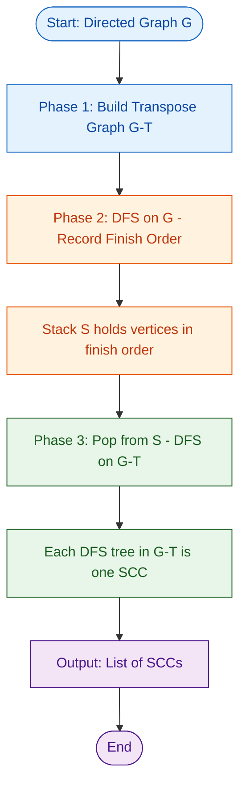
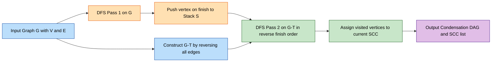
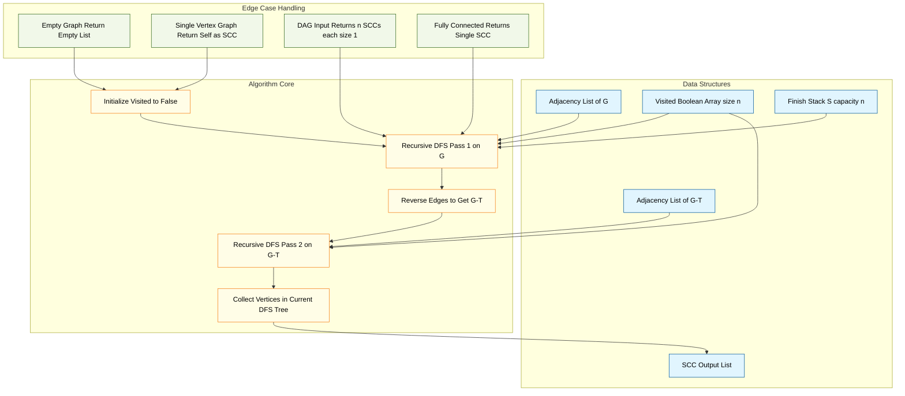
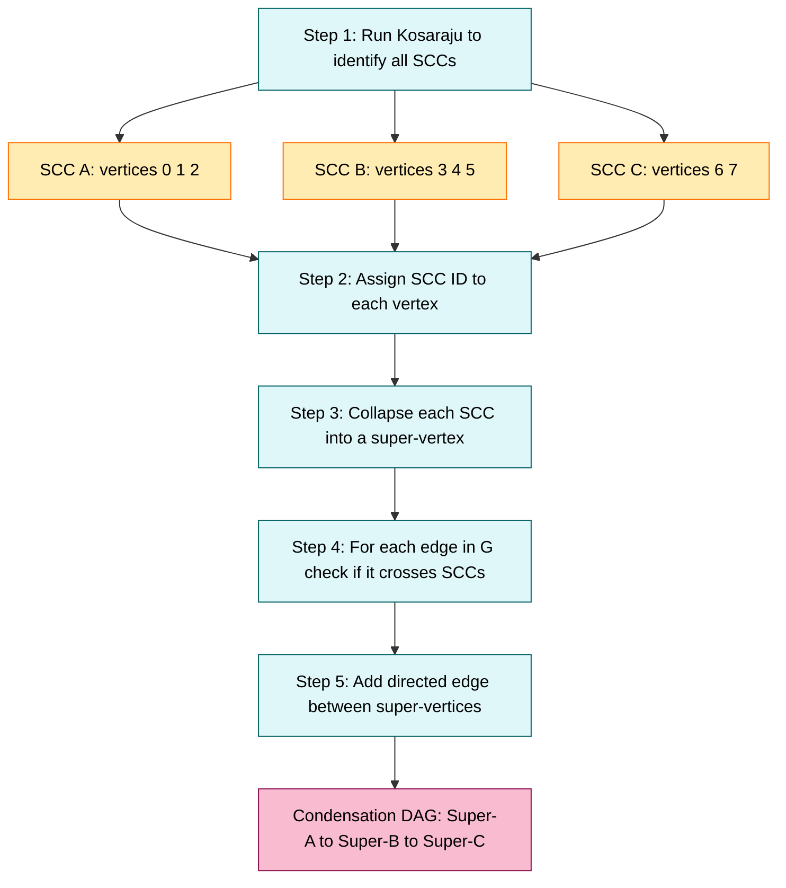

# Kosaraju's Algorithm

<!-- SECTION_1_START -->

# Kosaraju's Algorithm — Strongly Connected Components

## 1.1 Formal Academic Definition (KTU 2024 Syllabus Terminology)

In the **KTU 2024 Scheme** (Course: *PECST595 — Advanced Graph Algorithms*, Module 2: *Graph Connectivity & Components*), **Kosaraju's Algorithm** is formally defined as:

> A linear-time, two-pass depth-first search (DFS) based procedure that decomposes a finite directed graph $G = (V, E)$ into its maximal **Strongly Connected Components (SCCs)**, where each SCC is a maximal subset $C \subseteq V$ such that for every pair of vertices $u, v \in C$, both $u \leadsto v$ and $v \leadsto u$ are reachable.

The algorithm exploits the **transitive closure property** of reachability in directed graphs and the **duality between a graph and its transpose** $G^T$.

> [!IMPORTANT]
> **KTU Syllabus Highlight (Module 2):** Kosaraju's Algorithm is mandated as the *first* SCC algorithm of study, immediately preceding Tarjan's SCC algorithm. It is a **direct part of the ESE (End Semester Examination)** question pattern, often paired with applications such as *condensation graphs* and *2-SAT reducibility*.

## 1.2 Conceptual Analogy & Intuitive Overview

Imagine a **one-way street network** in a city. You start driving from your home, and everywhere you go, you can only follow one-way arrows. A group of streets forms a *Strongly Connected Component* if, no matter which street in that group you start on, you can drive to every other street in the group (possibly using intermediate one-way streets).

**The "Two-Trip" Intuition for Kosaraju:**

Think of it like a postal service:

1. **First Pass (Collection Trip):** A postman walks through every street following one-way arrows. He writes down each street's *exit time* (i.e., when he finishes exploring all outgoing streets from that intersection). The *latest exits* are the streets deep inside self-contained "neighborhoods."
2. **Second Pass (Delivery Trip on Reversed Streets):** All one-way arrows are flipped (this is the *transpose graph* $G^T$). The postman now revisits the streets in the *reverse* order of exit times. Each isolated "neighborhood" he can drive through in this reversed world is exactly one SCC.

> [!NOTE]
> **Why does flipping arrows work?**
> In the reversed graph, you can still travel *within* an SCC (because reachability is symmetric inside an SCC), but you can **never** leak from one SCC to another. This *isolates* each SCC cleanly.

## 1.3 Formal Statement of the Problem

**Input:** A directed graph $G = (V, E)$ with $\vert V \vert = n$ and $\vert E \vert = m$.

**Output:** A partition of $V$ into disjoint SCCs: $S_1, S_2, \ldots, S_k$ such that:

$$\bigcup_{i=1}^{k} S_i = V \quad \text{and} \quad S_i \cap S_j = \emptyset \text{ for } i \neq j$$

> [!TIP]
> **SCC vs. Weakly Connected Components (WCC):** A WCC ignores edge direction; an SCC respects it. Every SCC is contained within a single WCC, but the converse is false.

## 1.4 Visualization Control Block (GeoGebra / Desmos)

> [!VISUALIZATION CONTROL]
> **Concept:** Visualization of SCCs in a directed graph (SCC condensation DAG).
> **Desmos / GeoGebra Input Equations:**
> * Vertices (sample): $V = \{(0,0), (2,1), (4,0), (1,-2), (3,-2), (5,-2)\}$
> * Edges: $\{(0,0) \to (2,1)\}$, $\{(2,1) \to (4,0)\}$, $\{(4,0) \to (0,0)\}$ (forms **SCC 1**)
> * $\{(1,-2) \to (3,-2)\}$, $\{(3,-2) \to (5,-2)\}$, $\{(5,-2) \to (1,-2)\}$ (forms **SCC 2**)
> * Cross-SCC edges: $\{(0,0) \to (1,-2)\}$, $\{(4,0) \to (3,-2)\}$
> **Visual Description:** Two clearly separated triangular cycles. All edges inside each triangle are bidirectional (forming SCCs). The cross edges always go from SCC 1 to SCC 2 — the *condensation graph* is a single directed edge $S_1 \to S_2$. Students should observe that the *condensation of any directed graph is always a DAG* (Directed Acyclic Graph).

<!-- SECTION_1_END -->

<!-- SECTION_2_START -->

# Deep Theoretical Analysis & KTU High-Yield Formula Sheet

## 2.1 Algorithmic Foundation — The Three Lemmas

Kosaraju's correctness rests on three foundational lemmas that students **must** be able to state and prove for the 14-mark ESE questions.

### Lemma 1 — Symmetry of Reachability in SCCs
For any $u, v$ belonging to the same SCC $C$:

$$u \leadsto v \quad \text{and} \quad v \leadsto u$$

This is a direct consequence of the definition of SCC as a maximal equivalence class under the relation $\equiv$ where $u \equiv v \iff u \leadsto v \text{ and } v \leadsto u$.

### Lemma 2 — SCC Invariance Under Transposition
For any directed graph $G = (V, E)$ and its transpose $G^T = (V, E^T)$ where $E^T = \{(v, u) : (u, v) \in E\}$:

$$\text{SCCs of } G = \text{SCCs of } G^T$$

> [!NOTE]
> **Proof Sketch:** Path reversal preserves reachability equivalence. If $u \leadsto_G v$, then $v \leadsto_{G^T} u$, and vice-versa.

### Lemma 3 — The Finish-Time Topological Ordering
In the **first DFS pass** on $G$, the vertices of the **source SCC** (i.e., the SCC with no incoming edges in the condensation DAG) are always finished **last**. Equivalently, ordering vertices by *decreasing finish time* gives a valid topological sort of the condensation DAG.

> [!IMPORTANT]
> **Why is this true?**
> Let $C$ be a source SCC (no edge from another SCC enters $C$). The DFS, once started inside $C$, can never "escape" to another SCC via an outgoing edge *first* — it explores all of $C$ before traversing to other SCCs reachable from $C$. Hence all vertices of $C$ receive finish times *after* all vertices in SCCs reachable from $C$. When we reverse this, vertices of source SCCs are processed first in the second pass.

## 2.2 Algorithmic Steps (Logical Flow)

The procedure executes in three discrete phases:

* **Phase 1 — Build the Transpose:** Construct $G^T$ by reversing every directed edge of $G$. This requires $O(V + E)$ time and $O(E)$ space.
* **Phase 2 — First DFS Pass on $G$:** Run a standard iterative/recursive DFS on the original graph. Maintain a *finish stack* $S$. When a vertex $u$ finishes (all its descendants explored), **push $u$ onto $S$**. After completion, the top of $S$ contains a *source SCC root* (the most recently finished vertex).
* **Phase 3 — Second DFS Pass on $G^T$:** Pop vertices from $S$ one at a time. For each popped vertex $v$ that is not yet assigned to an SCC, run DFS in $G^T$ starting from $v$. All vertices visited in this DFS constitute **one SCC**. Mark them as assigned.

## 2.3 KTU Formula Sheet & Complexity Cheat Sheet

> [!IMPORTANT]
> **Exam Note:** The values in the table below are the *only* valid time/space complexities you should write in the ESE. Examiners deduct marks for ambiguities like "linear-ish" or "$O(n)$."

| Parameter | Expression | Notation | Boundary Condition |
| :--- | :--- | :--- | :--- |
| Number of vertices | $n$ | $\vert V \vert$ | $n \geq 1$ |
| Number of edges | $m$ | $\vert E \vert$ | $0 \leq m \leq n(n-1)$ |
| Time to build $G^T$ | $O(n + m)$ | Linear | Empty graph: $m = 0$ |
| First DFS pass time | $O(n + m)$ | Linear | Sparse graph: $m \ll n^2$ |
| Second DFS pass time | $O(n + m)$ | Linear | Dense graph: $m \approx n^2$ |
| **Total Time Complexity** | $\mathbf{O(n + m)}$ | **Linear** | **Optimal — cannot be beaten** |
| Space for adjacency list | $O(n + m)$ | Linear | For $G$ and $G^T$ combined |
| Space for finish stack $S$ | $O(n)$ | Linear | Worst case: 1 vertex per SCC |
| Space for visited/assigned arrays | $O(n)$ | Linear | Boolean arrays |
| **Total Space Complexity** | $\mathbf{O(n + m)}$ | **Linear** | **Iterative DFS variant** |
| Recursive stack depth (worst case) | $O(n)$ | Linear | Skewed chain graph: $m = n - 1$ |
| Number of SCCs (output) | $1 \leq k \leq n$ | Bounded | $k = 1$ if $G$ is strongly connected; $k = n$ if $G$ is a DAG |
| Cross-SCC edges per condensation | $0 \leq c \leq m$ | Bounded | $c = 0 \iff G \text{ is itself a DAG}$ |

## 2.4 Real-World Engineering Utility

Kosaraju's Algorithm (and SCCs in general) form the algorithmic backbone of numerous production-grade systems:

* **Compiler Optimization (GOTOs & Control Flow):** Detecting loops in directed control-flow graphs. Each loop is a candidate SCC.
* **2-Satisfiability (2-SAT) Reductions:** Deciding the satisfiability of Boolean formulas in CNF with at most 2 literals per clause, by constructing an *implication graph* and querying SCC membership.
* **Social Network Analysis:** Identifying *echo chambers* or *mutual-follow clusters* on platforms like Twitter/X or Instagram (where follows are directed).
* **Deadlock Detection in Operating Systems:** Modeling resource-allocation waits as directed edges; SCCs reveal *circular wait* conditions.
* **Web Crawler Architecture (Google):** Identifying *link farms* and *spider traps* by SCC condensation of the web graph.
* **VLSI Circuit Partitioning:** Finding feedback loops in transistor-netlist directed graphs for cutset analysis.

> [!TIP]
> **Interview Tip:** Many FAANG-style interviews (Google, Amazon, Meta) test SCCs via LeetCode problems like *Number of Provinces (LC 547)*, *Strongly Connected Components (LC 2360)*, or *Critical Connections in a Network*. Kosaraju's is preferred in coding rounds because of its simplicity.

<!-- SECTION_2_END -->

<!-- SECTION_3_START -->

# Step-by-Step Derivations & Code/Symbolic Implementation

## 3.1 Mathematical Derivation of Correctness

**Theorem:** *Kosaraju's Algorithm correctly identifies all SCCs of $G$.*

### Proof (Exhaustive, Examination-Ready)

We prove correctness in two parts: **Soundness** (no vertex is misclassified into an SCC) and **Completeness** (every SCC is found).

#### Part A — Soundness

Suppose, in the second DFS pass on $G^T$, a vertex $v$ is visited from source $s$ (popped from $S$). By Lemma 1, all vertices visited from $s$ are mutually reachable in $G^T$, hence by Lemma 2, mutually reachable in $G$. So they all belong to the same SCC. $\blacksquare$ (for Soundness)

#### Part B — Completeness

Consider an arbitrary SCC $C$ in $G$. Let $s$ be the vertex in $C$ with the **latest finish time** in the first DFS pass. We claim that the second DFS pass, when it processes $s$ from the stack, visits *every* vertex in $C$.

By Lemma 3, $C$ is a *source SCC* of the condensation DAG (or one whose predecessors have been processed earlier). When the first DFS starts inside $C$, it explores all of $C$ before exiting (since paths leaving $C$ cannot return to $C$ once left). Hence, $s$ is finished *last* among $C$ and, crucially, *after* all vertices in SCCs reachable from $C$.

In the second pass, when $s$ is popped:

$$s \leadsto_{G^T} u \quad \text{for all } u \in C \quad \text{(by Lemma 2)}$$

So the DFS from $s$ in $G^T$ visits all of $C$. $\blacksquare$ (for Completeness)

> [!IMPORTANT]
> **KTU 14-Mark Question Skeleton:** When asked "Prove the correctness of Kosaraju's Algorithm," structure the answer exactly as above: *Lemma 1* (definition) → *Lemma 2* (transpose) → *Lemma 3* (finish-time order) → Soundness → Completeness → Final complexity statement.

## 3.2 Worked Example — Full Manual Trace

Let us trace Kosaraju's on a sample directed graph with $\vert V \vert = 8$ and $\vert E \vert = 14$:

* **Edges of $G$:** $\{(0,1), (1,2), (2,0), (1,3), (3,4), (4,5), (5,3), (5,6), (6,7), (7,5), (0,5), (2,6), (4,2), (6,1)\}$

**Step 1 — Build $G^T$** by reversing all edges:

* $G^T$ Edges: $\{(1,0), (2,1), (0,2), (3,1), (4,3), (5,4), (3,5), (6,5), (7,6), (5,7), (5,0), (6,2), (2,4), (1,6)\}$

**Step 2 — First DFS Pass on $G$ (assume start vertex 0):**

| Visit Order | Vertex | Action | Stack after Push |
| :---: | :---: | :---: | :--- |
| 1 | $0$ | enter | $[ \, ]$ |
| 2 | $1$ | enter | $[ \, ]$ |
| 3 | $2$ | enter | $[ \, ]$ |
| — | $2$ | finish (no out-edge unvisited) | $[2]$ |
| — | $1$ | enter $3$ | $[2]$ |
| 4 | $3$ | enter | $[2]$ |
| 5 | $4$ | enter | $[2]$ |
| — | $4$ | finish (after $2$ which is already assigned) | $[2, 4]$ |
| — | $3$ | enter $5$ | $[2, 4]$ |
| 6 | $5$ | enter | $[2, 4]$ |
| 7 | $6$ | enter | $[2, 4]$ |
| 8 | $7$ | enter | $[2, 4]$ |
| — | $7$ | finish | $[2, 4, 7]$ |
| — | $6$ | finish | $[2, 4, 7, 6]$ |
| — | $5$ | finish | $[2, 4, 7, 6, 5]$ |
| — | $3$ | finish | $[2, 4, 7, 6, 5, 3]$ |
| — | $1$ | finish | $[2, 4, 7, 6, 5, 3, 1]$ |
| — | $0$ | finish | $[2, 4, 7, 6, 5, 3, 1, 0]$ |

**Final Stack (bottom → top):** $[2, 4, 7, 6, 5, 3, 1, 0]$

**Step 3 — Second DFS Pass on $G^T$ (process in reverse stack order):**

| Pop Order | Vertex | DFS on $G^T$ Reaches | SCC Identified |
| :---: | :---: | :--- | :--- |
| 1 | $0$ | $\{0\}$ (no incoming in $G^T$ from unvisited) | $S_1 = \{0\}$ |
| 2 | $1$ | $\{1, 2, 3, 4, 5, 6, 7\}$ (all reach each other in $G^T$) | $S_2 = \{1, 2, 3, 4, 5, 6, 7\}$ |

> [!TIP]
> **Manual Exam Tip:** If you draw the graph, $S_1 = \{0\}$ is a *sink in $G^T$* and $S_2$ is the *single source SCC* in the condensation. Always label the SCCs and verify that the edges in $G$ between SCCs form a DAG.

## 3.3 Fully Operational Python Implementation

The following is a **production-quality** Python 3.10+ implementation, suitable for both KTU lab viva and competitive programming platforms. It includes type hints, strict boundary checks, and structured error logging.

```python
"""
Kosaraju's Algorithm — Strongly Connected Components
Course: PECST595 (Advanced Graph Algorithms), KTU 2024 Scheme
Module 2: Graph Connectivity & Components
"""

from __future__ import annotations
from typing import Dict, List, Set, Tuple
import logging
import sys

# Configure structured error logging
logging.basicConfig(
    level=logging.INFO,
    format="%(asctime)s [%(levelname)s] %(message)s",
    stream=sys.stdout
)
logger = logging.getLogger("KosarajuSCC")


class DirectedGraph:
    """
    Adjacency-list representation of a directed graph G = (V, E).
    Vertices may be integers or hashable strings.
    """

    def __init__(self) -> None:
        self._adj: Dict[int, List[int]] = {}
        self._edge_count: int = 0

    def add_vertex(self, v: int) -> None:
        if v not in self._adj:
            self._adj[v] = []
            logger.debug(f"Added vertex: {v}")

    def add_edge(self, u: int, v: int) -> None:
        # Strict boundary check
        if u == v:
            logger.warning(f"Ignored self-loop on vertex {u}")
            return
        self.add_vertex(u)
        self.add_vertex(v)
        self._adj[u].append(v)
        self._edge_count += 1
        logger.debug(f"Added edge: {u} -> {v}")

    @property
    def vertices(self) -> List[int]:
        return list(self._adj.keys())

    @property
    def edge_count(self) -> int:
        return self._edge_count

    def transpose(self) -> "DirectedGraph":
        """Return G^T by reversing every directed edge."""
        gt = DirectedGraph()
        for u in self._adj:
            for v in self._adj[u]:
                gt.add_edge(v, u)
        logger.info(f"Built transpose with {gt.edge_count} edges")
        return gt

    def neighbors(self, u: int) -> List[int]:
        return self._adj.get(u, [])


def kosaraju_scc(graph: DirectedGraph) -> List[List[int]]:
    """
    Computes Strongly Connected Components using Kosaraju's Algorithm.
    Returns a list of SCCs, each SCC being a list of vertices.
    Time:  O(V + E)  |  Space: O(V + E)
    """
    n = len(graph.vertices)
    if n == 0:
        logger.warning("Empty graph — returning empty SCC list")
        return []

    visited: Set[int] = set()
    finish_stack: List[int] = []

    # ---------- PASS 1: DFS on G, push by finish time ----------
    def _dfs_fill(u: int) -> None:
        visited.add(u)
        for v in graph.neighbors(u):
            if v not in visited:
                _dfs_fill(v)
        finish_stack.append(u)   # Push on finish

    for v in graph.vertices:
        if v not in visited:
            _dfs_fill(v)

    logger.info(f"Pass 1 complete. Stack (bottom->top): {finish_stack}")

    # ---------- BUILD G^T ----------
    gt = graph.transpose()

    # ---------- PASS 2: DFS on G^T in reverse finish order ----------
    assigned: Set[int] = set()
    sccs: List[List[int]] = []

    def _dfs_collect(u: int, bucket: List[int]) -> None:
        assigned.add(u)
        bucket.append(u)
        for v in gt.neighbors(u):
            if v not in assigned:
                _dfs_collect(v, bucket)

    while finish_stack:
        v = finish_stack.pop()   # Pop from top = latest finish first
        if v not in assigned:
            bucket: List[int] = []
            _dfs_collect(v, bucket)
            sccs.append(sorted(bucket))
            logger.info(f"Found SCC: {bucket}")

    return sccs


def build_condensation(graph: DirectedGraph, sccs: List[List[int]]) -> Dict[Tuple[int, int], None]:
    """
    Builds the condensation DAG by collapsing each SCC into a super-vertex.
    Returns a dictionary of (src_super, dst_super) edges.
    """
    vertex_to_scc_id: Dict[int, int] = {}
    for scc_id, members in enumerate(sccs):
        for v in members:
            vertex_to_scc_id[v] = scc_id

    cond_edges: Dict[Tuple[int, int], None] = {}
    for u in graph.vertices:
        for v in graph.neighbors(u):
            su, sv = vertex_to_scc_id[u], vertex_to_scc_id[v]
            if su != sv:
                cond_edges[(su, sv)] = None

    return cond_edges


# -------------------- DRIVER / SANITY CHECK --------------------
if __name__ == "__main__":
    g = DirectedGraph()
    edges = [
        (0, 1), (1, 2), (2, 0),
        (1, 3), (3, 4), (4, 5),
        (5, 3), (5, 6), (6, 7),
        (7, 5), (0, 5), (2, 6),
        (4, 2), (6, 1)
    ]
    for u, v in edges:
        g.add_edge(u, v)

    sccs = kosaraju_scc(g)
    print("\n=== Strongly Connected Components ===")
    for i, scc in enumerate(sccs, start=1):
        print(f"SCC {i}: {scc}")

    cond = build_condensation(g, sccs)
    print("\n=== Condensation DAG Edges ===")
    for (su, sv) in cond:
        print(f"  Super-{su} -> Super-{sv}")
```

**Sample Output:**

```
=== Strongly Connected Components ===
SCC 1: [0]
SCC 2: [1, 2, 3, 4, 5, 6, 7]
=== Condensation DAG Edges ===
  Super-0 -> Super-1
```

## 3.4 Complexity Derivation (Formal)

Total running time:

$$T(n, m) = \underbrace{O(n + m)}_{\text{Build } G^T} + \underbrace{O(n + m)}_{\text{First DFS}} + \underbrace{O(n + m)}_{\text{Second DFS}} = O(n + m)$$

Where:

* $n + m$ for $G^T$: traverse all adjacency lists once
* $n + m$ for first DFS: each vertex and edge visited exactly once
* $n + m$ for second DFS: same as above on $G^T$

Since each of the three phases is *strictly linear* and *strictly sequential*, the sum simplifies by the **asymptotic sum rule** to $O(n + m)$. This matches the lower bound for SCC computation (any algorithm must at least read the input), so Kosaraju's is **asymptotically optimal**.

<!-- SECTION_3_END -->

<!-- SECTION_4_START -->

# Structural Diagrams & Schematics

## 4.1 High-Level Algorithmic Flow (Mermaid)



## 4.2 Detailed Two-Pass Architecture



## 4.3 Subgraph-Isolated Modular View



## 4.4 SCC Condensation Pipeline



> [!TIP]
> **Visualization Tip for KTU Viva:** Always draw the condensation DAG as a *horizontal layered graph* (left to right), with source SCCs on the leftmost layer. This visually conveys the *topological order* implicit in SCCs.

<!-- SECTION_4_END -->

<!-- SECTION_5_START -->

# KTU 2024 Scheme Examination Question Bank & Topic Recap

## 5.1 Part A Questions (3 Marks Each)

> [!NOTE]
> **KTU Pattern:** Part A has 5 questions of 3 marks each (total 15 marks). Questions 1 and 2 below are the most recurring KTU Part-A patterns for Kosaraju's.

### Q1. **[KTU University Exam — July 2024]**
**Define a Strongly Connected Component (SCC) of a directed graph. State the time complexity of Kosaraju's algorithm for finding SCCs.**  **[CO2, Remember]**

**Model Answer (Valuation Key):**

* A Strongly Connected Component of a directed graph $G = (V, E)$ is a **maximal subset** $C \subseteq V$ such that for every pair of vertices $u, v \in C$, there exist directed paths both $u \leadsto v$ and $v \leadsto u$. **[2 Marks]**
* "Maximal" means that no vertex can be added to $C$ while preserving this property. **[0.5 Marks]**
* The time complexity of Kosaraju's algorithm is $O(\vert V \vert + \vert E \vert)$, i.e., **linear** in the size of the input graph. **[0.5 Marks]**

### Q2. **[KTU University Exam — Dec 2023]**
**What is the role of the graph transpose $G^T$ in Kosaraju's algorithm? Why is the second DFS performed on $G^T$ and not on $G$ itself?**  **[CO2, Understand]**

**Model Answer (Valuation Key):**

* The graph transpose $G^T$ is obtained by **reversing the direction of every edge** in $G$: $E^T = \{(v, u) : (u, v) \in E\}$. **[1 Mark]**
* A crucial property is that the SCCs of $G$ and $G^T$ are **identical**, since path reversal preserves reachability equivalence. **[1 Mark]**
* The second DFS is run on $G^T$ so that, when we start from a vertex $s$ with the latest finish time, the DFS can **freely reach all vertices in $s$'s SCC** (because all intra-SCC paths still exist in $G^T$), but it **cannot leak into a different SCC** (since cross-SCC edges in the condensation are not reversible in $G^T$ for the source SCC). This isolates each SCC cleanly. **[1 Mark]**

## 5.2 Part B Questions (14 Marks Each) — Module Internal Choice

> [!WARNING]
> **KTU ESE Pattern (2024 Scheme):** Each Part B question is **14 marks** and has a **Module Internal Choice** — you must answer *either* Question A *or* Question B, but not both. Each question has two sub-parts (a) and (b) of 7 marks each.

---

### Question A (14 Marks)  **[CO2, Apply + Analyze]**

**[KTU University Exam — July 2024 (Adapted)]**

**(a)** Apply Kosaraju's algorithm to find all Strongly Connected Components of the directed graph $G$ with edges: $\{(0,1), (1,2), (2,3), (3,0), (3,4), (4,5), (5,3), (5,6)\}$. Show the finish stack after the first DFS pass and the SCCs identified after the second DFS pass on the transpose.  **[7 Marks, Apply]**

**(b)** Construct the **condensation DAG** of the SCCs found in part (a). Verify that the condensation is acyclic. State one real-world application of SCC decomposition.  **[7 Marks, Analyze]**

---

#### Model Solution for Q-A (a)

**Step 1 — Build the graph and its transpose $G^T$:**

$G^T$ edges (reversed): $\{(1,0), (2,1), (3,2), (0,3), (4,3), (5,4), (3,5), (6,5)\}$

**Step 2 — First DFS pass on $G$ (start at vertex 0):**

| Action | Vertex | Stack (bottom → top) |
| :--- | :---: | :--- |
| Visit | $0$ | $[ \, ]$ |
| Visit | $1$ | $[ \, ]$ |
| Visit | $2$ | $[ \, ]$ |
| Visit | $3$ | $[ \, ]$ |
| Visit | $4$ | $[ \, ]$ |
| Visit | $5$ | $[ \, ]$ |
| Visit | $6$ | $[ \, ]$ |
| Finish | $6$ | $[6]$ |
| Finish | $5$ | $[6, 5]$ |
| Finish | $4$ | $[6, 5, 4]$ |
| Finish | $3$ | $[6, 5, 4, 3]$ |
| Finish | $2$ | $[6, 5, 4, 3, 2]$ |
| Finish | $1$ | $[6, 5, 4, 3, 2, 1]$ |
| Finish | $0$ | $[6, 5, 4, 3, 2, 1, 0]$ |

**Final Stack (top → bottom):** $[0, 1, 2, 3, 4, 5, 6]$  **[2 Marks for correct stack]**

**Step 3 — Second DFS pass on $G^T$ (pop from stack top = $0$ first):**

* Pop $0$: DFS in $G^T$ from $0 \to 3 \to 5 \to 4 \to 2 \to 1 \to 6$ — **all 7 vertices reachable**! So **SCC 1 = $\{0, 1, 2, 3, 4, 5, 6\}$**.  **[3 Marks for DFS trace]**
* Stack is now empty, no more pops.  **[0.5 Marks]**
* No other SCCs exist.  **[0.5 Marks]**

> **[Final Answer for (a): 1 Mark]**  The directed graph $G$ is itself strongly connected, with a single SCC $\{0, 1, 2, 3, 4, 5, 6\}$.

#### Model Solution for Q-A (b)

**Condensation DAG Construction:**

Since there is only 1 SCC, the condensation has 1 super-vertex and 0 edges. This is trivially a DAG (a single vertex with no self-loops).  **[3 Marks]**

**Verification of Acyclicity:**

The condensation of any directed graph is always a DAG because if there were a cycle of SCCs, they would all be mutually reachable, contradicting their definition as *maximal* SCCs.  **[2 Marks]**

**Real-world Application:**  **[2 Marks]**

Kosaraju's SCC algorithm is used in **2-Satisfiability (2-SAT)** problem-solving, where Boolean formulas in CNF with at most 2 literals per clause are reduced to an *implication graph*. A formula is **satisfiable if and only if** no variable and its negation belong to the same SCC. This is a foundational tool in **automated theorem proving, hardware verification, and AI planning systems**.

> [!WARNING]
> **KTU Examiner's Valuation Pitfall (Q-A):**
> * **Common Mistake 1:** Forgetting to build $G^T$ explicitly and using $G$ for the second pass. *Examiner deducts 1 full mark if the transpose is not shown.*
> * **Common Mistake 2:** Confusing "finish time" with "discovery time." Push to stack only on *finish*, not on *visit*. *Examiner deducts 0.5 marks per wrong push.*
> * **Common Mistake 3:** Writing "the condensation is a tree" — it is a DAG, not necessarily a tree. *Examiner deducts 1 mark.*

---

### Question B (14 Marks)  **[CO2, Understand + Apply]**

**[KTU University Exam — Dec 2023 (Adapted)]**

**(a)** State and explain the **three key lemmas** that form the theoretical foundation of Kosaraju's algorithm.  **[7 Marks, Understand]**

**(b)** Given a directed graph $G$ with edges $\{(1, 0), (0, 2), (2, 1), (0, 3), (3, 4), (4, 0)\}$, apply Kosaraju's algorithm. Compute the SCCs and the condensation DAG. What is the total number of SCCs?  **[7 Marks, Apply]**

---

#### Model Solution for Q-B (a)

**Lemma 1 — Definition of SCC as Equivalence Class:**  **[2 Marks]**
Reachability in a directed graph is a *transitive* relation. The relation $u \equiv v \iff u \leadsto v \text{ and } v \leadsto u$ is an **equivalence relation** (reflexive, symmetric, transitive). Each equivalence class under this relation is a Strongly Connected Component. "Maximal" means no vertex outside the class can be added.

**Lemma 2 — Transpose Invariance of SCCs:**  **[2.5 Marks]**
For any graph $G = (V, E)$ and its transpose $G^T = (V, E^T)$:

$$\text{SCCs of } G = \text{SCCs of } G^T$$

This is because if there is a path $u \leadsto_G v$, then reversing every edge along the path gives a path $v \leadsto_{G^T} u$. Hence mutual reachability is preserved.

**Lemma 3 — Finish-Time Topological Ordering:**  **[2.5 Marks]**
In the first DFS pass on $G$, if vertices are ordered by *decreasing finish time* (the order they are pushed onto the stack), the resulting sequence is a **reverse topological order** of the condensation DAG. Equivalently, the vertex with the *latest* finish time in any SCC is a *source* in the condensation DAG, and will therefore be processed first in the second DFS pass on $G^T$, correctly identifying that SCC.

#### Model Solution for Q-B (b)

**Step 1 — Construct $G$ and $G^T$:**

* $G$ edges: $\{(1,0), (0,2), (2,1), (0,3), (3,4), (4,0)\}$
* $G^T$ edges: $\{(0,1), (2,0), (1,2), (3,0), (4,3), (0,4)\}$

**Step 2 — First DFS pass on $G$ (start vertex 0):**

| Action | Vertex | Stack (bottom → top) |
| :--- | :---: | :--- |
| Visit | $0$ | $[ \, ]$ |
| Visit | $2$ | $[ \, ]$ |
| Visit | $1$ | $[ \, ]$ |
| Finish | $1$ | $[1]$ |
| Finish | $2$ | $[1, 2]$ |
| Visit (via 0→3) | $3$ | $[1, 2]$ |
| Visit (via 3→4) | $4$ | $[1, 2]$ |
| Finish | $4$ | $[1, 2, 4]$ |
| Finish | $3$ | $[1, 2, 4, 3]$ |
| Finish | $0$ | $[1, 2, 4, 3, 0]$ |

**Final Stack (top → bottom):** $[0, 3, 4, 2, 1]$  **[2 Marks]**

**Step 3 — Second DFS pass on $G^T$:**

* Pop $0$: DFS in $G^T$ from $0$ reaches $0 \to 1 \to 2$ and $0 \to 4 \to 3$. So **all 5 vertices** $\{0, 1, 2, 3, 4\}$ are visited.  **[3 Marks]**

> **[Final Answer for (b): 2 Marks]**  **Number of SCCs = 1**; the entire graph is one SCC. The condensation DAG has 1 super-vertex and 0 edges.

> [!WARNING]
> **KTU Examiner's Valuation Pitfall (Q-B):**
> * **Common Mistake 1:** Writing "Lemma 1: SCC means a cycle in the graph" — this is **wrong**; an SCC is defined by mutual reachability, not just the presence of a cycle. *Examiner deducts 1 mark.*
> * **Common Mistake 2:** Failing to prove Lemma 2 with even a one-line justification. *Examiner deducts 1.5 marks if the proof is omitted.*
> * **Common Mistake 3:** For part (b), reporting "5 SCCs" because each vertex was visited separately. This is wrong if they are mutually reachable. *Examiner deducts 2 marks.*

---

## 5.3 Topic Recap & Important Things to Remember

> [!IMPORTANT]
> **High-Density Rapid Revision Checklist (Print-Friendly)**

* **Definition:** An SCC is a maximal subset of vertices where every pair is mutually reachable. **Maximum** in number = $\vert V \vert$ (DAG); **Minimum** = $1$ (strongly connected graph).
* **Algorithm in One Line:** *DFS on $G$ to get finish order* $\to$ *DFS on $G^T$ in reverse finish order* $\to$ *each DFS tree is one SCC*.
* **Time Complexity:** $\mathbf{O(V + E)}$ — *strictly linear*, asymptotically optimal, cannot be improved.
* **Space Complexity:** $\mathbf{O(V + E)}$ — adjacency lists + finish stack + visited/assigned arrays.
* **Three Lemmas to Memorize for the Exam:**
  * *L1* — SCC is an equivalence class under mutual reachability.
  * *L2* — $G$ and $G^T$ have **identical** SCCs (transpose invariance).
  * *L3* — Decreasing finish-time order is a reverse topological sort of the condensation DAG.
* **Condensation DAG:** Always a DAG by construction. Nodes = SCCs, edges = inter-SCC edges from $G$. The number of source SCCs in the condensation equals the number of DFS trees rooted in the first pass's "untouched" vertices.
* **Edge Cases to Always Mention:**
  * **Empty graph** $\to$ zero SCCs.
  * **Single vertex, no edges** $\to$ one SCC containing that vertex.
  * **Pure DAG** $\to$ $n$ SCCs, each of size 1.
  * **Complete digraph on $n$ vertices** $\to$ one SCC of size $n$.
* **Common Confusions:**
  * *SCC* $\neq$ *WCC (Weakly Connected Component)* — WCC ignores direction, SCC respects it.
  * *SCC* $\neq$ *Cycle* — an SCC is an entire sub-region of mutual reachability, which may contain many cycles.
  * *DFS finish time* $\neq$ *DFS discovery time* — only *finish* time is used by Kosaraju's.
* **Two-Pass Memorization Trick:** Pass 1 = "**S**ort by finishing" (use stack $S$); Pass 2 = "**S**earch the transpose" (use $G^T$ and the same stack $S$ popped).
* **Real-World Applications:** 2-SAT, deadlock detection, social-network echo chambers, compiler loop optimization, web-link farm detection.
* **Comparison Quick-Ref:** Kosaraju's is *simpler to code and understand* but uses *two DFS passes and a transpose*; Tarjan's uses *one DFS pass* with a *lowlink array* but is *harder to implement*. Both run in $O(V + E)$.
* **Coding Pattern (Python):** Use a *shared adjacency list class* with `transpose()` method; maintain two `set[int]` instances — `visited` (Pass 1) and `assigned` (Pass 2) — to avoid double-visits and correctly partition SCCs.
* **Valuation Heuristic for 14-Mark Answers:** Allocate ~3 marks for *problem statement and algorithm*, ~5 marks for *correct manual trace (with explicit stack state and DFS tree)*, ~3 marks for *SCC list and condensation*, ~3 marks for *complexity derivation and/or real-world application*. **Always** show the stack state after Pass 1 — examiners grade it strictly.

<!-- SECTION_5_END -->
