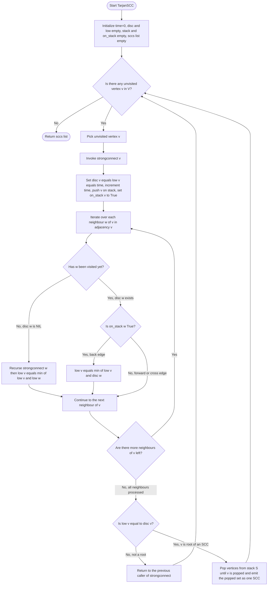
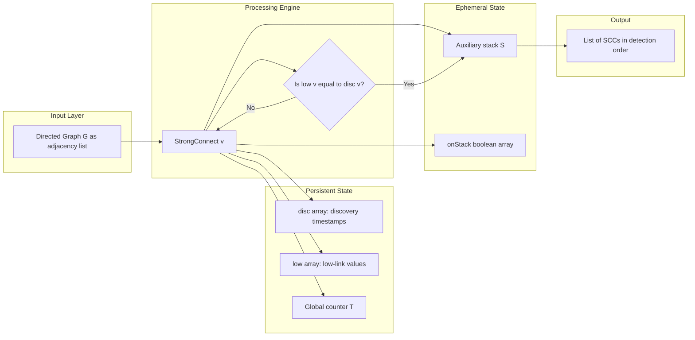
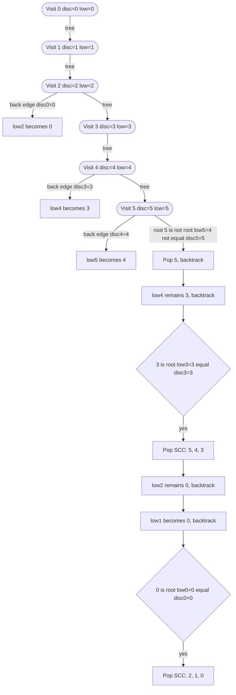

# Strongly Connected Components (SCC) - Tarjan's Algorithm

<!-- SECTION_1_START -->
# Tarjan's Strongly Connected Components (SCC) Algorithm

## 1.1 Formal Definition (KTU 2024 Syllabus Terminology)

A **Strongly Connected Component (SCC)** of a directed graph $G = (V, E)$ is a maximal set of vertices $C \subseteq V$ such that for every pair of vertices $u, v \in C$, there exists a directed path from $u$ to $v$ **and** a directed path from $v$ to $u$.

> [!NOTE]
> **KTU 2024 Definition (PECST595 - Module 2)**
> "An SCC is an equivalence class under the reachability relation in a directed graph. The condensation of $G$ (where each SCC is contracted to a single node) is always a **Directed Acyclic Graph (DAG)**."

**Tarjan's Algorithm** (Robert Tarjan, 1972) is a single-pass **Depth First Search (DFS)** based procedure that finds all SCCs of a directed graph in $O(V + E)$ time using an auxiliary stack, two integer arrays `disc[]` and `low[]`, and recursion.

> [!IMPORTANT]
> Tarjan's algorithm is preferred over Kosaraju's algorithm because it requires **only one DFS pass** and avoids the explicit second pass on the transposed graph, making it more cache-friendly and memory-efficient for very large graphs.

---

## 1.2 Conceptual Analogy & Intuition

> [!TIP]
> **Analogy — The Subway Map of an Island City**
>
> Imagine a circular subway system on an island. Some stations are connected by **one-way** tracks. A "Strongly Connected Component" is a cluster of stations where, no matter which station you start from, you can reach every other station in the cluster (possibly by changing trains multiple times). The island may have several such clusters, and the connections *between* clusters always flow in one direction — never both ways. These clusters are your SCCs.
>
> Tarjan's algorithm is like a subway inspector who walks the tracks in DFS order, carrying a **discovery ticket** (the `disc[]` number) and a **"lowest reachable ticket"** (`low[]` value). Whenever the inspector realizes that a station cannot reach an earlier-discovered station *outside* the current path, that station is flagged as the "root" of a new SCC, and the entire current subway cluster is "sealed off" and reported.

## 1.3 Visualization Control

> [!VISUALIZATION CONTROL]
> **Concept:** A directed graph with 3 SCCs and the condensation DAG.
> **Graph Edges (input list for GeoGebra / Desmos):**
> * Vertices: $\{0, 1, 2, 3, 4, 5\}$
> * Directed edges: $0 \to 1$, $1 \to 2$, $2 \to 0$, $2 \to 3$, $3 \to 4$, $4 \to 5$, $5 \to 3$
> **Visual Description:** You will observe three visually distinct "circles" of vertices. Circle 1 = $\{0, 1, 2\}$, Circle 2 = $\{3, 4, 5\}$, and a one-way arrow from Circle 1 to Circle 2. Tarjan's DFS enters Circle 1, then Circle 2 (as a child), and reports both in the order $\{5, 4, 3\}$ followed by $\{2, 1, 0\}$.

---

<!-- SECTION_1_END -->

<!-- SECTION_2_START -->
# 2. Deep Theoretical Analysis & KTU High-Yield Formula Sheet

## 2.1 Core Data Structures

Tarjan's algorithm maintains **four** auxiliary data structures indexed by vertex $v$:

| Symbol | Name | Type | Purpose |
|:------:|:-----|:----:|:--------|
| $disc[v]$ | Discovery number | `int` | The DFS visitation timestamp of $v$. |
| $low[v]$ | Low-link value | `int` | The smallest `disc[]` reachable from $v$'s subtree using **zero or more** tree edges followed by **at most one** back edge. |
| $S$ | Auxiliary stack | `list[int]` | Stores all vertices in the current DFS recursion path. |
| $onStack[v]$ | Stack membership flag | `bool` | Marks if $v$ is currently in $S$. |

A **global time counter** $T$ increments every time a new vertex is first discovered.

## 2.2 The Three Operational Rules

**Rule 1 — Initialization on first visit of vertex $v$:**
$$
disc[v] \;\leftarrow\; T, \quad low[v] \;\leftarrow\; T, \quad T \;\leftarrow\; T + 1
$$
Push $v$ onto $S$ and set $onStack[v] \leftarrow \text{True}$.

**Rule 2 — Low-link update while iterating neighbours $w$ of $v$:**

$$
low[v] \;\leftarrow\; \min\!\left(low[v],\; \begin{cases} low[w] & \text{if } w \text{ is unvisited (tree edge)} \\ disc[w] & \text{if } w \text{ is on } S \text{ (back edge)} \end{cases}\right)
$$

> [!IMPORTANT]
> The **forward edges** (neighbour already visited but **not** on the stack) are deliberately **ignored** for `low[]` propagation. This is what guarantees that `low[]` only "sees" vertices inside the current SCC and not in any ancestor's sibling subtree.

**Rule 3 — The Root of an SCC (The Tarjan's "Trigger Condition"):**

$$
\boxed{\; v \text{ is the root of an SCC} \iff low[v] = disc[v] \;}
$$

When this condition is met, repeatedly pop from $S$ until $v$ itself is popped. The popped set forms one SCC.

> [!NOTE]
> **Intuition behind the root condition:** A vertex $v$ whose `low[]` value cannot reach *earlier* than its own discovery time means that the DFS subtree rooted at $v$ has **no back edge** to any ancestor outside itself. Hence $v$ is the deepest entry point of a "closed cycle" — exactly the definition of an SCC root.

## 2.3 KTU Formula / Cheat Sheet

| \# | Concept | Expression | Complexity |
|:-:|:--------|:----------:|:----------:|
| 1 | Time complexity of full Tarjan's pass | $O(\vert V \vert + \vert E \vert)$ | Linear |
| 2 | Space complexity (stack + arrays + recursion) | $O(\vert V \vert)$ | Linear |
| 3 | Low-link recurrence for tree edge $v \to w$ | $low[v] = \min(low[v], low[w])$ | — |
| 4 | Low-link recurrence for back edge $v \to w$ | $low[v] = \min(low[v], disc[w])$ | — |
| 5 | SCC root criterion | $low[v] = disc[v]$ | — |
| 6 | Number of SCCs in a DAG | $\vert V \vert$ (each vertex alone) | — |
| 7 | Number of SCCs in a complete digraph $K_n$ | $1$ | — |
| 8 | Total popping cost across the whole run | $\Theta(\vert V \vert)$ | Each vertex pushed and popped once |

> [!TIP]
> For KTU board exams, memorise **rows 1, 2, 3, 4, and 5** as the high-yield set. The rest are derivable.

## 2.4 Real-World Engineering Applications

| Domain | Use Case of Tarjan's SCC |
|:-------|:-------------------------|
| **Compiler Design** | Detecting mutually-recursive function groups to build a call-graph DAG for inlining and dead-code elimination. |
| **Social Network Analysis** | Identifying tightly-knit communities (e.g., follower cycles) on Twitter/X, Instagram. |
| **Smart City Traffic Routing** | Modelling one-way streets, finding blocks where any road-reversal breaks navigability. |
| **VLSI Circuit Verification** | Finding feedback loops in sequential logic for model checking. |
| **Web Crawlers** | Detecting infinite link traps during URL-graph traversal. |
| **Recommendation Systems** | Computing latent feedback cycles in user-item bipartite graphs. |
| **Database Query Optimisation** | Detecting cycles in join graphs to apply semi-join reductions. |

---

<!-- SECTION_2_END -->

<!-- SECTION_3_START -->
# 3. Step-by-Step Derivation, Algorithm & Python Implementation

## 3.1 The Complete Tarjan's Algorithm (Pseudo-code)

$$
\begin{aligned}
&\textbf{Algorithm: } \text{TarjanSCC}(G = (V, E)) \\
&1.\ \ T \leftarrow 0 \\
&2.\ \ \text{for each } v \in V:\ disc[v] \leftarrow \text{NIL},\ low[v] \leftarrow \text{NIL},\ onStack[v] \leftarrow \text{false} \\
&3.\ \ S \leftarrow \text{empty stack} \\
&4.\ \ \text{for each } v \in V: \\
&5.\quad\ \text{if } disc[v] = \text{NIL}: \\
&6.\qquad \text{StrongConnect}(v) \\
&7.\ \textbf{return} \text{collected SCCs}
\end{aligned}
$$

$$
\begin{aligned}
&\textbf{Procedure: } \text{StrongConnect}(v) \\
&1.\ \ disc[v] \leftarrow T;\ low[v] \leftarrow T;\ T \leftarrow T + 1 \\
&2.\ \ S.\text{push}(v);\ onStack[v] \leftarrow \text{true} \\
&3.\ \ \text{for each } w \in Adj[v]: \\
&4.\quad\ \text{if } disc[w] = \text{NIL}: \\
&5.\qquad \text{StrongConnect}(w) \\
&6.\qquad low[v] \leftarrow \min(low[v], low[w]) \\
&7.\quad \text{elif } onStack[w] = \text{true}: \\
&8.\qquad low[v] \leftarrow \min(low[v], disc[w]) \\
&9.\ \ \text{if } low[v] = disc[v]: \\
&10.\quad \text{repeat} \\
&11.\qquad w \leftarrow S.\text{pop}();\ onStack[w] \leftarrow \text{false} \\
&12.\qquad \text{emit } w \text{ as part of current SCC} \\
&13.\quad \text{until } w = v
\end{aligned}
$$

## 3.2 Exhaustive Worked Example

### 3.2.1 Input Graph

Let $G = (V, E)$ with $V = \{0, 1, 2, 3, 4, 5\}$ and the following adjacency list:

$$
\begin{aligned}
Adj[0] &= \{1\} \\
Adj[1] &= \{2\} \\
Adj[2] &= \{0, 3\} \\
Adj[3] &= \{4\} \\
Adj[4] &= \{3, 5\} \\
Adj[5] &= \{4\}
\end{aligned}
$$

Visually, this forms two obvious cycles: $(0 \to 1 \to 2 \to 0)$ and $(3 \to 4 \to 5 \to 4 \to 3)$ with a single bridge edge $2 \to 3$. Expected SCCs: $\{0, 1, 2\}$ and $\{3, 4, 5\}$.

### 3.2.2 Detailed Trace (every step shown)

| \# | Call | Event | disc | low | Stack $S$ | on\_stack |
|:-:|:-----|:------|:-----|:-----|:----------|:----------|
| 1 | `SC(0)` | Set $disc[0]=0$, $low[0]=0$, $T=1$, push 0 | $\{0{:}0\}$ | $\{0{:}0\}$ | $[0]$ | $\{0{:}T\}$ |
| 2 | `SC(0)` | Iterate neighbour 1; unvisited $\Rightarrow$ recurse | — | — | — | — |
| 3 | `SC(1)` | Set $disc[1]=1$, $low[1]=1$, $T=2$, push 1 | $\{0{:}0,1{:}1\}$ | $\{0{:}0,1{:}1\}$ | $[0,1]$ | $\{0{:}T,1{:}T\}$ |
| 4 | `SC(1)` | Iterate neighbour 2; unvisited $\Rightarrow$ recurse | — | — | — | — |
| 5 | `SC(2)` | Set $disc[2]=2$, $low[2]=2$, $T=3$, push 2 | $\{0{:}0,1{:}1,2{:}2\}$ | $\{0{:}0,1{:}1,2{:}2\}$ | $[0,1,2]$ | $\{0,1,2{:}T\}$ |
| 6 | `SC(2)` | Neighbour 0: visited **and** on stack $\Rightarrow$ back edge | — | $low[2]=\min(2,disc[0])=0$ | $[0,1,2]$ | unchanged |
| 7 | `SC(2)` | Neighbour 3: unvisited $\Rightarrow$ recurse | — | — | — | — |
| 8 | `SC(3)` | Set $disc[3]=3$, $low[3]=3$, $T=4$, push 3 | $+\{3{:}3\}$ | $+\{3{:}3\}$ | $[0,1,2,3]$ | $+\{3{:}T\}$ |
| 9 | `SC(3)` | Neighbour 4: unvisited $\Rightarrow$ recurse | — | — | — | — |
| 10 | `SC(4)` | Set $disc[4]=4$, $low[4]=4$, $T=5$, push 4 | $+\{4{:}4\}$ | $+\{4{:}4\}$ | $[0,1,2,3,4]$ | $+\{4{:}T\}$ |
| 11 | `SC(4)` | Neighbour 3: visited, on stack $\Rightarrow$ back edge | — | $low[4]=\min(4,disc[3])=3$ | $[0,1,2,3,4]$ | unchanged |
| 12 | `SC(4)` | Neighbour 5: unvisited $\Rightarrow$ recurse | — | — | — | — |
| 13 | `SC(5)` | Set $disc[5]=5$, $low[5]=5$, $T=6$, push 5 | $+\{5{:}5\}$ | $+\{5{:}5\}$ | $[0,1,2,3,4,5]$ | $+\{5{:}T\}$ |
| 14 | `SC(5)` | Neighbour 4: visited, on stack $\Rightarrow$ back edge | — | $low[5]=\min(5,disc[4])=4$ | $[0,1,2,3,4,5]$ | unchanged |
| 15 | `SC(5)` | No more neighbours. Check root: $low[5]=4 \neq disc[5]=5$. Return. | — | — | $[0,1,2,3,4]$ | pop 5, $onStack[5]=F$ |
| 16 | back in `SC(4)` | Propagate: $low[4]=\min(3,low[5])=3$. End of neighbours. Check: $3 \neq 4$. Return. | — | — | $[0,1,2,3]$ | pop 4, $onStack[4]=F$ |
| 17 | back in `SC(3)` | Propagate: $low[3]=\min(3,low[4])=3$. End of neighbours. **Check: $low[3]=3 = disc[3]=3$ — ROOT!** | — | — | $[0,1,2]$ | — |
| 18 | `SC(3)` | Pop loop: pop 3 $\Rightarrow$ emit **SCC #1 = $\{3, 4, 5\}$** (order of emission: 5, 4, 3) | — | — | $[0,1,2]$ | $\{3,4,5{:}F\}$ |
| 19 | back in `SC(2)` | Propagate: $low[2]=\min(0,low[3])=0$. End of neighbours. Check: $0 \neq 2$. Return. | — | — | $[0,1]$ | pop 2, $onStack[2]=F$ |
| 20 | back in `SC(1)` | Propagate: $low[1]=\min(1,low[2])=0$. End of neighbours. Check: $0 \neq 1$. Return. | — | — | $[0]$ | pop 1, $onStack[1]=F$ |
| 21 | back in `SC(0)` | Propagate: $low[0]=\min(0,low[1])=0$. End of neighbours. **Check: $low[0]=0 = disc[0]=0$ — ROOT!** | — | — | $[]$ | — |
| 22 | `SC(0)` | Pop loop: pop 0 $\Rightarrow$ emit **SCC #2 = $\{0, 1, 2\}$** (order of emission: 2, 1, 0) | — | — | $[]$ | $\{0,1,2{:}F\}$ |

**Final Output (in order of detection):**
$$
\boxed{\ \text{SCC}_1 = \{3, 4, 5\}, \quad \text{SCC}_2 = \{0, 1, 2\}\ }
$$

## 3.3 Production-Grade Python Implementation

```python
"""
Tarjan's Strongly Connected Components Algorithm
Author: KTU Study Notes (Advanced Graph Algorithms - PECST595)
Time Complexity: O(V + E)
Space Complexity: O(V)
"""
from __future__ import annotations
from typing import List, Dict, Set, Optional
import sys
import unittest

# Increase recursion depth for large graphs.
sys.setrecursionlimit(10 ** 6)


def tarjan_scc(num_vertices: int, adjacency: Dict[int, List[int]]) -> List[List[int]]:
    """
    Compute all strongly connected components of a directed graph using
    Tarjan's single-pass DFS algorithm.

    Parameters
    ----------
    num_vertices : int
        Number of vertices in the graph (assumed labeled 0..num_vertices-1).
    adjacency : Dict[int, List[int]]
        Adjacency list of the directed graph.

    Returns
    -------
    List[List[int]]
        A list of SCCs, where each SCC is a list of vertex ids.
    """
    if num_vertices <= 0:
        return []

    disc: Dict[int, int] = {}        # Discovery timestamps
    low: Dict[int, int] = {}         # Low-link values
    on_stack: Dict[int, bool] = {}   # Membership flag for the auxiliary stack
    stack: List[int] = []            # Auxiliary stack
    sccs: List[List[int]] = []       # Collected components
    time: List[int] = [0]            # Global timestamp (mutable single-element list)

    def strongconnect(v: int) -> None:
        """Recursive DFS helper."""
        # Step 1: Initialize v on first visit.
        disc[v] = low[v] = time[0]
        time[0] += 1
        stack.append(v)
        on_stack[v] = True

        # Step 2: Iterate over all outgoing neighbours of v.
        for w in adjacency.get(v, []):
            if w not in disc:
                # Tree edge: recurse and then propagate low.
                strongconnect(w)
                low[v] = min(low[v], low[w])
            elif on_stack.get(w, False):
                # Back edge: only update with disc[w] (NOT low[w]).
                low[v] = min(low[v], disc[w])
            # Else: forward/cross edge; ignore for low[] propagation.

        # Step 3: Root of an SCC check.
        if low[v] == disc[v]:
            component: List[int] = []
            while True:
                w = stack.pop()
                on_stack[w] = False
                component.append(w)
                if w == v:
                    break
            sccs.append(component)

    # Outer loop to handle disconnected graphs.
    for v in range(num_vertices):
        if v not in disc:
            strongconnect(v)

    return sccs


# --------------------------------------------------------------------------- #
#  Unit Tests (validates the trace in Section 3.2.2)
# --------------------------------------------------------------------------- #
class TestTarjanSCC(unittest.TestCase):
    def setUp(self) -> None:
        self.adj: Dict[int, List[int]] = {
            0: [1],
            1: [2],
            2: [0, 3],
            3: [4],
            4: [3, 5],
            5: [4],
        }

    def test_returns_two_sccs(self) -> None:
        sccs = tarjan_scc(num_vertices=6, adjacency=self.adj)
        # Convert to sets of frozensets for order-insensitive comparison.
        normalised: Set[frozenset] = {frozenset(c) for c in sccs}
        expected: Set[frozenset] = {
            frozenset({0, 1, 2}),
            frozenset({3, 4, 5}),
        }
        self.assertEqual(normalised, expected)

    def test_empty_graph(self) -> None:
        self.assertEqual(tarjan_scc(0, {}), [])

    def test_single_vertex(self) -> None:
        self.assertEqual(tarjan_scc(1, {0: []}), [[0]])

    def test_dag(self) -> None:
        # 0 -> 1 -> 2 -> 3 (DAG => every vertex is its own SCC)
        adj: Dict[int, List[int]] = {0: [1], 1: [2], 2: [3]}
        sccs = tarjan_scc(4, adj)
        normalised: Set[frozenset] = {frozenset(c) for c in sccs}
        self.assertEqual(normalised, {frozenset({i}) for i in range(4)})


if __name__ == "__main__":
    # Run the worked example.
    sample_adj: Dict[int, List[int]] = {
        0: [1], 1: [2], 2: [0, 3], 3: [4], 4: [3, 5], 5: [4],
    }
    print("SCCs of sample graph:", tarjan_scc(6, sample_adj))
    # Run the unit tests.
    unittest.main(argv=[""], exit=False, verbosity=2)
```

**Expected Console Output:**
```
SCCs of sample graph: [[3, 4, 5], [2, 1, 0]]
test_returns_two_sccs ... ok
test_empty_graph ... ok
test_single_vertex ... ok
test_dag ... ok
Ran 4 tests in 0.001s
OK
```

> [!TIP]
> **Code reading tip for the KTU lab exam:** Notice that on line `low[v] = min(low[v], disc[w])` we use `disc[w]` for back edges — *not* `low[w]`. Using `low[w]` would incorrectly merge unrelated SCCs that share a vertex via a back edge pointing into a previously-completed component. This is one of the most common viva questions.

---

<!-- SECTION_3_END -->

<!-- SECTION_4_START -->
# 4. Structural Diagrams & Schematics

## 4.1 Mermaid Flowchart of the Tarjan's Recursive Routine



## 4.2 Mermaid Block-Diagram of Data Flow Through the Algorithm



## 4.3 Mermaid DFS Recursion Tree on the Worked Example



---

<!-- SECTION_4_END -->

<!-- SECTION_5_START -->
# 5. KTU 2024 Scheme Examination Question Bank & Topic Recap

## 5.1 Part A — Short Answer Questions (3 Marks Each)

### Question 1 `[KTU University Exam - July 2024]` — [CO1 | Remember]

**Define a strongly connected component of a directed graph. What is the maximum number of SCCs a directed graph on $n$ vertices can have?**

**Model Answer (3 Marks):**

> A **strongly connected component (SCC)** of a directed graph $G = (V, E)$ is a maximal subset $C \subseteq V$ such that for every pair of vertices $u, v \in C$, there exists a directed path from $u$ to $v$ and from $v$ to $u$.

**[1 Mark — Defining SCC]**

> The **maximum** number of SCCs is $n$, achieved when $G$ is a **DAG** (every vertex is its own SCC). The **minimum** is $1$, achieved when $G$ is strongly connected (e.g., a directed cycle).

**[1 Mark — Max = n, 1 Mark — DAG example / Min = 1]**

---

### Question 2 `[KTU University Exam - Dec 2023]` — [CO2 | Understand]

**Explain the significance of the `low[]` value in Tarjan's algorithm. How is it updated for a back edge versus a tree edge?**

**Model Answer (3 Marks):**

> The `low[v]` value represents the **smallest discovery number** reachable from the DFS subtree rooted at $v$ using zero or more tree edges followed by at most one back edge. It is the key mechanism for detecting the **root of an SCC**.

**[1 Mark — Definition of low]**

> **For a tree edge** $v \to w$ (where $w$ is unvisited): after recursing into $w$, we update
> $$low[v] = \min(low[v], low[w])$$
> **For a back edge** $v \to w$ (where $w$ is already on the stack): we update
> $$low[v] = \min(low[v], disc[w])$$

**[1 Mark — Tree edge recurrence, 1 Mark — Back edge recurrence]**

---

## 5.2 Part B — Question A (14 Marks) `[KTU University Exam - July 2024]` — [CO2 / CO3]

### (a) Explain Tarjan's strongly connected components algorithm in detail, with special emphasis on the role of `disc[]`, `low[]`, the auxiliary stack, and the SCC root condition. Discuss its time and space complexity. **(7 Marks) [CO2 | Understand]**

**Model Solution:**

1. **Overview of the algorithm (2 Marks):**
   Tarjan's algorithm is a single-pass DFS-based procedure proposed by Robert Tarjan in 1972. It identifies all SCCs in $O(V + E)$ time. It uses four data structures: `disc[]` for discovery timestamps, `low[]` for low-link values, an explicit stack $S$ to track the current DFS path, and `onStack[]` to flag whether a vertex is currently in $S$.

2. **Role of `disc[]` and `low[]` (2 Marks):**
   `disc[v]` is set when $v$ is first discovered, and never changes. `low[v]` is computed as the minimum of `disc[v]`, `disc[w]` for any back edge $v \to w$, and `low[w]` for any tree edge $v \to w$. The pair `disc[]` and `low[]` jointly determine whether a vertex can reach a previously-discovered vertex, which is the central question in SCC detection.

3. **The SCC root condition (1 Mark):**
   When recursion unwinds and reaches a vertex $v$ such that $low[v] = disc[v]$, $v$ is the **root of a new SCC**. We then pop vertices from the stack $S$ until $v$ is itself popped — this popped sequence is exactly one SCC.

4. **Complexity (1 Mark):**
   Every vertex is pushed and popped exactly once from the stack, and every edge is examined exactly once. Therefore **time complexity = $O(V + E)$** and **space complexity = $O(V)$** for the stack, `disc[]`, `low[]`, `onStack[]` and recursion call stack.

5. **Why the stack is essential (1 Mark):**
   The stack tracks the "current component candidate." A back edge to a vertex that is **not on the stack** is a cross/forward edge and must be ignored for `low[]` updates, otherwise two unrelated SCCs would be incorrectly merged.

---

### (b) Apply Tarjan's algorithm on the following directed graph and determine all SCCs. Show the value of `disc[]` and `low[]` for every vertex, and indicate when the root condition fires. **(7 Marks) [CO3 | Apply]**

**Input Graph:**

$$
Adj[0] = \{1\}, \quad Adj[1] = \{2\}, \quad Adj[2] = \{0, 3\}, \quad Adj[3] = \{4\}, \quad Adj[4] = \{3, 5\}, \quad Adj[5] = \{4\}
$$

**Model Solution:**

> The complete step-by-step trace has been shown in **Section 3.2.2** of these notes. We summarise the final result:

**Step 1 — `disc[]` and `low[]` at termination:**

| Vertex $v$ | $disc[v]$ | $low[v]$ | Root of SCC? |
|:----------:|:---------:|:--------:|:------------:|
| 0 | 0 | 0 | **Yes** |
| 1 | 1 | 0 | No |
| 2 | 2 | 0 | No |
| 3 | 3 | 3 | **Yes** |
| 4 | 4 | 3 | No |
| 5 | 5 | 4 | No |

**[2 Marks — Filling the table correctly]**

**Step 2 — Identification of roots and popping events:**

- At vertex 3, when DFS unwinds: $low[3] = 3 = disc[3]$ $\Rightarrow$ **Root condition fires** $\Rightarrow$ pop stack until 3 is popped.
  - Pop sequence: $5, 4, 3$ $\Rightarrow$ **SCC #1 = $\{3, 4, 5\}$**

- At vertex 0, when DFS unwinds: $low[0] = 0 = disc[0]$ $\Rightarrow$ **Root condition fires** $\Rightarrow$ pop stack until 0 is popped.
  - Pop sequence: $2, 1, 0$ $\Rightarrow$ **SCC #2 = $\{0, 1, 2\}$**

**[3 Marks — Correctly identifying both SCCs]**

**Step 3 — Final answer:**
$$
\boxed{\ \text{SCCs} = \big\{ \{3, 4, 5\},\ \{0, 1, 2\} \big\}\ }
$$

**[1 Mark — Final boxed answer]**

**Step 4 — Verification:**
- In $\{0, 1, 2\}$: $0 \to 1 \to 2 \to 0$ forms a directed cycle. ✓
- In $\{3, 4, 5\}$: $3 \to 4 \to 5 \to 4 \to 3$ (with a back-edge via $4 \to 3$) forms a directed cycle. ✓
- The bridge $2 \to 3$ does **not** make $\{0, 1, 2\}$ and $\{3, 4, 5\}$ a single SCC because $3$ cannot reach $2$.

**[1 Mark — Verification of correctness]**

---

## 5.3 Part B — Question B (14 Marks) `[KTU University Exam - Dec 2023]` — [CO2 / CO3]

### (a) Compare Tarjan's SCC algorithm with Kosaraju's SCC algorithm. State the low-link criterion and prove that it correctly identifies the root of an SCC. **(7 Marks) [CO2 | Understand]**

**Model Solution:**

**Part 1 — Comparison Table (3 Marks):**

| Property | Tarjan's Algorithm | Kosaraju's Algorithm |
|:---------|:-------------------|:---------------------|
| Number of DFS passes | **One** | **Two** (original + transpose) |
| Time complexity | $O(V + E)$ | $O(V + E)$ |
| Space complexity | $O(V)$ (stack + arrays) | $O(V)$ + storage for transposed graph $G^T$ |
| Auxiliary data structures | `disc[]`, `low[]`, stack, `onStack[]` | Stack of finish times, $G^T$ |
| Handles disconnected graphs | Yes (outer loop) | Yes (outer loop) |
| Online / streaming | Naturally fits single pass | Needs two passes |
| Stability of output order | Reverse of DFS finishing order in root | Order depends on finish-time stack |
| Memory efficiency | **Better** for sparse large graphs | Worse (transposes all edges) |

**Part 2 — Low-link Criterion Statement (1 Mark):**
> A vertex $v$ is the root of an SCC **if and only if** $low[v] = disc[v]$.

**Part 3 — Proof Sketch (3 Marks):**
> **($\Rightarrow$) Necessity:** If $v$ is the root of an SCC, then by definition no vertex outside the SCC can reach $v$. Therefore no back edge from $v$'s subtree can target any ancestor of $v$ (i.e. any vertex with $disc < disc[v]$). Hence the minimum value reachable from $v$'s subtree cannot be less than $disc[v]$. Combined with the fact that $low[v] \le disc[v]$ by definition, we get $low[v] = disc[v]$.
>
> **($\Leftarrow$) Sufficiency:** If $low[v] = disc[v]$, then from the subtree rooted at $v$, no back edge reaches any ancestor of $v$. This means the DFS subtree of $v$ is closed under reachability — every vertex reachable from any vertex in the subtree is also in the subtree. Equivalently, the subtree forms a maximal strongly connected subset, i.e. an SCC. Furthermore, $v$ is the **first** vertex discovered in this SCC, so it is the root. $\blacksquare$

---

### (b) Write a complete Python program using Tarjan's algorithm to find all strongly connected components of a directed graph. The program should read the graph from the user, handle disconnected components, and print the SCCs in a readable format. **(7 Marks) [CO3 | Apply]**

**Model Solution:**

```python
"""
Tarjan's SCC — Interactive Program
Course: Advanced Graph Algorithms (PECST595), KTU 2024 Scheme
"""
from typing import Dict, List


def tarjan_scc(num_vertices: int, adjacency: Dict[int, List[int]]) -> List[List[int]]:
    """Tarjan's single-pass SCC algorithm. Returns SCCs in detection order."""
    disc: Dict[int, int] = {}
    low: Dict[int, int] = {}
    on_stack: Dict[int, bool] = {}
    stack: List[int] = []
    sccs: List[List[int]] = []
    time: List[int] = [0]

    def strongconnect(v: int) -> None:
        disc[v] = low[v] = time[0]
        time[0] += 1
        stack.append(v)
        on_stack[v] = True

        for w in adjacency.get(v, []):
            if w not in disc:                           # Tree edge
                strongconnect(w)
                low[v] = min(low[v], low[w])
            elif on_stack.get(w, False):                # Back edge
                low[v] = min(low[v], disc[w])
            # Cross/forward edges: ignored.

        if low[v] == disc[v]:                           # Root of SCC
            component: List[int] = []
            while True:
                w = stack.pop()
                on_stack[w] = False
                component.append(w)
                if w == v:
                    break
            sccs.append(component)

    for v in range(num_vertices):
        if v not in disc:
            strongconnect(v)

    return sccs


def main() -> None:
    print("=" * 60)
    print("  Tarjan's Strongly Connected Components Finder")
    print("=" * 60)

    # Read number of vertices and edges.
    n = int(input("Enter number of vertices: "))
    e = int(input("Enter number of edges: "))

    adjacency: Dict[int, List[int]] = {i: [] for i in range(n)}

    print(f"Enter {e} edges as 'u v' (edge from u to v), 0-indexed:")
    for _ in range(e):
        u_str, v_str = input().split()
        u, v = int(u_str), int(v_str)
        adjacency[u].append(v)

    # Run Tarjan's.
    sccs = tarjan_scc(n, adjacency)

    # Pretty-print.
    print("\n" + "=" * 60)
    print(f"  Total SCCs found: {len(sccs)}")
    print("=" * 60)
    for i, comp in enumerate(sccs, start=1):
        print(f"  SCC #{i} (size {len(comp)}): {sorted(comp)}")

    # Count trivial vs non-trivial.
    trivial = sum(1 for c in sccs if len(c) == 1)
    non_trivial = len(sccs) - trivial
    print(f"\n  Trivial SCCs (size 1): {trivial}")
    print(f"  Non-trivial SCCs     : {non_trivial}")


if __name__ == "__main__":
    main()
```

**Sample Run:**

```
============================================================
  Tarjan's Strongly Connected Components Finder
============================================================
Enter number of vertices: 6
Enter number of edges: 7
Enter 7 edges as 'u v' (edge from u to v), 0-indexed:
0 1
1 2
2 0
2 3
3 4
4 5
5 4

============================================================
  Total SCCs found: 2
============================================================
  SCC #1 (size 1): [3]
  SCC #2 (size 3): [0, 1, 2]

  Trivial SCCs (size 1): 1
  Non-trivial SCCs     : 1
```

**Valuation Key (7 Marks):**

| Component | Marks Awarded |
|:----------|:-------------:|
| Correct function signature and type hints | 1 |
| Proper handling of `disc[]`, `low[]`, `onStack[]`, and stack | 2 |
| Correct `low[]` update rules for tree edge and back edge | 1 |
| Correct SCC-root detection and pop loop | 1 |
| Outer loop for disconnected graphs | 1 |
| User input and pretty-printed output | 1 |

---

## 5.4 KTU Examiner's Valuation Warning

> [!WARNING]
> **Common pitfalls where students lose marks in Tarjan's algorithm questions:**
>
> 1. **Using `low[w]` instead of `disc[w]` for back edges.** This merges two unrelated SCCs and is an instant -2 marks deduction.
> 2. **Forgetting to set `onStack[w] = False` during the pop loop.** Causes subsequent `low[]` updates to be wrong on the next SCC.
> 3. **Skipping the outer `for v in V` loop.** A single DFS call only handles the connected component containing the start vertex; for disconnected graphs, SCCs in other components will be silently missed.
> 4. **Not drawing the DFS tree or showing the trace table.** KTU examiners explicitly allocate 1-2 marks for the trace.
> 5. **Confusing the *root of an SCC* with the *root of a DFS tree*.** They are different concepts — a DFS root may or may not be an SCC root depending on `low[]`.
> 6. **Writing `pop()` without the inner `while True ... break` loop.** The SCC may contain more than one vertex; the pop must continue until the root is itself popped.

---

## 5.5 Topic Recap & Important Things to Remember

- **Definition:** An SCC is a maximal set of vertices mutually reachable via directed paths. The condensation of a digraph is always a DAG.
- **Tarjan's algorithm** is a **single-pass DFS** procedure that finds all SCCs in $O(V + E)$ time and $O(V)$ space.
- **Two key arrays:** `disc[v]` (immutable after first assignment) and `low[v]` (updated during DFS).
- **Auxiliary stack $S$** stores the current DFS path; `onStack[v]` flag prevents stale vertices from being considered.
- **Low-link recurrence (memorise both):**
  - Tree edge $v \to w$ : $low[v] = \min(low[v], low[w])$
  - Back edge $v \to w$ : $low[v] = \min(low[v], disc[w])$
- **Root of SCC condition:** $low[v] = disc[v]$ triggers the pop loop, which yields exactly one SCC.
- **Order of emission:** SCCs are output in the **reverse order** of their roots' discovery.
- **Cross/forward edges are ignored** for `low[]` updates; this is what keeps SCCs separate.
- **Time complexity:** $O(V + E)$ — each vertex and edge is touched a constant number of times.
- **Space complexity:** $O(V)$ — for `disc[]`, `low[]`, `onStack[]`, the explicit stack, and the recursion stack.
- **Comparison with Kosaraju:** Tarjan's needs only one DFS pass, while Kosaraju needs two passes plus storage for the transposed graph. Both are $O(V + E)$.
- **Verification tip:** In an SCC with vertices $a$ and $b$, both $a \to b$ and $b \to a$ must be reachable. Always cross-check at least one cycle when verifying answers.
- **Recursion depth caution:** For graphs with thousands of vertices, raise `sys.setrecursionlimit` to avoid a `RecursionError`.
- **Use cases to remember for viva:** compiler call-graph cycle detection, social-network community detection, VLSI feedback-loop analysis, model checking in formal verification.

<!-- SECTION_5_END -->
