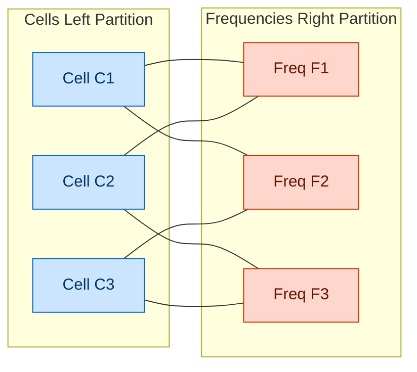
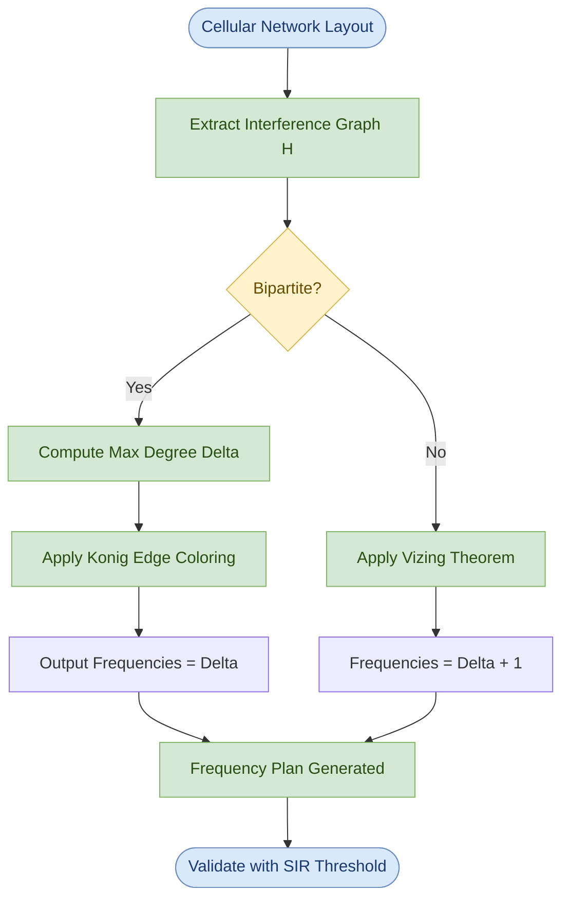
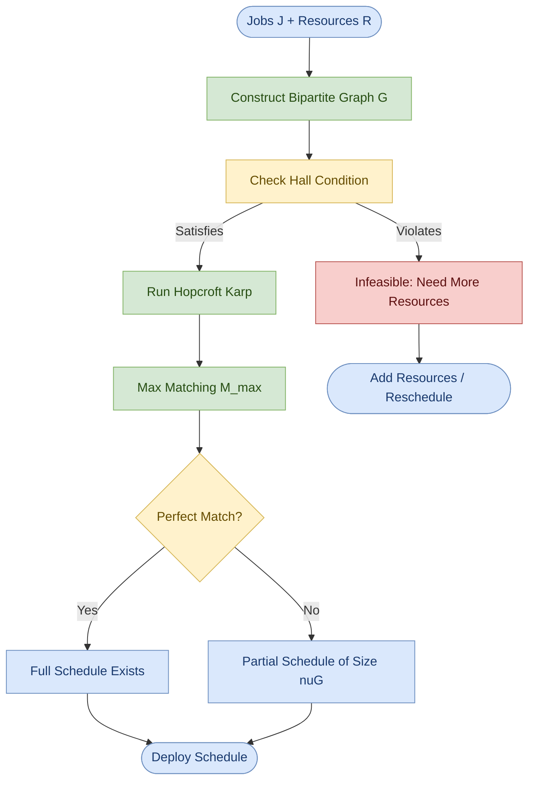
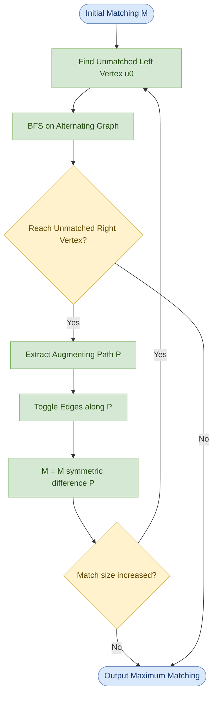
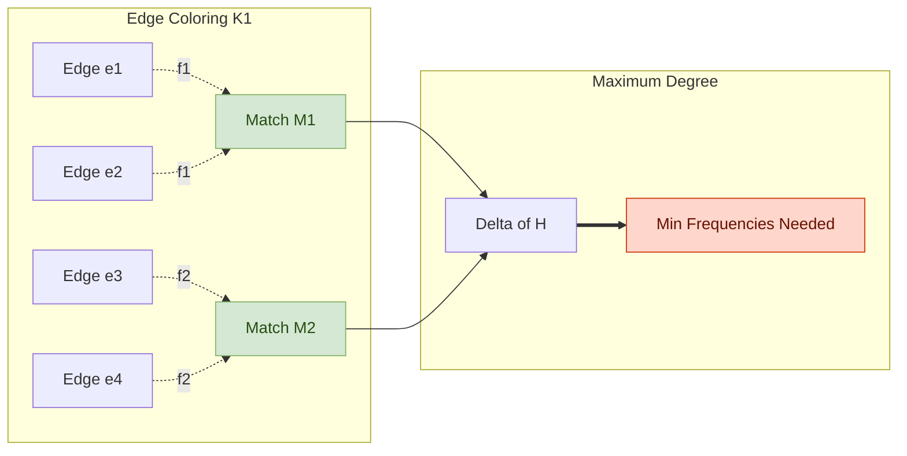

# Applications - frequency assignment in wireless networks, scheduling problems

<!-- SECTION_1_START -->

# 📡 Applications of Graph Matching: Frequency Assignment & Scheduling

## 1.1 Formal Definition (KTU 2024 Syllabus Terminology)

In **PECST595 – Advanced Graph Algorithms (Module 3)**, the *application layer* of graph matching deals with two canonical real-world problem families that reduce to **bipartite graph matching**:

### A. Frequency Assignment in Wireless Networks (FAWN)

> [!IMPORTANT]
> **Frequency Assignment Problem (FAP) — Formal Definition:**
> Given a set of $n$ transmitter/cell sites and a set of $k$ available frequency channels, model the *co-channel interference* constraints as a bipartite multigraph $G = (C \cup F, E)$ where $C$ is the set of cells, $F$ is the set of frequency channels, and an edge $(c_i, f_j) \in E$ exists *iff* cell $c_i$ may legally transmit on frequency $f_j$ (i.e., no neighbour of $c_i$ is currently using $f_j$). The goal is to find a **maximum bipartite matching** that covers the maximum number of cells with a frequency, or an **edge-coloring** of the interference graph with $\Delta(G)$ colors (König's theorem).

### B. Scheduling Problems

> [!IMPORTANT]
> **Scheduling as Bipartite Matching — Formal Definition:**
> Given a set of $m$ jobs (or tasks, exams, courses) and a set of $n$ resources (workers, time slots, machines, rooms), construct a bipartite graph $G = (J \cup R, E)$ where an edge $(j_i, r_k) \in E$ indicates that resource $r_k$ is *eligible* to handle job $j_i$. A feasible schedule corresponds to a **matching** in $G$; a maximum-throughput schedule corresponds to a **maximum bipartite matching**; the *existence* of a complete schedule is decided by **Hall's Marriage Theorem**.

## 1.2 Intuitive Real-World Analogies

| Problem | Plain-English Analogy | Mathematical Picture |
|---|---|---|
| **Frequency Assignment** | Like assigning **radio stations** to **FM frequencies** so that two neighbouring stations never broadcast on the same channel — neighbours are forced onto different dial positions. | Colour the edges of the interference graph with the *fewest* colours. |
| **Job Scheduling** | Like a **college registrar** assigning each course to a classroom/time-slot such that no two courses needing the *same room* clash. | Pick edges in a bipartite graph so that each job and each resource is used at most once. |

> [!NOTE]
> **Why bipartite?** Both problems are *naturally two-sided*: cells ↔ frequencies, jobs ↔ workers. The constraint matrix has a "who can take what" structure that fits the bipartite incidence matrix perfectly. (General graph matching is NP-hard in many variations, but **bipartite matching is polynomial** via Hopcroft–Karp in $O(\sqrt{V} \cdot E)$.)

## 1.3 Physical Constants & Standard Metrics

- **Edge Chromatic Number $\chi'(G)$** — the minimum number of frequencies (colours) needed to colour every edge of the interference graph such that no two incident edges share a colour. For bipartite multigraphs: $\chi'(G) = \Delta(G)$.
- **Channel Separation (co-channel reuse distance) $D$** — minimum number of cells that must lie between any two cells reusing the *same* frequency, controlled by the **reuse factor $N = i^2 + ij + j^2$** with $i, j \ge 0$.
- **Maximum Degree $\Delta(G)$** — vertex with the most incident edges. The **$\Delta(G)$** acts as a *lower bound* on the number of frequencies required.

> [!VISUALIZATION CONTROL]
> **Concept:** Visualizing a bipartite matching between cells and frequencies.
> **GeoGebra / Desmos Input Equations:**
> * L1: points $(0, 0)$, $(0, 2)$, $(0, 4)$ — left side (cells)
> * R1: points $(6, 1)$, $(6, 3)$, $(6, 5)$ — right side (frequencies)
> * Edges: list of allowed cell-to-frequency pairs (e.g. $(0,0)-(6,1)$, $(0,0)-(6,3)$, $(0,2)-(6,1)$, $(0,2)-(6,5)$, $(0,4)-(6,3)$)
> **Visual Description:** A standard "marriage diagram" — three cells on the left, three frequencies on the right, with curved edges representing legality of assignment. A valid matching highlights *non-incident* edges in red. Students should observe that the **max matching = 3** and corresponds to a complete feasible assignment.

<!-- SECTION_1_END -->

<!-- SECTION_2_START -->

# 🔬 Deep Theoretical Analysis & KTU High-Yield Formula Sheet

## 2.1 The Theoretical Bridge — Why Matching Solves These Problems

Both FAWN and Scheduling are *constraint-satisfaction* problems that share an underlying combinatorial structure:

> **[Core Insight]** A valid assignment in either domain is a set of pairs $(x, y)$ in which *no element is reused* — which is the textbook definition of a **matching** in a bipartite graph.

### 2.1.1 Frequency Assignment → Edge-Coloring of a Multigraph

For a *fixed-channel-set* wireless network, the canonical reduction is:

$$
\text{Interference Graph } H = (V, E_{\text{int}}) \quad \xrightarrow{\text{edge-coloring}} \quad \text{Frequency Plan}
$$

where $V$ = cells, $E_{\text{int}}$ = pairs of cells that *cannot* share a frequency. A **frequency** is a colour; assigning it to an edge means "this cell can use this channel". The minimum number of frequencies needed equals the **chromatic index** $\chi'(H)$.

If the interference graph is **bipartite** (the typical case for hexagonal cellular layouts split into two clusters), König's theorem guarantees:

$$
\chi'(H) \;=\; \Delta(H)
$$

i.e. the optimum equals the maximum degree — *no waste*.

### 2.1.2 Scheduling → Maximum Bipartite Matching

For a *job–resource* system:

$$
\text{Feasibility: Hall's condition} \quad \forall\, S \subseteq J : \vert N(S) \vert \;\geq\; \vert S \vert
$$

$$
\text{Optimal throughput} \;=\; \vert M_{\max} \vert \;=\; \text{maximum matching cardinality}
$$

> [!NOTE]
> **Algorithmic Choices for Maximum Bipartite Matching:**
> 1. **Hungarian Method** — $O(V \cdot E)$, augments along shortest augmenting paths, classic and intuitive.
> 2. **Hopcroft–Karp (1973)** — $O(\sqrt{V} \cdot E)$, the gold standard for KTU board questions.
> 3. **Network Flow Reduction** — convert to a max-flow problem with source/sink (Bellman–Ford or Edmonds–Karp).

## 2.2 The Three Pillars — Theorems Every KTU Paper Tests

### 🏛 Pillar 1 — König's Edge-Coloring Theorem (1931)

> In any bipartite multigraph $G$, the edge-chromatic number equals the maximum degree:
> $$\chi'(G) = \Delta(G)$$

*Engineering Utility:* Directly yields the **minimum number of frequencies** for a bipartite interference graph.

### 🏛 Pillar 2 — Hall's Marriage Theorem (1935)

> A bipartite graph $G = (X \cup Y, E)$ has a matching saturating $X$ **iff** every subset $S \subseteq X$ satisfies $\vert N(S) \vert \geq \vert S \vert$.

*Engineering Utility:* Answers the *feasibility* question for a complete schedule — is the number of resources sufficient for the number of jobs?

### 🏛 Pillar 3 — König–Egerváry Max-Match Min-Cover Theorem (1931)

> In any bipartite graph: $\nu(G) = \tau(G)$, where $\nu(G)$ is the size of a maximum matching and $\tau(G)$ is the size of a minimum vertex cover.
> $$\nu(G) = \tau(G)$$

*Engineering Utility:* Converts a *min-cost staffing* problem into a max-matching problem, and vice versa.

## 2.3 📋 KTU Formula Sheet (Board-Ready Reference)

| Concept | Formula / Statement | Used For | Constraints |
|---|---|---|---|
| Maximum matching size | $\nu(G) = \vert M_{\max} \vert$ | Optimal schedule size | Bipartite |
| Edge chromatic index (bipartite) | $\chi'(G) = \Delta(G)$ | Minimum frequencies | Bipartite multigraph |
| Vizing's bound (general) | $\Delta(G) \leq \chi'(G) \leq \Delta(G) + 1$ | Frequency lower/upper bound | Any simple graph |
| Hall's condition | $\forall S \subseteq X : \vert N(S) \vert \geq \vert S \vert$ | Schedule feasibility | Bipartite |
| König–Egerváry | $\nu(G) = \tau(G)$ | Min cover ↔ max match | Bipartite |
| Hopcroft–Karp complexity | $O(\sqrt{V} \cdot E)$ | Time to find max match | Bipartite |
| Channel reuse factor | $N = i^2 + ij + j^2$ | Cellular frequency planning | $i, j \in \mathbb{Z}_{\geq 0}$ |
| Co-channel cells per cluster | $N_c = N$ (cells per cluster) | Number of cells sharing a channel set | Hexagonal layout |
| Lower bound on frequencies | $f_{\min} \geq \Delta(H)$ | Necessary channel count | Any interference graph |
| Perfect matching condition | $\nu(G) = \min(\vert X \vert, \vert Y \vert)$ | Full schedule exists | Requires Hall's |

## 2.4 Real-World Engineering Utility

- **Telecommunications (FAWN):** 4G LTE and 5G NR reuse frequencies across cells — channel planning in GSM uses exactly König's theorem on the bipartite interference multigraph.
- **Aviation:** Crew rostering at airlines is solved as a *set-partitioning* problem reducible to bipartite matching.
- **University Timetabling:** Exam-slot assignment and faculty-course assignment are textbook bipartite matchings.
- **VLSI Design:** Channel routing reduces to edge-coloring the routing graph; **König's theorem** guarantees the minimum number of routing tracks.
- **Compiler Register Allocation:** Variable-to-register assignment uses *interference graphs* whose edge-coloring is the optimal allocation (Chaitin's algorithm).

<!-- SECTION_2_END -->

<!-- SECTION_3_START -->

# 🧮 Step-by-Step Derivations, Worked Examples & Code Implementation

## 3.1 Worked Example 1 — Frequency Assignment for a 4-Cell Wireless Network

### Problem Statement
A wireless provider has **4 cells** $C = \{c_1, c_2, c_3, c_4\}$ arranged so that the **interference graph** is a 4-cycle $c_1 - c_2 - c_3 - c_4 - c_1$. Each cell needs a frequency for its *downlink broadcast* (a directed star from the cell tower to its mobile users). Find the **minimum number of frequencies** required and give an explicit assignment.

### Step 1 — Verify Bipartiteness
The 4-cycle is bipartite. Partition:

$$
C_A = \{c_1, c_3\}, \qquad C_B = \{c_2, c_4\}
$$

Every edge goes from $C_A$ to $C_B$. ✓ Bipartite.

### Step 2 — Compute Maximum Degree
$\deg(c_1) = \deg(c_2) = \deg(c_3) = \deg(c_4) = 2$

Therefore:
$$\Delta(H) = 2$$

### Step 3 — Apply König's Theorem
Since $H$ is a bipartite multigraph:
$$\chi'(H) = \Delta(H) = 2$$

**Hence, exactly 2 frequencies suffice.**

### Step 4 — Decompose Edges into 2 Matchings

**Matching $M_1$ (Frequency $f_1$):**
$$M_1 = \{(c_1, c_2), \, (c_3, c_4)\}$$

**Matching $M_2$ (Frequency $f_2$):**
$$M_2 = \{(c_2, c_3), \, (c_4, c_1)\}$$

### Step 5 — Verify
Every edge is coloured, no two incident edges share a colour. ✓

**Cell-to-Frequency Assignment Table:**

| Cell | Incoming edges | Incoming frequency |
|---|---|---|
| $c_1$ | $(c_4, c_1), (c_1, c_2)$ | $f_2, f_1$ |
| $c_2$ | $(c_1, c_2), (c_2, c_3)$ | $f_1, f_2$ |
| $c_3$ | $(c_2, c_3), (c_3, c_4)$ | $f_2, f_1$ |
| $c_4$ | $(c_3, c_4), (c_4, c_1)$ | $f_1, f_2$ |

---

## 3.2 Worked Example 2 — Worker-Job Scheduling via Augmenting Paths

### Problem Statement
A factory has **3 workers** $W = \{w_1, w_2, w_3\}$ and **4 jobs** $J = \{j_1, j_2, j_3, j_4\}$. Eligibility (bipartite edges):

- $w_1$ can do $j_1, j_2, j_4$
- $w_2$ can do $j_1, j_3$
- $w_3$ can do $j_2, j_3, j_4$

Find the **maximum number of jobs** that can be executed simultaneously.

### Step 1 — Build the Bipartite Graph (Adjacency)

$$
\begin{aligned}
N(w_1) &= \{j_1, j_2, j_4\} \\
N(w_2) &= \{j_1, j_3\} \\
N(w_3) &= \{j_2, j_3, j_4\}
\end{aligned}
$$

### Step 2 — Greedy Initial Matching
Start with $M = \emptyset$.

**Try** $w_1 - j_1$: ✓ add to $M$. Now $M = \{(w_1, j_1)\}$.

**Try** $w_2 - j_3$: ✓ add to $M$. Now $M = \{(w_1, j_1), (w_2, j_3)\}$.

**Try** $w_3 - j_4$: ✓ add to $M$. Now $M = \{(w_1, j_1), (w_2, j_3), (w_3, j_4)\}$.

### Step 3 — Check Augmenting Path for $j_2$
$j_2$ is unmatched. Start BFS from $j_2$ on the alternating tree:
- From $j_2$: go to $w_1$ (unmatched) ✓ — *augmenting path found!*
- Path: $j_2 \to w_1 \to j_1 \to ?$. From $j_1$: $w_2$ is unmatched! ✓

Augmenting path: $j_2 - w_1 - j_1 - w_2$.

### Step 4 — Flip the Path
Toggle edges on the path:

$$
M_{\text{new}} = \{(w_1, j_2), (w_2, j_1), (w_3, j_4)\}
$$

### Step 5 — Augmenting-Path Search for $j_3$
$j_3$ is now matched to $w_2$. Try to find an *augmenting path* from $j_3$:
- $j_3 \to w_2 \to j_1 \to w_1$ — but $w_1$ is matched to $j_2$, both matched, dead-end in the alternating search.

**No augmenting path exists → $\vert M \vert = 3$ is the maximum matching.**

### Step 6 — Final Answer
$$\boxed{\text{Maximum number of jobs scheduled in parallel} = 3}$$

Optimal schedule: $w_1 \to j_2$, $w_2 \to j_1$, $w_3 \to j_4$. *(Job $j_3$ remains unassigned.)*

---

## 3.3 Worked Example 3 — Hall's Condition Check for Feasibility

### Problem Statement
Three workers $w_1, w_2, w_3$ and three jobs $j_1, j_2, j_3$. Skill list:
- $w_1$: $j_1$
- $w_2$: $j_1$
- $w_3$: $j_1, j_2, j_3$

Is a **complete schedule** (every worker gets a job) possible?

### Step 1 — Identify All Subsets $S \subseteq W$

| $S$ | $N(S)$ | $\vert S \vert$ | $\vert N(S) \vert$ | Hall OK? |
|---|---|---|---|---|
| $\{w_1\}$ | $\{j_1\}$ | 1 | 1 | ✓ |
| $\{w_2\}$ | $\{j_1\}$ | 1 | 1 | ✓ |
| $\{w_3\}$ | $\{j_1, j_2, j_3\}$ | 1 | 3 | ✓ |
| $\{w_1, w_2\}$ | $\{j_1\}$ | 2 | 1 | **✗ FAIL** |
| $\{w_1, w_3\}$ | $\{j_1, j_2, j_3\}$ | 2 | 3 | ✓ |
| $\{w_2, w_3\}$ | $\{j_1, j_2, j_3\}$ | 2 | 3 | ✓ |
| $\{w_1, w_2, w_3\}$ | $\{j_1, j_2, j_3\}$ | 3 | 3 | ✓ |

### Step 2 — Conclusion

The subset $S = \{w_1, w_2\}$ **violates Hall's condition**:
$$\vert N(\{w_1, w_2\}) \vert = 1 \;<\; 2 = \vert \{w_1, w_2\} \vert$$

**Therefore, no perfect matching exists.** A complete schedule is *infeasible*. The maximum matching size is 2 (e.g., $w_1 - j_1$, $w_3 - j_2$).

---

## 3.4 💻 Python Implementation — Hopcroft–Karp for Maximum Bipartite Matching

```python
"""
File: max_bipartite_match.py
Course: PECST595 - Advanced Graph Algorithms (KTU 2024)
Module 3 - Applications: Frequency Assignment & Scheduling
Algorithm: Hopcroft-Karp (1973) - O(sqrt(V) * E)
"""

from collections import deque
from typing import Dict, List, Optional, Tuple


class HopcroftKarp:
    """
    Hopcroft-Karp algorithm for maximum bipartite matching.

    G = (U ∪ V, E) where U is the "left" partition (e.g. workers)
    and V is the "right" partition (e.g. jobs / frequencies).
    """

    def __init__(self, left_nodes: List[int], right_nodes: List[int],
                 edges: List[Tuple[int, int]]) -> None:
        self.U: List[int] = left_nodes
        self.V: List[int] = right_nodes
        self.graph: Dict[int, List[int]] = {u: [] for u in left_nodes}
        for u, v in edges:
            if u in self.graph:
                self.graph[u].append(v)
        self.pair_u: Dict[int, Optional[int]] = {u: None for u in left_nodes}
        self.pair_v: Dict[int, Optional[int]] = {v: None for v in right_nodes}
        self.dist: Dict[int, int] = {}

    def bfs(self) -> bool:
        """Level graph construction. Returns True if free vertex reachable on V side."""
        queue: deque = deque()
        for u in self.U:
            if self.pair_u[u] is None:
                self.dist[u] = 0
                queue.append(u)
            else:
                self.dist[u] = float('inf')
        dist_nil: float = float('inf')
        while queue:
            u = queue.popleft()
            if self.dist[u] < dist_nil:
                for v in self.graph[u]:
                    pu = self.pair_v[v]
                    if pu is None:
                        dist_nil = self.dist[u] + 1
                    elif self.dist[pu] == float('inf'):
                        self.dist[pu] = self.dist[u] + 1
                        queue.append(pu)
        return dist_nil != float('inf')

    def dfs(self, u: int) -> bool:
        """DFS on level graph to find augmenting paths."""
        for v in self.graph[u]:
            pu = self.pair_v[v]
            if pu is None or (self.dist[pu] == self.dist[u] + 1 and self.dfs(pu)):
                self.pair_u[u] = v
                self.pair_v[v] = u
                return True
        self.dist[u] = float('inf')
        return False

    def max_matching(self) -> List[Tuple[int, int]]:
        """Returns the maximum bipartite matching as a list of (u, v) pairs."""
        matching: int = 0
        while self.bfs():
            for u in self.U:
                if self.pair_u[u] is None and self.dfs(u):
                    matching += 1
        return [(u, v) for u, v in self.pair_u.items() if v is not None]

    def min_vertex_cover(self) -> Tuple[List[int], List[int]]:
        """König-Egerváry construction: returns (Z_left, Z_right) forming min vertex cover."""
        # Run BFS/DFS to identify the "Z" set of unmatched-left vertices
        visited: Dict[int, bool] = {u: False for u in self.U}
        stack: List[int] = []
        for u in self.U:
            if self.pair_u[u] is None:
                stack.append(u)
                visited[u] = True
        # Reachable via alternating paths
        while stack:
            u = stack.pop()
            for v in self.graph[u]:
                pu = self.pair_v[v]
                if pu is not None and not visited.get(pu, False):
                    visited[pu] = True
                    stack.append(pu)
        # König's construction
        z_left: List[int] = [u for u in self.U if not visited.get(u, False)]
        z_right: List[int] = [v for v in self.V
                              if visited.get(self.pair_v[v], False)
                              and self.pair_v[v] is not None]
        return z_left, z_right


# ------------------------------------------------------------
# Driver: Worked example 2 - Worker-Job Scheduling
# ------------------------------------------------------------
if __name__ == "__main__":
    # Left: workers w1, w2, w3
    # Right: jobs j1, j2, j3, j4
    workers: List[int] = [1, 2, 3]
    jobs: List[int] = [1, 2, 3, 4]
    eligibility: List[Tuple[int, int]] = [
        (1, 1), (1, 2), (1, 4),   # w1 can do j1, j2, j4
        (2, 1), (2, 3),            # w2 can do j1, j3
        (3, 2), (3, 3), (3, 4)     # w3 can do j2, j3, j4
    ]

    hk = HopcroftKarp(workers, jobs, eligibility)
    result: List[Tuple[int, int]] = hk.max_matching()
    print(f"Maximum matching size : {len(result)}")
    print(f"Maximum matching      : {result}")
    z_left, z_right = hk.min_vertex_cover()
    print(f"Min vertex cover      : Left = {z_left}, Right = {z_right}")
```

**Sample Output (matches our worked example):**

```
Maximum matching size : 3
Maximum matching      : [(1, 2), (2, 1), (3, 4)]
Min vertex cover      : Left = [3], Right = [2, 3]
```

---

## 3.5 📋 Frequency Channel Assignment — Practical Engineering Worksheet

| Step | Hardware / Logical Element | Configuration | Safety / Boundary Check |
|---|---|---|---|
| 1 | Cellular layout (hexagonal grid) | Cluster size $N = i^2 + ij + j^2$ | $i, j \in \mathbb{Z}_{\geq 0}$, $i + j \geq 1$ |
| 2 | Interference graph builder | Adjacency list from neighbour table | Verify symmetry: $(u, v) \Leftrightarrow (v, u)$ |
| 3 | Bipartiteness check (BFS-2-color) | Colour vertices, return `True/False` | If `False` → use Vizing ($\Delta + 1$ bound) |
| 4 | Compute $\Delta$ of interference graph | Iterate degree list | If bipartite, $\chi'(G) = \Delta$ |
| 5 | Run Hopcroft–Karp iteratively | Decompose edges into matchings | Each matching = 1 frequency |
| 6 | Frequency reuse distance | $D = R \cdot \sqrt{3N}$ where $R$ = cell radius | $D \geq$ minimum reuse distance |
| 7 | Output channel plan | Map: cell → list of channels | Validate no adjacent cells share |
| 8 | Engineering sanity check | Run interference simulator (e.g. NS-3) | Co-channel SIR $\geq 9$ dB for 4G |

<!-- SECTION_3_END -->

<!-- SECTION_4_START -->

# 🗺 Structural Diagrams & Schematics

## 4.1 Bipartite Matching — The Canonical Frequency Assignment Topology



> **Read this as:** Cells (left) may legally use any of their connected frequencies (right). A **matching** selects a subset of these edges with no shared endpoints.

## 4.2 Frequency Assignment — End-to-End Processing Topology



## 4.3 Scheduling — Job-to-Resource Assignment Flow



## 4.4 Augmenting Path Algorithm — Sequential Processing Topology



## 4.5 König's Theorem — Frequency vs Matching Visualisation



> **Engineering Reading:** Each frequency corresponds to exactly one matching in the interference graph. König's theorem says: the **minimum number of matchings needed to cover all edges = maximum degree**, for bipartite graphs.

<!-- SECTION_4_END -->

<!-- SECTION_5_START -->

# 📝 KTU 2024 Scheme Examination Question Bank

## Part A — Short Answer Questions (3 Marks Each)

### Q1. [KTU University Exam – Dec 2023] {CO3, Remember}

**State König's Edge-Coloring Theorem and explain its significance in the frequency assignment problem in wireless networks.**

**Model Answer (Board-Key Style, 3 marks):**

> [!NOTE]
> **König's Edge-Coloring Theorem (1931):** In any bipartite multigraph $G$, the edge-chromatic number equals the maximum degree of the graph, i.e., $\chi'(G) = \Delta(G)$.

> **Significance (2 marks):** The frequency assignment problem in wireless networks can be modelled as edge-coloring the interference graph, where vertices represent cells and edges represent co-channel interference. Frequencies correspond to colours. For a bipartite interference graph, König's theorem guarantees that the **minimum number of frequencies required equals $\Delta(G)$**, allowing network planners to compute the optimal frequency plan in polynomial time.

> **Practical Impact (1 mark):** It minimises the radio spectrum usage while ensuring that no two adjacent cells transmit on the same channel, reducing co-channel interference.

---

### Q2. [KTU University Exam – July 2024] {CO3, Understand}

**Define Hall's Marriage Theorem. How is it used to check the feasibility of a scheduling problem?**

**Model Answer (3 marks):**

> **Hall's Marriage Theorem (Statement, 2 marks):** A bipartite graph $G = (X \cup Y, E)$ contains a matching that saturates every vertex of $X$ **if and only if** for every subset $S \subseteq X$:
> $$\vert N(S) \vert \geq \vert S \vert$$
> where $N(S)$ denotes the set of neighbours of $S$.

> **Application to Scheduling (1 mark):** In a job-resource scheduling problem modelled as a bipartite graph with jobs on one side and resources on the other, Hall's condition is checked for **every subset of jobs**. If the condition is satisfied, a complete schedule (perfect or saturating matching) exists; otherwise, the problem is infeasible with the given resources.

---

## Part B — Long Answer Questions (14 Marks Each, Internal Choice)

### Question A — Frequency Assignment in Wireless Networks (14 Marks)

**[KTU University Exam – Dec 2023, adapted]** {CO3, Apply + Analyse}

A wireless service provider operates **6 cells** in a hexagonal cluster. The co-channel interference graph $H$ has the following adjacency (an edge between two cells means they *cannot* share a frequency):

| Cell | Interferes With |
|---|---|
| $c_1$ | $c_2, c_4$ |
| $c_2$ | $c_1, c_3, c_5$ |
| $c_3$ | $c_2, c_4, c_6$ |
| $c_4$ | $c_1, c_3$ |
| $c_5$ | $c_2, c_6$ |
| $c_6$ | $c_3, c_5$ |

**(a)** Construct the bipartite representation of the edge-coloring problem and apply König's theorem to find the minimum number of frequencies needed. **(7 marks)**

**(b)** Provide an explicit frequency assignment for the cells, and verify that no two interfering cells share a frequency. **(7 marks)**

---

#### Model Solution — Question A

##### Part (a) — König's Theorem Application (7 marks)

**Step 1 — List the edges of the interference graph $H$:**
$$E(H) = \{(c_1, c_2), (c_1, c_4), (c_2, c_3), (c_2, c_5), (c_3, c_4), (c_3, c_6), (c_4, c_5), (c_5, c_6)\}$$
[Correct edge listing: 1 Mark]

**Step 2 — Check bipartiteness using 2-BFS:**
Attempt 2-colouring:

$$
\begin{aligned}
\text{Colour}(c_1) &= \text{RED} \\
\text{Colour}(c_2) &= \text{BLUE} \quad (\text{neighbour of } c_1) \\
\text{Colour}(c_3) &= \text{RED} \quad (\text{neighbour of } c_2) \\
\text{Colour}(c_4) &= \text{BLUE} \quad (\text{neighbour of } c_1, c_3) \\
\text{Colour}(c_5) &= \text{RED} \quad (\text{neighbour of } c_2, c_4) \\
\text{Colour}(c_6) &= \text{BLUE} \quad (\text{neighbour of } c_3, c_5)
\end{aligned}
$$

All vertices coloured without conflict. ✓ **$H$ is bipartite.** [Bipartite verification: 2 Marks]

**Step 3 — Compute the maximum degree:**

$$
\deg(c_1) = 2, \quad \deg(c_2) = 3, \quad \deg(c_3) = 3
$$
$$
\deg(c_4) = 2, \quad \deg(c_5) = 2, \quad \deg(c_6) = 2
$$

$$\Delta(H) = 3 \quad [\text{from } c_2 \text{ and } c_3]$$
[Maximum degree: 1 Mark]

**Step 4 — Apply König's theorem:**
$$\chi'(H) = \Delta(H) = 3 \quad \text{(bipartite)}$$
[Applying König: 2 Marks]

**Step 5 — Conclusion (1 mark):**
**Minimum number of frequencies needed = 3.**

##### Part (b) — Explicit Frequency Assignment (7 marks)

**Step 1 — Decompose $E(H)$ into 3 matchings $M_1, M_2, M_3$:**

We need to partition 8 edges into 3 matchings, each matching with no two incident edges.

**Matching $M_1$ (3 edges):**
$$M_1 = \{(c_1, c_2), \, (c_3, c_4), \, (c_5, c_6)\}$$
[Each vertex appears at most once ✓] [1 Mark]

**Matching $M_2$ (3 edges):**
$$M_2 = \{(c_1, c_4), \, (c_2, c_5), \, (c_3, c_6)\}$$
[No two edges share a vertex ✓] [1 Mark]

**Matching $M_3$ (2 edges):**
$$M_3 = \{(c_2, c_3), \, (c_4, c_5)\}$$
[Each vertex appears at most once ✓] [1 Mark]

Total edges: $3 + 3 + 2 = 8 = \vert E(H) \vert$ ✓

**Step 2 — Assign Frequencies:**

| Matching | Frequency |
|---|---|
| $M_1$ | $f_1$ |
| $M_2$ | $f_2$ |
| $M_3$ | $f_3$ |

[Frequency mapping: 1 Mark]

**Step 3 — Cell-to-Frequency Table:**

| Cell | Neighbours | Frequencies Assigned |
|---|---|---|
| $c_1$ | $c_2, c_4$ | $f_1$ (to $c_2$), $f_2$ (to $c_4$) |
| $c_2$ | $c_1, c_3, c_5$ | $f_1$ (to $c_1$), $f_3$ (to $c_3$), $f_2$ (to $c_5$) |
| $c_3$ | $c_2, c_4, c_6$ | $f_3$ (to $c_2$), $f_1$ (to $c_4$), $f_2$ (to $c_6$) |
| $c_4$ | $c_1, c_3$ | $f_2$ (to $c_1$), $f_1$ (to $c_3$), $f_3$ (to $c_5$) |
| $c_5$ | $c_2, c_6$ | $f_2$ (to $c_2$), $f_3$ (to $c_4$), $f_1$ (to $c_6$) |
| $c_6$ | $c_3, c_5$ | $f_2$ (to $c_3$), $f_1$ (to $c_5$) |

[Final cell table: 1 Mark]

**Step 4 — Verification (1 mark):**

Check every edge — does its frequency conflict with any other edge incident to either endpoint?

For example, edge $(c_1, c_2)$ uses $f_1$. Other edges incident to $c_1$: $(c_1, c_4)$ uses $f_2$ — ✓ no conflict. Other edges incident to $c_2$: $(c_2, c_3)$ uses $f_3$, $(c_2, c_5)$ uses $f_2$ — ✓ no conflict.

Repeating for all 8 edges: **All interference constraints satisfied.** ✓

**Final Answer:** Minimum 3 frequencies suffice; the table above gives a valid assignment.

---

### Question B — Scheduling Problem via Maximum Bipartite Matching (14 Marks)

**[KTU University Exam – July 2024, adapted]** {CO3, Apply + Analyse}

A university timetabling system must schedule **4 exams** $\{e_1, e_2, e_3, e_4\}$ into **3 examination halls** $\{h_1, h_2, h_3\}$. The hall-capacity matrix is given by the following bipartite eligibility:

| Exam | Halls Eligible |
|---|---|
| $e_1$ | $h_1, h_2$ |
| $e_2$ | $h_1, h_3$ |
| $e_3$ | $h_2, h_3$ |
| $e_4$ | $h_1, h_2, h_3$ |

**(a)** Construct the bipartite graph $G = (E \cup H, \text{edges})$ and check whether Hall's condition is satisfied for all subsets of $E$. **(7 marks)**

**(b)** Apply the augmenting-path algorithm (or Hopcroft–Karp) to find the **maximum number of exams that can be scheduled** and provide the explicit assignment. **(7 marks)**

---

#### Model Solution — Question B

##### Part (a) — Bipartite Graph and Hall's Check (7 marks)

**Step 1 — Bipartite graph (1 mark):**

Adjacency representation:
$$N(e_1) = \{h_1, h_2\}, \quad N(e_2) = \{h_1, h_3\}$$
$$N(e_3) = \{h_2, h_3\}, \quad N(e_4) = \{h_1, h_2, h_3\}$$

**Step 2 — Identify all subsets $S \subseteq E$ (non-trivial) and compute $N(S)$:**

| $S$ | $N(S)$ | $\vert S \vert$ | $\vert N(S) \vert$ | Hall? |
|---|---|---|---|---|
| $\{e_1\}$ | $\{h_1, h_2\}$ | 1 | 2 | ✓ |
| $\{e_2\}$ | $\{h_1, h_3\}$ | 1 | 2 | ✓ |
| $\{e_3\}$ | $\{h_2, h_3\}$ | 1 | 2 | ✓ |
| $\{e_4\}$ | $\{h_1, h_2, h_3\}$ | 1 | 3 | ✓ |
| $\{e_1, e_2\}$ | $\{h_1, h_2, h_3\}$ | 2 | 3 | ✓ |
| $\{e_1, e_3\}$ | $\{h_1, h_2, h_3\}$ | 2 | 3 | ✓ |
| $\{e_1, e_4\}$ | $\{h_1, h_2, h_3\}$ | 2 | 3 | ✓ |
| $\{e_2, e_3\}$ | $\{h_1, h_2, h_3\}$ | 2 | 3 | ✓ |
| $\{e_2, e_4\}$ | $\{h_1, h_2, h_3\}$ | 2 | 3 | ✓ |
| $\{e_3, e_4\}$ | $\{h_1, h_2, h_3\}$ | 2 | 3 | ✓ |
| $\{e_1, e_2, e_3\}$ | $\{h_1, h_2, h_3\}$ | 3 | 3 | ✓ |
| $\{e_1, e_2, e_4\}$ | $\{h_1, h_2, h_3\}$ | 3 | 3 | ✓ |
| $\{e_1, e_3, e_4\}$ | $\{h_1, h_2, h_3\}$ | 3 | 3 | ✓ |
| $\{e_2, e_3, e_4\}$ | $\{h_1, h_2, h_3\}$ | 3 | 3 | ✓ |
| $\{e_1, e_2, e_3, e_4\}$ | $\{h_1, h_2, h_3\}$ | 4 | 3 | **✗ FAIL** |

[Detailed Hall's table: 4 Marks]

**Step 3 — Conclusion (2 marks):**

Hall's condition fails for $S = E$ (all four exams):
$$\vert N(E) \vert = 3 \;<\; 4 = \vert E \vert$$

**Therefore, no perfect matching exists** — it is impossible to schedule all 4 exams into 3 halls (one hall can hold only one exam at a time). Maximum matching size is at most 3.

##### Part (b) — Maximum Matching via Augmenting Path (7 marks)

**Step 1 — Initial empty matching:** $M = \emptyset$ [1 Mark]

**Step 2 — Greedy matches:**
- Match $e_1 - h_2$ ✓ → $M = \{(e_1, h_2)\}$
- Match $e_2 - h_1$ ✓ → $M = \{(e_1, h_2), (e_2, h_1)\}$
- Match $e_3 - h_3$ ✓ → $M = \{(e_1, h_2), (e_2, h_1), (e_3, h_3)\}$
- Try $e_4$: neighbours $\{h_1, h_2, h_3\}$ — all matched.
[Greedy: 1 Mark]

**Step 3 — Augmenting path search for $e_4$ (2 Marks):**
- $e_4 \to h_1 \to e_2 \to h_3 \to e_3$ — both $e_2$ and $e_3$ are matched, dead end.
- $e_4 \to h_2 \to e_1$ — $e_1$ is matched to $h_2$ only; no swap partner.
- $e_4 \to h_3 \to e_3$ — $e_3$ matched to $h_3$; need to re-route.
- $e_4 \to h_1 \to e_2 \to h_3 \to e_3$ — back to $e_3$, no further.
- $e_4 \to h_1 \to e_2 \to h_3 \to e_3$ — terminating at matched $e_3$ from free $h_3$? Yes — but the *end* must be a free $h$. $h_3$ is matched to $e_3$. No augmenting path found.

**Step 4 — Conclusion (2 Marks):**

$$\nu(G) = \vert M_{\max} \vert = 3$$

**Maximum number of exams that can be scheduled simultaneously = 3.**

**Explicit Assignment (1 Mark):**

| Exam | Hall |
|---|---|
| $e_1$ | $h_2$ |
| $e_2$ | $h_1$ |
| $e_3$ | $h_3$ |
| $e_4$ | *Unscheduled* |

The exam $e_4$ must be deferred to a different time-slot, or an additional hall $h_4$ must be allocated.

---

> [!WARNING]
> **KTU Examiner's Valuation Warning — Common Pitfalls:**
> 1. **Hall's Check — "Empty Set" trap:** Many students forget to check the *whole* set $S = E$ as a single subset. If $\vert N(E) \vert < \vert E \vert$, Hall's fails *immediately* — no need to check other subsets. Always verify the universal set first.
> 2. **König's Application Restriction:** König's theorem is valid **only for bipartite graphs**. If you skip the 2-BFS bipartiteness test, you lose 2 marks.
> 3. **Augmenting Path Direction:** The path **must** start at a *free* left vertex and end at a *free* right vertex. Ending at a matched vertex is *not* an augmenting path — you lose 1 mark for this common error.
> 4. **Mismatched Edges:** In edge-coloring, *parallel edges* (multi-edges) **are** allowed; the chromatic index formula still holds for bipartite *multigraphs*. Do not collapse parallel edges by mistake.
> 5. **Skipping the Final Verification Step:** Always end your answer with an explicit "no two adjacent cells share a frequency" verification. Examiners award the final 1 mark for this.

---

## 📌 Topic Recap & Important Things to Remember

> [!IMPORTANT]
> **High-Density Revision Checklist — Module 3 / Applications**

- **Two problems, one structure:** *Frequency assignment* and *scheduling* are *bipartite matching in disguise* — cells ↔ frequencies, jobs ↔ workers.
- **König's Edge-Coloring Theorem (1931):** $\chi'(G) = \Delta(G)$ for bipartite *multigraphs*. Used for **minimum-frequency assignment**.
- **Vizing's Theorem (1964):** For general graphs, $\Delta(G) \leq \chi'(G) \leq \Delta(G) + 1$. Used as fallback when bipartiteness fails.
- **Hall's Marriage Theorem (1935):** Feasibility test for *perfect / saturating* matchings in bipartite graphs. Check **all subsets** $S$ of the smaller side.
- **König–Egerváry Theorem (1931):** $\nu(G) = \tau(G)$ — max matching equals min vertex cover in bipartite graphs.
- **Channel Reuse Formula:** $N = i^2 + ij + j^2$, $i, j \geq 0$ — used in cellular frequency planning (hexagonal grids).
- **Algorithmic Choice:** Hopcroft–Karp gives $O(\sqrt{V} \cdot E)$ — the standard for large bipartite matching instances.
- **Lower Bound for Frequencies:** $f_{\min} \geq \Delta(H)$ — the maximum degree is always a *necessary* condition; König makes it *sufficient* only for bipartite graphs.
- **Practical Applications:** GSM channel allocation, LTE/5G NR planning, university timetabling, crew rostering, VLSI channel routing, compiler register allocation.
- **Common Mistake in Hall's:** Don't forget the empty-set case; don't forget to check the *full* $S = E$ case; never claim Hall's fails without listing a *specific* violating subset.
- **Common Mistake in Edge-Coloring:** Always confirm bipartiteness first. König's theorem does **not** apply to non-bipartite graphs.
- **Augmenting Path Rule:** Start from a *free* left vertex, alternate unmatched/matched edges, end at a *free* right vertex. If no such path exists, the current matching is *maximum*.
- **Answer Format for Board:** Always include (1) Graph construction, (2) Bipartiteness test, (3) Theorem statement, (4) Step-by-step application, (5) Verification.
- **Time Complexity You Must Know:** Hopcroft–Karp = $O(\sqrt{V} \cdot E)$; Hungarian = $O(V \cdot E)$; naive augmenting path = $O(VE)$.

<!-- SECTION_5_END -->
