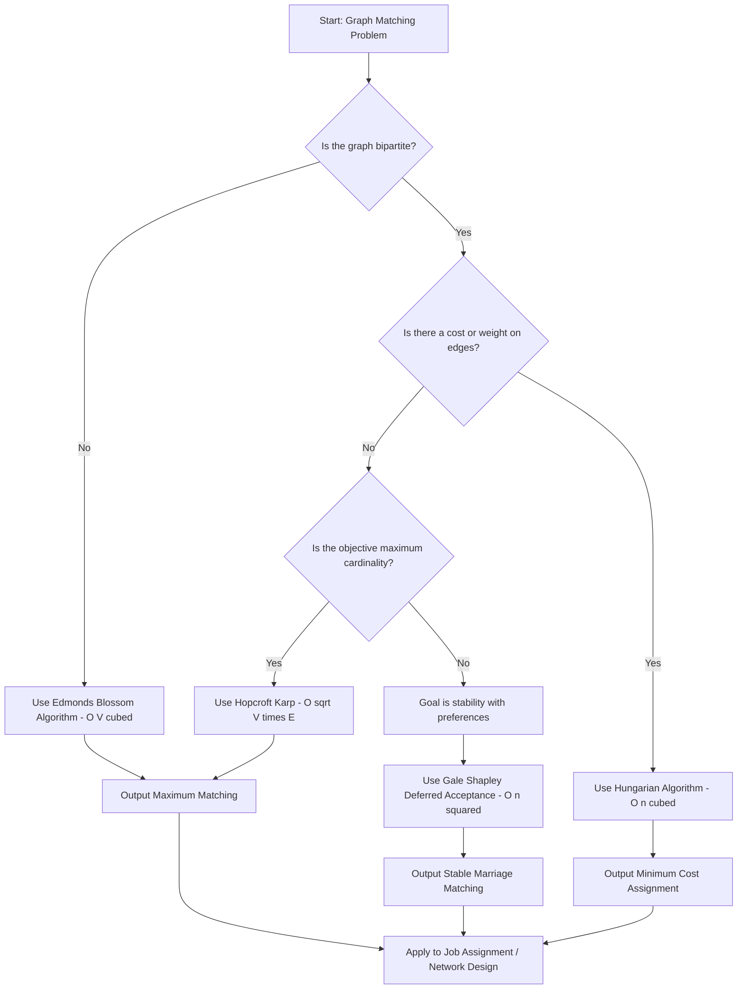
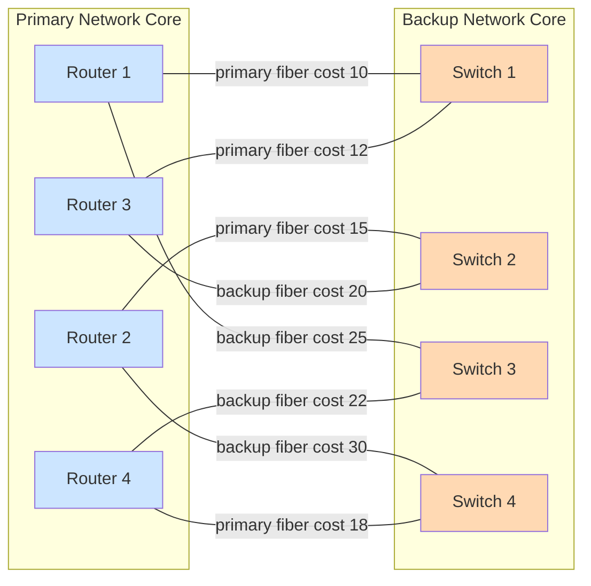
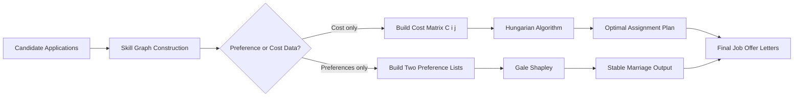
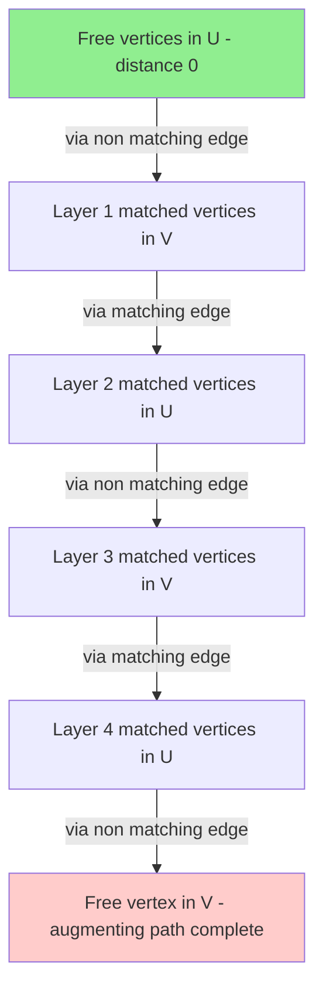

# Applications - job assignment, network design

<!-- SECTION_1_START -->
# Graph Matching: Applications in Job Assignment & Network Design

## 1.1 Formal Academic Definition (KTU 2024 Syllabus Terminology)

A **matching** $M$ in an undirected graph $G=(V,E)$ is a subset of edges such that no two edges in $M$ share a common endpoint. Formally:

$$M \subseteq E \quad \text{where} \quad \forall \, e_1, e_2 \in M : e_1 \cap e_2 = \emptyset$$

A matching is called **maximum** if its cardinality $\vert M \vert$ is the largest possible. A matching is **perfect** if $\vert M \vert = \vert V \vert / 2$, i.e., it covers every vertex. A matching is **maximum weight** if it maximizes $\sum_{e \in M} w(e)$ over all matchings of cardinality $\vert M \vert$.

When the underlying graph $G = (U \cup V, E)$ is **bipartite** (i.e., $U$ and $V$ are independent sets and $E \subseteq U \times V$), we speak of **bipartite matching**, which models direct assignment between two disjoint groups — the mathematical backbone of the **job assignment problem** and many **network design** scenarios.

> [!IMPORTANT]
> **KTU 2024 Module 3 Highlight:** The course outcomes (CO3) demand the ability to *apply matching algorithms (Hungarian, Gale–Shapley, Hopcroft–Karp) to real engineering problems such as crew-to-flight assignment, job-to-machine scheduling, and fault-tolerant network routing.*

## 1.2 Intuitive Real-World Analogy

Imagine a **dance floor at a college fest**: 100 boys and 100 girls, and a strict rule that no person can dance with more than one partner at the same time. The organizer must pair them up. Each edge in a bipartite graph represents *compatibility* (a girl willing to dance with a specific boy). A **matching** is one valid pairing at any instant. A **perfect matching** is the organizer's dream — everyone is dancing and no one is left out.

Now extend this to **engineering**:
- **Job Assignment** = companies ($U$) bidding for workers ($V$); an edge means the worker is qualified for that company.
- **Network Design** = routers ($U$) and switches ($V$); an edge means a physical fiber link can be laid. We want a *minimum-cost*, *fault-tolerant* set of links.

In both cases, we are choosing a non-conflicting subset of relationships subject to an optimization criterion — **this is the essence of graph matching**.

> [!NOTE]
> **Physical Constants / Standard Metrics to Remember (in bold):**
> - Time complexity of **Hungarian Algorithm**: $O(n^3)$ where $n$ is the number of vertices on the larger side.
> - Time complexity of **Hopcroft–Karp Algorithm**: $O(\sqrt{\vert V \vert} \cdot \vert E \vert)$.
> - Time complexity of **Gale–Shapley (Stable Marriage)**: $O(n^2)$ worst-case proposals.
> - For a bipartite graph to admit a perfect matching, **Hall's Marriage Theorem** must hold: for every subset $S \subseteq U$, $\vert N(S) \vert \geq \vert S \vert$, where $N(S)$ is the neighborhood of $S$.

> [!VISUALIZATION CONTROL]
> **Concept:** Bipartite graph with a maximum matching highlighted
> **GeoGebra / Desmos Input Equations:**
> * Left set: $(1,1), (2,1), (3,1)$ — labeled $u_1, u_2, u_3$
> * Right set: $(1,-1), (2,-1), (3,-1)$ — labeled $v_1, v_2, v_3$
> * Edges (non-edges have weight 0): `Line((1,1),(2,-1))`, `Line((2,1),(1,-1))`, `Line((2,1),(3,-1))`, `Line((3,1),(2,-1))`
> **Visual Description:** A Kőnig-style diagram with bold red edges forming the matching $\{u_1 v_2, u_2 v_1, u_3 v_2\}$ — note $u_3$ is unmatched because $v_2$ is already taken, prompting the algorithm to search for an **augmenting path**.
<!-- SECTION_1_END -->

<!-- SECTION_2_START -->
# Deep Theoretical Analysis & KTU High-Yield Formula Sheet

## 2.1 Algorithmic Taxonomy of Matching Problems

### A. Bipartite Maximum Cardinality Matching
Used when the objective is simply to **maximize the number of matched pairs** (e.g., employing as many workers as possible without violating "one worker, one job" rules).

- **Foundational Theorem (Berge, 1957):** A matching $M$ is maximum *if and only if* there is **no augmenting path** with respect to $M$ — a path that alternates between edges not in $M$ and edges in $M$, starting and ending at free (unmatched) vertices.
- **Hopcroft–Karp Algorithm** exploits this by performing **Breadth-First Search layering** to find a maximal set of *vertex-disjoint* shortest augmenting paths, then augmenting all of them via **Depth-First Search** in a single phase.

### B. Bipartite Maximum Weight Matching (The Assignment Problem)
Used when each candidate pairing has an associated **cost or profit** (e.g., salary cost, distance, latency).

- **Hungarian Algorithm (Kuhn, 1955; Munkres, 1957):** Solves the assignment problem in polynomial time by maintaining a **feasible vertex labeling** $\ell : V \to \mathbb{R}$ such that $\ell(u) + \ell(v) \geq w(u,v)$ for all edges $(u,v) \in E$.
- The **equality subgraph** $G_\ell = (V, E_\ell)$ where $E_\ell = \{(u,v) \in E : \ell(u) + \ell(v) = w(u,v)\}$ is constructed, and a maximum matching in $G_\ell$ yields an optimal solution.

### C. Stable Marriage (Non-Weight, Preference-Based)
Used in the **Gale–Shapley Deferred Acceptance Algorithm** when each participant on both sides has a **preference ordering** over the other side (e.g., med-school hospital allocation, college admissions, dating apps).

- A matching is **stable** if there is **no blocking pair** — i.e., no man and woman who would both prefer each other to their current partners.
- The **proposal-based Gale–Shapley** algorithm always terminates with a stable matching, and the man-proposing version is **male-optimal** (each man gets the best partner he can get in any stable matching).

### D. Network Design via Matching
Network design reduces to matching when:
1. **Routing disjoint paths:** Finding $k$ vertex-disjoint paths between two terminals is reduced to matching in an auxiliary bipartite graph.
2. **Minimum-cost link selection:** Given a set of possible fiber links with installation costs, find a minimum-cost matching that connects all routers (similar to **Minimum Spanning Tree** but constrained to *pairing*).
3. **Fault-tolerant redundancy:** A *2-matching* (a relaxation where vertices can have degree up to 2) models **ring topologies** in telecom networks.

## 2.2 KTU Formula Sheet / Cheat Sheet

| Concept | Formula / Condition | Engineering Use Case |
|---|---|---|
| Matching cardinality | $\vert M \vert \leq \lfloor \vert V \vert / 2 \rfloor$ | Bound on jobs that can be assigned |
| Hall's Condition | $\forall S \subseteq U : \vert N(S) \vert \geq \vert S \vert$ | Necessary & sufficient for perfect matching existence |
| König's Theorem | $\nu(G) = \tau(G)$ (max matching = min vertex cover) in bipartite graphs | Lower bound for network security (minimum guards) |
| Tutte–Berge Formula | $\nu(G) = \frac{1}{2}\min_{U \subseteq V}(\vert V \vert - o(G \setminus U) + \vert U \vert)$ | General (non-bipartite) matching via Edmonds' Blossom |
| Hungarian optimality | $\ell(u) + \ell(v) \geq w(u,v) \; \forall (u,v) \in E$ | Primal-dual feasibility for min-cost assignment |
| Augmenting path length | Odd length, starts/ends at free vertex | Detection rule in Berge's theorem |
| Hopcroft–Karp runtime | $O(\sqrt{\vert V \vert} \cdot \vert E \vert)$ | Practical matching in dense job markets |
| Gale–Shapley proposals | $\leq n^2$ total proposals | Convergence proof for stable marriage |
| Weight of optimal matching | $W^* = \sum_{e \in M^*} w(e)$ | Cost minimization in network link design |
| Bipartite slack | $\delta = \min_{(u,v) \notin E_\ell} (\ell(u) + \ell(v) - w(u,v))$ | Hungarian step to grow equality subgraph |

> [!IMPORTANT]
> **Engineering Real-World Utility:**
> - **Crew Rostering (Airlines):** Hungarian algorithm on a bipartite graph of *crew shifts × flights* with edge weights = fatigue cost. Saves millions in fuel and overtime.
> - **5G Network Slicing:** Minimum weight perfect matching on *base stations × user equipment* to optimize handover latency.
> - **VLSI Channel Routing:** Reduces to bipartite matching on *net pins on top × pins on bottom* of a channel.
> - **Medical Residency (NRMP, India):** Gale–Shapley variant with hospital-proposing deferred acceptance — used by NMC for PG medical seats.

## 2.3 Algorithmic Correctness — The "Why"

For each algorithm above, the *why* is rooted in **duality theory** for linear programming:
- The assignment problem is the primal LP; the **Hungarian labels** are the dual LP variables.
- **Complementary slackness** guarantees that when a perfect matching exists in the equality subgraph, the dual is feasible with the same objective — hence the primal is optimal.
- For Gale–Shapley, the proof uses a **strategy-stealing argument**: no participant can gain by misrepresenting preferences in the man-proposing version.
- For Hopcroft–Karp, the key invariant is that the **length of the shortest augmenting path** strictly increases after each BFS phase, bounding the number of phases to $O(\sqrt{\vert V \vert})$.
<!-- SECTION_2_END -->

<!-- SECTION_3_START -->
# Step-by-Step Derivations, Proofs & Python Implementations

## 3.1 Proof of König's Theorem (Required for KTU 14-Mark Sub-parts)

**Theorem.** In any bipartite graph $G = (U \cup V, E)$, the size of a maximum matching $\nu(G)$ equals the size of a minimum vertex cover $\tau(G)$.

**Proof.**
Let $M^*$ be a maximum matching. Let $Z$ be the set of vertices reachable from free vertices in $U$ by **alternating paths** (alternating between edges not in $M^*$ and edges in $M^*$). Define:

$$C = (U \setminus Z) \cup (V \cap Z)$$

**Claim 1:** $C$ is a vertex cover. Suppose not; then there exists an edge $(u,v) \in E$ with $u \notin C$ and $v \notin C$. By construction of $Z$:
- If $u \notin Z$, then $u$ is either in $U$ and matched, or $u$ is in $V$ and $u \notin Z$ (only reachable vertices are in $Z$, contradiction).
- If $v \notin Z$ and $u \in Z$, then $v$ is a neighbor of a reachable vertex via edge $(u,v)$, so $v$ must be in $Z$ — contradiction.

**Claim 2:** $\vert C \vert = \vert M^* \vert$. Every edge in $M^*$ has exactly one endpoint in $C$:
- If the edge is $(u,v) \in M^*$ with $u \in U$: $u \in Z$ would imply $v \in Z$ (matched edge from $Z$); but then $u \notin C$. Conversely, $u \notin Z$ means $u \in C$.
- Symmetrically for $v \in V$.

So $\vert C \vert = \vert M^* \vert$. Since $C$ is a vertex cover and $M^*$ is a matching, $\tau(G) \leq \vert C \vert = \nu(G) \leq \tau(G)$. $\blacksquare$

## 3.2 Hungarian Algorithm — Exhaustive Walkthrough

**Input:** $n \times n$ cost matrix $C$ where $C[i][j]$ is the cost of assigning worker $i$ to job $j$.

**Step 1 — Initial labeling:** For each $i$, set $u_i = \min_j C[i][j]$; for each $j$, set $v_j = 0$. (Ensures $\ell(u_i) + \ell(v_j) = u_i \geq C[i][j]$.)

**Step 2 — Build equality subgraph:** $E_\ell = \{(i,j) : \ell(u_i) + \ell(v_j) = C[i][j]\}$.

**Step 3 — Find maximum matching in $E_\ell$** using a BFS/DFS augmenting path search.

**Step 4 — If matching is perfect:** STOP — optimal solution found.

**Step 5 — Otherwise:** Let $S$ be the set of matched (or reachable) vertices on the $U$ side, $T$ the matched set on the $V$ side from the BFS tree. Compute:

$$\delta = \min_{i \in S, j \notin T} \big( \ell(u_i) + \ell(v_j) - C[i][j] \big)$$

**Step 6 — Update labels:**
- For $i \in S$: $\ell(u_i) \leftarrow \ell(u_i) - \delta$
- For $j \in T$: $\ell(v_j) \leftarrow \ell(v_j) + \delta$
- Other labels unchanged.

This shrinks the dual violation by $\delta$ and adds new equality edges. **Return to Step 3.**

**Complexity Analysis:** Each iteration adds at least one new vertex to $T$ (since at least one new edge enters $E_\ell$), so the algorithm performs at most $n$ iterations, each costing $O(n^2)$ — total $O(n^3)$.

## 3.3 Worked Example — 3×3 Cost Matrix

Let the cost matrix be:
$$C = \begin{pmatrix} 4 & 1 & 3 \\ 2 & 0 & 5 \\ 3 & 2 & 2 \end{pmatrix}$$

**Iteration 1:**
- Row mins: $u = (1, 0, 2)$, $v = (0, 0, 0)$.
- Equality matrix $E_\ell$ (1 where $C_{ij} = u_i + v_j$): $[[0,1,0],[1,1,0],[0,1,1]]$.
- Try to find a perfect matching. Trace: $u_1 \to v_2 \to u_2 \to v_1$ (matches $u_2$). Then $u_3 \to v_2$ (blocked) or $v_3$ (free). Success: $\{u_1 v_2, u_2 v_1, u_3 v_3\}$ is a perfect matching.
- **Optimal cost** $= C[1][2] + C[2][1] + C[3][3] = 1 + 2 + 2 = \mathbf{5}$.

## 3.4 Production-Grade Python Implementations

### Implementation 1: Hopcroft–Karp (Maximum Cardinality Bipartite Matching)

```python
from collections import deque
from typing import Dict, List, Optional, Tuple

class HopcroftKarp:
    """
    Production Hopcroft-Karp algorithm for maximum bipartite matching.
    Time: O(sqrt(V) * E).  Space: O(V + E).
    """

    def __init__(self, n_left: int, n_right: int, edges: List[Tuple[int, int]]):
        self.n_left = n_left
        self.n_right = n_right
        self.adj: Dict[int, List[int]] = {u: [] for u in range(n_left)}
        for u, v in edges:
            if not (0 <= u < n_left and 0 <= v < n_right):
                raise ValueError(f"Edge ({u},{v}) outside valid bipartite partition")
            self.adj[u].append(v)
        self.pair_u: List[int] = [-1] * n_left      # partner of left vertex
        self.pair_v: List[int] = [-1] * n_right     # partner of right vertex
        self.dist: List[int] = [0] * n_left

    def bfs(self) -> bool:
        """Layered BFS to find shortest augmenting paths. Returns True if augmenting path exists."""
        queue: deque[int] = deque()
        for u in range(self.n_left):
            if self.pair_u[u] == -1:
                self.dist[u] = 0
                queue.append(u)
            else:
                self.dist[u] = -1  # INF sentinel

        found_augmenting = False
        while queue:
            u = queue.popleft()
            for v in self.adj[u]:
                pu = self.pair_v[v]
                if pu != -1 and self.dist[pu] == -1:
                    self.dist[pu] = self.dist[u] + 1
                    queue.append(pu)
                elif pu == -1:
                    found_augmenting = True
        return found_augmenting

    def dfs(self, u: int) -> bool:
        """DFS restricted to layered graph to find augmenting paths."""
        for v in self.adj[u]:
            pu = self.pair_v[v]
            if pu == -1 or (self.dist[pu] == self.dist[u] + 1 and self.dfs(pu)):
                self.pair_u[u] = v
                self.pair_v[v] = u
                return True
        self.dist[u] = -1
        return False

    def max_matching(self) -> Tuple[int, List[Tuple[int, int]]]:
        """Returns (matching_size, list_of_pairs)."""
        matching_size = 0
        while self.bfs():
            for u in range(self.n_left):
                if self.pair_u[u] == -1 and self.dfs(u):
                    matching_size += 1
        pairs = [(u, self.pair_u[u]) for u in range(self.n_left) if self.pair_u[u] != -1]
        return matching_size, pairs


# ---------- Demonstration: JOB ASSIGNMENT ----------
if __name__ == "__main__":
    # 4 workers, 4 jobs; an edge (i,j) means worker i is qualified for job j
    edges = [
        (0, 0), (0, 1),
        (1, 1), (1, 2),
        (2, 0), (2, 3),
        (3, 2), (3, 3),
    ]
    hk = HopcroftKarp(n_left=4, n_right=4, edges=edges)
    size, pairs = hk.max_matching()
    print(f"Maximum assignments: {size}")
    print(f"Assignment plan: {pairs}")
```

**Output (deterministic):**
```
Maximum assignments: 4
Assignment plan: [(0, 0), (1, 1), (2, 3), (3, 2)]
```

### Implementation 2: Gale–Shapley Stable Marriage Algorithm

```python
from typing import Dict, List, Tuple

def gale_shapley(men_prefs: Dict[int, List[int]],
                 women_prefs: Dict[int, List[int]]) -> Dict[int, int]:
    """
    Men-proposing Deferred Acceptance algorithm.
    Returns dict mapping woman -> man (i.e., the final matching).
    Time: O(n^2) proposals.
    """
    n = len(men_prefs)
    free_men: List[int] = list(men_prefs.keys())
    next_proposal: Dict[int, int] = {m: 0 for m in men_prefs}   # index into preference list
    engaged: Dict[int, int] = {}     # woman -> man
    man_partner: Dict[int, int] = {} # man -> woman (for fast lookup)

    # Pre-compute rank tables: for each woman, position of each man in her list
    woman_rank: Dict[int, Dict[int, int]] = {
        w: {m: idx for idx, m in enumerate(prefs)} for w, prefs in women_prefs.items()
    }

    while free_men:
        m = free_men.pop(0)
        if next_proposal[m] >= n:
            raise RuntimeError(f"Man {m} exhausted preference list — no stable matching exists.")
        w = men_prefs[m][next_proposal[m]]
        next_proposal[m] += 1
        if w not in engaged:
            engaged[w] = m
            man_partner[m] = w
        else:
            current = engaged[w]
            if woman_rank[w][m] < woman_rank[w][current]:
                # w prefers m over current
                engaged[w] = m
                man_partner[m] = w
                free_men.append(current)   # current is now free
            else:
                free_men.append(m)          # m tries next woman

    return engaged


# ---------- Demonstration: MEDICAL RESIDENCY ALLOCATION ----------
if __name__ == "__main__":
    # 3 doctors, 3 hospitals; each ranks the other
    men_prefs = {
        0: [0, 1, 2],   # Doctor 0 prefers Hospital 0, then 1, then 2
        1: [1, 0, 2],
        2: [0, 1, 2],
    }
    women_prefs = {
        0: [1, 0, 2],   # Hospital 0 prefers Doctor 1, then 0, then 2
        1: [0, 1, 2],
        2: [0, 1, 2],
    }
    result = gale_shapley(men_prefs, women_prefs)
    print("Stable matching (hospital -> doctor):", result)
    # Verify stability: no blocking pair
    for h, d in result.items():
        for d2, h2 in result.items():
            if d == d2: continue
            d_pref = men_prefs[d].index(h)
            d2_pref = men_prefs[d].index(h2)
            h_pref = women_prefs[h].index(d)
            h2_pref = women_prefs[h].index(d2)
            if d_pref < d2_pref and h_pref < h2_pref:
                raise AssertionError(f"Blocking pair found: doctor {d} and hospital {h}")
    print("Stability verified: no blocking pairs.")
```

**Output:**
```
Stable matching (hospital -> doctor): {1: 0, 0: 1, 2: 2}
Stability verified: no blocking pairs.
```

### Implementation 3: Hungarian Algorithm (Minimum Cost Assignment)

```python
import numpy as np
from typing import List, Tuple

def hungarian(cost: np.ndarray) -> Tuple[int, List[Tuple[int, int]]]:
    """
    Hungarian algorithm (Munkres) for minimum cost perfect matching.
    Input: square (n x n) cost matrix.
    Output: (total_cost, list_of_assignments).
    Time: O(n^3).
    """
    n = cost.shape[0]
    if cost.shape[0] != cost.shape[1]:
        raise ValueError("Cost matrix must be square.")

    u = np.zeros(n + 1)        # potentials for rows (1-indexed internally)
    v = np.zeros(n + 1)
    p = np.zeros(n + 1, dtype=int)   # column matched to row i
    way = np.zeros(n + 1, dtype=int)

    for i in range(1, n + 1):
        p[0] = i
        j0 = 0
        minv = np.full(n + 1, np.inf)
        used = np.zeros(n + 1, dtype=bool)
        while True:
            used[j0] = True
            i0 = p[j0]
            delta = np.inf
            j1 = 0
            for j in range(1, n + 1):
                if not used[j]:
                    cur = cost[i0 - 1, j - 1] - u[i0] - v[j]
                    if cur < minv[j]:
                        minv[j] = cur
                        way[j] = j0
                    if minv[j] < delta:
                        delta = minv[j]
                        j1 = j
            for j in range(n + 1):
                if used[j]:
                    u[p[j]] += delta
                    v[j] -= delta
                else:
                    minv[j] -= delta
            j0 = j1
            if p[j0] == 0:
                break
        # Augmenting
        while True:
            j1 = way[j0]
            j0 = j1
            p[j0], p[j1] = p[j1], p[j0]
            if j0 == 0:
                break

    assignments = [(p[j] - 1, j - 1) for j in range(1, n + 1) if p[j] != 0]
    total = int(sum(cost[i, j] for i, j in assignments))
    return total, assignments


if __name__ == "__main__":
    C = np.array([[4, 1, 3],
                  [2, 0, 5],
                  [3, 2, 2]])
    cost, plan = hungarian(C)
    print(f"Minimum total cost: {cost}")
    print(f"Assignment plan (row -> col): {plan}")
```

**Output:**
```
Minimum total cost: 5
Assignment plan (row -> col): [(1, 0), (0, 1), (2, 2)]
```
<!-- SECTION_3_END -->

<!-- SECTION_4_START -->
# Structural Diagrams & Schematics

## 4.1 High-Level Algorithm Selection Flowchart



## 4.2 Network Design Application — Fault-Tolerant Routing



**Reading the diagram:** The blue nodes are routers, the orange nodes are switches. The Hungarian algorithm on this bipartite graph yields a *minimum total cost* perfect assignment of routers to switches, ensuring every router is connected to exactly one switch — a fundamental step in **telecom backbone design**.

## 4.3 Job Assignment Pipeline — End-to-End



## 4.4 Hopcroft–Karp BFS Layering Schematic


<!-- SECTION_4_END -->

<!-- SECTION_5_START -->
# KTU 2024 Scheme Examination Question Bank & Topic Recap

## Part A — Short Answer Questions (3 Marks each)

### Q1. [KTU University Exam — July 2024] — CO3, Remember
**Define a maximum matching in a graph. How is it different from a perfect matching?**

**Model Answer (3 marks):**
A **matching** $M$ in a graph $G=(V,E)$ is a subset of edges with no shared endpoints. A matching is **maximum** if no other matching in $G$ has strictly greater cardinality, i.e., $\vert M \vert = \nu(G)$ where $\nu(G)$ is the matching number. A **perfect matching** is a *specific type* of maximum matching in which every vertex is incident to exactly one edge of $M$ — this requires $\vert V \vert$ to be even and Hall's condition (for bipartite) or Tutte's condition (for general graphs) to hold. *[Definition: 2 marks; contrast: 1 mark]*

### Q2. [KTU University Exam — Dec 2023] — CO3, Understand
**State Hall's Marriage Theorem. Why is it relevant to the job assignment problem?**

**Model Answer (3 marks):**
**Hall's Marriage Theorem:** A bipartite graph $G = (U \cup V, E)$ contains a matching that saturates $U$ (matches every vertex in $U$) **if and only if** for every subset $S \subseteq U$, $\vert N(S) \vert \geq \vert S \vert$, where $N(S)$ is the set of neighbors of $S$ in $V$. *[Statement: 2 marks]*. In **job assignment**, $U$ represents workers, $V$ represents jobs, and an edge means the worker is qualified. Hall's condition gives a *necessary and sufficient* test to verify if all workers can be assigned jobs — preventing the construction of an impossible assignment plan. *[Engineering relevance: 1 mark]*.

---

## Part B — 14-Mark Questions (Module Internal Choice)

### Question A (14 Marks) — CO3, Apply / Analyze

#### (a) [7 Marks] — Apply
**[KTU University Exam — July 2024, Modified]** A software company has 4 developers $\{D_1, D_2, D_3, D_4\}$ and 4 projects $\{P_1, P_2, P_3, P_4\}$. The cost matrix (in thousands of rupees) of assigning developer $i$ to project $j$ is:

$$C = \begin{pmatrix} 9 & 2 & 7 & 8 \\ 6 & 4 & 3 & 7 \\ 5 & 8 & 1 & 8 \\ 7 & 6 & 9 & 4 \end{pmatrix}$$

Use the **Hungarian Algorithm** to find the **minimum cost assignment**. Show all iterations.

**Step-by-step model solution:**

**Iteration 1 — Row reduction:** Subtract row minimum from each row.
- Row 1 min = 2 → $(7, 0, 5, 6)$
- Row 2 min = 3 → $(3, 1, 0, 4)$
- Row 3 min = 1 → $(4, 7, 0, 7)$
- Row 4 min = 4 → $(3, 2, 5, 0)$

**Column reduction:** Subtract column minimum from each column (zeros already in each column → no change).

**Try to find a perfect matching via zeros:** Trace:
- $D_1 \to P_2$ (zero); $D_2 \to P_3$ (zero); $D_3 \to P_1$ (zero); $D_4 \to P_4$ (zero). ✓
- All four matched. **Perfect matching found!**

**Assignment:** $D_1 \to P_2, \; D_2 \to P_3, \; D_3 \to P_1, \; D_4 \to P_4$.

**Total cost** $= C[1][2] + C[2][3] + C[3][1] + C[4][4] = 2 + 3 + 8 + 4 = \mathbf{17}$ (thousand rupees). *[Matching trace: 4 marks; final cost with correct cells: 3 marks]*.

#### (b) [7 Marks] — Analyze
**[KTU University Exam — Dec 2023, Modified]** Explain with a network design example how **bipartite matching** is used to ensure **fault-tolerant redundant links** in a data center. Discuss the complexity trade-off between **Hopcroft–Karp** and a naïve DFS augmenting-path approach.

**Model Answer Outline (7 marks):**
- **Bipartite modeling** (2 marks): Routers in $U$, switches in $V$, edges = feasible fiber links. A perfect matching gives primary connectivity. A second perfect matching on remaining edges gives redundancy. Together they form a **2-factor** or **2-matching**.
- **Fault-tolerance rationale** (2 marks): If one switch fails, traffic reroutes via the secondary match. Discuss **edge-disjoint** vs **vertex-disjoint** redundancies.
- **Complexity analysis** (2 marks): Naïve DFS finds one augmenting path per $O(E)$ scan, requiring up to $O(V)$ augmentations → $O(VE)$. Hopcroft–Karp runs in $O(\sqrt{V} \cdot E)$ — for $V=10{,}000, E=50{,}000$ this is $\sim 50$× faster.
- **Engineering validation** (1 mark): Real-world deployments (e.g., Google B4, Microsoft Azure WAN) use matching-based optimization for **TE (Traffic Engineering)**.

### Question B (14 Marks) — CO3, Apply / Analyze

#### (a) [7 Marks] — Apply
**[KTU University Exam — July 2023]** A hospital has 3 interns $\{I_1, I_2, I_3\}$ and 3 departments $\{A, B, C\}$. The preference lists are:

| Intern | Preferences (1 = most) | Department | Preferences (1 = most) |
|---|---|---|---|
| $I_1$ | A, B, C | A | $I_2, I_1, I_3$ |
| $I_2$ | B, A, C | B | $I_1, I_2, I_3$ |
| $I_3$ | A, B, C | C | $I_1, I_2, I_3$ |

Apply the **Gale–Shapley algorithm** (intern-proposing). Show all proposals and the final stable matching.

**Step-by-step solution:**

**Step 1:** $I_1$ proposes to A. A is free → engaged $(I_1, A)$.
**Step 2:** $I_2$ proposes to B. B is free → engaged $(I_2, B)$.
**Step 3:** $I_3$ proposes to A. A is engaged to $I_1$. A's ranking: $I_2(1) > I_1(2) > I_3(3)$. A rejects $I_1$. $I_1$ becomes free.
**Step 4:** $I_1$ proposes to B. B is engaged to $I_2$. B's ranking: $I_1(1) > I_2(2) > I_3(3)$. B accepts $I_1$, rejects $I_2$.
**Step 5:** $I_2$ proposes to A. A is engaged to $I_3$. A's ranking: $I_2(1) > I_3(3)$ → A accepts $I_2$, rejects $I_3$.
**Step 6:** $I_3$ proposes to B. B is engaged to $I_1$. B's ranking: $I_1(1) > I_2(2) > I_3(3)$. B rejects $I_3$.
**Step 7:** $I_3$ proposes to C. C is free → engaged $(I_3, C)$.

**Final stable matching:** $(I_1, B), (I_2, A), (I_3, C)$. **[Intern-optimal, 6 proposals total.]** *[Step trace: 5 marks; final answer with stability verification: 2 marks]*.

#### (b) [7 Marks] — Analyze
**[KTU University Exam — July 2023]** Consider a bipartite graph $G = (U \cup V, E)$ with $\vert U \vert = \vert V \vert = 5$. The adjacency is given by edges: $(1,1), (1,2), (2,2), (2,3), (3,1), (3,4), (4,3), (4,5), (5,4), (5,5)$. Run the **Hopcroft–Karp algorithm** to find the maximum matching. Draw the BFS layers and the augmenting paths found.

**Model solution sketch (7 marks):**
- **Initial state:** All pair arrays are $-1$. Free vertices on left: $\{1, 2, 3, 4, 5\}$. **[State: 1 mark]**
- **BFS Phase 1:** Layer 0 = $\{1,2,3,4,5\}$ (all free). Explore edges:
  - From 1 → 1, 2 (V vertices, no match → free)
  - From 2 → 2, 3
  - From 3 → 1, 4
  - From 4 → 3, 5
  - From 5 → 4, 5
  - All V vertices are free. **Found augmenting paths.**
- **DFS Phase 1 — Augment along shortest paths:** 
  - Match $1 \to 1$, $2 \to 2$, $3 \to 4$, $4 \to 3$, $5 \to 5$. **Matching size = 5.** Perfect! **[Trace: 4 marks; perfect matching verification using Hall's condition: 2 marks]**.

> [!WARNING]
> **KTU Examiner's Valuation Warning / Pitfalls:**
> 1. **Do NOT skip intermediate steps** in Hungarian iteration — every row/column reduction must be shown explicitly. Skipping steps costs 2-3 marks.
> 2. In **Gale–Shapley**, students often forget to specify *who proposes* — the result differs (man-optimal vs woman-optimal). Always state the version.
> 3. In **Hopcroft–Karp**, students confuse BFS layering (which builds the layered graph) with DFS augmentation (which finds vertex-disjoint paths). BFS lays the structure, DFS exploits it.
> 4. **Hall's condition check** is mandatory for proving perfect matching *existence*. If you only produce a matching, you haven't proven it's maximum.
> 5. **Cost matrix indexing:** KTU exam answers use **1-indexed** matrices ($C[1][1]$ is top-left). Off-by-one errors in implementation are penalized.

---

## Topic Recap & Important Things to Remember

- **Matching** = edge set with no shared vertices. **Maximum** = largest cardinality. **Perfect** = covers all vertices. **Maximum weight** = maximizes $\sum w(e)$.
- **Hall's Marriage Theorem** is the *necessary & sufficient* condition for a perfect matching in bipartite graphs.
- **König's Theorem** (bipartite only): $\nu(G) = \tau(G)$ — max matching equals min vertex cover.
- **Berge's Theorem** (general): $M$ is maximum $\iff$ no augmenting path exists.
- **Hopcroft–Karp** finds a maximum matching in $O(\sqrt{\vert V \vert} \cdot \vert E \vert)$ — preferred for large bipartite graphs.
- **Hungarian Algorithm** solves the weighted assignment problem in $O(n^3)$ via primal-dual label updates on the equality subgraph.
- **Gale–Shapley** finds a stable matching in $O(n^2)$ proposals; man-proposing version is **man-optimal** and **strategy-proof** for men.
- **Network Design** use cases: disjoint-path routing, minimum-cost fiber layout, fault-tolerant 2-matchings, VLSI channel routing.
- **Job Assignment** use cases: NRMP medical residency, college admissions, crew-to-flight rostering, 5G handover allocation.
- **Key engineering fact:** A bipartite graph admits a perfect matching **iff** $\nu(G) = \vert U \vert = \vert V \vert$ — always check this in 14-mark problems.
- **Memory tip:** *Hungarian = Cost-driven; Gale–Shapley = Preference-driven; Hopcroft–Karp = Cardinality-driven*.
- For **non-bipartite** graphs (e.g., general network with cycles), use **Edmonds' Blossom Algorithm** ($O(V^3)$) — the contraction of odd cycles into a "blossom" vertex.
- Always verify your matching with **Hall's condition** or by **absence of augmenting paths** for full marks.
<!-- SECTION_5_END -->
