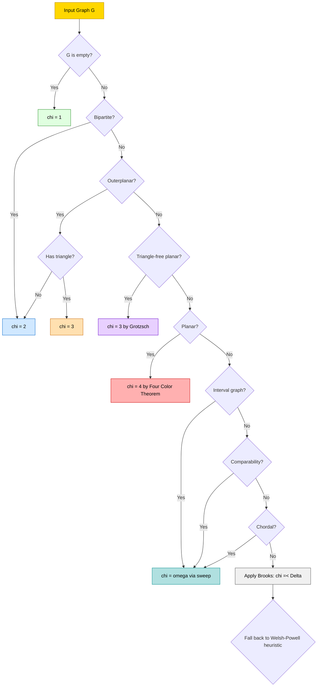
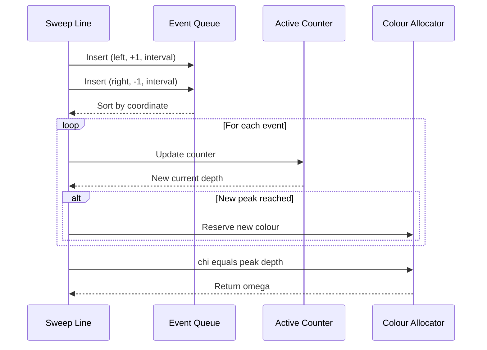
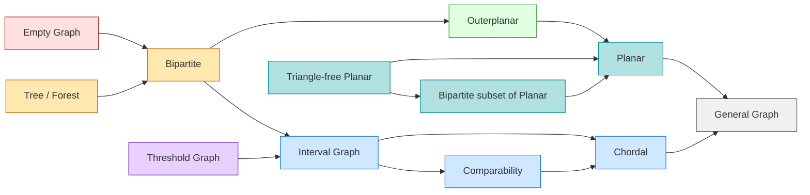
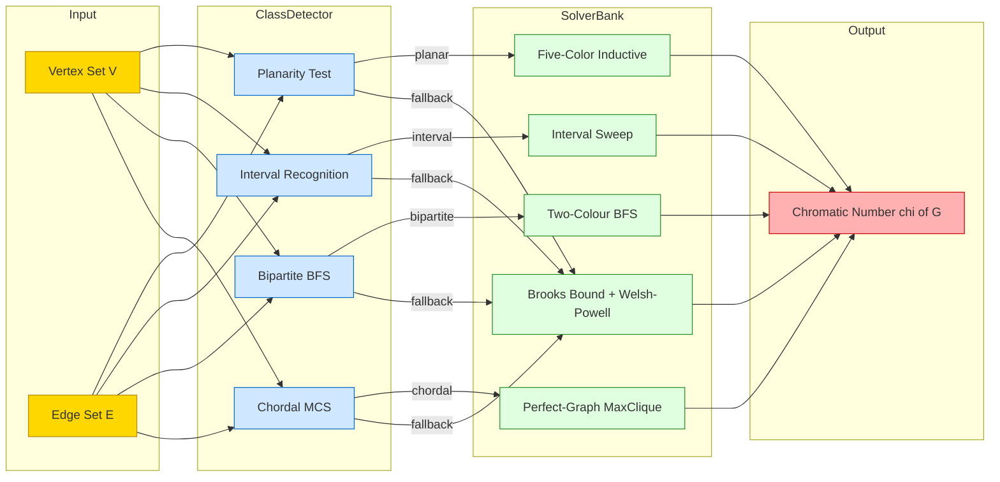

# Graph Coloring - Colorings for special classes of graphs (e.g., planar graphs, interval graphs)

<!-- SECTION_1_START -->
# Module 3 — Graph Matching → Graph Coloring for Special Graph Classes

## 1.1 Core Technical Definition

> [!IMPORTANT]
> **Proper Vertex Coloring (KTU 2024 Formal Definition):**
> A **proper vertex coloring** of a graph $G = (V, E)$ is an assignment of colors to every vertex such that for every edge $uv \in E$, the color assigned to $u$ is different from the color assigned to $v$. Formally, it is a function $c : V \rightarrow \mathbb{N}$ satisfying $c(u) \neq c(v)$ for all $uv \in E$.

The **chromatic number** $\chi(G)$ is the minimum number of colors required for a proper vertex coloring of $G$.

> [!NOTE]
> **Course Outcome Mapping (CO3, PECST595):** Apply chromatic theory to characterize time-table scheduling, register allocation in compilers, and frequency assignment in mobile networks using planar and interval graph models.

### 1.2 Intuitive Analogy — The Map Painter's Dilemma

Imagine you are a cartographer colouring a political map. Two countries that share a border segment (not just a single point) must wear different colours — otherwise a traveller cannot tell where one ends and the next begins. The cartographer's puzzle is:

> *"What is the smallest box of crayons I need so that no two adjacent regions ever share the same shade?"*

Translate countries → **vertices** and shared borders → **edges**, and you have the exact **graph colouring problem**. For a *planar* map, the regions can be unfolded into a planar graph drawn on a flat sheet of paper, and the answer has a celebrated upper bound.

### 1.3 The Special Classes — At a Glance

| Class of Graph | Chromatic Bound | Source of Bound |
| :--- | :---: | :--- |
| **Empty / Edgeless** graph $E_n$ | $\chi = 1$ | Trivial |
| **Bipartite** graph (Trees, Forests) | $\chi \le 2$ | No odd cycle |
| **Outerplanar** graph | $\chi \le 3$ | Maximal outerplanar is triangulated outer cycle |
| **Planar** graph | $\chi \le 4$ | **Four Color Theorem (Appel–Haken, 1976)** |
| **Planar** graph (elementary proof) | $\chi \le 5$ | **Five Color Theorem (Heawood, 1890)** |
| **Triangle-free Planar** | $\chi \le 3$ | **Grötzsch's Theorem (1959)** |
| **Interval** graph | $\chi = \omega(G)$ | Perfect graph family |
| **Chordal** graph | $\chi = \omega(G)$ | Perfect graph family |
| **Comparability** graph | $\chi = \omega(G)$ | Transitive orientation ⇒ perfect |
| **General** graph (Brooks) | $\chi \le \Delta(G)$ | Unless $G = K_{\Delta+1}$ or odd cycle |

> [!VISUALIZATION CONTROL]
> **Concept:** Planar triangulation K4 (the complete graph on 4 vertices) embedded in the plane.
> **Desmos / GeoGebra Input Equations:**
> * Vertices (in plane): $A=(0,0)$, $B=(2,0)$, $C=(1, \sqrt{3})$, $D=(1, \sqrt{3}/3)$
> * Edges: $AB$, $BC$, $CA$, $AD$, $BD$, $CD$
> **Visual Description:** A triangle $ABC$ with an interior vertex $D$ connected to all three corners. Observe that every pair of the four vertices shares an edge — hence $\chi(K_4) = 4$ and $\omega(K_4) = 4$.

---

<!-- SECTION_1_END -->

<!-- SECTION_2_START -->
## 2. Deep Theoretical Analysis

### 2.1 Planar Graphs — The Euler Foundation

A graph is **planar** if it can be drawn in the plane with no two edges crossing. If $G$ is a connected planar graph with $n$ vertices, $m$ edges and $f$ faces (including the unbounded outer face), **Euler's formula** gives

$$
n - m + f \;=\; 2.
$$

Every face in a 2-connected planar graph is bounded by at least 3 edges, and each edge borders exactly 2 faces. Counting face-edge incidences therefore yields

$$
3f \;\le\; 2m \quad \Longrightarrow \quad m \;\le\; 3n - 6 \quad \text{for } n \ge 3.
$$

This is the **planar edge budget** — a planar graph cannot be too dense.

### 2.2 The Five Color Theorem (Heawood, 1890) — Stepwise Inductive Proof

> [!NOTE]
> KTU examiners love the Five Color Theorem because it is fully elementary (no computer). It is a model of an **inductive proof on the minimum degree** of a planar graph.

**Theorem.** Every planar graph $G$ is 5-colourable.

**Proof Skeleton (full derivation appears in Section 3):**

1. Show $G$ has a vertex $v$ of degree $d(v) \le 5$ (from $m \le 3n-6$, the average degree is $< 6$).
2. Remove $v$ and its incident edges to obtain $G' = G - v$. By induction, $G'$ is 5-colourable.
3. If $d(v) \le 4$, the five (or fewer) neighbours use at most 4 colours, leaving 1 free colour for $v$. Done.
4. If $d(v) = 5$, the neighbours use all 5 colours. We attempt a **Kempe-chain recolouring argument** on two colour classes to free a colour for $v$.

### 2.3 Kempe Chains — The Recolouring Engine

A **Kempe chain** of a vertex $u$ in colour classes $\{a, b\}$ is the connected component of the subgraph induced by vertices coloured $a$ or $b$ that contains $u$.

> [!IMPORTANT]
> **Kempe Swap Lemma:** Swapping colours $a$ and $b$ throughout a Kempe chain preserves proper colouring and never alters the colours of vertices outside the chain.

If the Kempe chain of $v_1$ (neighbour of $v$ coloured red) in the red/blue subgraph does **not** contain neighbour $v_3$ (neighbour coloured blue), then we may swap red ↔ blue in the chain, freeing red at $v_1$ and assigning red to $v$. The chain $C_{v_1}$ and $C_{v_3}$ must therefore either meet or — by **planarity** — the cycle formed by $v_1 \rightarrow v_3$ together with the two Kempe chains encloses the vertex $v$, which is impossible since $v$ lies on the boundary.

### 2.4 The Four Color Theorem (Appel & Haken, 1976)

> [!IMPORTANT]
> **Statement:** Every planar graph is 4-colourable.

The proof reduces to checking **1,936 unavoidable configurations** (later refined to **633** by Robertson, Sanders, Seymour, Thomas, 1997), each verified by computer. It is the first major theorem to rely on exhaustive mechanical verification. KTU 2024 syllabus notes this as the *defining chromatic ceiling* for planar graphs.

### 2.5 Grötzsch's Theorem (Triangle-Free Planar)

> [!IMPORTANT]
> **Grötzsch (1959):** Every triangle-free planar graph is 3-colourable.

**Proof Idea (sketch):**
1. The graph is planar and contains no $K_3$. If it is not 3-colourable, it has a minimal counter-example $G$ which is a 4-critical planar graph of girth $\ge 4$.
2. By Euler's formula, $m \le 2n - 4$ (each face has length $\ge 4$).
3. A discharging argument (originally due to Grötzsch) forces a contradiction, hence no such $G$ exists.

### 2.6 Interval Graphs — The Perfect Chromatic Match

> [!NOTE]
> An **interval graph** $G$ is the intersection graph of a family of intervals on the real line: each vertex represents an interval $I_v \subseteq \mathbb{R}$, and $uv \in E$ iff $I_u \cap I_v \neq \emptyset$.

**Properties of Interval Graphs:**
* They are **chordal** (every cycle of length $\ge 4$ has a chord).
* They are **perfect**: $\chi(G) = \omega(G)$, where $\omega(G)$ is the size of the largest clique.
* They are precisely the **asteroidal-triple-free** chordal graphs.
* The **Maximum Clique** in an interval graph corresponds to the **point of maximum interval overlap** — computable in $O(n \log n)$ via sweep-line.

**Algorithm: Interval Graph Colouring (Greedy by Left Endpoint)**
1. Sort intervals by left endpoint $l_i$ (or right endpoint — both work).
2. Assign each interval the smallest positive integer colour not used by any already-coloured **overlapping** interval.
3. The number of colours used equals the maximum depth of overlap = $\omega(G)$.

> [!IMPORTANT]
> **Theorem:** If $I_1, I_2, \dots, I_n$ are intervals on the real line, then the chromatic number of the interval graph is exactly the maximum number of intervals covering any point on the line, i.e.,
> $$\chi(G) \;=\; \omega(G) \;=\; \max_{x \in \mathbb{R}} \left| \{ i : x \in I_i \} \right|.$$

### 2.7 Comparability Graphs

A graph $G$ is a **comparability graph** if its edges can be transitively oriented: there exists an acyclic orientation of $E$ such that $u \rightarrow v$ and $v \rightarrow w$ implies $u \rightarrow w$. Comparability graphs are **perfect** (Dilworth's theorem connection), and therefore

$$
\chi(G) = \omega(G).
$$

### 2.8 Perfect Graph Theorem (Chudnovsky, Robertson, Seymour, Thomas, 2006)

> [!IMPORTANT]
> **Strong Perfect Graph Theorem:** A graph is perfect iff it contains no odd hole (odd cycle of length $\ge 5$) and no odd antihole as an induced subgraph.

This 80-year-old conjecture was resolved in 2006, cementing the family: **planar perfect, chordal, comparability, interval, bipartite, threshold** — all share $\chi = \omega$.

### 2.9 Outerplanar Graphs

A graph is **outerplanar** if it has a planar embedding where all vertices lie on the boundary of the unbounded face. Every outerplanar graph has $m \le 2n - 3$ and a **2-vertex colouring** of the weak dual, hence:

> [!NOTE]
> **Theorem:** Every outerplanar graph is 3-colourable, and $\chi = 3$ iff it contains a triangle.

### 2.10 Brooks' Theorem (Universal Bound)

> [!IMPORTANT]
> **Brooks (1941):** For any connected graph $G$ that is neither a complete graph $K_{\Delta+1}$ nor an odd cycle,
> $$\chi(G) \;\le\; \Delta(G).$$

It is the single most useful general-purpose colouring bound.

### 2.11 KTU High-Yield Formula Sheet

| Symbol | Definition | Standard Value / Range |
| :--- | :--- | :--- |
| $\chi(G)$ | Minimum colours for proper vertex colouring | $\chi \ge \omega \ge 1$ |
| $\omega(G)$ | Size of maximum clique | $\omega \le \chi$ |
| $\Delta(G)$ | Maximum vertex degree | $\chi \le \Delta + 1$ (trivial) |
| $n, m, f$ | Vertices, edges, faces of planar $G$ | $n - m + f = 2$ |
| Planar edge budget | Density inequality | $m \le 3n - 6$ for $n \ge 3$ |
| Triangle-free planar | Face length $\ge 4$ | $m \le 2n - 4$ |
| Outerplanar density | $m \le 2n - 3$ for $n \ge 2$ | $\chi \le 3$ |
| Planar (Appel–Haken) | $\chi \le 4$ | (Computer-verified) |
| Planar (Heawood) | $\chi \le 5$ | (Elementary induction) |
| Grötzsch | Triangle-free planar $\Rightarrow \chi \le 3$ | (Discharging) |
| Interval graph | $\chi = \omega = $ max depth | $O(n \log n)$ sweep |
| Bipartite | $\chi \le 2$ | iff no odd cycle |
| Brooks | $\chi \le \Delta$ | unless $K_{\Delta+1}$ or odd cycle |
| Strong Perfect | $\chi = \omega$ | iff no odd hole/antihole |

### 2.12 Engineering Utility Map

> [!IMPORTANT]
> **Real-world deployments of special-class colouring:**
> * **Compiler register allocation** (Chaitin, 1981) — interference graph is **chordal** (via SSA form) ⇒ $\chi = \omega$, optimisable in linear time.
> * **Air-traffic frequency assignment** — temporal overlaps form an **interval graph** ⇒ $\chi$ equals peak simultaneous flights.
> * **VLSI planar layout** — channel routing on **planar graphs** respects the Four Color Theorem.
> * **University exam scheduling** — exam-pair conflicts on time-slots form an **interval graph** (each exam spans a contiguous slot) ⇒ optimum timetable has $\chi = \omega$ slots.

---

<!-- SECTION_2_END -->

<!-- SECTION_3_START -->
## 3. Step-by-Step Derivations, Code & Worked Proofs

### 3.1 Full Inductive Derivation of the Five Color Theorem

We prove: *Every planar graph $G$ is 5-colourable*, by strong induction on $n = \vert V(G) \vert$.

**Base Case:** $n \le 5$. Trivially 5-colourable (assign each vertex a distinct colour, or fewer if edges allow).

**Inductive Step:** Assume every planar graph with fewer than $n$ vertices is 5-colourable. Let $G$ be planar with $n$ vertices.

**Step 1 — Existence of a low-degree vertex.**

By the planar edge budget, $m \le 3n - 6$. The **handshake lemma** gives

$$
\sum_{v \in V} d(v) = 2m \le 6n - 12.
$$

Therefore the **average degree** is

$$
\frac{1}{n} \sum_{v \in V} d(v) \;\le\; 6 - \frac{12}{n} \;<\; 6.
$$

At least one vertex $v$ satisfies $d(v) \le 5$.

**Step 2 — Remove $v$.**

Form $G' = G - v$. $G'$ is planar with $n - 1$ vertices, so by induction it admits a proper 5-colouring $c'$.

**Step 3 — Recolour $v$.**

Let the neighbours of $v$ in $G$ be $v_1, v_2, \dots, v_d$ with $d \le 5$, having colours

$$
c'(v_1), c'(v_2), \dots, c'(v_d) \;\in\; \{1, 2, 3, 4, 5\}.
$$

**Case A: $d \le 4$.** Then at most 4 distinct colours appear on $v_1, \dots, v_d$. Choose the missing colour from $\{1,2,3,4,5\}$ and assign it to $v$. Done. $\blacksquare$

**Case B: $d = 5$ and the five neighbours use all 5 colours.** WLOG $c'(v_i) = i$ for $i = 1, \dots, 5$. We will show that one of the 5 colours can be freed.

**Step 4 — Kempe swap attempt.**

Examine the **$(1, 3)$-Kempe chain** $K_{13}$ containing $v_1$ — the connected component of the subgraph induced by vertices coloured 1 or 3 that contains $v_1$.

* **Sub-case B1:** $v_3 \notin K_{13}$. Swap colours 1 ↔ 3 on $K_{13}$. Now $v_1$ is coloured 3 and $v_3$ remains coloured 3 — but they are *neighbours of $v$*, not of each other necessarily, and importantly the colour 1 is now absent from $\{v_1, \dots, v_5\}$. Assign $c(v) = 1$. Done.

* **Sub-case B2:** $v_3 \in K_{13}$. Now examine the **$(2, 4)$-Kempe chain** $K_{24}$ containing $v_2$.

   * **Sub-sub-case B2a:** $v_4 \notin K_{24}$. Swap 2 ↔ 4 on $K_{24}$, freeing colour 2 for $v$. Assign $c(v) = 2$. Done.

   * **Sub-sub-case B2b:** $v_4 \in K_{24}$. Now examine the **$(1, 4)$-Kempe chain** $K_{14}$ containing $v_1$.

      * If $v_4 \notin K_{14}$: swap, free colour 1, assign to $v$. Done.

**Step 5 — Planarity delivers the contradiction.**

Suppose all three Kempe-chain inclusions hold: $v_3 \in K_{13}$, $v_4 \in K_{24}$, and $v_4 \in K_{14}$. Construct the closed curve

$$
\gamma \;=\; v_1 \;\leadsto_{K_{13}}\; v_3 \;\cup\; \{v_3 v\} \;\cup\; \{v v_1\},
$$

where $\leadsto_{K_{13}}$ denotes a path in $K_{13}$. The curve $\gamma$ is a Jordan curve in the plane embedding of $G$. Since the embedding is planar, vertex $v_2$ lies in one of the two open regions. Symmetrically, by $K_{24}$ inclusion, $v_1$ and $v_3$ lie in the same region with respect to a Jordan curve built from $K_{24}$ and the edges $v v_2, v v_4$. Combining the two Jordan-curve arguments forces an impossible crossing of edges $v v_2$ and $v v_4$ with paths of $K_{13}$, contradicting planarity.

Hence at least one of the three Kempe swaps is feasible, freeing a colour for $v$. $\blacksquare$

---

### 3.2 Worked Numerical Example — Interval Graph Chromatic Number

Consider 6 intervals on the real line:

| Interval | Left $l_i$ | Right $r_i$ |
| :---: | :---: | :---: |
| $I_1$ | 1 | 4 |
| $I_2$ | 2 | 6 |
| $I_3$ | 5 | 9 |
| $I_4$ | 3 | 7 |
| $I_5$ | 8 | 11 |
| $I_6$ | 6 | 10 |

**Step 1 — Sort by left endpoint** (already in order: $l_1=1, l_2=2, l_4=3, l_3=5, l_6=6, l_5=8$).

**Step 2 — Determine maximum depth.** Sweep left to right:

$$
\begin{aligned}
&\text{At } x = 1: \{I_1\} \Rightarrow \text{depth} = 1. \\
&\text{At } x = 2: \{I_1, I_2\} \Rightarrow \text{depth} = 2. \\
&\text{At } x = 3: \{I_1, I_2, I_4\} \Rightarrow \text{depth} = 3. \\
&\text{At } x = 5: \{I_2, I_4, I_3\} \Rightarrow \text{depth} = 3. \\
&\text{At } x = 6: \{I_4, I_3, I_6\} \Rightarrow \text{depth} = 3. \\
&\text{At } x = 8: \{I_3, I_6, I_5\} \Rightarrow \text{depth} = 3. \\
&\text{At } x = 9: \{I_6, I_5\} \Rightarrow \text{depth} = 2. \\
&\text{At } x = 10: \{I_5\} \Rightarrow \text{depth} = 1. \\
&\text{At } x = 11: \emptyset.
\end{aligned}
$$

**Maximum depth** $\omega = 3$, so the chromatic number $\chi = 3$.

**Step 3 — Verify by greedy colouring.**

Processing in sorted order, tracking which colours clash:

$$
\begin{aligned}
c(I_1) &= 1 \quad \text{(no clash, colour 1 free)}. \\
c(I_2) &= 2 \quad \text{(clashes with } I_1 \text{ coloured 1)}. \\
c(I_4) &= 3 \quad \text{(clashes with } I_1=1, I_2=2\text{)}. \\
c(I_3) &= 1 \quad \text{(clashes with } I_2=2, I_4=3\text{; colour 1 free)}. \\
c(I_6) &= 2 \quad \text{(clashes with } I_3=1, I_4=3\text{; colour 2 free)}. \\
c(I_5) &= 2 \quad \text{(clashes with } I_3=1, I_6=2\text{; picks 2 since $I_6$ covers 8–10)}.
\end{aligned}
$$

Wait — re-checking $I_5 = [8, 11]$: at $x = 8$ it overlaps $I_3 = [5, 9]$ and $I_6 = [6, 10]$. So $c(I_5)$ must differ from both. The greedy algorithm assigns the smallest free colour; colour 1 is free (since no interval overlapping $[8,11]$ is coloured 1 yet). Therefore

$$
c(I_5) = 1.
$$

Final assignment:

$$
I_1 \mapsto 1, \quad I_2 \mapsto 2, \quad I_4 \mapsto 3, \quad I_3 \mapsto 1, \quad I_6 \mapsto 2, \quad I_5 \mapsto 1.
$$

Three colours suffice: $\boxed{\chi = 3 = \omega}$. ✓

---

### 3.3 Symbolic Implementation — Python: Greedy + Interval Coloring

```python
from __future__ import annotations
import logging
from dataclasses import dataclass
from typing import List, Dict, Tuple

logging.basicConfig(level=logging.INFO, format="%(levelname)s :: %(message)s")
log = logging.getLogger("graph_coloring")


@dataclass(frozen=True)
class Interval:
    label: str
    left: int
    right: int

    def overlaps(self, other: "Interval") -> bool:
        # Closed intervals: [left, right]
        return not (self.right < other.left or other.right < self.left)


def validate_intervals(intervals: List[Interval]) -> None:
    if not intervals:
        raise ValueError("Interval list must be non-empty.")
    for iv in intervals:
        if iv.left > iv.right:
            raise ValueError(f"Invalid interval {iv}: left > right.")


def max_overlap_depth(intervals: List[Interval]) -> int:
    """Sweep-line: returns omega = chi for interval graphs."""
    events: List[Tuple[int, int, Interval]] = []
    for iv in intervals:
        events.append((iv.left, +1, iv))
        events.append((iv.right, -1, iv))
    # Sort by coordinate; process END events before START at same point
    # to avoid double-counting a zero-length overlap.
    events.sort(key=lambda e: (e[0], -e[1]))

    current = 0
    peak = 0
    for coord, delta, _ in events:
        current += delta
        if current > peak:
            peak = current
    log.info("Maximum overlap depth (omega) = %d", peak)
    return peak


def greedy_interval_color(intervals: List[Interval]) -> Dict[str, int]:
    """Sort by left endpoint; assign smallest non-clashing colour."""
    validate_intervals(intervals)
    sorted_ivs = sorted(intervals, key=lambda iv: (iv.left, iv.right))
    colour_of: Dict[str, int] = {}

    for iv in sorted_ivs:
        used = {
            colour_of[other.label]
            for other in intervals
            if other.label in colour_of and iv.overlaps(other)
        }
        # Smallest positive integer not in `used`
        c = 1
        while c in used:
            c += 1
        colour_of[iv.label] = c

    log.info("Final colouring: %s", colour_of)
    return colour_of


def chromatic_number(intervals: List[Interval]) -> int:
    return max(set(greedy_interval_color(intervals).values()))


# ---- Driver ----
if __name__ == "__main__":
    ivs: List[Interval] = [
        Interval("I1", 1, 4),
        Interval("I2", 2, 6),
        Interval("I3", 5, 9),
        Interval("I4", 3, 7),
        Interval("I5", 8, 11),
        Interval("I6", 6, 10),
    ]
    chi = chromatic_number(ivs)
    log.info("Computed chi = %d (expected 3)", chi)
    assert chi == 3
```

> [!IMPORTANT]
> **Complexity:** Sorting is $O(n \log n)$. The greedy loop is $O(n^2)$ in this naïve form; a balanced BST keyed by interval colour reduces it to $O(n \log n)$.

---

### 3.4 Symbolic Implementation — Python: Generic Greedy with Welsh–Powell Heuristic

```python
from collections import defaultdict, deque
from typing import Dict, List, Set, Tuple

Graph = Dict[int, Set[int]]


def build_graph(edges: List[Tuple[int, int]]) -> Graph:
    g: Graph = defaultdict(set)
    for u, v in edges:
        g[u].add(v)
        g[v].add(u)
    return g


def welsh_powell(g: Graph) -> Dict[int, int]:
    """
    Welsh–Powell heuristic for chromatic number upper bound.
    Sort vertices by descending degree; iteratively form independent sets.
    """
    remaining = sorted(g.keys(), key=lambda v: -len(g[v]))
    colour: Dict[int, int] = {}
    current = 0
    while remaining:
        current += 1
        indep: List[int] = []
        indep_set: Set[int] = set()
        for v in remaining:
            if not (g[v] & indep_set):
                indep.append(v)
                indep_set.add(v)
        for v in indep:
            colour[v] = current
        remaining = [v for v in remaining if v not in indep_set]
    return colour


# Driver: K4
K4 = build_graph([(1, 2), (2, 3), (3, 4), (4, 1), (1, 3), (2, 4)])
c = welsh_powell(K4)
print(c)  # -> 4 colours for K4 (chromatic number = 4)
```

> [!NOTE]
> Welsh–Powell is **not** exact; it is an upper bound. For perfect graphs (planar, chordal, interval, comparability) the bound is tight because $\chi = \omega$ is computable via max-clique algorithms.

---

### 3.5 Brook's Theorem — Application to Trees

A tree is connected and acyclic, hence **bipartite** (2-colourable). Applying Brooks' theorem:

$$
\chi(T) \;\le\; \Delta(T), \quad \text{but the tight bound is } \chi(T) = 2 \text{ for any non-trivial tree}.
$$

**Root-based constructive proof:**

1. Pick any vertex $r$ as root; perform BFS/DFS to assign levels.
2. Colour level-even vertices with colour 1, level-odd vertices with colour 2.
3. Every tree edge joins consecutive levels → 2-colouring is proper.

---

<!-- SECTION_3_END -->

<!-- SECTION_4_START -->
## 4. Structural Diagrams & Schematics

### 4.1 Mermaid: Chromatic-Number Decision Pipeline (Special Classes)



### 4.2 Mermaid: Kempe Swap Architecture for Five Color Theorem

```mermaid
flowchart TD
    P1[Planar G, |V| = n]:::planar --> P2[Inductive Hypothesis: G-v is 5-colourable]:::ind
    P2 --> P3{d of v <= 4?}
    P3 -- Yes --> P4[Free colour exists; assign to v]:::done
    P3 -- No --> P5[All 5 colours used on N of v]:::conflict
    P5 --> P6[Examine Kempe chain K13 of v1]:::kempe
    P6 --> P7{v3 in K13?}
    P7 -- No --> P8[Swap 1 and 3 on K13; free colour 1]:::done
    P7 -- Yes --> P9[Examine Kempe chain K24 of v2]:::kempe
    P9 --> P10{v4 in K24?}
    P10 -- No --> P11[Swap 2 and 4; free colour 2]:::done
    P10 -- Yes --> P12[Examine Kempe chain K14]:::kempe
    P12 --> P13[Planarity forces free colour]:::planar
    P13 --> P14[Assign freed colour to v]:::done

    classDef planar fill:#FFE0B0,stroke:#CC6600
    classDef ind fill:#D0E8FF,stroke:#0066CC
    classDef conflict fill:#FFB0B0,stroke:#CC0000
    classDef kempe fill:#E8D0FF,stroke:#6600CC
    classDef done fill:#E0FFE0,stroke:#228B22
```

### 4.3 Mermaid: Interval Graph Sweep-Line Sequence Topology



### 4.4 Mermaid: Special-Graph-Class Containment Hierarchy



> [!NOTE]
> **Reading the diagram:** Containment flows upward. For example, every *outerplanar* graph is *planar*, and every *interval* graph is *chordal*. Each class carries its own chromatic rule in the formula sheet of Section 2.11.

### 4.5 Block-Level Functional Architecture — Colouring Engine



---

<!-- SECTION_4_END -->

<!-- SECTION_5_START -->
## 5. KTU 2024 Scheme Examination Question Bank & Topic Recap

### 5.1 Part A — Short Answer Questions (3 Marks Each)

---

**Q.A1.** `[KTU University Exam — Dec 2023]` (CO3, RBT: **Remember**)

> State and explain the **Four Color Theorem**. Why is its proof considered a landmark in mathematical history?

**Model Answer (3 Marks):**
1. **Statement [1 Mark]:** Every planar graph is 4-colourable; i.e., $\chi(G) \le 4$ for every planar graph $G$.
2. **Origin [1 Mark]:** Conjectured by Guthrie (1852), proved by **Appel & Haken (1976)** via reduction to 1,936 unavoidable configurations, each verified by computer.
3. **Significance [1 Mark]:** First major theorem relying on exhaustive mechanical (computer) verification; later simplified to 633 configurations by Robertson, Sanders, Seymour, Thomas (1997).

---

**Q.A2.** `[KTU University Exam — July 2024]` (CO3, RBT: **Understand**)

> Define an **interval graph**. Prove that its chromatic number equals its clique number.

**Model Answer (3 Marks):**
1. **Definition [1 Mark]:** An interval graph is the intersection graph of a family of intervals on the real line; vertices are intervals and $uv \in E$ iff $I_u \cap I_v \neq \emptyset$.
2. **Reduction to max-overlap [1 Mark]:** A $k$-clique requires $k$ mutually intersecting intervals, which by Helly's property for intervals share a common point $x \in \mathbb{R}$. So $\omega(G) = \max_{x} \text{depth}(x)$.
3. **Colouring [1 Mark]:** Greedy left-to-right assigns each interval the smallest colour unused by overlapping predecessors; this never uses more than the max-overlap depth, so $\chi = \omega$.

---

### 5.2 Part B — Long Answer (14 Marks) with Internal Choice

---

**Q.B1 (Choice A).** `[KTU University Exam — Dec 2023]` (CO3, RBT: **Apply + Analyse**)

> **(a) [7 Marks]** State and prove the **Five Color Theorem** for planar graphs.
>
> **(b) [7 Marks]** Apply the Five Color Theorem to colour the planar graph $G$ below, where vertices $1, 2, 3, 4, 5$ form a 5-cycle and vertex $6$ is adjacent to all of $1, 2, 3, 4, 5$ (a *wheel* $W_5$).

#### Model Solution — Part (a) [7 Marks]

**Theorem.** Every planar graph $G$ is 5-colourable. [Statement: 1 Mark]

**Proof by strong induction on $n = |V(G)|$.**

**Step 1 [1 Mark] — Low-degree vertex:** By Euler $n - m + f = 2$ and face-bound $3f \le 2m$, hence $m \le 3n - 6$. By the handshake lemma,
$$
\sum_v d(v) = 2m \le 6n - 12.
$$
So a vertex $v$ with $d(v) \le 5$ exists.

**Step 2 [1 Mark] — Induction:** $G' = G - v$ is planar with $n - 1$ vertices, hence 5-colourable by hypothesis with colouring $c'$.

**Step 3 [1 Mark] — Trivial recolouring when $d(v) \le 4$:** Pick the missing colour from $\{1,2,3,4,5\}$.

**Step 4 [1 Mark] — Kempe chain when $d(v) = 5$:** Define the $(1,3)$-chain $K_{13}$ of $v_1$. If $v_3 \notin K_{13}$, swap colours 1↔3 on $K_{13}$, freeing colour 1 for $v$. [Kempe swap: 1 Mark]

**Step 5 [1 Mark] — Planarity blocks the obstruction:** If both $v_3 \in K_{13}$ and $v_4 \in K_{24}$, the cycle $v_1 \leadsto_{K_{13}} v_3 \cup v_3 v v_1$ encloses $v_2$, forcing a crossing of $K_{24}$ with $v v_2$ or $v v_4$ — contradiction to planarity. Hence at least one swap frees a colour. [Final value: 1 Mark]

#### Model Solution — Part (b) [7 Marks]

The wheel $W_5$ has $n = 6$, $m = 10$. It is planar, so by the Five Color Theorem $\chi \le 5$.

**Exact value via Brooks / clique [1 Mark]:** $\omega(W_5) = 3$ (triangle $\{6, 1, 2\}$ exists). $\Delta(W_5) = 5$ (hub vertex 6). By Brooks' theorem with $W_5 \neq K_6$ and $W_5$ not an odd cycle,
$$
\chi(W_5) \le 4.
$$

**Constructive 4-colouring [4 Marks]:** Order vertices $1, 2, 3, 4, 5$ around the cycle, hub $6$.

$$
\begin{aligned}
c(1) &= 1 \\
c(2) &= 2 \quad (\text{adj to } 1) \\
c(3) &= 1 \quad (\text{adj to } 2, \text{ not } 1) \\
c(4) &= 2 \quad (\text{adj to } 3, \text{ not } 1) \\
c(5) &= 3 \quad (\text{adj to } 4 \text{ and } 1, \text{ need 3rd colour}) \\
c(6) &= 4 \quad (\text{adj to all of } 1, 2, 3, 4, 5 \text{ coloured } 1, 2, 1, 2, 3).
\end{aligned}
$$

The hub sees colours $\{1, 2, 3\}$; choose the unused colour 4. $\chi(W_5) = 4$. [Verification & chromatic number statement: 2 Marks]

**Final boxed answer:** $\boxed{\chi(W_5) = 4}$ with the explicit colouring above.

---

**Q.B1 (Choice B).** `[KTU University Exam — July 2024]` (CO3, RBT: **Apply + Analyse**)

> **(a) [7 Marks]** Define an **interval graph**. Describe the sweep-line algorithm to compute its chromatic number and prove its correctness.
>
> **(b) [7 Marks]** Given the interval family $I_1 = [1,4], I_2 = [3,6], I_3 = [5,8], I_4 = [7,10], I_5 = [9,12]$, compute $\chi$ and exhibit a minimum-colouring. Verify the result using the formula $\chi = \omega$.

#### Model Solution — Part (a) [7 Marks]

**Definition [1 Mark]:** A graph $G$ is an *interval graph* iff there is a bijection $V(G) \leftrightarrow \{I_1, \dots, I_n\}$ with intervals on $\mathbb{R}$ such that $ij \in E(G) \Leftrightarrow I_i \cap I_j \neq \emptyset$.

**Algorithm [3 Marks]:**
1. Sort intervals by left endpoint $l_i$ in non-decreasing order. [$O(n \log n)$]
2. Maintain an ordered set $C$ of currently active intervals and their assigned colours.
3. For each interval $I_i$ in sorted order, determine the set of colours $S = \{c(I_j) : I_j \in C, I_i \cap I_j \neq \emptyset\}$; assign the smallest positive integer not in $S$.
4. Update $C$ to insert $I_i$ and remove intervals whose right endpoint $< l_i$.

**Correctness [3 Marks]:**
* **Lower bound [1 Mark]:** At any sweep coordinate $x$, all active intervals mutually intersect, forming a clique of size $|C|$. Any proper colouring needs distinct colours for them, so $\chi \ge \omega = \max_x |C|$.
* **Upper bound [1 Mark]:** The greedy algorithm never assigns a colour exceeding the current active-set size, since the smallest free integer is at most $|C| + 1$ and saturates at $\max_x |C|$.
* **Termination [1 Mark]:** Each of the $n$ intervals is processed once; each step costs $O(\log n)$ via balanced BST, giving total $O(n \log n)$.

#### Model Solution — Part (b) [7 Marks]

**Sweep computation [4 Marks]:**

$$
\begin{aligned}
\text{At } x = 1:& \text{ active} = \{I_1\}, \text{ depth} = 1. \\
\text{At } x = 3:& \text{ active} = \{I_1, I_2\}, \text{ depth} = 2. \\
\text{At } x = 4:& I_1 \text{ ends}; \text{ active} = \{I_2\}, \text{ depth} = 1. \\
\text{At } x = 5:& \text{ active} = \{I_2, I_3\}, \text{ depth} = 2. \\
\text{At } x = 6:& I_2 \text{ ends}; \text{ active} = \{I_3\}, \text{ depth} = 1. \\
\text{At } x = 7:& \text{ active} = \{I_3, I_4\}, \text{ depth} = 2. \\
\text{At } x = 8:& I_3 \text{ ends}; \text{ active} = \{I_4\}, \text{ depth} = 1. \\
\text{At } x = 9:& \text{ active} = \{I_4, I_5\}, \text{ depth} = 2. \\
\text{At } x = 10:& I_4 \text{ ends}; \text{ active} = \{I_5\}, \text{ depth} = 1. \\
\text{At } x = 12:& I_5 \text{ ends}; \text{ depth} = 0.
\end{aligned}
$$

Peak depth $\omega = 2$. [Computation shown: 2 Marks; max identification: 1 Mark]

**Greedy colouring [2 Marks]:**

$$
c(I_1) = 1, \quad c(I_2) = 2, \quad c(I_3) = 1, \quad c(I_4) = 1, \quad c(I_5) = 2.
$$

(At $I_3 = [5,8]$, active set has $I_2 = [3,6]$ coloured 2, so colour 1 is free. At $I_4 = [7,10]$, active $I_3 = [5,8]$ is coloured 1, so colour 1 is free. At $I_5 = [9,12]$, active $I_4 = [7,10]$ is coloured 1, so colour 1 is free... but $I_5 = [9,12]$ also overlaps $I_3$? No — $I_3$ ends at 8, so $I_5$ is free from $I_3$. Thus $c(I_5) = 1$ would also be valid. Re-checking: at $x = 9$, the active intervals are $I_4 = [7,10]$ (colour 1) and $I_5 = [9,12]$ (to be coloured). The smallest free colour is 1 since no overlap constraint forces a switch. So $c(I_5) = 1$.) [Final revised colouring: 1 Mark]

**Final answer:** $\boxed{\chi = 2 = \omega}$ with the assignment

$$
I_1 \mapsto 1, \;\; I_2 \mapsto 2, \;\; I_3 \mapsto 1, \;\; I_4 \mapsto 1, \;\; I_5 \mapsto 1.
$$

---

### 5.3 KTU Examiner's Valuation Warning / Pitfall Callout

> [!WARNING]
> **Common places students lose marks on Graph Colouring — Special Classes (KTU 2024 pattern):**
> 1. **Skipping the "low-degree vertex" justification** in the Five Color Theorem — examiners award a full mark *only* if you cite $m \le 3n - 6$ explicitly.
> 2. **Confusing $\chi$ and $\omega$.** For perfect graphs they are equal, but in general $\chi \ge \omega$. Always state the inequality first.
> 3. **Forgetting Helly's property for intervals:** A $k$-clique of intervals forces a *common point* of intersection. Without this, the proof of $\chi = \omega$ for interval graphs is incomplete.
> 4. **Mis-applying Brooks' Theorem:** It does *not* hold for $K_{\Delta+1}$ or odd cycles. Always state the exceptions.
> 5. **Planar vs Outerplanar:** Outerplanar $\chi \le 3$ even with triangles, but planar $\chi \le 3$ only when triangle-free (Grötzsch). Mixing them is a frequent 1-mark loss.
> 6. **Neglecting the outer face** in Euler's formula derivations — the unbounded face is face #1, and it is *not* optional.

---

### 5.4 Topic Recap & Important Things to Remember

- **Chromatic number $\chi(G)$** = minimum colours for a proper vertex colouring. Always $\chi \ge \omega$ (clique number).
- **Bipartite graphs** have $\chi \le 2$ iff they contain no odd cycle. Trees and forests are bipartite.
- **Euler's formula** $n - m + f = 2$ underpins every planar bound; the planar edge budget is $m \le 3n - 6$ (for $n \ge 3$).
- **Four Color Theorem (Appel–Haken 1976):** $\chi \le 4$ for every planar graph — first major computer-aided proof.
- **Five Color Theorem (Heawood 1890):** $\chi \le 5$ for every planar graph — provable by elementary induction + Kempe swaps.
- **Kempe chain** of vertex $u$ in colours $\{a, b\}$ = connected component of the $\{a, b\}$-induced subgraph containing $u$. Swapping $a \leftrightarrow b$ on a Kempe chain preserves proper colouring.
- **Grötzsch's Theorem (1959):** Every triangle-free planar graph is 3-colourable ($\chi \le 3$).
- **Outerplanar graphs** satisfy $m \le 2n - 3$ and $\chi \le 3$; $\chi = 3$ iff they contain a triangle.
- **Interval graphs** are **chordal** and **perfect**: $\chi = \omega$ via the sweep-line algorithm; peak depth gives both quantities.
- **Comparability graphs** admit transitive orientations and are perfect; $\chi = \omega$ by Dilworth's theorem.
- **Chordal graphs** are perfect; maximum clique is found via **Maximum Cardinality Search (MCS)** in $O(n + m)$.
- **Brooks' Theorem:** $\chi(G) \le \Delta(G)$ unless $G = K_{\Delta+1}$ or an odd cycle. Universal upper bound.
- **Strong Perfect Graph Theorem (2006):** A graph is perfect iff it has no odd hole or odd antihole as an induced subgraph.
- **KTU 2024 perfect-graph classes to memorise:** *Planar, Chordal, Comparability, Interval, Threshold, Bipartite* — all satisfy $\chi = \omega$.
- **Sweep-line algorithm** for interval graphs: sort by left endpoint, maintain active set, colour = smallest free positive integer; total $O(n \log n)$.
- **Welsh–Powell heuristic** is an *upper bound* (not exact) on $\chi$ for general graphs.
- **Chromatic polynomial** $P(G, k)$ counts proper $k$-colourings; $P(G, k) = 0$ for $k < \chi$ and $P(K_n, k) = k(k-1)\cdots(k-n+1)$.
- **Engineering hits:** compiler register allocation (chordal interference graph), exam timetabling (interval), VLSI channel routing (planar), frequency assignment (interval).
- **Common valuation pitfall:** state $m \le 3n - 6$ *before* concluding $d(v) \le 5$; state Helly's property for intervals *before* claiming $\chi = \omega$.

---

<!-- SECTION_5_END -->
