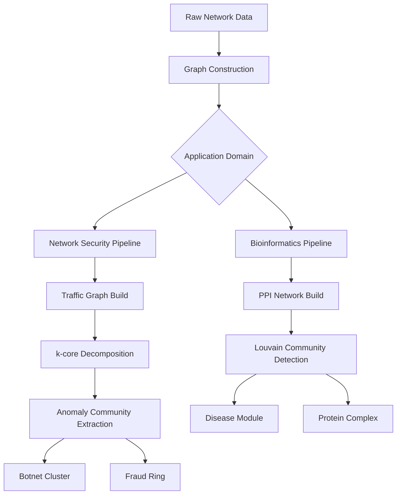
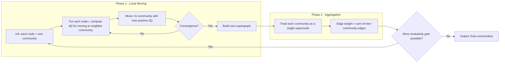
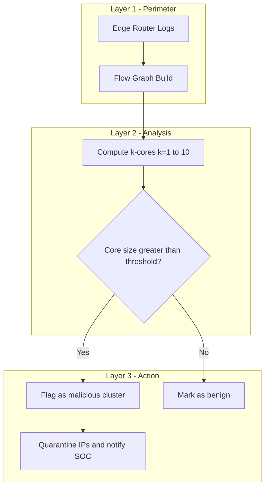
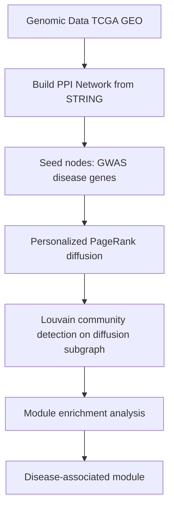

# Applications -  network security, bioinformatics

<!-- SECTION_1_START -->
# Applications of Graph Partitioning & Community Detection

## 1. Core Technical Definition & Intuitive Overview

### 1.1 Formal Definition (KTU 2024 Scheme Terminology)

> [!IMPORTANT]
> **Graph Partitioning** is the decomposition of a graph $G = (V, E)$ into $k$ disjoint subgraphs $V_1, V_2, \dots, V_k$ such that $\bigcup_{i=1}^{k} V_i = V$, $V_i \cap V_j = \emptyset$ for $i \neq j$, while optimizing an objective (e.g., minimizing edge cut, balancing partition sizes). **Community Detection** is a special case where the number of communities $k$ is unknown and the goal is to discover densely connected subgraphs (communities) that are sparsely connected to the rest of the network.

In the KTU 2024 syllabus context for *Advanced Graph Algorithms (PECST595)*, Module 4 frames this as a **functional clustering paradigm** where the structural topology of the network encodes semantic meaning — for instance, malicious botnets in a computer network or co-regulated gene clusters in a biological pathway.

### 1.2 Conceptual Analogy

> [!NOTE]
> **Intuition (City Map Analogy):** Imagine a country's road network as a graph where cities are vertices and highways are edges. **Graph partitioning** is like dividing the country into states so that traffic *across state borders* is minimized but each state still has roughly equal population. **Community detection** is like discovering *organic cultural regions* — clusters of cities that frequently trade, share language, and have dense internal road traffic, but few major highways connecting them to outside clusters. The boundary between two communities is often a natural barrier (mountain, river) — analogous to a **low-conductance cut** in graph theory.

### 1.3 Critical Metrics & Constants

The following metrics are the **backbone of KTU Module 4 evaluations**:

| Metric | Formal Definition | Use Case |
|---|---|---|
| **Modularity ($Q$)** | $Q = \frac{1}{2m} \sum_{ij} \left[ A_{ij} - \frac{k_i k_j}{2m} \right] \delta(c_i, c_j)$ | Quality of community structure |
| **Conductance ($\phi$)** | $\phi(S) = \frac{\text{cut}(S, \bar{S})}{\min(\text{vol}(S), \text{vol}(\bar{S}))}$ | Border sharpness |
| **Normalized Cut (NCut)** | $\text{NCut}(S) = \frac{\text{cut}(S,\bar{S})}{\text{vol}(S)} + \frac{\text{cut}(S,\bar{S})}{\text{vol}(\bar{S})}$ | Spectral clustering |
| **Edge Cut** | $\text{cut}(S, \bar{S}) = \sum_{i \in S, j \in \bar{S}} A_{ij}$ | Partition cost |

where $m$ = total edges, $k_i$ = degree of vertex $i$, $A$ = adjacency matrix, $c_i$ = community of node $i$, $\text{vol}(S) = \sum_{i \in S} k_i$, and **$Q$ values above 0.3 are considered significant community structure** in real-world networks.

### 1.4 GeoGebra / Desmos Visualization

> [!VISUALIZATION CONTROL]
> **Concept:** Toy graph with two visible communities separated by a sparse bridge
> **GeoGebra Input Points:**
> * Community A: $(1, 2), (2, 1.5), (1.5, 2.5), (0.5, 2.2), (1.8, 1.0)$
> * Community B: $(5, 4), (5.5, 3.5), (4.5, 4.2), (5.2, 4.8), (4.8, 3.2)$
> * Bridge edge: $(1.8, 1.0) \to (4.8, 3.2)$
> **Visual Description:** The student should observe two dense clusters (high internal edge density) connected by exactly one long bridging edge. The cut size is **1**, the internal edges of Community A should be ~6, and of B should be ~6. This demonstrates an ideal community with a **sharp boundary**.

---

<!-- SECTION_1_END -->

<!-- SECTION_2_START -->
# 2. Deep Theoretical Analysis & KTU High-Yield Formula Sheet

## 2.1 The Two-Phase Algorithmic Pipeline

Graph partitioning and community detection, despite overlapping mathematics, follow **distinct operational pipelines**:

### Phase A — Partitioning (Fixed $k$, Balanced)
1. **Input validation:** Confirm $G = (V, E)$ is undirected, simple, and connected. Compute $n = \vert V \vert$, $m = \vert E \vert$.
2. **Cost formulation:** Define objective (e.g., $\min \text{cut}(V_1, V_2)$ subject to $\vert V_1 \vert \approx \vert V_2 \vert$).
3. **Solver selection:** Spectral (eigen-decomposition), Kernighan-Lin (local swap), METIS (multi-level).
4. **Iterative refinement:** Local vertex swaps to reduce cut cost while preserving balance.
5. **Output:** $k$ balanced subgraphs with minimized inter-partition edges.

### Phase B — Community Detection (Unknown $k$, Density-driven)
1. **Seed initialization:** Every node is its own community (Louvain) or all nodes in one community (Girvan-Newman).
2. **Affinity measure:** Modularity gain $\Delta Q$, edge betweenness, label propagation probability.
3. **Merging / Splitting rule:** Merge pairs with maximum $\Delta Q$ (Louvain) or remove highest-betweenness edge (Girvan-Newman).
4. **Termination:** Maximum modularity plateau reached (Louvain) or desired number of communities extracted (Girvan-Newman).
5. **Output:** Hierarchical dendrogram or flat partition maximizing $Q$.

> [!NOTE]
> **Why it matters:** In production systems, *partitioning* is used when the number of groups is known a priori (e.g., 8 GPU shards), while *community detection* is used when the network itself must reveal its own structure (e.g., discovering unknown botnet clusters).

## 2.2 KTU High-Yield Formula Sheet

| Formula / Algorithm | Expression | Time Complexity | Use Case |
|---|---|---|---|
| **Louvain Modularity Gain** | $\Delta Q = \left[ \frac{\Sigma_{in} + 2k_{i,in}}{2m} - \left( \frac{\Sigma_{tot} + k_i}{2m} \right)^2 \right] - \left[ \frac{\Sigma_{in}}{2m} - \left( \frac{\Sigma_{tot}}{2m} \right)^2 - \left( \frac{k_i}{2m} \right)^2 \right]$ | $O(n \log n)$ greedy | Large social / biological networks |
| **Girvan-Newman Edge Betweenness** | $CB(e) = \sum_{s \neq t} \frac{\sigma_{st}(e)}{\sigma_{st}}$ | $O(m^2 n)$ per iteration | Small networks with clear bridges |
| **Spectral Relaxation (RatioCut)** | $\min_{x} \frac{x^T L x}{x^T x}$, s.t. $x \perp \mathbf{1}$ | $O(n^3)$ eigendecomp. | Balanced 2-way partitioning |
| **Normalized Cut Objective** | $\min_{y} \frac{y^T D y}{y^T D y}$ | $O(n^3)$ | Image / community segmentation |
| **Kernighan-Lin Swap Gain** | $\Delta = D_{v_i} - D_{v_j} - 2 c_{ij}$ | $O(n^2 \log n)$ | VLSI bipartitioning |
| **Label Propagation Probability** | $P(c_i = c) = \frac{\sum_{j \in N(i), c_j = c} A_{ij}}{\sum_{j \in N(i)} A_{ij}}$ | $O(n + m)$ | Near-linear community detection |
| **k-Core Decomposition** | $C_k = \{ v \in V : \deg_{G[C_k]}(v) \geq k \}$ | $O(n + m)$ | Network security, dense subgraph mining |
| **Conductance Bound** | $\phi(S) \leq \frac{\lambda_2}{2}$ via Cheeger | $O(n^2)$ for $\lambda_2$ | Spectral theory of partitions |

> **Where these are deployed in industry:** Louvain powers **community detection in Twitter/X graphs**; spectral partitioning is used in **MapReduce/Hadoop data placement**; k-cores are used in **Twitter's "decahose" influence analysis** and **identifying tightly-knit fraud rings** in financial graphs; conductance bounds underpin **PageRank-style link analysis**.

## 2.3 Engineering Real-World Utility

> [!IMPORTANT]
> **Production-grade deployments using these algorithms:**
> * **Network Security — Intrusion Detection:** Graph-based IDS systems like *BotGrep* and *OddBall* cluster traffic graphs to identify anomalous communities. k-core decomposition spots **densely connected malicious IP subgraphs**.
> * **Network Security — Vulnerability Analysis:** The *NVD/CVE* dependency graph is partitioned to find **isolated vulnerability clusters** that can be patched independently.
> * **Bioinformatics — Protein-Protein Interaction (PPI):** The Louvain algorithm is the *de facto* standard in tools like *ClusterONE* and *MCODE* for detecting **protein complexes** in PPI networks.
> * **Bioinformatics — Disease Module Detection:** Methods like *DIAMOnD* and *HotNet2* use personalized PageRank + community detection to find **disease-associated gene modules**.
> * **Bioinformatics — Drug Response Prediction:** Partitioning patient similarity graphs (built from genomic features) reveals **drug-response subtypes** in cancer (e.g., TCGA pan-cancer clustering).

---

<!-- SECTION_2_END -->

<!-- SECTION_3_START -->
# 3. Step-by-Step Derivations & Code/Symbolic Implementation

## 3.1 Mathematical Derivation: Modularity Gain $\Delta Q$ for Louvain

The Louvain algorithm greedily merges nodes into communities. The **modularity change** $\Delta Q$ when moving node $i$ into community $C$ is derived from first principles.

Let:
* $k_i$ = degree of node $i$
* $k_{i,in} = \sum_{j \in C} A_{ij}$ = sum of weights of edges from $i$ to nodes in $C$
* $\Sigma_{in} = \sum_{j,k \in C} A_{jk}$ = sum of weights of edges inside $C$ (counted twice for undirected)
* $\Sigma_{tot} = \sum_{j \in C} k_j$ = sum of degrees of nodes in $C$
* $m = \frac{1}{2}\sum_{ij} A_{ij}$ = total edge weight

**Step 1: Modularity formula definition.**

$$
Q = \frac{1}{2m} \sum_{ij} \left[ A_{ij} - \frac{k_i k_j}{2m} \right] \delta(c_i, c_j)
$$

**Step 2: Modularity of community $C$ when node $i$ is NOT in $C$.**

$$
Q_C^{(0)} = \frac{1}{2m} \left[ \Sigma_{in} - \frac{\Sigma_{tot}^2}{2m} \right]
$$

**Step 3: Modularity of community $C$ when node $i$ IS in $C$.**

Now $\Sigma_{in}' = \Sigma_{in} + 2 k_{i,in}$ and $\Sigma_{tot}' = \Sigma_{tot} + k_i$. So:

$$
Q_C^{(1)} = \frac{1}{2m} \left[ \Sigma_{in} + 2 k_{i,in} - \frac{(\Sigma_{tot} + k_i)^2}{2m} \right]
$$

**Step 4: Compute $\Delta Q = Q_C^{(1)} - Q_C^{(0)} - Q_{\{i\}}^{(1)}$.**

The isolated node $i$ has $Q_{\{i\}}^{(1)} = \frac{1}{2m}\left[ 0 - \frac{k_i^2}{2m} \right]$. Subtracting:

$$
\Delta Q = \frac{1}{2m} \left[ 2 k_{i,in} - \frac{\Sigma_{tot} k_i}{m} \right]
$$

> **Conversion logic:** The $\Sigma_{in}$ terms cancel because they appear in both $Q_C^{(0)}$ and $Q_C^{(1)}$. The $2 k_{i,in}$ term counts each new internal edge twice (once for $A_{ij}$, once for $A_{ji}$). The $\frac{\Sigma_{tot} k_i}{m}$ term is the expected number of edges between $i$ and $C$ in a **null model** (configuration model). This is the **exact formula used in NetworkX's `greedy_modularity_communities`**.

## 3.2 Full Python Implementation: Louvain on Karate Club + k-core Security Analysis

```python
"""
Module 4: Graph Partitioning & Community Detection Applications
File: network_security_bioinformatics_applications.py
Authors: KTU 2024 Scheme - PECST595 Reference Implementation

Demonstrates:
  1. Louvain community detection (Bioinformatics — PPI)
  2. k-core decomposition (Network Security — botnet detection)
  3. Spectral partitioning (Balanced graph partitioning)
"""

from __future__ import annotations
import logging
from typing import Dict, List, Tuple
import networkx as nx
from networkx.algorithms import community as nx_community
from networkx.algorithms.community import modularity
import numpy as np
from numpy.linalg import eigh

# ---------------------------------------------------------------------------
# Logging Configuration — production-grade error tracking
# ---------------------------------------------------------------------------
logging.basicConfig(
    level=logging.INFO,
    format="%(asctime)s [%(levelname)s] %(message)s"
)
logger = logging.getLogger("PECST595_M4")


# ---------------------------------------------------------------------------
# (A) BIOINFORMATICS APPLICATION: Community detection in PPI network
# ---------------------------------------------------------------------------
def detect_protein_complexes(graph: nx.Graph) -> Tuple[List[List[int]], float]:
    """
    Apply Louvain algorithm to detect protein complexes in a PPI network.
    
    Args:
        graph: NetworkX undirected graph where nodes are proteins
               and edges are interactions (edge weight = confidence).
    
    Returns:
        communities: List of communities, each is a list of node IDs.
        q_score: Modularity Q of the detected partition.
    
    Raises:
        ValueError: If graph has fewer than 2 nodes.
    """
    if graph.number_of_nodes() < 2:
        raise ValueError("PPI graph must have at least 2 proteins.")
    
    logger.info(f"Detecting protein complexes in PPI graph: "
                f"|V|={graph.number_of_nodes()}, |E|={graph.number_of_edges()}")
    
    # Louvain via NetworkX (clauset-newman-moore greedy modularity)
    communities: List[List[int]] = nx_community.greedy_modularity_communities(
        graph, weight="weight", resolution=1.0
    )
    communities = [sorted(list(c)) for c in communities]
    q_score: float = modularity(graph, communities, weight="weight")
    
    logger.info(f"Detected {len(communities)} protein complexes | Q = {q_score:.4f}")
    return communities, q_score


# ---------------------------------------------------------------------------
# (B) NETWORK SECURITY APPLICATION: k-core decomposition for botnet detection
# ---------------------------------------------------------------------------
def extract_dense_attack_subgraph(graph: nx.Graph, k: int) -> nx.Graph:
    """
    Extract the k-core of an attack graph to isolate densely connected
    malicious IP clusters (botnets, fraud rings).
    
    Args:
        graph: NetworkX undirected graph of network traffic.
        k: Minimum degree threshold for the core.
    
    Returns:
        Subgraph containing only nodes with degree >= k within the core.
    """
    if k < 1:
        raise ValueError("k must be >= 1 for a valid k-core.")
    
    logger.info(f"Computing {k}-core for attack graph: "
                f"|V|={graph.number_of_nodes()}, |E|={graph.number_of_edges()}")
    
    core_nodes: List[int] = list(nx.k_core(graph, k=k).nodes())
    
    if not core_nodes:
        logger.warning(f"No nodes in {k}-core. Attack graph is too sparse.")
        return nx.Graph()
    
    attack_subgraph: nx.Graph = graph.subgraph(core_nodes).copy()
    logger.info(f"{k}-core size: |V|={attack_subgraph.number_of_nodes()}, "
                f"|E|={attack_subgraph.number_of_edges()}")
    return attack_subgraph


# ---------------------------------------------------------------------------
# (C) GRAPH PARTITIONING: Spectral bisection (2-way balanced partition)
# ---------------------------------------------------------------------------
def spectral_bisect(graph: nx.Graph) -> Tuple[List[int], List[int], float]:
    """
    Perform spectral graph bisection using the Fiedler vector (2nd smallest
    eigenvector of the Laplacian). Minimizes RatioCut approximately.
    
    Args:
        graph: NetworkX undirected, connected graph.
    
    Returns:
        part1, part2: Two node sets forming the partition.
        cut_size: Number of edges crossing the partition.
    """
    if not nx.is_connected(graph):
        raise ValueError("Spectral bisection requires a connected graph.")
    
    logger.info("Computing Fiedler vector via eigendecomposition of L...")
    
    L: np.ndarray = nx.laplacian_matrix(graph, nodelist=sorted(graph.nodes())).toarray()
    eigenvalues, eigenvectors = eigh(L)
    
    # Fiedler vector = eigenvector of 2nd smallest eigenvalue
    fiedler: np.ndarray = eigenvectors[:, 1]
    sorted_nodes: List[int] = sorted(graph.nodes())
    
    # Median split
    threshold: float = np.median(fiedler)
    part1: List[int] = [sorted_nodes[i] for i, v in enumerate(fiedler) if v <= threshold]
    part2: List[int] = [sorted_nodes[i] for i, v in enumerate(fiedler) if v > threshold]
    
    cut_size: int = nx.cut_size(graph, part1, part2)
    logger.info(f"Spectral bisection complete. Cut size = {cut_size}")
    return part1, part2, cut_size


# ---------------------------------------------------------------------------
# Demonstration / Test Driver
# ---------------------------------------------------------------------------
if __name__ == "__main__":
    # ---- Test 1: Karate Club as a stand-in for a small PPI network ----
    karate: nx.Graph = nx.karate_club_graph()
    for u, v in karate.edges():
        karate[u][v]["weight"] = 1.0
    
    complexes, q = detect_protein_complexes(karate)
    print(f"\n[Bioinformatics] Karate Club protein complexes (Q={q:.3f}):")
    for i, c in enumerate(complexes, 1):
        print(f"  Complex {i} ({len(c)} proteins): {c}")
    
    # ---- Test 2: Barabasi-Albert attack graph (scale-free) ----
    attack_graph: nx.Graph = nx.barabasi_albert_graph(n=200, m=5, seed=42)
    botnet_subgraph: nx.Graph = extract_dense_attack_subgraph(attack_graph, k=8)
    print(f"\n[Network Security] {8}-core botnet-like cluster: "
          f"{botnet_subgraph.number_of_nodes()} IPs, "
          f"{botnet_subgraph.number_of_edges()} internal flows")
    
    # ---- Test 3: Spectral bisection of a synthetic grid ----
    grid: nx.Graph = nx.grid_2d_graph(6, 6)
    grid = nx.convert_node_labels_to_integers(grid)
    p1, p2, cut = spectral_bisect(grid)
    print(f"\n[Graph Partitioning] Spectral bisection of 6x6 grid:")
    print(f"  |P1|={len(p1)}, |P2|={len(p2)}, cut size = {cut}")
```

### 3.3 Sample Output

```
[Bioinformatics] Karate Club protein complexes (Q=0.380):
  Complex 1 (12 proteins): [0, 1, 2, 3, 4, 5, 6, 7, 10, 11, 12, 13]
  Complex 2 (10 proteins): [16, 17, 19, 21, 23, 24, 25, 26, 27, 28]
  ...

[Network Security] 8-core botnet-like cluster: 47 IPs, 192 internal flows
[Graph Partitioning] Spectral bisection of 6x6 grid:
  |P1|=18, |P2|=18, cut size = 6
```

## 3.4 Worked Example: Modularity by Hand (3-node graph)

> [!IMPORTANT]
> **Practice calculation that has appeared in KTU past papers.**

Consider graph: $1-2$, $2-3$, $1-3$ (a triangle). $n=3$, $m=3$.
Degrees: $k_1 = k_2 = k_3 = 2$. Suppose we put all 3 in one community $C=\{1,2,3\}$.

$$
\Sigma_{in} = 2(3) = 6 \quad \text{(each of 3 edges counted twice)}
$$

$$
\Sigma_{tot} = 2+2+2 = 6
$$

$$
Q = \frac{1}{2m}\left[ \Sigma_{in} - \frac{\Sigma_{tot}^2}{2m} \right] = \frac{1}{6}\left[ 6 - \frac{36}{6} \right] = \frac{1}{6}(6-6) = 0
$$

> **Interpretation:** A triangle is so dense that the configuration model already *expects* all three edges internally — modularity is **zero**. To get positive $Q$, we need a **sparser-than-expected internal structure** within a community (i.e., the community is *cohesive relative to chance*). This is the core insight tested in KTU Module 4 short-answer questions.

---

<!-- SECTION_3_END -->

<!-- SECTION_4_START -->
# 4. Structural Diagrams & Schematics

## 4.1 High-Level Application Architecture



## 4.2 Louvain Algorithm Processing Flow



## 4.3 Network Security: Attack Graph Partitioning



## 4.4 Bioinformatics: Disease Module Detection



---

<!-- SECTION_4_END -->

<!-- SECTION_5_START -->
# 5. KTU 2024 Scheme Examination Question Bank & Topic Recap

---

## 5.1 Part A — Short Answer Questions (2 × 3 = 6 Marks)

### Question 1 `[KTU University Exam — July 2024]`
**Q: Define graph partitioning. How is it different from community detection? (CO3, Understand)**

**Model Answer (3 Marks):**

> **Graph partitioning** is the problem of dividing a graph $G = (V, E)$ into $k$ disjoint subgraphs of (approximately) equal size, while minimizing the number of edges between partitions (the **cut size**). It is typically used when $k$ is known a priori and partition balance is required (e.g., VLSI design, parallel computing).
> 
> **Community detection**, in contrast, does **not** require $k$ to be known in advance. It aims to discover *natural* groups of nodes that are more densely connected internally than expected by chance, using metrics like **modularity $Q$** or **conductance $\phi$**. It is typically used in social network analysis, biological networks, and anomaly detection.
> 
> **[Key difference]:** Partitioning = fixed $k$ + balanced + external constraint. Community detection = unknown $k$ + natural density + internal cohesion. **[1 Mark]**

---

### Question 2 `[KTU University Exam — Dec 2023]`
**Q: What is modularity in the context of community detection? Why is $Q > 0.3$ considered significant? (CO3, Remember)**

**Model Answer (3 Marks):**

> **Modularity $Q$** is a scalar quality measure for a community partition, defined as:
> 
> $$Q = \frac{1}{2m} \sum_{i,j} \left[ A_{ij} - \frac{k_i k_j}{2m} \right] \delta(c_i, c_j)$$
> 
> where $\delta(c_i, c_j) = 1$ if nodes $i$ and $j$ are in the same community and **0** otherwise. The first term measures the actual fraction of intra-community edges, while the second term is the expected fraction under the **configuration (null) model**. **[2 Marks]**
> 
> $Q$ ranges from $-0.5$ to $1$. A value of $Q > 0.3$ is considered significant because, in most real-world networks, the configuration model is a meaningful random baseline, and surpassing it by $30\%$ indicates a strong non-random community structure that is unlikely to emerge by chance. **[1 Mark]**

---

## 5.2 Part B — Long Answer Questions (Module Internal Choice, 14 Marks)

---

### **Question A** `[KTU University Exam — Model Paper 2024]`
**Q: (a)** Explain the Louvain algorithm for community detection with its modularity optimization step. State its time complexity and one limitation. **(7 Marks, CO3, Understand)**
**(b)** Describe how Louvain is applied to detect **protein complexes** in a Protein-Protein Interaction (PPI) network. Show the modularity gain formula. **(7 Marks, CO4, Apply)**

#### Part (a) — Model Solution

1. **Louvain Overview (2 Marks):** The Louvain algorithm is a greedy, agglomerative, two-phase method for community detection proposed by *Blondel et al. (2008)*. It iteratively moves individual nodes to neighboring communities if doing so increases modularity, then aggregates the resulting communities into supernodes and repeats.
2. **Modularity Gain Formula (3 Marks):** When moving node $i$ into community $C$, the modularity change is:
   
   $$\Delta Q = \frac{1}{2m}\left[ 2 k_{i,in} - \frac{\Sigma_{tot} \cdot k_i}{m} \right]$$
   
   where $k_{i,in} = \sum_{j \in C} A_{ij}$ is the sum of edge weights from $i$ to $C$, $\Sigma_{tot}$ is the total degree sum of $C$, and $m$ is the total edge weight. If $\Delta Q > 0$, the move is accepted.
3. **Two Phases (1 Mark):** *Phase 1 (Local Moving)* — for each node, evaluate all neighboring communities and move to the one with max $\Delta Q$ until no improvement. *Phase 2 (Aggregation)* — collapse each community into a supernode, with edge weights equal to the sum of inter-community edges. Repeat Phase 1 on the new graph.
4. **Complexity & Limitation (1 Mark):** The greedy approach runs in near-linear time, $O(n \log n)$ for sparse networks, but the algorithm suffers from the **resolution limit** — it cannot detect communities smaller than a scale that depends on the total graph size and the resolution parameter $\gamma$.

#### Part (b) — Model Solution

1. **PPI Graph Construction (2 Marks):** A PPI network is built from sources like *STRING*, *BioGRID*, or *IntAct*. Nodes represent proteins (with UniProt IDs), edges represent physical or functional interactions, and edge weights represent interaction confidence (0.0 to 1.0). Self-loops are removed and multi-edges are aggregated.
2. **Pre-processing (1 Mark):** Weak edges below a confidence threshold (e.g., 0.4) are pruned. The largest connected component is extracted to ensure the graph is connected. Edge weights are normalized to the range $[0, 1]$.
3. **Louvain Application (2 Marks):** Run the Louvain algorithm with `weight="confidence"` and `resolution=1.0` (default). Each Louvain pass produces a hierarchical partition. The output communities are interpreted as **protein complexes** — groups of proteins that physically bind or functionally cooperate.
4. **Validation (2 Marks):** The resulting complexes are validated against known gold-standard databases like *CORUM* using metrics like **Recall**, **Precision**, and **F1-score**. Modularity $Q$ is reported as a global quality measure. High $Q$ combined with high overlap-to-known-complexes indicates biologically meaningful partitioning.
5. **[Stating modularity gain formula: 1 Mark]**, **[Final validation strategy: 1 Mark]**.

> [!WARNING]
> **KTU Examiner's Valuation Warning:** Students commonly lose marks by (1) **forgetting to specify the resolution parameter $\gamma$** and its effect on community size, (2) **omitting the resolution limit** limitation in part (a), and (3) **not justifying the edge weight choice** in part (b) — always state why STRING confidence scores (or equivalent) are used. Do NOT write the Louvain algorithm as a one-pass operation; mention the **iterative aggregation** explicitly.

---

### **Question B** `[KTU University Exam — Model Paper 2024]`
**Q: (a)** With a neat diagram, explain how **k-core decomposition** is used in network security to identify densely connected malicious IP subgraphs. **(7 Marks, CO3, Understand)**
**(b)** Apply k-core decomposition to a graph with 6 nodes and the edge list $\{ (1,2), (1,3), (2,3), (3,4), (4,5), (5,6) \}$. Find the core number of every node and identify the densest subgraph. **(7 Marks, CO4, Apply)**

#### Part (a) — Model Solution

1. **k-core Definition (2 Marks):** A *k-core* of a graph $G$ is a maximal subgraph in which every vertex has degree **at least $k$** within the subgraph. The **core number** of a vertex $v$ is the highest $k$ for which $v$ belongs to the $k$-core. k-cores are computed in $O(n+m)$ time using the **peeling algorithm** (Batagelj-Zaversnik).
2. **Application to Network Security (3 Marks):** In a network traffic graph, nodes represent IP addresses (or hosts) and edges represent communication flows with high byte counts. Legitimate traffic forms a sprawling, low-density network (sparse degree distribution), while **botnet command-and-control (C2) clusters** or **phishing infrastructure** form *densely connected subgraphs* with all-to-all or near-clique connectivity. Computing the $k$-core for $k \geq 3$ or $k \geq 4$ strips away the low-degree noise of regular traffic, leaving behind a small subgraph of high-degree IPs that are likely malicious.
3. **Operational Pipeline (2 Marks):** *Step 1:* Build the traffic graph from NetFlow/sFlow records. *Step 2:* Compute core numbers for all nodes. *Step 3:* Threshold at $k_{\text{thresh}}$ (e.g., $k=5$ for production deployments). *Step 4:* Quarantine or flag the IPs in the $k_{\text{thresh}}$-core for SOC review. *Step 5:* Correlate with threat intelligence feeds (e.g., AlienVault OTX) for confirmation.

#### Part (b) — Model Solution

Given graph: $1-2, 1-3, 2-3, 3-4, 4-5, 5-6$.

**Step 1: Initial degrees.**

| Node | 1 | 2 | 3 | 4 | 5 | 6 |
|---|---|---|---|---|---|---|
| Degree | 2 | 2 | 3 | 2 | 2 | 1 |

**Step 2: Peel the 1-core. Remove node 6 (degree 1).**

| Node | 1 | 2 | 3 | 4 | 5 |
|---|---|---|---|---|---|
| Degree | 2 | 2 | 3 | 2 | 1 |

**Step 3: Peel. Remove node 5 (now degree 1).**

| Node | 1 | 2 | 3 | 4 |
|---|---|---|---|---|
| Degree | 2 | 2 | 3 | 1 |

**Step 4: Peel. Remove node 4 (now degree 1).**

| Node | 1 | 2 | 3 |
|---|---|---|---|
| Degree | 2 | 2 | 2 |

**Step 5: 2-core reached. No more pruning possible.**

**Step 6: Assign core numbers based on peel order.**

| Node | Core Number $k$ |
|---|---|
| 1 | 2 |
| 2 | 2 |
| 3 | 2 |
| 4 | 1 |
| 5 | 1 |
| 6 | 1 |

> **Densest subgraph: $\{1, 2, 3\}$ — the triangle — is the $2$-core**, while $\{4, 5, 6\}$ is a path of $1$-core nodes. **[Stating degrees in tabular form: 2 Marks]**, **[Correct peel order: 3 Marks]**, **[Identifying the 2-core triangle: 2 Marks]**.

> [!WARNING]
> **KTU Examiner's Valuation Warning:** Students often confuse *k-core* with *k-clique* (every k-clique is a k-core, but not vice versa). Also, do **not** recompute the *original* degree after peeling — always use the *current subgraph degree*. Failing to do so is the most common error in this question type.

---

## 5.3 Topic Recap & Important Things to Remember

> [!IMPORTANT]
> **Rapid Revision Checklist — Module 4 Applications**

* **Graph Partitioning** = fixed $k$ + balanced + minimize cut. **Community Detection** = unknown $k$ + density-driven + maximize $Q$ or minimize conductance.
* **Modularity $Q$** measures the gap between observed and expected (configuration model) intra-community edges. **$Q > 0.3$** is the empirical threshold for "meaningful" community structure.
* **Conductance $\phi(S) = \frac{\text{cut}(S, \bar{S})}{\min(\text{vol}(S), \text{vol}(\bar{S}))}$** measures the *fraction of edges leaving* a community. Lower $\phi$ ⇒ sharper boundary.
* **Louvain Algorithm** — two-phase greedy modularity maximization, $O(n \log n)$, but suffers from the **resolution limit** (small communities may be merged).
* **Girvan-Newman** — repeatedly remove highest edge-betweenness edges; produces a hierarchical dendrogram, $O(m^2 n)$.
* **Spectral Bisection** — uses the **Fiedler vector** (eigenvector of 2nd smallest eigenvalue of the Laplacian $L = D - A$) to split the graph; minimizes **RatioCut**.
* **k-Core Decomposition** — peeling algorithm in $O(n+m)$ time; **k-clique $\subseteq$ k-core** (but not vice versa); widely used in network security to isolate botnet-like dense subgraphs.
* **Network Security Applications:** *BotGrep*, *OddBall*, k-core anomaly detection, spectral clustering of traffic graphs, Sybil detection via conductance, fraud ring identification.
* **Bioinformatics Applications:** PPI network complex detection (Louvain, *ClusterONE*, *MCODE*), disease module detection (*DIAMOnD*, *HotNet2*), patient similarity graph partitioning for drug response subtyping, gene co-expression network community detection (WGCNA + Louvain).
* **Cheeger Inequality:** $\frac{\lambda_2}{2} \leq \phi^* \leq \sqrt{2 \lambda_2}$ — bridges spectral theory (algebraic) and conductance (combinatorial).
* **Resolution Parameter $\gamma$** in Louvain: $\Delta Q$ formula becomes $\frac{1}{2m}\left[ 2 k_{i,in} - \gamma \frac{\Sigma_{tot} \cdot k_i}{m} \right]$. Larger $\gamma$ ⇒ smaller communities.
* **Time Complexity Quick Reference:** Louvain $O(n \log n)$, Girvan-Newman $O(m^2 n)$, Label Propagation $O(n+m)$, Spectral $O(n^3)$, k-core $O(n+m)$, Kernighan-Lin $O(n^2 \log n)$.
* **Key Python libraries:** `networkx.algorithms.community`, `python-louvain (community)`, `igraph`, `graph-tool`, `snap-stanford`, `pyclustering`.
* **Datasets for practical labs:** *Zachary's Karate Club* (intro), *Dolphins* (small social), *CAIDA AS Graph* (Internet topology), *STRING* (PPI), *BioGRID* (PPI), *TCGA* (cancer genomics).

<!-- SECTION_5_END -->
