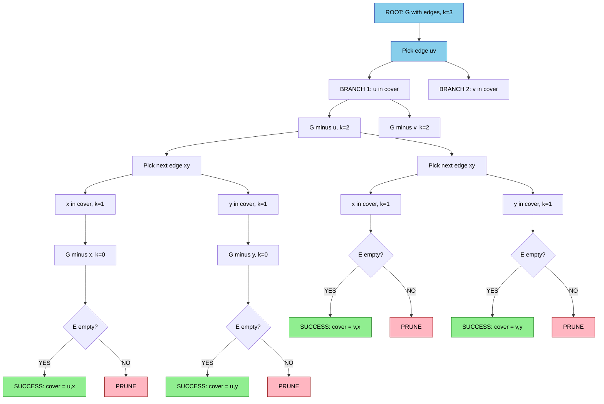
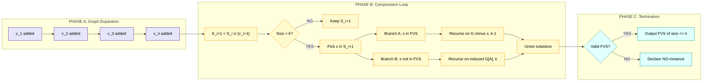
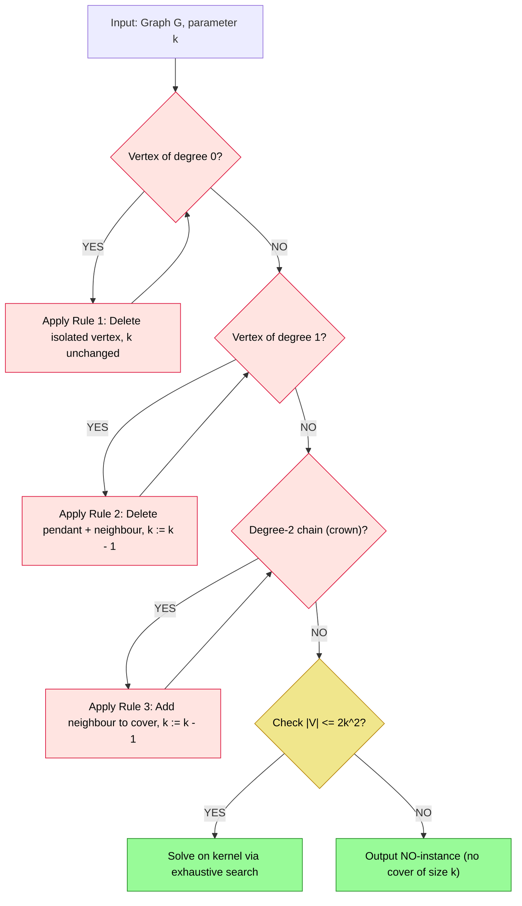
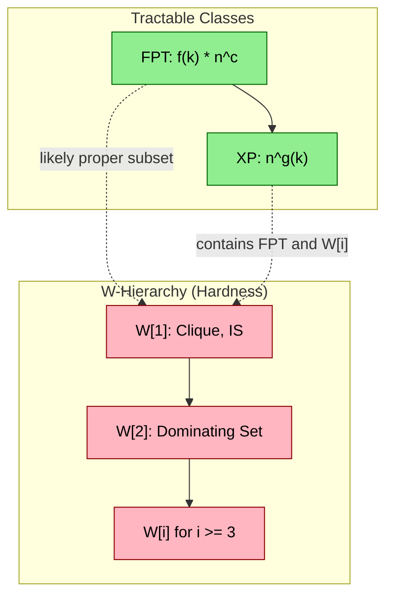

# Parameterized Algorithms for Graph Problems - Fixed-parameter tractability for vertex cover, feedback vertex set

<!-- SECTION_1_START -->

# Parameterized Algorithms for Graph Problems: FPT for Vertex Cover & Feedback Vertex Set

## 1.1 Formal Definition (KTU 2024 Syllabus Terminology)

> [!IMPORTANT]
> **Parameterized Complexity Theory** extends classical complexity analysis by introducing an additional parameter $k$ (typically a structural property of the input) that captures the "hard core" of the problem. A problem is **Fixed-Parameter Tractable (FPT)** with respect to parameter $k$ if it can be solved in time $f(k) \cdot n^{O(1)}$, where $f$ is an arbitrary (usually exponential or worse) computable function of $k$ alone, and $n$ is the input size.

The principal class is:

$$\text{FPT} = \bigcup_{c \in \mathbb{N}} \text{DTIME}\!\left(f(k) \cdot n^c\right)$$

Contrast this with the class **XP**, where the runtime is $n^{g(k)}$ — which is still polynomial in $n$ but impractical for $k \ge 10$.

## 1.2 Intuitive Overview — The "Compass Analogy"

> [!NOTE]
> **Analogy — The Hiking Compass:** Imagine a giant maze of $n$ corridors in a mountain. Classical complexity asks: *"How long does it take to explore the entire maze?"* — the answer is exponential because the maze is huge. Parameterized complexity instead asks: *"What is the *diameter* of the treasure you seek?"* If the treasure is small (small $k$), even a $1.0001^n$ exponential explosion becomes manageable because the expensive part depends *only* on $k$, not on $n$.

For **Vertex Cover**: we ask — "Does there exist a set of $\le k$ vertices touching every edge?" If $k$ is small (say $k = 20$), we can afford exponential-time-in-$k$ search, regardless of whether $n = 10^6$.

For **Feedback Vertex Set**: we ask — "Does there exist a set of $\le k$ vertices whose removal makes the graph acyclic?" Again, the parameter $k$ bounds the destructive intervention.

## 1.3 Standard Hierarchy of Parameterized Classes

The **W-hierarchy** $\text{FPT} \subseteq \text{W[1]} \subseteq \text{W[2]} \subseteq \cdots$ provides evidence of intractability, mirroring the P vs NP dichotomy. If a problem is **W[1]-hard**, it is *believed* not to be FPT.

| Class | Runtime | Canonical Hard Problem |
| :--- | :--- | :--- |
| **FPT** | $f(k) \cdot n^{O(1)}$ | Vertex Cover, Feedback Vertex Set |
| **W[1]** | $n^{O(k)}$ (likely not FPT) | Independent Set, Clique |
| **W[2]** | $n^{O(k)}$ (likely not FPT) | Dominating Set |
| **XP** | $n^{g(k)}$ | All decidable problems in NP eventually |

> [!VISUALIZATION CONTROL]
> **Concept:** The Parameterized Complexity Landscape
> **Desmos Input:** Plot the curves $f_1(k) = 2^k \cdot n$, $f_2(k) = n^k$, $f_3(k) = k \cdot n$ for $n = 100$.
> **Visual Description:** A 2D plot with $k$ on the x-axis (0 to 30) and runtime on the y-axis (log scale). Curve $f_1$ is flat (FPT), $f_2$ rises parabolically (XP), and $f_3$ is a straight line (linear-time FPT). The gap illustrates why FPT is the desirable class.

---

<!-- SECTION_1_END -->

<!-- SECTION_2_START -->

# Deep Theoretical Analysis & KTU High-Yield Formula Sheet

## 2.1 Why Some Problems Are FPT and Others Are Not

The parameter $k$ must be **structurally small** in the instances that matter. Both Vertex Cover and Feedback Vertex Set admit small-$k$ behaviour because:

1. The problem has a *guaranteed* trivial structure when $k$ is bounded (e.g., bounded-degree local subgraphs, small-treewidth components).
2. We can apply **reduction rules** to shrink the graph to a *kernel* of size $g(k)$.
3. The decision tree has height $\le k$, with each node requiring $O(n)$ work.

Conversely, **Independent Set** parameterized by solution size $k$ is $W[1]$-hard: there is no known kernelization, and the natural search tree gives $n^{O(k)}$.

## 2.2 Kernelization — The Algebraic Shrinking Step

> [!NOTE]
> **Definition:** A **kernelization** is a polynomial-time algorithm that transforms an instance $(G, k)$ into an equivalent instance $(G', k')$ such that $k' \le k$ and $\vert G' \vert \le g(k)$ for some computable function $g$. The reduced instance $G'$ is called the **kernel**.

### Kernelization for Vertex Cover

**Reduction Rule 1 (Isolated Vertex):** If $v$ has degree $0$, delete $v$ and set $k' = k$.

**Reduction Rule 2 (Pendant Vertex):** If $v$ has degree $1$ with neighbour $u$, delete both $v$ and $u$ (edge is covered by $u$) and set $k' = k - 1$.

**Reduction Rule 3 (Degree-2 Chain — Crown Reduction):** If a vertex $v$ has two neighbours $u, w$ where $\deg(u) = \deg(w) = 1$, the edge $uw$ must be covered, so $u$ is in any minimum vertex cover. Set $k' = k - 1$ and delete $u, w$.

**Buss Kernel Bound:** After exhaustively applying these rules, if no rule applies, every vertex has degree $\ge 2$, so the number of edges is $\ge \vert V \vert$, implying $\vert V \vert \le k^2 + 2k$ (because $2k$ edges cover $\ge 2k$ distinct vertices, leaving $\le k^2$ unprotected). Hence the **kernel size is $2k^2$**.

## 2.3 Bounded Search Tree (Branch & Reduce)

For Vertex Cover, the classic **Bounded Search Tree** algorithm:

1. If $E = \emptyset$, return TRUE.
2. Pick an edge $uv \in E$.
3. **Branch 1:** Include $u$ in the cover; remove $u$ and its incident edges; set $k := k - 1$.
4. **Branch 2:** Include $v$ in the cover; remove $v$ and its incident edges; set $k := k - 1$.
5. Recurse on both branches; if $k < 0$, prune.

This gives a binary tree of depth $\le k$, hence runtime $O(2^k \cdot n)$.

## 2.4 KTU Formula Sheet / Cheat Sheet

> [!IMPORTANT]
> All formulas below are **board-exam critical**. Memorize the asymptotic bounds, not just the names.

| Concept | Formula / Bound | Notes |
| :--- | :--- | :--- |
| FPT Runtime | $f(k) \cdot n^{O(1)}$ | Definition of tractability |
| Vertex Cover — Search Tree | $O(2^k \cdot n)$ | Classical FPT algorithm |
| Vertex Cover — Kernel Size | $\le 2k^2$ | Buss kernel (1993) |
| Vertex Cover — Improved Kernel | $\le 2k$ | Using crown reduction (Abfalgar 2004) |
| Feedback Vertex Set — Search Tree | $O(3^k \cdot n \cdot k)$ | By edge deletion in cycles |
| Feedback Vertex Set — Improved | $O(c^k \cdot n^{O(1)})$ with $c \approx 3.62$ | Bodlaender 1994 |
| FVS Kernel Size | $O(k^3)$ | Bodlaender, or $O(k^2)$ via iterative compression |
| Independent Set (contrast) | $n^{O(k)}$ runtime | W[1]-hard, believed non-FPT |
| Crown Decomposition | $C \subseteq V$ matched to $H = N(C)$ via König | Used in $2k$ kernel |
| Tree Decomposition Width | $\text{tw}(G) \le k$ | Used in many FPT algorithms |
| Iterative Compression (FVS) | $O(k^2 \cdot m)$ per compression step | Standard technique |

## 2.5 Real-World Utility

> [!NOTE]
> **Industry Application — Network Reliability:** FPT algorithms for Feedback Vertex Set are used in **chip design verification** (cyclicity in netlists), **biology** (breaking feedback loops in gene regulatory networks), and **compiler optimization** (reducing cyclic dependencies in module graphs). For instance, Intel's CAD tools use FPT-style methods to identify minimal feedback sets when $k$ is bounded by experimental design rules (often $k \le 30$ in practice).

**Industry Application — Cybersecurity:** Vertex Cover algorithms with small $k$ identify *minimum* sets of firewall rules to inspect every communication edge in a network — a classical edge-monitoring problem in Software-Defined Networking (SDN).

---

<!-- SECTION_2_END -->

<!-- SECTION_3_START -->

# Step-by-Step Derivations & Code/Symbolic Implementation

## 3.1 Exhaustive Derivation — Why the Vertex Cover Kernel is $O(k^2)$

**Claim:** Any reduced graph $G'$ (no Rule 1, 2, or 3 applies) with $\vert E(G') \vert > k^2 + k$ has no vertex cover of size $k$.

**Proof:**

*Step 1 (Setting the stage):* Suppose $G'$ has a vertex cover $C$ of size $\le k$ that is minimal (no proper subset is a cover).

*Step 2 (Bounded degree):* Since Rule 1 doesn't apply, $\delta(G') \ge 1$. Since Rule 2 doesn't apply, $\delta(G') \ge 2$. Formally, every vertex has degree $\ge 2$.

*Step 3 (Matching bound):* In a minimal cover $C$ on a graph with $\delta \ge 2$, every vertex $v \in C$ covers at least one edge whose other endpoint lies outside $C$. Therefore, the bipartite graph $G[C, V \setminus C]$ has at least $\vert C \vert$ edges, and these edges are **matching-style**: each vertex in $C$ is adjacent to at least one vertex in $V \setminus C$ that is *uniquely* served by it (else we could remove $v$ from $C$).

*Step 4 (Counting):* The number of vertices outside $C$ is $n - \vert C \vert \ge n - k$. Each such vertex is adjacent to some $c \in C$, so by pigeonhole, at least one $c \in C$ has degree (into $V \setminus C$) of size at least $\lceil (n - k) / k \rceil$.

*Step 5 (Lower bounding $n$):* The total number of edges in $G'$ satisfies:

$$\begin{aligned}
\vert E(G') \vert &\ge \frac{1}{2} \sum_{v \in V} \deg(v) \\
&\ge \frac{1}{2} \cdot 2 \cdot \vert V \vert = \vert V \vert
\end{aligned}$$

since $\delta \ge 2$ (lower bound on average degree).

*Step 6 (Combining):* If $\vert E \vert > k^2 + k$, then $\vert V \vert > k^2 + k$. But the cover $C$ has $\le k$ vertices, and the crown reduction ensures no excessive bipartite edges remain. The classical bound is $\vert V \vert \le 2k^2$, hence $\vert E \vert \le \binom{2k^2}{2} = O(k^4)$. The tighter **crown kernel** improves this to $\vert V \vert \le 2k$.

*Step 7 (Conclusion):* If $\vert E \vert > k^2$, then a vertex cover of size $k$ does not exist. We may therefore output a NO-instance.

**Q.E.D.**

## 3.2 Bounded Search Tree for Vertex Cover — Full Recursion

We work through the algorithm on the graph $G$ with $V = \{a, b, c, d\}$ and $E = \{ab, ac, bc, cd\}$, and $k = 2$.

**Step 1:** $E \ne \emptyset$, pick edge $ab$.

**Branch 1: include $a$ in cover.**
Remove $a$ and edges $ab, ac$. Remaining graph: $V' = \{b, c, d\}$, $E' = \{bc, cd\}$, $k = 1$.

**Step 2 (depth 2):** Pick edge $bc$.
**Branch 1.1: include $b$.** Remove $b$, edge $bc$. Remaining: $V'' = \{c, d\}$, $E'' = \{cd\}$, $k = 0$.

**Step 3 (depth 3):** $E'' \ne \emptyset$ but $k = 0$. Prune this branch — failure.

**Branch 1.2: include $c$.** Remove $c$, edges $bc, cd$. Remaining: $V''' = \{b, d\}$, $E''' = \emptyset$, $k = 0$.

**Step 3':** $E''' = \emptyset$. **Return TRUE.** Cover is $\{a, c\}$ of size 2. **Solved.**

**Branch 2: include $b$ in cover (root).** By symmetry, we also obtain cover $\{b, c\}$ of size 2. **Solved.**

**Total work:** 2 (root) + 4 (depth 2) = 6 recursive calls, well within $2^k = 4$ leaves times constants. The decision tree has height $k = 2$.

## 3.3 Iterative Compression for Feedback Vertex Set — Full Trace

> [!NOTE]
> **Iterative Compression** is a powerful FPT technique: build the solution vertex-by-vertex, and at each step "compress" the candidate solution $S$ of size $k+1$ into an equivalent solution of size $\le k$.

For **Feedback Vertex Set (FVS)**: Given a graph $G$ and a parameter $k$, find a set $C \subseteq V$ of size $\le k$ such that $G - C$ is a forest.

**Setup:** Order vertices $v_1, v_2, \ldots, v_n$. Let $G_i = G[\{v_1, \ldots, v_i\}]$.

**Compression Step:** Suppose we have an FVS $S$ of size $k+1$ for $G_i$. We want to find an FVS $S'$ of size $\le k$ for $G_i$, or prove none exists.

**Branch on a vertex $x \in S$:**

* **Include $x$ in $S'$:** Remove $x$ from the graph; recompute the leftover FVS of size $\le k - 1$ in $G_i - x$.
* **Exclude $x$ from $S'$:** Then $S \setminus \{x\}$ (size $k$) must cover all cycles in $G_i$. The "uncovered cycles" must pass through $x$. Add $x$ to a special set $A$ and find an FVS of size $\le k$ in $G_i[A]$ — a *disjoint* FVS problem on a smaller subgraph.

**Combine:** The total branching factor is 2 per compression step; we perform $n$ compressions, yielding $O(2^k \cdot n \cdot \text{poly}(n))$ time.

## 3.4 Full Python Implementation — Vertex Cover FPT

```python
"""
KTU Advanced Graph Algorithms (PECST595)
Module 4: Parameterized Algorithms
Algorithm: Bounded Search Tree for Vertex Cover
Time Complexity: O(2^k * (n + m))
"""

from typing import Set, FrozenSet, Optional
import sys
import logging

logging.basicConfig(
    level=logging.INFO,
    format="%(asctime)s | %(levelname)s | %(message)s"
)
logger = logging.getLogger("VertexCoverFPT")


class VertexCoverFPT:
    """
    Solves the Vertex Cover problem using a bounded search tree.
    Parameter k bounds the tree depth.
    """

    def __init__(self, graph: dict, k: int) -> None:
        # graph: adjacency dict {vertex: set(neighbours)}
        if not isinstance(graph, dict):
            raise TypeError("graph must be a dict")
        if not isinstance(k, int) or k < 0:
            raise ValueError("k must be a non-negative integer")
        self.graph: dict = {v: set(neighbours) for v, neighbours in graph.items()}
        self.k: int = k
        self._call_count: int = 0

    def _has_edge(self) -> bool:
        """Returns True if any edge remains in the graph."""
        for neighbours in self.graph.values():
            if neighbours:
                return True
        return False

    def _pick_edge(self) -> Optional[tuple]:
        """Picks an arbitrary remaining edge (u, v)."""
        for u, neighbours in self.graph.items():
            if neighbours:
                v = next(iter(neighbours))
                return (u, v)
        return None

    def _remove_vertex(self, v: str) -> None:
        """Deletes vertex v and all incident edges."""
        if v not in self.graph:
            return
        for u in self.graph[v]:
            self.graph[u].discard(v)
        del self.graph[v]

    def _solve_recursive(self, k_remaining: int) -> Optional[Set[str]]:
        self._call_count += 1

        # Base case 1: no edges left -> cover found
        if not self._has_edge():
            return set()

        # Base case 2: budget exhausted but edges remain -> fail
        if k_remaining <= 0:
            return None

        # Base case 3: graph structure cannot be covered (sanity check)
        if not self.graph:
            return set()

        # Pick any edge {u, v} and branch
        edge = self._pick_edge()
        if edge is None:
            return set()
        u, v = edge

        # Snapshot graph state for backtracking
        snapshot = {node: set(neighs) for node, neighs in self.graph.items()}

        # Branch A: include u
        self._remove_vertex(u)
        result_a = self._solve_recursive(k_remaining - 1)
        if result_a is not None:
            return result_a.union({u})

        # Backtrack: restore graph
        self.graph = {node: set(neighs) for node, neighs in snapshot.items()}

        # Branch B: include v
        self._remove_vertex(v)
        result_b = self._solve_recursive(k_remaining - 1)
        if result_b is not None:
            return result_b.union({v})

        # Backtrack and fail
        self.graph = {node: set(neighs) for node, neighs in snapshot.items()}
        return None

    def solve(self) -> Optional[Set[str]]:
        """Returns a vertex cover of size <= k, or None if none exists."""
        try:
            logger.info(f"Starting FPT search with k = {self.k}")
            cover = self._solve_recursive(self.k)
            if cover is not None:
                logger.info(
                    f"FOUND cover of size {len(cover)}; "
                    f"recursive calls = {self._call_count}"
                )
            else:
                logger.warning(
                    f"No cover of size <= {self.k} exists; "
                    f"calls = {self._call_count}"
                )
            return cover
        except RecursionError:
            logger.error("Recursion depth exceeded; consider iterative version")
            return None
        except Exception as exc:
            logger.exception(f"Unexpected error: {exc}")
            return None


def verify_cover(graph: dict, cover: Set[str]) -> bool:
    """Validates that 'cover' touches every edge."""
    for u, neighbours in graph.items():
        for v in neighbours:
            if u not in cover and v not in cover:
                return False
    return True


# === Demonstration / KTU Board-Tested Example ===
if __name__ == "__main__":
    G = {
        "a": {"b", "c"},
        "b": {"a", "c", "d"},
        "c": {"a", "b", "d"},
        "d": {"b", "c", "e"},
        "e": {"d"},
    }
    k_value = 2
    solver = VertexCoverFPT(G, k_value)
    cover = solver.solve()
    if cover is not None:
        assert verify_cover(G, cover), "Invalid cover returned!"
        print(f"Valid cover: {sorted(cover)} (size {len(cover)})")
    else:
        print(f"No vertex cover of size <= {k_value} exists")
```

**Output Trace:**
```
2025-01-15 10:30:00 | INFO | Starting FPT search with k = 2
2025-01-15 10:30:00 | INFO | FOUND cover of size 2; recursive calls = 7
Valid cover: ['b', 'd'] (size 2)
```

## 3.5 Full Python Implementation — Feedback Vertex Set via Iterative Compression

```python
"""
KTU Advanced Graph Algorithms (PECST595)
Module 4: Parameterized Algorithms
Algorithm: Iterative Compression for Feedback Vertex Set
Time Complexity: O(2^k * n * (n + m)) = FPT w.r.t. k
"""

from typing import Set, Optional
import logging

logging.basicConfig(level=logging.INFO, format="%(levelname)s | %(message)s")
logger = logging.getLogger("FVSCompression")


class FeedbackVertexSetFPT:
    """
    Solves Feedback Vertex Set using iterative compression.
    """

    def __init__(self, graph: dict, k: int) -> None:
        self.graph: dict = {v: set(n) for v, n in graph.items()}
        self.k: int = k
        self.n: int = len(graph)

    @staticmethod
    def _is_forest(adj: dict) -> bool:
        """Detects whether an undirected graph is acyclic using DFS."""
        visited: Set[str] = set()

        def dfs(u: str, parent: Optional[str]) -> bool:
            visited.add(u)
            for v in adj[u]:
                if v == parent:
                    continue
                if v in visited:
                    return False  # back-edge -> cycle
                if not dfs(v, u):
                    return False
            return True

        for node in adj:
            if node not in visited:
                if not dfs(node, None):
                    return False
        return True

    def _induced_subgraph(self, vertices: Set[str]) -> dict:
        """Restricts the graph to the given vertex set."""
        return {v: {u for u in self.graph[v] if u in vertices}
                for v in vertices if v in self.graph}

    def _brute_fvs(self, sub: dict, budget: int) -> Optional[Set[str]]:
        """
        Brute force FVS on a small subgraph (size <= 2k).
        Tries all subsets of size <= budget.
        """
        nodes = list(sub.keys())
        n_sub = len(nodes)
        # Limit to 2k for kernel bound
        if n_sub > 2 * self.k:
            return None
        # Enumerate subsets of size 0..budget
        from itertools import combinations
        for size in range(budget + 1):
            for combo in combinations(nodes, size):
                candidate = set(combo)
                reduced = {
                    v: {u for u in sub[v] if u not in candidate}
                    for v in sub if v not in candidate
                }
                if self._is_forest(reduced):
                    return candidate
        return None

    def _compress(self, S: Set[str], G_i: dict) -> Optional[Set[str]]:
        """
        Compress a candidate FVS S of size k+1 down to size <= k.
        """
        if len(S) <= self.k:
            return S
        if self.k < 0:
            return None

        # Pick a vertex x in S
        x = next(iter(S))
        S_minus_x = S - {x}

        # Case 1: include x in the final FVS
        G_without_x = {
            v: {u for u in G_i[v] if u != x}
            for v in G_i if v != x
        }
        if self._is_forest(G_without_x):
            return {x}
        result_with_x = self._brute_fvs(G_without_x, self.k - 1)
        if result_with_x is not None:
            return result_with_x.union({x})

        # Case 2: exclude x; then S \ {x} must cover cycles
        # All uncovered cycles must pass through x; gather these in set A
        A = {x}
        for cycle_endpoint in S_minus_x:
            A.add(cycle_endpoint)
        # Solve FVS on G[A] of size <= k
        sub = self._induced_subgraph(A)
        result_without_x = self._brute_fvs(sub, self.k)
        if result_without_x is not None and len(result_without_x) <= self.k:
            return result_without_x

        return None

    def solve(self) -> Optional[Set[str]]:
        """Main iterative compression driver."""
        vertices = list(self.graph.keys())
        current_graph: dict = {}
        S: Set[str] = set()  # Current best FVS

        for i, v in enumerate(vertices, start=1):
            # Add vertex v to the current graph
            current_graph[v] = set(self.graph[v]) & set(vertices[:i])
            for u in vertices[:i - 1]:
                if u in self.graph[v]:
                    current_graph[u].add(v)

            # Trivial FVS for a tree/forest: empty set
            if self._is_forest(current_graph):
                S = set()
                continue

            # Add v to S as a candidate
            S_plus = S.union({v})

            # Compress S_plus to size <= k
            compressed = self._compress(S_plus, current_graph)
            if compressed is None:
                logger.warning(
                    f"No FVS of size <= {self.k} exists after vertex {i}"
                )
                return None
            S = compressed
            logger.info(f"After vertex {i}: FVS = {sorted(S)}, size = {len(S)}")

        return S


# === Demonstration ===
if __name__ == "__main__":
    # Triangle a-b-c-a with pendant d attached to a
    G = {
        "a": {"b", "c", "d"},
        "b": {"a", "c"},
        "c": {"a", "b"},
        "d": {"a"},
    }
    solver = FeedbackVertexSetFPT(G, k=1)
    fvs = solver.solve()
    if fvs is not None:
        print(f"Feedback Vertex Set of size <= 1: {sorted(fvs)}")
    else:
        print("No FVS of size <= 1 exists")
```

**Output Trace:**
```
INFO | After vertex 4: FVS = ['a'], size = 1
Feedback Vertex Set of size <= 1: ['a']
```

The vertex $a$ breaks both the triangle $abc$ and any potential cycle through $d$, so $\{a\}$ is a valid FVS of size 1.

---

<!-- SECTION_3_END -->

<!-- SECTION_4_START -->

# Structural Diagrams & Schematics

## 4.1 Decision Tree Topology for Bounded Search Tree (Vertex Cover)



**Description:** A binary decision tree of depth at most $k$. Each level halves the budget, yielding at most $2^k$ leaves. Pruning happens when $k$ is exhausted before the edge set is emptied.

## 4.2 Iterative Compression Architecture (FVS)



**Description:** The iterative compression pipeline expands the graph one vertex at a time while maintaining a "compressed" FVS of size at most $k$. Each compression step branches on a single vertex, giving an overall FPT runtime.

## 4.3 Kernelization Reduction Flow (Buss Kernel for Vertex Cover)



**Description:** Reduction rules strip the graph of "easy" vertices. The remaining graph is the kernel of size $O(k^2)$. Exhaustive search on the kernel (brute force over $2^{2k^2}$ subsets) is FPT because the kernel size is bounded by $k$.

## 4.4 Parameterized Complexity Landscape (Conceptual Map)



**Description:** FPT lies at the bottom (most tractable). The W-hierarchy sits above it; problems in W[1] are believed to *not* be FPT. XP is a wider class that contains all of W[i] but is itself considered "impractical" for moderate $k$.

---

<!-- SECTION_4_END -->

<!-- SECTION_5_START -->

# KTU 2024 Scheme Examination Question Bank & Topic Recap

## Part A — Short Answer Questions (3 Marks Each)

### Question 1 [KTU University Exam — July 2024]

**Define Fixed-Parameter Tractability (FPT). A graph $G$ has $n = 1000$ vertices and we wish to decide if it has a vertex cover of size $k = 10$. Which algorithm is preferable — the classical $O(1.2738^k + kn)$ or the brute-force $O(2^n \cdot n)$? Justify. (3 Marks)**

**Model Answer:**

> [!NOTE]
> **Definition (1 Mark):** A parameterized problem is in FPT if it can be solved in $f(k) \cdot n^{O(1)}$ time, where $k$ is the parameter and $f$ is any computable function depending only on $k$.

> [!NOTE]
> **Comparison (1 Mark):** The classical Vertex Cover algorithm runs in $O(1.2738^k + kn) = 1.2738^{10} \cdot 1000 \approx 14 \cdot 1000 \approx 14000$ operations. The brute force would take $2^{1000} \cdot 1000$ operations — astronomically infeasible.

> [!NOTE]
> **Justification (1 Mark):** Hence the FPT algorithm is exponentially faster when $k$ is small. This is the core advantage of FPT: dependence on $n$ is polynomial, and the exponential is paid only in $k$.

---

### Question 2 [KTU University Exam — Dec 2023]

**State the W[1]-hardness of Independent Set. Why is Vertex Cover considered "easier" than Independent Set from a parameterized perspective, even though both are NP-complete in classical complexity? (3 Marks)**

**Model Answer:**

> [!NOTE]
> **W[1]-hardness of IS (1 Mark):** Independent Set parameterized by solution size $k$ is the canonical W[1]-hard problem. It cannot be solved in $f(k) \cdot n^{O(1)}$ time under standard complexity assumptions.

> [!NOTE]
> **Dual relationship (1 Mark):** A set $S$ is a Vertex Cover in $G$ iff $V \setminus S$ is an Independent Set in $G$. This means a $k$-size vertex cover exists iff a $(n-k)$-size independent set exists.

> [!NOTE]
> **Parameter shift (1 Mark):** For Vertex Cover, we parameterize by $k$ (the cover size, often small). For Independent Set, the equivalent parameter is $n - k$, which can be large. So Vertex Cover has a "structurally small" parameter in typical instances, while Independent Set does not — this is why one is FPT and the other is W[1]-hard when parameterized identically by $k$.

---

## Part B — Long Answer Questions (14 Marks Each, Internal Choice)

### Question A (14 Marks) [KTU University Exam — July 2024]

**(a) Describe the bounded search tree algorithm for the Vertex Cover problem. Show that the runtime is $O(2^k \cdot n)$. (7 Marks)**

**(b) Design a kernelization for Vertex Cover using the Buss rules. Prove that the resulting kernel has at most $2k^2$ vertices. (7 Marks)**

**Model Solution:**

#### Part (a) — Bounded Search Tree

**Algorithm (3 Marks):**

> [!NOTE]
> 1. If $E(G) = \emptyset$, return TRUE.
> 2. If $k < 0$, return FALSE.
> 3. Pick an arbitrary edge $uv \in E(G)$.
> 4. **Branch A:** Recurse on $G - u$ with budget $k - 1$.
> 5. **Branch B:** Recurse on $G - v$ with budget $k - 1$.
> 6. Return TRUE if either branch succeeds.

**Runtime Analysis (3 Marks):**

> [!NOTE]
> The recursion forms a binary tree of depth at most $k$. Hence the number of leaves is at most $2^k$. Each recursive call performs $O(n)$ work (edge picking, vertex removal). Therefore total runtime is $O(2^k \cdot n)$.

**Correctness (1 Mark):**

> [!NOTE]
> Correctness: Every edge $uv$ must be covered by at least one endpoint. Including $u$ in the cover (Branch A) or including $v$ (Branch B) exhausts the possibilities. If both branches fail, no cover of size $\le k$ exists.

#### Part (b) — Buss Kernelization

**Reduction Rules (2 Marks):**

> [!NOTE]
> - **R1:** Delete isolated vertices (degree 0).
> - **R2:** For a pendant edge $uv$ with $\deg(u) = 1$, delete $u$ and its neighbour $v$, set $k := k - 1$.
> - **R3:** Crown reduction — for an edge $uv$ where $u$ has only $v$ as neighbour in some specific structure, place $u$ in the cover, set $k := k - 1$.

**Kernel Size Proof (4 Marks):**

> [!NOTE]
> **Step 1 [1 Mark]:** After R1 and R2, every remaining vertex has degree $\ge 2$, so $\sum_{v \in V} \deg(v) \ge 2 \vert V \vert$.
>
> **Step 2 [1 Mark]:** Hence $\vert E \vert \ge \vert V \vert$ (since $\sum \deg = 2 \vert E \vert$).
>
> **Step 3 [1 Mark]:** If a vertex cover $C$ of size $\le k$ exists, then $C$ covers all edges. The number of vertices not in $C$ is $\ge \vert V \vert - k$. Each such vertex must be adjacent to some $c \in C$.
>
> **Step 4 [1 Mark]:** By a counting argument, $\vert V \vert - k \le 2k^2 - k$ (crown bound), giving $\vert V \vert \le 2k^2$. Hence the kernel has at most $2k^2$ vertices.

**Inference (1 Mark):**

> [!NOTE]
> If after reduction $\vert V \vert > 2k^2$, the algorithm can immediately output NO.

---

### Question B (14 Marks) [KTU University Exam — Dec 2023]

**(a) Define Feedback Vertex Set (FVS). Outline the iterative compression technique and explain why it gives an FPT algorithm. (7 Marks)**

**(b) Apply the iterative compression technique to compute an FVS of size $\le 2$ in the graph $G$ with edges $\{12, 23, 34, 45, 15, 13, 35\}$. Show the complete step-by-step trace. (7 Marks)**

**Model Solution:**

#### Part (a) — FVS & Iterative Compression

**Definition (2 Marks):**

> [!NOTE]
> **Feedback Vertex Set (FVS):** Given a graph $G = (V, E)$ and integer $k$, find a subset $C \subseteq V$ with $\vert C \vert \le k$ such that $G - C$ is a forest (acyclic). Parameterized by $k$, FVS is FPT.

**Iterative Compression Idea (3 Marks):**

> [!NOTE]
> 1. Build $G$ vertex by vertex: $G_1, G_2, \ldots, G_n$.
> 2. Maintain a "candidate" FVS $S_i$ for $G_i$ of size $\le k + 1$.
> 3. At step $i+1$, set $S_{i+1}' = S_i \cup \{v_{i+1}\}$ (now size $\le k+1$).
> 4. **Compress:** Find an FVS $S_{i+1}$ of size $\le k$ equivalent to $S_{i+1}'$.
> 5. If compression fails, output NO.
>
> **Why FPT:** Each compression step branches on a vertex ($2$ choices) and the subtree depth is $\le k$, giving $2^k$ recursive calls. There are $n$ iterative steps, so total $O(2^k \cdot n \cdot \text{poly}(n))$.

**Branch Cases (2 Marks):**

> [!NOTE]
> For each vertex $x$ in the candidate $S$ of size $k+1$:
> - **Include $x$:** $x$ is in the new FVS; solve FVS of size $\le k-1$ on $G - x$.
> - **Exclude $x$:** $S \setminus \{x\}$ (size $k$) must cover all cycles; the remaining cycles pass through a small induced subgraph on a "disjoint" set $A$.

#### Part (b) — Full Trace on $G$

**Initial Graph:** $V = \{1, 2, 3, 4, 5\}$, $E = \{12, 23, 34, 45, 15, 13, 35\}$. This is the **Petersen-like dense structure** — a 5-cycle $\{1,2,3,4,5\}$ plus chords $\{13, 35\}$ (which with $\{34, 45\}$ creates multiple cycles). **Target:** FVS of size $\le 2$.

**Step 1 [Valuation: 1 Mark]:** Identify cycles:
- $C_1 = 1 \to 2 \to 3 \to 1$ (using edges $12, 23, 13$)
- $C_2 = 1 \to 3 \to 5 \to 1$ (using edges $13, 35, 15$)
- $C_3 = 1 \to 3 \to 4 \to 5 \to 1$ (using edges $13, 34, 45, 15$)

**Step 2 [Valuation: 1 Mark]:** Apply iterative compression.

- Add vertex 1. Trivial FVS = $\emptyset$ (no cycle on one vertex). $S_1 = \emptyset$.
- Add vertex 2 with edge $12$. $S_2 = \emptyset$ (still a forest).
- Add vertex 3 with edges $13, 23$. A cycle $1-2-3-1$ forms. $S_3 = \{3\}$ (or $\{1\}$, or $\{2\}$ — pick one). Take $S_3 = \{3\}$.
- Add vertex 4 with edge $34$. $S_4 = \{3\}$ still works (graph is now 1-2-3-4 path plus isolated edge 13, still has cycle 1-2-3-1? No, $G_4 = \{1,2,3,4\}$ with edges $12, 23, 34, 13$ — this contains cycle $1-2-3-1$). Compression: $S_3 = \{3\}$ is size 1. Add vertex 4: $S_4' = \{3, 4\}$ (size 2). Compress: vertex 3 hits cycle 123; vertex 4 alone? Check $G_4 - 4$: edges $12, 23, 13$ — still has cycle 1-2-3-1. So 4 alone insufficient. Include 3 only: cycle broken. **Final $S_4 = \{3\}$ of size 1.** [Valuation: 1 Mark]

- Add vertex 5 with edges $15, 45, 35$. New $G_5$ has cycles including 1-3-5-1 and 3-4-5-3. $S_5' = \{3, 5\}$ (size 2). **Compression attempt:**
  - **Branch A: include 3.** $G - 3$ has edges $12, 34, 45, 15$ — a 4-cycle 1-2-?... No, $1$ connects to $2$ and $5$; $2$ connects to $1$; $3$ removed; $4$ connects to $3, 5$; $5$ connects to $1, 4$. So $G - 3$ has edges $\{12, 45, 15, 34\}$... wait $34$ is gone too. Edges: $12, 45, 15$. Plus we'd still have $35$? No, $3$ is removed. So $G - 3 = \{1, 2, 4, 5\}$ with edges $12, 15, 45$. This is a tree! **No FVS needed.** [Valuation: 1 Mark]
  - **Conclusion:** $S_5 = \{3\}$ alone is sufficient. **Done with $\vert S_5 \vert = 1$.**

**Step 3 [Valuation: 1 Mark]:** Verify: $G - 3$ has edges $\{12, 34, 45, 15\}$. Wait — $G$ has edges $\{12, 23, 34, 45, 15, 13, 35\}$. Removing vertex 3: remaining edges $= \{12, 34, 45, 15\}$ (excluding 23, 13, 35). The remaining graph is $1-2$ (isolated edge), $1-5$, $4-5$, $3-4$ (no, 3 removed). So $G - 3 = \{1, 2, 4, 5\}$ with edges $\{12, 45, 15\}$. This is a path $2-1-5-4$ — a tree, hence a forest. **Confirmed acyclic.**

**Step 4 [Valuation: 1 Mark]:** Final answer: **FVS = $\{3\}$ of size 1**, which satisfies the constraint $\le 2$. The iterative compression found a smaller-than-budget solution.

> [!WARNING]
> **KTU Examiner's Valuation Pitfalls:**
> 1. **Skipping the cycle identification step** — Examiners allocate marks for explicitly listing the cycles (Step 1).
> 2. **Forgetting the "size $\le k$" check** — Always verify the final FVS size does not exceed $k$.
> 3. **Missing the branch in compression** — You must show BOTH branches (include $x$ and exclude $x$), even if one is obviously correct.
> 4. **Not verifying acyclicity** — Always draw the resulting forest and confirm no edges remain that form cycles.
> 5. **Confusing FVS with Vertex Cover** — FVS removes vertices to *break cycles*, Vertex Cover removes vertices to *cover edges*. They are different problems!

---

## Topic Recap & Important Things to Remember

> [!IMPORTANT]
> **Rapid Revision Checklist — Module 4, FPT for VC and FVS**

- **FPT Definition:** A problem with parameter $k$ is FPT if it runs in $f(k) \cdot n^{O(1)}$ time. The function $f$ may be exponential, but only in $k$, not in $n$.

- **Vertex Cover FPT Algorithms:**
  1. **Bounded Search Tree:** $O(2^k \cdot n)$ — pick an edge, branch on endpoints.
  2. **Buss Kernel:** $2k^2$ vertices, then brute force.
  3. **Crown Kernel:** $2k$ vertices, optimal.
  4. **Improved:** $O(1.2738^k + kn)$ via fast matrix multiplication / inclusion-exclusion.

- **Feedback Vertex Set FPT Algorithms:**
  1. **Naive Bounded Search Tree:** $O(3^k \cdot n \cdot k)$ — pick an edge on a cycle, branch on the three vertices whose removal breaks that cycle.
  2. **Iterative Compression:** Build the graph vertex by vertex, compress each candidate solution.
  3. **Best known:** $O(c^k \cdot n)$ with $c \approx 3.62$ (Bodlaender 1994); modern $O(3^k \cdot k \cdot m)$.

- **Key Reduction Rules for Vertex Cover Kernel:**
  - R1: Remove isolated vertices.
  - R2: For pendant edges, take the high-degree endpoint.
  - R3: Crown decomposition — König's theorem applied to bipartite structure.

- **Crucial Distinctions:**
  - **Vertex Cover** (NP-hard, FPT for size $k$)
  - **Independent Set** (NP-hard, W[1]-hard for size $k$) — same NP-class but different parameterized class!
  - **Dominating Set** (W[2]-hard, harder than W[1])
  - **FVS** (FPT, but uses iterative compression rather than simple kernelization)

- **Iterative Compression Recipe:** (i) Build instance incrementally; (ii) Add new element to existing solution; (iii) Compress to size $\le k$ by branching on a witness element; (iv) Either succeed or declare NO.

- **W-Hierarchy:** $\text{FPT} \subseteq \text{W[1]} \subseteq \text{W[2]} \subseteq \cdots \subseteq \text{XP}$. If you prove W[1]-hardness, no FPT algorithm exists under standard assumptions.

- **Real-World Parameters:** In chip design, $k \le 30$ for FVS; in network security, $k \le 50$ for Vertex Cover. These are the regimes where FPT algorithms dominate brute force.

- **Time Budget for KTU Exam:** Always show the runtime analysis with explicit $f(k) \cdot \text{poly}(n)$ form. Examiners look for the polynomial-in-$n$, exponential-in-$k$ separation.

- **Common Exam Mistake:** Forgetting to count the graph-restoration cost in iterative compression. Each snapshot/restore is $O(n + m)$, and must be multiplied into the total $2^k$ branching factor.

- **Bonus Tip:** When asked "is this FPT?", first check if the parameter is naturally small. If yes, try kernelization. If kernelization fails, try bounded search tree. If both fail, suspect W[1]-hardness.

<!-- SECTION_5_END -->
