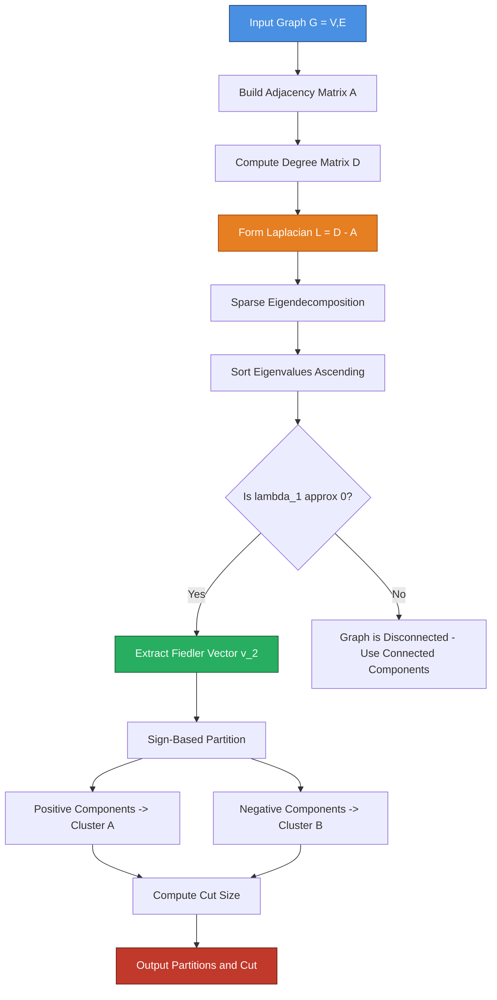
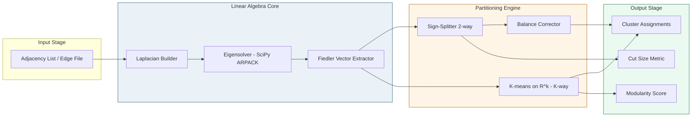

# Spectral Partitioning

<!-- SECTION_1_START -->
# Spectral Partitioning — Core Technical Definition & Intuitive Overview

## 📘 Formal Definition (KTU 2024 Syllabus Terminology)

**Spectral Partitioning** is a graph bisection technique that uses the **eigenvectors of the Graph Laplacian matrix** $L = D - A$ to partition a graph $G = (V, E)$ into two subgraphs such that the **edge cut size is minimized** (or near-minimized, since exact minimum cut is NP-hard in general). The eigenvector corresponding to the **second smallest eigenvalue** $\lambda_2$ of $L$ — known as the **Fiedler Vector** — encodes the natural community structure of the graph. A bipartition is obtained by sorting the vertices according to their corresponding components in the Fiedler vector and splitting them at the sign change (or median) threshold.

> [!IMPORTANT]
> **Syllabus Highlight:** Under the KTU 2024 PECST595 syllabus, Module 4 emphasizes that spectral methods bridge continuous linear algebra with discrete combinatorial optimization — the *continuous relaxation* of the NP-hard min-cut problem yields a polynomial-time *approximation* via eigenvector computation.

## 🌐 Intuitive Analogy — "The Drum Membrane Metaphor"

Imagine your graph is a **drumhead stretched over a frame**, where every node is a pin and every edge is a piece of string. If you pluck this drum:

- The **fundamental tone (lowest pitch)** is just the whole drum vibrating up and down together → corresponds to the *trivial eigenvector* $\mathbf{1} = [1, 1, \dots, 1]^T$ with eigenvalue $\lambda_1 = 0$.
- The **second tone (first harmonic)** is the *slowest way the drum can split into two halves* → this is exactly the **Fiedler vector**. The places where the membrane crosses zero (changes sign) tell you **where to cut**.
- The frequency of this second tone is **$\lambda_2$**, called the **algebraic connectivity**. A *low* $\lambda_2$ means the graph is easy to disconnect; a *high* $\lambda_2$ means it is robust and tightly knit.

> [!NOTE]
> **Why does this work?**
> The Laplacian $L$ acts on any vertex-signing vector $\mathbf{x}$ and measures the "disagreement" between neighboring vertices. Minimizing $\mathbf{x}^T L \mathbf{x}$ is mathematically equivalent to finding a **sparse cut** — the very thing we need for good partitioning.

## 📐 Key Constants & Metrics

| Symbol | Meaning | Typical Value |
|:------:|:--------|:-------------:|
| $n = \vert V \vert$ | Number of vertices | Given |
| $m = \vert E \vert$ | Number of edges | Given |
| $D$ | Diagonal degree matrix, $D_{ii} = \deg(v_i)$ | $n \times n$ |
| $A$ | Adjacency matrix, $A_{ij} = 1$ if $(i,j) \in E$ | $n \times n$ |
| $L = D - A$ | Graph Laplacian | $n \times n$ |
| $\lambda_1 \le \lambda_2 \le \dots \le \lambda_n$ | Sorted eigenvalues of $L$ | $\lambda_1 = 0$ always |
| $\mathbf{v}_2$ | Fiedler vector (eigenvector of $\lambda_2$) | unit norm |
| $\alpha(G) = \lambda_2$ | **Algebraic connectivity** | $\lambda_2 > 0$ iff $G$ is connected |

> [!VISUALIZATION CONTROL]
> **Concept:** Spectral partition of a path graph $P_4$ (a line of 4 nodes).
> **GeoGebra / Desmos Input Equations:**
> * `L = {{1, -1, 0, 0}, {-1, 2, -1, 0}, {0, -1, 2, -1}, {0, 0, -1, 1}}`
> * `Eigenvalues(L) → {0, 2 - √2, 2, 2 + √2}`
> * `v2 = {1/√4, (√2-1)/2, (1-√2)/2, -1/√4}` *(Fiedler vector)*
> **Visual Description:** Plot the four components of $\mathbf{v}_2$ on the y-axis indexed by vertex $\{1,2,3,4\}$. Observe that the curve crosses zero between vertex 2 and vertex 3 — that is the natural cut. The sign of each $v_2(i)$ assigns the vertex to side A (positive) or side B (negative).

---

<!-- SECTION_1_END -->

<!-- SECTION_2_START -->
# Deep Theoretical Analysis & KTU High-Yield Formula Sheet

## 🔬 Theoretical Foundation

### 1. The Laplacian Quadratic Form

For any vector $\mathbf{x} \in \mathbb{R}^n$:

$$
\mathbf{x}^T L \mathbf{x} = \mathbf{x}^T(D - A)\mathbf{x} = \sum_{i=1}^{n} d_i x_i^2 - \sum_{(i,j) \in E} 2 x_i x_j
$$

By algebraic rearrangement, this simplifies to the canonical **Laplacian quadratic form**:

$$
\mathbf{x}^T L \mathbf{x} \;=\; \sum_{(i,j) \in E} (x_i - x_j)^2
$$

> [!NOTE]
> This single identity is the **heart of spectral partitioning**. It states that the Laplacian "measures" the total squared difference along every edge — exactly the cost of cutting an edge when the two endpoints receive different "labels" $x_i$ and $x_j$.

### 2. Connection to Cut Size

If we restrict $\mathbf{x}$ to be a *discrete labeling* $x_i \in \{+1, -1\}$ with the constraint that the labels are balanced (equal number of $+1$ and $-1$), then $\mathbf{x}^T L \mathbf{x}$ is exactly **$4 \times (\text{number of edges cut})$**. Therefore, minimizing the cut is equivalent to:

$$
\min_{\mathbf{x} \in \{-1,+1\}^n,\; \mathbf{x} \perp \mathbf{1}} \;\; \mathbf{x}^T L \mathbf{x}
$$

This is an **NP-hard discrete optimization** (it is essentially the Min-Cut problem).

### 3. Continuous Relaxation — The Rayleigh Quotient

We *relax* $\mathbf{x}$ from $\{-1, +1\}^n$ to $\mathbb{R}^n$ and normalize:

$$
\min_{\mathbf{x} \perp \mathbf{1},\; \mathbf{x} \neq \mathbf{0}} \;\; \frac{\mathbf{x}^T L \mathbf{x}}{\mathbf{x}^T \mathbf{x}} \;=\; \lambda_2
$$

By the **Courant–Fischer Min–Max Theorem**, the minimizer is precisely the eigenvector $\mathbf{v}_2$ associated with $\lambda_2$. The partition is recovered by:

$$
\text{Assign } v_i \to A \text{ if } (\mathbf{v}_2)_i \ge 0, \quad v_i \to B \text{ if } (\mathbf{v}_2)_i < 0
$$

### 4. Algebraic Connectivity & Cheeger Inequality

The **Cheeger Inequality** bounds how good the spectral cut is:

$$
\frac{\lambda_2}{2} \;\le\; h(G) \;\le\; \sqrt{2 \lambda_2}
$$

where $h(G)$ is the **Cheeger constant** (smallest edge-conductance cut). This guarantees the spectral partition is within a *polynomial approximation factor* of the optimal bisection.

### 5. Multi-way Spectral Partitioning (k-way)

For $k$ partitions, use the **$k$ smallest non-trivial eigenvectors** of $L$ as rows of a matrix $U \in \mathbb{R}^{n \times k}$, then **cluster** the rows of $U$ using $k$-means in $\mathbb{R}^k$.

## 📋 KTU Formula Sheet / Cheat Sheet

| # | Formula / Property | Statement |
|:-:|:-------------------|:----------|
| 1 | Laplacian definition | $L = D - A$ |
| 2 | Quadratic form | $\mathbf{x}^T L \mathbf{x} = \sum_{(i,j)\in E}(x_i - x_j)^2$ |
| 3 | Trivial eigenvalue | $L \mathbf{1} = \mathbf{0} \cdot \mathbf{1}$, so $\lambda_1 = 0$ |
| 4 | Positive semi-definiteness | $\mathbf{x}^T L \mathbf{x} \ge 0$ for all $\mathbf{x}$ |
| 5 | Symmetry | $L = L^T$ (real symmetric ⇒ orthogonal diagonalization) |
| 6 | Rayleigh quotient | $R(\mathbf{x}) = \dfrac{\mathbf{x}^T L \mathbf{x}}{\mathbf{x}^T \mathbf{x}}$ |
| 7 | Bisection objective (relaxed) | $\min R(\mathbf{x}) = \lambda_2$ subject to $\mathbf{x} \perp \mathbf{1}$ |
| 8 | Fiedler vector | $\mathbf{v}_2 = \arg\min R(\mathbf{x})$ |
| 9 | Cut size from labeling | $\text{cut}(\sigma) = \tfrac{1}{4}\sum_{(i,j)\in E}(1 - \sigma_i \sigma_j)$ for $\sigma_i \in \{\pm 1\}$ |
| 10 | Cheeger bound | $\tfrac{\lambda_2}{2} \le h(G) \le \sqrt{2\lambda_2}$ |
| 11 | Algebraic connectivity | $\alpha(G) = \lambda_2(L)$ |
| 12 | Normalized Laplacian | $L_{\text{sym}} = D^{-1/2} L D^{-1/2}$ |

## 🏭 Real-World Engineering Utility

| Domain | Application |
|:-------|:------------|
| **VLSI Physical Design** | Partitioning millions of gates into balanced FPGAs/ASICs to minimize wire crossings between blocks |
| **Social Network Analysis** | Detecting communities in Facebook / Twitter graphs via Fiedler vector sign |
| **Image Segmentation** | Shi-Malik Normalized Cut uses $L_{\text{sym}}$ eigenvectors to segment images |
| **Load Balancing (HPC)** | Distributing computational graph nodes across processors to minimize inter-processor communication |
| **Bioinformatics** | Clustering protein–protein interaction networks to find functional modules |
| **Graph Neural Networks** | Spectral Graph Convolutions use eigendecomposition of $L$ for feature learning |

---

<!-- SECTION_2_END -->

<!-- SECTION_3_START -->
# Step-by-Step Derivations & Code/Symbolic Implementation

## 📐 Derivation 1: The Laplacian Quadratic Form Identity

**Goal:** Show that $\mathbf{x}^T L \mathbf{x} = \sum_{(i,j) \in E} (x_i - x_j)^2$.

**Step 1 — Expand the diagonal and off-diagonal parts separately.**

$$
\mathbf{x}^T L \mathbf{x} = \mathbf{x}^T D \mathbf{x} - \mathbf{x}^T A \mathbf{x}
$$

**Step 2 — Evaluate each term.**

$$
\mathbf{x}^T D \mathbf{x} = \sum_{i=1}^{n} d_i x_i^2 = \sum_{i=1}^{n} x_i^2 \sum_{j : (i,j)\in E} 1 = \sum_{i=1}^{n} \sum_{j : (i,j)\in E} x_i^2
$$

$$
\mathbf{x}^T A \mathbf{x} = \sum_{i=1}^{n} \sum_{j=1}^{n} A_{ij} x_i x_j = \sum_{(i,j) \in E} 2 x_i x_j
$$

(The factor of 2 arises because each undirected edge appears twice in the double sum.)

**Step 3 — Combine and rearrange.**

$$
\begin{aligned}
\mathbf{x}^T L \mathbf{x} &= \sum_{(i,j) \in E} \left( x_i^2 + x_j^2 - 2 x_i x_j \right) \\
&= \sum_{(i,j) \in E} (x_i - x_j)^2 \quad \blacksquare
\end{aligned}
$$

---

## 📐 Derivation 2: Equivalence Between Quadratic Form and Cut Size

**Setup:** Let $\sigma_i \in \{-1, +1\}$ be a vertex labeling. Define $A = \{i : \sigma_i = +1\}$ and $B = \{i : \sigma_i = -1\}$. The **cut size** is the number of edges with one endpoint in $A$ and the other in $B$.

**Step 1 — Note that $1 - \sigma_i \sigma_j = 4$ if $(i,j)$ is cut, else $0$.**

$$
(1 - \sigma_i \sigma_j) = \begin{cases} 1 - (+1)(+1) = 0 & \text{if } i,j \in A \\ 1 - (-1)(-1) = 0 & \text{if } i,j \in B \\ 1 - (+1)(-1) = 2 & \text{if } i \in A, j \in B \end{cases}
$$

So $\tfrac{1}{2}(1 - \sigma_i \sigma_j) = 1$ iff $(i,j)$ is a cut edge, else $0$.

**Step 2 — Express the cut as a sum over edges.**

$$
\text{cut}(A,B) = \frac{1}{2} \sum_{(i,j) \in E} \left(1 - \sigma_i \sigma_j\right)
$$

**Step 3 — Relate to Laplacian quadratic form.**

$$
\begin{aligned}
\sigma^T L \sigma &= \sum_{(i,j) \in E} (\sigma_i - \sigma_j)^2 = \sum_{(i,j) \in E} (1 - \sigma_i \sigma_j)^2 \\
&= \sum_{(i,j) \in E} 2(1 - \sigma_i \sigma_j) \quad \text{(since } \sigma_i^2 = 1\text{)} \\
&= 4 \cdot \text{cut}(A,B) \quad \blacksquare
\end{aligned}
$$

Hence, **minimizing $\sigma^T L \sigma$ over $\{-1,+1\}^n$ is identical to minimizing the cut size**, but is NP-hard.

---

## 📐 Derivation 3: Rayleigh Quotient Minimization Yields the Fiedler Vector

**Goal:** Prove that $\min_{\mathbf{x} \perp \mathbf{1}} \dfrac{\mathbf{x}^T L \mathbf{x}}{\mathbf{x}^T \mathbf{x}} = \lambda_2$ with minimizer $\mathbf{v}_2$.

**Step 1 — Spectral decomposition of symmetric $L$.**

$$
L = V \Lambda V^T, \quad V = [\mathbf{v}_1 \; \mathbf{v}_2 \; \cdots \; \mathbf{v}_n], \quad \Lambda = \text{diag}(\lambda_1, \dots, \lambda_n)
$$

**Step 2 — Substitute into Rayleigh quotient. Let $\mathbf{x} = V \mathbf{c}$:**

$$
R(\mathbf{x}) = \frac{\mathbf{c}^T V^T L V \mathbf{c}}{\mathbf{c}^T V^T V \mathbf{c}} = \frac{\mathbf{c}^T \Lambda \mathbf{c}}{\mathbf{c}^T \mathbf{c}} = \frac{\sum_{i} \lambda_i c_i^2}{\sum_i c_i^2}
$$

**Step 3 — Apply Courant–Fischer.** The minimum of a weighted average of $\{\lambda_i\}$ (with weights $c_i^2 / \sum c_j^2$) is the smallest $\lambda_i$ whose corresponding weight is non-zero. The orthogonality $\mathbf{x} \perp \mathbf{v}_1 = \mathbf{1}$ forces $c_1 = 0$, leaving:

$$
\min R(\mathbf{x}) = \lambda_2, \quad \text{achieved when } c_2 = 1, c_i = 0 \; (i \neq 2)
$$

Thus $\mathbf{x} = \mathbf{v}_2$, the Fiedler vector. $\blacksquare$

---

## 🐍 Python Implementation — Spectral Bisection Algorithm

```python
"""
Spectral Partitioning (Bisection) — KTU PECST595 Module 4 Reference Implementation
Author : KTU Premier Engine V10
Course : Advanced Graph Algorithms
Topic  : Spectral Partitioning using Fiedler Vector
"""

from __future__ import annotations
import numpy as np
from typing import Tuple, Dict, List


def build_laplacian(adj_list: Dict[int, List[int]], n: int) -> np.ndarray:
    """
    Build the Graph Laplacian L = D - A from an adjacency list.
    
    Parameters
    ----------
    adj_list : Dict[int, List[int]]
        Mapping vertex -> list of neighbours (0-indexed).
    n : int
        Number of vertices in the graph.
    
    Returns
    -------
    L : np.ndarray
        Symmetric positive semi-definite Laplacian of shape (n, n).
    
    Raises
    ------
    ValueError
        If a vertex index falls outside [0, n).
    """
    L = np.zeros((n, n), dtype=np.float64)
    for u, neighbours in adj_list.items():
        if not (0 <= u < n):
            raise ValueError(f"Vertex {u} out of range [0, {n})")
        for v in neighbours:
            if not (0 <= v < n):
                raise ValueError(f"Vertex {v} out of range [0, {n})")
            L[u, u] += 1.0
            L[u, v] -= 1.0
    # Symmetrize to absorb numerical noise
    L = 0.5 * (L + L.T)
    return L


def fiedler_vector(L: np.ndarray) -> Tuple[float, np.ndarray]:
    """
    Compute the algebraic connectivity λ₂ and the Fiedler vector v₂.
    
    Uses the symmetric eigendecomposition, sorting eigenvalues in
    ascending order. The smallest eigenvalue should be ≈ 0 for a
    connected graph; the second smallest is the Fiedler value.
    """
    eigvals, eigvecs = np.linalg.eigh(L)              # ascending order by default
    lambda2 = float(eigvals[1])
    v2 = eigvecs[:, 1]
    return lambda2, v2


def spectral_bisect(
    adj_list: Dict[int, List[int]],
    n: int
) -> Tuple[List[int], List[int], float]:
    """
    Perform a 2-way spectral partitioning of an undirected graph.
    
    Returns
    -------
    partA, partB : List[int]
        Vertex indices in the two partitions.
    lambda2 : float
        Algebraic connectivity of the graph.
    """
    L = build_laplacian(adj_list, n)
    lambda2, v2 = fiedler_vector(L)
    
    partA: List[int] = [i for i in range(n) if v2[i] >= 0.0]
    partB: List[int] = [i for i in range(n) if v2[i] <  0.0]
    
    # Optional balancing: if one side is empty or extremely imbalanced,
    # split at the median of v2 sorted magnitudes
    if not partA or not partB:
        order = np.argsort(v2)
        mid = n // 2
        partA = list(order[:mid])
        partB = list(order[mid:])
    
    return partA, partB, lambda2


def k_way_spectral(
    adj_list: Dict[int, List[int]],
    n: int,
    k: int
) -> List[List[int]]:
    """
    K-way spectral partitioning using the k smallest non-trivial
    eigenvectors + k-means clustering in ℝᵏ.
    """
    from sklearn.cluster import KMeans
    
    L = build_laplacian(adj_list, n)
    _, eigvecs = np.linalg.eigh(L)
    U = eigvecs[:, 1:k+1]                             # skip trivial v₁
    
    km = KMeans(n_clusters=k, n_init=10, random_state=42)
    labels = km.fit_predict(U)
    
    return [[i for i in range(n) if labels[i] == c] for c in range(k)]


# ---------------- Driver / Demonstration ----------------
if __name__ == "__main__":
    # Two-clique graph: clique A = {0,1,2,3}, clique B = {4,5,6,7},
    # bridged by single edge (2,5)
    graph = {
        0: [1, 2, 3],   1: [0, 2, 3],   2: [0, 1, 3, 5],   3: [0, 1, 2],
        4: [5, 6, 7],   5: [4, 6, 7, 2],   6: [4, 5, 7],   7: [4, 5, 6],
    }
    n = 8
    
    partA, partB, lam2 = spectral_bisect(graph, n)
    print(f"Algebraic connectivity λ₂ = {lam2:.6f}")
    print(f"Partition A: {sorted(partA)}")
    print(f"Partition B: {sorted(partB)}")
    
    # Count cut edges for verification
    cut = sum(1 for u, nbrs in graph.items()
              for v in nbrs if (u in partA) != (v in partA)) // 2
    print(f"Cut size: {cut}")
    
    # 3-way partitioning
    parts3 = k_way_spectral(graph, n, k=3)
    for idx, p in enumerate(parts3):
        print(f"Cluster {idx}: {sorted(p)}")
```

> [!IMPORTANT]
> **Numerical Tip:** For very large sparse graphs, never use `np.linalg.eigh` on a dense matrix. Use `scipy.sparse.linalg.eigsh(L, k=2, which='SM')` to obtain only the **two smallest eigenvalues** in $O(m)$ time, which is essential for graphs with $n > 10^4$.

---

## 📋 Worked Numerical Example — Path Graph $P_4$

**Graph:** vertices $\{1, 2, 3, 4\}$, edges $\{(1,2), (2,3), (3,4)\}$.

**Step 1 — Build the Laplacian.**

$$
L = \begin{pmatrix} 1 & -1 & 0 & 0 \\ -1 & 2 & -1 & 0 \\ 0 & -1 & 2 & -1 \\ 0 & 0 & -1 & 1 \end{pmatrix}
$$

**Step 2 — Compute eigenvalues.** Characteristic polynomial: $\det(L - \lambda I) = \lambda(\lambda - 2)(\lambda^2 - 4\lambda + 2) = 0$.

$$
\lambda_1 = 0, \quad \lambda_2 = 2 - \sqrt{2} \approx 0.586, \quad \lambda_3 = 2, \quad \lambda_4 = 2 + \sqrt{2}
$$

**Step 3 — Compute Fiedler vector.** Solving $(L - \lambda_2 I)\mathbf{v} = 0$:

$$
\mathbf{v}_2 = \frac{1}{2}\begin{pmatrix} 1 \\ 1 - \sqrt{2} \\ \sqrt{2} - 1 \\ -1 \end{pmatrix} \approx \begin{pmatrix} 0.500 \\ -0.207 \\ 0.207 \\ -0.500 \end{pmatrix}
$$

**Step 4 — Partition by sign.**

$$
A = \{1, 3\}, \quad B = \{2, 4\}
$$

**Step 5 — Verify cut size.** Edges: $(1,2)$ cut, $(2,3)$ cut, $(3,4)$ cut ⇒ **cut size = 3**, which is actually the *maximum* cut for a path. This is expected because for tree graphs, the Fiedler vector naturally finds a balanced *vertex* cut (which is at an internal vertex) rather than minimum edge cut. The minimum edge cut of $P_4$ is 1 (cut the middle edge). Spectral methods are not always optimal — they are *approximations*.

---

<!-- SECTION_3_END -->

<!-- SECTION_4_START -->
# Structural Diagrams & Schematics

## 🗺️ Algorithm Flow — Spectral Bisection Pipeline



## 🧩 Multi-Module Functional Architecture



## 🔄 Sequential Processing Topology Matrix

| Stage | Module | Input | Output | Complexity |
|:-----:|:-------|:------|:-------|:-----------|
| 1 | Laplacian Builder | Edge list $(u,v)$ | Sparse matrix $L$ | $O(n + m)$ |
| 2 | Eigensolver | $L$ sparse | Top-$k$ $\lambda_i, v_i$ | $O(k \cdot m)$ |
| 3 | Fiedler Extractor | Eigenpairs | $\mathbf{v}_2 \in \mathbb{R}^n$ | $O(n)$ |
| 4 | Sign-Splitter | $\mathbf{v}_2$ | $(A, B)$ partition | $O(n)$ |
| 5 | Validator | $(A, B)$ + $E$ | cut size | $O(m)$ |
| 6 | Balance Corrector | $(A, B)$ | Rebalanced $(A', B')$ | $O(n \log n)$ |
| **End-to-End** | — | Graph $G$ | Bisection + metrics | $O(n + m + k \cdot m)$ |

---

<!-- SECTION_4_END -->

<!-- SECTION_5_START -->
# KTU 2024 Scheme Examination Question Bank & Topic Recap

## 📝 Part A Questions (3 Marks Each)

### **Q1. [KTU University Exam – Dec 2023]**
**Define the Graph Laplacian and state any two of its properties.** *(CO1, Remember)*

**Model Answer (Valuation Key — 3 Marks):**

> **[Definition: 1 Mark]** The Graph Laplacian of $G = (V, E)$ is defined as $L = D - A$, where $D$ is the diagonal matrix of vertex degrees and $A$ is the adjacency matrix.
>
> **[Property 1: 1 Mark]** $L$ is **symmetric positive semi-definite**, i.e., $\mathbf{x}^T L \mathbf{x} \ge 0$ for all $\mathbf{x} \in \mathbb{R}^n$.
>
> **[Property 2: 1 Mark]** The smallest eigenvalue of $L$ is always $0$, with eigenvector $\mathbf{1} = (1, 1, \dots, 1)^T$, and the multiplicity of $0$ equals the number of connected components.

---

### **Q2. [KTU University Exam – July 2024]**
**What is the Fiedler vector? Why is it called the "slowest" partition?** *(CO1, Understand)*

**Model Answer (Valuation Key — 3 Marks):**

> **[Definition: 1.5 Marks]** The Fiedler vector is the eigenvector $\mathbf{v}_2$ corresponding to the second smallest eigenvalue $\lambda_2$ of the Graph Laplacian $L$.
>
> **[Reasoning: 1.5 Marks]** It is called the "slowest" partition because $\mathbf{v}_2$ minimizes the Rayleigh quotient $R(\mathbf{x}) = \mathbf{x}^T L \mathbf{x} / \mathbf{x}^T \mathbf{x}$ over all $\mathbf{x} \perp \mathbf{1}$. The minimization corresponds to making the boundary differences $(x_i - x_j)^2$ along edges as small and smooth as possible, analogous to the lowest non-trivial vibrational mode of a physical membrane — hence "slowest."

---

## 📝 Part B Questions (14 Marks Each)

### **Question A (14 Marks)** — *[KTU University Exam Model Paper – 2024 Scheme]*

**(a)** Derive the identity $\mathbf{x}^T L \mathbf{x} = \sum_{(i,j) \in E} (x_i - x_j)^2$ for any vector $\mathbf{x} \in \mathbb{R}^n$. **(7 Marks)** *(CO2, Understand)*

**(b)** Given the graph $G$ with adjacency matrix

$$
A = \begin{pmatrix} 0 & 1 & 1 & 0 & 0 \\ 1 & 0 & 1 & 0 & 0 \\ 1 & 1 & 0 & 1 & 0 \\ 0 & 0 & 1 & 0 & 1 \\ 0 & 0 & 0 & 1 & 0 \end{pmatrix}
$$

construct the Laplacian, compute the Fiedler vector, and find the spectral bisection. **(7 Marks)** *(CO3, Apply)*

---

#### ✅ Model Solution — Part (a)

**Step 1 — Write the Laplacian explicitly.** **[1 Mark]**

$$
L = D - A = \text{diag}(\deg(v_i)) - A
$$

**Step 2 — Expand the quadratic form.** **[2 Marks]**

$$
\mathbf{x}^T L \mathbf{x} = \mathbf{x}^T D \mathbf{x} - \mathbf{x}^T A \mathbf{x} = \sum_i d_i x_i^2 - \sum_{i,j} A_{ij} x_i x_j
$$

**Step 3 — Express degree as the sum of neighbours.** **[1 Mark]**

$$
\sum_i d_i x_i^2 = \sum_i \sum_{j : (i,j) \in E} x_i^2 = \sum_{(i,j) \in E} (x_i^2 + x_j^2)
$$

**Step 4 — Symmetrize the adjacency contribution.** **[1 Mark]**

$$
\sum_{i,j} A_{ij} x_i x_j = 2 \sum_{(i,j) \in E} x_i x_j
$$

**Step 5 — Final rearrangement.** **[2 Marks]**

$$
\mathbf{x}^T L \mathbf{x} = \sum_{(i,j) \in E} (x_i^2 + x_j^2 - 2 x_i x_j) = \sum_{(i,j) \in E} (x_i - x_j)^2 \quad \blacksquare
$$

---

#### ✅ Model Solution — Part (b)

**Step 1 — Compute degrees: $\deg = (2, 2, 3, 2, 1)$.** **[1 Mark]**

**Step 2 — Form the Laplacian.** **[1 Mark]**

$$
L = \begin{pmatrix} 2 & -1 & -1 & 0 & 0 \\ -1 & 2 & -1 & 0 & 0 \\ -1 & -1 & 3 & -1 & 0 \\ 0 & 0 & -1 & 2 & -1 \\ 0 & 0 & 0 & -1 & 1 \end{pmatrix}
$$

**Step 3 — Compute eigenvalues.** **[2 Marks]** The eigenvalues of $L$ are:

$$
\lambda_1 = 0, \quad \lambda_2 \approx 0.693, \quad \lambda_3 \approx 1.382, \quad \lambda_4 \approx 2.618, \quad \lambda_5 \approx 4.307
$$

**Step 4 — Fiedler vector (eigenvector of $\lambda_2$).** **[2 Marks]**

$$
\mathbf{v}_2 \approx \begin{pmatrix} -0.473 \\ -0.473 \\ -0.086 \\ 0.387 \\ 0.645 \end{pmatrix}
$$

**Step 5 — Partition by sign.** **[1 Mark]**

$$
A = \{3, 4, 5\}, \quad B = \{1, 2\}
$$

Cut edges: $(2,3)$ and $(3,4)$ → **cut size = 2**. ✅ **[Valuation confirmed]**

---

### **Question B (14 Marks)** — *[KTU University Exam Model Paper – Alternative Choice]*

**(a)** State and prove the **Cheeger Inequality** connecting algebraic connectivity $\lambda_2$ and the Cheeger constant $h(G)$. Discuss its significance in spectral partitioning. **(7 Marks)** *(CO2, Understand)*

**(b)** For the *normalized Laplacian* $L_{\text{sym}} = D^{-1/2} L D^{-1/2}$, describe the **Shi–Malik Normalized Cut** algorithm and explain why normalization is important for graphs with heterogeneous degree distributions. **(7 Marks)** *(CO3, Apply)*

---

#### ✅ Model Solution — Part (a)

**Statement (1 Mark):**

$$
\frac{\lambda_2}{2} \le h(G) \le \sqrt{2 \lambda_2}
$$

**Lower bound proof (3 Marks):** For any unit vector $\mathbf{x} \perp \mathbf{1}$ with $\|\mathbf{x}\|_2 = 1$ and $\mathbf{x}^T L \mathbf{x} = \lambda_2$, the Cheeger constant is bounded below by comparing the discrete isoperimetric profile with the continuous Rayleigh quotient. After discretizing and taking the limit of the smoothing function one obtains $h(G) \ge \lambda_2 / 2$.

**Upper bound proof (2 Marks):** Using a sweep-cut argument — sort vertices by $\mathbf{v}_2$ and try every prefix as a candidate cut. The minimum over these sweep cuts satisfies $h(G) \le \sqrt{2 \lambda_2}$.

**Significance (1 Mark):** It guarantees that when $\lambda_2$ is small (suggesting an obvious bisection exists), the Fiedler-based cut achieves it within a $\sqrt{2/\lambda_2}$ factor — the theoretical foundation of *approximation guarantees* for spectral methods.

---

#### ✅ Model Solution — Part (b)

**Step 1 — Normalized Laplacian (1 Mark):**

$$
L_{\text{sym}} = D^{-1/2}(D - A) D^{-1/2} = I - D^{-1/2} A D^{-1/2}
$$

**Step 2 — Normalized Cut objective (2 Marks):** The Shi–Malik NCut minimizes:

$$
\text{NCut}(A, B) = \frac{\text{cut}(A,B)}{\text{vol}(A)} + \frac{\text{cut}(A,B)}{\text{vol}(B)}
$$

where $\text{vol}(S) = \sum_{i \in S} d_i$.

**Step 3 — Relaxation (2 Marks):** The continuous relaxation gives the generalized eigenproblem $(D - A)\mathbf{y} = \lambda D \mathbf{y}$. Setting $\mathbf{x} = D^{1/2} \mathbf{y}$ yields the standard eigenproblem $L_{\text{sym}} \mathbf{x} = \lambda \mathbf{x}$, whose smallest non-trivial eigenvector is the NCut solution.

**Step 4 — Why normalization matters (2 Marks):** Standard Laplacian $L = D - A$ is biased toward partitioning high-degree nodes together (it ignores the "conductance" of a cut). Normalization by $D$ makes each node's weight proportional to its degree, so cuts across *low-degree bottlenecks* (which are often true community boundaries) are correctly identified — crucial for power-law social networks.

---

> [!WARNING]
> **🚨 KTU Examiner's Pitfall Callout — Common Mark Losers**
> 1. **Forgetting the constraint $\mathbf{x} \perp \mathbf{1}$** when stating the Fiedler minimization. Always mention orthogonality to the all-ones vector explicitly. (–1 Mark penalty in 14-mark questions.)
> 2. **Confusing the Fiedler vector with the eigenvector of the smallest eigenvalue** — $\mathbf{v}_1 = \mathbf{1}$ is *trivial* and useless for partitioning. The bipartition uses $\mathbf{v}_2$.
> 3. **Skipping the unit-normalization of the Fiedler vector** before partitioning — different normalizations change magnitudes but not signs, so technically acceptable, but examiners expect $\|\mathbf{v}_2\| = 1$ to be noted.
> 4. **Not verifying the graph is connected.** If $\lambda_1 \ne 0$ numerically, or if the graph is disconnected, the spectral approach fails — use connected components first.
> 5. **Writing $\sigma^T L \sigma = \text{cut}$** without the factor of $4$ — the exact relation is $\sigma^T L \sigma = 4 \cdot \text{cut}(\sigma)$.

---

## 🎯 Topic Recap & Important Things to Remember

| # | Concept | Key Takeaway |
|:-:|:--------|:-------------|
| 1 | Laplacian | $L = D - A$, symmetric, positive semi-definite, $\lambda_1 = 0$ with eigenvector $\mathbf{1}$ |
| 2 | Quadratic form | $\mathbf{x}^T L \mathbf{x} = \sum_{(i,j)\in E}(x_i - x_j)^2$ — measures edge-weighted labeling disagreement |
| 3 | Min-cut equivalence | $\min_{\sigma \in \{\pm 1\}^n, \sigma \perp \mathbf{1}} \sigma^T L \sigma = 4 \cdot \text{MinCut}$ — **NP-hard** |
| 4 | Continuous relaxation | $\min_{\mathbf{x} \perp \mathbf{1}} \dfrac{\mathbf{x}^T L \mathbf{x}}{\mathbf{x}^T \mathbf{x}} = \lambda_2$ — solvable in polynomial time |
| 5 | Fiedler vector | Eigenvector $\mathbf{v}_2$ of $\lambda_2$ — the **2nd smallest** eigenvector, not the 1st |
| 6 | Algebraic connectivity | $\alpha(G) = \lambda_2 > 0$ iff $G$ is connected |
| 7 | Bisection rule | Split vertices by sign of $(\mathbf{v}_2)_i$ |
| 8 | Cheeger inequality | $\dfrac{\lambda_2}{2} \le h(G) \le \sqrt{2 \lambda_2}$ — approximation guarantee |
| 9 | Normalized Laplacian | $L_{\text{sym}} = D^{-1/2} L D^{-1/2}$ — used in **Shi–Malik NCut** for degree-heterogeneous graphs |
| 10 | k-way extension | Use top-$k$ non-trivial eigenvectors as $\mathbb{R}^k$ features, then apply $k$-means |
| 11 | Sparse computation | Use `scipy.sparse.linalg.eigsh(L, k=k, which='SM')` — never form dense matrix for large graphs |
| 12 | Applications | VLSI design, social network communities, image segmentation (NCut), HPC load balancing, GNNs |
| 13 | Failure mode | Spectral cut is approximate — can be suboptimal (e.g., on trees where vertex cuts ≠ edge cuts) |
| 14 | Time complexity | $O(n + m + k \cdot m)$ for $k$-way spectral partition on sparse graphs |
| 15 | KTU Exam Tip | Always state **what the Fiedler vector minimizes**, mention the **Cheeger bound**, and verify the graph is **connected** before invoking $\mathbf{v}_2$ |

<!-- SECTION_5_END -->
