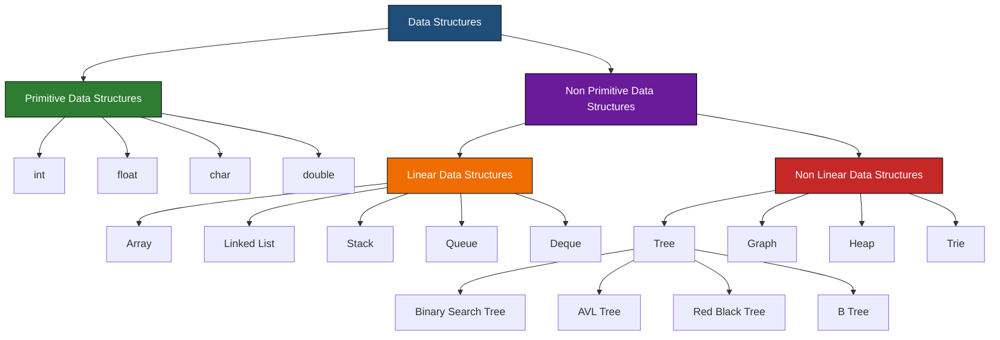
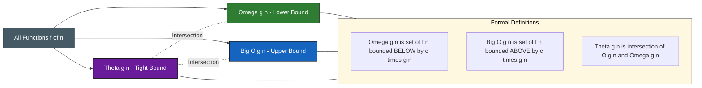
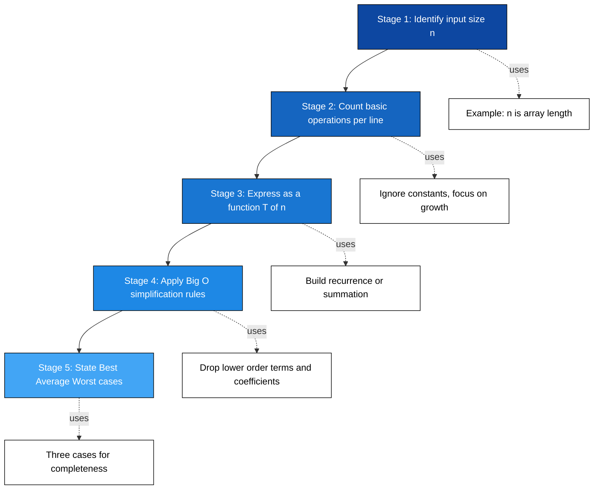
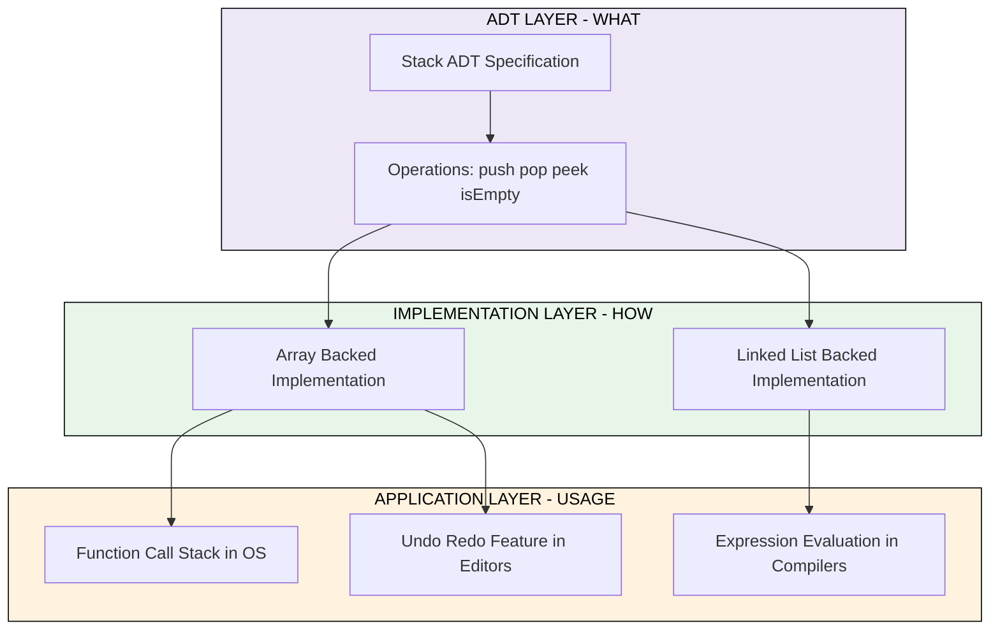

# Basic Concepts of Data Structures

<!-- SECTION_1_START -->
# Basic Concepts of Data Structures

> [!IMPORTANT]
> **KTU 2024 Scheme | OECST611 | Module 1 | High-Yield Foundational Topic**
> This module carries significant weightage in KTU ESE and forms the conceptual bedrock for Modules 2–5 (Arrays, Linked Lists, Stacks, Queues, Trees, Graphs).

## 1.1 Formal Definition

A **Data Structure** is a systematic way of organizing, storing, managing, and accessing data in memory so that it can be used efficiently. According to the KTU 2024 syllabus, a data structure is formally defined as:

> A data structure is a mathematical/logical model designed to organize data elements in memory and define a set of permissible operations on that data, such that both storage and retrieval are optimized for the intended application.

The term comprises two key words:
- **Data** $\rightarrow$ Raw facts or values (e.g., integers, characters, records).
- **Structure** $\rightarrow$ The formal arrangement and relationship governing these data values.

A related formal concept is the **Abstract Data Type (ADT)**:

$$\text{ADT} = \{\text{Data Values}\} + \{\text{Operations}\} + \{\text{Behavioural Axioms / Semantics}\}$$

> [!NOTE]
> **ADT vs Data Structure (KTU Board Favourite!):**
> - An **ADT** is a *theoretical specification* (the *what*) — it describes the data and operations abstractly without implementation.
> - A **Data Structure** is the *concrete implementation* (the *how*) — it represents the ADT physically in memory using a specific scheme (e.g., array-based, pointer-based).

**Examples of Primitive Data Types (PDT):** `int`, `float`, `char`, `double`.
**Examples of Non-Primitive Data Structures (NPDS):** Arrays, Linked Lists, Stacks, Queues, Trees, Graphs, Hash Tables.

## 1.2 Conceptual Analogy: The Library Filing System

Imagine a huge library with **10 million unsorted books**. If you walk in and ask *"Where is the book titled 'Operating Systems'?"*, the librarian has no option but to scan every shelf one by one — this is the equivalent of an **O(n) linear search** on unorganized data.

Now, suppose the same library uses:
- **Shelves categorized by subject** $\rightarrow$ acts like a *Tree* (hierarchical grouping).
- **A card index sorted alphabetically by title** $\rightarrow$ acts like a *Sorted Array / Binary Search Tree*.
- **A unique accession number for every book** $\rightarrow$ acts like a *Hash Table* with $O(1)$ expected lookup.

The moment the librarian picks the right *organizational scheme*, the time to find a book drops from minutes to seconds. **That organizational scheme is your Data Structure.**

> [!TIP]
> **Geometric Intuition:** Picture data elements as dots on a 2D plane. A *Linear* structure connects them along a single straight line ($x$-axis). A *Non-Linear* structure branches them into trees or meshes them into networks (multiple axes). *Static* structures are rigid grids (size fixed at compile time); *Dynamic* structures are stretchable lattices (size changes at run time via pointers).

> [!VISUALIZATION CONTROL]
> **Concept:** Visualizing Linear vs Non-Linear Data Arrangement
> **GeoGebra / Desmos Input Equations:**
> * Linear: $P_1=(1,0),\ P_2=(2,0),\ P_3=(3,0),\ P_4=(4,0)$
> * Non-Linear (Tree): $R=(2,4),\ L=(1,2),\ RR=(3,2),\ LL=(0.5,0),\ LR=(1.5,0),\ RRL=(2.5,0),\ RRR=(3.5,0)$
> **Visual Description:** You should observe a horizontal row of four points (linear arrangement) versus a branching top-down hierarchy (non-linear tree) on the same coordinate grid. The tree clearly cannot be traversed by moving along a single straight axis.

<!-- SECTION_1_END -->

<!-- SECTION_2_START -->
# Deep Theoretical Analysis & KTU High-Yield Formula Sheet

## 2.1 Classification of Data Structures

The KTU 2024 syllabus mandates a two-level classification of data structures.

### 2.1.1 Primitive vs Non-Primitive

| Aspect | Primitive Data Structures | Non-Primitive Data Structures |
| :--- | :--- | :--- |
| Definition | Basic, atomic data types built into the language | Derived / composite structures built using primitives |
| Provided by | Compiler / Language hardware support | Programmer / Standard libraries |
| Size | Fixed by the language standard | Variable, programmer-defined |
| Examples | `int`, `float`, `char`, `double`, `void` | Array, Linked List, Stack, Queue, Tree, Graph |
| Further split | None | Linear and Non-Linear |

### 2.1.2 Linear vs Non-Linear

| Aspect | Linear Data Structures | Non-Linear Data Structures |
| :--- | :--- | :--- |
| Traversal | Sequential (single-level, one successor) | Hierarchical or networked (multiple successors) |
| Memory | Contiguous (mostly) | Non-contiguous, uses pointers / references |
| Implementation depth | Easier (Arrays, Stacks, Queues, Lists) | Harder (Trees, Graphs, Heaps, Tries) |
| Examples | Array, Linked List, Stack, Queue, Deque | Tree, Binary Tree, BST, AVL, Graph, Heap |
| Best for | Linear pipelines, buffers, stacks | Searching, routing, hierarchies, networks |

### 2.1.3 Static vs Dynamic

| Aspect | Static Data Structures | Dynamic Data Structures |
| :--- | :--- | :--- |
| Memory allocation | Compile time (Stack / Global) | Run time (Heap, via `malloc` / `new`) |
| Size | Fixed once declared | Resizable at run time |
| Performance | Faster access (no pointer dereference) | Slight overhead (pointer traversal) |
| Examples | Array, struct, union, static hash table | Linked List, dynamic array (`vector`), BST, Graph |

## 2.2 Operations on Data Structures

Every data structure, irrespective of type, supports a standard set of operations. For KTU, the six canonical operations are:

1. **Creation / Initialization** $\rightarrow$ Allocate memory and set initial state.
2. **Insertion** $\rightarrow$ Add a new element while maintaining structural invariants.
3. **Deletion** $\rightarrow$ Remove an element and re-establish invariants.
4. **Traversal** $\rightarrow$ Visit every element at least once (e.g., in-order, pre-order, level-order).
5. **Searching** $\rightarrow$ Locate an element (Linear Search $O(n)$, Binary Search $O(\log n)$).
6. **Sorting / Merging** $\rightarrow$ Rearrange elements into a specific order or combine two structures.

Additional utility operations:
- **Access / Update** $\rightarrow$ Read or modify the value of an element.
- **Copy / Concatenate** $\rightarrow$ Duplicate or join structures.
- **Size / Empty check** $\rightarrow$ Query cardinality.

## 2.3 The Abstract Data Type (ADT) — Deeper View

An ADT is defined by **three components**:
1. **Domain (D)** $\rightarrow$ The set of valid data values.
2. **Operations (F)** $\rightarrow$ The set of permissible functions.
3. **Axioms (A)** $\rightarrow$ The formal rules governing behaviour and result of operations.

For example, the **Stack ADT** can be expressed as:

$$
D = \{\,a_0,\ a_1,\ \dots,\ a_{n-1}\,\},\quad a_i \in \mathbb{Z}
$$

$$
F = \{\ \text{push}(S, x),\ \text{pop}(S),\ \text{peek}(S),\ \text{isEmpty}(S),\ \text{isFull}(S)\ \}
$$

$$
A = \left\{
\begin{aligned}
& \text{push on full stack} \Rightarrow \text{Overflow} \\
& \text{pop on empty stack} \Rightarrow \text{Underflow} \\
& \text{peek}(S) = \text{top element without removal}
\end{aligned}
\right\}
$$

The same ADT can be implemented using an **array** (static) or a **linked list** (dynamic) — proving that ADT and data structure are logically distinct entities.

## 2.4 Algorithm Analysis: Why It Matters

A single problem can be solved by many algorithms. To choose the *best* one, we evaluate:
- **Time Complexity** $\rightarrow$ How the running time grows with input size $n$.
- **Space Complexity** $\rightarrow$ How the memory consumption grows with input size $n$.

$$
\boxed{\ T(n) = T_{\text{compile}} + T_{\text{run}} = c_1 + f(n)\ }
$$

where $c_1$ is the constant compile/setup cost and $f(n)$ is the asymptotic growth function of the algorithmic body.

> [!IMPORTANT]
> **KTU Board Rule:** Big-O notation describes the **upper bound** of an algorithm's runtime. Always write the complexity in the *simplified form* — for example, $3n^2 + 5n + 100$ should be written as $O(n^2)$, not $O(3n^2 + 5n + 100)$.

## 2.5 KTU High-Yield Formula Cheat Sheet

### 2.5.1 Asymptotic Notations

| Notation | Name | Mathematical Definition (English) | Typical Use in KTU |
| :--- | :--- | :--- | :--- |
| $O(g(n))$ | Big-O | Upper bound — $f(n) \le c \cdot g(n)$ for large $n$ | Worst-case analysis |
| $\Omega(g(n))$ | Big-Omega | Lower bound — $f(n) \ge c \cdot g(n)$ for large $n$ | Best-case analysis |
| $\Theta(g(n))$ | Big-Theta | Tight bound — both upper and lower bounded by $c_1 g(n)$ and $c_2 g(n)$ | Average-case analysis |
| $o(g(n))$ | Little-o | Strict upper bound (not tight) | Limiting ratio $< 1$ |
| $\omega(g(n))$ | Little-omega | Strict lower bound (not tight) | Limiting ratio $> 1$ |

### 2.5.2 Formal Limit-Based Definitions

$$
O(g(n)) = \left\{ f(n) : \exists\ c>0,\ n_0>0 \text{ such that } 0 \le f(n) \le c \cdot g(n)\ \forall\ n \ge n_0 \right\}
$$

$$
\Omega(g(n)) = \left\{ f(n) : \exists\ c>0,\ n_0>0 \text{ such that } 0 \le c \cdot g(n) \le f(n)\ \forall\ n \ge n_0 \right\}
$$

$$
\Theta(g(n)) = \left\{ f(n) : \exists\ c_1, c_2>0,\ n_0>0 \text{ such that } c_1 g(n) \le f(n) \le c_2 g(n)\ \forall\ n \ge n_0 \right\}
$$

### 2.5.3 Common Complexity Hierarchy (Best to Worst)

$$
O(1) < O(\log \log n) < O(\log n) < O(n^{1/2}) < O(n) < O(n \log n) < O(n^2) < O(n^3) < O(2^n) < O(n!) < O(n^n)
$$

### 2.5.4 Master Rules-of-Thumb for KTU Problems

| Code Pattern Observed | Resulting Time Complexity |
| :--- | :--- |
| Single statement, no loop | $O(1)$ |
| One simple `for` / `while` loop up to $n$ | $O(n)$ |
| Nested loop, both up to $n$ | $O(n^2)$ |
| Loop dividing problem by 2 each time | $O(\log n)$ |
| Recursion solving 2 sub-problems of size $n/2$ | $O(n \log n)$ |
| Recursion generating 2 sub-problems of size $n-1$ | $O(2^n)$ |
| Three nested loops, each up to $n$ | $O(n^3)$ |
| Iterating over all subsets of $n$ items | $O(2^n)$ |
| Iterating over all permutations of $n$ items | $O(n!)$ |

## 2.6 Real-World Engineering Utility

- **Databases (B-Trees / B+ Trees)** $\rightarrow$ Indexing millions of records for sub-millisecond lookups.
- **Operating Systems (Queues)** $\rightarrow$ CPU scheduling, process management, disk I/O buffering.
- **Compilers (Stacks & Hash Tables)** $\rightarrow$ Function call stack, symbol table management.
- **Network Routers (Graphs + Heaps)** $\rightarrow$ Shortest-path algorithms like Dijkstra's, Kruskal's MST.
- **AI / ML (Trees & Graphs)** $\rightarrow$ Decision trees, search algorithms (BFS, DFS, A*), recommendation engines.
- **Memory Management (Linked Lists)** $\rightarrow$ Free-list management, LRU caches.

<!-- SECTION_2_END -->

<!-- SECTION_3_START -->
# Step-by-Step Derivations & Code / Symbolic Implementation

## 3.1 Mathematical Derivation: Big-O Proof via Limit Method

> [!NOTE]
> **Problem (KTU typical):** Prove that $f(n) = 5n^3 + 2n^2 + 7n + 10$ is $O(n^3)$ using the formal definition.

### Step 1 — Recall the formal definition of Big-O

We must find positive constants $c$ and $n_0$ such that:

$$
f(n) \le c \cdot g(n) \quad \forall\ n \ge n_0
$$

Here $g(n) = n^3$, so we need:

$$
5n^3 + 2n^2 + 7n + 10 \le c \cdot n^3
$$

### Step 2 — Bound each lower-order term by the leading term

For $n \ge 1$:
- $2n^2 \le 2n^3$ (true, since $n^2 \le n^3$ when $n \ge 1$)
- $7n \le 7n^3$ (true, since $n \le n^3$ when $n \ge 1$)
- $10 \le 10n^3$ (true, since $1 \le n^3$ when $n \ge 1$)

### Step 3 — Substitute the bounds back

$$
\begin{aligned}
f(n) &= 5n^3 + 2n^2 + 7n + 10 \\
&\le 5n^3 + 2n^3 + 7n^3 + 10n^3 \\
&= (5 + 2 + 7 + 10) \cdot n^3 \\
&= 24 \cdot n^3
\end{aligned}
$$

### Step 4 — Choose constants and conclude

Choose $c = 24$ and $n_0 = 1$. Therefore:

$$
\boxed{\ f(n) = 5n^3 + 2n^2 + 7n + 10 \le 24 n^3 \quad \forall\ n \ge 1\ }
$$

By the formal definition, $f(n) = O(n^3)$. **Proved.**

> **Valuation Key:** *Stating the definition: 2 Marks | Substituting the bounds: 3 Marks | Final choice of $c$ and $n_0$: 2 Marks.*

---

## 3.2 Mathematical Derivation: Time Complexity of a Loop

> [!NOTE]
> **Problem:** Compute the exact step count and Big-O for the following snippet where `n` is the input size.

```c
int sum = 0;
for (int i = 1; i <= n; i++) {
    for (int j = 1; j <= i; j++) {
        sum = sum + 1;
    }
}
```

### Step 1 — Count the inner loop for each $i$

For a fixed $i$, the inner loop runs from $j = 1$ to $j = i$, executing $i$ times.

### Step 2 — Sum over all values of $i$

$$
\begin{aligned}
T(n) &= \sum_{i=1}^{n}\ i \\
&= \frac{n(n+1)}{2} \\
&= \frac{n^2 + n}{2}
\end{aligned}
$$

### Step 3 — Drop lower-order terms and constants

$$
T(n) = \frac{n^2}{2} + \frac{n}{2} \quad \xrightarrow{\text{Big-O}} \quad \boxed{\ O(n^2)\ }
$$

> **Valuation Key:** *Setting up the summation: 3 Marks | Solving via formula: 2 Marks | Final Big-O: 2 Marks.*

---

## 3.3 Mathematical Derivation: Recurrence — Factorial Function

> [!NOTE]
> **Problem:** Derive the time complexity of `fact(n) = n * fact(n-1)` with base case `fact(0) = 1`.

### Step 1 — Write the recurrence relation

$$
T(n) = T(n-1) + c
$$

where $c$ is the constant cost of the multiplication and call.

### Step 2 — Expand recursively

$$
\begin{aligned}
T(n) &= T(n-1) + c \\
&= \big(T(n-2) + c\big) + c \\
&= T(n-2) + 2c \\
&= T(n-3) + 3c \\
&\ \vdots \\
&= T(n-k) + kc
\end{aligned}
$$

### Step 3 — Apply the base case

When $k = n$, $T(n-n) = T(0) = d$ (a constant). Substituting:

$$
T(n) = d + n \cdot c = c \cdot n + d
$$

### Step 4 — Conclude with Big-O

$$
\boxed{\ T(n) = O(n)\ }
$$

---

## 3.4 Algorithmic Implementation: Demonstrating ADT vs Data Structure

The following Python code implements the **Stack ADT** using a Python `list` as the underlying data structure. This illustrates the separation between ADT specification and data structure implementation.

```python
"""
Filename: stack_adt.py
Purpose : Demonstrate ADT (Stack) implemented using a list (data structure).
Author  : KTU 2024 Scheme Reference
"""

from __future__ import annotations
from typing import Generic, TypeVar, List

T = TypeVar("T")


class StackADT(Generic[T]):
    """
    Abstract Data Type (ADT) specification for a LIFO Stack.
    Defines WHAT operations exist and WHAT they do — NOT how they are stored.
    """

    def push(self, item: T) -> None:
        """Insert an item at the top of the stack."""
        raise NotImplementedError

    def pop(self) -> T:
        """Remove and return the top item. Raises IndexError if empty."""
        raise NotImplementedError

    def peek(self) -> T:
        """Return (do NOT remove) the top item. Raises IndexError if empty."""
        raise NotImplementedError

    def is_empty(self) -> bool:
        """Return True if the stack has zero elements."""
        raise NotImplementedError

    def size(self) -> int:
        """Return the current number of elements in the stack."""
        raise NotImplementedError


class ListBackedStack(StackADT[T]):
    """
    Concrete Data Structure implementation of the Stack ADT
    using Python's built-in list (dynamic array) as the underlying storage.
    """

    def __init__(self) -> None:
        # Underlying data structure: Python list (acts as a dynamic array)
        self._container: List[T] = []

    def push(self, item: T) -> None:
        # Append to the END of the list — O(1) amortized
        self._container.append(item)

    def pop(self) -> T:
        if self.is_empty():
            raise IndexError("Stack Underflow: cannot pop from an empty stack.")
        return self._container.pop()           # O(1)

    def peek(self) -> T:
        if self.is_empty():
            raise IndexError("Stack Underflow: cannot peek an empty stack.")
        return self._container[-1]             # O(1)

    def is_empty(self) -> bool:
        return len(self._container) == 0

    def size(self) -> int:
        return len(self._container)


# ---------------------- DRIVER / SANITY TEST ----------------------
if __name__ == "__main__":
    s: StackADT[int] = ListBackedStack[int]()

    print("Is empty initially? ", s.is_empty())     # True

    for value in (10, 20, 30, 40):
        s.push(value)
        print(f"Pushed {value}, size = {s.size()}")

    print("Top element (peek) =", s.peek())         # 40
    print("Popped element     =", s.pop())          # 40
    print("Popped element     =", s.pop())          # 30
    print("Size after pops    =", s.size())         # 2
    print("Is empty finally?  =", s.is_empty())     # False
```

**Sample Output**

```
Is empty initially?  True
Pushed 10, size = 1
Pushed 20, size = 2
Pushed 30, size = 3
Pushed 40, size = 4
Top element (peek) = 40
Popped element     = 40
Popped element     = 30
Size after pops    = 2
Is empty finally?  = False
```

> **Time Complexity Table of the Implementation**

| Operation | Best Case | Average Case | Worst Case | Reason |
| :--- | :--- | :--- | :--- | :--- |
| `push` | $O(1)$ | $O(1)$ amortized | $O(n)$ (rare resize) | Append + occasional list resizing |
| `pop` | $O(1)$ | $O(1)$ | $O(1)$ | `list.pop()` from the end |
| `peek` | $O(1)$ | $O(1)$ | $O(1)$ | Direct index access |
| `is_empty` | $O(1)$ | $O(1)$ | $O(1)$ | `len()` is cached |
| `size` | $O(1)$ | $O(1)$ | $O(1)$ | `len()` is cached |

## 3.5 Algorithmic Implementation: Iterative vs Recursive Time Comparison

```python
"""
Filename: fib_complexity_demo.py
Purpose : Compare iterative (O(n)) vs naive recursive (O(2^n)) Fibonacci
          to illustrate exponential vs linear growth in input size.
"""

from __future__ import annotations
import sys
from typing import Dict

sys.setrecursionlimit(10000)


def fib_iterative(n: int) -> int:
    """Iterative Fibonacci — O(n) time, O(1) auxiliary space."""
    if n < 2:
        return n
    a, b = 0, 1
    for _ in range(2, n + 1):
        a, b = b, a + b
    return b


def fib_recursive_naive(n: int) -> int:
    """Naive recursive Fibonacci — O(2^n) time, O(n) call-stack space."""
    if n < 2:
        return n
    return fib_recursive_naive(n - 1) + fib_recursive_naive(n - 2)


def fib_memoized(n: int, memo: Dict[int, int] | None = None) -> int:
    """Memoized (top-down DP) Fibonacci — O(n) time and O(n) space."""
    if memo is None:
        memo = {}
    if n in memo:
        return memo[n]
    if n < 2:
        return n
    memo[n] = fib_memoized(n - 1, memo) + fib_memoized(n - 2, memo)
    return memo[n]


# ---------------------- DRIVER ----------------------
if __name__ == "__main__":
    n = 30
    print(f"fib_iterative({n})        = {fib_iterative(n)}")
    print(f"fib_memoized({n})         = {fib_memoized(n)}")
    print(f"fib_recursive_naive({n})  = {fib_recursive_naive(n)}  (slow but correct)")

    # Demonstration of growth: naive rec gets infeasible beyond ~35
    for k in (10, 20, 30):
        print(f"k={k:>2}  naive_rec_fib = {fib_recursive_naive(k)}")
```

> **Observation:** The naive recursive solution re-computes the same sub-problem exponentially many times, hence the $O(2^n)$ blow-up. The memoized version caches results in a dictionary, dropping it to $O(n)$ — a classic *algorithmic optimization* that the **data structure** (the `dict` hash map) enabled.

<!-- SECTION_3_END -->

<!-- SECTION_4_START -->
# Structural Diagrams & Schematics

## 4.1 Master Classification Flowchart of Data Structures

> [!NOTE]
> The following Mermaid block renders the complete taxonomy from primitive/non-primitive to the concrete data structures. All node IDs are alphanumeric; labels are pure uppercase text.



**Architectural Insight:** The diagram visually separates *language-provided* types (greens) from *programmer-defined* types (purples). The orange branch represents the linear pipeline structures covered in Modules 2–3, while the red branch forms the basis of Modules 4–5.

---

## 4.2 Asymptotic Notation Relationships (Venn-like)

> [!NOTE]
> The following Mermaid block maps the relationships between $O$, $\Omega$, and $\Theta$ using the formal definitions.



**Key Takeaway:** $\Theta(g(n)) = O(g(n)) \cap \Omega(g(n))$ — the tight bound is precisely the intersection of the upper and lower bound sets.

---

## 4.3 Algorithm Analysis Sequential Topology

> [!NOTE]
> The following Mermaid block represents the standard 5-stage pipeline a KTU student should follow when analyzing an algorithm in an exam.



---

## 4.4 ADT vs Data Structure — Block Architecture



**Architectural Insight:** A single ADT (the *contract*) can be realised by multiple data structures (the *delivery mechanisms*), each with its own time-space trade-offs, and each powering diverse real-world applications.

<!-- SECTION_4_END -->

<!-- SECTION_5_START -->
# KTU 2024 Scheme Examination Question Bank & Topic Recap

> [!IMPORTANT]
> **Mark Distribution (KTU 2024 ESE — Module 1):** 2 × 14-mark questions are expected from Modules 1 and 2 combined. The 14-mark question typically features two 7-mark sub-parts. The 3-mark questions are direct definitions, comparisons, or short derivations.

---

## Part A — Short Answer Questions (3 Marks Each)

### **Q1. [KTU University Exam — July 2023] | CO1 | Remember**

Define a data structure. Differentiate between **primitive** and **non-primitive** data structures with two examples each.

**Model Answer (Valuation Key — 3 Marks):**

A data structure is a named location that can be used to store and organize data, and a method by which we can perform operations on that data. **(1 Mark)**

| Aspect | Primitive | Non-Primitive |
| :--- | :--- | :--- |
| Definition | Basic, atomic types | Derived from primitives |
| Examples | `int`, `char` | Array, Linked List |

**(1 Mark for the table).** Examples clearly differ — `int` stores a single integer, whereas an array can store many integers under one name. **(1 Mark for distinguishing with examples).**

---

### **Q2. [KTU University Exam — Dec 2023] | CO1 | Understand**

What is an **Abstract Data Type (ADT)**? How is it different from a data structure? Illustrate with the example of a Stack.

**Model Answer (Valuation Key — 3 Marks):**

An ADT is a theoretical specification of a data type defined by its **behaviour (semantics)** from the point of view of a user, specifically in terms of possible values, possible operations, and the behaviour of these operations. **(1.5 Marks)**

A data structure is the *concrete implementation* of an ADT in memory. For example, the **Stack ADT** specifies that `push` adds to the top and `pop` removes from the top — but does not say whether storage is via an array or a linked list. **(1 Mark)**

The same Stack ADT can be implemented as an **array-based stack** (fixed size) or a **linked-list-based stack** (dynamic size) — proving that ADT is implementation-independent. **(0.5 Mark)**

---

## Part B — Long Answer Questions (14 Marks Each)

> [!NOTE]
> As per KTU ESE 2024 pattern, each 14-mark question typically carries internal choice between **Question A** and **Question B**. Both are provided below; in the actual exam the student attempts ONE.

---

### **Question A (14 Marks)**

> **[KTU University Exam — Dec 2024 Model] | CO1, CO2 | Understand + Apply**

**(a)** Explain in detail the **classification of data structures** with a neat diagram. Compare linear and non-linear data structures on at least four parameters. **\[7 Marks | Understand\]**

**(b)** Define **Big-O**, **Big-Omega**, and **Big-Theta** notations with formal definitions. For $f(n) = 4n^2 + 8n + 16$, prove that $f(n) = O(n^2)$ using the formal limit method. **\[7 Marks | Apply\]**

---

#### Model Solution — Question A(a)

A data structure is classified into two main branches based on how the data is derived and how the elements are organized.

**1. Primitive vs Non-Primitive**
Primitive data structures are the basic types directly supported by the language — `int`, `float`, `char`, `double`, `void`. Non-primitive structures are built using primitives and include linear types (array, list, stack, queue) and non-linear types (tree, graph, heap). **[2 Marks]**

**2. Linear vs Non-Linear**
Linear structures organize elements in a sequential manner where each element has a unique predecessor and successor. Non-linear structures organize elements in a hierarchical or networked manner, allowing multiple successors. **[2 Marks]**

**3. Comparison Table**

| Parameter | Linear | Non-Linear |
| :--- | :--- | :--- |
| Traversal | Sequential | Hierarchical / Networked |
| Memory layout | Mostly contiguous | Mostly non-contiguous |
| Implementation | Easier | Harder |
| Examples | Array, Stack, Queue | Tree, Graph |
| Level of elements | Single level | Multiple levels |

**[2 Marks for the comparison table].**

**4. Static vs Dynamic** (briefly mentioned): Static structures have fixed size decided at compile time (e.g., array); dynamic structures can grow/shrink at run time (e.g., linked list). **[1 Mark]**

> *A neat labelled diagram is required — at least the top two levels (Primitive/Non-Primitive $\rightarrow$ Linear/Non-Linear). Refer to the Mermaid chart in Section 4.1 of these notes for the structure expected. Draw using pen/pencil on the answer booklet.*

---

#### Model Solution — Question A(b)

**Formal Definitions:**

$$
O(g(n)) = \{\,f(n)\ \vert\ \exists\ c>0,\ n_0>0,\ 0 \le f(n) \le c \cdot g(n)\ \forall\ n \ge n_0\,\}
$$

**[1 Mark]**

$$
\Omega(g(n)) = \{\,f(n)\ \vert\ \exists\ c>0,\ n_0>0,\ 0 \le c \cdot g(n) \le f(n)\ \forall\ n \ge n_0\,\}
$$

**[1 Mark]**

$$
\Theta(g(n)) = \{\,f(n)\ \vert\ \exists\ c_1, c_2>0,\ n_0>0,\ c_1 g(n) \le f(n) \le c_2 g(n)\ \forall\ n \ge n_0\,\}
$$

**[1 Mark]**

**Proof that $f(n) = 4n^2 + 8n + 16$ is $O(n^2)$:**

We need to find $c$ and $n_0$ such that $4n^2 + 8n + 16 \le c \cdot n^2$ for all $n \ge n_0$.

For $n \ge 1$:
- $8n \le 8n^2$ (true since $n \le n^2$ for $n \ge 1$)
- $16 \le 16n^2$ (true since $1 \le n^2$ for $n \ge 1$)

Substituting:

$$
\begin{aligned}
4n^2 + 8n + 16 &\le 4n^2 + 8n^2 + 16n^2 \\
&= (4 + 8 + 16) \cdot n^2 \\
&= 28 \cdot n^2
\end{aligned}
$$

**[2 Marks]**

Therefore, choosing $c = 28$ and $n_0 = 1$:

$$
\boxed{\ f(n) = 4n^2 + 8n + 16 \le 28 n^2 \quad \forall\ n \ge 1\ }
$$

By definition, $f(n) = O(n^2)$. **Proved.** **[2 Marks]**

> **Valuation Key Summary (Part b):** *Definition of Big-O: 1 Mark* | *Definition of Big-Omega: 1 Mark* | *Definition of Big-Theta: 1 Mark* | *Substitution of bounds: 2 Marks* | *Choosing $c$ and $n_0$ correctly: 1 Mark* | *Final conclusion statement: 1 Mark.*

---

### **Question B — Alternative Choice (14 Marks)**

> **[KTU University Exam — July 2024 Model] | CO1, CO2 | Understand + Apply**

**(a)** Discuss the concept of an **Abstract Data Type (ADT)** in detail. Explain why a Stack ADT can be implemented both using arrays and linked lists, with a clear comparison of their time complexities. **\[7 Marks | Understand\]**

**(b)** Write a short note on **best-case, average-case, and worst-case** analysis of algorithms. For the Linear Search algorithm, derive the time complexity in all three cases and express it in asymptotic notation. **\[7 Marks | Apply\]**

---

#### Model Solution — Question B(a)

**Concept of ADT (3 Marks):**
An Abstract Data Type is a mathematical model for data types. It defines a data type purely by its behaviour (semantics) from the point of view of a user, specifically in terms of possible values, possible operations on values of this type, and the behaviour of these operations. An ADT does **not** specify *how* the data is stored in memory — that is the role of a data structure. **Example:** Stack, Queue, List, Map.

**Why One ADT, Two Implementations (2 Marks):**
A Stack ADT only specifies the LIFO behaviour: `push` adds to the top, `pop` removes from the top, `peek` reads the top. The actual *storage mechanism* is left open. Hence:
- An **array-based stack** stores elements in contiguous memory and uses an integer `top` index.
- A **linked-list-based stack** stores nodes scattered in heap memory, with the head playing the role of the top.

**Time Complexity Comparison (2 Marks):**

| Operation | Array Stack | Linked-List Stack |
| :--- | :--- | :--- |
| `push` | $O(1)$ amortized | $O(1)$ |
| `pop` | $O(1)$ | $O(1)$ |
| `peek` | $O(1)$ | $O(1)$ |
| Memory | Pre-allocated, may waste | Exact usage, slight pointer overhead |
| Resize | Reallocation required | Always dynamic |

---

#### Model Solution — Question B(b)

**Three Cases (3 Marks):**
- **Best Case** $\rightarrow$ minimum time taken across all inputs of size $n$ (denoted $\Omega$).
- **Average Case** $\rightarrow$ expected time over a random distribution of inputs (denoted $\Theta$).
- **Worst Case** $\rightarrow$ maximum time taken across all inputs of size $n$ (denoted $O$).

**Linear Search Algorithm (2 Marks):**

```c
int linearSearch(int arr[], int n, int key) {
    for (int i = 0; i < n; i++) {
        if (arr[i] == key)
            return i;
    }
    return -1;
}
```

**Derivation (2 Marks):**
- **Best Case:** The key is at index 0. Only **1 comparison** is made. $T_{\text{best}}(n) = \Theta(1)$.
- **Worst Case:** The key is at the last position, or absent. **$n$ comparisons** are made. $T_{\text{worst}}(n) = O(n)$.
- **Average Case:** Assuming uniform distribution, the expected position is $(n+1)/2$. So $T_{\text{avg}}(n) = (1 + 2 + \dots + n)/n = (n+1)/2 = \Theta(n)$.

> **Valuation Key Summary (Part b):** *Definitions of the three cases: 3 Marks* | *Algorithm presentation: 2 Marks* | *Correct derivation of all three cases: 2 Marks.*

---

> [!WARNING]
> **KTU Examiner's Valuation Warning / Common Pitfalls**
> 1. **Do NOT write $O(3n^2 + 5n + 7)$** — always simplify to $O(n^2)$. Examiners deduct 1 Mark for not simplifying.
> 2. **Do NOT confuse ADT with Data Structure** — they are logically distinct. ADT = specification; Data Structure = implementation. Mixing them costs 2–3 Marks in Part A.
> 3. **Always specify constants $c$ and $n_0$** when proving Big-O. Writing *"$f(n) \le g(n)$"* without constants is incomplete and loses 2 Marks.
> 4. **For the three-case analysis**, students often forget the *average case* — this is a 2-Mark deduction guaranteed.
> 5. **Diagrams are mandatory** in the classification question. A textual answer without a labelled tree/flowchart loses up to 2 Marks.
> 6. **Use exact KTU 2024 syllabus terminology** — say *"non-primitive linear data structure"* rather than *"linear collection"*.

---

## Topic Recap & Important Things to Remember

- **Data Structure** = storage + organization + operations on data.
- **ADT** = theoretical specification (the *what*); **Data Structure** = concrete realization (the *how*).
- **Primitive types** are language-built-ins (`int`, `float`, `char`); **non-primitive** types are programmer-defined (array, list, tree, graph).
- **Linear structures** traverse sequentially; **non-linear** structures traverse hierarchically or via networks.
- **Static structures** have compile-time size; **dynamic structures** allocate at run time on the heap.
- The **six core operations** on any data structure are: create, insert, delete, traverse, search, sort.
- **Big-O** $O(g(n))$ = asymptotic **upper bound** (used for worst case).
- **Big-Omega** $\Omega(g(n))$ = asymptotic **lower bound** (used for best case).
- **Big-Theta** $\Theta(g(n))$ = asymptotic **tight bound** (used for average case).
- To prove $f(n) = O(g(n))$, find $c > 0$ and $n_0 > 0$ such that $f(n) \le c \cdot g(n)$ for all $n \ge n_0$.
- **Loop nested $k$ deep** over input size $n$ $\Rightarrow$ $O(n^k)$.
- **Loop halving problem size** $\Rightarrow$ $O(\log n)$.
- **Naive recursion** with two sub-calls (e.g., naive Fibonacci) $\Rightarrow$ $O(2^n)$.
- The complexity hierarchy (best to worst): $O(1) < O(\log n) < O(n) < O(n \log n) < O(n^2) < O(2^n) < O(n!)$.
- **Linear Search** is $O(1)$ best, $O(n)$ worst, $\Theta(n)$ average.
- **Binary Search** is $O(1)$ best, $O(\log n)$ worst, $\Theta(\log n)$ average.
- **Stack ADT** operations: `push`, `pop`, `peek`, `isEmpty`, `isFull` (LIFO principle).
- **Queue ADT** operations: `enqueue`, `dequeue`, `front`, `rear`, `isEmpty` (FIFO principle).
- The same ADT can have **multiple data-structure implementations** (e.g., array-based or linked-list-based stack) with different memory and time trade-offs.
- Master mantra for KTU answers: **Define $\rightarrow$ Classify $\rightarrow$ Operate $\rightarrow$ Analyze $\rightarrow$ Conclude.**

<!-- SECTION_5_END -->
