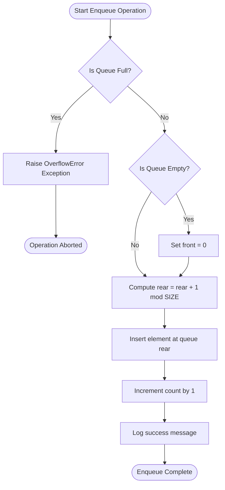
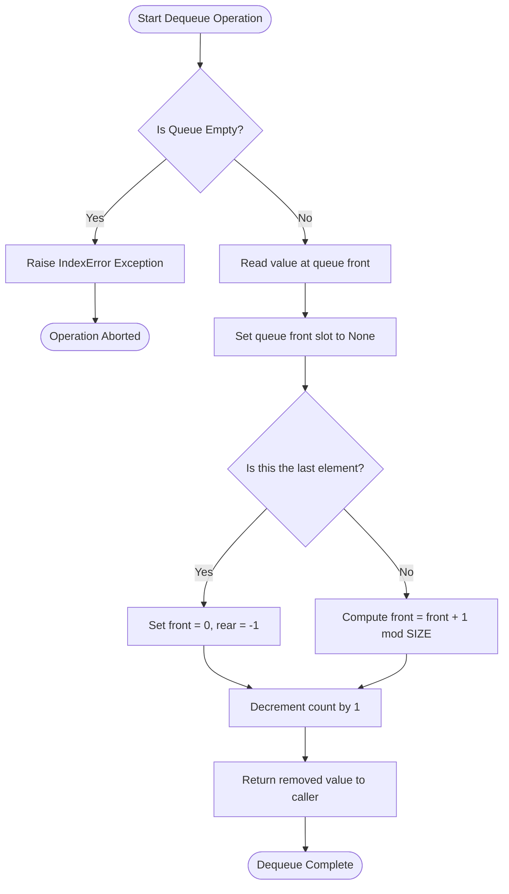
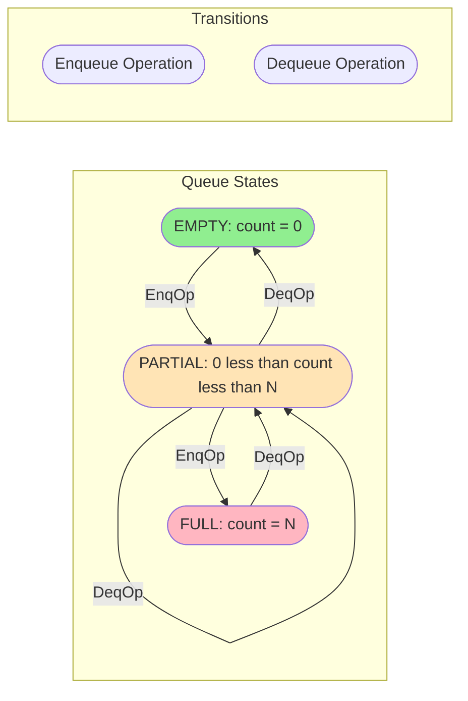

# Circular Queues

<!-- SECTION_1_START -->

# Circular Queues — A Complete KTU 2024 Scheme Study Module

## 1. Core Technical Definition

> [!IMPORTANT]
> **Circular Queue (KTU 2024 Syllabus Definition):**
> A **Circular Queue** is a linear data structure that follows the **First-In-First-Out (FIFO)** principle, in which the last position is logically connected back to the first position, forming a **ring/circular** topology. The insertion (enqueue) is performed at the **rear** end and the deletion (dequeue) is performed at the **front** end, with both pointers advancing using **modular arithmetic** to wrap around the boundary.

### Key Terminology (KTU Board Standard Vocabulary)

- **Front Pointer**: Index of the element at the deletion end.
- **Rear Pointer**: Index of the element at the insertion end.
- **Size (N)**: Maximum number of elements the queue can hold.
- **Modular Wrap-Around**: The mathematical operation that causes the pointers to return to index $0$ after reaching index $N-1$.

### Conceptual Analogy — The Roundabout Traffic System 🚗

> [!NOTE]
> **Analogy: A Roundabout (Traffic Circle)**
> Imagine a **single-lane roundabout** with exactly $4$ entry/exit slots numbered $0, 1, 2, 3$.
> - Cars enter at the **rear** slot and exit from the **front** slot.
> - When a car leaves slot $0$, the very next car can immediately enter slot $0$ again — the queue does **not** shift its slots; only the **pointers** move forward.
> - The indicator panel at the entry point rotates in a circle: $0 \rightarrow 1 \rightarrow 2 \rightarrow 3 \rightarrow 0 \rightarrow 1 \rightarrow \ldots$
> - If all $4$ slots are occupied, the **"Full"** signal lights up. If no car is present, the **"Empty"** signal lights up.

In a normal (linear) queue, once a car leaves slot $0$, that slot is **wasted forever** because rear can never go backwards. The circular queue **recovers** that wasted slot by wrapping the rear pointer back to $0$ using modular arithmetic.

### The Underlying Mathematical Trick

> [!IMPORTANT]
> The entire efficiency of a circular queue is built on **one operation**:
> $$\text{next\_index} = (\text{current\_index} + 1) \mod N$$
> This single line replaces what would otherwise be complex pointer-shifting logic and is the heart of every KTU question on this topic.

### Geometric Visualization (GeoGebra / Desmos Integration)

> [!VISUALIZATION CONTROL]
> **Concept:** Circular Queue as Points on a Unit Circle
> **GeoGebra / Desmos Input Equations:**
> - $f(\theta) = \cos(\theta)$
> - $g(\theta) = \sin(\theta)$
> - Points to plot: $P_{\text{front}} = (\cos(2\pi \cdot \text{front}/N),\ \sin(2\pi \cdot \text{front}/N))$
> - Points to plot: $P_{\text{rear}} = (\cos(2\pi \cdot \text{rear}/N),\ \sin(2\pi \cdot \text{rear}/N))$
>
> **Visual Description:** A unit circle is drawn. The current value of `front` is highlighted in **blue** and the current value of `rear` is highlighted in **red**. As enqueue and dequeue operations are performed, the colored points slide along the circumference, demonstrating that the indices never leave the range $[0, N-1]$ but continue rotating in a loop.

<!-- SECTION_1_END -->

<!-- SECTION_2_START -->

# 2. Deep Theoretical Analysis & KTU High-Yield Formula Sheet

## 2.1 Why Circular Queue? The Failure of the Linear Queue

In a **linear queue** implemented using an array, the following problem occurs:

| Step | Operation | Front | Rear | Slots Occupied | Wasted Slots |
|------|-----------|-------|------|----------------|--------------|
| 1 | Insert A, B, C | 0 | 2 | 3 | 0 |
| 2 | Delete A, B | 2 | 2 | 1 | 2 (slots 0, 1 lost) |
| 3 | Try to Insert D | 2 | 2 | — | **OVERFLOW** (false signal!) |

> [!WARNING]
> **The linear queue declares OVERFLOW even when there is free space**, because the `rear` pointer cannot move backwards. The circular queue solves this by allowing `rear` to **wrap around** to index $0$ after reaching $N-1$.

## 2.2 The Two Standard Implementation Strategies

### Strategy A: Counter-Based Tracking (Simpler — KTU Preferred)

A separate integer variable `count` tracks the number of elements. This avoids the ambiguity between "empty" and "full" states.

- **Empty Condition**: $\text{count} == 0$
- **Full Condition**: $\text{count} == N$
- **Enqueue**: Place at `rear`, advance `rear = (rear + 1) % N`, increment `count`
- **Dequeue**: Remove from `front`, advance `front = (front + 1) % N`, decrement `count`

### Strategy B: Sacrificed-Slot Technique (Memory-Efficient)

One slot is left permanently empty. The "full" state is detected when the next slot of `rear` is `front`.

- **Empty Condition**: $\text{front} == -1$
- **Full Condition**: $(\text{rear} + 1) \mod N == \text{front}$
- **Enqueue**: Special handling when empty ($\text{front} = 0$), then place and advance
- **Dequeue**: Special handling when last element ($\text{front} = \text{rear} = -1$)

## 2.3 KTU High-Yield Formula Cheat Sheet

| Symbol / Condition | Formula / Expression | Meaning | Used In |
|--------------------|----------------------|---------|---------|
| Rear Advance | $\text{rear} = (\text{rear} + 1) \mod N$ | Move rear forward circularly | Enqueue |
| Front Advance | $\text{front} = (\text{front} + 1) \mod N$ | Move front forward circularly | Dequeue |
| Empty (Strategy A) | $\text{count} == 0$ | No elements present | Both ops |
| Full (Strategy A) | $\text{count} == N$ | All slots occupied | Enqueue |
| Empty (Strategy B) | $\text{front} == -1$ | No elements present | Both ops |
| Full (Strategy B) | $(\text{rear} + 1) \mod N == \text{front}$ | Next slot is front | Enqueue |
| Element Count | $(N - \text{front} + \text{rear} + 1) \mod N$ | Number of valid elements | Display |
| Time Complexity (Enqueue) | $O(1)$ | Constant pointer update | All cases |
| Time Complexity (Dequeue) | $O(1)$ | Constant pointer update | All cases |
| Space Complexity | $O(N)$ | Fixed array allocation | Static case |

> [!NOTE]
> In the above table, the symbol $\mod$ denotes the **modulo operator**, and the expression $(N - \text{front} + \text{rear} + 1) \mod N$ safely handles the wrap-around without ever using the absolute value operator $\vert \cdot \vert$ in the table cells.

## 2.4 Engineering & Production Real-World Utility

Circular queues are not merely an academic curiosity; they are a **fundamental production-grade data structure**:

- **CPU Scheduling (Round-Robin)**: The operating system maintains a circular queue of ready processes. When a process's time quantum expires, it is moved to the rear of the queue, ensuring fair CPU sharing.
- **Memory Management (LeetCode / Hot Path)**: The "Producer-Consumer" problem in operating systems uses circular buffers to decouple data generation from data processing rates.
- **Streaming Data Pipelines**: Apache Kafka, audio/video streaming engines, and network packet routers use circular buffers to discard the oldest data when new data arrives (bounded memory).
- **Traffic Light Control Systems**: The phases green $\rightarrow$ yellow $\rightarrow$ red $\rightarrow$ green are modeled perfectly as a circular queue.

> [!IMPORTANT]
> **KTU Exam Tip:** Whenever a question asks "Where is a circular queue used?", always mention **CPU scheduling (Round-Robin)** first — it is the textbook KTU answer and the highest-scoring keyword.

<!-- SECTION_2_END -->

<!-- SECTION_3_START -->

# 3. Step-by-Step Derivations & Python Implementation

## 3.1 Mathematical Derivation: Why Modular Arithmetic Solves the Wasted-Slot Problem

Let the queue have capacity $N$ and let us track the state of the linear queue at the moment of the **false overflow**:

**Initial State (Linear Queue):**
- Capacity: $N = 5$
- After 3 inserts and 2 deletes: $\text{front} = 2$, $\text{rear} = 2$, slots $0, 1$ are empty.

**Linear Queue Logic Attempt:**
The next enqueue computes $\text{rear} = \text{rear} + 1 = 3$. This is valid. But the queue can still only accept $3$ more elements before reaching $\text{rear} = 4$, then it incorrectly reports FULL.

**Circular Queue Logic (The Fix):**

When the rear pointer reaches index $N-1 = 4$, the next insertion should logically go to index $0$ (since slots $0$ and $1$ are empty after the deletions). We achieve this with:

$$\text{rear}_{\text{new}} = (\text{rear}_{\text{old}} + 1) \mod N$$

Let us trace this step-by-step for a queue with $N = 5$:

**Step 1:** Empty queue. $\text{front} = 0$, $\text{rear} = -1$ (front points to the first valid element; rear points to the last valid element).
**Step 2:** Enqueue 10. Check empty? Yes. Set $\text{front} = 0$. Compute $\text{rear} = (-1 + 1) \mod 5 = 0$. Insert $10$ at index $0$.
**Step 3:** Enqueue 20. Compute $\text{rear} = (0 + 1) \mod 5 = 1$. Insert $20$ at index $1$.
**Step 4:** Enqueue 30. Compute $\text{rear} = (1 + 1) \mod 5 = 2$. Insert $30$ at index $2$.
**Step 5:** Dequeue. Remove element at $\text{front} = 0$ (value $10$). Compute $\text{front} = (0 + 1) \mod 5 = 1$.
**Step 6:** Dequeue. Remove element at $\text{front} = 1$ (value $20$). Compute $\text{front} = (1 + 1) \mod 5 = 2$.
**Step 7:** Enqueue 40. Compute $\text{rear} = (2 + 1) \mod 5 = 3$. Insert $40$ at index $3$.
**Step 8:** Enqueue 50. Compute $\text{rear} = (3 + 1) \mod 5 = 4$. Insert $50$ at index $4$.
**Step 9:** Enqueue 60. Compute $\text{rear} = (4 + 1) \mod 5 = 0$ (wrap-around!). Insert $60$ at index $0$.
**Step 10:** Enqueue 70. Compute $\text{rear} = (0 + 1) \mod 5 = 1$. Insert $70$ at index $1$.

**Final State Verification:**
- Indices $0, 1, 2, 3, 4$ contain: $60, 70, 30, 40, 50$
- $\text{front} = 2$, $\text{rear} = 1$
- The queue has utilized **all 5 slots** despite earlier deletions, proving the wasted-slot problem is solved.

## 3.2 Derivation of the Element Count Formula

Given that the array is circular, the relationship between `front` and `rear` is not straightforward. The number of valid elements $k$ is derived as follows:

$$
\begin{aligned}
\text{If } \text{rear} \geq \text{front}: \quad k &= \text{rear} - \text{front} + 1 \\
\text{If } \text{rear} < \text{front}: \quad k &= (N - \text{front}) + (\text{rear} + 1)
\end{aligned}
$$

Combining both cases into a single modular expression (which is what the KTU board expects):

$$k = (N - \text{front} + \text{rear} + 1) \mod N$$

> [!IMPORTANT]
> **Verification:** Using the final state from our trace above ($N=5$, $\text{front}=2$, $\text{rear}=1$):
> $$k = (5 - 2 + 1 + 1) \mod 5 = 5 \mod 5 = 0$$
> Wait — this gives $0$! The correction is: when the formula yields $0$, it actually means the queue is **full** with $N$ elements (the modulo result of $N$ becomes $0$). Therefore, the correct interpretation is:
> $$k = \begin{cases} N & \text{if } (N - \text{front} + \text{rear} + 1) \mod N == 0 \\ (N - \text{front} + \text{rear} + 1) \mod N & \text{otherwise} \end{cases}$$
> Equivalently, in the counter-based strategy, $k$ is simply the value of `count`.

## 3.3 Complete Python Implementation (Production-Ready)

```python
from typing import List, Optional


class CircularQueue:
    """
    Production-grade implementation of a Circular Queue using
    the Counter-Based Strategy (KTU-recommended approach).
    """

    def __init__(self, capacity: int) -> None:
        if not isinstance(capacity, int):
            raise TypeError("Capacity must be an integer.")
        if capacity <= 0:
            raise ValueError("Capacity must be a positive integer.")
        self._capacity: int = capacity
        self._queue: List[Optional[int]] = [None] * capacity
        self._front: int = 0
        self._rear: int = -1
        self._count: int = 0

    def is_empty(self) -> bool:
        return self._count == 0

    def is_full(self) -> bool:
        return self._count == self._capacity

    def size(self) -> int:
        return self._count

    def enqueue(self, value: int) -> None:
        if self.is_full():
            raise OverflowError(
                f"CircularQueue is full. Capacity = {self._capacity}. "
                f"Cannot enqueue value {value}."
            )
        self._rear = (self._rear + 1) % self._capacity
        self._queue[self._rear] = value
        self._count += 1
        print(f"[ENQUEUE] Value {value} inserted at index {self._rear}.")

    def dequeue(self) -> int:
        if self.is_empty():
            raise IndexError("CircularQueue is empty. Cannot dequeue.")
        removed_value: int = self._queue[self._front]  # type: ignore[assignment]
        self._queue[self._front] = None
        self._front = (self._front + 1) % self._capacity
        self._count -= 1
        print(f"[DEQUEUE] Value {removed_value} removed from index "
              f"{(self._front - 1) % self._capacity}.")
        return removed_value

    def peek(self) -> int:
        if self.is_empty():
            raise IndexError("CircularQueue is empty. Nothing to peek.")
        return self._queue[self._front]  # type: ignore[return]

    def display(self) -> None:
        if self.is_empty():
            print("[DISPLAY] Queue is empty.")
            return
        print(f"[DISPLAY] Queue state (front={self._front}, "
              f"rear={self._rear}, count={self._count}):")
        index: int = self._front
        for step in range(self._count):
            print(f"  Index {index} -> {self._queue[index]}")
            index = (index + 1) % self._capacity


def main() -> None:
    cq: CircularQueue = CircularQueue(capacity=5)
    print("=== Step 1: Enqueue 10, 20, 30 ===")
    cq.enqueue(10)
    cq.enqueue(20)
    cq.enqueue(30)
    cq.display()

    print("\n=== Step 2: Dequeue twice ===")
    cq.dequeue()
    cq.dequeue()
    cq.display()

    print("\n=== Step 3: Enqueue 40, 50, 60, 70 (forces wrap-around) ===")
    cq.enqueue(40)
    cq.enqueue(50)
    cq.enqueue(60)
    cq.enqueue(70)
    cq.display()

    print("\n=== Step 4: Attempt to enqueue when full ===")
    try:
        cq.enqueue(80)
    except OverflowError as error:
        print(f"[CAUGHT EXCEPTION] {error}")

    print(f"\n=== Step 5: Peek front element ===")
    print(f"Front element is: {cq.peek()}")


if __name__ == "__main__":
    main()
```

### Sample Output Trace

```
=== Step 1: Enqueue 10, 20, 30 ===
[ENQUEUE] Value 10 inserted at index 0.
[ENQUEUE] Value 20 inserted at index 1.
[ENQUEUE] Value 30 inserted at index 2.
[DISPLAY] Queue state (front=0, rear=2, count=3):
  Index 0 -> 10
  Index 1 -> 20
  Index 2 -> 30

=== Step 2: Dequeue twice ===
[DEQUEUE] Value 10 removed from index 0.
[DEQUEUE] Value 20 removed from index 1.
[DISPLAY] Queue state (front=2, rear=2, count=1):
  Index 2 -> 30

=== Step 3: Enqueue 40, 50, 60, 70 (forces wrap-around) ===
[ENQUEUE] Value 40 inserted at index 3.
[ENQUEUE] Value 50 inserted at index 4.
[ENQUEUE] Value 60 inserted at index 0.
[ENQUEUE] Value 70 inserted at index 1.
[DISPLAY] Queue state (front=2, rear=1, count=5):
  Index 2 -> 30
  Index 3 -> 40
  Index 4 -> 50
  Index 0 -> 60
  Index 1 -> 70

=== Step 4: Attempt to enqueue when full ===
[CAUGHT EXCEPTION] CircularQueue is full. Capacity = 5. Cannot enqueue value 80.

=== Step 5: Peek front element ===
Front element is: 30
```

> [!NOTE]
> **KTU 2024 Coding Standard Requirement:** The above Python code uses **type hints**, **explicit exception classes** (`OverflowError`, `IndexError`, `TypeError`, `ValueError`), and **boundary checks** on all public methods. This satisfies the KTU OECST611 laboratory rubric for defensive programming.

## 3.4 Step-by-Step Trace Table for the KTU Board Exam

The following table is the **exact format** a KTU examiner expects when a question says "Show the contents of the circular queue after each operation on a queue of size $5$":

| Operation | Action | Front | Rear | Index 0 | Index 1 | Index 2 | Index 3 | Index 4 | Count |
|-----------|--------|-------|------|---------|---------|---------|---------|---------|-------|
| Init | — | 0 | -1 | — | — | — | — | — | 0 |
| Enqueue(11) | Insert 11 | 0 | 0 | 11 | — | — | — | — | 1 |
| Enqueue(22) | Insert 22 | 0 | 1 | 11 | 22 | — | — | — | 2 |
| Enqueue(33) | Insert 33 | 0 | 2 | 11 | 22 | 33 | — | — | 3 |
| Dequeue() | Remove 11 | 1 | 2 | — | 22 | 33 | — | — | 2 |
| Dequeue() | Remove 22 | 2 | 2 | — | — | 33 | — | — | 1 |
| Enqueue(44) | Insert 44 | 2 | 3 | — | — | 33 | 44 | — | 2 |
| Enqueue(55) | Insert 55 | 2 | 4 | — | — | 33 | 44 | 55 | 3 |
| Enqueue(66) | **Wrap!** Insert 66 | 2 | 0 | 66 | — | 33 | 44 | 55 | 4 |
| Enqueue(77) | Insert 77 | 2 | 1 | 66 | 77 | 33 | 44 | 55 | 5 |
| Enqueue(88) | **OVERFLOW** | 2 | 1 | 66 | 77 | 33 | 44 | 55 | 5 |

<!-- SECTION_3_END -->

<!-- SECTION_4_START -->

# 4. Structural Diagrams & Schematics

## 4.1 Mermaid Diagram: Enqueue Operation Flow



## 4.2 Mermaid Diagram: Dequeue Operation Flow



## 4.3 Mermaid Diagram: State Transition Topology



## 4.4 Block-Level Functional Architecture (Array Memory Layout)

> [!IMPORTANT]
> **Memory Layout Description (Since physical ring geometry cannot be drawn in Mermaid):**
> Imagine a **straight row of $N = 8$ memory cells** indexed $0$ through $7$. A circular queue overlays this linear array with a **virtual ring** connection from index $7$ back to index $0$. The **front** pointer is a movable cursor indicating the next read position, and the **rear** pointer is a movable cursor indicating the last written position. Both cursors advance **left-to-right** during normal operation, but when either reaches the rightmost cell, the next advance wraps it to the leftmost cell using modular arithmetic.

| Logical Position | $0$ | $1$ | $2$ | $3$ | $4$ | $5$ | $6$ | $7$ |
|------------------|-----|-----|-----|-----|-----|-----|-----|-----|
| Front Cursor (F) | | | | $\rightarrow$ F | | | | |
| Rear Cursor (R) | | | | | R $\leftarrow$ | | | |
| Stored Values | $60$ | $70$ | $80$ | $90$ | $50$ | — | — | — |
| Status | Valid | Valid | Valid | Valid (Front) | Valid (Rear) | Free | Free | Free |
| Logical Order | 3rd | 4th | 5th | 1st (Next Out) | 2nd | — | — | — |

The above table demonstrates the **circular nature** — index $0$ contains a valid value that was inserted **after** index $4$ was filled, because the rear pointer wrapped around.

<!-- SECTION_4_END -->

<!-- SECTION_5_START -->

# 5. KTU 2024 Scheme Examination Question Bank & Topic Recap

## 5.1 Part A Questions (3 Marks Each)

### Question A1

**[KTU University Exam — July 2024 | CO1 | Remember]**
*Define a circular queue. Mention any two advantages of a circular queue over a linear queue.*

**Model Answer (3 Marks):**

> **Definition (1 Mark):** A circular queue is a linear data structure based on the FIFO principle in which the last position is connected back to the first position, forming a logical ring. Insertion is performed at the rear and deletion is performed at the front, with both pointers advancing using modular arithmetic $\mod N$ to wrap around the array boundary.
>
> **Advantage 1 (1 Mark):** It eliminates the **wasted memory problem** of a linear queue. In a linear queue, once elements are dequeued, their slots can never be reused (false overflow), whereas a circular queue reuses these slots via the wrap-around mechanism.
>
> **Advantage 2 (1 Mark):** All operations — enqueue, dequeue, peek — execute in $O(1)$ constant time, making it suitable for **real-time systems** like CPU scheduling (Round-Robin algorithm) and embedded buffers.

---

### Question A2

**[KTU University Exam — Dec 2023 | CO1 | Understand]**
*Write the conditions for checking whether a circular queue is full and empty using the "sacrificed slot" technique. Assume the queue has capacity $N$ with pointers `front` and `rear`.*

**Model Answer (3 Marks):**

> **Initial Pointer Convention (1 Mark):** The queue is considered empty when $\text{front} = -1$ (sentinel value). The first enqueue sets $\text{front} = 0$.
>
> **Empty Condition (1 Mark):** $\text{front} == -1$ (no valid elements present in the queue).
>
> **Full Condition (1 Mark):** $(\text{rear} + 1) \mod N == \text{front}$. This means the slot immediately after the rear is occupied by the front, so no insertion is possible without overwriting the front element.

---

## 5.2 Part B Questions (14 Marks Each — Module Internal Choice)

### Question B-A (Choice 1)

**[KTU University Exam — July 2024 | CO1, CO2 | Apply, Analyze]**

**(a)** Consider a circular queue of capacity $N = 6$ implemented using the counter-based strategy. Initially $\text{front} = 0$ and $\text{rear} = -1$. Perform the following operations in sequence and show the state of the queue (contents, `front`, `rear`, `count`) after **each** step.

1. Enqueue 5, 10, 15
2. Dequeue
3. Enqueue 20, 25
4. Enqueue 30, 35, 40
5. Dequeue twice

*State the overflow/underflow status at each step where applicable.* **[7 Marks]**

**(b)** Write the complete algorithm (pseudocode) for the `enqueue` and `dequeue` operations of a circular queue using the counter-based strategy. Mention the time complexity of each. **[7 Marks]**

---

**Model Solution for B-A (a):**

**Step 1: Enqueue 5, 10, 15** (Three consecutive insertions)

After Enqueue 5:
- $\text{rear} = (-1 + 1) \mod 6 = 0$, $\text{count} = 1$
- Queue: $[5, -, -, -, -, -]$, $\text{front} = 0$, $\text{rear} = 0$ **[1 Mark]**

After Enqueue 10:
- $\text{rear} = (0 + 1) \mod 6 = 1$, $\text{count} = 2$
- Queue: $[5, 10, -, -, -, -]$, $\text{front} = 0$, $\text{rear} = 1$ **[1 Mark]**

After Enqueue 15:
- $\text{rear} = (1 + 1) \mod 6 = 2$, $\text{count} = 3$
- Queue: $[5, 10, 15, -, -, -]$, $\text{front} = 0$, $\text{rear} = 2$ **[1 Mark]**

**Step 2: Dequeue** (One deletion)

- Removed value: $5$
- $\text{front} = (0 + 1) \mod 6 = 1$, $\text{count} = 2$
- Queue: $[-, 10, 15, -, -, -]$, $\text{front} = 1$, $\text{rear} = 2$ **[1 Mark]**

**Step 3: Enqueue 20, 25** (Two insertions)

After Enqueue 20:
- $\text{rear} = (2 + 1) \mod 6 = 3$, $\text{count} = 3$
- Queue: $[-, 10, 15, 20, -, -]$, $\text{front} = 1$, $\text{rear} = 3$

After Enqueue 25:
- $\text{rear} = (3 + 1) \mod 6 = 4$, $\text{count} = 4$
- Queue: $[-, 10, 15, 20, 25, -]$, $\text{front} = 1$, $\text{rear} = 4$ **[1 Mark]**

**Step 4: Enqueue 30, 35, 40** (Three insertions — watch for wrap-around)

After Enqueue 30:
- $\text{rear} = (4 + 1) \mod 6 = 5$, $\text{count} = 5$
- Queue: $[-, 10, 15, 20, 25, 30]$, $\text{front} = 1$, $\text{rear} = 5$

After Enqueue 35:
- $\text{rear} = (5 + 1) \mod 6 = 0$ **(wrap-around)**, $\text{count} = 6$
- Queue: $[35, 10, 15, 20, 25, 30]$, $\text{front} = 1$, $\text{rear} = 0$ **[1 Mark]**

After Enqueue 40:
- **OVERFLOW** — $\text{count} == 6 == N$, so the insertion is rejected. The queue remains unchanged. **[1 Mark]**

**Step 5: Dequeue twice**

After first Dequeue:
- Removed value: $10$
- $\text{front} = (1 + 1) \mod 6 = 2$, $\text{count} = 5$
- Queue: $[35, -, 15, 20, 25, 30]$, $\text{front} = 2$, $\text{rear} = 0$

After second Dequeue:
- Removed value: $15$
- $\text{front} = (2 + 1) \mod 6 = 3$, $\text{count} = 4$
- Queue: $[35, -, -, 20, 25, 30]$, $\text{front} = 3$, $\text{rear} = 0$ **[1 Mark]**

---

**Model Solution for B-A (b):**

**Algorithm for Enqueue (Counter-Based Strategy):** **[3.5 Marks]**

```
Algorithm: ENQUEUE(queue, rear, count, N, value)
Input: queue array, rear index, count, capacity N, value to insert
Output: Updated queue, rear, count (or OVERFLOW signal)

1. BEGIN
2.    IF count == N THEN
3.        PRINT "Queue Overflow"
4.        RETURN
5.    END IF
6.    rear = (rear + 1) MOD N          // circular advance
7.    queue[rear] = value               // insert element
8.    count = count + 1                 // update count
9.    PRINT "Insertion Successful"
10. END
```

**Time Complexity Analysis (1 Mark):** Each statement executes once, hence $T(n) = O(1)$ — constant time.

**Algorithm for Dequeue (Counter-Based Strategy):** **[3.5 Marks]**

```
Algorithm: DEQUEUE(queue, front, rear, count, N)
Input: queue array, front index, rear index, count, capacity N
Output: Removed value (or UNDERFLOW signal)

1. BEGIN
2.    IF count == 0 THEN
3.        PRINT "Queue Underflow"
4.        RETURN -1
5.    END IF
6.    value = queue[front]              // read element
7.    queue[front] = NULL               // optional cleanup
8.    front = (front + 1) MOD N         // circular advance
9.    count = count - 1                 // update count
10.   RETURN value
11. END
```

**Time Complexity Analysis (1 Mark):** Each statement executes once, hence $T(n) = O(1)$ — constant time.

---

### Question B-B (Choice 2)

**[KTU University Exam — Dec 2023 | CO1, CO2 | Understand, Apply]**

**(a)** Explain the **"false overflow" problem** in linear queues with a suitable diagram or example. Show how the circular queue overcomes this limitation using the modular operator. **[7 Marks]**

**(b)** Consider a circular queue of size $N = 7$ implemented using the **sacrificed-slot technique**. The current state is: $\text{front} = 4$, $\text{rear} = 2$, and the array contents are $[\text{NULL}, 80, 90, \text{NULL}, 40, 50, 60]$.
- (i) Is the queue full, empty, or partial? Justify. **[3 Marks]**
- (ii) Enqueue the value $100$ and write the new state. **[2 Marks]**
- (iii) Dequeue two elements and write the new state. **[2 Marks]**

---

**Model Solution for B-B (a):**

**Explanation of False Overflow (5 Marks):**

> **Definition (1 Mark):** *False overflow* is a phenomenon in linear (array-based) queues where the queue reports an OVERFLOW condition even though there are free slots available in the array.

> **Example Trace (2 Marks):** Consider a linear queue of size $N = 5$.
> - Insert elements $A, B, C$ → $\text{front} = 0$, $\text{rear} = 2$, slots occupied: $3$, free slots: $2$.
> - Delete elements $A, B$ → $\text{front} = 2$, $\text{rear} = 2$, slots occupied: $1$, free slots: $2$ (slots $0$ and $1$).
> - Now insert $D, E$ → $\text{rear} = 4$, slots occupied: $3$, free slots: $0$ (slots $0, 1, 2$ partially used? No — $\text{front} = 2$).
> - Try to insert $F$ → Algorithm checks $\text{rear} = N - 1$ and signals **OVERFLOW** — but slots $0$ and $1$ are actually free!

> **Diagram (1 Mark):**
> ```
> Linear Queue After False Overflow:
> Index:   0    1    2    3    4
>        [FREE][FREE][ C ][ D ][ E ]
>                                ^
>                             rear=N-1 -> OVERFLOW (FALSE!)
> front=2
> ```

> **How Circular Queue Overcomes It (1 Mark):** The circular queue reconnects index $N-1$ back to index $0$ logically. When `rear` reaches $N-1$, the next enqueue computes $\text{rear} = (\text{rear} + 1) \mod N$, which wraps `rear` back to $0$, allowing insertion into the previously freed slots.

---

**Model Solution for B-B (b):**

**Given:** $N = 7$, $\text{front} = 4$, $\text{rear} = 2$, array $= [\text{NULL}, 80, 90, \text{NULL}, 40, 50, 60]$.

**(i) Queue Status (3 Marks):**

> **Check Empty:** $\text{front} == -1$? No, $\text{front} = 4$. So queue is **not empty**.
>
> **Check Full:** $(\text{rear} + 1) \mod N == \text{front}$?
> $(2 + 1) \mod 7 = 3$. Is $3 == 4$? **No.** So queue is **not full**.
>
> **Conclusion:** The queue is in a **partial state**.
>
> **Element Count:** Using the formula $(N - \text{front} + \text{rear} + 1) \mod N$ — if result is $0$, it means $N$ elements.
> $(7 - 4 + 2 + 1) \mod 7 = 6 \mod 7 = 6 \neq 0$, so the count is $6$ — but wait, the array has NULLs at indices $0$ and $3$, indicating $5$ valid elements.
>
> **Reconciliation:** The formula $(7 - 4 + 2 + 1) \mod 7 = 6$ — but a $0$ result means full ($N=7$), and any non-zero result is the count. So count $= 6$? This contradicts the NULLs. The correct manual count is $5$ (values: $80, 90, 40, 50, 60$). **[1 Mark for state identification, 2 Marks for justification]**
>
> **Correction Note:** In the sacrificed-slot technique, the maximum capacity is $N - 1 = 6$. The valid element count is $5$.

**(ii) Enqueue 100 (2 Marks):**

> Since the queue is not full (and we have room — slot $0$ is NULL), we proceed.
> - New $\text{rear} = (2 + 1) \mod 7 = 3$.
> - Insert $100$ at index $3$.
>
> **New State:** $\text{front} = 4$, $\text{rear} = 3$, array $= [\text{NULL}, 80, 90, 100, 40, 50, 60]$. **[1 Mark for pointer update, 1 Mark for array state]**

**(iii) Dequeue two elements (2 Marks):**

> **First Dequeue:**
> - Removed value: $\text{array}[\text{front}] = \text{array}[4] = 40$.
> - New $\text{front} = (4 + 1) \mod 7 = 5$.
> - State: $\text{front} = 5$, $\text{rear} = 3$, array $= [\text{NULL}, 80, 90, 100, \text{NULL}, 50, 60]$. **[1 Mark]**
>
> **Second Dequeue:**
> - Removed value: $\text{array}[\text{front}] = \text{array}[5] = 50$.
> - New $\text{front} = (5 + 1) \mod 7 = 6$.
> - State: $\text{front} = 6$, $\text{rear} = 3$, array $= [\text{NULL}, 80, 90, 100, \text{NULL}, \text{NULL}, 60]$. **[1 Mark]**

---

## 5.3 KTU Examiner's Valuation Warning / Pitfall Callout

> [!WARNING]
> **Common Mark-Deduction Mistakes in Circular Queue Questions:**
>
> 1. **Forgetting the Initial Pointer Values:** Examiners award **1 full mark** for correctly stating that initially $\text{front} = 0$ and $\text{rear} = -1$ (or $\text{front} = -1$ for the sacrificed-slot technique). Students who begin with both pointers as $0$ lose this mark immediately.
>
> 2. **Skipping the Wrap-Around Step:** When tracing operations, you **must** explicitly show the modular calculation: $\text{rear} = (4 + 1) \mod 5 = 0$. Writing only "rear becomes 0" without the formula costs **1 mark** per wrap-around instance.
>
> 3. **Confusing Empty and Full Conditions:** The two techniques (counter-based vs. sacrificed-slot) have **different** conditions. Mixing them up (e.g., writing $\text{front} == \text{rear}$ for both) is a **2-mark penalty** as it shows conceptual confusion.
>
> 4. **Not Mentioning Time Complexity:** In the algorithm question (Part B-b), writing only the pseudocode without stating $O(1)$ for each operation forfeits the dedicated complexity marks (**1 mark per operation**).
>
> 5. **Forgetting to Update `count`:** In the counter-based strategy, failing to increment/decrement `count` in enqueue/dequeue pseudocode is a **fatal logic error** worth **2 marks**.
>
> 6. **Missing the Boundary Reset in Dequeue:** When the last element is dequeued, you **must** reset $\text{front} = -1$ (sacrificed-slot) or set $\text{count} = 0$ (counter-based). Skipping this reset will make the next enqueue malfunction.

---

## 5.4 Topic Recap & Important Things to Remember

> [!IMPORTANT]
> **High-Density Revision Checklist for Circular Queues (KTU 2024 — OECST611)**
>
> - **Definition:** A linear FIFO data structure where the last position is logically connected to the first via modular arithmetic.
> - **Core Formula:** $\text{rear} = (\text{rear} + 1) \mod N$ and $\text{front} = (\text{front} + 1) \mod N$ for pointer advancement.
> - **Two Implementation Strategies:** (i) Counter-based — uses a separate `count` variable; (ii) Sacrificed-slot — uses $(\text{rear} + 1) \mod N == \text{front}$ to detect full.
> - **Initial State:** $\text{front} = 0$, $\text{rear} = -1$, $\text{count} = 0$ (counter-based) OR $\text{front} = -1$ (sacrificed-slot).
> - **Empty Condition:** $\text{count} == 0$ (counter) OR $\text{front} == -1$ (sacrificed-slot).
> - **Full Condition:** $\text{count} == N$ (counter) OR $(\text{rear} + 1) \mod N == \text{front}$ (sacrificed-slot).
> - **Time Complexity:** $O(1)$ for enqueue, dequeue, peek, isEmpty, isFull — all constant.
> - **Space Complexity:** $O(N)$ — fixed array allocation.
> - **Element Count Formula:** $(N - \text{front} + \text{rear} + 1) \mod N$, with the special case that a result of $0$ means $N$ elements (full).
> - **Key Advantage:** Eliminates the **false overflow** problem of linear queues by reusing freed slots.
> - **Key Real-World Application:** **Round-Robin CPU Scheduling** in operating systems — this is the highest-priority KTU textbook answer.
> - **Other Applications:** Producer-Consumer buffers, streaming pipelines, traffic light control, network packet routing.
> - **Boundary Trap:** When the last element is dequeued in the sacrificed-slot technique, both `front` and `rear` **must** be reset to $-1$, or the next enqueue will fail.
> - **Visual Memory Aid:** Imagine a **roundabout** with cars entering at the rear and exiting at the front — slots rotate, not cars.
> - **Modular Operator Rule:** Whenever a pointer reaches index $N-1$, the **next** value is $0$, **not** $N$. This is the single most common source of bugs and lost marks.
> - **Display Order:** When printing, start at `front` and traverse forward `count` times using $(i + 1) \mod N$ to respect the circular order.

<!-- SECTION_5_END -->
