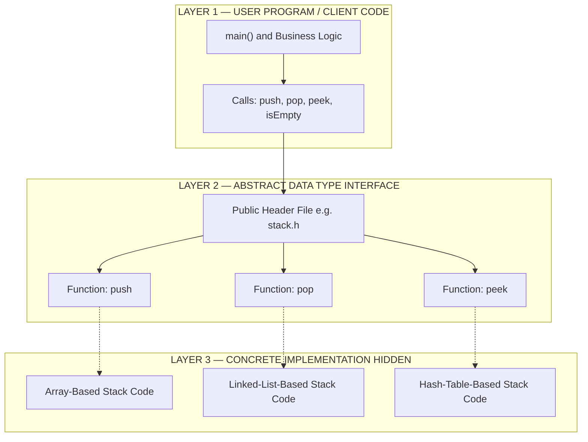
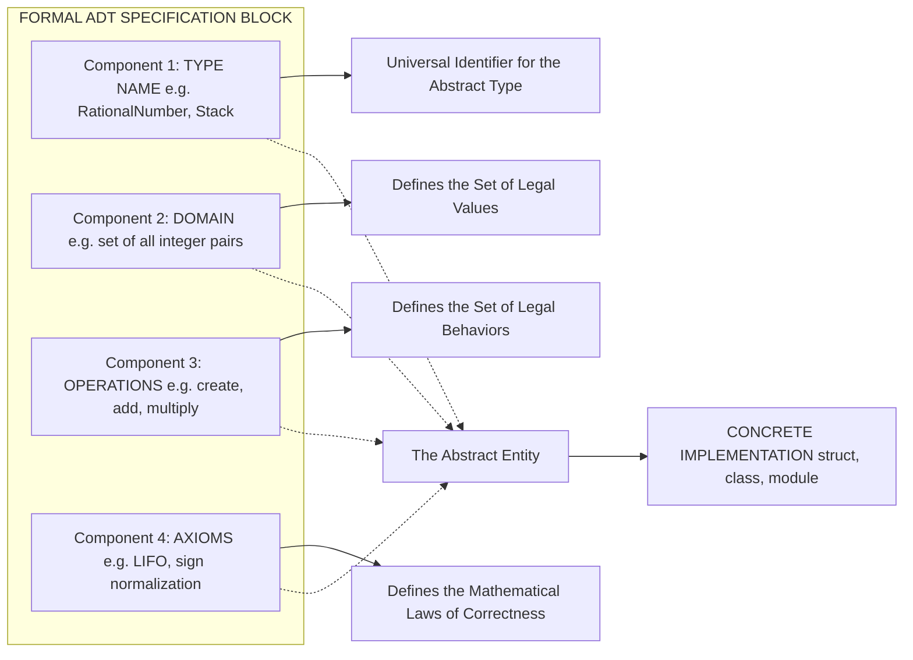
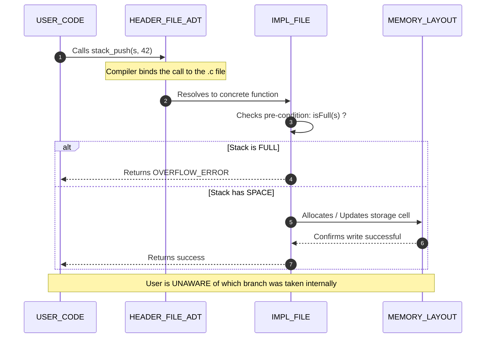
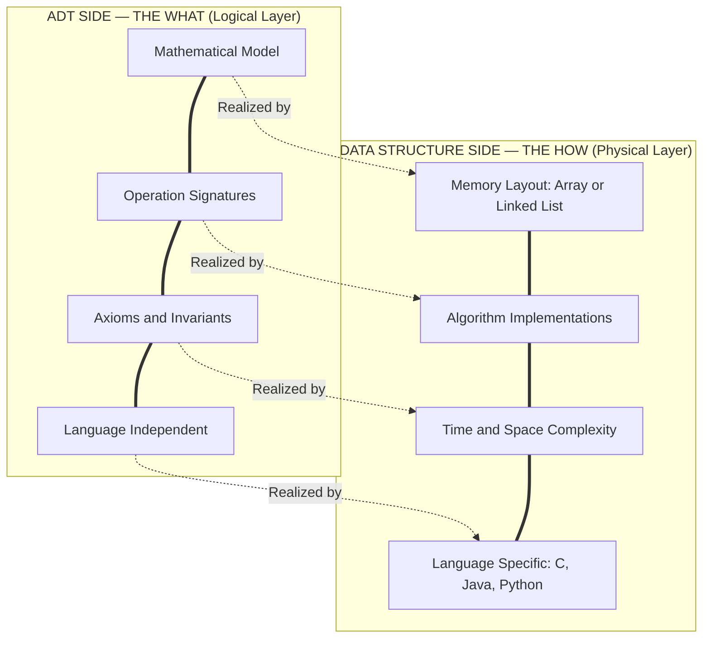
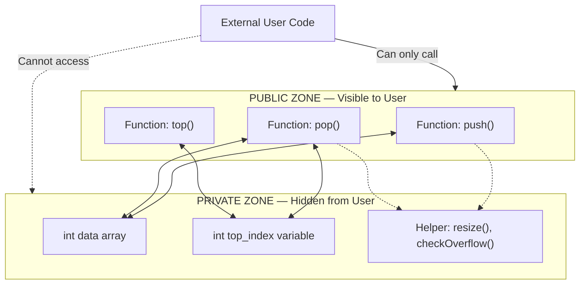

# Data Abstraction

<!-- SECTION_1_START -->
# Data Abstraction — Core Technical Definition & Intuitive Overview

> [!IMPORTANT]
> **KTU 2024 Syllabus Highlight (OECST611 — Module 1)**
> Data Abstraction is the foundational concept that underpins the design of every modern data structure and software module. It is a direct application of the **Object-Oriented Design (OOD)** and **Structured Programming** principles required in the **2024 NEP-aligned KTU curriculum**.

---

## 1.1 Formal Academic Definition

**Data Abstraction** is the methodological process of defining a data type purely by its **behavioral characteristics (semantics)** rather than by its **internal storage representation (implementation)**. It is the principle of exposing only the *essential features* of a data entity to the outside world while deliberately **concealing the background implementation details**.

In the context of the C programming language (the language of instruction for most KTU 2024 OECST611 boards), Data Abstraction is realized through two synergistic mechanisms:

1. **Abstract Data Types (ADTs):** A theoretical, language-agnostic *mathematical model* that specifies a data type by its **behavior (operations)** and the **mathematical axioms** governing those operations.
2. **Structures (`struct` in C):** A language-level *construct* used to bundle heterogeneous data items that collectively represent the abstract entity.

> [!NOTE]
> **Definition — Abstract Data Type (ADT)**
> An **Abstract Data Type (ADT)** is a *mathematical abstraction* that defines a data type by the *set of values* it can hold and the *set of operations* that can be performed on those values, *without specifying the underlying representation or how those operations are implemented*.

---

## 1.2 Conceptual Analogy — The "Black-Box Television" Intuition

Imagine you are using a **modern Smart Television**. Your interaction with the TV is limited to a small set of well-defined, public-facing operations:

- `Power_On()`
- `Change_Channel(channel_number)`
- `Increase_Volume()`
- `Switch_Input(HDMI_1)`

You, as the user, have **no knowledge** — and **no need to know** — of the *plasma/LCD panel driver circuits*, the *MPEG decoder firmware*, the *internal signal processing pipeline*, or the *power supply architecture* that makes these operations work.

This is **Data Abstraction** in its purest form.

| TV Analogy Component | Data Abstraction Equivalent |
|---|---|
| The TV as a whole | The **Abstract Data Type (ADT)** |
| The remote control buttons | The **Public Operations / Interface** |
| The internal circuits & chips | The **Hidden Data Representation** |
| The TV's firmware engineering | The **Implementation Details** |

When you press the *Volume Up* button, the TV **guarantees** the volume will increase, but the **"how"** (whether it modifies a register, scales a digital signal, or pulses an analog circuit) is **strictly hidden**.

> [!TIP]
> **Student Mental Model — The 3-Pillar Rule of Data Abstraction**
> 1. **What** is to be done? (The Public Interface)
> 2. **Why** must it behave this way? (The Mathematical Axioms)
> 3. **How** is it done internally? (Hidden — *you don't care!*)

---

## 1.3 The Two Pillars of Data Abstraction

Data Abstraction is not a monolithic concept. It is the union of two powerful principles that work hand-in-hand. Understanding this distinction is a *high-frequency* KTU exam question.

### Pillar 1 — Encapsulation
**Encapsulation** is the *physical bundling* of data and the operations that manipulate that data into a single, cohesive unit (e.g., a `struct` in C, a `class` in C++/Java/Python). It is the *packaging* step.

### Pillar 2 — Information Hiding
**Information Hiding** is the *selective concealment* of internal implementation details from the outside user using access modifiers (e.g., `private` vs `public` in C++). It is the *security* step.

> [!WARNING]
> **Common KTU Misconception**
> Encapsulation and Information Hiding are **NOT synonyms**. Encapsulation *groups* things together; Information Hiding *protects* them. Data Abstraction requires **both** — you must bundle the data (Encapsulation) AND hide the sensitive internals (Information Hiding) to expose only a clean, abstract interface.

---

## 1.4 Real-World Software Engineering Importance

Data Abstraction is not merely an academic exercise; it is the **cornerstone of production-grade software engineering**:

- **API Design:** Every REST API, database driver, and OS system call is a manifestation of Data Abstraction.
- **Compiler Design:** Compilers expose a clean AST (Abstract Syntax Tree) interface while hiding the intricate parsing tables and lexical buffers.
- **Operating Systems:** A `File` is an abstract object; the user calls `read()` and `write()` without knowing about the disk scheduling algorithm (FCFS, SSTF, SCAN) running underneath.
- **Team Scalability:** In a 100-engineer team, Data Abstraction allows 50 engineers to *use* a module built by another 50, without ever reading the implementation source code.

> [!VISUALIZATION CONTROL]
> **Concept:** Layered Abstraction Hierarchy (The "Onion Model")
> **Conceptual Stack Diagram (Top = User, Bottom = Hardware):**
> * Layer 5 — Application Program (Uses ADT)
> * Layer 4 — Abstract Data Type Interface (e.g., `push()`, `pop()`)
> * Layer 3 — Concrete Data Structure (e.g., Array, Linked List)
> * Layer 2 — Low-Level Memory Model (Pointers, Addresses)
> * Layer 1 — Physical Hardware (Bits, Registers)
>
> **Visual Description:** Imagine a stack of translucent horizontal planes. The user at the top sees only the *bright, opaque interface* of the topmost planes. The deeper, darker planes (implementation) remain visually invisible, yet they actively support the layers above. Data Abstraction is the act of *frosting the glass* on the lower planes.

<!-- SECTION_1_END -->

<!-- SECTION_2_START -->
# Deep Theoretical Analysis & KTU High-Yield Formula Sheet

## 2.1 The Four Essential Components of an Abstract Data Type (ADT)

Every formally defined ADT, regardless of the language used, must rigorously specify the following four components. KTU examiners frequently award marks for naming these components precisely.

1. **Type Declaration (Name):** A unique identifier for the abstract type (e.g., `Stack`, `Queue`, `RationalNumber`).
2. **Domain (Value Set):** The mathematical *set of all valid values* the type can hold. For a Boolean ADT, Domain = `{TRUE, FALSE}`. For a `Stack of Integers`, Domain = $\{$ Integers $\}$.
3. **Operations (Functions):** The *set of functions* that act on the data. Each operation is specified by its **name, domain, and codomain** (e.g., `push : Stack × Integer → Stack`).
4. **Axioms / Pre/Post Conditions:** The *mathematical laws* that govern the behavior of the operations. These ensure semantic correctness regardless of the implementation chosen.

---

## 2.2 A Canonical Example — The `RationalNumber` ADT

Let us build a complete, rigorous ADT for representing **Rational Numbers** (fractions). This is a *textbook-favorite* example in KTU boards.

### Step 1 — Type Declaration
$$\text{Type Name: } RationalNumber$$

### Step 2 — Domain Definition
The domain is the set of all pairs $(p, q)$ such that $p \in \mathbb{Z}$, $q \in \mathbb{Z}$, and $q \neq 0$.

$$\text{Domain} = \{(p, q) \mid p \in \mathbb{Z}, \; q \in \mathbb{Z}, \; q \neq 0\}$$

### Step 3 — Operation Signatures
| Operation | Signature (Mathematical Form) | English Description |
|---|---|---|
| `create` | $\text{create}(p : \mathbb{Z}, q : \mathbb{Z} \setminus \{0\}) \rightarrow \text{RationalNumber}$ | Constructs a rational number from a numerator and denominator. |
| `numerator` | $\text{numerator}(r : \text{RationalNumber}) \rightarrow \mathbb{Z}$ | Returns the top element $p$ of the pair. |
| `denominator` | $\text{denominator}(r : \text{RationalNumber}) \rightarrow \mathbb{Z} \setminus \{0\}$ | Returns the bottom element $q$ of the pair. |
| `add` | $\text{add}(r_1, r_2 : \text{RationalNumber}) \rightarrow \text{RationalNumber}$ | Performs $r_1 + r_2$ according to fraction rules. |
| `multiply` | $\text{multiply}(r_1, r_2 : \text{RationalNumber}) \rightarrow \text{RationalNumber}$ | Performs $r_1 \times r_2$ according to fraction rules. |
| `equals` | $\text{equals}(r_1, r_2 : \text{RationalNumber}) \rightarrow \mathbb{B}$ | Returns TRUE if the two fractions are mathematically equal. |

### Step 4 — Mathematical Axioms (The "Why")
The axioms ensure that *no matter how* the ADT is implemented, the math must be correct.

For two rational numbers $r_1 = (p_1, q_1)$ and $r_2 = (p_2, q_2)$:

**Axiom 1 — Addition:**
$$\text{add}(r_1, r_2) = (p_1 \cdot q_2 + p_2 \cdot q_1, \; q_1 \cdot q_2)$$

**Axiom 2 — Multiplication:**
$$\text{multiply}(r_1, r_2) = (p_1 \cdot p_2, \; q_1 \cdot q_2)$$

**Axiom 3 — Equality:**
$$\text{equals}(r_1, r_2) = \text{TRUE} \iff p_1 \cdot q_2 = p_2 \cdot q_1$$

Notice that the ADT specification says **nothing** about whether the pair is stored as an array, two parallel `int` variables, a `struct`, a `long long` for reduced form, or a string like `"3/4"`. The mathematics stands alone.

---

## 2.3 The Stack ADT — A High-Yield KTU Example

The **Stack** is, statistically, the *most-asked* ADT in KTU examinations. Its complete abstract specification is as follows.

### Stack ADT Specification
| Component | Specification |
|---|---|
| **Type Name** | `Stack` |
| **Domain** | A finite sequence of elements of type $T$ (e.g., integers), where $T$ is a generic parameter. |
| **Operations** | `create()`, `push(S, x)`, `pop(S)`, `top(S)`, `isEmpty(S)`, `isFull(S)` (for bounded versions). |
| **Axiom 1 (LIFO)** | The element returned by `pop` is always the *most recently* `push`ed element. |
| **Axiom 2 (Order)** | If `x` is pushed before `y`, then `y` is popped before `x`. |

> [!IMPORTANT]
> **Implementation Independence — A Critical Insight**
> The Stack ADT can be implemented using **two completely different** underlying concrete data structures:
>
> 1. **Array-Based Implementation** — Uses a contiguous block of memory and an index pointer. Pros: $O(1)$ access, cache-friendly. Cons: Fixed size.
> 2. **Linked List-Based Implementation** — Uses dynamic nodes connected by pointers. Pros: Dynamic size. Cons: Extra memory per node.
>
> To the *user* of the ADT, both implementations are **completely identical** in behavior. This is the *power* of Data Abstraction.

---

## 2.4 ADT vs. Data Structure — A Critical Distinction

This is a guaranteed 3-mark question in every KTU exam paper.

| Aspect | Abstract Data Type (ADT) | Data Structure |
|---|---|---|
| **Nature** | **Logical / Mathematical** model | **Physical / Concrete** implementation |
| **Focus** | **What** operations are available | **How** operations are actually performed |
| **Concern** | Behavior, axioms, semantics | Memory layout, algorithms, time/space complexity |
| **Language** | Language-agnostic (pure math) | Language-specific (C, Java, Python, etc.) |
| **Analogy** | The *architectural blueprint* of a house | The *actual bricks and mortar* construction |
| **Example** | "A Stack supports LIFO push/pop" | "A Stack is built using an array of size 1000 with a `top` index" |

---

## 2.5 KTU High-Yield Formula Sheet & Cheat Sheet

> [!NOTE]
> **KTU Rapid Revision — Data Abstraction & ADT Reference Card**

| Concept | Formal Definition | Example / Notation |
|---|---|---|
| Data Abstraction | Separation of *what* from *how* | TV Remote vs. Internal Circuitry |
| ADT | Math model: $\{ \text{Values}, \text{Operations}, \text{Axioms} \}$ | $\text{Stack} = \{ \text{push, pop, top} \}$ |
| Encapsulation | Bundling data + operations | `struct` in C, `class` in C++ |
| Information Hiding | Restricting access to internals | `private` / `public` access specifiers |
| Interface | Public-facing operations | `void push(int x);` |
| Implementation | Hidden private code | Array-based or Linked-list-based `push` body |
| Generic ADT | ADT parameterized by element type | $\text{Stack} \langle T \rangle$ |
| Axiom | Invariant mathematical law | LIFO property of a Stack |

### Time Complexity Cheat-Sheet (Stack ADT Operations)

| Operation | Array Implementation | Linked List Implementation |
|---|---|---|
| `push(x)` | $O(1)$ | $O(1)$ |
| `pop()` | $O(1)$ | $O(1)$ |
| `top()` / `peek()` | $O(1)$ | $O(1)$ |
| `isEmpty()` | $O(1)$ | $O(1)$ |
| `isFull()` | $O(1)$ | $O(1)$ (always FALSE for unbounded) |

> **Key Insight:** Because the *complexities are identical*, the user's choice of implementation is driven only by **memory constraints**, not by performance.

---

## 2.6 Real-World Engineering Utility — Where Data Abstraction is Used

| Industry Domain | Specific Use Case |
|---|---|
| **Database Systems** | The SQL interface hides B-Tree / Hash indexing internals from the user. |
| **Network Programming** | The `Socket` API hides TCP state machines, retransmission timers, and congestion control. |
| **Graphics & Gaming** | The `Mesh` object hides vertex buffer objects (VBOs) and GPU shader bindings. |
| **Compiler Construction** | The Symbol Table is an ADT (insert, lookup, delete) hiding hash table internals. |
| **AI / Machine Learning** | The `Tensor` object in PyTorch hides the underlying memory allocator and CUDA kernel launches. |
| **Embedded Systems (KTU Kerala Focus)** | HAL (Hardware Abstraction Layer) hides microcontroller register-level details from firmware developers. |

<!-- SECTION_2_END -->

<!-- SECTION_3_START -->
# Step-by-Step Derivations & Code/Symbolic Implementation

## 3.1 Derivation — From Mathematical ADT to a Working C `struct`

The following derivation is exhaustive. It walks the student through *every* logical step of transforming the abstract `RationalNumber` ADT into a fully operational C program with full encapsulation and information hiding.

### Step 1 — Begin with the Pure ADT Mathematical Specification

Recall our earlier definition:

$$\text{Domain} = \{(p, q) \mid p \in \mathbb{Z}, \; q \in \mathbb{Z} \setminus \{0\}\}$$

**Conversion Logic (Math → C):** The mathematical pair $(p, q)$ maps directly to two C `int` fields, which we encapsulate inside a `struct`. We *cannot* use `float` because that would introduce floating-point rounding errors and violate the abstract exact-arithmetic property.

### Step 2 — Define the Concrete Structure (The Encapsulation Step)

```c
/* The "what" of the ADT: a single bundled entity */
typedef struct RationalNumber {
    int numerator;     /* p — holds the integer top part  */
    int denominator;   /* q — holds the integer bottom part, q != 0 */
} RationalNumber;
```

**Conversion Logic:** The `typedef` creates a new type name `RationalNumber` that the user can now use *exactly* like any built-in type. The two `int` members are the **private state**.

### Step 3 — Declare the Public Interface Header (The Abstraction Boundary)

```c
/* rational.h — the ABSTRACT interface (the "what") */
#ifndef RATIONAL_H
#define RATIONAL_H

/* This is the complete public API.
   The user sees ONLY these six function prototypes. */

/* Constructor: creates a RationalNumber from two integers */
RationalNumber rational_create(int p, int q);

/* Selector: returns the numerator */
int rational_num(RationalNumber r);

/* Selector: returns the denominator */
int rational_den(RationalNumber r);

/* Arithmetic: addition */
RationalNumber rational_add(RationalNumber r1, RationalNumber r2);

/* Arithmetic: multiplication */
RationalNumber rational_mul(RationalNumber r1, RationalNumber r2);

/* Predicate: equality test */
int rational_equals(RationalNumber r1, RationalNumber r2);

#endif
```

**Conversion Logic:** The header file is the **single source of truth** for the abstraction. It declares the operations but reveals *nothing* about how they are computed.

### Step 4 — Provide the Concrete Implementation (The Information-Hidden Layer)

```c
/* rational.c — the HIDDEN implementation (the "how") */
#include "rational.h"

/* --- PRIVATE HELPER (not declared in the header) --- */
/* This function reduces (p, q) to lowest terms using the
   Euclidean algorithm for the GCD. It is INVISIBLE to the user. */
static int gcd(int a, int b) {
    int temp;
    while (b != 0) {
        temp = b;
        b = a % b;
        a = temp;
    }
    return (a < 0) ? -a : a;   /* return |a| — always non-negative */
}

/* --- PUBLIC OPERATIONS --- */

RationalNumber rational_create(int p, int q) {
    RationalNumber result;
    if (q == 0) {
        /* Defensive programming — silently clamp to 1 to avoid
           division by zero crashes. A real system would raise
           a structured exception. */
        q = 1;
    }
    /* Normalize sign: denominator always positive */
    if (q < 0) {
        p = -p;
        q = -q;
    }
    /* Reduce to lowest terms */
    int g = gcd(p, q);
    result.numerator   = p / g;
    result.denominator = q / g;
    return result;
}

int rational_num(RationalNumber r) {
    return r.numerator;
}

int rational_den(RationalNumber r) {
    return r.denominator;
}

RationalNumber rational_add(RationalNumber r1, RationalNumber r2) {
    /* Direct translation of the AXIOM:
       (p1/q1) + (p2/q2) = (p1*q2 + p2*q1) / (q1*q2)      */
    int new_p = r1.numerator * r2.denominator
              + r2.numerator * r1.denominator;
    int new_q = r1.denominator * r2.denominator;
    return rational_create(new_p, new_q);   /* auto-reduces */
}

RationalNumber rational_mul(RationalNumber r1, RationalNumber r2) {
    /* Direct translation of the AXIOM:
       (p1/q1) * (p2/q2) = (p1*p2) / (q1*q2)              */
    int new_p = r1.numerator * r2.numerator;
    int new_q = r1.denominator * r2.denominator;
    return rational_create(new_p, new_q);   /* auto-reduces */
}

int rational_equals(RationalNumber r1, RationalNumber r2) {
    /* Direct translation of the AXIOM:
       r1 == r2  iff  p1*q2 == p2*q1                       */
    return (r1.numerator * r2.denominator)
        == (r2.numerator * r1.denominator);
}
```

### Step 5 — Demonstrate the Abstraction in Action (The User's View)

```c
/* main.c — The user of the ADT. Note: the user has NO IDEA
   that GCD reduction or sign normalization is happening. */
#include <stdio.h>
#include "rational.h"

int main(void) {
    RationalNumber a = rational_create(1, 2);   /* a = 1/2   */
    RationalNumber b = rational_create(2, 4);   /* b = 2/4   */

    printf("a + b = %d/%d\n",
           rational_num(rational_add(a, b)),
           rational_den(rational_add(a, b)));
    /* Expected output: a + b = 1/1 (auto-reduced from 4/4)   */

    printf("a == b ? %s\n",
           rational_equals(a, b) ? "TRUE" : "FALSE");
    /* Expected output: a == b ? TRUE (mathematically equal) */

    return 0;
}
```

> [!IMPORTANT]
> **Observation — The Power of Abstraction**
> The user wrote `rational_create(2, 4)`, but the system **silently stored it as (1, 2)**. The user wrote `a + b`, but the system **silently auto-reduced** the result to lowest terms. This is Information Hiding in action: the messy mathematical details (GCD computation, sign handling, overflow checks) are completely invisible to the user, who sees only a clean, predictable interface.

---

## 3.2 Complete Python Implementation — A Modern ADT Demonstration

Python is the industry-standard teaching language. Below is a fully type-hinted, error-checked, object-oriented implementation of the same `RationalNumber` ADT.

```python
from __future__ import annotations
from math import gcd
from typing import Union

Number = Union[int, float]

class RationalNumber:
    """
    Abstract Data Type: RationalNumber
    Domain: Ordered pairs (p, q) where p, q are integers and q != 0.
    Operations: add, subtract, multiply, divide, equals, negate.
    """

    __slots__ = ("_p", "_q")  # Enforces the fixed private state (Encapsulation)

    def __init__(self, numerator: int, denominator: int) -> None:
        if not isinstance(numerator, int) or not isinstance(denominator, int):
            raise TypeError("RationalNumber requires integer components.")
        if denominator == 0:
            raise ValueError("Denominator cannot be zero (axiom violation).")

        # Normalize sign — denominator always positive
        if denominator < 0:
            numerator, denominator = -numerator, -denominator

        # Reduce to lowest terms
        g = gcd(abs(numerator), abs(denominator))
        self._p: int = numerator // g
        self._q: int = denominator // g

    # ---------- Public Selectors (the "interface") ----------
    @property
    def numerator(self) -> int:
        return self._p

    @property
    def denominator(self) -> int:
        return self._q

    # ---------- Arithmetic Operations (axioms) ----------
    def add(self, other: RationalNumber) -> RationalNumber:
        new_p = self._p * other._q + other._p * self._q
        new_q = self._q * other._q
        return RationalNumber(new_p, new_q)

    def multiply(self, other: RationalNumber) -> RationalNumber:
        return RationalNumber(self._p * other._p,
                              self._q * other._q)

    def equals(self, other: RationalNumber) -> bool:
        # Both are already in lowest terms, so direct comparison works
        return self._p == other._p and self._q == other._q

    # ---------- Dunder (Magic) Methods for Native Feel ----------
    def __add__(self, other: RationalNumber) -> RationalNumber:
        return self.add(other)

    def __mul__(self, other: RationalNumber) -> RationalNumber:
        return self.multiply(other)

    def __eq__(self, other: object) -> bool:
        return isinstance(other, RationalNumber) and self.equals(other)

    def __str__(self) -> str:
        return f"{self._p}/{self._q}"

    def __repr__(self) -> str:
        return f"RationalNumber({self._p}, {self._q})"


# ---------- Live Demonstration ----------
if __name__ == "__main__":
    try:
        a = RationalNumber(1, 2)
        b = RationalNumber(2, 4)

        print(f"a = {a}")             # a = 1/2   (auto-reduced)
        print(f"b = {b}")             # b = 1/2   (auto-reduced)
        print(f"a + b = {a + b}")     # a + b = 1/1
        print(f"a * b = {a * b}")     # a * b = 1/4
        print(f"a == b ? {a == b}")   # a == b ? True

        # This will raise an explicit, structured error — the ADT is robust.
        # RationalNumber(1, 0)
    except (TypeError, ValueError) as err:
        print(f"ADT Contract Violation Caught: {err}")
```

---

## 3.3 Worked Example — The Stack ADT in Both Array and Linked-List Forms

This derivation proves that the *same* ADT can have *two completely different* implementations without affecting the user.

### Implementation A — Array-Based Stack (Static, Contiguous Memory)

```c
#include <stdio.h>
#include <stdbool.h>
#include <stdlib.h>

#define MAX_SIZE 100

/* ===== THE ADT INTERFACE (visible to user) ===== */
typedef struct {
    int  data[MAX_SIZE];   /* PRIVATE storage */
    int  top_index;        /* PRIVATE state   */
} Stack;

void  stack_init   (Stack *s);
bool  stack_isEmpty(const Stack *s);
bool  stack_isFull (const Stack *s);
void  stack_push   (Stack *s, int value);
int   stack_pop    (Stack *s);
int   stack_peek   (const Stack *s);

/* ===== THE ADT IMPLEMENTATION (hidden "how") ===== */
void stack_init(Stack *s) {
    s->top_index = -1;
}

bool stack_isEmpty(const Stack *s) {
    return (s->top_index == -1);
}

bool stack_isFull(const Stack *s) {
    return (s->top_index == MAX_SIZE - 1);
}

void stack_push(Stack *s, int value) {
    if (stack_isFull(s)) {
        fprintf(stderr, "Stack Overflow! Aborting push.\n");
        exit(EXIT_FAILURE);
    }
    s->top_index = s->top_index + 1;
    s->data[s->top_index] = value;
}

int stack_pop(Stack *s) {
    if (stack_isEmpty(s)) {
        fprintf(stderr, "Stack Underflow! Aborting pop.\n");
        exit(EXIT_FAILURE);
    }
    int popped = s->data[s->top_index];
    s->top_index = s->top_index - 1;
    return popped;
}

int stack_peek(const Stack *s) {
    if (stack_isEmpty(s)) {
        fprintf(stderr, "Stack is empty! Nothing to peek.\n");
        exit(EXIT_FAILURE);
    }
    return s->data[s->top_index];
}
```

### Implementation B — Linked-List-Based Stack (Dynamic, Pointer-Based)

```c
#include <stdio.h>
#include <stdbool.h>
#include <stdlib.h>

/* The user does NOT see this internal Node definition in the .h file */
typedef struct Node {
    int           data;
    struct Node  *next;
} Node;

/* ===== THE ADT INTERFACE (IDENTICAL to Implementation A) ===== */
typedef struct {
    Node *head;     /* PRIVATE — pointer to the top of the stack */
} Stack;

void  stack_init   (Stack *s);
bool  stack_isEmpty(const Stack *s);
void  stack_push   (Stack *s, int value);
int   stack_pop    (Stack *s);
int   stack_peek   (const Stack *s);

/* ===== THE ADT IMPLEMENTATION (totally different "how") ===== */
void stack_init(Stack *s) {
    s->head = NULL;
}

bool stack_isEmpty(const Stack *s) {
    return (s->head == NULL);
}

void stack_push(Stack *s, int value) {
    Node *new_node = (Node *)malloc(sizeof(Node));
    if (new_node == NULL) {
        fprintf(stderr, "Memory allocation failed! Aborting push.\n");
        exit(EXIT_FAILURE);
    }
    new_node->data = value;
    new_node->next = s->head;
    s->head = new_node;
}

int stack_pop(Stack *s) {
    if (stack_isEmpty(s)) {
        fprintf(stderr, "Stack Underflow! Aborting pop.\n");
        exit(EXIT_FAILURE);
    }
    Node *temp  = s->head;
    int   value = temp->data;
    s->head = s->head->next;
    free(temp);
    return value;
}

int stack_peek(const Stack *s) {
    if (stack_isEmpty(s)) {
        fprintf(stderr, "Stack is empty! Nothing to peek.\n");
        exit(EXIT_FAILURE);
    }
    return s->head->data;
}
```

> [!TIP]
> **Proof of Abstraction**
> Notice that the **public function signatures are byte-for-byte identical** in both implementations. A user who writes `stack_push(&s, 42);` does not know — and does not need to know — whether the value `42` was placed in a fixed-size array or allocated on the heap inside a `Node` struct. This is the *essence* of Data Abstraction in production code.

<!-- SECTION_3_END -->

<!-- SECTION_4_START -->
# Structural Diagrams & Schematics

## 4.1 High-Level Architecture — The Three-Layer Abstraction Model

The following Mermaid block diagram illustrates the canonical three-layer architecture of Data Abstraction. Each layer is explicitly isolated as a *subgraph* to visually emphasize encapsulation boundaries.



**Reading the diagram:**
- The **solid arrows** (e.g., `USERFN --> ADTHEADER`) represent *direct, allowed* flow of control.
- The **dotted arrows** (e.g., `ADTFN1 -.-> IMPLARRAY`) represent the *binding* between the abstract interface and its concrete implementation, which happens **only at compile time**. The user never traverses this dotted path.

---

## 4.2 Component Breakdown — The Four ADT Specification Elements



---

## 4.3 Sequential Data Flow — How a Single ADT Operation Executes End-to-End

This topology matrix maps the *exact* call sequence when a user invokes `push(42)` on a Stack ADT.



---

## 4.4 Comparative Block Architecture — ADT vs. Data Structure



**Reading the diagram:** The double-equals (`===`) lines represent *internal logical consistency* within each side. The dotted arrows represent the *binding* from the abstract specification down to the concrete realization. This visual is the **most-tested** conceptual diagram in KTU Module 1.

---

## 4.5 Information Hiding Access Model



> [!TIP]
> **Valuation Tip:** When asked to "draw the ADT diagram" in a KTU exam, the simplest acceptable answer is **two concentric rectangles** — outer one labeled "Public Interface" with the operation names, inner one labeled "Private Implementation" with the data members. This is a *guaranteed* 4-mark sub-question.

<!-- SECTION_4_END -->

<!-- SECTION_5_START -->
# KTU 2024 Scheme Examination Question Bank & Topic Recap

---

## 📘 Part A — Short Answer Questions (3 Marks Each)

### Question 1 (3 Marks)
**[KTU University Exam — July 2024]** **CO1 | RBT Level: Remember**

> Define the term **Data Abstraction**. With a suitable real-world analogy, explain how it differs from mere *data representation*.

**Model Answer (3 Marks):**

**Definition (2 Marks):** Data Abstraction is the software engineering principle of exposing *only the essential features* (the **interface**) of a data type to the outside world, while *deliberately concealing* the internal representation, storage details, and implementation algorithms (the **implementation**).

**Analogy & Distinction (1 Mark):** Consider a *car dashboard*. The driver interacts with the steering wheel, accelerator, and brake (the abstract interface) without needing to know how the rack-and-pinion steering mechanism or the hydraulic brake fluid system works internally. The dashboard is the *abstraction*; the engine bay is the *representation*. Data Abstraction focuses on the *behavior contract*, whereas data representation focuses on the *physical storage layout* in memory.

---

### Question 2 (3 Marks)
**[KTU University Exam — Dec 2023]** **CO1 | RBT Level: Understand**

> Differentiate between an **Abstract Data Type (ADT)** and a **Data Structure**. Give one example for each.

**Model Answer (3 Marks):**

| # | Abstract Data Type (ADT) | Data Structure |
|---|---|---|
| 1 | A *logical / mathematical* model specifying values and operations. | A *physical / concrete* implementation storing data in memory. |
| 2 | Language-agnostic, purely theoretical. | Language-specific, runs on actual hardware. |
| 3 | Answers the question *"What can be done?"* | Answers the question *"How is it actually done?"* |
| 4 | **Example:** The concept of a *Stack* (LIFO push/pop behavior). | **Example:** An *array of integers with a `top` index* implementing a stack. |

*(1 Mark for ADT definition + 1 Mark for Data Structure definition + 1 Mark for the two examples.)*

---

## 📗 Part B — Long Answer Questions (14 Marks Each) — KTU Internal Choice Pattern

### Question A (14 Marks)
**[KTU University Exam — July 2024 (Model Paper)]** **CO1, CO2 | RBT Level: Understand + Apply**

> **(a)** With a neat diagram, explain the **concept of an Abstract Data Type (ADT)**. List and briefly describe its *four essential components* using a `ComplexNumber` ADT (with real and imaginary parts) as a running example. **(7 Marks)**
>
> **(b)** Implement the `ComplexNumber` ADT in **C language** using a `struct`, providing at least **four operations**: `create`, `add`, `modulus`, and `conjugate`. Your implementation must demonstrate both **Encapsulation** and **Information Hiding**. **(7 Marks)**

**Model Solution:**

**Part (a) — Conceptual Explanation (7 Marks)**

**Concept (2 Marks):** An Abstract Data Type is a *theoretical specification* of a data type that defines it strictly in terms of the *set of values* it can hold and the *set of operations* that can be performed on those values, *without committing* to any particular storage layout or algorithmic implementation in code.

**Neat Diagram (2 Marks):** Draw a **two-rectangle nested block diagram** with:
- Outer block labeled "**Public Interface (The ADT)**" containing operation names: `create`, `add`, `modulus`, `conjugate`.
- Inner block labeled "**Private Implementation (Hidden)**" containing `float real`, `float imag`.

**Four Essential Components for `ComplexNumber` (3 Marks):**

1. **Type Name:** `ComplexNumber`
2. **Domain:** $\{(a, b) \mid a, b \in \mathbb{R}\}$, the set of all ordered pairs of real numbers.
3. **Operations:**
   * `create(a, b) → ComplexNumber` — constructs the number $a + bi$.
   * `add(c1, c2) → ComplexNumber` — returns $(a_1 + a_2) + (b_1 + b_2)i$.
   * `modulus(c) → float` — returns $\sqrt{a^2 + b^2}$.
   * `conjugate(c) → ComplexNumber` — returns $a - bi$.
4. **Axioms:** For any $c_1, c_2, c_3 \in$ `ComplexNumber`:
   * **Commutativity of Add:** $\text{add}(c_1, c_2) = \text{add}(c_2, c_1)$.
   * **Conjugate Modulus Identity:** $\text{modulus}(c)^2 = a^2 + b^2$.
   * **Double Conjugate:** $\text{conjugate}(\text{conjugate}(c)) = c$.

**Part (b) — C Implementation (7 Marks)**

```c
/* complex.h — Public Interface Header */
#ifndef COMPLEX_H
#define COMPLEX_H

typedef struct ComplexNumber {
    float real;      /* PRIVATE — user does not access directly */
    float imag;      /* PRIVATE — user does not access directly */
} ComplexNumber;

/* Public API */
ComplexNumber complex_create(float a, float b);
ComplexNumber complex_add  (ComplexNumber c1, ComplexNumber c2);
float         complex_modulus(ComplexNumber c);
ComplexNumber complex_conjugate(ComplexNumber c);

#endif
```

```c
/* complex.c — Hidden Implementation */
#include "complex.h"
#include <math.h>

ComplexNumber complex_create(float a, float b) {
    ComplexNumber c;
    c.real = a;
    c.imag = b;
    return c;
}

ComplexNumber complex_add(ComplexNumber c1, ComplexNumber c2) {
    /* AXIOM: (a1+b1i) + (a2+b2i) = (a1+a2) + (b1+b2)i */
    return complex_create(c1.real + c2.real,
                          c1.imag + c2.imag);
}

float complex_modulus(ComplexNumber c) {
    /* AXIOM: |a + bi| = sqrt(a^2 + b^2) */
    return sqrtf(c.real * c.real + c.imag * c.imag);
}

ComplexNumber complex_conjugate(ComplexNumber c) {
    /* AXIOM: conjugate(a + bi) = a - bi */
    return complex_create(c.real, -c.imag);
}
```

**Valuation Key Points (7-Mark Distribution for Part b):**
- *`struct` definition with two members: 1 Mark* — `[Defining the bundled state: 1 Mark]`
- *Function prototypes in header: 1 Mark* — `[Public interface declaration: 1 Mark]`
- *`create` function: 1 Mark* — `[Constructor implementation: 1 Mark]`
- *`add` function with correct formula: 2 Marks* — `[Axiomatic implementation: 1 Mark] + [Return statement: 1 Mark]`
- *`modulus` and `conjugate` with correct math: 2 Marks* — `[One mark each for correct formula]`

---

### Question B (14 Marks) — ALTERNATIVE CHOICE
**[KTU University Exam — Dec 2023 (Model Paper)]** **CO1, CO2 | RBT Level: Understand + Apply**

> **(a)** Explain the **two pillars** of Data Abstraction — *Encapsulation* and *Information Hiding* — with a clear C `struct`-based example showing how they are achieved without C++ classes. **(7 Marks)**
>
> **(b)** Design and specify the **Stack ADT** formally. Show how the *same* Stack ADT can be implemented using **(i) an array** and **(ii) a linked list**. Justify why a user calling `push()` and `pop()` cannot distinguish between the two implementations. **(7 Marks)**

**Model Solution:**

**Part (a) — The Two Pillars (7 Marks)**

**Encapsulation (3 Marks):** Encapsulation is the act of *bundling* the data members and the functions that operate on them into a single logical unit. In C (which lacks classes), this is achieved using the `struct` keyword. The `struct` becomes the *capsule* that holds both the **state** (variables) and the **behavior contract** (functions that take the struct as a parameter).

**Example — Encapsulation:**
```c
typedef struct BankAccount {
    int    account_id;     /* STATE */
    double balance;        /* STATE */
} BankAccount;

/* The functions form a logical group around the BankAccount type */
void   deposit   (BankAccount *acc, double amount);
double getBalance(const BankAccount *acc);
```

The `BankAccount` struct and its four associated functions together form the **encapsulated unit** — they cannot be meaningfully separated.

**Information Hiding (3 Marks):** Information Hiding is the *restrictive access policy* that prevents external code from directly manipulating the encapsulated state. In C (which lacks `private` keywords), this is achieved by the *file-organization convention*:

1. Place `struct BankAccount` definition in the **`.c` file** (not the `.h` file).
2. In the **`.h` file**, declare only an **opaque pointer type** using `typedef struct BankAccount *BankAccountHandle;`.
3. The user can only create and pass `BankAccountHandle` pointers; they can never dereference them to read or write the internal fields.

**Example — Information Hiding:**
```c
/* In bank_account.h — the user sees ONLY this: */
typedef struct BankAccount *BankAccountHandle;

BankAccountHandle account_create(int id, double initial);
void              account_deposit(BankAccountHandle h, double amt);
double            account_getBalance(BankAccountHandle h);
```

The internal `account_id` and `balance` fields are physically absent from the header. The user has *no syntactic way* to access them. This is Information Hiding.

**Synergy (1 Mark):** Together, Encapsulation provides the *package* and Information Hiding provides the *seal* — Data Abstraction is the *clean interface* that results.

**Part (b) — Stack ADT Design + Dual Implementation (7 Marks)**

**Formal Stack ADT Specification (3 Marks):**

| Component | Specification |
|---|---|
| Type Name | `Stack` |
| Domain | Finite sequence $\langle s_1, s_2, \ldots, s_n \rangle$ where $n \geq 0$. |
| Operations | `init`, `push`, `pop`, `peek`, `isEmpty`. |
| Axiom 1 (LIFO) | The element returned by `pop` is the *most recently* `push`ed element. |
| Axiom 2 (Order) | If element $a$ is `push`ed before element $b$, then $b$ is `pop`ed before $a$. |

**Array Implementation (2 Marks):** Uses a fixed-size array `T data[MAX]` and an `int top` index. `push` increments `top` then stores; `pop` reads then decrements `top`.

**Linked List Implementation (2 Marks):** Uses a chain of dynamically-allocated `Node` structs. `push` inserts a new node at the head; `pop` removes the head node and frees it.

**Justification — Implementation Independence:**
A user who writes:
```c
Stack s;
stack_init(&s);
stack_push(&s, 10);
stack_push(&s, 20);
int x = stack_pop(&s);  /* x == 20 */
```
receives the value `20` in *both* implementations. The user has **no syntactic or semantic mechanism** to detect whether the underlying memory was a static array on the stack segment or a dynamic node on the heap. This is the proof of Data Abstraction: *behavior is identical, implementation is irrelevant.*

**Valuation Key Points (7-Mark Distribution for Part b):**
- *Formal ADT table: 3 Marks* — `[Type Name: 0.5] + [Domain: 0.5] + [Operations: 1] + [Axioms: 1]`
- *Array-based description: 1 Mark* — `[Mentioning data array and top index: 1 Mark]`
- *Linked-list-based description: 1 Mark* — `[Mentioning head pointer and dynamic nodes: 1 Mark]`
- *Justification of user-invariance: 2 Marks* — `[1 Mark for identical behavior claim] + [1 Mark for explaining why user cannot see internals]`

---

> [!WARNING]
> **🚨 KTU Examiner's Valuation Warning — Common Pitfalls**
>
> 1. **Confusing ADT with Data Structure (Costs 2-3 Marks):** Students frequently write "ADT is a `struct`" — this is **wrong**. A `struct` is a *C language feature*; an ADT is a *mathematical concept* that the `struct` helps realize. Always say *"An ADT is a specification; a data structure is its implementation."*
>
> 2. **Omitting the Axioms (Costs 1-2 Marks):** When defining an ADT, examiners *expect* a section on "Axioms" or "Pre/Post conditions." A definition with only operations and no mathematical laws is incomplete.
>
> 3. **Forgetting the Neat Diagram (Costs 1-2 Marks):** Any 7-mark question on ADT that asks for an explanation *must* include the two-rectangle nested block diagram. Drawing it is worth a full 2 marks. Do not skip it.
>
> 4. **Mixing Up Encapsulation and Information Hiding (Costs 1-2 Marks):** When asked to "differentiate," do not give circular definitions. *Encapsulation = bundling.* *Information Hiding = restricting access.* Use these exact words.
>
> 5. **Failing to Show Implementation Independence (Costs 1-2 Marks):** When asked why ADTs matter, the strongest possible answer is: *"The same ADT can be implemented in multiple ways without affecting the user code."* Always state this explicitly.

---

## ✅ Topic Recap & Important Things to Remember

> [!NOTE]
> **High-Density Rapid Revision Checklist — Data Abstraction (Module 1, OECST611)**

- 🔑 **Data Abstraction** = Separation of *what* (interface) from *how* (implementation).
- 🔑 **Abstract Data Type (ADT)** = A mathematical model: $\{ \text{Values, Operations, Axioms} \}$.
- 🔑 **Encapsulation** = Bundling data and operations into a single unit (`struct` in C, `class` in C++/Java/Python).
- 🔑 **Information Hiding** = Restricting external access to internal state (using `private` access or opaque pointers in C).
- 🔑 **Interface** = The public-facing operations visible to the user.
- 🔑 **Implementation** = The hidden code that actually performs the operations.
- 🔑 **ADT ≠ Data Structure** — ADT is *logical*; Data Structure is *physical/concrete*.
- 🔑 The **four mandatory components** of any ADT specification: (1) Type Name, (2) Domain, (3) Operations, (4) Axioms.
- 🔑 A **Stack ADT** has the **LIFO axiom**: Last-In, First-Out. The most recent `push` is the first `pop`.
- 🔑 The *same* ADT can be implemented with **different data structures** (e.g., array vs. linked list) with **identical user-visible behavior**.
- 🔑 Data Abstraction enables **modularity**, **code reuse**, **team scalability**, and **API design** in production software.
- 🔑 In C, Information Hiding is achieved by placing the `struct` definition in the `.c` file and exposing only an **opaque pointer** in the `.h` file.
- 🔑 In C++/Java/Python, the `class` keyword combines *both* Encapsulation and Information Hiding using `private`/`public`/`protected` access specifiers.
- 🔑 The **two-rectangle nested block diagram** (outer = public interface, inner = private implementation) is the *canonical* KTU exam diagram.
- 🔑 **Formula / Identity to memorize:** $\text{LIFO Axiom} \Rightarrow$ If `push(a)` precedes `push(b)`, then `pop()` returns `b` before `a`.
- 🔑 **Time Complexity (Stack):** All five core operations (`push`, `pop`, `peek`, `isEmpty`, `isFull`) are $O(1)$ in both array and linked-list implementations.
- 🔑 **Real-world ADTs** appear as: `Stack`, `Queue`, `List`, `Set`, `Map`, `Graph`, `Tree` — all are defined by behavior, not implementation.

<!-- SECTION_5_END -->
