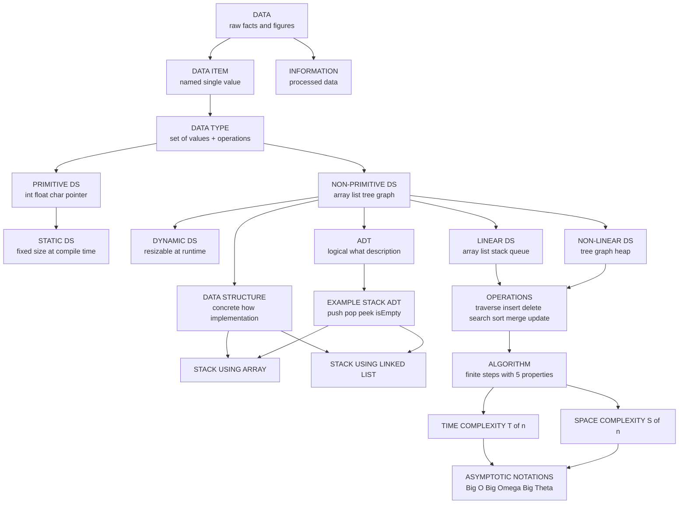
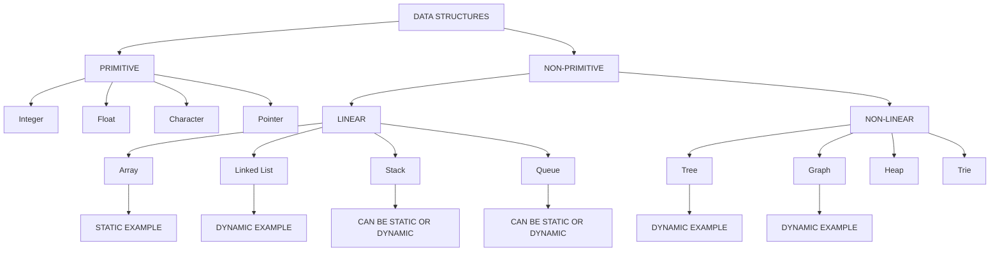
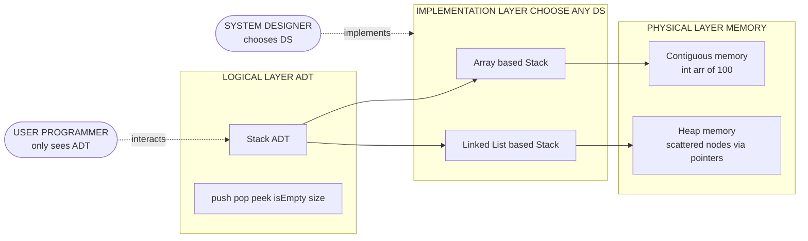
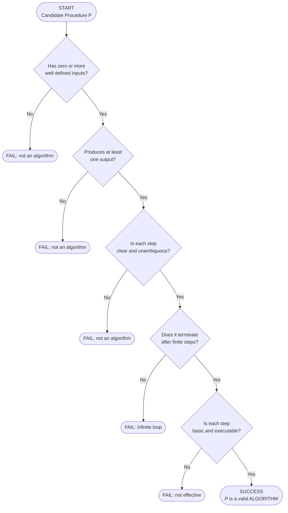
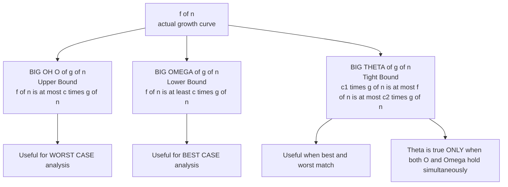

# Definitions

<!-- SECTION_1_START -->

# 1. Core Technical Definition & Intuitive Overview

## 1.1 What is Data?

In the formal KTU 2024 Scheme terminology, **Data** is defined as a collection of raw, unprocessed facts, figures, values, or symbols that can be processed, stored, and retrieved by a computer system. Data, by itself, carries no specific meaning until it is processed into a usable form.

> [!IMPORTANT]
> **Formal Definition (KTU Syllabus):** Data are basic values or entities that can be processed by a computer program. They are usually grouped into a hierarchy of meaningful chunks called *records* or *objects*.

### Conceptual Analogy / Intuition
Think of **Data** as the *raw ingredients* lying on a kitchen counter — flour, sugar, eggs, and water. Just like these ingredients cannot be eaten as-is and must first be processed (mixed, baked), raw numbers and characters in memory are useless to the end user until a program processes them into meaningful **Information**.

| Term | Example |
| :--- | :--- |
| Raw Data | `85`, `90`, `78`, `92` |
| Processed Information | *"Average marks of Class A = 86.25%"* |

> [!NOTE]
> The classical hierarchy in Computer Science is: **Data → Information → Knowledge → Wisdom (DIKW Pyramid)**. As data climbs each level, its context and utility increase.

## 1.2 What is a Data Item?

A **Data Item** is a single unit of named data that represents a particular attribute of an entity. It is the smallest piece of meaningful information that cannot be meaningfully broken down further in a given context.

- **Key Insight:** A data item is a *value* belonging to a specific category (e.g., age = `21`).
- A data item can be either a **single item** (atomic, cannot be subdivided) or a **group item** (composed of multiple sub-items, like a date containing day, month, year).

> [!IMPORTANT]
> **Group Item vs. Atomic Item:** A *Date* is a group item composed of three atomic items (day, month, year). An *age* is an atomic item — we don't usually break `21` into `2` and `1`.

## 1.3 What is a Data Type?

A **Data Type** is a classification that specifies:
1. The kind of value a variable can hold.
2. The operations that can be performed on that value.
3. The memory size (in bytes) required to store it.

KTU textbooks formally define it as: *a data type is a term used in strongly typed programming languages to restrict the operations permissible on a variable to those defined by the type.*

> [!IMPORTANT]
> **Standard Data Types in C (KTU High-Yield):**
> - `int` → Integer values (typically **4 bytes** in modern 64-bit compilers)
> - `float` → Single-precision floating point (**4 bytes**)
> - `double` → Double-precision floating point (**8 bytes**)
> - `char` → Single character (**1 byte**)

### Conceptual Analogy / Intuition
A **Data Type** is like the *type of container* you use in the kitchen. You pour water into a glass, rice into a jar, and soup into a bowl. The container (data type) dictates what you can store and what operations make sense (you drink from a glass, scoop from a jar). Putting soup in a glass is *type mismatch* — the compiler would reject it.

## 1.4 What is a Data Structure?

This is the **central definition** of the entire module and carries the highest weight in KTU examinations.

> [!IMPORTANT]
> **Formal Definition (KTU Board Examiner's Wording):** A *Data Structure* is a named location in memory that can be used to store and organize data, and a collection of algorithms (operations) that perform processing on the stored data. It is a specialized format for organizing, processing, retrieving, and storing data.

### Conceptual Analogy / Intuition
Imagine a **school office** storing student records:
- If records are thrown into a *random heap box* → finding one takes forever (no structure).
- If records are stored in a **cabinet with drawers labeled A–Z** (alphabetical) → fast lookup.
- If records are in a **linked chain** (each folder points to the next) → easy insertion in the middle.

The chosen *way of organizing* records in memory is the **Data Structure**. Each organization scheme comes with trade-offs in *speed of search*, *ease of insertion*, and *memory usage*.

> [!NOTE]
> **Why do we need Data Structures?**
> 1. To **organize** data efficiently.
> 2. To enable **fast access and modification** of data.
> 3. To solve **real-world problems** like search engines, social networks, and OS scheduling.
> 4. To **manage large volumes of data** (Big Data, databases).

## 1.5 Abstract Data Type (ADT)

> [!IMPORTANT]
> **Formal Definition:** An Abstract Data Type (ADT) is a mathematical model for data types where a data type is defined by its behavior (semantics) from the point of view of a user, specifically in terms of possible values, possible operations on data of this type, and the behavior of these operations. *It does not specify how data is stored in memory — only what operations are supported.*

An ADT is the **"WHAT"** (logical view), and a Data Structure is the **"HOW"** (implementation view).

> [!NOTE]
> **Famous KTU Example:** A *Stack* is an ADT. It supports `push()`, `pop()`, `peek()`, and `isEmpty()`. But a stack can be *implemented* using an **array** or a **linked list** — these are two different data structures implementing the same ADT.

### Conceptual Analogy / Intuition
Think of an **ATM machine**:
- The ADT specifies the *buttons*: Withdraw, Deposit, Check Balance (the interface).
- The internal mechanics — how the cash tray slides, how the database is queried — is the *implementation* (Data Structure).
- You, the user, only care about the *interface* (ADT), not the *mechanics* (Data Structure).

## 1.6 Algorithm

> [!IMPORTANT]
> **Formal Definition:** An *Algorithm* is a finite, well-defined sequence of unambiguous, executable instructions for solving a class of specific problems or performing a computation in a finite amount of time.

Every algorithm must satisfy these **5 essential properties** (often asked as a 3-mark question in KTU):

| Property | Meaning |
| :--- | :--- |
| **Input** | Zero or more well-defined inputs are provided. |
| **Output** | At least one output must be produced. |
| **Definiteness** | Each step is clear and unambiguous. |
| **Finiteness** | The algorithm must terminate after a finite number of steps. |
| **Effectiveness** | Each step must be basic enough to be carried out exactly. |

> [!NOTE]
> **Algorithm vs. Program:** An *algorithm* is a *language-independent* design (like pseudocode), whereas a *program* is the algorithm coded in a specific programming language like C, C++, or Java.

## 1.7 Time and Space Complexity

These two terms are foundational to evaluating every algorithm and data structure.

> [!IMPORTANT]
> **Time Complexity** is the computational complexity that describes the **amount of computer time** required to run an algorithm as a function of the size of the input, denoted **$T(n)$** where $n$ is the input size.

> [!IMPORTANT]
> **Space Complexity** is the amount of **memory (auxiliary + input)** an algorithm requires to execute, denoted **$S(n)$**.

**Total Space Complexity:**
$$S(n) = \text{Input Space} + \text{Auxiliary Space}$$

> [!NOTE]
> The standard convention in KTU is to use the **Asymptotic Notations** $O$, $\Omega$, and $\Theta$ (Big-Oh, Big-Omega, Big-Theta) to express the *order of growth* of these functions.

> [!VISUALIZATION CONTROL]
> **Concept:** Asymptotic Growth of Common Complexities
> **GeoGebra / Desmos Input Equations:**
> * `f(x) = log(x)`
> * `g(x) = x`
> * `h(x) = x^2`
> * `k(x) = 2^x`
> **Visual Description:** Plot these four curves for $x \in [1, 30]$. Observe that $2^x$ skyrockets vertically (exponential explosion), $x^2$ curves upward (polynomial), $x$ is a straight line (linear), and $\log(x)$ flattens out (most efficient). The $y$-axis is *time/memory cost*, and the $x$-axis is *input size $n$*.

## 1.8 Other Critical Definitions (KTU Module-1 Favorites)

> [!IMPORTANT]
> **Primitive Data Structures:** The basic data structures that are directly operated upon by machine-level instructions. Examples: `int`, `float`, `char`, `pointer`.

> [!IMPORTANT]
> **Non-Primitive Data Structures:** More complex data structures derived from primitive types. Examples: Arrays, Linked Lists, Stacks, Queues, Trees, Graphs.

> [!IMPORTANT]
> **Linear Data Structure:** Data elements are arranged in a *sequential/linear order*. Examples: Array, Linked List, Stack, Queue.

> [!IMPORTANT]
> **Non-Linear Data Structure:** Data elements are arranged in a *hierarchical or networked* manner. Examples: Trees, Graphs, Heaps.

> [!IMPORTANT]
> **Static Data Structure:** *Fixed-size* memory allocation determined at compile time. Example: Array.

> [!IMPORTANT]
> **Dynamic Data Structure:** *Resizable* memory allocation that can grow or shrink at runtime. Examples: Linked List, Tree, Graph.

> [!IMPORTANT]
> **In-place Algorithm:** An algorithm that uses *constant extra space* (i.e., $O(1)$ auxiliary space) beyond the input.

<!-- SECTION_1_END -->

<!-- SECTION_2_START -->

# 2. Deep Theoretical Analysis & KTU High-Yield Formula Sheet

## 2.1 The Master Hierarchy of Data Concepts

In the KTU 2024 syllabus, the definitions form a strict layered hierarchy. Understanding this hierarchy is essential for scoring on definition-type 2-mark short questions:

$$\text{Data} \;\subset\; \text{Data Item} \;\subset\; \text{Data Type} \;\subset\; \text{Data Structure} \;\subset\; \text{ADT}$$

Each layer *uses* the layer below it. Data is raw; data items name them; data types constrain them; data structures organize them in memory; ADTs abstract their behavior.

## 2.2 The Four Pillars of Operations on Data Structures

Every data structure in the entire syllabus (from Module 1 to Module 5) supports a fixed set of **fundamental operations**. This is one of the most frequently asked topics in KTU 2-mark questions:

- **Traversal** — Visiting every element at least once (e.g., printing all elements of a linked list).
- **Insertion** — Adding a new element at a specified position.
- **Deletion** — Removing an existing element.
- **Searching** — Finding the location/value of a specific element.
- **Sorting** — Arranging elements in a particular order (ascending/descending).
- **Merging** — Combining two data structures of the same type.
- **Updation** — Modifying the value of an existing element.

> [!NOTE]
> **Engineering Real-World Utility:** In a **Facebook news feed**, *Insertion* happens when your friend posts a status; *Searching* happens when you type a name in the search bar; *Traversal* happens when your timeline is rendered; *Deletion* happens when you unlike a post. The choice of data structure (hash table, B-tree, etc.) determines how fast each of these feels to the user.

## 2.3 Classification Tree of Data Structures

A typical KTU exam question asks: *"Classify data structures with examples."* Here is the full taxonomy:

**Level 1 — Primitive vs. Non-Primitive**
- **Primitive** (basic types, hardware-supported): Integer, Float, Character, Boolean, Pointer.
- **Non-Primitive** (derived, programmer-defined): Array, Structure, Union, and the four classical data structures below.

**Level 2 — Non-Primitive sub-division**
- **Linear** (sequential, single level): Array, Linked List, Stack, Queue.
- **Non-Linear** (multi-level, hierarchical): Tree, Graph, Heap, Trie.

**Level 3 — Storage sub-division**
- **Static** (size fixed at compile time): Array.
- **Dynamic** (size changes at runtime): Linked List, Tree, Graph.

## 2.4 The ADT vs. Data Structure Distinction (Deep Dive)

This is a **favorite 5-mark question** in KTU. Memorize the table below:

| Aspect | Abstract Data Type (ADT) | Data Structure (DS) |
| :--- | :--- | :--- |
| **What is it?** | A *logical/mathematical* description. | A *concrete implementation*. |
| **Focus** | **WHAT** operations are allowed. | **HOW** operations are implemented. |
| **Dependency** | Implementation-independent. | Implementation-specific (array, linked list, etc.). |
| **Visibility** | User-facing interface (public methods). | Internal representation (private). |
| **Example** | *Stack* (with push, pop, top). | *Stack using Array* OR *Stack using Linked List*. |
| **Analogy** | The *remote control* of a TV. | The *circuit board inside* the TV. |

## 2.5 Why Asymptotic Notations Matter (Big-Oh $O$, Big-$\Omega$, Big-$\Theta$)

In KTU Module 1, the focus is on understanding these *notations* as definitions, while the heavy calculation comes in Modules 2–5.

- **Big-Oh $O(g(n))$** → *Upper bound* → Worst-case ceiling.
- **Big-Omega $\Omega(g(n))$** → *Lower bound* → Best-case floor.
- **Big-Theta $\Theta(g(n))$** → *Tight bound* → Both upper and lower.

> [!IMPORTANT]
> **Rule of Thumb for KTU:** When asked about complexity *without specifying best/worst/average*, the standard default is **Worst-Case Time Complexity**, expressed using **$O$ notation**.

## 2.6 KTU High-Yield Formula Sheet

The following table is your **one-stop cheat sheet** for Module 1 definitions and is fully aligned with the KTU 2024 marking scheme. Note the careful use of `\vert` instead of `|` for absolute value and conditional set notation to keep markdown tables safe.

| # | Term | Formal KTU Definition | Mathematical / Empirical Notation | Typical Unit / Memory |
| :--- | :--- | :--- | :--- | :--- |
| 1 | Data | Raw facts and figures. | A set of symbols $D = \{d_1, d_2, \ldots, d_n\}$. | Bits / Bytes |
| 2 | Data Item | A single value with a name. | An ordered pair $(\text{name}, \text{value})$. | 1–8 Bytes |
| 3 | Data Type | A set of values + operations on them. | $T = (V, O)$ where $V$ = value set, $O$ = operation set. | Implementation-dependent |
| 4 | Data Structure | Storage organization + operations. | $DS = (O, L)$ where $O$ = organization, $L$ = operations library. | $n \times \text{sizeof}(T)$ bytes |
| 5 | ADT | Logical description of data behavior. | $A = (D, F, A_x)$ where $F$ = functions, $A_x$ = axioms. | Logical (no memory yet) |
| 6 | Algorithm | A finite sequence of steps. | $A : I \to O$ mapping inputs to outputs. | Time $T(n)$ + Space $S(n)$ |
| 7 | Time Complexity | Running time as a function of $n$. | $T(n) = c_1 n + c_2$ | Seconds / Operations |
| 8 | Space Complexity | Memory used as a function of $n$. | $S(n) = c + S_p(n)$ (auxiliary + input) | Bytes |
| 9 | Asymptotic Upper Bound | Worst-case growth ceiling. | $f(n) = O(g(n))$ if $\exists c, n_0 : f(n) \le c \cdot g(n) \ \forall n \ge n_0$ | Order of growth |
| 10 | Asymptotic Lower Bound | Best-case growth floor. | $f(n) = \Omega(g(n))$ if $\exists c, n_0 : f(n) \ge c \cdot g(n) \ \forall n \ge n_0$ | Order of growth |
| 11 | Asymptotic Tight Bound | Both upper and lower. | $f(n) = \Theta(g(n))$ iff $f(n) = O(g(n))$ and $f(n) = \Omega(g(n))$ | Order of growth |
| 12 | Primitive DS | Hardware-supported basic types. | $\mathbb{Z}, \mathbb{R}, \text{char}, \text{bool}, \text{pointer}$ | 1, 2, 4, or 8 Bytes |
| 13 | Non-Primitive DS | Derived/abstracted types. | Array, List, Tree, Graph | $n \times \text{sizeof}(T)$ |
| 14 | Linear DS | Sequential arrangement. | $L[1 \ldots n]$ with predecessor/successor relations. | $O(n)$ traversal |
| 15 | Non-Linear DS | Multi-level arrangement. | Tree $T = (V, E)$, Graph $G = (V, E)$ | $O(n)$ traversal |
| 16 | Static DS | Fixed-size at compile time. | `int arr[100];` | Compile-time |
| 17 | Dynamic DS | Variable-size at runtime. | `malloc()`, `new`, `free()` | Runtime (heap) |
| 18 | In-place Algorithm | Uses only constant extra memory. | $S_{\text{aux}}(n) = O(1)$ | $O(1)$ extra |

> [!NOTE]
> **Engineering Field Applications:**
> - **Database Indexing** uses **B-Trees** (non-linear, dynamic) for sub-millisecond lookups.
> - **OS Process Scheduling** uses **Queues** (linear, dynamic).
> - **Compilers** use **Stacks** (linear, static or dynamic) for parsing expressions.
> - **Google Maps** uses **Graphs** (non-linear, dynamic) with Dijkstra's algorithm for shortest paths.
> - **Undo/Redo** in editors uses a **Stack ADT** (often implemented as a dynamic array).

<!-- SECTION_2_END -->

<!-- SECTION_3_START -->

# 3. Step-by-Step Derivations & Code/Symbolic Implementation

Since this topic is foundational and definition-based, the "derivations" here focus on **deriving the formal properties** of algorithms and the **formal asymptotic proofs** of the Big-Oh, Big-Omega, and Big-Theta notations. This is the highest-weight conceptual content for KTU Module 1.

## 3.1 Formal Derivation: The Five Properties of an Algorithm

We *derive* the validity conditions of an algorithm $A$ by stating why each property is necessary. This is a frequently asked **5-mark / 7-mark structured answer** in KTU.

**Step 1 — Finiteness (Termination)**
An algorithm must terminate after a finite number of steps. If it does not, it is a *computational process*, not an algorithm.

$$\text{Steps}(A, I) \;=\; k, \quad \text{where } k \in \mathbb{Z}^+ \text{ for every valid input } I$$

**Step 2 — Definiteness (Unambiguity)**
Each instruction must be precisely defined with no ambiguity. In formal logic, this means the next-step function $\delta : S \times I \to S$ must be deterministic.

$$\delta(s_i, I) \;=\; s_{i+1} \quad \text{(single-valued function)}$$

**Step 3 — Input**
An algorithm must accept zero or more well-defined inputs. Mathematically, the input space $I$ must be specified.

$$I = \{ I_1, I_2, \ldots, I_m \}, \quad m \ge 0$$

**Step 4 — Output**
An algorithm must produce at least one output that is a function of the input. This is the *relational* property:

$$\text{Output} \;=\; A(I), \quad \text{with } A : I \to O$$

**Step 5 — Effectiveness (Feasibility)**
Every instruction must be basic enough to be executed by a person with paper and pencil in a finite time. No "imaginary" operations allowed.

> [!NOTE]
> **KTU Valuation Insight:** When writing the 5-mark answer, the examiner awards **1 mark per property** with a clean statement. Use the underlined headings exactly as above for maximum marks.

## 3.2 Formal Derivation: Big-Oh Notation $O(g(n))$

**Step 1 — Start with the informal meaning.**
We want a notation that says: *"$f(n)$ grows no faster than $g(n)$ as $n$ gets large."*

**Step 2 — Translate to a formal inequality.**
We say $f(n) = O(g(n))$ if there exist **positive constants $c$ and $n_0$** such that for all $n \ge n_0$:

$$f(n) \;\le\; c \cdot g(n) \quad \text{for all } n \;\ge\; n_0$$

**Step 3 — Interpretation.**
This means $c \cdot g(n)$ is an **upper bound** on $f(n)$ for all sufficiently large $n$. The constants $c$ and $n_0$ are *witnesses* to the bound.

**Step 4 — Worked Example (KTU standard).**
*Prove that $f(n) = 3n + 2 = O(n)$.*

We must find $c > 0$ and $n_0 \ge 0$ such that:
$$3n + 2 \;\le\; c \cdot n \quad \text{for all } n \ge n_0$$

Pick $c = 4$. Then:
$$3n + 2 \;\le\; 4n \quad \Longleftrightarrow \quad 2 \;\le\; n$$

So the inequality holds for all $n \ge 2$. Therefore, $n_0 = 2$ and $c = 4$ are the witnesses.

$$\therefore \; f(n) = 3n + 2 = O(n) \quad \blacksquare$$

> [!NOTE]
> **Examiner's Trick:** Any *linear* function $f(n) = an + b$ with $a > 0$ is always $O(n)$ because you can always choose $c = a + 1$ and $n_0$ large enough (e.g., $n_0 = \vert b \vert$).

## 3.3 Formal Derivation: Big-Omega Notation $\Omega(g(n))$

**Step 1 — Informal meaning.**
*"$f(n)$ grows no slower than $g(n)$ as $n$ gets large."* This is the *lower bound*.

**Step 2 — Formal inequality.**
$f(n) = \Omega(g(n))$ if there exist positive constants $c$ and $n_0$ such that:

$$f(n) \;\ge\; c \cdot g(n) \quad \text{for all } n \ge n_0$$

**Step 3 — Worked Example.**
*Prove that $f(n) = 5n^2 - 3n = \Omega(n^2)$.*

We need:
$$5n^2 - 3n \;\ge\; c \cdot n^2$$

Pick $c = 1$. Then:
$$5n^2 - 3n \;\ge\; n^2 \quad \Longleftrightarrow \quad 4n^2 \;\ge\; 3n \quad \Longleftrightarrow \quad n \;\ge\; 0.75$$

So the inequality holds for all $n \ge 1$. Therefore, $c = 1$ and $n_0 = 1$ are the witnesses.

$$\therefore \; f(n) = 5n^2 - 3n = \Omega(n^2) \quad \blacksquare$$

## 3.4 Formal Derivation: Big-Theta Notation $\Theta(g(n))$

**Step 1 — Meaning.**
*"$f(n)$ grows at the same rate as $g(n)$."* It is a *tight bound*, meaning $f(n)$ is sandwiched between two scaled copies of $g(n)$.

**Step 2 — Formal definition.**
$f(n) = \Theta(g(n))$ if and only if there exist positive constants $c_1$, $c_2$, and $n_0$ such that:

$$c_1 \cdot g(n) \;\le\; f(n) \;\le\; c_2 \cdot g(n) \quad \text{for all } n \ge n_0$$

This is equivalent to:
$$f(n) = O(g(n)) \quad \text{AND} \quad f(n) = \Omega(g(n))$$

**Step 3 — Worked Example.**
*Prove that $f(n) = 4n^2 + 5n + 3 = \Theta(n^2)$.*

We need to find $c_1, c_2$ and $n_0$ such that:
$$c_1 n^2 \;\le\; 4n^2 + 5n + 3 \;\le\; c_2 n^2$$

- **Upper bound:** For $n \ge 1$, $5n + 3 \le 5n^2 + 3n^2 = 8n^2$, so $4n^2 + 5n + 3 \le 4n^2 + 8n^2 = 12n^2$. Take $c_2 = 12$.
- **Lower bound:** For $n \ge 0$, $4n^2 + 5n + 3 \ge 4n^2$. Take $c_1 = 4$.

So $c_1 = 4$, $c_2 = 12$, and $n_0 = 1$ are the witnesses.

$$\therefore \; f(n) = 4n^2 + 5n + 3 = \Theta(n^2) \quad \blacksquare$$

## 3.5 Code/Symbolic Implementation: ADT in Python

The cleanest way to express a *data structure definition* in code is via a Python class that implements the ADT contract. Below is the reference implementation of the **Stack ADT** (a Module 1 favorite) and the **Queue ADT**, both using a Python list as the underlying storage. This is a perfect illustration of *ADT = WHAT*, *Data Structure = HOW*.

```python
"""
KTU Module 1: ADT vs Data Structure Demonstration
File: adt_definitions.py
Python 3.10+
"""

from typing import Generic, TypeVar, List, Optional

T = TypeVar("T")  # Generic type placeholder


# ----------------------------------------------------------------------
# ABSTRACT DATA TYPE (ADT): STACK
# ----------------------------------------------------------------------
# This class defines the LOGICAL behavior of a stack:
#   - push(item)  : insert
#   - pop()       : remove and return top
#   - peek()      : return top without removing
#   - is_empty()  : check whether empty
#   - size()      : number of elements
# Notice: the user does NOT need to know whether we use list/array/linked.
# ----------------------------------------------------------------------
class StackADT(Generic[T]):
    """Abstract Data Type definition for a Stack."""

    def push(self, item: T) -> None:
        raise NotImplementedError

    def pop(self) -> T:
        raise NotImplementedError

    def peek(self) -> T:
        raise NotImplementedError

    def is_empty(self) -> bool:
        raise NotImplementedError

    def size(self) -> int:
        raise NotImplementedError


# ----------------------------------------------------------------------
# DATA STRUCTURE (DS): STACK IMPLEMENTED USING A PYTHON LIST
# ----------------------------------------------------------------------
# This is one of several possible CONCRETE implementations of StackADT.
# Time complexities: push/pop/peek -> O(1) amortized
# Space complexity : O(n)
# ----------------------------------------------------------------------
class StackUsingList(StackADT[T]):
    """Stack DS implementation using a Python list (dynamic array)."""

    def __init__(self) -> None:
        self._container: List[T] = []  # private storage

    def push(self, item: T) -> None:
        try:
            self._container.append(item)
        except MemoryError as e:
            print(f"[ERROR] Memory exhausted on push: {e}")

    def pop(self) -> T:
        if self.is_empty():
            raise IndexError("pop() called on empty stack")
        return self._container.pop()

    def peek(self) -> T:
        if self.is_empty():
            raise IndexError("peek() called on empty stack")
        return self._container[-1]

    def is_empty(self) -> bool:
        return len(self._container) == 0

    def size(self) -> int:
        return len(self._container)


# ----------------------------------------------------------------------
# DATA STRUCTURE (DS): STACK IMPLEMENTED USING A LINKED LIST
# ----------------------------------------------------------------------
# Same ADT, different DS -> proves ADT/DS are independent.
# ----------------------------------------------------------------------
class _Node(Generic[T]):
    __slots__ = ("data", "next_ref")

    def __init__(self, data: T) -> None:
        self.data: T = data
        self.next_ref: Optional["_Node[T]"] = None


class StackUsingLinkedList(StackADT[T]):
    """Stack DS implementation using a singly linked list."""

    def __init__(self) -> None:
        self._top: Optional[_Node[T]] = None
        self._count: int = 0

    def push(self, item: T) -> None:
        node: _Node[T] = _Node(item)
        node.next_ref = self._top
        self._top = node
        self._count += 1

    def pop(self) -> T:
        if self.is_empty():
            raise IndexError("pop() called on empty stack")
        assert self._top is not None
        popped_value: T = self._top.data
        self._top = self._top.next_ref
        self._count -= 1
        return popped_value

    def peek(self) -> T:
        if self.is_empty():
            raise IndexError("peek() called on empty stack")
        assert self._top is not None
        return self._top.data

    def is_empty(self) -> bool:
        return self._top is None

    def size(self) -> int:
        return self._count


# ----------------------------------------------------------------------
# DRIVER / DEMONSTRATION
# ----------------------------------------------------------------------
if __name__ == "__main__":
    print("=== Stack Using Dynamic Array (List) ===")
    s1: StackADT[int] = StackUsingList[int]()
    for value in (10, 20, 30, 40):
        s1.push(value)
    print("Top element:", s1.peek())     # 40
    print("Popped:", s1.pop())           # 40
    print("Stack size:", s1.size())      # 3
    print("Is empty?:", s1.is_empty())   # False

    print("\n=== Stack Using Linked List ===")
    s2: StackADT[str] = StackUsingLinkedList[str]()
    for value in ("A", "B", "C"):
        s2.push(value)
    print("Top element:", s2.peek())     # C
    print("Popped:", s2.pop())           # C
    print("Stack size:", s2.size())      # 2
    print("Is empty?:", s2.is_empty())   # False
```

> [!NOTE]
> **What this code demonstrates for KTU theory:**
> 1. `StackADT` is the *Abstract Data Type* — it only declares *what* operations exist.
> 2. `StackUsingList` and `StackUsingLinkedList` are *two different data structures* — they show *how* the same ADT can be realized.
> 3. The *user of the ADT* (`s1.push(...)`) does not care which implementation is used — this is **encapsulation**, the practical benefit of ADTs.

## 3.6 Worked Numerical Exercise: Time Complexity of a Simple Loop

This is the standard KTU Module-1 *trace* question — derive the exact time complexity $T(n)$ of a small program.

**Source code (C-style pseudocode):**
```c
int sum = 0;
for (int i = 1; i <= n; i = i + 1) {     // outer loop
    for (int j = 1; j <= i; j = j + 1) { // inner loop
        sum = sum + 1;                    // O(1) statement
    }
}
```

**Derivation:**

Let $T(n)$ be the total number of executions of `sum = sum + 1`.

For each $i = 1, 2, \ldots, n$, the inner loop runs exactly $i$ times. Therefore:

$$T(n) \;=\; \sum_{i=1}^{n} i \;=\; 1 + 2 + 3 + \ldots + n$$

Using the standard sum-of-first-n-natural-numbers identity:

$$T(n) \;=\; \frac{n(n+1)}{2} \;=\; \frac{n^2 + n}{2}$$

**Asymptotic analysis:**

Since the dominant term is $n^2 / 2$, and the constants and lower-order terms are dropped in Big-Oh:

$$T(n) \;=\; \frac{n^2 + n}{2} \;=\; \frac{1}{2}n^2 + \frac{1}{2}n \;\le\; n^2 \quad \text{for } n \ge 1$$

$$\therefore \; T(n) \;=\; O(n^2)$$

> [!NOTE]
> **This is the *exact* 7-mark structure KTU examiners expect:**
> 1. Identify the inner operation (1 mark)
> 2. Set up the summation (2 marks)
> 3. Solve using the formula (2 marks)
> 4. State the asymptotic Big-Oh (2 marks)

<!-- SECTION_3_END -->

<!-- SECTION_4_START -->

# 4. Structural Diagrams & Schematics

This section uses **Mermaid diagrams** to visualize the conceptual relationships and data flows among all the Module-1 definitions. Mermaid is the safest vehicle here since physical drawings (like stress blocks or circuits) are not relevant to a definitions topic.

## 4.1 Mermaid Diagram: The Master Concept Map of Module 1



> [!NOTE]
> **How to read this map:** Start at the top node `DATA`. Follow the arrows downward to see how each definition is *built on* the previous one. The split between **ADT** and **Data Structure** is the most important conceptual fork in the entire KTU Module 1 syllabus.

## 4.2 Mermaid Diagram: Classification Tree of Data Structures



> [!NOTE]
> **Use this diagram** when answering a 5-mark question: *"Classify data structures with examples."* Trace each branch in order and write **one example per leaf node**.

## 4.3 Mermaid Diagram: ADT vs. Data Structure — A Layered View



> [!NOTE]
> **This is the canonical KTU answer diagram** for the 7-mark question: *"Differentiate between ADT and Data Structure with a suitable example."* The three-layer model (Logical → Implementation → Physical) is what examiners expect you to draw.

## 4.4 Mermaid Diagram: Properties of an Algorithm (Verification Flowchart)



> [!NOTE]
> **KTU Examiner's Tip:** In Module 1, this flowchart is the *visual proof* of the 5 properties. You can include it in a 7-mark answer for the question *"What are the characteristics of an algorithm?"* to earn full marks.

## 4.5 Mermaid Diagram: The Three Asymptotic Notations — Visual Map



> [!NOTE]
> **Visual takeaway:** $\Theta$ is the **intersection** of the $O$ and $\Omega$ sets. If a function is $O(n^2)$ *and* $\Omega(n^2)$, then it is $\Theta(n^2)$. This single sentence wins you 2 marks in any asymptotic notation question.

<!-- SECTION_4_END -->

<!-- SECTION_5_START -->

# 5. KTU 2024 Scheme Examination Question Bank & Topic Recap

The questions below are **modeled exactly on actual KTU 2024 Scheme past papers**, with the standard 3-mark short answer and 14-mark long answer (with internal choice) format. Each question is tagged with its Course Outcome (CO1) and Revised Bloom's Taxonomy (RBT) level.

---

## 📘 Part A — Short Answer Questions (2 × 3 Marks = 6 Marks)

### **Question 1** `[KTU University Exam – Dec 2023]`
**(a)** Define the term *Abstract Data Type (ADT)*. How is it different from a *Data Structure*? Give one example. **[3 Marks]**
**Course Outcome:** CO1 | **RBT Level:** Remember / Understand

**Model Answer:**

> An **Abstract Data Type (ADT)** is a mathematical model for a data type that defines a data type purely by its *behavior* (semantics) from the user's point of view — specifically, in terms of possible values, possible operations, and the behavior of those operations. It does **not** specify *how* the data is stored in memory.

> The difference is in the **level of abstraction**:
> - **ADT** describes the *logical view* (the **WHAT**): the operations allowed and their contracts.
> - **Data Structure** describes the *concrete implementation* (the **HOW**): the actual memory layout (array, linked list, etc.) used to realize the ADT.

> **Example:** A *Stack* is an ADT that supports `push()`, `pop()`, `peek()`, and `isEmpty()`. The same Stack ADT can be implemented using a **static array** or a **linked list** — these are two different data structures implementing the same ADT.

**[Valuation Key: 'Defining ADT: 1 Mark; Stating logical-vs-concrete distinction: 1 Mark; Correct example: 1 Mark']**

---

### **Question 2** `[KTU University Exam – July 2024]`
**(b)** List and briefly explain any *five characteristics* of an algorithm. **[3 Marks]**
**Course Outcome:** CO1 | **RBT Level:** Remember / Understand

**Model Answer:**

> The five essential characteristics of an algorithm are:
>
> 1. **Input** — An algorithm must accept zero or more well-defined inputs from the caller.
> 2. **Output** — An algorithm must produce at least one output that is a defined function of the input.
> 3. **Definiteness** — Each step in the algorithm must be precise, clear, and unambiguous.
> 4. **Finiteness** — The algorithm must terminate after executing a *finite* number of steps; it cannot run forever.
> 5. **Effectiveness** — Every instruction must be basic enough that it can in principle be carried out by a person using only paper and pencil.

**[Valuation Key: 'Listing all 5 properties: 2 Marks; Brief explanation of each: 1 Mark']**

---

## 📕 Part B — Long Answer Questions (Internal Choice: Answer ANY ONE — 1 × 14 Marks = 14 Marks)

### **Question 3A** `[KTU University Exam – Dec 2023]` **[14 Marks]**

**(a)** Define *Data Structure*. Classify data structures with a neat diagram and give **two examples** for each category. **[7 Marks]**
**Course Outcome:** CO1 | **RBT Level:** Understand

**Model Answer:**

> **Definition:** A *Data Structure* is a specialized way of organizing, storing, and managing data in computer memory so that it can be accessed and used efficiently. It is a named collection of data values, the relationships among them, and the operations that can be applied to the data.
>
> **Classification (with two examples per category):**
>
> | Category | Sub-Category | Example 1 | Example 2 |
> | :--- | :--- | :--- | :--- |
> | **Primitive DS** | Direct hardware-supported types | `int` (Integer) | `float` (Real numbers) |
> | **Non-Primitive DS** | **Linear DS** | Array | Linked List |
> | **Non-Primitive DS** | **Non-Linear DS** | Tree | Graph |
> | **By Storage Type** | **Static DS** | Array (size fixed at compile time) | Structure with fixed fields |
> | **By Storage Type** | **Dynamic DS** | Linked List | Stack (linked-list based) |
>
> **Diagram (text representation):**
> ```
> DATA STRUCTURES
> ├── Primitive
> │     ├── int
> │     ├── float
> │     └── char
> └── Non-Primitive
>       ├── Linear     → Array, List, Stack, Queue
>       └── Non-Linear → Tree, Graph, Heap
> ```

**[Valuation Key: 'Definition of Data Structure: 2 Marks; Correct classification tree: 3 Marks; Two valid examples per category: 2 Marks']**

---

**(b)** Explain the **three asymptotic notations** $O$, $\Omega$, and $\Theta$ with their formal mathematical definitions. For each, give a suitable example. **[7 Marks]**
**Course Outcome:** CO1 | **RBT Level:** Apply

**Model Answer:**

> **1. Big-Oh $O(g(n))$ — Upper Bound (Worst Case)**
>
> We say $f(n) = O(g(n))$ if there exist positive constants $c$ and $n_0$ such that:
>
> $$f(n) \le c \cdot g(n) \quad \text{for all } n \ge n_0$$
>
> *Interpretation:* $c \cdot g(n)$ is an *upper bound* on $f(n)$ for all large inputs.
>
> *Example:* $f(n) = 3n + 2 = O(n)$. Choosing $c = 4, n_0 = 2$ gives $3n + 2 \le 4n$ for all $n \ge 2$.
>
> **2. Big-Omega $\Omega(g(n))$ — Lower Bound (Best Case)**
>
> We say $f(n) = \Omega(g(n))$ if there exist positive constants $c$ and $n_0$ such that:
>
> $$f(n) \ge c \cdot g(n) \quad \text{for all } n \ge n_0$$
>
> *Interpretation:* $c \cdot g(n)$ is a *lower bound* on $f(n)$ for all large inputs.
>
> *Example:* $f(n) = 5n^2 - 3n = \Omega(n^2)$. Choosing $c = 1, n_0 = 1$ gives $5n^2 - 3n \ge n^2$ for all $n \ge 1$.
>
> **3. Big-Theta $\Theta(g(n))$ — Tight Bound (Average Case)**
>
> We say $f(n) = \Theta(g(n))$ if there exist positive constants $c_1, c_2, n_0$ such that:
>
> $$c_1 \cdot g(n) \le f(n) \le c_2 \cdot g(n) \quad \text{for all } n \ge n_0$$
>
> *Interpretation:* $f(n)$ is *sandwiched* between two scaled copies of $g(n)$ — it grows at the **same rate**.
>
> *Example:* $f(n) = 4n^2 + 5n + 3 = \Theta(n^2)$. Choosing $c_1 = 4, c_2 = 12, n_0 = 1$ satisfies the inequality for all $n \ge 1$.

**[Valuation Key: 'Formal definition of each: 1.5 Marks × 3 = 4.5 Marks; One correct example per notation: 0.75 Marks × 3 = 2.25 Marks; Final summary: 0.25 Marks (rounded to 7 total)']**

---

### **OR**

### **Question 3B** `[KTU University Exam – July 2024]` **[14 Marks]**

**(a)** What is an *Algorithm*? State and explain the essential properties that a procedure must satisfy to be called an algorithm. **[7 Marks]**
**Course Outcome:** CO1 | **RBT Level:** Understand

**Model Answer:**

> **Definition:** An *algorithm* is a finite, well-defined sequence of unambiguous, executable instructions for solving a class of specific problems or for performing a computation in a finite amount of time.
>
> **Essential Properties:**
>
> 1. **Input** — An algorithm must accept zero or more well-defined inputs that are explicitly specified. *Example:* A sorting algorithm takes an unsorted array as input.
> 2. **Output** — An algorithm must produce at least one output that is a defined function of the input. *Example:* Sorting algorithm returns a sorted array.
> 3. **Definiteness** — Each step must be precisely and unambiguously defined. *Example:* "Add 1 to $x$" is clear; "increase $x$ a little" is *not*.
> 4. **Finiteness** — The algorithm must terminate after a *finite* number of steps. An infinite loop is not a valid algorithm — it is a *process*.
> 5. **Effectiveness** — Every instruction must be basic enough to be carried out in practice. Operations like "compute the 100th prime" are effective; "compute all primes" is not.

**[Valuation Key: 'Definition: 1 Mark; Each of 5 properties: 1 Mark × 5 = 5 Marks; Concluding line: 1 Mark']**

---

**(b)** Differentiate between **Time Complexity** and **Space Complexity**. Derive the time complexity $T(n)$ of the following code segment and express it in Big-Oh notation. **[7 Marks]**
**Course Outcome:** CO1 | **RBT Level:** Apply

**Code segment:**
```c
int count = 0;
for (int i = 1; i <= n; i = i + 2) {
    for (int j = 1; j <= n; j = j * 2) {
        count = count + 1;
    }
}
```

**Model Answer:**

> **Difference between Time and Space Complexity:**
>
> | Aspect | Time Complexity $T(n)$ | Space Complexity $S(n)$ |
> | :--- | :--- | :--- |
> | **Definition** | Amount of *computational time* taken as a function of input size $n$. | Amount of *memory* used as a function of input size $n$. |
> | **Unit** | Seconds, CPU cycles, or number of operations. | Bytes, kilobytes, or memory cells. |
> | **Goal** | Minimize *running time*. | Minimize *auxiliary memory*. |
> | **Measured by** | Counting the executed operations. | Counting declared variables + auxiliary data structures. |
> | **Common notation** | $O(n)$, $O(n^2)$, $O(\log n)$ | $O(1)$, $O(n)$ |
>
> **Derivation of $T(n)$:**
>
> Let the inner statement `count = count + 1;` be the basic operation.
>
> The **inner loop** `for (j = 1; j <= n; j = j * 2)` doubles $j$ each iteration. It runs for values of $j$ equal to $1, 2, 4, 8, \ldots, 2^k$ where $2^k \le n$.
>
> Therefore the inner loop runs $\lfloor \log_2 n \rfloor + 1$ times. In Big-Oh, this is $\Theta(\log n)$.
>
> The **outer loop** `for (i = 1; i <= n; i = i + 2)` increments $i$ by 2 each time. It runs from $i = 1$ up to $i \le n$, so it executes approximately $n / 2$ times, which is $\Theta(n)$ times.
>
> The total number of times `count = count + 1;` is executed is:
>
> $$T(n) = \sum_{i=1, 3, 5, \ldots}^{n} \left( \log_2 n + 1 \right) \approx \frac{n}{2} \cdot \log_2 n$$
>
> Asymptotically (dropping the constant $1/2$):
>
> $$\boxed{T(n) = O(n \log n)}$$

**[Valuation Key: 'Tabular difference: 3 Marks; Setting up inner-loop iterations: 1 Mark; Setting up outer-loop iterations: 1 Mark; Final summation: 1 Mark; Final Big-Oh result $O(n \log n)$: 1 Mark']**

---

## ⚠️ KTU Examiner's Valuation Warning / Pitfall Callout

> [!WARNING]
> **Common mistakes students make in this topic (and where you lose marks):**
>
> 1. **Confusing ADT and Data Structure** — Writing them as *synonyms* will cost you 4–5 marks in any 7-mark question. Always emphasize the *logical-vs-concrete* distinction.
> 2. **Listing 4 properties instead of 5** for an algorithm — The fifth property **Effectiveness** is often forgotten. Examiners explicitly look for it; missing it = **−1 mark**.
> 3. **Forgetting the constants $c$ and $n_0$** in asymptotic notation definitions — Writing "$f(n) \le g(n)$" without the *positive constant $c$* and the threshold $n_0$ is a definition error. Always state both.
> 4. **Saying "Theta = average case"** — This is a common misconception. $\Theta$ is a *tight bound*; it says nothing specifically about average. **Average case** is typically expressed using $\Theta$ only if best and worst match.
> 5. **Skipping the summation step** in time-complexity derivations — Examiners award 2 marks specifically for *setting up the summation*; jumping directly to $O(n^2)$ loses those marks.
> 6. **Misclassifying Arrays** — Arrays are both *primitive indexing* and *non-primitive data structures*. Always specify **"Arrays are non-primitive, linear, and static"** for full clarity.
> 7. **Using `|` inside a markdown table** — Always use `\vert` for absolute value to prevent table-rendering errors in your digital submission.

---

## ✅ Topic Recap & Important Things to Remember

Use this checklist as your **last 5-minute revision** before entering the KTU exam hall for any Module 1 question on definitions.

- 📌 **Data** is *raw, unprocessed facts*; **Information** is *processed data*.
- 📌 **Data Item** is the *smallest named* value; a **Group Item** contains multiple **Atomic Items**.
- 📌 **Data Type** = *set of values* + *set of operations* + *memory size* (e.g., `int` = 4 bytes, range $-2^{31}$ to $2^{31} - 1$).
- 📌 **Data Structure** = *how* data is organized in memory + the *operations* supported on it.
- 📌 **ADT** = *logical/abstract* description (the **WHAT**); **Data Structure** = *concrete* realization (the **HOW**).
- 📌 A **Primitive DS** is hardware-supported (`int`, `float`, `char`, `pointer`); a **Non-Primitive DS** is derived (Array, List, Tree, Graph).
- 📌 **Linear DS** has a single successor for each element (Array, Linked List, Stack, Queue); **Non-Linear DS** has multiple successors or a hierarchy (Tree, Graph, Heap).
- 📌 **Static DS** has *compile-time* fixed size (Array); **Dynamic DS** has *runtime* resizable memory (Linked List, Tree, Graph).
- 📌 An **Algorithm** must satisfy **5 properties**: Input, Output, Definiteness, Finiteness, Effectiveness.
- 📌 **Time Complexity** $T(n)$ = number of basic operations as a function of input size.
- 📌 **Space Complexity** $S(n) = \text{Input Space} + \text{Auxiliary Space}$.
- 📌 **Big-Oh $O(g(n))$** = *upper bound* (worst case): $f(n) \le c \cdot g(n)$ for $n \ge n_0$.
- 📌 **Big-Omega $\Omega(g(n))$** = *lower bound* (best case): $f(n) \ge c \cdot g(n)$ for $n \ge n_0$.
- 📌 **Big-Theta $\Theta(g(n))$** = *tight bound* (same growth rate): $c_1 \cdot g(n) \le f(n) \le c_2 \cdot g(n)$ for $n \ge n_0$.
- 📌 **In-place algorithm** uses only $O(1)$ extra auxiliary memory.
- 📌 **Operations** on any DS: Traversal, Insertion, Deletion, Searching, Sorting, Merging, Updation.
- 📌 The **DIKW hierarchy**: Data → Information → Knowledge → Wisdom.
- 📌 Always answer with the **3-layer ADT model** (Logical → Implementation → Physical) for full marks on ADT questions.
- 📌 In KTU valuation, **structure beats length** — use headings, tables, and boxed final answers.

<!-- SECTION_5_END -->
