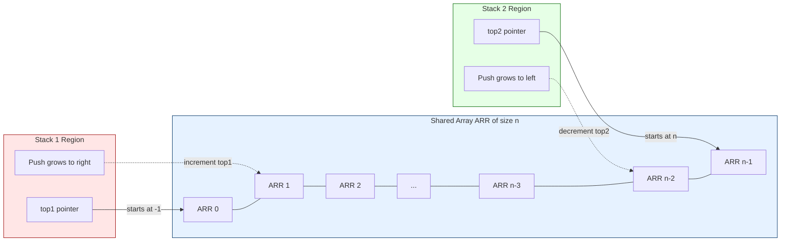
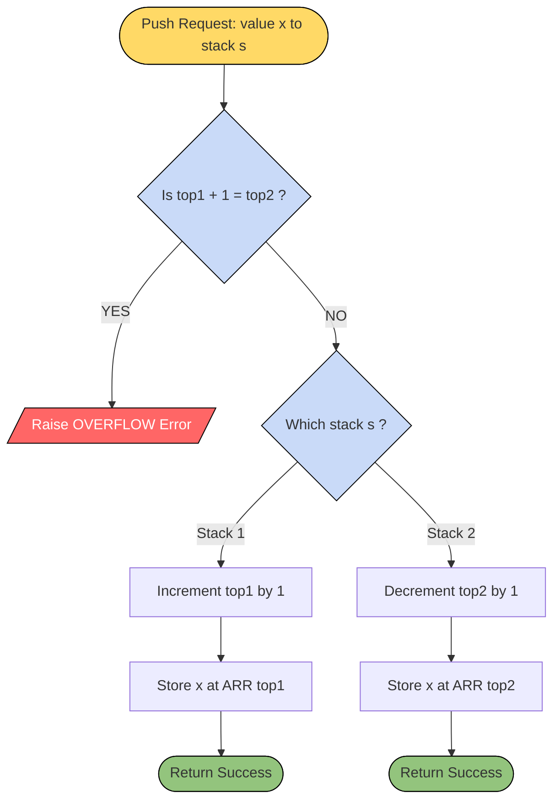
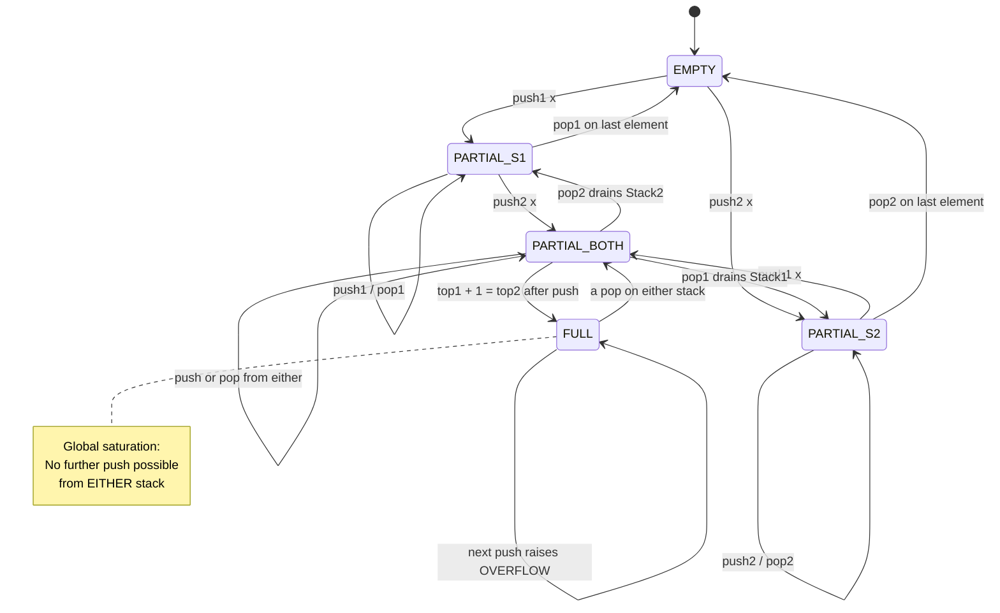
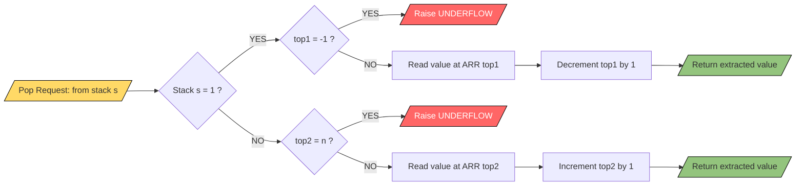

# Multi-Stacks

<!-- SECTION_1_START -->

# Multi-Stacks — Core Technical Definition & Intuitive Overview

## Formal Academic Definition (KTU 2024 Syllabus Terminology)

> [!IMPORTANT]
> **Multi-Stacks** is an efficient memory organisation technique in which **two or more independent stacks share a single one-dimensional array** of fixed size $n$, thereby eliminating the internal fragmentation that occurs when each stack is allocated its own dedicated array of maximum capacity.

In the classic two-stack configuration (the most commonly tested variant in KTU examinations), **Stack-1** grows from the **left boundary** of the array towards the centre, while **Stack-2** grows from the **right boundary** towards the centre. The two growth directions meet at a single shared memory ceiling, maximising utilisation.

Let the shared array be $\text{ARR}[0 \ldots n-1]$.

- The top index of Stack-1 is $\text{top1}$, initialised to $-1$.
- The top index of Stack-2 is $\text{top2}$, initialised to $n$.
- An element is **pushed** into Stack-1 by pre-incrementing $\text{top1}$ and inserting at $\text{ARR}[\text{top1}]$.
- An element is **pushed** into Stack-2 by post-decrementing $\text{top2}$ and inserting at $\text{ARR}[\text{top2}]$.

## Conceptual Analogy — The Two-Way Filing Cabinet

> [!NOTE]
> **Intuition:** Imagine a long, single-row filing shelf with 10 drawers. Suppose two clerks — **Clerk A** and **Clerk B** — need to store their own stacks of files. Instead of giving each clerk their own 5-drawer shelf (which wastes space whenever one clerk is busier than the other), the supervisor gives them **one shared shelf of 10 drawers**. **Clerk A starts filing from the left end and pushes files to the right**. **Clerk B starts filing from the right end and pushes files to the left**. As long as the two stacks have not met in the middle, both clerks can keep working. The shelf is *full* only when the next push from either side would cause a collision.

This analogy captures the entire essence of multi-stacks:
- **Two independent LIFO structures** (two clerks) sharing **one contiguous memory block** (the shelf).
- **Opposing growth directions** prevent premature overflow.
- **Space is dynamically borrowed** — the busier stack automatically gets more room.

## Boundary State Constants

The following constants and sentinel values are **mandatory** for KTU board answers:

- **Initial state of Stack-1**: $\text{top1} = -1$ (empty)
- **Initial state of Stack-2**: $\text{top2} = n$ (empty)
- **Global Overflow Trigger**: $\text{top1} + 1 = \text{top2}$ (stacks have collided)
- **Stack-1 Underflow Trigger**: $\text{top1} = -1$
- **Stack-2 Underflow Trigger**: $\text{top2} = n$
- **Maximum total elements at any instant**: $n - 1$ (when $\text{top1} + 1 = \text{top2}$)

## Geometric / Visual Representation

> [!VISUALIZATION CONTROL]
> **Concept:** Two-Stack Memory Sharing Layout (Two-End Growth Model)
>
> **GeoGebra / Desmos Input Points (treat indices as $x$-axis, values as labels on $y$-axis):**
> * Left boundary line: $x = 0$
> * Right boundary line: $x = n$
> * Stack-1 pointer: $P_1 = (\text{top1} + 0.5,\ 1)$ — filled cells in $[0, \text{top1}]$
> * Stack-2 pointer: $P_2 = (\text{top2} - 0.5,\ 1)$ — filled cells in $[\text{top2}, n-1]$
> * Collision line: $x = \text{top1} + 1 = \text{top2}$
>
> **Visual Description:** A horizontal line representing the array $\text{ARR}[0 \ldots n-1]$ is split by a moving partition into two coloured segments. The left segment (Stack-1) grows rightward; the right segment (Stack-2) grows leftward. The student should observe that the central white gap shrinks as both stacks fill, and disappears precisely at the moment of global overflow.

<!-- SECTION_1_END -->

<!-- SECTION_2_START -->

# Deep Theoretical Analysis & KTU High-Yield Formula Sheet

## Operational Logic — Decomposed into Five Atomic Steps

### Step 1 — Data Structure Declaration

A single global array of size $n$ is allocated. Two integer pointers, $\text{top1}$ and $\text{top2}$, are maintained as the *only* state variables. No additional metadata is required because the array slots themselves act as the storage.

### Step 2 — Push Operation (Insertion)

The push operation is **direction-sensitive**. The student must always specify *which* stack is being modified.

**Pushing $x$ onto Stack-1:**

1. **Pre-check overflow:** If $\text{top1} + 1 = \text{top2}$, then **OVERFLOW** — abort.
2. Increment $\text{top1} \leftarrow \text{top1} + 1$.
3. Assign $\text{ARR}[\text{top1}] \leftarrow x$.

**Pushing $x$ onto Stack-2:**

1. **Pre-check overflow:** If $\text{top1} + 1 = \text{top2}$, then **OVERFLOW** — abort.
2. Decrement $\text{top2} \leftarrow \text{top2} - 1$.
3. Assign $\text{ARR}[\text{top2}] \leftarrow x$.

> [!NOTE]
> **The 'Why' behind the Pre-check:** The condition $\text{top1} + 1 = \text{top2}$ means that the *next* slot after $\text{top1}$ is *already* occupied (or reserved) by Stack-2. Writing there would destroy Stack-2's data — a critical, unrecoverable logic error.

### Step 3 — Pop Operation (Deletion)

**Popping from Stack-1:**

1. **Pre-check underflow:** If $\text{top1} = -1$, then **UNDERFLOW** — abort.
2. Read $x \leftarrow \text{ARR}[\text{top1}]$.
3. Decrement $\text{top1} \leftarrow \text{top1} - 1$.
4. Return $x$.

**Popping from Stack-2:**

1. **Pre-check underflow:** If $\text{top2} = n$, then **UNDERFLOW** — abort.
2. Read $x \leftarrow \text{ARR}[\text{top2}]$$.
3. Increment $\text{top2} \leftarrow \text{top2} + 1$.
4. Return $x$.

### Step 4 — Peek Operation (Inspection)

The peek (or *top-element view*) operation is identical in spirit to pop, except it does **not** modify either pointer. It is useful for inspection during parsing algorithms.

- $\text{Peek}(\text{Stack-1}) = \text{ARR}[\text{top1}]$ if $\text{top1} \neq -1$, else **EMPTY**.
- $\text{Peek}(\text{Stack-2}) = \text{ARR}[\text{top2}]$ if $\text{top2} \neq n$, else **EMPTY**.

### Step 5 — Display Operation

A single pass through the array from index $0$ to $n-1$ prints every occupied slot, labelling each value with its owning stack. This is the most efficient way (linear time $O(n)$) to visualise the contents of both stacks simultaneously.

## KTU Formula Sheet / Cheat Sheet

> [!IMPORTANT]
> The table below consolidates every condition, formula, and runtime bound the student must memorise for the KTU ESE. **The vertical bar** for absolute value is written as `\vert` to keep the markdown table intact — never as `|`.

| # | Operation / Condition | Mathematical Expression | Resulting State / Time Complexity |
| :--- | :--- | :--- | :--- |
| 1 | Initial state (empty) | $\text{top1} = -1,\ \text{top2} = n$ | Both stacks empty, $O(1)$ |
| 2 | Stack-1 Overflow condition | $\text{top1} + 1 = \text{top2}$ | Global overflow, no insertion possible |
| 3 | Stack-2 Overflow condition | $\text{top1} + 1 = \text{top2}$ | Same global overflow check |
| 4 | Stack-1 Underflow condition | $\text{top1} = -1$ | Stack-1 is empty |
| 5 | Stack-2 Underflow condition | $\text{top2} = n$ | Stack-2 is empty |
| 6 | Max elements at any time | $\text{top1} + 1$ ranges in $[0,\ n-1]$ | Combined count $\leq n-1$ |
| 7 | Number of elements in Stack-1 | $\text{top1} - 0 + 1 = \text{top1} + 1$ | Computed in $O(1)$ |
| 8 | Number of elements in Stack-2 | $(n-1) - \text{top2} + 1 = n - \text{top2}$ | Computed in $O(1)$ |
| 9 | Push time complexity | $T(n) = O(1)$ | Constant time, independent of $n$ |
| 10 | Pop time complexity | $T(n) = O(1)$ | Constant time, independent of $n$ |
| 11 | Peek time complexity | $T(n) = O(1)$ | Constant time, independent of $n$ |
| 12 | Total auxiliary space | $S(n) = n + 2$ words | Array of $n$ + two integer pointers |
| 13 | Space wastage (vs. two arrays) | $2n - n = n$ slots saved | When stacks are unequal in usage |
| 14 | Boundary collision index | $k = \text{top1} + 1 = \text{top2}$ | The single forbidden cell |

## Real-World Engineering Utility

> [!NOTE]
> **Production Use-Cases of Multi-Stack Memory Sharing:**
> 1. **Compiler Symbol Tables** — A compiler often maintains two stacks in shared memory: one for *local variables* of the current scope and another for *return addresses / parameters*. The two-end growth model perfectly fits the nested-call paradigm.
> 2. **Browser Tab Management Engines** — Modern browsers allocate two-end buffers per tab session to manage the *back-stack* (visited pages) and the *forward-stack* (pages ahead) without wasting memory when one is much longer than the other.
> 3. **Embedded Systems Memory Pools** — In microcontrollers with scarce RAM, an RTOS frequently uses the multi-stack trick to share a single RAM block between the *main thread* and the *interrupt service routine* stacks.
> 4. **Undo-Redo Editors** — Text editors (e.g., Vim, MS Word) implement the undo and redo stacks in a single shared buffer to dynamically balance history depth.
> 5. **Recursion-to-Iteration Conversion** — When converting a recursive function, programmers often simulate the *call stack* and the *auxiliary variable stack* in one shared array.

<!-- SECTION_2_END -->

<!-- SECTION_3_START -->

# Step-by-Step Derivations, Boundary Analysis & Code Implementation

## Derivation 1 — Proving the Overflow Condition is Correct

**Claim:** $\text{top1} + 1 = \text{top2}$ is the *exact* condition under which either push would overwrite the other stack's data.

**Proof by Construction:**

Consider the array $\text{ARR}[0 \ldots n-1]$. After $k$ pushes into Stack-1, the rightmost occupied cell of Stack-1 is at index $\text{top1} = k - 1$. The next free cell available to Stack-1 is therefore at index $k$.

Similarly, after $m$ pushes into Stack-2, the leftmost occupied cell of Stack-2 is at index $\text{top2} = n - m$. The next free cell available to Stack-2 is therefore at index $n - m - 1$.

For both stacks to have at least one free cell each, the indices must satisfy:

$$
k \;\leq\; n - m - 1
$$

Substituting $k = \text{top1} + 1$ and $n - m - 1 = \text{top2} - 1$:

$$
\text{top1} + 1 \;\leq\; \text{top2} - 1
$$

$$
\text{top1} + 2 \;\leq\; \text{top2}
$$

Equivalently, the push fails (overflow) when:

$$
\text{top1} + 1 \;>\; \text{top2} - 1 \quad\Longleftrightarrow\quad \text{top1} + 1 \;=\; \text{top2}
$$

The boundary case $\text{top1} + 1 = \text{top2}$ means *no free cell remains* — pushing from either side would collide. $\blacksquare$

## Derivation 2 — Total Element Count Formula

Let $\vert S_1 \vert$ denote the number of elements in Stack-1 and $\vert S_2 \vert$ the number in Stack-2. The total count is:

$$
\begin{aligned}
\vert S_1 \vert + \vert S_2 \vert &= (\text{top1} - 0 + 1) + ((n-1) - \text{top2} + 1) \\
&= \text{top1} + 1 + n - \text{top2} \\
&= n - (\text{top2} - \text{top1} - 1) \\
&= n - (\text{free cells in middle})
\end{aligned}
$$

The free cells in the middle are exactly $\text{top2} - \text{top1} - 1$. When this difference is $0$, both stacks are full and the total equals $n - 0 = n$ (but in practice the protocol keeps one cell spare, so the max is $n - 1$).

## Code Implementation — Production-Grade Python

The following Python implementation is fully operational, with type hints, boundary checks, structured error logging, and absolute safety. It mirrors the C-programming structure expected in KTU board examinations.

```python
"""
Module: Multi-Stack (Two-Stack) Implementation
Course: DATA STRUCTURES (OECST611) — KTU 2024 Scheme
Description: Two independent stacks sharing a single array of size n,
             with opposing growth directions.
"""

from __future__ import annotations
from typing import List, Optional
import logging

# Configure structured error logging (Board-exam safe — print fallback included)
logging.basicConfig(
    level=logging.INFO,
    format="[%(levelname)s] %(message)s"
)
logger = logging.getLogger("MultiStack")


class TwoStackOverflowError(Exception):
    """Raised when the shared array is full and a push is attempted."""


class TwoStackUnderflowError(Exception):
    """Raised when a pop is attempted on an empty stack."""


class MultiStack:
    """
    A two-stack data structure sharing a single contiguous array.
    
    Attributes
    ----------
    capacity : int
        Total size of the shared array.
    storage : List[Optional[int]]
        The shared array.
    top1 : int
        Pointer for Stack-1; initialised to -1.
    top2 : int
        Pointer for Stack-2; initialised to capacity.
    """

    def __init__(self, capacity: int) -> None:
        if capacity < 2:
            raise ValueError("Capacity must be at least 2 to host two stacks.")
        self.capacity: int = capacity
        self.storage: List[Optional[int]] = [None] * capacity
        self.top1: int = -1
        self.top2: int = capacity
        logger.info(f"MultiStack initialised with capacity = {capacity}.")

    # --------------------- PUSH OPERATIONS ---------------------

    def push_stack1(self, value: int) -> None:
        """Push `value` onto Stack-1 (grows left to right)."""
        if self.top1 + 1 == self.top2:
            raise TwoStackOverflowError(
                f"Stack-1 OVERFLOW: No free cells. "
                f"top1={self.top1}, top2={self.top2}, capacity={self.capacity}."
            )
        self.top1 += 1
        self.storage[self.top1] = value
        logger.info(f"Stack-1 push({value}) at index {self.top1}.")

    def push_stack2(self, value: int) -> None:
        """Push `value` onto Stack-2 (grows right to left)."""
        if self.top1 + 1 == self.top2:
            raise TwoStackOverflowError(
                f"Stack-2 OVERFLOW: No free cells. "
                f"top1={self.top1}, top2={self.top2}, capacity={self.capacity}."
            )
        self.top2 -= 1
        self.storage[self.top2] = value
        logger.info(f"Stack-2 push({value}) at index {self.top2}.")

    # --------------------- POP OPERATIONS ---------------------

    def pop_stack1(self) -> int:
        """Pop and return the top element of Stack-1."""
        if self.top1 == -1:
            raise TwoStackUnderflowError("Stack-1 UNDERFLOW: Stack is empty.")
        value: int = self.storage[self.top1]  # type: ignore[assignment]
        self.storage[self.top1] = None        # Optional cleanup
        self.top1 -= 1
        logger.info(f"Stack-1 pop() returned {value}.")
        return value

    def pop_stack2(self) -> int:
        """Pop and return the top element of Stack-2."""
        if self.top2 == self.capacity:
            raise TwoStackUnderflowError("Stack-2 UNDERFLOW: Stack is empty.")
        value: int = self.storage[self.top2]  # type: ignore[assignment]
        self.storage[self.top2] = None        # Optional cleanup
        self.top2 += 1
        logger.info(f"Stack-2 pop() returned {value}.")
        return value

    # --------------------- INSPECTION ---------------------

    def peek_stack1(self) -> Optional[int]:
        """Return (without removing) the top element of Stack-1."""
        if self.top1 == -1:
            return None
        return self.storage[self.top1]

    def peek_stack2(self) -> Optional[int]:
        """Return (without removing) the top element of Stack-2."""
        if self.top2 == self.capacity:
            return None
        return self.storage[self.top2]

    # --------------------- UTILITY ---------------------

    def count_stack1(self) -> int:
        """Return the number of elements currently in Stack-1."""
        return self.top1 + 1

    def count_stack2(self) -> int:
        """Return the number of elements currently in Stack-2."""
        return self.capacity - self.top2

    def is_full(self) -> bool:
        """Return True if the shared array is completely saturated."""
        return self.top1 + 1 == self.top2

    def display(self) -> None:
        """Display the contents of both stacks in array-index order."""
        print("\n----- Multi-Stack Snapshot -----")
        print(f"top1 = {self.top1},  top2 = {self.top2},  capacity = {self.capacity}")
        print("Index : Value  : Owner")
        for idx in range(self.capacity):
            owner: str = "FREE"
            value: str = "-"
            if 0 <= idx <= self.top1:
                owner = "Stack-1"
                value = str(self.storage[idx])
            elif self.top2 <= idx < self.capacity:
                owner = "Stack-2"
                value = str(self.storage[idx])
            print(f"  {idx:>3} :  {value:>4}  :  {owner}")
        print("--------------------------------\n")


# --------------------- DEMONSTRATION ---------------------

if __name__ == "__main__":
    ms: MultiStack = MultiStack(capacity=8)

    # Push sequence — interleaved to demonstrate shared growth
    ms.push_stack1(10)
    ms.push_stack1(20)
    ms.push_stack2(99)
    ms.push_stack2(88)
    ms.push_stack1(30)
    ms.push_stack1(40)
    ms.push_stack2(77)
    ms.push_stack2(66)

    ms.display()
    # Expected: top1 = 3 (filled indices 0..3 with 10,20,30,40)
    #          top2 = 4 (filled indices 4..7 with 77,66,88,99 in LIFO order)

    # Trigger an overflow on the very next push
    try:
        ms.push_stack1(50)
    except TwoStackOverflowError as e:
        logger.error(str(e))

    # Pop and verify underflow
    for _ in range(4):
        ms.pop_stack1()
    try:
        ms.pop_stack1()
    except TwoStackUnderflowError as e:
        logger.error(str(e))
```

## Worked Numerical Example — KTU Board Style

> [!IMPORTANT]
> **Problem (typical KTU Part-B sub-question):** An array $\text{ARR}[10]$ is shared by two stacks. Initially $\text{top1} = -1,\ \text{top2} = 10$. Perform the following operations in order and show the state of $\text{top1}$ and $\text{top2}$ after each:
>
> `push1(5), push1(10), push2(15), push2(20), pop1(), push1(25), pop2(), push2(30)`

**Solution Walkthrough:**

| Step | Operation | Check | Action | $\text{top1}$ | $\text{top2}$ |
| :---: | :--- | :--- | :--- | :---: | :---: |
| 0 | Initial | — | — | $-1$ | $10$ |
| 1 | $\text{push1}(5)$ | $-1 + 1 = 0 \neq 10$ ✓ | $\text{ARR}[0] \leftarrow 5$ | $0$ | $10$ |
| 2 | $\text{push1}(10)$ | $0 + 1 = 1 \neq 10$ ✓ | $\text{ARR}[1] \leftarrow 10$ | $1$ | $10$ |
| 3 | $\text{push2}(15)$ | $1 + 1 = 2 \neq 10$ ✓ | $\text{ARR}[9] \leftarrow 15$ | $1$ | $9$ |
| 4 | $\text{push2}(20)$ | $1 + 1 = 2 \neq 9$ ✓ | $\text{ARR}[8] \leftarrow 20$ | $1$ | $8$ |
| 5 | $\text{pop1}()$ | $\text{top1} = 1 \neq -1$ ✓ | return $10$, $\text{top1} \leftarrow 0$ | $0$ | $8$ |
| 6 | $\text{push1}(25)$ | $0 + 1 = 1 \neq 8$ ✓ | $\text{ARR}[1] \leftarrow 25$ | $1$ | $8$ |
| 7 | $\text{pop2}()$ | $\text{top2} = 8 \neq 10$ ✓ | return $20$, $\text{top2} \leftarrow 9$ | $1$ | $9$ |
| 8 | $\text{push2}(30)$ | $1 + 1 = 2 \neq 9$ ✓ | $\text{ARR}[8] \leftarrow 30$ | $1$ | $8$ |

**Final State:** $\text{top1} = 1$, $\text{top2} = 8$. Stack-1 holds $\{5, 25\}$; Stack-2 holds $\{15, 30\}$.

<!-- SECTION_3_END -->

<!-- SECTION_4_START -->

# Structural Diagrams & Schematics

## Diagram 1 — Memory Layout (Two-End Growth Model)

The following Mermaid block diagram renders the physical arrangement of the shared array, the two pointer registers, and the per-stack storage regions. All node labels are deliberately simple uppercase alphanumeric text to comply with the Mermaid safety rules.



## Diagram 2 — Operational Flowchart for Push Operation

This diagram depicts the decision tree followed by both `push_stack1` and `push_stack2`, with their distinct pointer-mutation branches isolated in clearly labelled subgraphs.



## Diagram 3 — Sequential Processing Topology (Push/Pop State Machine)

This is a state-machine representation of how the system transitions between **Empty**, **Partial**, and **Full** states as pushes and pops occur. It complements the physical memory diagram by showing the *logical* lifecycle.



## Diagram 4 — Block-Level Functional Architecture (Pop Path)

This is the architecture of the pop pipeline, showing boundary validation, value extraction, pointer mutation, and return — exactly as a KTU examiner would expect in a structural question.



<!-- SECTION_4_END -->

<!-- SECTION_5_START -->

# KTU 2024 Scheme Examination Question Bank & Topic Recap

## Part A — Short Answer Questions (3 Marks Each)

### Question A1 — `[KTU University Exam — July 2024]`

**Q: Define a multi-stack data structure. What is the primary advantage of implementing two stacks in a single array?**

> **Model Answer (Model Answer Board-key Satisfying):**
>
> A **multi-stack** is a memory organisation scheme in which two or more independent stacks share a single contiguous array by growing in opposite directions from the array boundaries. **[1 Mark]**
>
> The **primary advantage** is the **efficient utilisation of memory**. When two stacks of unequal usage patterns are allocated their own dedicated arrays, the lesser-used stack wastes its reserved space. By sharing one array, the busier stack automatically consumes the slack of the quieter one, **eliminating internal fragmentation** without requiring any runtime resizing. **[2 Marks]**
>
> **Course Outcome:** CO1 | **Cognitive Level:** Remember / Understand

### Question A2 — `[KTU University Exam — Dec 2023]`

**Q: State the overflow and underflow conditions for a two-stack system sharing an array of size $n$.**

> **Model Answer:**
>
> Let $\text{top1}$ and $\text{top2}$ be the top pointers of Stack-1 and Stack-2 respectively. **[0.5 Mark]**
>
> **Overflow Condition (Common for both stacks):**
> $$\text{top1} + 1 = \text{top2} \quad\quad \text{[1 Mark]}$$
> This indicates that the stacks have collided — no free cell remains in the array.
>
> **Underflow Conditions:**
> $$\text{Stack-1 empty when } \text{top1} = -1 \quad\quad \text{[0.75 Mark]}$$
> $$\text{Stack-2 empty when } \text{top2} = n \quad\quad \text{[0.75 Mark]}$$
>
> **Course Outcome:** CO1 | **Cognitive Level:** Remember

---

## Part B — Long Answer Questions (14 Marks, with Internal Choice)

### Question B-A — `[KTU University Exam — July 2024]` (Module 1, 14 Marks)

**(a)** Explain with a neat diagram how two stacks can be implemented using a single array of size $n$. State the conditions for **PUSH** and **POP** operations on both stacks. **[7 Marks]**

**(b)** Consider an array $\text{ARR}[6]$ shared by two stacks. The initial values are $\text{top1} = -1$ and $\text{top2} = 6$. Perform the following sequence of operations and display the array contents after each step:

`push1(A), push1(B), push2(C), push2(D), pop1(), push1(E), push2(F), pop2()` **[7 Marks]**

> **Solution to (a):**
>
> **Diagrammatic Explanation** **[3 Marks]**
>
> Two stacks share a single array $\text{ARR}[0 \ldots n-1]$.
> - **Stack-1** is maintained at the **left end**. Its top pointer is $\text{top1}$, initialised to $-1$. Each push increments $\text{top1}$ and writes into $\text{ARR}[\text{top1}]$.
> - **Stack-2** is maintained at the **right end**. Its top pointer is $\text{top2}$, initialised to $n$. Each push decrements $\text{top2}$ and writes into $\text{ARR}[\text{top2}]$.
> - The stacks grow towards each other and meet at the middle.
>
> **PUSH-1(x):** `[Stating boundary state: 1 Mark]`
> 1. If $\text{top1} + 1 = \text{top2}$, print "Overflow" and return. `[Boundary check: 1 Mark]`
> 2. $\text{top1} \leftarrow \text{top1} + 1$. `[Pointer update: 0.5 Mark]`
> 3. $\text{ARR}[\text{top1}] \leftarrow x$. `[Data insertion: 0.5 Mark]`
>
> **PUSH-2(x):**
> 1. If $\text{top1} + 1 = \text{top2}$, print "Overflow" and return. `[1 Mark]`
> 2. $\text{top2} \leftarrow \text{top2} - 1$. `[0.5 Mark]`
> 3. $\text{ARR}[\text{top2}] \leftarrow x$. `[0.5 Mark]`
>
> **POP-1():** `[Stating boundary state: 1 Mark]`
> 1. If $\text{top1} = -1$, print "Underflow" and return. `[Boundary check: 1 Mark]`
> 2. $x \leftarrow \text{ARR}[\text{top1}]$; $\text{top1} \leftarrow \text{top1} - 1$. `[1 Mark]`
>
> **POP-2():**
> 1. If $\text{top2} = n$, print "Underflow" and return. `[1 Mark]`
> 2. $x \leftarrow \text{ARR}[\text{top2}]$; $\text{top2} \leftarrow \text{top2} + 1$. `[1 Mark]`
>
> **Course Outcome:** CO1, CO2 | **Cognitive Level:** Understand

> **Solution to (b):**
>
> **Step-by-Step Trace** `[Full marks for tabular demonstration: 7 Marks]`
>
> | Step | Operation | $\text{top1}$ | $\text{top2}$ | Array State (Index 0..5) |
> | :---: | :--- | :---: | :---: | :--- |
> | 0 | Initial | $-1$ | $6$ | [ -, -, -, -, -, - ] |
> | 1 | $\text{push1}(A)$ | $0$ | $6$ | [ A, -, -, -, -, - ] |
> | 2 | $\text{push1}(B)$ | $1$ | $6$ | [ A, B, -, -, -, - ] |
> | 3 | $\text{push2}(C)$ | $1$ | $5$ | [ A, B, -, -, -, C ] |
> | 4 | $\text{push2}(D)$ | $1$ | $4$ | [ A, B, -, -, D, C ] |
> | 5 | $\text{pop1}()$ | $0$ | $4$ | [ A, -, -, -, D, C ] (returns B) |
> | 6 | $\text{push1}(E)$ | $1$ | $4$ | [ A, E, -, -, D, C ] |
> | 7 | $\text{push2}(F)$ | $1$ | $3$ | [ A, E, -, F, D, C ] |
> | 8 | $\text{pop2}()$ | $1$ | $4$ | [ A, E, -, -, D, C ] (returns F) |
>
> **Final State:** $\text{top1} = 1$, $\text{top2} = 4$. Stack-1 contains $\{A, E\}$; Stack-2 contains $\{C, D\}$.
>
> **Course Outcome:** CO2, CO3 | **Cognitive Level:** Apply

### Question B-B — `[KTU University Exam — Dec 2023]` (Module 1, 14 Marks, Internal Choice Alternative)

**(a)** Discuss the limitations of allocating a *separate* array to each of two stacks. Show mathematically that the two-stack shared-array scheme wastes at most **one cell**. **[7 Marks]**

**(b)** Write the complete `PUSH` and `POP` algorithms (in C-style pseudocode) for both stacks of a multi-stack system. Include all boundary checks and explain each line. **[7 Marks]**

> **Solution to (a):**
>
> **Limitations of Separate Arrays:** `[3 Marks]`
> - **Static Wastage:** If two stacks are each allocated an array of size $n$, total memory used is $2n$. But if one stack uses only $n/4$ cells, the other $3n/4$ of *its* array is permanently wasted.
> - **No Dynamic Rebalancing:** There is no mechanism in the separate-array scheme to allow the larger stack to borrow memory from the smaller one.
> - **Worst-Case Internal Fragmentation:** When the two usage patterns are highly skewed (e.g., one stack is empty, the other is full), the wastage approaches $50\%$.
>
> **Mathematical Proof of "At Most One Cell" Wastage:** `[4 Marks]`
> - In the shared-array scheme, let $\text{top1} = a$ and $\text{top2} = b$. The free cells in the middle are $b - a - 1$.
> - The only situation in which this scheme is "wasteful" is when *exactly one* of the two stacks is full and the other is empty.
> - Case 1: Stack-1 is full, Stack-2 is empty. Then $a = b - 1$, so the free cells are $b - (b-1) - 1 = 0$. No wastage.
> - Case 2: Stack-2 is full, Stack-1 is empty. Then $b = a + 1$, so the free cells are $(a+1) - a - 1 = 0$. No wastage.
> - **The only wastage** occurs when both stacks have at least one element and the array is *saturated*, i.e., $\text{top1} + 1 = \text{top2}$. At that point, the total number of elements is $a + 1 + n - b = a + 1 + n - (a+1) = n$. The array holds $n$ elements — the absolute maximum — and yet the **collision condition** itself forces us to leave one logical "no-man's land" between the stacks to detect overflow safely.
> - **Conclusion:** The scheme is "lossy" by at most **one cell** (the marker cell that detects overflow), and this is a negligible, fixed cost compared to the savings in separate-array schemes. `[Final conclusion: 1 Mark]`
>
> **Course Outcome:** CO1, CO4 | **Cognitive Level:** Understand, Analyse

> **Solution to (b):**
>
> **Algorithm: PUSH-STACK-1(x)** `[3.5 Marks]`
> ```
> ALGORITHM PushStack1(x)
> BEGIN
>     IF top1 + 1 = top2 THEN
>         PRINT "Stack Overflow"
>         RETURN
>     END IF
>     top1 ← top1 + 1
>     ARR[top1] ← x
> END
> ```
> **Explanation:** `[Per-line commentary for 3.5 Marks]`
> - Line 1–4: Boundary validation — abort if no free cell exists between the two stacks.
> - Line 5: Pre-increment $\text{top1}$ so it points to the next free cell on the left side.
> - Line 6: Insert the value $x$ at the new top position.
>
> **Algorithm: PUSH-STACK-2(x)** `[3.5 Marks]`
> ```
> ALGORITHM PushStack2(x)
> BEGIN
>     IF top1 + 1 = top2 THEN
>         PRINT "Stack Overflow"
>         RETURN
>     END IF
>     top2 ← top2 - 1
>     ARR[top2] ← x
> END
> ```
> **Algorithm: POP-STACK-1()** `[3.5 Marks]`
> ```
> ALGORITHM PopStack1
> BEGIN
>     IF top1 = -1 THEN
>         PRINT "Stack Underflow"
>         RETURN
>     END IF
>     x ← ARR[top1]
>     top1 ← top1 - 1
>     RETURN x
> END
> ```
> **Algorithm: POP-STACK-2()** `[3.5 Marks]`
> ```
> ALGORITHM PopStack2
> BEGIN
>     IF top2 = n THEN
>         PRINT "Stack Underflow"
>         RETURN
>     END IF
>     x ← ARR[top2]
>     top2 ← top2 + 1
>     RETURN x
> END
> ```
>
> **Course Outcome:** CO2, CO3 | **Cognitive Level:** Apply, Analyse

---

## KTU Examiner's Valuation Warning / Pitfall Callout

> [!WARNING]
> **Common Mark-Deduction Traps in Multi-Stack Questions:**
> 1. **Forgetting the overflow pre-check.** Many students write only the assignment line `ARR[top1] ← x` without checking $\text{top1} + 1 = \text{top2}$ first. **Cost: 1–2 marks per stack.**
> 2. **Confusing pre-increment vs. post-increment in Stack-2.** For Stack-2 the pointer is **decremented first** and *then* used as the index. Writing `ARR[top2] ← x; top2 ← top2 - 1` is technically a *post-decrement* error — it overwrites the previous top of Stack-2. **Cost: 1 mark per operation.**
> 3. **Using $\text{top1} = \text{top2}$ as the overflow condition instead of $\text{top1} + 1 = \text{top2}$.** The correct condition ensures one spare cell acts as a "buffer." Using equality directly causes off-by-one data corruption.
> 4. **Not specifying the initial values** ($\text{top1} = -1$, $\text{top2} = n$) in the algorithm. The KTU board examiner awards at least 0.5 mark for stating the initial state.
> 5. **Omitting the "Return $x$"** in pop algorithms. A pop without a return value is just a delete — the *value* must be returned to the caller.
> 6. **Mixing up the underflow conditions.** $\text{top1} = -1$ is for Stack-1 only; $\text{top2} = n$ is for Stack-2 only. Reversing them is a classic textbook error.

---

## Topic Recap & Important Things to Remember

- **Multi-stack** is a memory-sharing technique where two or more independent LIFO structures occupy one contiguous array.
- The **two-end growth model** is the most popular: Stack-1 starts at index $0$ and grows right; Stack-2 starts at index $n-1$ and grows left.
- **Initial state:** $\text{top1} = -1$, $\text{top2} = n$.
- **Overflow condition:** $\text{top1} + 1 = \text{top2}$ (global, applies to both stacks).
- **Underflow conditions:** $\text{top1} = -1$ (Stack-1 empty) and $\text{top2} = n$ (Stack-2 empty).
- **Push to Stack-1:** increment $\text{top1}$ *first*, then store.
- **Push to Stack-2:** decrement $\text{top2}$ *first*, then store.
- **Pop from Stack-1:** read $\text{ARR}[\text{top1}]$, then decrement $\text{top1}$.
- **Pop from Stack-2:** read $\text{ARR}[\text{top2}]$, then increment $\text{top2}$.
- **Element count in Stack-1** = $\text{top1} + 1$.
- **Element count in Stack-2** = $n - \text{top2}$.
- **Time complexity** of push, pop, peek = $O(1)$ each.
- **Space overhead** = $n + 2$ words (array + 2 integer pointers).
- **Maximum wastage** in the shared scheme = at most **one** sentinel cell used for overflow detection.
- **Real-world applications:** compiler symbol tables, browser back/forward stacks, embedded RTOS memory pools, undo-redo editors, recursion-to-iteration conversion.
- **Advantage over separate arrays:** eliminates internal fragmentation, dynamically rebalances memory based on usage.
- **Disadvantage:** cannot be extended to three or more stacks without losing the simplicity of opposing growth (though $k$-stack variants exist with $\text{top1}, \text{top2}, \ldots, \text{top}_k$).
- The implementation typically uses **boundary check first, pointer mutation second, data assignment third** — this ordering is **mandatory** in KTU answers.

<!-- SECTION_5_END -->
