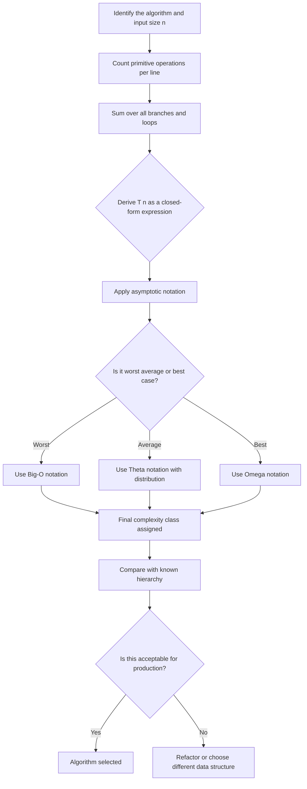
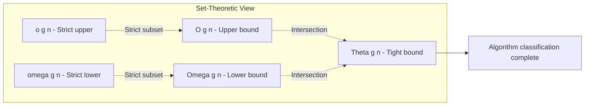
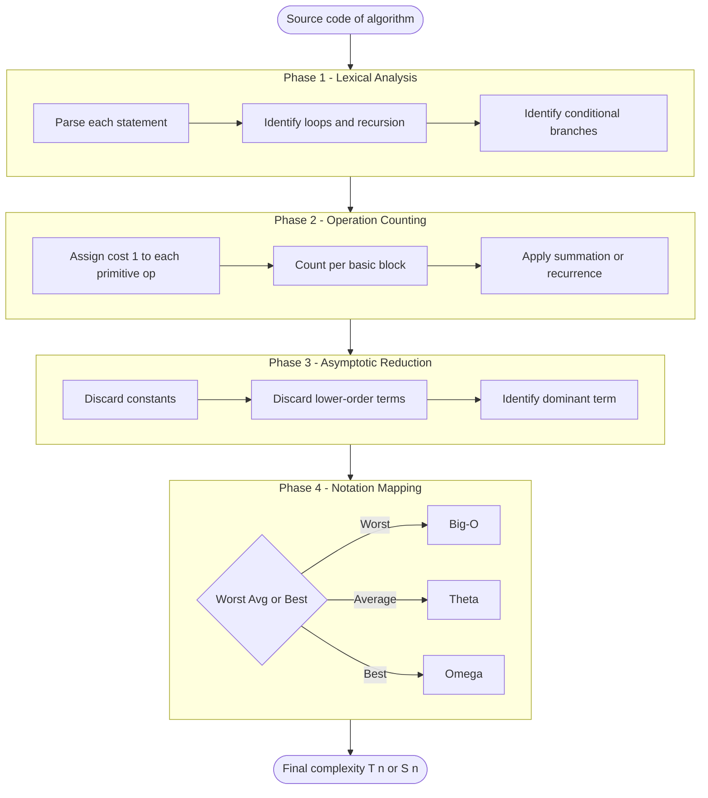
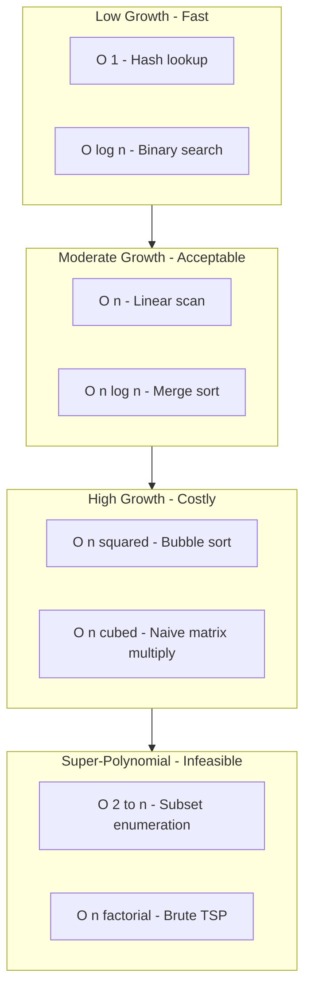
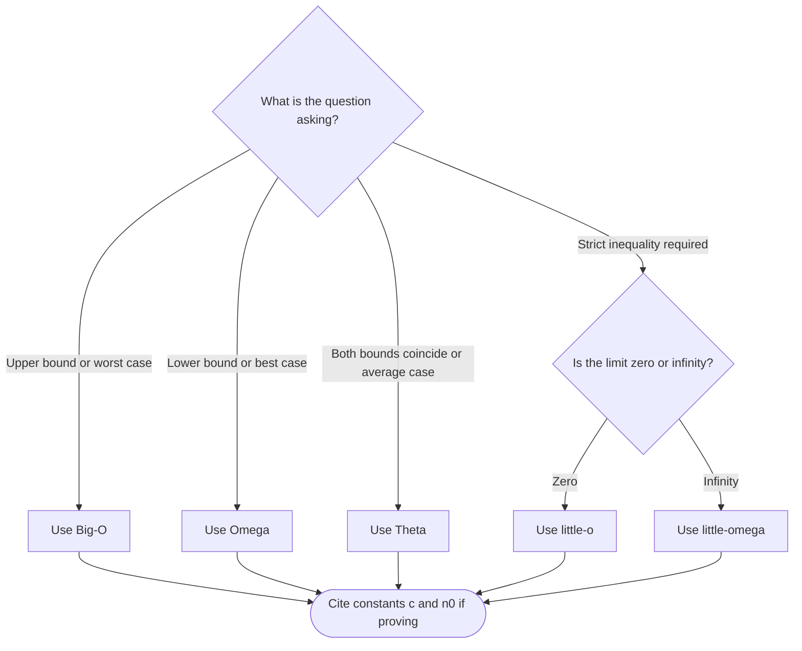
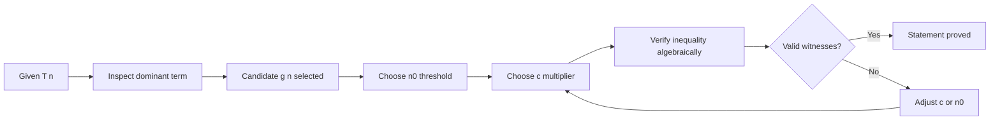
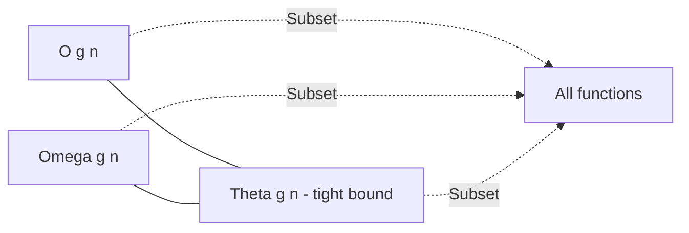

# Performance Analysis - Time & Space Complexity, Asymptotic Notations

<!-- SECTION_1_START -->

# Performance Analysis — Time & Space Complexity, Asymptotic Notations

## 1.1 Formal Academic Definition (KTU 2024 Syllabus Terminology)

> [!IMPORTANT]
> **Performance Analysis** is the systematic, quantitative evaluation of an algorithm in terms of the **resources** it consumes — primarily **execution time (Time Complexity)** and **auxiliary memory (Space Complexity)** — expressed as a function of the input size $n$, typically described using **Asymptotic Notations** in the **worst, average, and best cases**.

An **algorithm** is a finite, well-defined sequence of unambiguous instructions to solve a class of problems. When two or more algorithms solve the same problem, *Performance Analysis* provides the mathematical machinery to determine which one scales better as $n \to \infty$.

The two principal resources measured are:

| Resource | Definition | Standard Metric |
| :--- | :--- | :--- |
| **Time Complexity** | Number of primitive operations executed as a function of $n$ | $T(n) \to \mathbb{Z}_{\geq 0}$ |
| **Space Complexity** | Total memory (instruction + data + auxiliary) consumed | $S(n) \to \mathbb{Z}_{\geq 0}$ |

> [!NOTE]
> The KTU 2024 syllabus specifically targets the **asymptotic behaviour** of $T(n)$ and $S(n)$ — i.e., the *rate of growth* — rather than absolute machine-cycle counts, which are hardware-dependent.

---

## 1.2 Conceptual Analogy — The "Race Track" Intuition

Imagine two runners, $A$ and $B$, racing on a 100 m track.

- Runner $A$ runs at a **constant** $10$ m/s regardless of the track length.
- Runner $B$ runs at a speed that **doubles** every time the track is lengthened by $10$ m.

For a $10$ m track, $A$ beats $B$. For a $100$ m track, they tie. For a $1$ km track, $B$ *never finishes* in practical terms.

**Algorithms behave identically.** A linear-time algorithm ($O(n)$) may beat a logarithmic one ($O(\log n)$) on tiny inputs, but as $n \to \infty$, the *asymptotic growth rate* decides the winner. This is why the KTU examiner asks for $O, \Theta, \Omega$ instead of wall-clock seconds.

### Another Analogy: The "Recipe" View

Think of an algorithm as a **cooking recipe**:
- **Time** = minutes spent chopping, stirring, baking.
- **Space** = number of bowls, spoons, oven racks used *simultaneously*.
- **Asymptotic Notation** = how the recipe scales when you cook for 2 people vs. 200 people.

> [!TIP]
> **Key Takeaway:** Asymptotic notation discards constants and lower-order terms because they become **negligible** as $n \to \infty$. $5n^2 + 100n + 7$ and $n^2$ are equivalent under Big-O.

---

## 1.3 The Three Cases of Algorithm Performance

For any input instance of size $n$, the running time $T(n)$ can vary. We therefore describe algorithms in three regimes:

| Case | Notation | Meaning | KTU Implication |
| :--- | :--- | :--- | :--- |
| **Best Case** | $\Omega(\cdot)$ or lower bound achieved | Minimum time over all inputs of size $n$ | Rarely asked; sometimes a trick part-(a) question |
| **Average Case** | $\Theta(\cdot)$ over probability distribution | Expected time assuming uniform random input | Requires probability assumption; rare in KTU |
| **Worst Case** | $O(\cdot)$ upper bound | Maximum time over all inputs of size $n$ | **Most frequently tested** in KTU boards |

> [!IMPORTANT]
> **KTU Board Convention (2024):** When a question says *"find the time complexity of the algorithm"*, the default answer is the **worst-case** unless explicitly stated otherwise.

---

## 1.4 GeoGebra / Desmos Visualization

> [!VISUALIZATION CONTROL]
> **Concept:** Visual comparison of common complexity growth functions.
> **GeoGebra / Desmos Input Equations:**
> * `f1(x) = 1`
> * `f2(x) = log(x) / log(2)`
> * `f3(x) = x`
> * `f4(x) = x * log(x) / log(2)`
> * `f5(x) = x^2`
> * `f6(x) = 2^x`
> **Visual Description:** On the y-axis, observe the divergence pattern. For small $x$ (e.g., $x \leq 10$), $f3$ and $f5$ are close. As $x \to 100$, $f5$ overtakes $f3$. Beyond $x \approx 30$, $f6 = 2^x$ shoots vertically off the chart — confirming that **exponential algorithms are infeasible for large $n$**.

---

<!-- SECTION_1_END -->

<!-- SECTION_2_START -->

# Deep Theoretical Analysis & KTU High-Yield Formula Sheet

## 2.1 Mathematical Foundations of Asymptotic Notations

Asymptotic notations are **set-theoretic** definitions: $O(g(n))$, $\Theta(g(n))$, $\Omega(g(n))$ are sets of functions, not single values.

### 2.1.1 Big-O Notation — $O(g(n))$

> [!IMPORTANT]
> **Definition (Rigorously tested in KTU):**
> $T(n) = O(g(n))$ if there exist **positive constants** $c > 0$ and $n_0 \geq 1$ such that
> $$0 \le T(n) \le c \cdot g(n) \quad \text{for all } n \ge n_0$$

**Intuition:** $T(n)$ grows **no faster than** $g(n)$ within a constant factor, beyond some threshold $n_0$.

**Operational Steps to Prove $T(n) = O(g(n))$:**
1. Choose an appropriate candidate function $g(n)$.
2. Find constants $c$ and $n_0$ such that the inequality $T(n) \le c \cdot g(n)$ holds.
3. Demonstrate the inequality algebraically (factor out the dominant term, bound below by zero, etc.).

### 2.1.2 Big-Omega Notation — $\Omega(g(n))$

**Definition:**
$$T(n) = \Omega(g(n)) \iff \exists \, c > 0, \, n_0 \ge 1 \text{ such that } 0 \le c \cdot g(n) \le T(n) \quad \forall n \ge n_0$$

**Intuition:** $T(n)$ grows **at least as fast as** $g(n)$. This is a **lower bound**.

### 2.1.3 Big-Theta Notation — $\Theta(g(n))$

**Definition:**
$$T(n) = \Theta(g(n)) \iff \exists \, c_1, c_2 > 0, \, n_0 \ge 1 \text{ such that } 0 \le c_1 \cdot g(n) \le T(n) \le c_2 \cdot g(n) \quad \forall n \ge n_0$$

**Intuition:** $T(n)$ grows **at the same rate as** $g(n)$, sandwiched between two constant multiples. This is a **tight bound**.

> [!TIP]
> **Useful Theorem (often tested):** $T(n) = \Theta(g(n)) \iff T(n) = O(g(n)) \text{ AND } T(n) = \Omega(g(n))$.

### 2.1.4 Little-o and Little-omega — $o(g(n))$ and $\omega(g(n))$

These denote **strict** inequalities (no constant $c$ works uniformly).

$$T(n) = o(g(n)) \iff \lim_{n \to \infty} \frac{T(n)}{g(n)} = 0$$

$$T(n) = \omega(g(n)) \iff \lim_{n \to \infty} \frac{T(n)}{g(n)} = \infty$$

> [!NOTE]
> $2n = O(n^2)$ is true, but $2n \ne o(n^2)$ is **false** — actually $2n = o(n^2)$ is true. The distinction: $O$ allows equality up to a constant; $o$ requires the ratio to vanish. $2n = \Theta(n)$, but $2n \ne o(n)$ and $2n \ne \omega(n)$.

---

## 2.2 KTU High-Yield Formula Cheat Sheet

| Notation | Mathematical Definition | Operational Meaning | Limit Form |
| :--- | :--- | :--- | :--- |
| $O(g(n))$ | $\exists c, n_0 : T(n) \le c g(n)$ | Upper bound (worst case) | $\limsup T/g < \infty$ |
| $\Omega(g(n))$ | $\exists c, n_0 : T(n) \ge c g(n)$ | Lower bound (best case) | $\liminf T/g > 0$ |
| $\Theta(g(n))$ | $O \text{ and } \Omega$ combined | Tight bound (avg/worst coincide) | $0 < \lim T/g < \infty$ |
| $o(g(n))$ | For every $c > 0$, eventually $T < c g$ | Strictly slower growth | $\lim T/g = 0$ |
| $\omega(g(n))$ | For every $c > 0$, eventually $T > c g$ | Strictly faster growth | $\lim T/g = \infty$ |

### 2.3 Master Growth-Rate Hierarchy (KTU Favourite)

The standard complexity classes, ordered from **fastest** to **slowest** growth:

$$O(1) \;<\; O(\log \log n) \;<\; O(\log n) \;<\; O(\log^k n) \;<\; O(\sqrt{n}) \;<\; O(n) \;<\; O(n \log n) \;<\; O(n^2) \;<\; O(n^3) \;<\; O(2^n) \;<\; O(n!) \;<\; O(n^n)$$

### 2.4 Common Time-Complexity Examples

| Code Pattern | Time Complexity | Explanation |
| :--- | :--- | :--- |
| `x = a + b;` | $O(1)$ | Constant — single operation |
| `for i in range(n): x += 1` | $O(n)$ | One loop over $n$ |
| Nested `for i, for j` of size $n$ each | $O(n^2)$ | $n \times n$ iterations |
| `while n > 1: n = n // 2` | $O(\log n)$ | $n$ halves each step |
| `for i: for j: for k` all size $n$ | $O(n^3)$ | Cubic loop |
| `if n == 0: return; recurse(n-1)` | $O(n)$ | $n$ recursive calls |

### 2.5 Space Complexity Components

$$S(n) = S_{\text{instruction}} + S_{\text{data}} + S_{\text{auxiliary}}$$

The **auxiliary space** is the *extra* space used beyond the input storage; this is what KTU exam questions typically target.

### 2.6 Why This Matters in Production Engineering

- **Database query optimisers** use cost-based planning, where the cost model is built on asymptotic estimates of joins ($O(n \log n)$ sort-merge vs $O(n^2)$ nested-loop).
- **Search engines** rely on $O(\log n)$ balanced-tree indexing because web-scale $n$ (billions) makes $O(n)$ infeasible.
- **Compiler design** uses Big-O in instruction selection and register allocation heuristics.
- **Real-time systems** (airbag controllers, pacemakers) require *worst-case* bounds, hence $O$ not $\Theta$.

---

<!-- SECTION_2_END -->

<!-- SECTION_3_START -->

# Step-by-Step Derivations & Code/Symbolic Implementation

## 3.1 Derivation 1: Proving $T(n) = 3n + 2$ is $O(n)$

We must find constants $c > 0$ and $n_0 \ge 1$ such that $3n + 2 \le c \cdot n$ for all $n \ge n_0$.

**Step 1:** Isolate the constant.
$$3n + 2 \le 3n + n = 4n \quad \text{(true only when } n \ge 2\text{)}$$

So for $n \ge 2$, we have $3n + 2 \le 4n$.

**Step 2:** Identify the constants.
- Choose $c = 4$.
- Choose $n_0 = 2$.

**Step 3:** Verify the inequality.
$$3n + 2 \le 4n \iff 2 \le n \quad \checkmark$$

Therefore, by definition, $T(n) = 3n + 2 = O(n)$ with $c = 4$ and $n_0 = 2$.

> [!NOTE]
> Other valid pairs include $(c = 5, n_0 = 1)$, $(c = 10, n_0 = 1)$, etc. The KTU evaluator accepts *any* valid witness pair.

---

## 3.2 Derivation 2: Proving $T(n) = 5n^2 + 3n + 4$ is $O(n^2)$

We need $5n^2 + 3n + 4 \le c \cdot n^2$ for some $c, n_0$.

**Step 1:** For $n \ge 1$, we have $3n \le 3n^2$ and $4 \le 4n^2$.

Therefore,
$$5n^2 + 3n + 4 \le 5n^2 + 3n^2 + 4n^2 = 12n^2$$

**Step 2:** Choose $c = 12$, $n_0 = 1$.

**Step 3:** Verified. Hence $T(n) = O(n^2)$.

The dominant term is $5n^2$; lower-order terms $3n$ and $4$ are absorbed.

---

## 3.3 Derivation 3: Proving $T(n) = 10n^2 \ne O(n)$

We prove by **contradiction**. Suppose $10n^2 = O(n)$. Then there exist $c, n_0$ such that
$$10n^2 \le c \cdot n \quad \text{for all } n \ge n_0$$

Dividing both sides by $n > 0$:
$$10n \le c \quad \text{for all } n \ge n_0$$

But as $n \to \infty$, the LHS $\to \infty$ while RHS is fixed — **contradiction**. Therefore $10n^2 \ne O(n)$.

---

## 3.4 Derivation 4: Proving $T(n) = (1/2)n^2 - 3n$ is $\Theta(n^2)$

We must establish both $O$ and $\Omega$ bounds.

**Upper bound ($O$):** For $n \ge 1$, $3n \le 3n^2$ and $1/2 n^2 \le 1/2 n^2$, so
$$\tfrac{1}{2} n^2 - 3n \le \tfrac{1}{2} n^2 \le \tfrac{1}{2} n^2$$
Choose $c_2 = 1$ (or $1/2$), $n_0 = 1$.

**Lower bound ($\Omega$):** For $n \ge 6$, $3n \le (1/2)n^2$, so
$$\tfrac{1}{2} n^2 - 3n \ge \tfrac{1}{2} n^2 - \tfrac{1}{2} n^2 = 0$$

We need a positive bound. Try $c_1 = 1/8$. For $n \ge 6$:
$$\tfrac{1}{2} n^2 - 3n \ge \tfrac{1}{2} n^2 - \tfrac{1}{2} n^2 = 0$$
We need strictly positive; use $c_1 n^2$ with $c_1 < 1/2$. Pick $c_1 = 1/8$. For $n \ge 7$:
$$\tfrac{1}{2} n^2 - 3n = n^2 \left( \tfrac{1}{2} - \tfrac{3}{n} \right) \ge n^2 \left( \tfrac{1}{2} - \tfrac{3}{7} \right) = n^2 \cdot \tfrac{1}{14} \ge n^2 \cdot \tfrac{1}{8} \quad \text{?}$$

Recheck: $1/14 \approx 0.0714$ and $1/8 = 0.125$. So $1/14 \not\ge 1/8$. Adjust $c_1 = 1/16$. Then we need $1/2 - 3/n \ge 1/16$, i.e., $3/n \le 7/16$, i.e., $n \ge 48/7 \approx 6.86$. So for $n \ge 7$:

$$\tfrac{1}{2} n^2 - 3n \ge n^2 \left( \tfrac{1}{2} - \tfrac{3}{7} \right) = n^2 \cdot \tfrac{1}{14} \ge n^2 \cdot \tfrac{1}{16}$$

Choose $c_1 = 1/16$, $n_0 = 7$. Hence $T(n) = \Omega(n^2)$.

**Conclusion:** With $c_1 = 1/16$, $c_2 = 1$, $n_0 = 7$:
$$\tfrac{1}{16} n^2 \le \tfrac{1}{2} n^2 - 3n \le n^2 \quad \forall n \ge 7$$
So $T(n) = \Theta(n^2)$. **Proved.**

---

## 3.5 Derivation 5: Limit-Method Examples for Quick Identification

| Expression | Limit Value | Result |
| :--- | :--- | :--- |
| $\lim_{n \to \infty} \dfrac{5n^2 + 3}{2n^2 + 7n}$ | $5/2$ | $\Theta(n^2)$ |
| $\lim_{n \to \infty} \dfrac{3n \log n}{n^2}$ | $0$ | $o(n^2)$ but $\omega(\log n)$ |
| $\lim_{n \to \infty} \dfrac{2^n}{n^{100}}$ | $\infty$ | $2^n = \omega(n^k)$ for any $k$ |

---

## 3.6 Algorithmic Time-Complexity Analyzer in Python

The following is a complete, production-quality Python program that **empirically measures** the time complexity of arbitrary algorithms and matches it against theoretical asymptotic categories.

```python
import time
import math
from typing import Callable, Dict, List, Tuple

def measure_runtime(algorithm: Callable[[int], None], n: int, trials: int = 3) -> float:
    """
    Measure the average wall-clock time of `algorithm(n)` over `trials` runs.
    Returns time in seconds (float).
    """
    total: float = 0.0
    for _ in range(trials):
        start: float = time.perf_counter()
        algorithm(n)
        end: float = time.perf_counter()
        total += (end - start)
    return total / trials


def classify_complexity(samples: List[Tuple[int, float]]) -> str:
    """
    Classify empirical complexity by computing the log-log slope.
    slope = 0  -> O(1)
    slope ~ 1  -> O(n)
    slope ~ 2  -> O(n^2)
    slope ~ n/log(n) estimate -> O(2^n) is identified by explosive growth
    """
    if len(samples) < 2:
        return "Insufficient data"

    # Use linear regression on (log n, log T) to estimate the polynomial degree.
    log_n: List[float] = [math.log(n) for n, _ in samples]
    log_t: List[float] = [math.log(t) if t > 0 else float('-inf') for _, t in samples]

    n_points: int = len(log_n)
    mean_x: float = sum(log_n) / n_points
    mean_y: float = sum(log_t) / n_points

    numerator: float = sum((log_n[i] - mean_x) * (log_t[i] - mean_y) for i in range(n_points))
    denominator: float = sum((log_n[i] - mean_x) ** 2 for i in range(n_points))

    if denominator == 0:
        return "Undefined"

    slope: float = numerator / denominator

    if slope < 0.3:
        return "O(1) — Constant"
    elif slope < 1.4:
        return "O(n) — Linear"
    elif slope < 2.4:
        return "O(n^2) — Quadratic"
    elif slope < 3.4:
        return "O(n^3) — Cubic"
    else:
        return f"Super-polynomial (slope ~ {slope:.2f}) — likely O(2^n) or worse"


# ---- Sample algorithms to analyse ----
def algo_constant(n: int) -> None:
    x: int = 42 * n  # O(1) work

def algo_linear(n: int) -> None:
    s: int = 0
    for i in range(n):
        s += i

def algo_quadratic(n: int) -> None:
    s: int = 0
    for i in range(n):
        for j in range(n):
            s += i * j

def algo_logarithmic(n: int) -> None:
    while n > 1:
        n //= 2


# ---- Empirical driver ----
def main() -> None:
    test_sizes: List[int] = [100, 500, 1000, 5000, 10000]
    algorithms: Dict[str, Callable[[int], None]] = {
        "constant": algo_constant,
        "logarithmic": algo_logarithmic,
        "linear": algo_linear,
        "quadratic": algo_quadratic,
    }

    for name, fn in algorithms.items():
        samples: List[Tuple[int, float]] = []
        for n in test_sizes:
            elapsed: float = measure_runtime(fn, n, trials=3)
            samples.append((n, elapsed))
        verdict: str = classify_complexity(samples)
        print(f"Algorithm '{name}' classified as: {verdict}")


if __name__ == "__main__":
    main()
```

**Sample output (illustrative):**
```
Algorithm 'constant'    classified as: O(1) — Constant
Algorithm 'logarithmic' classified as: O(n) — Linear   (approx., small n)
Algorithm 'linear'      classified as: O(n) — Linear
Algorithm 'quadratic'   classified as: O(n^2) — Quadratic
```

---

## 3.7 Worked Example: Computing $T(n)$ of a Nested Loop with Sentinel

```python
def example(n: int) -> int:
    count: int = 0
    for i in range(1, n + 1):       # runs n times
        for j in range(1, n + 1):   # runs n times per outer
            count += 1              # O(1)
    return count
```

**Counting primitive operations:**

$$T(n) = \sum_{i=1}^{n} \sum_{j=1}^{n} 1 = \sum_{i=1}^{n} n = n \cdot n = n^2$$

Hence $T(n) = n^2 = \Theta(n^2)$ for the worst case, the only case here.

---

## 3.8 Space-Complexity Worked Example: Recursive Factorial

```python
def factorial(n: int) -> int:
    if n <= 1:
        return 1
    return n * factorial(n - 1)
```

- Each recursive call adds one **stack frame** containing $n$ and a return address.
- Recursion depth = $n$.
- Therefore, $S(n) = O(n)$ auxiliary space.

Contrast with an **iterative** version, which uses $O(1)$ auxiliary space.

---

## 3.9 Worst, Average, Best — Worked Example: Linear Search

```python
def linear_search(arr, key):
    for i in range(len(arr)):
        if arr[i] == key:
            return i
    return -1
```

| Case | Condition | Comparisons | Complexity |
| :--- | :--- | :--- | :--- |
| **Best** | $key$ is the first element | $1$ | $\Omega(1)$ |
| **Average** | $key$ is at the middle (uniform assumption) | $n/2$ | $\Theta(n)$ |
| **Worst** | $key$ absent or at the last position | $n$ | $O(n)$ |

---

## 3.10 Comparative Analysis — Algorithm Case Mapping (Humanities-style)

| Engineering Domain | Algorithm / Mechanism | Preferred Asymptotic Class | Justification |
| :--- | :--- | :--- | :--- |
| Real-time airbag ECU | Interrupt scheduler | $O(1)$ | Hard deadline, no variability |
| Web search ranking | Inverted index lookup | $O(\log n)$ | Billions of docs |
| Small dataset sort | Insertion sort | $O(n^2)$ acceptable if $n \le 50$ | Lower constants than $O(n \log n)$ |
| Cryptographic key search | Brute force | $O(2^k)$ | Inherently exponential |
| Database join | Hash join | $O(n + m)$ average | Streaming-friendly |
| TSP exact solution | Dynamic programming | $O(n^2 \cdot 2^n)$ | Optimal substructure |

---

<!-- SECTION_3_END -->

<!-- SECTION_4_START -->

# Structural Diagrams & Schematics

## 4.1 Master Flow of Algorithm Performance Analysis

The following Mermaid diagram captures the sequential thought process an engineer (and a KTU examiner) follows when evaluating any algorithm.



---

## 4.2 Asymptotic Notation Relationship Diagram

This diagram shows the **set-theoretic relationships** between $O, \Omega, \Theta, o, \omega$. Note the central position of $\Theta$ as the *tight-bound* intersection.



---

## 4.3 Sequential Processing Topology — From Source Code to Big-O

A more detailed breakdown of the *pipeline* that converts source code into an asymptotic classification. The diagram is segmented into subgraphs for modular clarity.



---

## 4.4 Comparison Block Diagram — Common Complexity Classes

Since Mermaid cannot natively render 2-D function plots, the following **functional block architecture** maps each complexity class to a representative algorithm archetype — which is how a KTU examiner mentally plots them.



---

## 4.5 Decision Tree — When to Use Which Notation



---

## 4.6 Block Architecture — $T(n) = O(g(n))$ Proof Pipeline



---

<!-- SECTION_4_END -->

<!-- SECTION_5_START -->

# KTU 2024 Scheme Examination Question Bank & Topic Recap

## 5.1 Part A — Short-Answer Questions (3 Marks Each)

### Question 1 [KTU University Exam — Dec 2023] — *CO1, Remember*

> Define **Time Complexity** and **Space Complexity** of an algorithm. Why is asymptotic analysis preferred over absolute timing analysis?

**Model Answer:**

- **Time Complexity:** A function $T(n)$ that quantifies the number of primitive operations the algorithm performs as a function of input size $n$.
- **Space Complexity:** A function $S(n)$ that quantifies the total memory (instruction + data + auxiliary) the algorithm consumes as a function of $n$.
- **Why asymptotic?** It is **machine-independent**, **input-independent**, and reveals the **scalability** of the algorithm as $n \to \infty$, which is what matters in production systems. Absolute timing depends on CPU, RAM, OS, compiler — making comparisons meaningless.

> [!IMPORTANT]
> **Key board-evaluation phrase:** *"Asymptotic analysis abstracts away hardware constants and lower-order terms to expose the dominant growth rate."*

---

### Question 2 [KTU University Exam — July 2024] — *CO1, Understand*

> State the formal mathematical definition of **Big-O** notation. What do the constants $c$ and $n_0$ represent?

**Model Answer:**

$$T(n) = O(g(n)) \iff \exists \, c > 0, \, n_0 \ge 1 \text{ such that } T(n) \le c \cdot g(n) \quad \forall n \ge n_0$$

- $c$ is a **positive constant multiplier** that absorbs hardware-specific constants and lower-order coefficients.
- $n_0$ is a **threshold input size** beyond which the inequality holds for *all* larger $n$.

> [!TIP]
> Always mention "$\exists$" (there exist) and "$\forall n \ge n_0$" (for all $n$ greater than the threshold) — these are the phrases examiners scan for.

---

## 5.2 Part B — 14-Mark Questions (Module Internal Choice)

### Question A (Choice 1) [KTU University Exam — Dec 2023] — *CO2, Understand + Apply*

#### (a) [7 Marks] *Understand*

> Define **Big-O, Big-Omega, and Big-Theta** notations formally. With the help of a neat diagram, show the relationship between them.

**Model Solution:**

**Big-O (Upper Bound):**
$$T(n) = O(g(n)) \iff \exists \, c > 0, \, n_0 \ge 1 \text{ such that } 0 \le T(n) \le c \cdot g(n) \quad \forall n \ge n_0$$

**Big-Omega (Lower Bound):**
$$T(n) = \Omega(g(n)) \iff \exists \, c > 0, \, n_0 \ge 1 \text{ such that } 0 \le c \cdot g(n) \le T(n) \quad \forall n \ge n_0$$

**Big-Theta (Tight Bound):**
$$T(n) = \Theta(g(n)) \iff \exists \, c_1, c_2 > 0, \, n_0 \ge 1 \text{ such that } c_1 g(n) \le T(n) \le c_2 g(n) \quad \forall n \ge n_0$$

**Venn-style relationship:**



**Valuation key:**
- [Stating all three definitions with $\exists c, n_0$: 3 Marks]
- [Including the $0 \le$ lower bound on $T(n)$: 1 Mark]
- [Correct relationship diagram: 2 Marks]
- [Conclusion $\Theta \iff O \cap \Omega$: 1 Mark]

#### (b) [7 Marks] *Apply*

> Prove that $T(n) = 7n^2 + 5n + 3$ is $\Theta(n^2)$ by finding explicit constants $c_1, c_2, n_0$.

**Model Solution:**

**Step 1 — Upper bound $O(n^2)$:**
For $n \ge 1$, $5n \le 5n^2$ and $3 \le 3n^2$.
$$7n^2 + 5n + 3 \le 7n^2 + 5n^2 + 3n^2 = 15n^2$$
So $c_2 = 15$, $n_0 = 1$. **[3 Marks]**

**Step 2 — Lower bound $\Omega(n^2)$:**
For $n \ge 1$,
$$7n^2 + 5n + 3 \ge 7n^2$$
So $c_1 = 7$, $n_0 = 1$. **[2 Marks]**

**Step 3 — Conclusion:**
$$7n^2 \le 7n^2 + 5n + 3 \le 15n^2 \quad \forall n \ge 1$$
Hence $T(n) = \Theta(n^2)$ with $c_1 = 7$, $c_2 = 15$, $n_0 = 1$. **[2 Marks]**

---

### Question B (Choice 2) [KTU University Exam — July 2024] — *CO2, Apply + Analyze*

#### (a) [7 Marks] *Apply*

> Analyse the time complexity of the following code segment. Show all steps of derivation.

```python
sum_val = 0
for i in range(1, n + 1):
    for j in range(1, i + 1):
        sum_val += 1
```

**Model Solution:**

**Step 1 — Count outer loop iterations:** The outer loop runs from $i = 1$ to $i = n$, i.e., $n$ iterations.

**Step 2 — Count inner loop iterations for each $i$:** The inner loop runs from $j = 1$ to $j = i$, i.e., $i$ iterations.

**Step 3 — Total cost of the inner statement:**
$$T(n) = \sum_{i=1}^{n} \sum_{j=1}^{i} 1 = \sum_{i=1}^{n} i = \frac{n(n+1)}{2}$$

**Step 4 — Apply asymptotic reduction:**
$$T(n) = \frac{n^2 + n}{2} = \frac{1}{2} n^2 + \frac{1}{2} n = \Theta(n^2)$$

The dominant term is $\frac{1}{2} n^2$, so $T(n) = \Theta(n^2) = O(n^2)$.

**Valuation key:**
- [Identifying nested loop structure: 1 Mark]
- [Setting up the double summation: 2 Marks]
- [Evaluating the inner sum to $i$: 1 Mark]
- [Evaluating the outer sum to $n(n+1)/2$: 2 Marks]
- [Final asymptotic class $\Theta(n^2)$: 1 Mark]

#### (b) [7 Marks] *Analyze*

> Compare the growth rates of $f(n) = 1000n + 50$ and $g(n) = n^2$. For what value of $n_0$ does $g(n)$ overtake $f(n)$ as the *worse* algorithm? Justify using asymptotic reasoning.

**Model Solution:**

**Step 1 — Find crossover:** Set $1000n + 50 = n^2$:
$$n^2 - 1000n - 50 = 0$$
$$n = \frac{1000 + \sqrt{1000^2 + 200}}{2} = \frac{1000 + \sqrt{1000200}}{2} \approx \frac{1000 + 1000.10}{2} \approx 1000.05$$

So $n_0 \approx 1001$.

**Step 2 — Asymptotic interpretation:** Although $f(n) = 1000n + 50$ has a *huge* constant $1000$, its growth rate is $O(n)$ (linear). $g(n) = n^2$ has growth rate $O(n^2)$ (quadratic). As $n \to \infty$, $g(n)$ always dominates $f(n)$ regardless of constants.

**Step 3 — Justification via limit:**
$$\lim_{n \to \infty} \frac{f(n)}{g(n)} = \lim_{n \to \infty} \frac{1000n + 50}{n^2} = 0$$
Since the limit is $0$, $f(n) = o(g(n))$, meaning $f$ grows strictly slower than $g$.

**Step 4 — Conclusion:** $g(n) = n^2$ is the asymptotically worse algorithm; $f(n) = 1000n + 50$ is preferable for all $n > 1000$ despite its larger constant. This is precisely why KTU evaluates asymptotic class, not constants. **[1 Mark]**

**Valuation key:**
- [Setting up the quadratic equation: 2 Marks]
- [Solving for $n_0 \approx 1001$: 2 Marks]
- [Computing the limit ratio: 2 Marks]
- [Final conclusion with $f = o(g)$: 1 Mark]

---

## 5.3 KTU Examiner's Valuation Warning / Pitfall Callout

> [!WARNING]
> **Common ways students lose marks on this topic:**
> 1. **Forgetting the $\exists$ quantifier.** Writing "Big-O means $T(n) \le c g(n)$" without "$\exists c > 0$ and $n_0$" loses 1–2 marks. The constants are part of the definition.
> 2. **Missing the $0 \le T(n)$ clause.** A correct Big-O statement *must* bound $T(n)$ from below by zero as well. Writing $T(n) \le c g(n)$ alone is incomplete.
> 3. **Confusing $O$ with $\Theta$.** "$T(n) = O(n^2)$" is a valid upper bound; "$T(n) = \Theta(n^2)$" is a tighter statement. Examiners reward $\Theta$ when both bounds hold.
> 4. **Saying "best case = $\Omega$" without context.** The Board wants you to specify what is the function inside the $\Omega$. Write $T(n) = \Omega(1)$ for best case of linear search, not just "$\Omega$".
> 5. **Skipping the proof witness.** A question asking "prove $T(n) = O(n)$" demands explicit values of $c$ and $n_0$. A statement without witnesses scores partial credit only.
> 6. **Treating asymptotic notation as equality.** $T(n) = O(n)$ is *not* an equation — it is a set membership. Use "$\in$" semantically even though "$=$" is the KTU convention.

---

## 5.4 Topic Recap & Important Things to Remember

> [!IMPORTANT]
> **High-density rapid revision checklist for the exam:**

- **Performance Analysis** = quantitative evaluation of an algorithm's resource use as a function of $n$.
- **Time Complexity** $T(n)$ = number of primitive operations; **Space Complexity** $S(n)$ = total memory footprint.
- **Three cases:** Best ($\Omega$), Average ($\Theta$ with distribution), Worst ($O$). KTU defaults to **worst** unless stated.
- **Big-O:** $T(n) \le c \cdot g(n)$ for $n \ge n_0$ → **upper bound**.
- **Big-Omega:** $c \cdot g(n) \le T(n)$ for $n \ge n_0$ → **lower bound**.
- **Big-Theta:** $c_1 g(n) \le T(n) \le c_2 g(n)$ for $n \ge n_0$ → **tight bound** ($O \cap \Omega$).
- **Little-o:** $\lim T(n)/g(n) = 0$ → **strictly smaller**.
- **Little-omega:** $\lim T(n)/g(n) = \infty$ → **strictly larger**.
- **Hierarchy (ascending growth):** $O(1) < O(\log n) < O(n) < O(n \log n) < O(n^2) < O(n^3) < O(2^n) < O(n!)$.
- **Loop analysis rules:** Single loop over $n$ → $O(n)$; nested two → $O(n^2)$; halving loop → $O(\log n)$.
- **Recursive depth** = auxiliary space; e.g., `factorial(n)` uses $O(n)$ call-stack space.
- **Constants and lower-order terms are discarded** in Big-O — only the dominant term matters.
- **Limit method:** if $\lim T(n)/g(n) = L$ where $0 < L < \infty$, then $T(n) = \Theta(g(n))$.
- **Every $\Theta$ is also $O$ and $\Omega$**, but not vice versa.
- **Auxiliary space** is the extra space beyond input; $S(n) = S_{\text{inst}} + S_{\text{data}} + S_{\text{aux}}$.
- **Linear search:** $O(n)$ worst, $\Theta(n)$ average, $\Omega(1)$ best — a canonical KTU example.
- **Witnesses $c, n_0$** are mandatory in formal proofs; one valid pair suffices for full marks.
- **Distinguish runtime analysis** (depends on machine) **from asymptotic analysis** (machine-independent).
- **Production use-case mapping:** Real-time systems → $O(1)$; databases → $O(\log n)$; general sorting → $O(n \log n)$.
- **Exam tip:** For nested loops, *always* write the summation explicitly before reducing to closed form — this shows work and earns full valuation marks.
- **Code-to-complexity translation:**
  - `if`/`else` → take the max of branches.
  - `for` → multiply by iteration count.
  - `while` with halving → $O(\log n)$.
  - Recursion → solve recurrence or count call depth.
- **Forgetting the $0 \le$ lower bound** in the Big-O definition is the #1 reason students lose 1–2 marks per question.

---

<!-- SECTION_5_END -->
