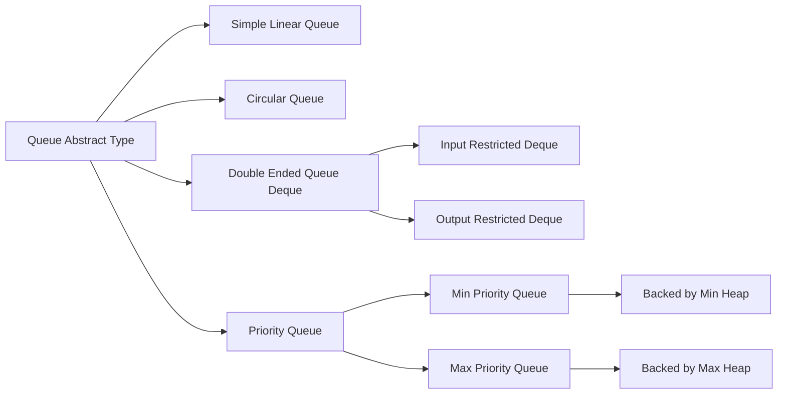
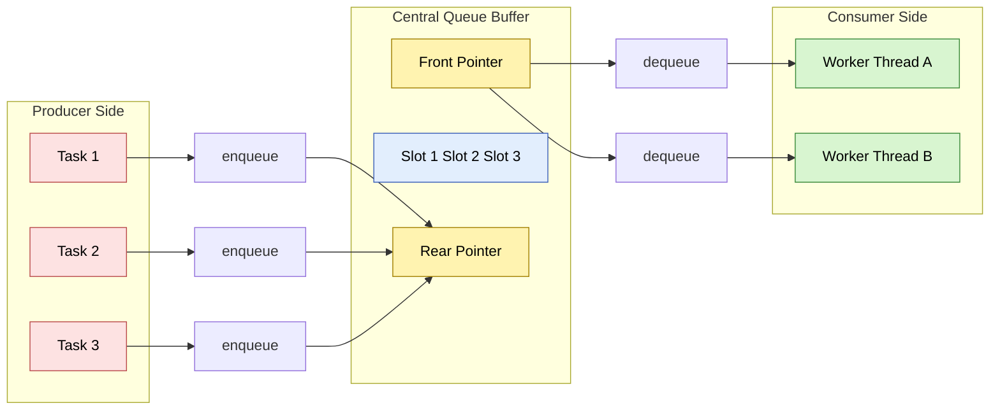
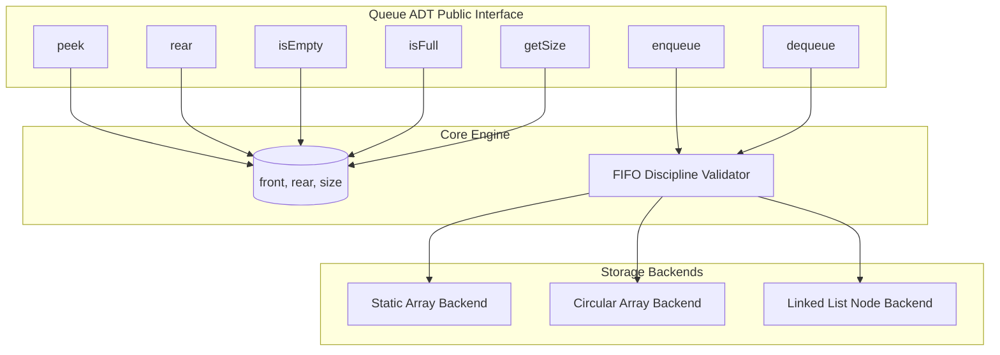

# Queues

<!-- SECTION_1_START -->
# Queues — Core Technical Definition & Intuitive Overview

## Formal Academic Definition (KTU 2024 Syllabus Terminology)

> [!IMPORTANT]
> **Definition:** A **Queue** is a linear, ordered data structure that obeys the **First-In-First-Out (FIFO)** discipline. Insertions (enqueues) are performed at one end called the **rear** (also called the *tail* or *back*), and deletions (dequeues) are performed at the other end called the **front** (also called the *head*). The element that has been in the queue the longest is always removed first.

Two distinguished access points exist:
- **Front pointer ($F$)** → tracks the deletion end.
- **Rear pointer ($R$)** → tracks the insertion end.

Both pointers move in a **single direction** ($F \to R$) under normal operating conditions, never backwards, which guarantees the FIFO invariant.

## Conceptual Analogy / Intuition

> [!NOTE]
> **Real-world analogy — The Movie Ticket Counter Line:** Imagine 30 students standing in a single-file line to buy tickets. The student who arrived **first** stands at the **front** of the line and will be served **first**. As new students arrive, they join the line at the **rear**. No one cuts in from the middle. The cashier always picks the front-most student. That is exactly how a queue behaves: **the earliest arrival is the earliest to leave** — FIFO.

A second useful analogy is a **printer queue**: print jobs are spooled into a buffer in the order the user clicked *Print*, and the printer processes them strictly in that same order.

## Key Terminology in Bold

- **Enqueue** — The operation of inserting an element at the **rear** of the queue.
- **Dequeue** — The operation of removing an element from the **front** of the queue.
- **Front ($F$)** — Index/pointer of the next element to be dequeued.
- **Rear ($R$)** — Index/pointer of the last enqueued element.
- **Overflow** — Condition that arises when `enqueue` is attempted on a *full* queue (array implementation only).
- **Underflow** — Condition that arises when `dequeue` is attempted on an *empty* queue.
- **Time complexity standard:** every core queue operation runs in **$O(1)$** time.

## Visualizing the Queue State

> [!VISUALIZATION CONTROL]
> **Concept:** Dynamic state transitions of a linear queue during `enqueue` and `dequeue` operations.
> **GeoGebra / Desmos Input Equations:**
> * Draw a horizontal axis $x \in [0, 7]$ with eight equally spaced slots.
> * Use the discrete sequence `Q = {(0,10), (1,20), (2,30), (3,40), (4,50)}` to plot the current contents of a queue of capacity 5.
> * Mark the **front** point at the leftmost filled cell and the **rear** point at the rightmost filled cell with bold arrows.
> **Visual Description:** As you dequeue, the front arrow shifts right by one unit; as you enqueue, the rear arrow shifts right by one unit. The shaded cells are *occupied*; the unshaded cells are *vacant* (memory is wasted in a non-circular array queue once the rear reaches the end).

<!-- SECTION_1_END -->

<!-- SECTION_2_START -->
# Deep Theoretical Analysis & KTU High-Yield Formula Sheet

## The Two-End Discipline

Unlike a **stack** (LIFO — one end, Last-In-First-Out), a queue has **two independently managed ends**. This asymmetry is the *defining* property of the data structure. The implication is that **insertion and deletion never interfere with each other**, which makes the queue the natural choice whenever *order of arrival* must be preserved.

## Logical Step-by-Step Operational Model

1. **Initialization** → Set $F \leftarrow -1$ and $R \leftarrow -1$ (empty state in the array convention).
2. **Enqueue(x)** → If the queue is not full, increment $R$ by 1 and store $x$ at position $R$. Special-case the first insertion so that $F$ is also set to $0$.
3. **Dequeue()** → If the queue is not empty, read the value at $F$, increment $F$ by 1, and return the value. If after this $F > R$, reset both to $-1$ (queue becomes empty again).
4. **Peek()** → Return the value at index $F$ without modifying any pointer.
5. **isEmpty()** → Return *true* if $F = -1$ (or equivalently $F > R$).
6. **isFull()** → Return *true* if $R = \text{SIZE} - 1$.

> [!NOTE]
> **The "Memory Waste" Problem of the Linear Queue:** Even when there is free space at the front (because elements were dequeued), the `rear` pointer has hit the array's last index, so new elements cannot be inserted. This is resolved by using a **Circular Queue**, where the indices wrap around modulo the capacity.

## Classification of Queue Variants

- **Simple (Linear) Queue** → Straight-line FIFO; suffers from the memory-waste problem.
- **Circular Queue** → The last position connects back to the first via modulo arithmetic. Solves the wastage problem and is the most common array implementation in production.
- **Double-Ended Queue (Deque)** → Insertion and deletion are allowed at **both** ends. Special cases are the *Input-Restricted Deque* (insertion only at rear) and the *Output-Restricted Deque* (deletion only at front).
- **Priority Queue** → Each element carries a priority key; the element with the highest priority is dequeued first. Internally implemented using heaps to give $O(\log n)$ operations.

## KTU High-Yield Formula Sheet / Cheat Sheet

| # | Concept | Formula / Condition | Symbol Meaning | Notes |
|---|---------|--------------------|----------------|-------|
| 1 | Empty condition (linear) | $F = -1$ or $F > R$ | $F$ = front, $R$ = rear | Trigger for underflow check |
| 2 | Full condition (linear) | $R = N - 1$ | $N$ = array capacity | Trigger for overflow check |
| 3 | Enqueue position (linear) | $R \leftarrow R + 1$ | new rear index | $F$ is set to $0$ on first insert |
| 4 | Dequeue position (linear) | $F \leftarrow F + 1$ | new front index | Reset when $F > R$ |
| 5 | Empty condition (circular) | $F = -1$ | both pointers equal $-1$ | Standard sentinel |
| 6 | Full condition (circular) | $(R + 1) \bmod N = F$ | one slot always kept empty | Prevents $F = R$ ambiguity |
| 7 | Enqueue index (circular) | $R \leftarrow (R + 1) \bmod N$ | wrap-around index | $O(1)$ always |
| 8 | Dequeue index (circular) | $F \leftarrow (F + 1) \bmod N$ | wrap-around index | $O(1)$ always |
| 9 | Current size (circular) | $(N - F + R) \bmod N + 1$ | when not empty | Alternative: maintain a counter |
| 10 | Time complexity | $O(1)$ per op | enq / deq / peek | for all well-engineered queues |
| 11 | Space complexity | $O(N)$ | array of $N$ slots | $N$ pre-declared |
| 12 | Linked-list space | $O(n)$ per node | $n$ = current length | dynamic, no wastage |

> [!IMPORTANT]
> **Critical pitfall:** In a circular queue, the condition $(R + 1) \bmod N = F$ is the *full* state — not $R = F$. Holding back one slot is a deliberate trade-off that lets us distinguish full from empty using only the two pointers.

## Real-World Engineering Utility

- **Operating Systems** → Round-Robin CPU scheduling, FCFS disk scheduling, I/O request buffering.
- **Networks** → Packet queues in routers (FIFO queues per interface), message brokers (RabbitMQ, Kafka segment logs).
- **Graph Algorithms** → Breadth-First Search (BFS) uses a queue to visit nodes level by level.
- **User-facing Systems** → Print spooling, call-center ACD (Automatic Call Distribution), live chat session buffers.
- **Compiler Design** → Symbol tables, register allocation queues.

<!-- SECTION_2_END -->

<!-- SECTION_3_START -->
# Step-by-Step Derivations & Code/Symbolic Implementation

## 3.1 Array-Based Linear Queue — Complete Python Implementation

```python
from __future__ import annotations
from typing import Any, List, Optional


class ArrayQueue:
    """
    Array-based linear (non-circular) queue.
    Capacity is fixed at construction time.
    All core operations run in O(1).
    """

    def __init__(self, capacity: int) -> None:
        if capacity <= 0:
            raise ValueError("capacity must be a positive integer")
        self._capacity: int = capacity
        self._data: List[Optional[Any]] = [None] * capacity
        self._front: int = -1
        self._rear: int = -1
        self._size: int = 0

    # ---------- O(1) state checks ----------
    def is_empty(self) -> bool:
        return self._size == 0

    def is_full(self) -> bool:
        return self._size == self._capacity

    def get_size(self) -> int:
        return self._size

    # ---------- O(1) core operations ----------
    def enqueue(self, value: Any) -> None:
        """Insert value at the rear. Raises OverflowError if full."""
        if self.is_full():
            raise OverflowError("Queue is full: cannot enqueue.")
        if self._front == -1:           # first-ever insertion
            self._front = 0
        self._rear += 1
        self._data[self._rear] = value
        self._size += 1

    def dequeue(self) -> Any:
        """Remove and return the value at the front. Raises IndexError if empty."""
        if self.is_empty():
            raise IndexError("Queue is empty: cannot dequeue.")
        value: Any = self._data[self._front]
        self._data[self._front] = None   # help garbage collection
        self._front += 1
        self._size -= 1
        if self._size == 0:              # queue became empty — reset pointers
            self._front = -1
            self._rear = -1
        return value

    def peek(self) -> Any:
        if self.is_empty():
            raise IndexError("Queue is empty: no front element.")
        return self._data[self._front]

    def rear(self) -> Any:
        if self.is_empty():
            raise IndexError("Queue is empty: no rear element.")
        return self._data[self._rear]

    def display(self) -> str:
        if self.is_empty():
            return "[ empty ]"
        return "[" + " | ".join(str(self._data[i]) for i in range(self._front, self._rear + 1)) + "]"
```

## 3.2 Array-Based Circular Queue — Complete Python Implementation

The circular queue resolves the memory-waste issue of the linear queue by using **modulo arithmetic** on the index updates.

```python
from __future__ import annotations
from typing import Any, List, Optional


class CircularQueue:
    """
    Circular queue backed by a fixed-size Python list.
    One slot is kept empty to distinguish 'full' from 'empty'.
    """

    def __init__(self, capacity: int) -> None:
        if capacity <= 0:
            raise ValueError("capacity must be a positive integer")
        self._capacity: int = capacity
        self._data: List[Optional[Any]] = [None] * capacity
        self._front: int = -1
        self._rear: int = -1
        self._size: int = 0

    def is_empty(self) -> bool:
        return self._size == 0

    def is_full(self) -> bool:
        # (rear + 1) % capacity == front  when not empty
        return self._size == self._capacity

    def enqueue(self, value: Any) -> None:
        if self.is_full():
            raise OverflowError("Circular queue is full.")
        if self._front == -1:
            self._front = 0
        self._rear = (self._rear + 1) % self._capacity
        self._data[self._rear] = value
        self._size += 1

    def dequeue(self) -> Any:
        if self.is_empty():
            raise IndexError("Circular queue is empty.")
        value: Any = self._data[self._front]
        self._data[self._front] = None
        if self._front == self._rear:        # removing the last element
            self._front = -1
            self._rear = -1
        else:
            self._front = (self._front + 1) % self._capacity
        self._size -= 1
        return value

    def peek(self) -> Any:
        if self.is_empty():
            raise IndexError("Circular queue is empty.")
        return self._data[self._front]

    def rear(self) -> Any:
        if self.is_empty():
            raise IndexError("Circular queue is empty.")
        return self._data[self._rear]

    def display(self) -> str:
        if self.is_empty():
            return "[ empty ]"
        i: int = self._front
        elements: List[str] = []
        while True:
            elements.append(str(self._data[i]))
            if i == self._rear:
                break
            i = (i + 1) % self._capacity
        return "[" + " | ".join(elements) + "]"
```

### Worked Trace — Circular Queue of Capacity 5

Let $N = 5$, with current pointers $F = 2$, $R = 1$ (wrapping). Suppose we call `enqueue(99)`:

$$
R_{\text{new}} = (R_{\text{old}} + 1) \bmod N
$$

$$
R_{\text{new}} = (1 + 1) \bmod 5 = 2 \bmod 5 = 2
$$

But wait — we must first check **is_full**:
$$
\text{full} \;\Longleftrightarrow\; (R + 1) \bmod N = F \;\Longleftrightarrow\; (1 + 1) \bmod 5 = 2 = F
$$

The condition holds ⇒ the queue is **full** ⇒ `enqueue(99)` raises `OverflowError`. No insertion occurs. This trace is exactly what KTU examiners test in 7-mark sub-parts.

## 3.3 Linked-List-Based Queue — Complete Python Implementation

A linked-list queue has *no* overflow problem (it grows as long as heap memory is available) and supports all operations in $O(1)$ time.

```python
from __future__ import annotations
from typing import Any, Optional


class _Node:
    """Private node class for the linked-list queue."""

    def __init__(self, value: Any) -> None:
        self.value: Any = value
        self.next: Optional["_Node"] = None


class LinkedListQueue:
    """Dynamic queue using a singly linked list with head and tail pointers."""

    def __init__(self) -> None:
        self._head: Optional[_Node] = None   # front of the queue
        self._tail: Optional[_Node] = None   # rear of the queue
        self._size: int = 0

    def is_empty(self) -> bool:
        return self._size == 0

    def get_size(self) -> int:
        return self._size

    def enqueue(self, value: Any) -> None:
        new_node: _Node = _Node(value)
        if self._tail is None:                 # empty queue
            self._head = new_node
            self._tail = new_node
        else:
            self._tail.next = new_node
            self._tail = new_node
        self._size += 1

    def dequeue(self) -> Any:
        if self._head is None:
            raise IndexError("Queue is empty: cannot dequeue.")
        value: Any = self._head.value
        self._head = self._head.next
        if self._head is None:                 # queue became empty
            self._tail = None
        self._size -= 1
        return value

    def peek(self) -> Any:
        if self._head is None:
            raise IndexError("Queue is empty.")
        return self._head.value

    def display(self) -> str:
        if self._head is None:
            return "[ empty ]"
        parts: List[str] = []
        cur: Optional[_Node] = self._head
        while cur is not None:
            parts.append(str(cur.value))
            cur = cur.next
        return "[ front -> " + " | ".join(parts) + " <- rear ]"
```

## 3.4 Operational Complexity Derivation

For an array-based queue, every pointer update is a single arithmetic operation and a single array write. Therefore the cost is bounded by a constant regardless of the queue size $N$:

$$
T_{\text{enqueue}} = T_{\text{dequeue}} = T_{\text{peek}} = \Theta(1)
$$

For the linked-list implementation, each operation is exactly one pointer dereference and (for `enqueue` / `dequeue`) one pointer assignment. Hence:

$$
T_{\text{enqueue}} = T_{\text{dequeue}} = T_{\text{peek}} = \Theta(1)
$$

The space complexity differs:

$$
S_{\text{array}} = \Theta(N) \quad \text{(capacity reserved up front)}
$$

$$
S_{\text{linked}} = \Theta(n) \quad \text{(n = current number of elements, plus per-node overhead)}
$$

## 3.5 Worked Numerical Trace — Linear Queue

Suppose $N = 5$, $F = -1$, $R = -1$ (empty). Perform:
`enqueue(10), enqueue(20), enqueue(30), dequeue(), dequeue(), enqueue(40)`.

Step-by-step pointer state after each operation:

| Step | Operation | Front $F$ | Rear $R$ | Queue contents (left → right) | Size |
|------|-----------|-----------|----------|-------------------------------|------|
| 0 | initial state | $-1$ | $-1$ | [ empty ] | 0 |
| 1 | enqueue(10) | $0$ | $0$ | [ 10 ] | 1 |
| 2 | enqueue(20) | $0$ | $1$ | [ 10, 20 ] | 2 |
| 3 | enqueue(30) | $0$ | $2$ | [ 10, 20, 30 ] | 3 |
| 4 | dequeue() | $1$ | $2$ | [ 20, 30 ] | 2 |
| 5 | dequeue() | $2$ | $2$ | [ 30 ] | 1 |
| 6 | enqueue(40) | $2$ | $3$ | [ 30, 40 ] | 2 |

> After the 6th step, $F=2$ occupies the *third* slot of the array, even though slots $0$ and $1$ are free. The next enqueue would still proceed because $R=3 < N-1 = 4$, but once two more enqueues fire, $R$ will saturate at $4$ and overflow will be reported even though slots $0$ and $1$ are wasted. This illustrates the **linear-queue memory waste** problem that motivates the circular queue.

## 3.6 Compact Demonstration Driver

```python
def _demo() -> None:
    print("=== Array-based Linear Queue ===")
    aq: ArrayQueue = ArrayQueue(5)
    for v in (10, 20, 30):
        aq.enqueue(v)
    print("after 3 enqueues:", aq.display(), "| size =", aq.get_size())
    print("dequeued:", aq.dequeue())
    print("dequeued:", aq.dequeue())
    print("after 2 dequeues:", aq.display(), "| size =", aq.get_size())
    print("front =", aq.peek(), ", rear =", aq.rear())

    print()
    print("=== Circular Queue ===")
    cq: CircularQueue = CircularQueue(4)
    for v in (1, 2, 3):
        cq.enqueue(v)
    print("after 3 enqueues:", cq.display())
    cq.dequeue()
    cq.enqueue(4)            # wraps around
    cq.enqueue(5)            # wraps around
    print("after wrap-around dequeues and enqueues:", cq.display())

    print()
    print("=== Linked-List Queue ===")
    lq: LinkedListQueue = LinkedListQueue()
    for v in ("A", "B", "C"):
        lq.enqueue(v)
    print(lq.display())
    print("dequeued:", lq.dequeue())
    print(lq.display())


if __name__ == "__main__":
    _demo()
```

The expected output (for the user to verify) shows all three queue types behaving identically from a logical standpoint — the difference is purely in *how* the storage is organised and *whether* memory is wasted.

<!-- SECTION_3_END -->

<!-- SECTION_4_START -->
# Structural Diagrams & Schematics

## 4.1 Queue Operation Flowchart (Mermaid)

```mermaid
flowchart TD
    start([Start Operation]) --> checkKind{Operation type?}
    checkKind -->|enqueue x| isFullA{isFull?}
    isFullA -- yes --> ovr[Throw OverflowError]
    isFullA -- no  --> incR[R = R + 1 mod N]
    incR --> storeQ[Q[R] = x]
    storeQ --> sizeInc[size = size + 1]
    sizeInc --> end1([Return success])

    checkKind -->|dequeue| isEmptyA{isEmpty?}
    isEmptyA -- yes --> und[Throw UnderflowError]
    isEmptyA -- no  --> readVal[x = Q[F]]
    readVal --> incF[F = F + 1 mod N]
    incF --> sizeDec[size = size - 1]
    sizeDec --> reset{size = 0 ?}
    reset -- yes --> resetPtr[F = -1, R = -1]
    reset -- no  --> end2([Return x])
    resetPtr --> end2
```

## 4.2 Hierarchy of Queue Variants (Mermaid)



## 4.3 Sequential Processing Topology — Producer/Consumer with a Queue (Mermaid)



## 4.4 Block-Level Functional Architecture — Modular Components of a Queue ADT (Mermaid)



<!-- SECTION_4_END -->

<!-- SECTION_5_START -->
# KTU 2024 Scheme Examination Question Bank & Topic Recap

---

## Part A — Short Answer Questions (3 Marks each)

### Q1. [KTU University Exam — July 2024]
**Differentiate between a Stack and a Queue. State one real-world application for each.**

**Model Answer (3 marks):**

| Aspect | Stack | Queue |
|--------|-------|-------|
| Principle | **LIFO** (Last In First Out) | **FIFO** (First In First Out) |
| Access ends | Single end (`top`) for both push and pop | Two distinct ends: `front` for delete, `rear` for insert |
| Pointer count | One pointer (`top`) | Two pointers (`front` and `rear`) |
| Order of removal | Most recently inserted element is removed first | Earliest inserted element is removed first |
| Real-world use | Undo operation in a text editor, function call stack in compilers, backtracking algorithms | Print spooling, CPU scheduling (Round Robin), Breadth-First Search on graphs |
| Key operations | `push`, `pop`, `peek` | `enqueue`, `dequeue`, `peek`, `rear` |

> **[Valuation tip: 1 mark for the LIFO vs FIFO distinction, 1 mark for the access-end difference, 1 mark for the real-world example. Do NOT swap the examples — examiners often deduct a full mark when the wrong example is paired with the wrong structure.]**

---

### Q2. [KTU University Exam — Dec 2023]
**Explain the "memory waste" problem of a simple linear queue. How is it overcome in a circular queue?**

**Model Answer (3 marks):**

- In a simple linear queue, the `rear` pointer moves only **forward** (i.e. $R \leftarrow R+1$). **[1 mark]**
- Once $R$ reaches $N-1$, no more elements can be inserted, even though slots at the *front* are now free because of earlier dequeues. This unrecoverable dead space is called **memory waste** (also called *false overflow*). **[1 mark]**
- In a circular queue, the indices **wrap around** using modulo arithmetic: $R \leftarrow (R+1) \bmod N$ and $F \leftarrow (F+1) \bmod N$. This reuses the vacated slots, eliminating memory waste. **[1 mark]**

---

## Part B — 14-Mark Module Internal Choice

### Question A (14 Marks) — [KTU University Exam — July 2024 Model Paper]

**(a)** *Define a queue data structure. Write algorithms to perform `ENQUEUE` and `DEQUEUE` operations on a linear queue implemented using an array. Discuss its time complexity. **[7 marks]***

**(b)** *Implement a circular queue using an array. Write the algorithm for `ENQUEUE` and `DEQUEUE` and explain how overflow and underflow are handled. **[7 marks]***

---

#### Model Solution — Part A(a)

**Definition (2 marks):**
A queue is a linear data structure that follows the FIFO principle. Insertions happen at the rear and deletions at the front.

**ENQUEUE Algorithm (2 marks):**
```
procedure ENQUEUE(Q, N, REAR, FRONT, ITEM)
    if REAR = N - 1 then
        print "Queue Overflow"
        return
    end if
    if FRONT = -1 then
        FRONT ← 0
    end if
    REAR ← REAR + 1
    Q[REAR] ← ITEM
end procedure
```

**DEQUEUE Algorithm (2 marks):**
```
procedure DEQUEUE(Q, FRONT, REAR, ITEM)
    if FRONT = -1 then
        print "Queue Underflow"
        return
    end if
    ITEM ← Q[FRONT]
    if FRONT = REAR then
        FRONT ← -1
        REAR  ← -1
    else
        FRONT ← FRONT + 1
    end if
    return ITEM
end procedure
```

**Time Complexity Discussion (1 mark):**
Both operations consist of a constant number of comparisons and assignments. Hence $T(n) = O(1)$ for both enqueue and dequeue, independent of the queue size $N$.

> **[Incremental valuation key: Stating boundary state values: 2 marks. Writing the ENQUEUE logic: 2 marks. Writing the DEQUEUE logic: 2 marks. Stating time complexity: 1 mark.]**

---

#### Model Solution — Part A(b)

**Circular queue full vs empty (3 marks):**

The circular queue uses one slot as a sentinel. Hence:
- **Empty condition** → $F = -1$ (sentinel value, used to mark a queue with zero elements). After the first `enqueue`, $F$ is set to $0$. The condition $F = -1$ remains a valid empty test.
- **Full condition** → $(R + 1) \bmod N = F$. We deliberately keep one slot unused so that the two states never collide.

**ENQUEUE Algorithm (2 marks):**
```
procedure CQ_ENQUEUE(Q, N, FRONT, REAR, ITEM)
    if (REAR + 1) mod N = FRONT then
        print "Circular Queue Overflow"
        return
    end if
    if FRONT = -1 then
        FRONT ← 0
    end if
    REAR ← (REAR + 1) mod N
    Q[REAR] ← ITEM
end procedure
```

**DEQUEUE Algorithm (2 marks):**
```
procedure CQ_DEQUEUE(Q, N, FRONT, REAR, ITEM)
    if FRONT = -1 then
        print "Circular Queue Underflow"
        return
    end if
    ITEM ← Q[FRONT]
    if FRONT = REAR then
        FRONT ← -1
        REAR  ← -1
    else
        FRONT ← (FRONT + 1) mod N
    end if
    return ITEM
end procedure
```

> **[Incremental valuation key: Stating full condition: 1 mark. Stating empty condition: 1 mark. ENQUEUE logic: 2 marks. DEQUEUE logic: 2 marks. Explaining overflow handling: 1 mark.]**

---

### Question B (14 Marks) — [KTU University Exam — Dec 2023 Model Paper]

**(a)** *Explain the concept of a double-ended queue (deque). With neat diagrams, describe the operations `insertFront`, `insertRear`, `deleteFront`, and `deleteRear`. **[7 marks]***

**(b)** *Discuss four real-world applications of queues in computer science. For each application, identify the queue variant used and justify the choice. **[7 marks]***

---

#### Model Solution — Part B(a)

**Definition (2 marks):**
A **Deque** (Double-Ended Queue) is a queue in which insertions and deletions can be performed at **both** the front and the rear ends. It generalises both the stack and the queue.

**Variants (2 marks):**
- **Input-Restricted Deque** → Insertion only at the rear; deletion allowed at both ends.
- **Output-Restricted Deque** → Deletion only at the front; insertion allowed at both ends.

**Operation behaviour (3 marks):**

| Operation | Effect on the deque |
|-----------|---------------------|
| `insertFront(x)` | Add $x$ as the new first element. |
| `insertRear(x)`  | Add $x$ as the new last element. |
| `deleteFront()`  | Remove and return the first element. |
| `deleteRear()`   | Remove and return the last element. |

> **[Incremental valuation key: Deque definition: 2 marks. Two variants: 2 marks. Four operations with their effect: 3 marks.]**

---

#### Model Solution — Part B(b)

| # | Application | Queue Variant Used | Justification |
|---|-------------|--------------------|---------------|
| 1 | **CPU Scheduling — Round Robin** | Circular Queue | Each ready process gets a fixed time quantum; the scheduler loops through the process list indefinitely, which is naturally modelled as a circular buffer. |
| 2 | **Disk Scheduling — FCFS** | Simple Linear Queue | Disk I/O requests are honoured in the order they arrive, so a basic FIFO queue suffices. |
| 3 | **Breadth-First Search (BFS)** on graphs | Simple Linear Queue | BFS must visit nodes in the order they are discovered, which is exactly a FIFO of frontier nodes. |
| 4 | **Print Spooling in Operating Systems** | Simple Linear Queue (or Circular Queue in production) | Print jobs are placed in a buffer and printed in submission order; circular buffers are preferred in OS kernels to avoid memory waste. |
| 5 | **Call Center / ACD Systems** | Priority Queue | Incoming calls are routed by customer-tier priority (platinum, gold, silver), not by arrival order, so a priority queue is the correct choice. |

> **[Incremental valuation key: 1 mark per correct application + variant pair, 1 mark per correct justification. Total 4 applications × ~1.75 marks each = 7 marks.]**

---

> [!WARNING]
> **KTU Examiner's Valuation Warning / Pitfall Callout**
> 1. **Confusing `front = rear` with empty in circular queue** → Examiners *deduct 2 marks* if you treat $F = R$ as the empty condition for a circular queue. The correct empty state is $F = -1$ (or your own explicit sentinel).
> 2. **Forgetting to keep one slot empty in circular queue** → If your full-check is $F = R$, you cannot distinguish full from empty. Examiners expect the convention $(R+1) \bmod N = F$. State this assumption explicitly at the top of your answer.
> 3. **Mixing up Stack terminology (push/pop) with Queue terminology (enqueue/dequeue)** in Part A — KTU uses strict terminology, and an answer that says *"push"* for a queue loses credit.
> 4. **Forgetting to reset pointers to -1** when the last element is dequeued in a linear queue — this is a *favourite* 1-mark trap.

---

## Topic Recap & Important Things to Remember

> [!IMPORTANT]
> **High-density revision checklist for Queues (Module 1 — Basic Concepts of Data Structures).**

- **Principle:** A queue is a **linear** data structure that obeys **FIFO (First-In-First-Out)**.
- **Two access points:** `front` (deletion) and `rear` (insertion) — they move *independently* and *in one direction* under FIFO.
- **Six core operations:** `enqueue`, `dequeue`, `peek/front`, `rear`, `isEmpty`, `isFull`. All run in **$O(1)$** time.
- **Underflow** occurs when `dequeue` is called on an empty queue; **Overflow** occurs when `enqueue` is called on a full *array-based* queue.
- **Linear queue — empty condition:** $F = -1$ **or** $F > R$. **Full condition:** $R = N - 1$.
- **Linear queue — memory waste problem:** Once $R$ reaches $N-1$, no further enqueue is allowed even if the front half is empty.
- **Circular queue — fix:** Use modulo arithmetic so the rear wraps around: $R \leftarrow (R+1) \bmod N$.
- **Circular queue — full condition:** $(R+1) \bmod N = F$ (one slot is intentionally kept unused as a sentinel).
- **Circular queue — empty condition:** $F = -1$ (or $F = R = -1$).
- **Linked-list queue:** No overflow (until the heap is exhausted); `enqueue` inserts at tail, `dequeue` removes at head, both $O(1)$.
- **Deque:** Insertion and deletion allowed at **both** ends. Variants are *input-restricted* and *output-restricted*.
- **Priority queue:** Dequeue order is decided by element priority, not arrival. Backed by a **heap** for $O(\log n)$ operations.
- **Key applications:** Round-Robin CPU scheduling, FCFS disk scheduling, BFS traversal, print spooling, I/O buffering, message brokers (Kafka, RabbitMQ).
- **Time complexities to memorize:** Enqueue/Dequeue/Peek $\to O(1)$ for all well-engineered queue variants.
- **Space complexities:** Array $\to O(N)$; Linked list $\to O(n)$ where $n$ is the current size.
- **Exam traps to avoid:** (i) treating $F = R$ as empty in a circular queue, (ii) using stack vocabulary in a queue answer, (iii) forgetting to state the modulo-arithmetic wrap-around, (iv) failing to reset $F$ and $R$ to $-1$ when the last element is dequeued.

<!-- SECTION_5_END -->
