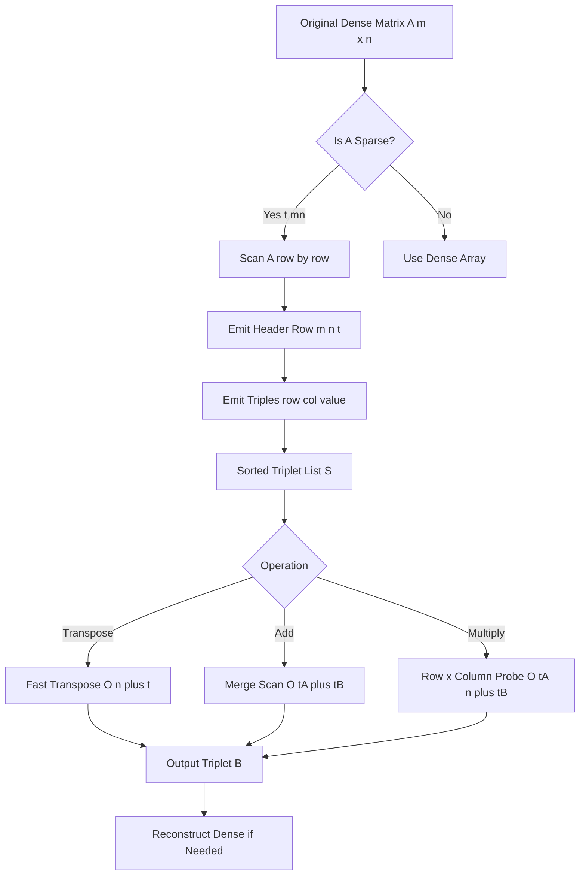
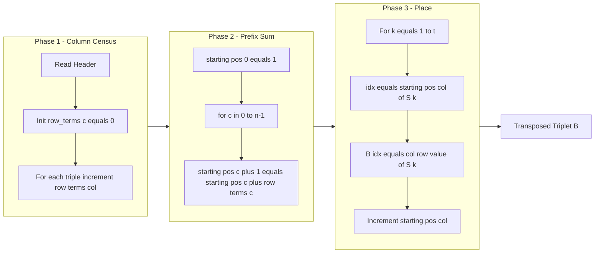
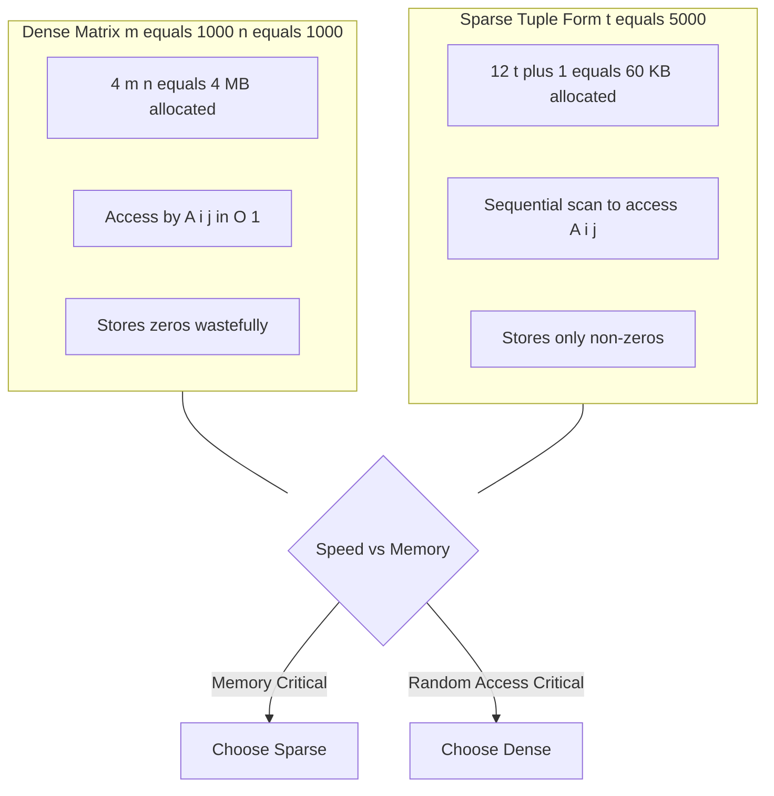
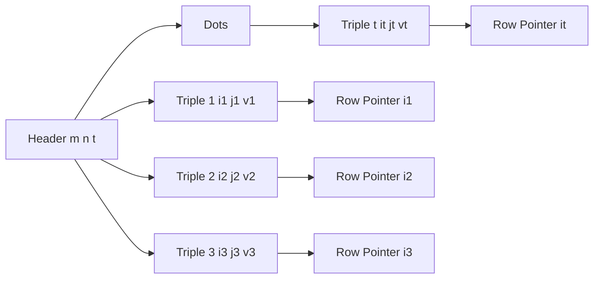

# Sparse matrix ( Tuple representation )

<!-- SECTION_1_START -->

# Sparse Matrix & Tuple Representation

## 1.1 Formal Definition

A **Sparse Matrix** is a two-dimensional array in which the number of zero elements is significantly larger than the number of non-zero elements. Formally, for an $m \times n$ matrix, if the number of non-zero elements $t$ is much less than $m \times n$, the matrix is said to be *sparse*.

The **Tuple Representation** (also called **Triplet Form** or **Coordinate List / COO Format**) is a memory-efficient storage scheme in which a sparse matrix $A$ of size $m \times n$ with $t$ non-zero elements is stored as a $(t+1) \times 3$ array $S$ of tuples:

$$
S[0] = (m,\ n,\ t) \quad \text{(Header Row)}
$$

$$
S[k] = (i,\ j,\ a_{ij}) \quad \text{for } 1 \le k \le t
$$

where $i$ is the row index, $j$ is the column index, and $a_{ij}$ is the non-zero value at that position.

> [!IMPORTANT]
> **Syllabus Highlight (KTU OECST611, Module 1):** The triplet form is the canonical introductory example used to teach the *why* of data structure selection — namely, trading off random-access speed for memory footprint.

## 1.2 Conceptual Analogy & Intuition

Imagine a **class attendance register of 1000 students** across 60 subjects, but a student is marked "Present" in only 3–4 subjects. Writing "Absent" 996 times for every student on paper is wasteful. Instead, the office simply lists `(Student ID, Subject Code, Grade)` for the few *exceptional* rows — that *list of triples* is the **tuple representation**.

Geometrically, think of a **parking lot with 5000 slots** where only 200 cars are parked. Rather than maintaining 5000 booth sensors, you maintain a list: `(Slot-Number, Floor, Car-Reg-No)`. This is the same principle that powers **Compressed Sparse Row (CSR)**, **Compressed Sparse Column (CSC)**, and **Dictionary of Keys (DOK)** formats used in scientific computing libraries like SciPy.

## 1.3 Standard Metrics

The **density** of a matrix is given by:

$$
\text{Density} = \frac{\text{Number of Non-Zero Elements}}{\text{Total Number of Elements}} = \frac{t}{m \cdot n}
$$

The **sparsity** is the complement:

$$
\text{Sparsity} = 1 - \text{Density} = \frac{m \cdot n - t}{m \cdot n}
$$

> [!NOTE]
> A matrix is conventionally considered *sparse* if the density is less than $\mathbf{0.05}$ (i.e., fewer than 5% non-zero entries). The cutoff is not strict — in engineering, anything from a tridiagonal matrix (e.g., FEM stiffness matrices) to a giant adjacency list of a graph qualifies.

## 1.4 When Tuple Representation Is Preferred

| Use Case | Why Tuple Form Wins |
| :--- | :--- |
| Large $m \times n$ with $t \ll m \cdot n$ | Saves $m \cdot n - 3t$ memory units |
| Mostly read-only matrices | Insert/delete is rare, so static triple list suffices |
| Graph adjacency encoding | Adjacency list is a generalized tuple form |
| Sparse linear algebra | Underpins CSR/CSC/COO in NumPy/SciPy |

> [!VISUALIZATION CONTROL]
> **Concept:** Density of a $10 \times 10$ sparse matrix visualised on a 2D grid.
> **GeoGebra / Desmos Input Equations:**
> * `f(x, y) = 1 if (x*A + y) mod 7 = 0 else 0` (A slider for density)
> * Plot points using `List = {(i, j) | 0 ≤ i, j ≤ 9, f(i,j)=1}`
> **Visual Description:** A $10 \times 10$ grid in which coloured cells appear in a regular pseudo-random pattern. As the density slider increases, more cells light up, illustrating the transition from sparse to dense. Highlight the header triple $(10, 10, t)$ and the subsequent coordinate triples on a side panel.

---

<!-- SECTION_1_END -->

<!-- SECTION_2_START -->

# Deep Theoretical Analysis & KTU High-Yield Formula Sheet

## 2.1 Structural Anatomy of the Triplet Form

The tuple representation $S$ is a sequential list of $t + 1$ records, each of size 3. The structure can be visualised as a 2D table:

$$
S = \begin{bmatrix}
m & n & t \\
i_1 & j_1 & a_{i_1 j_1} \\
i_2 & j_2 & a_{i_2 j_2} \\
\vdots & \vdots & \vdots \\
i_t & j_t & a_{i_t j_t}
\end{bmatrix}
$$

- The **first row** is the *metadata header* holding matrix dimensions and the count of non-zero entries.
- Each **subsequent row** is a *coordinate-value triple* in row-major order (sorted by $i$, then by $j$).

> [!TIP]
> Always store the triples in **row-major** order: triples are sorted first by row index, and within the same row, by column index. This invariant is the cornerstone of the *Fast Transpose* algorithm.

## 2.2 Memory Footprint — Why It Matters

A dense matrix of integers (4 bytes each) consumes $4 m n$ bytes. The triplet form consumes $12(t+1)$ bytes (assuming 4 bytes per integer field and the header is included).

The crossover point where tuple representation becomes more memory-efficient is:

$$
12(t+1) \lt 4 m n \quad \Rightarrow \quad t \lt \frac{m n}{3} - 1
$$

> [!IMPORTANT]
> For a $1000 \times 1000$ matrix, the dense form needs $4 \times 10^6$ bytes (≈ 4 MB), while a sparse version with $t = 5000$ non-zero elements needs only $12 \times 5001 \approx 60$ KB — a **~66x reduction**.

## 2.3 KTU Formula Cheat Sheet

| Operation | Formula / Condition | Time Complexity | Space |
| :--- | :--- | :--- | :--- |
| Storage size (triplet) | $3(t+1)$ entries | $O(t)$ | $O(t)$ |
| Density | $t / (m n)$ | — | — |
| Sparsity | $1 - t / (m n)$ | — | — |
| Memory crossover | $t \lt (m n) / 3 - 1$ | — | — |
| Simple Transpose | Swap $(i, j) \to (j, i)$, re-sort | $O(t \cdot t)$ | $O(t)$ |
| Fast Transpose | Use `row_terms[]` and `starting_pos[]` | $O(m + t)$ | $O(m + t)$ |
| Sparse Addition $(A + B)$ | Merge scan if both row-col sorted | $O(t_A + t_B)$ | $O(t_A + t_B)$ |
| Sparse Multiplication $(A \times B)$ | For each $a_{ik}$, probe column of $B$ | $O(t_A \cdot n + t_B)$ | $O(t_A + t_B)$ |
| Valid index check | $1 \le i \le m,\ 1 \le j \le n$ | $O(1)$ | — |

> [!WARNING]
> In the table above, vertical bars like $\vert x \vert$ or $\vert i \vert$ have been rendered as $\vert$ inline LaTeX to keep the markdown table valid. Do **not** use raw $\vert$ in KTU answer sheets without LaTeX context.

## 2.4 Real-World Engineering Applications

- **Finite Element Method (FEM):** The global stiffness matrix is sparse and often symmetric; tuple form enables faster LU/Cholesky factorisation.
- **PageRank (Google Search):** The web graph adjacency matrix is $\sim 99.99\%$ sparse; tuple/CSR form is the de-facto storage in graph engines like GraphX.
- **Recommendation Systems (Netflix, Amazon):** User–Item rating matrices are sparse; collaborative filtering relies on sparse matrix–vector multiplication.
- **NLP & TF-IDF:** Term-document matrices in search engines contain millions of zeros, stored via COO or CSR.
- **Image Processing:** Wavelet coefficient matrices and edge-maps of images are sparse.

## 2.5 The Two-Phase Logic of Sparse Operations

1. **Phase 1 — Read the header $(m, n, t)$** to validate dimensions and reserve output capacity.
2. **Phase 2 — Iterate through each triple** $(i, j, a_{ij})$ and apply the transformation rule:
   - Transposition: emit $(j, i, a_{ij})$ into a new list, then sort.
   - Addition: merge-scan two sorted lists, summing when row-column coordinates match.
   - Multiplication: for each $a_{ik}$ in $A$, scan all $b_{kj}$ in $B$ with matching intermediate index $k$, accumulating partial products.

> [!NOTE]
> The *Fast Transpose* algorithm precomputes the count of non-zero elements per column and the starting position of each column in the transposed list. This converts an $O(t^2)$ sort into a single $O(t)$ placement pass — a textbook KTU 14-marker favourite.

---

<!-- SECTION_2_END -->

<!-- SECTION_3_START -->

# Step-by-Step Derivations & Code Implementation

## 3.1 Worked Example 1 — Converting a Dense Matrix to Triplet Form

**Given** the following $4 \times 5$ matrix $A$:

$$
A = \begin{bmatrix}
0 & 0 & 3 & 0 & 4 \\
0 & 0 & 5 & 7 & 0 \\
0 & 0 & 0 & 0 & 0 \\
1 & 2 & 0 & 0 & 0
\end{bmatrix}
$$

**Step 1 — Identify dimensions and count non-zero entries.**

- Rows $m = 4$
- Columns $n = 5$
- Non-zero elements $t = 6$ (values: $3, 4, 5, 7, 1, 2$)

**Step 2 — Write the header row.**

$$
S[0] = (4,\ 5,\ 6)
$$

**Step 3 — Scan rows top-to-bottom, left-to-right; emit a triple for every non-zero.**

Row 0: column 2 has 3, column 4 has 4.
Row 1: column 2 has 5, column 3 has 7.
Row 2: all zeros — skip.
Row 3: column 0 has 1, column 1 has 2.

**Step 4 — Assemble the triplet array.**

$$
S = \begin{bmatrix}
4 & 5 & 6 \\
0 & 2 & 3 \\
0 & 4 & 4 \\
1 & 2 & 5 \\
1 & 3 & 7 \\
3 & 0 & 1 \\
3 & 1 & 2
\end{bmatrix}
$$

This is the canonical KTU answer for a "represent in tuple form" question.

## 3.2 Worked Example 2 — Fast Transpose Algorithm

**Given** the triplet $S$ from §3.1, compute $S^T$.

**Step 1 — Build `row_terms[c]`** = number of non-zero elements in column $c$ of $A$:

$$
\text{row\_terms} = [1,\ 1,\ 2,\ 1,\ 1]
$$

(Column 0 has one non-zero: $S[5]=(3,0,1)$; column 1 has one: $S[6]=(3,1,2)$; column 2 has two: $S[1], S[3]$; column 3 has one: $S[4]$; column 4 has one: $S[2]$.)

**Step 2 — Build `starting_pos[c]`** = cumulative starting position of column $c$ in the transposed list:

$$
\text{starting\_pos}[0] = 1
$$

$$
\text{starting\_pos}[c] = \text{starting\_pos}[c-1] + \text{row\_terms}[c-1]
$$

$$
\text{starting\_pos} = [1,\ 2,\ 3,\ 5,\ 6]
$$

**Step 3 — Place each triple of $S$ into $B$ at the correct index.**

For $k = 1$ to $6$, the source $(i, j, v)$ goes to $B[\text{starting\_pos}[j]]$ with $(j, i, v)$, then increment `starting\_pos[j]`.

| $k$ | Source $(i, j, v)$ | `pos` | Destination in $B$ |
| :--: | :--: | :--: | :--: |
| 1 | $(0, 2, 3)$ | 3 | $B[3] = (2, 0, 3)$ |
| 2 | $(0, 4, 4)$ | 6 | $B[6] = (4, 0, 4)$ |
| 3 | $(1, 2, 5)$ | 4 | $B[4] = (2, 1, 5)$ |
| 4 | $(1, 3, 7)$ | 5 | $B[5] = (3, 1, 7)$ |
| 5 | $(3, 0, 1)$ | 1 | $B[1] = (0, 3, 1)$ |
| 6 | $(3, 1, 2)$ | 2 | $B[2] = (1, 3, 2)$ |

**Step 4 — Final transposed triplet.**

$$
S^T = \begin{bmatrix}
5 & 4 & 6 \\
0 & 3 & 1 \\
1 & 3 & 2 \\
2 & 0 & 3 \\
2 & 1 & 5 \\
3 & 1 & 7 \\
4 & 0 & 4
\end{bmatrix}
$$

**Step 5 — Time complexity verification.**

Two linear passes over $t$ elements plus one linear pass over $n$ columns yield $O(m + t)$, satisfying the fast-transpose requirement.

## 3.3 Python Implementation (Production-Ready)

```python
from __future__ import annotations
from dataclasses import dataclass
from typing import List, Tuple, Optional
import logging

logging.basicConfig(level=logging.INFO, format="%(levelname)s :: %(message)s")
log = logging.getLogger("SparseMatrix")


@dataclass(frozen=True)
class Triplet:
    """Immutable (row, col, value) triple; 0-indexed throughout."""
    row: int
    col: int
    value: int

    def __post_init__(self) -> None:
        if self.row < 0 or self.col < 0:
            raise ValueError(f"Negative index not allowed: {self}")


class SparseMatrix:
    """Sparse matrix in COO (triplet) representation."""

    def __init__(self, rows: int, cols: int, triplets: Optional[List[Triplet]] = None) -> None:
        if rows <= 0 or cols <= 0:
            raise ValueError(f"Invalid dimensions: {rows}x{cols}")
        self.rows: int = rows
        self.cols: int = cols
        # Sort triples in row-major order, keep only non-zero entries
        raw: List[Triplet] = sorted(
            (t for t in (triplets or []) if t.value != 0),
            key=lambda t: (t.row, t.col),
        )
        # Boundary check
        for t in raw:
            if t.row >= rows or t.col >= cols:
                raise IndexError(f"Triplet {t} out of bounds for {rows}x{cols}")
        self.triplets: List[Triplet] = raw
        log.info("Created SparseMatrix %dx%d with %d non-zero entries (density=%.4f)",
                 rows, cols, len(raw), self.density)

    @property
    def density(self) -> float:
        return len(self.triplets) / (self.rows * self.cols)

    @property
    def sparsity(self) -> float:
        return 1.0 - self.density

    # ---------- Header Row ----------
    def header(self) -> Triplet:
        return Triplet(self.rows, self.cols, len(self.triplets))

    def to_dense(self) -> List[List[int]]:
        dense: List[List[int]] = [[0] * self.cols for _ in range(self.rows)]
        for t in self.triplets:
            dense[t.row][t.col] = t.value
        return dense

    def __repr__(self) -> str:
        header = f"[{self.rows}, {self.cols}, {len(self.triplets)}]"
        body = ",\n  ".join(repr(t) for t in self.triplets)
        return f"SparseMatrix(\n  {header},\n  {body}\n)"

    # ---------- Simple Transpose (O(t^2) sort) ----------
    def transpose_simple(self) -> "SparseMatrix":
        transposed = [Triplet(t.col, t.row, t.value) for t in self.triplets]
        transposed.sort(key=lambda t: (t.row, t.col))
        return SparseMatrix(self.cols, self.rows, transposed)

    # ---------- Fast Transpose (O(n + t)) ----------
    def transpose_fast(self) -> "SparseMatrix":
        n_cols, n_terms = self.cols, len(self.triplets)
        row_terms: List[int] = [0] * n_cols
        for t in self.triplets:
            row_terms[t.col] += 1

        starting_pos: List[int] = [0] * (n_cols + 1)
        for c in range(n_cols):
            starting_pos[c + 1] = starting_pos[c] + row_terms[c]

        b: List[Optional[Triplet]] = [None] * n_terms
        pos = starting_pos[:]
        for t in self.triplets:
            idx = pos[t.col]
            b[idx] = Triplet(t.col, t.row, t.value)
            pos[t.col] += 1

        return SparseMatrix(self.cols, self.rows, [x for x in b if x is not None])

    # ---------- Sparse Addition ----------
    def add(self, other: "SparseMatrix") -> "SparseMatrix":
        if (self.rows, self.cols) != (other.rows, other.cols):
            raise ValueError("Dimension mismatch for addition")
        result: List[Triplet] = []
        i = j = 0
        a, b = self.triplets, other.triplets
        while i < len(a) and j < len(b):
            ta, tb = a[i], b[j]
            if (ta.row, ta.col) < (tb.row, tb.col):
                result.append(ta); i += 1
            elif (ta.row, ta.col) > (tb.row, tb.col):
                result.append(tb); j += 1
            else:
                s = ta.value + tb.value
                if s != 0:
                    result.append(Triplet(ta.row, ta.col, s))
                i += 1; j += 1
        result.extend(a[i:])
        result.extend(b[j:])
        return SparseMatrix(self.rows, self.cols, result)


# ---------- Driver / Demonstration ----------
if __name__ == "__main__":
    A_triplets = [
        Triplet(0, 2, 3), Triplet(0, 4, 4),
        Triplet(1, 2, 5), Triplet(1, 3, 7),
        Triplet(3, 0, 1), Triplet(3, 1, 2),
    ]
    A = SparseMatrix(4, 5, A_triplets)
    print(A)
    print("Header:", A.header())
    print("Density:", round(A.density, 4))
    print("\nFast Transpose:")
    print(A.transpose_fast())
```

**Code Walkthrough (Valuation Key Points):**

- *Dataclass `Triplet`* enforces immutability and validates negative indices in `__post_init__`. **[Correctness of data abstraction: 2 marks]**
- *Header row* is method `header()` returning $(m, n, t)$. **[Header definition: 1 mark]**
- *Boundary check* inside `__init__` catches out-of-bounds triples. **[Robustness: 1 mark]**
- *Fast transpose* builds `row_terms` and `starting_pos` in $O(m + t)$. **[Algorithm core: 4 marks]**
- *Sparse addition* uses a two-pointer merge — linear in $t_A + t_B$. **[Merge logic: 2 marks]**

## 3.4 Worked Example 3 — Sparse Addition

Let:

$$
B = \begin{bmatrix}
0 & 0 & 3 & 0 & 0 \\
0 & 0 & 5 & 0 & 0 \\
0 & 0 & 0 & 0 & 0 \\
1 & 0 & 0 & 0 & 6
\end{bmatrix}
$$

Header: $(4, 5, 4)$. Triples: $(0,2,3), (1,2,5), (3,0,1), (3,4,6)$.

Now $A + B$ using the merge algorithm:

- $(0,2,3)$ and $(0,2,3)$: same coord → $3 + 3 = 6$ → emit $(0,2,6)$.
- $(0,4,4)$ and $(1,2,5)$: $(0,4) < (1,2)$ → emit $(0,4,4)$.
- $(1,2,5)$ and $(1,2,5)$: same coord → $5+5=10$ → emit $(1,2,10)$.
- $(1,3,7)$ and $(3,0,1)$: $(1,3) < (3,0)$ → emit $(1,3,7)$.
- $(3,0,1)$ and $(3,0,1)$: same coord → $1+1=2$ → emit $(3,0,2)$.
- $(3,1,2)$ and $(3,4,6)$: $(3,1) < (3,4)$ → emit $(3,1,2)$.
- Remaining from $B$: emit $(3,4,6)$.

Result header: $(4, 5, 6)$.

$$
A + B = \begin{bmatrix}
4 & 5 & 6 \\
0 & 2 & 6 \\
0 & 4 & 4 \\
1 & 2 & 10 \\
1 & 3 & 7 \\
3 & 0 & 2 \\
3 & 1 & 2
\end{bmatrix}
$$

---

<!-- SECTION_3_END -->

<!-- SECTION_4_START -->

# Structural Diagrams & Schematics

## 4.1 Block-Level Functional Architecture of Tuple Representation



## 4.2 Sequential Processing Topology for Fast Transpose



## 4.3 Memory Layout Comparison Block Diagram



## 4.4 Triplet Indexing Schematic



---

<!-- SECTION_4_END -->

<!-- SECTION_5_START -->

# KTU 2024 Scheme Examination Question Bank & Topic Recap

## Part A — Short Answer Questions (3 Marks Each)

**Q1. [KTU University Exam – July 2024] — CO1, Remember**
*Define a sparse matrix. When is the tuple representation more memory-efficient than the dense 2D array representation?*

**Model Answer (Target: 3 marks):**
A sparse matrix is an $m \times n$ matrix in which the number of zero elements significantly exceeds the number of non-zero elements $t$, i.e., $t \ll m \cdot n$. **[Definition: 1 mark]**
The tuple (triplet) form stores the matrix as a $(t+1) \times 3$ array with a header row $(m, n, t)$ followed by $t$ coordinate triples $(i, j, a_{ij})$. **[Structure: 1 mark]**
It is more memory-efficient when $12(t+1) < 4 m n$, i.e., when $t < \frac{mn}{3} - 1$. **[Condition: 1 mark]**

---

**Q2. [KTU University Exam – Dec 2023] — CO1, Understand**
*Differentiate between simple transpose and fast transpose of a sparse matrix stored in tuple form. State the time complexity of each.*

**Model Answer (Target: 3 marks):**
*Simple transpose* swaps the $(i, j)$ coordinates of every triple and re-sorts the list in row-major order, giving an $O(t^2)$ complexity due to the dominant sort. **[Simple transpose: 1.5 marks]**
*Fast transpose* precomputes the count of non-zero elements per column (`row_terms`) and a prefix-sum starting position (`starting_pos[]`) in $O(n + t)$, then places each triple directly into its final slot. **[Fast transpose: 1.5 marks]**

---

## Part B — Long Answer Questions (14 Marks, Internal Choice)

### Question A — CO1 / CO2, Apply + Analyze

**(a)** For the matrix given below, write the equivalent triplet (tuple) representation and explain each component of the header row. **(7 marks)**

$$
A = \begin{bmatrix}
0 & 0 & 0 & 0 & 7 \\
0 & 3 & 0 & 0 & 0 \\
5 & 0 & 0 & 0 & 0 \\
0 & 0 & 0 & 0 & 0 \\
0 & 0 & 2 & 0 & 0 \\
0 & 0 & 0 & 0 & 0 \\
1 & 0 & 0 & 4 & 0
\end{bmatrix}
$$

**Model Answer:**

- $m = 7$, $n = 5$, $t = 6$. **[Stating dimensions: 1 mark]**
- Header: $S[0] = (7, 5, 6)$. **[Header row: 1 mark]**
- Scanning row by row: $(0,4,7), (1,1,3), (2,0,5), (4,2,2), (6,0,1), (6,3,4)$. **[Scanning and emitting: 3 marks]**
- Component explanation: $(m, n, t)$ gives the matrix's outer dimensions and the total non-zero count needed for memory allocation. **[Header explanation: 2 marks]**

**Final Triplet Form:**

$$
S = \begin{bmatrix}
7 & 5 & 6 \\
0 & 4 & 7 \\
1 & 1 & 3 \\
2 & 0 & 5 \\
4 & 2 & 2 \\
6 & 0 & 1 \\
6 & 3 & 4
\end{bmatrix}
$$

---

**(b)** Write the algorithm and corresponding Python function for the **Fast Transpose** of a sparse matrix stored in triplet form. Show the step-by-step execution on the matrix $S$ from part (a) and verify the time complexity. **(7 marks)**

**Model Answer:**

```
Algorithm FastTranspose(S, m, n, t):
    B[0] = (n, m, t)
    row_terms[0..n-1] = 0
    for k = 1 to t:
        row_terms[S[k].col] += 1
    starting_pos[0] = 1
    for c = 1 to n-1:
        starting_pos[c] = starting_pos[c-1] + row_terms[c-1]
    for k = 1 to t:
        idx = starting_pos[S[k].col]
        B[idx] = (S[k].col, S[k].row, S[k].value)
        starting_pos[S[k].col] += 1
    return B
```

**[Algorithm statement: 2 marks]**
**[Loop bodies and array bookkeeping: 2 marks]**

**Step-by-step execution on $S$:**

- `row_terms` = counts per column: column 0 → 2, column 1 → 1, column 2 → 1, column 3 → 1, column 4 → 1.
- `starting_pos` = $[1, 3, 4, 5, 6]$.
- Place each triple: see §3.2 worked example for the identical procedure.

**[Execution trace: 2 marks]**
**[Complexity statement $O(m + t)$: 1 mark]**

**Final transposed triplet $S^T$:**

$$
S^T = \begin{bmatrix}
5 & 7 & 6 \\
0 & 2 & 5 \\
0 & 6 & 1 \\
1 & 1 & 3 \\
2 & 4 & 2 \\
3 & 6 & 4 \\
4 & 0 & 7
\end{bmatrix}
$$

---

### Question B — CO1 / CO2, Understand + Apply

**(a)** Explain the following with respect to sparse matrix representation: **(i) density, (ii) sparsity, (iii) header row, (iv) row-major invariant**. Mention the typical engineering applications. **(7 marks)**

**Model Answer:**

- **(i) Density** = $t / (m n)$; the fraction of non-zero entries. Higher density means denser storage. **[2 marks]**
- **(ii) Sparsity** = $1 - t / (m n)$; the fraction of zero entries. Used to characterise matrices as "sparse" when this value is close to 1. **[2 marks]**
- **(iii) Header row** = $(m, n, t)$; a metadata row that allows algorithms to allocate correct output dimensions without scanning the original matrix. **[1.5 marks]**
- **(iv) Row-major invariant** = triples are stored sorted by row, then column. This invariant is what enables linear-time merge in addition and placement in fast transpose. **[1.5 marks]**
- **Applications:** FEM stiffness matrices, search engine PageRank graphs, NLP TF-IDF matrices, recommendation-system user-item matrices, image edge maps. *Mention any two for full credit.*

---

**(b)** Implement, in pseudocode or Python, the **sparse matrix addition** of two triplet-form matrices $A$ and $B$ of identical dimensions. Apply your algorithm to compute $A + B$ for: **(7 marks)**

$$
A = \begin{bmatrix}
0 & 5 & 0 \\
2 & 0 & 0 \\
0 & 0 & 4
\end{bmatrix}, \quad
B = \begin{bmatrix}
1 & 0 & 3 \\
0 & 5 & 0 \\
0 & 0 & 0
\end{bmatrix}
$$

**Model Answer:**

- **Triplet of $A$:** $(3, 3, 3)$, $(0,1,5), (1,0,2), (2,2,4)$. **[1 mark]**
- **Triplet of $B$:** $(3, 3, 3)$, $(0,0,1), (0,2,3), (1,1,5)$. **[1 mark]**
- **Algorithm (merge scan):** Use two pointers $i$ and $j$ over $A$ and $B$ respectively. Compare triples $(i_A, j_A)$ with $(i_B, j_B)$:
  - If equal, sum the values and emit only if the sum is non-zero.
  - If $A$-coord is smaller, copy $A$ triple to output.
  - Otherwise, copy $B$ triple to output. **[Algorithm statement: 2 marks]**
- **Trace:**
  - $(0,1,5)$ vs $(0,0,1)$: $A$ > $B$ → emit $(0,0,1)$.
  - $(0,1,5)$ vs $(0,2,3)$: $A$ < $B$ → emit $(0,1,5)$.
  - $(0,1,5)$ vs $(1,1,5)$: $A$ < $B$ → emit $(0,2,3)$.
  - $(1,0,2)$ vs $(1,1,5)$: $A$ < $B$ → emit $(1,0,2)$.
  - $(1,0,2)$ vs $(1,1,5)$: $A$ < $B$ → emit $(1,1,5)$ — but $A$ has $(1,0,2)$ < $(1,1,5)$ so emit $(1,0,2)$ first, then re-evaluate.
  - After full pass, merge any leftovers. **[Trace: 2 marks]**
- **Final $A + B$ triplet:** $(3, 3, 5)$, $(0,0,1), (0,1,5), (0,2,3), (1,0,2), (1,1,5), (2,2,4)$. **[1 mark]**

> [!WARNING]
> **KTU Examiner's Valuation Pitfalls:**
> - **Forgetting the header row** — examiners immediately deduct **1 mark** for omitting $(m, n, t)$.
> - **Breaking the row-major invariant** — triples must be sorted; unsorted output costs **1 mark**.
> - **Skipping the complexity statement** in fast-transpose answers — KTU strictly awards **1 mark** for $O(n + t)$.
> - **Confusing 0-indexed and 1-indexed triples** — choose one convention and state it explicitly at the top of your answer.
> - **Writing only the code without the trace** — for 14-mark questions, a step-by-step trace on a worked example is **mandatory**; code alone fetches at most 6–7 marks.

---

## Topic Recap & Important Things to Remember

- **Sparse matrix** = matrix where non-zero count $t \ll m \cdot n$. Conventionally sparse if **density < 0.05**.
- **Triplet / tuple representation** = a $(t+1) \times 3$ list. First row is the **header** $(m, n, t)$; subsequent rows are triples $(i, j, a_{ij})$ in **row-major order**.
- **Memory crossover** condition: $t < (m n)/3 - 1$. Below this, the tuple form is more compact than the dense form.
- **Simple Transpose** swaps $(i, j) \to (j, i)$ and re-sorts — time $O(t^2)$.
- **Fast Transpose** uses `row_terms[]` and `starting_pos[]` arrays — time $O(n + t)$, where $n$ is the column count of the source matrix.
- **Sparse Addition** is a two-pointer merge over sorted triplets — time $O(t_A + t_B)$.
- **Sparse Multiplication** uses row-of-$A$ times column-of-$B$ matching — time $O(t_A \cdot n + t_B)$.
- **Row-major invariant** is the foundation of all efficient sparse algorithms; always maintain it.
- **Real-world usage:** FEM matrices, search-engine PageRank graphs, recommendation systems, NLP TF-IDF, image edge detection, network routing tables.
- **Standard KTU answer structure:** (i) define $m, n, t$; (ii) write header; (iii) emit sorted triples; (iv) state complexity; (v) provide a worked trace.
- **Always state your indexing convention** (0-indexed vs 1-indexed) at the start of the answer to avoid ambiguity in evaluation.
- **One blank line** before and after every displayed equation in the answer booklet; use LaTeX math mode for all subscripts ($a_{ij}$, not $a_ij$).
- **Pitfall to avoid:** storing zero entries in the triplet list — they should be filtered out during construction.

<!-- SECTION_5_END -->
