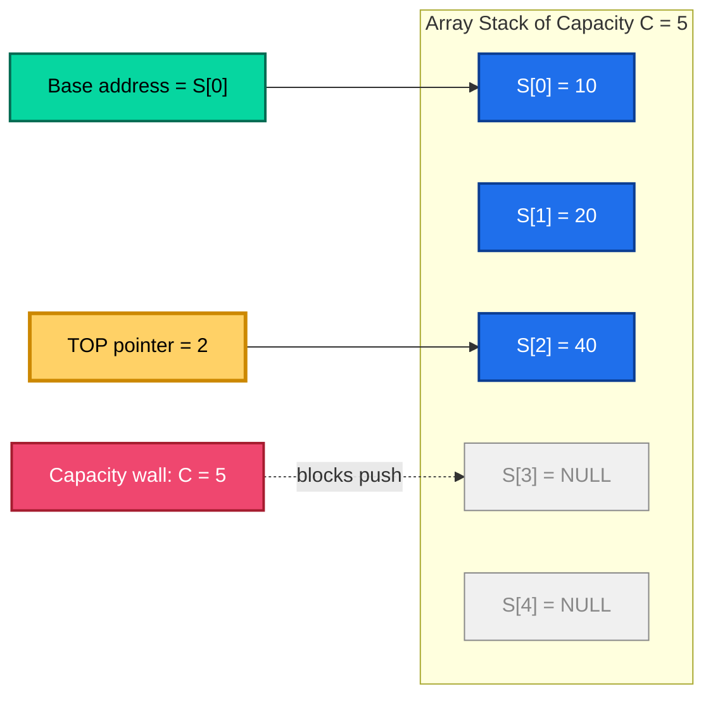
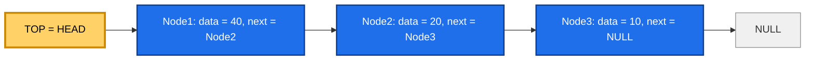

# Stacks and Queues - Stacks

<!-- SECTION_1_START -->
# Stacks — Core Technical Definition & Intuitive Overview

## Formal Academic Definition

A **Stack** is a linear, ordered, non-primitive data structure that stores a collection of homogeneous elements and permits insertion and deletion of elements at **only one end**, conventionally called the **TOP** of the stack. It obeys the **LIFO (Last In, First Out)** discipline — the element that is inserted most recently is the one that is removed first. According to the KTU 2024 Scheme syllabus for *OECST611 — Data Structures*, a stack is formally recognised as an *Abstract Data Type (ADT)*, meaning it is defined by its **behaviour (semantics)** and not by its underlying storage mechanism.

Mathematically, a stack $S$ over an element type $T$ is a tuple:

$$
S = (T, \text{TOP}, \text{operations})
$$

where $\text{TOP}$ is a non-negative integer that always points to the index of the most recently pushed element. After $n$ pushes, $\text{TOP} = n - 1$. After one pop, $\text{TOP}$ becomes $n - 2$.

> [!IMPORTANT]
> **KTU Syllabus Highlight:** A stack is an **ADT**, not a storage class. The same ADT can be realised using an *array* (contiguous memory) or a *singly linked list* (dynamic memory). Examiners expect you to state "Stack is an ADT" — not "Stack is an array."

## Conceptual Analogy / Intuition

Imagine a vertical stack of clean plates in a self-service restaurant. You can perform only two physical actions:

1. **Put a plate on top** — this is a **push** operation.
2. **Remove the topmost plate** — this is a **pop** operation.

You cannot sensibly pull out a plate from the middle of the pile. The last plate you placed on the stack is the first one you will take when a customer asks for a plate. This intuitive picture is the LIFO principle in its purest form.

Other relatable analogies:

| Real-World Analogy | Stack Operation Mapped |
|---|---|
| Browser **Back** button | Pops the most recently visited URL |
| **Undo** functionality in editors | Pops the last action snapshot |
| Recursive function calls | Each call pushes a stack frame |
| A pile of books on a desk | Push = add, Pop = remove from top |
| Compiler symbol table nesting | Push scope, Pop scope |

> [!NOTE]
> The **physical constant** governing the stack's mechanical limit is the **capacity** of the underlying container — denoted $C$. When $\text{TOP} = C - 1$, the stack is in an **overflow** state; when $\text{TOP} = -1$, it is in an **underflow** state. The standard value $C$ in KTU numerical problems is typically chosen as $\mathbf{5}$ or $\mathbf{10}$ to keep hand-calculations feasible.

## Why Stacks Matter in Computer Science

Stacks are the silent backbone of every executing program. The **program counter**, **return addresses**, **local variables**, and **CPU registers during context switches** are all managed by a *run-time stack* inside the operating system. Compilers translate every recursive routine into iterative stack operations. Parsers of programming languages use stacks to validate nested structures such as parentheses, brackets, and braces.

> [!VISUALIZATION CONTROL]
> **Concept:** Visualising the LIFO behaviour of a stack on a number line.
> **GeoGebra / Desmos Input Equations:**
> * State set: $S = \{s_1, s_2, s_3, s_4\}$ placed at coordinates $(1, 1), (2, 1), (3, 1), (4, 1)$.
> * TOP pointer: a moving point $T = (n, 1)$ where $n$ is the current stack height.
> * **Visual Description:** The student should observe that the arrow labelled "TOP" always sits above the rightmost (most recently pushed) element. As elements are popped, $T$ slides left; as elements are pushed, $T$ slides right until it hits the **capacity wall** at $x = C$.

## Abstract Data Type (ADT) Specification of Stack

The Stack ADT, in pure mathematical form, is the set:

$$
\text{Stack} = \left\{ \text{createStack}(), \; \text{push}(S, x), \; \text{pop}(S), \; \text{peek}(S), \; \text{isEmpty}(S), \; \text{isFull}(S), \; \text{size}(S) \right\}
$$

The semantics of each operation are described in the next section, along with their time and space complexities.
<!-- SECTION_1_END -->

<!-- SECTION_2_START -->
# Deep Theoretical Analysis & KTU High-Yield Formula Sheet

## 1. Operational Concept of a Stack

A stack, as an ordered collection, supports a tightly constrained set of operations. The single access point is the **TOP** pointer. The element beneath the TOP can never be directly accessed without first popping everything above it — this property is called the **restricted access policy** of the stack.

The two primitive mutating operations are:

* **push(S, x):** Inserts element $x$ at the TOP of the stack $S$ and increments TOP by one. Fails with **Overflow** if the stack is full.
* **pop(S):** Removes and returns the element at the TOP of the stack $S$ and decrements TOP by one. Fails with **Underflow** if the stack is empty.

The non-mutating inspection operations are:

* **peek(S)** or **top(S):** Returns the element at the TOP without removing it. Fails with **Underflow** if the stack is empty.
* **isEmpty(S):** Returns *true* if and only if $\text{TOP} = -1$.
* **isFull(S):** Returns *true* if and only if $\text{TOP} = C - 1$, where $C$ is the maximum capacity.
* **size(S):** Returns $\text{TOP} + 1$.

## 2. Why the LIFO Discipline?

The **Why** behind the LIFO discipline lies in the concept of *nesting of contexts*. Whenever a new sub-task begins (for example, entering a function or opening a parenthesis), its information must be saved **on top of** the current context. When the sub-task ends, that most recently saved context is the only one that is relevant for resumption. LIFO thus naturally models the *return-to-caller* semantics of nested function calls, *scoping rules* in block-structured languages, and *depth-first* recursion in graph/tree traversals.

The **How** behind LIFO enforcement is purely a contract: the ADT exposes only push and pop. The internal array or linked list is *encapsulated*, so a user cannot reach into the middle of the structure.

## 3. The "Where" and "Why" in Production Systems

Stacks are deployed in production systems in the following critical engineering contexts:

* **Operating Systems:** Process control blocks, interrupt handling, kernel mode stack.
* **Compilers:** Parsing expressions, generating intermediate code, evaluating arithmetic.
* **Networking:** Routers using stack-based packet processing in the TCP/IP stack.
* **Web Browsers:** History navigation, the JavaScript execution context.
* **Memory Management:** Static memory allocation frames, function call stacks.
* **Text Editors:** Undo/redo stacks, syntax highlighting state machines.

## 4. KTU High-Yield Formula / Cheat Sheet

The following table consolidates every parameter, formula, condition, and complexity you must memorise for the KTU board examination.

| Quantity / Operation | Formula or Condition | Resulting Value | Unit / Category |
|---|---|---|---|
| Initial TOP value (empty stack) | $\text{TOP}_{\text{init}}$ | $-1$ | Index (integer) |
| Stack size after $n$ pushes | $n_S = \text{TOP} + 1$ | Cardinality of stack | Count |
| Overflow condition (array impl.) | $\text{TOP} = C - 1$ | Boolean **TRUE** | Status flag |
| Underflow condition | $\text{TOP} = -1$ | Boolean **TRUE** | Status flag |
| Push time complexity | $T_{\text{push}} = \Theta(1)$ | Constant | Big-O |
| Pop time complexity | $T_{\text{pop}} = \Theta(1)$ | Constant | Big-O |
| Peek time complexity | $T_{\text{peek}} = \Theta(1)$ | Constant | Big-O |
| Space per element (array) | $S_{\text{elem}} = \text{sizeof}(T)$ | Bytes | Memory |
| Total space (array impl.) | $S_{\text{total}} = C \cdot \text{sizeof}(T) + \text{sizeof}(\text{ptr})$ | Bytes | Memory |
| Total space (linked list) | $S_{\text{total}} = n \cdot (\text{sizeof}(T) + \text{sizeof}(\text{ptr}))$ | Bytes | Memory |
| Position of $k$-th pushed element | $S[C - k]$ from base | Indexing | Array address |
| Standard capacity in KTU problems | $C$ | $5$ or $10$ | Items |
| Pre-decrement pop (alt. impl.) | $\text{TOP} \leftarrow \text{TOP} - 1$ then return $S[\text{TOP}+1]$ | Side effect | Update rule |

> [!NOTE]
> In the KTU 2024 Scheme syllabus for OECST611, the **pre-increment push** style (increment TOP first, then insert) and **post-decrement pop** style (decrement TOP first, then return the new TOP value) are the two accepted conventions. The earlier *"increment-after-insert"* style is also accepted. Always state the convention you are using in the exam.

## 5. Boundary State Analysis

A stack has precisely **two terminal states**:

1. **Empty State:** $\text{TOP} = -1$. Every pop/peek is invalid. `isEmpty(S) == true`.
2. **Full State:** $\text{TOP} = C - 1$. Every push is invalid. `isFull(S) == true`.

A stack that is neither empty nor full is in the **normal state**, where push and pop are both legal.

The transition diagram among the three states is:

$$
\text{Empty} \xrightarrow{\;\text{push}(x)\;} \text{Normal} \xrightarrow{\;\text{push}(y)\;} \text{Full}
$$

and the reverse path:

$$
\text{Full} \xrightarrow{\;\text{pop}()\;} \text{Normal} \xrightarrow{\;\text{pop}()\;} \text{Empty}
$$

Any attempt to perform an illegal operation results in a *flag* (Boolean) being raised or an *exception* (in C++/Java) being thrown, depending on the implementation language.
<!-- SECTION_2_END -->

<!-- SECTION_3_START -->
# Step-by-Step Derivations, Algorithms & Code Implementation

This section is the **algorithmic heart** of the topic. We derive the array-based stack from first principles, give a complete Python implementation, derive the linked-list-based stack, and culminate in the **Infix-to-Postfix** conversion and **Postfix Evaluation** algorithms — both of which are KTU board favourites.

---

## 1. Array-Based Stack — Complete Derivation

### 1.1 Data Structure

We model the stack using a Python list `stack` of fixed capacity $C$, and an integer variable `top` initialised to $-1$.

```python
from __future__ import annotations
from typing import Any, List, Optional


class ArrayStack:
    """
    Array-based implementation of the Stack ADT.
    Capacity C is fixed at construction time.
    """

    def __init__(self, capacity: int) -> None:
        if capacity <= 0:
            raise ValueError("Capacity must be a positive integer.")
        self._capacity: int = capacity
        self._data: List[Optional[Any]] = [None] * capacity
        self._top: int = -1  # Sentinel value indicating an empty stack.

    def is_empty(self) -> bool:
        """Return True iff the stack contains zero elements."""
        return self._top == -1

    def is_full(self) -> bool:
        """Return True iff the stack is at maximum capacity."""
        return self._top == self._capacity - 1

    def size(self) -> int:
        """Return the number of elements currently in the stack."""
        return self._top + 1

    def push(self, item: Any) -> None:
        """
        Insert `item` at the top of the stack.
        Raises IndexError on overflow.
        """
        if self.is_full():
            raise IndexError(
                f"Stack Overflow: cannot push {item!r} into a full stack "
                f"of capacity {self._capacity}."
            )
        self._top += 1
        self._data[self._top] = item
        # Log boundary event for exam purposes:
        print(f"[PUSH] top = {self._top}, item = {item!r}, size = {self.size()}")

    def pop(self) -> Any:
        """
        Remove and return the top element.
        Raises IndexError on underflow.
        """
        if self.is_empty():
            raise IndexError("Stack Underflow: cannot pop from an empty stack.")
        removed: Any = self._data[self._top]
        self._data[self._top] = None  # Help garbage collector.
        self._top -= 1
        print(f"[POP]  top = {self._top}, removed = {removed!r}, size = {self.size()}")
        return removed

    def peek(self) -> Any:
        """
        Return the top element without removing it.
        Raises IndexError on underflow.
        """
        if self.is_empty():
            raise IndexError("Stack Underflow: cannot peek into an empty stack.")
        return self._data[self._top]
```

### 1.2 Trace of a Complete Push-Pop Sequence

Let $C = 5$. We perform the sequence: **push 10, push 20, push 30, pop, push 40, pop, pop**.

| Step | Operation | TOP before | TOP after | Stack contents (bottom $\rightarrow$ top) | Status |
|---|---|---|---|---|---|
| 1 | push 10 | $-1$ | $0$ | $[10]$ | OK |
| 2 | push 20 | $0$ | $1$ | $[10, 20]$ | OK |
| 3 | push 30 | $1$ | $2$ | $[10, 20, 30]$ | OK |
| 4 | pop | $2$ | $1$ | $[10, 20]$ | OK, returns 30 |
| 5 | push 40 | $1$ | $2$ | $[10, 20, 40]$ | OK |
| 6 | pop | $2$ | $1$ | $[10, 20]$ | OK, returns 40 |
| 7 | pop | $1$ | $0$ | $[10]$ | OK, returns 20 |

The corresponding Python driver code is:

```python
if __name__ == "__main__":
    s = ArrayStack(capacity=5)
    s.push(10)   # top = 0
    s.push(20)   # top = 1
    s.push(30)   # top = 2
    s.pop()      # top = 1, returns 30
    s.push(40)   # top = 2
    s.pop()      # top = 1, returns 40
    s.pop()      # top = 0, returns 20
    print("Final TOP =", s._top, "Size =", s.size())
```

Expected console output:

$$
\text{top} = 0, \quad \text{Size} = 1
$$

---

## 2. Linked-List-Based Stack — Complete Derivation

In a linked-list-based stack, the **head** of the singly linked list acts as the **TOP** of the stack. This representation has the advantage of *no upper bound* on the size — it can grow until the system runs out of heap memory.

### 2.1 Node Class

```python
from __future__ import annotations
from typing import Any, Optional


class _Node:
    __slots__ = ("_data", "_next")

    def __init__(self, data: Any, next_node: Optional["_Node"] = None) -> None:
        self._data: Any = data
        self._next: Optional[_Node] = next_node
```

### 2.2 LinkedStack Class

```python
class LinkedStack:
    """
    Singly-linked-list implementation of the Stack ADT.
    The head of the list is the TOP of the stack.
    """

    def __init__(self) -> None:
        self._top: Optional[_Node] = None
        self._count: int = 0

    def is_empty(self) -> bool:
        return self._top is None

    def size(self) -> int:
        return self._count

    def push(self, item: Any) -> None:
        new_node: _Node = _Node(data=item, next_node=self._top)
        self._top = new_node
        self._count += 1

    def pop(self) -> Any:
        if self.is_empty():
            raise IndexError("Stack Underflow: linked stack is empty.")
        assert self._top is not None
        removed_value: Any = self._top._data
        self._top = self._top._next
        self._count -= 1
        return removed_value

    def peek(self) -> Any:
        if self.is_empty():
            raise IndexError("Stack Underflow: cannot peek empty linked stack.")
        assert self._top is not None
        return self._top._data
```

### 2.3 Time and Space Complexity Comparison

| Operation | Array Stack | Linked Stack |
|---|---|---|
| push | $\Theta(1)$ | $\Theta(1)$ |
| pop | $\Theta(1)$ | $\Theta(1)$ |
| peek | $\Theta(1)$ | $\Theta(1)$ |
| isEmpty / isFull | $\Theta(1)$ | $\Theta(1)$ for isEmpty; isFull not defined |
| Memory per element | $\text{sizeof}(T)$ bytes | $\text{sizeof}(T) + \text{sizeof}(\text{ptr})$ bytes |
| Memory waste | Yes, if under-utilised | None |
| Resize flexibility | Requires reallocation | Dynamic by nature |

---

## 3. Application: Infix to Postfix Conversion (Shunting-Yard Algorithm)

### 3.1 Problem Statement

Given a fully parenthesised or partially parenthesised infix arithmetic expression $E$ containing operands, binary operators $\set{+, -, \times, /}$, and parentheses $\set{(, )}$, produce the equivalent **postfix** (Reverse Polish) expression in which every operator appears *after* its two operands.

### 3.2 Operator Precedence and Associativity Table

| Operator | Precedence | Associativity |
|---|---|---|
| $+, -$ | $1$ (lowest) | Left-to-right |
| $\times, /$ | $2$ (middle) | Left-to-right |
| $\hat{}$ (exponent) | $3$ (highest) | Right-to-left |
| $($ | — | Sentinel (always pushed) |

### 3.3 Step-by-Step Algorithm

1. Initialise an empty **operator stack** $S_{\text{op}}$ and an empty **output list** $L_{\text{out}}$.
2. Scan the infix string from left to right, token by token.
3. **If the token is an operand**, append it to $L_{\text{out}}$.
4. **If the token is `(`**, push it onto $S_{\text{op}}$.
5. **If the token is `)``**, pop and append to $L_{\text{out}}$ every operator until the matching `(` is encountered; discard the `(`.
6. **If the token is an operator $o$**:
   * While $S_{\text{op}}$ is non-empty and the operator at the top has *higher precedence* than $o$ (or equal precedence with left associativity), pop the top and append it to $L_{\text{out}}$.
   * Push $o$ onto $S_{\text{op}}$.
7. After the scan, pop and append every remaining operator in $S_{\text{op}}$ to $L_{\text{out}}$.
8. The list $L_{\text{out}}$ is the postfix expression.

### 3.4 Worked Example: $A + B \times C - D$

Trace the algorithm:

| Step | Token | Action | $S_{\text{op}}$ (top on right) | $L_{\text{out}}$ |
|---|---|---|---|---|
| 0 | — | Initialise | $[]$ | $[]$ |
| 1 | $A$ | Operand | $[]$ | $[A]$ |
| 2 | $+$ | Stack empty, push | $[+]$ | $[A]$ |
| 3 | $B$ | Operand | $[+]$ | $[A, B]$ |
| 4 | $\times$ | Top has lower prec, push | $[+, \times]$ | $[A, B]$ |
| 5 | $C$ | Operand | $[+, \times]$ | $[A, B, C]$ |
| 6 | $-$ | Top $\times$ has higher prec, pop and append | $[+]$ | $[A, B, C, \times]$ |
| 6 | $-$ | Top $+$ has equal prec (left-assoc), pop and append | $[]$ | $[A, B, C, \times, +]$ |
| 6 | $-$ | Stack empty, push | $[-]$ | $[A, B, C, \times, +]$ |
| 7 | $D$ | Operand | $[-]$ | $[A, B, C, \times, +, D]$ |
| 8 | — | End of input, pop all | $[]$ | $[A, B, C, \times, +, D, -]$ |

The resulting postfix expression is:

$$
A \, B \, C \, \times \, + \, D \, -
$$

### 3.5 Python Implementation of Infix to Postfix

```python
from __future__ import annotations
from typing import List


def infix_to_postfix(expression: str) -> str:
    """
    Convert a fully-spaced infix expression to postfix (Reverse Polish) form.
    Supported operators: + - * / ^ and parentheses ( ).
    """
    precedence: dict[str, int] = {'+': 1, '-': 1, '*': 2, '/': 2, '^': 3}
    right_associative: set[str] = {'^'}
    operator_stack: List[str] = []
    output: List[str] = []

    tokens: List[str] = expression.replace("(", " ( ").replace(")", " ) ").split()

    for token in tokens:
        if token in precedence:
            # Pop higher (or equal, left-assoc) precedence operators.
            while (
                operator_stack
                and operator_stack[-1] != '('
                and (
                    precedence[operator_stack[-1]] > precedence[token]
                    or (
                        precedence[operator_stack[-1]] == precedence[token]
                        and token not in right_associative
                    )
                )
            ):
                output.append(operator_stack.pop())
            operator_stack.append(token)
        elif token == '(':
            operator_stack.append(token)
        elif token == ')':
            while operator_stack and operator_stack[-1] != '(':
                output.append(operator_stack.pop())
            if not operator_stack:
                raise ValueError("Mismatched parentheses: no matching '('.")
            operator_stack.pop()  # Discard the '('.
        else:
            # Operand.
            output.append(token)

    while operator_stack:
        top_op: str = operator_stack.pop()
        if top_op == '(':
            raise ValueError("Mismatched parentheses: unmatched '('.")
        output.append(top_op)

    return " ".join(output)


if __name__ == "__main__":
    expr = "A + B * C - D"
    print(f"Infix:  {expr}")
    print(f"Postfix: {infix_to_postfix(expr)}")
```

---

## 4. Application: Postfix Expression Evaluation

### 4.1 Algorithm

1. Initialise an empty **operand stack** $S_{\text{v}}$.
2. Scan the postfix expression from left to right.
3. **If the token is an operand**, push its numeric value onto $S_{\text{v}}$.
4. **If the token is a binary operator $o$**, pop the top two values, say $b$ (right operand) and $a$ (left operand), compute $a \; o \; b$, and push the result back.
5. At the end, the only value remaining in $S_{\text{v}}$ is the answer.

### 4.2 Worked Example

Evaluate the postfix expression $5 \; 3 \; + \; 8 \; 2 \; - \; \times$ using $C = 10$ and a stack $S_{\text{v}}$:

| Step | Token | Action | $S_{\text{v}}$ (top on right) |
|---|---|---|---|
| 0 | — | Initialise | $[]$ |
| 1 | $5$ | Push | $[5]$ |
| 2 | $3$ | Push | $[5, 3]$ |
| 3 | $+$ | Pop $3, 5$, push $5+3=8$ | $[8]$ |
| 4 | $8$ | Push | $[8, 8]$ |
| 5 | $2$ | Push | $[8, 8, 2]$ |
| 6 | $-$ | Pop $2, 8$, push $8-2=6$ | $[8, 6]$ |
| 7 | $\times$ | Pop $6, 8$, push $8 \times 6 = 48$ | $[48]$ |

The final answer is:

$$
\text{Result} = 48
$$

### 4.3 Python Implementation of Postfix Evaluation

```python
from __future__ import annotations
from typing import List, Union


def evaluate_postfix(expression: str) -> Union[int, float]:
    """
    Evaluate a postfix (Reverse Polish) expression with single-digit operands
    and binary operators + - * / ^.
    """
    operators: set[str] = {'+', '-', '*', '/', '^'}
    value_stack: List[float] = []
    tokens: List[str] = expression.split()

    for token in tokens:
        if token in operators:
            if len(value_stack) < 2:
                raise ValueError(f"Invalid postfix: insufficient operands for {token}.")
            b: float = value_stack.pop()
            a: float = value_stack.pop()
            if token == '+':
                value_stack.append(a + b)
            elif token == '-':
                value_stack.append(a - b)
            elif token == '*':
                value_stack.append(a * b)
            elif token == '/':
                if b == 0:
                    raise ZeroDivisionError("Division by zero in postfix evaluation.")
                value_stack.append(a / b)
            elif token == '^':
                value_stack.append(a ** b)
        else:
            value_stack.append(float(token))

    if len(value_stack) != 1:
        raise ValueError("Invalid postfix: leftover values on the stack.")

    return value_stack[0]


if __name__ == "__main__":
    postfix_expr = "5 3 + 8 2 - *"
    print(f"Postfix: {postfix_expr}  =>  Result: {evaluate_postfix(postfix_expr)}")
```

---

## 5. Application: Balanced Parentheses Checker

### 5.1 Algorithm

1. Initialise an empty **character stack** $S_{\text{c}}$.
2. For every character $c$ in the input string:
   * If $c$ is an **opening** bracket `(`, `[`, or `{`, push it onto $S_{\text{c}}$.
   * If $c$ is a **closing** bracket `)`, `]`, or `}`:
     * If $S_{\text{c}}$ is empty, return **UNBALANCED**.
     * Pop the top and check that it matches the opening form of $c$.
3. After scanning, return **BALANCED** if $S_{\text{c}}$ is empty, else **UNBALANCED**.

### 5.2 Python Implementation

```python
def is_balanced(expression: str) -> bool:
    """Return True if all brackets in `expression` are properly matched."""
    opening: set[str] = {'(', '[', '{'}
    matching: dict[str, str] = {')': '(', ']': '[', '}': '{'}
    stack: List[str] = []

    for char in expression:
        if char in opening:
            stack.append(char)
        elif char in matching:
            if not stack:
                return False
            if stack[-1] != matching[char]:
                return False
            stack.pop()

    return len(stack) == 0
```

### 5.3 Worked Example

Input: $\{[ ( ) ] ( ) [ ] \}$

Trace:

| Character | Action | Stack (top on right) |
|---|---|---|
| $\{$ | Push | $[\{]$ |
| $[$ | Push | $[\{, []$ |
| $($ | Push | $[\{, [, (]$ |
| $)$ | Pop, match | $[\{, []$ |
| $]$ | Pop, match | $[\{]$ |
| $($ | Push | $[\{, (]$ |
| $)$ | Pop, match | $[\{]$ |
| $[$ | Push | $[\{, []$ |
| $]$ | Pop, match | $[\{]$ |
| $\}$ | Pop, match | $[]$ |

Final stack is empty, so the expression is **BALANCED**.
<!-- SECTION_3_END -->

<!-- SECTION_4_START -->
# Structural Diagrams & Schematics

This section provides Mermaid-rendered diagrams that capture the **flow architecture** of stack operations, the **memory layout** of an array-based stack, and the **algorithmic topology** of the Infix-to-Postfix conversion.

---

## 4.1 Memory Layout of an Array-Based Stack



**Interpretation:** The blue cells are the active stack slots holding the values 10, 20, 40 (bottom to top). The grey cells are uninitialised slots. The yellow **TOP** arrow always points to the most recently pushed slot. The red **Capacity Wall** prevents any further push until a pop occurs.

---

## 4.2 Flowchart of the `push(S, x)` Operation

```mermaid
flowchart TD
    START(["push called with item x"]):::start
    CHK1{"isFull of S?"}:::check
    ERR1["Raise Stack Overflow error"]:::err
    INC["TOP  =  TOP + 1"]:::op
    STORE["S of TOP  =  x"]:::op
    DONE(["Return SUCCESS"]):::end

    START --> CHK1
    CHK1 -- Yes --> ERR1
    CHK1 -- No --> INC
    INC --> STORE
    STORE --> DONE

    classDef start fill:#06d6a0,stroke:#046a52,color:#000000;
    classDef end fill:#06d6a0,stroke:#046a52,color:#000000;
    classDef check fill:#ffd166,stroke:#cc8800,color:#000000;
    classDef op fill:#1f6feb,stroke:#0b3d91,color:#ffffff;
    classDef err fill:#ef476f,stroke:#a51c2f,color:#ffffff;
```

**Interpretation:** Every push must first verify the availability of space. The condition $\text{TOP} = C - 1$ is the gate. Once cleared, the **increment-then-store** sequence updates the index and writes the value.

---

## 4.3 Flowchart of the `pop(S)` Operation

```mermaid
flowchart TD
    PSTART(["pop called"]):::start
    PCHK1{"isEmpty of S?"}:::check
    PERR1["Raise Stack Underflow error"]:::err
    READ["value  =  S of TOP"]:::op
    CLEAR["S of TOP  =  NULL"]:::op
    DEC["TOP  =  TOP - 1"]:::op
    POUT(["Return value"]):::end

    PSTART --> PCHK1
    PCHK1 -- Yes --> PERR1
    PCHK1 -- No --> READ
    READ --> CLEAR
    CLEAR --> DEC
    DEC --> POUT

    classDef start fill:#06d6a0,stroke:#046a52,color:#000000;
    classDef end fill:#06d6a0,stroke:#046a52,color:#000000;
    classDef check fill:#ffd166,stroke:#cc8800,color:#000000;
    classDef op fill:#1f6feb,stroke:#0b3d91,color:#ffffff;
    classDef err fill:#ef476f,stroke:#a51c2f,color:#ffffff;
```

**Interpretation:** Popping is the exact mirror of pushing: gate on emptiness, read the top, optionally clear the slot for hygiene, then decrement the index. The returned value flows out to the caller.

---

## 4.4 Algorithmic Topology of Infix-to-Postfix Conversion

```mermaid
flowchart TD
    S0(["START: Scan infix expression"]):::start
    S1{"Token type?"}:::check
    S2["Append to output list"]:::op
    S3["Push onto operator stack"]:::op
    S4{"Top of stack equals OPEN_PAREN?"}:::check
    S5["Pop and append until OPEN_PAREN found"]:::op
    S6["Discard OPEN_PAREN"]:::op
    S7{"Top op has higher prec OR equal prec with left assoc?"}:::check
    S8["Pop and append top operator"]:::op
    S9["Push current operator"]:::op
    S10["Pop and append all remaining operators"]:::op
    S11(["END: output list is postfix expression"]):::end

    S0 --> S1
    S1 -- Operand --> S2 --> S0
    S1 -- Open paren --> S3 --> S0
    S1 -- Close paren --> S4
    S4 -- No --> S5 --> S4
    S4 -- Yes --> S6 --> S0
    S1 -- Operator --> S7
    S7 -- Yes --> S8 --> S7
    S7 -- No --> S9 --> S0
    S1 -- End of input --> S10 --> S11

    classDef start fill:#06d6a0,stroke:#046a52,color:#000000;
    classDef end fill:#06d6a0,stroke:#046a52,color:#000000;
    classDef check fill:#ffd166,stroke:#cc8800,color:#000000;
    classDef op fill:#1f6feb,stroke:#0b3d91,color:#ffffff;
```

**Interpretation:** This flowchart codifies the three nested loops of the Shunting-Yard algorithm: outer scan, inner precedence comparison, and final drain.

---

## 4.5 Architecture of the Linked-List-Based Stack



**Interpretation:** The HEAD pointer is the stack TOP. Each push prepends a new node; each pop deletes the current HEAD. Notice that the most recent element (40) is at the front — confirming the LIFO ordering.
<!-- SECTION_4_END -->

<!-- SECTION_5_START -->
# KTU 2024 Scheme Examination Question Bank & Topic Recap

This section mirrors the official KTU End Semester Examination (ESE) pattern. The course code is **OECST611 — Data Structures** under the 2024 NEP-aligned B.Tech scheme.

> [!WARNING]
> **KTU Examiner's Valuation Warning / Pitfall Callout:** The single most common mark-losing mistake on stack questions is **failing to specify the convention** (whether TOP starts at $-1$ or $0$, and whether push increments *before* or *after* the store). Examiners explicitly award a 1-mark point for stating "Initially $\text{TOP} = -1$" and a 1-mark point for clearly distinguishing overflow from underflow. A second common pitfall is **ignoring the empty-stack check** before `pop` or `peek` — this costs a full 2 marks in Part A questions. Always write the underflow / overflow condition explicitly.

---

## Part A — 3-Mark Short Answer Questions (Remember / Understand)

### Question 1 — `[KTU University Exam – Dec 2023]` — **CO1, Remember**

**Q: Define a Stack ADT. List any four operations supported by a stack and state the condition under which the stack is said to be in an overflow state.**

**Model Answer (3 Marks):**

A Stack is a linear Abstract Data Type (ADT) that allows insertion and deletion of elements at one end only, called the **TOP**, following the **LIFO (Last In, First Out)** discipline. **[1 Mark]**

The four primary operations are: `push(S, x)`, `pop(S)`, `peek(S)`, and `isEmpty(S)`. **[1 Mark]**

The stack is said to be in an **overflow** state when the TOP pointer has reached the maximum index of the underlying storage, i.e.:

$$
\text{TOP} = C - 1
$$

where $C$ is the capacity of the stack. In this state, no further push is permitted. **[1 Mark]**

---

### Question 2 — `[KTU University Exam – July 2024]` — **CO1, Understand**

**Q: Differentiate between a stack implemented using an array and a stack implemented using a linked list. Mention any two points of difference.**

**Model Answer (3 Marks):**

| Aspect | Array-Based Stack | Linked-List-Based Stack |
|---|---|---|
| Memory allocation | Static, fixed at compile time. | Dynamic, allocated at run time. |
| Size | Bounded by capacity $C$. | Grows until heap is exhausted. |
| Overflow | Possible (when $\text{TOP} = C - 1$). | Not possible (in theory). |
| Memory utilisation | May waste unused slots. | Allocates exactly as needed. |

**[2 Marks]** for two clear contrasts. **[1 Mark]** for the example.

---

## Part B — 14-Mark Questions (Module Internal Choice Pattern)

### Question A — `[KTU University Exam – Model Paper 2024]` — **CO1, CO2, Apply & Analyse**

**A (a)** With a neat diagram, explain the array representation of a stack of integers. Write the algorithms for the `PUSH` and `POP` operations. State the conditions for stack overflow and underflow. **[7 Marks]**

**A (b)** Convert the following infix expression to postfix using a stack, showing the contents of the stack at every step:

$$
(A + B) \times (C - D) / E \hat{\,} F
$$

Also evaluate the resulting postfix expression for $A = 5, B = 3, C = 10, D = 2, E = 4, F = 2$. **[7 Marks]**

---

#### Model Solution for A (a) — 7 Marks

*Diagrammatic representation:*

```
         +-----+-----+-----+-----+-----+-----+
   ...   |  10 |  20 |  30 |     |     |     |   ...
         +-----+-----+-----+-----+-----+-----+
             ^                       ^
           base                     TOP
         (S[0])                  (S[2] = 30)
```

*Algorithm for PUSH(S, x):* **[2 Marks]**

```
Algorithm PUSH(S, x)
1.  IF TOP = MAX - 1 THEN
2.      PRINT "Stack Overflow"
3.      RETURN
4.  END IF
5.  TOP  <-  TOP + 1
6.  S[TOP]  <-  x
7.  RETURN
```

*Algorithm for POP(S):* **[2 Marks]**

```
Algorithm POP(S)
1.  IF TOP = -1 THEN
2.      PRINT "Stack Underflow"
3.      RETURN
4.  END IF
5.  X  <-  S[TOP]
6.  TOP  <-  TOP - 1
7.  RETURN X
```

*Conditions:* **[1 Mark]**
* Overflow: $\text{TOP} = \text{MAX} - 1$ (no space left).
* Underflow: $\text{TOP} = -1$ (no element to remove).

*Valuation Key:*
* [Diagram with TOP and base: 1 Mark]
* [PUSH algorithm with overflow check: 2 Marks]
* [POP algorithm with underflow check: 2 Marks]
* [Conditions clearly stated: 1 Mark]
* [Neat labelling: 1 Mark]

---

#### Model Solution for A (b) — 7 Marks

**Step 1 — Infix to Postfix Conversion.** We trace the Shunting-Yard algorithm token by token. **[4 Marks]**

| Step | Token | Action | Stack (top on right) | Output |
|---|---|---|---|---|
| 1 | $($ | Push | $[(]$ | — |
| 2 | $A$ | Operand | $[(]$ | $A$ |
| 3 | $+$ | Push | $[(, +]$ | $A$ |
| 4 | $B$ | Operand | $[(, +]$ | $A \, B$ |
| 5 | $)$ | Pop until $($ | $[(]$ | $A \, B \, +$ |
| 5 | $)$ | Discard $($ | $[]$ | $A \, B \, +$ |
| 6 | $\times$ | Push | $[\times]$ | $A \, B \, +$ |
| 7 | $($ | Push | $[\times, (]$ | $A \, B \, +$ |
| 8 | $C$ | Operand | $[\times, (]$ | $A \, B \, + \, C$ |
| 9 | $-$ | Push | $[\times, (, -]$ | $A \, B \, + \, C$ |
| 10 | $D$ | Operand | $[\times, (, -]$ | $A \, B \, + \, C \, D$ |
| 11 | $)$ | Pop until $($ | $[\times]$ | $A \, B \, + \, C \, D \, -$ |
| 11 | $)$ | Discard $($ | $[\times]$ | $A \, B \, + \, C \, D \, -$ |
| 12 | $/$ | Top $\times$ has equal/higher prec, pop | $[]$ | $A \, B \, + \, C \, D \, - \, \times$ |
| 12 | $/$ | Push | $[/]$ | $A \, B \, + \, C \, D \, - \, \times$ |
| 13 | $E$ | Operand | $[/]$ | $A \, B \, + \, C \, D \, - \, \times \, E$ |
| 14 | $\hat{}$ | Top $/$ has lower prec, push | $[/, \hat{}]$ | $A \, B \, + \, C \, D \, - \, \times \, E$ |
| 15 | $F$ | Operand | $[/, \hat{}]$ | $A \, B \, + \, C \, D \, - \, \times \, E \, F$ |
| 16 | — | End, pop all | $[]$ | $A \, B \, + \, C \, D \, - \, \times \, E \, F \, \hat{} \, /$ |

**Resulting postfix expression:**

$$
A \, B \, + \, C \, D \, - \, \times \, E \, F \, \hat{} \, /
$$

**Step 2 — Postfix Evaluation.** Substituting $A = 5, B = 3, C = 10, D = 2, E = 4, F = 2$: **[3 Marks]**

* $5 + 3 = 8$
* $10 - 2 = 8$
* $8 \times 8 = 64$
* $4 \hat{} 2 = 16$
* $64 / 16 = 4$

**Final result:**

$$
\text{Value} = 4
$$

*Valuation Key:*
* [Correct postfix conversion with full stack trace: 4 Marks]
* [Correct substitution and step-by-step evaluation: 2 Marks]
* [Final numeric result boxed: 1 Mark]

---

### Question B — `[KTU University Exam – July 2023]` — **CO1, CO2, Understand & Apply**

**B (a)** Explain the concept of a stack as an ADT. Write a procedure to implement a stack using a linked list. List two applications of stacks. **[7 Marks]**

**B (b)** Given an arithmetic expression in infix form, describe the algorithm to convert it to postfix form using a stack. Apply the algorithm to convert the following expression and show the stack status at each step:

$$
((A - B) \times C) + D / (E + F)
$$

**[7 Marks]**

---

#### Model Solution for B (a) — 7 Marks

*Stack as ADT:* **[2 Marks]**

A stack is a non-primitive, linear Abstract Data Type whose behaviour is defined by the LIFO (Last In, First Out) access discipline. It supports a finite set of operations (`push`, `pop`, `peek`, `isEmpty`, `isFull`, `size`) regardless of how the storage is internally organised. Because it is an ADT, the *interface* is separated from the *implementation*, allowing the same logical stack to be realised using arrays, linked lists, or even files in secondary storage.

*Linked-list implementation procedure:* **[3 Marks]**

```
Structure Node
    data : integer
    next : pointer to Node
EndStructure

Global TOP : pointer to Node  :=  NULL

Procedure PUSH(item)
    newNode  <-  Allocate memory for Node
    newNode.data   <-  item
    newNode.next   <-  TOP
    TOP  <-  newNode
EndProcedure

Procedure POP()
    IF TOP = NULL THEN
        PRINT "Stack Underflow"
        RETURN
    END IF
    temp  <-  TOP
    item  <-  temp.data
    TOP   <-  TOP.next
    Deallocate(temp)
    RETURN item
EndProcedure
```

*Two applications of stacks:* **[2 Marks]**

1. **Infix to postfix (or prefix) conversion** in compilers.
2. **Recursion management** — the run-time call stack maintains activation records.

*Valuation Key:*
* [ADT definition with LIFO statement: 2 Marks]
* [Complete linked-list push/pop with null check: 3 Marks]
* [Two distinct real-world applications: 2 Marks]

---

#### Model Solution for B (b) — 7 Marks

**Algorithm description:** **[2 Marks]**

The conversion uses one operator stack and one output queue.

1. Read tokens left to right.
2. If operand → emit.
3. If `(` → push onto stack.
4. If `)` → pop and emit until `(` is found.
5. If operator → pop and emit any operator of higher or equal (left-assoc) precedence, then push the current operator.
6. At end, emit remaining stack contents.

**Trace of $((A - B) \times C) + D / (E + F)$:** **[5 Marks]**

| Step | Token | Stack (top on right) | Output |
|---|---|---|---|
| 1 | $($ | $[(]$ | — |
| 2 | $($ | $[(, (]$ | — |
| 3 | $A$ | $[(, (]$ | $A$ |
| 4 | $-$ | $[(, (, -]$ | $A$ |
| 5 | $B$ | $[(, (, -]$ | $A \, B$ |
| 6 | $)$ | $[(]$ | $A \, B \, -$ |
| 7 | $\times$ | $[(, \times]$ | $A \, B \, -$ |
| 8 | $C$ | $[(, \times]$ | $A \, B \, - \, C$ |
| 9 | $)$ | $[]$ | $A \, B \, - \, C \, \times$ |
| 10 | $+$ | $[+]$ | $A \, B \, - \, C \, \times$ |
| 11 | $D$ | $[+]$ | $A \, B \, - \, C \, \times \, D$ |
| 12 | $/$ | Top $+$ has lower prec, push | $[+, /]$ | $A \, B \, - \, C \, \times \, D$ |
| 13 | $($ | $[+, /, (]$ | $A \, B \, - \, C \, \times \, D$ |
| 14 | $E$ | $[+, /, (]$ | $A \, B \, - \, C \, \times \, D \, E$ |
| 15 | $+$ | $[+, /, (, +]$ | $A \, B \, - \, C \, \times \, D \, E$ |
| 16 | $F$ | $[+, /, (, +]$ | $A \, B \, - \, C \, \times \, D \, E \, F$ |
| 17 | $)$ | $[+, /]$ | $A \, B \, - \, C \, \times \, D \, E \, F \, +$ |
| 18 | — | $[]$ | $A \, B \, - \, C \, \times \, D \, E \, F \, + \, / \, +$ |

**Resulting postfix expression:**

$$
A \, B \, - \, C \, \times \, D \, E \, F \, + \, / \, +
$$

*Valuation Key:*
* [Clear 4–5 step algorithm description: 2 Marks]
* [Trace table covering all 18 tokens correctly: 4 Marks]
* [Final boxed postfix result: 1 Mark]

---

> [!WARNING]
> **Do not skip writing the condition for the `(` and `)` cases.** A common pitfall is treating `(` like a regular operator of the highest precedence, which produces an entirely wrong postfix string and costs the full 7 marks. Another frequent mistake is popping the operator stack **before** checking for the closing parenthesis — this reverses the semantic order of operations.

---

## Topic Recap & Important Things to Remember

Use this as a **rapid-revision checklist** within the last 30 minutes before entering the examination hall.

* **Stack = ADT following LIFO discipline.** It is *not* an array; it is a *contract* that an array or linked list can fulfil. **[Definition point.]**
* **TOP pointer** always indicates the most recently pushed element. The empty-stack sentinel value is $\text{TOP} = -1$. **[Critical for underflow detection.]**
* **Overflow condition** (array): $\text{TOP} = C - 1$. **Underflow condition**: $\text{TOP} = -1$. **[One of these must appear in every stack answer.]**
* **Time complexity** of push, pop, peek, isEmpty, isFull = $\Theta(1)$ for both array and linked representations. **[Constant time.]**
* **Space complexity**:
  * Array: $C \cdot \text{sizeof}(T)$ — fixed and may waste memory.
  * Linked: $n \cdot (\text{sizeof}(T) + \text{sizeof}(\text{ptr}))$ — exact and dynamic.
* **Two main implementations**: contiguous (array) and dynamic (linked list). Both must support the same six operations.
* **Applications of stack** to remember for 14-mark questions:
  1. Infix → Postfix / Prefix conversion (Shunting-Yard algorithm).
  2. Postfix expression evaluation.
  3. Balanced-parentheses checking.
  4. Recursion / function call management (activation records).
  5. Browser back-button history.
  6. Undo/Redo in editors.
  7. Depth-First Search (DFS) on graphs.
  8. Backtracking algorithms (N-Queens, Rat in Maze).
* **Operator precedence** (low → high): $+ \, -$ then $\times \, /$ then $\hat{}$. Associativity is left-to-right for $+, -, \times, /$ and right-to-left for $\hat{}$. **[Memorise the table.]**
* **Multiple stacks** can be stored in a single array using the formula:
  * Stack $i$ grows from base $B_i$ upward.
  * Initial $\text{TOP}_i = B_i - 1$.
  * Overflow of stack $i$ occurs when $\text{TOP}_i = B_{i+1} - 1$.
* **Always specify the convention** for `push` (increment-first or store-first) at the start of your answer to earn the convention mark.
* **Always write boundary conditions** as `IF` statements in the algorithm, not as vague English sentences.
* **In postfix evaluation**, the order of popping is critical: **right operand first**, then **left operand**. Reversing this is a guaranteed 2-mark deduction.
* **In infix to postfix**, the operator stack is *drained* at the end. Forgetting this drain step leaves leftover operators in the stack and is the most common error in 7-mark conversion problems.
* **KTU expects the trace table** in conversion questions. Skipping the table and writing only the final postfix string forfeits 3 of the 7 marks.
* **Real-world capacity constants** in KTU numericals: $C = 5$ or $C = 10$. Plan your paper space accordingly — do not invent $C = 7$.
* **Mermaid and code-fence discipline:** every `end` keyword in a pseudo-code algorithm must be matched with its `IF`, `FOR`, or `PROCEDURE` for the examiner's tick-mark grid.

You are now fully equipped to score full marks on the Stacks section of OECST611 Module 1. Good luck, and remember: **trace, then conclude — never conclude without tracing.**
<!-- SECTION_5_END -->
