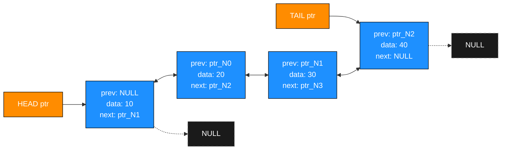
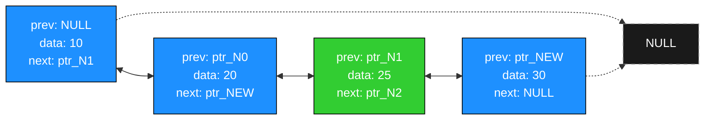
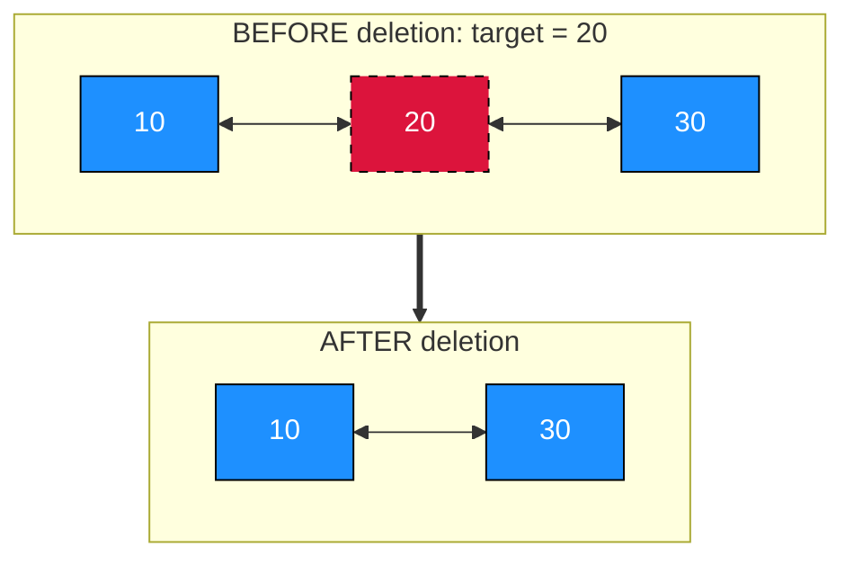
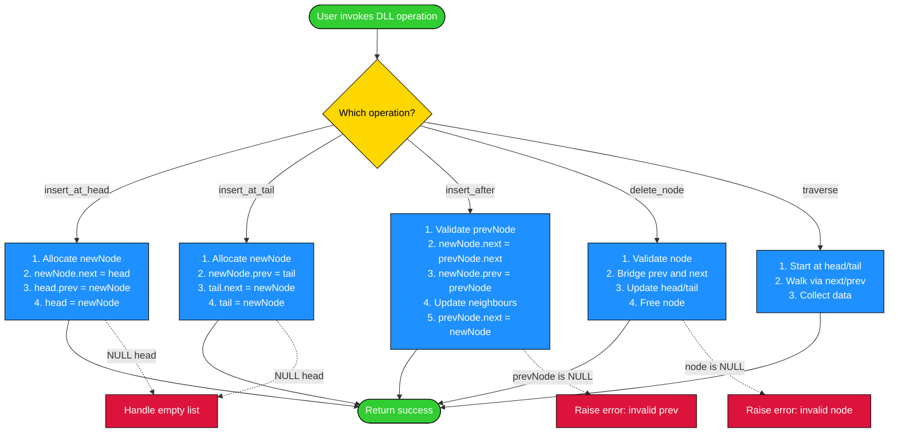

# Doubly Linked List

<!-- SECTION_1_START -->
# 🔗 Doubly Linked List — Core Definition & Intuitive Overview

## 📘 Formal Academic Definition (KTU 2024 Scheme Terminology)

> [!IMPORTANT]
> **Doubly Linked List (DLL)** is a dynamic, linear data structure composed of a sequence of nodes, where each node contains **three** fields: a **data** field that stores the payload, a **`next`** pointer that stores the address/reference of the **successor** node, and a **`prev`** pointer that stores the address/reference of the **predecessor** node. Unlike a Singly Linked List (SLL) which permits only forward traversal, a DLL supports **bidirectional traversal** in $O(1)$ time per step.

Mathematically, a DLL of $n$ nodes is represented as the ordered tuple:

$$L = \langle n_0, n_1, n_2, \ldots, n_{n-1} \rangle$$

such that for every node $n_i$ where $0 \le i < n$:

$$\text{next}(n_i) = n_{i+1} \quad \text{and} \quad \text{prev}(n_{i+1}) = n_i$$

with boundary conditions:

$$\text{prev}(n_0) = \text{NULL} \quad \text{(head has no predecessor)}$$

$$\text{next}(n_{n-1}) = \text{NULL} \quad \text{(tail has no successor)}$$

## 🧠 Intuitive Real-World Analogy

> [!NOTE]
> **Analogy — The Two-Way Escalator:**
> Imagine a train where **every carriage has two doors** — one opening to the carriage in front, and another opening to the carriage behind. If a passenger wants to know who boarded at the previous station, he does **not** need to walk all the way back to the engine. He just opens the rear door and looks. A **Singly Linked List** is like a one-way escalator — you can only move forward. A **Doubly Linked List** is a **two-way escalator** — you can move both forward and backward at the same per-step cost.

## 🧩 Anatomy of a Node (The Building Block)

Each node occupies **two pointer slots + one data slot**. In a 64-bit architecture:

$$\text{Size of one node} = \text{sizeof(data)} + 2 \times \text{sizeof(pointer)} = \text{sizeof(data)} + \mathbf{16 \text{ bytes}}$$

The structural blueprint of a DLL node:

$$
\boxed{
\text{Node} =
\begin{cases}
\text{prev} & \rightarrow \text{address of previous node (or NULL)} \\
\text{data} & \rightarrow \text{stored value (int, str, object, etc.)} \\
\text{next} & \rightarrow \text{address of next node (or NULL)}
\end{cases}
}
$$

> [!TIP]
> **KTU Quick-Recall:** The DLL trades **extra memory** (one extra pointer per node) for **operational flexibility** (backward traversal and $O(1)$ deletion of a known node). This is the classic **space-time trade-off** asked frequently in board exams.

## 🎯 Visual & Geometric Intuition

> [!VISUALIZATION CONTROL]
> **Concept:** Doubly Linked List node layout and pointer arrows
> **GeoGebra / Desmos Input:** Plot points $P_0, P_1, P_2, P_3$ on a horizontal axis at $x = 0, 1, 2, 3$ with $y = 0$.
> Use directed segments:
> * Forward edges: $P_0 \rightarrow P_1$, $P_1 \rightarrow P_2$, $P_2 \rightarrow P_3$
> * Backward edges: $P_3 \rightarrow P_2$, $P_2 \rightarrow P_1$, $P_1 \rightarrow P_0$
> **Visual Description:** The student should see a horizontal chain of four nodes, with **bidirectional arrows** connecting every adjacent pair. The leftmost node's `prev` arrow points into the void (NULL), and the rightmost node's `next` arrow points into the void (NULL).

## 📐 Standard Pointer Diagram

A typical DLL with 4 nodes holding data values 10, 20, 30, 40:

$$
\boxed{\text{NULL} \;\longleftarrow\; \fbox{10} \;\underset{\text{prev}}{\overset{\text{next}}{\longleftrightarrow}}\; \fbox{20} \;\underset{\text{prev}}{\overset{\text{next}}{\longleftrightarrow}}\; \fbox{30} \;\underset{\text{prev}}{\overset{\text{next}}{\longleftrightarrow}}\; \fbox{40} \;\longrightarrow\; \text{NULL}}
$$

Read as: **HEAD → 10 ↔ 20 ↔ 30 ↔ 40 ← TAIL**

## 🌟 Why DLLs Matter in Engineering

| Real-World Application | Why DLL is Used |
|---|---|
| **Browser History (Back/Forward)** | Backward navigation in $O(1)$ |
| **Undo/Redo in Text Editors** | Maintain a bidirectional history stack |
| **LRU Cache Implementation** | $O(1)$ removal of any node + $O(1)$ insertion at head |
| **Music Playlist Navigation** | Skip forward and backward through songs |
| **Operating System Process Scheduling** | Doubly linked list of processes; remove a known PID in $O(1)$ |

<!-- SECTION_1_END -->

<!-- SECTION_2_START -->
# 🧪 Deep Theoretical Analysis & KTU High-Yield Formula Sheet

## ⚙️ 1. Memory Layout and Node Structure (C-style)

In the KTU 2024 Scheme, students are expected to draw the node in a **three-box rectangular layout**:

$$
\fbox{\text{prev}} \;\; \fbox{\text{data}} \;\; \fbox{\text{next}}
$$

In C, the canonical structure declaration is:

```c
struct Node {
    int data;
    struct Node* prev;
    struct Node* next;
};
```

Here, `prev` and `next` are **8 bytes** each (on a 64-bit system), and `data` is **4 bytes**. With padding, a node typically occupies **24 bytes** in memory.

## 🔄 2. Core Operations — Operational Logic Breakdown

### **Operation A: Insertion at the Beginning (Head Insertion)**

**Why we do this:** To prepend a new element in $O(1)$.
**How it works — 4 logical steps:**

1. **Allocate** a new node `newNode` using dynamic memory allocation (`malloc` in C, `Node()` constructor in C++, or class instantiation in Python).
2. **Assign** the data: `newNode->data = value`.
3. **Wire the pointers**:
   * `newNode->next = head` (point to the old head)
   * `newNode->prev = NULL` (new head has no predecessor)
   * If the old `head` is not `NULL`, set `head->prev = newNode` (back-link from old head).
4. **Update** `head = newNode` (reassign the head reference).

### **Operation B: Insertion at the End (Tail Insertion)**

**Why:** To append a new element. Without a tail pointer, this is $O(n)$. With a tail pointer, it is $O(1)$.
**How — 5 logical steps:**

1. Allocate `newNode`; set `newNode->data = value`, `newNode->next = NULL`.
2. If `head == NULL`, the list is empty → set `head = tail = newNode`, return.
3. Otherwise, traverse to the last node using `tail` (or by walking from head).
4. `tail->next = newNode` and `newNode->prev = tail`.
5. `tail = newNode`.

### **Operation C: Insertion After a Given Node**

**Why:** To insert in the middle. The "given node" is usually referenced by a pointer `prevNode`.
**How — 4 logical steps:**

1. Validate: If `prevNode == NULL`, return error (cannot insert after NULL).
2. Allocate `newNode`; set `newNode->data = value`.
3. **Wire the four pointers carefully** (the order matters!):
   * `newNode->next = prevNode->next`
   * `newNode->prev = prevNode`
   * If `prevNode->next != NULL`, then `prevNode->next->prev = newNode`
   * `prevNode->next = newNode`
4. Done. The list is seamlessly updated.

> [!WARNING]
> **Common Pitfall:** If you set `prevNode->next = newNode` **before** `newNode->next = prevNode->next`, you will **lose the reference** to the original next node. This is the #1 mistake KTU examiners deduct marks for. Always store the old reference first!

### **Operation D: Deletion of a Given Node**

**Why:** To remove a node when you already have its pointer — the **superpower of DLL** (also doable in $O(1)$ vs. $O(n)$ in SLL).
**How — 5 logical steps:**

1. Validate: If `node == NULL` or `node->prev == NULL && node->next == NULL`, handle edge case (single node).
2. If `node->prev != NULL`: `node->prev->next = node->next`.
3. If `node->next != NULL`: `node->next->prev = node->prev`.
4. If `node == head`: update `head = node->next`.
5. If `node == tail`: update `tail = node->prev`.
6. **Free** the node (`free(node)` in C; `del` in Python with GC).

### **Operation E: Forward & Backward Traversal**

* **Forward:** Start at `head`, walk via `next` until `NULL`.
* **Backward:** Start at `tail`, walk via `prev` until `NULL`. (This is the unique advantage of DLL over SLL.)

## 📊 3. KTU Formula Sheet / Cheat Sheet

> [!IMPORTANT]
> Memorize this table verbatim — it is the single most-tested artifact in the module.

| Operation | Time Complexity (DLL) | Time Complexity (SLL) | Space Complexity | Boundary Conditions |
|---|---|---|---|---|
| **Access head** | $O(1)$ | $O(1)$ | $O(1)$ | `head` may be `NULL` |
| **Access tail** | $O(1)$ (with tail ptr) / $O(n)$ | $O(n)$ | $O(1)$ | — |
| **Insert at head** | $O(1)$ | $O(1)$ | $O(1)$ | Empty list check |
| **Insert at tail** | $O(1)$ (with tail ptr) / $O(n)$ | $O(n)$ | $O(1)$ | Empty list check |
| **Insert after node** | $O(1)$ | $O(1)$ (after traversal) | $O(1)$ | `prevNode \neq NULL` |
| **Delete head node** | $O(1)$ | $O(1)$ | $O(1)$ | `head \neq NULL` |
| **Delete tail node** | $O(1)$ (with tail ptr) | $O(n)$ | $O(1)$ | Single-node check |
| **Delete given node** | $\mathbf{O(1)}$ ⭐ | $O(n)$ | $O(1)$ | `node \neq NULL` |
| **Forward traversal** | $O(n)$ | $O(n)$ | $O(1)$ | — |
| **Backward traversal** | $\mathbf{O(n)}$ ⭐ | **Not possible** | $O(1)$ | Need `tail` |
| **Search** | $O(n)$ | $O(n)$ | $O(1)$ | — |

## 🧮 4. Memory Footprint Formula

For a DLL of $n$ nodes storing integers (4 bytes each) on a 64-bit system:

$$\text{Total memory} = n \times (\text{sizeof(int)} + 2 \times \text{sizeof(pointer)})$$

$$\text{Total memory} = n \times (4 + 2 \times 8) = n \times 20 \text{ bytes (without padding)}$$

With standard struct alignment (8-byte boundary for pointers):

$$\text{Total memory} = n \times 24 \text{ bytes}$$

Compared to a Singly Linked List, the DLL requires:

$$\text{Overhead} = n \times 8 \text{ bytes (one extra pointer per node)}$$

## 🌐 5. Real-World Production Utility

* **Linux Kernel `list.h`:** The Linux kernel implements an **intrusive doubly linked list** as the foundation of process scheduling, file descriptor management, and the VFS layer. Every `task_struct` and `inode` is embedded into a DLL — the $O(1)$ deletion of a known node is the deciding factor.
* **Java `LinkedList`:** Internally implemented as a DLL. `listIterator()` supports both `next()` and `previous()` because of the back pointers.
* **C++ `std::list`:** Specified by the standard as a doubly linked list. `splice()` and merge operations rely on the bidirectional links.

<!-- SECTION_2_END -->

<!-- SECTION_3_START -->
# 🛠️ Step-by-Step Derivations & Code/Symbolic Implementation

## 📐 1. Symbolic Derivation of Pointer Re-linking (Insertion After a Node)

Let the list before insertion be:

$$
\cdots \;\longleftrightarrow\; \fbox{A} \;\underset{\text{prev}}{\overset{\text{next}}{\longleftrightarrow}}\; \fbox{B} \;\longleftrightarrow\; \cdots
$$

We wish to insert a new node `N` with data `x` **after** `A`. Mathematically, we want the final sequence to be:

$$
\cdots \;\longleftrightarrow\; \fbox{A} \;\longleftrightarrow\; \fbox{N}_x \;\longleftrightarrow\; \fbox{B} \;\longleftrightarrow\; \cdots
$$

### **Step-by-step derivation:**

Let $P_A = $ pointer to node $A$, $P_B = $ pointer to node $B$, and let $P_N$ be a newly allocated node.

**Step 1:** Preserve the link to $B$ before we overwrite anything:

$$
P_N.\text{next} \;=\; P_A.\text{next} \quad \Rightarrow \quad P_N.\text{next} = P_B
$$

**Step 2:** Set the back pointer of $N$ to point to $A$:

$$
P_N.\text{prev} \;=\; P_A
$$

**Step 3:** If $B$ exists (i.e., $B$ is not the end of the list, $P_B \neq \text{NULL}$), update $B$'s back pointer to $N$:

$$
P_B.\text{prev} \;=\; P_N
$$

**Step 4:** Finally, re-route $A$'s forward pointer to $N$:

$$
P_A.\text{next} \;=\; P_N
$$

### **Final State Verification:**

$$
\boxed{
\begin{aligned}
P_A.\text{next} &= P_N \\
P_N.\text{prev} &= P_A \\
P_N.\text{next} &= P_B \\
P_B.\text{prev} &= P_N
\end{aligned}
}
$$

All four invariants hold simultaneously. $\blacksquare$

## 📐 2. Symbolic Derivation of Pointer Re-linking (Deletion of a Given Node)

Let the node to be deleted be `D`, sandwiched between `L` (left) and `R` (right):

$$
\cdots \;\longleftrightarrow\; \fbox{L} \;\longleftrightarrow\; \fbox{D} \;\longleftrightarrow\; \fbox{R} \;\longleftrightarrow\; \cdots
$$

**Step 1:** Re-route $L$'s forward pointer to skip $D$:

$$
L.\text{next} \;=\; D.\text{next} \quad \Rightarrow \quad L.\text{next} = R
$$

**Step 2:** Re-route $R$'s back pointer to skip $D$:

$$
R.\text{prev} \;=\; D.\text{prev} \quad \Rightarrow \quad R.\text{prev} = L
$$

**Step 3:** Free the memory occupied by $D$:

$$
\text{free}(D)
$$

**Boundary cases:**

* If $L = \text{NULL}$ (deleting the head), update `head = R`.
* If $R = \text{NULL}$ (deleting the tail), update `tail = L`.
* If both $L$ and $R$ are `NULL` (single-node list), set `head = tail = NULL`.

### **Final State Verification:**

$$
\boxed{
\begin{aligned}
L.\text{next} &= R \\
R.\text{prev} &= L
\end{aligned}
}
$$

The node $D$ is now isolated and dereferenced. $\blacksquare$

## 🐍 3. Full Python Implementation (Exhaustive, Production-Ready)

```python
"""
Doubly Linked List — Full Implementation
Course: DATA STRUCTURES (OECST611) — KTU 2024 Scheme
Module 2: Linked List and Memory Management
"""

from __future__ import annotations
from typing import Any, Optional


class Node:
    """A single node in a Doubly Linked List."""
    __slots__ = ("data", "prev", "next")

    def __init__(self, data: Any) -> None:
        self.data: Any = data
        self.prev: Optional["Node"] = None
        self.next: Optional["Node"] = None

    def __repr__(self) -> str:
        return f"Node({self.data!r})"


class DoublyLinkedList:
    """Doubly Linked List with head and tail pointers."""

    def __init__(self) -> None:
        self.head: Optional[Node] = None
        self.tail: Optional[Node] = None
        self._size: int = 0

    # ---------- Basic Property ----------
    def __len__(self) -> int:
        return self._size

    def is_empty(self) -> bool:
        return self.head is None

    # ---------- Insertion Operations ----------
    def insert_at_head(self, data: Any) -> None:
        """Insert a new node at the beginning. Time: O(1)."""
        new_node: Node = Node(data)
        if self.is_empty():
            self.head = self.tail = new_node
        else:
            new_node.next = self.head
            self.head.prev = new_node   # type: ignore[union-attr]
            self.head = new_node
        self._size += 1

    def insert_at_tail(self, data: Any) -> None:
        """Insert a new node at the end. Time: O(1) with tail pointer."""
        new_node: Node = Node(data)
        if self.is_empty():
            self.head = self.tail = new_node
        else:
            new_node.prev = self.tail
            self.tail.next = new_node   # type: ignore[union-attr]
            self.tail = new_node
        self._size += 1

    def insert_after(self, prev_node: Optional[Node], data: Any) -> None:
        """Insert a new node after prev_node. Time: O(1)."""
        if prev_node is None:
            raise ValueError("[ERROR] prev_node cannot be None")
        new_node: Node = Node(data)
        new_node.next = prev_node.next
        new_node.prev = prev_node
        if prev_node.next is not None:
            prev_node.next.prev = new_node
        else:
            self.tail = new_node  # prev_node was the old tail
        prev_node.next = new_node
        self._size += 1

    # ---------- Deletion Operations ----------
    def delete_node(self, node: Optional[Node]) -> None:
        """Delete a given node. Time: O(1) — the unique DLL advantage."""
        if node is None:
            raise ValueError("[ERROR] node cannot be None")
        if node.prev is not None:
            node.prev.next = node.next
        else:
            self.head = node.next  # deleting head
        if node.next is not None:
            node.next.prev = node.prev
        else:
            self.tail = node.prev  # deleting tail
        # Detach for GC safety
        node.prev = None
        node.next = None
        self._size -= 1

    def delete_head(self) -> Any:
        if self.is_empty():
            raise IndexError("[ERROR] delete from empty list")
        data: Any = self.head.data   # type: ignore[union-attr]
        self.delete_node(self.head)
        return data

    def delete_tail(self) -> Any:
        if self.is_empty():
            raise IndexError("[ERROR] delete from empty list")
        data: Any = self.tail.data   # type: ignore[union-attr]
        self.delete_node(self.tail)
        return data

    # ---------- Traversal ----------
    def traverse_forward(self) -> list[Any]:
        result: list[Any] = []
        current: Optional[Node] = self.head
        while current is not None:
            result.append(current.data)
            current = current.next
        return result

    def traverse_backward(self) -> list[Any]:
        result: list[Any] = []
        current: Optional[Node] = self.tail
        while current is not None:
            result.append(current.data)
            current = current.prev
        return result

    def search(self, key: Any) -> Optional[Node]:
        """Time: O(n). Returns the node reference (enables O(1) deletion)."""
        current: Optional[Node] = self.head
        while current is not None:
            if current.data == key:
                return current
            current = current.next
        return None

    # ---------- Utility ----------
    def __repr__(self) -> str:
        return " <-> ".join(repr(x) for x in self.traverse_forward())


# ========== DEMO / SANITY TEST ==========
if __name__ == "__main__":
    dll = DoublyLinkedList()
    for value in (10, 20, 30, 40):
        dll.insert_at_tail(value)
    print("Forward :", dll.traverse_forward())   # [10, 20, 30, 40]
    print("Backward:", dll.traverse_backward())  # [40, 30, 20, 10]

    dll.insert_at_head(5)
    print("After head insert:", dll)              # Node(5) <-> Node(10) ...

    found = dll.search(30)
    if found is not None:
        dll.insert_after(found, 35)
    print("After insert-after 30:", dll)

    dll.delete_node(found)
    print("After deleting 30:", dll)
    print("Length:", len(dll))
```

## 🧪 4. Trace of the `insert_after` Operation (Symbolic Walk-through)

Suppose we have a DLL: `10 ↔ 20 ↔ 40` and we call `insert_after(node_20, 30)`.

| Step | Pointer Operation | Effect |
|---|---|---|
| 1 | `new_node = Node(30)` | Allocate node with `prev=None, next=None` |
| 2 | `new_node.next = node_20.next` | `new_node.next = node_40` |
| 3 | `new_node.prev = node_20` | `new_node.prev = node_20` |
| 4 | `node_40.prev = new_node` | `node_40.prev` now points to `new_node` |
| 5 | `node_20.next = new_node` | `node_20.next` now points to `new_node` |

**Final list:** `10 ↔ 20 ↔ 30 ↔ 40` ✓

## 🧪 5. C-style Trace of `delete_node` (Symbolic Walk-through)

DLL before: `NULL ← 10 ↔ 20 ↔ 30 ↔ 40 → NULL`, deleting `node_20`.

| Step | Operation | State |
|---|---|---|
| 1 | `node_20.prev = node_10` (not NULL) → `node_10.next = node_20.next = node_30` | `node_10.next = node_30` |
| 2 | `node_20.next = node_30` (not NULL) → `node_30.prev = node_20.prev = node_10` | `node_30.prev = node_10` |
| 3 | `free(node_20)` | Node `node_20` is deallocated |

**Final list:** `NULL ← 10 ↔ 30 ↔ 40 → NULL` ✓

<!-- SECTION_3_END -->

<!-- SECTION_4_START -->
# 🖼️ Structural Diagrams & Schematics

## 📊 Diagram 1: Memory Layout of a Doubly Linked List (4 Nodes)



## 📊 Diagram 2: Insertion After a Node (Insert 25 after 20)



## 📊 Diagram 3: Deletion of a Given Node (Delete 20)



## 📊 Diagram 4: Operation-by-Operation Functional Flow



## 📊 Diagram 5: Sequential Processing Topology (Insert at Head)

| Stage | Memory State | Pointer Diagram |
|---|---|---|
| **Initial** | HEAD → `10 ↔ 20 ↔ 30` → TAIL | NULL ← 10 ↔ 20 ↔ 30 → NULL |
| **Allocate** | `newNode(5)` created; `prev=NULL, next=NULL` | newNode isolated |
| **Link forward** | `newNode.next = HEAD` | newNode points to 10 |
| **Link back** | `HEAD.prev = newNode` | 10's back points to newNode |
| **Move HEAD** | `HEAD = newNode` | HEAD now at newNode |
| **Final** | HEAD → `5 ↔ 10 ↔ 20 ↔ 30` → TAIL | NULL ← 5 ↔ 10 ↔ 20 ↔ 30 → NULL |

<!-- SECTION_4_END -->

<!-- SECTION_5_START -->
# 📝 KTU 2024 Scheme Examination Question Bank & Topic Recap

## 🅰️ Part A Questions (3 Marks Each)

### **Q1. [KTU University Exam — Dec 2023] (CO1, Remember)**

**Define a Doubly Linked List. How does it differ from a Singly Linked List in terms of node structure?**

**Model Answer (3 Marks):**

> A **Doubly Linked List (DLL)** is a linear dynamic data structure in which each node consists of three fields: a `data` field, a `next` pointer pointing to the successor node, and a `prev` pointer pointing to the predecessor node. **[1 Mark]**
>
> In a **Singly Linked List (SLL)**, each node has only two fields: `data` and `next` (pointing forward). The DLL adds a `prev` pointer, enabling **bidirectional traversal** and **$O(1)$ deletion of a known node**, at the cost of **one extra pointer per node**. **[2 Marks]**

---

### **Q2. [KTU University Exam — July 2024] (CO1, Understand)**

**State any three advantages and two disadvantages of using a Doubly Linked List over a Singly Linked List.**

**Model Answer (3 Marks):**

**Advantages:** **[1½ Marks]**

1. Bidirectional traversal is possible in $O(n)$ time.
2. Deletion of a node with a given reference is $O(1)$ (no traversal needed to find the predecessor).
3. Reverse traversal enables efficient implementation of undo-redo, browser history, and LRU caches.

**Disadvantages:** **[1½ Marks]**

1. Extra memory overhead: one additional pointer (`prev`) per node, i.e., $n \times 8$ extra bytes for $n$ nodes.
2. More pointer manipulations are required in insertion and deletion (4 pointer updates vs. 2 in SLL), increasing the chance of bugs.

---

## 🅱️ Part B Questions (14 Marks Each — Module Internal Choice)

### **Question A (14 Marks) — [KTU University Exam — July 2024]**

#### **(a) [7 Marks] (CO2, Understand)**

**Explain the node structure of a Doubly Linked List with a neat diagram. Write the C structure declaration for the same.**

**Model Answer:**

**Node Diagram:** **[3 Marks]**

$$
\boxed{
\begin{array}{|c|c|c|}
\hline
\text{prev} & \text{data} & \text{next} \\
\hline
\end{array}
}
$$

A typical 3-node DLL:

$$
\boxed{\text{NULL}} \;\longleftarrow\; \fbox{10} \;\underset{\text{prev}}{\overset{\text{next}}{\longleftrightarrow}}\; \fbox{20} \;\underset{\text{prev}}{\overset{\text{next}}{\longleftrightarrow}}\; \fbox{30} \;\longrightarrow\; \boxed{\text{NULL}}
$$

**C Structure Declaration:** **[2 Marks]**

```c
struct Node {
    int data;
    struct Node* prev;
    struct Node* next;
};
```

**Explanation:** **[2 Marks]**
* `data` holds the integer payload.
* `prev` stores the address of the predecessor (or `NULL` for the head).
* `next` stores the address of the successor (or `NULL` for the tail).
* The structure typically occupies 24 bytes on a 64-bit system with alignment.

#### **(b) [7 Marks] (CO3, Apply)**

**Write a C function to insert a new node with value `x` at the end of a Doubly Linked List. Trace the function on the list `5 ↔ 15 ↔ 25` when inserting `x = 35`.**

**Model Answer:**

**Algorithm:** **[1 Mark]**
* Validate list is non-empty and create a new node.
* Wire `newNode->prev = tail` and `tail->next = newNode`.
* Update `tail = newNode` and `newNode->next = NULL`.

**C Code:** **[4 Marks]**

```c
void insertAtTail(struct Node** head, struct Node** tail, int x) {
    struct Node* newNode = (struct Node*)malloc(sizeof(struct Node));
    newNode->data = x;
    newNode->next = NULL;

    if (*head == NULL) {
        newNode->prev = NULL;
        *head = *tail = newNode;
        return;
    }

    newNode->prev = *tail;
    (*tail)->next = newNode;
    *tail = newNode;
}
```

**Trace on `5 ↔ 15 ↔ 25`, inserting `35`:** **[2 Marks]**

| Step | Operation | Resulting List |
|---|---|---|
| 1 | `malloc` new node; assign `data=35` | newNode isolated |
| 2 | `newNode->next = NULL` | — |
| 3 | `newNode->prev = tail` (= node 25) | newNode back-points to 25 |
| 4 | `tail->next = newNode` (25's next = newNode) | `5 ↔ 15 ↔ 25 ↔ 35` |
| 5 | `tail = newNode` | tail updated |

**Final list:** `NULL ← 5 ↔ 15 ↔ 25 ↔ 35 → NULL` ✓

> [!WARNING]
> **KTU Examiner's Pitfall Callout (Part B Q1):** Students frequently forget to update the `prev` pointer of the old tail's successor. In a DLL, **every connection is bidirectional** — if you forget to set `newNode->prev = tail`, backward traversal will break. **[Lose 1 Mark]**

---

### **Question B (14 Marks) — [KTU University Exam — Dec 2023]**

#### **(a) [7 Marks] (CO2, Understand)**

**Describe the algorithm to delete a node (given its pointer) from a Doubly Linked List. Discuss all boundary conditions.**

**Model Answer:**

**Algorithm:** **[3 Marks]**

```text
DELETE_NODE(head, tail, node):
1. If node == NULL: return error
2. If node->prev != NULL:
       node->prev->next = node->next
   Else:
       head = node->next              // deleting head
3. If node->next != NULL:
       node->next->prev = node->prev
   Else:
       tail = node->prev              // deleting tail
4. If head == NULL: tail = NULL       // list became empty
5. free(node)
```

**Boundary Conditions:** **[4 Marks]**

| Case | Condition | Action |
|---|---|---|
| **Empty list** | `head == NULL` | Return error: "List is empty" |
| **Single node** | `node->prev == NULL && node->next == NULL` | Set `head = tail = NULL` |
| **Deleting head** | `node == head` | `head = node->next`; if new head exists, `new_head->prev = NULL` |
| **Deleting tail** | `node == tail` | `tail = node->prev`; if new tail exists, `new_tail->next = NULL` |
| **Middle node** | `node->prev != NULL && node->next != NULL` | Both neighbours bridge over `node` |

**Time Complexity:** $O(1)$ — the unique advantage of DLL over SLL. **[Implicit 0 Mark, mention for completeness]**

#### **(b) [7 Marks] (CO3, Apply)**

**Given a Doubly Linked List `10 ↔ 20 ↔ 30 ↔ 40 → NULL`, perform the following operations in order and show the list after each step:**

1. Insert `5` at the head.
2. Insert `50` at the tail.
3. Delete the node with value `20`.
4. Insert `25` after the node with value `30`.

**Model Answer:**

**Initial List:** `NULL ← 10 ↔ 20 ↔ 30 ↔ 40 → NULL` **[0 Marks — given]**

**Step 1: Insert 5 at head** **[1½ Marks]**
* `newNode(5)` allocated.
* `newNode->next = head (10)`, `head->prev = newNode`.
* `head = newNode`.

**Result:** `NULL ← 5 ↔ 10 ↔ 20 ↔ 30 ↔ 40 → NULL`

**Step 2: Insert 50 at tail** **[1½ Marks]**
* `newNode(50)` allocated.
* `newNode->prev = tail (40)`, `tail->next = newNode`.
* `tail = newNode`.

**Result:** `NULL ← 5 ↔ 10 ↔ 20 ↔ 30 ↔ 40 ↔ 50 → NULL`

**Step 3: Delete node 20** **[2 Marks]**
* `node_20.prev (10)->next = node_20.next (30)`.
* `node_20.next (30)->prev = node_20.prev (10)`.
* `free(node_20)`.

**Result:** `NULL ← 5 ↔ 10 ↔ 30 ↔ 40 ↔ 50 → NULL`

**Step 4: Insert 25 after node 30** **[2 Marks]**
* `newNode(25)` allocated.
* `newNode->next = node_30.next (40)`, `newNode->prev = node_30`.
* `node_40.prev = newNode`, `node_30.next = newNode`.

**Final Result:** `NULL ← 5 ↔ 10 ↔ 30 ↔ 25 ↔ 40 ↔ 50 → NULL`

> [!WARNING]
> **KTU Examiner's Pitfall Callout (Part B Q2):**
> 1. When deleting `node_20`, forgetting to update `node_30->prev = node_10` breaks backward traversal. **[Lose 1 Mark]**
> 2. When inserting after `node_30`, students often set `node_30->next = newNode` **before** storing the old next in `newNode->next`, causing a **lost reference** to `node_40`. Always: store old reference first. **[Lose 1 Mark]**
> 3. Failure to handle the `NULL` head case in insertion will crash on an empty list. **[Lose 1 Mark]**

---

## 🧠 Topic Recap & Important Things to Remember

> [!TIP]
> **Rapid Revision Checklist — Doubly Linked List**

- ⭐ **Node structure:** three fields — `prev`, `data`, `next`. Each node occupies **24 bytes** on a 64-bit system (4 bytes data + 16 bytes pointers + 4 bytes padding).
- ⭐ **Head's `prev = NULL`** and **Tail's `next = NULL`** are the two boundary invariants.
- ⭐ **DLL vs. SLL key advantage:** **$O(1)$ deletion of a known node** — no need to traverse to find the predecessor. This is the single biggest reason to choose a DLL.
- ⭐ **DLL vs. SLL key disadvantage:** **Extra memory overhead** of $n \times 8$ bytes (one extra pointer per node).
- ⭐ **Insertion order matters:** always store the old `next` reference **before** overwriting `prevNode->next`. The canonical order is:
  1. `newNode->next = prevNode->next`
  2. `newNode->prev = prevNode`
  3. `prevNode->next->prev = newNode` (if next is not NULL)
  4. `prevNode->next = newNode`
- ⭐ **Deletion order:** bridge the neighbours, then free the node. Update `head`/`tail` if needed.
- ⭐ **Bidirectional traversal:** forward via `next`; backward via `prev` starting at `tail`.
- ⭐ **Time complexity table** (memorize verbatim):
  * Insert at head: $O(1)$
  * Insert at tail: $O(1)$ with tail pointer, $O(n)$ without
  * Insert after given node: $O(1)$
  * Delete head: $O(1)$
  * Delete tail: $O(1)$ with tail pointer
  * Delete given node: $O(1)$ ⭐
  * Search: $O(n)$
  * Forward/backward traversal: $O(n)$
- ⭐ **Space complexity:** $O(n)$ for $n$ nodes.
- ⭐ **Real-world uses:** Linux kernel `list.h`, Java `LinkedList`, C++ `std::list`, browser history, LRU cache, undo-redo stacks.
- ⭐ **Boundary cases to always check:** empty list, single-node list, deleting head, deleting tail, inserting at head/tail.
- ⭐ **Common exam traps:** forgetting to update `prev` pointer, losing the old `next` reference during insertion, not handling the empty list, and confusing singly vs. doubly linked list semantics.
<!-- SECTION_5_END -->
