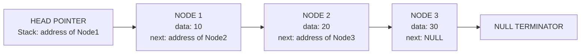
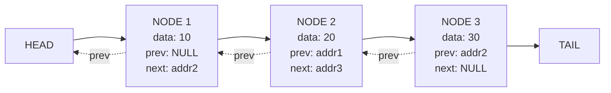
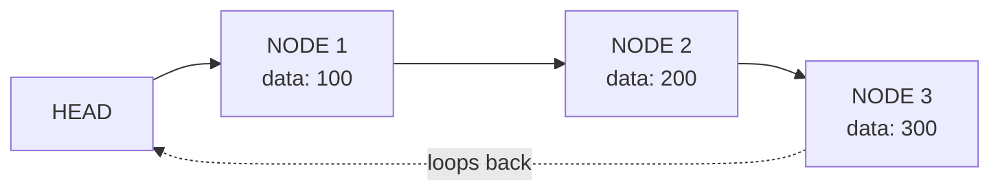
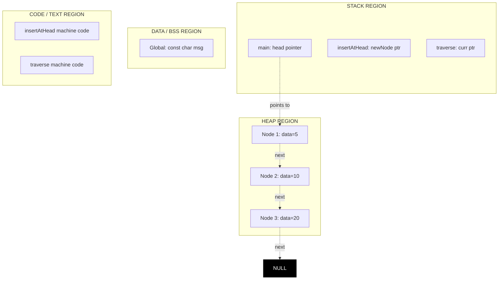
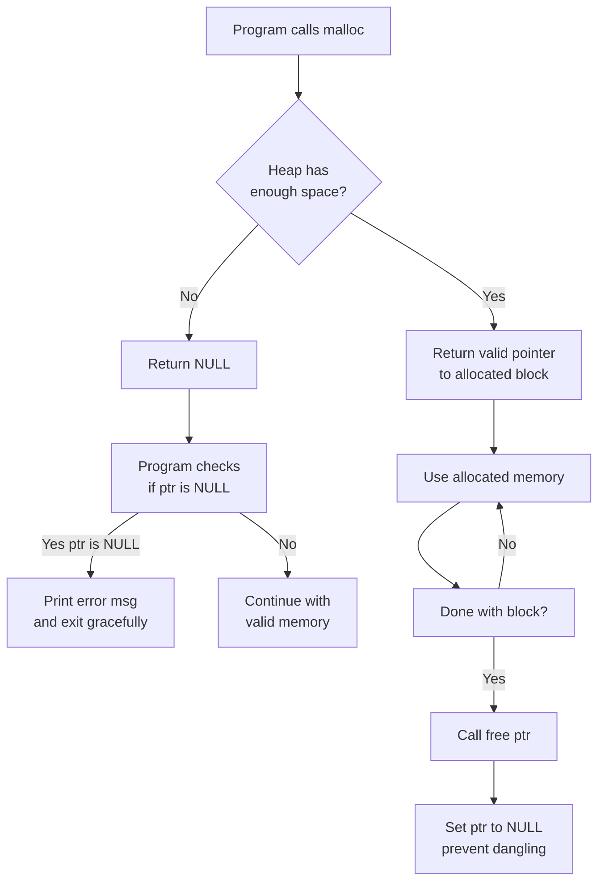

# Linked List and Memory Management

<!-- SECTION_1_START -->
# Linked List and Memory Management — Core Foundations

## 1.1 Formal Academic Definition

A **Linked List** is a linear, dynamic data structure consisting of a sequence of **nodes**, where each node contains two fundamental components:

1. **Data field** — stores the actual payload (integer, float, string, object reference, etc.).
2. **Link / Pointer field** — stores the memory address of the next (and/or previous) node in the sequence.

Unlike static arrays, a linked list does **not require contiguous memory allocation**. Each node is allocated independently in the heap memory using dynamic memory allocation functions, and they are logically chained through pointer references.

> [!IMPORTANT]
> **KTU 2024 Syllabus Highlight (OECST611 — Module 2):**
> The module mandates the study of **Singly, Doubly, and Circular Linked Lists**, **Dynamic Memory Allocation** in C/C++ (`malloc`, `calloc`, `realloc`, `free`), and **Memory Leak / Dangling Pointer** issues. Stack vs Heap memory models are also part of the expected outcomes.

## 1.2 Conceptual Analogy — The "Treasure Hunt" Model

Imagine a **treasure hunt** in your campus:

- The **first clue (head pointer)** tells you where the first clue box is located (anywhere on campus).
- Inside each clue box, you find **(i)** the actual treasure (the data) and **(ii)** a map to the *next* clue box's location.
- The last box contains a map saying **"Stop, no more boxes"** — represented as `NULL` in the linked list.

> **Why is this powerful?**
> You do *not* need the boxes to be placed in consecutive lockers (as an array requires). You can place them in Locker 7, then Locker 102, then Locker 3 — scattered across the campus — yet they form a logical sequence through the maps (pointers).

## 1.3 Memory Management — Formal Definition

**Memory Management** refers to the mechanism by which a program allocates, uses, and releases memory during its execution. In the context of linked lists, this primarily happens in the **Heap** region of the process address space.

| Memory Region | Lifetime | Managed By | Linked List Relevance |
|---|---|---|---|
| **Stack** | Function-scope (auto) | Compiler | Stores local pointer variables (e.g., `head`) |
| **Heap** | Programmer-controlled | `malloc` / `free` | Stores actual nodes of the linked list |
| **Data Segment** | Program lifetime | OS Loader | Stores global/static pointers |
| **Code Segment** | Read-only | OS Loader | Stores program instructions |

> [!NOTE]
> **Standard Metric in KTU Boards:** The size of a node in a Singly Linked List containing an `int` data field and a pointer on a 64-bit system is computed as:
>
> $$\text{Node Size} = \text{sizeof(data)} + \text{sizeof(pointer)} = 4 \text{ bytes} + 8 \text{ bytes} = 12 \text{ bytes (or padded to 16 bytes)}$$

> [!VISUALIZATION CONTROL]
> **Concept:** Node Anatomy & Pointer Linking
> **GeoGebra / Desmos Input Points:**
> * `A = (0, 0)` — Represents the Head pointer address
> * `B = (2, 0)` — Represents Node 1 address
> * `C = (4, 0)` — Represents Node 2 address
> * `D = (6, 0)` — Represents Node 3 address
> **Visual Description:** A horizontal sequence of four points (0, 2, 4, 6) connected by directed arrows illustrates the logical chaining of a singly linked list across non-contiguous heap memory addresses. Each point corresponds to a heap-allocated node.

## 1.4 Why Linked Lists Over Arrays?

| Criterion | Static Array | Linked List |
|---|---|---|
| Memory Layout | **Contiguous** | **Non-contiguous** |
| Size | Fixed at compile time | **Dynamic** — grows/shrinks at runtime |
| Access Time | $O(1)$ random access | $O(n)$ sequential access |
| Insertion/Deletion | $O(n)$ — shifting required | $O(1)$ at known position — pointer retarget |
| Memory Overhead | None (data only) | Extra pointer per node |
| Cache Locality | High | Low (scattered allocations) |

---

<!-- SECTION_1_END -->

<!-- SECTION_2_START -->
# Deep Theoretical Analysis — Linked List Topologies & Memory Mechanics

## 2.1 Taxonomy of Linked Lists

### 2.1.1 Singly Linked List (SLL)
Each node contains **one pointer** (`next`) referencing the subsequent node. The last node's `next` field stores `NULL`.

### 2.1.2 Doubly Linked List (DLL)
Each node contains **two pointers** — `prev` and `next` — enabling traversal in both directions at the cost of higher memory overhead.

### 2.1.3 Circular Linked List (CLL)
The `next` pointer of the last node loops back to the **head**, eliminating the `NULL` terminator. Two variants exist: **Circular SLL** and **Circular DLL**.

## 2.2 Core Operations — Time & Space Complexity

| Operation | Singly LL | Doubly LL | Circular LL |
|---|---|---|---|
| **Traversal** | $O(n)$ | $O(n)$ | $O(n)$ |
| **Insert at Head** | $O(1)$ | $O(1)$ | $O(1)$ |
| **Insert at Tail** | $O(n)$ (or $O(1)$ with tail ptr) | $O(1)$ with tail ptr | $O(1)$ with tail ptr |
| **Insert at Position k** | $O(k)$ | $O(\min(k, n-k))$ | $O(k)$ |
| **Delete at Head** | $O(1)$ | $O(1)$ | $O(1)$ |
| **Delete at Tail** | $O(n)$ | $O(1)$ with tail ptr | $O(1)$ |
| **Search** | $O(n)$ | $O(n)$ | $O(n)$ |
| **Space per Node** | $\text{sizeof(data)} + \text{sizeof(ptr)}$ | $\text{sizeof(data)} + 2 \cdot \text{sizeof(ptr)}$ | Same as SLL/DLL |

## 2.3 Dynamic Memory Allocation Functions (C/C++)

> [!IMPORTANT]
> These four functions are **mandatory KTU exam content** under the *"Memory Management"* sub-topic of Module 2.

### `malloc(size)` — Memory Allocation
Allocates `size` bytes of **uninitialized** heap memory. Returns `void*` (must be type-cast).

### `calloc(count, size)` — Contiguous Allocation
Allocates memory for an array of `count` elements, each of `size` bytes, **zero-initialized**.

### `realloc(ptr, new_size)` — Re-allocation
Resizes a previously allocated memory block. May move the block to a new location (data is preserved up to `min(old, new)` bytes).

### `free(ptr)` — Deallocation
Releases the memory back to the heap. After `free`, the pointer becomes a **dangling pointer** if not set to `NULL`.

## 2.4 Common Memory Pitfalls

| Pitfall | Description | Consequence |
|---|---|---|
| **Memory Leak** | Allocated memory never `free()`d | Heap exhaustion, eventual crash |
| **Dangling Pointer** | Pointer used after `free()` | Undefined behavior, security risk |
| **Double Free** | `free()` called twice on same pointer | Heap corruption, crash |
| **Wild Pointer** | Uninitialized pointer dereferenced | Segmentation fault |
| **Fragmentation** | Many small allocations scattered | Wasted memory, slow allocation |

## 2.5 KTU Formula Sheet / Cheat Sheet

| Symbol / Formula | Meaning | Units / Notes |
|---|---|---|
| $N$ | Total number of nodes in the list | Integer $\geq 0$ |
| $S_{node}$ | Size of a single node | Bytes |
| $S_{node} = D + P$ | SLL node size (Data + 1 Pointer) | Bytes |
| $S_{node} = D + 2P$ | DLL node size (Data + 2 Pointers) | Bytes |
| $T_{access}(k) = O(k)$ | Time to reach $k^{th}$ node from head | Comparisons |
| $T_{insert\_head} = O(1)$ | Constant-time head insertion | Pointer reassignment |
| $T_{traverse} = O(N)$ | Full list traversal | Visits each node once |
| $M_{total} = N \cdot S_{node}$ | Total memory consumed by the list | Bytes |
| $M_{overhead} = N \cdot P$ | Pointer overhead alone | Bytes (wasted on metadata) |

> [!NOTE]
> **Engineering Utility:** Linked lists underpin OS process scheduling (Linux's `task_struct` linked list), memory allocators (free lists), LRU caches, polynomial arithmetic, symbolic computation (Lisp), and undo/redo stacks in editors.

---

<!-- SECTION_2_END -->

<!-- SECTION_3_START -->
# Step-by-Step Derivations, Implementations & Memory Algorithms

## 3.1 Node Definition & Linked List Class — Python Implementation

```python
from __future__ import annotations
from typing import Any, Optional, Iterator
import sys
import ctypes


class ListNode:
    """
    A node in a Singly Linked List.
    Mirrors the C structure:
        struct Node {
            int data;
            struct Node* next;
        };
    """

    __slots__ = ("data", "next")

    def __init__(self, data: Any, next_node: Optional["ListNode"] = None) -> None:
        self.data: Any = data
        self.next: Optional[ListNode] = next_node

    def __repr__(self) -> str:
        nxt_id: int = id(self.next) if self.next is not None else 0
        return f"ListNode(data={self.data!r}, next_id=0x{nxt_id:x})"


class SinglyLinkedList:
    """Complete SLL implementation with explicit memory accounting."""

    def __init__(self) -> None:
        self.head: Optional[ListNode] = None
        self._size: int = 0

    # ---------- Core Operations ----------

    def insert_at_head(self, data: Any) -> None:
        """Insert a new node at the head — O(1)."""
        new_node: ListNode = ListNode(data, self.head)
        self.head = new_node
        self._size += 1

    def insert_at_tail(self, data: Any) -> None:
        """Insert a new node at the tail — O(n)."""
        new_node: ListNode = ListNode(data)
        if self.head is None:
            self.head = new_node
        else:
            current: ListNode = self.head
            while current.next is not None:
                current = current.next
            current.next = new_node
        self._size += 1

    def delete_node(self, key: Any) -> bool:
        """Delete the first node with matching key — O(n)."""
        current: Optional[ListNode] = self.head
        if current is not None and current.data == key:
            self.head = current.next
            self._size -= 1
            return True
        while current is not None and current.next is not None:
            if current.next.data == key:
                current.next = current.next.next
                self._size -= 1
                return True
            current = current.next
        return False

    def search(self, key: Any) -> Optional[ListNode]:
        """Linear search — O(n). Returns node reference or None."""
        current: Optional[ListNode] = self.head
        while current is not None:
            if current.data == key:
                return current
            current = current.next
        return None

    def traverse(self) -> Iterator[Any]:
        """Generator-based traversal — O(n)."""
        current: Optional[ListNode] = self.head
        while current is not None:
            yield current.data
            current = current.next

    def __len__(self) -> int:
        return self._size

    def __del__(self) -> None:
        """
        Explicit cleanup to avoid memory leaks in CPython's refcount model.
        In C/C++ this is the user's manual `free()` traversal.
        """
        current: Optional[ListNode] = self.head
        while current is not None:
            nxt: Optional[ListNode] = current.next
            current = None  # refcount drops to 0
            current = nxt
        self.head = None
        self._size = 0
```

## 3.2 Circular Linked List Implementation

```python
class CircularLinkedList:
    """Circular SLL where tail.next points back to head."""

    def __init__(self) -> None:
        self.head: Optional[ListNode] = None

    def insert_at_head(self, data: Any) -> None:
        new_node: ListNode = ListNode(data)
        if self.head is None:
            new_node.next = new_node   # points to self
            self.head = new_node
        else:
            current: ListNode = self.head
            while current.next is not self.head:
                current = current.next
            current.next = new_node
            new_node.next = self.head
            self.head = new_node

    def traverse(self, max_steps: int = 1000) -> Iterator[Any]:
        """Bounded traversal to prevent infinite loop in cyclic structures."""
        if self.head is None:
            return
        current: ListNode = self.head
        count: int = 0
        while count < max_steps:
            yield current.data
            current = current.next
            if current is self.head:
                break
            count += 1
```

## 3.3 Doubly Linked List Implementation

```python
class DListNode:
    """Doubly linked list node with prev and next pointers."""
    __slots__ = ("data", "prev", "next")

    def __init__(self, data: Any,
                 prev: Optional["DListNode"] = None,
                 next_node: Optional["DListNode"] = None) -> None:
        self.data: Any = data
        self.prev: Optional[DListNode] = prev
        self.next: Optional[DListNode] = next_node


class DoublyLinkedList:
    def __init__(self) -> None:
        self.head: Optional[DListNode] = None
        self.tail: Optional[DListNode] = None
        self._size: int = 0

    def insert_at_head(self, data: Any) -> None:
        new_node: DListNode = DListNode(data, None, self.head)
        if self.head is not None:
            self.head.prev = new_node
        else:
            self.tail = new_node
        self.head = new_node
        self._size += 1

    def insert_at_tail(self, data: Any) -> None:
        new_node: DListNode = DListNode(data, self.tail, None)
        if self.tail is not None:
            self.tail.next = new_node
        else:
            self.head = new_node
        self.tail = new_node
        self._size += 1

    def delete_node(self, node: DListNode) -> None:
        if node.prev is not None:
            node.prev.next = node.next
        else:
            self.head = node.next
        if node.next is not None:
            node.next.prev = node.prev
        else:
            self.tail = node.prev
        node.prev = None
        node.next = None
        self._size -= 1
```

## 3.4 Dynamic Memory Allocation in C — Step-by-Step

Below is a **complete C program** mirroring the Python class. KTU examiners often ask for pointer diagrams alongside this code.

```c
#include <stdio.h>
#include <stdlib.h>

// ---- Node Definition (KTU Board Standard) ----
struct Node {
    int data;
    struct Node* next;
};

// ---- Function Prototypes ----
struct Node* createNode(int value);
void insertAtHead(struct Node** headRef, int value);
void insertAtTail(struct Node** headRef, int value);
void deleteNode(struct Node** headRef, int key);
void traverse(struct Node* head);
int  countNodes(struct Node* head);

// ---- Main Driver ----
int main(void) {
    struct Node* head = NULL;          // List initially empty

    insertAtTail(&head, 10);           // List: 10
    insertAtTail(&head, 20);           // List: 10 -> 20
    insertAtHead(&head, 5);            // List: 5 -> 10 -> 20
    insertAtTail(&head, 30);           // List: 5 -> 10 -> 20 -> 30

    printf("List contents: ");
    traverse(head);                    // Output: 5 10 20 30

    printf("Total nodes: %d\n", countNodes(head));

    deleteNode(&head, 10);
    printf("After deleting 10: ");
    traverse(head);                    // Output: 5 20 30

    // ---- Explicit Memory Cleanup ----
    struct Node* curr = head;
    while (curr != NULL) {
        struct Node* nxt = curr->next;
        free(curr);                    // Release heap memory
        curr = nxt;
    }
    head = NULL;                       // Avoid dangling pointer
    return 0;
}

// ---- Create a new node (uses malloc) ----
struct Node* createNode(int value) {
    struct Node* newNode =
        (struct Node*)malloc(sizeof(struct Node));
    if (newNode == NULL) {
        fprintf(stderr, "malloc failed!\n");
        exit(EXIT_FAILURE);
    }
    newNode->data = value;
    newNode->next = NULL;
    return newNode;
}

// ---- Insert at head ----
void insertAtHead(struct Node** headRef, int value) {
    struct Node* newNode = createNode(value);
    newNode->next = *headRef;
    *headRef = newNode;
}

// ---- Insert at tail ----
void insertAtTail(struct Node** headRef, int value) {
    struct Node* newNode = createNode(value);
    if (*headRef == NULL) {
        *headRef = newNode;
        return;
    }
    struct Node* curr = *headRef;
    while (curr->next != NULL) {
        curr = curr->next;
    }
    curr->next = newNode;
}

// ---- Delete first occurrence of key ----
void deleteNode(struct Node** headRef, int key) {
    struct Node* curr = *headRef;
    struct Node* prev = NULL;

    if (curr != NULL && curr->data == key) {
        *headRef = curr->next;
        free(curr);
        return;
    }
    while (curr != NULL && curr->data != key) {
        prev = curr;
        curr = curr->next;
    }
    if (curr == NULL) return;          // Key not found
    prev->next = curr->next;
    free(curr);
}

// ---- Traverse and print ----
void traverse(struct Node* head) {
    struct Node* curr = head;
    while (curr != NULL) {
        printf("%d ", curr->data);
        curr = curr->next;
    }
    printf("\n");
}

// ---- Count nodes ----
int countNodes(struct Node* head) {
    int count = 0;
    struct Node* curr = head;
    while (curr != NULL) {
        count++;
        curr = curr->next;
    }
    return count;
}
```

### 3.4.1 Memory Allocation Procedure — Step-by-Step Trace

Let us trace `insertAtTail(&head, 20)` when the list is `5 -> 10 -> NULL`.

**Step 1:** Function receives `headRef` whose value is the address of `head` (in caller's frame).

**Step 2:** `createNode(20)` is invoked.
- `malloc(sizeof(struct Node))` requests **16 bytes** (on 64-bit system: 4 for `int` + 8 for pointer, padded).
- Heap manager returns address, e.g., `0x7F3A8C`.
- `newNode->data = 20; newNode->next = NULL;`

**Step 3:** `*headRef` (i.e., `head`) is checked — not `NULL`, so we traverse.

**Step 4:** Traversal loop:
- Iteration 1: `curr = 5`, `curr->next != NULL` (points to `10`) → advance.
- Iteration 2: `curr = 10`, `curr->next == NULL` → exit loop.

**Step 5:** `curr->next = newNode;` rewires the old tail's pointer to the new node.

**Step 6:** Final list state: `5 -> 10 -> 20 -> NULL`.

## 3.5 Memory Layout Diagram (Heap vs Stack)

| Address (Hex) | Region | Content | Variable |
|---|---|---|---|
| `0x7FFF0001` | Stack | Pointer value `0x7F3A8C` | `head` |
| `0x7F3A8C` | Heap | `data = 5`, `next = 0x7F3A90` | Node 1 |
| `0x7F3A90` | Heap | `data = 10`, `next = 0x7F3AB4` | Node 2 |
| `0x7F3AB4` | Heap | `data = 20`, `next = 0x0` | Node 3 |

> [!NOTE]
> **Important KTU Distinction:** The variable `head` lives in the **Stack** (4 or 8 bytes), but the *nodes it points to* live in the **Heap**. The list "logically" is `5 -> 10 -> 20`, but "physically" the nodes are scattered across the heap.

---

<!-- SECTION_3_END -->

<!-- SECTION_4_START -->
# Structural Diagrams & Schematics

## 4.1 Mermaid — Singly Linked List Node Architecture



## 4.2 Mermaid — Doubly Linked List Bidirectional Flow



## 4.3 Mermaid — Circular Linked List Loop Topology



## 4.4 Mermaid — Process Memory Layout (Stack vs Heap)



## 4.5 Mermaid — Memory Allocation Failure Recovery Flow



## 4.6 Sequential Processing Topology — Insertion Operation

| Step | Action | Pointer Reassignments | Time Complexity |
|---|---|---|---|
| 1 | Allocate new node with `malloc` | `newNode->data = val; newNode->next = NULL` | $O(1)$ |
| 2 | If list empty, set `head = newNode` | Single assignment | $O(1)$ |
| 3 | Else traverse to last node | `while(curr->next != NULL)` | $O(n)$ |
| 4 | Link last node to new node | `curr->next = newNode` | $O(1)$ |
| 5 | Update size counter | `size++` | $O(1)$ |
| **Total** | | | $O(n)$ |

---

<!-- SECTION_4_END -->

<!-- SECTION_5_START -->
# KTU 2024 Scheme Examination Question Bank

## PART A — 3 Mark Questions

### Question 1
**[KTU University Exam — July 2024]** | **CO1** | **Bloom Level: Remember**

Define a linked list. How does it differ from an array in terms of memory allocation?

**Model Answer:**

A **linked list** is a linear data structure in which elements (called *nodes*) are stored at possibly non-contiguous memory locations, and each node contains a data field and one or more pointer fields that link it to the next (and/or previous) node in the sequence.

**Key differences in memory allocation:**

| Aspect | Array | Linked List |
|---|---|---|
| Memory | Contiguous, allocated in stack (local) or data segment | Non-contiguous, allocated in heap |
| Size | Fixed at compile time | Dynamic, grows/shrinks at runtime |
| Allocation | Static (or `malloc` once) | Per-node `malloc` calls |

> **[Valuation Key: 1 mark for correct definition, 1 mark for at least two valid differences, 1 mark for memory allocation distinction.]**

### Question 2
**[KTU University Exam — Dec 2023]** | **CO1** | **Bloom Level: Understand**

Explain the purpose of the `free()` function in C. What is a dangling pointer?

**Model Answer:**

The **`free()`** function in C deallocates a previously allocated memory block (allocated by `malloc`, `calloc`, or `realloc`) and returns it to the heap for future allocations. Once `free(ptr)` is called, the memory at `ptr` becomes invalid and must not be accessed.

A **dangling pointer** is a pointer that continues to reference a memory location that has already been deallocated via `free()`. Accessing through a dangling pointer leads to **undefined behavior**.

**Prevention technique:**

```c
free(ptr);
ptr = NULL;   // Now ptr does not dangle
```

> **[Valuation Key: 1.5 marks for `free()` purpose, 1.5 marks for dangling pointer definition + prevention.]**

---

## PART B — 14 Mark Questions (Internal Choice)

### Question A (14 Marks)
**[KTU University Exam — Dec 2024]** | **CO2, CO3** | **Bloom Levels: Understand, Apply**

**(a)** With a neat diagram, explain the structure of a node in a singly linked list. Discuss how insertion is performed at the **beginning** of a singly linked list. **(7 marks)**

**(b)** Write a C program to create a singly linked list with $N$ integer elements, display the list, and count the number of nodes. **(7 marks)**

#### Model Solution — Part (a)

**Node Structure (Diagram):**

```
+--------+---------+
|  data  |  next   |
+--------+---------+
   |        |
   v        v
 payload   pointer to next node
```

**C Structure Definition:**

```c
struct Node {
    int data;
    struct Node* next;
};
```

**Insertion at Beginning — Algorithm:**

1. Allocate a new node using `malloc`.
2. Assign the value to `newNode->data`.
3. Set `newNode->next = head` (the current head becomes the second node).
4. Update `head = newNode` so the new node is now the first.

**Pointer Diagram Before Insertion (inserting value 5 into `10 -> 20 -> NULL`):**

```
HEAD --> [10|next] --> [20|NULL]
```

**After `insertAtHead(head, 5)`:**

```
HEAD --> [5|next] --> [10|next] --> [20|NULL]
```

**C Code Snippet:**

```c
void insertAtHead(struct Node** headRef, int value) {
    struct Node* newNode = (struct Node*)malloc(sizeof(struct Node));
    newNode->data = value;
    newNode->next = *headRef;
    *headRef = newNode;
}
```

> **[Valuation Key: 2 marks for diagram, 2 marks for algorithm steps, 2 marks for pointer logic, 1 mark for time complexity statement.]**

#### Model Solution — Part (b)

```c
#include <stdio.h>
#include <stdlib.h>

struct Node {
    int data;
    struct Node* next;
};

struct Node* createNode(int value) {
    struct Node* n = (struct Node*)malloc(sizeof(struct Node));
    n->data = value;
    n->next = NULL;
    return n;
}

void insertAtTail(struct Node** headRef, int value) {
    struct Node* newNode = createNode(value);
    if (*headRef == NULL) {
        *headRef = newNode;
        return;
    }
    struct Node* curr = *headRef;
    while (curr->next != NULL) curr = curr->next;
    curr->next = newNode;
}

void display(struct Node* head) {
    struct Node* curr = head;
    while (curr != NULL) {
        printf("%d -> ", curr->data);
        curr = curr->next;
    }
    printf("NULL\n");
}

int countNodes(struct Node* head) {
    int count = 0;
    struct Node* curr = head;
    while (curr != NULL) {
        count++;
        curr = curr->next;
    }
    return count;
}

int main(void) {
    struct Node* head = NULL;
    int n, val, i;

    printf("Enter number of nodes: ");
    scanf("%d", &n);

    for (i = 0; i < n; i++) {
        printf("Enter value %d: ", i + 1);
        scanf("%d", &val);
        insertAtTail(&head, val);
    }

    printf("Linked list: ");
    display(head);
    printf("Total nodes: %d\n", countNodes(head));

    return 0;
}
```

**Sample Trace:** Input $N=3$, values $10, 20, 30$:

| Step | Action | List State |
|---|---|---|
| 1 | Insert 10 | `10 -> NULL` |
| 2 | Insert 20 | `10 -> 20 -> NULL` |
| 3 | Insert 30 | `10 -> 20 -> 30 -> NULL` |

**Output:**

```
Linked list: 10 -> 20 -> 30 -> NULL
Total nodes: 3
```

> **[Valuation Key: 2 marks for node creation logic, 2 marks for insertion logic, 1 mark for display, 1 mark for counting, 1 mark for trace/output.]**

---

### Question B (14 Marks) — Alternative Choice
**[KTU University Exam — July 2024]** | **CO2, CO4** | **Bloom Levels: Understand, Apply**

**(a)** Explain the concept of dynamic memory allocation in C. Compare `malloc`, `calloc`, and `realloc` with examples. **(7 marks)**

**(b)** Write the C functions to perform **deletion of a node** by value in a singly linked list. Include a neat pointer diagram. **(7 marks)**

#### Model Solution — Part (a)

**Dynamic Memory Allocation** refers to the runtime allocation of memory from the **heap**, allowing programs to request and release memory as needed rather than relying solely on compile-time static allocation.

**Comparison Table:**

| Function | Syntax | Initialization | Use Case | Example |
|---|---|---|---|---|
| `malloc` | `ptr = malloc(n)` | **Uninitialized** (garbage) | Single block allocation | `int* p = malloc(5 * sizeof(int));` |
| `calloc` | `ptr = calloc(n, size)` | **Zero-initialized** | Array allocation | `int* p = calloc(5, sizeof(int));` |
| `realloc` | `ptr = realloc(p, new_n)` | Preserves old data | Resize existing block | `p = realloc(p, 10 * sizeof(int));` |

**Example Program:**

```c
#include <stdio.h>
#include <stdlib.h>

int main(void) {
    int* arr = (int*)malloc(3 * sizeof(int));   // Uninitialized
    if (arr == NULL) return 1;

    for (int i = 0; i < 3; i++) arr[i] = (i + 1) * 10;  // 10, 20, 30

    arr = (int*)realloc(arr, 5 * sizeof(int));  // Resize to 5
    arr[3] = 40; arr[4] = 50;

    int* zeroArr = (int*)calloc(5, sizeof(int)); // All zeros

    for (int i = 0; i < 5; i++) printf("%d ", arr[i]);
    printf("\n");
    for (int i = 0; i < 5; i++) printf("%d ", zeroArr[i]);
    printf("\n");

    free(arr);
    free(zeroArr);
    return 0;
}
```

> **[Valuation Key: 2 marks for definition, 3 marks for comparison table, 2 marks for code example.]**

#### Model Solution — Part (b)

**Deletion Algorithm (by value `key`):**

1. Traverse the list with two pointers: `prev` and `curr`.
2. If `head->data == key`, set `head = head->next` and `free(old head)`.
3. Otherwise, advance both pointers until `curr->data == key`.
4. Set `prev->next = curr->next` to unlink the node.
5. Call `free(curr)` to release memory.

**Pointer Diagram (deleting `20` from `10 -> 20 -> 30 -> NULL`):**

```
BEFORE:                       AFTER:
HEAD                           HEAD
  |                              |
  v                              v
[10|*] --> [20|*] --> [30|NULL]    [10|*] ---------------> [30|NULL]
              ^                        
              |                          
          (to be deleted)               
```

**C Code:**

```c
void deleteNode(struct Node** headRef, int key) {
    struct Node* curr = *headRef;
    struct Node* prev = NULL;

    // Case 1: head holds the key
    if (curr != NULL && curr->data == key) {
        *headRef = curr->next;
        free(curr);
        return;
    }

    // Case 2: search for key, tracking previous
    while (curr != NULL && curr->data != key) {
        prev = curr;
        curr = curr->next;
    }

    // Case 3: key not found
    if (curr == NULL) return;

    // Case 4: unlink and free
    prev->next = curr->next;
    free(curr);
}
```

> **[Valuation Key: 2 marks for algorithm, 2 marks for pointer diagram, 2 marks for code logic, 1 mark for `free()` call.]**

---

> [!WARNING]
> **KTU Examiner's Valuation Pitfall Callout:**
> 1. **Always pass `&head` (double pointer) to functions that modify the list.** Passing `head` alone will modify only the local copy — students lose 2–3 marks here.
> 2. **Always check `malloc` return value for `NULL`.** Skipping this is a 1-mark deduction.
> 3. **In circular linked list traversal, never use `NULL`** as terminator — use the `head` reference. A `while(curr->next != NULL)` on a circular list causes an infinite loop.
> 4. **Always set freed pointers to `NULL`** to prevent dangling pointer penalties.
> 5. **In deletion, handle the head case separately** — most students forget this and lose marks.

---

## Topic Recap & Important Things to Remember

- **Linked List** = sequence of nodes linked via pointers; lives in the **heap**, with the `head` pointer in the **stack**.
- **Node size (SLL)** = `sizeof(data) + sizeof(pointer)`. On 64-bit systems, this is typically **16 bytes** with padding.
- **Three types:** Singly, Doubly, Circular — each with distinct pointer counts and trade-offs.
- **Head insertion = $O(1)$**; **tail insertion (no tail pointer) = $O(n)$**; **random access = $O(n)$** — no index operator like arrays.
- **Dynamic memory functions:** `malloc` (uninit), `calloc` (zero-init), `realloc` (resize), `free` (release).
- **Memory pitfalls to avoid:** Memory Leak, Dangling Pointer, Double Free, Wild Pointer, Fragmentation.
- **Always pass `&head`** (pointer-to-pointer) when the function may change the head reference.
- **Doubly Linked List** uses two pointers (`prev`, `next`) per node, enabling $O(1)$ tail deletion and bidirectional traversal.
- **Circular Linked List** has no `NULL` end — traversal must check for re-entry to `head` to avoid infinite loops.
- **Real-world uses:** OS process lists, memory allocator free-lists, LRU caches, polynomial arithmetic, undo/redo systems, music playlists, browser history.
- **Standard exam trick:** "Insert at position $k$" → traverse $(k-1)$ steps, then rewire pointers — do not confuse with array indexing.

---

<!-- SECTION_5_END -->
