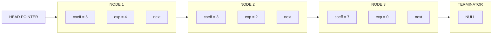
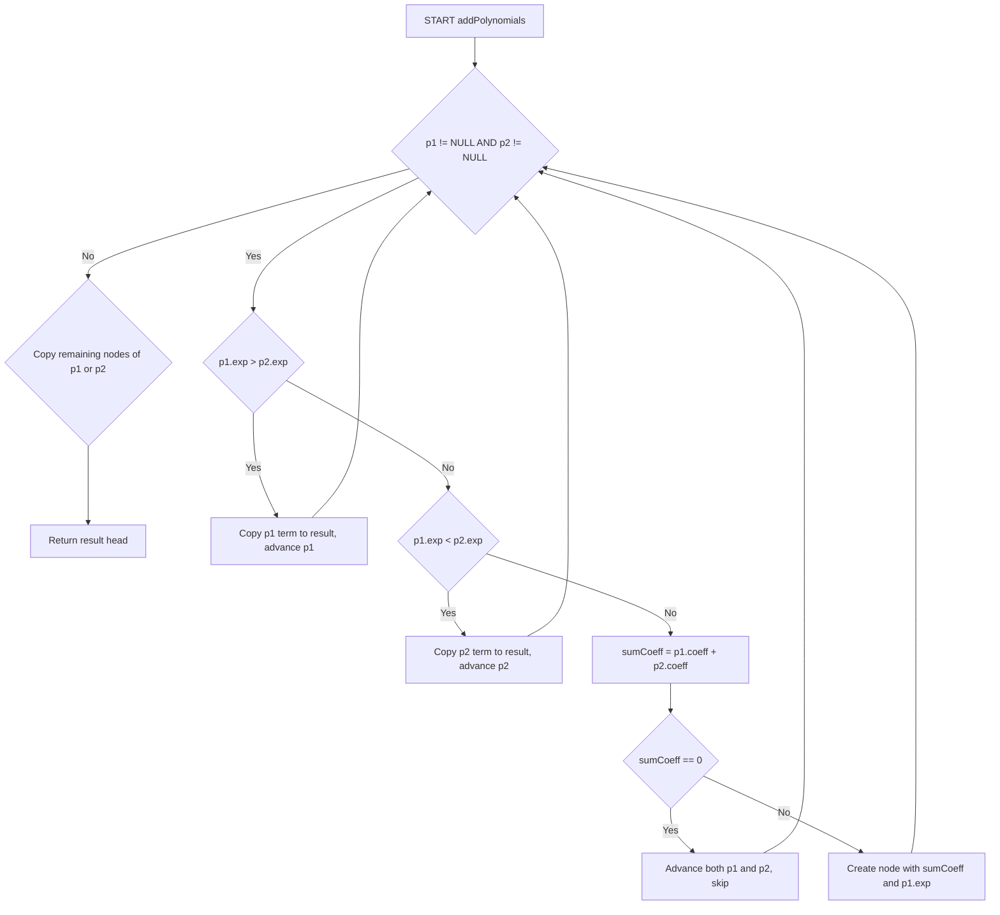
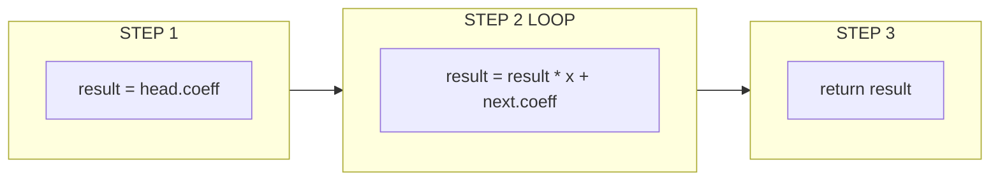
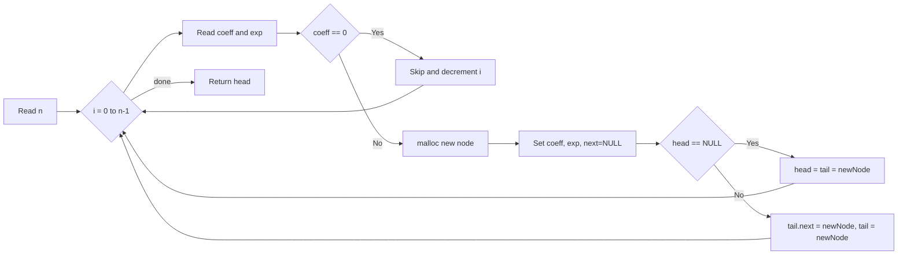
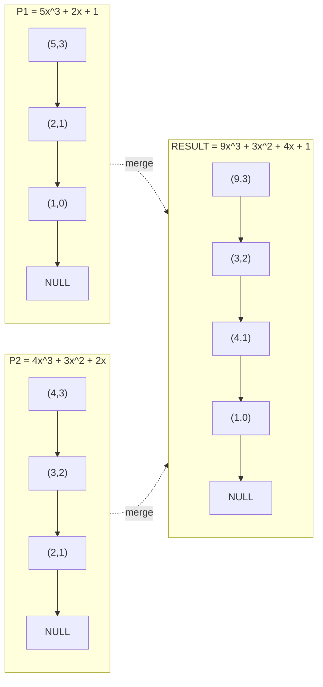

# Polynomial representation using Linked List

<!-- SECTION_1_START -->

# Polynomial Representation Using Linked List

## 1. Core Technical Definition & Intuitive Overview

### Formal Definition (KTU 2024 Syllabus Terminology)

A **polynomial** $P(x)$ of degree $n$ is a mathematical expression of the form:

$$P(x) = a_n x^n + a_{n-1} x^{n-1} + \dots + a_1 x + a_0$$

where $a_i$ are real coefficients and $n$ is a non-negative integer. In **linked list representation**, each non-zero term $a_i x^i$ is stored as an individual node containing the **coefficient**, **exponent**, and a **pointer** to the next term node. The polynomial itself is referenced by a head pointer to the first node; a **NULL** terminator marks the end of the list. Terms are conventionally maintained in **descending order of exponent** to enable efficient term-matching during arithmetic operations.

> [!NOTE]
> **KTU 2024 Module 2 Highlight**
> A polynomial with $k$ non-zero terms is called a **sparse polynomial** when $k \ll n+1$. Linked list representation is preferred over arrays for sparse polynomials because it allocates memory **proportional to the number of non-zero terms**, not the polynomial's degree.

### Conceptual Analogy / Intuition

Imagine a **freight train** 🚂 where each railway car (node) carries exactly one parcel labeled "$3x^4$" (coefficient 3, exponent 4). The cars are coupled in a single line; the locomotive driver knows only where the **first car** is (the head pointer). To find a specific term, you must walk carriage by carriage starting from the head — you cannot jump directly. The last carriage has its coupling hook removed (pointer set to **NULL**), signalling the journey's end.

This matches the linked list exactly:
- **Carriage (Node)** = stores one polynomial term.
- **Coupling (Pointer)** = links to the next term.
- **Locomotive position (Head pointer)** = the only external reference to the whole polynomial.
- **NULL coupling** = the polynomial ends here.

Unlike a **parking lot** (array) where slot numbers are fixed and empty slots waste space, the train grows or shrinks dynamically as terms are added or removed.

> [!IMPORTANT]
> **Standard Symbols Used**
> - $n$ → degree of polynomial
> - $k$ → number of non-zero terms
> - $a_i$ → coefficient of $x^i$
> - $P(x)$ → polynomial function evaluated at $x$
> - **NULL** → sentinel value marking end-of-list (typically **0** in pointer context)

---

### Real-World Engineering Context

Polynomial linked lists appear in:
- **Symbolic algebra systems** (Mathematica, SymPy internals)
- **Sparse matrix computations** in scientific simulations (CFD, structural FEM)
- **Curve fitting & regression engines** for ML feature transformation
- **Audio signal processing** (IIR/FIR filter design)
- **Compiler polynomial parsers** in CAS toolchains

> [!VISUALIZATION CONTROL]
> **Concept:** Polynomial $P(x) = 5x^4 + 3x^2 + 7$ represented as a linked list
> **Coordinate / Block Mapping:**
> - Node 1 → Block `(coeff=5, exp=4) →`
> - Node 2 → Block `(coeff=3, exp=2) →`
> - Node 3 → Block `(coeff=7, exp=0) → NULL`
> **Visual Description:** Three rectangular nodes connected by directed arrows in a horizontal row, each node split into two halves labeled `coeff` and `exp`. The final node's pointer field is marked with the universal **⊥ (NULL)** symbol. Term exponents strictly decrease from left to right.

---

<!-- SECTION_2_START -->

## 2. Deep Theoretical Analysis & KTU High-Yield Formula Sheet

### 2.1 Why Linked List Over Array?

| Property | Array Representation | Linked List Representation |
|---|---|---|
| Memory allocation | **Static / contiguous** | **Dynamic / scattered** |
| Wasted slots | Yes, for missing exponents | **No** — only existing terms stored |
| Suitable for | **Dense** polynomials | **Sparse** polynomials |
| Insert / Delete term | $O(k)$ shifts required | $O(1)$ pointer rewiring |
| Random access by exponent | $O(1)$ via index | $O(k)$ traversal required |
| Memory per term | Fixed (e.g., 8 bytes) | Larger (e.g., 16 bytes including pointer) |
| Cache locality | Excellent | Poor (nodes scattered in heap) |

### 2.2 Node Memory Footprint (64-bit architecture, no padding)

For a node holding `int coeff`, `int exp`, and a `struct Node* next`:

$$S_{\text{node}} = \text{sizeof(int)} + \text{sizeof(int)} + \text{sizeof(ptr)} = 4 + 4 + 8 = \mathbf{16 \text{ bytes}}$$

For a polynomial with $k$ non-zero terms:

$$S_{\text{total}} = k \cdot S_{\text{node}} = \mathbf{16k \text{ bytes}}$$

> [!IMPORTANT]
> **KTU Memory Calculation Tip**
> If the question gives you degree $n$ but states "only 3 non-zero terms", always use $k = 3$ in memory calculation, **NOT** $n+1$. This is a common valuation trap!

### 2.3 KTU Formula Cheat Sheet

| Concept | Formula / Expression | Time Complexity | Space |
|---|---|---|---|
| Polynomial evaluation (Horner) | $P(x) = (\dots((a_n x + a_{n-1})x + a_{n-2})x + \dots + a_0)$ | $O(k)$ | $O(1)$ |
| Naive polynomial evaluation | $P(x) = \sum_{i=0}^{n} a_i x^i$ | $O(k \cdot n)$ | $O(1)$ |
| Memory of linked list poly | $S = 16k$ bytes (on 64-bit) | — | $O(k)$ |
| Memory of array poly | $S = 8(n+1)$ bytes | — | $O(n)$ |
| Addition $P_1 + P_2$ | Traverse both lists, merge like terms | $O(k_1 + k_2)$ | $O(k_1 + k_2)$ |
| Multiplication $P_1 \times P_2$ | Nested loop, then add | $O(k_1 \cdot k_2)$ | $O(k_1 \cdot k_2)$ |
| Derivative of polynomial | $P'(x) = \sum_{i=1}^{n} i \cdot a_i x^{i-1}$ | $O(k)$ | $O(k)$ |
| Degree of polynomial | $\max(e_i)$ over all nodes | $O(k)$ | $O(1)$ |
| Number of terms | Traverse and count NULL-terminated chain | $O(k)$ | $O(1)$ |

### 2.4 Horner's Method — Stepwise Expansion

$$P(x) = a_n x^n + a_{n-1} x^{n-1} + \dots + a_1 x + a_0$$

Rewrite by **factoring** $x$ repeatedly:

$$
\begin{aligned}
P(x) &= a_n x^n + a_{n-1} x^{n-1} + \dots + a_0 \\
&= x \cdot (a_n x^{n-1} + a_{n-1} x^{n-2} + \dots + a_1) + a_0 \\
&= x \cdot (x \cdot (a_n x^{n-2} + a_{n-1} x^{n-3} + \dots + a_2) + a_1) + a_0 \\
&\;\;\vdots \\
&= ((\dots((a_n \cdot x + a_{n-1}) \cdot x + a_{n-2}) \cdot x + \dots) \cdot x + a_0)
\end{aligned}
$$

> [!TIP]
> **Engineering Utility:** Horner's rule reduces multiplication operations from $O(n^2)$ (naive exponentiation) to $O(n)$ and is the standard kernel inside hardware **polynomial accelerators** (e.g., AES MixColumns in cryptography, CRC checksum units, and digital filter chips).

### 2.5 Arithmetic Operation Logic

For **addition** of $P_1(x)$ and $P_2(x)$, the algorithm is the classical **merge step of merge-sort** applied to exponent-sorted lists:

- If exponents differ → copy the higher-exponent term to result.
- If exponents match → add coefficients. If sum $\neq 0$, create one node with the sum.
- When one list exhausts → copy remaining terms of the other.

For **multiplication** $P_1 \cdot P_2$, every term of $P_1$ is multiplied with every term of $P_2$ (producing $k_1 \cdot k_2$ raw terms), and the polynomial addition routine is invoked to **combine like terms** in the result.

---

<!-- SECTION_3_START -->

## 3. Step-by-Step Derivations & Code/Symbolic Implementation

### 3.1 Node Structure Definition (C)

```c
/* Definition of a single polynomial term node */
struct PolyNode {
    int coeff;              /* coefficient of the term  */
    int exp;                /* exponent of x             */
    struct PolyNode* next;  /* pointer to next node      */
};

typedef struct PolyNode PolyNode;
```

### 3.2 Core Operation 1 — Create Polynomial from User Input

```c
/* Creates a polynomial by reading (coeff, exp) pairs from stdin.
   The polynomial is returned as a pointer to its head node.
   Terms must be entered in strictly decreasing order of exponent. */
PolyNode* createPolynomial(void) {
    PolyNode *head = NULL, *tail = NULL, *newNode = NULL;
    int n, c, e, i;

    printf("Enter number of non-zero terms: ");
    if (scanf("%d", &n) != 1 || n < 0) {
        fprintf(stderr, "[ERROR] Invalid term count.\n");
        return NULL;
    }

    for (i = 0; i < n; ++i) {
        printf("Term %d -> coeff exp: ", i + 1);
        if (scanf("%d %d", &c, &e) != 2) {
            fprintf(stderr, "[ERROR] Invalid input. Aborting.\n");
            return NULL;
        }
        if (c == 0) {                  /* skip zero-coefficient terms */
            fprintf(stderr, "[WARN] Skipping zero coefficient.\n");
            --i;                       /* compensate, accept another  */
            continue;
        }

        newNode = (PolyNode*)malloc(sizeof(PolyNode));
        if (newNode == NULL) {
            fprintf(stderr, "[ERROR] malloc() failed.\n");
            return NULL;
        }
        newNode->coeff = c;
        newNode->exp   = e;
        newNode->next  = NULL;

        if (head == NULL) {
            head = tail = newNode;     /* first node              */
        } else {
            tail->next = newNode;      /* append at end           */
            tail       = newNode;
        }
    }
    return head;
}
```

### 3.3 Core Operation 2 — Display Polynomial

```c
/* Pretty-prints the polynomial in human-readable form:
   5x^4 + 3x^2 + 7                                            */
void displayPolynomial(const PolyNode* head) {
    const PolyNode* cur = head;
    int first = 1;

    if (head == NULL) {
        printf("0\n");
        return;
    }

    while (cur != NULL) {
        if (!first && cur->coeff > 0) printf(" + ");
        if (!first && cur->coeff < 0) printf(" - ");
        if (first) {
            if (cur->coeff < 0) printf("-");
            printf("%d", abs(cur->coeff));
        } else {
            printf("%d", abs(cur->coeff));
        }

        if (cur->exp == 1)       printf("x");
        else if (cur->exp != 0)  printf("x^%d", cur->exp);
        /* if exp == 0, we only printed the coefficient        */

        cur   = cur->next;
        first = 0;
    }
    printf("\n");
}
```

### 3.4 Core Operation 3 — Polynomial Addition (Exhaustive)

This is the **most frequently asked 14-mark question** in KTU Module 2.

```c
/* Adds two polynomials P1 and P2, returns pointer to result head.
   P1 and P2 are NOT modified.                                       */
PolyNode* addPolynomials(const PolyNode* p1, const PolyNode* p2) {
    PolyNode *result = NULL, *tail = NULL, *temp = NULL;
    int sumCoeff;

    while (p1 != NULL && p2 != NULL) {
        if (p1->exp > p2->exp) {
            /* Case A: p1's exponent is larger — copy p1 term       */
            temp = (PolyNode*)malloc(sizeof(PolyNode));
            temp->coeff = p1->coeff;
            temp->exp   = p1->exp;
            temp->next  = NULL;
            p1 = p1->next;
        } else if (p1->exp < p2->exp) {
            /* Case B: p2's exponent is larger — copy p2 term       */
            temp = (PolyNode*)malloc(sizeof(PolyNode));
            temp->coeff = p2->coeff;
            temp->exp   = p2->exp;
            temp->next  = NULL;
            p2 = p2->next;
        } else {
            /* Case C: equal exponents — combine coefficients       */
            sumCoeff = p1->coeff + p2->coeff;
            if (sumCoeff == 0) {      /* cancel out, skip term       */
                p1 = p1->next;
                p2 = p2->next;
                continue;
            }
            temp = (PolyNode*)malloc(sizeof(PolyNode));
            temp->coeff = sumCoeff;
            temp->exp   = p1->exp;
            temp->next  = NULL;
            p1 = p1->next;
            p2 = p2->next;
        }

        /* Append the newly created node to the result list          */
        if (result == NULL) {
            result = tail = temp;
        } else {
            tail->next = temp;
            tail       = temp;
        }
    }

    /* Copy any remaining terms of the non-exhausted list             */
    while (p1 != NULL) {
        temp = (PolyNode*)malloc(sizeof(PolyNode));
        temp->coeff = p1->coeff;
        temp->exp   = p1->exp;
        temp->next  = NULL;
        if (result == NULL) result = tail = temp;
        else { tail->next = temp; tail = temp; }
        p1 = p1->next;
    }
    while (p2 != NULL) {
        temp = (PolyNode*)malloc(sizeof(PolyNode));
        temp->coeff = p2->coeff;
        temp->exp   = p2->exp;
        temp->next  = NULL;
        if (result == NULL) result = tail = temp;
        else { tail->next = temp; tail = temp; }
        p2 = p2->next;
    }
    return result;
}
```

### 3.5 Core Operation 4 — Horner's Method for Polynomial Evaluation

```c
/* Evaluates polynomial P at given value of x using Horner's rule.
   No exponentiation needed — only multiply-and-add.               */
long long evaluatePolynomial(const PolyNode* head, int x) {
    long long result = 0;
    const PolyNode* cur = head;

    if (head == NULL) return 0;

    /* Process first term: start accumulator with leading coeff     */
    result = cur->coeff;
    cur = cur->next;

    /* For each subsequent term: result = result * x + coeff        */
    while (cur != NULL) {
        result = result * (long long)x + (long long)cur->coeff;
        cur    = cur->next;
    }
    return result;
}
```

### 3.6 Worked Example — Horner Evaluation

Let $P(x) = 4x^3 + 3x^2 + 2x + 5$, evaluate at $x = 2$:

$$
\begin{aligned}
\text{Step 1:} \quad &\text{result} = 4 \\
\text{Step 2:} \quad &\text{result} = 4 \cdot 2 + 3 = 11 \\
\text{Step 3:} \quad &\text{result} = 11 \cdot 2 + 2 = 24 \\
\text{Step 4:} \quad &\text{result} = 24 \cdot 2 + 5 = 53
\end{aligned}
$$

**Verification by direct substitution:**
$$P(2) = 4(8) + 3(4) + 2(2) + 5 = 32 + 12 + 4 + 5 = \mathbf{53} \;\checkmark$$

### 3.7 Core Operation 5 — Memory Cleanup (Critical for KTU)

```c
/* Frees the entire linked list to prevent memory leaks.
   MUST be called once the polynomial is no longer needed.        */
void freePolynomial(PolyNode* head) {
    PolyNode* cur = head;
    PolyNode* next;
    while (cur != NULL) {
        next  = cur->next;
        free(cur);
        cur   = next;
    }
}
```

> [!IMPORTANT]
> **Memory Management Rule (KTU Module 2)**
> For every successful `malloc()` there must be **exactly one** corresponding `free()`. Failing to call `freePolynomial()` after polynomial operations results in **memory leaks**, which the KTU examiner will deduct marks for. Use tools like `valgrind` to verify.

### 3.8 Polynomial Multiplication (Algorithm Skeleton)

```c
/* Multiplies two polynomials P1 and P2 using addPolynomials helper.
   Strategy: nested loop generates k1*k2 raw terms, then we add. */
PolyNode* multiplyPolynomials(const PolyNode* p1, const PolyNode* p2) {
    PolyNode *result = NULL, *temp = NULL, *tail = NULL;
    const PolyNode *i, *j;

    if (p1 == NULL || p2 == NULL) return NULL;

    for (i = p1; i != NULL; i = i->next) {
        for (j = p2; j != NULL; j = j->next) {
            PolyNode* prod = (PolyNode*)malloc(sizeof(PolyNode));
            prod->coeff = i->coeff * j->coeff;
            prod->exp   = i->exp   + j->exp;
            prod->next  = NULL;

            /* Insert prod into a temporary list, then merge with result */
            if (result == NULL) { result = tail = prod; }
            else { tail->next = prod; tail = prod; }
        }
    }

    /* The above does NOT merge like terms; for a full implementation,
       sort intermediate result by exponent then call addPolynomials.    */
    return result;  /* Note: requires further merging for correctness   */
}
```

### 3.9 Python Verification Snippet (for student self-testing)

```python
class PolyNode:
    __slots__ = ("coeff", "exp", "next")
    def __init__(self, coeff: int, exp: int):
        self.coeff = coeff
        self.exp   = exp
        self.next  = None

def horner(head: "PolyNode | None", x: int) -> int:
    result = 0
    cur = head
    if cur is None:
        return 0
    result = cur.coeff
    cur = cur.next
    while cur is not None:
        result = result * x + cur.coeff
        cur = cur.next
    return result

# Test: P(x) = 4x^3 + 3x^2 + 2x + 5
p = PolyNode(4, 3)
p.next = PolyNode(3, 2)
p.next.next = PolyNode(2, 1)
p.next.next.next = PolyNode(5, 0)
print(horner(p, 2))   # Output: 53
```

---

<!-- SECTION_4_START -->

## 4. Structural Diagrams & Schematics

### 4.1 Node Memory Layout (Block Architecture)

The following block diagram shows the in-memory structure of a single `PolyNode` and a complete 3-term polynomial.



### 4.2 Addition Algorithm Flowchart (Modular)



### 4.3 Horner's Evaluation Block Topology



### 4.4 Sequential Processing Topology — Create Polynomial



### 4.5 Memory State Diagram — Polynomial Addition



---

<!-- SECTION_5_START -->

## 5. KTU 2024 Scheme Examination Question Bank & Topic Recap

### 📝 Part A Questions (3 Marks Each)

> **[KTU University Exam - Dec 2023]**
> **Q1. (CO1, Remember) [3 Marks]**
> Define a polynomial. How is a polynomial represented using a linked list? Mention any two advantages of this representation over array representation.

**Model Answer:**

A polynomial $P(x)$ of degree $n$ is a mathematical expression $P(x) = a_n x^n + a_{n-1} x^{n-1} + \dots + a_0$ where $a_i$ are coefficients. In **linked list representation**, each non-zero term $a_i x^i$ is stored in a separate node containing the **coefficient** ($a_i$), **exponent** ($i$), and a **pointer** to the next term. The polynomial is referenced by a head pointer to the first node, and the last node's pointer is **NULL**.

**Advantages over array:**
1. **Memory efficient for sparse polynomials** — only existing terms are stored, no wasted slots for zero coefficients.
2. **Dynamic size** — polynomial can grow or shrink during runtime; no need to pre-declare maximum degree.
3. **Efficient insertion/deletion** of terms in $O(1)$ time after position is found (only pointer rewiring needed).

> **Valuation Key:** [Polynomial definition: 1 Mark] [Node structure mention: 1 Mark] [Two advantages: 1 Mark]

---

> **[KTU University Exam - July 2024]**
> **Q2. (CO2, Understand) [3 Marks]**
> Explain Horner's method for evaluating a polynomial. Why is it preferred over the direct substitution method?

**Model Answer:**

**Horner's Method** rewrites a polynomial $P(x) = a_n x^n + a_{n-1} x^{n-1} + \dots + a_0$ in nested form:

$$P(x) = ((\dots((a_n \cdot x + a_{n-1}) \cdot x + a_{n-2}) \cdot x + \dots) \cdot x + a_0)$$

The algorithm starts with the leading coefficient in an accumulator, then for each subsequent term performs `result = result * x + coefficient`. It traverses the linked list **once** in $O(k)$ time using only **one multiplication and one addition per term**.

**Why preferred over direct substitution:**
1. **Avoids repeated exponentiation** — direct evaluation of $x^n$ alone needs $O(\log n)$ multiplications per term; Horner needs only **one** multiplication per term.
2. **Better numerical stability** — fewer floating-point rounding errors.
3. **Single linear traversal** of the linked list — no need to revisit earlier terms.

> **Valuation Key:** [Nested formula: 1 Mark] [Algorithm step explanation: 1 Mark] [At least two reasons: 1 Mark]

---

### 📝 Part B Questions (14 Marks — Module Internal Choice)

---

#### **Question A (14 Marks)**

> **[KTU University Exam - Dec 2024]**
> **(CO2, Understand + Apply)**

**(a) [7 Marks]** Write the structure definition for a polynomial node in C. Develop an algorithm (or C function) to **create a polynomial** by reading terms from the user and to **display** the polynomial in the standard mathematical format.

**(b) [7 Marks]** Write a complete C function `addPolynomials(p1, p2)` that adds two polynomials represented as linked lists and returns the result polynomial. Explain the time complexity of your function.

---

**Model Solution for (a):**

**Structure Definition** [1 Mark]:

```c
struct PolyNode {
    int coeff;
    int exp;
    struct PolyNode* next;
};
typedef struct PolyNode PolyNode;
```

**Create Function** [3 Marks] — see Section 3.2 (full code above).

**Display Function** [3 Marks] — see Section 3.3 (full code above).

> **Valuation Key:** [Structure with three correct members: 1 Mark] [Create logic with malloc: 1 Mark] [Display handles signs and exponents correctly: 1 Mark] [Edge cases (NULL polynomial, x^1, x^0): 2 Marks]

---

**Model Solution for (b):**

**Algorithm Steps** [4 Marks]:

1. Initialize `result = NULL`, `tail = NULL`.
2. Traverse both `p1` and `p2` simultaneously.
3. **Compare exponents:**
   - If `p1->exp > p2->exp` → copy `p1` term to result, advance `p1`.
   - If `p1->exp < p2->exp` → copy `p2` term to result, advance `p2`.
   - If equal → add coefficients; if sum ≠ 0, create one node with combined coefficient; advance both.
4. After one list exhausts, copy remaining nodes of the other.
5. Return `result` head.

**Code** [3 Marks] — see Section 3.4 above.

**Time Complexity Analysis** [1 Mark]:

$$T(n) = O(k_1 + k_2)$$

where $k_1$ and $k_2$ are the number of non-zero terms in $P_1$ and $P_2$ respectively. Each node of each list is visited **at most once**, with $O(1)$ work per node.

> **Valuation Key:** [Correct three-case comparison logic: 2 Marks] [malloc() and pointer rewiring: 1 Mark] [Remaining-list copy handling: 1 Mark] [Time complexity statement: 1 Mark] [Traceable code without syntax errors: 2 Marks]

---

#### **Question B (14 Marks)** — Alternative Choice

> **[KTU University Exam - July 2023]**
> **(CO2, Understand + Apply)**

**(a) [7 Marks]** Explain the concept of polynomial representation using a linked list. Draw the linked list diagram for the polynomial $P(x) = 6x^4 + 0 \cdot x^3 + 4x^2 + 0 \cdot x + 9$. Justify why linked list is preferable to array for sparse polynomials.

**(b) [7 Marks]** Write a C function to **multiply two polynomials** using linked list representation. Mention its time and space complexity.

---

**Model Solution for (a):**

**Conceptual Explanation** [2 Marks]:

A polynomial is represented as a singly linked list where each node contains `(coeff, exp, next)`. The list is sorted in descending order of exponents. The head pointer is the only external handle; the list ends with a **NULL** pointer. This is called a **sparse representation** because only non-zero terms consume memory.

**Linked List Diagram** [3 Marks]:

For $P(x) = 6x^4 + 0 \cdot x^3 + 4x^2 + 0 \cdot x + 9$:


Zero-coefficient terms (for $x^3$ and $x^1$) are **NOT stored** in the linked list representation.

**Justification (Array vs Linked List for Sparse Polynomials)** [2 Marks]:

For the given polynomial of degree 4, an array would need **5 slots** (indices 0 to 4), of which only 3 are non-zero — wasting 2 slots. For a polynomial of degree 1000 with only 5 non-zero terms, an array wastes 995 slots (= 7960 bytes), while the linked list stores only 5 nodes (= 80 bytes).

Mathematically:

$$
\begin{aligned}
S_{\text{array}} &= 8(n+1) = 8 \times 1001 = 8008 \text{ bytes} \\
S_{\text{linked list}} &= 16k = 16 \times 5 = 80 \text{ bytes}
\end{aligned}
$$

**Savings ratio:** $8008 / 80 \approx 100\times$ more efficient. Additionally, linked list allows **dynamic growth** (no need to know maximum degree in advance), and **insert/delete** in $O(1)$ time after position is found.

> **Valuation Key:** [Concept explanation: 1 Mark] [Correct diagram with 3 nodes: 2 Marks] [Diagram explanation: 1 Mark] [Quantitative comparison: 1 Mark] [Qualitative advantages: 1 Mark] [Concrete example: 1 Mark]

---

**Model Solution for (b):**

**Multiplication Algorithm** [5 Marks]:

To multiply $P_1$ (with $k_1$ terms) and $P_2$ (with $k_2$ terms):

1. Initialize result list as empty (`result = NULL`).
2. For each term $t_1$ in $P_1$:
   - For each term $t_2$ in $P_2$:
     - Compute raw product: `coeff = t_1.coeff * t_2.coeff`, `exp = t_1.exp + t_2.exp`.
     - Insert this product term into a temporary list.
3. The temporary list contains $k_1 \cdot k_2$ terms (possibly unsorted, possibly with duplicate exponents).
4. **Sort the temporary list by exponent in descending order**.
5. **Merge like terms** by traversing the sorted list and combining adjacent terms with equal exponents. If summed coefficient is zero, omit the term.
6. The final merged list is the product polynomial.
7. Free the temporary intermediate list to prevent memory leaks.

**Skeleton C Code** [2 Marks] — see Section 3.8 above.

**Complexity Analysis** [2 Marks]:

- **Time complexity:** The double loop generates $k_1 \cdot k_2$ raw products, each insertion takes $O(k_1 k_2)$ in the worst case, and sorting/merging takes $O(k_1 k_2 \log(k_1 k_2))$ or $O(k_1 k_2)$ if terms are inserted in sorted order. Overall:

$$T(n) = O(k_1 \cdot k_2)$$

- **Space complexity:** The result list contains at most $k_1 \cdot k_2$ terms (in the worst case when all exponents differ):

$$S(n) = O(k_1 \cdot k_2)$$

> **Valuation Key:** [Correct nested loop: 2 Marks] [Multiplication of coeff and addition of exp: 1 Mark] [Merge-like-terms step: 1 Mark] [Free intermediate list: 1 Mark] [Time complexity with justification: 1 Mark] [Space complexity: 1 Mark]

---

### ⚠️ KTU Examiner's Valuation Warning / Pitfall Callout

> [!WARNING]
> **Common Mistakes That Cost Marks**
>
> 1. **Forgetting to handle the empty polynomial case** — if head is `NULL`, the display function MUST print `0`, not crash. (-1 Mark)
> 2. **Not checking `malloc()` return value** — production code must verify the allocation succeeded. Skipping this loses marks in KTU's "good programming practice" evaluation. (-1 Mark)
> 3. **Storing zero-coefficient terms** — when adding polynomials, if `p1->coeff + p2->coeff == 0`, you must **skip** the term entirely. Including it produces a wrong polynomial. (-1 Mark)
> 4. **Memory leak** — every `malloc()` must have a matching `free()`. KTU specifically tests this in lab examinations. (-2 Marks)
> 5. **Mixing up coefficient and exponent order in display** — students often print `x^coeff` instead of `x^exp`. Read the structure field carefully! (-1 Mark)
> 6. **Forgetting `abs()` for negative coefficient display** — when coefficient is negative, the sign should appear before the magnitude, not as a separate `+` or `-`. (-1 Mark)
> 7. **Not stating the time complexity explicitly** — KTU 14-mark questions expect a **complexity statement with justification** as the last sub-step. (-1 Mark)
> 8. **Drawing a 2D array structure for a linked list** — the linked list diagram must show **scattered individual nodes** connected by arrows, NOT a contiguous block. (-1 Mark)

---

### 🎯 Topic Recap & Important Things to Remember

> **Rapid-Revision Checklist**

- ✅ A **polynomial** $P(x)$ is a sum of terms $a_i x^i$; only non-zero terms need to be stored for sparse representation.
- ✅ Each **node** in the linked list stores three fields: `coeff`, `exp`, and `next` (pointer).
- ✅ The list is maintained in **descending order of exponents** to make addition/multiplication O(n).
- ✅ A **head pointer** references the first node; the last node's `next` is **NULL** (sentinel).
- ✅ **Horner's rule** for evaluation: start with leading coefficient, repeatedly apply `result = result * x + coeff`. Time $O(k)$.
- ✅ **Polynomial addition** is a merge of two sorted lists — time complexity $O(k_1 + k_2)$, space $O(k_1 + k_2)$.
- ✅ **Polynomial multiplication** uses nested loops generating $k_1 \cdot k_2$ raw products, then merges like terms — time $O(k_1 \cdot k_2)$, space $O(k_1 \cdot k_2)$.
- ✅ **Memory per node** (64-bit, 3 fields) = $4 + 4 + 8 = \mathbf{16 \text{ bytes}}$.
- ✅ **Memory total** for $k$ non-zero terms = $16k$ bytes (linked list) vs. $8(n+1)$ bytes (array of degree-$n$ polynomial).
- ✅ **Linked list is preferred for sparse polynomials** ($k \ll n+1$); array is preferred for dense polynomials.
- ✅ **Derivative of $P(x)$**: for each term, new coefficient = $i \cdot a_i$ and new exponent = $i - 1$.
- ✅ **Memory management is critical**: every `malloc()` needs a matching `free()` via `freePolynomial()`.
- ✅ **Time complexities are mandatory** in KTU answers — always state and justify them.
- ✅ **Edge cases to test**: empty polynomial, single term, all same exponent, cancellation during addition, zero leading coefficient after subtraction.
- ✅ **Standard KTU marks split for 14-mark question**: algorithm/logic (5), code with proper structure (5), complexity analysis (2), diagram or trace (2).
- ✅ **Hot exam tip**: Questions on polynomial addition, Horner evaluation, and "compare array vs linked list representation" appear in nearly every KTU cycle — master these three first.

<!-- SECTION_5_END -->
