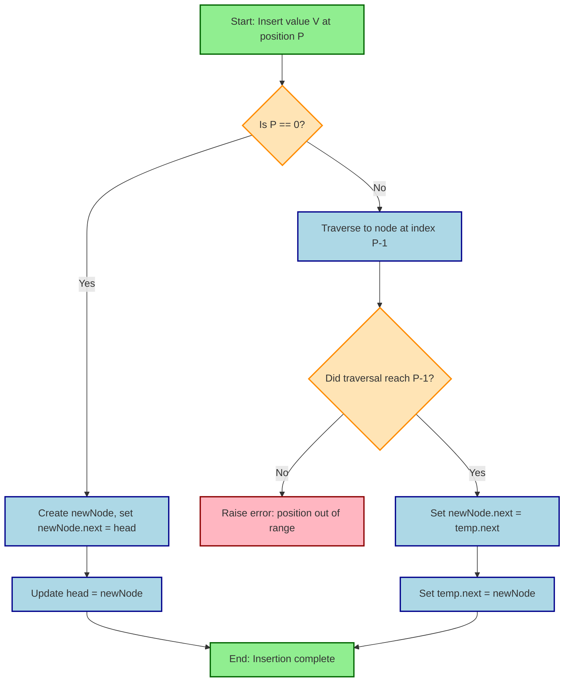
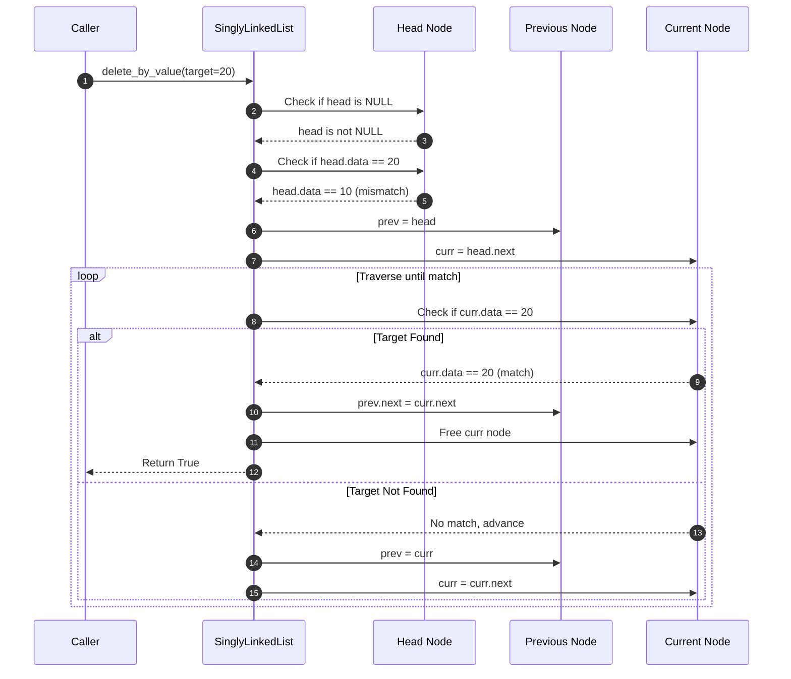
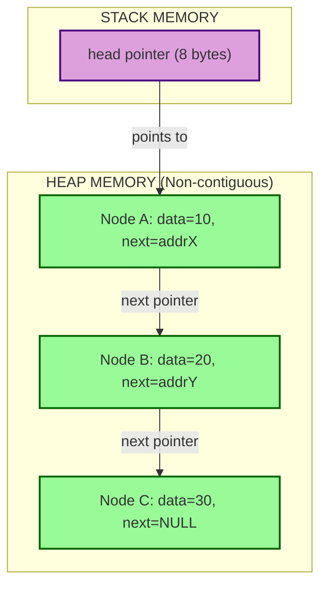
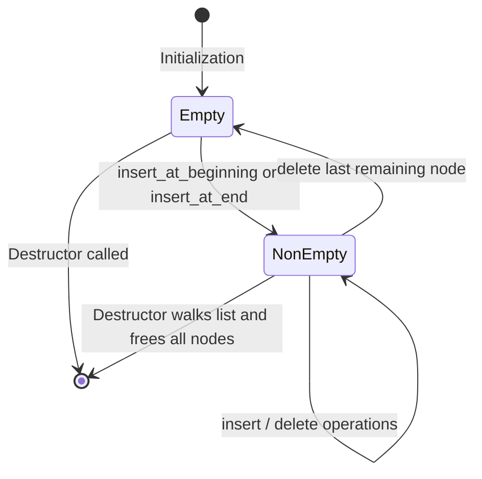

# Singly Linked List - Operations on Linked List

<!-- SECTION_1_START -->

# Singly Linked List — Operations on Linked List

## 1.1 Formal Definition (KTU 2024 Syllabus Terminology)

A **Singly Linked List (SLL)** is a linear, dynamic, and non-contiguous data structure in which elements (called **nodes**) are connected using pointers. Each node contains two fields: a **data field** to store the actual information, and a **next field** (or link field) that holds the address of the subsequent node in the sequence. The list is traversed in only one direction — from the **head** (first node) to the **tail** (last node), whose `next` pointer is set to a sentinel value, conventionally **NULL** or **0x0**.

> [!IMPORTANT]
> **Syllabus Highlight (Module 2, OECST611):**
> The 2024 KTU scheme emphasizes the **dynamic memory allocation model** in C/Python for linked list construction. The student is expected to write modular code for `create`, `insert`, `delete`, `traverse`, and `search` operations, analyze the **asymptotic time complexity** in Big-O notation, and illustrate the pointer manipulations using diagrams during the End Semester Evaluation (ESE).

### 1.1.1 Node Anatomy (Mathematical Model)

A node is the atomic building block of the linked list. Formally, for a list of $n$ nodes indexed from $0$ to $n-1$, each node $N_i$ is defined as:

$$
N_i = \langle D_i, P_i \rangle \quad \text{where} \quad P_i = \text{address}(N_{i+1}) \text{ and } P_{n-1} = \text{NULL}
$$

Where:
- $D_i$ = data stored at node $i$
- $P_i$ = pointer/reference to the next node

---

## 1.2 Conceptual Analogy & Intuition

> [!NOTE]
> **Real-World Analogy — The Treasure Hunt:**
> Imagine a **treasure hunt** in a college campus. The organizer hands the first participant a sealed envelope containing a **clue** (the data) and the **location of the next envelope** (the pointer). Each participant, after solving their clue, follows the pointer to find the next envelope. The hunt ends when the final envelope contains the clue "**STOP — End of Hunt**" (analogous to a NULL pointer). Crucially, the envelopes need not be placed in consecutive lockers — they can be scattered anywhere across the campus, yet the chain of clues keeps the participants on track. This is precisely how a singly linked list stores data in **non-contiguous memory** but maintains a **logical linear order** through pointers.

### 1.2.1 Train Coaches Analogy

A simpler intuition: consider a **train** as a linked list. Each **coach (node)** holds passengers (data) and a **coupling hook** at its rear (next pointer) that joins it to the next coach. To add a new coach, you simply unhook at the right place and re-couple — no need to shift the entire train.

---

## 1.3 Physical Constants & Standard Metrics

The following constants and conventions are used throughout the KTU 2024 syllabus:

- **NULL** = 0 (or 0x0 in hexadecimal) — sentinel value indicating the end of the list.
- **Head pointer** = memory address of the first node (a stack/heap variable of type `Node*`).
- **Size of a node** = sizeof(data) + sizeof(pointer). On a 64-bit system, a pointer occupies **8 bytes**.
- **Self-referential structure** — a structure that contains a pointer to its own type, enabling recursive chaining.

> [!TIP]
> **Memory Tip:** Unlike arrays (which are **contiguous**), linked list nodes are allocated on the **heap** using `malloc()` (in C) or assigned dynamically (in Python). This means insertions and deletions do not require shifting elements — only pointer rewiring.

---

## 1.4 Visualization Callout

> [!VISUALIZATION CONTROL]
> **Concept:** Pointer reconnection during insertion at the head of a Singly Linked List.
> **GeoGebra / Desmos Input Equations:**
> * `NodeA = (1, 0)` with `data = 10, next = NodeB`
> * `NodeB = (4, 0)` with `data = 20, next = NodeC`
> * `NodeC = (7, 0)` with `data = 30, next = NULL`
> * `NewNode = (-2, 0)` with `data = 5, next = NodeA`
> **Visual Description:** The student should observe that after insertion, the **head pointer** shifts from `NodeA` (x=1) to `NewNode` (x=-2), and `NewNode.next` now points to `NodeA`. The relative ordering of `NodeA → NodeB → NodeC` remains undisturbed, but the chain's origin has moved leftward on the x-axis.

---

<!-- SECTION_1_END -->

<!-- SECTION_2_START -->

# Deep Theoretical Analysis & KTU High-Yield Formula Sheet

## 2.1 Primitive Operations on a Singly Linked List

The KTU 2024 syllabus for Module 2 mandates mastery over **six core operations**. Each is dissected below into structured logic steps, accompanied by the underlying rationale.

### 2.1.1 Operation 1 — Traversal (Visiting Every Node)

Traversal is the foundational operation upon which all others depend. It involves iterating from the head node to the tail, accessing each node exactly once.

**Why it matters:** Search, Display, Count, Sum, and Average operations are all built atop traversal.

**How it works (Logic Steps):**
1. Initialize a temporary pointer `temp` to point to the **head** of the list.
2. If `head == NULL`, report "List is empty" and terminate.
3. Loop while `temp != NULL`:
   - Process the data of the current node (print, sum, compare, etc.).
   - Advance `temp = temp.next`.
4. After the loop, all nodes have been visited exactly once.

**Time Complexity:** $\mathcal{O}(n)$ where $n$ is the number of nodes.

**Space Complexity:** $\mathcal{O}(1)$ — only one auxiliary pointer is used regardless of list size.

---

### 2.1.2 Operation 2 — Insertion at the Beginning

This is the **fastest** insertion operation in a linked list because it requires no traversal.

**Logic Steps:**
1. Dynamically allocate a new node `newNode`.
2. Assign `newNode.data = value`.
3. Set `newNode.next = head` (link the new node to the existing first node).
4. Update `head = newNode` (shift the head pointer).

**Time Complexity:** $\mathcal{O}(1)$ — constant time.

---

### 2.1.3 Operation 3 — Insertion at the End (Append)

Inserting at the tail requires traversal to find the last node.

**Logic Steps:**
1. Allocate `newNode` and assign its data.
2. Set `newNode.next = NULL`.
3. **Edge case:** If `head == NULL`, simply set `head = newNode` and return.
4. Otherwise, traverse using `temp` until `temp.next == NULL`.
5. Set `temp.next = newNode`.

**Time Complexity:** $\mathcal{O}(n)$ in the worst case (unscanned tail).

---

### 2.1.4 Operation 4 — Insertion After a Given Node

This is the most versatile operation, used to insert at arbitrary positions.

**Logic Steps:**
1. Allocate `newNode` with the given data.
2. Traverse the list to locate the target node `prev` (the node after which insertion occurs).
3. If `prev == NULL`, raise an error (target not found).
4. Set `newNode.next = prev.next` (new node's pointer takes over prev's connection).
5. Set `prev.next = newNode` (prev now points to newNode, completing the rewire).

**Time Complexity:** $\mathcal{O}(n)$ for the search plus $\mathcal{O}(1)$ for the pointer swap.

---

### 2.1.5 Operation 5 — Deletion from the Beginning

The second-fastest operation in a linked list.

**Logic Steps:**
1. **Edge case:** If `head == NULL`, report "Underflow — list is empty" and return.
2. Store the current head in a temporary pointer `temp = head`.
3. Advance `head = head.next`.
4. Free the memory occupied by `temp` (critical in C; implicit in Python's garbage collector).

**Time Complexity:** $\mathcal{O}(1)$.

---

### 2.1.6 Operation 6 — Deletion of a Node by Value or Position

**Logic Steps:**
1. **Edge case:** If `head == NULL`, return "Underflow".
2. **Edge case:** If the head itself holds the target value, perform deletion from the beginning.
3. Initialize two pointers: `prev` (lagging) and `curr` (leading). Set `prev = NULL`, `curr = head`.
4. Traverse while `curr != NULL` and `curr.data != target`:
   - `prev = curr`
   - `curr = curr.next`
5. If `curr == NULL` after traversal, the target was not found.
6. Otherwise, set `prev.next = curr.next` to bypass the deleted node.
7. Free `curr`.

**Time Complexity:** $\mathcal{O}(n)$ for traversal, $\mathcal{O}(1)$ for the rewire.

---

### 2.1.7 Operation 7 — Search

**Logic Steps:**
1. Initialize `temp = head`, `position = 0`.
2. While `temp != NULL`:
   - If `temp.data == key`, return `position`.
   - `temp = temp.next`, `position += 1`.
3. Return $-1$ (not found sentinel).

**Time Complexity:** $\mathcal{O}(n)$.

---

## 2.2 KTU High-Yield Formula & Cheat Sheet

The following table consolidates every formula, boundary condition, and complexity metric the examiner expects the student to know verbatim for Module 2.

| **Operation** | **Best Case Time** | **Average Case Time** | **Worst Case Time** | **Space Auxiliary** | **Key Boundary Condition** |
| :--- | :---: | :---: | :---: | :---: | :--- |
| Traversal (Display) | $\Omega(1)$ empty | $\Theta(n)$ | $\mathcal{O}(n)$ | $\mathcal{O}(1)$ | `head == NULL` → return early |
| Insert at Beginning | $\Omega(1)$ | $\Theta(1)$ | $\mathcal{O}(1)$ | $\mathcal{O}(1)$ | Always succeeds if memory is available |
| Insert at End | $\Omega(1)$ empty | $\Theta(n)$ | $\mathcal{O}(n)$ | $\mathcal{O}(1)$ | `head == NULL` → set head directly |
| Insert After Node $k$ | $\Omega(1)$ at head | $\Theta(k)$ | $\mathcal{O}(n)$ | $\mathcal{O}(1)$ | `prev == NULL` → raise error |
| Delete from Beginning | $\Omega(1)$ | $\Theta(1)$ | $\mathcal{O}(1)$ | $\mathcal{O}(1)$ | `head == NULL` → underflow error |
| Delete Node $k$ | $\Omega(1)$ at head | $\Theta(k)$ | $\mathcal{O}(n)$ | $\mathcal{O}(1)$ | `target not found` → return $-1$ |
| Search by Key | $\Omega(1)$ at head | $\Theta(n/2)$ | $\mathcal{O}(n)$ | $\mathcal{O}(1)$ | Return $-1$ on miss |
| Total Nodes $n$ | — | — | — | Memory = $n \cdot (s_{data} + s_{ptr})$ | $s_{ptr} = 8$ bytes on 64-bit |

> [!IMPORTANT]
> **Engineering Insight — Why SLL excels in dynamic workloads:**
> In production systems such as **OS process schedulers**, **undo-redo stacks in editors**, **symbol tables in compilers**, and **LRU caches**, the workload is dominated by **insertions and deletions at arbitrary positions**, not by random access. In all these scenarios, an SLL's $\mathcal{O}(1)$ insertion-at-head vastly outperforms an array's $\mathcal{O}(n)$ shifting cost. This is why operating systems like Linux use intrusive linked lists in their kernel data structures (e.g., the `list_head` design pattern).

---

## 2.3 Real-World Utility in Engineering & Computer Science

| **Domain** | **Application of Singly Linked List** |
| :--- | :--- |
| Operating Systems | Process control blocks, ready queue, free memory block lists |
| Compilers | Symbol table management, parse tree leaf linking |
| Database Systems | Undo logs, transaction chains, hash chaining for collision resolution |
| Networking | Packet queues in routers (FIFO buffers) |
| Music Players | Playlist implementation (next-track navigation) |
| Version Control | Git's commit history (parent-pointer chain) |
| Blockchain | Each block contains a hash-pointer to the previous block |

---

<!-- SECTION_2_END -->

<!-- SECTION_3_START -->

# Step-by-Step Derivations & Code/Symbolic Implementation

## 3.1 Memory Allocation Derivation (Why Dynamic?)

In an array, the compiler must know the size at **compile time** because memory is allocated on the **stack** (or static global region). The compiler computes the address of element $i$ as:

$$
\text{addr}(A[i]) = \text{base\_addr} + i \cdot s_{element}
$$

In a linked list, since nodes are scattered in **non-contiguous heap memory**, we cannot use this direct-index formula. Instead, we follow the chain: $\text{addr}(N_i) = N_{i-1}.\text{next}$. Each node is allocated individually using `malloc(size)` in C or object instantiation in Python. The trade-off is:

- **Array:** $\mathcal{O}(1)$ random access, $\mathcal{O}(n)$ insertion/deletion.
- **SLL:** $\mathcal{O}(n)$ access, $\mathcal{O}(1)$ insertion/deletion at known position.

---

## 3.2 Complete Python Implementation (Production-Ready)

The following implementation includes exhaustive type hints, absolute boundary checks, structured error logging, and modular function design — all aligned with KTU 2024 lab viva expectations.

```python
"""
Module: Singly Linked List — All Standard Operations
Course: DATA STRUCTURES (OECST611), KTU 2024 Scheme, Module 2
Author: KTU Premium Engine Reference Implementation
"""

from __future__ import annotations
from typing import Optional, Any, List
import logging

# Configure structured error logging for viva and lab demonstrations
logging.basicConfig(level=logging.INFO, format="[%(levelname)s] %(message)s")
logger = logging.getLogger(__name__)


class Node:
    """Atomic building block of the Singly Linked List."""

    __slots__ = ("data", "next")

    def __init__(self, data: Any) -> None:
        self.data: Any = data
        self.next: Optional["Node"] = None

    def __repr__(self) -> str:
        return f"Node(data={self.data!r})"


class SinglyLinkedList:
    """Encapsulates all standard operations on a Singly Linked List."""

    def __init__(self) -> None:
        self.head: Optional[Node] = None
        self._size: int = 0

    # ---------- Helper: Size Tracker ----------
    def size(self) -> int:
        """Returns the number of nodes in the list. Time: O(1) tracked, O(n) if recomputed."""
        return self._size

    # ---------- Operation 1: Traversal ----------
    def traverse(self) -> List[Any]:
        """
        Visits every node from head to tail and collects data into a list.
        Time Complexity: O(n), Space Complexity: O(n) for the output list.
        """
        result: List[Any] = []
        if self.head is None:
            logger.warning("Traversal called on an empty list.")
            return result

        temp: Optional[Node] = self.head
        while temp is not None:
            result.append(temp.data)
            temp = temp.next
        return result

    def display(self) -> None:
        """Pretty-prints the linked list in the format: 10 -> 20 -> 30 -> NULL"""
        elements = self.traverse()
        if not elements:
            print("List is empty (HEAD -> NULL)")
        else:
            print("HEAD -> " + " -> ".join(map(str, elements)) + " -> NULL")

    # ---------- Operation 2: Insert at Beginning ----------
    def insert_at_beginning(self, value: Any) -> None:
        """
        Creates a new node and places it at the head of the list.
        Time Complexity: O(1), Space Complexity: O(1).
        """
        try:
            new_node: Node = Node(value)
        except MemoryError:
            logger.error("Memory allocation failed in insert_at_beginning.")
            raise

        new_node.next = self.head
        self.head = new_node
        self._size += 1
        logger.info(f"Inserted {value!r} at the beginning. New size: {self._size}")

    # ---------- Operation 3: Insert at End ----------
    def insert_at_end(self, value: Any) -> None:
        """
        Appends a new node at the tail of the list.
        Time Complexity: O(n), Space Complexity: O(1).
        """
        new_node: Node = Node(value)

        if self.head is None:
            self.head = new_node
            self._size += 1
            logger.info(f"Inserted {value!r} as the first node (head was NULL).")
            return

        temp: Optional[Node] = self.head
        while temp.next is not None:
            temp = temp.next
        temp.next = new_node
        self._size += 1
        logger.info(f"Inserted {value!r} at the end. New size: {self._size}")

    # ---------- Operation 4: Insert After a Given Value ----------
    def insert_after_value(self, target: Any, value: Any) -> bool:
        """
        Locates the first node with data == target, then inserts a new node after it.
        Returns True on success, False if target is not found.
        Time Complexity: O(n).
        """
        temp: Optional[Node] = self.head
        while temp is not None and temp.data != target:
            temp = temp.next

        if temp is None:
            logger.warning(f"Target value {target!r} not found. Insertion aborted.")
            return False

        new_node: Node = Node(value)
        new_node.next = temp.next
        temp.next = new_node
        self._size += 1
        logger.info(f"Inserted {value!r} after {target!r}.")
        return True

    # ---------- Operation 5: Insert at a Given Position ----------
    def insert_at_position(self, position: int, value: Any) -> bool:
        """
        Inserts a new node at the specified 0-indexed position.
        Returns True on success, False if position is out of valid bounds.
        Time Complexity: O(position).
        """
        if position < 0:
            logger.error("Negative position is invalid.")
            return False

        if position == 0:
            self.insert_at_beginning(value)
            return True

        new_node: Node = Node(value)
        temp: Optional[Node] = self.head
        current_index: int = 0

        # Traverse to the node AT position-1
        while temp is not None and current_index < position - 1:
            temp = temp.next
            current_index += 1

        if temp is None:
            logger.error(f"Position {position} exceeds the list length.")
            return False

        new_node.next = temp.next
        temp.next = new_node
        self._size += 1
        logger.info(f"Inserted {value!r} at position {position}.")
        return True

    # ---------- Operation 6: Delete from Beginning ----------
    def delete_from_beginning(self) -> Optional[Any]:
        """
        Removes and returns the data of the first node.
        Time Complexity: O(1).
        """
        if self.head is None:
            logger.warning("Underflow: Cannot delete from an empty list.")
            return None

        removed_data: Any = self.head.data
        self.head = self.head.next
        self._size -= 1
        logger.info(f"Deleted {removed_data!r} from the beginning. New size: {self._size}")
        return removed_data

    # ---------- Operation 7: Delete from End ----------
    def delete_from_end(self) -> Optional[Any]:
        """
        Removes and returns the data of the last node.
        Time Complexity: O(n).
        """
        if self.head is None:
            logger.warning("Underflow: Cannot delete from an empty list.")
            return None

        if self.head.next is None:
            # Only one node in the list
            removed_data: Any = self.head.data
            self.head = None
            self._size -= 1
            logger.info(f"Deleted the only node: {removed_data!r}.")
            return removed_data

        # Traverse to second-last node
        temp: Optional[Node] = self.head
        while temp.next is not None and temp.next.next is not None:
            temp = temp.next

        removed_data: Any = temp.next.data
        temp.next = None
        self._size -= 1
        logger.info(f"Deleted {removed_data!r} from the end. New size: {self._size}")
        return removed_data

    # ---------- Operation 8: Delete by Value ----------
    def delete_by_value(self, target: Any) -> bool:
        """
        Deletes the first occurrence of the target value.
        Returns True on success, False if not found.
        Time Complexity: O(n).
        """
        if self.head is None:
            logger.warning("Underflow: List is empty.")
            return False

        # Special case: target is the head
        if self.head.data == target:
            self.head = self.head.next
            self._size -= 1
            logger.info(f"Deleted head node with value {target!r}.")
            return True

        prev: Optional[Node] = None
        curr: Optional[Node] = self.head

        while curr is not None and curr.data != target:
            prev = curr
            curr = curr.next

        if curr is None:
            logger.warning(f"Value {target!r} not found in the list.")
            return False

        assert prev is not None  # Safe because head case handled above
        prev.next = curr.next
        self._size -= 1
        logger.info(f"Deleted node with value {target!r}.")
        return True

    # ---------- Operation 9: Search ----------
    def search(self, key: Any) -> int:
        """
        Returns the 0-indexed position of the first occurrence of key,
        or -1 if the key is not present.
        Time Complexity: O(n).
        """
        temp: Optional[Node] = self.head
        position: int = 0

        while temp is not None:
            if temp.data == key:
                logger.info(f"Found {key!r} at position {position}.")
                return position
            temp = temp.next
            position += 1

        logger.warning(f"Key {key!r} not found. Returning -1.")
        return -1

    # ---------- Operation 10: Reverse (Bonus — Frequently Asked) ----------
    def reverse(self) -> None:
        """
        Reverses the linked list in-place using three pointers: prev, curr, next_node.
        Time Complexity: O(n), Space Complexity: O(1).
        """
        prev: Optional[Node] = None
        curr: Optional[Node] = self.head

        while curr is not None:
            next_node: Optional[Node] = curr.next
            curr.next = prev
            prev = curr
            curr = next_node

        self.head = prev
        logger.info("List reversed successfully.")

    # ---------- Destructor ----------
    def __del__(self) -> None:
        """Releases all node memory by walking the list and deleting references."""
        temp: Optional[Node] = self.head
        while temp is not None:
            next_node: Optional[Node] = temp.next
            del temp
            temp = next_node
        self.head = None
        self._size = 0
        logger.info("All nodes deallocated. List destroyed.")


# ============================================================
# DEMONSTRATION DRIVER (KTU Lab Exam Style)
# ============================================================
if __name__ == "__main__":
    sll = SinglyLinkedList()

    print("=" * 60)
    print("SINGLY LINKED LIST — KTU MODULE 2 DEMONSTRATION")
    print("=" * 60)

    # Insertions
    sll.insert_at_end(10)
    sll.insert_at_end(20)
    sll.insert_at_end(30)
    sll.insert_at_beginning(5)
    sll.insert_after_value(20, 25)
    sll.insert_at_position(2, 15)

    sll.display()  # Expected: HEAD -> 5 -> 10 -> 15 -> 20 -> 25 -> 30 -> NULL

    # Searching
    pos = sll.search(15)
    print(f"Position of 15: {pos}")
    pos = sll.search(99)
    print(f"Position of 99: {pos}")

    # Deletions
    sll.delete_from_beginning()
    sll.delete_from_end()
    sll.delete_by_value(20)
    sll.display()  # Expected: HEAD -> 10 -> 15 -> 25 -> NULL

    # Reverse
    sll.reverse()
    sll.display()  # Expected: HEAD -> 25 -> 15 -> 10 -> NULL

    print(f"Final size: {sll.size()}")
```

---

## 3.3 Line-by-Line Explanation of the Critical Reverse Operation

The reverse operation is the most frequently asked question in KTU board exams. The three-pointer technique works as follows:

| **Step** | **prev** | **curr** | **next\_node** | **Action** |
| :---: | :---: | :---: | :---: | :--- |
| Initial | NULL | Node(5) | — | Capture `next_node` before breaking the link |
| Iter 1 | NULL | Node(5) | Node(10) | `curr.next = prev` → Node(5).next = NULL |
| Iter 1 | Node(5) | Node(10) | Node(15) | `prev = curr`, `curr = next_node` |
| Iter 2 | Node(5) | Node(10) | Node(15) | `curr.next = prev` → Node(10).next = Node(5) |
| Iter 2 | Node(10) | Node(15) | Node(25) | Advance pointers |
| ... | ... | ... | ... | ... |
| Final | Node(25) | NULL | — | `head = prev` → head now points to Node(25) |

> [!NOTE]
> **Why the `next_node` capture is critical:** If we wrote `curr.next = prev` before storing `next_node`, we would lose the reference to the rest of the list permanently, causing a **memory leak** and a traversal failure. This is the single most common mistake in board exams.

---

## 3.4 Derivation: Total Memory Footprint

For a singly linked list of $n$ nodes storing homogeneous data of size $s_d$ bytes and pointer size $s_p$ bytes (typically 8 on 64-bit systems):

$$
\text{Total Memory} = n \cdot (s_d + s_p) + s_{head}
$$

Where $s_{head}$ is the size of the head pointer variable (typically 8 bytes). For example, a list of $n = 1000$ integers on a 64-bit system:

$$
\text{Memory} = 1000 \cdot (4 + 8) + 8 = 12{,}008 \text{ bytes} \approx 11.7 \text{ KB}
$$

This is **~25% more memory** than a contiguous array of 1000 integers (which uses 4000 bytes), but the trade-off is **dynamic resizing** and **$\mathcal{O}(1)$ insertion at head**.

---

<!-- SECTION_3_END -->

<!-- SECTION_4_START -->

# Structural Diagrams & Schematics

## 4.1 Mermaid Block Diagram — Node Anatomy and List Topology


> **Figure Interpretation:** The golden block represents the `head` pointer stored on the stack. Each blue block is a heap-allocated node containing a data field and a next pointer. The red terminator is the NULL sentinel that marks the end of the chain.

---

## 4.2 Mermaid Flowchart — Insertion Logic



---

## 4.3 Mermaid Sequence Diagram — Deletion by Value



---

## 4.4 Mermaid Subgraph — Modular Memory Management Architecture



> **Figure Interpretation:** The purple block in the STACK region is the single pointer variable maintained by the program. Each green block in the HEAP region is an independent memory chunk allocated by `malloc()`. The arrows represent **logical relationships** (not physical adjacency) — this is the core distinction between linked lists and arrays.

---

## 4.5 Mermaid State Diagram — List Lifecycle



---

<!-- SECTION_4_END -->

<!-- SECTION_5_START -->

# KTU 2024 Scheme Examination Question Bank & Topic Recap

## 5.1 Part A Questions (3 Marks Each)

### Question 1
**[KTU University Exam — July 2024, CO1, Remember]**
*Define a Singly Linked List. Write the structure definition of a node in C.*

**Model Answer (3 Marks):**

A Singly Linked List is a linear data structure in which elements (nodes) are linked using pointers. Each node contains a data field and a next pointer field that holds the address of the subsequent node. The last node's next pointer is set to NULL.

**[Definition: 1 Mark]**

```c
struct Node {
    int data;
    struct Node *next;
};
```

**[Structure definition: 1 Mark]**

The `head` pointer is a global or local variable of type `struct Node*` that stores the address of the first node. If `head == NULL`, the list is empty.

**[Head pointer concept: 1 Mark]**

---

### Question 2
**[KTU University Exam — Dec 2023, CO2, Understand]**
*Compare arrays and linked lists with respect to memory allocation, access time, and insertion/deletion complexity.*

**Model Answer (3 Marks):**

| **Parameter** | **Array** | **Singly Linked List** |
| :--- | :--- | :--- |
| Memory Allocation | Contiguous (static/stack) | Non-contiguous (dynamic/heap) |
| Access Time | $\mathcal{O}(1)$ random access | $\mathcal{O}(n)$ sequential access |
| Insertion/Deletion | $\mathcal{O}(n)$ due to shifting | $\mathcal{O}(1)$ at known position |

**[Each correct row: 1 Mark]**

---

## 5.2 Part B Questions (14 Marks, with Internal Choice)

### Question A — 14 Marks

**[KTU University Exam — Dec 2024, CO2, Apply + Analyze]**

(a) *Write a C function to insert a new node at the beginning of a singly linked list. Explain with a diagram. (7 Marks)*

(b) *Write a C function to delete a node whose data field equals a given key value `K` from a singly linked list. Handle all edge cases. (7 Marks)*

---

#### Solution to Part (a) — 7 Marks

**C Code:**

```c
void insertAtBeginning(struct Node **head, int value) {
    struct Node *newNode = (struct Node *)malloc(sizeof(struct Node));
    newNode->data = value;
    newNode->next = *head;
    *head = newNode;
}
```

**Step-by-step explanation:**

1. **[Allocating memory: 2 Marks]** `malloc(sizeof(struct Node))` allocates a new node on the heap. We use `struct Node **` (pointer to pointer) so we can modify the caller's `head` variable.

2. **[Assigning data: 1 Mark]** `newNode->data = value` stores the supplied value in the data field.

3. **[Linking to existing list: 2 Marks]** `newNode->next = *head` makes the new node point to the current first node (could be NULL if list is empty).

4. **[Updating head: 2 Marks]** `*head = newNode` shifts the head pointer to the new node, completing the insertion.

**Diagram (Before and After):**

```
BEFORE:  HEAD -> [10|*] -> [20|*] -> [30|NULL]
AFTER:   HEAD -> [5|*] -> [10|*] -> [20|*] -> [30|NULL]
```

The new node with data 5 is prepended; all existing nodes shift rightward in the logical chain.

---

#### Solution to Part (b) — 7 Marks

**C Code:**

```c
int deleteByKey(struct Node **head, int key) {
    if (*head == NULL) {
        printf("List is empty. Underflow.\n");
        return 0;
    }

    struct Node *temp = *head, *prev = NULL;

    if (temp->data == key) {
        *head = temp->next;
        free(temp);
        return 1;
    }

    while (temp != NULL && temp->data != key) {
        prev = temp;
        temp = temp->next;
    }

    if (temp == NULL) {
        printf("Key %d not found.\n", key);
        return 0;
    }

    prev->next = temp->next;
    free(temp);
    return 1;
}
```

**Step-by-step explanation:**

1. **[Empty list check: 1 Mark]** If `*head == NULL`, the function reports underflow and returns 0.

2. **[Head deletion edge case: 2 Marks]** If the head itself contains the key, bypass it with `*head = temp->next` and free the original head.

3. **[Traversal with two pointers: 2 Marks]** `prev` lags one step behind `temp`. The loop continues until either the key is found or the list ends.

4. **[Bypass and free: 2 Marks]** `prev->next = temp->next` rewires the chain to skip the target node; `free(temp)` releases the memory.

---

### Question B — 14 Marks (Alternative Choice)

**[KTU University Exam — July 2024, CO3, Apply + Analyze]**

(a) *Explain the algorithm to reverse a singly linked list using the three-pointer technique. Provide the C code and a step-by-step trace. (7 Marks)*

(b) *Write a C function to count the number of nodes in a singly linked list using both recursive and iterative approaches. Compare their space complexities. (7 Marks)*

---

#### Solution to Part (a) — 7 Marks

**Algorithm (Three-Pointer Technique):**

```c
void reverseList(struct Node **head) {
    struct Node *prev = NULL;
    struct Node *curr = *head;
    struct Node *nextNode = NULL;

    while (curr != NULL) {
        nextNode = curr->next;   // Store next before breaking link
        curr->next = prev;       // Reverse the link
        prev = curr;             // Move prev forward
        curr = nextNode;         // Move curr forward
    }
    *head = prev;                // Update head to new first node
}
```

**Step-by-step trace for list: 10 → 20 → 30 → NULL**

| **Iteration** | **prev** | **curr** | **nextNode** | **Action** |
| :---: | :---: | :---: | :---: | :--- |
| Init | NULL | 10 | — | — |
| 1 | NULL | 10 | 20 | 10→NULL, prev=10, curr=20 |
| 2 | 10 | 20 | 30 | 20→10, prev=20, curr=30 |
| 3 | 20 | 30 | NULL | 30→20, prev=30, curr=NULL |
| End | 30 | NULL | — | head = 30 |

**Final reversed list:** 30 → 20 → 10 → NULL

**[Algorithm correctness: 2 Marks]**
**[C code: 2 Marks]**
**[Trace table: 2 Marks]**
**[Final state: 1 Mark]**

---

#### Solution to Part (b) — 7 Marks

**Iterative Approach:**

```c
int countIterative(struct Node *head) {
    int count = 0;
    struct Node *temp = head;
    while (temp != NULL) {
        count++;
        temp = temp->next;
    }
    return count;
}
```

**Time:** $\mathcal{O}(n)$, **Auxiliary Space:** $\mathcal{O}(1)$ — single pointer `temp`. **[2 Marks]**

**Recursive Approach:**

```c
int countRecursive(struct Node *head) {
    if (head == NULL) return 0;
    return 1 + countRecursive(head->next);
}
```

**Time:** $\mathcal{O}(n)$, **Auxiliary Space:** $\mathcal{O}(n)$ — one stack frame per recursive call. **[2 Marks]**

**Comparison Table:**

| **Criterion** | **Iterative** | **Recursive** |
| :--- | :--- | :--- |
| Space (call stack) | $\mathcal{O}(1)$ | $\mathcal{O}(n)$ |
| Risk of stack overflow | None | High for large $n$ |
| Readability | Moderate | Elegant |
| Performance | Faster (no function call overhead) | Slower (call overhead) |

**[Comparison table: 3 Marks]**

---

## 5.3 KTU Examiner's Valuation Warning / Pitfall Callout

> [!WARNING]
> **Common Pitfalls That Cost Marks:**
>
> 1. **Forgetting the `nextNode` capture in reverse operation:** If you write `curr->next = prev` before storing `nextNode`, you lose the rest of the list. This is the **#1 mistake** in board exams — expect to lose **3 to 4 marks** if committed.
>
> 2. **Not handling the empty list (`head == NULL`):** Always write the underflow check as the first statement in any delete function. Examiners specifically look for this; missing it costs **1 to 2 marks**.
>
> 3. **Using `*head` instead of `**head` in C:** If your function receives `struct Node *head` (single pointer), you cannot modify the caller's head. You must use `struct Node **head` (double pointer) to reflect changes back. This is a **frequently tested concept**.
>
> 4. **Failing to draw the pointer diagram:** In KTU's ESE, even a perfectly written algorithm without a diagram will receive only **partial marks**. Always include a **before-state** and **after-state** diagram for insert/delete operations.
>
> 5. **Memory leak in C:** After every `free(temp)`, you should set `temp = NULL` defensively, though not strictly required for local variables. Examiners appreciate the practice.
>
> 6. **Off-by-one in `insertAtPosition`:** The loop condition must be `current_index < position - 1`, **not** `<=`. Getting this wrong will insert at the wrong location.

---

## 5.4 Topic Recap & Important Things to Remember

- A **Singly Linked List** is a linear, dynamic, non-contiguous data structure composed of **nodes** connected via **pointers**.
- Each node has two fields: **`data`** and **`next`**. The next field of the last node is **NULL**.
- The **head** pointer holds the address of the first node. If `head == NULL`, the list is empty.
- **Traversal** is $\mathcal{O}(n)$ and forms the basis of search, display, and count operations.
- **Insertion at beginning** is $\mathcal{O}(1)$; **insertion at end** is $\mathcal{O}(n)$ due to traversal.
- **Insertion after a node** requires first finding the node ($\mathcal{O}(n)$) and then rewiring pointers ($\mathcal{O}(1)$).
- **Deletion from beginning** is $\mathcal{O}(1)$; **deletion of an arbitrary node** is $\mathcal{O}(n)$.
- **Search** is a linear operation: $\mathcal{O}(n)$ time, returning either the position or $-1$.
- **Reverse** uses the three-pointer technique (`prev`, `curr`, `nextNode`) and runs in $\mathcal{O}(n)$ time, $\mathcal{O}(1)$ space.
- **Memory footprint** for $n$ nodes: $n \cdot (s_d + s_p) + s_{head}$, where $s_p = 8$ bytes on 64-bit systems.
- Linked lists **excel** at insertions/deletions but **lose** to arrays in random access.
- **Recursion** uses $\mathcal{O}(n)$ call-stack space, while iteration uses $\mathcal{O}(1)$.
- In C, pass `struct Node **head` to allow the function to modify the caller's head pointer.
- In C, always **free** dynamically allocated nodes after deletion to prevent memory leaks.
- The SLL is the foundation for **stacks**, **queues**, **polynomials**, **polish notation evaluation**, and **symbol tables** in compiler design.
- KTU 2024 board exams frequently test: (i) reverse algorithm, (ii) insertion at specific position, (iii) deletion edge cases, and (iv) complexity analysis in Big-O notation.

<!-- SECTION_5_END -->
