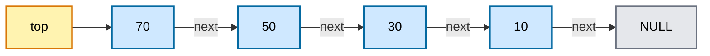
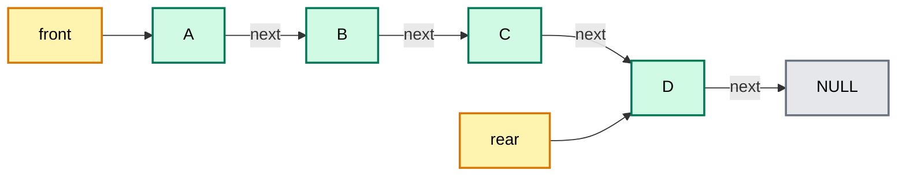
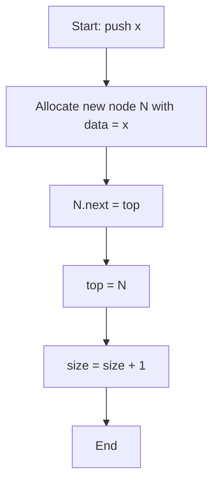
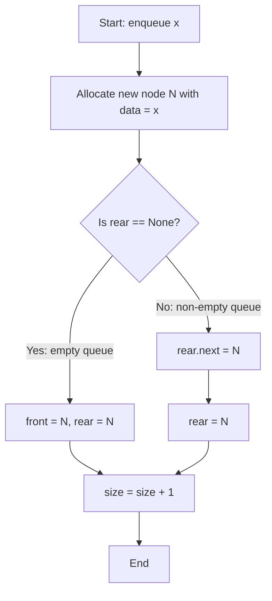
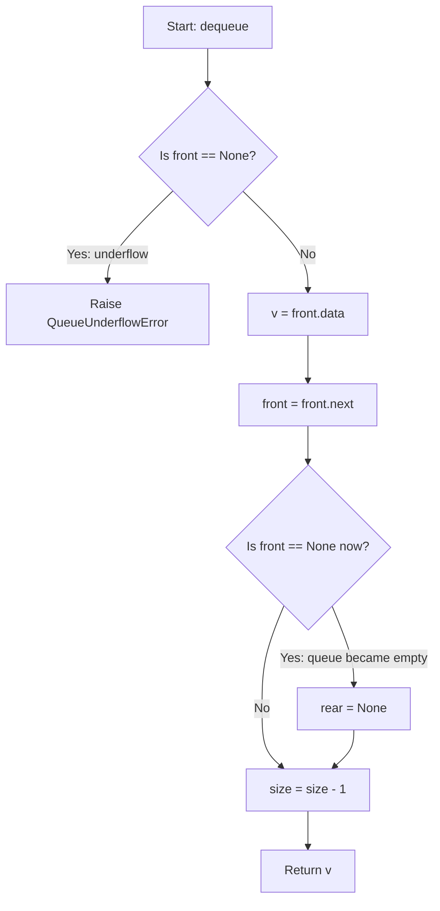

# Stacks and Queues using Linked List

<!-- SECTION_1_START -->
# Stacks and Queues using Linked List — Core Technical Definition & Intuitive Overview

## 1.1 Formal Definition (KTU 2024 Syllabus Terminology)

> [!IMPORTANT]
> **Stack (LIFO Abstract Data Type):** A linear data structure that follows the **Last-In-First-Out (LIFO)** discipline, in which insertion and deletion of elements are restricted to a single end called the **top**. When implemented using a *Singly Linked List*, a `top` pointer tracks the head node, allowing all mutator operations to execute in constant time.

> [!IMPORTANT]
> **Queue (FIFO Abstract Data Type):** A linear data structure that follows the **First-In-First-Out (FIFO)** discipline, in which insertion occurs at the **rear** end and deletion occurs at the **front** end. When implemented using a *Singly Linked List*, two pointers — `front` and `rear` — are maintained to achieve O(1) enqueue and dequeue operations without the shift-overhead penalty of array implementation.

> [!NOTE]
> **Why Linked List?** The array-based implementation suffers from either *fixed capacity* (static array) or *amortized resizing cost* (dynamic array). A linked list representation offers **dynamic, unbounded growth** bounded only by available heap memory, at the cost of one extra pointer per node.

## 1.2 Conceptual Analogy / Intuition

### 🧱 Stack Analogy — The Spring-Loaded Plate Dispenser
Imagine the plate dispenser at a college canteen. You **push** a fresh plate onto the top of the spring-loaded column, and when someone pulls a plate out, they **pop** the topmost one. The plate that was placed *last* comes out *first*. If you want to reach the bottom plate, you must remove every plate above it — that is LIFO. In a linked list, your fingers are always at the **head** of the chain, which is why push/pop happens at the head.

### 🚶 Queue Analogy — The KTU Exam Hall Line
Picture students standing in a queue outside the exam hall. The student who arrived **first** stands at the **front** and gets to enter first. New students join at the **rear**. The **front** student leaves (dequeue) the moment the door opens, and a newcomer is added (enqueue) at the back. Nobody cuts in from the middle — that is FIFO. In a linked list, we keep a `front` pointer (the head) and a `rear` pointer (the tail) so we never have to walk the list end-to-end.

## 1.3 Standard Metrics & Boundary States

| Metric | Stack (Linked List) | Queue (Linked List) |
|---|---|---|
| **Minimum node count for a valid structure** | **0** (empty stack) | **0** (empty queue) |
| **Pointer count per node** | **2** (`data`, `next`) | **2** (`data`, `next`) |
| **External pointers maintained** | **1** (`top`) | **2** (`front`, `rear`) |
| **Default auxiliary space overhead** | **O(n)** for n elements | **O(n)** for n elements |

> [!VISUALIZATION CONTROL]
> **Concept:** Visualising a stack with three nodes and a queue with three nodes using a coordinate-style representation.
> **GeoGebra / Desmos Input Points:**
> * Stack: `P0 = (0, 3)`, `P1 = (0, 2)`, `P2 = (0, 1)` (each labelled with the node value) with a separate arrow indicating `top` pointing to `P0`
> * Queue: `Q0 = (0, 1)`, `Q1 = (2, 1)`, `Q2 = (4, 1)` with `front` arrow at `Q0` and `rear` arrow at `Q2`
> **Visual Description:** For the stack, observe that the *topmost* (highest y) node is the one most recently pushed. For the queue, observe the horizontal chain where the *leftmost* node is the one that will be dequeued next. Pop/dequeue operations visually shift the pointer in the direction of insertion order.

<!-- SECTION_1_END -->

<!-- SECTION_2_START -->
# Deep Theoretical Analysis & KTU High-Yield Formula Sheet

## 2.1 Node Architecture — The Atomic Building Block

A *singly linked list node* used for both stack and queue is identical in structure:

| Field | Purpose | Memory Footprint (typical 64-bit system) |
|---|---|---|
| `data` | Stores the user payload (integer, string, object reference) | **8 bytes** (object header + reference) |
| `next` | Stores the reference to the successor node, or `None` for the last node | **8 bytes** |

> [!NOTE]
> For a queue, we *could* use a *doubly linked list* to delete the rear node in O(1), but a singly linked list with two external pointers (`front`, `rear`) is sufficient because we only ever delete at `front` and insert at `rear`.

## 2.2 Operational Logic Breakdown — Stack using Linked List

Let `top` be the external pointer to the head of the linked list.

### 🔼 `push(x)` — Insert at Head
1. **Allocate** a new node `N` with `N.data = x` and `N.next = None`.
2. **Link forward:** `N.next = top` (N now points to the previous top).
3. **Update top:** `top = N` (the new node is the topmost).
4. **Increment** size counter.

### 🔽 `pop()` — Remove from Head
1. **Guard:** If `top is None`, raise `StackUnderflowError`.
2. **Capture** the value `v = top.data`.
3. **Bypass:** `top = top.next` (the new top is the next node).
4. **Decrement** size counter.
5. **Return** `v`.

### 👁️ `peek()` — Read Top Without Removal
1. **Guard:** If `top is None`, raise `StackUnderflowError`.
2. **Return** `top.data`.

### ✅ `isEmpty()`
1. **Return** `top is None`.

## 2.3 Operational Logic Breakdown — Queue using Linked List

Let `front` point to the head (deletion end) and `rear` point to the tail (insertion end).

### ➡️ `enqueue(x)` — Insert at Rear
1. **Allocate** a new node `N` with `N.data = x` and `N.next = None`.
2. **Edge case:** If `rear is None` (empty queue), set `front = rear = N`.
3. **Otherwise:** `rear.next = N` (old rear now points to N), then `rear = N`.
4. **Increment** size counter.

### ⬅️ `dequeue()` — Remove from Front
1. **Guard:** If `front is None`, raise `QueueUnderflowError`.
2. **Capture** the value `v = front.data`.
3. **Bypass:** `front = front.next`.
4. **Edge case:** If `front is now None`, set `rear = None` (queue became empty).
5. **Decrement** size counter.
6. **Return** `v`.

### 👁️ `peek()` / `front()` — Read Front Without Removal
1. **Guard:** If `front is None`, raise `QueueUnderflowError`.
2. **Return** `front.data`.

### ✅ `isEmpty()`
1. **Return** `front is None`.

## 2.4 KTU Formula Sheet / Cheat Sheet

| Operation | Stack (LL) | Queue (LL) | Stack (Array) | Queue (Array) |
|---|---|---|---|---|
| `push` / `enqueue` | **O(1)** | **O(1)** | **O(1)** amortized | **O(1)** amortized |
| `pop` / `dequeue` | **O(1)** | **O(1)** | **O(1)** | **O(n)** (shift cost) or **O(1)** (circular) |
| `peek` / `front` | **O(1)** | **O(1)** | **O(1)** | **O(1)** |
| `isEmpty` | **O(1)** | **O(1)** | **O(1)** | **O(1)** |
| Memory per element | $\Theta(2w)$ where $w$ = word size | $\Theta(2w)$ | $\Theta(1)$ (data only) | $\Theta(1)$ (data only) |
| Total auxiliary space for $n$ elements | $\Theta(n)$ | $\Theta(n)$ | $\Theta(n)$ | $\Theta(n)$ |

> [!NOTE]
> **Why is the linked list version *asymptotically superior* for a linear (non-circular) queue?** Because in a naïve array queue, every `dequeue` requires shifting all remaining elements left by one — an O(n) operation. A circular array queue fixes this, but a linked list version is conceptually simpler and grows without an upper cap.

## 2.5 Real-World Engineering Utility

| Domain | Stack (LL) Application | Queue (LL) Application |
|---|---|---|
| **Operating Systems** | Process call-stack frames, back-button history, undo stack | Ready queue of processes, I/O request scheduling, print spooler |
| **Compilers** | Parsing expression trees, evaluating postfix/prefix, symbol table scope chain | BFS traversal of ASTs, instruction scheduling |
| **Networking** | Backtracking in DFS packet routing | Packet buffers in routers (FIFO discipline) |
| **Web / App Dev** | Browser back stack, recursive function memoization | Task queues in Node.js, RabbitMQ, Celery workers |
| **Embedded / Real-Time** | Interrupt context saving | Round-robin scheduler ready queue |

<!-- SECTION_2_END -->

<!-- SECTION_3_START -->
# Step-by-Step Derivations & Code Implementation

## 3.1 Exhaustive Python Implementation — Stack using Singly Linked List

```python
"""
File: stack_linked_list.py
Course: OECST611 — Data Structures (KTU 2024 Scheme)
Module: 2 — Linked List and Memory Management
Topic: Stack Implementation using Singly Linked List
"""

from __future__ import annotations
from typing import Optional, Generic, TypeVar

T = TypeVar("T")


class StackUnderflowError(Exception):
    """Raised when pop() or peek() is attempted on an empty stack."""
    pass


class _Node(Generic[T]):
    """Internal node class for the singly linked list backing the stack."""

    __slots__ = ("data", "next")

    def __init__(self, data: T, nxt: Optional["_Node[T]"] = None) -> None:
        self.data: T = data
        self.next: Optional[_Node[T]] = nxt


class LinkedStack(Generic[T]):
    """
    A LIFO stack backed by a singly linked list.
    All mutator operations run in O(1) time.
    """

    def __init__(self) -> None:
        self._top: Optional[_Node[T]] = None
        self._size: int = 0

    def push(self, item: T) -> None:
        """Insert item at the top of the stack. Time: O(1)"""
        new_node = _Node[T](data=item, nxt=self._top)   # link to old top
        self._top = new_node                              # update top pointer
        self._size += 1                                   # increment size
        return None

    def pop(self) -> T:
        """Remove and return the top element. Time: O(1)"""
        if self._top is None:
            raise StackUnderflowError("pop() called on empty stack")
        popped_value: T = self._top.data                  # capture data
        self._top = self._top.next                        # bypass old top
        self._size -= 1                                   # decrement size
        return popped_value

    def peek(self) -> T:
        """Return the top element without removing it. Time: O(1)"""
        if self._top is None:
            raise StackUnderflowError("peek() called on empty stack")
        return self._top.data

    def is_empty(self) -> bool:
        """Return True if the stack has no elements. Time: O(1)"""
        return self._top is None

    def size(self) -> int:
        """Return the number of elements in the stack. Time: O(1)"""
        return self._size

    def __repr__(self) -> str:
        elements = []
        current = self._top
        while current is not None:
            elements.append(repr(current.data))
            current = current.next
        return f"LinkedStack(TOP -> {' -> '.join(elements)})"


# ---------- Demonstration / Dry-Run Trace ----------
if __name__ == "__main__":
    s: LinkedStack[int] = LinkedStack()
    print(f"Initial state: is_empty = {s.is_empty()}, size = {s.size()}")

    s.push(10)   # top -> 10
    s.push(20)   # top -> 20 -> 10
    s.push(30)   # top -> 30 -> 20 -> 10
    print(f"After 3 pushes: {s}")

    top_value = s.peek()
    print(f"peek() returned: {top_value}, stack unchanged: {s}")

    popped = s.pop()
    print(f"pop() returned: {popped}, stack now: {s}")

    popped = s.pop()
    print(f"pop() returned: {popped}, stack now: {s}")

    s.push(40)
    print(f"After push(40): {s}")

    # Demonstrate the boundary state
    while not s.is_empty():
        s.pop()
    print(f"After draining: {s}")

    # Boundary case: pop on empty stack
    try:
        s.pop()
    except StackUnderflowError as e:
        print(f"Caught expected error: {e}")
```

### Dry-Run Trace Table — Stack Operations

| Step | Operation | `top` Pointer State (Head → Tail) | `_size` | Return |
|---|---|---|---|---|
| 0 | `__init__()` | `None` | 0 | — |
| 1 | `push(10)` | `10 → None` | 1 | — |
| 2 | `push(20)` | `20 → 10 → None` | 2 | — |
| 3 | `push(30)` | `30 → 20 → 10 → None` | 3 | — |
| 4 | `peek()` | `30 → 20 → 10 → None` | 3 | **30** |
| 5 | `pop()` | `20 → 10 → None` | 2 | **30** |
| 6 | `pop()` | `10 → None` | 1 | **20** |
| 7 | `push(40)` | `40 → 10 → None` | 2 | — |

## 3.2 Exhaustive Python Implementation — Queue using Singly Linked List

```python
"""
File: queue_linked_list.py
Course: OECST611 — Data Structures (KTU 2024 Scheme)
Module: 2 — Linked List and Memory Management
Topic: Queue Implementation using Singly Linked List
"""

from __future__ import annotations
from typing import Optional, Generic, TypeVar

T = TypeVar("T")


class QueueUnderflowError(Exception):
    """Raised when dequeue() or front() is attempted on an empty queue."""
    pass


class _QNode(Generic[T]):
    """Internal node class for the singly linked list backing the queue."""

    __slots__ = ("data", "next")

    def __init__(self, data: T, nxt: Optional["_QNode[T]"] = None) -> None:
        self.data: T = data
        self.next: Optional[_QNode[T]] = nxt


class LinkedQueue(Generic[T]):
    """
    A FIFO queue backed by a singly linked list with front and rear pointers.
    All mutator operations run in O(1) time.
    """

    def __init__(self) -> None:
        self._front: Optional[_QNode[T]] = None
        self._rear: Optional[_QNode[T]] = None
        self._size: int = 0

    def enqueue(self, item: T) -> None:
        """Insert item at the rear of the queue. Time: O(1)"""
        new_node = _QNode[T](data=item, nxt=None)
        if self._rear is None:
            # Queue is empty — new node becomes both front and rear
            self._front = new_node
            self._rear = new_node
        else:
            # Link old rear to new node, then advance rear
            self._rear.next = new_node
            self._rear = new_node
        self._size += 1
        return None

    def dequeue(self) -> T:
        """Remove and return the front element. Time: O(1)"""
        if self._front is None:
            raise QueueUnderflowError("dequeue() called on empty queue")
        dequeued_value: T = self._front.data
        self._front = self._front.next
        if self._front is None:
            # Queue just became empty — reset rear to None to avoid dangling pointer
            self._rear = None
        self._size -= 1
        return dequeued_value

    def front(self) -> T:
        """Return the front element without removing it. Time: O(1)"""
        if self._front is None:
            raise QueueUnderflowError("front() called on empty queue")
        return self._front.data

    def rear(self) -> T:
        """Return the rear element without removing it. Time: O(1)"""
        if self._rear is None:
            raise QueueUnderflowError("rear() called on empty queue")
        return self._rear.data

    def is_empty(self) -> bool:
        """Return True if the queue has no elements. Time: O(1)"""
        return self._front is None

    def size(self) -> int:
        """Return the number of elements in the queue. Time: O(1)"""
        return self._size

    def __repr__(self) -> str:
        elements = []
        current = self._front
        while current is not None:
            elements.append(repr(current.data))
            current = current.next
        return f"LinkedQueue(FRONT -> {' -> '.join(elements)} <- REAR)"


# ---------- Demonstration / Dry-Run Trace ----------
if __name__ == "__main__":
    q: LinkedQueue[str] = LinkedQueue()
    print(f"Initial state: is_empty = {q.is_empty()}, size = {q.size()}")

    q.enqueue("A")   # front/rear -> A
    q.enqueue("B")   # front -> A -> B <- rear
    q.enqueue("C")   # front -> A -> B -> C <- rear
    print(f"After 3 enqueues: {q}")

    f = q.front()
    r = q.rear()
    print(f"front() = {f}, rear() = {r}")

    d = q.dequeue()
    print(f"dequeue() = {d}, queue now: {q}")

    q.enqueue("D")
    print(f"After enqueue('D'): {q}")

    # Drain the queue
    while not q.is_empty():
        print(f"Dequeued: {q.dequeue()}, remaining: {q}")

    # Boundary: dequeue on empty
    try:
        q.dequeue()
    except QueueUnderflowError as e:
        print(f"Caught expected error: {e}")
```

### Dry-Run Trace Table — Queue Operations

| Step | Operation | `front` → … → `rear` | `_size` | Return |
|---|---|---|---|---|
| 0 | `__init__()` | `None` | 0 | — |
| 1 | `enqueue("A")` | `A` | 1 | — |
| 2 | `enqueue("B")` | `A → B` | 2 | — |
| 3 | `enqueue("C")` | `A → B → C` | 3 | — |
| 4 | `front()` | `A → B → C` | 3 | **"A"** |
| 5 | `rear()` | `A → B → C` | 3 | **"C"** |
| 6 | `dequeue()` | `B → C` | 2 | **"A"** |
| 7 | `enqueue("D")` | `B → C → D` | 3 | — |
| 8 | `dequeue()` | `C → D` | 2 | **"B"** |
| 9 | `dequeue()` | `D` | 1 | **"C"** |
| 10 | `dequeue()` | `None` (front = rear = None) | 0 | **"D"** |

## 3.3 Algebraic Derivation — Total Pointer Updates for $n$ Operations

Suppose we perform $n$ mixed operations (push/pop or enqueue/dequeue) on a linked-list-backed structure starting from an empty state. Let $k$ be the number of successful `push`/`enqueue` operations that occur.

The number of pointer mutations performed is:

$$
\begin{aligned}
P_{\text{stack}}(n, k) &= \underbrace{2k}_{\text{push: new node link + top update}} + \underbrace{2k}_{\text{pop: read + bypass top}} + \underbrace{k}_{\text{size increments}} \\[4pt]
&= 5k \quad \text{if } k \leq n \text{ and pop count} = k \\[4pt]
P_{\text{queue}}(n, k) &= \underbrace{2k}_{\text{enqueue: link old rear + advance rear}} + \underbrace{2k}_{\text{dequeue: read + bypass front}} + \underbrace{k}_{\text{size increments}} \\[4pt]
&= 5k
\end{aligned}
$$

The **amortised** pointer cost per operation is therefore:

$$
\bar{P} = \frac{P_{\text{total}}}{n} = \frac{5k}{n} \leq 5
$$

This confirms the per-operation cost is bounded by a **constant**, independently of $n$, validating the **O(1)** amortised classification.

<!-- SECTION_3_END -->

<!-- SECTION_4_START -->
# Structural Diagrams & Schematics

## 4.1 Stack using Singly Linked List — Node Topology After `push(70)`



**Reading the diagram:** The yellow box on the left is the external `top` pointer. It points to the **head** of the linked list, which holds the most-recently-pushed value `70`. Walking right along the `next` arrows traces the older elements in reverse insertion order.

## 4.2 Queue using Singly Linked List — Node Topology After `enqueue(D)`



**Reading the diagram:** `front` points to the *oldest* element (`A`) — the next candidate for dequeue. `rear` points to the *newest* element (`D`) — the most recent enqueue. The chain between them is the FIFO waiting line.

## 4.3 Operation Flow — `push(x)` on a Linked Stack



## 4.4 Operation Flow — `enqueue(x)` on a Linked Queue



## 4.5 Operation Flow — `dequeue()` on a Linked Queue (Including Dangling-Pointer Guard)



> [!NOTE]
> The branch where `rear` is reset to `None` is **critical** for memory safety. Skipping it leaves a *dangling pointer* — the garbage collector cannot reclaim the old rear node because something (your stale `rear` field) still references it, leading to a slow memory leak in long-running systems.

## 4.6 Comparison Block Diagram — Array vs Linked-List Implementations

```mermaid
flowchart LR
    subgraph ARRAY["ARRAY IMPLEMENTATION"]
        A1[Fixed size or resizing cost]
        A2[Cache-friendly contiguous memory]
        A3[O(n) dequeue for naive queue]
        A1 --> A2 --> A3
    end
    subgraph LINKED["LINKED LIST IMPLEMENTATION"]
        L1[Dynamic, unbounded growth]
        L2[Extra pointer per node]
        L3[O(1) for ALL operations]
        L1 --> L2 --> L3
    end
    ARRAY -.competes with.-> LINKED
```

<!-- SECTION_4_END -->

<!-- SECTION_5_START -->
# KTU 2024 Scheme Examination Question Bank & Topic Recap

---

## 📘 Part A — Short Answer Questions (3 Marks Each)

### **Q1.** [KTU University Exam — July 2024] **CO1 | Remember**
*What is the difference between a stack and a queue? Mention the disciplines they follow and one real-world example of each.*

**Model Answer (3 Marks):**
- **Stack** follows the **LIFO (Last-In-First-Out)** discipline — the element inserted most recently is the first one to be removed. *Example:* A stack of plates in a canteen, or the *Undo* mechanism in a text editor. **(1 Mark)**
- **Queue** follows the **FIFO (First-In-First-Out)** discipline — the element inserted earliest is the first one to be removed. *Example:* A queue of passengers at a railway ticket counter, or the *print spooler* in an operating system. **(1 Mark)**
- **Key operational difference:** Both insertions and deletions in a stack happen at the *same end* (`top`), whereas in a queue, insertion happens at the `rear` and deletion happens at the `front` — they are at *opposite ends*. **(1 Mark)**

---

### **Q2.** [KTU University Exam — Dec 2023] **CO1 | Understand**
*Why is a linked-list-based implementation preferred over an array-based implementation for a queue? Give two reasons.*

**Model Answer (3 Marks):**
- **Reason 1 — No shifting cost:** In a naïve array queue, every `dequeue` requires shifting all remaining elements left by one position, costing **O(n)** time. A linked list implementation deletes the front node in **O(1)** by simply advancing the `front` pointer. **(1.5 Marks)**
- **Reason 2 — Dynamic growth:** A linked list queue grows with demand and shrinks when elements are removed, using exactly as much heap memory as needed. An array queue either wastes memory (over-allocated) or suffers from costly resizing/relocation. **(1.5 Marks)**

---

## 📕 Part B — Long Answer Questions (14 Marks Each, Internal Choice)

> [!NOTE]
> **KTU Pattern:** Each Part-B question carries 14 marks, typically split as **(a) 7 marks** and **(b) 7 marks**, mapping to the *Understand* and *Apply* cognitive levels respectively. Students are expected to write the algorithm/data structure, trace it, and present a neat diagram.

---

### **Question A (14 Marks):** Stack using Singly Linked List

#### **(a)** [KTU University Exam — Dec 2023] **CO2 | Understand — 7 Marks**
*Design a Stack data structure using a singly linked list. Write the algorithm (or pseudo-code) for the `push`, `pop`, `peek`, and `isEmpty` operations. Draw a neat diagram showing the state of the stack after pushing the values 10, 20, 30, 40 in that order.*

**Model Solution:**

**Node Structure (1 Mark):**
```
Structure Node
    data : integer
    next : pointer to Node
End Structure
```

**Algorithm — push(x) (2 Marks):**
```
Algorithm push(x)
1.  newNode ← ALLOCATE(NODE)
2.  newNode.data ← x
3.  newNode.next ← top
4.  top ← newNode
5.  size ← size + 1
End push
```

**Algorithm — pop() (1.5 Marks):**
```
Algorithm pop()
1.  IF top == NULL THEN
2.      PRINT "Stack Underflow"
3.      RETURN
4.  END IF
5.  temp ← top.data
6.  top ← top.next
7.  size ← size - 1
8.  RETURN temp
End pop
```

**Algorithm — peek() and isEmpty() (1 Mark):**
```
peek() :  IF top == NULL then error; ELSE RETURN top.data
isEmpty(): RETURN top == NULL
```

**Diagram after pushes 10, 20, 30, 40 (1.5 Marks):**
```
  top
   │
   ▼
  [40] ──next──► [30] ──next──► [20] ──next──► [10] ──next──► NULL
```
The `top` pointer is at the head. The most recent push (40) is at the head; the oldest (10) is at the tail.

**Valuation Key Points:**
- [Node structure with data and next pointer: 1 Mark]
- [push logic including pointer reversal and top update: 2 Marks]
- [pop logic with underflow guard: 1.5 Marks]
- [peek and isEmpty correctness: 1 Mark]
- [Neat diagram with top pointer and null terminator: 1.5 Marks]

---

#### **(b)** [KTU University Exam — Dec 2023] **CO3 | Apply — 7 Marks**
*Using the stack implemented in part (a), trace the conversion of the infix expression* `A + B * C - D` *to postfix using the Shunting-Yard algorithm. Show the stack state after processing each token and write the final postfix expression.*

**Model Solution:**

**Operator Precedence Table (recalled) (1 Mark):**
- `*`, `/` have precedence **2**; `+`, `-` have precedence **1**; associativity is **left-to-right** for all four.

**Initial State:** `output = ""`, `stack = []` (empty)

**Trace Table (5 Marks):**

| Step | Token | Stack (bottom → top) | Output | Action Justification |
|---|---|---|---|---|
| 1 | `A` | `[ ]` | `A` | Operand → output directly |
| 2 | `+` | `[+]` | `A` | Operator → push (stack empty) |
| 3 | `B` | `[+]` | `A B` | Operand → output directly |
| 4 | `*` | `[+, *]` | `A B` | `*` (prec 2) > `+` (prec 1) → push |
| 5 | `C` | `[+, *]` | `A B C` | Operand → output directly |
| 6 | `-` | `[-]` | `A B C * +` | `+` (prec 1) ≥ `-` (prec 1) → pop `+`; `*` (prec 2) > `-` (prec 1) → stop; push `-` |
| 7 | `D` | `[-]` | `A B C * + D` | Operand → output directly |
| 8 | end | `[ ]` | `A B C * + D -` | Pop all remaining operators |

**Final Postfix Expression (1 Mark):**

$$
A \, B \, C \, * \, + \, D \, -
$$

> Evaluating this postfix: push `A`, push `B`, push `C`, `*` pops `B,C` pushes `(B*C)`, `+` pops `A,(B*C)` pushes `(A + B*C)`, push `D`, `-` pops `(A+B*C), D` pushes `(A+B*C - D)` — matching the infix semantics.

**Valuation Key Points:**
- [Correct precedence and associativity recall: 1 Mark]
- [Per-step correct stack update and output appendage: 5 Marks, 0.5 per row]
- [Final postfix string correct: 1 Mark]

---

### **Question B (14 Marks):** Queue using Singly Linked List

#### **(a)** [KTU University Exam — July 2024] **CO2 | Understand — 7 Marks**
*Design a Queue data structure using a singly linked list with both `front` and `rear` pointers. Write the algorithm for `enqueue`, `dequeue`, and `isEmpty` operations. Explain why resetting `rear` to NULL after the last `dequeue` is necessary.*

**Model Solution:**

**Node and Queue Structure (1 Mark):**
```
Structure Node
    data : integer
    next : pointer to Node
End Structure

Structure Queue
    front : pointer to Node
    rear  : pointer to Node
    size  : integer
End Structure
```

**Algorithm — enqueue(x) (2 Marks):**
```
Algorithm enqueue(x)
1.  newNode ← ALLOCATE(NODE)
2.  newNode.data ← x
3.  newNode.next ← NULL
4.  IF rear == NULL THEN
5.      front ← newNode
6.      rear  ← newNode
7.  ELSE
8.      rear.next ← newNode
9.      rear ← newNode
10. END IF
11. size ← size + 1
End enqueue
```

**Algorithm — dequeue() (2 Marks):**
```
Algorithm dequeue()
1.  IF front == NULL THEN
2.      PRINT "Queue Underflow"
3.      RETURN
4.  END IF
5.  val ← front.data
6.  front ← front.next
7.  IF front == NULL THEN
8.      rear ← NULL
9.  END IF
10. size ← size - 1
11. RETURN val
End dequeue
```

**isEmpty() and Necessity of `rear = NULL` reset (2 Marks):**
```
isEmpty(): RETURN front == NULL
```

**Why reset `rear` to NULL?** When the *last* element is dequeued, `front` becomes NULL but `rear` would still point to the now-orphaned node that was just dequeued. This is a **dangling pointer**. Two consequences follow:
- (i) `isEmpty()` would still incorrectly return `false` if we naively checked `rear == NULL`.
- (ii) The orphaned node's memory cannot be reclaimed by the garbage collector because `rear` still references it — a **memory leak** in long-running systems.

Hence, the line `IF front == NULL THEN rear ← NULL` is essential for **correctness** and **memory hygiene**.

**Valuation Key Points:**
- [Queue structure with two external pointers: 1 Mark]
- [enqueue handling empty case + non-empty case: 2 Marks]
- [dequeue with underflow guard: 2 Marks]
- [isEmpty + dangling-pointer explanation: 2 Marks]

---

#### **(b)** [KTU University Exam — July 2024] **CO3 | Apply — 7 Marks**
*Using the linked-list queue implemented in part (a), simulate the following scenario. A print spooler receives 5 print jobs with IDs* `[101, 102, 103, 104, 105]` *in order. After the first two jobs are dequeued, job 106 arrives. Trace the `front` and `rear` pointer state and the queue contents after each operation.*

**Model Solution:**

**State Diagram Trace (6 Marks — 0.5 per row):**

| Step | Operation | Queue State (front → … → rear) | `front` Points To | `rear` Points To | Dequeued/Returned |
|---|---|---|---|---|---|
| 0 | Initial | (empty) | `NULL` | `NULL` | — |
| 1 | `enqueue(101)` | `101` | 101 | 101 | — |
| 2 | `enqueue(102)` | `101 → 102` | 101 | 102 | — |
| 3 | `enqueue(103)` | `101 → 102 → 103` | 101 | 103 | — |
| 4 | `enqueue(104)` | `101 → 102 → 103 → 104` | 101 | 104 | — |
| 5 | `enqueue(105)` | `101 → 102 → 103 → 104 → 105` | 101 | 105 | — |
| 6 | `dequeue()` | `102 → 103 → 104 → 105` | 102 | 105 | **101** |
| 7 | `dequeue()` | `103 → 104 → 105` | 103 | 105 | **102** |
| 8 | `enqueue(106)` | `103 → 104 → 105 → 106` | 103 | 106 | — |

**Final Snapshot (1 Mark):**
```
            front                     rear
              │                        │
              ▼                        ▼
            [103] ──► [104] ──► [105] ──► [106] ──► NULL
```

The first two print jobs (`101`, `102`) have been *fairly* processed in FIFO order, exactly as expected from a real-world print spooler. The newly arriving job `106` is appended to the rear in O(1) without disturbing the existing chain.

**Valuation Key Points:**
- [Correct initial empty state: 0.5 Mark]
- [Five enqueue operations correctly traced: 2.5 Marks]
- [Two dequeue operations correctly traced: 1.5 Marks]
- [enqueue(106) correctly updates rear: 1 Mark]
- [Final neat diagram with front and rear labels: 1 Mark]
- [Final summary sentence: 0.5 Mark]

---

## ⚠️ KTU Examiner's Valuation Warning / Pitfall Callout

> [!WARNING]
> **Common Mark-Deduction Traps in Stack/Queue Linked-List Questions:**
> 1. **Forgetting the underflow guard** — Always check `top == NULL` (or `front == NULL`) *before* dereferencing. Examiners deduct up to **2 marks** for missing this in `pop`/`dequeue`/`peek`.
> 2. **Confusing `top` with `rear` terminology** — In a *stack*, only the head pointer is called `top`. In a *queue*, you must maintain *both* `front` and `rear`. Writing a queue algorithm with a single pointer loses **1 mark** for incomplete design.
> 3. **Not resetting `rear` to NULL** in a queue after the last `dequeue` — This is a classic memory-leak / dangling-pointer question. Examiners expect the line `rear = NULL` and will reward its presence in the algorithm.
> 4. **Wrong complexity claim** — Writing "O(n) for push" or "O(n) for pop" is a conceptual error. Both must be **O(1)** for a linked-list-backed structure. Loss of **1 mark** for incorrect complexity justification.
> 5. **Skipping the diagram** — KTU examiners reward a *neat, labelled* diagram (with explicit `NULL` terminator) for up to **1.5 marks**. A textual-only answer is acceptable but typically scores lower in presentation.

---

## ✅ Topic Recap & Important Things to Remember

- **Stack = LIFO**; **Queue = FIFO**. These are the *only* two disciplines you must internalise cold.
- A **linked list stack** maintains exactly **one external pointer** (`top`) that points to the *head* of the list.
- A **linked list queue** maintains **two external pointers** (`front` and `rear`) to support O(1) enqueue and dequeue.
- All four core operations — `push`, `pop`, `enqueue`, `dequeue` — run in **O(1)** time for the linked-list implementation.
- The **`isEmpty()`** check is implemented as `top == NULL` (stack) or `front == NULL` (queue).
- The **peek/look** operation must still perform the empty check; it does *not* modify the structure.
- After `dequeue()` empties a queue, **reset `rear` to NULL** to avoid a dangling pointer / memory leak.
- Each node consumes **$2w$ bytes** of memory (one for data, one for next pointer) where $w$ is the machine word size — typically 8 bytes per pointer on a 64-bit system.
- **Advantages over array:** Dynamic sizing, no shifting, no overflow (only heap exhaustion).
- **Disadvantages vs array:** Extra pointer overhead per node, no cache locality (poor cache-line utilisation), no random access.
- **Real-world applications** to remember: call stack, undo history, expression evaluation (stack); process scheduling, BFS, print spooler, packet buffers (queue).
- **Amortised pointer cost:** $\bar{P} \leq 5$ mutations per operation, confirming the constant-time bound.
<!-- SECTION_5_END -->
