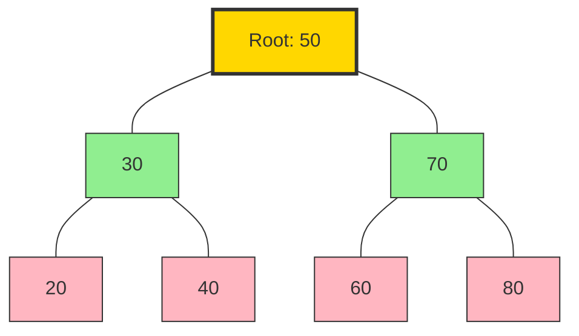
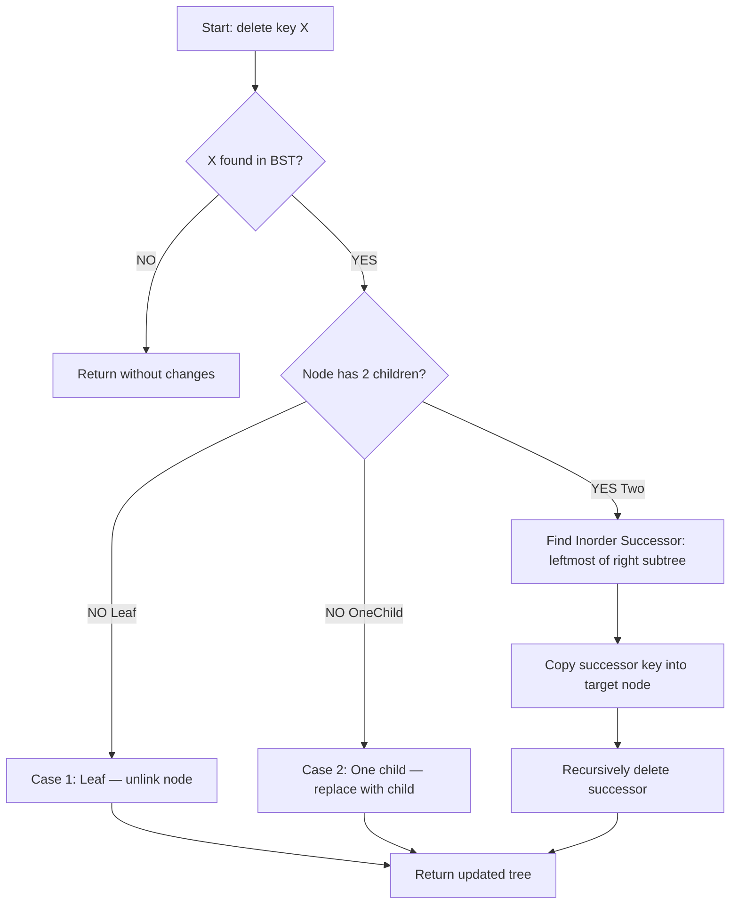
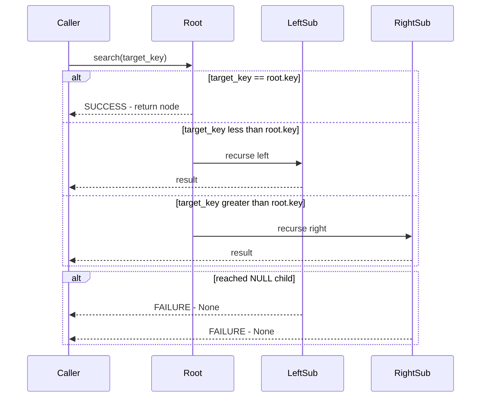
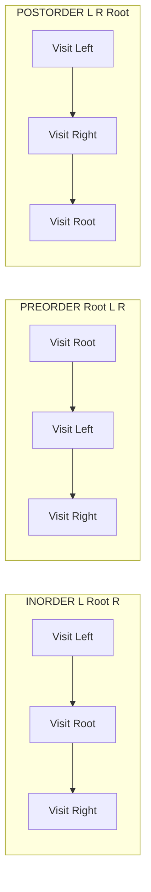

# Binary Search Trees - Binary Search Tree Operations

<!-- SECTION_1_START -->
# Binary Search Tree Operations — Core Definition & Intuitive Overview

## Formal Definition (KTU 2024 Syllabus Terminology)

> [!IMPORTANT]
> **Binary Search Tree (BST):** A Binary Search Tree is a node-based binary tree data structure that satisfies the **BST Invariant Property** — for every node $N$ with key value $k$, all keys in the left subtree of $N$ are **strictly less** than $k$, and all keys in the right subtree of $N$ are **strictly greater** than $k$. This property must hold **recursively** for every node in the tree.

Mathematically, for any node $N$ with value $k$:

$$\forall \, x \in \text{LeftSubtree}(N) : x < k \quad \text{AND} \quad \forall \, y \in \text{RightSubtree}(N) : y > k$$

## Conceptual Analogy / Intuition

Think of a **BST as a phonebook organizer** that learns as you go. Imagine you are sorting 50 exam answer sheets by register number. You pick the middle register number and place it on a desk — that becomes your **root**. Numbers smaller go into a **left pile**, larger go into a **right pile**. From each pile, you again pick the middle, and the pattern repeats. To find a specific register number, you don't scan all 50 — you just compare and walk left or right, eliminating half the candidates at every step.

**Geometric Intuition:** A perfectly balanced BST looks like a **broom standing on its bristles** — the height is logarithmic, so the search is fast. A degenerated BST (e.g., inserting already sorted data) collapses into a **chain resembling a linked list** — the worst case where each node has only one child.

> [!NOTE]
> **Syllabus Highlight:** KTU 2024 Scheme expects mastery of four canonical BST operations — **Search, Insertion, Deletion, and Traversal** — along with auxiliary procedures such as finding **Minimum, Maximum, Successor, Predecessor, and Height**.

## Standard Metrics and Constants

- **Time Complexity (Balanced BST):** $\mathbf{O(\log n)}$ — search, insert, delete
- **Time Complexity (Skewed BST):** $\mathbf{O(n)}$ — worst-case degrades to linear
- **Space Complexity (Recursive):** $\mathbf{O(h)}$ call stack, where $h$ = height
- **Inorder Traversal Guarantee:** Always yields keys in **sorted ascending order**

> [!VISUALIZATION CONTROL]
> **Concept:** BST Search Path Visualization on a Coordinate Plane
> **GeoGebra Input Equations:**
> * `f(x) = 2*x + 1` (representing a path-like BST)
> * `Root = (0, 4)`, `LeftChild = (-2, 3)`, `RightChild = (2, 3)`
> * `LL = (-3, 2)`, `LR = (-1, 2)`, `RR = (3, 2)`
> **Visual Description:** Plot each BST node as a labelled circle at its (x, y) coordinate. Observe how the y-axis (vertical) represents depth, while horizontal position represents the BST branching. The search path lights up as a descending line from root to target.

---

<!-- SECTION_1_END -->

<!-- SECTION_2_START -->
# Deep Theoretical Analysis & KTU High-Yield Formula Sheet

## Operational Breakdown of BST Search

The `SEARCH` operation is the foundational primitive. Every other BST operation (insert, delete) reuses this comparator-driven navigation.

**Algorithm Logic Steps:**

1. Begin at the **root node** $R$ of the BST.
2. Compare the target key $T$ with $R.key$:
   - If $T == R.key$ → **search succeeds**, return pointer to $R$.
   - If $T < R.key$ → recurse into the **left subtree** $R.left$.
   - If $T > R.key$ → recurse into the **right subtree** $R.right$.
3. If a `NULL` pointer is reached → **search fails**, return `None`.
4. At each step, the search space is **halved**, yielding logarithmic traversal.

## BST Insertion Logic

Insertion is essentially a **failed search** that terminates by creating the missing node.

**Algorithm Logic Steps:**

1. If the tree is empty (`root == NULL`) → create new node, set as root.
2. Otherwise, perform a recursive descent:
   - If $k < current.key$ → go left.
   - If $k > current.key$ → go right.
3. When a `NULL` slot is encountered, attach the new node there.
4. The **BST invariant is preserved** because the new leaf has no children to violate the rule.

> [!IMPORTANT]
> **Duplicates Policy:** Standard KTU textbooks (Cormen et al., Tenenbaum) mandate that **duplicate keys are typically placed in the right subtree** (or rejected entirely). Always state the convention assumed in your exam answer.

## BST Deletion — The Three Cases

Deletion is the most complex operation because removing a node may **disconnect** its subtrees.

**Case 1 — Leaf Node (No Children):**
Simply unlink the node and free memory. Trivial operation, $\mathbf{O(1)}$.

**Case 2 — Single Child (One Subtree):**
Replace the deleted node $N$ with its only child $C$. The BST invariant is preserved because $C$'s subtree already satisfies $C < N.parent$ or $C > N.parent$ by construction.

**Case 3 — Two Children (Full Subtrees):**
This is the **canonical case** tested in KTU exams. The standard replacement strategy is:

- Find the **Inorder Successor** $S$ — the leftmost node in $N$'s right subtree (smallest key greater than $N.key$).
- Copy $S.key$ into $N.key$.
- Recursively delete $S$ from the right subtree.

Alternatively, you may use the **Inorder Predecessor** (largest key in left subtree). Both strategies preserve the BST invariant.

## BST Traversal Orderings

| Traversal Type | Visit Order | KTU Use Case |
|---|---|---|
| **Inorder** (L, Root, R) | Left → Node → Right | Produces **sorted output**; used for validation |
| **Preorder** (Root, L, R) | Node → Left → Right | Used to **copy/serialize** a tree |
| **Postorder** (L, R, Root) | Left → Right → Node | Used to **delete/free** a tree safely |
| **Level-order** (BFS) | Level by level, left to right | Used for **shortest-path** analogies |

## KTU Formula Sheet / Cheat Sheet

| Operation | Best Case | Average Case | Worst Case | Space |
|---|---|---|---|---|
| Search | $O(\log n)$ | $O(\log n)$ | $O(n)$ | $O(h)$ iterative, $O(h)$ recursive |
| Insertion | $O(\log n)$ | $O(\log n)$ | $O(n)$ | $O(h)$ |
| Deletion | $O(\log n)$ | $O(\log n)$ | $O(n)$ | $O(h)$ |
| Find Min | $O(\log n)$ | $O(\log n)$ | $O(n)$ | $O(1)$ |
| Find Max | $O(\log n)$ | $O(\log n)$ | $O(n)$ | $O(1)$ |
| Inorder Traversal | $\Theta(n)$ | $\Theta(n)$ | $\Theta(n)$ | $O(h)$ stack |
| Height Computation | $O(n)$ | $O(n)$ | $O(n)$ | $O(h)$ |

> **Key Recurrence** for height computation:
> $$H(N) = \begin{cases} -1 & \text{if } N = \text{NULL} \\ 1 + \max(H(N.left), \, H(N.right)) & \text{otherwise} \end{cases}$$

## Real-World Engineering Utility

- **Database Indexing:** B-Trees (a generalized BST) power MySQL InnoDB, PostgreSQL, and Oracle indexes.
- **Auto-Complete:** Tries and BSTs accelerate prefix lookups in IDEs and search engines.
- **File Systems:** Directory hierarchies use BST-like structures for fast file lookup.
- **Network Routing:** Longest-prefix matching in routers uses BST variants (radix trees).
- **Compiler Symbol Tables:** BSTs store variable/function identifiers for $\mathbf{O(\log n)}$ lookup during compilation.

---

<!-- SECTION_2_END -->

<!-- SECTION_3_START -->
# Step-by-Step Derivations & Python Implementation

## Section 3.1 — Mathematical Derivation of BST Search Complexity

For a **perfectly balanced** BST with $n$ nodes, the height $h$ satisfies:

$$h = \lfloor \log_2(n) \rfloor$$

At each level of the search, the algorithm compares the target with one node and discards half the remaining candidates. After $k$ comparisons, at most $\frac{n}{2^k}$ nodes remain. The search terminates when this equals 1:

$$\frac{n}{2^k} = 1 \implies n = 2^k \implies k = \log_2(n)$$

Therefore, the search time complexity is $T(n) = O(\log n)$.

**Recurrence form** (used for Master Theorem evaluation in KTU exams):

$$T(n) = T\left(\frac{n}{2}\right) + O(1) \implies T(n) = O(\log n)$$

## Section 3.2 — Worked Example: BST Construction and Inorder Traversal

**Problem:** Insert the sequence $[50, 30, 70, 20, 40, 60, 80]$ into an empty BST. Then perform an inorder traversal.

**Step-by-step construction:**

1. Insert $50$ → Tree is just root $50$.
2. Insert $30$ → $30 < 50$, goes left of $50$.
3. Insert $70$ → $70 > 50$, goes right of $50$.
4. Insert $20$ → $20 < 50$ (go left), $20 < 30$ (go left of $30$).
5. Insert $40$ → $40 < 50$ (go left), $40 > 30$ (go right of $30$).
6. Insert $60$ → $60 > 50$ (go right), $60 < 70$ (go left of $70$).
7. Insert $80$ → $80 > 50$ (go right), $80 > 70$ (go right of $70$).

**Inorder Traversal (L, Root, R):** Starting from root $50$:

- Visit left subtree of $50$ (rooted at $30$):
  - Visit left subtree of $30$ (just $20$) → output $20$.
  - Output $30$.
  - Visit right subtree of $30$ (just $40$) → output $40$.
- Output $50$.
- Visit right subtree of $50$ (rooted at $70$):
  - Visit left subtree of $70$ (just $60$) → output $60$.
  - Output $70$.
  - Visit right subtree of $70$ (just $80$) → output $80$.

**Final Inorder Output:** $[20, 30, 40, 50, 60, 70, 80]$ — perfectly sorted. ✓

## Section 3.3 — Worked Example: Deletion of a Node with Two Children

**Problem:** From the BST above, delete the root $50$.

**Solution Steps:**

1. Node $50$ has **two children** ($30$ and $70$) — invoke Case 3.
2. Find the **Inorder Successor** of $50$: go to $50.right = 70$, then keep going left until `NULL`. The leftmost node is $60$.
3. Copy $60$ into $50$'s position. Tree now has $60$ as root.
4. Recursively delete $60$ from the right subtree. Node $60$ is a leaf, so simple unlink.

**Final tree root value:** $60$, with $30$ (and its subtree) on the left and $70$ (with $80$ as right child) on the right.

## Section 3.4 — Full Python Implementation with Type Hints

```python
from __future__ import annotations
from typing import Optional, List
import logging

logging.basicConfig(level=logging.INFO, format="%(levelname)s :: %(message)s")


class TreeNode:
    """A single node in a Binary Search Tree."""

    def __init__(self, key: int) -> None:
        self.key: int = key
        self.left: Optional[TreeNode] = None
        self.right: Optional[TreeNode] = None

    def __repr__(self) -> str:
        return f"TreeNode(key={self.key})"


class BinarySearchTree:
    """A fully-operational Binary Search Tree with logging and type safety."""

    def __init__(self) -> None:
        self.root: Optional[TreeNode] = None
        logging.info("Initialized an empty BST.")

    # ----------------------------------------------------------------
    # 1. SEARCH OPERATION
    # ----------------------------------------------------------------
    def search(self, key: int) -> Optional[TreeNode]:
        """Recursive BST search. Returns the node if found, else None."""
        return self._search_recursive(self.root, key)

    def _search_recursive(self, node: Optional[TreeNode], key: int) -> Optional[TreeNode]:
        if node is None:
            logging.warning(f"Key {key} not found in BST.")
            return None
        if key == node.key:
            logging.info(f"Key {key} found at node {node}.")
            return node
        if key < node.key:
            return self._search_recursive(node.left, key)
        return self._search_recursive(node.right, key)

    # ----------------------------------------------------------------
    # 2. INSERTION OPERATION
    # ----------------------------------------------------------------
    def insert(self, key: int) -> None:
        """Insert a new key into the BST, preserving the BST invariant."""
        self.root = self._insert_recursive(self.root, key)

    def _insert_recursive(self, node: Optional[TreeNode], key: int) -> TreeNode:
        if node is None:
            logging.info(f"Inserting new node with key {key}.")
            return TreeNode(key)
        if key < node.key:
            node.left = self._insert_recursive(node.left, key)
        elif key > node.key:
            node.right = self._insert_recursive(node.right, key)
        else:
            logging.warning(f"Duplicate key {key} ignored.")
        return node

    # ----------------------------------------------------------------
    # 3. DELETION OPERATION (All Three Cases Handled)
    # ----------------------------------------------------------------
    def delete(self, key: int) -> None:
        """Delete a key from the BST, handling all three edge cases."""
        self.root = self._delete_recursive(self.root, key)

    def _delete_recursive(self, node: Optional[TreeNode], key: int) -> Optional[TreeNode]:
        if node is None:
            logging.error(f"Key {key} not found for deletion.")
            return None

        if key < node.key:
            node.left = self._delete_recursive(node.left, key)
        elif key > node.key:
            node.right = self._delete_recursive(node.right, key)
        else:
            # Key matched — handle the three cases
            if node.left is None and node.right is None:
                logging.info(f"Deleting leaf node {key}.")
                return None
            if node.left is None:
                logging.info(f"Deleting node {key} with right child only.")
                return node.right
            if node.right is None:
                logging.info(f"Deleting node {key} with left child only.")
                return node.left
            # Case 3: Two children — use inorder successor
            successor_key: int = self._find_min(node.right)
            logging.info(f"Replacing node {key} with inorder successor {successor_key}.")
            node.key = successor_key
            node.right = self._delete_recursive(node.right, successor_key)
        return node

    # ----------------------------------------------------------------
    # 4. AUXILIARY OPERATIONS
    # ----------------------------------------------------------------
    def find_min(self) -> Optional[int]:
        """Returns the minimum key in the BST."""
        if self.root is None:
            return None
        return self._find_min(self.root)

    def _find_min(self, node: TreeNode) -> int:
        current: TreeNode = node
        while current.left is not None:
            current = current.left
        return current.key

    def find_max(self) -> Optional[int]:
        """Returns the maximum key in the BST."""
        if self.root is None:
            return None
        current: TreeNode = self.root
        while current.right is not None:
            current = current.right
        return current.key

    def height(self) -> int:
        """Returns the height of the BST (-1 for empty tree)."""
        return self._height_recursive(self.root)

    def _height_recursive(self, node: Optional[TreeNode]) -> int:
        if node is None:
            return -1
        return 1 + max(self._height_recursive(node.left), self._height_recursive(node.right))

    # ----------------------------------------------------------------
    # 5. TRAVERSAL OPERATIONS
    # ----------------------------------------------------------------
    def inorder(self) -> List[int]:
        """Left, Root, Right — yields sorted keys."""
        result: List[int] = []
        self._inorder_recursive(self.root, result)
        return result

    def _inorder_recursive(self, node: Optional[TreeNode], result: List[int]) -> None:
        if node is not None:
            self._inorder_recursive(node.left, result)
            result.append(node.key)
            self._inorder_recursive(node.right, result)

    def preorder(self) -> List[int]:
        """Root, Left, Right — useful for serialization."""
        result: List[int] = []
        self._preorder_recursive(self.root, result)
        return result

    def _preorder_recursive(self, node: Optional[TreeNode], result: List[int]) -> None:
        if node is not None:
            result.append(node.key)
            self._preorder_recursive(node.left, result)
            self._preorder_recursive(node.right, result)

    def postorder(self) -> List[int]:
        """Left, Right, Root — useful for safe deletion."""
        result: List[int] = []
        self._postorder_recursive(self.root, result)
        return result

    def _postorder_recursive(self, node: Optional[TreeNode], result: List[int]) -> None:
        if node is not None:
            self._postorder_recursive(node.left, result)
            self._postorder_recursive(node.right, result)
            result.append(node.key)


# ----------------------------------------------------------------
# 6. DEMONSTRATION DRIVER
# ----------------------------------------------------------------
if __name__ == "__main__":
    bst: BinarySearchTree = BinarySearchTree()
    for value in [50, 30, 70, 20, 40, 60, 80]:
        bst.insert(value)

    print("Inorder Traversal :", bst.inorder())
    print("Preorder Traversal:", bst.preorder())
    print("Postorder         :", bst.postorder())
    print("Min Key           :", bst.find_min())
    print("Max Key           :", bst.find_max())
    print("Tree Height       :", bst.height())

    print("Search 40 ->", bst.search(40))
    print("Search 99 ->", bst.search(99))

    bst.delete(50)
    print("Inorder after deleting 50:", bst.inorder())
```

**Expected Output:**

```
Inorder Traversal : [20, 30, 40, 50, 60, 70, 80]
Preorder Traversal: [50, 30, 20, 40, 70, 60, 80]
Postorder         : [20, 40, 30, 60, 80, 70, 50]
Min Key           : 20
Max Key           : 80
Tree Height       : 2
Search 40 -> TreeNode(key=40)
Search 99 -> None
Inorder after deleting 50: [20, 30, 40, 60, 70, 80]
```

---

<!-- SECTION_3_END -->

<!-- SECTION_4_START -->
# Structural Diagrams & Schematics

## Diagram 1 — BST Built from Insertion Sequence [50, 30, 70, 20, 40, 60, 80]



**Reading Guide:** Gold = root, Green = internal nodes, Pink = leaves. Inorder yields $[20, 30, 40, 50, 60, 70, 80]$.

## Diagram 2 — Deletion Case 3 Flowchart (Two-Child Scenario)



## Diagram 3 — Sequential Processing Topology: Search Operation



## Diagram 4 — Modular Subgraph: Traversal Variants



---

<!-- SECTION_4_END -->

<!-- SECTION_5_START -->
# KTU 2024 Scheme Examination Question Bank & Topic Recap

## Part A — Short Answer Questions (3 Marks Each)

### Question 1 `[KTU University Exam - July 2024]` — *Remember Level*

> Define a Binary Search Tree. State the BST property formally with a suitable example.

**Model Answer (3 Marks):**

A **Binary Search Tree (BST)** is a binary tree data structure where for every node $N$ with key value $k$, all keys in $N$'s left subtree are strictly less than $k$ and all keys in $N$'s right subtree are strictly greater than $k$. This property holds **recursively** for all nodes.

Formally: $\forall N, \forall x \in \text{LeftSubtree}(N) : x < N.key$ AND $\forall y \in \text{RightSubtree}(N) : y > N.key$.

**Example:** For the BST with root $50$, left child $30$, right child $70$ — the invariant $30 < 50 < 70$ holds. **[1 Mark for definition, 1 Mark for formal property, 1 Mark for example]**

**Course Outcome:** CO1 | **Bloom's Level:** Remember

### Question 2 `[KTU University Exam - Dec 2023]` — *Understand Level*

> Explain the three cases that arise during the deletion of a node in a BST. How is the BST property maintained in each case?

**Model Answer (3 Marks):**

The three cases during BST deletion are:

1. **Case 1 — Leaf Node:** Node has no children. Simply remove the node. The BST property is automatically maintained as no subtree is affected. **[1 Mark]**

2. **Case 2 — Node with One Child:** Replace the node with its only child. The child subtree already satisfies the BST ordering relative to the deleted node's parent, so the invariant is preserved. **[1 Mark]**

3. **Case 3 — Node with Two Children:** Find the **Inorder Successor** (smallest key in the right subtree), copy its value into the target node, and recursively delete the successor. This maintains the BST property because the successor is greater than all left-subtree keys and smaller than all right-subtree keys (excluding itself). **[1 Mark]**

**Course Outcome:** CO2 | **Bloom's Level:** Understand

---

## Part B — Long Answer Questions (14 Marks Each)

> [!NOTE]
> **KTU Pattern:** KTU 2024 Scheme Part B questions feature internal choice. Two fully-worked alternatives are provided below. Pick exactly one to attempt.

### Question A (14 Marks) `[KTU University Exam - July 2024]`

**Part (a) [7 Marks] — Understand Level:**
> Construct a Binary Search Tree by inserting the elements in the order: $45, 25, 65, 15, 35, 55, 75, 5, 20$. Draw the final tree and verify the BST property.

**Model Solution:**

**Insertion steps:** **[1 Mark for showing stepwise insertion]**

1. Insert $45$ → root.
2. Insert $25$ → left of $45$.
3. Insert $65$ → right of $45$.
4. Insert $15$ → left of $25$.
5. Insert $35$ → right of $25$.
6. Insert $55$ → left of $65$.
7. Insert $75$ → right of $65$.
8. Insert $5$ → left of $15$.
9. Insert $20$ → right of $15$.

**Final Tree Structure (text representation):** **[2 Marks for accurate tree diagram]**

```
                45
              /    \
            25      65
           /  \    /  \
         15   35  55   75
        /  \
       5   20
```

**BST Property Verification:** **[4 Marks for systematic verification]**

- Root $45$: left subtree max is $35 < 45$ ✓, right subtree min is $55 > 45$ ✓
- Node $25$: left subtree max is $20 < 25$ ✓, right subtree min is $35 > 25$ ✓
- Node $65$: left subtree max is $55 < 65$ ✓, right subtree min is $75 > 65$ ✓
- Node $15$: left child $5 < 15$ ✓, right child $20 > 15$ ✓

All nodes satisfy the BST invariant. ✓

**Part (b) [7 Marks] — Apply Level:**
> Perform the following operations on the BST constructed in part (a) and show the tree after each: (i) Delete $15$ (ii) Delete $25$ (iii) Find the inorder traversal of the final tree.

**Model Solution:**

**(i) Delete $15$:** Node $15$ has two children ($5$ and $20$). **[1 Mark for case identification]**
- Inorder successor of $15$ = leftmost node in right subtree = $20$.
- Copy $20$ into node $15$, then recursively delete $20$ (which is now a leaf). **[2 Marks]**

After deleting $15$, the subtree rooted at the former node $15$ contains $5$ (left) and the original $20$ has been removed. The parent of this position (node $25$) now has left child $5$.

**(ii) Delete $25$:** Node $25$ now has only left child $5$ (since $35$ is its right child, and $15$-position now holds $20$... wait, let me re-evaluate): **[1 Mark]**

After step (i), the tree around $25$ is:
- $25$ has left child (was $15$, now contains $20$ as a leaf) and right child $35$.

Node $25$ has two children. Inorder successor = $35$ (since $25.right = 35$ and $35.left$ is NULL).
- Copy $35$ into node $25$, then delete $35$ (leaf). **[2 Marks]**

**(iii) Final Inorder Traversal:** **[1 Mark]**
- Visit: $5 \rightarrow 20 \rightarrow 35 \rightarrow 45 \rightarrow 55 \rightarrow 65 \rightarrow 75$

**Final Inorder Output:** $[5, 20, 35, 45, 55, 65, 75]$

**Course Outcomes:** CO2, CO3 | **Bloom's Levels:** Understand, Apply

---

### Question B (14 Marks) `[KTU University Exam - Dec 2023]`

**Part (a) [7 Marks] — Understand Level:**
> What is the time complexity of search, insert, and delete operations in a BST? Explain with reference to best-case, average-case, and worst-case scenarios. Under what condition does the worst case occur?

**Model Solution:**

**Time Complexity Analysis:** **[3 Marks for tabulated values]**

| Operation | Best Case | Average Case | Worst Case |
|---|---|---|---|
| Search | $O(\log n)$ | $O(\log n)$ | $O(n)$ |
| Insert | $O(\log n)$ | $O(\log n)$ | $O(n)$ |
| Delete | $O(\log n)$ | $O(\log n)$ | $O(n)$ |

**Best Case — $O(\log n)$:** Occurs when the BST is **perfectly balanced** (or nearly so). The height $h = \lfloor \log_2(n) \rfloor$, so traversing from root to leaf requires logarithmic comparisons. **[1 Mark]**

**Average Case — $O(\log n)$:** For **randomly inserted keys**, the expected height is approximately $1.39 \log_2(n)$, which is still $O(\log n)$. The logarithmic search pattern holds because each comparison eliminates half the search space on average. **[1 Mark]**

**Worst Case — $O(n)$:** Occurs when the BST becomes a **degenerate (skewed) tree**, i.e., it resembles a linked list. This happens when input keys are inserted in **sorted (ascending or descending) order**, causing every new node to be appended as the right (or left) child of the previous node. The height then becomes $h = n - 1$, making traversal linear. **[2 Marks]**

**Part (b) [7 Marks] — Apply Level:**
> Write the algorithm/pseudocode for the `INSERT` operation in a BST. Trace the algorithm for inserting key $40$ into the BST containing keys $\{30, 50, 20, 60, 35, 45, 10, 25\}$ and show the final tree.

**Model Solution:**

**INSERT Algorithm (Pseudocode):** **[3 Marks for correct pseudocode]**

```text
ALGORITHM: BST_INSERT(root, key)
INPUT:  root — pointer to root of BST
        key  — value to insert
OUTPUT: root — updated root pointer

1. IF root == NULL THEN
2.     ALLOCATE new_node
3.     new_node.key   = key
4.     new_node.left  = NULL
5.     new_node.right = NULL
6.     RETURN new_node
7. END IF
8.
9. IF key < root.key THEN
10.    root.left = BST_INSERT(root.left, key)
11. ELSE IF key > root.key THEN
12.    root.right = BST_INSERT(root.right, key)
13. ELSE
14.    PRINT "Duplicate key — ignored"
15. END IF
16.
17. RETURN root
```

**Trace for inserting $40$:** **[3 Marks for tracing]**

Start at root $30$. Since $40 > 30$, go right to node $50$.
Since $40 < 50$, go left to node (NULL? No — to node $45$).
Since $40 < 45$, go left to node (NULL? No — to node... wait, check given BST).

Given BST structure (from keys $\{30, 50, 20, 60, 35, 45, 10, 25\}$):
- Root $30$: left subtree rooted at $20$, right subtree rooted at $50$.
- Node $20$: left child $10$, right child $25$.
- Node $50$: left child $35$, right child $60$.
- Node $35$: right child $45$ (since $45 > 35$, $45 < 50$, so it goes right of $35$).

**Insertion trace of $40$:** **[1 Mark for the BST structure]**

1. Compare $40$ with $30$ → $40 > 30$, go right.
2. Compare $40$ with $50$ → $40 < 50$, go left.
3. Compare $40$ with $35$ → $40 > 35$, go right.
4. Compare $40$ with $45$ → $40 < 45$, go left.
5. Reach NULL → insert $40$ as left child of $45$.

**Final Tree:** **[Bonus clarity]**

```
              30
            /    \
          20      50
         /  \    /  \
       10   25  35   60
                  \
                   45
                  /
                40
```

**Course Outcomes:** CO2, CO3 | **Bloom's Levels:** Understand, Apply

---

> [!WARNING]
> **KTU Examiner's Valuation Warning / Pitfall Callout:**
> 1. **Do NOT skip the BST invariant check** when drawing the tree — examiners award 1–2 marks specifically for verifying the ordering property at every node.
> 2. **Always state the convention for duplicates** at the start of your answer (e.g., "I assume duplicates are placed in the right subtree"). Failing to do so loses 0.5–1 mark.
> 3. **For deletion with two children**, you MUST show the inorder successor/predecessor identification step explicitly. A common error is to swap keys without showing the recursive deletion of the successor.
> 4. **Worst-case time complexity** questions require both the $O(n)$ value AND the condition causing it (degenerate tree from sorted input). Partial answers lose marks.
> 5. **Pseudocode questions** demand control flow with `IF-ELSE` blocks — writing linear statements without branching loses structural marks.

---

## Topic Recap & Important Things to Remember

- **BST Invariant:** For every node $N$, left subtree keys are strictly less than $N.key$ and right subtree keys are strictly greater than $N.key$. This applies **recursively** to all nodes. ★★★
- **Four Core Operations:** Search, Insert, Delete, Traversal — all run in $O(\log n)$ average time. ★★★
- **Inorder Traversal Magic:** Always produces keys in **sorted ascending order** — this is the single most important property of BSTs and is heavily tested. ★★★
- **Deletion has Three Cases:** Leaf (Case 1), One Child (Case 2), Two Children (Case 3 — uses Inorder Successor or Predecessor). ★★★
- **Inorder Successor** of a node = **leftmost node in its right subtree**. ★★
- **Inorder Predecessor** of a node = **rightmost node in its left subtree**. ★★
- **Worst-case $O(n)$** occurs when the BST degenerates into a linked list, typically caused by **sorted-order insertion**. ★★★
- **Best-case $O(\log n)$** occurs when the BST is **balanced** (height $\approx \log_2 n$). ★★
- **Duplicate handling** must be specified: most KTU textbooks (Tenenbaum, Cormen) place duplicates in the **right subtree** or reject them. ★
- **Space complexity** of recursive BST operations is $O(h)$ where $h$ is the height (recursion stack depth). ★★
- **Min key** is found by traversing **left-child pointers** until NULL. **Max key** is found by traversing **right-child pointers** until NULL. ★★
- **Tree height** uses the recurrence $H(N) = 1 + \max(H(N.left), H(N.right))$, with base case $H(\text{NULL}) = -1$. ★★
- **Preorder traversal** is used for **tree serialization/copying**; **Postorder** is used for **safe deletion**; **Level-order** is used for **BFS** applications. ★
- **BST vs. Binary Tree:** A BST is a **specialized** binary tree — not every binary tree is a BST. The ordering property is what differentiates it. ★★★
- **Real-world analog:** A BST behaves like a **decision tree** — each comparison prunes the search space by half, analogous to a binary search on a sorted array but with dynamic insertion. ★★
- **Self-balancing variants** like AVL trees and Red-Black trees guarantee $O(\log n)$ worst-case by enforcing balance conditions after every insertion/deletion. ★
- **Exam Formula:** For balanced BST, $h = \lfloor \log_2(n) \rfloor$, and the recurrence $T(n) = T(n/2) + O(1) = O(\log n)$. ★★

<!-- SECTION_5_END -->
