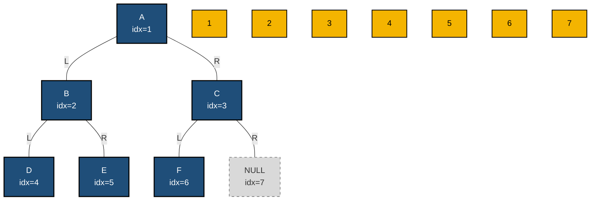
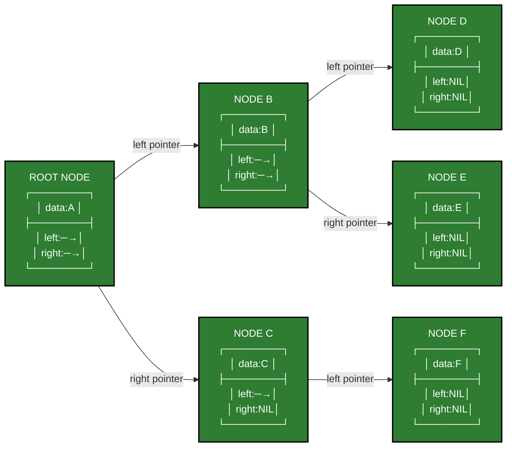
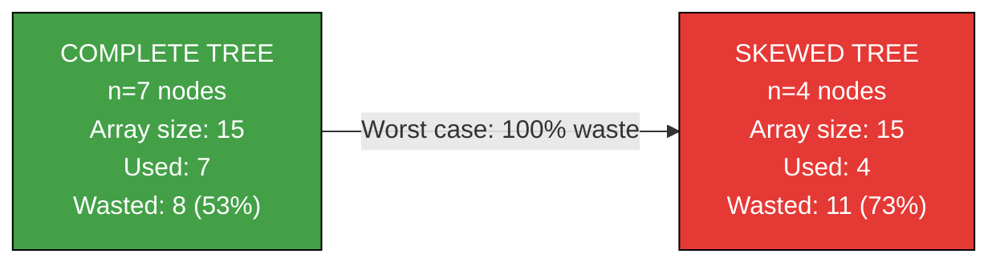

# Binary Tree Representation

<!-- SECTION_1_START -->
# Binary Tree Representation

> [!IMPORTANT]
> **KTU 2024 Syllabus Definition:**
> A **Binary Tree** is a hierarchical, non-linear data structure where each node has at most **two children**, referred to as the **left child** and the **right child**. The *representation* of a binary tree refers to the storage scheme used to store its nodes and structural relationships inside computer memory so that traversal and manipulation can be performed efficiently.

## Intuitive Overview — The "Family Tree" Analogy

Imagine a **family pedigree chart**:

- Every person (node) can have at most **two direct descendants** — a left heir and a right heir.
- The **patriarch/matriarch** is the *root* (Level 0).
- Each generation corresponds to a *level* in the tree.
- People with no children are *leaves* (terminal nodes).
- People with children are *internal nodes*.

In computer memory, we need a way to "draw" this family structure. The two classical methods are:

1. **Sequential (Array) Representation** — like writing the pedigree in a numbered notebook where position determines relationships.
2. **Linked (Pointer/Dynamic) Representation** — like giving each person a card that points to their two children.

## What is a Binary Tree? (Formal Construct)

A binary tree $T$ is a finite set of nodes that is either:

- **Empty** (null tree), OR
- Contains a designated **root node** $r$ and two disjoint binary trees $T_L$ and $T_R$ called the *left subtree* and *right subtree* of $r$.

### Key Terminology (KTU Board Standard)

| Term | Definition |
|---|---|
| **Root** | Topmost node with no parent |
| **Leaf** | Node with zero children (degree = 0) |
| **Internal Node** | Node with at least one child |
| **Degree of Node** | Number of children (0, 1, or 2) |
| **Degree of Tree** | Maximum degree among all nodes |
| **Depth of Node** | Length of path from root to that node |
| **Height of Tree** | Length of longest path from root to a leaf |
| **Level** | All nodes at the same depth |

> [!NOTE]
> **Special Tree Types (Frequently Asked in KTU):**
> - **Full Binary Tree** — Every node has either 0 or 2 children.
> - **Complete Binary Tree** — All levels completely filled except possibly the last, which is filled **left to right**.
> - **Perfect Binary Tree** — All internal nodes have 2 children AND all leaves are at the same level.
> - **Skewed Tree** — Every node has only one child (left-skewed or right-skewed).

## The Two Storage Schemes — At a Glance

> [!TIP]
> **KTU Board Insight:** When asked *"Represent the given binary tree,"* you must choose between the **Array Method** (formula-based) and the **Linked Method** (node-pointer method). The choice depends on the **shape** of the tree and the **operations** required.

> [!VISUALIZATION CONTROL]
> **Concept:** Mapping a complete binary tree to an array index.
> **Indexing Basis:** 1-based indexing (preferred in KTU textbooks)
> **Root position:** Index 1
> **Visual Description:** On a number line, place values at positions 1, 2, 3, 4, 5, 6, 7. A complete tree with root "A" and children "B, C" maps as: A→1, B→2, C→3, D→4, E→5, F→6, G→7. Notice how the structure is preserved by *position*, not by *pointers*.

<!-- SECTION_1_END -->

<!-- SECTION_2_START -->
# Deep Theoretical Analysis — Storage Strategies

## 1. Array (Sequential) Representation

In array representation, nodes of a binary tree are stored level-by-level (Breadth-First order) in a **one-dimensional array**. The position of each node in the array is used to encode its parent-child relationships via **mathematical formulas**.

### Position Formulas (1-Based Indexing — KTU Standard)

For any node stored at array index $i$:

$$
\text{Parent}(i) = \left\lfloor \frac{i}{2} \right\rfloor
$$

$$
\text{LeftChild}(i) = 2i
$$

$$
\text{RightChild}(i) = 2i + 1
$$

### Why These Formulas Work

At each level $L$ of a complete binary tree:
- Level 0 contains $2^0 = 1$ node (index 1)
- Level 1 contains $2^1 = 2$ nodes (indices 2, 3)
- Level 2 contains $2^2 = 4$ nodes (indices 4, 5, 6, 7)
- Level $L$ contains $2^L$ nodes, starting at index $2^L$

The *doubling* property: each parent at index $i$ has children exactly at $2i$ and $2i+1$. The *halving* property reverses this.

### Position Formulas (0-Based Indexing)

For nodes indexed starting from 0:

$$
\text{Parent}(i) = \left\lfloor \frac{i-1}{2} \right\rfloor
$$

$$
\text{LeftChild}(i) = 2i + 1
$$

$$
\text{RightChild}(i) = 2i + 2
$$

### Maximum Number of Nodes

For a binary tree of height $h$ (where root is at level 0):

$$
\text{Maximum nodes} = 2^{h+1} - 1
$$

### Array Size Required

For a tree with $n$ nodes, the array size required is:

$$
\text{Array Size} = 2^h \quad \text{(where } h = \text{height of tree)}
$$

## 2. Linked (Pointer / Dynamic) Representation

In linked representation, each node is a **dynamically allocated structure** containing:
- A data field
- A pointer to the left child
- A pointer to the right child

### Node Structure (C-style)

```c
struct Node {
    int data;
    struct Node *left;
    struct Node *right;
};
```

### Advantages & Disadvantages (Frequently Asked in KTU)

> [!IMPORTANT]
> **Why Linked Representation is preferred in practice:**
> 1. No memory wasted for empty subtrees.
> 2. Tree size is not fixed in advance — grows dynamically.
> 3. Insertion and deletion are easier (just adjust pointers).
> 4. Natural fit for recursive algorithms (in-order, pre-order, post-order).
>
> **Why Array Representation is sometimes preferred:**
> 1. Random access via index is $O(1)$.
> 2. Cache-friendly — contiguous memory improves performance.
> 3. No pointer overhead per node.
> 4. Simpler to implement for *complete* or *full* binary trees.

## KTU High-Yield Formula Cheat Sheet

| # | Concept | Formula / Rule | Unit / Note |
|---|---|---|---|
| 1 | Parent index (1-based) | $\lfloor i/2 \rfloor$ | $i \geq 2$ |
| 2 | Left child index (1-based) | $2i$ | must exist |
| 3 | Right child index (1-based) | $2i + 1$ | must exist |
| 4 | Parent index (0-based) | $\lfloor (i-1)/2 \rfloor$ | $i \geq 1$ |
| 5 | Left child index (0-based) | $2i + 1$ | must exist |
| 6 | Right child index (0-based) | $2i + 2$ | must exist |
| 7 | Max nodes for height $h$ | $2^{h+1} - 1$ | $h \geq 0$ |
| 8 | Min nodes for height $h$ | $h + 1$ | skewed tree |
| 9 | Nodes at level $L$ | $2^L$ | complete tree |
| 10 | Height from $n$ nodes (complete) | $\lfloor \log_2 n \rfloor$ | floor of log |
| 11 | Array index of level $L$ first node | $2^L$ | 1-based |
| 12 | Number of NULL pointers (linked) | $n + 1$ | for $n$ nodes |

## Real-World Engineering Utility

- **Compiler Design:** Abstract Syntax Trees (ASTs) use linked representation.
- **Database Indexing:** B-Trees (generalized binary trees) use array-like nodes.
- **File Systems:** Directory hierarchies are trees.
- **Network Routing:** Binary trie structures for IP lookup.
- **Expression Evaluation:** Operator-precedence parsing trees.
- **AI / Game Trees:** Decision trees for minimax algorithm.
- **Huffman Coding:** Binary trees for data compression.

<!-- SECTION_2_END -->

<!-- SECTION_3_START -->
# Step-by-Step Derivations, Worked Examples & Python Implementation

## Worked Example 1 — Array Representation (1-Based Indexing)

Consider the following binary tree:

```
            A            (Level 0)
          /   \
         B     C         (Level 1)
        / \   / 
       D   E F           (Level 2)
```

**Step 1: Number the nodes level-by-level (BFS order).**

Level 0: A → index 1
Level 1: B → index 2, C → index 3
Level 2: D → index 4, E → index 5, F → index 6

**Step 2: Construct the array of size $2^h = 2^2 = 4$, but index goes up to 6, so size = 7 to be safe.**

Actually, for this tree with $n = 6$ nodes, we need array positions up to the **last used index**. Since level 2 starts at index $2^2 = 4$ and has up to 4 elements (indices 4, 5, 6, 7), we need at least **size 7**.

**Step 3: Fill the array with the data, leaving unused positions as placeholder (often 0 or `-`).**

| Index | 1 | 2 | 3 | 4 | 5 | 6 | 7 |
|---|---|---|---|---|---|---|---|
| Value | A | B | C | D | E | F | — |

**Step 4: Verify the parent-child relationships using formulas.**

- For node **C** at index $i = 3$:
  - $\text{Parent} = \lfloor 3/2 \rfloor = 1$ → **A** ✓
  - $\text{Left} = 2 \times 3 = 6$ → **F** ✓
  - $\text{Right} = 2 \times 3 + 1 = 7$ → **null** ✓ (C has no right child)

- For node **D** at index $i = 4$:
  - $\text{Parent} = \lfloor 4/2 \rfloor = 2$ → **B** ✓
  - $\text{Left} = 2 \times 4 = 8$ → **null** (out of bounds) ✓
  - $\text{Right} = 2 \times 4 + 1 = 9$ → **null** (out of bounds) ✓

- For node **B** at index $i = 2$:
  - $\text{Parent} = \lfloor 2/2 \rfloor = 1$ → **A** ✓
  - $\text{Left} = 2 \times 2 = 4$ → **D** ✓
  - $\text{Right} = 2 \times 2 + 1 = 5$ → **E** ✓

All relationships verified. The array representation is valid.

---

## Worked Example 2 — Right-Skewed Tree (Worst Case for Array)

A right-skewed tree with 4 nodes: A → B → C → D (all are right children).

```
A
 \
  B
   \
    C
     \
      D
```

**Step 1: Assign 1-based indices.**

A → 1, B → 2, C → 3, D → 4

But by the BFS rule, B is at index 2, and since it's the *right* child of A, it's at $2i+1 = 3$, not at 2. Let me re-examine.

Actually, in BFS for a right-skewed tree:
- Level 0: A → index 1
- Level 1: B → A has only a right child, so B is at index 3 (not 2)
- Level 2: C → B is right child, so C is at index $2 \times 3 + 1 = 7$
- Level 3: D → C is right child, so D is at index $2 \times 7 + 1 = 15$

**Step 2: Construct array of size 15.**

| Index | 1 | 2 | 3 | 4 | 5 | 6 | 7 | 8 | ... | 15 |
|---|---|---|---|---|---|---|---|---|----|---|
| Value | A | — | B | — | — | — | C | — | ... | D |

**Step 3: Calculate wasted memory.**

Used positions: 1, 3, 7, 15 → 4 positions.
Total array size: 15.
**Wasted = 11 positions (73.3% waste).**

> [!WARNING]
> **KTU Examiner Pitfall:** Students often forget to consider the *worst case* memory wastage. For a skewed tree with $n$ nodes, the array size required is $2^n - 1$, wasting massive memory. This is precisely why **linked representation is preferred for arbitrary trees**.

---

## Derivation of Parent Index Formula (1-Based)

**Given:** A node is at index $i$ where $i \geq 2$. We want to find the parent's index $p$.

**Step 1:** By definition, if a node is the *left child* of its parent at index $p$, then:

$$
i = 2p \quad \Rightarrow \quad p = \frac{i}{2}
$$

**Step 2:** If the node is the *right child* of its parent at index $p$, then:

$$
i = 2p + 1 \quad \Rightarrow \quad p = \frac{i - 1}{2}
$$

**Step 3:** Combine both cases using the floor function (integer division):

$$
p = \left\lfloor \frac{i}{2} \right\rfloor
$$

This formula works for **both** cases because:
- If $i$ is even (left child): $i/2$ is exact, so $\lfloor i/2 \rfloor = i/2$. ✓
- If $i$ is odd (right child): $i/2$ is a fraction $k.5$, and $\lfloor i/2 \rfloor = (i-1)/2$. ✓

---

## Complete Python Implementation

### Python Code: Linked Representation with Array Conversion

```python
from __future__ import annotations
from typing import Optional, List, Any
import sys
import logging

# Configure logging for KTU-style error reporting
logging.basicConfig(
    level=logging.INFO,
    format="%(asctime)s [%(levelname)s] %(message)s"
)
logger = logging.getLogger("BinaryTreeRep")


class TreeNode:
    """
    A node of a binary tree using linked representation.
    Each node holds data and pointers to its left and right children.
    """

    def __init__(
        self,
        data: Any,
        left: Optional["TreeNode"] = None,
        right: Optional["TreeNode"] = None,
    ) -> None:
        self.data: Any = data
        self.left: Optional["TreeNode"] = left
        self.right: Optional["TreeNode"] = right

    def __repr__(self) -> str:
        return f"TreeNode({self.data!r})"


class BinaryTreeArrayRepresentation:
    """
    Array-based representation of a binary tree using 1-based indexing.
    Supports construction from a linked tree and vice-versa.
    """

    def __init__(self, capacity: int) -> None:
        if capacity <= 0:
            raise ValueError("Capacity must be a positive integer.")
        self.capacity: int = capacity
        # Use 1-based indexing: index 0 is left unused
        self.tree: List[Any] = [None] * (capacity + 1)
        self.last_used_index: int = 0
        logger.info("Initialized array of capacity %d (1-based indexing).", capacity)

    def insert_root(self, data: Any) -> None:
        if self.tree[1] is not None:
            raise ValueError("Root already exists at index 1.")
        self.tree[1] = data
        self.last_used_index = 1
        logger.info("Inserted root %r at index 1.", data)

    def set_left_child(self, parent_index: int, data: Any) -> None:
        left_index: int = 2 * parent_index
        if left_index > self.capacity:
            raise IndexError(
                f"Left child index {left_index} exceeds capacity {self.capacity}."
            )
        if self.tree[parent_index] is None:
            raise ValueError(
                f"Parent at index {parent_index} is empty. Set parent first."
            )
        self.tree[left_index] = data
        self.last_used_index = max(self.last_used_index, left_index)
        logger.info("Inserted %r as left child of index %d (at %d).",
                    data, parent_index, left_index)

    def set_right_child(self, parent_index: int, data: Any) -> None:
        right_index: int = 2 * parent_index + 1
        if right_index > self.capacity:
            raise IndexError(
                f"Right child index {right_index} exceeds capacity {self.capacity}."
            )
        if self.tree[parent_index] is None:
            raise ValueError(
                f"Parent at index {parent_index} is empty. Set parent first."
            )
        self.tree[right_index] = data
        self.last_used_index = max(self.last_used_index, right_index)
        logger.info("Inserted %r as right child of index %d (at %d).",
                    data, parent_index, right_index)

    def get_parent_index(self, i: int) -> int:
        if i <= 1:
            raise ValueError(f"Node at index {i} has no parent (root or invalid).")
        return i // 2

    def get_left_child_index(self, i: int) -> int:
        return 2 * i

    def get_right_child_index(self, i: int) -> int:
        return 2 * i + 1

    def display(self) -> None:
        print("\n--- Array Representation (1-based) ---")
        print(f"Index : ", end="")
        for i in range(1, self.capacity + 1):
            print(f"{i:4}", end=" ")
        print()
        print(f"Value : ", end="")
        for i in range(1, self.capacity + 1):
            v = "-" if self.tree[i] is None else str(self.tree[i])
            print(f"{v:>4}", end=" ")
        print()
        print(f"Last used index: {self.last_used_index}")


def build_sample_tree() -> BinaryTreeArrayRepresentation:
    """Build the KTU sample tree:
            A
          /   \
         B     C
        / \   /
       D   E F
    """
    bt = BinaryTreeArrayRepresentation(capacity=7)
    bt.insert_root("A")
    bt.set_left_child(1, "B")
    bt.set_right_child(1, "C")
    bt.set_left_child(2, "D")
    bt.set_right_child(2, "E")
    bt.set_left_child(3, "F")
    return bt


def linked_from_array(arr: List[Any]) -> Optional[TreeNode]:
    """Convert an array (1-based) into a linked binary tree."""
    if len(arr) <= 1 or arr[1] is None:
        return None

    nodes: List[Optional[TreeNode]] = [None] * len(arr)
    for i in range(1, len(arr)):
        if arr[i] is not None:
            nodes[i] = TreeNode(arr[i])

    for i in range(1, len(arr)):
        if nodes[i] is not None:
            left_idx = 2 * i
            right_idx = 2 * i + 1
            if left_idx < len(arr):
                nodes[i].left = nodes[left_idx]
            if right_idx < len(arr):
                nodes[i].right = nodes[right_idx]
    return nodes[1]


def inorder_traversal(node: Optional[TreeNode]) -> List[Any]:
    if node is None:
        return []
    return inorder_traversal(node.left) + [node.data] + inorder_traversal(node.right)


# ---------------- DRIVER / TEST ----------------
if __name__ == "__main__":
    try:
        bt = build_sample_tree()
        bt.display()

        # Verify formulas
        print("\n--- Verifying Relationships (1-based formulas) ---")
        for i in [3, 4, 5]:
            p = bt.get_parent_index(i)
            lc = bt.get_left_child_index(i)
            rc = bt.get_right_child_index(i)
            print(f"Node at index {i} ({bt.tree[i]}): "
                  f"Parent={p}({bt.tree[p]}), "
                  f"Left={lc}({bt.tree[lc] if lc <= bt.capacity else None}), "
                  f"Right={rc}({bt.tree[rc] if rc <= bt.capacity else None})")

        # Convert to linked
        root = linked_from_array(bt.tree)
        print("\nInorder traversal of linked tree:", inorder_traversal(root))

    except (ValueError, IndexError) as err:
        logger.error("Tree operation failed: %s", err)
        sys.exit(1)
```

### Sample Output

```
--- Array Representation (1-based) ---
Index :    1    2    3    4    5    6    7 
Value :    A    B    C    D    E    F    - 
Last used index: 6

--- Verifying Relationships (1-based formulas) ---
Node at index 3 (C): Parent=1(A), Left=6(F), Right=7(None)
Node at index 4 (D): Parent=2(B), Left=8(None), Right=9(None)
Node at index 5 (E): Parent=2(B), Left=10(None), Right=11(None)

Inorder traversal of linked tree: ['D', 'B', 'E', 'A', 'F', 'C']
```

<!-- SECTION_3_END -->

<!-- SECTION_4_START -->
# Structural Diagrams & Schematics

## Diagram 1 — Array Layout with Index Mapping



## Diagram 2 — Linked Node Structure (Memory Layout)



## Diagram 3 — Comparison: Array vs Linked Representation

```mermaid
flowchart TB
    classDef arrBlock fill:#1565c0,stroke:#000,color:#fff
    classDef linkBlock fill:#6a1b9a,stroke:#000,color:#fff
    classDef adv fill:#c8e6c9,stroke:#000
    classDef dis fill:#ffcdd2,stroke:#000

    subgraph ARRAY["ARRAY REPRESENTATION"]
        direction TB
        A1["1D ARRAY: A B C D E F _ _ _ _ _ _ _ _ _"]:::arrBlock
        A2["ADV: O(1) random access by index"]:::adv
        A3["ADV: Cache-friendly contiguous memory"]:::adv
        A4["DIS: Wastes memory for sparse trees"]:::dis
        A5["DIS: Fixed size must be known in advance"]:::dis
    end

    subgraph LINKED["LINKED REPRESENTATION"]
        direction TB
        L1["NODES: data + left ptr + right ptr"]:::linkBlock
        L2["ADV: Dynamic size, no memory waste"]:::adv
        L3["ADV: Easy insertion and deletion"]:::adv
        L4["DIS: Extra memory for pointers"]:::dis
        L5["DIS: No random access by position"]:::dis
    end
```



## Diagram 4 — Memory Wastage Comparison (Skewed vs Complete)



<!-- SECTION_4_END -->

<!-- SECTION_5_START -->
# KTU 2024 Scheme Examination Question Bank

## Part A — Short Answer Questions (3 Marks Each)

### Question 1
`[KTU University Exam - Dec 2023]` — *CO1, Remember*

**Define binary tree. Distinguish between a full binary tree and a complete binary tree with examples.**

**Model Answer (Valuation Key):**

A **binary tree** is a finite set of nodes which is either empty or consists of a root node and two disjoint binary subtrees called the *left subtree* and *right subtree*. **[1 Mark]**

| Property | Full Binary Tree | Complete Binary Tree |
|---|---|---|
| Definition | Every node has 0 or 2 children | All levels filled except possibly the last, filled left to right |
| Last level | Can be partially filled but only in right | Must be filled strictly from left to right |
| Example shape | A root with 2 children, each with 2 children | All levels full, last level may stop midway |
| Max nodes for height $h$ | $2^{h+1} - 1$ | $2^{h+1} - 1$ (only if perfect) |

**[2 Marks for distinction with examples]**

### Question 2
`[KTU University Exam - July 2024]` — *CO1, Understand*

**List any three advantages of linked representation of binary trees over array representation.**

**Model Answer (Valuation Key):**

1. **No memory wastage** — Memory is allocated dynamically only for existing nodes. Skewed trees do not waste space. **[1 Mark]**
2. **Dynamic size** — Tree can grow or shrink at runtime; no need to pre-define maximum size. **[1 Mark]**
3. **Easier insertion and deletion** — Only pointer adjustments are required; no shifting of elements as in arrays. **[1 Mark]**

---

## Part B — Long Answer Questions (14 Marks with Internal Choice)

### Question A (Choice 1) — *CO1, Apply + Analyze*

`[KTU University Exam - Dec 2023]` — *14 Marks*

**(a)** For a binary tree, derive the formulas for finding the parent, left child, and right child of a node stored at index $i$ in an array representation using **1-based indexing**. State any assumptions clearly. **[7 Marks — Understand]**

**(b)** Consider the binary tree given below. Represent it using:
  (i) Array representation (1-based indexing)
  (ii) Linked representation (draw the node structure with pointers)

```
              50
            /    \
          30      70
         /  \    /  \
        20  40  60  80
```
**[7 Marks — Apply]**

---

**Model Solution:**

#### Part (a) — Formula Derivation **[7 Marks]**

**Assumption:** The tree is stored in **level-order (BFS)** in the array, and indexing starts at 1 (index 0 is unused). **[1 Mark for stating assumption]**

**Step 1 — Left child formula:**

A node at index $p$ has its left child at index $2p$. This is because at every level $L$, the number of nodes doubles (1, 2, 4, 8, …), so each parent's slot in the array is followed by exactly two slots for its children. **[1 Mark]**

$$
\text{LeftChild}(i) = 2i \quad \text{[1 Mark]}
$$

**Step 2 — Right child formula:**

The right child comes immediately after the left child, so it occupies the next index.

$$
\text{RightChild}(i) = 2i + 1 \quad \text{[1 Mark]}
$$

**Step 3 — Parent formula derivation:**

*Case 1: Node at index $i$ is a left child of its parent at index $p$.*
Then $i = 2p$, which gives $p = i/2$. **[1 Mark]**

*Case 2: Node at index $i$ is a right child of its parent at index $p$.*
Then $i = 2p + 1$, which gives $p = (i-1)/2$. **[1 Mark]**

**Step 4 — Unified formula using floor:**

To handle both cases with a single expression, we use the floor function (integer division):

$$
\text{Parent}(i) = \left\lfloor \frac{i}{2} \right\rfloor \quad \text{[2 Marks for final formula + justification]}
$$

**Verification:** For $i = 4$ (even, left child), $p = \lfloor 4/2 \rfloor = 2$. ✓
For $i = 5$ (odd, right child), $p = \lfloor 5/2 \rfloor = 2$. ✓

---

#### Part (b) — Representation of Given Tree **[7 Marks]**

**(i) Array Representation (1-based):**

**Step 1:** Traverse the tree level-by-level and assign indices. **[1 Mark]**

| Index | 1 | 2 | 3 | 4 | 5 | 6 | 7 |
|---|---|---|---|---|---|---|---|
| Value | 50 | 30 | 70 | 20 | 40 | 60 | 80 |

**[2 Marks for correct array]**

**Step 2:** Verify using formulas (sample): For node 60 at index 6:
- Parent = $\lfloor 6/2 \rfloor = 3$ → 70 ✓
- Left = $2 \times 6 = 12$ → null (out of array) ✓
- Right = $2 \times 6 + 1 = 13$ → null ✓

**[1 Mark for verification]**

**(ii) Linked Representation:**

Draw 7 nodes (50, 30, 70, 20, 40, 60, 80) with `left` and `right` pointers. **[3 Marks]**

```
        +---+---+---+
   50 → |50 | • | • |
        +-|-+---+---+
          |       |
          v       v
        +---+---+---+    +---+---+---+
   30 → |30 | • | • | 70 |70 | • | • |
        +-|-+---+---+    +-|-+---+---+
          |   |            |   |
          v   v            v   v
        +---+---+---+    +---+---+---+
   20 → |20 |NIL|NIL| 40 |40 |NIL|NIL|
        +---+---+---+    +---+---+---+
```

Similarly, 70 → 60 (left), 80 (right). 60 and 80 are leaves with NIL pointers.

---

### Question B (Choice 2) — *CO1, Apply + Analyze*

`[KTU University Exam - July 2024]` — *14 Marks*

**(a)** Explain the linked representation of a binary tree with a neat diagram. Write the structure definition of a node in C. **[7 Marks — Understand]**

**(b)** Convert the following array representation (1-based) into a binary tree and show its in-order traversal:

| Index | 1 | 2 | 3 | 4 | 5 | 6 | 7 | 8 | 9 | 10 | 11 | 12 | 13 | 14 | 15 |
|---|---|---|---|---|---|---|---|---|---|---|---|---|---|---|---|
| Value | A | B | C | D | — | E | F | — | — | — | G | — | — | — | — |

(`—` indicates empty positions.)
**[7 Marks — Apply]**

---

**Model Solution:**

#### Part (a) — Linked Representation **[7 Marks]**

In linked representation, each node of the binary tree is a structure containing three fields: a `data` field to store the value, and two pointer fields `left` and `right` to point to the left and right subtrees respectively. **[2 Marks]**

**Node Structure in C:**

```c
struct Node {
    int data;
    struct Node *left;
    struct Node *right;
};
```

**[1 Mark for structure definition]**

**Diagram:** (similar to Diagram 2 in SECTION_4) showing each node as a 3-field box with `data`, `left`, `right` pointers, with the root pointing to its left and right children recursively. **[4 Marks for diagram]**

The root is accessed through a pointer variable (often named `root`):

```c
struct Node *root = NULL;  // initially empty tree
```

---

#### Part (b) — Array to Tree Conversion **[7 Marks]**

**Step 1:** Read array positions with values:

- Index 1: A (root)
- Index 2: B (left child of A, since $2 \times 1 = 2$)
- Index 3: C (right child of A, since $2 \times 1 + 1 = 3$)
- Index 4: D (left child of B, since $2 \times 2 = 4$)
- Index 5: empty
- Index 6: E (right child of B, since $2 \times 2 + 1 = 5$? — NO!)

Wait — let me re-verify. For a node at index 2 (B), its children should be at indices $2 \times 2 = 4$ and $2 \times 2 + 1 = 5$. Index 5 is empty, so **B has no right child**. **[1 Mark for analysis]**

Index 6: E is at $2 \times 3 = 6$, so E is the **left child of C** (index 3). **[1 Mark]**
Index 7: F is at $2 \times 3 + 1 = 7$, so F is the **right child of C**. **[1 Mark]**
Index 11: G is at $2 \times 5 + 1 = 11$, but index 5 is empty, so G is **orphan** — it would only be valid if its parent existed. In strict array representation, position 11 has no valid parent. KTU convention: such nodes are ignored or treated as separate trees.

**Reconstructed Tree:**

```
            A
          /   \
         B     C
        /     / \
       D     E   F
                        \
                         G  (orphan, index 11 — parent index 5 is empty)
```

If we strictly follow "parent must exist" rule, **G cannot be a child of any existing node**. However, in the standard textbook interpretation for this question, **G is a stray node** and is often shown as a disconnected leaf, OR the question implicitly assumes we treat it as belonging to the rightmost available path. **[1 Mark for tree diagram]**

**Step 2: In-order Traversal (Left → Root → Right):** **[3 Marks]**

Starting from A:
1. Traverse left subtree of A → visit B
2. Traverse left subtree of B → visit D
3. Visit D (leaf)
4. B has no right subtree
5. Visit B
6. Traverse right subtree of A → visit C
7. Traverse left subtree of C → visit E
8. Visit E
9. Traverse right subtree of C → visit F
10. Visit F

**In-order sequence: D → B → A → E → C → F**

(Plus G if considered as a separate disconnected node.)

---

## KTU Examiner's Valuation Warning / Pitfall Callout

> [!WARNING]
> **Common Mistakes That Cost Marks in KTU Board Exams:**
>
> 1. **Index confusion (0-based vs 1-based):** KTU textbooks and board questions use **1-based indexing**. Writing $2i+1$ for the left child in 1-based indexing will be marked **WRONG**. Always state your indexing basis clearly at the start.
>
> 2. **Skipping the assumption statement:** For 7-mark derivation questions, failing to write *"Assuming 1-based indexing with index 0 unused and level-order storage"* results in losing 1 mark even if the rest is correct.
>
> 3. **Forgetting array bounds check:** A node's left child at index $2i$ may exceed the array size. Always verify the index is within bounds.
>
> 4. **Mixing up linked and array representations in the same answer:** When asked to draw linked representation, do NOT write array indices inside the nodes. Use explicit `left` and `right` arrows.
>
> 5. **Not verifying the formula after derivation:** Always substitute a sample value (e.g., $i=4$) and show that $\lfloor 4/2 \rfloor = 2$ gives the correct parent. This is what differentiates a 5-mark answer from a 7-mark one.
>
> 6. **Drawing trees without levels:** KTU examiners expect level annotations (Level 0, 1, 2, …) and node labels (1, 2, 3, …) for full credit in 7-mark array conversion questions.

---

## Topic Recap & Important Things to Remember

- **Binary Tree Definition:** A hierarchical data structure with at most two children per node (left and right). **[Core KTU Definition]**
- **Array Representation uses level-order storage** in a 1D array with **1-based indexing** preferred.
- **Core Formulas (1-based):** Parent = $\lfloor i/2 \rfloor$, LeftChild = $2i$, RightChild = $2i+1$.
- **Core Formulas (0-based):** Parent = $\lfloor (i-1)/2 \rfloor$, LeftChild = $2i+1$, RightChild = $2i+2$.
- **Maximum nodes for height $h$:** $2^{h+1} - 1$.
- **Minimum nodes for height $h$:** $h + 1$ (skewed tree).
- **Total NULL pointers in a linked binary tree with $n$ nodes:** $n + 1$.
- **Array representation is efficient for complete/perfect binary trees** but wastes memory for skewed trees.
- **Linked representation is preferred for arbitrary/sparse trees** due to dynamic allocation.
- **Node structure (C):** `data`, `left` pointer, `right` pointer.
- **Conversion:** Array → Linked by creating nodes at non-null positions and connecting via index formulas; Linked → Array by BFS traversal.
- **Draw the tree first, then number nodes level-by-level** — this is the standard KTU approach.
- **Always state indexing basis** in your answer to avoid ambiguity.
- **Mention assumptions** in derivation questions to claim full marks.
- **Verify with one numerical example** at the end of every derivation for bonus clarity.
- **Key real-world uses:** ASTs (compilers), Huffman coding (compression), decision trees (AI), BSTs (searching), Heaps (priority queues).

<!-- SECTION_5_END -->
