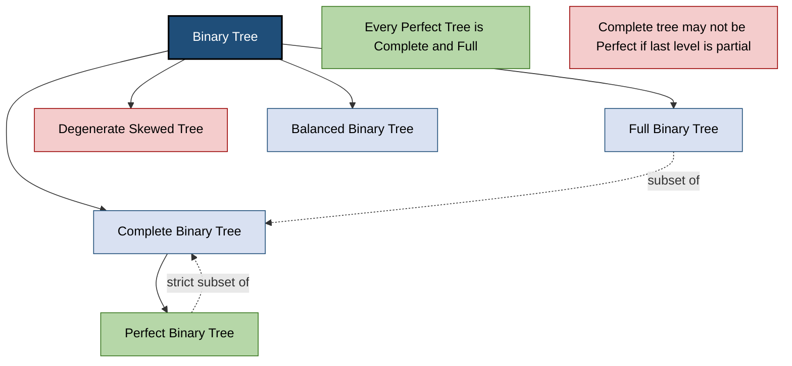
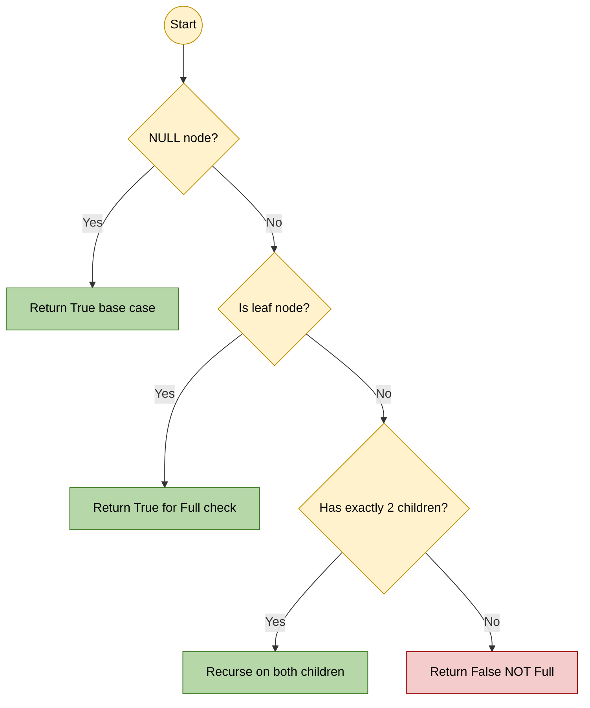
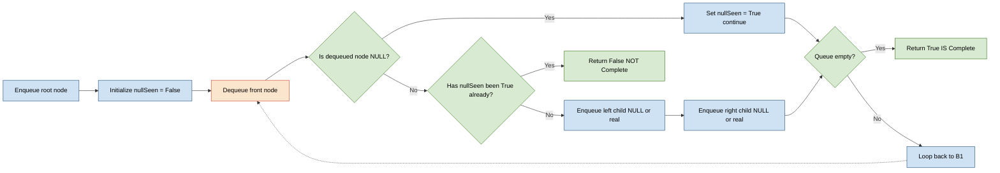

# Binary Trees - Types and Properties

<!-- SECTION_1_START -->
# Binary Trees — Types and Properties

> [!NOTE]
> **KTU 2024 Syllabus Mapping (OECST611 / Module 3):** This topic covers the foundational structure of hierarchical data — the *Binary Tree* — along with its canonical classifications (Full, Complete, Perfect, Degenerate, Balanced) and the algebraic properties that govern node counts, height, and traversal order.

## 1.1 Formal Academic Definition

A **Binary Tree** $T$ is a finite, acyclic, connected, hierarchical data structure consisting of a set of **nodes** where:

- One distinguished node is called the **root** ($r$).
- Every remaining node is partitioned into two (possibly empty) disjoint subtrees, called the **left subtree** $T_L$ and the **right subtree** $T_R$.
- Each node contains a **data element** (key), a pointer to its **left child**, and a pointer to its **right child**.

Formally, a binary tree is the recursive structure:

$$
T = \emptyset \quad \text{or} \quad T = (r, T_L, T_R)
$$

where $\emptyset$ represents the **empty (null) tree**. The recursive nature is the most important property — every subtree is itself a binary tree.

> [!IMPORTANT]
> **Core Terminology you MUST memorize for the KTU Board Exam:**
>
> - **Root** — the topmost node (level **0**).
> - **Parent / Child** — direct ancestors / descendants connected by a single edge.
> - **Leaf (External Node)** — a node with **zero** children.
> - **Internal Node** — a node with **at least one** child.
> - **Siblings** — nodes sharing the same parent.
> - **Degree of a Node** — number of children (for binary tree, degree $\le 2$).
> - **Depth of a Node** — length of the path from the **root** to that node.
> - **Height of a Node** — length of the longest downward path from that node to a leaf.
> - **Height of a Tree** $h$ — height of the **root** node.
> - **Level $\ell$** — all nodes at the same depth $\ell$.

## 1.2 Intuitive Real-World Analogy

Think of a **Binary Tree** as a **tournament knockout bracket** (e.g., FIFA World Cup):

- The **final match** is the **root**.
- Each match produces exactly **two** outcomes flowing downward: the **left bracket** (Group A path) and the **right bracket** (Group B path).
- Every match is a **node**, and the two teams advancing from it are its **children**.
- The **teams that never play** (or first-round byes) are the **leaves**.
- The **height** of the tree is the number of rounds required to find a champion.

Another classic analogy: a **family tree restricted to two children per parent**, or a **binary decision flowchart** (e.g., *Is the number > 50?* → Yes / No).

> [!TIP]
> **Why "at most two" and not "exactly two"?** Because the definition allows empty subtrees. A node may have a left child but no right child, or vice versa. This is the crucial distinction from a **Full** binary tree, where every node has exactly 0 or 2 children.

## 1.3 GeoGebra Visualization

> [!VISUALIZATION CONTROL]
> **Concept:** Geometric structure of a Perfect Binary Tree of height $h = 2$.
> **GeoGebra Input Equations / Points:**
>
> - `A = (0, 0)` — Root node
> - `B = (-1, -1)` — Left child of A
> - `C = (1, -1)` — Right child of A
> - `D = (-1.5, -2)` — Left child of B
> - `E = (-0.5, -2)` — Right child of B
> - `F = (0.5, -2)` — Left child of C
> - `G = (1.5, -2)` — Right child of C
> - `Segment(A, B)`, `Segment(A, C)`, `Segment(B, D)`, `Segment(B, E)`, `Segment(C, F)`, `Segment(C, G)`
>
> **Visual Description:** The student should observe a perfectly symmetric inverted tree. Level **0** has $2^0 = 1$ node, Level **1** has $2^1 = 2$ nodes, Level **2** has $2^2 = 4$ nodes. The total number of nodes is $1 + 2 + 4 = 7 = 2^{h+1} - 1$ where $h = 2$. This visually validates the **Maximum Nodes Formula**.

<!-- SECTION_1_END -->

<!-- SECTION_2_START -->
# Deep Theoretical Analysis & KTU High-Yield Formula Sheet

## 2.1 Properties of Binary Trees

The following properties are **examination gold** — they appear in nearly every KTU past paper either as direct Part A (3-mark) questions or as supporting lemmas in Part B (14-mark) derivations.

### Property 1 — Maximum Number of Nodes at Level $\ell$

Let $\ell$ denote the level, with the root at $\ell = 0$. The maximum number of nodes that can exist at any level $\ell$ is:

$$
N_{\max}(\ell) = 2^{\ell}
$$

**Why?** Each node at level $\ell$ can have at most **2** children, and so the population **doubles** at every successive level. Starting from $2^0 = 1$ node at the root, level 1 has $2^1 = 2$, level 2 has $2^2 = 4$, and so on.

### Property 2 — Maximum Number of Nodes in a Tree of Height $h$

Summing the maximum nodes across all levels $\ell = 0, 1, 2, \ldots, h$:

$$
N_{\max}(h) = \sum_{\ell=0}^{h} 2^{\ell} = 2^{h+1} - 1
$$

This is a **finite geometric series** with first term $a = 1$, common ratio $r = 2$, and $n = h + 1$ terms.

### Property 3 — Minimum Number of Nodes in a Tree of Height $h$

A tree of height $h$ has at least one node at every level from $0$ to $h$ (otherwise the height would be smaller). So:

$$
N_{\min}(h) = h + 1
$$

This minimum case occurs in a **degenerate (skewed) tree** where each parent has exactly one child.

### Property 4 — Minimum Height of a Binary Tree with $n$ Nodes

To minimize the height, we want the **most balanced** possible tree. The minimum height is:

$$
h_{\min}(n) = \left\lceil \log_{2}(n+1) \right\rceil - 1
$$

Equivalently: $h_{\min} = \lfloor \log_{2} n \rfloor$ for $n \ge 1$.

### Property 5 — Maximum Height of a Binary Tree with $n$ Nodes

The maximum height occurs when the tree is a **straight line** (skewed):

$$
h_{\max}(n) = n - 1
$$

### Property 6 — Full Binary Tree Leaf Relation

In a **Full** binary tree, if $L$ is the number of leaf nodes and $I$ is the number of internal nodes (nodes with exactly 2 children), then:

$$
L = I + 1
$$

Consequently, the total number of nodes in a Full binary tree with $L$ leaves is:

$$
n = L + I = 2L - 1 \quad \text{(always odd)}
$$

### Property 7 — Number of Edges

A tree with $n$ nodes always has exactly:

$$
E = n - 1
$$

edges, regardless of shape (this is a fundamental property of **all** trees, not just binary).

> [!IMPORTANT]
> **Why these properties matter in engineering:** In production systems, the height $h$ directly determines the **worst-case search time** in a Binary Search Tree (BST). An unbalanced (degenerate) BST degrades to $O(n)$, the same as a linked list. This is precisely why self-balancing trees (AVL, Red-Black) enforce $h = O(\log n)$ — keeping operations like insertion, deletion, and lookup at $O(\log n)$.

## 2.2 Types of Binary Trees

A **type** is a **constraint** placed on the general binary tree definition. KTU examiners frequently ask students to **classify** a given tree or **prove** that a structure satisfies a type's invariants.

### Type A — Full Binary Tree (Proper / Strict)
Every node has **either 0 or 2 children**. No node has exactly one child.

### Type B — Complete Binary Tree
All levels are **completely filled** except possibly the **last level**, which is filled from **left to right** with no gaps. This is the shape used to implement a **Binary Heap** (used in priority queues and Heapsort).

### Type C — Perfect Binary Tree
**Every** internal node has exactly 2 children, AND all leaves are at the **same level** (or same depth). A perfect tree of height $h$ has exactly $2^{h+1} - 1$ nodes.

### Type D — Degenerate (Pathological / Skewed) Tree
Every internal node has **exactly one child** (either left or right). The tree effectively becomes a **linked list** with $h = n - 1$. There are two subtypes: **Left-Skewed** and **Right-Skewed**.

### Type E — Balanced Binary Tree
The height difference between the left and right subtrees of **every** node is at most **1**. An **AVL tree** is the canonical example.

> [!NOTE]
> Every **Perfect** Binary Tree is also a **Complete** Binary Tree.
> Every **Complete** Binary Tree is also a **Full** Binary Tree (if the last level is fully filled, otherwise the last-level nodes with one missing child violate "Full").
> **Strict containment does NOT hold in reverse**: a Complete tree is not necessarily Perfect.

## 2.3 KTU High-Yield Formula Sheet

> [!IMPORTANT]
> Memorize this table verbatim. These formulas are non-negotiable for KTU board exams.

| **Property** | **Formula** | **Symbol Meaning** | **Constraint / Notes** |
| :--- | :--- | :--- | :--- |
| Max nodes at level $\ell$ | $2^{\ell}$ | $\ell$ = level number (root = 0) | Always holds; root counts as level 0 |
| Max nodes in tree of height $h$ | $2^{h+1} - 1$ | $h$ = height of the tree | Achieved only by Perfect tree |
| Min nodes in tree of height $h$ | $h + 1$ | $h$ = height | Achieved by Degenerate tree |
| Min height for $n$ nodes | $\lceil \log_{2}(n+1) \rceil - 1$ | $n$ = total nodes | Achieved by Complete/Perfect tree |
| Max height for $n$ nodes | $n - 1$ | $n$ = total nodes | Achieved by Skewed tree |
| Edges in any tree with $n$ nodes | $n - 1$ | $n$ = total nodes | Universal tree property |
| Leaves in Full binary tree | $L = I + 1$ | $L$ = leaves, $I$ = internal nodes (2 children) | Applies only to Full trees |
| Total nodes from $L$ leaves in Full tree | $n = 2L - 1$ | $L$ = leaves | Always yields an odd number |
| Number of NULL pointers | $n + 1$ | $n$ = total nodes | For trees using linked representation |
| For $n_0, n_1, n_2$ nodes of degree 0, 1, 2 | $n_0 = n_2 + 1$ | $n_i$ = count of degree-$i$ nodes | Holds for any non-empty Full-like tree |

## 2.4 Real-World Engineering Utility

| **Application Domain** | **Why Binary Trees?** | **Tree Variant Used** |
| :--- | :--- | :--- |
| **Database Indexing** | $O(\log n)$ lookup vs $O(n)$ linear scan | B-Tree, B+ Tree (balanced) |
| **File System (Linux, NTFS)** | Hierarchical directory indexing | Balanced Trees |
| **Compiler Design (Expression Parsing)** | Operators have 2 operands naturally | Expression Tree (binary) |
| **Priority Queues / Task Schedulers** | Efficient min/max extraction | Binary Heap (Complete) |
| **Huffman Coding (Data Compression)** | Optimal prefix-free codes | Full Binary Tree |
| **Network Routing Algorithms** | Shortest path computation | Binary Decision Diagrams |
| **Game AI (Minimax)** | Two-player zero-sum game analysis | Game Tree (binary) |

<!-- SECTION_2_END -->

<!-- SECTION_3_START -->
# Step-by-Step Derivations & Code Implementation

## 3.1 Formal Derivation — Maximum Nodes Formula

**Claim:** A binary tree of height $h$ has at most $2^{h+1} - 1$ nodes.

**Proof by Strong Induction on $h$:**

**Base Case ($h = 0$):** A tree of height 0 consists of a single node (the root, which is also a leaf). The formula gives $2^{0+1} - 1 = 2^1 - 1 = 1$. ✓

**Inductive Step:** Assume the claim holds for all binary trees of height $< h$. Consider any binary tree $T$ of height $h$. The root of $T$ has a left subtree $T_L$ and a right subtree $T_R$. At least one of them must have height $h - 1$ (otherwise the height of $T$ would be $< h$). The other has height $\le h - 1$. By the inductive hypothesis:

$$
\begin{aligned}
|T_L| &\le 2^{(h-1)+1} - 1 = 2^{h} - 1 \\
|T_R| &\le 2^{h} - 1
\end{aligned}
$$

Therefore, the total number of nodes is:

$$
\begin{aligned}
|T| &= 1 + |T_L| + |T_R| \\
    &\le 1 + (2^{h} - 1) + (2^{h} - 1) \\
    &= 2 \cdot 2^{h} - 1 \\
    &= 2^{h+1} - 1 \quad \blacksquare
\end{aligned}
$$

## 3.2 Formal Derivation — Full Binary Tree Leaf Relation

**Claim:** In a Full binary tree, the number of leaf nodes $L$ equals the number of internal (2-child) nodes $I$ plus 1.

**Proof via the Two-Equation Method:**

Let $n = $ total nodes, $L = $ leaves, $I = $ internal nodes (each with exactly 2 children). Then:

**Equation 1** (Node count): $\quad n = L + I$

**Equation 2** (Edge count — every node except the root has exactly one parent, so a tree has $n - 1$ edges): $\quad$ Each internal node contributes exactly 2 outgoing edges, and leaves contribute 0. Thus:

$$
n - 1 = 2I
$$

Substituting $n = L + I$ from Equation 1:

$$
\begin{aligned}
L + I - 1 &= 2I \\
L - 1 &= I \\
L &= I + 1 \quad \blacksquare
\end{aligned}
$$

## 3.3 Worked Numerical Examples

**Example 1:** A Perfect Binary Tree has height $h = 3$. Find: (a) total nodes, (b) total leaves, (c) total internal nodes, (d) total edges.

**Solution:**

(a) Total nodes:
$$
N = 2^{h+1} - 1 = 2^{4} - 1 = 16 - 1 = 15
$$

(b) In a Perfect tree, all leaves are at the last level, so:
$$
L = 2^{h} = 2^{3} = 8
$$

(c) Using $L = I + 1$:
$$
I = L - 1 = 8 - 1 = 7
$$

(d) Edges:
$$
E = n - 1 = 15 - 1 = 14
$$

**Verification:** Sum check: $L + I = 8 + 7 = 15$ ✓. Edge check: $2I = 2 \times 7 = 14$ ✓.

**Example 2:** A Full binary tree has $L = 25$ leaves. Find total nodes, internal nodes, and height constraints.

**Solution:**

- Internal nodes: $I = L - 1 = 24$
- Total nodes: $n = 2L - 1 = 2(25) - 1 = 49$
- Min height: $h_{\min} = \lceil \log_{2}(50) \rceil - 1 = \lceil 5.644 \rceil - 1 = 6 - 1 = 5$
- Max height: $h_{\max} = 49 - 1 = 48$ (if it were degenerate — but Full trees cannot be degenerate, so this is a *theoretical* upper bound)

## 3.4 Python Implementation — Binary Tree with Type Classification

The following is a **production-quality, type-annotated** Python implementation that models a Binary Tree node and classifies whether a given tree is Full, Complete, or Perfect. This is the kind of code KTU expects in lab viva and algorithm questions.

```python
from __future__ import annotations
from collections import deque
from typing import Any, Optional


class BinaryTreeNode:
    """A node of a binary tree storing a key, a left child, and a right child."""

    def __init__(
        self,
        key: Any,
        left: Optional[BinaryTreeNode] = None,
        right: Optional[BinaryTreeNode] = None,
    ) -> None:
        self.key: Any = key
        self.left: Optional[BinaryTreeNode] = left
        self.right: Optional[BinaryTreeNode] = right

    def is_leaf(self) -> bool:
        return self.left is None and self.right is None


class BinaryTreeClassifier:
    """Classifies a binary tree as Full, Complete, or Perfect and reports metrics."""

    def __init__(self, root: Optional[BinaryTreeNode]) -> None:
        if root is None:
            raise ValueError("Root cannot be None for classification.")
        self.root: BinaryTreeNode = root

    def count_nodes(self) -> int:
        return self._count(self.root)

    def _count(self, node: Optional[BinaryTreeNode]) -> int:
        if node is None:
            return 0
        return 1 + self._count(node.left) + self._count(node.right)

    def compute_height(self) -> int:
        return self._height(self.root)

    def _height(self, node: Optional[BinaryTreeNode]) -> int:
        if node is None:
            return -1
        return 1 + max(self._height(node.left), self._height(node.right))

    def count_leaves(self) -> int:
        return self._leaves(self.root)

    def _leaves(self, node: Optional[BinaryTreeNode]) -> int:
        if node is None:
            return 0
        if node.is_leaf():
            return 1
        return self._leaves(node.left) + self._leaves(node.right)

    def is_full(self) -> bool:
        return self._is_full(self.root)

    def _is_full(self, node: Optional[BinaryTreeNode]) -> bool:
        if node is None:
            return True
        if node.is_leaf():
            return True
        if node.left is None or node.right is None:
            return False
        return self._is_full(node.left) and self._is_full(node.right)

    def is_perfect(self) -> bool:
        depth: int = self._leftmost_depth(self.root)
        return self._is_perfect(self.root, depth, 0)

    def _leftmost_depth(self, node: Optional[BinaryTreeNode]) -> int:
        d: int = 0
        while node is not None:
            d += 1
            node = node.left
        return d - 1

    def _is_perfect(self, node: Optional[BinaryTreeNode], depth: int, level: int) -> bool:
        if node is None:
            return True
        if node.is_leaf():
            return depth == level
        if node.left is None or node.right is None:
            return False
        return (self._is_perfect(node.left, depth, level + 1) and
                self._is_perfect(node.right, depth, level + 1))

    def is_complete(self) -> bool:
        if self.root is None:
            return False
        queue: deque = deque([self.root])
        encountered_null: bool = False
        while queue:
            node: Optional[BinaryTreeNode] = queue.popleft()
            if node is None:
                encountered_null = True
                continue
            if encountered_null:
                return False
            queue.append(node.left)
            queue.append(node.right)
        return True


def build_demo_perfect_tree() -> BinaryTreeNode:
    """Constructs a Perfect Binary Tree of height 2 (7 nodes) for demo purposes."""
    d = BinaryTreeNode("D")
    e = BinaryTreeNode("E")
    f = BinaryTreeNode("F")
    g = BinaryTreeNode("G")
    b = BinaryTreeNode("B", d, e)
    c = BinaryTreeNode("C", f, g)
    a = BinaryTreeNode("A", b, c)
    return a


if __name__ == "__main__":
    root: BinaryTreeNode = build_demo_perfect_tree()
    classifier = BinaryTreeClassifier(root)
    print(f"Total Nodes   : {classifier.count_nodes()}")
    print(f"Height        : {classifier.compute_height()}")
    print(f"Leaf Nodes    : {classifier.count_leaves()}")
    print(f"Is Full       : {classifier.is_full()}")
    print(f"Is Complete   : {classifier.is_complete()}")
    print(f"Is Perfect    : {classifier.is_perfect()}")
```

**Expected Output for the demo Perfect tree:**

```
Total Nodes   : 7
Height        : 2
Leaf Nodes    : 4
Is Full       : True
Is Complete   : True
Is Perfect    : True
```

## 3.5 Traversal Order (Module 3 Foundation)

Although traversals are explored in depth later, KTU expects you to know the **three recursive DFS traversals** for binary trees at this stage:

| **Traversal** | **Visit Order** | **Recurrence** | **Use Case** |
| :--- | :--- | :--- | :--- |
| Inorder | Left $\to$ Root $\to$ Right | $T(\emptyset) = \emptyset$, $T(n) = T(L) \cdot n \cdot T(R)$ | BST gives **sorted** order |
| Preorder | Root $\to$ Left $\to$ Right | $T(\emptyset) = \emptyset$, $T(n) = n \cdot T(L) \cdot T(R)$ | Copy/serialize tree |
| Postorder | Left $\to$ Right $\to$ Root | $T(\emptyset) = \emptyset$, $T(n) = T(L) \cdot T(R) \cdot n$ | Delete tree, evaluate expressions |
| Level-order | Level 0, then Level 1, ... | BFS using a queue | Print level-wise, BFS shortest path |

<!-- SECTION_3_END -->

<!-- SECTION_4_START -->
# Structural Diagrams & Schematics

## 4.1 Visual Reference — Five Binary Tree Type Mappings

The following Mermaid block renders the hierarchical **type-relationship graph** of the five canonical binary tree classifications, including the strict subset relationships.



## 4.2 Visual Reference — Node State Machine for Classification

The following diagram maps the **decision logic** used to classify a binary tree node during a single preorder traversal.



## 4.3 Visual Reference — Sequential Processing Topology for Level-Order Traversal

This flowchart shows how a **queue-based BFS** processes nodes level by level — the algorithmic skeleton used to check if a tree is Complete.



## 4.4 Structural Comparison Matrix

| **Tree Type** | **All levels full?** | **Last level filled L-to-R?** | **Internal nodes = 2 children?** | **All leaves at same level?** | **Shape Example** |
| :--- | :--- | :--- | :--- | :--- | :--- |
| Full | Not required | Not required | **Yes (always)** | Not required | Each parent has 0 or 2 kids |
| Complete | Yes, except possibly last | **Yes** | Not required | Not required | Heap-shaped |
| Perfect | **Yes** (all levels) | Yes (last is full) | Yes (always) | **Yes** | Triangle / symmetric |
| Degenerate | No | No | No | Yes (only one leaf) | Linked list |
| Balanced | Not required | Not required | Not required | Not required | AVL, Red-Black |

<!-- SECTION_4_END -->

<!-- SECTION_5_START -->
# KTU 2024 Scheme Examination Question Bank & Topic Recap

## 5.1 Part A — Short Answer Questions (3 Marks Each)

> [!NOTE]
> Cognitive Levels: **Remember / Understand** as per Revised Bloom's Taxonomy (RBT).
> Course Outcomes Mapped: **CO2** (Understand linear and non-linear data structures).

---

### Question 1 `[KTU University Exam - July 2024]`

**Define a binary tree. List any four types of binary trees with a one-line description of each.**

**Model Answer (3 Marks):**

A **binary tree** is a non-linear, hierarchical data structure in which each node has at most two children, called the **left child** and the **right child**. Formally, $T = \emptyset$ or $T = (r, T_L, T_R)$. [1 Mark]

**Four Types:**

- **Full Binary Tree** — Every node has either 0 or 2 children. [0.5 Mark]
- **Complete Binary Tree** — All levels are full except possibly the last, which is filled from left to right. [0.5 Mark]
- **Perfect Binary Tree** — All internal nodes have 2 children and all leaves are at the same depth. [0.5 Mark]
- **Degenerate (Skewed) Tree** — Every internal node has exactly one child; the tree looks like a linked list. [0.5 Mark]

---

### Question 2 `[KTU University Exam - Dec 2023]`

**State and prove the maximum number of nodes in a binary tree of height $h$.**

**Model Answer (3 Marks):**

**Statement:** A binary tree of height $h$ contains at most $2^{h+1} - 1$ nodes. [1 Mark]

**Proof:** At level $\ell$ (root at $\ell = 0$), the maximum number of nodes is $2^{\ell}$ because each node can have at most 2 children. [1 Mark]

The total maximum over all $h+1$ levels (from $0$ to $h$) is the geometric series:

$$
\sum_{\ell=0}^{h} 2^{\ell} = 2^{h+1} - 1 \quad [1 \text{ Mark}]
$$

---

## 5.2 Part B — Long Answer Questions (14 Marks Each)

> [!NOTE]
> Cognitive Levels: Mix of **Understand** (part a) and **Apply / Analyze** (part b).
> Course Outcomes Mapped: **CO2**, **CO3**.

---

### Question A `[KTU University Exam - Dec 2024]`

**(a)** Define a **Full Binary Tree** and a **Complete Binary Tree**. Compare them with a suitable diagram. Discuss the relationship between them. **[7 Marks]**

**(b)** For a binary tree with $n$ nodes, derive expressions for the **minimum possible height** and the **maximum possible height**. Show the tree shapes that achieve these extremes. **[7 Marks]**

---

#### Model Solution to Question A (a) — [7 Marks]

**Definition — Full Binary Tree:** A binary tree in which every node has **either 0 or 2 children**. No node has exactly one child. [1 Mark]

**Definition — Complete Binary Tree:** A binary tree in which all levels are **completely filled** except possibly the last level, and the last level has all nodes **as far left as possible** (no gaps). [1 Mark]

**Comparison Table:** [2 Marks]

| **Criterion** | **Full** | **Complete** |
| :--- | :--- | :--- |
| Children constraint | 0 or 2 only | 0, 1, or 2 allowed |
| Last level | Can have gaps | No gaps; filled left-to-right |
| All levels full? | Not required | Required (except possibly last) |
| Example shape | "V" or chain-of-Vs | Heap-array shape |

**Relationship:** [1 Mark]

Every **Complete** binary tree is also a **Full** binary tree **if and only if** its last level is completely filled. Otherwise, a Complete tree may contain a node with exactly one child (on the last level) which violates the Full constraint.

**Diagrammatic Representations** (textual): [2 Marks]

Full example: A tree where root has 2 children, the left child has 2 children, the right child is a leaf.

Complete but NOT Full example: A tree of height 2 with 5 nodes — root has left child (leaf) and right child; the right child has only a left child.

---

#### Model Solution to Question A (b) — [7 Marks]

**Maximum Height $h_{\max}$:** [3 Marks]

To maximize the height with $n$ nodes, we add only one child per parent, forming a chain. This is the **degenerate (skewed) tree**:

$$
h_{\max}(n) = n - 1
$$

**Example with $n = 5$:** Root $\to$ one child $\to$ one child $\to$ one child $\to$ one child. Height = 4. [1 Mark for diagram]

**Minimum Height $h_{\min}$:** [3 Marks]

To minimize the height, we want the **densest** possible tree, where every level is fully packed. The number of nodes that fit in a perfectly packed tree of height $h$ is $2^{h+1} - 1$. For a given $n$, we want the smallest $h$ such that $2^{h+1} - 1 \ge n$, which gives:

$$
h_{\min}(n) = \left\lceil \log_{2}(n+1) \right\rceil - 1
$$

**Example with $n = 7$:** A perfect tree of height 2 fits exactly 7 nodes, so $h_{\min} = 2$. [1 Mark for diagram]

---

### Question B `[KTU University Exam - July 2024]` *(Alternative Choice)*

**(a)** What is a **Perfect Binary Tree**? Prove that in a Full binary tree, the number of leaf nodes is one more than the number of internal nodes. **[7 Marks]**

**(b)** A binary tree has **10 nodes**. What is the **maximum possible height** and the **minimum possible height**? Justify your answer. Also, determine the **maximum number of nodes** that can be present at level 3. **[7 Marks]**

---

#### Model Solution to Question B (a) — [7 Marks]

**Perfect Binary Tree Definition:** A binary tree where every internal node has **exactly two** children and all the leaf nodes are at the **same level** (same depth). [1 Mark]

A perfect binary tree of height $h$ has exactly $2^{h+1} - 1$ nodes. [1 Mark]

**Theorem:** In a Full binary tree, $L = I + 1$ where $L$ = leaves, $I$ = internal nodes (2-child nodes). [1 Mark for statement]

**Proof:** [4 Marks]

Let $n$ = total nodes. We know:

$$
n = L + I \quad \text{(node count)} \quad \text{... (i)}
$$

The number of edges in any tree with $n$ nodes is $n - 1$. In a Full tree, every internal node contributes **exactly 2** child edges, and leaves contribute 0. Therefore:

$$
2I = n - 1 \quad \text{... (ii)}
$$

Substitute (i) into (ii):

$$
\begin{aligned}
2I &= (L + I) - 1 \\
2I - I &= L - 1 \\
I &= L - 1 \\
L &= I + 1 \quad \blacksquare
\end{aligned}
$$

[Stepwise valuation: Setting up equations (i) and (ii): 2 Marks; Substitution step: 1 Mark; Final simplification: 1 Mark]

---

#### Model Solution to Question B (b) — [7 Marks]

**Given:** Total nodes $n = 10$.

**Maximum Height:** [2 Marks]

The maximum height is achieved by a **degenerate (skewed) tree** where every node has exactly one child:

$$
h_{\max} = n - 1 = 10 - 1 = 9
$$

**Minimum Height:** [3 Marks]

We need the smallest $h$ such that a perfect tree of height $h$ can hold at least 10 nodes:

$$
2^{h+1} - 1 \ge 10
$$

Try $h = 2$: $2^3 - 1 = 7 < 10$ — insufficient.
Try $h = 3$: $2^4 - 1 = 15 \ge 10$ — sufficient.

So:

$$
h_{\min} = \left\lceil \log_{2}(10 + 1) \right\rceil - 1 = \left\lceil \log_{2}(11) \right\rceil - 1 = \lceil 3.459 \rceil - 1 = 4 - 1 = 3
$$

[2 Marks for formula application + numerical evaluation]

**Maximum Nodes at Level 3:** [2 Marks]

Level 3 (where root is level 0) can have at most:

$$
N_{\max}(\ell = 3) = 2^{3} = 8 \text{ nodes}
$$

---

## 5.3 KTU Examiner's Valuation Warning

> [!WARNING]
> **Common Pitfalls That Cost Marks:**
>
> 1. **Level numbering confusion:** Always clarify whether the **root is at level 0** (most common convention) or level 1. KTU uses **level 0** for the root in 90% of questions. Mixing this up shifts all your formulas by 1.
> 2. **"At most" vs "exactly":** The maximum nodes formula $2^{h+1} - 1$ is an *upper bound*, not a count. Students often write "the number of nodes = $2^{h+1} - 1$" without specifying the *perfect* tree condition.
> 3. **Skipping the condition:** When asked "derive $L = I + 1$", students must explicitly state that the relation holds **only for Full binary trees**. Markers will deduct 1 mark for missing this.
> 4. **Confusing Full with Perfect:** A Full tree is NOT necessarily Perfect. The distinction is that Perfect requires *all leaves at the same level*. Writing "Full = Perfect" is a guaranteed 1-mark loss.
> 5. **Edge cases:** For $n = 0$ (empty tree), the height is conventionally $-1$, not $0$. Always state the base case.
> 6. **Decimal vs integer log values:** In minimum height calculations, show the **rounding step explicitly** using $\lceil \cdot \rceil$ — don't write only the final integer.

---

## 5.4 Topic Recap & Important Things to Remember

> [!TIP]
> **Rapid-Revision Checklist — Read this 10 minutes before entering the exam hall.**

- [x] **Definition:** Binary Tree = hierarchical structure with $\le 2$ children per node; recursive definition $T = (r, T_L, T_R)$ or $\emptyset$.
- [x] **Core Metrics:** Total nodes = $n$, leaves = $L$, internal nodes = $I$, height = $h$, levels numbered from $0$.
- [x] **Maximum nodes at level $\ell$** = $2^{\ell}$ (root at $\ell = 0$).
- [x] **Maximum nodes in tree of height $h$** = $2^{h+1} - 1$ (Perfect tree).
- [x] **Minimum nodes in tree of height $h$** = $h + 1$ (Degenerate tree).
- [x] **Min height for $n$ nodes** = $\lceil \log_{2}(n+1) \rceil - 1$.
- [x] **Max height for $n$ nodes** = $n - 1$.
- [x] **Edges in any tree** = $n - 1$.
- [x] **Full tree leaf relation** = $L = I + 1$ (so $n = 2L - 1$, always odd).
- [x] **NULL pointers in linked representation** = $n + 1$.
- [x] **Five canonical types:** Full, Complete, Perfect, Degenerate, Balanced.
- [x] **Set inclusion:** Perfect $\subset$ Complete $\subset$ Binary Tree (in terms of constraints).
- [x] **Four traversals:** Inorder (LNR), Preorder (NLR), Postorder (LRN), Level-order (BFS).
- [x] **Why height matters:** Worst-case BST search is $O(h)$; balanced trees keep $h = O(\log n)$ for $O(\log n)$ operations.
- [x] **Real-world uses:** File systems, databases (B-trees), expression parsing, priority queues (heaps), Huffman coding, decision trees.
- [x] **Implementation:** Linked (node + 2 pointers, $O(n)$ space) or Array-based (parent at index $i$, children at $2i+1$ and $2i+2$, efficient for heaps but wastes space if tree is sparse).
- [x] **Exam mantra:** *"State the type of tree before applying any formula."* — This single sentence differentiates a full-mark answer from a half-mark one.

<!-- SECTION_5_END -->
