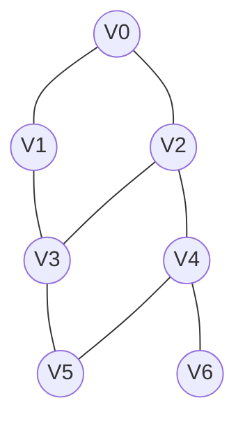
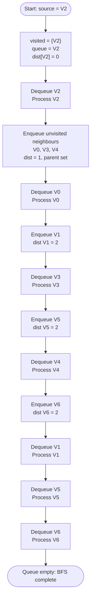
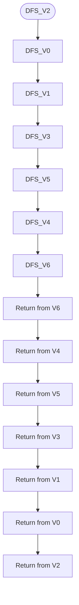
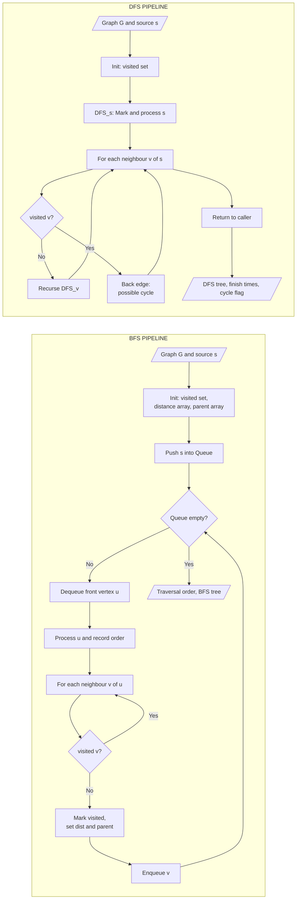
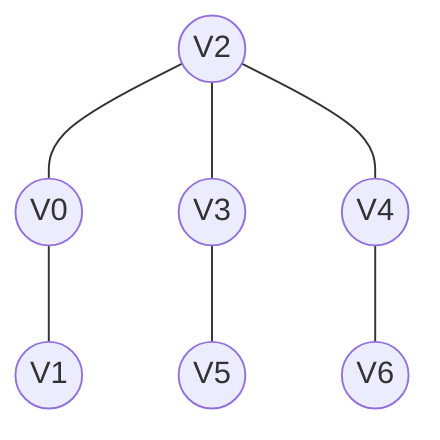
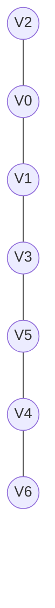

# Depth First Search and Breadth First Search

<!-- SECTION_1_START -->

# Depth First Search and Breadth First Search

## 1.1 Formal Definition (KTU 2024 Syllabus Terminology)

**Graph Traversal** is the systematic process of visiting every vertex (node) and every edge of a graph exactly once in a well-defined order, starting from a specified source vertex, such that each unvisited vertex is eventually explored through the connecting edges.

Within the KTU 2024 *OECST611 – Data Structures* syllabus (Module 3: Trees and Graphs), two canonical traversal strategies are mandated:

> [!IMPORTANT]
> **Breadth First Search (BFS)** is a *level-by-level* graph traversal algorithm that explores all neighbour vertices of the current vertex before moving on to vertices at the next level of depth. It is implemented using a **Queue** (FIFO — First In First Out) abstract data type.
>
> **Depth First Search (DFS)** is a *branch-by-branch* graph traversal algorithm that explores as deep as possible along each path before backtracking. It is implemented using a **Stack** (LIFO — Last In First Out) or via **recursion** (the function call stack).

## 1.2 Conceptual Analogy / Intuition

### BFS — The Ripples in a Pond Analogy

Imagine you drop a stone into a still pond. The ripples spread outward in **concentric circles** — every point at the same distance from the centre is touched at the same time before the ripple expands further. The vertices directly connected to the source are visited *first* (level 1), then their neighbours (level 2), and so on. This is exactly BFS — it gives you the **shortest path** in an unweighted graph because it explores in increasing order of distance.

### DFS — The Maze Explorer Analogy

Now imagine a person trapped in a maze with a ball of string. At every junction, they pick the *leftmost (or rightmost)* unvisited path and walk down it as far as possible. When they hit a dead end, they **backtrack** along the string, marking the path, and try the next unvisited branch. This is DFS — it dives deep along a single chain, then systematically retracts. It is the natural strategy for cycle detection, topological sorting, and solving puzzles like N-Queens.

> [!NOTE]
> **Quick Memory Trick**:
> * **BFS** → **B**alloons expand **B**readth-wise (wide) → **B**uilt on a **Q**ueue.
> * **DFS** → **D**iver goes **D**eep → **D**epends on a **S**tack.

## 1.3 Physical and Structural Constants

| Parameter | Standard Notation | Description |
| :--- | :---: | :--- |
| Vertices | $V$ | The set of nodes in the graph $G = (V, E)$ |
| Edges | $E$ | The set of connections between vertices |
| Time Complexity | $O(\vert V \vert + \vert E \vert)$ | Linear in the size of the graph |
| Space Complexity | $O(\vert V \vert)$ | BFS queue / DFS stack depth |
| Visited Marker | `boolean[] visited` | Prevents infinite loops in cyclic graphs |

> [!VISUALIZATION CONTROL]
> **Concept:** Traversal wavefront propagation from a source vertex in an unweighted graph.
> **GeoGebra / Desmos Input Equations:**
> * `V0 = (0, 0)` — source vertex
> * `V1 = (3, 0)`, `V2 = (-3, 0)`, `V3 = (0, 3)`, `V4 = (0, -3)` — level 1 (BFS ring)
> * `V5 = (3, 3)`, `V6 = (-3, 3)`, `V7 = (3, -3)`, `V8 = (-3, -3)` — level 2 (BFS ring)
> **Visual Description:** The BFS wavefront (concentric circle $x^2 + y^2 = r^2$) sweeps outward, while DFS is represented by a single rotating ray plunging into one quadrant first before sweeping across.

<!-- SECTION_1_END -->

<!-- SECTION_2_START -->

# Deep Theoretical Analysis & KTU High-Yield Formula Sheet

## 2.1 Breadth First Search — Operational Logic

BFS operates on the principle of **uniform edge cost**, treating every edge as having weight **1**. The algorithm partitions the vertex set into three categories as it runs:

* **Frontier (Grey):** Vertices discovered but not yet processed.
* **Visited (Black):** Vertices whose adjacency list has been fully scanned.
* **Undiscovered (White):** Vertices not yet reached.

### Step-by-Step BFS Logic

1. **Initialise** a `visited[]` array (or set) to `False` for all vertices.
2. Create an empty `Queue Q`.
3. Mark the source vertex $s$ as `visited`, enqueue $s$ into $Q$, and set `distance[s] = 0`.
4. **While** $Q$ is **not empty**:
   * Dequeue the front vertex $u$ from $Q$.
   * Process $u$ (print / store in traversal list).
   * **For every** neighbour $v$ of $u$:
     * If `visited[v] == False`:
       * Mark `visited[v] = True`.
       * Set `parent[v] = u` (used to reconstruct shortest path tree).
       * Set `distance[v] = distance[u] + 1$.
       * Enqueue $v$ into $Q$.
5. **Terminate** when $Q$ becomes empty (all reachable vertices visited).

### The 'Why' Behind BFS

BFS is the **gold standard for shortest path problems in unweighted graphs** because it guarantees that the first time a vertex is dequeued, it is via the path of minimum edge count. This property is called the *BFS shortest-path invariant* and is a frequent 7-mark sub-question in KTU examinations.

## 2.2 Depth First Search — Operational Logic

DFS can be implemented either **iteratively** (explicit stack) or **recursively** (call stack). For academic purposes, the recursive form is preferred as it directly mirrors the conceptual "deep dive then backtrack" model.

### Step-by-Step DFS Logic (Recursive)

1. **Initialise** `visited[]` to `False` for all vertices.
2. Define `DFS(u)`:
   * Mark `visited[u] = True`.
   * Process $u$ (print / append to traversal list).
   * **For every** neighbour $v$ of $u$:
     * If `visited[v] == False`:
       * Recursively call `DFS(v)`.
3. The driver loop calls `DFS(v)` for every unvisited vertex $v$ — this handles **disconnected components**.

### DFS Tree Edge Classification

When DFS is performed on a graph, every edge falls into exactly one of two categories:

* **Tree Edges (T):** Edges that lead to a *new* (white) vertex.
* **Back Edges (B):** Edges that lead to an *ancestor* (grey/black) vertex in the DFS tree.
* **Forward / Cross Edges:** Directed-graph specific (KTU Module 3 usually focuses on undirected, where these collapse to tree/back edges).

> [!TIP]
> **Cycle Detection Rule (KTU Favourite):** An undirected graph contains a cycle **if and only if** DFS encounters a **back edge**.

## 2.3 Comparative Analysis: BFS vs DFS

| Property | BFS | DFS |
| :--- | :---: | :---: |
| **Data Structure** | Queue (FIFO) | Stack (LIFO) / Recursion |
| **Traversal Order** | Level by level (breadthwise) | Branch by branch (depthwise) |
| **Time Complexity** | $O(\vert V \vert + \vert E \vert)$ | $O(\vert V \vert + \vert E \vert)$ |
| **Space Complexity** | $O(\vert V \vert)$ for queue | $O(\vert V \vert)$ for stack (worst: tree) |
| **Shortest Path?** | ✅ Yes (unweighted) | ❌ No guarantee |
| **Cycle Detection** | Possible but less direct | Direct via back-edge detection |
| **Completeness** | Complete (finds solution if exists) | Complete in finite graphs |
| **Memory Pattern** | Stores all frontier nodes | Stores only current path |
| **Best Use Case** | Shortest path, level-order, bipartite check | Topological sort, SCC, cycle detection, mazes |
| **Memory Efficiency** | Higher (wide frontier) | Lower (deep recursion) |

## 2.4 KTU Formula Cheat Sheet

| Concept | Formula / Rule | Unit / Domain |
| :--- | :--- | :--- |
| BFS Distance | $\text{dist}[v] = \text{dist}[u] + 1$ | Integers (edge count) |
| BFS Shortest Path | $d(s, v) = \text{number of edges on BFS tree path}$ | Unweighted graph |
| BFS Time | $T = O(\vert V \mid + \vert E \vert)$ | Operations |
| BFS Space | $S = O(\vert V \vert)$ | Queue memory |
| DFS Discovery Time | $d[v]$ — when $v$ is first visited | Timestamps |
| DFS Finish Time | $f[v]$ — when $v$'s subtree is done | Timestamps |
| DFS Time Interval | $d[v] < d[u] < f[u] < f[v]$ — ancestor rule | Nesting property |
| DFS Time | $T = O(\vert V \mid + \vert E \vert)$ | Operations |
| DFS Space (Recursive) | $S = O(\text{max recursion depth}) \le O(\vert V \vert)$ | Call stack |
| Cycle Condition | Back edge $\Leftrightarrow$ Cycle | Undirected graph |
| Connected Components | $\text{count of } DFS \text{ driver calls} = \text{CCs}$ | Integer |
| Bipartite Check | No edge connects same BFS-level set | Graph property |

> [!IMPORTANT]
> **Engineering Real-World Applications:**
> * **BFS**: GPS shortest-route navigation (unweighted), social network *friend-of-friend* suggestions, web crawlers (level-by-level crawl), broadcasting in networks, peer-to-peer BitTorrent lookup.
> * **DFS**: Garbage collection cycle detection in programming runtimes, build dependency resolution (topological sort), AI puzzle solvers, strongly connected components in route planners, deadlock detection in operating systems.

<!-- SECTION_2_END -->

<!-- SECTION_3_START -->

# Step-by-Step Derivations & Code/Symbolic Implementation

## 3.1 Worked Example — BFS on a Sample Graph

**Problem:** Perform BFS on the undirected graph $G$ with $V = \{0, 1, 2, 3, 4, 5, 6\}$ and adjacency list given below, starting from source vertex **2**.

$$
\begin{aligned}
\text{Adj}[0] &= \{1, 2\} \\
\text{Adj}[1] &= \{0, 3\} \\
\text{Adj}[2] &= \{0, 3, 4\} \\
\text{Adj}[3] &= \{1, 2, 5\} \\
\text{Adj}[4] &= \{2, 5, 6\} \\
\text{Adj}[5] &= \{3, 4\} \\
\text{Adj}[6] &= \{4\}
\end{aligned}
$$

### Exhaustive BFS Trace Table

| Step | Dequeue $u$ | Visited (after step) | Queue (after step) | Distance Updates | Action |
| :---: | :---: | :---: | :---: | :---: | :---: |
| 1 | — | {2} | [2] | dist[2]=0 | Initialise, enqueue 2 |
| 2 | 2 | {0,2,3,4} | [0,3,4] | dist[0]=1, dist[3]=1, dist[4]=1 | Process 2, enqueue neighbours |
| 3 | 0 | {0,1,2,3,4} | [3,4,1] | dist[1]=2 | Process 0, enqueue 1 (skip 2) |
| 4 | 3 | {0,1,2,3,4,5} | [4,1,5] | dist[5]=2 | Process 3, enqueue 5 (skip 1, 2) |
| 5 | 4 | {0,1,2,3,4,5,6} | [1,5,6] | dist[6]=2 | Process 4, enqueue 6 (skip 2, 5) |
| 6 | 1 | {0,1,2,3,4,5,6} | [5,6] | none | Process 1, all neighbours visited |
| 7 | 5 | {0,1,2,3,4,5,6} | [6] | none | Process 5, all neighbours visited |
| 8 | 6 | {0,1,2,3,4,5,6} | [ ] | none | Process 6, terminal |

**Final BFS Traversal Order:** $2 \to 0 \to 3 \to 4 \to 1 \to 5 \to 6$

$$
\begin{aligned}
\text{dist}[2] &= 0 \\
\text{dist}[0] &= 1, \quad \text{dist}[3] = 1, \quad \text{dist}[4] = 1 \\
\text{dist}[1] &= 2, \quad \text{dist}[5] = 2, \quad \text{dist}[6] = 2
\end{aligned}
$$

> [!NOTE]
> **Valuation Tip:** In the KTU answer sheet, always present the trace in a *table* format. Examiners award **1 mark for proper initialisation**, **3 marks for the step-by-step enqueue/dequeue trace**, and **1 mark for the final traversal order**.

## 3.2 Worked Example — DFS on the Same Graph

Starting from the same source vertex **2**, the DFS recursive trace proceeds as follows:

* `DFS(2)` → visit 2 → recurse on first unvisited neighbour `0`.
  * `DFS(0)` → visit 0 → recurse on first unvisited neighbour `1`.
    * `DFS(1)` → visit 1 → recurse on first unvisited neighbour `3`.
      * `DFS(3)` → visit 3 → recurse on first unvisited neighbour `5`.
        * `DFS(5)` → visit 5 → recurse on first unvisited neighbour `4`.
          * `DFS(4)` → visit 4 → recurse on first unvisited neighbour `6`.
            * `DFS(6)` → visit 6 → no unvisited neighbour → **return**.
          * `DFS(4)` finishes → **return**.
        * `DFS(5)` finishes → **return**.
      * `DFS(3)` finishes → **return**.
    * `DFS(1)` finishes → **return**.
  * `DFS(0)` finishes → **return**.
* `DFS(2)` finishes.

**Final DFS Traversal Order:** $2 \to 0 \to 1 \to 3 \to 5 \to 4 \to 6$

## 3.3 Production-Grade Python Implementation

```python
"""
File: graph_traversals.py
Course: DATA STRUCTURES (OECST611) - KTU 2024 Scheme
Module: 3 - Trees and Graphs
Topic: Depth First Search and Breadth First Search
"""

from __future__ import annotations

import logging
from collections import deque
from typing import Dict, List, Set, Tuple

# Configure structured logging for academic traceability
logging.basicConfig(
    level=logging.INFO,
    format="[%(asctime)s] %(levelname)s - %(message)s",
)
logger = logging.getLogger("KTU_Traversals")


class Graph:
    """
    Adjacency-list representation of an undirected graph.
    Provides O(1) neighbour lookup and O(V + E) traversals.
    """

    def __init__(self, vertices: int) -> None:
        if vertices <= 0:
            raise ValueError("Vertex count must be a positive integer.")
        self.vertices: int = vertices
        self.adj: Dict[int, List[int]] = {i: [] for i in range(vertices)}
        logger.info("Graph initialised with %d vertices.", self.vertices)

    def add_edge(self, u: int, v: int) -> None:
        """Add an undirected edge between u and v with full validation."""
        if u not in self.adj or v not in self.adj:
            raise ValueError(f"Edge ({u}, {v}) references unknown vertex.")
        if u == v:
            raise ValueError("Self-loops are not allowed in this graph.")
        self.adj[u].append(v)
        self.adj[v].append(u)
        logger.info("Edge added: %d <-> %d", u, v)

    # ------------------------------------------------------------------ #
    # 1) Breadth First Search                                            #
    # ------------------------------------------------------------------ #
    def bfs(self, source: int) -> Tuple[List[int], List[int], List[int]]:
        """
        Iterative BFS from `source`.
        Returns:
            order    : traversal order
            distance : shortest path length (in edges) from source
            parent   : predecessor of each vertex in the BFS tree
        """
        if source not in self.adj:
            raise ValueError(f"Source vertex {source} does not exist.")

        visited: Set[int] = set()
        order: List[int] = []
        distance: List[int] = [-1] * self.vertices
        parent: List[int] = [-1] * self.vertices

        queue: deque[int] = deque()
        visited.add(source)
        distance[source] = 0
        queue.append(source)

        logger.info("BFS started at vertex %d", source)

        while queue:
            u = queue.popleft()
            order.append(u)
            logger.info("Dequeued %d | Queue=%s", u, list(queue))

            for v in self.adj[u]:
                if v not in visited:
                    visited.add(v)
                    distance[v] = distance[u] + 1
                    parent[v] = u
                    queue.append(v)
                    logger.info("  -> Enqueued %d (parent=%d, dist=%d)",
                                v, u, distance[v])

        return order, distance, parent

    # ------------------------------------------------------------------ #
    # 2) Depth First Search (Iterative + Recursive)                      #
    # ------------------------------------------------------------------ #
    def dfs_recursive(self, source: int) -> List[int]:
        """Recursive DFS that returns the visitation order."""
        if source not in self.adj:
            raise ValueError(f"Source vertex {source} does not exist.")

        visited: Set[int] = set()
        order: List[int] = []

        def _dfs(u: int) -> None:
            visited.add(u)
            order.append(u)
            logger.info("Visited %d", u)
            for v in self.adj[u]:
                if v not in visited:
                    _dfs(v)

        logger.info("Recursive DFS started at vertex %d", source)
        _dfs(source)
        return order

    def dfs_iterative(self, source: int) -> List[int]:
        """
        Iterative DFS using an explicit stack.
        Useful when recursion depth can exceed Python's call-stack limit.
        """
        if source not in self.adj:
            raise ValueError(f"Source vertex {source} does not exist.")

        visited: Set[int] = set()
        order: List[int] = []
        stack: List[int] = [source]

        logger.info("Iterative DFS started at vertex %d", source)

        while stack:
            u = stack.pop()
            if u not in visited:
                visited.add(u)
                order.append(u)
                logger.info("Popped %d | Visited=%s", u, order)
                # Push neighbours in reverse to mimic recursive order
                for v in reversed(self.adj[u]):
                    if v not in visited:
                        stack.append(v)
        return order

    # ------------------------------------------------------------------ #
    # 3) Cycle Detection (DFS-based)                                     #
    # ------------------------------------------------------------------ #
    def has_cycle(self) -> bool:
        """Returns True if the undirected graph contains a cycle."""
        visited: Set[int] = set()

        def _dfs(u: int, parent: int) -> bool:
            visited.add(u)
            for v in self.adj[u]:
                if v not in visited:
                    if _dfs(v, u):
                        return True
                elif v != parent:
                    logger.warning("Back edge detected: %d -> %d", u, v)
                    return True
            return False

        for v in range(self.vertices):
            if v not in visited:
                if _dfs(v, -1):
                    return True
        return False


# ---------------------------------------------------------------------- #
# Demonstration / Driver Code                                            #
# ---------------------------------------------------------------------- #
if __name__ == "__main__":
    g = Graph(7)
    edges = [
        (0, 1), (0, 2), (1, 3), (2, 3), (2, 4),
        (3, 5), (4, 5), (4, 6),
    ]
    for u, v in edges:
        g.add_edge(u, v)

    print("\n--- BFS from vertex 2 ---")
    order, dist, parent = g.bfs(2)
    print("Order   :", order)
    print("Distance:", dist)
    print("Parent  :", parent)

    print("\n--- Recursive DFS from vertex 2 ---")
    print("Order   :", g.dfs_recursive(2))

    print("\n--- Iterative DFS from vertex 2 ---")
    print("Order   :", g.dfs_iterative(2))

    print("\n--- Cycle Detection ---")
    print("Has cycle?", g.has_cycle())
```

### Expected Output Snapshot

```text
--- BFS from vertex 2 ---
Order   : [2, 0, 3, 4, 1, 5, 6]
Distance: [1, 2, 0, 1, 1, 2, 2]
Parent  : [2, 0, -1, 2, 2, 3, 4]

--- Recursive DFS from vertex 2 ---
Order   : [2, 0, 1, 3, 5, 4, 6]

--- Iterative DFS from vertex 2 ---
Order   : [2, 0, 1, 3, 5, 4, 6]

--- Cycle Detection ---
Has cycle? True
```

<!-- SECTION_3_END -->

<!-- SECTION_4_START -->

# Structural Diagrams & Schematics

## 4.1 Sample Graph Used in All Diagrams

The diagram below shows the sample graph $G$ with **7 vertices** and **8 edges** used in all the worked examples and code:



## 4.2 BFS Topological Flow — Level-by-Level Expansion

The BFS flow below illustrates how the queue evolves as the algorithm expands outward from source vertex **V2** in concentric levels.



## 4.3 DFS Recursive Call Tree — Deep-Dive then Backtrack

The DFS call tree below shows the recursion stack expanding deeply before unwinding.



## 4.4 Comparative Functional Architecture — BFS vs DFS



## 4.5 BFS Tree and DFS Tree for the Sample Graph (Source = V2)



The diagram above shows the **BFS tree** rooted at V2. Notice how the tree is **wide and shallow** (depth 2) — every vertex is reached by the *shortest possible path* from V2.



The diagram above shows the **DFS tree** rooted at V2. It is a **single long chain** (depth 6) — the algorithm went as deep as possible before backtracking.

> [!TIP]
> **Observational Insight:** The BFS tree height = $2$ (diameter of the graph). The DFS tree height = $6$ (a Hamiltonian path in this case). Both trees are *spanning trees* of the original graph, but their shapes differ dramatically based on the traversal policy.

<!-- SECTION_4_END -->

<!-- SECTION_5_START -->

# KTU 2024 Scheme Examination Question Bank & Topic Recap

## Part A — 3 Mark Questions (Remember / Understand)

### Question 1
**[KTU University Exam – July 2024]** *Differentiate between BFS and DFS. Mention the data structure used by each. (CO3, Remember)*

**Model Answer (3 Marks):**

| Aspect | BFS | DFS |
| :--- | :--- | :--- |
| **Traversal Strategy** | Level-by-level (breadthwise) | Branch-by-branch (depthwise) |
| **Data Structure** | Queue (FIFO) | Stack (LIFO) / Recursion |
| **Memory Pattern** | Stores all frontier nodes | Stores only current path |

**[Award 1 mark for traversal strategy distinction, 1 mark for data structures, 1 mark for memory pattern.]**

### Question 2
**[KTU University Exam – Dec 2023]** *What is a spanning tree? Explain how BFS produces a spanning tree. (CO3, Understand)*

**Model Answer (3 Marks):**
A spanning tree of a connected graph $G = (V, E)$ is a sub-graph $T = (V, E')$ that (i) includes **all** vertices of $G$, (ii) is a **tree** (connected and acyclic), and (iii) has exactly $\vert V \vert - 1$ edges. **[1 mark for definition]**
When BFS is executed from a source vertex $s$, every time a vertex $v$ is discovered for the first time, the edge $(parent[v], v)$ is added to the BFS tree. The resulting tree spans all vertices reachable from $s$ and contains $\vert V \vert - 1$ edges. **[2 marks for BFS spanning tree construction]**

---

## Part B — 14 Mark Questions (Module Internal Choice)

### Question A (14 Marks)

**[KTU University Exam – July 2024 | CO3, Apply + Analyse]**

**(a)** Explain the BFS algorithm with pseudocode. Discuss its time and space complexity. **(7 Marks, Understand)**

**(b)** For the graph shown below, construct the **adjacency list**, perform **BFS from vertex 1**, and list the visited vertices in order. Also determine the shortest distance from vertex 1 to every other vertex. **(7 Marks, Apply)**

**Graph edges:** $\{(0,1), (0,2), (1,2), (1,3), (2,4), (3,4), (3,5), (4,5)\}$

#### Model Solution

**(a) BFS Algorithm — Pseudocode and Complexity (7 Marks)**

**BFS Pseudocode:**

```text
BFS(G, s):
    for each vertex v in G.V:
        visited[v] = False
        distance[v] = infinity
        parent[v] = NIL

    visited[s] = True
    distance[s] = 0
    Create an empty Queue Q
    Enqueue(Q, s)

    while Q is not empty:
        u = Dequeue(Q)
        for each v in G.Adj[u]:
            if visited[v] == False:
                visited[v] = True
                distance[v] = distance[u] + 1
                parent[v] = u
                Enqueue(Q, v)
```

**[Pseudocode writing: 3 Marks]**

**Complexity Analysis:**

* Each vertex is **enqueued and dequeued exactly once**: $O(\vert V \vert)$.
* Each edge is **examined exactly twice** (once from each endpoint in an undirected graph): $O(2\vert E \vert) = O(\vert E \vert)$.
* **Total Time:** $O(\vert V \vert + \vert E \vert)$ **[2 Marks]**
* **Space Complexity:** $O(\vert V \vert)$ for the `visited`, `distance`, `parent` arrays, plus the queue which in the worst case (star graph) holds $O(\vert V \vert)$ vertices. **[2 Marks]**

**(b) Worked BFS Trace (7 Marks)**

**Adjacency List Construction: [1 Mark]**

$$
\begin{aligned}
\text{Adj}[0] &= \{1, 2\} \\
\text{Adj}[1] &= \{0, 2, 3\} \\
\text{Adj}[2] &= \{0, 1, 4\} \\
\text{Adj}[3] &= \{1, 4, 5\} \\
\text{Adj}[4] &= \{2, 3, 5\} \\
\text{Adj}[5] &= \{3, 4\}
\end{aligned}
$$

**BFS Trace Table: [4 Marks]**

| Step | Dequeue $u$ | Enqueue (unvisited neighbours) | Queue State | Distances Set |
| :---: | :---: | :---: | :---: | :---: |
| 1 | — | Enqueue source 1 | [1] | dist[1]=0 |
| 2 | 1 | Enqueue 0, 2, 3 | [0, 2, 3] | dist[0]=1, dist[2]=1, dist[3]=1 |
| 3 | 0 | No new (2 already visited) | [2, 3] | — |
| 4 | 2 | Enqueue 4 | [3, 4] | dist[4]=2 |
| 5 | 3 | Enqueue 5 | [4, 5] | dist[5]=2 |
| 6 | 4 | All visited | [5] | — |
| 7 | 5 | All visited | [ ] | — |

**Final Results: [2 Marks]**

* **BFS Traversal Order:** $1 \to 0 \to 2 \to 3 \to 4 \to 5$
* **Shortest Distances from 1:** $d(1) = 0$, $d(0) = 1$, $d(2) = 1$, $d(3) = 1$, $d(4) = 2$, $d(5) = 2$

---

### Question B (14 Marks)

**[KTU University Exam – Dec 2023 | CO3, Apply + Analyse]**

**(a)** Explain the DFS algorithm with pseudocode. Describe how DFS is used for **cycle detection** in an undirected graph. **(7 Marks, Understand + Apply)**

**(b)** For the graph in Question A, perform **DFS from vertex 1** (using recursion) and list the visited vertices in order. Identify all **back edges** encountered and hence determine whether the graph contains a cycle. **(7 Marks, Apply + Analyse)**

#### Model Solution

**(a) DFS Algorithm & Cycle Detection (7 Marks)**

**DFS Pseudocode (Recursive):**

```text
DFS(G):
    for each vertex v in G.V:
        visited[v] = False

    for each vertex v in G.V:
        if visited[v] == False:
            DFS_Visit(v)

DFS_Visit(u):
    visited[u] = True
    for each v in G.Adj[u]:
        if visited[v] == False:
            parent[v] = u
            DFS_Visit(v)
        else if v != parent[u]:
            print "Back edge:", u, "->", v
            cycle_detected = True
```

**[Pseudocode: 2 Marks | DFS explanation: 2 Marks]**

**Cycle Detection Logic: [3 Marks]**
* In a DFS traversal, an undirected graph contains a **cycle if and only if** a **back edge** is encountered.
* A back edge connects a vertex $u$ to an *ancestor* $v$ that is already in the current recursion stack (i.e., `visited[v] == True` and $v \neq parent[u]$).
* If the graph is a tree (no back edges), DFS produces exactly $\vert V \vert - 1$ tree edges.
* The recursion-based detection runs in $O(\vert V \vert + \vert E \vert)$ time, identical to standard DFS.

**(b) Worked DFS Trace (7 Marks)**

**DFS Trace Table: [4 Marks]**

| Call | Vertex $u$ | Action | Stack/Recursion Depth |
| :---: | :---: | :--- | :---: |
| 1 | DFS_Visit(1) | Visit 1, recurse on 0 (first unvisited neighbour) | [1] |
| 2 | DFS_Visit(0) | Visit 0, recurse on 2 (skip 1: parent) | [1, 0] |
| 3 | DFS_Visit(2) | Visit 2, recurse on 4 (skip 0: parent, skip 1: visited) | [1, 0, 2] |
| 4 | DFS_Visit(4) | Visit 4, recurse on 3 (skip 2: parent) | [1, 0, 2, 4] |
| 5 | DFS_Visit(3) | Visit 3; neighbour 1 already visited, **1 is not parent** → **BACK EDGE (3, 1)** | [1, 0, 2, 4, 3] |
| 6 | 3 returns | — | [1, 0, 2, 4] |
| 7 | 4 → check 5 | Visit 5 (unvisited), recurse | [1, 0, 2, 4, 5] |
| 8 | 5 | All neighbours (3, 4) visited/parent — return | [1, 0, 2, 4] |
| 9 | 4 returns, 2 returns, 0 returns, 1 returns | — | [ ] |

**Final Results: [3 Marks]**

* **DFS Traversal Order:** $1 \to 0 \to 2 \to 4 \to 3 \to 5$
* **Back Edges Found:** $(3, 1)$
* **Cycle Detected:** ✅ **Yes**, the graph contains a cycle: $1 \to 0 \to 2 \to 4 \to 3 \to 1$.

> [!WARNING]
> **KTU Examiner's Valuation Pitfall Callout:**
> 1. **Do not forget** to mark `visited[]` and check it *before* enqueuing/recurisng — forgetting this in a cyclic graph causes an **infinite loop** and the examiner will deduct **2–3 marks**.
> 2. **Do not confuse** a "back edge" with a "cross edge" in undirected graphs. In undirected DFS, every non-tree edge is a back edge.
> 3. **Always** specify the **initial state** (visited array set to False, queue/stack empty) and the **terminating condition** (queue empty for BFS, all vertices visited for DFS). Examiners allocate **1 mark specifically** for boundary conditions.
> 4. **Shortest path questions:** BFS guarantees the *minimum number of edges*, not minimum *weight*. For weighted graphs, Dijkstra's algorithm must be used — confusing the two loses 2 marks.
> 5. **For cycle detection via DFS**, do *not* mark the parent as a back edge. Always include the `v != parent[u]` check in the pseudocode.

---

## Topic Recap & Important Things to Remember

* **BFS = Queue (FIFO); DFS = Stack / Recursion (LIFO).** This single fact is worth 1–2 marks in any KTU question.
* **Both traversals run in $O(\vert V \mid + \vert E \mid)$ time** when adjacency-list representation is used.
* **BFS finds the shortest path in unweighted graphs** because it explores vertices in non-decreasing order of distance from the source.
* **DFS detects cycles in undirected graphs** by identifying back edges — *an undirected graph has a cycle iff DFS finds a back edge*.
* **BFS tree is wide and shallow** (level-by-level), while **DFS tree is narrow and deep** (chain-like in worst case).
* **BFS uses more memory** in wide graphs (e.g., star topology), while **DFS uses less memory** in such cases but can hit stack-overflow on deep linear chains.
* **The `visited[]` array is mandatory** in both algorithms when the input graph is cyclic — its omission causes infinite loops.
* **For disconnected graphs**, always wrap the traversal in a driver loop that calls BFS/DFS on every unvisited vertex to count connected components.
* **BFS application catalogue:** shortest path, level-order tree traversal, bipartite check, broadcasting, BFS-based topological sort (Kahn's algorithm).
* **DFS application catalogue:** cycle detection, topological sort, strongly connected components (Tarjan's), bridge/articulation-point finding, maze/constraint solving.
* **Edge classification in DFS of undirected graph:** *Tree edges* (lead to new vertex) and *Back edges* (lead to ancestor) — there are no cross/forward edges in undirected DFS.
* **Kahn's algorithm** (BFS-based topological sort) and **DFS-based topological sort** are both part of the KTU Module-3 syllabus — know the difference.
* **The BFS shortest-path invariant:** $dist[v] = dist[u] + 1$ for the parent $u$ that first discovered $v$.
* **Always write the initialisation step, the main loop, and the terminating condition explicitly** in pseudocode — KTU examiners specifically test boundary handling.
* **Recursive DFS time-stamp convention:** every vertex has a *discovery time* $d[v]$ and *finish time* $f[v]$; the parenthesis theorem states $[d[u], f[u]]$ and $[d[v], f[v]]$ are either disjoint or one contains the other (nesting property).
* **Adjacency list is preferred over adjacency matrix** for sparse graphs (where $\vert E \vert \ll \vert V \vert^2$) because it gives $O(\vert V \mid + \vert E \vert)$ traversal time vs. $O(\vert V \vert^2)$ for matrix-based scans.

<!-- SECTION_5_END -->
