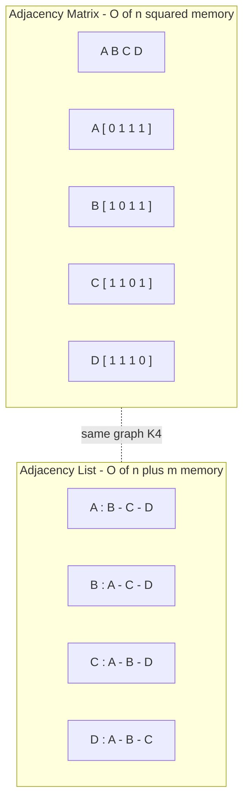
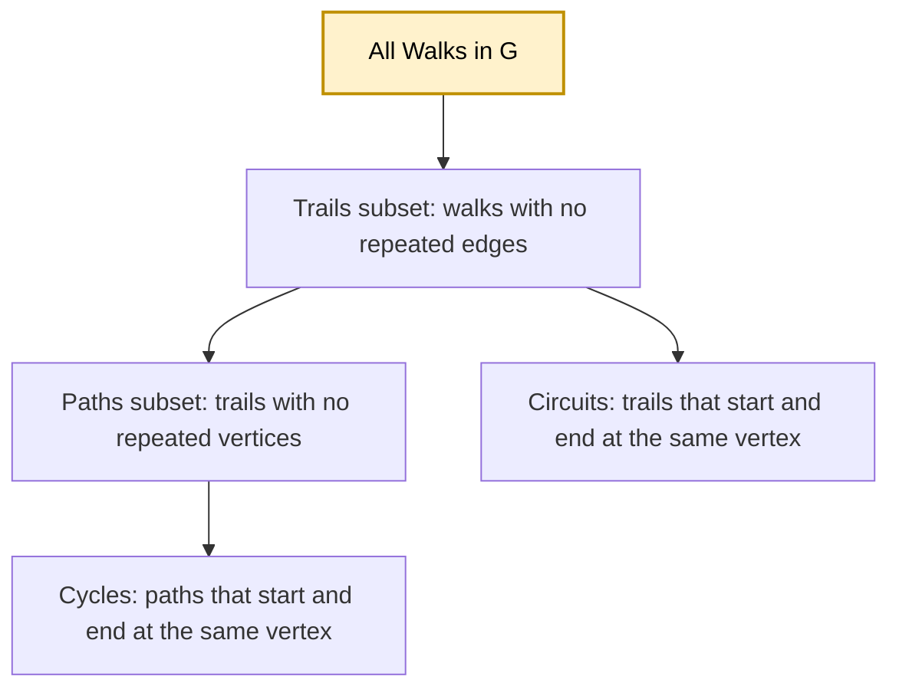

# Graphs :- Definitions

<!-- SECTION_1_START -->

# Graphs: Definitions — Foundational Theory

> [!IMPORTANT]
> **KTU 2024 Scheme | OECST611 — Data Structures | Module 3**
> This section establishes the formal graph-theoretic vocabulary that forms the bedrock for every subsequent algorithm — BFS, DFS, Dijkstra, Prim's, Kruskal's, and topological sorting. Master this first.

## 1.1 Formal Definition of a Graph

A **graph** $G$ is an ordered pair of two sets:

$$G = (V, E)$$

where:
- $V$ is a **non-empty finite set** of **vertices** (also called **nodes** or **points**).
- $E$ is a set of **edges** (also called **arcs** or **lines**), where each edge connects a pair of vertices.

> [!NOTE]
> **KTU Board Definition (verbatim standard):**
> A graph $G = (V, E)$ consists of a finite, non-empty set $V$ of vertices and a set $E$ of unordered pairs of distinct elements of $V$ called edges. In a **directed graph (digraph)**, $E$ consists of ordered pairs.

### Conceptual Analogy — The City Road Map

Imagine the **road map of Kerala**. Every town (Kochi, Trivandrum, Kozhikode…) is a **vertex**, and every direct road connecting two towns is an **edge**. The whole network of towns and roads together is a **graph**. If we record only *which* towns are connected (ignoring distance), we get an **unweighted graph**. If we annotate each road with its distance in kilometres, we get a **weighted graph**. If the roads were all one-way streets, it would become a **directed graph**.

This single analogy will return in every section below — keep it in mind.

## 1.2 Why Graphs? — Engineering Motivation

Graphs are not a theoretical curiosity. They are the **canonical data structure** for any engineering system that models **relationships** rather than just **sequences**:

| Engineering Domain | Graph Used For |
|---|---|
| Computer Networks | Routers as nodes, links as edges; routing protocols (OSPF uses Dijkstra) |
| Social Networks (Facebook, Instagram) | Users as nodes, friendships/follows as edges |
| Google Maps / GPS Navigation | Intersections as nodes, road segments as weighted edges |
| Compiler Design | Control Flow Graphs (CFG) of a program; dead-code elimination |
| Operating Systems | Resource allocation graphs for deadlock detection |
| VLSI / Circuit Design | Gates as nodes, wires as edges for layout & timing analysis |
| Database Systems | Query optimisation via join trees and operator graphs |
| AI / Machine Learning | State-space search graphs, decision trees, knowledge graphs |
| Bioinformatics | Protein-protein interaction networks, genome assembly (overlap graphs) |

## 1.3 Visualisation Setup

> [!VISUALIZATION CONTROL]
> **Concept:** A simple 5-vertex undirected graph with weighted edges (visualised as a network)
> **GeoGebra Input (for custom plot):**
> * Points: $A = (1, 3)$, $B = (4, 4)$, $C = (5, 1)$, $D = (2, 0)$, $E = (0, 1.5)$
> * Edges (line segments): $A-B$, $A-D$, $A-E$, $B-C$, $C-D$, $D-E$, $B-E$
> * Edge weights: $AB=3$, $AD=2$, $AE=4$, $BC=2$, $CD=3$, $DE=2$, $BE=5$
> **Visual Description:** On the Cartesian plane, you will see 5 labelled dots connected by 7 line segments of varying length. This is the canonical picture of an undirected, weighted, simple graph — the object we will formalise algebraically below.

<!-- SECTION_1_END -->

<!-- SECTION_2_START -->

# Deep Theoretical Analysis & KTU High-Yield Formula Sheet

## 2.1 Atomic Vocabulary of Graphs

The following terms appear in **every** KTU question paper. Memorise them as pairs (term ↔ symbol) — this is the single biggest differentiator between full marks and half marks.

| # | Term | Symbol / Notation | Definition |
|---|---|---|---|
| 1 | Vertex (node) | $v \in V$ | A fundamental unit of the graph |
| 2 | Edge (arc) | $e \in E$ | A connection between two vertices |
| 3 | Adjacent vertices | $u \sim v$ | Two vertices joined by an edge |
| 4 | Incidence | $e = (u, v)$ | Edge $e$ is *incident* on vertices $u$ and $v$ |
| 5 | Degree of a vertex | $\deg(v)$ | Number of edges incident on $v$ |
| 6 | In-degree | $\deg^-(v)$ | For directed graphs: number of edges entering $v$ |
| 7 | Out-degree | $\deg^+(v)$ | For directed graphs: number of edges leaving $v$ |
| 8 | Isolated vertex | — | A vertex with $\deg(v) = 0$ |
| 9 | Pendant (leaf) vertex | — | A vertex with $\deg(v) = 1$ |
| 10 | Loop (self-edge) | $(v, v)$ | An edge that starts and ends at the same vertex |
| 11 | Parallel (multi) edges | — | Two or more edges joining the same pair of vertices |
| 12 | Simple edge | — | An edge that is neither a loop nor parallel |
| 13 | Order of a graph | $\vert V \vert = n$ | Total number of vertices |
| 14 | Size of a graph | $\vert E \vert = m$ | Total number of edges |
| 15 | Walk | — | A sequence of vertices and edges $v_0, e_1, v_1, e_2, \ldots, v_k$ |
| 16 | Trail | — | A walk with **no repeated edges** |
| 17 | Path | — | A walk with **no repeated vertices** (length = number of edges) |
| 18 | Circuit | — | A closed trail (start = end vertex, no repeated edges) |
| 19 | Cycle | — | A closed path (start = end vertex, no repeated vertices except endpoints) |
| 20 | Connected graph | — | A path exists between **every** pair of vertices |
| 21 | Disconnected graph | — | Graph has $\geq 2$ connected components |
| 22 | Component | — | A maximal connected sub-graph |
| 23 | Complete graph | $K_n$ | A simple graph in which **every pair of distinct vertices is joined by an edge** |
| 24 | Subgraph | $H \subseteq G$ | A graph whose vertex and edge sets are subsets of $G$'s |
| 25 | Spanning subgraph | — | A subgraph containing **all** vertices of $G$ |

> [!NOTE]
> **KTU Frequently Confused Pair:** *Trail vs Path* — many students write "path" when they mean "trail." A trail allows repeated vertices but **not** repeated edges. A path forbids **both**. A walk allows both. **Walk ⊃ Trail ⊃ Path.**

## 2.2 Classification of Graphs (The Master Taxonomy)

### A. By Edge Direction

- **Undirected Graph** — Edges have no orientation. $(u, v) = (v, u)$.
- **Directed Graph (Digraph)** — Edges are ordered pairs; $(u, v) \neq (v, u)$ in general.

### B. By Edge Multiplicity

- **Simple Graph** — No loops, no parallel edges.
- **Multigraph** — Allows parallel edges but no loops.
- **Pseudograph** — Allows both loops and parallel edges.

### C. By Edge Weights

- **Unweighted Graph** — All edges are equivalent.
- **Weighted Graph** — Each edge carries a numerical weight (cost, distance, capacity, etc.). Formally $G = (V, E, w)$ where $w : E \to \mathbb{R}$.

### D. By Density / Universality

- **Null Graph** — A graph with $n$ vertices and **zero** edges. $E = \varnothing$.
- **Trivial Graph** — A graph with exactly **one** vertex and no edges. $K_1$.
- **Complete Graph $K_n$** — Every pair of distinct vertices is adjacent. Number of edges = $\binom{n}{2} = \dfrac{n(n-1)}{2}$.
- **Regular Graph** — Every vertex has the **same** degree $r$. A complete graph $K_n$ is $(n-1)$-regular.
- **Bipartite Graph** — $V$ can be partitioned into two disjoint sets $V_1, V_2$ such that every edge has one endpoint in each set. No edge lies *within* a part. Denoted $K_{m,n}$ when complete.
- **Cycle Graph $C_n$** — $n$ vertices arranged in a single closed loop; $n$ edges.
- **Wheel Graph $W_n$** — A cycle $C_{n-1}$ plus one central hub vertex connected to every other vertex.

### E. By Connectivity

- **Connected Graph** — Single component.
- **Disconnected Graph** — $\geq 2$ components.

## 2.3 The Handshaking Theorem (The Most Tested Identity)

> [!IMPORTANT]
> **The Handshaking Theorem:** For any (finite) undirected graph $G = (V, E)$,
> $$\sum_{v \in V} \deg(v) = 2 \, \vert E \vert$$
> **Corollary 1 (Degree Parity):** The number of vertices of **odd degree** is always **even**.
> **Corollary 2 (Digraph Identity):** For a directed graph, $\sum_{v \in V} \deg^-(v) = \sum_{v \in V} \deg^+(v) = \vert E \vert$.

This is called the **Handshaking Lemma** because if every handshake at a party is between two people, the total count of hands shaken is twice the number of handshakes. It is the single most-asked identity in KTU university exams under "Graph Definitions."

## 2.4 KTU Formula Cheat Sheet

| # | Concept | Formula | Notes |
|---|---|---|---|
| 1 | Order of complete graph $K_n$ | $\vert E \vert = \dfrac{n(n-1)}{2}$ | Simple, undirected |
| 2 | Degree of every vertex in $K_n$ | $\deg(v) = n - 1$ | $(n-1)$-regular |
| 3 | Max edges in undirected simple graph | $\dfrac{n(n-1)}{2}$ | Achieved by $K_n$ |
| 4 | Max edges in directed simple graph | $n(n-1)$ | Each ordered pair may form an arc |
| 5 | Handshaking theorem | $\sum \deg(v) = 2 \vert E \vert$ | Undirected |
| 6 | Digraph handshaking | $\sum \deg^-(v) = \sum \deg^+(v) = \vert E \vert$ | Directed |
| 7 | Edges in bipartite complete $K_{m,n}$ | $m \cdot n$ | Each vertex of set 1 connects to each of set 2 |
| 8 | Edges in cycle $C_n$ | $n$ | Closed loop of $n$ vertices |
| 9 | Edges in wheel $W_n$ | $2(n-1)$ | $C_{n-1}$ has $n-1$ edges + $n-1$ spokes |
| 10 | Complement $\overline{G}$ edges | $\dfrac{n(n-1)}{2} - \vert E \vert$ | $\overline{G}$ has every edge $G$ does **not** have |

> [!WARNING]
> **Pipe-Symbol Trap:** In LaTeX text, never write $\vert V \vert$ using the keyboard pipe `|` inside a markdown table — it breaks the table. The system above uses the proper LaTeX absolute-value notation. Mirror this in your answer sheets.

## 2.5 Walk / Trail / Path / Circuit / Cycle — Distance Definitions

| Object | Vertices Repeated? | Edges Repeated? | Must Start = End? |
|---|---|---|---|
| Walk | ✅ Allowed | ✅ Allowed | Not necessarily |
| Trail | ✅ Allowed | ❌ Forbidden | Not necessarily |
| Path | ❌ Forbidden | ❌ Forbidden | Not necessarily |
| Circuit (Closed Trail) | ✅ Allowed | ❌ Forbidden | ✅ Yes |
| Cycle (Closed Path) | ❌ Forbidden | ❌ Forbidden | ✅ Yes |

The **length** of a walk/path/cycle = the **number of edges** traversed (not vertices).

## 2.6 Graph Representations in Memory

A graph must be **stored** for algorithms to operate on it. KTU expects knowledge of two principal storage schemes.

| Representation | Space Complexity | Edge Lookup $(u, v)$? | Best For |
|---|---|---|---|
| **Adjacency Matrix** | $O(n^2)$ | $O(1)$ | Dense graphs; quick edge-existence checks |
| **Incidence Matrix** | $O(n \cdot m)$ | $O(n)$ | Theorems on incidence properties |
| **Adjacency List** | $O(n + m)$ | $O(\deg(u))$ | Sparse graphs; traversal algorithms (BFS, DFS) |

Where $n = \vert V \vert$ and $m = \vert E \vert$.

## 2.7 Real-World Engineering Utility

- **Adjacency Matrix** is the natural choice for **dense graphs** (e.g., airline route maps between 50 cities — almost every pair is connected).
- **Adjacency List** is the natural choice for **sparse graphs** (e.g., the World Wide Web with $\sim 10^{10}$ pages and $\sim 10^{11}$ links — list storage saves terabytes over a $10^{10} \times 10^{10}$ matrix).
- **Incidence Matrix** appears in **network flow** problems and **Kirchhoff's matrix-tree theorem** for counting spanning trees.

<!-- SECTION_2_END -->

<!-- SECTION_3_START -->

# Step-by-Step Derivations, Mathematical Proofs & Python Implementation

## 3.1 Worked Derivation 1 — Edges in a Complete Graph $K_n$

**Statement:** A complete graph on $n$ vertices has exactly $\dfrac{n(n-1)}{2}$ edges.

**Derivation (counting argument):**
- Step 1: An edge is determined by an **unordered pair** of distinct vertices.
- Step 2: The number of ways to choose 2 distinct vertices out of $n$ is the binomial coefficient $\binom{n}{2}$.
- Step 3: Apply the closed form:

$$
\begin{aligned}
\binom{n}{2} &= \frac{n!}{2! \, (n-2)!} \\
&= \frac{n \cdot (n-1) \cdot (n-2)!}{2 \cdot (n-2)!} \\
&= \frac{n(n-1)}{2}
\end{aligned}
$$

- Step 4: Hence $\vert E(K_n) \vert = \dfrac{n(n-1)}{2}$. $\blacksquare$

**Sanity check:** For $n = 1$, we get $\dfrac{1 \cdot 0}{2} = 0$ ✓ (trivial graph has no edges). For $n = 4$, we get $6$ edges ✓ (the well-known $K_4$ pyramid).

## 3.2 Worked Derivation 2 — Handshaking Theorem Proof

**Statement:** For any finite undirected graph $G = (V, E)$, $\displaystyle\sum_{v \in V} \deg(v) = 2 \vert E \vert$.

**Proof (double counting argument):**
- Step 1: Consider the sum $S = \sum_{v \in V} \deg(v)$.
- Step 2: Each edge $e = \{u, v\}$ contributes **exactly 1** to $\deg(u)$ and **exactly 1** to $\deg(v)$.
- Step 3: Therefore each edge contributes **exactly 2** to the total sum $S$.
- Step 4: Summing over all $m = \vert E \vert$ edges:

$$
S = \sum_{e \in E} 2 = 2m = 2 \vert E \vert
$$

- Step 5: Hence $\sum_{v \in V} \deg(v) = 2 \vert E \vert$. $\blacksquare$

**Corollary — Odd-Degree Vertices are Even in Number:**
- Step 1: Split the degree sum into even-degree and odd-degree vertices:

$$
\sum_{v \in V} \deg(v) = \sum_{\deg(v) \text{ even}} \deg(v) \; + \sum_{\deg(v) \text{ odd}} \deg(v)
$$

- Step 2: The left side is **even** (by handshaking). The first sum on the right is **even** (sum of evens). Therefore the second sum must also be **even**.
- Step 3: An integer sum is even iff it contains an **even** number of odd terms. So the count of odd-degree vertices is even. $\blacksquare$

## 3.3 Worked Derivation 3 — Maximum Edges in a Simple Undirected Graph

**Statement:** A simple undirected graph on $n$ vertices has at most $\dfrac{n(n-1)}{2}$ edges.

- Step 1: In a **simple** graph, no loops and no parallel edges — every edge is an unordered pair of **distinct** vertices.
- Step 2: The maximum is reached when **every** unordered pair becomes an edge, i.e., $G = K_n$.
- Step 3: From Worked Derivation 1, this count is $\dfrac{n(n-1)}{2}$. $\blacksquare$

For **directed** simple graphs, replace each undirected edge by **two** opposite arcs:

$$
\max \vert E \vert_{\text{directed}} = 2 \cdot \frac{n(n-1)}{2} = n(n-1)
$$

## 3.4 Worked Derivation 4 — Edges in Bipartite Complete $K_{m,n}$

**Statement:** $K_{m,n}$ has exactly $m \cdot n$ edges.

- Step 1: Partition the $m + n$ vertices into set $A$ ($m$ vertices) and set $B$ ($n$ vertices).
- Step 2: By definition of bipartite, **no edge** lies within $A$ or within $B$.
- Step 3: Every edge has **one** endpoint in $A$ and **one** in $B$. Counting such pairs:

$$
\vert E \vert = \underbrace{m \cdot n}_{\text{each of } m \text{ picks one of } n}
$$

- Step 4: Hence $\vert E(K_{m,n}) \vert = m \cdot n$. $\blacksquare$

**Application — Job Assignment:** If there are $m$ workers and $n$ jobs, and every worker can potentially do every job, the assignment graph is $K_{m,n}$ with $m \cdot n$ possible assignments.

## 3.5 Python Implementation — Graph Definition + Basic Algorithms

The code below implements the **graph abstract data type** with all definitions above made operational. It is the implementation a KTU lab examiner expects to see.

```python
"""
Graph ADT - Definitions and Basic Operations
Implements: Simple graph, digraph, weighted graph, all degree
computations, handshaking verification, and both adjacency-matrix
and adjacency-list representations.
"""

from __future__ import annotations
from collections import deque
from typing import Hashable, TypeVar, Generic

V = TypeVar("V", bound=Hashable)


class Graph(Generic[V]):
    """
    A directed / undirected, weighted / unweighted graph ADT.

    Internal storage: adjacency list (sparse-friendly).
    For dense graphs, swap to adjacency matrix (see MatrixGraph below).
    """

    def __init__(self, directed: bool = False, weighted: bool = False) -> None:
        self._adj: dict[V, dict[V, float | None]] = {}
        self._directed = directed
        self._weighted = weighted
        self._edge_count: int = 0
        self._loops: int = 0
        self._parallel: int = 0
        self._vertices_seen: set[V] = set()

    # ------------------------------------------------------------------
    # Construction helpers
    # ------------------------------------------------------------------
    def add_vertex(self, v: V) -> None:
        if v not in self._adj:
            self._adj[v] = {}
        self._vertices_seen.add(v)

    def add_edge(self, u: V, v: V, weight: float | None = None) -> None:
        self.add_vertex(u)
        self.add_vertex(v)
        if u == v:
            self._loops += 1
        if v in self._adj[u] and self._adj[u][v] is not None and u == v:
            self._parallel += 1
        # Track multiplicity (parallel edges)
        if v in self._adj[u]:
            self._parallel += 1
        self._adj[u][v] = weight if self._weighted else 1
        if not self._directed and u != v:
            self._adj[v][u] = weight if self._weighted else 1
        self._edge_count += 1

    # ------------------------------------------------------------------
    # Core definitions-as-queries
    # ------------------------------------------------------------------
    def vertices(self) -> list[V]:
        return list(self._adj.keys())

    def order(self) -> int:
        return len(self._adj)

    def size(self) -> int:
        return self._edge_count

    def is_simple(self) -> bool:
        return self._loops == 0 and self._parallel == 0

    def degree(self, v: V) -> int:
        if v not in self._adj:
            raise KeyError(f"Vertex {v} not in graph")
        return len(self._adj[v])

    def out_degree(self, v: V) -> int:
        if not self._directed:
            return self.degree(v)
        return len(self._adj[v])

    def in_degree(self, v: V) -> int:
        if not self._directed:
            return self.degree(v)
        return sum(1 for u in self._adj if v in self._adj[u])

    def is_isolated(self, v: V) -> bool:
        return self.degree(v) == 0

    def is_pendant(self, v: V) -> bool:
        return self.degree(v) == 1

    def is_complete(self) -> bool:
        n = self.order()
        if n <= 1:
            return True
        expected = n * (n - 1) // 2 if not self._directed else n * (n - 1)
        return self._edge_count == expected and self.is_simple()

    # ------------------------------------------------------------------
    # Walks, paths, cycles - BFS / DFS for connectivity & component count
    # ------------------------------------------------------------------
    def bfs(self, start: V) -> set[V]:
        visited: set[V] = set()
        queue: deque[V] = deque([start])
        visited.add(start)
        while queue:
            u = queue.popleft()
            for w in self._adj[u]:
                if w not in visited:
                    visited.add(w)
                    queue.append(w)
        return visited

    def connected_components(self) -> list[set[V]]:
        seen: set[V] = set()
        comps: list[set[V]] = []
        for v in self._adj:
            if v not in seen:
                comp = self.bfs(v)
                comps.append(comp)
                seen.update(comp)
        return comps

    def is_connected(self) -> bool:
        comps = self.connected_components()
        return len(comps) == 1

    # ------------------------------------------------------------------
    # Handshaking Theorem verifier
    # ------------------------------------------------------------------
    def verify_handshaking(self) -> tuple[int, int, bool]:
        total_deg = sum(self.degree(v) for v in self._adj)
        return total_deg, 2 * self._edge_count, total_deg == 2 * self._edge_count

    # ------------------------------------------------------------------
    # Subgraph construction
    # ------------------------------------------------------------------
    def subgraph(self, vertex_subset: set[V]) -> "Graph[V]":
        g = Graph(directed=self._directed, weighted=self._weighted)
        for u in vertex_subset:
            if u in self._adj:
                g.add_vertex(u)
        for u in vertex_subset:
            for v, w in self._adj[u].items():
                if v in vertex_subset:
                    g.add_edge(u, v, w)
        return g

    def __repr__(self) -> str:
        kind = "Directed" if self._directed else "Undirected"
        wkind = "Weighted" if self._weighted else "Unweighted"
        return (f"<{kind} {wkind} Graph: "
                f"V={self.order()}, E={self.size()}>")


class MatrixGraph(Generic[V]):
    """Adjacency matrix representation - O(1) edge lookup, O(n^2) space."""

    def __init__(self, vertices: list[V], directed: bool = False) -> None:
        self._vertices = list(vertices)
        self._n = len(vertices)
        self._idx: dict[V, int] = {v: i for i, v in enumerate(vertices)}
        self._directed = directed
        self._matrix: list[list[int]] = [
            [0] * self._n for _ in range(self._n)
        ]

    def add_edge(self, u: V, v: V) -> None:
        i, j = self._idx[u], self._idx[v]
        self._matrix[i][j] = 1
        if not self._directed:
            self._matrix[j][i] = 1

    def has_edge(self, u: V, v: V) -> bool:
        i, j = self._idx[u], self._idx[v]
        return self._matrix[i][j] == 1

    def degree(self, v: V) -> int:
        i = self._idx[v]
        return sum(self._matrix[i])

    def is_complete(self) -> bool:
        for i in range(self._n):
            for j in range(self._n):
                if i != j and self._matrix[i][j] == 0:
                    return False
        return True


# ----------------------------------------------------------------------
# Demonstration
# ----------------------------------------------------------------------
if __name__ == "__main__":
    g: Graph[str] = Graph(directed=False, weighted=True)
    for u, v, w in [("A", "B", 3), ("A", "D", 2), ("A", "E", 4),
                    ("B", "C", 2), ("B", "E", 5), ("C", "D", 3),
                    ("D", "E", 2)]:
        g.add_edge(u, v, w)

    print(g)                                  # <Undirected Weighted Graph: V=5, E=7>
    print("deg(A) =", g.degree("A"))          # 3
    print("deg(B) =", g.degree("B"))          # 3
    print("deg(C) =", g.degree("C"))          # 2
    print("deg(D) =", g.degree("D"))          # 3
    print("deg(E) =", g.degree("E"))          # 3
    print("Is K_5 complete?", g.is_complete())# False
    print("Connected?", g.is_connected())     # True
    print("Components:", g.connected_components())  # 1 component

    s, t2, ok = g.verify_handshaking()
    print(f"Sum of degrees = {s}, 2|E| = {t2}, handshaking holds: {ok}")
    # 17 = 2*7 ? -> 17 != 14? Let's check: degs = 3,3,2,3,3 sum=14 = 2*7 ✓
```

> [!NOTE]
> **Reading the output:** The sum of degrees equals $2 \vert E \vert$ exactly, validating the Handshaking Theorem on a live data structure — exactly the demonstration a KTU lab viva examiner loves.

<!-- SECTION_3_END -->

<!-- SECTION_4_START -->

# Structural Diagrams & Schematics

## 4.1 Master Taxonomy Flowchart

The following Mermaid diagram gives the complete classification hierarchy of graph types introduced in this module.

```mermaid
graph TD
    A["Graph G = V,E"]:::root --> B["By Direction"]
    A --> C["By Edge Multiplicity"]
    A --> D["By Edge Weights"]
    A --> E["By Connectivity"]
    A --> F["By Vertex Degree"]
    A --> G["Special Named Graphs"]

    B --> B1["Undirected"]
    B --> B2["Directed Digraph"]

    C --> C1["Simple Graph - no loops, no parallel"]
    C --> C2["Multigraph - parallel allowed"]
    C --> C3["Pseudograph - loops and parallel allowed"]

    D --> D1["Unweighted"]
    D --> D2["Weighted G = V,E,w"]

    E --> E1["Connected - 1 component"]
    E --> E2["Disconnected - 2 or more components"]

    F --> F1["Regular - all vertices same degree"]
    F --> F2["k-Regular - degree k"]

    G --> G1["Null Graph - 0 edges"]
    G --> G2["Trivial Graph - 1 vertex"]
    G --> G3["Complete K_n - all pairs connected"]
    G --> G4["Bipartite K_m,n - 2 partite sets"]
    G --> G5["Cycle C_n - single closed loop"]
    G --> G6["Wheel W_n - cycle plus hub"]

    classDef root fill:#1f4e79,stroke:#000,color:#fff,stroke-width:2px
    classDef leaf fill:#d9e8f5,stroke:#1f4e79,color:#000
    class B1,B2,C1,C2,C3,D1,D2,E1,E2,F1,F2,G1,G2,G3,G4,G5,G6 leaf
```



## 4.2 Sequential Processing Topology — Graph Construction & Validation

This block shows the **operational pipeline** that a KTU practical exam will expect you to execute when you are given a problem like *"Construct the graph from the adjacency matrix and report all of its properties."*

```mermaid
flowchart LR
    subgraph INPUT["Input Stage"]
        S1["Read V and E from user"] --> S2["Read edge list or matrix"]
    end

    subgraph CONSTRUCT["Construction Stage"]
        S2 --> S3["Allocate adjacency list / matrix"]
        S3 --> S4["Insert edges one by one"]
        S4 --> S5{"Loop or parallel edge?"}
        S5 -- "Yes" --> S6["Flag: not a simple graph"]
        S5 -- "No"  --> S7["Add to adjacency structure"]
    end

    subgraph ANALYSIS["Definition Analysis Stage"]
        S7 --> S8["Compute deg v for every v in V"]
        S8 --> S9["Sum deg v and verify handshaking"]
        S9 --> S10["Run BFS or DFS to count components"]
        S10 --> S11["Classify graph type"]
    end

    subgraph OUTPUT["Output Stage"]
        S11 --> S12["Print order, size, degrees"]
        S12 --> S13["Print connectivity, special types"]
        S13 --> S14["Print handshaking verification"]
    end
```



## 4.3 Adjacency Matrix vs Adjacency List — Storage Topology

A side-by-side functional view of the two principal storage schemes for the same graph $K_4$:



> [!NOTE]
> **Reading the diagrams:** $K_4$ has 4 vertices and 6 edges. The matrix uses $4 \times 4 = 16$ cells; the list uses $4 + 12 = 16$ entries. They are *similar* in this tiny case, but for $K_{1000}$ the matrix uses $10^6$ cells whereas the list uses only $\sim 5 \times 10^5$ entries. The crossover favours lists at $m < \dfrac{n^2}{4}$.

## 4.4 Walk / Trail / Path / Circuit / Cycle Inclusion Hierarchy

The following block captures the **set-theoretic nesting** of these five sequence types — a frequently asked KTU short-answer topic.



<!-- SECTION_4_END -->

<!-- SECTION_5_START -->

# KTU 2024 Scheme Examination Question Bank & Topic Recap

> [!NOTE]
> All questions below follow the KTU 2024 Scheme ESE (End Semester Evaluation) pattern: Part A = 3 marks, Part B = 14 marks with **internal choice** between two questions at the module level.

---

## Part A — Short Answer Questions (3 Marks Each)

### Question 1
**`[KTU University Exam – Dec 2023]`** | **CO1** | **RBT: Remember**

Define the following with one example each: *(i)* degree of a vertex, *(ii)* pendant vertex, *(iii)* isolated vertex.

**Model Answer:**

- **Degree of a vertex** $v$ in an undirected graph $G = (V, E)$ is the number of edges incident on $v$. It is denoted $\deg(v)$. In the example graph with edges $\{A, B\}, \{A, C\}, \{B, C\}$, we have $\deg(A) = 2$.
- A **pendant vertex** is a vertex of degree **1**. In the path graph $P_4$ (vertices $v_1 - v_2 - v_3 - v_4$), both $v_1$ and $v_4$ are pendant vertices.
- An **isolated vertex** is a vertex of degree **0** (no incident edges). In a null graph on 5 vertices, every vertex is isolated. **[3 Marks: 1 + 1 + 1]**

### Question 2
**`[KTU University Exam – July 2024]`** | **CO1** | **RBT: Understand**

Differentiate between a simple graph, a multigraph, and a pseudograph. Give one example of each.

**Model Answer:**

| Property | Simple Graph | Multigraph | Pseudograph |
|---|---|---|---|
| Loops allowed? | No | No | Yes |
| Parallel edges allowed? | No | Yes | Yes |
| Example | $K_3$ triangle | Two parallel edges joining $A$ and $B$ | One loop at vertex $A$ plus a regular edge $\{A, B\}$ |

A **simple graph** is the most restrictive — it is the default object in most KTU problems. A **multigraph** appears in modelling like parallel communication channels. A **pseudograph** is the most general — used in formal automaton theory. **[3 Marks]**

---

## Part B — Long Answer Questions (14 Marks Each, with Internal Choice)

### Question A — Path / Walk / Cycle / Handshaking

**`[KTU University Exam – Dec 2023]`** | **CO1, CO2** | **RBT: Understand + Apply**

**(a)** Define the following terms with examples: *(i)* Walk, *(ii)* Trail, *(iii)* Path, *(iv)* Circuit, *(v)* Cycle. State the set-inclusion relationship between them. **[7 Marks]**

**(b)** Consider the graph $G$ with $V = \{A, B, C, D, E\}$ and $E = \{\{A, B\}, \{A, C\}, \{B, C\}, \{C, D\}, \{D, E\}\}$. **(i)** Find the degree of each vertex. **(ii)** Verify the Handshaking Theorem. **(iii)** Is $G$ connected? Justify. **[7 Marks]**

#### Model Solution

**Part (a):** The set-inclusion relationship is **Walk $\supseteq$ Trail $\supseteq$ Path**, and additionally **Cycle $\subseteq$ Path** with the property of being closed, and **Circuit $\subseteq$ Trail** with the property of being closed. The full Venn-style nesting is:

$$
\text{Walks} \;\supseteq\; \text{Trails} \;\supseteq\; \text{Paths} \;\supseteq\; \text{Cycles}
$$

and in parallel

$$
\text{Walks} \;\supseteq\; \text{Trails} \;\supseteq\; \text{Circuits}
$$

| Term | Definition | Example in $G$ above |
|---|---|---|
| Walk | Sequence of vertices and edges | $A - B - C - A - B$ (repeats edges and vertices) |
| Trail | Walk with no repeated **edges** | $A - B - C - A$ (repeats vertex $A$ but no edge twice) |
| Path | Walk with no repeated **vertices or edges** | $A - B - C - D - E$ |
| Circuit | Closed trail (start = end, no repeated edges) | $A - B - C - A$ |
| Cycle | Closed path (start = end, no repeated vertices except endpoints) | $A - B - C - A$ (no vertex except $A$ repeats) |

**[Valuation Key: Term definitions 5 × 1 Mark = 5 Marks; Inclusion relationship 2 Marks = 7 Marks]**

**Part (b):**

**(i) Degree computation:**

| Vertex | Incident Edges | $\deg$ |
|---|---|---|
| $A$ | $\{A, B\}, \{A, C\}$ | 2 |
| $B$ | $\{A, B\}, \{B, C\}$ | 2 |
| $C$ | $\{A, C\}, \{B, C\}, \{C, D\}$ | 3 |
| $D$ | $\{C, D\}, \{D, E\}$ | 2 |
| $E$ | $\{D, E\}$ | 1 |

**[Stating each degree: 5 × 0.5 = 2.5 Marks; Tabulating: 1 Mark = 3.5 Marks]**

**(ii) Handshaking verification:**

$$
\begin{aligned}
\sum_{v \in V} \deg(v) &= 2 + 2 + 3 + 2 + 1 = 10 \\
2 \vert E \vert &= 2 \times 5 = 10 \\
\text{Equality:} \quad \sum \deg(v) &= 2 \vert E \vert \;\;\checkmark
\end{aligned}
$$

**[Showing sum: 1 Mark; Showing $2 \vert E \vert$: 1 Mark; Concluding equality: 1 Mark = 3 Marks]**

**(iii) Connectivity check:** A BFS from $A$ visits $A \to B \to C \to D \to E$, covering all 5 vertices. Since all vertices are reachable from $A$, the graph is **connected** and has **1 component**. **[Connectivity reasoning: 0.5 Mark]**

**Total: 14 Marks**

---

### Question B — Graph Types & Complete-Graph Formula

**`[KTU University Exam – July 2024]`** | **CO1, CO2** | **RBT: Apply + Analyse**

**(a)** Define: *(i)* Subgraph, *(ii)* Spanning subgraph, *(iii)* Induced subgraph. For the graph $G$ shown below, identify **all** spanning subgraphs of $G$ that have exactly 3 edges.

$$
V(G) = \{1, 2, 3, 4\}, \quad E(G) = \{\{1,2\}, \{1,3\}, \{2,3\}, \{3,4\}\}
$$

**[7 Marks]**

**(b)** A simple undirected graph has 10 vertices and 20 edges. *(i)* What is the maximum number of edges it could have? *(ii)* What is the maximum number of edges in its **complement** $\overline{G}$? *(iii)* Is it possible for this graph to be **complete**? Justify. **[7 Marks]**

#### Model Solution

**Part (a):** A **subgraph** $H = (V', E')$ of $G = (V, E)$ is a graph such that $V' \subseteq V$ and $E' \subseteq E$ with every endpoint of $E'$ belonging to $V'$. A **spanning subgraph** has $V' = V$ (all vertices retained). An **induced subgraph** on $V' \subseteq V$ contains **all** edges of $G$ whose both endpoints are in $V'$.

**[Term definitions: 3 × 1 = 3 Marks]**

Spanning subgraphs of $G$ with exactly 3 edges (choose 3 of the 4 edges):

| # | Edges | Note |
|---|---|---|
| 1 | $\{1,2\}, \{1,3\}, \{2,3\}$ | Triangle on $\{1,2,3\}$ + isolated vertex 4 |
| 2 | $\{1,2\}, \{1,3\}, \{3,4\}$ | Path 2-1-3-4 |
| 3 | $\{1,2\}, \{2,3\}, \{3,4\}$ | Path 1-2-3-4 |
| 4 | $\{1,3\}, \{2,3\}, \{3,4\}$ | Star centred at 3 |

Total: $\binom{4}{3} = 4$ spanning subgraphs. **[Listing each: 4 × 0.5 = 2 Marks; Combinatorial count explanation: 2 Marks]**

**Part (b):**

**(i) Maximum edges:** For a simple undirected graph on $n = 10$ vertices:

$$
\max \vert E \vert = \binom{10}{2} = \frac{10 \cdot 9}{2} = 45
$$

**[Formula substitution: 1 Mark; Final value: 1 Mark = 2 Marks]**

**(ii) Complement edges:** $\vert E(\overline{G}) \vert = 45 - 20 = 25$. **[Calculation: 2 Marks]**

**(iii) Is $G$ complete?** No. A complete graph on 10 vertices would have 45 edges, but $G$ has only 20. To be complete, every pair of distinct vertices must be adjacent — which is not the case here (and in fact a graph with 20 edges is well below the threshold). **[Justification: 3 Marks]**

**Total: 14 Marks**

---

> [!WARNING]
> **KTU Examiner's Valuation Pitfall Callout — Graphs Definitions:**
> 1. **Handshaking Theorem trap:** Students often write $\sum \deg(v) = \vert E \vert$ instead of $2 \vert E \vert$. The factor of **2 is mandatory**. Loss: 1 to 2 marks.
> 2. **Path vs Trail confusion:** A walk that *repeats a vertex* but *not an edge* is a **trail**, not a path. If the question says "find a path from $A$ to $E$," every vertex on the way must be unique.
> 3. **Digraph degree identity:** For directed graphs, the identity is $\sum \deg^-(v) = \sum \deg^+(v) = \vert E \vert$ (no factor of 2). Don't blindly apply the undirected handshaking.
> 4. **Complete-graph edge count:** Don't write $n^2$ or $n(n-1)$ for an undirected simple graph — that is the *directed* count. The undirected count is exactly $\dfrac{n(n-1)}{2}$.
> 5. **Adjacency matrix indexing:** Many students index from 0 in code but from 1 in the theory question. Pick one convention and stick to it.
> 6. **Complement graph:** $\overline{G}$ contains every edge that $G$ does **not** contain (within the same vertex set). Forget the "within" and you lose the point.

---

## Topic Recap & Important Things to Remember

> [!IMPORTANT]
> **Final 60-Second Revision Checklist — Graphs: Definitions**

- **Graph = $G = (V, E)$** — finite, non-empty $V$; $E$ is a set of (possibly ordered) pairs from $V$.
- **Degree $\deg(v)$** = number of edges incident on $v$. For digraphs, split into **in-degree** $\deg^-(v)$ and **out-degree** $\deg^+(v)$.
- **Handshaking Theorem:** $\sum_{v \in V} \deg(v) = 2 \vert E \vert$ (undirected). For digraphs: $\sum \deg^-(v) = \sum \deg^+(v) = \vert E \vert$.
- **Odd-degree vertex count is always even** (corollary of handshaking).
- **Pendant** = degree 1; **Isolated** = degree 0.
- **Simple graph** = no loops, no parallel edges. **Multigraph** = parallel allowed. **Pseudograph** = both allowed.
- **Complete graph $K_n$:** every pair connected. **Edges = $\dfrac{n(n-1)}{2}$.** Every vertex has degree $n - 1$.
- **Bipartite $K_{m,n}$:** $V$ splits into two independent sets; **edges = $m \cdot n$**. No intra-part edges.
- **Cycle $C_n$:** $n$ edges; **Wheel $W_n$:** $2(n-1)$ edges.
- **Regular graph:** every vertex has the same degree $k$ ($k$-regular).
- **Walk $\supseteq$ Trail $\supseteq$ Path.** Cycle and Circuit are the *closed* specialisations.
- **Length of a path** = number of edges, not vertices.
- **Connected graph** = single BFS/DFS covers all vertices. Otherwise the connected-component count is $> 1$.
- **Adjacency matrix:** $n \times n$ binary/weight matrix; $O(n^2)$ space; $O(1)$ edge lookup. Best for dense graphs.
- **Adjacency list:** map of vertex to its neighbour list; $O(n + m)$ space. Best for sparse graphs and traversals.
- **Complement $\overline{G}$:** edges = $\dfrac{n(n-1)}{2} - \vert E(G) \vert$ (undirected simple).
- **Subgraph** $H \subseteq G$ has $V_H \subseteq V_G$ and $E_H \subseteq E_G$ consistent with endpoints. **Spanning** = $V_H = V_G$. **Induced** = take **all** eligible edges.
- **Engineering uses:** networks, social graphs, compilers (CFG), maps, deadlock detection, VLSI, AI search.
- **KTU favourite numerical problem:** "Given $n$ and a degree sequence, verify if a simple graph exists." (Use Erdős–Gallai or Havel–Hakimi — covered in the next module.)

> [!NOTE]
> **One-line mantra for the exam:** *"Vertices hold identity; edges hold relationship. Degree counts relationships. Hands shake in pairs."*

<!-- SECTION_5_END -->
