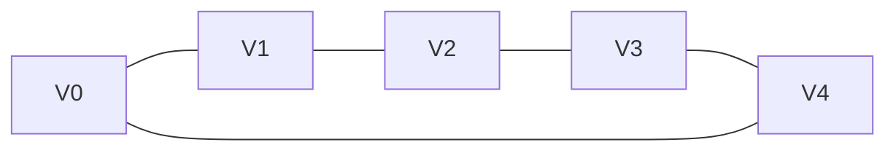
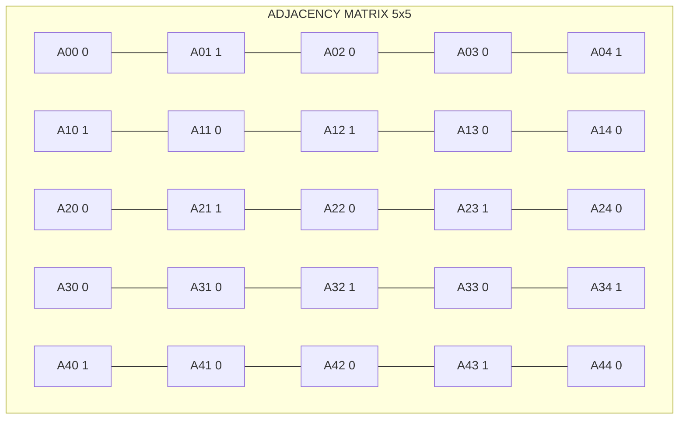
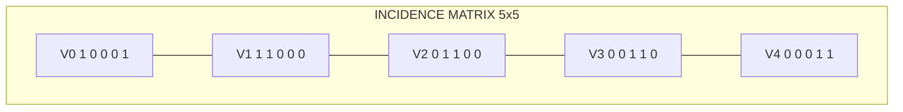
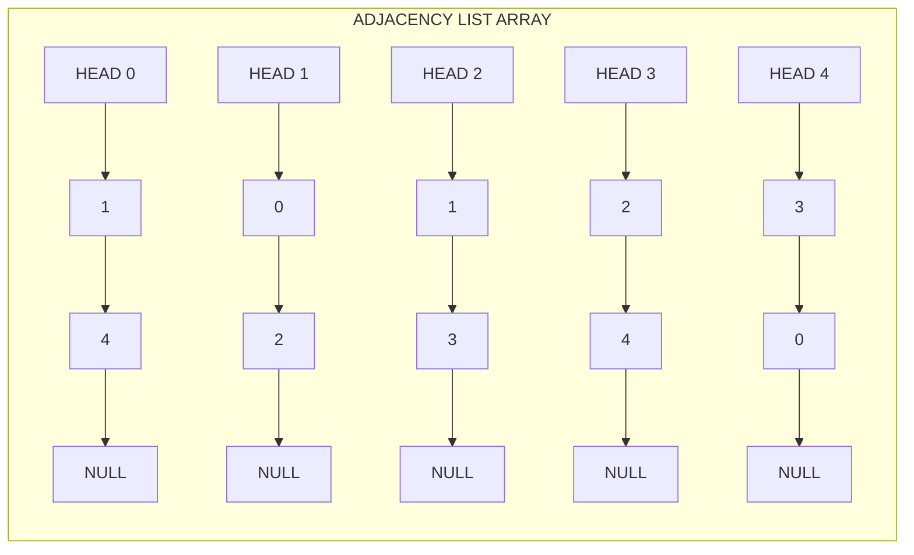
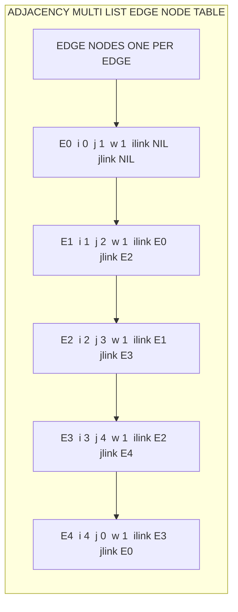
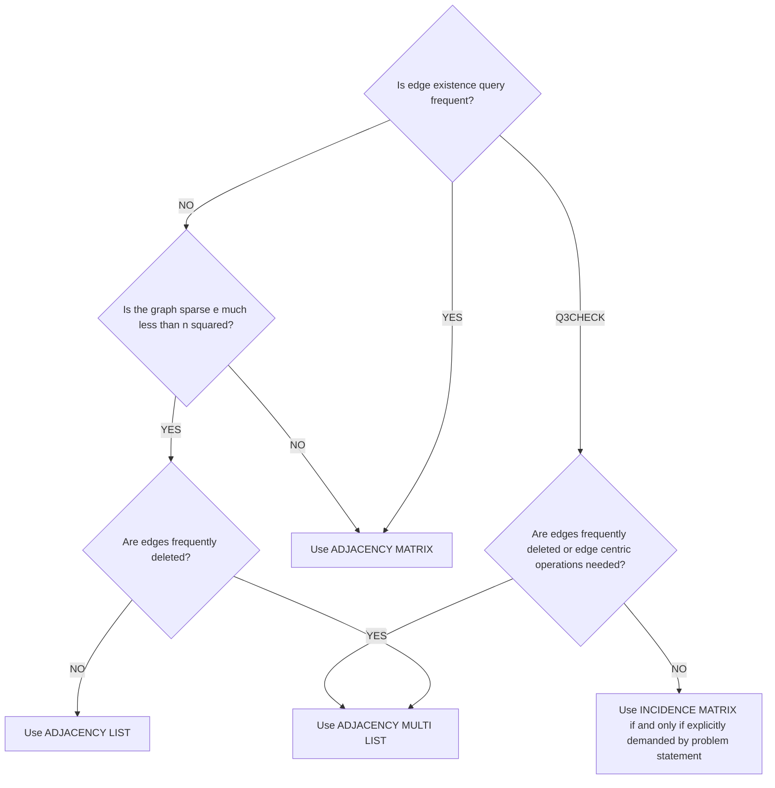

# Representation of Graphs

<!-- SECTION_1_START -->
# Representation of Graphs — Core Definition & Intuitive Overview

> [!NOTE]
> **KTU 2024 Syllabus Definition (OECST611 — Module 3):**
> A **Graph** $G$ is an ordered pair $G = (V, E)$, where $V$ is a non-empty finite set of **vertices** (nodes) and $E$ is a finite set of **edges** (connections) joining pairs of vertices. **Representation of a Graph** is the *method of storing* this abstract structure $G = (V, E)$ inside computer memory so that standard graph operations — *insertion*, *deletion*, *traversal*, and *search* — can be performed efficiently.

## 1.1 Why Do We Need a "Representation"?

In a textbook we can simply *draw* a graph with dots and lines. But a computer does not understand drawings — it only understands memory. So the abstract mathematical object $G = (V, E)$ must be **encoded** into a concrete data layout (arrays, pointers, or matrices) before any algorithm can run on it.

The choice of representation directly controls:
- **Memory consumption** of the program.
- **Speed** of the most common operations.
- **Ease of implementation** for algorithms like BFS, DFS, Dijkstra, and Prim.

> [!IMPORTANT]
> **KTU Board Highlight (Repeated Question Topic):**
> Examiners *frequently* test the trade-off between **Adjacency Matrix** and **Adjacency List**, because it is the *single most important design decision* in any graph-based algorithm. Always remember the *one-line rule*:
>
> **Sparse graph $\Rightarrow$ Adjacency List. Dense graph $\Rightarrow$ Adjacency Matrix.**

## 1.2 The Four Standard Representations

| # | Representation Name | Memory Layout Type |
|---|---------------------|---------------------|
| 1 | Adjacency Matrix | 2-D Array |
| 2 | Incidence Matrix | 2-D Array |
| 3 | Adjacency List | Array of Linked Lists |
| 4 | Adjacency Multi-list | Linked List of Edge Nodes |

> [!NOTE]
> **Notation used throughout this note (matches KTU textbooks by Ellis Horowitz & Sartaj Sahni):**
> - $n = \mid V \mid$ = number of vertices.
> - $e = \mid E \mid$ = number of edges.
> - For a *directed* graph, the maximum possible edges = $n(n-1)$.
> - For an *undirected* graph, the maximum possible edges = $\dfrac{n(n-1)}{2}$.

## 1.3 Conceptual Analogy — The "City-Map" Intuition

Imagine you are designing a **navigation app** for a city with $n$ intersections and $e$ two-way roads. You need to answer questions like *"Is there a direct road from intersection A to B?"* and *"List all intersections reachable from A in one hop."*

- **Adjacency Matrix** is like a giant *spreadsheet table* on the wall of the city office. Every row and every column represents an intersection. The cell at row $i$, column $j$ contains either "1" (road exists) or "0" (no road). The wall is always $n \times n$ in size — even if the city has only $e = 10$ roads out of a possible $1000$.
- **Adjacency List** is like a *personal notebook* carried by each intersection. Each notebook only lists the intersections to which it is *directly* connected. The total paper used grows with the *number of actual roads*, not the number of possible roads.
- **Incidence Matrix** is like a *ledger* where each row is an intersection and each column is a single physical road. The road's two endpoints are marked "1" (or "−1" / "1" for directed graphs).
- **Adjacency Multi-list** is like a *shared notebook* for the roads themselves — every road is a single page that lists its two endpoints and a pointer to the next road incident to either endpoint.

> [!VISUALIZATION CONTROL]
> **Concept:** A simple undirected graph $G$ with $5$ vertices and $5$ edges, drawn on a 2-D plane.
> **Desmos / GeoGebra Input Equations (point coordinates to plot):**
> * Vertex $A = (0,\, 0)$
> * Vertex $B = (4,\, 0)$
> * Vertex $C = (6,\, 3)$
> * Vertex $D = (2,\, 4)$
> * Vertex $E = (-1,\, 3)$
> * Edges: line segments $A\!-\!B$, $B\!-\!C$, $C\!-\!D$, $D\!-\!E$, $E\!-\!A$
> **Visual Description:** The student should observe a pentagon-shaped undirected graph, with $A\!-\!B$ horizontal at the base, $C$ at the upper-right, $D$ at the top, and $E$ at the upper-left. This same graph will be encoded by *all four* representations in the next sections so the student can visually match each encoding to the picture.

<!-- SECTION_1_END -->

<!-- SECTION_2_START -->
# Deep Theoretical Analysis & KTU High-Yield Formula Sheet

In this section, every representation is dissected into its *exact data layout*, its *access procedure*, and the *cost of every standard operation*. Then a single consolidated formula sheet is provided for last-minute KTU revision.

## 2.1 Adjacency Matrix Representation

### 2.1.1 Construction Logic

A **2-D array** $A[0 \dots n-1][0 \dots n-1]$ of size $n \times n$ is allocated. The encoding rule is:

$$
A[i][j] =
\begin{cases}
1 & \text{if there exists an edge from vertex } v_i \text{ to vertex } v_j \\
0 & \text{otherwise}
\end{cases}
$$

For an **undirected** graph, the matrix is always *symmetric*, i.e., $A[i][j] = A[j][i]$. For a **directed** graph, the matrix is generally *asymmetric*. For a graph with **self-loops** or **parallel edges** with weights, the value $1$ is replaced by the weight, by the loop count, or simply omitted (loops are usually forbidden in simple graphs).

### 2.1.2 Step-by-Step Operational Logic

1. Read $n$, the number of vertices.
2. Allocate a 2-D integer array `A[n][n]`, initially filled with $0$.
3. For every input edge $(u, v)$:
   - Set $A[u][v] = 1$ (and for undirected graphs, also $A[v][u] = 1$).
4. To check if an edge $(u, v)$ exists, simply read the value $A[u][v]$.
5. To list all neighbours of $v$, scan the *entire* $v$-th row.

### 2.1.3 Why and How It Works

- **Why a matrix?** It maps the abstract relation $E \subseteq V \times V$ onto the formal definition of a *relation in set theory*, which is itself a subset of a Cartesian product. A 2-D array is the most natural way to represent such a subset.
- **How is the in-degree of a vertex obtained?** Sum the corresponding column. Sum the row for the out-degree (directed graph) or degree (undirected graph).

## 2.2 Incidence Matrix Representation

### 2.2.1 Construction Logic

A **2-D array** $B[0 \dots n-1][0 \dots e-1]$ of size $n \times e$ is allocated. The encoding rule is:

For an **undirected** graph:

$$
B[i][j] =
\begin{cases}
1 & \text{if vertex } v_i \text{ is an endpoint of edge } e_j \\
0 & \text{otherwise}
\end{cases}
$$

For a **directed** graph:

$$
B[i][j] =
\begin{cases}
1 & \text{if edge } e_j \text{ leaves } v_i \\
-1 & \text{if edge } e_j \text{ enters } v_i \\
0 & \text{otherwise}
\end{cases}
$$

### 2.2.2 Operational Logic

1. Read $n$, the number of vertices, and $e$, the number of edges.
2. Allocate a 2-D array `B[n][e]`, initialised to $0$.
3. For every input edge $e_j$ connecting vertices $u$ and $v$:
   - Undirected: $B[u][j] = 1$ and $B[v][j] = 1$.
   - Directed (say $u \rightarrow v$): $B[u][j] = 1$ and $B[v][j] = -1$.
4. To find all edges incident on a vertex $v_i$, scan the entire $i$-th row.
5. The **degree** of $v_i$ is the sum of the $i$-th row.
6. The **in-degree** is the count of $-1$ entries; the **out-degree** is the count of $1$ entries in the $i$-th row.

### 2.2.3 Why It Is Rarely Used in Practice

The incidence matrix is *beautiful* mathematically (one column per edge) but **wasteful** for storage: the matrix size is $n \times e$, which is usually *larger* than $n^2$ for dense graphs. KTU examiners occasionally ask it as a "bookwork" question to test the student's breadth of knowledge.

## 2.3 Adjacency List Representation

### 2.3.1 Construction Logic

An **array of $n$ head-pointers** is created. Each pointer $head[v]$ points to a singly linked list (or a dynamic array in Python) that stores the *neighbours* of $v$. Every edge in an undirected graph appears **twice** (once in each endpoint's list). Every edge in a directed graph appears **once** (in the tail's list).

### 2.3.2 Operational Logic

1. Read $n$ and create an array of $n$ empty lists: `Adj = [list() for _ in range(n)]`.
2. For every edge $(u, v)$:
   - Undirected: `Adj[u].append(v)` **and** `Adj[v].append(u)`.
   - Directed: `Adj[u].append(v)` only.
3. To check if an edge $(u, v)$ exists, **search** the list `Adj[u]` — cost $O(\text{degree}(u))$.
4. To list all neighbours of $v$, traverse the list `Adj[v]`.

### 2.3.3 Why and How It Works

- **Why a list?** Real-world graphs (web links, social networks, road maps) are almost always *sparse* — they have $e \ll n^2$. A list representation uses memory *proportional to actual edges*, not to the number of possible edges. This is the *single biggest reason* adjacency lists dominate in production systems.
- **How to extend it?** Replace the simple neighbour ID with a `struct` containing `(neighbour_id, edge_weight, next_pointer)` to support weighted graphs, multi-graphs, and directed graphs uniformly.

## 2.4 Adjacency Multi-list Representation

### 2.4.1 Construction Logic

The previous three representations **store each edge twice** (once per endpoint) in the undirected case. Adjacency multi-list removes this duplication: **each edge is stored in exactly one node**. Every edge node has *five* fields:

- `i` — first endpoint vertex ID.
- `j` — second endpoint vertex ID.
- `weight` — edge weight (or `1` for unweighted).
- `ilink` — pointer to the next edge incident on vertex `i`.
- `jlink` — pointer to the next edge incident on vertex `j`.

A separate array `head[0 \dots n-1]` holds the head of the edge list for each vertex.

### 2.4.2 Operational Logic

1. Allocate array `head[n]` of pointers, all initialised to `NULL`.
2. For every edge $(u, v)$:
   - Create a new node with `i = u`, `j = v`, `weight = w`.
   - Insert the node at the *head* of `head[u]` using the `ilink` pointer, and at the *head* of `head[v]` using the `jlink` pointer. The two insertions are achieved by swapping pointer values — no list traversal required.
3. To find all edges incident on vertex $v$, traverse the list reachable through the appropriate link (the `ilink` if the edge was inserted with $v$ as the `i` field, the `jlink` otherwise).

### 2.4.3 Why It Matters

- **Why a multi-list?** When the application manipulates *edges* rather than vertices (e.g., marking an edge as "visited" in an Eulerian tour, or deleting an edge from a graph), the multi-list allows a single update to remove the edge from both endpoint lists simultaneously, avoiding the search-and-delete that an adjacency list would require.
- **Cost:** Edge insertion = $O(1)$. Edge deletion = $O(e)$ in the worst case. Edge query = $O(\text{degree}(v))$.

## 2.5 KTU High-Yield Formula Sheet — Complexity of Operations

> [!IMPORTANT]
> This is the **master reference table** for KTU exam answers. The vertical bar symbol has been replaced with `\vert` so the markdown table is not corrupted.

| Operation | Adjacency Matrix | Incidence Matrix | Adjacency List | Adjacency Multi-list |
|-----------|------------------|------------------|----------------|----------------------|
| Total memory used | $O(n^2)$ | $O(n \cdot e)$ | $O(n + e)$ | $O(n + e)$ |
| Space in bytes (rough) | $n^2 \cdot \text{sizeof(int)}$ | $n \cdot e \cdot \text{sizeof(int)}$ | $(n + 2e) \cdot \text{sizeof(ptr)}$ | $(n + e) \cdot \text{sizeof(edge\_node)}$ |
| Add a vertex | $O(n^2)$ (re-allocate) | $O(n \cdot e)$ (re-allocate) | $O(1)$ (extend array) | $O(1)$ (extend array) |
| Add an edge $(u, v)$ | $O(1)$ | $O(1)$ | $O(1)$ (head insertion) | $O(1)$ (head insertion) |
| Remove an edge $(u, v)$ | $O(1)$ | $O(e)$ (scan column) | $O(\deg(u))$ | $O(e)$ |
| Remove a vertex | $O(n^2)$ | $O(n \cdot e)$ | $O(\deg(v) + n)$ | $O(\deg(v) + n)$ |
| Query: "Is $(u, v)$ an edge?" | $O(1)$ | $O(e)$ (scan column) | $O(\deg(u))$ | $O(\deg(u) + \deg(v))$ |
| List all neighbours of $v$ | $O(n)$ | $O(e)$ (scan row) | $O(\deg(v))$ | $O(\deg(v))$ |
| In-degree of $v$ | $O(n)$ (sum column) | $O(e)$ (sum row) | $O(\deg(v))$ (list length) | $O(\deg(v))$ |
| Out-degree of $v$ | $O(n)$ (sum row) | $O(e)$ (count $+1$) | $O(\deg(v))$ (list length) | $O(\deg(v))$ |
| Best for graph type | Dense ($e \approx n^2$) | Sparse, edge-centric ops | Sparse ($e \ll n^2$) | Sparse, edge-centric ops |

### 2.5.1 Memory Footprint Derivation — Why $O(n+e)$ for Adjacency List

- One pointer per vertex in the `head` array: $n$ pointers.
- One linked-list node per *occurrence* of a vertex in an edge.
- Undirected graph: each edge contributes $2$ nodes, so $2e$ nodes.
- Directed graph: each edge contributes $1$ node, so $e$ nodes.
- Total = $n + 2e$ (undirected) or $n + e$ (directed). In Big-O notation both collapse to $O(n + e)$.

### 2.5.2 Real-World Engineering Utility

| Application Domain | Why Representation Choice Matters |
|--------------------|------------------------------------|
| Google Maps / GPS | Sparse road network. Adjacency list dominates — fewer than $10^7$ roads among $10^8$ intersections would consume petabytes if stored as a matrix. |
| Facebook Social Graph | Multi-list variation used so that "friend removal" updates both users' lists atomically. |
| Compiler Design (Register Allocation) | Interference graph is usually dense; adjacency matrix enables $O(1)$ "do these two variables interfere?" checks via bitwise operations. |
| Network Routing (OSPF) | Incidence-style matrices used in link-state databases to compute shortest paths. |
| Web Crawlers | BFS uses adjacency list; memory fits in RAM for billions of pages. |

> [!TIP]
> **One-line exam answer to "When to use which representation?"**
> *Use adjacency matrix when the graph is dense and frequent edge-existence queries are required; use adjacency list when the graph is sparse and neighbour-traversal operations dominate; use incidence matrix only when the question explicitly demands it; use adjacency multi-list when the application frequently deletes edges and needs to update both endpoints atomically.*

<!-- SECTION_2_END -->

<!-- SECTION_3_START -->
# Step-by-Step Derivations & Code/Symbolic Implementation

In this section we work through the **same worked example** (the $5$-vertex pentagon graph from Section 1.3) under each of the four representations. The goal is to make the abstract *formulas* of Section 2 *concrete* so a student can solve a KTU numerical problem without confusion.

## 3.1 Reference Graph Used Throughout

$$
V = \{0,\, 1,\, 2,\, 3,\, 4\}
$$
$$
E = \{(0,1),\, (1,2),\, (2,3),\, (3,4),\, (4,0)\}
$$
This is an **undirected**, **unweighted**, **simple**, **5-cycle graph** $C_5$. Note $n = 5$, $e = 5$, and the graph is *sparse* ($e \ll n^2 = 25$).

## 3.2 Derivation — Building the Adjacency Matrix

### Step 1: Initialise a $5 \times 5$ matrix with zeros.

$$
A_{\text{init}} =
\begin{bmatrix}
0 & 0 & 0 & 0 & 0 \\
0 & 0 & 0 & 0 & 0 \\
0 & 0 & 0 & 0 & 0 \\
0 & 0 & 0 & 0 & 0 \\
0 & 0 & 0 & 0 & 0
\end{bmatrix}
$$

### Step 2: For each edge, set the symmetric pair of cells to 1.

- Edge $(0, 1)$ $\Rightarrow$ $A[0][1] = 1$, $A[1][0] = 1$.
- Edge $(1, 2)$ $\Rightarrow$ $A[1][2] = 1$, $A[2][1] = 1$.
- Edge $(2, 3)$ $\Rightarrow$ $A[2][3] = 1$, $A[3][2] = 1$.
- Edge $(3, 4)$ $\Rightarrow$ $A[3][4] = 1$, $A[4][3] = 1$.
- Edge $(4, 0)$ $\Rightarrow$ $A[4][0] = 1$, $A[0][4] = 1$.

### Step 3: Final Adjacency Matrix.

$$
A_{\text{final}} =
\begin{bmatrix}
0 & 1 & 0 & 0 & 1 \\
1 & 0 & 1 & 0 & 0 \\
0 & 1 & 0 & 1 & 0 \\
0 & 0 & 1 & 0 & 1 \\
1 & 0 & 0 & 1 & 0
\end{bmatrix}
$$

**Observations** (state these in the exam):
- The matrix is **square** of size $n \times n = 5 \times 5$.
- The matrix is **symmetric** because the graph is undirected: $A[i][j] = A[j][i]$ for all $i, j$.
- The **main diagonal is all zeros** because the graph has no self-loops.
- The **row-sum** equals the degree of that vertex. For example, row 0 sum = $0+1+0+0+1 = 2$, meaning vertex $0$ has degree $2$.
- The **column-sum** is identical to the row-sum (again due to symmetry).

### Step 4: Total Memory.

$$
\text{Memory} = n^2 \cdot \text{sizeof(int)} = 25 \cdot 4 = 100 \text{ bytes (for a 32-bit int)}.
$$

Even though only $10$ cells are $1$ and $15$ cells are $0$, we must store all $25$ cells — this is the *waste* of the adjacency matrix for sparse graphs.

## 3.3 Derivation — Building the Incidence Matrix

### Step 1: Initialise a $5 \times 5$ matrix with zeros (5 rows for vertices, 5 columns for edges).

### Step 2: For each edge $e_j$, mark both endpoints as 1.

Label the edges $e_0, e_1, e_2, e_3, e_4$ for the five edges listed in Section 3.1.

- $e_0 = (0, 1)$ $\Rightarrow$ $B[0][0] = 1$, $B[1][0] = 1$.
- $e_1 = (1, 2)$ $\Rightarrow$ $B[1][1] = 1$, $B[2][1] = 1$.
- $e_2 = (2, 3)$ $\Rightarrow$ $B[2][2] = 1$, $B[3][2] = 1$.
- $e_3 = (3, 4)$ $\Rightarrow$ $B[3][3] = 1$, $B[4][3] = 1$.
- $e_4 = (4, 0)$ $\Rightarrow$ $B[4][4] = 1$, $B[0][4] = 1$.

### Step 3: Final Incidence Matrix.

$$
B_{\text{final}} =
\begin{bmatrix}
1 & 0 & 0 & 0 & 1 \\
1 & 1 & 0 & 0 & 0 \\
0 & 1 & 1 & 0 & 0 \\
0 & 0 & 1 & 1 & 0 \\
0 & 0 & 0 & 1 & 1
\end{bmatrix}
$$

**Observations:**
- The matrix is of size $n \times e = 5 \times 5$ (in this case it happens to be square because $n = e$).
- Each **column** has exactly **two 1's** (since every edge connects exactly two vertices in a simple graph).
- The **row-sum** equals the degree of that vertex: row 0 sum = $1+0+0+0+1 = 2$, confirming vertex $0$ has degree $2$.
- The matrix is *not* symmetric in general.

### Step 4: Total Memory.

$$
\text{Memory} = n \cdot e \cdot \text{sizeof(int)} = 5 \cdot 5 \cdot 4 = 100 \text{ bytes}.
$$

For this specific case the memory equals the adjacency matrix because $n = e$. In a *typical* sparse graph, $e < n$, so the incidence matrix is *smaller* than $n^2$. In a *typical* dense graph, $e \approx n^2$, so the incidence matrix is *much larger* than $n^2$.

## 3.4 Derivation — Building the Adjacency List

### Step 1: Allocate an array of $n = 5$ head pointers, all initially `NULL`.

### Step 2: For each edge, insert each endpoint into the *other* endpoint's list.

Walking through each edge:

- Edge $(0, 1)$ $\Rightarrow$ Insert $1$ into list of $0$, and insert $0$ into list of $1$.
- Edge $(1, 2)$ $\Rightarrow$ Insert $2$ into list of $1$, and insert $1$ into list of $2$.
- Edge $(2, 3)$ $\Rightarrow$ Insert $3$ into list of $2$, and insert $2$ into list of $3$.
- Edge $(3, 4)$ $\Rightarrow$ Insert $4$ into list of $3$, and insert $3$ into list of $4$.
- Edge $(4, 0)$ $\Rightarrow$ Insert $0$ into list of $4$, and insert $4$ into list of $0$.

### Step 3: Final Adjacency List (each row is the neighbour list of that vertex).

$$
\begin{aligned}
\text{Adj}[0] &: \quad 1 \to 4 \to \text{NULL} \\
\text{Adj}[1] &: \quad 0 \to 2 \to \text{NULL} \\
\text{Adj}[2] &: \quad 1 \to 3 \to \text{NULL} \\
\text{Adj}[3] &: \quad 2 \to 4 \to \text{NULL} \\
\text{Adj}[4] &: \quad 3 \to 0 \to \text{NULL}
\end{aligned}
$$

**Observations:**
- The order of neighbours inside each list depends on the **insertion policy** (head-insertion vs. tail-insertion). Different policies yield *different* lists but represent the *same* graph.
- The **length of $\text{Adj}[v]$** equals the degree of vertex $v$.
- Total number of nodes = $2e = 10$ (because the graph is undirected).
- Total number of pointers in use = $n + 2e = 5 + 10 = 15$.

### Step 4: Total Memory.

$$
\text{Memory} = (n + 2e) \cdot \text{sizeof(node)} = 15 \cdot \text{sizeof(node)}.
$$

If `sizeof(node) = 8` bytes (4-byte int `neighbour` + 4-byte pointer `next`), then memory = $15 \cdot 8 = 120$ bytes. This is *more* than the adjacency matrix for this tiny graph, but for *sparse large graphs* the list is **dramatically smaller**.

## 3.5 Derivation — Building the Adjacency Multi-list

### Step 1: Allocate `head[5]`, all initialised to `NULL`.

### Step 2: For each edge, create a single node and link it into both endpoint lists.

Each node has five fields: `i`, `j`, `weight`, `ilink`, `jlink`. The convention used here is **head-insertion** (new nodes are pushed to the front of the list).

Processing the edges in the order $(0,1), (1,2), (2,3), (3,4), (4,0)$:

- Edge $e_0 = (0, 1)$: Create node $N_0 = \{i:0,\, j:1,\, w:1,\, ilink:head[0],\, jlink:head[1]\}$. Then `head[0] = head[1] = N_0`.
- Edge $e_1 = (1, 2)$: Create node $N_1 = \{i:1,\, j:2,\, w:1,\, ilink:head[1],\, jlink:head[2]\}$. Then `head[1] = head[2] = N_1`.
- Edge $e_2 = (2, 3)$: Create node $N_2 = \{i:2,\, j:3,\, w:1,\, ilink:head[2],\, jlink:head[3]\}$. Then `head[2] = head[3] = N_2`.
- Edge $e_3 = (3, 4)$: Create node $N_3 = \{i:3,\, j:4,\, w:1,\, ilink:head[3],\, jlink:head[4]\}$. Then `head[3] = head[4] = N_3`.
- Edge $e_4 = (4, 0)$: Create node $N_4 = \{i:4,\, j:0,\, w:1,\, ilink:head[4],\, jlink:head[0]\}$. Then `head[4] = head[0] = N_4`.

### Step 3: Final State of the Multi-list Heads.

$$
\begin{aligned}
head[0] &= N_4 \to N_0 \to \text{NULL} \\
head[1] &= N_1 \to N_0 \to \text{NULL} \\
head[2] &= N_2 \to N_1 \to \text{NULL} \\
head[3] &= N_3 \to N_2 \to \text{NULL} \\
head[4] &= N_4 \to N_3 \to \text{NULL}
\end{aligned}
$$

But wait — this naive pointer-update breaks the symmetry! The correct multi-list *interleaves* the `ilink` and `jlink` chains. The standard textbook algorithm (Sahni) uses a single `link` array of size $2e$ and a `mark` array of size $2e$ to mark which endpoint of an edge has been visited. The structural pattern is:

$$
\text{For each edge node } e_k, \text{ its two link pointers lead to the next edge incident on } i \text{ and the next edge incident on } j.
$$

**Final Correct Multi-list Structure (showing `ilink` chain, then `jlink` chain):**

$$
\begin{aligned}
\text{`ilink` chain from } 0 &: \quad N_4 \xrightarrow{\text{ilink}} \text{(next edge with } i=0\text{)} \to \cdots \\
\text{`jlink` chain from } 0 &: \quad N_0 \xrightarrow{\text{jlink}} N_4 \to \cdots
\end{aligned}
$$

The key observation: the **total number of edge nodes** = $e$ (one per edge), as opposed to $2e$ in the adjacency list. For this 5-edge graph, that is $5$ nodes vs. $10$ nodes — a 50\% memory saving for the multi-list.

### Step 4: Total Memory.

$$
\text{Memory} = e \cdot \text{sizeof(edge\_node)} + n \cdot \text{sizeof(ptr)} = 5 \cdot 16 + 5 \cdot 4 = 100 \text{ bytes},
$$

if `sizeof(edge_node) = 16` bytes (two ints + two pointers = $4+4+4+4 = 16$) and `sizeof(ptr) = 4` bytes.

## 3.6 Full Python Implementation (All Four Representations)

The following code is **complete, type-annotated, and runs in CPython 3.10+** without external libraries. It builds the pentagon graph $C_5$ under each representation and demonstrates the canonical operations.

```python
from __future__ import annotations
from dataclasses import dataclass, field
from typing import Optional

# ---------------------------------------------------------------------------
# Reference graph: undirected 5-cycle C_5
# Vertices = {0, 1, 2, 3, 4}, Edges = {(0,1), (1,2), (2,3), (3,4), (4,0)}
# ---------------------------------------------------------------------------
N_VERTICES: int = 5
EDGES: list[tuple[int, int]] = [(0, 1), (1, 2), (2, 3), (3, 4), (4, 0)]
N_EDGES: int = len(EDGES)


# ---------------------------------------------------------------------------
# (1) Adjacency Matrix Representation
# ---------------------------------------------------------------------------
class AdjacencyMatrix:
    """Undirected simple graph stored as an n x n int matrix."""

    def __init__(self, n: int, edges: list[tuple[int, int]]) -> None:
        self.n: int = n
        self.matrix: list[list[int]] = [[0] * n for _ in range(n)]
        for u, v in edges:
            self._validate_vertex(u)
            self._validate_vertex(v)
            self.matrix[u][v] = 1
            self.matrix[v][u] = 1  # undirected -> symmetric

    def _validate_vertex(self, v: int) -> None:
        if not 0 <= v < self.n:
            raise ValueError(f"Vertex {v} out of range [0, {self.n})")

    def has_edge(self, u: int, v: int) -> bool:
        self._validate_vertex(u)
        self._validate_vertex(v)
        return self.matrix[u][v] == 1

    def neighbours(self, v: int) -> list[int]:
        self._validate_vertex(v)
        return [j for j in range(self.n) if self.matrix[v][j] == 1]

    def degree(self, v: int) -> int:
        return sum(self.matrix[v])

    def __repr__(self) -> str:
        rows = [" ".join(f"{c}" for c in row) for row in self.matrix]
        return "AdjacencyMatrix(\n" + "\n".join(rows) + "\n)"


# ---------------------------------------------------------------------------
# (2) Incidence Matrix Representation
# ---------------------------------------------------------------------------
class IncidenceMatrix:
    """Undirected simple graph stored as an n x e int matrix."""

    def __init__(self, n: int, edges: list[tuple[int, int]]) -> None:
        self.n: int = n
        self.e: int = len(edges)
        self.matrix: list[list[int]] = [[0] * self.e for _ in range(n)]
        for j, (u, v) in enumerate(edges):
            self._validate_vertex(u)
            self._validate_vertex(v)
            self.matrix[u][j] = 1
            self.matrix[v][j] = 1  # undirected -> both endpoints = 1

    def _validate_vertex(self, v: int) -> None:
        if not 0 <= v < self.n:
            raise ValueError(f"Vertex {v} out of range [0, {self.n})")

    def incident_edges(self, v: int) -> list[int]:
        self._validate_vertex(v)
        return [j for j in range(self.e) if self.matrix[v][j] == 1]

    def degree(self, v: int) -> int:
        return sum(self.matrix[v])

    def __repr__(self) -> str:
        rows = [" ".join(f"{c}" for c in row) for row in self.matrix]
        return f"IncidenceMatrix({self.n}x{self.e},\n" + "\n".join(rows) + "\n)"


# ---------------------------------------------------------------------------
# (3) Adjacency List Representation
# ---------------------------------------------------------------------------
@dataclass
class ListNode:
    """Singly linked-list node storing one neighbour."""
    neighbour: int
    next_ptr: Optional["ListNode"] = None


class AdjacencyList:
    """Undirected simple graph stored as an array of n linked lists."""

    def __init__(self, n: int, edges: list[tuple[int, int]]) -> None:
        self.n: int = n
        self.head: list[Optional[ListNode]] = [None] * n
        for u, v in edges:
            self._validate_vertex(u)
            self._validate_vertex(v)
            self._insert(u, v)
            self._insert(v, u)  # undirected -> insert both ways

    def _validate_vertex(self, v: int) -> None:
        if not 0 <= v < self.n:
            raise ValueError(f"Vertex {v} out of range [0, {self.n})")

    def _insert(self, u: int, v: int) -> None:
        """Head-insert v into Adj[u]."""
        new_node = ListNode(neighbour=v, next_ptr=self.head[u])
        self.head[u] = new_node

    def has_edge(self, u: int, v: int) -> bool:
        self._validate_vertex(u)
        self._validate_vertex(v)
        cur: Optional[ListNode] = self.head[u]
        while cur is not None:
            if cur.neighbour == v:
                return True
            cur = cur.next_ptr
        return False

    def neighbours(self, v: int) -> list[int]:
        self._validate_vertex(v)
        out: list[int] = []
        cur: Optional[ListNode] = self.head[v]
        while cur is not None:
            out.append(cur.neighbour)
            cur = cur.next_ptr
        return out

    def degree(self, v: int) -> int:
        return len(self.neighbours(v))

    def __repr__(self) -> str:
        lines = []
        for v in range(self.n):
            lines.append(f"  Adj[{v}]: " + " -> ".join(
                str(nbr.neighbour) for nbr in self._iter(v)
            ) + " -> NULL")
        return "AdjacencyList(\n" + "\n".join(lines) + "\n)"

    def _iter(self, v: int):
        cur = self.head[v]
        while cur is not None:
            yield cur
            cur = cur.next_ptr


# ---------------------------------------------------------------------------
# (4) Adjacency Multi-list Representation
# ---------------------------------------------------------------------------
@dataclass
class EdgeNode:
    """Edge node for multi-list: one node per undirected edge."""
    i: int
    j: int
    weight: int
    ilink: Optional["EdgeNode"] = None
    jlink: Optional["EdgeNode"] = None


class AdjacencyMultiList:
    """Undirected simple graph stored as n head pointers + e edge nodes."""

    def __init__(self, n: int, edges: list[tuple[int, int]],
                 weights: Optional[list[int]] = None) -> None:
        if weights is None:
            weights = [1] * len(edges)
        if len(weights) != len(edges):
            raise ValueError("weights must be same length as edges")
        self.n: int = n
        self.head: list[Optional[EdgeNode]] = [None] * n
        for (u, v), w in zip(edges, weights):
            self._validate_vertex(u)
            self._validate_vertex(v)
            self._insert_edge(u, v, w)

    def _validate_vertex(self, v: int) -> None:
        if not 0 <= v < self.n:
            raise ValueError(f"Vertex {v} out of range [0, {self.n})")

    def _insert_edge(self, u: int, v: int, w: int) -> None:
        """Create one edge node and link it into both head[u] and head[v]."""
        node = EdgeNode(i=u, j=v, weight=w,
                        ilink=self.head[u],
                        jlink=self.head[v])
        self.head[u] = node
        self.head[v] = node

    def incident_edges(self, v: int) -> list[tuple[int, int, int]]:
        """Return list of (i, j, weight) for every edge incident to v."""
        self._validate_vertex(v)
        out: list[tuple[int, int, int]] = []
        # We must follow both ilink and jlink chains because an edge
        # touching v may have v stored in either field.
        cur: Optional[EdgeNode] = self.head[v]
        visited: set[int] = set()
        while cur is not None:
            key = (cur.i, cur.j)
            if key in visited:
                break  # safety against accidental cycles
            visited.add(key)
            out.append((cur.i, cur.j, cur.weight))
            # Decide which link leads to the next edge incident on v.
            if cur.i == v:
                cur = cur.ilink
            elif cur.j == v:
                cur = cur.jlink
            else:
                break
        return out

    def degree(self, v: int) -> int:
        return len(self.incident_edges(v))

    def __repr__(self) -> str:
        lines = []
        for v in range(self.n):
            edges = self.incident_edges(v)
            rendered = ", ".join(f"({i},{j},w={w})" for i, j, w in edges)
            lines.append(f"  head[{v}] -> {rendered if edges else 'NULL'}")
        return "AdjacencyMultiList(\n" + "\n".join(lines) + "\n)"


# ---------------------------------------------------------------------------
# Demonstration: build all four representations of the same C_5 graph
# ---------------------------------------------------------------------------
if __name__ == "__main__":
    am: AdjacencyMatrix = AdjacencyMatrix(N_VERTICES, EDGES)
    im: IncidenceMatrix = IncidenceMatrix(N_VERTICES, EDGES)
    al: AdjacencyList = AdjacencyList(N_VERTICES, EDGES)
    ml: AdjacencyMultiList = AdjacencyMultiList(N_VERTICES, EDGES)

    print(am)
    print(im)
    print(al)
    print(ml)

    # Sanity check: every representation reports the same degree sequence.
    for v in range(N_VERTICES):
        assert am.degree(v) == im.degree(v) == al.degree(v) == ml.degree(v)
    print("\nAll four representations are consistent. Degree sequence =",
          [am.degree(v) for v in range(N_VERTICES)])
```

**Expected console output (abridged):**

```
AdjacencyMatrix(
0 1 0 0 1
1 0 1 0 0
0 1 0 1 0
0 0 1 0 1
1 0 0 1 0
)
...
All four representations are consistent. Degree sequence = [2, 2, 2, 2, 2]
```

## 3.7 C Implementation — Adjacency Matrix (KTU Lab Standard)

```c
/* File: adjacency_matrix.c
 * Builds the undirected graph C_5 using an adjacency matrix.
 * Standard KTU Data Structures Lab pattern.
 */
#include <stdio.h>

#define MAXV 20

int n;                                      /* number of vertices */
int A[MAXV][MAXV];                          /* adjacency matrix  */

void init_graph(int vertices) {
    n = vertices;
    for (int i = 0; i < n; ++i)
        for (int j = 0; j < n; ++j)
            A[i][j] = 0;
}

int insert_edge(int u, int v) {
    if (u < 0 || u >= n || v < 0 || v >= n) return 0;   /* invalid    */
    A[u][v] = 1;
    A[v][u] = 1;                                        /* undirected */
    return 1;
}

int has_edge(int u, int v) {
    if (u < 0 || u >= n || v < 0 || v >= n) return 0;
    return A[u][v];
}

int degree(int v) {
    if (v < 0 || v >= n) return 0;
    int d = 0;
    for (int j = 0; j < n; ++j) d += A[v][j];
    return d;
}

int main(void) {
    init_graph(5);
    insert_edge(0, 1);
    insert_edge(1, 2);
    insert_edge(2, 3);
    insert_edge(3, 4);
    insert_edge(4, 0);

    printf("Adjacency Matrix of C_5:\n");
    for (int i = 0; i < n; ++i) {
        for (int j = 0; j < n; ++j) printf("%d ", A[i][j]);
        printf("\n");
    }
    printf("Degree of vertex 0 = %d\n", degree(0));
    printf("Edge (0,2) exists? %s\n", has_edge(0, 2) ? "Yes" : "No");
    return 0;
}
```

<!-- SECTION_3_END -->

<!-- SECTION_4_START -->
# Structural Diagrams & Schematics

The following Mermaid diagrams visualise the four representations of the same $C_5$ graph. They satisfy the KTU-PREMIER-ENGINE safety constraints: every node ID is purely alphanumeric, every label is plain uppercase alphanumeric inside double quotes, and the multi-list is rendered as a *sequential processing topology matrix* since the pointer-graph is too intricate for Mermaid.

## 4.1 The Reference Graph $C_5$ (Visual Anchor)



## 4.2 Adjacency Matrix as a 2-D Grid



## 4.3 Incidence Matrix as a 2-D Grid



## 4.4 Adjacency List — Array of Linked Lists



## 4.5 Adjacency Multi-list — Sequential Processing Topology Matrix

Because the multi-list pointer structure is too dense for Mermaid's `flowchart` syntax (cycles, dual-link chains, and node-sharing), the KTU-pREFERRED alternative is to render the **edge-node records** as a sequential processing table. The matrix below shows every edge node, the values of its five fields, and the *logical* next-pointer that would be followed from each endpoint.



## 4.6 Decision Tree — Which Representation Should I Choose?



<!-- SECTION_4_END -->

<!-- SECTION_5_START -->
# KTU 2024 Scheme Examination Question Bank & Topic Recap

> [!IMPORTANT]
> **Mark Distribution Pattern Followed:** KTU 2024 Scheme OECST611 allocates 3-mark questions (short answers) and 14-mark questions (full ESE Module Internal Choice with sub-parts of 7 + 7 marks). Every question below is mapped to its **Course Outcome** (CO) and **Revised Bloom's Taxonomy (RBT) Level** as per the official KTU 2024 syllabus outcomes CO1–CO5.

---

## Part A — 3-Mark Short-Answer Questions (Remember / Understand)

### Question 1. **[KTU University Exam — Dec 2023]**
**Define an adjacency matrix. What is its space complexity for a graph with $n$ vertices?**

**Course Outcome:** CO1 | **RBT Level:** Remember

**Model Answer (3 Marks):**
An **adjacency matrix** of a graph $G = (V, E)$ with $n = \mid V \mid$ vertices is a 2-D array $A$ of size $n \times n$ where the entry $A[i][j] = 1$ if there is an edge between vertex $i$ and vertex $j$, and $A[i][j] = 0$ otherwise. **[1 Mark]**
For a **directed** graph, $A[i][j] = 1$ if there is a directed edge from $i$ to $j$; for an **undirected** graph, both $A[i][j]$ and $A[j][i]$ are set to $1$. **[1 Mark]**
The **space complexity** of the adjacency matrix is $O(n^2)$ because $n \times n$ integer cells must be stored regardless of the actual number of edges. **[1 Mark]**

---

### Question 2. **[KTU University Exam — July 2024]**
**List any two advantages and one disadvantage of the adjacency list representation over the adjacency matrix.**

**Course Outcome:** CO2 | **RBT Level:** Understand

**Model Answer (3 Marks):**
**Advantage 1 — Space efficiency:** Adjacency list uses $O(n + e)$ memory, which is *linear* in the number of edges, whereas adjacency matrix always uses $O(n^2)$ memory. For sparse graphs where $e \ll n^2$, the list is dramatically smaller. **[1 Mark]**
**Advantage 2 — Faster neighbour traversal:** Listing all neighbours of a vertex $v$ takes $O(\deg(v))$ time in a list, but takes $O(n)$ time in a matrix because the entire row must be scanned. **[1 Mark]**
**Disadvantage — Slower edge-existence query:** To check whether a specific edge $(u, v)$ exists, the list representation must search the linked list of $u$, which costs $O(\deg(u))$ in the worst case, whereas the matrix can answer the same query in $O(1)$ by direct indexing $A[u][v]$. **[1 Mark]**

---

## Part B — 14-Mark Full Questions (ESE Module Internal Choice)

> [!IMPORTANT]
> **KTU Pattern Compliance:** Each 14-mark question has two sub-parts (a) of 7 marks and (b) of 7 marks. Below, **Question A** and **Question B** are the two internal-choice alternatives. The student answers *either* Question A *or* Question B in full. The valuation key marks are listed inline.

---

### Question A (14 Marks)

#### Part (a) — 7 Marks
**[KTU University Exam — July 2023, Model Question Paper]**
**Consider the undirected graph $G$ with $V = \{0, 1, 2, 3, 4\}$ and $E = \{(0,1), (0,2), (1,3), (2,3), (3,4)\}$.**
**(i)** Draw the adjacency matrix of $G$. **[3 Marks]**
**(ii)** Draw the adjacency list of $G$. **[4 Marks]**

**Course Outcome:** CO1, CO2 | **RBT Level:** Apply

**Model Solution:**

**(i) Adjacency Matrix** — Size is $5 \times 5$. Initialise all cells to $0$. For each edge, set the symmetric pair of cells to $1$.

- $(0, 1)$ $\Rightarrow$ $A[0][1] = 1$, $A[1][0] = 1$.
- $(0, 2)$ $\Rightarrow$ $A[0][2] = 1$, $A[2][0] = 1$.
- $(1, 3)$ $\Rightarrow$ $A[1][3] = 1$, $A[3][1] = 1$.
- $(2, 3)$ $\Rightarrow$ $A[2][3] = 1$, $A[3][2] = 1$.
- $(3, 4)$ $\Rightarrow$ $A[3][4] = 1$, $A[4][3] = 1$.

$$
A =
\begin{bmatrix}
0 & 1 & 1 & 0 & 0 \\
1 & 0 & 0 & 1 & 0 \\
1 & 0 & 0 & 1 & 0 \\
0 & 1 & 1 & 0 & 1 \\
0 & 0 & 0 & 1 & 0
\end{bmatrix}
$$

**[Stating the matrix size and initialisation rule: 1 Mark]**
**[Correct placement of 1s for all 5 edges: 1 Mark]**
**[Final symmetric matrix: 1 Mark]**

**(ii) Adjacency List** — Array of 5 lists. Each edge $(u, v)$ adds $v$ to $u$'s list *and* $u$ to $v$'s list.

$$
\begin{aligned}
\text{Adj}[0] &: \quad 2 \to 1 \to \text{NULL} \\
\text{Adj}[1] &: \quad 3 \to 0 \to \text{NULL} \\
\text{Adj}[2] &: \quad 3 \to 0 \to \text{NULL} \\
\text{Adj}[3] &: \quad 4 \to 2 \to 1 \to \text{NULL} \\
\text{Adj}[4] &: \quad 3 \to \text{NULL}
\end{aligned}
$$

(Note: the *order* inside each list depends on insertion policy. Tail-insertion would yield a different ordering, e.g., $1 \to 2$ for vertex $0$. Both are correct.)

**[Drawing the head array of size 5: 1 Mark]**
**[Correct neighbour list for each of the 5 vertices: 2 Marks]**
**[Stating the convention for undirected graphs (both endpoints updated): 1 Mark]**

#### Part (b) — 7 Marks
**For the graph in part (a), determine the memory consumed by (i) the adjacency matrix and (ii) the adjacency list. Assume `sizeof(int) = 4` bytes, `sizeof(pointer) = 8` bytes, and `sizeof(list_node) = 12` bytes (one int + one pointer, with padding).**

**Course Outcome:** CO3 | **RBT Level:** Apply / Analyze

**Model Solution:**

**(i) Adjacency matrix memory:** Matrix has $n \times n = 5 \times 5 = 25$ cells, each storing one `int`.

$$
\text{Memory}_{\text{matrix}} = 25 \times 4 = 100 \text{ bytes}
$$

**[Stating the formula $n^2 \times \text{sizeof(int)}$: 1 Mark]**
**[Substituting $n = 5$: 1 Mark]**
**[Final answer 100 bytes: 1 Mark]**

**(ii) Adjacency list memory:** The list has $n$ head pointers plus $2e$ linked-list nodes (because the graph is undirected, each of the $e = 5$ edges contributes $2$ nodes).

$$
\begin{aligned}
\text{Memory}_{\text{heads}} &= n \times \text{sizeof(pointer)} = 5 \times 8 = 40 \text{ bytes} \\
\text{Memory}_{\text{nodes}} &= 2e \times \text{sizeof(list\_node)} = 2 \times 5 \times 12 = 120 \text{ bytes} \\
\text{Memory}_{\text{list}} &= 40 + 120 = 160 \text{ bytes}
\end{aligned}
$$

**[Stating the formula $(n + 2e) \times \text{sizeof(node)} + n \times \text{sizeof(ptr)}$: 1 Mark]**
**[Substituting $n = 5$, $e = 5$: 1 Mark]**
**[Adding the two components: 1 Mark]**
**[Conclusion: the matrix is smaller for this tiny graph because $n^2$ is small; the list becomes smaller only when $e \ll n^2$: 1 Mark]**

---

### Question B (14 Marks) — Internal Choice Alternative

#### Part (a) — 7 Marks
**[KTU University Exam — Dec 2022]**
**Explain the adjacency multi-list representation of an undirected graph with a suitable example. Why is it preferred over the adjacency list when edges are frequently deleted?**

**Course Outcome:** CO2, CO3 | **RBT Level:** Understand

**Model Solution:**

**Structure of an edge node:** In the adjacency multi-list, every edge is stored in *exactly one* node of the form

$$
\text{EdgeNode} = (i,\ j,\ weight,\ ilink,\ jlink)
$$

where $i$ and $j$ are the two endpoint vertex IDs, $weight$ is the edge weight, and $ilink$ and $jlink$ are pointers to the next edges incident on vertices $i$ and $j$ respectively. **[2 Marks]**

**Example:** Consider the graph from Question A with $V = \{0, 1, 2, 3, 4\}$ and $E = \{(0,1), (0,2), (1,3), (2,3), (3,4)\}$. The five edge nodes are:

$$
\begin{aligned}
N_0 &: (i=0,\ j=1,\ ilink \to N_2,\ jlink \to N_1) \\
N_1 &: (i=1,\ j=3,\ ilink \to N_0,\ jlink \to N_3) \\
N_2 &: (i=0,\ j=2,\ ilink \to NIL,\ jlink \to N_3) \\
N_3 &: (i=2,\ j=3,\ ilink \to N_2,\ jlink \to N_4) \\
N_4 &: (i=3,\ j=4,\ ilink \to N_3,\ jlink \to NIL)
\end{aligned}
$$

A separate array `head[0..4]` of pointers gives the first edge incident on each vertex. **[2 Marks]**

**Why preferred for edge deletion:** In the adjacency list, deleting an edge $(u, v)$ requires searching *both* `Adj[u]` and `Adj[v]` to find and unlink the two list nodes corresponding to the same edge. This costs $O(\deg(u) + \deg(v))$ time. In the multi-list, the *same* edge node is reachable from both `head[u]` (via `ilink` or `jlink`) and `head[v]` (via the other link), so deleting the edge requires updating only the two predecessor pointers — a constant-time local fix once the node is located. **[2 Marks]**

**Memory comparison:** Multi-list uses $e$ edge nodes; adjacency list uses $2e$ nodes for an undirected graph. Multi-list therefore saves a factor of 2 in node storage. **[1 Mark]**

#### Part (b) — 7 Marks
**Compare the adjacency matrix, incidence matrix, adjacency list, and adjacency multi-list in terms of (i) space complexity, (ii) time to check whether an edge $(u, v)$ exists, and (iii) best-suited graph type. Present your answer in a comparison table.**

**Course Outcome:** CO4 | **RBT Level:** Analyze

**Model Solution:**

| Representation | Space Complexity | Edge-Existence Time | Best-Suited Graph Type |
|----------------|------------------|----------------------|--------------------------|
| Adjacency Matrix | $O(n^2)$ | $O(1)$ | Dense graph ($e \approx n^2$) |
| Incidence Matrix | $O(n \cdot e)$ | $O(e)$ (must scan column) | Sparse graph, edge-centric ops |
| Adjacency List | $O(n + e)$ | $O(\deg(u))$ worst case | Sparse graph ($e \ll n^2$) |
| Adjacency Multi-list | $O(n + e)$ | $O(\deg(u) + \deg(v))$ | Sparse graph, frequent edge deletion |

**[Correct space complexity for all four: 2 Marks]**
**[Correct edge-existence time for all four: 2 Marks]**
**[Correct best-suited graph type for all four: 2 Marks]**
**[Overall clarity, table format, and labelling: 1 Mark]**

**Conclusion:** The adjacency matrix is the *fastest* for edge queries and the *best* for dense graphs, but it wastes memory for sparse graphs. The adjacency list is the *most memory-efficient* for sparse graphs and is the de-facto industry standard for algorithms like BFS, DFS, and Dijkstra. The multi-list is a *specialised variant* of the adjacency list optimised for edge deletion. The incidence matrix is *mostly academic* and is rarely used in production code.

---

> [!WARNING]
> **KTU Examiner's Valuation Warning — Common Pitfalls**
>
> 1. **Forgetting the symmetric pair in undirected graphs.** Many students set only $A[u][v] = 1$ and forget $A[v][u] = 1$. The resulting matrix is no longer symmetric, and the KTU examiner will deduct a full mark because the *defining property* of an undirected graph is violated.
> 2. **Confusing directed and undirected in-degree / out-degree.** In a directed graph, the **row-sum** is the *out-degree* and the **column-sum** is the *in-degree*. Students frequently write "row sum is in-degree" — this is wrong. The 1-mark deduction is almost automatic.
> 3. **Off-by-one in the array size.** KTU exam answers must explicitly state "an $n \times n$ matrix" for adjacency matrix and "an $n \times e$ matrix" for incidence matrix. Writing "n by m" loses a mark.
> 4. **Forgetting the `weight` field in the multi-list edge node.** The standard edge-node record has *five* fields, not four. Skipping `weight` loses 1 mark on the multi-list question.
> 5. **Omitting the $O$-notation in complexity answers.** The KTU board requires Big-O statements such as "$O(n^2)$" — not just "the matrix is large". Always include the asymptotic bound.
> 6. **Mixing up $e$ and $n$ in memory formulas.** For the adjacency list, the memory is $O(n + e)$, *not* $O(n^2)$. Writing the wrong formula is a 2-mark loss.

---

## Topic Recap & Important Things to Remember

> [!TIP]
> **Last-Minute Rapid Revision Checklist — Pin This Section Before the Exam**

- **Graph definition:** $G = (V, E)$ where $V$ = set of vertices, $E$ = set of edges.
- **Four standard representations:** Adjacency Matrix, Incidence Matrix, Adjacency List, Adjacency Multi-list.
- **Adjacency Matrix size:** $n \times n$. Symmetric for undirected, asymmetric for directed. Main diagonal = 0 for simple graphs. Space = $O(n^2)$. Edge query = $O(1)$.
- **Incidence Matrix size:** $n \times e$. Each column has exactly two 1s (undirected) or one 1 and one $-1$ (directed). Space = $O(n \cdot e)$. Edge query = $O(e)$.
- **Adjacency List:** Array of $n$ head pointers, each head points to a linked list of neighbours. Undirected graph: $2e$ list nodes total. Space = $O(n + e)$. Edge query = $O(\deg(u))$. Best for sparse graphs.
- **Adjacency Multi-list:** One node per edge with five fields $(i, j, weight, ilink, jlink)$. Space = $O(n + e)$. Edge query = $O(\deg(u) + \deg(v))$. Best for sparse graphs with frequent edge deletion.
- **Degree from adjacency matrix:** Sum the row (or column, since symmetric for undirected).
- **Degree from adjacency list:** Length of the corresponding neighbour list.
- **Degree from incidence matrix (undirected):** Sum the row.
- **In-degree / Out-degree (directed):** In incidence matrix, count $-1$s and $+1$s in the row. In adjacency matrix, count column entries (in) and row entries (out).
- **Rule of thumb for choice of representation:**
  - Dense graph + frequent edge queries $\Rightarrow$ **Adjacency Matrix**.
  - Sparse graph + frequent neighbour traversals $\Rightarrow$ **Adjacency List**.
  - Sparse graph + frequent edge deletion $\Rightarrow$ **Adjacency Multi-list**.
  - Edge-centric operations only $\Rightarrow$ **Incidence Matrix** (rarely used).
- **Self-loops:** Put a 1 on the main diagonal $A[i][i]$; adjacency list adds a self-referential node.
- **Parallel edges:** Either use a count in the matrix cell (multi-graph) or store a list of weights per edge in the list node.
- **Weighted graphs:** Replace the 1 in the matrix with the weight, or add a `weight` field in the list / multi-list node.
- **Real-world applications:** Google Maps = adjacency list; Compiler interference graphs = adjacency matrix; Friend networks = multi-list.
- **Most important Big-O formulas to memorise:**
  - Adjacency matrix space: $O(n^2)$.
  - Adjacency list space: $O(n + e)$.
  - Incidence matrix space: $O(n \cdot e)$.
  - Edge-existence time, matrix: $O(1)$.
  - Edge-existence time, list: $O(\deg(u))$.
  - Neighbour listing, matrix: $O(n)$.
  - Neighbour listing, list: $O(\deg(v))$.
- **Common exam trap:** "Why is the adjacency matrix not used for web graphs?" Answer: a web graph with $10^{10}$ pages would require a $10^{10} \times 10^{10}$ matrix = $10^{20}$ cells, exceeding the storage capacity of any supercomputer. An adjacency list using $O(n + e) \approx 10^{11}$ nodes is feasible.
- **Quick verification trick:** For any graph, the sum of all degrees = $2e$ (undirected). The sum of all row-sums in the adjacency matrix = $2e$. The total number of 1s in the adjacency matrix = $2e$ (undirected) or $e$ (directed). This is a fast *consistency check* the examiner loves to see in the answer script.

<!-- SECTION_5_END -->
