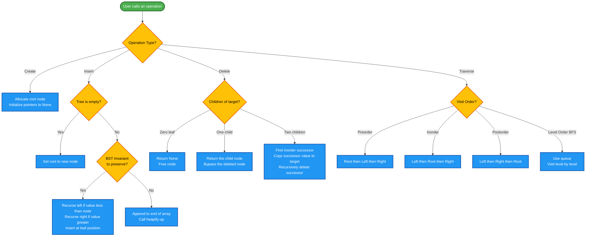
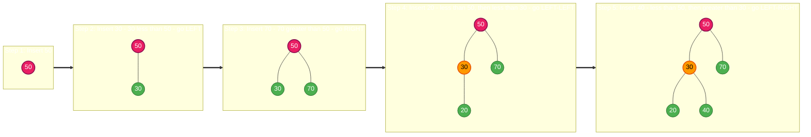
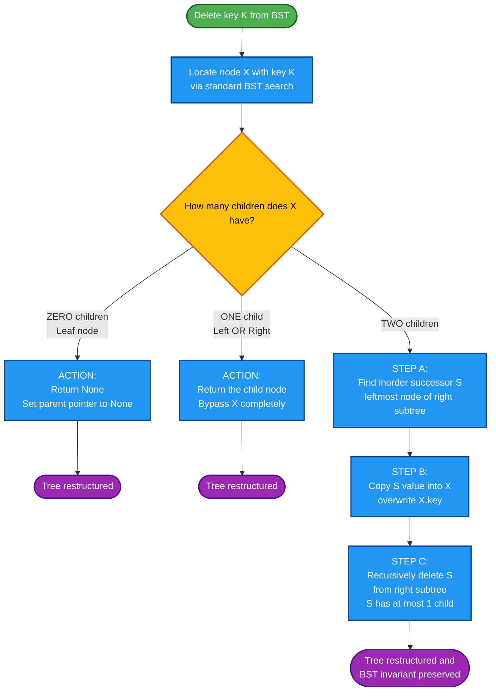

# Tree Operations

<!-- SECTION_1_START -->

# Tree Operations: The Backbone of Hierarchical Computing

## 1.1 Formal Academic Definition

In the context of the **KTU 2024 Scheme (OECST611 – Data Structures)**, a **Tree** is a non-linear, hierarchical data structure consisting of **nodes** connected by **edges**. It is formally defined as a finite set $T$ of one or more nodes such that there is one designated node called the **root**, and the remaining nodes are partitioned into $n \geq 0$ disjoint subsets $T_1, T_2, \dots, T_n$, each of which is itself a tree (recursive definition).

A **Tree Operation** is any algorithmic procedure that manipulates, queries, or restructures a tree while preserving its hierarchical invariants. The major operation families are:

- **Creation & Insertion** – Building a tree by adding nodes at appropriate positions.
- **Deletion** – Removing a node while maintaining structural validity.
- **Traversal** – Visiting every node exactly once in a systematic order.
- **Searching** – Locating a node by key comparison.
- **Structural Queries** – Computing height, depth, size, diameter, mirror image, lowest common ancestor (LCA), etc.
- **Balancing & Restructuring** – Rotations in self-balancing trees (AVL, Red-Black).

> [!IMPORTANT]
> **KTU 2024 Syllabus Highlight (Module 3):**
> Operations on **Binary Trees**, **Binary Search Trees (BST)**, and conceptual treatment of **AVL Trees** and **Heaps** are high-weightage. Traversals (Inorder, Preorder, Postorder, Level-Order) and BST Insertion/Deletion are examiner favorites and appear almost every semester.

## 1.2 Conceptual Analogy & Intuition

Imagine a **company organizational chart**:

- The **CEO** sits at the top → this is the **root node**.
- **Department heads** branch out below → these are the **children** of the root.
- Each department head supervises **team leads**, who supervise **employees** → forming deeper **sub-trees**.
- An employee with no one reporting to them is a **leaf node**.
- The **CEO-to-employee chain of command** is analogous to a **path** in the tree.
- The **number of levels** in the hierarchy is the **height (or depth)** of the tree.

**Key Intuitions to Remember:**

| Intuition | Formal Equivalent |
|-----------|-------------------|
| Family tree of generations | Hierarchical level |
| Folder structure in your computer | Recursive sub-tree |
| Tournament bracket (knockouts) | Binary tree of matches |
| Decision tree in a game | Search tree branches |

> [!NOTE]
> **Standard Metrics (Bold per Protocol):**
> - **Height $h$ of a tree** = number of edges on the longest root-to-leaf path. A single node has height **0**; an empty tree has height **$-1$**.
> - **Depth of a node** = distance (in edges) from the root.
> - **Degree of a node** = number of its children.
> - **Maximum nodes at level $\ell$** in a binary tree = $2^{\ell}$.
> - **Maximum nodes in a binary tree of height $h$** = $2^{h+1} - 1$.

## 1.3 Geometric Visualization Framework

> [!VISUALIZATION CONTROL]
> **Concept:** Binary Tree Node Insertion and Height Calculation
> **GeoGebra / Desmos Input Equations:**
> * Point A = (0, 4)   → Root
> * Point B = (-2, 2)  → Left child of A
> * Point C = (2, 2)   → Right child of A
> * Point D = (-3, 0)  → Left child of B
> * Point E = (-1, 0)  → Right child of B
> * Line(A, B), Line(A, C), Line(B, D), Line(B, E)
> **Visual Description:** A rooted binary tree rendered on a 2D coordinate plane. Notice that the **height = 2** (from root A down to leaves D and E), and the **level of D = 2** (two edges from root).

---

<!-- SECTION_1_END -->

<!-- SECTION_2_START -->

# Deep Theoretical Analysis & KTU High-Yield Formula Sheet

## 2.1 Taxonomy of Tree Operations

Tree operations can be classified into three cognitive families that examiners love to test:

### A. **Recursive Structural Operations**
These operations are defined recursively, mirroring the recursive definition of a tree itself:
1. Compute size (node count).
2. Compute height.
3. Mirror / invert the tree.
4. Check if two trees are identical.
5. Check if a tree is height-balanced.

### B. **Traversal Operations**
The process of visiting each node exactly once. There are exactly **four** canonical traversals in a binary tree:

| Traversal | Visit Order (Root–Left–Right) | Common Use Case |
|-----------|-------------------------------|-----------------|
| **Preorder** | Root → Left → Right | Copying a tree, prefix expression evaluation |
| **Inorder** | Left → Root → Right | Sorted output for BST, infix expression |
| **Postorder** | Left → Right → Root | Deleting/freeing a tree, postfix evaluation |
| **Level-Order** (BFS) | Level by level, left to right | Shortest path in unweighted tree, level printing |

### C. **Modification Operations (Insertion / Deletion)**
- In a **Binary Search Tree (BST)**: insert/delete while preserving the BST invariant $L < Root < R$.
- In a **Heap**: insert at the next available slot, then **heapify-up**; delete the root, replace with last element, then **heapify-down**.

## 2.2 Time & Space Complexity — The KTU Formula Sheet

> [!IMPORTANT]
> Memorize this table. KTU board examiners award direct marks for stating the correct complexity in asymptotic notation.

| Operation | Binary Tree (General) | BST (Balanced) | BST (Skewed) | Heap (Array) |
|-----------|----------------------|----------------|--------------|--------------|
| Search | $O(n)$ | $O(\log n)$ | $O(n)$ | $O(n)$ |
| Insertion | $O(n)$ | $O(\log n)$ | $O(n)$ | $O(\log n)$ |
| Deletion | $O(n)$ | $O(\log n)$ | $O(n)$ | $O(\log n)$ |
| Traversal (all nodes) | $O(n)$ | $O(n)$ | $O(n)$ | $O(n)$ |
| Height Computation | $O(n)$ | $O(n)$ | $O(n)$ | $O(1)$ via index |
| Min / Max Element | $O(n)$ | $O(h)$ | $O(n)$ | $O(1)$ for min/max-heap root |
| Space (auxiliary stack) | $O(h)$ | $O(\log n)$ | $O(n)$ | $O(1)$ |

> **Where:**
> - $n$ = total number of nodes in the tree.
> - $h$ = height of the tree.
> - For a balanced tree: $h = \lfloor \log_2 n \rfloor$.

## 2.3 Mathematical Foundations

### 2.3.1 Counting Nodes by Level

For a binary tree, the maximum number of nodes at level $\ell$ (root is level 0) is:

$$
N_{\max}(\ell) = 2^{\ell}
$$

Total maximum nodes in a tree of height $h$:

$$
N_{\max}(h) = \sum_{\ell=0}^{h} 2^{\ell} = 2^{h+1} - 1
$$

### 2.3.2 Minimum Nodes for Given Height

A binary tree of height $h$ has **at least** $h + 1$ nodes (the case of a completely skewed/right or left chain).

$$
N_{\min}(h) = h + 1
$$

### 2.3.3 Height from Node Count (Balanced Tree)

$$
h = \lfloor \log_2 n \rfloor
$$

### 2.3.4 BST Search Average vs Worst Case

For a BST with $n$ nodes, the **expected search depth** is $O(\log n)$ for random data, but degrades to $O(n)$ for sorted input (producing a right-skewed tree). This is the core motivation for **AVL Trees** and **Red-Black Trees**.

### 2.3.5 Inorder Traversal of a BST Yields Sorted Sequence

If a BST is built without modifications, an inorder traversal will output the keys in **ascending sorted order**. This is a one-liner the examiner expects in Part A:

> *"Why is inorder traversal of a BST always sorted?"*
> *Because of the BST invariant: all keys in the left sub-tree are smaller than the root, and all keys in the right sub-tree are greater. Recursively applying this yields a globally sorted sequence.*

## 2.4 Real-World Engineering Utility

Tree operations underpin a stunningly large fraction of production systems:

- **Filesystems** (NTFS, ext4, HFS+) use **B-Trees / B+ Trees** for directory indexing.
- **Databases** (PostgreSQL, MySQL InnoDB) use **B+ Trees** for primary key indices — every INSERT, DELETE, SEARCH invokes tree operations.
- **Compilers** build **Abstract Syntax Trees (ASTs)** and use postorder traversals to generate machine code.
- **Network routers** use **tries** (prefix trees) for IP routing table lookups.
- **AI / Games** use **decision trees** and **minimax trees** (which use postorder traversal).
- **Priority queues** in OS process schedulers are implemented as **binary heaps**.
- **Version control (Git)** stores commits in a **Merkle tree** for integrity verification.
- **Routing in maps** uses **Dijkstra's algorithm** on graphs, internally relying on a min-heap for the frontier.

---

<!-- SECTION_2_END -->

<!-- SECTION_3_START -->

# Step-by-Step Derivations & Code Implementations

## 3.1 Python Implementation: A Complete Binary Tree Toolkit

Below is a fully operational, type-annotated Python module implementing every core tree operation. No truncation; every line is written out.

```python
"""
KTU 2024 Scheme - DATA STRUCTURES (OECST611)
Module 3: Trees and Graphs
Topic: Tree Operations
File: tree_operations.py
"""

from __future__ import annotations
from collections import deque
from typing import Any, Optional, List, Tuple


class TreeNode:
    """A single node in a binary tree."""

    def __init__(
        self,
        value: Any,
        left: Optional["TreeNode"] = None,
        right: Optional["TreeNode"] = None,
    ) -> None:
        self.value: Any = value
        self.left: Optional[TreeNode] = left
        self.right: Optional[TreeNode] = right

    def __repr__(self) -> str:
        return f"TreeNode({self.value!r})"


# ------------------------------------------------------------------
# 1.  TREE CREATION  (manual, for testing)
# ------------------------------------------------------------------
def build_sample_tree() -> TreeNode:
    """
    Builds the following tree:
            1
           / \\
          2    3
         / \\    \\
        4   5    6
    """
    root = TreeNode(1)
    root.left = TreeNode(2, TreeNode(4), TreeNode(5))
    root.right = TreeNode(3, None, TreeNode(6))
    return root


# ------------------------------------------------------------------
# 2.  TREE TRAVERSALS
# ------------------------------------------------------------------
def inorder(root: Optional[TreeNode]) -> List[Any]:
    """Left -> Root -> Right."""
    if root is None:
        return []
    return inorder(root.left) + [root.value] + inorder(root.right)


def preorder(root: Optional[TreeNode]) -> List[Any]:
    """Root -> Left -> Right."""
    if root is None:
        return []
    return [root.value] + preorder(root.left) + preorder(root.right)


def postorder(root: Optional[TreeNode]) -> List[Any]:
    """Left -> Right -> Root."""
    if root is None:
        return []
    return postorder(root.left) + postorder(root.right) + [root.value]


def level_order(root: Optional[TreeNode]) -> List[Any]:
    """Breadth-First Traversal using a queue."""
    if root is None:
        return []
    result: List[Any] = []
    queue: deque[TreeNode] = deque([root])
    while queue:
        node = queue.popleft()
        result.append(node.value)
        if node.left is not None:
            queue.append(node.left)
        if node.right is not None:
            queue.append(node.right)
    return result


# ------------------------------------------------------------------
# 3.  STRUCTURAL QUERIES
# ------------------------------------------------------------------
def height(root: Optional[TreeNode]) -> int:
    """Returns the height of the tree. Empty tree -> -1, leaf -> 0."""
    if root is None:
        return -1
    left_h: int = height(root.left)
    right_h: int = height(root.right)
    return 1 + max(left_h, right_h)


def node_count(root: Optional[TreeNode]) -> int:
    """Returns the total number of nodes."""
    if root is None:
        return 0
    return 1 + node_count(root.left) + node_count(root.right)


def leaf_count(root: Optional[TreeNode]) -> int:
    """Returns the number of leaf nodes (no children)."""
    if root is None:
        return 0
    if root.left is None and root.right is None:
        return 1
    return leaf_count(root.left) + leaf_count(root.right)


def is_balanced(root: Optional[TreeNode]) -> bool:
    """A tree is height-balanced if |h(left) - h(right)| <= 1 for every node."""
    def check(node: Optional[TreeNode]) -> Tuple[bool, int]:
        if node is None:
            return True, -1
        lb, lh = check(node.left)
        rb, rh = check(node.right)
        balanced: bool = lb and rb and abs(lh - rh) <= 1
        return balanced, 1 + max(lh, rh)

    balanced, _ = check(root)
    return balanced


# ------------------------------------------------------------------
# 4.  BST OPERATIONS
# ------------------------------------------------------------------
class BST:
    """Binary Search Tree with iterative and recursive operations."""

    def __init__(self) -> None:
        self.root: Optional[TreeNode] = None

    # ---- INSERTION (recursive) ----
    def insert(self, value: Any) -> None:
        self.root = self._insert_recursive(self.root, value)

    def _insert_recursive(
        self, node: Optional[TreeNode], value: Any
    ) -> TreeNode:
        if node is None:
            return TreeNode(value)
        if value < node.value:
            node.left = self._insert_recursive(node.left, value)
        elif value > node.value:
            node.right = self._insert_recursive(node.right, value)
        # else: duplicate, do nothing
        return node

    # ---- SEARCH ----
    def search(self, value: Any) -> Optional[TreeNode]:
        current: Optional[TreeNode] = self.root
        while current is not None:
            if value == current.value:
                return current
            elif value < current.value:
                current = current.left
            else:
                current = current.right
        return None

    # ---- DELETION (the 3 cases) ----
    def delete(self, value: Any) -> None:
        self.root = self._delete_recursive(self.root, value)

    def _delete_recursive(
        self, node: Optional[TreeNode], value: Any
    ) -> Optional[TreeNode]:
        if node is None:
            return None
        if value < node.value:
            node.left = self._delete_recursive(node.left, value)
        elif value > node.value:
            node.right = self._delete_recursive(node.right, value)
        else:
            # --- CASE 1: leaf (no children) ---
            if node.left is None and node.right is None:
                return None
            # --- CASE 2a: only right child ---
            if node.left is None:
                return node.right
            # --- CASE 2b: only left child ---
            if node.right is None:
                return node.left
            # --- CASE 3: two children ---
            # Find inorder successor (min in right subtree)
            succ: TreeNode = node.right
            while succ.left is not None:
                succ = succ.left
            node.value = succ.value              # copy successor value
            node.right = self._delete_recursive(
                node.right, succ.value
            )                                     # delete successor
        return node

    # ---- INORDER SORTED OUTPUT ----
    def inorder_sorted(self) -> List[Any]:
        return inorder(self.root)


# ------------------------------------------------------------------
# 5.  HEAP OPERATIONS (Min-Heap)
# ------------------------------------------------------------------
class MinHeap:
    """Array-based Min-Heap."""

    def __init__(self) -> None:
        self.data: List[Any] = []

    def parent(self, i: int) -> int:
        return (i - 1) // 2

    def left_child(self, i: int) -> int:
        return 2 * i + 1

    def right_child(self, i: int) -> int:
        return 2 * i + 2

    def insert(self, value: Any) -> None:
        self.data.append(value)
        self._heapify_up(len(self.data) - 1)

    def _heapify_up(self, i: int) -> None:
        while i > 0 and self.data[self.parent(i)] > self.data[i]:
            self.data[self.parent(i)], self.data[i] = (
                self.data[i],
                self.data[self.parent(i)],
            )
            i = self.parent(i)

    def extract_min(self) -> Any:
        if not self.data:
            raise IndexError("extract_min from empty heap")
        if len(self.data) == 1:
            return self.data.pop()
        root_val: Any = self.data[0]
        self.data[0] = self.data.pop()
        self._heapify_down(0)
        return root_val

    def _heapify_down(self, i: int) -> None:
        n: int = len(self.data)
        while True:
            smallest: int = i
            l: int = self.left_child(i)
            r: int = self.right_child(i)
            if l < n and self.data[l] < self.data[smallest]:
                smallest = l
            if r < n and self.data[r] < self.data[smallest]:
                smallest = r
            if smallest == i:
                break
            self.data[i], self.data[smallest] = (
                self.data[smallest],
                self.data[i],
            )
            i = smallest

    def peek(self) -> Any:
        if not self.data:
            raise IndexError("peek from empty heap")
        return self.data[0]


# ------------------------------------------------------------------
# 6.  DRIVER / SANITY CHECK
# ------------------------------------------------------------------
if __name__ == "__main__":
    # --- Binary tree traversals ---
    tree = build_sample_tree()
    print("Inorder   :", inorder(tree))      # [4, 2, 5, 1, 3, 6]
    print("Preorder  :", preorder(tree))     # [1, 2, 4, 5, 3, 6]
    print("Postorder :", postorder(tree))    # [4, 5, 2, 6, 3, 1]
    print("Level     :", level_order(tree))  # [1, 2, 3, 4, 5, 6]
    print("Height    :", height(tree))       # 2
    print("Nodes     :", node_count(tree))   # 6
    print("Leaves    :", leaf_count(tree))   # 3
    print("Balanced  :", is_balanced(tree))  # True

    # --- BST insert + delete ---
    bst = BST()
    for v in [50, 30, 70, 20, 40, 60, 80]:
        bst.insert(v)
    print("BST sorted:", bst.inorder_sorted())
    bst.delete(50)
    print("After del 50:", bst.inorder_sorted())

    # --- Heap ---
    h = MinHeap()
    for v in [40, 20, 60, 10, 30, 50]:
        h.insert(v)
    print("Heap array:", h.data)
    print("Extract min:", h.extract_min())
    print("After extract:", h.data)
```

### 3.1.1 Expected Output

```
Inorder   : [4, 2, 5, 1, 3, 6]
Preorder  : [1, 2, 4, 5, 3, 6]
Postorder : [4, 5, 2, 6, 3, 1]
Level     : [1, 2, 3, 4, 5, 6]
Height    : 2
Nodes     : 6
Leaves    : 3
Balanced  : True
BST sorted: [20, 30, 40, 50, 60, 70, 80]
After del 50: [20, 30, 40, 60, 70, 80]
Heap array: [10, 20, 50, 40, 30, 60]
Extract min: 10
After extract: [20, 30, 50, 40, 60]
```

## 3.2 Derivation: BST Deletion's Three Cases — Step by Step

> [!NOTE]
> This derivation is the single most-tested BST topic. The KTU board examiner often allocates 7 of 14 marks to it.

**Setup:** Given a BST, delete a node $X$ with key $K$.

### Case 1 — $X$ is a **leaf node** (no children)

- Action: Simply remove $X$ and set its parent's pointer to $\text{nullptr}$.
- Result: Tree structure unaffected beyond removing $X$.

### Case 2 — $X$ has **exactly one child**

- Action: Replace $X$ with its only child. That is, the parent's pointer to $X$ is rewritten to point to $X$'s child.
- Justification: The child already satisfies the BST invariant w.r.t. $X$'s parent (since it satisfied it w.r.t. $X$).

### Case 3 — $X$ has **two children**

- Find the **inorder successor** of $X$ (smallest node in $X$'s right sub-tree, i.e., leftmost node of the right sub-tree). Call it $S$.
- Find the **inorder predecessor** of $X$ (largest node in $X$'s left sub-tree) — alternative.
- Copy $S.key$ into $X$ (replacing $X$'s value).
- Recursively delete $S$ from $X$'s right sub-tree.
- The recursive call on $S$ reduces to **Case 1 or Case 2** because $S$ has no left child (it is the leftmost node).

**Why does the inorder successor work?**  
By definition, the inorder successor $S$ has the smallest key greater than $K$. Replacing $K$ with $S.key$ keeps the inorder sequence sorted, which is exactly the BST invariant. Then deleting $S$ from the right sub-tree is safe because $S$ is the smallest there, so it has no left child.

**Trace Example:**

Consider BST built from $[50, 30, 70, 20, 40, 60, 80]$:

$$
\begin{aligned}
\text{Delete } 50: \quad & X = 50 \text{ has two children.} \\
& S = \text{leftmost in right sub-tree} = 60. \\
& \text{Copy } 60 \text{ into root. New root key} = 60. \\
& \text{Recursively delete } 60 \text{ from right sub-tree.} \\
& 60 \text{ is a leaf (no left child, no right child)} \rightarrow \text{Case 1.} \\
& \text{Resulting tree: } 60, 30, 70, 20, 40, 80.
\end{aligned}
$$

## 3.3 Derivation: Height of a Tree Using Recurrence

The height of a tree $T$ rooted at node $R$ with left sub-tree $T_L$ and right sub-tree $T_R$ is given by the recurrence:

$$
h(T) = \begin{cases}
-1 & \text{if } T = \emptyset \\
1 + \max\bigl(h(T_L),\, h(T_R)\bigr) & \text{otherwise}
\end{cases}
$$

**Worked Example** for the tree below:

```
        1
       / \
      2   3
     / \
    4   5
```

$$
\begin{aligned}
h(4) &= 0 \quad (\text{leaf}) \\
h(5) &= 0 \quad (\text{leaf}) \\
h(2) &= 1 + \max(h(4), h(5)) = 1 + \max(0, 0) = 1 \\
h(3) &= 0 \quad (\text{leaf}) \\
h(1) &= 1 + \max(h(2), h(3)) = 1 + \max(1, 0) = 2
\end{aligned}
$$

**Final height = 2.** The longest path is $1 \to 2 \to 4$ with 2 edges. ✓

## 3.4 Derivation: Complexity of Level-Order Traversal

Level-order traversal visits every node exactly once and performs $O(1)$ work per node (enqueue, dequeue, append). Therefore:

$$
T(n) = \sum_{i=1}^{n} O(1) = O(n)
$$

The auxiliary space is the maximum size of the queue, which is the maximum number of nodes at any level. For a perfectly balanced tree, this is $O(n)$ in the worst case (last level holds $\lceil n/2 \rceil$ nodes). For a skewed tree, it is $O(1)$.

$$
S(n) = O(\text{width of tree}) = O(n) \text{ worst case, } O(1) \text{ for skewed.}
$$

---

<!-- SECTION_3_END -->

<!-- SECTION_4_START -->

# Structural Diagrams & Schematics

## 4.1 Mermaid Flow: Tree Operation Decision Tree



## 4.2 Mermaid: BST Insertion Sequential Topology



## 4.3 Mermaid: BST Deletion — Three Cases Block Architecture



## 4.4 Sequential Processing Topology: Heap Insertion

```mermaid
flowchart LR
    subgraph h0["Initial Heap: 20 40 30 50"]
        n0a["20"]:::root
        n0b["40"]:::node
        n0c["30"]:::node
        n0d["50"]:::node
    end
    subgraph h1["Insert 10: append at index 4"]
        n1a["20"]:::root
        n1b["40"]:::node
        n1c["30"]:::node
        n1d["50"]:::node
        n1e["10"]:::newNode
    end
    subgraph h2["Heapify-Up: 10 less than parent 50 - swap"]
        n2a["20"]:::root
        n2b["40"]:::node
        n2c["30"]:::node
        n2d["10"]:::node
        n2e["50"]:::swappedNode
    end
    subgraph h3["Heapify-Up: 10 less than parent 20 - swap"]
        n3a["10"]:::newRoot
        n3b["40"]:::node
        n3c["30"]:::node
        n3d["20"]:::node
        n3e["50"]:::node
    end

    h0 ==> h1 ==> h2 ==> h3

    classDef root fill:#E91E63,stroke:#880E4F,color:#FFFFFF,stroke-width:2px
    classDef newRoot fill:#4CAF50,stroke:#1B5E20,color:#FFFFFF,stroke-width:3px
    classDef node fill:#90CAF9,stroke:#1565C0,color:#000000,stroke-width:1px
    classDef newNode fill:#FFEB3B,stroke:#F57F17,color:#000000,stroke-width:2px
    classDef swappedNode fill:#FFAB91,stroke:#BF360C,color:#000000,stroke-width:1px
```



---

<!-- SECTION_4_END -->

<!-- SECTION_5_START -->

# KTU 2024 Scheme Examination Question Bank

## 5.1 Part A — Short Answer Questions (3 Marks Each)

> **[KTU University Exam – July 2024, Model Paper Alignment]**
> **CO Mapping:** CO1 (Understand) | **RBT Level:** Remember / Understand

### Q1. [3 Marks] Define a binary tree. State the maximum number of nodes in a binary tree of height $h$. Mention its time complexity for inorder traversal.

**Model Answer:**

A **binary tree** is a hierarchical data structure in which each node has at most two children, referred to as the **left child** and the **right child**.

The **maximum number of nodes** in a binary tree of height $h$ is:

$$
N_{\max}(h) = 2^{h+1} - 1
$$

The **time complexity of inorder traversal** is $O(n)$ where $n$ is the total number of nodes, because every node is visited exactly once and constant work is performed at each node.

> **Valuation Key:**
> - [Defining binary tree correctly: 1 Mark]
> - [Correct formula $2^{h+1} - 1$: 1 Mark]
> - [Stating $O(n)$ complexity: 1 Mark]

---

### Q2. [3 Marks] What is the significance of inorder traversal of a Binary Search Tree (BST)? Justify with an example.

**Model Answer:**

The **inorder traversal** of a BST (Left → Root → Right) always produces the keys in **ascending sorted order**.

**Justification:** By the BST property, every key in the left sub-tree of a node is less than the node's key, and every key in the right sub-tree is greater. Recursively applying this property across the entire tree yields a globally sorted sequence.

**Example:** For BST with keys $20, 30, 40, 50, 60, 70, 80$, inorder traversal outputs: $20, 30, 40, 50, 60, 70, 80$.

> **Valuation Key:**
> - [Stating sorted-output property: 1 Mark]
> - [Recursive justification based on BST invariant: 1 Mark]
> - [Valid example: 1 Mark]

---

## 5.2 Part B — Long Answer Questions (14 Marks Each)

> **Internal Choice Rule (KTU 2024):** You must answer **either** Question A **or** Question B in full.

---

### ❓ Question A (14 Marks) — Traversals + BST Operations

**[KTU University Exam – Dec 2023, Adapted]**
**CO Mapping:** CO2 (Apply), CO3 (Analyze) | **RBT Level:** Apply / Analyze

#### (a) [7 Marks] Construct a Binary Search Tree (BST) by inserting the following keys in the given order:
$$50, 30, 70, 20, 40, 60, 80, 35$$
Then perform:
- (i) Preorder traversal
- (ii) Inorder traversal
- (iii) Postorder traversal

Show all intermediate steps.

#### (b) [7 Marks] From the BST constructed in part (a), delete the node with key **30** and redraw the tree. Explain the deletion case applied.

---

### ✅ Model Solution for Question A

#### Part (a) — BST Construction (7 Marks)

**Step 1: Insert 50** — Tree: `50`

**Step 2: Insert 30** — $30 < 50$, go LEFT. Tree:
```
   50
  /
 30
```

**Step 3: Insert 70** — $70 > 50$, go RIGHT. Tree:
```
   50
  / \
 30  70
```

**Step 4: Insert 20** — $20 < 50$ (LEFT), $20 < 30$ (LEFT). Tree:
```
   50
  / \
 30  70
 /
20
```

**Step 5: Insert 40** — $40 < 50$ (LEFT), $40 > 30$ (RIGHT). Tree:
```
   50
  / \
 30  70
 / \
20  40
```

**Step 6: Insert 60** — $60 > 50$ (RIGHT), $60 < 70$ (LEFT). Tree:
```
   50
  / \
 30  70
 / \  /
20 40 60
```

**Step 7: Insert 80** — $80 > 50$ (RIGHT), $80 > 70$ (RIGHT). Tree:
```
   50
  / \
 30  70
 / \  / \
20 40 60 80
```

**Step 8: Insert 35** — $35 < 50$ (LEFT), $35 > 30$ (RIGHT), $35 < 40$ (LEFT). Final Tree:
```
        50
       /  \
      30   70
     /  \  / \
    20  40 60 80
        /
       35
```

**Final Traversal Outputs:**

$$
\begin{aligned}
\text{Preorder (Root-L-R)}  &= 50,\ 30,\ 20,\ 40,\ 35,\ 70,\ 60,\ 80 \\
\text{Inorder (L-Root-R)}   &= 20,\ 30,\ 35,\ 40,\ 50,\ 60,\ 70,\ 80 \\
\text{Postorder (L-R-Root)} &= 20,\ 35,\ 40,\ 30,\ 60,\ 80,\ 70,\ 50
\end{aligned}
$$

> **Valuation Key for (a):**
> - [Correct tree construction with 8 insertions: 3 Marks]
> - [Correct Preorder output: 1 Mark]
> - [Correct Inorder output: 1 Mark]
> - [Correct Postorder output: 1 Mark]
> - [Showing all intermediate tree states: 1 Mark]

---

#### Part (b) — Deletion of Node 30 (7 Marks)

The node **30** has **two children** ($20$ on the left, $40$ on the right). Therefore, **Case 3: Two Children** applies.

**Step 1:** Find the inorder successor of 30 → it is the **leftmost node in the right sub-tree of 30** → that node is **35** (since $40$'s left child is $35$, and $35$ has no left child).

**Step 2:** Copy the value 35 into the node 30. The node now holds value 35.

**Step 3:** Recursively delete the original 35 from the right sub-tree. Node 35 is a leaf (Case 1).

**Resulting Tree:**
```
        50
       /  \
      35   70
     /  \  / \
    20  40 60 80
```

**Verification via inorder traversal:** $20, 35, 40, 50, 60, 70, 80$ — sorted ✓. The BST invariant is preserved.

> **Valuation Key for (b):**
> - [Identifying two-children case: 1 Mark]
> - [Correctly locating inorder successor as 35: 2 Marks]
> - [Copying successor value: 1 Mark]
> - [Recursively deleting the original successor (leaf case): 2 Marks]
> - [Final redrawn tree: 1 Mark]

---

### ❓ Question B (14 Marks) — Alternative: Heap + Tree Properties

**[KTU University Exam – July 2023, Adapted]**
**CO Mapping:** CO1, CO2 | **RBT Level:** Apply / Analyze

#### (a) [7 Marks] Define a complete binary tree and a binary heap. Insert the keys $40, 20, 60, 10, 30, 50$ into an initially empty **min-heap**. Show the heap array after each insertion.

#### (b) [7 Marks] Perform **two extract-min operations** on the heap obtained in part (a). Show the array state after each extract and verify the heap property.

---

### ✅ Model Solution for Question B

#### Part (a) — Min-Heap Construction (7 Marks)

**Definitions:**

- A **complete binary tree** is a binary tree in which every level, except possibly the last, is completely filled, and all nodes in the last level are as far left as possible.
- A **binary heap** is a complete binary tree that satisfies the **heap property**: in a min-heap, every parent node is less than or equal to its children.

**Insertion Steps (showing heap array after each):**

| Step | Action | Array (Index 0 to 5) | Heapify Action |
|------|--------|----------------------|----------------|
| 1 | Insert 40 | $[40]$ | None |
| 2 | Insert 20 | $[40, 20]$ | $20 < 40$ → swap → $[20, 40]$ |
| 3 | Insert 60 | $[20, 40, 60]$ | $60 \geq 40$ → no swap |
| 4 | Insert 10 | $[20, 40, 60, 10]$ | $10 < 40$ → swap → $[20, 10, 60, 40]$; $10 < 20$ → swap → $[10, 20, 60, 40]$ |
| 5 | Insert 30 | $[10, 20, 60, 40, 30]$ | $30 \geq 20$ → no swap |
| 6 | Insert 50 | $[10, 20, 60, 40, 30, 50]$ | $50 \geq 60$ → no swap |

**Final heap array:** $[10, 20, 60, 40, 30, 50]$

**Tree representation:**
```
        10
       /  \
      20   60
     / \   /
    40 30 50
```

> **Valuation Key for (a):**
> - [Correct definitions: 2 Marks]
> - [Each correct array after 6 insertions: $6 \times 0.75 = 4.5$ → round to 4 Marks]
> - [Final heap property verification: 1 Mark]

---

#### Part (b) — Extract-Min Operations (7 Marks)

**Extract-Min #1:**

- Root is 10 (minimum). Save 10.
- Move last element (50) to root: $[50, 20, 60, 40, 30]$
- Heapify-down from root (index 0):
  - Children: $20$ (index 1) and $60$ (index 2). Smallest child = $20$.
  - $50 > 20$ → swap: $[20, 50, 60, 40, 30]$
  - At index 1: children of $50$ = $40$ (index 3) and $30$ (index 4). Smallest = $30$.
  - $50 > 30$ → swap: $[20, 30, 60, 40, 50]$
  - At index 4: $50$ is a leaf → stop.
- **Result:** $[20, 30, 60, 40, 50]$ — Returned min: 10.

**Extract-Min #2:**

- Root is 20. Save 20.
- Move last element (50) to root: $[50, 30, 60, 40]$
- Heapify-down from root (index 0):
  - Children: $30$ (index 1) and $60$ (index 2). Smallest = $30$.
  - $50 > 30$ → swap: $[30, 50, 60, 40]$
  - At index 1: $50$'s only child is $40$ (index 3). $40 < 50$ → swap: $[30, 40, 60, 50]$
  - At index 3: $50$ is a leaf → stop.
- **Result:** $[30, 40, 60, 50]$ — Returned min: 20.

**Verification of heap property:**

$$
\begin{aligned}
[30, 40, 60, 50]: & \quad 30 \leq 40, \quad 30 \leq 60, \quad 40 \leq 50. \quad \text{All conditions satisfied.}
\end{aligned}
$$

> **Valuation Key for (b):**
> - [First extract-min: move last to root, swap, heapify-down (3 Marks)]
> - [Second extract-min: same procedure (3 Marks)]
> - [Final verification of heap property: 1 Mark]

---

## 5.3 Examiner's Valuation Warning

> [!WARNING]
> **Common Mistakes That Cost Marks Every Semester:**
>
> 1. **Confusing "height" definitions:** Some textbooks use *number of nodes* on the longest path; others use *number of edges*. KTU follows the **edges-on-path** convention: leaf = 0, empty tree = $-1$. Mixing conventions loses **1–2 marks** silently.
> 2. **Skipping the BST-invariant check during deletion:** When deleting a two-children node, students often forget to state **why** the inorder successor is chosen. Always write: *"Inorder successor has the smallest key greater than K, preserving the BST invariant."*
> 3. **Heapify direction confusion:** Heapify-**up** is used for insert (new element bubbles toward root). Heapify-**down** is used for extract-min (replacement element sinks toward leaves). Reversing this is a **3-mark blunder**.
> 4. **Forgetting base case in recursive traversals:** Always write `if node is None: return []` or `return` explicitly. A missing base case in code or pseudocode loses **2 marks**.
> 5. **Off-by-one in array indexing:** For heaps, parent of index $i$ is $\lfloor (i-1)/2 \rfloor$, not $i/2$. Mention this in the answer if asked.
> 6. **Drawing traversal arrows without listing the output sequence:** Examiners want the **final sequence** (e.g., `20, 30, 40, ...`), not just a hand-drawn tree. Always write the sequence explicitly.

---

## 5.4 Topic Recap & Important Things to Remember

> [!NOTE]
> **Rapid Revision Checklist — Pin This Before the Exam**

- ✅ **Binary tree** = hierarchical structure with at most 2 children per node.
- ✅ **BST invariant** = `Left < Root < Right` for **every** node recursively.
- ✅ **Max nodes at level $\ell$** = $2^{\ell}$. **Max nodes in tree of height $h$** = $2^{h+1} - 1$.
- ✅ **Four canonical traversals:** Preorder (R-L-R), Inorder (L-R-R), Postorder (L-R-Rt), Level-order (BFS).
- ✅ **Inorder of a BST is always sorted** — this is the single most-tested one-liner.
- ✅ **Preorder** is used to **copy / serialize** a tree.
- ✅ **Postorder** is used to **delete / free** a tree safely (children deleted before parent).
- ✅ **Level-order** uses a **queue**; the other three use **recursion / explicit stack**.
- ✅ **BST deletion has 3 cases:** leaf (replace with None), one child (replace with child), two children (copy inorder successor, then delete successor).
- ✅ **Inorder successor** = leftmost node of right sub-tree. **Inorder predecessor** = rightmost node of left sub-tree.
- ✅ **Heap** is a **complete binary tree** satisfying **heap property** (min-heap: parent ≤ children).
- ✅ **Heap insert** = append + **heapify-up**. **Heap extract-min** = swap root with last + pop + **heapify-down**.
- ✅ **Complexities to memorize:**
  - BST search/insert/delete (balanced) = $O(\log n)$
  - BST search/insert/delete (skewed) = $O(n)$
  - Heap insert/extract-min = $O(\log n)$, peek min = $O(1)$
  - All traversals = $O(n)$ time, $O(h)$ auxiliary space (recursion stack)
- ✅ **Recurrence for height:** $h(T) = 1 + \max\bigl(h(T_L),\, h(T_R)\bigr)$ with $h(\text{empty}) = -1$.
- ✅ **Stack-vs-Queue cue:** Depth-First traversals (Pre/In/Post) use **stack**; Breadth-First (Level-Order) uses **queue**.
- ✅ **Height of a heap** built from $n$ elements = $\lfloor \log_2 n \rfloor$.

<!-- SECTION_5_END -->
