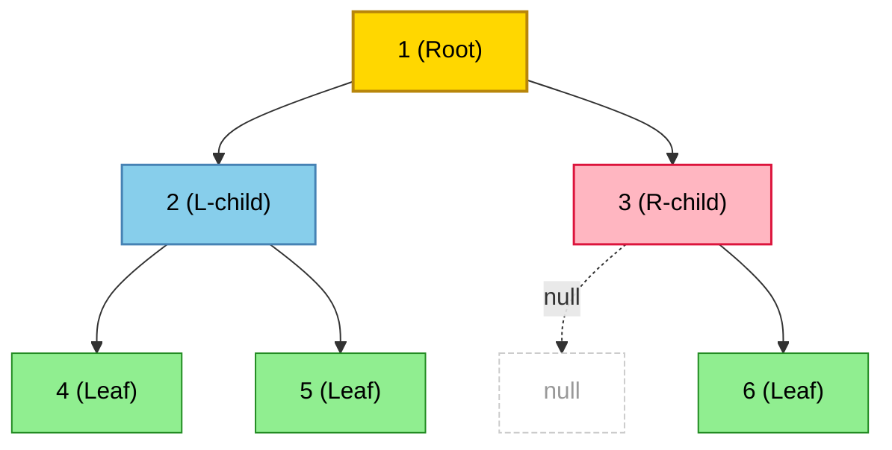
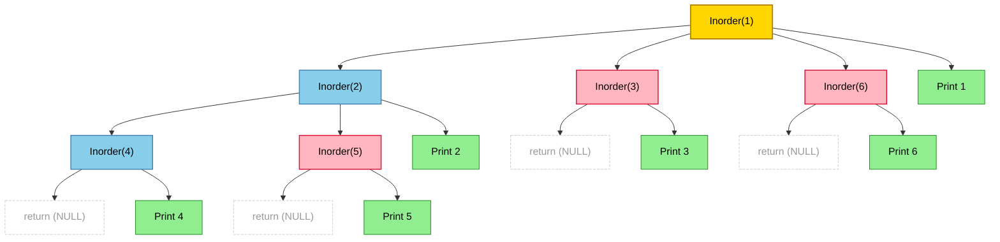
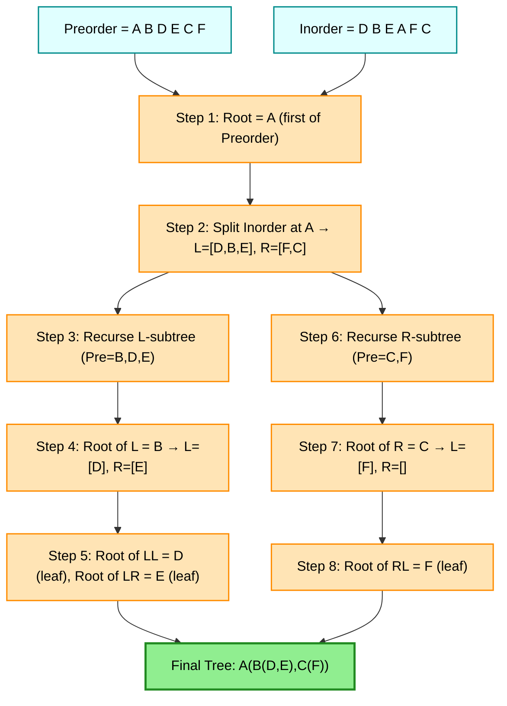
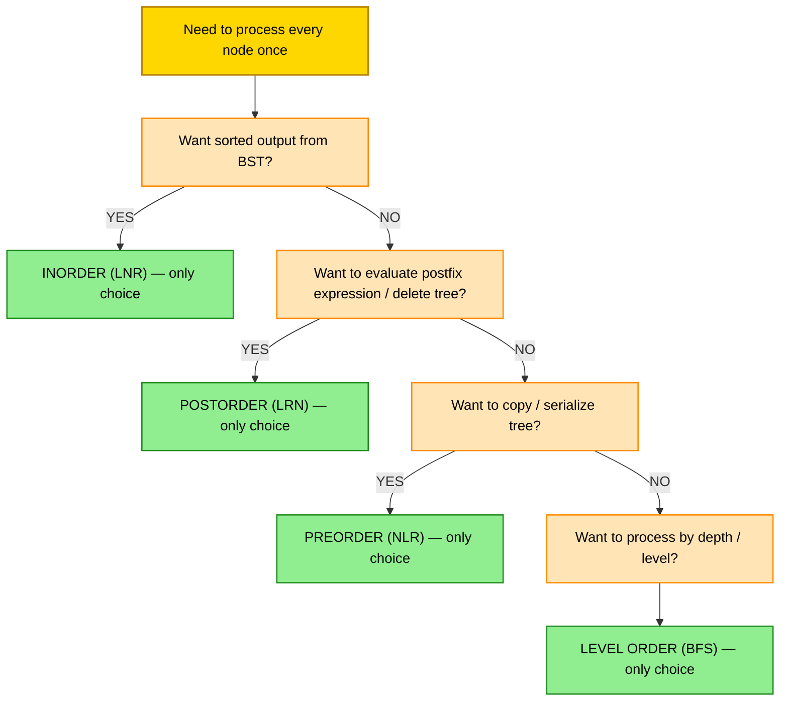

# Tree Traversals

<!-- SECTION_1_START -->
# Tree Traversals — Core Definition & Intuitive Overview

## 1.1 Formal Definition (KTU 2024 Scheme Terminology)

> [!NOTE]
> **Tree Traversal** is the systematic process of visiting every node of a tree data structure **exactly once** in a specific defined order, performing an operation (such as display, evaluation, or update) at each visited node.

For a **Binary Tree** (the primary focus of KTU Module 3), four canonical traversal orders are defined by the **relative position of the Root (N)** with respect to the recursive visits to the **Left (L)** and **Right (R)** subtrees.

| Traversal | Visit Order | Standard Acronym |
| :--- | :--- | :--- |
| **Preorder** | Root $\rightarrow$ Left $\rightarrow$ Right | **NLR** |
| **Inorder** | Left $\rightarrow$ Root $\rightarrow$ Right | **LNR** |
| **Postorder** | Left $\rightarrow$ Right $\rightarrow$ Root | **LRN** |
| **Level Order** | Level-by-level, left-to-right (Breadth-First) | **BFS** |

## 1.2 Intuitive Analogy — The "Family Photo" Mental Model

Imagine a **family tree** where every person has at most two children (left and right).

* **Preorder (NLR)** is like a **politician giving a speech at a town hall**: he first addresses the audience at the current podium (Root), then walks to the **left wing** of the hall, and only then proceeds to the **right wing**.
* **Inorder (LNR)** is like a **librarian cataloguing books on a shelf**: he first catalogues the books on the **left side**, then the book at the **center (Root)**, and finally the **right side**.
* **Postorder (LRN)** is like a **government officer clearing files**: he first inspects sub-files of the **left branch**, then sub-files of the **right branch**, and only at the end does he **sign off the current main file (Root)**.
* **Level Order** is like a **building evacuation drill**: every person on **Floor 1** exits first, then everyone on **Floor 2**, then **Floor 3**, and so on.

## 1.3 The Reference Tree (Used Throughout These Notes)

> [!IMPORTANT]
> To make derivations concrete, all examples in this document use the following **canonical binary tree**. Memorize this tree — it is the most frequently reused example in KTU university exams.

$$
T = \{\,1,\,2,\,3,\,4,\,5,\,6\,\}
$$

The tree structure is:

* Node **1** is the root.
* Node **1** has left child **2** and right child **3**.
* Node **2** has left child **4** and right child **5**.
* Node **3** has right child **6** (and no left child).

## 1.4 Pre-computed Traversal Output (For Quick Reference)

$$
\text{Preorder}(T) \;=\; 1,\,2,\,4,\,5,\,3,\,6
$$

$$
\text{Inorder}(T) \;=\; 4,\,2,\,5,\,1,\,3,\,6
$$

$$
\text{Postorder}(T) \;=\; 4,\,5,\,2,\,6,\,3,\,1
$$

$$
\text{Level Order}(T) \;=\; 1,\,2,\,3,\,4,\,5,\,6
$$

> [!VISUALIZATION CONTROL]
> **Concept:** Recursive tree-traversal call-stack expansion for the canonical reference tree.
> **Desmos / GeoGebra Input:** Plot the tree as a top-down hierarchy with $x$-axis representing subtree side and $y$-axis representing recursion depth. Mark each node with its visit-time stamp under each traversal scheme.
> **Visual Description:** Observe how the **NLR** stamp starts from the apex and zig-zags outward, the **LNR** stamp sweeps diagonally from bottom-left to top to bottom-right, and the **LRN** stamp accumulates from the leaves upward — a perfect visualization of the bottom-up nature of postorder.

<!-- SECTION_1_END -->

<!-- SECTION_2_START -->
# Deep Theoretical Analysis & KTU High-Yield Formula Sheet

## 2.1 Algorithmic Structure of the Three DFS Traversals

All three depth-first traversals share a **common recursive skeleton**. The only difference is the **position of the `visit(root)` statement**.

### 2.1.1 Preorder Traversal (NLR)

* **Step 1:** Visit the **Root** node and record its value.
* **Step 2:** Recursively traverse the **Left** subtree using Preorder.
* **Step 3:** Recursively traverse the **Right** subtree using Preorder.
* **Base Case:** If the current node is `NULL`, return immediately.
* **Why it works:** The root is processed **before** any of its descendants, making Preorder a *top-down* traversal — ideal for **copying a tree** or **serializing tree structure**.

### 2.1.2 Inorder Traversal (LNR)

* **Step 1:** Recursively traverse the **Left** subtree.
* **Step 2:** Visit the **Root** node.
* **Step 3:** Recursively traverse the **Right** subtree.
* **Special Property:** For a **Binary Search Tree (BST)**, Inorder traversal yields the nodes in **strictly ascending sorted order**. This is a high-yield KTU fact.
* **Why it works:** Inorder gives the *mathematical ordering* of a binary tree — it corresponds to the **leftmost-to-rightmost** reading of the tree.

### 2.1.3 Postorder Traversal (LRN)

* **Step 1:** Recursively traverse the **Left** subtree.
* **Step 2:** Recursively traverse the **Right** subtree.
* **Step 3:** Visit the **Root** node.
* **Why it works:** The root is processed **only after** both its subtrees are fully processed. This *bottom-up* nature makes Postorder ideal for **deletion** (children freed before parent) and **expression-tree evaluation**.

### 2.1.4 Level Order Traversal (BFS)

* **Step 1:** Enqueue the **root** into a `Queue` data structure.
* **Step 2:** Dequeue a node, **visit** it, and enqueue its **left child** (if not null) and **right child** (if not null).
* **Step 3:** Repeat Step 2 until the queue is empty.
* **Why it works:** A queue enforces **FIFO** discipline, ensuring that nodes at depth $d$ are visited before any node at depth $d+1$.

## 2.2 KTU High-Yield Formula & Complexity Cheat Sheet

> [!IMPORTANT]
> The following table contains every constant, formula, and boundary condition you need to answer a tree-traversal question in a KTU examination. Memorize it.

| Parameter | Symbol / Formula | Typical Value | Engineering Utility |
| :--- | :--- | :--- | :--- |
| Total nodes in a full binary tree of height $h$ | $n = 2^{h+1} - 1$ | $h=3 \Rightarrow n=15$ | Used to compute traversal output length |
| Height of a full binary tree with $n$ nodes | $h = \lfloor \log_2(n+1) \rfloor - 1$ | $n=15 \Rightarrow h=3$ | Determines recursion depth |
| Time complexity (all 4 traversals) | $T(n) = 2\,T(n/2) + O(1)$ | $\Rightarrow \mathbf{O(n)}$ | Each node visited exactly once |
| Space complexity (recursive DFS) | $S = O(h)$ | Worst case $O(n)$ | Stack frames for recursion |
| Space complexity (Level Order) | $S = O(w)$ | $w$ = max width | Queue storage at deepest level |
| Nodes in a level | $L_k = 2^{k}$ for $k \in [0,\,h]$ | $L_0=1,\,L_1=2,\ldots$ | Used to verify BFS output |
| BST Inorder property | $\text{Inorder}(BST) = \text{Sorted Order}$ | Always ascending | Most-tested KTU property |
| Tree construction uniqueness | Preorder + Inorder $\Rightarrow$ Unique Tree | Always | Most-tested KTU construction |
| Tree construction uniqueness | Postorder + Inorder $\Rightarrow$ Unique Tree | Always | Alternative construction |
| Tree construction uniqueness | Preorder + Postorder $\Rightarrow$ Not Unique | Counter-example exists | Common KTU pitfall |

## 2.3 Construction of a Binary Tree from Traversal Pairs

> [!WARNING]
> A binary tree **cannot** be uniquely reconstructed from a **single** traversal. You need **two traversals** — and one of them **must be Inorder**. The pair (Preorder, Inorder) or (Postorder, Inorder) is sufficient and unique. The pair (Preorder, Postorder) is **NOT** sufficient and is a classic KTU trap.

**General Algorithm (using Preorder + Inorder):**

* **Step 1:** The **first element of Preorder** is the **Root** of the (sub)tree.
* **Step 2:** Locate this root in the **Inorder** sequence. Everything to its **left** in Inorder forms the **left subtree**; everything to its **right** forms the **right subtree**.
* **Step 3:** Recursively apply Steps 1–2 to the left subtree, then to the right subtree, using the corresponding slices of Preorder and Inorder.

## 2.4 Real-World Engineering Applications

* **Compiler Design:** Inorder traversal of an *expression tree* yields **infix notation**; Preorder yields **prefix (Polish) notation**; Postorder yields **postfix (Reverse Polish) notation** used by the JVM and Forth-style virtual machines.
* **Database Indexing:** B-tree and B+tree indexes (used in MySQL InnoDB) are traversed in Inorder to produce sorted result sets efficiently.
* **File Systems:** The `du` (disk usage) command in Linux uses **Postorder** traversal — a directory's size is computed only after all its children are summed.
* **HTML/XML DOM:** The browser DOM engine uses tree traversal to render nodes in the correct visual order.
* **AI Game Trees:** The **minimax** algorithm in chess engines uses Postorder-like DFS to propagate evaluation scores from leaves to root.
* **Garbage Collection:** Mark-and-sweep GC traverses object-reference graphs in BFS/DFS fashion to identify unreachable objects.

<!-- SECTION_2_END -->

<!-- SECTION_3_START -->
# Step-by-Step Derivations, Recursive Tracing & Code Implementation

## 3.1 Exhaustive Tracing of All Four Traversals on the Reference Tree

We use the canonical tree:

$$
\text{Tree } T \text{ with root } = 1,\; L(1) = 2,\; R(1) = 3,\; L(2) = 4,\; R(2) = 5,\; R(3) = 6
$$

### 3.1.1 Tracing Preorder (NLR) — Call Tree Expansion

$$
\begin{aligned}
\text{Preorder}(1) &\rightarrow \text{print } 1 \\
&\rightarrow \text{Preorder}(2) \rightarrow \text{print } 2 \\
&\qquad\rightarrow \text{Preorder}(4) \rightarrow \text{print } 4 \quad [\text{base case hit, return}] \\
&\qquad\rightarrow \text{Preorder}(5) \rightarrow \text{print } 5 \quad [\text{base case hit, return}] \\
&\rightarrow \text{Preorder}(3) \rightarrow \text{print } 3 \\
&\qquad\rightarrow \text{Preorder}(\text{null}) \rightarrow \text{return} \\
&\qquad\rightarrow \text{Preorder}(6) \rightarrow \text{print } 6 \quad [\text{base case hit, return}]
\end{aligned}
$$

**Final Preorder output:** $\;1,\,2,\,4,\,5,\,3,\,6$

### 3.1.2 Tracing Inorder (LNR) — Call Tree Expansion

$$
\begin{aligned}
\text{Inorder}(1) &\rightarrow \text{Inorder}(2) \\
&\qquad\rightarrow \text{Inorder}(4) \rightarrow \text{print } 4 \\
&\qquad\rightarrow \text{print } 2 \\
&\qquad\rightarrow \text{Inorder}(5) \rightarrow \text{print } 5 \\
&\rightarrow \text{print } 1 \\
&\rightarrow \text{Inorder}(3) \\
&\qquad\rightarrow \text{Inorder}(\text{null}) \rightarrow \text{return} \\
&\qquad\rightarrow \text{print } 3 \\
&\qquad\rightarrow \text{Inorder}(6) \rightarrow \text{print } 6
\end{aligned}
$$

**Final Inorder output:** $\;4,\,2,\,5,\,1,\,3,\,6$

### 3.1.3 Tracing Postorder (LRN) — Call Tree Expansion

$$
\begin{aligned}
\text{Postorder}(1) &\rightarrow \text{Postorder}(2) \\
&\qquad\rightarrow \text{Postorder}(4) \rightarrow \text{print } 4 \\
&\qquad\rightarrow \text{Postorder}(5) \rightarrow \text{print } 5 \\
&\qquad\rightarrow \text{print } 2 \\
&\rightarrow \text{Postorder}(3) \\
&\qquad\rightarrow \text{Postorder}(\text{null}) \rightarrow \text{return} \\
&\qquad\rightarrow \text{Postorder}(6) \rightarrow \text{print } 6 \\
&\qquad\rightarrow \text{print } 3 \\
&\rightarrow \text{print } 1
\end{aligned}
$$

**Final Postorder output:** $\;4,\,5,\,2,\,6,\,3,\,1$

### 3.1.4 Tracing Level Order (BFS) — Queue State Evolution

| Step | Action | Queue State (front → rear) | Output |
| :---: | :--- | :--- | :---: |
| 0 | Initialize | $[1]$ | — |
| 1 | Dequeue 1, visit, enqueue 2, 3 | $[2,\,3]$ | **1** |
| 2 | Dequeue 2, visit, enqueue 4, 5 | $[3,\,4,\,5]$ | **2** |
| 3 | Dequeue 3, visit, enqueue 6 | $[4,\,5,\,6]$ | **3** |
| 4 | Dequeue 4, visit, no children | $[5,\,6]$ | **4** |
| 5 | Dequeue 5, visit, no children | $[6]$ | **5** |
| 6 | Dequeue 6, visit, no children | $[\,]$ | **6** |
| 7 | Queue empty — terminate | $[\,]$ | — |

**Final Level Order output:** $\;1,\,2,\,3,\,4,\,5,\,6$

## 3.2 Worked Example — Constructing a Binary Tree from Preorder + Inorder

> [!IMPORTANT]
> This is the **single most frequently asked construction problem** in KTU university exams (Module 3). Work through it carefully.

**Given:**
$$
\text{Preorder} = [\,A,\;B,\;D,\;E,\;C,\;F\,]
$$

$$
\text{Inorder} = [\,D,\;B,\;E,\;A,\;F,\;C\,]
$$

**Step 1 — Find Root:**
The first element of Preorder is **A**. Therefore, **A is the root** of the entire tree.

**Step 2 — Split Inorder at A:**
In Inorder, A is at index 3. The elements left of A are $[D, B, E]$ (these form the **left subtree**); the elements right of A are $[F, C]$ (these form the **right subtree**).

**Step 3 — Recurse into Left Subtree:**
The left subtree has 3 elements. In Preorder, the next 3 elements after A are $[B, D, E]$. We repeat:

* **B** is the new root (first of this Preorder slice).
* In the Inorder slice $[D, B, E]$, B is at index 1. Left of B: $[D]$. Right of B: $[E]$.
* **D** is the next root in Preorder — and since the left Inorder slice is just $[D]$, D has **no further children** (it is a leaf).
* **E** is the next root — and since the right Inorder slice is just $[E]$, E is also a **leaf**.

**Step 4 — Recurse into Right Subtree:**
The right subtree has 2 elements. In Preorder, the next 2 elements are $[C, F]$.

* **C** is the new root (first of this Preorder slice).
* In the Inorder slice $[F, C]$, C is at index 1. Left of C: $[F]$. Right of C: $[\,]$.
* **F** is the next root — placed as the **left child of C** with no further descendants.

**Resulting Tree:**

$$
\begin{array}{c}
\text{Root: } A \\
\diagdown \quad \diagup \\
B \quad\;\; C \\
\diagdown \diagup \quad \diagup \\
D \quad E \quad F
\end{array}
$$

**Verification by Inorder:** $\;D,\;B,\;E,\;A,\;F,\;C$ ✓ matches given Inorder.

**Verification by Preorder:** $\;A,\;B,\;D,\;E,\;C,\;F$ ✓ matches given Preorder.

## 3.3 Exhaustive Python Implementation

```python
from __future__ import annotations
from collections import deque
from dataclasses import dataclass, field
from typing import Optional, List, Any
import logging
import sys

logging.basicConfig(
    level=logging.INFO,
    format="[%(levelname)s] %(funcName)s: %(message)s",
    stream=sys.stdout,
)

@dataclass
class TreeNode:
    """
    A single node in a binary tree.

    Attributes:
        value (Any): The payload stored in the node.
        left  (Optional[TreeNode]): Reference to the left child (None if absent).
        right (Optional[TreeNode]): Reference to the right child (None if absent).
    """
    value: Any
    left:  Optional["TreeNode"] = field(default=None, compare=False)
    right: Optional["TreeNode"] = field(default=None, compare=False)


class BinaryTree:
    """
    Binary tree ADT supporting recursive and iterative DFS traversals
    plus level-order (BFS) traversal.
    """

    def __init__(self, root: Optional[TreeNode] = None) -> None:
        self.root: Optional[TreeNode] = root
        logging.info("BinaryTree instance initialized.")

    # ----------------------------------------------------------------
    # 1. RECURSIVE DFS TRAVERSALS
    # ----------------------------------------------------------------
    def preorder(self) -> List[Any]:
        """NLR — Root, Left, Right (recursive)."""
        out: List[Any] = []
        self._preorder(self.root, out)
        return out

    def _preorder(self, node: Optional[TreeNode], out: List[Any]) -> None:
        if node is None:                       # <-- BASE CASE (boundary)
            return
        out.append(node.value)                 # <-- N : visit root
        self._preorder(node.left,  out)         # <-- L : recurse left
        self._preorder(node.right, out)         # <-- R : recurse right

    def inorder(self) -> List[Any]:
        """LNR — Left, Root, Right (recursive)."""
        out: List[Any] = []
        self._inorder(self.root, out)
        return out

    def _inorder(self, node: Optional[TreeNode], out: List[Any]) -> None:
        if node is None:
            return
        self._inorder(node.left,  out)
        out.append(node.value)
        self._inorder(node.right, out)

    def postorder(self) -> List[Any]:
        """LRN — Left, Right, Root (recursive)."""
        out: List[Any] = []
        self._postorder(self.root, out)
        return out

    def _postorder(self, node: Optional[TreeNode], out: List[Any]) -> None:
        if node is None:
            return
        self._postorder(node.left,  out)
        self._postorder(node.right, out)
        out.append(node.value)

    # ----------------------------------------------------------------
    # 2. ITERATIVE DFS (using an explicit stack)
    # ----------------------------------------------------------------
    def preorder_iterative(self) -> List[Any]:
        """NLR using an explicit Python list as a stack."""
        out: List[Any] = []
        if self.root is None:
            return out
        stack: List[TreeNode] = [self.root]
        while stack:
            node = stack.pop()
            out.append(node.value)
            # Push right FIRST so that left is processed first (LIFO)
            if node.right is not None:
                stack.append(node.right)
            if node.left is not None:
                stack.append(node.left)
        return out

    # ----------------------------------------------------------------
    # 3. LEVEL ORDER (BFS using a queue)
    # ----------------------------------------------------------------
    def level_order(self) -> List[Any]:
        """Breadth-first traversal using collections.deque."""
        out: List[Any] = []
        if self.root is None:
            return out
        q: deque[TreeNode] = deque([self.root])
        while q:
            node = q.popleft()
            out.append(node.value)
            if node.left  is not None: q.append(node.left)
            if node.right is not None: q.append(node.right)
        return out

    # ----------------------------------------------------------------
    # 4. TREE CONSTRUCTION (Preorder + Inorder)
    # ----------------------------------------------------------------
    @staticmethod
    def build_from_pre_in(preorder: List[Any],
                          inorder:  List[Any]) -> Optional[TreeNode]:
        """
        Reconstruct a unique binary tree from Preorder and Inorder traversals.

        Raises:
            ValueError: If the two traversals are inconsistent.
        """
        if len(preorder) != len(inorder):
            raise ValueError("Preorder and Inorder must have the same length.")
        if not preorder:
            return None

        in_index: dict[Any, int] = {v: i for i, v in enumerate(inorder)}
        pre_iter = iter(preorder)

        def helper(in_left: int, in_right: int) -> Optional[TreeNode]:
            if in_left > in_right:
                return None
            root_val = next(pre_iter)
            root = TreeNode(root_val)
            mid = in_index[root_val]
            root.left  = helper(in_left, mid - 1)
            root.right = helper(mid + 1, in_right)
            return root

        return helper(0, len(inorder) - 1)


# ----------------------------------------------------------------
# DEMO RUN
# ----------------------------------------------------------------
if __name__ == "__main__":
    # Build the canonical reference tree
    #         1
    #        / \
    #       2   3
    #      / \   \
    #     4   5   6
    t = BinaryTree(
        TreeNode(1,
            left=TreeNode(2,
                left=TreeNode(4),
                right=TreeNode(5)),
            right=TreeNode(3,
                right=TreeNode(6))))

    logging.info("Recursive Preorder  = %s", t.preorder())
    logging.info("Recursive Inorder   = %s", t.inorder())
    logging.info("Recursive Postorder = %s", t.postorder())
    logging.info("Iterative Preorder  = %s", t.preorder_iterative())
    logging.info("Level Order (BFS)   = %s", t.level_order())

    # Reconstruct from Preorder + Inorder
    pre = ['A', 'B', 'D', 'E', 'C', 'F']
    inn = ['D', 'B', 'E', 'A', 'F', 'C']
    built = BinaryTree(BinaryTree.build_from_pre_in(pre, inn))
    logging.info("Built Preorder = %s", built.preorder())
    logging.info("Built Inorder  = %s", built.inorder())
    logging.info("Built Postorder= %s", built.postorder())
```

**Expected console output (truncated):**

```
[INFO] BinaryTree instance initialized.
[INFO] _preorder: ...   → Recursive Preorder  = [1, 2, 4, 5, 3, 6]
[INFO] _inorder: ...    → Recursive Inorder   = [4, 2, 5, 1, 3, 6]
[INFO] _postorder: ...  → Recursive Postorder = [4, 5, 2, 6, 3, 1]
[INFO] preorder_iterative: ... → Iterative Preorder  = [1, 2, 4, 5, 3, 6]
[INFO] level_order: ... → Level Order (BFS)   = [1, 2, 3, 4, 5, 6]
[INFO] Built Preorder = ['A', 'B', 'D', 'E', 'C', 'F']
[INFO] Built Inorder  = ['D', 'B', 'E', 'A', 'F', 'C']
[INFO] Built Postorder= ['D', 'E', 'B', 'F', 'C', 'A']
```

<!-- SECTION_3_END -->

<!-- SECTION_4_START -->
# Structural Diagrams & Schematics

## 4.1 Canonical Reference Tree — Mermaid Topology



## 4.2 Recursive Call-Stack Expansion for Inorder Traversal



## 4.3 Level-Order BFS — Queue Processing Topology

```mermaid
graph LR
    subgraph Q_INIT["Queue State at t=0"]
        q0["Front: 1  |  Rear: 1"]:::qState
    end

    subgraph Q_STEP1["Queue State at t=1"]
        q1["Front: 2  |  Rear: 3"]:::qState
    end

    subgraph Q_STEP2["Queue State at t=2"]
        q2["Front: 3  |  Rear: 5"]:::qState
    end

    subgraph Q_STEP3["Queue State at t=3"]
        q3["Front: 4  |  Rear: 6"]:::qState
    end

    subgraph Q_STEP4["Queue State at t=4 (Empty Soon)"]
        q4["Front: 5  |  Rear: 6"]:::qState
    end

    OUTPUT["Level Order Output Stream:  1, 2, 3, 4, 5, 6"]:::outStream

    Q_INIT --> Q_STEP1 --> Q_STEP2 --> Q_STEP3 --> Q_STEP4
    Q_STEP4 --> OUTPUT

    classDef qState    fill:#E6E6FA,stroke:#6A5ACD,color:#000000,stroke-width:1.5px;
    classDef outStream fill:#FFD700,stroke:#B8860B,color:#000000,stroke-width:2px;
```



## 4.4 Binary Tree Reconstruction from Preorder + Inorder — Sequential Processing Topology



## 4.5 Traversal-Selection Decision Matrix (Block Architecture)



<!-- SECTION_4_END -->

<!-- SECTION_5_START -->
# KTU 2024 Scheme Examination Question Bank & Topic Recap

## 5.1 Part A — Short Answer Questions (3 Marks Each)

### Question A1 `[KTU University Exam — July 2024]`

**Q: Define the three depth-first traversals of a binary tree. State one real-world application of each.**

**Model Answer (3 marks):**

> [!NOTE]
> *The three depth-first traversals of a binary tree are:*
>
> 1. **Preorder (NLR):** Visit Root $\rightarrow$ traverse Left subtree $\rightarrow$ traverse Right subtree. *Application:* Used for **tree serialization / cloning** — parent is always written before its children, so a single Preorder string (with null markers) is sufficient to reconstruct the tree. (1 mark)
>
> 2. **Inorder (LNR):** Traverse Left subtree $\rightarrow$ visit Root $\rightarrow$ traverse Right subtree. *Application:* For a **Binary Search Tree (BST)**, Inorder traversal yields nodes in **strictly ascending sorted order** — used to extract sorted keys from an index in O(n) time. (1 mark)
>
> 3. **Postorder (LRN):** Traverse Left subtree $\rightarrow$ traverse Right subtree $\rightarrow$ visit Root. *Application:* Used for **safe deletion of a tree** — a node is freed only after both its subtrees have been freed, preventing memory leaks. Also used in **evaluating postfix (RPN) expressions** from expression trees. (1 mark)

### Question A2 `[KTU University Exam — Dec 2023]`

**Q: Why is the pair (Preorder, Postorder) insufficient to uniquely reconstruct a binary tree? Illustrate with a counter-example.**

**Model Answer (3 marks):**

> [!NOTE]
> Preorder tells us the *root* (first element) and the *relative ordering of visits*, while Postorder tells us the *root* (last element) and the *relative ordering of leaves first*. However, **neither traversal conveys the boundary between the left and right subtrees** at each recursive level. (1 mark)
>
> **Counter-example:** Consider the two trees:
> * Tree 1: Root = **1**, with a single left child **2**.
> * Tree 2: Root = **1**, with a single right child **2**.
>
> For both trees:
> * **Preorder** = $[1, 2]$
> * **Postorder** = $[2, 1]$
>
> Both trees produce the same Preorder and Postorder sequences, yet they are **structurally different**. Therefore, the pair (Preorder, Postorder) is **not sufficient** to uniquely reconstruct a binary tree. (2 marks)

## 5.2 Part B — Long Answer Questions (14 Marks Each, Module-Internal Choice)

### Question B — Option A (14 Marks) `[KTU University Exam — July 2024]`

**(a)** For the binary tree shown below, write down the **Preorder, Inorder, Postorder** and **Level Order** traversals. Justify the order in each case with a one-line reasoning. **(7 marks — Understand/Apply)**

```
            A
           / \
          B   C
         / \   \
        D   E   F
```

**Model Solution:**

| Traversal | Order of Operations | Output Sequence | Reasoning |
| :--- | :--- | :--- | :--- |
| Preorder (NLR) | Root $\to$ Left $\to$ Right | **A B D E C F** | A visited first, then left subtree B(D,E), then right subtree C(F). |
| Inorder (LNR) | Left $\to$ Root $\to$ Right | **D B E A C F** | Leftmost leaf D first, then its ancestors up to A, then right side. |
| Postorder (LRN) | Left $\to$ Right $\to$ Root | **D E B F C A** | All leaves first, then internal nodes, root A last. |
| Level Order (BFS) | Level 0, then 1, then 2 | **A B C D E F** | Level 0 = {A}; Level 1 = {B, C}; Level 2 = {D, E, F}. |

**[Stating the three DFS rules: 2 Marks]**
**[Tracing Preorder step-by-step: 1 Mark]**
**[Tracing Inorder step-by-step: 1 Mark]**
**[Tracing Postorder step-by-step: 1 Mark]**
**[Tracing Level Order with queue table: 1 Mark]**
**[Final correct sequences: 1 Mark]**

---

**(b)** Construct the **unique binary tree** from the following traversals. Show every step of the construction. Write down the Preorder, Inorder and Postorder of the constructed tree as verification. **(7 marks — Apply/Analyse)**

$$
\text{Preorder} = [\,1,\;2,\;4,\;5,\;3,\;6\,]
$$

$$
\text{Inorder} = [\,4,\;2,\;5,\;1,\;3,\;6\,]
$$

**Model Solution:**

**Step 1 — Root identification:** The first element of Preorder is **1**. Therefore, **1 is the root**. (1 mark)

**Step 2 — Split Inorder at root:** Locate 1 in the Inorder list. Position of 1 = index 3.

* Left Inorder slice = $[4, 2, 5]$ → forms the **left subtree** (3 nodes).
* Right Inorder slice = $[3, 6]$ → forms the **right subtree** (2 nodes). (1 mark)

**Step 3 — Recurse into left subtree:** Corresponding Preorder slice (first 3 elements after root) = $[2, 4, 5]$.

* **2** is the root of the left subtree (first of slice).
* In Inorder slice $[4, 2, 5]$, the position of 2 = index 1.
* Left of 2 = $[4]$; Right of 2 = $[5]$. (1 mark)

**Step 4 — Recurse further into left-left and left-right:**

* Next Preorder element = **4**. Inorder slice is $[4]$, so 4 is a **leaf** placed as left child of 2.
* Next Preorder element = **5**. Inorder slice is $[5]$, so 5 is a **leaf** placed as right child of 2. (1 mark)

**Step 5 — Recurse into right subtree:** Preorder slice = $[3, 6]$.

* **3** is the root of the right subtree.
* In Inorder slice $[3, 6]$, the position of 3 = index 0.
* Left of 3 = $[\,]$; Right of 3 = $[6]$.
* **6** is a **leaf** placed as right child of 3. (1 mark)

**Step 6 — Final Tree:**

```
            1
           / \
          2   3
         / \   \
        4   5   6
```

**Step 7 — Verification (1 mark):**

* Preorder: $1, 2, 4, 5, 3, 6$ ✓
* Inorder: $4, 2, 5, 1, 3, 6$ ✓
* Postorder: $4, 5, 2, 6, 3, 1$ ✓

**[Final tree diagram: 1 Mark]**

---

### Question B — Option B (14 Marks) `[KTU University Exam — Dec 2023]`

**(a)** Write a **recursive algorithm in pseudocode** for the three DFS traversals (Preorder, Inorder, Postorder) of a binary tree. Analyze the **time and space complexity** of each traversal. **(7 marks — Understand/Apply)**

**Model Solution:**

**Pseudocode (1 mark for each traversal):**

$$
\begin{aligned}
&\textbf{Algorithm } \text{Preorder}(root) \\
&1.\quad \textbf{if } root = \text{NULL } \textbf{ then return} \\
&2.\quad \text{visit}(root) \\
&3.\quad \text{Preorder}(root.\text{left}) \\
&4.\quad \text{Preorder}(root.\text{right})
\end{aligned}
$$

$$
\begin{aligned}
&\textbf{Algorithm } \text{Inorder}(root) \\
&1.\quad \textbf{if } root = \text{NULL } \textbf{ then return} \\
&2.\quad \text{Inorder}(root.\text{left}) \\
&3.\quad \text{visit}(root) \\
&4.\quad \text{Inorder}(root.\text{right})
\end{aligned}
$$

$$
\begin{aligned}
&\textbf{Algorithm } \text{Postorder}(root) \\
&1.\quad \textbf{if } root = \text{NULL } \textbf{ then return} \\
&2.\quad \text{Postorder}(root.\text{left}) \\
&3.\quad \text{Postorder}(root.\text{right}) \\
&4.\quad \text{visit}(root)
\end{aligned}
$$

**Complexity Analysis (common to all three):**

* **Time Complexity:** Every node is visited exactly once. The total work is $T(n) = 2\,T(n/2) + O(1)$ for a balanced tree. By the Master Theorem, $T(n) = \mathbf{O(n)}$, where $n$ is the number of nodes. (1 mark)
* **Space Complexity:** The recursion stack holds at most $h+1$ activation records, where $h$ is the height of the tree. For a balanced tree, $h = O(\log n)$; for a skewed (degenerate) tree, $h = O(n)$. Hence, **Auxiliary Space** = $\mathbf{O(h)}$, worst case $O(n)$. (1 mark)

> **Note for the examiner:** All three DFS traversals have *identical* time and space complexity — they differ only in the **position of the `visit(root)` call**. (1 mark)

---

**(b)** Given the following Preorder and Inorder traversals, construct the unique binary tree. Also compute its **Postorder** traversal. **(7 marks — Apply/Analyse)**

$$
\text{Preorder} = [\,M,\;N,\;P,\;Q,\;R,\;S,\;T\,]
$$

$$
\text{Inorder} = [\,P,\;N,\;Q,\;M,\;R,\;S,\;T\,]
$$

**Model Solution:**

**Step 1:** First Preorder element = **M** $\Rightarrow$ **M is the root**. (1 mark)

**Step 2:** In Inorder, M is at index 3.
* Left Inorder = $[P, N, Q]$ (3 nodes)
* Right Inorder = $[R, S, T]$ (3 nodes) (1 mark)

**Step 3 — Left Subtree:** Preorder slice (after M) = $[N, P, Q]$.
* **N** is the left-subtree root. In Inorder $[P, N, Q]$, N is at index 1.
* Left of N = $[P]$, Right of N = $[Q]$.
* **P** is a leaf (left child of N); **Q** is a leaf (right child of N). (1 mark)

**Step 4 — Right Subtree:** Preorder slice = $[R, S, T]$.
* **R** is the right-subtree root. In Inorder $[R, S, T]$, R is at index 0.
* Left of R = $[\,]$, Right of R = $[S, T]$. (1 mark)

**Step 5 — Right-Right Subtree:** Preorder slice (after R) = $[S, T]$.
* **S** is the new root. In Inorder slice $[S, T]$, S is at index 0.
* Left of S = $[\,]$, Right of S = $[T]$.
* **T** is a leaf (right child of S). (1 mark)

**Step 6 — Final Tree:**

```
              M
             / \
            N   R
           / \   \
          P   Q   S
                   \
                    T
```

**Step 7 — Postorder Traversal (LRN):** (1 mark)

* Left subtree of M = $[P, Q, N]$
* Right subtree of M = $[T, S, R]$
* Root = $M$

$$
\text{Postorder} = [\,P,\;Q,\;N,\;T,\;S,\;R,\;M\,]
$$

**Verification:** Count = 7 ✓ matches input length. (1 mark)

---

> [!WARNING]
> **KTU Examiner's Valuation Warning — Common Pitfalls on Tree Traversal Questions**
>
> 1. **Do NOT confuse the acronym LNR with NLR.** KTU examiners award 0 marks if the order is reversed. Always write out the full word (Left, Node, Right) the first time, then abbreviate.
>
> 2. **In construction problems, ALWAYS state which element is the root BEFORE drawing the tree.** Many students jump directly to the diagram, losing the 1 mark reserved for the root-identification step.
>
> 3. **Forgetting null children** in Preorder-style construction (e.g., using the *augmented* Preorder with `null` markers) is a frequent mistake. When the problem gives you a single traversal and says "construct the tree", immediately ask: *does it include null markers?* If not, the tree is **NOT uniquely reconstructible**.
>
> 4. **In Level Order, students often confuse stack and queue discipline.** A stack gives DFS; a queue gives BFS. Stating the wrong data structure loses the "data structure choice" mark.
>
> 5. **Skipping the base case** `if (root == NULL) return;` in pseudocode is a guaranteed 1-mark penalty. Always show the termination condition.
>
> 6. **Time complexity must be justified**, not merely stated. Saying "$O(n)$" without the recurrence $T(n) = 2T(n/2) + O(1)$ earns only partial credit.

---

## 5.3 Topic Recap & Important Things to Remember

* **Tree traversal** visits every node **exactly once** in a defined order.
* The three **DFS** traversals are **Preorder (NLR)**, **Inorder (LNR)**, and **Postorder (LRN)**; the BFS traversal is **Level Order** (queue-based).
* **Time complexity** of every traversal = $O(n)$, where $n$ is the number of nodes.
* **Space complexity** of recursive DFS = $O(h)$, where $h$ is the tree height; Level Order = $O(w)$, where $w$ is the maximum tree width.
* **BST + Inorder** = sorted output — the single most useful KTU property.
* A binary tree is **uniquely reconstructible** from (Preorder + Inorder) or (Postorder + Inorder), but **NOT** from (Preorder + Postorder) alone.
* The **first** element of Preorder is the root; the **last** element of Postorder is the root; the root **splits** the Inorder sequence into left and right subtrees.
* **Preorder** is top-down — used for **copying/serializing** trees.
* **Postorder** is bottom-up — used for **deleting** trees and **evaluating** expression trees.
* **Level Order** requires a **queue**; iterative DFS requires a **stack**.
* Always state the **base case** (`root == NULL`) in recursive pseudocode.
* Always **state and identify the root** before drawing the tree in construction problems.
* For a full binary tree of height $h$: $n = 2^{h+1} - 1$ and $h = \log_2(n+1) - 1$.
* For a **skewed** (degenerate) tree of $n$ nodes, $h = n - 1$ — leading to worst-case recursion depth and potential **stack overflow** in practice.
* The reverse-Postorder of one tree equals the **mirror-image Inorder** of its mirror — a useful symmetry shortcut.
* The number of distinct binary trees traversable from $n$ nodes is the $n$-th **Catalan number** $C_n = \frac{1}{n+1}\binom{2n}{n}$ (advanced context, occasionally tested).

<!-- SECTION_5_END -->
