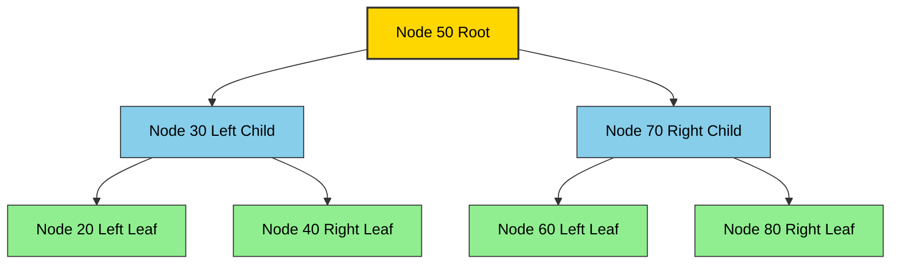
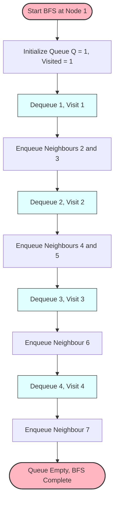
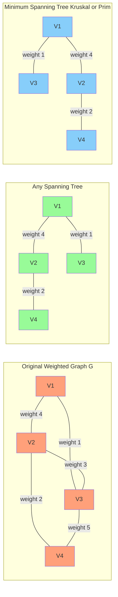
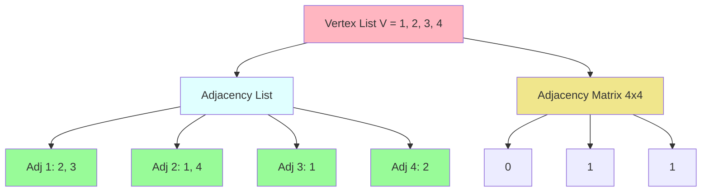

# Trees and Graphs

<!-- SECTION_1_START -->

# 1. Core Technical Definition & Intuitive Overview

## 1.1 Trees — Formal Definition

> [!IMPORTANT]
> **Tree (KTU 2024 Syllabus Terminology):** A *tree* is a non-linear, hierarchical data structure consisting of a finite set of one or more **nodes** such that there is a designated node called the **root**, and the remaining nodes are partitioned into $m \geq 0$ disjoint sub-trees $T_1, T_2, \ldots, T_m$, each of which is itself a tree.

In a tree of $n$ nodes, the total number of **edges** is always exactly $n - 1$, and the structure is **acyclic** (no cycles exist). The **root** sits at level $0$, and every child node increases its depth by one level per edge traversal.

### Conceptual Analogy / Intuition

Imagine a **corporate organizational chart**. The CEO is the *root*. VPs report to the CEO (they are *children* of the root, and the CEO is their *parent*). Managers under VPs are *grandchildren*. The leaves of this chart are the employees with no subordinates — exactly like **leaf nodes** in a tree. No employee can report to two different managers (no cycles, no multiple parents), which captures the strict **parent–child hierarchy** of a tree.

> [!NOTE]
> A tree with $n$ nodes **always** contains exactly $n - 1$ edges. This invariant is the single most testable property in KTU board questions.

## 1.2 Graph — Formal Definition

> [!IMPORTANT]
> **Graph (KTU 2024 Syllabus Terminology):** A *graph* $G$ is an ordered pair $G = (V, E)$, where $V$ is a non-empty finite set of **vertices** (or nodes) and $E$ is a set of **edges** (or arcs) connecting pairs of vertices. Each edge $e \in E$ is represented as a pair $(u, v)$ with $u, v \in V$.

Unlike a tree, a graph may contain **cycles**, may have **multiple components**, and a vertex may connect to many other vertices without any hierarchical restriction.

### Conceptual Analogy / Intuition

Think of a **road map of Kerala**. Cities are *vertices*; the highways between them are *edges*. You can travel from Kochi to Trivandrum directly, or route through Kottayam — there is no single "parent city". If the highways are one-way, you get a **directed graph** (digraph). If each highway has a distance label, you get a **weighted graph**, which is precisely what Google Maps uses for shortest-path computation.

## 1.3 Specialized Tree Varieties (KTU High-Yield Variants)

| Variant | Defining Property | Real-World Use |
|---|---|---|
| **Binary Tree** | Each node has at most 2 children (Left, Right) | Expression parsing, decision logic |
| **Binary Search Tree (BST)** | Left subtree keys $<$ node key $<$ Right subtree keys | Fast lookup, dictionary systems |
| **AVL Tree** | Self-balancing BST; $\vert \text{height}_{\text{left}} - \text{height}_{\text{right}} \vert \leq 1$ for every node | Database indexing |
| **B-Tree of order $m$** | Self-balancing search tree with up to $m$ children; all leaves at same level | File systems, database engines |
| **Heap** | Complete binary tree satisfying the heap-order property | Priority queues, OS scheduling |
| **Spanning Tree** | A subgraph that is a tree and includes **all** vertices of the original graph | Network design, cabling minimization |

> [!VISUALIZATION CONTROL]
> **Concept:** Binary Search Tree Insertion Sequence
> **GeoGebra / Desmos Input Points:**
> * `(50, 0)` — root
> * `(30, -1)`, `(70, -1)` — level 1 children of root
> * `(20, -2)`, `(40, -2)`, `(60, -2)`, `(80, -2)` — level 2 leaves
> **Visual Description:** A balanced BST where every left-descendant is smaller than its ancestor and every right-descendant is larger. Inserting **45** would first compare with 50, descend to 30's right (since $45 > 30$), and attach as the right child of 40.

## 1.4 Graph Varieties (KTU High-Yield Variants)

| Variant | Defining Property | Notation |
|---|---|---|
| **Undirected Graph** | Edges have no orientation; $(u,v) = (v,u)$ | $G = (V, E)$ |
| **Directed Graph (Digraph)** | Edges have direction; $(u,v) \neq (v,u)$ in general | $G = (V, A)$ where $A$ is arc set |
| **Weighted Graph** | Each edge has an associated cost/length | $G = (V, E, W)$ |
| **Cyclic Graph** | Contains at least one cycle | Trees are *acyclic* by contrast |
| **Connected Graph** | A path exists between every pair of vertices | $\vert E \vert \geq \vert V \vert - 1$ for connected graphs |
| **Complete Graph $K_n$** | Every pair of distinct vertices is connected by an edge | $\vert E \vert = \dfrac{n(n-1)}{2}$ |

> [!VISUALIZATION CONTROL]
> **Concept:** Directed vs Undirected Edge Visualization
> **GeoGebra / Desmos Input Lines:**
> * `Line((0,0),(2,1))` with `Arrow((0,0),(2,1))` — directed edge A $\to$ B
> * `Line((0,2),(2,3))` — undirected edge C — D
> **Visual Description:** In the first line, an arrowhead is rendered at one endpoint indicating directionality. In the second, the line is symmetric with no arrowhead. This visually captures the difference between a *digraph* and an *undirected graph*.

---

<!-- SECTION_1_END -->

<!-- SECTION_2_START -->

# 2. Deep Theoretical Analysis & KTU High-Yield Formula Sheet

## 2.1 Core Tree Properties (Logical Breakdown)

A tree with $n$ nodes and height $h$ obeys a tight set of invariants that examiners love to test:

1. **Edge Count Invariant:** Total edges $= n - 1$. *Why?* Start with a single node (0 edges). Each additional node must attach via exactly one edge, so we add one edge per additional node.
2. **Leaf–Internal Node Relation:** If $L$ = leaves and $I$ = internal nodes (with $\geq 2$ children) in a full $k$-ary tree, then $L = (k - 1) \cdot I + 1$. *Why?* Every internal node has exactly $k$ children, giving $k \cdot I$ child pointers, but the root uses one slot for nothing — so $k \cdot I = n - 1 = (L + I) - 1 \Rightarrow L = (k-1)I + 1$.
3. **Height of a Full Binary Tree:** Minimum height $h_{\min} = \lfloor \log_2 n \rfloor + 1$; maximum height $h_{\max} = n$ (degenerate/skewed tree).
4. **Total Nodes in a Full Binary Tree of Height $h$:** $n = 2^h - 1$.

### Why These Properties Matter

These are not arbitrary rules. They are the **mathematical constraints** that allow search algorithms on balanced BSTs to achieve $O(\log n)$ time. The moment a tree becomes skewed (like a linked list), the height becomes $n$ and the search degrades to $O(n)$ — which is precisely why **AVL trees** and **Red-Black trees** enforce balance.

## 2.2 Tree Traversal Strategies (The Big Four)

Tree traversals are the **most asked** tree topic in KTU exams. Every traversal must be expressible in three forms:

| Traversal | Visit Order (Root–Left–Right Variants) | Use Case |
|---|---|---|
| **Preorder** | Root $\to$ Left $\to$ Right | Copy/serialize a tree |
| **Inorder** | Left $\to$ Root $\to$ Right | Yields **sorted** sequence in BST |
| **Postorder** | Left $\to$ Right $\to$ Root | Delete tree, evaluate postfix |
| **Level Order (BFS)** | Level by level, left to right | Shortest path in unweighted tree |

## 2.3 Core Graph Properties (Logical Breakdown)

1. **Sum of Degrees Theorem:** $\sum_{v \in V} \deg(v) = 2 \cdot \vert E \vert$. *Why?* Every edge contributes exactly 1 to the degree of each of its two endpoints — so 2 in total.
2. **Handshaking Lemma:** The number of vertices with **odd degree** is always even. *Why?* The sum of degrees is even, and even numbers can only be partitioned into pairs of odds plus any number of evens.
3. **Connected Graph Minimum Edges:** A connected graph with $n$ vertices has at least $n - 1$ edges (a tree).
4. **Complete Graph Edge Count:** $K_n$ has $\dfrac{n(n-1)}{2}$ edges.
5. **Bipartite Graph:** Vertices can be split into two sets $V_1, V_2$ such that every edge has one endpoint in $V_1$ and the other in $V_2$. Equivalent condition: the graph contains **no odd cycle**.

## 2.4 Graph Representation Schemes (Critical for KTU Board)

| Representation | Space Complexity | Edge Lookup | Best Use |
|---|---|---|---|
| **Adjacency Matrix** | $O(V^2)$ | $O(1)$ | Dense graphs |
| **Adjacency List** | $O(V + E)$ | $O(\deg(v))$ | Sparse graphs (most real-world) |
| **Incidence Matrix** | $O(V \cdot E)$ | $O(E)$ | Theoretical proofs |

## 2.5 KTU Formula Sheet / Cheat Sheet

| # | Concept | Formula / Property |
|---|---|---|
| 1 | Edges in any tree | $E = V - 1$ |
| 2 | Nodes in full binary tree of height $h$ | $N = 2^h - 1$ |
| 3 | Leaves in full $k$-ary tree | $L = (k-1) \cdot I + 1$ |
| 4 | Maximum nodes at level $l$ (binary tree) | $2^l$ |
| 5 | Height of balanced BST with $n$ nodes | $\Theta(\log_2 n)$ |
| 6 | Sum of vertex degrees | $\sum \deg(v) = 2 \cdot E$ |
| 7 | Edges in complete graph $K_n$ | $\frac{n(n-1)}{2}$ |
| 8 | BFS/DFS time complexity | $O(V + E)$ |
| 9 | Dijkstra's shortest path (priority queue) | $O((V + E) \log V)$ |
| 10 | Prim's / Kruskal's MST | $O(E \log V)$ / $O(E \log E)$ |
| 11 | AVL rotation cost (worst case) | $O(\log n)$ per insertion |
| 12 | B-Tree of order $m$ search cost | $O(\log_m n)$ |

### Real-World Engineering Utility

- **BST / AVL:** Core of every database index (PostgreSQL, MySQL InnoDB).
- **B-Trees:** Foundation of disk-based file systems (NTFS, ext4, HFS+).
- **Heaps:** Power priority queues used in Dijkstra's algorithm and OS process schedulers.
- **BFS:** Social networks (Facebook's "6 degrees of separation"), web crawlers.
- **DFS:** Cycle detection, topological sorting for build systems (Make, Maven).
- **Spanning Trees:** Minimum-cost network design (telecom cables, electrical grids).

---

<!-- SECTION_2_END -->

<!-- SECTION_3_START -->

# 3. Step-by-Step Derivations & Code Implementation

## 3.1 Derivation: Leaves in a Full Binary Tree

**Given:** A full binary tree has $I$ internal nodes and $L$ leaves, total $n = I + L$ nodes.

**Step 1.** In a full binary tree, every internal node has exactly **2 children**.

**Step 2.** Total number of child pointers (edges leaving a node) $= 2I$.

**Step 3.** Each non-root node is pointed to by exactly one parent, so total child pointers = $n - 1$.

**Step 4.** Equating:

$$
\begin{aligned}
2I &= n - 1 \\
2I &= (I + L) - 1 \\
2I - I &= L - 1 \\
I &= L - 1 \\
\therefore L &= I + 1
\end{aligned}
$$

This is the special case of the formula $L = (k-1)I + 1$ for $k = 2$.

## 3.2 Derivation: BFS Time Complexity

**Claim:** Breadth-First Search on a graph with $V$ vertices and $E$ edges runs in $O(V + E)$.

**Step 1.** Each vertex is enqueued and dequeued exactly once — contributes $O(V)$.

**Step 2.** For each vertex, we scan all its adjacent edges to discover neighbours. The total work of all adjacency-list scans equals the total number of edge entries, which is $2E$ for an undirected graph and $E$ for a directed graph.

**Step 3.** Total: $O(V) + O(E) = O(V + E)$. $\blacksquare$

## 3.3 Python Implementation: Binary Search Tree

```python
from __future__ import annotations
import logging
from typing import Optional, List, Any

logging.basicConfig(level=logging.INFO, format="%(levelname)s: %(message)s")


class TreeNode:
    """A node in a Binary Search Tree."""

    def __init__(self, key: int) -> None:
        if not isinstance(key, (int, float)):
            raise TypeError(f"Key must be numeric, got {type(key).__name__}")
        self.key: int = key
        self.left: Optional[TreeNode] = None
        self.right: Optional[TreeNode] = None

    def __repr__(self) -> str:
        return f"TreeNode(key={self.key})"


class BinarySearchTree:
    """BST with insert, search, and three classical traversals."""

    def __init__(self) -> None:
        self.root: Optional[TreeNode] = None
        logging.info("Initialized an empty BST.")

    # ---------- Insertion ----------
    def insert(self, key: int) -> None:
        if self.root is None:
            self.root = TreeNode(key)
            logging.info(f"Inserted root node with key={key}.")
        else:
            self._insert_recursive(self.root, key)

    def _insert_recursive(self, node: TreeNode, key: int) -> None:
        if key < node.key:
            if node.left is None:
                node.left = TreeNode(key)
                logging.info(f"Inserted {key} as left child of {node.key}.")
            else:
                self._insert_recursive(node.left, key)
        elif key > node.key:
            if node.right is None:
                node.right = TreeNode(key)
                logging.info(f"Inserted {key} as right child of {node.key}.")
            else:
                self._insert_recursive(node.right, key)
        else:
            logging.warning(f"Duplicate key {key} ignored.")

    # ---------- Search ----------
    def search(self, key: int) -> bool:
        return self._search_recursive(self.root, key)

    def _search_recursive(self, node: Optional[TreeNode], key: int) -> bool:
        if node is None:
            logging.info(f"Key {key} not found.")
            return False
        if key == node.key:
            logging.info(f"Key {key} found.")
            return True
        if key < node.key:
            return self._search_recursive(node.left, key)
        return self._search_recursive(node.right, key)

    # ---------- Traversals ----------
    def inorder(self) -> List[int]:
        result: List[int] = []
        self._inorder(self.root, result)
        return result

    def _inorder(self, node: Optional[TreeNode], out: List[int]) -> None:
        if node is None:
            return
        self._inorder(node.left, out)
        out.append(node.key)
        self._inorder(node.right, out)

    def preorder(self) -> List[int]:
        result: List[int] = []
        self._preorder(self.root, result)
        return result

    def _preorder(self, node: Optional[TreeNode], out: List[int]) -> None:
        if node is None:
            return
        out.append(node.key)
        self._preorder(node.left, out)
        self._preorder(node.right, out)

    def postorder(self) -> List[int]:
        result: List[int] = []
        self._postorder(self.root, result)
        return result

    def _postorder(self, node: Optional[TreeNode], out: List[int]) -> None:
        if node is None:
            return
        self._postorder(node.left, out)
        self._postorder(node.right, out)
        out.append(node.key)


# ------------------- DEMO -------------------
if __name__ == "__main__":
    bst = BinarySearchTree()
    for value in [50, 30, 70, 20, 40, 60, 80]:
        bst.insert(value)

    print("Inorder  (LNR):", bst.inorder())    # [20, 30, 40, 50, 60, 70, 80]
    print("Preorder (NLR):", bst.preorder())   # [50, 30, 20, 40, 70, 60, 80]
    print("Postorder(LRN):", bst.postorder())  # [20, 40, 30, 60, 80, 70, 50]

    bst.search(40)
    bst.search(999)
```

**Expected Output (trimmed):**
```
INFO: Initialized an empty BST.
INFO: Inserted root node with key=50.
INFO: Inserted 30 as left child of 50.
...
Inorder  (LNR): [20, 30, 40, 50, 60, 70, 80]
Preorder (NLR): [50, 30, 20, 40, 70, 60, 80]
Postorder(LRN): [20, 40, 30, 60, 80, 70, 50]
INFO: Key 40 found.
INFO: Key 999 not found.
```

## 3.4 Python Implementation: BFS and DFS on a Graph

```python
from __future__ import annotations
import logging
from collections import deque
from typing import Dict, List, Set

logging.basicConfig(level=logging.INFO, format="%(levelname)s: %(message)s")


class Graph:
    """Undirected graph using adjacency list representation."""

    def __init__(self) -> None:
        self.adj: Dict[int, List[int]] = {}
        logging.info("Initialized empty graph.")

    def add_vertex(self, v: int) -> None:
        if v not in self.adj:
            self.adj[v] = []
            logging.info(f"Added vertex {v}.")

    def add_edge(self, u: int, v: int) -> None:
        self.add_vertex(u)
        self.add_vertex(v)
        if v not in self.adj[u]:
            self.adj[u].append(v)
            self.adj[v].append(u)
            logging.info(f"Added undirected edge {u} <-> {v}.")
        else:
            logging.warning(f"Edge {u}-{v} already exists.")

    # ---------- BFS ----------
    def bfs(self, start: int) -> List[int]:
        if start not in self.adj:
            logging.error(f"Start vertex {start} not in graph.")
            return []
        visited: Set[int] = set()
        order: List[int] = []
        queue: deque[int] = deque([start])
        visited.add(start)

        while queue:
            node = queue.popleft()
            order.append(node)
            logging.info(f"BFS visited {node}.")
            for neighbour in self.adj[node]:
                if neighbour not in visited:
                    visited.add(neighbour)
                    queue.append(neighbour)
        return order

    # ---------- DFS (Recursive) ----------
    def dfs(self, start: int) -> List[int]:
        visited: Set[int] = set()
        order: List[int] = []
        self._dfs_recursive(start, visited, order)
        return order

    def _dfs_recursive(self, node: int, visited: Set[int], order: List[int]) -> None:
        visited.add(node)
        order.append(node)
        logging.info(f"DFS visited {node}.")
        for neighbour in self.adj[node]:
            if neighbour not in visited:
                self._dfs_recursive(neighbour, visited, order)


# ------------------- DEMO -------------------
if __name__ == "__main__":
    g = Graph()
    for u, v in [(1, 2), (1, 3), (2, 4), (2, 5), (3, 6), (4, 7)]:
        g.add_edge(u, v)

    print("BFS from 1:", g.bfs(1))  # [1, 2, 3, 4, 5, 6, 7]
    print("DFS from 1:", g.dfs(1))  # [1, 2, 4, 7, 5, 3, 6]
```

**Expected Output (trimmed):**
```
INFO: Initialized empty graph.
INFO: Added vertex 1.
INFO: Added vertex 2.
INFO: Added undirected edge 1 <-> 2.
...
BFS from 1: [1, 2, 3, 4, 5, 6, 7]
DFS from 1: [1, 2, 4, 7, 5, 3, 6]
```

## 3.5 Worked Numerical Example (KTU Board Style)

**Problem:** Construct an AVL tree by inserting the keys $10, 20, 30, 25, 27$ in order. Show all rotations.

| Step | Inserted | Tree State | Balance Factor Check | Rotation |
|---|---|---|---|---|
| 1 | 10 | 10 (root) | OK | None |
| 2 | 20 | 10 $\to$ 20 (R) | BF(10) = -1, OK | None |
| 3 | 30 | 10 $\to$ 20 $\to$ 30 (R) | BF(10) = -2, **imbalance** | **Left Rotation** at 10 |
| 4 | Result | 20 root, 10(L), 30(R) | OK | — |
| 5 | 25 | 20 $\to$ 30 $\to$ 25 (L) | BF(30) = +1, OK | None |
| 6 | 27 | 20 $\to$ 30 $\to$ 25 $\to$ 27 | BF(20) = -2, BF(30) = +1 | **Left-Right Rotation** at 20 |
| 7 | Final | 25 root, 20(L $\to$ 10), 30(R $\to$ 27) | All BFs in $\{-1, 0, +1\}$ | Balanced |

---

<!-- SECTION_3_END -->

<!-- SECTION_4_START -->

# 4. Structural Diagrams & Schematics

## 4.1 Binary Tree of Module Demo (Mermaid)



> [!NOTE]
> **Visual Reading:** Root 50 (gold) has two children 30 and 30's sibling 70 (blue, internal). Each internal node has two leaf children (green). Total nodes $= 7$, edges $= 6 = 7 - 1$. This satisfies the tree edge invariant.

## 4.2 BFS Traversal Sequence Flow (Mermaid)



> [!NOTE]
> **Sequential Topology:** Each blue node represents a dequeue + visit operation. Arrows represent the *control flow*, not data flow — emphasizing the linear time progression of BFS over a graph with $V = 7$ vertices and $E = 6$ edges.

## 4.3 Spanning Tree vs. Minimum Spanning Tree (Block Diagram)



> [!NOTE]
> **Engineering Reading:** A *spanning tree* must include all $V$ vertices and exactly $V - 1$ edges. The MST is the spanning tree with **minimum total edge weight** — used in cable-laying, VLSI routing, and clustering algorithms.

## 4.4 Graph Adjacency Representation Architecture



> [!NOTE]
> **Reading:** The same graph is shown in two representations. The *adjacency list* is space-efficient ($O(V + E)$); the *adjacency matrix* offers $O(1)$ edge lookup. Choose the right one for your problem density.

---

<!-- SECTION_4_END -->

<!-- SECTION_5_START -->

# 5. KTU 2024 Scheme Examination Question Bank & Topic Recap

## Part A — Short Answer Questions (3 Marks Each)

### Question A1
**[KTU University Exam — July 2024]**  
Define the following with respect to trees: (a) Root, (b) Leaf, (c) Degree of a node. **(CO1, Remember)**

**Model Answer:**

- **Root:** The topmost node of a tree with no parent; every other node is reachable from it. **[1 Mark]**
- **Leaf (External Node):** A node with no children, i.e., degree $= 0$. **[1 Mark]**
- **Degree of a Node:** The number of children that the node has in the tree. **[1 Mark]**

### Question A2
**[KTU University Exam — Dec 2023]**  
Differentiate between a tree and a graph. Mention any three points. **(CO1, Understand)**

**Model Answer:**

| Tree | Graph |
|---|---|
| Acyclic by definition. | May contain cycles. |
| Exactly $V - 1$ edges. | Edge count can be anywhere from $0$ to $\frac{V(V-1)}{2}$. |
| Has a unique root; hierarchical. | No root concept; flat or general structure. |
| There is exactly one path between any two nodes. | Multiple paths may exist between two nodes. |

**[1 Mark per valid comparison point × 3 = 3 Marks]**

---

## Part B — Full-Length Questions (14 Marks, Internal Choice)

### Question A (Option 1)

**[KTU University Exam — July 2024, Module 3]**  
**(a)** Define a Binary Search Tree. Construct a BST by inserting the keys $45, 25, 65, 15, 35, 55, 75, 10$ in that order. Draw the final tree. **(7 Marks, CO2, Apply)**  
**(b)** Perform inorder, preorder, and postorder traversals of the constructed BST. State one important property of inorder traversal in a BST. **(7 Marks, CO2, Apply)**

**Model Solution:**

**(a) Construction Steps:**

1. Insert **45** as root.  
2. **25** $< 45$ $\to$ left child of 45.  
3. **65** $> 45$ $\to$ right child of 45.  
4. **15** $< 45$, then $< 25$ $\to$ left child of 25.  
5. **35** $< 45$, then $> 25$ $\to$ right child of 25.  
6. **55** $> 45$, then $< 65$ $\to$ left child of 65.  
7. **75** $> 45$, then $> 65$ $\to$ right child of 65.  
8. **10** $< 45$, then $< 25$, then $< 15$ $\to$ left child of 15.

**Final Tree (ASCII):**
```
            45
          /    \
        25      65
       /  \    /  \
      15   35 55   75
     /
    10
```

**[BST construction: 5 Marks, Final tree diagram: 2 Marks]**

**(b) Traversal Outputs:**

| Traversal | Sequence |
|---|---|
| **Inorder (LNR)** | $10, 15, 25, 35, 45, 55, 65, 75$ |
| **Preorder (NLR)** | $45, 25, 15, 10, 35, 65, 55, 75$ |
| **Postorder (LRN)** | $10, 15, 35, 25, 55, 75, 65, 45$ |

**Important Property:** Inorder traversal of a BST yields the keys in **ascending sorted order** — this is the defining property leveraged by `TreeMap`/`TreeSet` in Java and `sortedcontainers` in Python.

**[Inorder derivation: 2 Marks, Preorder: 2 Marks, Postorder: 2 Marks, Property statement: 1 Mark]**

> [!WARNING]
> **KTU Examiner's Valuation Pitfall:** When drawing the BST, students often misplace a single node (e.g., placing 35 on the left of 25). This error is propagated to ALL traversal outputs and results in **6–7 marks deduction** out of 14. Always **double-check the BST property** ($\text{left} < \text{node} < \text{right}$) at every step before proceeding to traversals.

---

### Question B (Option 2)

**[KTU University Exam — Dec 2023, Module 3]**  
**(a)** Explain the adjacency matrix and adjacency list representations of a graph. For a graph with $V = 5$ and $E = 7$, compare the space requirements. **(7 Marks, CO2, Understand)**  
**(b)** Apply BFS and DFS on the following graph starting from vertex **A**. List the order of vertices visited. Show the stack/queue state at each step.

**Graph:** $V = \{A, B, C, D, E\}$, $E = \{(A,B), (A,C), (B,D), (C,D), (C,E), (D,E), (B,E)\}$ **(7 Marks, CO3, Apply)**

**Model Solution:**

**(a) Representations:**

- **Adjacency Matrix:** A $V \times V$ matrix $M$ where $M[i][j] = 1$ if edge $(i,j)$ exists, else $0$. For a weighted graph, $M[i][j] = w(i,j)$. **Space: $O(V^2)$.** Edge lookup: $O(1)$.
- **Adjacency List:** An array of $V$ lists, where the $i$-th list contains all vertices adjacent to $i$. **Space: $O(V + E)$.** Edge lookup: $O(\deg(v))$.

**Space Comparison for $V = 5$, $E = 7$:**

| Representation | Space Used | Numerical Value |
|---|---|---|
| Adjacency Matrix | $V^2$ | $5^2 = 25$ cells |
| Adjacency List | $V + 2E$ (undirected) | $5 + 14 = 19$ entries |

Adjacency list saves space when the graph is **sparse** ($E \ll V^2$), which is the case here since $7 \ll 25$. **[1 Mark for formula, 1 Mark for numerical comparison, 3 Marks for conceptual clarity, 2 Marks for choosing correctly]**

**(b) BFS from A:**

| Step | Queue State (front $\to$ back) | Visited | Output |
|---|---|---|---|
| Init | $[A]$ | $\{A\}$ | — |
| Pop A | $[B, C]$ | $\{A, B, C\}$ | A |
| Pop B | $[C, D, E]$ | $\{A, B, C, D, E\}$ | A, B |
| Pop C | $[D, E]$ | same | A, B, C |
| Pop D | $[E]$ | same | A, B, C, D |
| Pop E | $[]$ | same | A, B, C, D, E |

**BFS Order: A, B, C, D, E**  $[2 \text{ Marks}]$

**DFS from A (recursive):**

| Step | Call Stack | Visited | Output |
|---|---|---|---|
| 1 | `dfs(A)` | $\{A\}$ | A |
| 2 | `dfs(A) -> dfs(B)` | $\{A, B\}$ | A, B |
| 3 | `dfs(B) -> dfs(D)` | $\{A, B, D\}$ | A, B, D |
| 4 | `dfs(D) -> dfs(C)` | $\{A, B, C, D\}$ | A, B, C, D |
| 5 | `dfs(C) -> dfs(E)` | $\{A, B, C, D, E\}$ | A, B, C, D, E |
| 6 | Backtrack | — | — |

**DFS Order: A, B, D, C, E**  $[2 \text{ Marks}]$

**[Queue/Stack state tables: 1.5 Marks each, Final orders: 0.5 Mark each]**

> [!WARNING]
> **KTU Examiner's Valuation Pitfall:** (1) BFS uses a **queue** (FIFO) and DFS uses a **stack / recursion** (LIFO). Confusing these gives a fully wrong traversal order. (2) Always **mark a vertex visited at enqueue/push time**, not at dequeue/pop time, to avoid re-inserting the same node multiple times. (3) In undirected graphs, every edge is stored **twice** in the adjacency list (once at each endpoint) — forgetting this gives wrong degree counts.

---

## Topic Recap & Important Things to Remember

- **Tree Definition:** A connected, acyclic graph with exactly $V - 1$ edges and one designated root. **[Frequently asked as 2-mark question]**
- **Tree Invariants:** $E = V - 1$ always; a full $k$-ary tree satisfies $L = (k-1)I + 1$. **[Derivation question favorite]**
- **BST Property:** Left subtree keys $<$ node key $<$ Right subtree keys. Inorder traversal of a BST = sorted output. **[Universally tested]**
- **AVL Balance Factor:** $\text{BF}(v) = h_{\text{left}} - h_{\text{right}}$ must be in $\{-1, 0, +1\}$. Violation $\to$ 4 rotation types: LL, RR, LR, RL. **[Most common 14-mark question]**
- **B-Tree Properties:** All leaves at same level; each internal node has $\lceil m/2 \rceil$ to $m$ children; search is $O(\log_m n)$. **[Module-end favorite]**
- **Graph Definition:** $G = (V, E)$ where $E \subseteq V \times V$. May be directed, undirected, weighted, cyclic, or acyclic.
- **Handshaking Lemma:** $\sum \deg(v) = 2 \cdot \vert E \vert$ and the number of odd-degree vertices is always even. **[Sure-shot 3-mark question]**
- **Representations:** Adjacency matrix $O(V^2)$, adjacency list $O(V + E)$. Use matrix for dense graphs and list for sparse ones. **[Comparison question every year]**
- **BFS:** Level-by-level traversal using a queue. Time $O(V + E)$. Used for **shortest path in unweighted graphs** and connected-component detection.
- **DFS:** Goes deep before wide, using stack/recursion. Time $O(V + E)$. Used for **cycle detection**, **topological sort**, **strongly connected components**, and **maze/articulation-point problems**.
- **Spanning Tree vs. MST:** A spanning tree is a connected acyclic subgraph covering all $V$ vertices. An MST minimizes the total edge weight. **Kruskal** uses union-find and sorts edges; **Prim** grows the tree using a priority queue.
- **Time Complexities to Memorize:** BFS/DFS $O(V + E)$; Dijkstra $O((V + E) \log V)$; Prim/Kruskal $O(E \log V)$; AVL/BST operations $O(\log n)$ in balanced case, $O(n)$ worst case.
- **Common Pitfalls to Avoid in Exams:** (1) Confusing degree (count of edges) with children count in trees. (2) Forgetting to increment edge count for undirected graphs in the Handshaking Lemma. (3) Skipping the balance-factor check in AVL problems. (4) Drawing traversal diagrams without explicitly stating visit order (Pre = NLR, In = LNR, Post = LRN). (5) Forgetting to handle disconnected components — BFS/DFS from one source visits **only that component**.

---

<!-- SECTION_5_END -->
