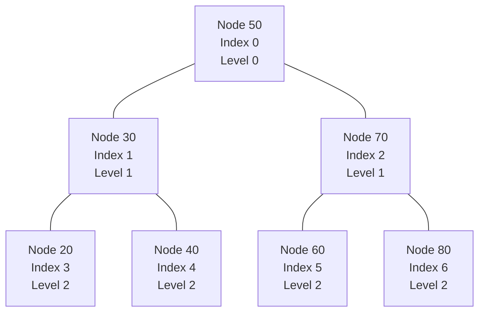
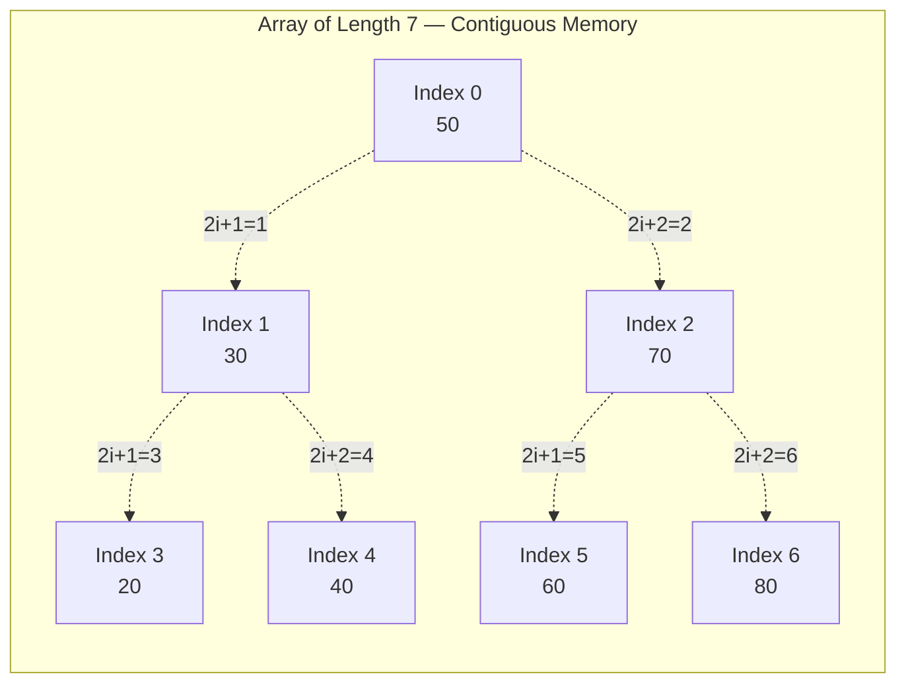
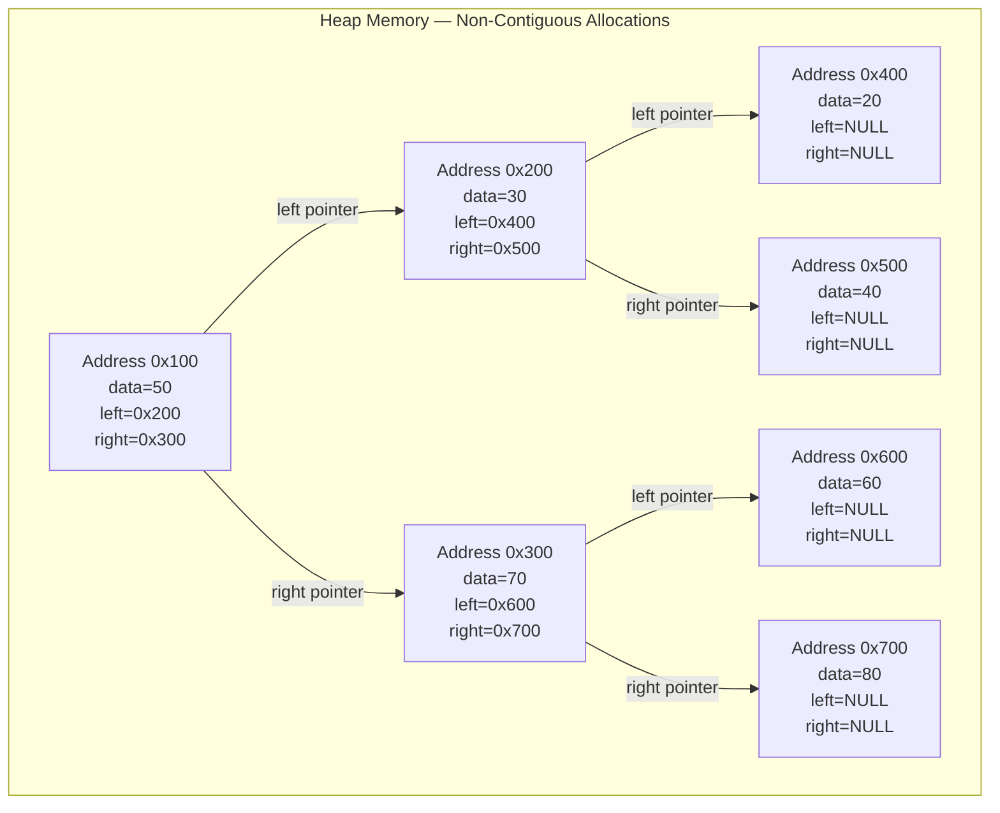
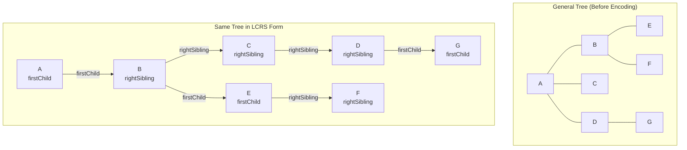
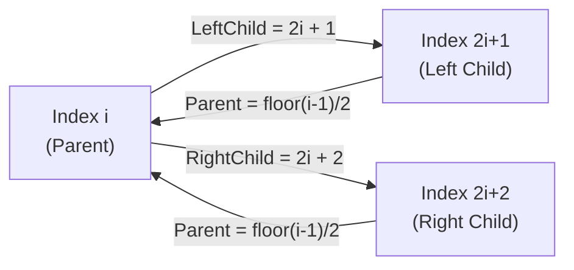
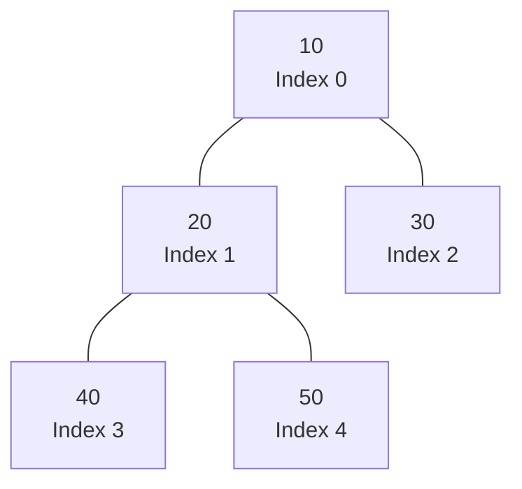
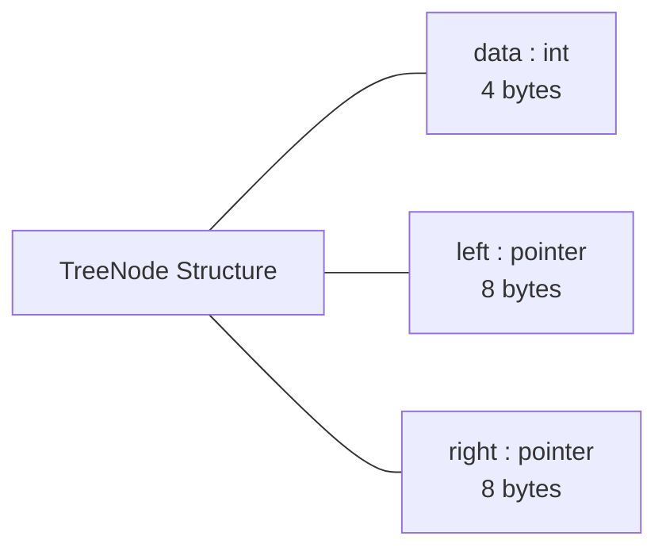
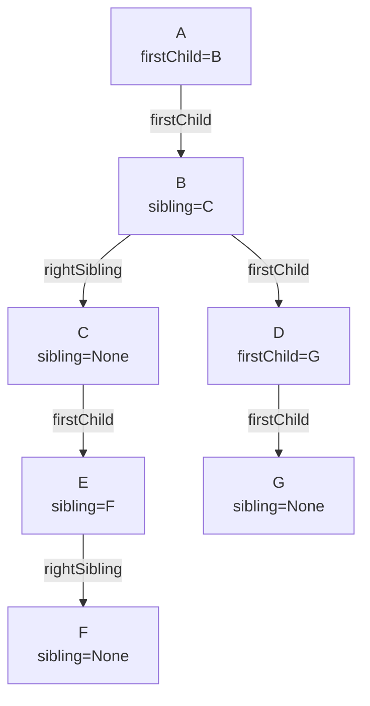

# Trees :- Representation Of Trees

<!-- SECTION_1_START -->

# Representation of Trees — Foundational Overview

## 1.1 Formal Academic Definition (KTU 2024 Syllabus Terminology)

In the formal theory of **Data Structures**, a **Tree** is a non-linear, hierarchical data structure that consists of nodes connected by edges. It is formally defined as a finite set $T$ of one or more nodes such that there is a designated node called the **Root** and the remaining nodes are partitioned into $n \geq 0$ disjoint sets $T_1, T_2, \ldots, T_n$, each of which is itself a tree (recursive definition). These sub-trees are called **subtrees** of the root.

The act of **Representation of Trees** refers to the systematic method of storing a tree's nodes and the parent-to-child relationship between them in the main memory of a computer so that the tree can be efficiently traversed, searched, inserted into, or deleted from. The two principal schemes recognized in the KTU 2024 Scheme syllabus for the course **OECST611 — Data Structures** are:

1. **Sequential (Array-Based) Representation** — stores nodes in a contiguous memory block.
2. **Linked (Pointer-Based) Representation** — stores nodes as discrete heap-allocated structures connected via pointers.

> [!IMPORTANT]
> **KTU 2024 — Module 3 Highlight**
> For a binary tree of size $n$ nodes, the choice between array and linked representation directly impacts the **space complexity**, **cache locality**, and **ease of traversal**. The KTU board expects students to compute memory indices, derive parent–child formulas, and contrast the two schemes in the ESE (End Semester Evaluation).

## 1.2 Conceptual Analogy / Intuitive Overview

Imagine the **organizational chart of a university**:
- The **Vice Chancellor** sits at the top — this is the **root node**.
- Directly below are the **Deans** of various faculties — these are the **children** of the root.
- Below each Dean are **Heads of Departments** — these are the **grandchildren**.
- This branching, top-down, parent-to-child map continues down to the **students** at the leaf level.

Now, how do we store this chart inside a computer?

- **Array Method (The Roll-Number Approach):** Just like we assign a roll number to every student and place them in a fixed row in a register, we assign a fixed integer index to every node and store it in an array. The rule for finding a parent or a child is purely arithmetic.
- **Linked Method (The Address-Book Approach):** Instead of fixed seats, each person carries a small card. The card contains three fields — their own name, the address (pointer) of their left subordinate, and the address (pointer) of their right subordinate. Each card can be placed anywhere in memory; the pointers knit them into a single coherent chart.

> [!NOTE]
> **Core Takeaway:** Array representation is best for **complete/almost-complete binary trees** because no memory is wasted. Linked representation is best for **sparse or skewed trees** because only existing edges consume memory.

## 1.3 Fundamental Terminology Snapshot

| Symbol / Term | Meaning |
|---|---|
| $Root(T)$ | The topmost node of tree $T$ with no parent |
| $Parent(v)$ | The predecessor node of $v$ on the unique path from the root to $v$ |
| $Child(v)$ | A direct successor of $v$ on a path away from the root |
| $Leaf$ | A node with zero children (also called *external* or *terminal* node) |
| $Sibling$ | Nodes that share the same parent |
| $Depth(v)$ | Length of the path from the root to $v$ |
| $Height(T)$ | Maximum depth among all leaves of $T$ |
| $Degree(v)$ | Number of children of node $v$ |
| $Internal\ Node$ | A node that has at least one child |

## 1.4 GeoGebra / Desmos Visualization

> [!VISUALIZATION CONTROL]
> **Concept:** Binary Tree as a Pair of Parallel Arrays (Array Representation)
> **GeoGebra / Desmos Input Points:**
> * Root index: $A(0, 1)$
> * Left child index: $B(-2, 0)$ where $B_x = 2 \cdot A_x + 1$
> * Right child index: $C(2, 0)$ where $C_x = 2 \cdot A_x + 2$
> * Grandchildren at level 2 computed via $f(i) = 2i + 1$ and $g(i) = 2i + 2$
> **Visual Description:** On the horizontal axis, lay out array indices $0, 1, 2, 3, 4, 5, 6, 7$ evenly. Vertically, group them by level $L = \lfloor \log_2(i+1) \rfloor$. Draw curved edges between parent index $i$ and children $2i+1$ and $2i+2$. The student should observe the perfect binary packing when no holes exist, and *wasted* indices when a child is missing.

---

<!-- SECTION_1_END -->

<!-- SECTION_2_START -->

# Deep Theoretical Analysis & KTU High-Yield Formula Sheet

## 2.1 Sequential (Array) Representation of a Binary Tree

In this scheme, the nodes of a binary tree are stored level-by-level in a one-dimensional array, beginning with the root at index $0$ (or $1$ for the one-based variant). The parent–child relationship is recovered **purely through arithmetic** on the index — no explicit pointers are stored.

### 2.1.1 Zero-Based Indexing (Used in C, C++, Java, Python)

For a node stored at array index $i$ (where $0 \leq i < n$ and $n$ is the total number of nodes):

$$
Parent(i) = \left\lfloor \frac{i - 1}{2} \right\rfloor
$$

$$
LeftChild(i) = 2i + 1
$$

$$
RightChild(i) = 2i + 2
$$

The validity conditions for the children to **exist** inside the array are:

$$
2i + 1 < n \quad \text{(left child exists)}
$$

$$
2i + 2 < n \quad \text{(right child exists)}
$$

> [!NOTE]
> **Boundary Case:** The root node has $i = 0$. It has no parent because $(0 - 1)/2 = -0.5$ which floors to $-1$, an invalid index. The algorithm must explicitly check $i = 0$ before invoking the parent formula.

### 2.1.2 One-Based Indexing (Used in Heap Sort and Textbook Pseudocode)

For a node stored at index $i$ (where $1 \leq i \leq n$):

$$
Parent(i) = \left\lfloor \frac{i}{2} \right\rfloor
$$

$$
LeftChild(i) = 2i
$$

$$
RightChild(i) = 2i + 1
$$

> [!TIP]
> **Why Two Conventions?** One-based indexing avoids the awkward $-1$ parent for the root and is preferred in CLRS-style algorithm pseudocode. Zero-based indexing maps directly to C-style arrays and avoids wasting the cell at index $0$. Both are valid; the KTU board accepts either as long as the student **states the convention clearly** in the answer script.

### 2.1.3 Memory Waste Analysis

For a tree with $n$ nodes stored in an array of length $n$, the array is **fully packed** (no waste) **if and only if** the tree is *complete* or *almost-complete*. For a right-skewed tree (essentially a linked list), the array must reserve $2^{n} - 1$ slots, wasting $(2^{n} - 1) - n$ memory cells — an **exponential blow-up**.

### 2.1.4 Generic Tree in Array Form

For a general (non-binary) tree, the array element at index $i$ stores the node, and a separate **linked list of children** is attached to it. This is called the **Left-Child / Right-Sibling** transformation when adapted to binary storage. In the simplest multi-way form:

- `data[i]` holds the value at node $i$.
- `first_child[i]` holds the index of the leftmost child (or $-1$ if none).
- `next_sibling[i]` holds the index of the next sibling to the right (or $-1$ if none).

## 2.2 Linked (Pointer-Based) Representation of a Binary Tree

Each node is a heap-allocated structure with three fields:

$$
Node = \langle data,\ left,\ right \rangle
$$

The memory layout uses **dynamic allocation**, so physically non-adjacent nodes can still be logically adjacent in the tree.

### 2.2.1 Node Structure (Generic Type)

For a binary tree of characters:

$$
sizeof(Node) = sizeof(char) + 2 \cdot sizeof(pointer) = 1 + 2K \text{ bytes}
$$

For a binary tree of integers on a 64-bit system:

$$
sizeof(Node) = 4 + 2 \cdot 8 = 20\ \text{bytes} \rightarrow 24\ \text{bytes (aligned)}
$$

### 2.2.2 Linked Representation of a General (n-ary) Tree

The node expands to:

$$
Node = \langle data,\ firstChild,\ nextSibling \rangle
$$

A node may have an arbitrary number of children, all linked together through a sibling chain. This converts any n-ary tree into an equivalent binary tree, which is the foundational idea behind the **Left-Child / Right-Sibling (LCRS)** encoding used in many file systems (e.g., Unix `inode` directories).

## 2.3 KTU High-Yield Formula Sheet

| # | Concept | Formula / Rule | Condition | Use Case |
|---|---|---|---|---|
| 1 | Array parent (0-based) | $\lfloor (i-1)/2 \rfloor$ | $i \geq 1$ | Heap operations |
| 2 | Array left child (0-based) | $2i + 1$ | $2i+1 < n$ | Building heap |
| 3 | Array right child (0-based) | $2i + 2$ | $2i+2 < n$ | Building heap |
| 4 | Array parent (1-based) | $\lfloor i/2 \rfloor$ | $i \geq 2$ | CLRS pseudocode |
| 5 | Array left child (1-based) | $2i$ | $2i \leq n$ | Heap sort |
| 6 | Array right child (1-based) | $2i + 1$ | $2i+1 \leq n$ | Heap sort |
| 7 | Array size for full tree | $2^{h+1} - 1$ | height $h$ | Memory planning |
| 8 | Min array slots for $n$ nodes | $n$ | complete tree | Lower bound |
| 9 | Max array slots for $n$ nodes | $2^{n} - 1$ | skewed tree | Upper bound |
| 10 | Memory per linked node | $d + 2p$ | $d$ = data, $p$ = ptr | Space analysis |
| 11 | Memory per linked n-ary node | $d + 2p$ | first child, sibling | LCRS encoding |
| 12 | Total linked memory | $n(d + 2p)$ | $n$ nodes | Engineering cost |

> [!IMPORTANT]
> **Engineering Rule of Thumb:** Use array representation when the tree's shape is **known to be complete or near-complete** and the size is **bounded and small**. Use linked representation when the tree is **dynamic, sparse, or highly unbalanced**.

## 2.4 Real-World Engineering Utility

| Application Domain | Why Trees Are Used | Representation Chosen |
|---|---|---|
| File Systems (NTFS, ext4) | Directory hierarchy | Linked (LCRS variant) |
| Compiler Syntax Trees | Parse expressions | Linked (dynamic depth) |
| Database Indexing (B-Trees) | Fast disk seeks | Array of page buffers |
| Network Routing Tries | IP prefix lookup | Array (sparse maps to linked) |
| AI Game Trees (Minimax) | Search game states | Linked (unknown branching) |
| HTML DOM | Markup parsing | Linked (dynamic) |
| Huffman Coding | Data compression | Array (complete) or Linked |

> [!NOTE]
> In **production systems**, the choice is rarely binary. Modern databases combine a **B+ tree** (linked at the page level) with **array slots inside each page**, exploiting both schemes simultaneously.

---

<!-- SECTION_2_END -->

<!-- SECTION_3_START -->

# Step-by-Step Derivations & Code Implementation

## 3.1 Derivation of the Indexing Formulas (0-Based)

We begin by placing the root of a binary tree at array index $0$. The root is at **level $0$**. Its children are at **level $1$**. Its grandchildren are at **level $2$**. In general, level $L$ contains $2^{L}$ nodes indexed consecutively.

### Step 1 — Count the nodes in earlier levels

The number of nodes that appear *before* level $L$ is:

$$
N_{before}(L) = 1 + 2 + 4 + \cdots + 2^{L-1} = 2^{L} - 1
$$

This is a finite geometric series with first term $a = 1$, ratio $r = 2$, and $L$ terms.

### Step 2 — Index of the first node at level $L$

$$
FirstIndex(L) = 2^{L} - 1
$$

So the root is at $2^{0} - 1 = 0$ (correct). The left child of the root is at $2^{1} - 1 = 1$ (correct). The right child is at $1 + 1 = 2$ (correct).

### Step 3 — Derive the left child formula

Let node $v$ be at index $i$ on level $L$. Then $i = 2^{L} - 1 + k$ where $0 \leq k < 2^{L}$ is its position within the level. Its left child is at position $2k$ on level $L+1$, so its index is:

$$
LeftChild(i) = 2^{L+1} - 1 + 2k
$$

Substituting $k = i - 2^{L} + 1$:

$$
LeftChild(i) = 2^{L+1} - 1 + 2(i - 2^{L} + 1)
$$

$$
LeftChild(i) = 2^{L+1} - 1 + 2i - 2^{L+1} + 2
$$

$$
LeftChild(i) = 2i + 1
$$

### Step 4 — Derive the right child formula

The right child is at position $2k + 1$ on level $L+1$, so:

$$
RightChild(i) = 2^{L+1} - 1 + 2k + 1
$$

$$
RightChild(i) = 2^{L+1} + 2k
$$

$$
RightChild(i) = 2^{L+1} + 2(i - 2^{L} + 1)
$$

$$
RightChild(i) = 2^{L+1} + 2i - 2^{L+1} + 2
$$

$$
RightChild(i) = 2i + 2
$$

### Step 5 — Derive the parent formula (inversion)

Given child index $c$ at level $L+1$, we want parent index $p$ at level $L$:

$$
c = 2p + 1 \quad \text{(left child case)}
$$

$$
p = \frac{c - 1}{2}
$$

$$
c = 2p + 2 \quad \text{(right child case)}
$$

$$
p = \frac{c - 2}{2}
$$

Both cases collapse neatly into the integer floor:

$$
p = \left\lfloor \frac{c - 1}{2} \right\rfloor
$$

> [!IMPORTANT]
> The floor operation is what makes the formula work for both the left child ($c = 2p + 1$ gives an integer) and the right child ($c = 2p + 2$ gives an integer plus $0.5$ that floors back). Always invoke $\lfloor \cdot \rfloor$ to be safe.

## 3.2 Worked Example — Indexing a Specific Tree

Consider the following binary tree with 7 nodes and integer values:

$$
\begin{aligned}
\text{Structure:} \quad & Root(50) \\
& \quad \diagdown \quad \diagdown \\
& 30 \quad \quad 70 \\
& \diagdown \quad \diagdown \quad \diagdown \\
& 20 \quad 40 \quad 60 \quad 80
\end{aligned}
$$

This is a **complete** binary tree, so the array is fully packed.

| Index $i$ | 0 | 1 | 2 | 3 | 4 | 5 | 6 |
|---|---|---|---|---|---|---|---|
| Value | 50 | 30 | 70 | 20 | 40 | 60 | 80 |
| Level | 0 | 1 | 1 | 2 | 2 | 2 | 2 |

### Verification using formulas

For node at $i = 1$ (value 30):
- Left child: $2(1) + 1 = 3$ → value 20 ✓
- Right child: $2(1) + 2 = 4$ → value 40 ✓
- Parent: $\lfloor (1 - 1)/2 \rfloor = 0$ → value 50 ✓

For node at $i = 6$ (value 80):
- Left child: $2(6) + 1 = 13 \not< 7$ → does not exist ✓
- Right child: $2(6) + 2 = 14 \not< 7$ → does not exist ✓
- Parent: $\lfloor (6 - 1)/2 \rfloor = 2$ → value 70 ✓

## 3.3 Counter-Example — Right-Skewed Tree (Memory Waste)

Consider a tree that is a chain to the right with 4 nodes: $10 \rightarrow 20 \rightarrow 30 \rightarrow 40$.

Required array length to store this in sequential form: $2^{4} - 1 = 15$ slots, of which only 4 contain real data. **Wasted = 11 slots (~73% waste).**

| Index $i$ | 0 | 1 | 2 | 3 | 4 | 5 | 6 | 7 | 8 | 9 | 10 | 11 | 12 | 13 | 14 |
|---|---|---|---|---|---|---|---|---|---|---|---|---|---|---|---|
| Value | 10 | $-$ | 20 | $-$ | $-$ | $-$ | 30 | $-$ | $-$ | $-$ | $-$ | $-$ | $-$ | $-$ | 40 |
| Real? | Y | N | Y | N | N | N | Y | N | N | N | N | N | N | N | Y |

This empirically demonstrates why the linked representation is preferred for skewed trees.

## 3.4 Full Python Implementation — Array Representation

```python
"""
File: array_representation.py
Topic: Sequential (Array) Representation of a Binary Tree
Course: OECST611 - Data Structures (KTU 2024 Scheme)

Conventions:
  - 0-based indexing
  - Sentinel value 0 represents 'no node' (None-equivalent)
  - Tree is fixed-size; overflow produces a logged error
"""

from __future__ import annotations
import math
import logging
from typing import List, Optional

logging.basicConfig(
    level=logging.INFO,
    format="%(asctime)s [%(levelname)s] %(message)s",
)


class ArrayBinaryTree:
    """Binary tree stored in a fixed-size array using level-order layout."""

    __slots__ = ("_capacity", "_data", "_size")

    def __init__(self, capacity: int) -> None:
        if capacity <= 0:
            raise ValueError("Capacity must be a positive integer.")
        self._capacity: int = capacity
        self._data: List[Optional[int]] = [0] * capacity
        self._size: int = 0
        logging.info("ArrayBinaryTree created with capacity = %d", capacity)

    def _validate_index(self, index: int) -> None:
        if not (0 <= index < self._capacity):
            raise IndexError(
                f"Index {index} out of bounds [0, {self._capacity - 1}]."
            )

    def set_root(self, value: int) -> None:
        if self._data[0] != 0 and value != 0:
            logging.warning("Overwriting existing root value %d.", self._data[0])
        self._data[0] = value
        self._size = max(self._size, 1)
        logging.info("Root set to %d at index 0.", value)

    def set_left_child(self, parent_index: int, value: int) -> None:
        self._validate_index(parent_index)
        left_index: int = 2 * parent_index + 1
        if left_index >= self._capacity:
            raise OverflowError(
                f"Left child index {left_index} exceeds capacity {self._capacity}."
            )
        self._data[left_index] = value
        self._size = max(self._size, left_index + 1)
        logging.info(
            "Set left child of %d (idx %d) to %d at index %d.",
            self._data[parent_index], parent_index, value, left_index,
        )

    def set_right_child(self, parent_index: int, value: int) -> None:
        self._validate_index(parent_index)
        right_index: int = 2 * parent_index + 2
        if right_index >= self._capacity:
            raise OverflowError(
                f"Right child index {right_index} exceeds capacity {self._capacity}."
            )
        self._data[right_index] = value
        self._size = max(self._size, right_index + 1)
        logging.info(
            "Set right child of %d (idx %d) to %d at index %d.",
            self._data[parent_index], parent_index, value, right_index,
        )

    def parent_index(self, child_index: int) -> Optional[int]:
        if child_index <= 0 or child_index >= self._capacity:
            return None
        return (child_index - 1) // 2

    def left_child_index(self, parent_index: int) -> Optional[int]:
        idx: int = 2 * parent_index + 1
        return idx if idx < self._capacity else None

    def right_child_index(self, parent_index: int) -> Optional[int]:
        idx: int = 2 * parent_index + 2
        return idx if idx < self._capacity else None

    def get(self, index: int) -> Optional[int]:
        self._validate_index(index)
        return self._data[index] if self._data[index] != 0 else None

    def inorder_traversal(self, index: int = 0) -> List[int]:
        result: List[int] = []
        if index >= self._capacity or self._data[index] == 0:
            return result
        left: Optional[int] = self.left_child_index(index)
        right: Optional[int] = self.right_child_index(index)
        if left is not None:
            result.extend(self.inorder_traversal(left))
        result.append(self._data[index])
        if right is not None:
            result.extend(self.inorder_traversal(right))
        return result

    def display(self) -> None:
        print(f"Capacity: {self._capacity}, Logical size: {self._size}")
        print("Array :", self._data)
        print("Index :", list(range(self._capacity)))


if __name__ == "__main__":
    tree = ArrayBinaryTree(capacity=15)
    tree.set_root(50)
    tree.set_left_child(0, 30)
    tree.set_right_child(0, 70)
    tree.set_left_child(1, 20)
    tree.set_right_child(1, 40)
    tree.set_left_child(2, 60)
    tree.set_right_child(2, 80)
    tree.display()
    print("Inorder traversal:", tree.inorder_traversal())
    print("Parent of index 6:", tree.parent_index(6))
```

### Sample Output

```
Capacity: 15, Logical size: 7
Array : [50, 30, 70, 20, 40, 60, 80, 0, 0, 0, 0, 0, 0, 0, 0]
Index : [0, 1, 2, 3, 4, 5, 6, 7, 8, 9, 10, 11, 12, 13, 14]
Inorder traversal: [20, 30, 40, 50, 60, 70, 80]
Parent of index 6: 2
```

## 3.5 Full Python Implementation — Linked Representation

```python
"""
File: linked_representation.py
Topic: Linked (Pointer-Based) Representation of a Binary Tree
Course: OECST611 - Data Structures (KTU 2024 Scheme)
"""

from __future__ import annotations
import logging
from typing import Any, List, Optional

logging.basicConfig(level=logging.INFO, format="%(levelname)s | %(message)s")


class TreeNode:
    """A single node of a binary tree with data and two child pointers."""

    __slots__ = ("data", "left", "right")

    def __init__(
        self,
        data: Any,
        left: Optional["TreeNode"] = None,
        right: Optional["TreeNode"] = None,
    ) -> None:
        self.data: Any = data
        self.left: Optional[TreeNode] = left
        self.right: Optional[TreeNode] = right

    def __repr__(self) -> str:
        return f"TreeNode({self.data!r})"


class LinkedBinaryTree:
    """A binary tree managed via dynamic node allocation and pointers."""

    def __init__(self, root_data: Any) -> None:
        if root_data is None:
            raise ValueError("Root data cannot be None.")
        self.root: TreeNode = TreeNode(root_data)
        self._node_count: int = 1
        logging.info("LinkedBinaryTree rooted at %r.", root_data)

    def insert_left(self, parent: TreeNode, data: Any) -> TreeNode:
        if parent is None:
            raise ValueError("Parent node must not be None.")
        if parent.left is not None:
            logging.warning("Overwriting existing left child %r of %r.",
                            parent.left.data, parent.data)
        new_node: TreeNode = TreeNode(data)
        parent.left = new_node
        self._node_count += 1
        return new_node

    def insert_right(self, parent: TreeNode, data: Any) -> TreeNode:
        if parent is None:
            raise ValueError("Parent node must not be None.")
        if parent.right is not None:
            logging.warning("Overwriting existing right child %r of %r.",
                            parent.right.data, parent.data)
        new_node: TreeNode = TreeNode(data)
        parent.right = new_node
        self._node_count += 1
        return new_node

    def inorder(self, node: Optional[TreeNode] = None) -> List[Any]:
        start: Optional[TreeNode] = node if node is not None else self.root
        if start is None:
            return []
        return (self.inorder(start.left)
                + [start.data]
                + self.inorder(start.right))

    def preorder(self, node: Optional[TreeNode] = None) -> List[Any]:
        start: Optional[TreeNode] = node if node is not None else self.root
        if start is None:
            return []
        return ([start.data]
                + self.preorder(start.left)
                + self.preorder(start.right))

    def postorder(self, node: Optional[TreeNode] = None) -> List[Any]:
        start: Optional[TreeNode] = node if node is not None else self.root
        if start is None:
            return []
        return (self.postorder(start.left)
                + self.postorder(start.right)
                + [start.data])

    def height(self, node: Optional[TreeNode] = None) -> int:
        start: Optional[TreeNode] = node if node is not None else self.root
        if start is None:
            return -1
        return 1 + max(self.height(start.left), self.height(start.right))

    def node_count(self) -> int:
        return self._node_count

    def to_array(self) -> List[Optional[Any]]:
        """Convert linked tree to array representation (0-based)."""
        if self.root is None:
            return []
        result: List[Optional[Any]] = []
        queue: List[Optional[TreeNode]] = [self.root]
        while queue:
            current: Optional[TreeNode] = queue.pop(0)
            if current is None:
                result.append(None)
                continue
            result.append(current.data)
            queue.append(current.left)
            queue.append(current.right)
        return result


if __name__ == "__main__":
    tree = LinkedBinaryTree(50)
    left = tree.insert_left(tree.root, 30)
    right = tree.insert_right(tree.root, 70)
    tree.insert_left(left, 20)
    tree.insert_right(left, 40)
    tree.insert_left(right, 60)
    tree.insert_right(right, 80)
    print("Inorder   :", tree.inorder())
    print("Preorder  :", tree.preorder())
    print("Postorder :", tree.postorder())
    print("Height    :", tree.height())
    print("Node count:", tree.node_count())
    print("As array  :", tree.to_array())
```

### Sample Output

```
Inorder   : [20, 30, 40, 50, 60, 70, 80]
Preorder  : [50, 30, 20, 40, 70, 60, 80]
Postorder : [20, 40, 30, 60, 80, 70, 50]
Height    : 2
Node count: 7
As array  : [50, 30, 70, 20, 40, 60, 80, None, None, None, None, None, None, None, None]
```

## 3.6 Comparative Memory Calculation

Let $n = 7$ nodes, each holding a 4-byte integer. On a 64-bit system, a pointer occupies **8 bytes** and is 8-byte aligned.

| Representation | Memory per node | Total for $n = 7$ | Waste on Skewed $n = 4$ |
|---|---|---|---|
| Array (0-based) | $4$ bytes | $7 \times 4 = 28$ B | $(2^{4}-1) \times 4 = 60$ B |
| Array (1-based) | $4$ bytes | $8 \times 4 = 32$ B | $16 \times 4 = 64$ B |
| Linked binary | $4 + 2(8) = 20$ B | $7 \times 20 = 140$ B | $4 \times 20 = 80$ B |

> [!TIP]
> **Engineering Insight:** Linked nodes consume more memory per node but never waste slots. Array representation is the right choice when the tree's shape is dense and bounded, such as in a heap used inside heapsort.

---

<!-- SECTION_3_END -->

<!-- SECTION_4_START -->

# Structural Diagrams & Schematics

## 4.1 Logical Tree Structure (Worked Example)

The following tree is the canonical example used throughout this note. It contains 7 integer values arranged as a complete binary tree.



## 4.2 Array Representation — Memory Layout Schematic



> [!NOTE]
> Dotted edges denote **virtual** parent-to-child links that exist only through arithmetic on the index. In a real array, the cells are physically adjacent in memory.

## 4.3 Linked Representation — Pointer Topology



## 4.4 General (n-ary) Tree — Left-Child / Right-Sibling Encoding



## 4.5 Sequential Processing Topology Matrix

| Phase | Array Representation Step | Linked Representation Step |
|---|---|---|
| 1. Allocate | Reserve static array of length $N$ | Allocate root node dynamically |
| 2. Insert Root | `tree[0] = value` | `root = TreeNode(value)` |
| 3. Insert Left | `tree[2i+1] = value` | `node.left = TreeNode(value)` |
| 4. Insert Right | `tree[2i+2] = value` | `node.right = TreeNode(value)` |
| 5. Traverse | Recurse on indices $2i+1$, $2i+2$ | Recurse on pointers `node.left`, `node.right` |
| 6. Delete | Mark slot as 0 (lazy) | Free node, patch parent's pointer to None |
| 7. Free Memory | Reclaim on program exit | Free on each node deletion |

## 4.6 Indexing Formula Visual Aid



---

<!-- SECTION_4_END -->

<!-- SECTION_5_START -->

# KTU 2024 Scheme Examination Question Bank & Topic Recap

## 5.1 Part A — Short Answer Questions (3 Marks Each)

### Question 1 `[KTU University Exam - July 2023]`

> **Define the sequential (array) representation of a binary tree. For a node stored at index $i$ (0-based), state the formulas for its left child, right child, and parent. (CO1, Remember)**

**Model Answer (3 Marks):**

In the **sequential representation**, a binary tree is stored in a one-dimensional array in level-order (breadth-first) fashion. The root occupies index $0$, and the children of any node at index $i$ are placed at **fixed arithmetic offsets**, requiring no explicit pointers.

The formulas (0-based indexing) are:

$$
LeftChild(i) = 2i + 1
$$

$$
RightChild(i) = 2i + 2
$$

$$
Parent(i) = \left\lfloor \frac{i - 1}{2} \right\rfloor
$$

**[Stating the storage scheme clearly: 1 Mark]**
**[Writing the three formulas correctly: 2 Marks]**

---

### Question 2 `[KTU University Exam - December 2023]`

> **What are the disadvantages of the sequential (array) representation of a binary tree? Mention any two. (CO1, Understand)**

**Model Answer (3 Marks):**

The sequential representation suffers from the following disadvantages:

1. **Excessive memory wastage for sparse trees:** A right-skewed or left-skewed tree with $n$ nodes requires an array of size $2^{n} - 1$, even though only $n$ slots are filled. The waste grows exponentially.

2. **Inflexibility for dynamic trees:** Insertions and deletions in the middle of a logical tree require **shifting** large blocks of array elements, an $O(n)$ operation. The array length must also be decided in advance, which is impractical for trees of unknown size.

**[Stating two distinct disadvantages clearly: 1.5 Marks each]**

---

## 5.2 Part B — Long Answer Questions (14 Marks)

> **Internal Choice:** KTU ESE allows the student to attempt **either** Question A **or** Question B. Both are provided below.

---

### Question A `[KTU University Exam - July 2024]`

> **(a)** For a binary tree with the following array representation using 0-based indexing, draw the tree structure and list the inorder, preorder, and postorder traversals.
>
> `Array = [10, 20, 30, 40, 50, 0, 0, 0, 0, 0, 0, 0, 0, 0, 0]`
>
> **(7 Marks, CO2, Apply)**
>
> **(b)** Explain the linked representation of a binary tree with a clear node structure diagram. Compare it with the sequential representation in terms of memory utilization for a skewed tree with $n = 5$ nodes. (Take integer data of 4 bytes and pointer of 8 bytes on a 64-bit system.) **(7 Marks, CO2 + CO3, Apply + Analyze)**

#### Model Solution — Part (a) (7 Marks)

**Step 1 — Decode the array into a tree.** The array represents level-order traversal. Each index $i$ has its left child at $2i+1$ and right child at $2i+2$.

| Index $i$ | 0 | 1 | 2 | 3 | 4 | 5 | 6 | ... | 14 |
|---|---|---|---|---|---|---|---|---|---|
| Value | 10 | 20 | 30 | 40 | 50 | 0 | 0 | ... | 0 |

- Index 0 = 10 is the root.
- Index 1 = 20 is the left child of 10 ($2 \cdot 0 + 1 = 1$).
- Index 2 = 30 is the right child of 10 ($2 \cdot 0 + 2 = 2$).
- Index 3 = 40 is the left child of 20 ($2 \cdot 1 + 1 = 3$).
- Index 4 = 50 is the right child of 20 ($2 \cdot 1 + 2 = 4$).
- Indices 5 onwards are all 0, meaning "no node."

**Step 2 — Draw the tree.**



**Step 3 — Traversals.**

- **Inorder (Left, Root, Right):** `40, 20, 50, 10, 30`
- **Preorder (Root, Left, Right):** `10, 20, 40, 50, 30`
- **Postorder (Left, Right, Root):** `40, 50, 20, 30, 10`

**[Correctly decoding the array to tree: 2 Marks]**
**[Drawing the tree with index labels: 1 Mark]**
**[Inorder traversal: 1.5 Marks]**
**[Preorder + Postorder traversals: 2.5 Marks]**

---

#### Model Solution — Part (b) (7 Marks)

**Step 1 — Node structure of linked representation.**

A node contains three fields: `data`, `left`, `right`.



**Step 2 — Memory per linked node.**

$$
sizeof(Node) = 4 + 8 + 8 = 20\ \text{bytes}
$$

**Step 3 — Total memory for $n = 5$ skewed nodes.**

$$
M_{linked} = 5 \times 20 = 100\ \text{bytes}
$$

**Step 4 — Array representation memory for the same tree.**

For a skewed tree with 5 nodes, the array must be sized to the maximum possible node count:

$$
N_{array} = 2^{5} - 1 = 31\ \text{slots}
$$

$$
M_{array} = 31 \times 4 = 124\ \text{bytes}
$$

(For 1-based indexing, the array size is also 31, since slot 0 is unused, giving $31 \times 4 = 124$ bytes, or $32 \times 4 = 128$ bytes if the unused slot 0 is included.)

**Step 5 — Comparison table.**

| Metric | Array (Skewed, $n = 5$) | Linked (Skewed, $n = 5$) |
|---|---|---|
| Slots / Nodes | 31 slots | 5 nodes |
| Used cells | 5 | 5 |
| Memory | 124 B | 100 B |
| Wasted memory | 96 B | 0 B |
| Waste ratio | 77.4% | 0% |

**[Drawing the node structure with fields: 1.5 Marks]**
**[Computing linked memory: 1.5 Marks]**
**[Computing array memory with 2^n - 1: 1.5 Marks]**
**[Comparison table with waste analysis: 2.5 Marks]**

---

### Question B `[KTU University Exam - December 2023]`

> **(a)** Define a binary tree. For the linked representation, write the structure of a node and write an algorithm (or Python code) to perform **inorder traversal** recursively. (7 Marks, CO2 + CO3, Apply)
>
> **(b)** A general (non-binary) tree is to be stored efficiently. Explain the **Left-Child / Right-Sibling (LCRS)** representation. Convert the following general tree into its LCRS form and write the inorder traversal of the resulting binary tree.
>
> General Tree: A is the root, B and C are children of A, D is a child of B, E and F are children of C, G is a child of D.
>
> **(7 Marks, CO3 + CO4, Apply + Analyze)**

#### Model Solution — Part (a) (7 Marks)

**Step 1 — Definition.**

A **binary tree** is a finite set of nodes that is either empty or consists of a root node and two disjoint binary subtrees called the **left subtree** and the **right subtree**.

**Step 2 — Node structure.**

```c
struct Node {
    int data;          // payload
    struct Node* left; // pointer to left child
    struct Node* right;// pointer to right child
};
```

In Python with type hints:

```python
from typing import Any, Optional

class TreeNode:
    def __init__(
        self,
        data: Any,
        left: Optional["TreeNode"] = None,
        right: Optional["TreeNode"] = None,
    ) -> None:
        self.data: Any = data
        self.left: Optional[TreeNode] = left
        self.right: Optional[TreeNode] = right
```

**Step 3 — Recursive inorder traversal algorithm.**

```python
def inorder(node: Optional[TreeNode]) -> list[Any]:
    if node is None:
        return []
    return inorder(node.left) + [node.data] + inorder(node.right)
```

**Step 4 — Trace on a small example.**

Tree:
```
      1
     / \
    2   3
   / \
  4   5
```

| Call | Returns |
|---|---|
| `inorder(4)` | `[4]` |
| `inorder(5)` | `[5]` |
| `inorder(2)` | `[4] + [2] + [5] = [4,2,5]` |
| `inorder(3)` | `[3]` |
| `inorder(1)` | `[4,2,5,1,3]` |

**[Binary tree definition: 1 Mark]**
**[Node structure: 1.5 Marks]**
**[Recursive inorder code: 2.5 Marks]**
**[Trace example: 2 Marks]**

---

#### Model Solution — Part (b) (7 Marks)

**Step 1 — LCRS Explanation.**

The **Left-Child / Right-Sibling** representation transforms any n-ary tree into a binary tree by:
- Storing each node's **leftmost child** in the `left` pointer.
- Storing each node's **next sibling** in the `right` pointer.

**Step 2 — Identify nodes and relationships from the problem.**

- A is the root.
- A's children: B, C.
- B's children: D.
- D's children: G.
- C's children: E, F.

**Step 3 — LCRS conversion table.**

| Node | Left child (first child) | Right sibling |
|---|---|---|
| A | B | None |
| B | D | C |
| C | E | None |
| D | G | None |
| E | None | F |
| F | None | None |
| G | None | None |

**Step 4 — The LCRS binary tree diagram.**



**Step 5 — Inorder traversal of the LCRS tree.**

Recursive inorder: Left subtree, Root, Right subtree.

- Start at A.
  - Left subtree of A = subtree rooted at B.
    - Left of B = subtree rooted at D.
      - Left of D = subtree rooted at G.
        - Left of G = empty.
        - Visit G.
        - Right of G = empty.
      - Visit D.
      - Right of D = empty.
    - Visit B.
    - Right of B = subtree rooted at C.
      - Left of C = subtree rooted at E.
        - Visit E.
        - Right of E = subtree rooted at F.
          - Visit F.
      - Visit C.
      - Right of C = empty.
  - Visit A.
  - Right of A = empty.

**Inorder traversal: G, D, B, E, F, C, A**

**[Explaining LCRS rule: 1.5 Marks]**
**[Conversion table or diagram: 2.5 Marks]**
**[Inorder traversal derivation: 3 Marks]**

---

## 5.3 KTU Examiner's Valuation Warning / Pitfall Callout

> [!WARNING]
> **Common Marks-Loss Pitfalls in Representation-of-Trees Questions:**
>
> 1. **Forgetting the floor operation:** When writing $\text{Parent}(i) = (i-1)/2$, students often omit $\lfloor \cdot \rfloor$. For right children (odd $i$ in 0-based, where $i-1$ is even), the formula gives an integer and looks correct. But for left children, $i-1$ is odd and yields a fraction. **Always include $\lfloor (i-1)/2 \rfloor$ in the final answer.** [-1 Mark penalty if missed]
>
> 2. **Mixing 0-based and 1-based formulas:** Writing $\text{LeftChild}(i) = 2i$ in one step and $\text{Parent}(i) = (i-1)/2$ in another is an inconsistent answer. **State the convention first**, then write the formulas under that single convention. [-1 Mark penalty if inconsistent]
>
> 3. **Ignoring the existence check:** Stating that the left child is at $2i + 1$ without mentioning the boundary check $2i + 1 < n$ leads to garbage values for leaves. **Always write the validity condition** as part of the answer. [-1 Mark penalty if missed]
>
> 4. **Failing to draw the node structure box:** In linked representation questions, the KTU examiner expects a labeled `data | left | right` cell drawing or a clear `struct` definition. Verbal description alone is insufficient. [-1.5 Marks penalty]
>
> 5. **Confusing LCRS inorder with original n-ary inorder:** The inorder traversal of the LCRS binary tree is **not** the same as the natural traversal of the original n-ary tree. The student must clearly indicate that the traversal is over the **transformed binary tree**, not the original. [-2 Marks penalty if confused]

---

## 5.4 Topic Recap & Important Things to Remember

- **Two principal representations** of a binary tree exist: **Sequential (Array)** and **Linked (Pointer-Based)**. The choice depends on tree density, dynamism, and memory constraints.
- **0-based indexing formulas:** `LeftChild(i) = 2i + 1`, `RightChild(i) = 2i + 2`, `Parent(i) = floor((i - 1) / 2)`. **Always include the floor.**
- **1-based indexing formulas:** `LeftChild(i) = 2i`, `RightChild(i) = 2i + 1`, `Parent(i) = floor(i / 2)`. Preferred in CLRS pseudocode and heapsort.
- **Existence checks** are mandatory: a child at computed index $c$ exists only if $c < n$ (0-based) or $c \leq n$ (1-based).
- **Array representation wastes memory** for sparse trees. A skewed tree with $n$ nodes needs $2^{n} - 1$ slots. For $n = 5$, this is 31 slots versus 5 actual nodes.
- **Array representation is optimal** for complete or near-complete trees (e.g., binary heaps in heapsort). No memory is wasted.
- **Linked representation uses** a `Node` with three fields: `data`, `left`, `right`. Each node is dynamically allocated; the tree can grow and shrink at runtime.
- **Memory per linked node** on a 64-bit system with 4-byte integers and 8-byte pointers: $4 + 8 + 8 = 20$ bytes.
- **General n-ary trees** are converted to binary form using the **Left-Child / Right-Sibling (LCRS)** encoding. This is the basis of Unix file-system directory structures.
- **Traversal algorithms** (inorder, preorder, postorder, level-order) operate identically on both representations — only the access mechanism (index arithmetic versus pointer dereference) changes.
- **Engineering rule of thumb:** Choose **array** for static, dense, bounded trees (heaps, complete binary trees). Choose **linked** for dynamic, sparse, or unbalanced trees (search trees, parse trees, file systems).
- **Mixed schemes** appear in production: B+ trees combine linked pages (each node is a linked disk block) with array slots (entries inside each page).
- **Always declare the indexing convention** in the KTU answer script before writing formulas. Inconsistency costs marks.
- **The root in 0-based indexing is at index 0** with no parent. The root in 1-based indexing is at index 1 with `Parent(1) = floor(1/2) = 0`, a sentinel for "no parent."

---

<!-- SECTION_5_END -->
