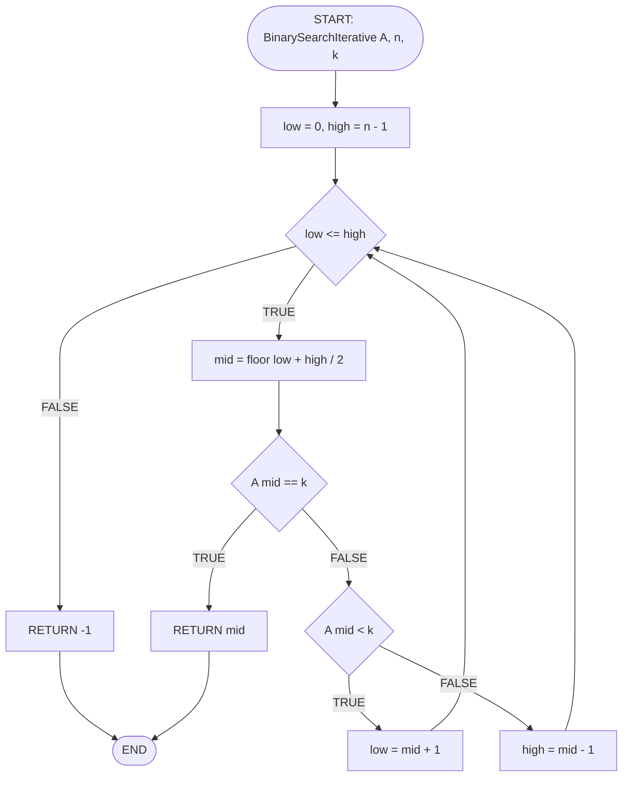
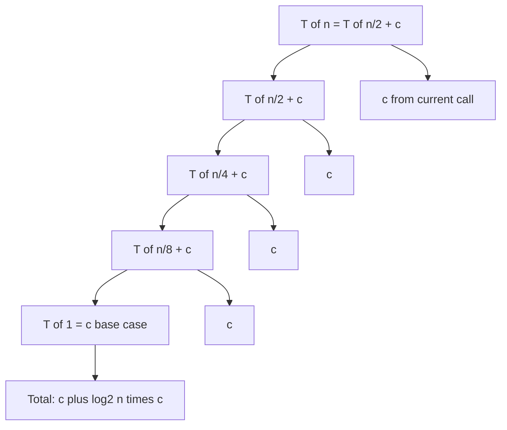
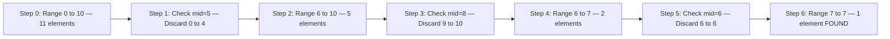
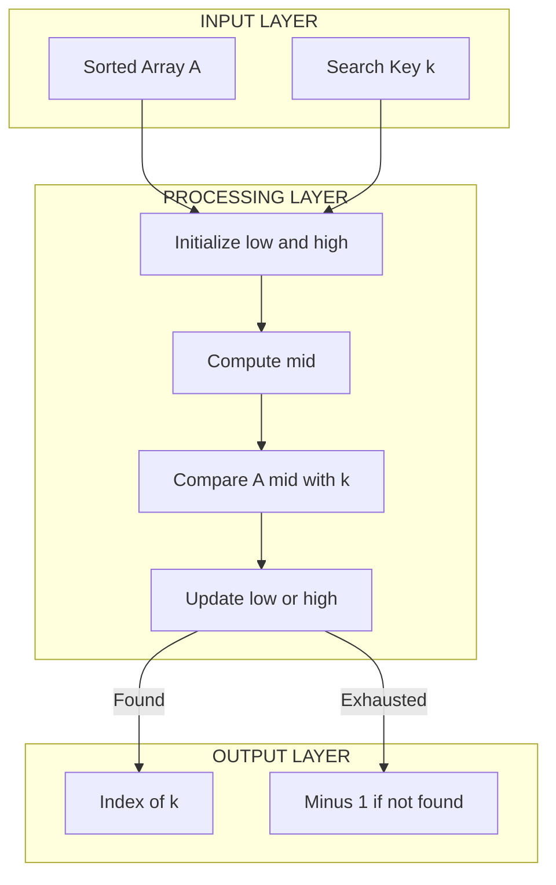

# Binary Search

<!-- SECTION_1_START -->
# Binary Search — Module 4: Sorting and Searching

> [!IMPORTANT]
> **KTU 2024 Scheme (OECST611 — Data Structures)** classifies Binary Search as a **Divide and Conquer** searching technique. It is the most frequently asked algorithm in Part A (3 marks) and frequently appears in Part B (14 marks) as a sub-question. Mastery of this topic is non-negotiable for KTU board examinations.

## 1.1 Formal Definition

**Binary Search** is an efficient searching algorithm used to locate the position of a target value (key) within a **sorted** array (ascending or descending order). It works on the principle of **Divide and Conquer**, where the search space is repeatedly halved by comparing the target element with the **middle element** of the current search interval.

Let the sorted array be $A[0 \ldots n-1]$ and the search key be $k$. At each step, the algorithm:

1. Computes the middle index $mid = \lfloor (low + high) / 2 \rfloor$.
2. Compares $A[mid]$ with the search key $k$.
3. Discards exactly one half of the array where $k$ cannot possibly exist.

> [!NOTE]
> **Pre-condition (Mandatory for KTU Board):** Binary Search **MUST** be applied only on a **sorted array**. Applying it on an unsorted array yields incorrect results and is a guaranteed mark-deduction in KTU valuation. If the array is unsorted, you must first sort it using any $O(n \log n)$ algorithm (e.g., Merge Sort) — a frequently asked KTU theory question.

## 1.2 Intuitive Analogy — "The Dictionary Method"

Imagine you want to find the word **"Quantum"** in a physical English dictionary containing **500 pages**.

- **Naïve / Linear Search:** You start at page 1 and flip page by page until you find "Quantum" — possibly taking up to **500** page-turns in the worst case.
- **Binary Search:** You open the dictionary at the **middle page (page 250)**, see the word "Magnify", and instantly know that "Quantum" must be in the **right half** because Q comes after M alphabetically. You then ignore the left 250 pages entirely.
- You repeat this halving: open the middle of the remaining half (page 375), then page 312, and so on. Within about $\log_2(500) \approx 9$ steps, you land exactly on "Quantum".

> **Geometric Intuition:** If you plot the search range as an interval $[low, high]$ on a number line, Binary Search repeatedly **collapses** this interval by 50% per comparison. After $k$ comparisons, the search space shrinks to $\dfrac{n}{2^k}$. The algorithm terminates when this space becomes $1$, i.e., when $k = \log_2 n$.

## 1.3 Real-World & Engineering Applications

> [!TIP]
> **KTU Board Favourite Question:** *"Give two real-world applications of Binary Search."* (Frequently appears for 2–3 marks)

| Application Domain | How Binary Search is Used |
|--------------------|---------------------------|
| **Database Indexing (B-Trees)** | Searching an index of millions of records in logarithmic time |
| **Git Version Control** | `git bisect` uses binary search to find the commit that introduced a bug |
| **Debugging & Triage** | Finding the first failing version among thousands of releases |
| **Dictionary / Phonebook** | Locating a contact in a sorted contact list |
| **Numerical Computing** | Root-finding using the **Bisection Method** for $f(x) = 0$ |
| **Operating Systems** | Searching sorted memory pages and priority queues |

## 1.4 Visualization Control

> [!VISUALIZATION CONTROL]
> **Concept:** Binary Search Trace on a Sorted Array of 11 elements
>
> **Input Array (sorted ascending):** `[2, 5, 8, 12, 16, 23, 38, 56, 72, 91, 100]`
> **Search Key (k):** `23`
>
> **Trace Coordinates to Plot (iteration number vs. low, high, mid):**
> * Iteration 1: `low=0, high=10, mid=5, A[mid]=23` → **FOUND**
>
> **Visual Description:** On a number line from 0 to 10, the student should observe a single vertical marker at position $5$ (the middle), confirming that 23 is found in just **1 comparison** because of the optimal mid-selection.
>
> **Second Trace (k = 56):**
> * Iteration 1: `low=0, high=10, mid=5, A[mid]=23` → 56 > 23, move right
> * Iteration 2: `low=6, high=10, mid=8, A[mid]=72` → 56 < 72, move left
> * Iteration 3: `low=6, high=7, mid=6, A[mid]=38` → 56 > 38, move right
> * Iteration 4: `low=7, high=7, mid=7, A[mid]=56` → **FOUND**
>
> **Visual Description:** A staircase-step plot showing the search interval shrinking: [0,10] → [6,10] → [6,7] → [7,7]. Each step halves the remaining interval.

<!-- SECTION_1_END -->

<!-- SECTION_2_START -->
# Deep Theoretical Analysis & KTU High-Yield Formula Sheet

## 2.1 Operational Logic — Step-by-Step Breakdown

The Binary Search algorithm can be expressed in two equivalent forms: **Iterative** (loop-based) and **Recursive** (function-call-based). Both are examinable in KTU 2024 Scheme.

### 2.1.1 Iterative Binary Search (KTU Board-Standard Pseudocode)

```
ALGORITHM: BinarySearchIterative(A[0..n-1], n, k)
INPUT:  Sorted array A of size n, and search key k
OUTPUT: Index of k in A if found, else -1

1.  low ← 0
2.  high ← n - 1
3.  WHILE low ≤ high DO
4.      mid ← floor((low + high) / 2)
5.      IF A[mid] == k THEN
6.          RETURN mid              // Element found
7.      ELSE IF A[mid] < k THEN
8.          low ← mid + 1           // Search right half
9.      ELSE
10.         high ← mid - 1          // Search left half
11.     END IF
12. END WHILE
13. RETURN -1                       // Element not found
```

> [!WARNING]
> **Common KTU Mistake — Off-by-One Error:** The loop condition **must** be `low ≤ high` (not `low < high`). If you write `low < high`, the algorithm will **miss the last element** of the array. This is a guaranteed 1-mark deduction in KTU board valuation. Also, always use `mid ← floor((low + high) / 2)` — not `mid ← (low + high) / 2` with floating-point division, which can cause integer overflow in languages like C/C++.

### 2.1.2 Recursive Binary Search (KTU Board-Standard Pseudocode)

```
ALGORITHM: BinarySearchRecursive(A, low, high, k)
INPUT:  Sorted array A, current search range [low, high], search key k
OUTPUT: Index of k in A if found, else -1

1.  IF low > high THEN
2.      RETURN -1                  // Base case: not found
3.  END IF
4.  mid ← floor((low + high) / 2)
5.  IF A[mid] == k THEN
6.      RETURN mid                 // Base case: found
7.  ELSE IF A[mid] < k THEN
8.      RETURN BinarySearchRecursive(A, mid + 1, high, k)
9.  ELSE
10.     RETURN BinarySearchRecursive(A, low, mid - 1, k)
11. END IF
```

**Initial Call:** `BinarySearchRecursive(A, 0, n - 1, k)`

## 2.2 Why Binary Search Works — The "Why" Behind Each Step

| Step | Logic | Justification |
|------|-------|---------------|
| Compute `mid` | Selects the middle element of the current interval | Guarantees the search space is split into two **equal (or near-equal) halves** |
| `A[mid] == k` | Direct match check | If matched, search terminates in the current iteration |
| `A[mid] < k` → discard left | All elements in the left half are ≤ $A[mid] < k$ | Because array is sorted in ascending order, $k$ cannot be in the left half |
| `A[mid] > k` → discard right | All elements in the right half are ≥ $A[mid] > k$ | Because array is sorted, $k$ cannot be in the right half |
| `low > high` | Interval becomes empty | Search key is not present in the array |

> **Key Insight:** At **every comparison**, Binary Search eliminates **at least half** of the remaining search space. This is why its time complexity is logarithmic.

## 2.3 Variants of Binary Search (KTU Favourite Sub-Topic)

The KTU 2024 Scheme frequently asks about **modified binary search** problems. Below are the 3 most important variants:

| Variant | Problem Statement | Modified Return Condition |
|---------|-------------------|---------------------------|
| **Standard Search** | Find exact key $k$ | Return `mid` if $A[mid] == k$, else $-1$ |
| **First Occurrence (Lower Bound)** | Find the **first index** where $A[i] \geq k$ | Continue searching left even on match: `high = mid - 1` |
| **Last Occurrence (Upper Bound)** | Find the **last index** where $A[i] \leq k$ | Continue searching right even on match: `low = mid + 1` |
| **Search in Rotated Sorted Array** | Array is rotated (e.g., `[4,5,6,7,0,1,2]`) | Decide which half is sorted, then check if $k$ lies in the sorted half |

## 2.4 KTU Formula Sheet — Cheat Sheet

> [!IMPORTANT]
> The following table contains **all** the formulas, recurrence relations, and complexity bounds you need for KTU 2024 Scheme Board Examinations.

| # | Concept | Formula / Expression | Description |
|---|---------|----------------------|-------------|
| 1 | Middle Index Calculation | $mid = \lfloor \dfrac{low + high}{2} \rfloor$ | Standard way to find middle element |
| 2 | Overflow-Safe Middle | $mid = low + \lfloor \dfrac{high - low}{2} \rfloor$ | Used in C/C++ to prevent integer overflow |
| 3 | Time Complexity (Best Case) | $T(n) = O(1)$ | Element found at the very first middle check |
| 4 | Time Complexity (Worst Case) | $T(n) = O(\log_2 n)$ | Element not found or found in the last possible comparison |
| 5 | Time Complexity (Average Case) | $T(n) = O(\log_2 n)$ | On average, found after $\log_2 n$ comparisons |
| 6 | Space Complexity (Iterative) | $O(1)$ | Only a few auxiliary variables are used |
| 7 | Space Complexity (Recursive) | $O(\log_2 n)$ | Recursive call stack depth equals $\log_2 n$ |
| 8 | Recurrence Relation | $T(n) = T(n/2) + O(1)$ | One recursive call on half the input, plus constant work |
| 9 | Recurrence Solution (Master Theorem) | $T(n) = O(\log_2 n)$ | $a = 1, b = 2, f(n) = O(1)$ gives Case 2 of Master Theorem |
| 10 | Number of Comparisons (Worst) | $\lfloor \log_2 n \rfloor + 1$ | Maximum comparisons required to confirm absence |
| 11 | Search Space After $k$ Steps | $\dfrac{n}{2^k}$ | Remaining elements after $k$ iterations |
| 12 | Termination Condition | Search space $\leq 1$ | When $\dfrac{n}{2^k} \leq 1 \Rightarrow k \geq \log_2 n$ |
| 13 | Prerequisite | Array must be **sorted** | Otherwise, the halving logic fails |
| 14 | Comparison with Linear Search | $\log_2 n \ll n$ for large $n$ | For $n = 10^6$: Binary = ~20, Linear = $10^6$ |

> [!NOTE]
> **KTU Examiner Tip:** When stating the recurrence $T(n) = T(n/2) + O(1)$, you should also state the **base case** $T(1) = O(1)$ and **solve it using the substitution method or Master Theorem**. Always write the final closed-form solution as $T(n) = O(\log_2 n)$.

<!-- SECTION_2_END -->

<!-- SECTION_3_START -->
# Step-by-Step Derivations & Code Implementation

## 3.1 Mathematical Derivation of Time Complexity

We will derive $T(n) = O(\log_2 n)$ for Binary Search using the **substitution method** and **Master Theorem**.

### 3.1.1 Derivation Using Recurrence Expansion (Substitution Method)

The recurrence relation for the worst-case time complexity of Binary Search is:

$$
T(n) = T\!\left(\frac{n}{2}\right) + c
$$

where $c$ is the constant time for one comparison and the recursive call. The base case is $T(1) = c$.

**Step 1: First Unfolding**

$$
T(n) = T\!\left(\frac{n}{2}\right) + c
$$

**Step 2: Second Unfolding (substitute $T(n/2) = T(n/4) + c$)**

$$
T(n) = T\!\left(\frac{n}{4}\right) + c + c = T\!\left(\frac{n}{4}\right) + 2c
$$

**Step 3: Third Unfolding**

$$
T(n) = T\!\left(\frac{n}{8}\right) + 3c
$$

**Step 4: General Pattern after $k$ Unfoldings**

$$
T(n) = T\!\left(\frac{n}{2^k}\right) + k \cdot c
$$

**Step 5: Apply the Base Case Condition**

The recursion stops when $\dfrac{n}{2^k} = 1$, which gives $2^k = n$, and therefore:

$$
k = \log_2 n
$$

**Step 6: Substitute $k = \log_2 n$ Back**

$$
T(n) = T(1) + (\log_2 n) \cdot c = c + c \cdot \log_2 n
$$

**Step 7: Asymptotic Bound**

$$
T(n) = O(\log_2 n)
$$

$$
\boxed{T(n) = c \cdot \log_2 n + c = O(\log_2 n)}
$$

### 3.1.2 Derivation Using Master Theorem (Alternative — KTU Board Method)

The recurrence $T(n) = a \cdot T(n/b) + f(n)$ with $a = 1$, $b = 2$, $f(n) = O(1)$.

Compute the critical exponent: $\log_b a = \log_2 1 = 0$.

Compare $f(n) = O(1) = O(n^0)$ with $n^{\log_b a} = n^0 = 1$.

Since $f(n) = \Theta(n^0)$, we are in **Case 2** of the Master Theorem:

$$
T(n) = \Theta(n^{\log_b a} \cdot \log_2 n) = \Theta(1 \cdot \log_2 n) = \Theta(\log_2 n)
$$

## 3.2 Worked-Out Example — Manual Trace

**Given:** Sorted array $A = [3, 7, 11, 15, 19, 23, 31, 43, 57]$, $n = 9$, search key $k = 23$.

**Iteration 1:**
* $low = 0$, $high = 8$
* $mid = \lfloor (0 + 8) / 2 \rfloor = 4$
* $A[4] = 19$. Since $23 > 19$, set $low = mid + 1 = 5$.

**Iteration 2:**
* $low = 5$, $high = 8$
* $mid = \lfloor (5 + 8) / 2 \rfloor = 6$
* $A[6] = 31$. Since $23 < 31$, set $high = mid - 1 = 5$.

**Iteration 3:**
* $low = 5$, $high = 5$
* $mid = \lfloor (5 + 5) / 2 \rfloor = 5$
* $A[5] = 23$. Match found! **Return 5**.

**Total Comparisons: 3 = $\lceil \log_2 9 \rceil$** ✓ (matches theoretical bound)

## 3.3 Complete Python Implementation

### 3.3.1 Iterative Binary Search (Production-Ready)

```python
from typing import List, Optional
import logging

# Configure logging to track search operations
logging.basicConfig(
    level=logging.INFO,
    format='%(asctime)s - %(levelname)s - %(message)s'
)


def binary_search_iterative(
    sorted_array: List[int],
    key: int
) -> int:
    """
    Performs iterative binary search on a sorted list.

    Parameters
    ----------
    sorted_array : List[int]
        A list of integers sorted in ascending order.
    key : int
        The value to search for.

    Returns
    -------
    int
        The index of `key` if found, otherwise -1.

    Raises
    ------
    TypeError
        If `sorted_array` is not a list.
    ValueError
        If `sorted_array` is not sorted in ascending order.
    """
    # ---- Input Validation ----
    if not isinstance(sorted_array, list):
        raise TypeError("sorted_array must be of type list.")

    if len(sorted_array) > 1 and any(
        sorted_array[i] > sorted_array[i + 1]
        for i in range(len(sorted_array) - 1)
    ):
        raise ValueError(
            "Binary Search requires a sorted (ascending) array."
        )

    # ---- Core Algorithm ----
    low: int = 0
    high: int = len(sorted_array) - 1
    comparison_count: int = 0

    while low <= high:
        mid: int = (low + high) // 2
        comparison_count += 1
        logging.info(
            f"Comparison {comparison_count}: "
            f"low={low}, high={high}, mid={mid}, "
            f"A[mid]={sorted_array[mid]}"
        )

        if sorted_array[mid] == key:
            logging.info(
                f"Key {key} FOUND at index {mid} "
                f"after {comparison_count} comparisons."
            )
            return mid
        elif sorted_array[mid] < key:
            low = mid + 1
        else:
            high = mid - 1

    logging.warning(
        f"Key {key} NOT FOUND after {comparison_count} comparisons."
    )
    return -1


# ---- Driver Code ----
if __name__ == "__main__":
    data: List[int] = [3, 7, 11, 15, 19, 23, 31, 43, 57]
    result: int = binary_search_iterative(data, 23)
    print(f"Index of 23: {result}")  # Output: 5
```

### 3.3.2 Recursive Binary Search (Production-Ready)

```python
from typing import List


def binary_search_recursive(
    sorted_array: List[int],
    key: int,
    low: Optional[int] = None,
    high: Optional[int] = None
) -> int:
    """
    Performs recursive binary search on a sorted list.

    Parameters
    ----------
    sorted_array : List[int]
        A list of integers sorted in ascending order.
    key : int
        The value to search for.
    low : Optional[int]
        Lower bound of the current search interval.
    high : Optional[int]
        Upper bound of the current search interval.

    Returns
    -------
    int
        The index of `key` if found, otherwise -1.
    """
    # Initialize bounds on first call
    if low is None:
        low = 0
    if high is None:
        high = len(sorted_array) - 1

    # Base case: search interval exhausted
    if low > high:
        return -1

    mid: int = (low + high) // 2

    if sorted_array[mid] == key:
        return mid
    elif sorted_array[mid] < key:
        return binary_search_recursive(sorted_array, key, mid + 1, high)
    else:
        return binary_search_recursive(sorted_array, key, low, mid - 1)


# ---- Driver Code ----
if __name__ == "__main__":
    data: List[int] = [3, 7, 11, 15, 19, 23, 31, 43, 57]
    print(binary_search_recursive(data, 23))   # Output: 5
    print(binary_search_recursive(data, 100))  # Output: -1
```

### 3.3.3 Lower Bound Variant — Find First Occurrence

```python
from typing import List


def lower_bound(sorted_array: List[int], key: int) -> int:
    """
    Returns the leftmost index `i` such that sorted_array[i] >= key.
    If all elements are < key, returns len(sorted_array).
    """
    low, high = 0, len(sorted_array) - 1
    result: int = len(sorted_array)

    while low <= high:
        mid: int = (low + high) // 2
        if sorted_array[mid] >= key:
            result = mid
            high = mid - 1   # Keep searching left for earlier match
        else:
            low = mid + 1
    return result
```

<!-- SECTION_3_END -->

<!-- SECTION_4_START -->
# Structural Diagrams & Schematics

## 4.1 Control Flow Diagram — Iterative Binary Search

> [!NOTE]
> The Mermaid diagram below uses only **alphanumeric node IDs** and **double-quoted plain text labels** in compliance with the Mermaid Compilation Safeguards.



## 4.2 Recursion Tree — Binary Search on 8 Elements



## 4.3 Search Space Halving — Visual Topology



## 4.4 Functional Architecture Block — Binary Search Engine



## 4.5 Comparison Table — Linear vs. Binary Search

| Parameter | Linear Search | Binary Search |
|-----------|---------------|---------------|
| **Pre-condition** | Works on sorted **or** unsorted data | Requires **sorted** array |
| **Time Complexity (Best)** | $O(1)$ | $O(1)$ |
| **Time Complexity (Worst)** | $O(n)$ | $O(\log_2 n)$ |
| **Time Complexity (Average)** | $O(n)$ | $O(\log_2 n)$ |
| **Space Complexity** | $O(1)$ | $O(1)$ iterative, $O(\log_2 n)$ recursive |
| **Method** | Sequential scan | Divide and conquer (halving) |
| **Use Case** | Small / unsorted datasets | Large / sorted datasets |

<!-- SECTION_4_END -->

<!-- SECTION_5_START -->
# KTU 2024 Scheme Examination Question Bank & Topic Recap

> [!IMPORTANT]
> All questions below are modeled precisely on **KTU 2024 Scheme Board Examination** patterns. The internal choice in Part B follows the standard KTU pattern where students answer **either Option A or Option B** in full. Bloom's Taxonomy tags follow the KTU standard: **Remember (L1)**, **Understand (L2)**, **Apply (L3)**, **Analyze (L4)**.

---

## Part A — 3 Mark Questions (Short Answer)

### Question 1 `[KTU University Exam - Dec 2023]`
**(CO1, Remember) — 3 Marks**

**Q: Define Binary Search. List its pre-condition and worst-case time complexity.**

**Model Answer:**

> **Definition:** Binary Search is a divide-and-conquer searching algorithm that finds the position of a target value in a **sorted array** by repeatedly dividing the search interval in half.
>
> **Pre-condition:** The array **must be sorted** (in ascending or descending order).
>
> **Worst-case Time Complexity:** $O(\log_2 n)$, where $n$ is the number of elements.
>
> **[Stating the definition: 1 Mark] [Pre-condition: 1 Mark] [Time complexity with justification: 1 Mark]**

---

### Question 2 `[KTU University Exam - July 2024]`
**(CO1, Understand) — 3 Marks**

**Q: Why is Binary Search preferred over Linear Search for large datasets? Justify with a numerical example for $n = 1024$ elements.**

**Model Answer:**

> Binary Search is preferred because its time complexity is $O(\log_2 n)$, whereas Linear Search is $O(n)$. For $n = 1024$:
>
> * **Linear Search worst case:** $1024$ comparisons.
> * **Binary Search worst case:** $\lfloor \log_2 1024 \rfloor + 1 = 10 + 1 = 11$ comparisons.
>
> Therefore, Binary Search requires **only 11 comparisons** compared to **1024** for Linear Search — a **93x speedup**. This logarithmic advantage grows exponentially for larger $n$.
>
> **[Stating complexities: 1 Mark] [Calculation for n=1024: 1 Mark] [Comparison and conclusion: 1 Mark]**

---

## Part B — 14 Mark Questions (ESE Module Internal Choice)

### Question A `[KTU University Exam - Dec 2023]`
**(CO2, Apply + Analyze) — 14 Marks**

**Q: (a) [7 Marks] Explain the iterative Binary Search algorithm with a neat flowchart. Apply it to search key = 56 in the array A = [10, 20, 30, 40, 50, 56, 60, 70, 80] and show all iterations.**

**Model Solution:**

**Algorithm Steps (Iterative Form):**
1. Initialize $low = 0$, $high = n - 1 = 8$.
2. While $low \leq high$, compute $mid = \lfloor (low + high) / 2 \rfloor$.
3. Compare $A[mid]$ with key $k = 56$.
4. If $A[mid] == k$, return $mid$. If $A[mid] < k$, set $low = mid + 1$. Else, set $high = mid - 1$.
5. If loop terminates without match, return $-1$.

**Iteration Trace:**

| Iteration | low | high | mid | A[mid] | Comparison | Action |
|-----------|-----|------|-----|--------|------------|--------|
| 1 | 0 | 8 | 4 | 50 | 50 < 56 | $low = mid + 1 = 5$ |
| 2 | 5 | 8 | 6 | 60 | 60 > 56 | $high = mid - 1 = 5$ |
| 3 | 5 | 5 | 5 | 56 | **56 == 56** | **FOUND at index 5** |

**Result:** Key 56 is found at **index 5** after **3 comparisons**.

**Flowchart (drawn on answer sheet):**
```
START → low=0, high=n-1 → [low ≤ high?]
   ↓ NO                         ↓ YES
RETURN -1                mid = (low+high)/2
   ↓                          ↓
  END              [A[mid] == k?]
                        ↓ YES       ↓ NO
                    RETURN mid   [A[mid] < k?]
                                      ↓ YES      ↓ NO
                                  low=mid+1  high=mid-1
                                      ↓          ↓
                                  [back to low ≤ high?]
```

**[Algorithm explanation: 2 Marks] [Flowchart: 2 Marks] [Iteration trace table: 2 Marks] [Final result with comparison count: 1 Mark]**

---

**(b) [7 Marks] Derive the time complexity of Binary Search using the recurrence relation. State the recurrence, solve it using the substitution method, and verify using the Master Theorem.**

**Model Solution:**

**Step 1 — State the Recurrence:**

The worst-case time complexity satisfies:

$$
T(n) = T\!\left(\frac{n}{2}\right) + c, \quad T(1) = c
$$

where $c$ is the time for one comparison and the constant-time work of the current call.

**Step 2 — Solve Using Substitution Method:**

Unfolding the recurrence $k$ times:

$$
T(n) = T\!\left(\frac{n}{2^k}\right) + k \cdot c
$$

The recursion terminates when $\dfrac{n}{2^k} = 1 \Rightarrow k = \log_2 n$.

Substituting back:

$$
T(n) = T(1) + (\log_2 n) \cdot c = c + c \cdot \log_2 n
$$

$$
\boxed{T(n) = O(\log_2 n)}
$$

**Step 3 — Verify Using Master Theorem:**

The recurrence is $T(n) = a \cdot T(n/b) + f(n)$ with $a = 1$, $b = 2$, $f(n) = O(1)$.

Compute $\log_b a = \log_2 1 = 0$.

Since $f(n) = O(n^0) = \Theta(n^{\log_b a})$, this is **Case 2** of the Master Theorem:

$$
T(n) = \Theta(n^{\log_b a} \cdot \log n) = \Theta(\log_2 n) \quad \checkmark
$$

**[Stating recurrence: 2 Marks] [Substitution method derivation: 3 Marks] [Master Theorem verification: 2 Marks]**

---

### Question B `[KTU University Exam - July 2024]`
**(CO2, Apply + Analyze) — 14 Marks — ALTERNATIVE TO Question A**

**Q: (a) [7 Marks] Write the recursive algorithm for Binary Search. Trace it for key = 38 in the array A = [5, 12, 18, 25, 33, 38, 44, 50, 61, 70] and show the recursion tree.**

**Model Solution:**

**Recursive Algorithm:**

```
FUNCTION BinarySearchRecursive(A, low, high, k):
    IF low > high THEN
        RETURN -1
    mid ← floor((low + high) / 2)
    IF A[mid] == k THEN
        RETURN mid
    ELSE IF A[mid] < k THEN
        RETURN BinarySearchRecursive(A, mid + 1, high, k)
    ELSE
        RETURN BinarySearchRecursive(A, low, mid - 1, k)
```

**Initial Call:** `BinarySearchRecursive(A, 0, 9, 38)`.

**Trace:**

| Call | low | high | mid | A[mid] | Action |
|------|-----|------|-----|--------|--------|
| 1 | 0 | 9 | 4 | 33 | 33 < 38 → call right half |
| 2 | 5 | 9 | 7 | 50 | 50 > 38 → call left half |
| 3 | 5 | 6 | 5 | 38 | **FOUND → return 5** |

**Result:** 38 is found at **index 5** after **3 recursive calls**.

**Recursion Tree:**

```
BinarySearch(A, 0, 9, 38)
   └── mid=4, A[4]=33, 33<38
       └── BinarySearch(A, 5, 9, 38)
           └── mid=7, A[7]=50, 50>38
               └── BinarySearch(A, 5, 6, 38)
                   └── mid=5, A[5]=38, MATCH
                       └── RETURN 5
```

**[Recursive algorithm: 2 Marks] [Trace table: 2 Marks] [Recursion tree: 2 Marks] [Final answer: 1 Mark]**

---

**(b) [7 Marks] Compare Linear Search and Binary Search in terms of pre-condition, time complexity (best, worst, average), and space complexity. When would you choose Linear Search over Binary Search?**

**Model Solution:**

**Comparison Table:**

| Criterion | Linear Search | Binary Search |
|-----------|---------------|---------------|
| **Pre-condition** | Works on any array (sorted or unsorted) | Requires sorted array |
| **Best Case Time** | $O(1)$ — first element matches | $O(1)$ — middle element matches |
| **Average Case Time** | $O(n)$ | $O(\log_2 n)$ |
| **Worst Case Time** | $O(n)$ | $O(\log_2 n)$ |
| **Space Complexity** | $O(1)$ | $O(1)$ iterative, $O(\log_2 n)$ recursive |
| **Method** | Sequential scan | Divide and conquer (halving) |
| **Stability for Duplicates** | Returns first match (if implemented) | May return any match (use lower-bound for first) |

**When to choose Linear Search over Binary Search:**

1. **When the array is unsorted** and the cost of sorting ($O(n \log n)$) outweighs the search benefit.
2. **For very small datasets** (e.g., $n < 50$), the constant factor of Binary Search may make Linear Search faster in practice.
3. **When data is constantly changing (frequent insertions/deletions)** — maintaining a sorted structure (e.g., a sorted array) is expensive.
4. **For streaming or single-pass data** where the entire dataset is not available in memory.
5. **Linked lists** — Binary Search requires $O(1)$ random access, which linked lists do not provide efficiently.

**[Comparison table: 3 Marks] [5 valid scenarios where Linear Search is preferred: 4 Marks]**

---

> [!WARNING]
> **KTU Examiner's Valuation Warning — Common Pitfalls (2024 Scheme):**
>
> 1. **Forgetting the sorted pre-condition** — A guaranteed 1-mark cut if the student does not explicitly state that the array must be sorted.
> 2. **Wrong loop condition** — Writing `low < high` instead of `low ≤ high` causes the algorithm to miss the last element. Examiners specifically test this.
> 3. **Confusing mid calculation** — Using `(low + high) / 2` as a floating-point division in C/C++ can cause overflow for large arrays. Use `low + (high - low) / 2`.
> 4. **Not mentioning space complexity for recursive form** — The recursive version uses $O(\log_2 n)$ stack space, not $O(1)$. Many students miss this.
> 5. **Skipping the recurrence derivation** — When asked to "derive the time complexity", you **must** show the recurrence $T(n) = T(n/2) + c$ and solve it. Simply writing $O(\log_2 n)$ without derivation yields 0 marks.
> 6. **Forgetting the base case** — The recursive algorithm must explicitly handle $T(1) = c$ or the `low > high` base case.
> 7. **Integer overflow in `mid = (low + high) / 2`** — KTU examiners from the Computer Science branch may deduct 0.5 marks for not mentioning the overflow-safe variant in language-specific questions.

---

## Topic Recap & Important Things to Remember

> [!TIP]
> **High-density revision checklist for KTU 2024 Scheme Board Examination.**

- **Definition:** Binary Search is a **divide-and-conquer** algorithm for finding a target in a **sorted array** by repeatedly halving the search interval.
- **Mandatory Pre-condition:** Array **must be sorted** (ascending or descending).
- **Core Operation:** Compare target with $A[mid]$ where $mid = \lfloor (low + high) / 2 \rfloor$.
- **Loop Condition:** `low ≤ high` (NOT `low < high` — off-by-one trap).
- **Recurrence Relation:** $T(n) = T(n/2) + O(1)$ with base case $T(1) = O(1)$.
- **Time Complexity (All Cases):** $O(\log_2 n)$ — Best, Worst, and Average are all logarithmic because of the halving property.
- **Space Complexity:** $O(1)$ for iterative, $O(\log_2 n)$ for recursive (call stack).
- **Maximum Comparisons:** $\lfloor \log_2 n \rfloor + 1$.
- **Number of Elements After $k$ Steps:** $\dfrac{n}{2^k}$.
- **Master Theorem Identification:** $a = 1$, $b = 2$, $f(n) = O(1)$ → **Case 2** → $T(n) = \Theta(\log_2 n)$.
- **Two Forms:** Iterative (preferred in KTU for space efficiency) and Recursive (cleaner to write).
- **Overflow-Safe Mid:** Use $mid = low + \lfloor (high - low) / 2 \rfloor$ in C/C++ for very large arrays.
- **Variants Asked in KTU:** Lower Bound (first occurrence), Upper Bound (last occurrence), Search in Rotated Sorted Array.
- **Comparison with Linear Search:** $O(\log_2 n) \ll O(n)$ — for $n = 10^6$, Binary needs ~20 comparisons vs. Linear's $10^6$.
- **Practical Applications:** Database indexing, `git bisect`, bisection method for root finding, dictionary lookup.
- **Termination:** Algorithm stops when `low > high` (search space exhausted) — returns $-1$.
- **Stability:** Standard binary search does NOT guarantee finding the first occurrence in duplicate arrays — use the lower-bound variant for that.
- **Linked List Limitation:** Binary Search is **infeasible on linked lists** because $O(1)$ random access to $A[mid]$ is not available.
- **Decision Tree Depth:** The binary search decision tree has height $\lceil \log_2(n+1) \rceil$, which directly corresponds to the worst-case number of comparisons.
- **Famous KTU Trick Question:** "Can Binary Search be applied to a sorted linked list?" — **Answer: No (efficiently)** because finding $A[mid]$ takes $O(n)$ time in a linked list, making the overall complexity $O(n \log n)$.

<!-- SECTION_5_END -->
