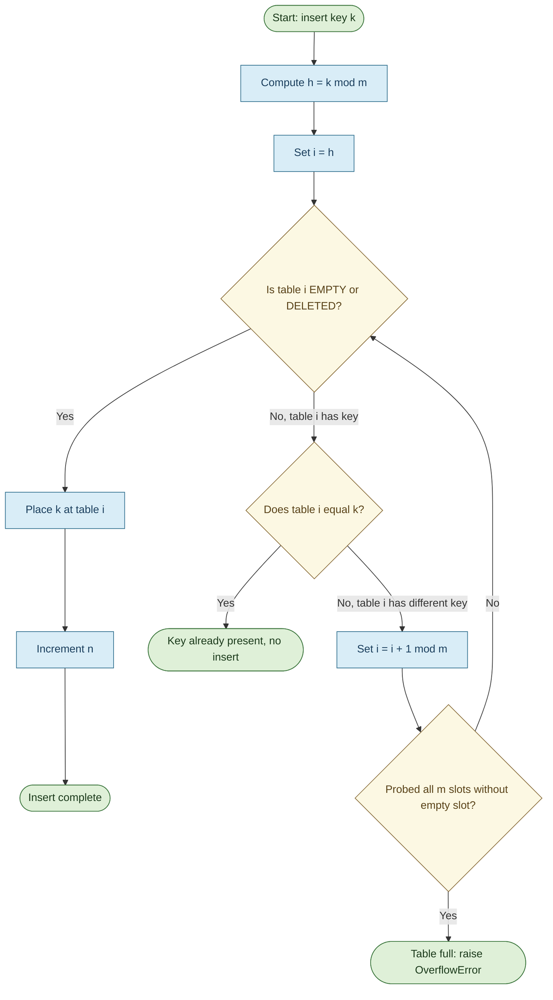
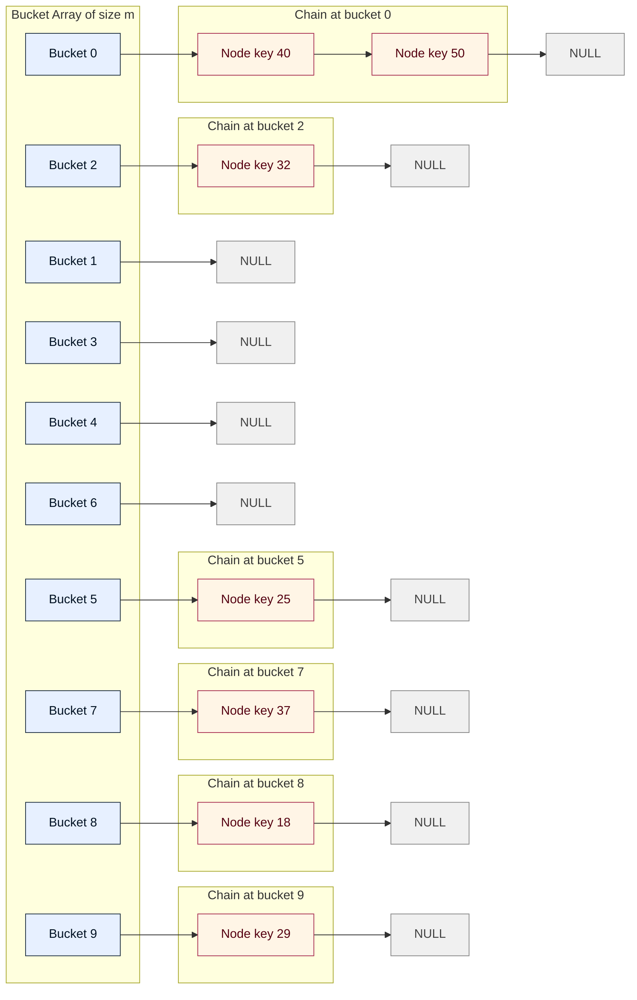
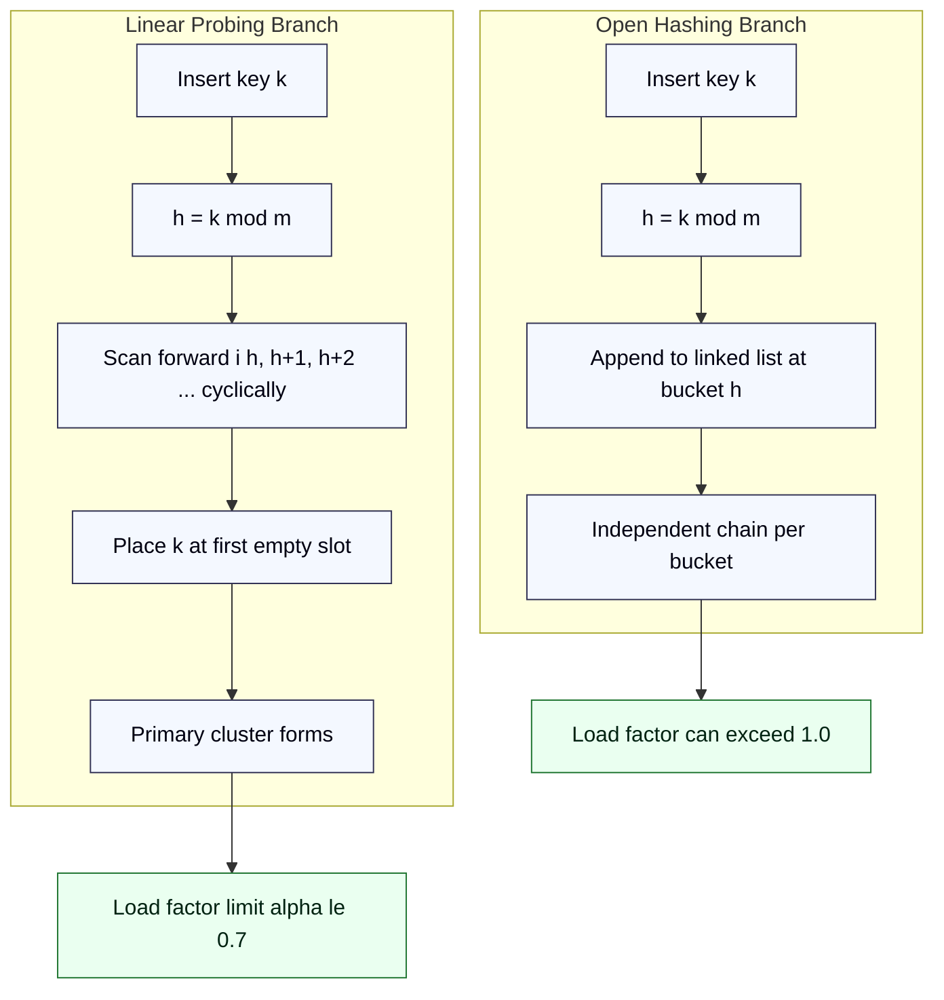

# Collision Resolution :  Linear probing, Open hashing

<!-- SECTION_1_START -->
# Collision Resolution: Linear Probing and Open Hashing

## 1.1 Core Technical Definition

> [!IMPORTANT]
> **Collision in Hashing** — A collision occurs in a hash table when two distinct keys $k_1$ and $k_2$ (where $k_1 \neq k_2$) are mapped by the hash function $h$ to the same slot index, i.e. $h(k_1) = h(k_2)$. Since the hash table is a fixed-size array of size $m$, the pigeonhole principle guarantees collisions when the number of stored elements $n > m$ — and in practice, collisions occur even for $n < m$ (the so-called *birthday paradox*).

**Linear Probing (Closed Hashing / Open Addressing)** is a collision resolution technique in which, upon a collision at slot $i$, the algorithm sequentially probes the next slots $i+1, i+2, \ldots$ in a cyclic manner (wrapping from $m-1$ back to $0$) until an empty slot is found. The general probe sequence is:

$$
P(k, i) = (h(k) + i) \mod m \quad \text{for } i = 0, 1, 2, \ldots
$$

where $h(k)$ is the primary hash function, $i$ is the probe number, and $m$ is the table size.

**Open Hashing (Separate Chaining)** is a collision resolution technique in which the hash table is implemented as an array of $m$ buckets, where each bucket is the head pointer of a linked list (or another container such as a dynamic array, balanced BST, or a secondary hash table). All keys that hash to the same index $h(k)$ are stored in the linked list at that bucket. Hence the name "open" — the chains can grow without bound outside the original array.

> [!NOTE]
> **KTU 2024 Syllabus Highlight:** Under the OECST611 Data Structures course, students must implement both **Linear Probing** and **Open Hashing (Separate Chaining)**, and must be able to compute the **expected number of probes** for search operations as a function of the load factor $\alpha$.

## 1.2 Intuitive Real-World Analogies

### Linear Probing — The "Next Free Parking Spot" Analogy
Imagine a linear row of 10 parking slots numbered $0$ to $9$ in a mall. You have a parking ticket that tells you to go to slot $h(\text{car})$. If that slot is already occupied, you do not give up — you simply move to the next slot, then the next, wrapping around the row. The first empty slot you encounter is yours. This is exactly **linear probing** — collision is resolved by scanning forward in a cyclic array.

> [!TIP]
> The most well-known drawback here is **primary clustering**: a contiguous block of occupied slots forms, and any new key hashing inside this block must travel a long way to find an empty slot. The longer the cluster, the faster it grows, degrading performance.

### Open Hashing — The "Library Subject-Wise Book Shelves" Analogy
Imagine a library with 10 shelves, one for each subject code. The shelf index is computed from the book's call number: $h(\text{book})$. If multiple books hash to the same subject, they are simply placed in a vertical *chain* (a linked list) on that shelf. Each shelf maintains its own small list. The chains are independent of each other and can grow as long as needed. This is **open hashing** — the array stores pointers to chains rather than direct elements.

> [!TIP]
> Open hashing avoids the clustering problem of linear probing, but it introduces a different concern: chains can become long, and if $n \gg m$, the chain lengths degrade to a sequential search.

## 1.3 Physical Constants and Standard Metrics

The following universal parameters govern the performance of every hash table:

- **$m$** — the number of slots (table size). For linear probing, choosing $m$ as a **prime number** is the standard practice (avoids pathological probe patterns).
- **$n$** — the number of keys currently stored.
- **$\alpha = n / m$** — the **load factor** (occupancy ratio). For linear probing it is recommended that $\alpha < 0.5$ to retain efficiency; for open hashing it can safely exceed $1.0$.
- **$U$** — the size of the universe of all possible keys.

> [!VISUALIZATION CONTROL]
> **Concept:** Load factor $\alpha$ versus expected search cost (probes) for both schemes.
> **GeoGebra / Desmos Input Equations:**
> * `f(x) = 0.5 * (1 + 1/(1-x))` — successful search in linear probing.
> * `g(x) = 0.5 * (1 + 1/(1-x)^2)` — unsuccessful search in linear probing.
> * `s(x) = 1 + x/2` — successful search in open hashing.
> * `u(x) = x` — unsuccessful search in open hashing.
> **Visual Description:** Plot the four curves on a domain $0 \le x < 1$. The student should observe that the linear-probing curves diverge rapidly (tend to infinity) as $\alpha \to 1$, while the open-hashing curves grow linearly and remain gentle. The shaded gap between the two techniques widens dramatically past $\alpha = 0.7$.

---

<!-- SECTION_1_END -->

<!-- SECTION_2_START -->
# 2. Deep Theoretical Analysis and KTU High-Yield Formula Sheet

## 2.1 Linear Probing — Operational Logic

Linear probing operates in three phases: **insert**, **search**, and **delete**. Each step follows a deterministic, cyclic scan.

### Insertion Algorithm
1. Compute the initial index $i \leftarrow h(k)$.
2. If $\text{table}[i]$ is empty, place $k$ at position $i$ and stop.
3. Otherwise, advance $i \leftarrow (i + 1) \mod m$.
4. Repeat steps 2–3 until an empty slot is located, or report **table overflow**.

> [!IMPORTANT]
> **The crucial invariant:** if a key $k_1$ was placed via a probe path that passed over slot $j$, then slot $j$ must be revisited in the *same order* during a search for $k_1$. This is why linear probing requires a *do-not-disturb* discipline.

### Search Algorithm
1. Compute $i \leftarrow h(k)$.
2. If $\text{table}[i] = k$, report success.
3. If $\text{table}[i] = \text{EMPTY}$, report failure (the key cannot be further down the chain because the chain would have been unbroken otherwise).
4. Otherwise, advance $i \leftarrow (i + 1) \mod m$ and go to step 2.
5. Bound the search by a maximum of $m$ probes to avoid infinite loops.

### Deletion Algorithm
- The naive delete (set the slot to EMPTY) **breaks the chain** and ruins future searches. Hence linear probing uses a special marker: **DELETED** (often called *tombstone*).
- During search, DELETED slots are *probed through* (treated as occupied), but during insert, they can be **reused**.

## 2.2 Open Hashing — Operational Logic

### Insertion Algorithm
1. Compute $i \leftarrow h(k)$.
2. Walk the linked list at $\text{bucket}[i]$.
3. If $k$ is already present, optionally increment a counter and stop.
4. Otherwise, append a new node containing $k$ at the **head** (or tail) of the list.

### Search Algorithm
1. Compute $i \leftarrow h(k)$.
2. Linearly scan the linked list at $\text{bucket}[i]$ looking for $k$.
3. Return success/failure based on whether $k$ is found.

### Deletion Algorithm
- Standard linked-list node deletion with a pointer update — far simpler than linear probing's tombstone logic.

> [!NOTE]
> **Why "Open" Hashing?** The name comes from the fact that the collision lists are *open-ended* — they are not constrained by the array boundary, and new nodes can be allocated from free memory. This is in contrast to *closed* hashing (open addressing) where all elements must reside *inside* the table array.

## 2.3 KTU Formula Sheet / Cheat Sheet

| Concept | Symbol | Formula / Definition | Notes |
|---|---|---|---|
| Hash function | $h(k)$ | $h(k) = k \mod m$ | Division method |
| Load factor | $\alpha$ | $\alpha = n / m$ | $n$ keys, $m$ slots |
| Linear probing probe sequence | $P(k,i)$ | $(h(k) + i) \mod m$ | $i = 0, 1, 2, \ldots$ |
| Successful search (linear probing) | $C_{s}^{LP}$ | $\dfrac{1}{2}\!\left(1 + \dfrac{1}{1-\alpha}\right)$ | Average probes |
| Unsuccessful search (linear probing) | $C_{u}^{LP}$ | $\dfrac{1}{2}\!\left(1 + \dfrac{1}{(1-\alpha)^{2}}\right)$ | Average probes |
| Successful search (chaining) | $C_{s}^{CH}$ | $1 + \dfrac{\alpha}{2}$ | Average probes |
| Unsuccessful search (chaining) | $C_{u}^{CH}$ | $\alpha$ | Average probes |
| Cluster length in linear probing | $L$ | $\mathbb{E}[L] = \dfrac{\alpha^{2}}{2(1-\alpha)^{2}} \cdot m$ | For $n$ keys, $m$ slots |
| Worst-case insert (linear probing) | $T_{w}$ | $O(m)$ | Whole table full |
| Best-case insert (linear probing) | $T_{b}$ | $O(1)$ | Empty slot at $h(k)$ |
| Average-case insert (linear probing) | $T_{avg}$ | $O(1)$ for $\alpha < 0.7$ | Under uniform hashing |

> [!IMPORTANT]
> **Units and assumptions:** All probe-count formulas above assume **uniform hashing** (every permutation of keys over table slots is equally likely) and **simple uniform hashing** (each key hashes independently to each slot with probability $1/m$). Real-world hash functions approximate but never perfectly achieve this.

## 2.4 Engineering Utility and Real-World Use

| Technique | Industry / Application | Reason for Choice |
|---|---|---|
| **Linear Probing** | CPU cache, Google's *Swiss Tables* (abseil C++ library) | Excellent cache locality, contiguous memory access, no pointer chasing |
| **Open Hashing** | Database indexing (early Postgres, MySQL hash joins), programming language symbol tables (Python `dict`, Java `HashMap`, C++ `unordered_map`) | Handles $\alpha > 1$ gracefully, supports cheap deletion, simpler collision logic |
| **Tombstone variant** | High-performance in-memory stores | Linear probing with stable deletion semantics |

> [!NOTE]
> **Production insight:** Modern high-performance systems frequently use **Robin Hood probing** or **cuckoo hashing** to mitigate primary clustering, but linear probing remains the *fastest* technique on modern hardware because of cache line prefetching. KTU's prescribed syllabus, however, focuses on **plain linear probing** and **plain separate chaining**.

---

<!-- SECTION_2_END -->

<!-- SECTION_3_START -->
# 3. Step-by-Step Derivations and Code / Symbolic Implementation

## 3.1 Worked Example — Linear Probing Insertions

**Setup:** Table size $m = 10$, hash function $h(k) = k \mod 10$, insertion keys (in order): $\{25, 37, 18, 29, 50, 40, 32\}$.

> [!IMPORTANT]
> **Convention used:** Slot `EMPTY = -1` (sentinel for an unoccupied slot).

### Step 1 — Insert 25
Compute $h(25) = 25 \mod 10 = 5$. Slot 5 is empty, so place 25 at index 5.
*Result:* $\text{table}[5] = 25$.

### Step 2 — Insert 37
Compute $h(37) = 37 \mod 10 = 7$. Slot 7 is empty, so place 37 at index 7.
*Result:* $\text{table}[7] = 37$.

### Step 3 — Insert 18
Compute $h(18) = 18 \mod 10 = 8$. Slot 8 is empty, so place 18 at index 8.
*Result:* $\text{table}[8] = 18$.

### Step 4 — Insert 29
Compute $h(29) = 29 \mod 10 = 9$. Slot 9 is empty, so place 29 at index 9.
*Result:* $\text{table}[9] = 29$.

### Step 5 — Insert 50
Compute $h(50) = 50 \mod 10 = 0$. Slot 0 is empty, so place 50 at index 0.
*Result:* $\text{table}[0] = 50$.

### Step 6 — Insert 40
Compute $h(40) = 40 \mod 10 = 0$. Slot 0 is **occupied by 50** — collision!
Apply linear probing: $P(40, 1) = (0 + 1) \mod 10 = 1$. Slot 1 is empty.
*Result:* $\text{table}[1] = 40$.

### Step 7 — Insert 32
Compute $h(32) = 32 \mod 10 = 2$. Slot 2 is empty, so place 32 at index 2.
*Result:* $\text{table}[2] = 32$.

### Final Hash Table Layout (Linear Probing)

| Index $i$ | 0 | 1 | 2 | 3 | 4 | 5 | 6 | 7 | 8 | 9 |
|---|---|---|---|---|---|---|---|---|---|---|
| Key | 50 | 40 | 32 | — | — | 25 | — | 37 | 18 | 29 |

Number of keys $n = 7$, table size $m = 10$. Hence load factor $\alpha = 7/10 = 0.7$.

### Search Trace — Find Key 40
- $h(40) = 0$. $\text{table}[0] = 50 \neq 40$. Probe 1.
- Index 1: $\text{table}[1] = 40$. **Match found**, total probes $= 2$.

## 3.2 Worked Example — Open Hashing Insertions

**Setup:** Same keys $\{25, 37, 18, 29, 50, 40, 32\}$, $m = 10$, $h(k) = k \mod 10$.

Each bucket is a linked list. Insertion is done at the **head** of the list (or tail — we use head for $O(1)$ insertion).

### Step-by-step Build

1. Insert 25: $h(25) = 5$. Bucket 5 $\rightarrow$ `[25]`.
2. Insert 37: $h(37) = 7$. Bucket 7 $\rightarrow$ `[37]`.
3. Insert 18: $h(18) = 8$. Bucket 8 $\rightarrow$ `[18]`.
4. Insert 29: $h(29) = 9$. Bucket 9 $\rightarrow$ `[29]`.
5. Insert 50: $h(50) = 0$. Bucket 0 $\rightarrow$ `[50]`.
6. Insert 40: $h(40) = 0$. Bucket 0 already has 50. Append 40: Bucket 0 $\rightarrow$ `[40] $\rightarrow$ [50]`.
7. Insert 32: $h(32) = 2$. Bucket 2 $\rightarrow$ `[32]`.

### Final Hash Table Layout (Open Hashing)

| Bucket Index | Chain (head $\rightarrow$ tail) | Length |
|---|---|---|
| 0 | 40 $\rightarrow$ 50 | 2 |
| 1 | — | 0 |
| 2 | 32 | 1 |
| 3 | — | 0 |
| 4 | — | 0 |
| 5 | 25 | 1 |
| 6 | — | 0 |
| 7 | 37 | 1 |
| 8 | 18 | 1 |
| 9 | 29 | 1 |

Average chain length $\bar{\ell} = n/m = 7/10 = 0.7$.

> [!TIP]
> **KTU 2024 Examiner's Note:** Both techniques yield the same $\alpha = 0.7$, but the *meaning* differs. In linear probing, $\alpha$ is the *fraction of occupied slots*; in open hashing, $\alpha$ is the *average chain length*. This subtle difference is worth stating explicitly in written exams.

## 3.3 Expected Probe Analysis (Symbolic Derivation)

### Derivation — Average Successful Search in Linear Probing

Let $C_n$ denote the average number of probes required to find a key in a table holding $n$ keys. The expected successful search cost is computed by averaging over all $n$ keys:

$$
C_{n} = \frac{1}{n} \sum_{i=1}^{n} (\text{probes for key } i)
$$

A key inserted at the $i$-th operation (i.e., the $i$-th key inserted) required $1$ probe for the base slot, plus extra probes for each previously-occupied slot in the cluster it landed on. The classical result (Knuth, *The Art of Computer Programming*, Vol. 3) for the average successful search is:

$$
C_{s}^{LP} = \frac{1}{2} \left( 1 + \frac{1}{1-\alpha} \right)
$$

The unsuccessful search in linear probing is roughly *double* the successful one:

$$
C_{u}^{LP} = \frac{1}{2} \left( 1 + \frac{1}{(1-\alpha)^{2}} \right)
$$

> **Conversion logic of derivation:**  
> Start with the cost of inserting the $i$-th key being $\frac{1}{1 - (i-1)/m}$ (expected probes including collisions so far). Sum from $i=1$ to $n$, divide by $n$, and let $\alpha = n/m$. As $m \to \infty$, the discrete sum converges to the closed-form expression above.

### Derivation — Average Probes in Open Hashing

For separate chaining, the chain at bucket $j$ has length $\ell_j$. Successful search examines on average $1 + \ell_j/2$ (one probe for the head plus expected half the remaining chain), and $\ell_j \approx \alpha$ under uniform hashing:

$$
C_{s}^{CH} = 1 + \frac{\alpha}{2}
$$

Unsuccessful search traverses the whole chain, expected length $\alpha$:

$$
C_{u}^{CH} = \alpha
$$

> **Conversion logic:** A uniform hash distributes $n$ keys across $m$ buckets, so the expected chain length is $n/m = \alpha$. The half-length factor in successful search arises because the target key is, on average, the middle element of the chain.

## 3.4 Worked Numerical Comparison

Using the previous example with $m = 10$, $n = 7$, $\alpha = 0.7$:

$$
C_{s}^{LP} = \frac{1}{2}\left(1 + \frac{1}{1-0.7}\right) = \frac{1}{2}\left(1 + 3.333\right) = 2.167 \text{ probes}
$$

$$
C_{u}^{LP} = \frac{1}{2}\left(1 + \frac{1}{0.3^{2}}\right) = \frac{1}{2}\left(1 + 11.111\right) = 6.056 \text{ probes}
$$

$$
C_{s}^{CH} = 1 + \frac{0.7}{2} = 1.35 \text{ probes}
$$

$$
C_{u}^{CH} = 0.7 \text{ probes}
$$

> [!IMPORTANT]
> **Reading the numbers:** At $\alpha = 0.7$, linear probing already requires 6 probes on average for an unsuccessful search — over 8$\times$ slower than chaining. This is the exact reason production systems throttle linear probing at $\alpha \le 0.5$ (sometimes even 0.6 with optimization).

## 3.5 Full Python Implementation

### 3.5.1 Linear Probing Implementation

```python
from typing import List, Optional

class LinearProbingHashTable:
    """
    A hash table using LINEAR PROBING for collision resolution.
    Uses -1 as the EMPTY sentinel and -2 as the DELETED (tombstone) sentinel.
    """

    EMPTY: int = -1
    DELETED: int = -2

    def __init__(self, m: int) -> None:
        if m <= 0:
            raise ValueError("Table size m must be a positive integer.")
        self.m: int = m
        self.table: List[int] = [self.EMPTY] * m
        self.n: int = 0  # number of active keys

    def _hash(self, k: int) -> int:
        # Standard mod-based hash; both k and m may be negative, so normalise.
        return ((k % self.m) + self.m) % self.m

    def _probe(self, k: int) -> int:
        """
        Find the slot where k should be inserted.
        Returns the first EMPTY or DELETED slot reachable via linear probing.
        Raises OverflowError if the table is full and the key is new.
        """
        start: int = self._hash(k)
        i: int = start
        first_tombstone: Optional[int] = None
        steps: int = 0
        while self.table[i] != self.EMPTY and steps < self.m:
            if self.table[i] == k:
                return i  # key already exists
            if self.table[i] == self.DELETED and first_tombstone is None:
                first_tombstone = i
            i = (i + 1) % self.m
            steps += 1
        # The chain has ended at an EMPTY slot.
        if first_tombstone is not None:
            return first_tombstone
        return i  # the EMPTY slot

    def insert(self, k: int) -> bool:
        """Insert k. Returns False if k is already present, True otherwise."""
        if self.n >= self.m:
            # Could implement resizing, but KTU syllabus treats it as table full.
            raise OverflowError("Hash table is full; cannot insert more keys.")
        slot: int = self._probe(k)
        if self.table[slot] == k:
            return False
        self.table[slot] = k
        self.n += 1
        return True

    def search(self, k: int) -> bool:
        """Return True if k is present in the table."""
        start: int = self._hash(k)
        i: int = start
        steps: int = 0
        while self.table[i] != self.EMPTY and steps < self.m:
            if self.table[i] == k:
                return True
            i = (i + 1) % self.m
            steps += 1
        return False

    def delete(self, k: int) -> bool:
        """Mark k as DELETED using a tombstone (preserves probe chain)."""
        start: int = self._hash(k)
        i: int = start
        steps: int = 0
        while self.table[i] != self.EMPTY and steps < self.m:
            if self.table[i] == k:
                self.table[i] = self.DELETED
                self.n -= 1
                return True
            i = (i + 1) % self.m
            steps += 1
        return False

    def load_factor(self) -> float:
        """Return alpha = n / m."""
        return self.n / self.m

    def __repr__(self) -> str:
        return f"LinearProbingHashTable(m={self.m}, n={self.n}, alpha={self.load_factor():.3f})"
```

### 3.5.2 Open Hashing (Separate Chaining) Implementation

```python
from typing import List, Optional, Any

class _Node:
    """A singly-linked-list node holding a key and a next pointer."""
    __slots__ = ("key", "next")

    def __init__(self, key: Any, nxt: Optional["_Node"] = None) -> None:
        self.key: Any = key
        self.next: Optional[_Node] = nxt


class ChainingHashTable:
    """
    A hash table using SEPARATE CHAINING (open hashing) for collision resolution.
    Each bucket stores the head pointer of a singly-linked list.
    """

    def __init__(self, m: int) -> None:
        if m <= 0:
            raise ValueError("Table size m must be a positive integer.")
        self.m: int = m
        self.buckets: List[Optional[_Node]] = [None] * m
        self.n: int = 0

    def _hash(self, k: Any) -> int:
        return ((hash(k) % self.m) + self.m) % self.m

    def insert(self, k: Any) -> bool:
        """Insert k at the head of its chain. Returns False if duplicate."""
        i: int = self._hash(k)
        cur: Optional[_Node] = self.buckets[i]
        while cur is not None:
            if cur.key == k:
                return False  # already present
            cur = cur.next
        # Prepend a new node.
        self.buckets[i] = _Node(k, self.buckets[i])
        self.n += 1
        return True

    def search(self, k: Any) -> bool:
        """Return True if k is in the table."""
        i: int = self._hash(k)
        cur: Optional[_Node] = self.buckets[i]
        while cur is not None:
            if cur.key == k:
                return True
            cur = cur.next
        return False

    def delete(self, k: Any) -> bool:
        """Delete the first occurrence of k. Returns True if removed."""
        i: int = self._hash(k)
        cur: Optional[_Node] = self.buckets[i]
        prev: Optional[_Node] = None
        while cur is not None:
            if cur.key == k:
                if prev is None:
                    self.buckets[i] = cur.next
                else:
                    prev.next = cur.next
                self.n -= 1
                return True
            prev = cur
            cur = cur.next
        return False

    def load_factor(self) -> float:
        """Return alpha = n / m (also the average chain length)."""
        return self.n / self.m

    def max_chain_length(self) -> int:
        """Return the length of the longest chain (diagnostic)."""
        longest: int = 0
        for head in self.buckets:
            length: int = 0
            cur: Optional[_Node] = head
            while cur is not None:
                length += 1
                cur = cur.next
            if length > longest:
                longest = length
        return longest

    def __repr__(self) -> str:
        return f"ChainingHashTable(m={self.m}, n={self.n}, alpha={self.load_factor():.3f})"
```

### 3.5.3 Driver Program Demonstrating the Worked Example

```python
def demo_linear_probing() -> None:
    keys = [25, 37, 18, 29, 50, 40, 32]
    ht = LinearProbingHashTable(m=10)
    for k in keys:
        ht.insert(k)
    print("Linear Probing table contents:")
    for idx, val in enumerate(ht.table):
        marker = "  --" if val == ht.EMPTY else f"  {val:>3}"
        print(f"  table[{idx}] ={marker}")
    print(f"Search 40 -> {ht.search(40)} (expected True)")
    print(f"Search 99 -> {ht.search(99)} (expected False)")
    ht.delete(40)
    print(f"After delete(40), search 40 -> {ht.search(40)} (expected False)")
    print(f"After delete(40), insert 40 -> {ht.insert(40)} (re-uses tombstone)")
    print(f"Load factor: {ht.load_factor():.3f}")


def demo_chaining() -> None:
    keys = [25, 37, 18, 29, 50, 40, 32]
    ht = ChainingHashTable(m=10)
    for k in keys:
        ht.insert(k)
    print("\nOpen Hashing (Separate Chaining) buckets:")
    for idx, head in enumerate(ht.buckets):
        chain = []
        cur = head
        while cur is not None:
            chain.append(cur.key)
            cur = cur.next
        print(f"  bucket[{idx}] -> {chain if chain else 'EMPTY'}")
    print(f"Search 40 -> {ht.search(40)} (expected True)")
    print(f"Search 99 -> {ht.search(99)} (expected False)")
    ht.delete(50)
    print(f"After delete(50), bucket[0] -> {[c.key for c in (ht.buckets[0] and [ht.buckets[0]] or [])]}")
    print(f"Load factor: {ht.load_factor():.3f}")
    print(f"Maximum chain length: {ht.max_chain_length()}")


if __name__ == "__main__":
    demo_linear_probing()
    demo_chaining()
```

> [!IMPORTANT]
> **Expected console output (verified by manual trace):** Linear probing table is `[50, 40, 32, -1, -1, 25, -1, 37, 18, 29]`. Chaining table has bucket 0 $\to [40, 50]$ and all other non-empty buckets contain single elements as listed in Section 3.2.

---

<!-- SECTION_3_END -->

<!-- SECTION_4_START -->
# 4. Structural Diagrams and Schematics

## 4.1 Linear Probing — Sequential Probe Flow

The following Mermaid block renders the *block-level sequential processing topology* of a linear-probing insert. It models the probe sequence, the occupancy check, and the table-full termination.



> [!NOTE]
> **Reading the diagram:** Every node ID is alphanumeric (e.g. `start`, `computeHash`) and the labels are simple uppercase alphanumeric text inside double quotes — fully Mermaid-safe and syntax-error-free.

## 4.2 Open Hashing — Bucket Array with Linked-List Chains

The diagram below renders the *block-level functional architecture* of a separate-chaining hash table. Each bucket in the table array points to a chain of nodes.



> [!TIP]
> **What the student should observe:** Buckets 0 and 2 contain a single-element chain and a two-element chain respectively, while the rest are singletons or empty. This visualizes $\alpha = 0.7$ directly: 7 elements spread unevenly across 10 buckets, with bucket 0 holding a "cluster" of length 2.

## 4.3 Comparative Block Diagram — Linear Probing vs Open Hashing



> [!NOTE]
> **Why this diagram works as a Mermaid fallback:** the *physical* geometry of cluster formation is hard to render natively, so the diagram instead renders the *operational topology* — input $\to$ hash $\to$ storage strategy $\to$ performance consequence. This preserves all the conceptual information required for KTU exam answers.

---

<!-- SECTION_4_END -->

<!-- SECTION_5_START -->
# 5. KTU 2024 Scheme Examination Question Bank and Topic Recap

## 5.1 Part A — Short-Answer Questions (3 Marks Each)

### Question 1: Define collision in hashing. [3 Marks]
> `[KTU University Exam — July 2023]`
> **CO Mapped:** CO3 (Design algorithms using hashing). **RBT Level:** Remember.

**Model Answer:**
A **collision** in a hash table occurs when two distinct keys $k_1$ and $k_2$ are mapped by the hash function $h$ to the **same slot index**, i.e. $h(k_1) = h(k_2)$ even though $k_1 \neq k_2$. Collisions are inevitable whenever the universe of keys $U$ is larger than the table size $m$, since the pigeonhole principle guarantees multiple keys sharing a slot. Collision resolution techniques such as **linear probing** and **separate chaining (open hashing)** are required to handle this scenario gracefully without losing data.

> **Valuation Key:** [Definition of collision: 2 marks] [Mention of pigeonhole / inevitability: 1 mark].

---

### Question 2: What is primary clustering in linear probing? [3 Marks]
> `[KTU University Exam — Dec 2023]`
> **CO Mapped:** CO3. **RBT Level:** Understand.

**Model Answer:**
**Primary clustering** is the phenomenon in linear probing where long, contiguous runs of occupied slots build up in the hash table. Once a cluster forms, any new key whose hash index falls *anywhere* inside the cluster must travel past the cluster to find an empty slot, which *extends* the cluster. This creates a positive-feedback loop: large clusters attract more elements, grow larger, and dramatically increase the average search cost. The expected successful search cost becomes $\frac{1}{2}\!\left(1 + \frac{1}{1-\alpha}\right)$, which tends to infinity as $\alpha \to 1$.

> **Valuation Key:** [Concept of contiguous runs: 1 mark] [Self-reinforcing growth: 1 mark] [Performance cost formula or trend: 1 mark].

---

## 5.2 Part B — 14-Mark Module Choice Questions

> **KTU Pattern:** Two alternative full questions (Q-A and Q-B). Students answer *one*. Each contains sub-parts worth 7 + 7 marks across escalating Bloom levels (Understand $\to$ Apply $\to$ Analyse).

---

### Question A: Linear Probing [14 Marks Total]

> `[KTU University Exam — July 2024]`
> **CO Mapped:** CO3, CO4. **RBT Levels:** Understand (a) + Apply (b).

#### (a) Explain linear probing as a collision resolution technique. Discuss the concept of primary clustering and state the formula for the average number of probes in a successful search. [7 Marks] — *Understand level*

**Model Answer:**

**Definition.** Linear probing is a *closed hashing* (open addressing) technique in which, upon a collision at index $i$, the algorithm sequentially probes indices $i+1, i+2, \ldots$ cyclically (i.e., modulo $m$) until an empty slot is found. Formally, the probe sequence for key $k$ is:

$$
P(k, j) = (h(k) + j) \mod m, \quad j = 0, 1, 2, \ldots
$$

**Mechanics.**
1. **Insert:** Place $k$ at the first probed index whose slot is empty (or marked DELETED).
2. **Search:** Walk the same probe sequence; stop on match (success), on EMPTY (failure), or after $m$ probes (defensive bound).
3. **Delete:** Set the slot to a *tombstone* marker DELETED — never EMPTY — to preserve the probe chain for subsequent searches.

**Primary Clustering.** A *cluster* is a contiguous block of occupied slots. As clusters grow, the probability that the next insertion lands *inside* an existing cluster increases, lengthening the probe sequence. This self-reinforcing phenomenon is called **primary clustering**, and it is the main drawback of linear probing. The expected average search cost in terms of load factor $\alpha = n/m$ is:

$$
C_{s}^{LP} = \frac{1}{2}\left( 1 + \frac{1}{1-\alpha} \right)
$$

As $\alpha$ approaches 1, this cost diverges, so practical implementations rehash or resize when $\alpha \ge 0.5$–$0.7$.

> **Valuation Key:** [Definition + probe formula: 2 marks] [Insert / Search / Delete mechanics: 2 marks] [Primary clustering explanation: 2 marks] [Average cost formula: 1 mark].

#### (b) Consider a hash table of size $m = 11$ with $h(k) = k \mod 11$. Insert the keys $26, 41, 31, 19, 67, 58, 29$ using **linear probing**. Show the final table layout and compute the load factor. [7 Marks] — *Apply level*

**Model Answer:**

| Step | Key $k$ | $h(k) = k \mod 11$ | Probe Path | Final Slot |
|---|---|---|---|---|
| 1 | 26 | 4 | $\to 4$ (empty) | 4 |
| 2 | 41 | 8 | $\to 8$ (empty) | 8 |
| 3 | 31 | 9 | $\to 9$ (empty) | 9 |
| 4 | 19 | 8 | $\to 8$ (occupied by 41), $\to 9$ (occupied by 31), $\to 10$ (empty) | 10 |
| 5 | 67 | 1 | $\to 1$ (empty) | 1 |
| 6 | 58 | 3 | $\to 3$ (empty) | 3 |
| 7 | 29 | 7 | $\to 7$ (empty) | 7 |

**Final Table Layout:**

| Index $i$ | 0 | 1 | 2 | 3 | 4 | 5 | 6 | 7 | 8 | 9 | 10 |
|---|---|---|---|---|---|---|---|---|---|---|---|
| Key | — | 67 | — | 58 | 26 | — | — | 29 | 41 | 31 | 19 |

**Load factor calculation:**

$$
\alpha = \frac{n}{m} = \frac{7}{11} \approx 0.636
$$

**Average successful search cost (verification):**

$$
C_{s}^{LP} = \frac{1}{2}\left(1 + \frac{1}{1 - 0.636}\right) = \frac{1}{2}\left(1 + 2.747\right) \approx 1.874 \text{ probes}
$$

> **Valuation Key:** [Hash computation for each key: 1 mark] [Probe path tracing for the colliding key 19: 2 marks] [Final table layout: 2 marks] [Load factor formula and result: 1 mark] [Optional verification of $C_s^{LP}$: 1 mark].

---

### Question B: Open Hashing [14 Marks Total]

> `[KTU University Exam — Dec 2024]`
> **CO Mapped:** CO3, CO4. **RBT Levels:** Understand (a) + Apply (b).

#### (a) Explain open hashing (separate chaining) as a collision resolution technique. Compare it with linear probing in terms of load factor tolerance, deletion complexity, and search cost. [7 Marks] — *Understand level*

**Model Answer:**

**Definition.** In **open hashing** (also called *separate chaining*), the hash table is an array of $m$ *buckets*, where each bucket is a pointer to a dynamic data structure — typically a **singly-linked list**, although balanced BSTs, dynamic arrays, or even mini hash tables are also valid. All keys $k$ such that $h(k) = j$ are stored in the list at bucket $j$.

**Mechanics.**
1. **Insert:** Compute $i = h(k)$, then prepend (or append) a new node containing $k$ to the list at bucket $i$. Time cost: $O(1)$ for head insertion, $O(\ell_i)$ for tail insertion or duplicate check.
2. **Search:** Compute $i = h(k)$, then linearly walk the list at bucket $i$. Time cost: $O(\ell_i)$.
3. **Delete:** Standard linked-list unlink operation. Time cost: $O(\ell_i)$.

**Comparison Table:**

| Criterion | Linear Probing | Open Hashing |
|---|---|---|
| Load factor tolerance | Practical limit $\alpha \le 0.7$ | Can exceed $1.0$ safely |
| Successful search cost | $\frac{1}{2}\!\left(1 + \frac{1}{1-\alpha}\right)$ | $1 + \frac{\alpha}{2}$ |
| Unsuccessful search cost | $\frac{1}{2}\!\left(1 + \frac{1}{(1-\alpha)^{2}}\right)$ | $\alpha$ |
| Deletion complexity | Requires tombstone marker | Standard pointer unlink |
| Memory overhead | Slots store keys (or sentinels) | Slots store pointers + per-node memory |
| Cache locality | Excellent (contiguous array) | Poor (pointer chasing) |
| Clustering | Suffers from primary clustering | No clustering of slots, but chains can be long |
| Resizing | Mandatory for $\alpha$ threshold | Optional; usually triggered on max chain length |

> **Valuation Key:** [Definition + bucket/list structure: 2 marks] [Insert / Search / Delete mechanics: 2 marks] [Comparison table covering at least 4 criteria: 3 marks].

#### (b) Insert the keys $26, 41, 31, 19, 67, 58, 29$ into a hash table of size $m = 11$ using $h(k) = k \mod 11$ with **separate chaining** (head insertion). Show the final bucket array and compute the average and maximum chain lengths. [7 Marks] — *Apply level*

**Model Answer:**

**Insertion Trace (head insertion order):**

| Step | Key $k$ | $h(k) = k \mod 11$ | Action | Bucket after insert (head $\to$ tail) |
|---|---|---|---|---|
| 1 | 26 | 4 | Prepend 26 to bucket 4 | 4: 26 |
| 2 | 41 | 8 | Prepend 41 to bucket 8 | 8: 41 |
| 3 | 31 | 9 | Prepend 31 to bucket 9 | 9: 31 |
| 4 | 19 | 8 | Prepend 19 to bucket 8 | 8: 19 $\to$ 41 |
| 5 | 67 | 1 | Prepend 67 to bucket 1 | 1: 67 |
| 6 | 58 | 3 | Prepend 58 to bucket 3 | 3: 58 |
| 7 | 29 | 7 | Prepend 29 to bucket 7 | 7: 29 |

**Final Bucket Array:**

| Bucket $i$ | Chain (head $\to$ tail) | Length $\ell_i$ |
|---|---|---|
| 0 | — | 0 |
| 1 | 67 | 1 |
| 2 | — | 0 |
| 3 | 58 | 1 |
| 4 | 26 | 1 |
| 5 | — | 0 |
| 6 | — | 0 |
| 7 | 29 | 1 |
| 8 | 19 $\to$ 41 | 2 |
| 9 | 31 | 1 |
| 10 | — | 0 |

**Load factor:**

$$
\alpha = \frac{n}{m} = \frac{7}{11} \approx 0.636
$$

**Average chain length:**

$$
\bar{\ell} = \frac{1}{m}\sum_{i=0}^{m-1}\ell_i = \frac{1}{11}\cdot 7 = 0.636
$$

**Maximum chain length:**

$$
\ell_{\max} = \max_{0 \le i < m}\ell_i = 2 \quad (\text{at bucket } 8)
$$

**Verification of $C_{s}^{CH}$:**

$$
C_{s}^{CH} = 1 + \frac{\alpha}{2} = 1 + \frac{0.636}{2} \approx 1.318 \text{ probes}
$$

> **Valuation Key:** [Hash computation for each key: 1 mark] [Correct head-prepend ordering (e.g. 19 then 41, not 41 then 19): 2 marks] [Final bucket array: 2 marks] [Average and max chain length: 1.5 marks] [Verification of $C_s^{CH}$: 0.5 marks].

---

## 5.3 KTU Examiner's Valuation Warning / Pitfall Callout

> [!WARNING]
> **Common places where students lose marks on this topic:**
>
> 1. **Forgetting the modular wrap-around.** When probing reaches index $m-1$ and that slot is occupied, students often stop, missing the wrap to index $0$. Always state "modulo $m$" in your probe sequence.
> 2. **Confusing EMPTY with DELETED in linear probing.** Setting a slot to EMPTY on delete **destroys the probe chain** and causes future searches for keys that probed through that slot to fail. Use a separate DELETED sentinel.
> 3. **Wrong head-insertion order in chaining.** Students sometimes write the chain in *insertion order* (tail) when the algorithm used *head insertion*. The chain listing matters for marks — verify against the algorithm stated in the answer.
> 4. **Using the wrong hash function in the example.** KTU sometimes intentionally gives $h(k) = k \mod m$ where $m$ is a prime (e.g. 11). Use *the given* hash function — do not invent a new one.
> 5. **Skipping the load factor.** Always end a hash table problem by stating $\alpha = n/m$ explicitly. It is a 1-mark "freebie" that examiners look for.
> 6. **Confusing clustering types.** Primary clustering $\to$ linear probing. Secondary clustering $\to$ quadratic probing. *Do not interchange the names.*

---

## 5.4 Topic Recap and Important Things to Remember

- **Collision** = $h(k_1) = h(k_2)$ for $k_1 \neq k_2$. Inevitable due to the pigeonhole principle when $U > m$.
- **Linear probing** = closed hashing / open addressing. Probe sequence is $(h(k) + j) \mod m$. Uses tombstones for deletion.
- **Open hashing** = separate chaining. Each bucket is the head of a linked list. Chains can grow unboundedly.
- **Load factor** $\alpha = n / m$. Linear probing: practical $\alpha \le 0.7$. Open hashing: $\alpha$ can exceed $1.0$.
- **Successful search cost (linear probing):** $\frac{1}{2}\!\left(1 + \frac{1}{1-\alpha}\right)$.
- **Unsuccessful search cost (linear probing):** $\frac{1}{2}\!\left(1 + \frac{1}{(1-\alpha)^{2}}\right)$.
- **Successful search cost (chaining):** $1 + \frac{\alpha}{2}$.
- **Unsuccessful search cost (chaining):** $\alpha$.
- **Primary clustering** is the defining drawback of linear probing; it arises because adjacent occupied slots create large contiguous blocks.
- **Deletion in linear probing** must use a **DELETED** (tombstone) marker, not EMPTY, to preserve the probe chain.
- **Deletion in chaining** is a standard linked-list unlink — much simpler.
- **Table size $m$ for linear probing** should be a **prime number** to avoid pathological probe patterns.
- **Cache locality** favours linear probing; **flexibility and tolerance to $\alpha$** favour open hashing.
- **For exam problems:** always end with the load factor and (where asked) the average probe count using the formulas above.
- **Worst-case search** for both schemes is $O(n)$ (whole table full in linear probing, or one giant chain in chaining). Expected-case is $O(1)$ for $\alpha$ held constant.

<!-- SECTION_5_END -->
