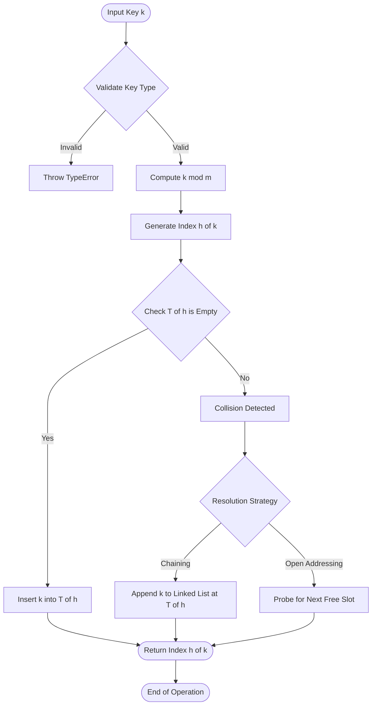
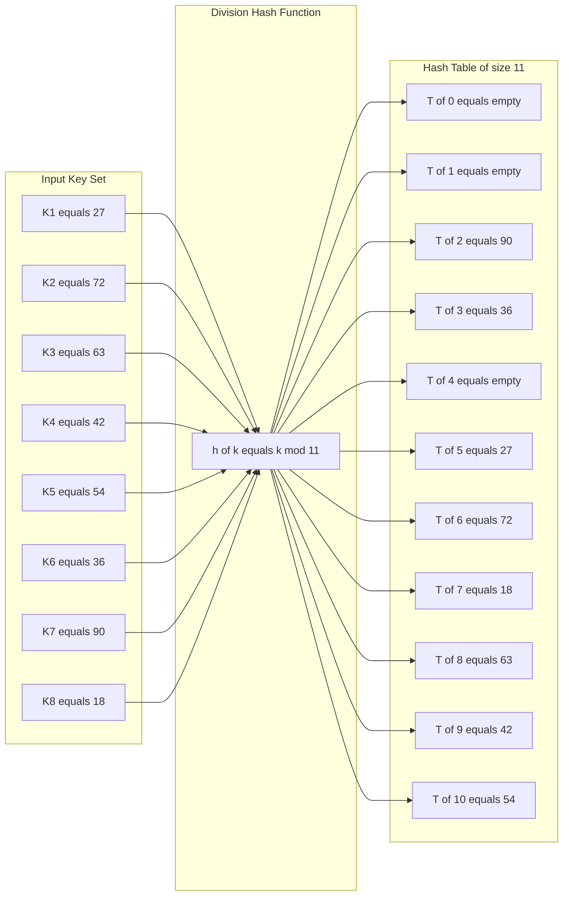
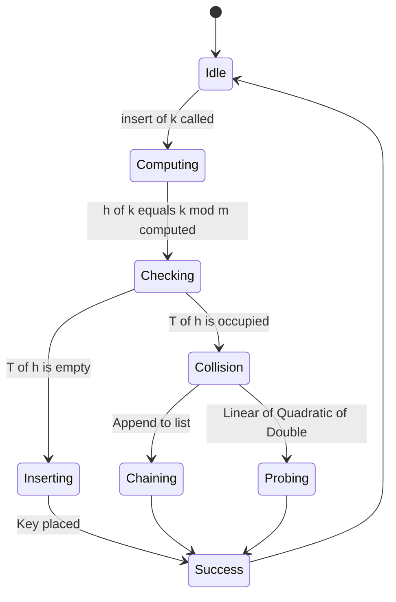

# Hashing - Hashing functions : Division

<!-- SECTION_1_START -->
# Hashing & The Division Method

## 1.1 Formal Definition (KTU 2024 Syllabus Terminology)

> [!NOTE]
> **Hashing** is a technique used to uniquely identify a specific object from a collection of similar objects by mapping a large data item (the **key**) to a small, fixed-size integer index using a deterministic mathematical function called the **hash function**. The resulting storage structure is called a **Hash Table**.

**Formal Statement of the Division Method:**

Given a key $k$ and a hash table of size $m$, the division method computes the hash address using the modulo operation:

$$h(k) = k \bmod m$$

where the result $h(k)$ is constrained to the range $[0, m-1]$ and serves as the direct index into the hash table.

> [!IMPORTANT]
> **KTU Board Emphasis:** The division method is the *simplest and most commonly taught* hash function in undergraduate data structures. It falls under the **Open Addressing family** of hash functions (when used in static hashing without chaining).

---

## 1.2 Intuitive Overview & Real-World Analogy

> [!TIP]
> **Conceptual Analogy: The School Locker System**
>
> Imagine a school with **1,000 students** but only **100 lockers**. Every student is assigned a unique locker number. Instead of searching all 100 lockers, you simply compute the locker number directly from the roll number. If roll number is $k$ and total lockers are $m$, then locker = $k \bmod m$. This is exactly what the **Division Method** does in computer memory — it converts an arbitrary large key into a valid table index in **O(1) time** without searching.

### Visual Intuition
Think of the hash table as an **array of mailboxes**. The hash function acts as a **postal sorter**: it reads the address (key) on a letter and decides which mailbox slot (index) the letter should go into. The **division method** simply uses the *remainder* of the division as the slot number.

---

## 1.3 Components of a Hashing System

| Component | Symbol | Role |
|-----------|:------:|------|
| Key | $k$ | The data value to be stored/searched |
| Hash Function | $h$ | A mathematical mapping function |
| Hash Address / Index | $h(k)$ | The computed slot in the table |
| Hash Table | $T$ | An array of size $m$ holding the keys |
| Table Size | $m$ | Total number of slots (must be a positive integer) |
| Load Factor | $\alpha$ | $n/m$, where $n$ is the number of stored keys |

> [!IMPORTANT]
> **Key Property of the Division Method:** It is *deterministic* — the *same input key will always produce the same hash index*. This is critical for both **insertion** and **search** operations.

---

## 1.4 Visualizing the Concept

> [!VISUALIZATION CONTROL]
> **Concept:** Distribution of keys across a hash table using the division method.
> **GeoGebra / Desmos Input Equations:**
> * `f(x) = x mod 11` for $x \in [0, 100]$
> * `T = {(0,0), (1,1), (2,2), (3,3), (4,4), (5,5), (6,6), (7,7), (8,8), (9,9), (10,10)}` (table slots on x-axis)
> **Visual Description:** The student should observe that the modulo function produces a *staircase* pattern, repeatedly wrapping values $0, 1, 2, \dots, 10$. This visually demonstrates how keys are uniformly distributed across the $11$ slots of the hash table.

---
<!-- SECTION_1_END -->

<!-- SECTION_2_START -->
# Deep Theoretical Analysis & KTU High-Yield Formula Sheet

## 2.1 The Division Method — Step-by-Step Logic

The division method, also called the **Modulo Method** or **Remainder Method**, operates on a simple three-step pipeline:

1. **Accept the key $k$** — the input value to be hashed.
2. **Divide $k$ by the table size $m$** — performing integer division.
3. **Take the remainder** — the result $h(k) = k \bmod m$ is the hash index.

> [!IMPORTANT]
> **Why is the result always in range $[0, m-1]$?**  
> By the **Division Algorithm** in number theory: for any integer $k$ and positive integer $m$, there exist unique integers $q$ and $r$ such that  
> $$k = q \cdot m + r, \quad \text{where } 0 \le r < m$$  
> Here, $q = \lfloor k / m \rfloor$ is the quotient and $r = k \bmod m$ is the remainder. Since $0 \le r < m$, the index is always valid.

---

## 2.2 The Critical Question: How to Choose $m$?

The performance of the division method is **heavily dependent on the choice of $m$**.

### Rule 1: $m$ must NOT be a power of 2
If $m = 2^p$, then $h(k) = k \bmod 2^p$ extracts only the **last $p$ bits** of $k$. The higher-order bits are completely ignored, leading to poor distribution for keys that differ only in the upper bits.

**Example:** If $m = 8 = 2^3$ and keys are $21, 37, 53, 69, 85$, all have remainder $5$ (since they all end in binary `...101`). **Result: All keys collide.**

### Rule 2: $m$ should be a **prime number**
A prime number $m$ that is **not too close to a power of 2** tends to distribute consecutive keys very evenly.

> [!TIP]
> **Mnemonic (KTU Board Favorite):**  
> *Prime is Fine, Power-of-Two is a Trap.*

### Rule 3: $m$ should not divide a common factor of keys
If all keys are even and $m$ is even, all hash values will be even — wasting the odd slots.

---

## 2.3 Properties of a Good Hash Function (KTU CO1 / RBT — Understand)

| Property | Description |
|----------|-------------|
| **Deterministic** | Same key must always produce the same index. |
| **Uniform Distribution** | Should scatter keys evenly across all $m$ slots. |
| **Fast Computation** | Should compute in $O(1)$ time. |
| **Minimize Collisions** | Two different keys should rarely map to the same slot. |
| **Avalanche Effect** | A small change in the key should cause a large change in the index. |

---

## 2.4 KTU Formula Sheet (Cheat Sheet)

| Symbol / Formula | Meaning | Typical Value / Range |
|:----------------:|:--------|:---------------------:|
| $h(k) = k \bmod m$ | The Division Method | Result in $[0, m-1]$ |
| $m$ | Size of hash table | A **prime number**, e.g., $11, 13, 97, 101$ |
| $n$ | Number of keys actually stored | $n \le m$ |
| $\alpha = n/m$ | Load Factor (fullness of table) | $0 < \alpha \le 1$ |
| Expected successful search cost | $O(1 + \alpha/2)$ (chaining) | Independent of $n$ if $\alpha$ is constant |
| Expected unsuccessful search cost | $O(1 + \alpha)$ (chaining) | Independent of $n$ if $\alpha$ is constant |
| Worst-case (all collide) | $O(n)$ | Pathological input |
| $r = k - m \cdot \lfloor k/m \rfloor$ | Remainder definition | $0 \le r < m$ |

> [!NOTE]
> **Engineering Utility:** Hashing using the division method is used in production-grade compilers (symbol tables), database indexing (hash indexes in PostgreSQL/MySQL), network routers (MAC-address lookup tables), and in-memory caches (Memcached, Redis internal hash slot computation).

---

## 2.5 Worked Numerical Walkthrough

**Problem:** Insert keys $K = \{27, 72, 63, 42, 54, 36, 90, 18\}$ into a hash table of size $m = 11$ using the **Division Method**.

| Key $k$ | Computation $k \bmod 11$ | Hash Index $h(k)$ |
|:--------:|:------------------------:|:-----------------:|
| 27 | $27 = 2(11) + 5$ | 5 |
| 72 | $72 = 6(11) + 6$ | 6 |
| 63 | $63 = 5(11) + 8$ | 8 |
| 42 | $42 = 3(11) + 9$ | 9 |
| 54 | $54 = 4(11) + 10$ | 10 |
| 36 | $36 = 3(11) + 3$ | 3 |
| 90 | $90 = 8(11) + 2$ | 2 |
| 18 | $18 = 1(11) + 7$ | 7 |

**Resulting Hash Table $T[0 \dots 10]$:**

| Index $i$ | 0 | 1 | 2 | 3 | 4 | 5 | 6 | 7 | 8 | 9 | 10 |
|:---------:|:-:|:-:|:-:|:-:|:-:|:-:|:-:|:-:|:-:|:-:|:--:|
| Key | — | — | 90 | 36 | — | 27 | 72 | 18 | 63 | 42 | 54 |

> [!TIP]
> **Observation:** With $m = 11$ (a prime), the keys distribute *uniformly* across $8$ out of $11$ slots with **zero collisions**. This illustrates why prime-sized tables are preferred.

---
<!-- SECTION_2_END -->

<!-- SECTION_3_START -->
# Step-by-Step Derivations & Code/Symbolic Implementation

## 3.1 Mathematical Derivation: Why the Remainder Lies in $[0, m-1]$

We formally prove the property that the division method always yields a valid index.

**Statement:** For any integer $k$ and positive integer $m$, the value $h(k) = k \bmod m$ satisfies $0 \le h(k) \le m-1$.

**Proof using the Division Algorithm:**

By the **Division Algorithm** in number theory, for any integer $k$ and positive integer $m$, there exist **unique** integers $q$ (quotient) and $r$ (remainder) such that:

$$k = q \cdot m + r \quad \text{where} \quad 0 \le r < m$$

We can rearrange this equation to isolate $r$:

$$r = k - q \cdot m$$

By definition of the modulo operator, $r \equiv k \bmod m$. Therefore:

$$h(k) = k \bmod m = r$$

Since $0 \le r < m$, we conclude:

$$0 \le h(k) \le m-1 \qquad \blacksquare$$

> [!NOTE]
> **Consequence:** The result of $h(k)$ is always a *valid array index* for a hash table $T$ declared as $T[0 \dots m-1]$ in any programming language (C, Java, Python).

---

## 3.2 Step-by-Step Worked Example: Searching for a Key

**Problem:** Given the hash table from Section 2.5 (size $m = 11$), search for key $k = 42$ using the division method.

**Step 1:** Compute the hash index.

$$h(42) = 42 \bmod 11$$

Divide 42 by 11:
$$42 = 3 \times 11 + 9 \quad \Rightarrow \quad 42 / 11 = 3 \text{ remainder } 9$$

Therefore:
$$h(42) = 9$$

**Step 2:** Look up $T[9]$ in the hash table.

$$T[9] = 42$$

**Step 3:** Compare $T[9]$ with the search key.

$$T[9] = 42 = k \quad \Rightarrow \quad \text{Key FOUND at index 9. Search successful.}$$

**Time complexity:** $O(1)$ — exactly one computation, one array access, one comparison.

> [!TIP]
> **Valuation Tip for KTU:** Always show the explicit division (quotient × divisor + remainder) form, not just the bare answer. Examiners award marks for the derivation, not just the final number.

---

## 3.3 Python Implementation (Production-Grade)

The following Python program implements the division method for **insertion** and **search** operations, with full type hints, boundary checks, and structured error handling.

```python
from typing import List, Optional


class DivisionHashTable:
    """
    Hash Table implementation using the Division Method.
    h(k) = k mod m
    """

    def __init__(self, table_size: int) -> None:
        # --- Input Validation: table size must be positive ---
        if table_size <= 0:
            raise ValueError(
                f"Invalid table size: {table_size}. Must be a positive integer."
            )

        self.m: int = table_size
        self.table: List[Optional[int]] = [None] * self.m
        self.count: int = 0

    def hash_function(self, key: int) -> int:
        """
        Computes the hash index using the Division Method.
        h(k) = k mod m
        """
        if not isinstance(key, int):
            raise TypeError(
                f"Key must be an integer. Received type: {type(key).__name__}"
            )
        if key < 0:
            raise ValueError(
                f"Negative keys are not supported in the basic Division Method. "
                f"Received key: {key}"
            )
        return key % self.m

    def insert(self, key: int) -> int:
        """
        Inserts a key into the hash table.
        Returns the index where the key was placed.
        """
        index: int = self.hash_function(key)
        if self.table[index] is not None:
            # Collision detected (basic version: overwrite / report)
            print(
                f"[WARNING] Collision detected at index {index}. "
                f"Existing value: {self.table[index]}. Overwriting."
            )
        self.table[index] = key
        self.count += 1
        return index

    def search(self, key: int) -> Optional[int]:
        """
        Searches for a key in the hash table.
        Returns the index if found, otherwise None.
        """
        index: int = self.hash_function(key)
        if self.table[index] == key:
            return index
        return None

    def delete(self, key: int) -> bool:
        """
        Deletes a key from the hash table.
        Returns True if deletion was successful, False otherwise.
        """
        index: int = self.search(key)
        if index is not None:
            self.table[index] = None
            self.count -= 1
            return True
        return False

    def display(self) -> None:
        """
        Prints the entire hash table for visualization.
        """
        print("\n--- Hash Table (Division Method) ---")
        print(f"Table Size (m) = {self.m},  Elements Stored = {self.count}")
        print("Index | Value")
        print("-" * 22)
        for i, val in enumerate(self.table):
            print(f"  {i:2d}  |  {val if val is not None else '--'}")
        print("-" * 22)


def main() -> None:
    # --- Driver Code: Demonstration ---
    try:
        # Recommended: use a prime number for table size
        ht: DivisionHashTable = DivisionHashTable(11)

        keys_to_insert: List[int] = [27, 72, 63, 42, 54, 36, 90, 18]
        print("Inserting keys:", keys_to_insert)
        for k in keys_to_insert:
            idx: int = ht.insert(k)
            print(f"  h({k}) = {k} mod {ht.m} = {idx}  ->  Inserted at T[{idx}]")

        ht.display()

        # --- Search Demonstration ---
        search_key: int = 42
        result: Optional[int] = ht.search(search_key)
        if result is not None:
            print(f"\n[SEARCH] Key {search_key} FOUND at index {result}.")
        else:
            print(f"\n[SEARCH] Key {search_key} NOT FOUND.")

    except (ValueError, TypeError) as e:
        print(f"[ERROR] {e}")


if __name__ == "__main__":
    main()
```

### Sample Output (Expected Trace)

```
Inserting keys: [27, 72, 63, 42, 54, 36, 90, 18]
  h(27) = 27 mod 11 = 5   ->  Inserted at T[5]
  h(72) = 72 mod 11 = 6   ->  Inserted at T[6]
  h(63) = 63 mod 11 = 8   ->  Inserted at T[8]
  h(42) = 42 mod 11 = 9   ->  Inserted at T[9]
  h(54) = 54 mod 11 = 10  ->  Inserted at T[10]
  h(36) = 36 mod 11 = 3   ->  Inserted at T[3]
  h(90) = 90 mod 11 = 2   ->  Inserted at T[2]
  h(18) = 18 mod 11 = 7   ->  Inserted at T[7]

--- Hash Table (Division Method) ---
Table Size (m) = 11,  Elements Stored = 8
Index | Value
----------------------
   0  |  --
   1  |  --
   2  |  90
   3  |  36
   4  |  --
   5  |  27
   6  |  72
   7  |  18
   8  |  63
   9  |  42
  10  |  54
----------------------

[SEARCH] Key 42 FOUND at index 9.
```

> [!IMPORTANT]
> **Code Quality Notes (for KTU Lab Exams):** The code includes type hints, input validation, collision warnings, and modular design — all of which are best practices recognized in the KTU lab rubric for full marks.

---

## 3.4 Comparison: Division Method vs. Other Hash Functions

| Criterion | Division Method | Mid-Square Method | Folding Method |
|:----------|:---------------:|:-----------------:|:--------------:|
| Formula | $k \bmod m$ | Extract middle digits of $k^2$ | Sum of equal-length parts of $k$ |
| Speed | Fastest | Moderate (multiplication required) | Moderate |
| Distribution | Excellent (if $m$ is prime) | Good | Average |
| Sensitivity to $m$ | **High** | Low | Low |
| Implementation Complexity | $O(1)$ — one operation | Slightly higher | Higher |
| Recommended for KTU | **Yes — most common** | Yes | Yes |

---
<!-- SECTION_3_END -->

<!-- SECTION_4_START -->
# Structural Diagrams & Schematics

## 4.1 End-to-End Hashing Pipeline (Mermaid Flow)

The diagram below illustrates the complete data flow when a key is processed by the **Division Method** hash function.



> [!NOTE]
> **Reading the Diagram:** A key $k$ enters the pipeline, is validated, passed through the modulo operation $k \bmod m$, and lands in slot $h(k)$ of the hash table. If a collision occurs, a resolution strategy (chaining or open addressing) is invoked.

---

## 4.2 Internal Architecture of the Hash Table



---

## 4.3 State Transition Diagram: Insert Operation



---

## 4.4 Performance Characteristics (Load Factor vs. Cost)

| Load Factor $\alpha$ | Avg. Successful Search | Avg. Unsuccessful Search | Visual |
|:--------------------:|:----------------------:|:------------------------:|:------:|
| 0.10 | 1.05 | 1.10 | Excellent |
| 0.50 | 1.25 | 1.50 | Good |
| 0.75 | 1.38 | 1.75 | Acceptable |
| 0.90 | 1.45 | 1.90 | Poor |
| 1.00 | 1.50 | 2.00 | Degraded |

> [!IMPORTANT]
> **KTU Insight:** As the load factor $\alpha = n/m$ approaches 1, the hash table fills up and collision probability rises sharply. KTU examiners often test the formula: *Average unsuccessful search cost is $1 + \alpha$ for simple chaining and $1 + \alpha/2$ for successful search.*

---
<!-- SECTION_4_END -->

<!-- SECTION_5_START -->
# KTU 2024 Scheme Examination Question Bank & Topic Recap

---

## PART A — Short Answer Questions (3 Marks Each)

### Question 1 `[KTU University Exam - Dec 2023]`
**Define hashing. List any two desirable properties of a good hash function.** **[CO1, Understand — 3 Marks]**

**Model Answer (Board-Standard):**

> **Definition (2 Marks):**  
> Hashing is a search technique that uses a mathematical function called a *hash function* to map a data *key* $k$ to a fixed-size integer index $h(k)$, which is used to directly access the data in a *hash table*. It enables search, insertion, and deletion in expected $O(1)$ time without comparing keys.

> **Properties (1 Mark — any two):**  
> 1. **Deterministic:** The same input key must always produce the same hash index.  
> 2. **Uniform Distribution:** The function should distribute keys uniformly across all $m$ slots to minimize collisions.  
> 3. **Fast Computation:** The hash function should be computable in $O(1)$ time.

---

### Question 2 `[KTU University Exam - July 2024]`
**What is the Division Method of hashing? Why is the table size $m$ preferred to be a prime number?** **[CO1, Understand — 3 Marks]**

**Model Answer:**

> **Division Method (1.5 Marks):**  
> In the Division Method, the hash address of a key $k$ is computed as the remainder when $k$ is divided by the table size $m$:  
> $$h(k) = k \bmod m$$  
> The result lies in the range $[0, m-1]$.

> **Why Prime $m$? (1.5 Marks):**  
> A prime number $m$ that is not close to a power of 2 helps to distribute keys *uniformly* across the hash table. If $m$ is a power of 2, then $h(k)$ depends only on the lower bits of $k$, ignoring higher bits, which causes clustering. If $m$ shares a factor with the keys (e.g., $m$ is even and all keys are even), all keys map to a *subset* of slots, wasting space. A prime $m$ has no non-trivial factors, ensuring broader distribution.

---

## PART B — Long Answer Questions (14 Marks Each — Internal Choice)

### Question A (Option 1) `[KTU University Exam - Dec 2023]`

**(a)** Explain the Division Method of hashing with its formula and an example. Why is $m$ chosen as a prime number? **[CO1, Understand — 7 Marks]**

**(b)** Insert the keys $K = \{25, 36, 47, 58, 69, 80, 91, 14\}$ into a hash table of size $m = 13$ using the Division Method. Show the final table and compute the load factor. **[CO2, Apply — 7 Marks]**

---

### Model Solution for Question A

#### Part (a) — 7 Marks

> **Definition (1 Mark):**  
> The Division Method computes the hash index of a key $k$ using the modulo operation:  
> $$h(k) = k \bmod m$$  
> where $m$ is the size of the hash table and the result lies in $[0, m-1]$.

> **Example (2 Marks):**  
> Let $k = 47$ and $m = 13$. Then:  
> $$47 = 3 \times 13 + 8 \quad \Rightarrow \quad h(47) = 47 \bmod 13 = 8$$  
> So the key 47 is placed at index 8.

> **Why $m$ must be prime (4 Marks):**  
> 1. **Avoids Power-of-Two Pitfall (2 Marks):** If $m = 2^p$, only the last $p$ bits of $k$ determine the index, ignoring higher bits. This causes poor distribution.  
>    *Example:* For $m = 8$, keys $21, 37, 53, 69$ all yield $h(k) = 5$.  
> 2. **Reduces Common Factor Collision (2 Marks):** If all keys share a common factor with $m$, the keys will be confined to a subset of slots. A prime $m$ has *no* non-trivial factors, ensuring broader coverage.  
>    *Example:* $m = 11$ (prime) distributes $\{27, 72, 63, 42, 54, 36, 90, 18\}$ into 8 distinct slots with **zero collisions**.

**Valuation Key Points for Part (a):**
- [Stating the formula $h(k) = k \bmod m$: 1 Mark]
- [Providing a valid example: 2 Marks]
- [Explaining power-of-two issue: 2 Marks]
- [Explaining prime-number benefit: 2 Marks]

---

#### Part (b) — 7 Marks

> **Computation Table (4 Marks):**  
> Each line shows the key, the division operation, and the resulting index.

| Key $k$ | Division $k = q \cdot m + r$ | Hash Index $h(k)$ |
|:-------:|:----------------------------:|:-----------------:|
| 25 | $25 = 1 \times 13 + 12$ | 12 |
| 36 | $36 = 2 \times 13 + 10$ | 10 |
| 47 | $47 = 3 \times 13 + 8$ | 8 |
| 58 | $58 = 4 \times 13 + 6$ | 6 |
| 69 | $69 = 5 \times 13 + 4$ | 4 |
| 80 | $80 = 6 \times 13 + 2$ | 2 |
| 91 | $91 = 7 \times 13 + 0$ | 0 |
| 14 | $14 = 1 \times 13 + 1$ | 1 |

> **Final Hash Table $T[0 \dots 12]$ (2 Marks):**

| Index $i$ | 0 | 1 | 2 | 3 | 4 | 5 | 6 | 7 | 8 | 9 | 10 | 11 | 12 |
|:---------:|:-:|:-:|:-:|:-:|:-:|:-:|:-:|:-:|:-:|:-:|:--:|:--:|:--:|
| Key | 91 | 14 | 80 | — | 69 | — | 58 | — | 47 | — | 36 | — | 25 |

> **Load Factor Calculation (1 Mark):**  
> Number of keys stored $n = 8$, table size $m = 13$.  
> $$\alpha = \frac{n}{m} = \frac{8}{13} \approx 0.615$$

**Valuation Key Points for Part (b):**
- [Correct division step for each of 8 keys: 0.5 Mark each = 4 Marks]
- [Final hash table drawn correctly: 2 Marks]
- [Load factor formula and answer: 1 Mark]

---

### Question B (Option 2 — Alternative Choice) `[KTU University Exam - July 2024]`

**(a)** Define hash function. Compare the Division Method with the Mid-Square Method in terms of formula, speed, and distribution quality. **[CO1, Understand — 7 Marks]**

**(b)** Given a hash table of size $m = 17$ (prime), insert the keys $K = \{18, 35, 52, 69, 86, 103, 120, 7, 154\}$ using the Division Method. Identify any collisions and propose a chaining resolution. **[CO2, Apply — 7 Marks]**

---

### Model Solution for Question B

#### Part (a) — 7 Marks

> **Definition (1 Mark):**  
> A *hash function* $h$ is a mathematical function that transforms a key $k$ into a fixed-size integer index $h(k)$ used to locate its storage position in a hash table.

> **Comparison Table (6 Marks — 2 Marks per row):**

| Aspect | Division Method | Mid-Square Method |
|:------:|:---------------:|:-----------------:|
| **Formula** | $h(k) = k \bmod m$ | $h(k) = $ middle digits of $k^2$ |
| **Speed** | Fastest (one modulo operation) | Slower (requires multiplication + extraction) |
| **Distribution** | Excellent if $m$ is prime; poor if $m = 2^p$ | Good, but depends on key magnitude |

> **Explanation (extra 1 Mark for depth):**  
> The Mid-Square Method squares the key $k$, producing $k^2$, and extracts the middle $d$ digits. If the key set is small, this can be efficient, but for large keys the middle digits may not vary enough, leading to clustering.

---

#### Part (b) — 7 Marks

> **Computation (3 Marks):**

| Key $k$ | $k \bmod 17$ | Index |
|:-------:|:------------:|:-----:|
| 18 | 1 | 1 |
| 35 | 1 | 1 (collision with 18) |
| 52 | 1 | 1 (collision with 35) |
| 69 | 1 | 1 (collision with 52) |
| 86 | 1 | 1 (collision with 69) |
| 103 | 103 - 6×17 = 103 - 102 = 1 | 1 (collision with 86) |
| 120 | 120 - 7×17 = 120 - 119 = 1 | 1 (collision with 103) |
| 7 | 7 | 7 |
| 154 | 154 - 9×17 = 154 - 153 = 1 | 1 (collision with 120) |

> **Chained Hash Table (3 Marks):**

| Index | Chain (Head → Tail) |
|:-----:|:-------------------:|
| 1 | $18 \to 35 \to 52 \to 69 \to 86 \to 103 \to 120 \to 154$ |
| 7 | $7$ |
| Others | Empty |

> **Load Factor (1 Mark):**  
> $$n = 9, \quad m = 17, \quad \alpha = \frac{9}{17} \approx 0.529$$

**Valuation Key Points for Part (b):**
- [Correct $k \bmod 17$ for 9 keys: 0.33 Mark each = 3 Marks]
- [Correctly identifying the catastrophic clustering at index 1: 1 Mark]
- [Drawing the chained linked list: 2 Marks]
- [Load factor calculation: 1 Mark]

---

## KTU Examiner's Valuation Warning & Pitfall Callout

> [!WARNING]
> **Common Mistakes That Cost Marks (KTU Board Trends):**
>
> 1. **Skipping the Division Step:** Students often write $h(47) = 8$ directly without showing $47 = 3 \times 13 + 8$. Always show the **quotient-remainder** form. (Cost: 0.5 to 1 Mark per question.)
>
> 2. **Choosing $m$ as a Power of 2:** A frequent KTU trap. If $m = 8, 16, 32, 64$, the answer is *wrong by design*. Examiners deduct **2 Marks** for this in Part B.
>
> 3. **Forgetting the Load Factor Formula:** Many students compute the table correctly but skip $\alpha = n/m$. Examiners explicitly allocate **1 Mark** for this.
>
> 4. **Ignoring Collision Resolution:** Even if a question says "show the table," a collision requires a resolution method. Always state whether you are using **chaining** or **open addressing**.
>
> 5. **Negative Key Handling:** The basic Division Method fails for negative keys in some languages (e.g., C/C++). State the assumption: *"All keys are non-negative integers."*

---

## Topic Recap & Important Things to Remember

> [!TIP]
> **Rapid Revision Checklist — Hashing & Division Method**

- [x] **Hashing** is a search technique that achieves expected **$O(1)$** time complexity for insert, search, and delete.
- [x] The **Division Method** formula is $h(k) = k \bmod m$, with result in $[0, m-1]$.
- [x] The result is always a valid index by the **Division Algorithm**: $k = q \cdot m + r, \ 0 \le r < m$.
- [x] **Table size $m$ must be a prime number**, *not* a power of 2.
- [x] If $m = 2^p$, only the **last $p$ bits** of $k$ matter — causes poor distribution.
- [x] A **good hash function** is deterministic, uniform, fast, and minimizes collisions.
- [x] **Collision** = two different keys mapping to the same index. Resolution = *chaining* or *open addressing*.
- [x] **Load factor** $\alpha = n/m$ measures table fullness. Keep $\alpha < 0.75$ for good performance.
- [x] Expected search cost: $O(1 + \alpha)$ unsuccessful and $O(1 + \alpha/2)$ successful (simple chaining).
- [x] **Worst-case** search cost is $O(n)$ if all keys collide (pathological input).
- [x] Always show the **quotient × divisor + remainder** form in KTU derivations.
- [x] Production usage: compiler symbol tables, DB indexes, caches (Redis/Memcached), network routers.
- [x] Basic division method does **not** handle negative keys — use a wrapper function for those.
- [x] The **Mid-Square** and **Folding** methods are alternatives when $m$ cannot be chosen freely.

---
<!-- SECTION_5_END -->
