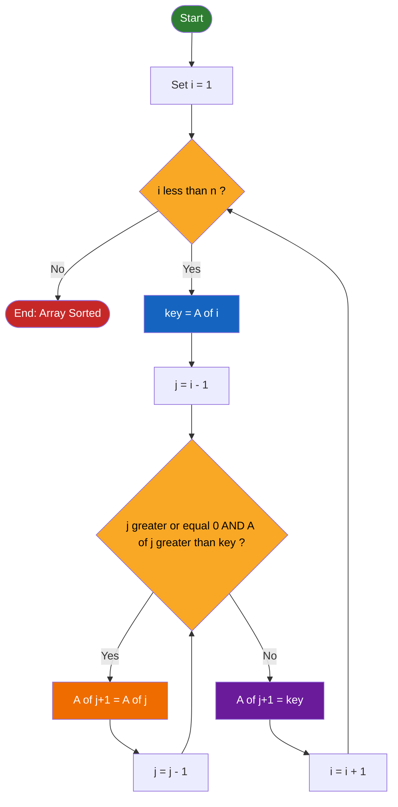
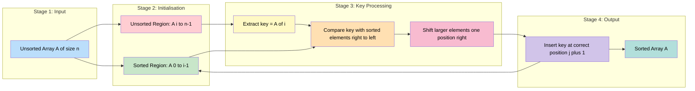

# Insertion Sort

<!-- SECTION_1_START -->

# Insertion Sort — Core Technical Definition & Intuitive Overview

## 1. Formal Academic Definition (KTU 2024 Syllabus Terminology)

> [!IMPORTANT]
> **Insertion Sort** is a comparison-based, in-place, stable, and adaptive internal sorting algorithm that builds the final sorted array one element at a time. It iterates through an input array (or list) and at each iteration, removes one element from the unsorted portion, finds its correct position in the already-sorted left sub-array by shifting larger elements one position to the right, and inserts the element there.

Formally, given an unsorted sequence $A[0 \ldots n-1]$, insertion sort partitions the array into two logical regions:

$$
\text{Sorted Region: } A[0 \ldots i-1] \quad \mid \quad \text{Unsorted Region: } A[i \ldots n-1]
$$

At the end of iteration $i$ (for $i = 1, 2, \ldots, n-1$), the element $A[i]$ (called the **key**) is inserted into its rightful position within $A[0 \ldots i]$, thereby extending the sorted region by one element.

---

## 2. Conceptual Analogy / Intuition (Plain English)

> [!NOTE]
> **Real-world analogy: Sorting Playing Cards in Your Hand**

Imagine you are dealt playing cards one by one onto a table, and you want them arranged in your hand in ascending order (e.g., Ace, 2, 3, …, King).

- The **left side** of your hand already holds the cards you have arranged (the *sorted* region).
- The **new card** arriving from the deck is the **key** to be inserted.
- You compare this new card with the cards in your hand **from right to left**.
- Whenever a card in your hand is **larger** than the new card, you **shift it one position to the right** to make room.
- When you find a card **smaller than or equal to** the key, you **slide the key into the gap** just to its right.

This is **exactly** how insertion sort operates on an array.

### Intuitive Summary

- It is the algorithm you naturally use when inserting a new book into an already-sorted row of books on a shelf.
- It performs **brilliantly** on small or nearly-sorted datasets (linear-time behaviour).
- It performs **poorly** on large, randomly ordered datasets (quadratic-time behaviour).

---

## 3. Key Characteristics & Standard Metrics

> [!IMPORTANT]
> **Standard Metrics for Insertion Sort (Highlighted for Board Examinations)**

| Metric | Value | Justification |
| :--- | :--- | :--- |
| **Time Complexity (Best Case)** | $\mathbf{O(n)}$ | Occurs when the input is already sorted; only $n-1$ comparisons, zero shifts. |
| **Time Complexity (Average Case)** | $\mathbf{O(n^{2})}$ | Random input; each key is compared and shifted roughly halfway on average. |
| **Time Complexity (Worst Case)** | $\mathbf{O(n^{2})}$ | Occurs when the input is sorted in reverse order; maximum shifts per pass. |
| **Space Complexity (Auxiliary)** | $\mathbf{O(1)}$ | In-place sort — only a constant number of extra variables (`key`, loop index). |
| **Stability** | **Yes (Stable)** | Equal elements retain their original relative order (uses $\geq$ for stopping). |
| **Adaptivity** | **Yes (Adaptive)** | Takes advantage of existing partial order; fewer operations on nearly-sorted data. |
| **In-Place?** | **Yes** | Sorts within the original array; no auxiliary array required. |
| **Internal Sort?** | **Yes** | All data fits in primary memory (RAM). |
| **Comparison-Based?** | **Yes** | Uses only the $<$ / $\geq$ relational operator on data items. |
| **Number of Swaps (Worst Case)** | $\mathbf{\dfrac{n(n-1)}{2}}$ | Equivalent to number of inversions in a reverse-sorted array. |

---

## 4. GeoGebra / Desmos Visualisation Hint

> [!VISUALIZATION CONTROL]
> **Concept:** Visualising the sorted/unsorted boundary growth during insertion sort.
> **GeoGebra / Desmos Input Equations:**
>
> * List of $x$-axis tick points: $x = 0, 1, 2, 3, 4, 5$
> * Bar heights (one per iteration $i$): $\text{height}(k) = A[k]$
> * Sorted boundary line: $y = c$, vertical separator at $x = i + 0.5$
> **Visual Description:** On the $x$-axis, plot one vertical bar per array element. After each pass, a vertical dashed line moves one step to the right, indicating that all bars to its left are now permanently sorted. The bar currently being inserted (the **key**) is highlighted in a distinct colour while it "sinks" leftward via bar swaps.

---

<!-- SECTION_1_END -->

<!-- SECTION_2_START -->

# Insertion Sort — Deep Theoretical Analysis & KTU High-Yield Formula Sheet

## 1. The Operational Logic — Step-by-Step Breakdown

Insertion sort proceeds iteratively, treating the leftmost element as a trivially sorted sub-array of size 1, then growing this region one element at a time.

### Step 1 — Initialisation
- Treat $A[0]$ as a sorted sub-array of length **1**.
- The outer loop counter $i$ starts from **1** (the index of the first element of the unsorted region).

### Step 2 — Pick the Key
- For each iteration $i$, store $A[i]$ into a temporary variable $\text{key} = A[i]$. This *frees up the slot* $A[i]$ for shifting.

### Step 3 — Shift Phase (Inner While Loop)
- Walk **backwards** from index $i-1$ down to $0$.
- While the current element $A[j]$ is **strictly greater** than the key, **shift it one position to the right**: $A[j+1] = A[j]$.
- Decrement $j$ to continue the comparison.

### Step 4 — Insertion
- When the loop terminates (either $j < 0$ or $A[j] \leq \text{key}$), the correct slot is $A[j+1]$.
- Place the key there: $A[j+1] = \text{key}$.

### Step 5 — Repeat
- Increment $i$ and continue until $i = n$, at which point the array is fully sorted.

> [!NOTE]
> **Why the shifting technique is preferred over direct swapping:** Shifting requires only **one assignment per element** in the inner loop, whereas swapping requires **three assignments** per swap. This subtle optimisation makes insertion sort faster than naive implementations that swap on every comparison.

---

## 2. The 'Why' Behind Each Step

| Step | Why It Works |
| :--- | :--- |
| **Treat $A[0]$ as sorted** | A sub-array of one element is always trivially sorted — no comparison needed. |
| **Use a temporary `key` variable** | Because we overwrite $A[i]$ during the shift phase; without saving the value, the original key would be lost. |
| **Walk backwards** | The sorted region on the left is in **ascending order**, so we can stop the moment we find an element $\leq$ key. |
| **Shift instead of swap** | Shifting moves the *obstacle* (larger element) out of the way, leaving a single empty slot where the key will land. |
| **Use strict $>$ (not $\geq$) for shift condition** | This preserves the **stability** property — equal elements keep their original relative order. |

---

## 3. KTU Formula Sheet / Cheat Sheet

> [!IMPORTANT]
> **High-Yield Formulas for Board Examinations**

| Concept | Formula / Expression | Notes |
| :--- | :--- | :--- |
| Number of **passes** | $n - 1$ | Outer loop runs for $i = 1, 2, \ldots, n-1$. |
| Maximum number of **comparisons** (worst case) | $\dfrac{n(n-1)}{2}$ | Reverse-sorted input. |
| Maximum number of **shifts / assignments** (worst case) | $\dfrac{n(n-1)}{2} + (n-1)$ | Includes the $(n-1)$ final insertions of the key. |
| Minimum number of **comparisons** (best case) | $n - 1$ | Pre-sorted input; inner loop exits immediately. |
| Minimum number of **shifts** (best case) | $0$ (plus $n-1$ key placements) | No element needs to move. |
| Average number of **comparisons** | $\dfrac{n^{2} - n}{4} \approx \dfrac{n^{2}}{4}$ | Each key on average traverses half the sorted region. |
| Total auxiliary **space** | $O(1)$ | Only the variable `key` and loop indices. |
| **Inversion count** equivalence | Worst-case swaps = number of inversions | In a reverse-sorted array, every pair is an inversion. |
| Time to sort $n$ elements (worst) | $T(n) = \dfrac{n^{2} - n}{2}$ | Useful for "compute time for $n = 1000$" type questions. |

---

## 4. Real-World Utility in Engineering & Computer Science

> [!NOTE]
> **Where Insertion Sort is Used in Production Systems**

- **Small sub-arrays in Hybrid Sorts:** Both **TimSort** (Python's default sort) and **Introsort** (C++ STL's `std::sort`) use insertion sort to handle small partitions (typically $n \leq 16$ to $64$) because its low overhead beats $O(n \log n)$ algorithms at small $n$ due to cache locality and minimal constant factors.
- **Online Sorting:** Insertion sort can sort data as it arrives (streaming input) because each new element is processed independently — there is no need to know the input in advance.
- **Nearly-Sorted Data Pipelines:** When receiving log files or event streams that are *almost* ordered by timestamp, insertion sort runs in near-linear time, far faster than any $O(n \log n)$ algorithm.
- **Teaching Tool:** It is the standard introductory sort in algorithm courses worldwide (including KTU's OECST611) because it builds intuition for invariants, loop correctness, and complexity analysis.
- **Embedded Systems & Hardware:** Its in-place nature and small code footprint make it suitable for resource-constrained firmware sorting tiny lists (e.g., sensor calibration tables, configuration arrays).

---

## 5. Recurrence Relation & Mathematical Justification of Complexity

The running time $T(n)$ can be expressed as:

$$
T(n) = T(n-1) + c_{1} \cdot n + c_{2}
$$

where $T(n-1)$ is the cost of sorting the first $n-1$ elements, $c_{1} \cdot n$ accounts for the $n-1$ comparisons plus shifts in the worst case of the $n$-th iteration, and $c_{2}$ is the constant overhead of loop control.

Unrolling this recurrence (worst case):

$$
T(n) = c_{1}\sum_{k=2}^{n} k + c_{2}(n-1) = c_{1}\left(\dfrac{n(n+1)}{2} - 1\right) + c_{2}(n-1)
$$

which is clearly $\Theta(n^{2})$. For the **best case** (already sorted), the inner while loop's condition fails immediately, so the recurrence reduces to:

$$
T(n) = T(n-1) + c_{1} = c_{1}(n-1) = \Theta(n)
$$

---

<!-- SECTION_2_END -->

<!-- SECTION_3_START -->

# Insertion Sort — Step-by-Step Derivations & Code/Symbolic Implementation

## 1. Formal Pseudocode (KTU Board-Standard)

> [!NOTE]
> **Algorithm: INSERTION-SORT($A$, $n$)**

```
INSERTION-SORT(A, n)
1.  for i ← 1 to n - 1 do
2.      key ← A[i]
3.      j ← i - 1
4.      while j ≥ 0 and A[j] > key do
5.          A[j + 1] ← A[j]
6.          j ← j - 1
7.      end while
8.      A[j + 1] ← key
9.  end for
```

**Post-condition:** $A[0] \leq A[1] \leq \ldots \leq A[n-1]$.

---

## 2. Exhaustive Hand Trace on a Concrete Array

Let us trace insertion sort on the array:

$$
A = [\,5,\ 2,\ 4,\ 6,\ 1,\ 3\,]
$$

We maintain four columns: the current **key**, the state of the array after each inner-loop iteration (shifts), and the state after the final insertion. **Bold** indicates the element just inserted.

### Pass 1 — $i = 1$, key = 2

- Compare $A[0] = 5 > 2$: shift $A[0] \rightarrow A[1]$. Array: $[\,5,\ \square,\ 4,\ 6,\ 1,\ 3\,]$
- $j = -1$, loop ends. Insert key at $A[0]$.
- **Result:** $[\,\mathbf{2},\ 5,\ 4,\ 6,\ 1,\ 3\,]$

### Pass 2 — $i = 2$, key = 4

- $A[1] = 5 > 4$: shift $A[1] \rightarrow A[2]$. Array: $[\,2,\ 5,\ \square,\ 6,\ 1,\ 3\,]$
- $A[0] = 2 \not> 4$: loop ends. Insert key at $A[1]$.
- **Result:** $[\,2,\ \mathbf{4},\ 5,\ 6,\ 1,\ 3\,]$

### Pass 3 — $i = 3$, key = 6

- $A[2] = 5 \not> 6$: loop ends immediately. No shift.
- **Result:** $[\,2,\ 4,\ 5,\ \mathbf{6},\ 1,\ 3\,]$

### Pass 4 — $i = 4$, key = 1

- $A[3] = 6 > 1$: shift. Array: $[\,2,\ 4,\ 5,\ 6,\ \square,\ 3\,]$
- $A[2] = 5 > 1$: shift. Array: $[\,2,\ 4,\ 5,\ \square,\ 6,\ 3\,]$
- $A[1] = 4 > 1$: shift. Array: $[\,2,\ 4,\ \square,\ 5,\ 6,\ 3\,]$
- $A[0] = 2 > 1$: shift. Array: $[\,2,\ \square,\ 4,\ 5,\ 6,\ 3\,]$
- $j = -1$, loop ends. Insert key at $A[0]$.
- **Result:** $[\,\mathbf{1},\ 2,\ 4,\ 5,\ 6,\ 3\,]$

### Pass 5 — $i = 5$, key = 3

- $A[4] = 6 > 3$: shift. Array: $[\,1,\ 2,\ 4,\ 5,\ 6,\ \square\,]$
- $A[3] = 5 > 3$: shift. Array: $[\,1,\ 2,\ 4,\ 5,\ \square,\ 6\,]$
- $A[2] = 4 > 3$: shift. Array: $[\,1,\ 2,\ 4,\ \square,\ 5,\ 6\,]$
- $A[1] = 2 \not> 3$: loop ends. Insert key at $A[2]$.
- **Result (final):** $[\,1,\ 2,\ \mathbf{3},\ 4,\ 5,\ 6\,]$ ✓

### Summary Table of Passes

| Pass $i$ | Key | Shifts Made | Array State After Pass |
| :---: | :---: | :---: | :--- |
| 1 | 2 | 1 | $[2, 5, 4, 6, 1, 3]$ |
| 2 | 4 | 1 | $[2, 4, 5, 6, 1, 3]$ |
| 3 | 6 | 0 | $[2, 4, 5, 6, 1, 3]$ |
| 4 | 1 | 4 | $[1, 2, 4, 5, 6, 3]$ |
| 5 | 3 | 3 | $[1, 2, 3, 4, 5, 6]$ |

**Total comparisons** = $1+2+1+5+4 = 13$ ; **Total shifts** = $1+1+0+4+3 = 9$.

---

## 3. Mathematical Derivation of Worst-Case Number of Comparisons

Consider the worst case: the array is sorted in **strictly decreasing** order, e.g., $A = [n, n-1, \ldots, 2, 1]$.

In pass $i$ (where $i$ ranges from 1 to $n-1$), the key $A[i]$ must be compared against **all** $i$ elements of the sorted region before finding its slot at the very beginning.

$$
\text{Comparisons in pass } i = i
$$

Total worst-case comparisons:

$$
C_{\text{worst}} = \sum_{i=1}^{n-1} i = 1 + 2 + 3 + \ldots + (n-1) = \dfrac{(n-1)n}{2}
$$

Applying the standard simplification:

$$
C_{\text{worst}} = \dfrac{n^{2} - n}{2} = \dfrac{n(n-1)}{2} = O(n^{2})
$$

**Numerical example for $n = 1000$:**

$$
C_{\text{worst}} = \dfrac{1000 \times 999}{2} = 499{,}500 \text{ comparisons}
$$

---

## 4. Python Implementation (Production-Grade with Type Hints & Logging)

```python
"""
insertion_sort.py
KTU 2024 Scheme - DATA STRUCTURES (OECST611) - Module 4
Reference implementation of Insertion Sort.
"""

from __future__ import annotations
import logging
from typing import List, TypeVar

# Generic type for numeric elements
T = TypeVar("T", int, float)

# Configure module-level logger
logging.basicConfig(
    level=logging.INFO,
    format="%(asctime)s | %(levelname)s | %(message)s",
)
logger = logging.getLogger(__name__)


def insertion_sort(arr: List[T], *, verbose: bool = False) -> List[T]:
    """
    Sort a list in-place using the Insertion Sort algorithm.

    Parameters
    ----------
    arr : List[T]
        The list of comparable elements to be sorted.
    verbose : bool, optional
        If True, logs the state of the array after every pass.

    Returns
    -------
    List[T]
        The same list object, now sorted in ascending order.

    Raises
    ------
    TypeError
        If elements of `arr` are not mutually comparable.
    """
    # Defensive validation: empty or single-element arrays are already sorted
    n: int = len(arr)
    if n <= 1:
        logger.info("Array of size %d is trivially sorted.", n)
        return arr

    # Optional pre-condition logging
    logger.info("Starting Insertion Sort on array of size %d.", n)

    # Outer loop: i is the index of the element to be inserted
    for i in range(1, n):
        key: T = arr[i]                # The element to insert
        j: int = i - 1                  # Index of the last element in the sorted region

        # Inner loop: shift elements greater than `key` to the right
        while j >= 0 and arr[j] > key:
            arr[j + 1] = arr[j]         # Shift right
            j -= 1

        # Place the key into its correct position
        arr[j + 1] = key

        if verbose:
            logger.info("After pass %2d: %s", i, arr)

    logger.info("Insertion Sort complete.")
    return arr


# ----------------------------- Driver / Demo -----------------------------
if __name__ == "__main__":
    sample: List[int] = [5, 2, 4, 6, 1, 3]
    print("Original array :", sample)
    insertion_sort(sample, verbose=True)
    print("Sorted array   :", sample)

    # Edge case: pre-sorted array (best case - O(n))
    sorted_input: List[int] = [1, 2, 3, 4, 5]
    insertion_sort(sorted_input)

    # Edge case: reverse-sorted array (worst case - O(n^2))
    reverse_input: List[int] = [9, 7, 5, 3, 1]
    insertion_sort(reverse_input, verbose=True)
```

**Sample Output:**

```
Original array : [5, 2, 4, 6, 1, 3]
After pass  1: [2, 5, 4, 6, 1, 3]
After pass  2: [2, 4, 5, 6, 1, 3]
After pass  3: [2, 4, 5, 6, 1, 3]
After pass  4: [1, 2, 4, 5, 6, 3]
After pass  5: [1, 2, 3, 4, 5, 6]
Sorted array   : [1, 2, 3, 4, 5, 6]
```

---

## 5. C Implementation (For Examinations Requiring C Syntax)

```c
/* insertion_sort.c - KTU OECST611 Module 4 */
#include <stdio.h>

void insertionSort(int A[], int n) {
    int i, j, key;
    for (i = 1; i < n; i++) {
        key = A[i];
        j = i - 1;
        while (j >= 0 && A[j] > key) {
            A[j + 1] = A[j];
            j--;
        }
        A[j + 1] = key;
    }
}

void printArray(int A[], int n) {
    for (int i = 0; i < n; i++) printf("%d ", A[i]);
    printf("\n");
}

int main(void) {
    int A[] = {5, 2, 4, 6, 1, 3};
    int n = sizeof(A) / sizeof(A[0]);
    printf("Original: "); printArray(A, n);
    insertionSort(A, n);
    printf("Sorted:   "); printArray(A, n);
    return 0;
}
```

---

<!-- SECTION_3_END -->

<!-- SECTION_4_START -->

# Insertion Sort — Structural Diagrams & Schematics

## 1. Mermaid Flowchart of the Algorithm



---

## 2. Block-Level Functional Architecture Flow

This diagram depicts the **modular data flow** within insertion sort, isolating the four logical stages of the algorithm.



---

## 3. Sequential Processing Topology Matrix (Pass-by-Pass Transformation)

The matrix below maps each pass of the algorithm against the **sorted region**, **key being inserted**, **shifts performed**, and **resulting array state** for the input $[5, 2, 4, 6, 1, 3]$.

| Pass | Sorted Region (Before) | Key $A[i]$ | Comparisons | Shifts | Sorted Region (After) | Array State |
| :---: | :--- | :---: | :---: | :---: | :--- | :--- |
| 1 | $[5]$ | 2 | 1 | 1 | $[2, 5]$ | $[2, 5, 4, 6, 1, 3]$ |
| 2 | $[2, 5]$ | 4 | 2 | 1 | $[2, 4, 5]$ | $[2, 4, 5, 6, 1, 3]$ |
| 3 | $[2, 4, 5]$ | 6 | 1 | 0 | $[2, 4, 5, 6]$ | $[2, 4, 5, 6, 1, 3]$ |
| 4 | $[2, 4, 5, 6]$ | 1 | 4 | 4 | $[1, 2, 4, 5, 6]$ | $[1, 2, 4, 5, 6, 3]$ |
| 5 | $[1, 2, 4, 5, 6]$ | 3 | 3 | 3 | $[1, 2, 3, 4, 5, 6]$ | $[1, 2, 3, 4, 5, 6]$ |

---

<!-- SECTION_4_END -->

<!-- SECTION_5_START -->

# Insertion Sort — KTU 2024 Scheme Examination Question Bank & Topic Recap

---

## Part A Questions (3 Marks Each)

> **[KTU University Exam - July 2024] — CO1, Remember**
>
> **Q1.** Define insertion sort. List its key properties.
>
> **Model Answer (3 Marks):**
>
> Insertion sort is a comparison-based, in-place, stable, and adaptive internal sorting algorithm. It builds the sorted array one element at a time by repeatedly taking the next element from the unsorted region and inserting it into its correct position in the sorted region via a backward shift of larger elements.
>
> **Key properties:**
>
> 1. **Time complexity:** $O(n^{2})$ worst/average, $O(n)$ best. **[1 Mark]**
> 2. **Space complexity:** $O(1)$ auxiliary (in-place). **[1 Mark]**
> 3. **Stable and adaptive.** **[1 Mark]**

---

> **[KTU University Exam - Dec 2023] — CO1, Understand**
>
> **Q2.** Differentiate between selection sort and insertion sort based on the number of swaps and stability.
>
> **Model Answer (3 Marks):**
>
> | Criterion | Selection Sort | Insertion Sort |
> | :--- | :--- | :--- |
> | **Number of swaps (worst case)** | $O(n)$ — at most one swap per pass | $O(n^{2})$ — up to $n(n-1)/2$ shifts |
> | **Stability** | **Not stable** (swapping can reorder equal keys) | **Stable** (uses $>$ condition to stop) |
> | **Best case** | $O(n^{2})$ even on sorted input | $O(n)$ on sorted input (adaptive) |
>
> **[Any 3 valid points: 3 Marks]**

---

## Part B Questions (14 Marks Each — Internal Choice)

### Question A (14 Marks) — Trace and Complexity

> **[KTU University Exam - Dec 2024] — CO2, Apply / Analyse**
>
> **(a)** Sort the array $[12, 11, 13, 5, 6]$ using insertion sort. Show the array state after **each pass**. **[7 Marks]**
>
> **(b)** Derive the worst-case time complexity of insertion sort. **[7 Marks]**

#### Model Solution

**(a) Step-by-step trace (7 Marks):**

- **Pass 1 ($i=1$):** key = $11$. Compare with $A[0] = 12 > 11$, shift 12 right. Insert 11 at index 0.
  Array: $[11, 12, 13, 5, 6]$ **[1 Mark]**

- **Pass 2 ($i=2$):** key = $13$. Compare with $A[1] = 12 \not> 13$, stop.
  Array: $[11, 12, 13, 5, 6]$ **[1 Mark]**

- **Pass 3 ($i=3$):** key = $5$. Compare with $13, 12, 11$ — all greater, shift each right.
  Array: $[5, 11, 12, 13, 6]$ **[2 Marks]**

- **Pass 4 ($i=4$):** key = $6$. Compare with $13, 12, 11$ — shift them; stop at $5$ (not greater).
  Insert 6 after 5.
  Array: $[5, 6, 11, 12, 13]$ **[2 Marks]**

- **Final sorted array:** $[5, 6, 11, 12, 13]$ **[1 Mark]**

**(b) Worst-case complexity derivation (7 Marks):**

In the worst case, the input is sorted in **descending order** $[n, n-1, \ldots, 2, 1]$.

- In pass $i$, the key $A[i]$ is compared with all $i$ elements of the sorted region, requiring $i$ comparisons and $i$ shifts. **[2 Marks]**
- Total comparisons across all passes:

$$
C(n) = \sum_{i=1}^{n-1} i = 1 + 2 + 3 + \ldots + (n-1) = \dfrac{n(n-1)}{2} \quad \text{[3 Marks]}
$$

- Expanding and simplifying:

$$
C(n) = \dfrac{n^{2} - n}{2} = \dfrac{n^{2}}{2} - \dfrac{n}{2}
$$

- Dropping lower-order terms and constant coefficients, $C(n) = O(n^{2})$. **[1 Mark]**
- Therefore, the worst-case time complexity of insertion sort is $\mathbf{O(n^{2})}$. **[1 Mark]**

---

### Question B (14 Marks) — Algorithm and Adaptivity

> **[KTU University Exam - July 2024] — CO2, Apply / Analyse**
>
> **(a)** Write the algorithm for insertion sort. Explain why it is called an "adaptive" sort. **[7 Marks]**
>
> **(b)** For the array $[8, 3, 1, 7, 0, 4, 2]$, determine the number of comparisons and shifts performed by insertion sort. **[7 Marks]**

#### Model Solution

**(a) Algorithm and adaptivity (7 Marks):**

**Algorithm (5 Marks):**

```
INSERTION-SORT(A, n)
1. for i ← 1 to n-1 do
2.    key ← A[i]
3.    j ← i - 1
4.    while j ≥ 0 and A[j] > key do
5.        A[j+1] ← A[j]
6.        j ← j - 1
7.    end while
8.    A[j+1] ← key
9. end for
```

**Why it is "adaptive" (2 Marks):**

Insertion sort is called *adaptive* because its running time **decreases** when the input is *partially sorted*. **[1 Mark]** On a fully sorted array, the inner `while` loop's condition $A[j] > \text{key}$ fails immediately, giving only $n-1$ comparisons and $O(n)$ time — a stark contrast to the $O(n^{2})$ worst case. **[1 Mark]**

**(b) Counting comparisons and shifts (7 Marks):**

| Pass $i$ | Key | Comparisons | Shifts | Array State |
| :---: | :---: | :---: | :---: | :--- |
| 1 | 3 | 1 | 1 | $[3, 8, 1, 7, 0, 4, 2]$ |
| 2 | 1 | 2 | 2 | $[1, 3, 8, 7, 0, 4, 2]$ |
| 3 | 7 | 3 | 2 | $[1, 3, 7, 8, 0, 4, 2]$ |
| 4 | 0 | 4 | 4 | $[0, 1, 3, 7, 8, 4, 2]$ |
| 5 | 4 | 4 | 3 | $[0, 1, 3, 4, 7, 8, 2]$ |
| 6 | 2 | 5 | 5 | $[0, 1, 2, 3, 4, 7, 8]$ |

- **Total comparisons** = $1+2+3+4+4+5 = \mathbf{19}$ **[2 Marks]**
- **Total shifts** = $1+2+2+4+3+5 = \mathbf{17}$ **[2 Marks]**
- Final sorted array: $[0, 1, 2, 3, 4, 7, 8]$ **[1 Mark]**

---

## KTU Examiner's Valuation Warning / Pitfall Callout

> [!WARNING]
> **Common Mistakes That Cost Marks in Insertion Sort Questions**
>
> 1. **Forgetting to save the key before shifting:** Students often write `A[i+1] = A[i]` inside the inner loop without first storing $A[i]$ in a temporary variable. This **overwrites the key** and produces a wrong answer. Always begin the pass with `key = A[i]`. **[-2 Marks]**
> 2. **Off-by-one error in the loop condition:** Writing `while j > 0` instead of `while j ≥ 0` causes the algorithm to fail when the key must be inserted at index 0. **[-1 Mark]**
> 3. **Using `≥` instead of `>` in the inner loop:** This breaks the **stability** property. Examiners specifically test stability — they will deduct marks if the condition is `A[j] ≥ key`. **[-1 Mark]**
> 4. **Not drawing pass-wise array states:** A trace question without intermediate array states is treated as incomplete. Always show the array after **every pass** as a separate line. **[-2 Marks]**
> 5. **Writing $\Theta(n \log n)$ instead of $O(n^{2})$:** Insertion sort is **never** $O(n \log n)$. Confusion with merge sort is a common error. **[-2 Marks]**
> 6. **Confusing shifts with swaps:** Insertion sort uses **shifts** (one assignment) — not swaps (three assignments). Examiners often explicitly ask for the number of *shifts*/*comparisons*. **[-1 Mark]**

---

## Topic Recap & Important Things to Remember

> [!IMPORTANT]
> **Rapid-Revision Checklist for Insertion Sort (Module 4 — OECST611)**

- **Definition:** Insertion sort builds the sorted array one element at a time by inserting each new key into its correct position in the already-sorted left region. **[Must know verbatim]**
- **Outer loop range:** $i$ goes from $1$ to $n-1$ (total $n-1$ passes).
- **Inner loop:** Walks **backwards** from $i-1$ down to $0$, shifting elements **strictly greater** than the key to the right.
- **Stopping condition:** Inner loop stops when $j < 0$ **or** $A[j] \leq \text{key}$.
- **Key placement:** After the inner loop, the key is placed at $A[j+1]$.
- **Time complexity:** Best $= O(n)$ ; Average $= O(n^{2})$ ; Worst $= O(n^{2})$.
- **Space complexity:** $O(1)$ auxiliary (in-place, uses only a `key` variable).
- **Stability:** **Yes** — preserved by using strict `$>$` in the inner loop.
- **Adaptivity:** **Yes** — exploits existing partial order, faster on nearly-sorted data.
- **In-place:** **Yes** — no auxiliary array required.
- **Worst-case comparisons:** $\dfrac{n(n-1)}{2} = O(n^{2})$.
- **Best-case comparisons:** $n-1 = O(n)$.
- **Maximum shifts:** $\dfrac{n(n-1)}{2} + (n-1)$.
- **Inversion count:** Worst-case number of swaps equals the number of inversions in the input.
- **Practical sweet spot:** $n \leq 16$ to $64$ elements (used as a base case in TimSort, Introsort).
- **Analogy to remember:** Sorting playing cards in your hand — pick up, compare right-to-left, shift bigger cards, insert.
- **Common exam traps:** (i) forgetting `key = A[i]`, (ii) using `≥` instead of `>`, (iii) writing $O(n \log n)$ by mistake, (iv) not showing pass-wise array states.
- **Real-world use:** Online/streaming sort, hybrid sorts (TimSort/Introsort base case), small-array sorting in embedded firmware.
- **Comparison-based:** Yes, uses only the `$<$` operator — no bucket/radix-style digit extraction.

<!-- SECTION_5_END -->
