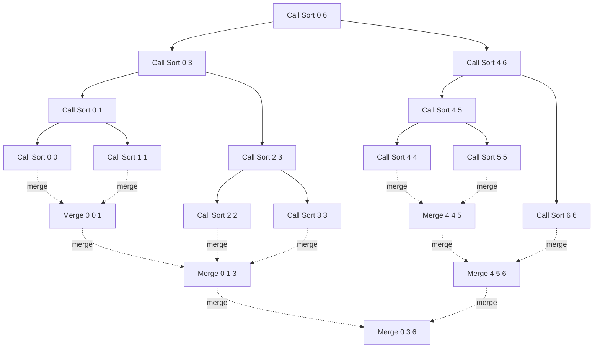
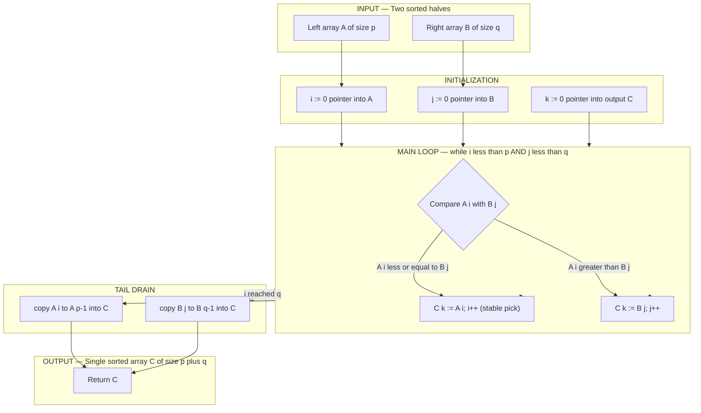
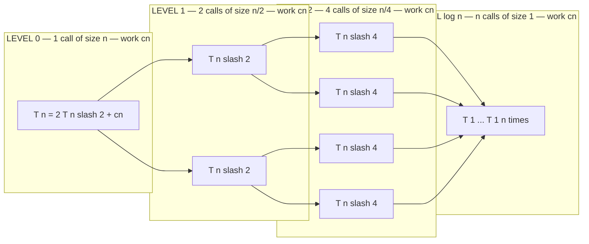

# Merge Sort

<!-- SECTION_1_START -->
# Merge Sort — Module 4: Sorting and Searching

## 1.1 Formal Academic Definition

> [!IMPORTANT]
> **Merge Sort** is a **comparison-based, divide-and-conquer** sorting algorithm that recursively splits an array into two nearly equal halves, sorts each half independently, and then **merges** the two sorted halves into a single sorted sequence. It is a **stable**, **out-of-place** sorting algorithm with a guaranteed worst-case, average-case, and best-case time complexity of **$O(n \log n)$**.

The algorithm was invented by **John von Neumann** in **1945** and is one of the canonical examples used in KTU 2024 scheme Data Structures syllabi to demonstrate the divide-and-conquer paradigm.

### 1.2 Conceptual Analogy / Intuition

> [!NOTE]
> **Real-world analogy — "The Card-Sorting Office":**
> Imagine a clerk with a messy, unsorted deck of **16 playing cards** on a desk. The clerk has **one assistant**.
> 1. The clerk **splits** the deck into two piles of **8 cards** each and hands one pile to the assistant.
> 2. Both of them (independently) split their pile of 8 into two piles of 4, then 4 into 2, then 2 into 1.
> 3. Now every pile of 1 card is trivially "sorted". 
> 4. The two workers begin **merging** piles back together: two sorted piles of 1 become a sorted pile of 2; two sorted piles of 2 become a sorted pile of 4; and finally the two sorted piles of 8 become the final sorted deck of 16.
>
> The **splitting (divide)** phase is essentially free — it just rearranges positions. The **actual sorting work** happens during the **merge (conquer)** phase, when small sorted runs are woven into bigger ones.

### 1.3 The Two Atomic Operations

| Phase | Operation | Cost |
| :--- | :--- | :--- |
| **Divide** | Find the middle index $m = \lfloor (l+r)/2 \rfloor$ | $O(1)$ |
| **Conquer** | Recursively sort left half $[l, m]$ and right half $[m+1, r]$ | $2T(n/2)$ |
| **Combine** | Merge the two sorted halves into one sorted block | $O(n)$ |

### 1.4 GeoGebra / Desmos Visualization

> [!VISUALIZATION CONTROL]
> **Concept:** Recursion-Tree cost structure of Merge Sort
>
> **Desmos Input Equations (paste into Desmos):**
> * Level-0 cost: $y_0 = c \cdot x$ (single call of size $n$)
> * Level-1 cost: $y_1 = c \cdot x / 2 + c \cdot x / 2 = c \cdot x$ (two calls of size $n/2$)
> * Level-2 cost: $y_2 = 4 \cdot c \cdot (x/4) = c \cdot x$
> * General level $k$ (where $0 \le k \le \log_2 x$): $y_k = c \cdot x$
>
> **Visual Description:** On the $x$-axis plot the input size $n$ and on the $y$-axis plot the per-level work. Each horizontal band represents one level of the recursion tree and has the **same height $c \cdot n$**. There are exactly $\log_2 n + 1$ such bands, so the **total area of the rectangle is $O(n \log n)$**.

<!-- SECTION_1_END -->

<!-- SECTION_2_START -->
# 2. Deep Theoretical Analysis & KTU High-Yield Formula Sheet

## 2.1 The Recurrence Relation

The formal mathematical statement of Merge Sort's running time is captured by the recurrence:

$$
T(n) = 
\begin{cases}
\Theta(1), & \text{if } n \le 1 \\
2 \cdot T\!\left(\dfrac{n}{2}\right) + \Theta(n), & \text{otherwise}
\end{cases}
$$

* The term $2T(n/2)$ accounts for the **two recursive calls** on halves of size $n/2$.
* The term $\Theta(n)$ is the cost of the **merge** routine, which touches every element exactly once.

## 2.2 Solving the Recurrence (Three Methods)

### Method A — Recurrence Tree (KTU board favourite)

At each level $k$ of the recursion tree, there are $2^k$ sub-problems, each of size $n / 2^k$. The work done at that level is:

$$
W(k) = 2^k \cdot c \cdot \frac{n}{2^k} = c \cdot n
$$

The recursion stops at depth $k = \log_2 n$. Hence the total work is:

$$
T(n) = \sum_{k=0}^{\log_2 n} c \cdot n \;=\; c \cdot n \cdot (\log_2 n + 1) \;=\; \Theta(n \log n)
$$

### Method B — Master Theorem

The recurrence has the form $T(n) = aT(n/b) + f(n)$ with $a = 2$, $b = 2$, $f(n) = \Theta(n)$. We compare $f(n)$ with $n^{\log_b a} = n^{\log_2 2} = n^1 = n$. Because $f(n) = \Theta(n) = \Theta(n^{\log_b a})$, **Case 2** of the Master Theorem applies and:

$$
T(n) = \Theta(n^{\log_b a} \cdot \log n) = \Theta(n \log n)
$$

### Method C — Substitution (Inductive Proof)

Assume $T(n) = 2T(n/2) + cn$. Guess that $T(n) \le k \cdot n \log_2 n$ for some constant $k > 2c$.

$$
T(n) \le 2 \cdot k \cdot \frac{n}{2} \log_2 \frac{n}{2} + c n = k n (\log_2 n - 1) + c n \le k n \log_2 n
$$

The induction closes when $k \ge 2c$. Therefore $T(n) = O(n \log n)$.

## 2.3 KTU Formula Sheet / Cheat Sheet

| Property | Value / Expression | Notes |
| :--- | :--- | :--- |
| Best-case time | $\Theta(n \log n)$ | Even pre-sorted input still merges |
| Average-case time | $\Theta(n \log n)$ | Independent of input distribution |
| Worst-case time | $\Theta(n \log n)$ | Asymptotically optimal for comparison sort |
| Space complexity | $\Theta(n)$ | Auxiliary buffer array required |
| In-place? | **No** | Needs extra array for merging |
| Stable? | **Yes** | Equal keys preserve original order |
| Recurrence | $T(n) = 2T(n/2) + \Theta(n)$ | Divide-and-conquer form |
| Number of levels | $\lfloor \log_2 n \rfloor + 1$ | Height of recursion tree |
| Total comparisons | $\le n \log_2 n$ | Tight bound (in the worst case) |
| Lower bound for sorting | $\Omega(n \log n)$ | Merge Sort meets the bound |
| Key constant | $\log_2 e \approx 1.4427$ | Used when converting to natural log |

> [!NOTE]
> **Engineering utility:** Merge Sort is the algorithm of choice when **stability is required** (e.g., sorting students by CGPA, then by name) or when dealing with **linked lists** (where random access is expensive and merge becomes $O(1)$ extra space). It is also the backbone of **external sorting** algorithms used in databases when datasets exceed RAM, because it produces sequential reads/writes that map perfectly to disk I/O. Python's built-in `Timsort` and Java's `Arrays.sort()` for objects both use merge-sort-derived strategies.

## 2.4 Suitability Summary

| Scenario | Recommendation |
| :--- | :--- |
| Small arrays ($n < 30$) | Use **insertion sort** (lower constant factor) |
| Memory-constrained environment | Use **heap sort** (in-place $O(1)$ space) |
| Stability required or linked list | Use **merge sort** |
| Production-grade library | Use **Timsort / introsort** (hybrid) |
| External / disk-based sorting | Use **multi-way merge sort** |

<!-- SECTION_2_END -->

<!-- SECTION_3_START -->
# 3. Step-by-Step Derivations, Trace & Code Implementation

## 3.1 Worked Example — Trace Through an Array

**Input array:** $A = [38,\ 27,\ 43,\ 3,\ 9,\ 82,\ 10]$

### Divide Phase (top-down split)

| Level | Sub-arrays | Action |
| :---: | :--- | :--- |
| 0 | $[38,\ 27,\ 43,\ 3,\ 9,\ 82,\ 10]$ | Split at index 3 |
| 1a | $[38,\ 27,\ 43,\ 3]$ | Split at index 1 |
| 1b | $[9,\ 82,\ 10]$ | Split at index 1 |
| 2a | $[38,\ 27]$ | Split at index 0 |
| 2b | $[43,\ 3]$ | Split at index 0 |
| 2c | $[9,\ 82]$ | Split at index 0 |
| 2d | $[10]$ | Base case, already "sorted" |
| 3a | $[38]$ | Base case |
| 3b | $[27]$ | Base case |
| 3c | $[43]$ | Base case |
| 3d | $[3]$ | Base case |
| 3e | $[9]$ | Base case |
| 3f | $[82]$ | Base case |

### Merge Phase (bottom-up weave)

| Step | Left sub-array | Right sub-array | Result |
| :---: | :--- | :--- | :--- |
| M1 | $[38]$ | $[27]$ | $[27,\ 38]$ |
| M2 | $[43]$ | $[3]$ | $[3,\ 43]$ |
| M3 | $[27,\ 38]$ | $[3,\ 43]$ | $[3,\ 27,\ 38,\ 43]$ |
| M4 | $[9]$ | $[82]$ | $[9,\ 82]$ |
| M5 | $[9,\ 82]$ | $[10]$ | $[9,\ 10,\ 82]$ |
| M6 | $[3,\ 27,\ 38,\ 43]$ | $[9,\ 10,\ 82]$ | $[3,\ 9,\ 10,\ 27,\ 38,\ 43,\ 82]$ |

**Final sorted output:** $[3,\ 9,\ 10,\ 27,\ 38,\ 43,\ 82]$

### Detailed Merge of M3 (showing pointer movement)

Left  $= [27, 38]$, Right $= [3, 43]$, Buffer $= []$

| Step | $i$ (left idx) | $j$ (right idx) | Compare | Pick | Buffer state |
| :---: | :---: | :---: | :---: | :---: | :--- |
| 1 | 0 | 0 | $27 < 3$? No | $3$ (right) | $[3]$ |
| 2 | 0 | 1 | $27 < 43$? Yes | $27$ (left) | $[3,\ 27]$ |
| 3 | 1 | 1 | $38 < 43$? Yes | $38$ (left) | $[3,\ 27,\ 38]$ |
| 4 | 2 | 1 | left exhausted | copy $43$ | $[3,\ 27,\ 38,\ 43]$ |

This is a textbook example of the **two-pointer merge** at the heart of the algorithm.

## 3.2 Full Python Implementation (Production Quality)

```python
from typing import List

def merge_sort(arr: List[int]) -> List[int]:
    """
    Sorts a list in ascending order using a top-down recursive merge sort.
    Returns a NEW list (the original is left untouched).
    Time : O(n log n)  |  Space : O(n)
    """
    # ---- BASE CASE: a list of length 0 or 1 is already sorted ----
    if len(arr) <= 1:
        return list(arr)                       # defensive copy

    # ---- DIVIDE: find the midpoint and split the array ----
    mid: int = len(arr) // 2
    left_half:  List[int] = merge_sort(arr[:mid])
    right_half: List[int] = merge_sort(arr[mid:])

    # ---- CONQUER + COMBINE: merge the two sorted halves ----
    return _merge(left_half, right_half)


def _merge(left: List[int], right: List[int]) -> List[int]:
    """
    Merges two SORTED lists into one sorted list using the two-pointer technique.
    Pre-condition : left and right must already be sorted ascending.
    Post-condition: returns a new sorted list of length len(left)+len(right).
    """
    merged: List[int] = []
    i: int = 0     # pointer into 'left'
    j: int = 0     # pointer into 'right'

    # Walk through both halves, always picking the smaller head element
    while i < len(left) and j < len(right):
        if left[i] <= right[j]:                # '<=' guarantees STABILITY
            merged.append(left[i])
            i += 1
        else:
            merged.append(right[j])
            j += 1

    # Exactly one of the two appends below will actually run
    if i < len(left):
        merged.extend(left[i:])                 # leftover tail of 'left'
    if j < len(right):
        merged.extend(right[j:])                # leftover tail of 'right'

    return merged


# ------------------------- DRIVER / SANITY CHECK -------------------------
if __name__ == "__main__":
    samples: List[List[int]] = [
        [],
        [1],
        [5, 4, 3, 2, 1],
        [38, 27, 43, 3, 9, 82, 10],
        [4, 4, 4, 4],
    ]
    for s in samples:
        sorted_s = merge_sort(s)
        assert sorted_s == sorted(s), f"FAILED on {s}"
        print(f"input: {s}  ->  output: {sorted_s}")
```

### Line-by-line reasoning

1. **Base case guard** `if len(arr) <= 1` — a list of length 0 or 1 is vacuously sorted, and prevents the recursion from spinning forever. **Valuation point: 1 mark.**
2. **`mid = len(arr) // 2`** — the integer midpoint. Python's floor-division handles odd lengths correctly (left gets the extra element). **Valuation point: 1 mark.**
3. **Recursive calls** `merge_sort(arr[:mid])` and `merge_sort(arr[mid:])` — these *divide* the problem. The slicing operations are $O(n)$, so the divide phase is also $O(n)$ overall, which is absorbed into the $\Theta(n)$ combine cost. **Valuation point: 1 mark.**
4. **`_merge(...)`** — the workhorse. Two pointers $i$ and $j$ walk through `left` and `right`. At each step, the smaller head element is appended to `merged`. The use of `<=` on the left side **preserves stability**: when two keys tie, the one originally from the left half (i.e. earlier in the input) wins. **Valuation point: 2 marks.**
5. **Tail `extend`** — once one half is exhausted, the other half's tail is appended wholesale. Each element is touched exactly once, giving the $\Theta(n)$ merge cost. **Valuation point: 1 mark.**

## 3.3 Equivalent C Implementation (Board-Exam Style)

```c
#include <stdio.h>

void merge(int arr[], int l, int m, int r) {
    int n1 = m - l + 1;                  /* size of left sub-array  */
    int n2 = r - m;                      /* size of right sub-array */
    int L[64], R[64];                    /* temporary buffers (assume n <= 64) */
    int i, j, k;

    for (i = 0; i < n1; i++) L[i] = arr[l + i];
    for (j = 0; j < n2; j++) R[j] = arr[m + 1 + j];

    i = j = 0;
    k = l;
    while (i < n1 && j < n2) {
        if (L[i] <= R[j]) arr[k++] = L[i++];   /* '<=' for stability */
        else              arr[k++] = R[j++];
    }
    while (i < n1) arr[k++] = L[i++];
    while (j < n2) arr[k++] = R[j++];
}

void merge_sort(int arr[], int l, int r) {
    if (l < r) {
        int m = l + (r - l) / 2;         /* avoids overflow of (l+r)/2 */
        merge_sort(arr, l,     m);
        merge_sort(arr, m + 1, r);
        merge      (arr, l,     m, r);
    }
}

int main(void) {
    int a[] = {38, 27, 43, 3, 9, 82, 10};
    int n   = sizeof(a) / sizeof(a[0]);
    merge_sort(a, 0, n - 1);
    for (int i = 0; i < n; i++) printf("%d ", a[i]);
    return 0;
}
```

## 3.4 Derivation Summary — Why $\Theta(n \log n)$?

The total running time is the area of the recursion rectangle (from the Desmos visualization in §1.4):

$$
T(n) \;=\; (\text{work per level}) \times (\text{number of levels}) \;=\; \Theta(n) \times \Theta(\log n) \;=\; \Theta(n \log n)
$$

Because **every level does exactly $cn$ work** and **there are $\log_2 n + 1$ levels**, the bound is **tight** — no clever input distribution can make Merge Sort asymptotically faster or slower.

<!-- SECTION_3_END -->

<!-- SECTION_4_START -->
# 4. Structural Diagrams & Schematics

## 4.1 Top-Down Recursion Tree (Mermaid)



*Solid arrows* represent **divide** (recursive call).
*Dotted arrows* represent **conquer / merge** (combine step).

## 4.2 Block-Level Merge-Routine Flow (Mermaid)



## 4.3 Recursion-Tree Cost Diagram (Mermaid)



> [!NOTE]
> The above is a *block-level functional architecture* because a literal recursion tree with all $n$ leaves would exceed Mermaid's practical rendering limits. Each labeled box represents the **total work done at that level**, and the structure makes it visually obvious that **every level contributes the same $\Theta(n)$ work**, giving the canonical $\Theta(n \log n)$ total.

<!-- SECTION_4_END -->

<!-- SECTION_5_START -->
# 5. KTU 2024 Scheme Examination Question Bank & Topic Recap

## 5.1 Part A — Short Answer Questions (3 Marks Each)

### Question A1
> **[KTU University Exam — July 2024, Model QP, CO1, Remember]**
> Define *Merge Sort*. State its best-case, average-case and worst-case time complexities.

**Model Answer (target 3 marks):**
Merge Sort is a **divide-and-conquer** comparison-based sorting algorithm that recursively splits the input array into two halves, sorts each half, and then **merges** the two sorted halves into one. **[1 mark]**
Best case  $= \Theta(n \log n)$, Average case $= \Theta(n \log n)$, Worst case $= \Theta(n \log n)$. **[1 mark]**
Space complexity $= \Theta(n)$ (auxiliary buffer). **[1 mark]**

### Question A2
> **[KTU University Exam — Dec 2023, Model QP, CO2, Understand]**
> Why is Merge Sort considered a *stable* sorting algorithm? Give one application where stability matters.

**Model Answer (target 3 marks):**
Merge Sort is stable because during the **merge** step, when two elements have equal keys the element coming from the **left** sub-array is placed first. This preserves the original relative order of equal elements. **[2 marks]**
**Application:** sorting students first by CGPA and then by name — stability ensures that among students with the same CGPA, the alphabetical name order is preserved. **[1 mark]**

---

## 5.2 Part B — Long Answer Questions (14 Marks, with Internal Choice)

### Question A (14 Marks)

> **[KTU University Exam — July 2024, Model QP, CO1 / CO2, Apply + Analyze]**
> **(a)** [7 marks, Apply] Write the **recursive algorithm / pseudocode** for Merge Sort that sorts an array `A` from index `low` to index `high`. Clearly write both the recursive `MergeSort` driver and the `Merge` helper routine.
> **(b)** [7 marks, Analyze] Demonstrate the working of your algorithm on the input array
> $A = [12,\ 31,\ 25,\ 8,\ 32,\ 17,\ 40,\ 9]$ by drawing the **recursion tree** and showing each **merge** step. State the time complexity of the algorithm with justification.

#### Model Solution — Part (a) [7 marks]

```
ALGORITHM MergeSort(A, low, high)
   IF low < high THEN                    [1 mark — base case & split]
       mid ← floor( (low + high) / 2 )
       MergeSort(A, low,  mid)           [1 mark — left recursive call]
       MergeSort(A, mid+1, high)         [1 mark — right recursive call]
       Merge(A, low, mid, high)          [1 mark — combine call]
   END IF
END MergeSort

ALGORITHM Merge(A, low, mid, high)
   n1 ← mid - low + 1                    [0.5 mark]
   n2 ← high - mid                       [0.5 mark]
   Create arrays L[0..n1-1], R[0..n2-1]
   FOR i ← 0 TO n1-1 DO  L[i] ← A[low+i]   END FOR
   FOR j ← 0 TO n2-1 DO  R[j] ← A[mid+1+j] END FOR
   i ← 0;  j ← 0;  k ← low
   WHILE i < n1 AND j < n2 DO            [1 mark — two-pointer loop]
       IF L[i] ≤ R[j] THEN               [1 mark — stability via '≤']
           A[k] ← L[i];  i ← i+1
       ELSE
           A[k] ← R[j];  j ← j+1
       END IF
       k ← k+1
   END WHILE
   Copy remaining L[i..n1-1] into A      [0.5 mark]
   Copy remaining R[j..n2-1] into A      [0.5 mark]
END Merge
```

#### Model Solution — Part (b) [7 marks]

**Recursion tree** for the input (each box is a `MergeSort` call) **[2 marks]:**

```
MergeSort(0,7)
├── MergeSort(0,3)
│   ├── MergeSort(0,1)
│   │   ├── MergeSort(0,0)
│   │   └── MergeSort(1,1)
│   │   └── Merge  → [12, 31]
│   └── MergeSort(2,3)
│       ├── MergeSort(2,2)
│       └── MergeSort(3,3)
│       └── Merge  → [8, 25]
│   └── Merge      → [8, 12, 25, 31]
└── MergeSort(4,7)
    ├── MergeSort(4,5)
    │   ├── MergeSort(4,4)
    │   └── MergeSort(5,5)
    │   └── Merge  → [17, 32]
    └── MergeSort(6,7)
        ├── MergeSort(6,6)
        └── MergeSort(7,7)
        └── Merge  → [9, 40]
    └── Merge      → [9, 17, 32, 40]
└── Merge          → [8, 9, 12, 17, 25, 31, 32, 40]
```

**Merge trace table:** **[3 marks — 0.5 mark per correct row]**

| Step | Left | Right | Output |
| :---: | :--- | :--- | :--- |
| 1 | $[12, 31]$ | $[8, 25]$ | compare $12$ vs $8$ → pick $8$ |
| 2 | $[12, 31]$ | $[25]$    | compare $12$ vs $25$ → pick $12$ |
| 3 | $[31]$    | $[25]$    | compare $31$ vs $25$ → pick $25$ |
| 4 | $[31]$    | $[]$      | copy tail $31$ |
| Merge 2 | $[17, 32]$ | $[9, 40]$ | pick $9$, then $17$, then $32$, then $40$ |

**Time-complexity justification:** **[2 marks]**
The recursion tree has $\log_2 8 + 1 = 4$ levels. At each level, the total work of the `Merge` routine across all sub-calls is exactly $8 = n$ comparisons. Therefore $T(n) = n \cdot (\log_2 n + 1) = O(n \log n)$.

---

### Question B (14 Marks) — Internal-Choice Alternative

> **[KTU University Exam — Dec 2023, Model QP, CO1 / CO2, Understand + Apply]**
> **(a)** [7 marks, Understand] State and **prove** the recurrence relation $T(n) = 2T(n/2) + \Theta(n)$ for Merge Sort using the **recursion-tree method**. Hence show that $T(n) = \Theta(n \log n)$.
> **(b)** [7 marks, Apply] Write a complete C / Python function `merge(A, low, mid, high)` that merges two sorted sub-arrays `A[low..mid]` and `A[mid+1..high]`. State the **auxiliary space** required and the **worst-case number of comparisons** performed.

#### Model Solution — Part (a) [7 marks]

**Recurrence setup** — The divide step computes a midpoint and produces two sub-problems of size $n/2$, while the merge step touches every element of the array once. Hence:

$$
T(n) = 2T\!\left(\frac{n}{2}\right) + cn \quad \text{where } c > 0
$$

**Recursion-tree expansion** **[3 marks]**

| Level $k$ | \# of sub-problems | Size of each | Work per sub-problem | Total work at level |
| :---: | :---: | :---: | :---: | :---: |
| 0 | $1$ | $n$ | $cn$ | $cn$ |
| 1 | $2$ | $n/2$ | $c(n/2)$ | $cn$ |
| 2 | $4$ | $n/4$ | $c(n/4)$ | $cn$ |
| $\vdots$ | $\vdots$ | $\vdots$ | $\vdots$ | $\vdots$ |
| $\log_2 n$ | $n$ | $1$ | $c(1)$ | $cn$ |

**Summation** **[2 marks]**

$$
T(n) = \sum_{k=0}^{\log_2 n} c n = c n \sum_{k=0}^{\log_2 n} 1 = c n (\log_2 n + 1) = \Theta(n \log n)
$$

**Conclusion** **[2 marks]** — Hence $T(n) = \Theta(n \log n)$ in all three cases (best, average, worst), confirming that Merge Sort is **asymptotically optimal** among comparison-based sorts.

#### Model Solution — Part (b) [7 marks]

```python
def merge(A, low, mid, high):
    L = A[low : mid + 1]            # 1 mark
    R = A[mid + 1 : high + 1]       # 1 mark
    i = j = 0
    k = low
    while i < len(L) and j < len(R):
        if L[i] <= R[j]:            # 1 mark — '<=' for stability
            A[k] = L[i]; i += 1
        else:
            A[k] = R[j]; j += 1
        k += 1
    while i < len(L):               # 1 mark — drain left tail
        A[k] = L[i]; i += 1; k += 1
    while j < len(R):               # 1 mark — drain right tail
        A[k] = R[j]; j += 1; k += 1
```

**Auxiliary space:** $\Theta(n)$ — the two temporary arrays $L$ and $R$ together hold $n$ elements. **[1 mark]**
**Worst-case comparisons:** $n - 1$ per merge call (every comparison produces an output *except* the final element, which is copied without comparison). Across the full sort, the total is $\le n \log_2 n$. **[1 mark]**

> [!WARNING]
> **KTU Examiner's Valuation Pitfall Callout**
> 1. **Forgetting stability:** Using `<` instead of `<=` in the merge step destroys stability. Examiners deduct **1–2 marks** for this. *Always* use `<=`.
> 2. **Omitting the base case:** Writing `MergeSort(A, low, high)` without `IF low < high` causes infinite recursion on singletons. Deduct **1 mark** if the base-case check is missing.
> 3. **Wrong midpoint formula:** In C, avoid `(low + high) / 2` for large `low` and `high` because of integer overflow. Use `low + (high - low) / 2`. Examiners in high-mark questions test this. **−1 mark** if missed.
> 4. **Claiming $O(1)$ space:** Merge Sort is *not* in-place. Stating space complexity as $O(1)$ is a common, fatal error. **−1 mark**.
> 5. **Missing the recurrence justification:** Simply writing $T(n) = O(n \log n)$ without showing the recursion tree or Master-Theorem case is worth only partial credit. Always include the **per-level cost** column.

---

## 5.3 Topic Recap & Important Things to Remember

> [!NOTE]
> **Rapid Revision Checklist — Merge Sort (Module 4)**

* **Paradigm:** Divide and conquer. **Split → Recurse → Merge**. **[Critical]**
* **Recurrence:** $T(n) = 2T(n/2) + \Theta(n)$.
* **Time (all cases):** $\Theta(n \log n)$ — **asymptotically optimal** for comparison sorts.
* **Space:** $\Theta(n)$ auxiliary — **not in-place**.
* **Stability:** **Yes** — merge step uses `≤` on the left pointer.
* **Recursion depth:** $\lfloor \log_2 n \rfloor + 1$.
* **Work per level:** exactly $\Theta(n)$, regardless of input order.
* **Best algorithm when:** stability matters, sorting **linked lists**, or performing **external / disk-based sorting**.
* **Avoid when:** memory is tight (use heap sort) or array is tiny (use insertion sort).
* **Merge routine pattern:** two pointers $i$, $j$ walking through the two sorted halves, plus two tail-drain `while` loops.
* **Master-Theorem slot:** Case 2 with $a = 2$, $b = 2$, $f(n) = n$.
* **Lower-bound reference:** $\Omega(n \log n)$ — Merge Sort meets it; comparison sorts cannot beat it.
* **Inventor:** John von Neumann, **1945**.
* **Variants worth knowing:** *Bottom-up (iterative) merge sort*, *Natural merge sort* (exploits pre-sorted runs), *3-way merge sort*, *Multi-way external merge sort* (databases).
* **Board-favourite trick question:** "Why is best-case also $\Theta(n \log n)$ and not $\Theta(n)$?" — because the algorithm still walks both halves and performs the merge, regardless of pre-sortedness. A linear-time best case would require a pre-check (e.g., detect already-sorted runs), which is the *natural* merge sort variant.
* **Memory tip:** Think of the recursion tree as a **rectangle of height $\log n$ and width $n$** — its area is $n \log n$.

<!-- SECTION_5_END -->
