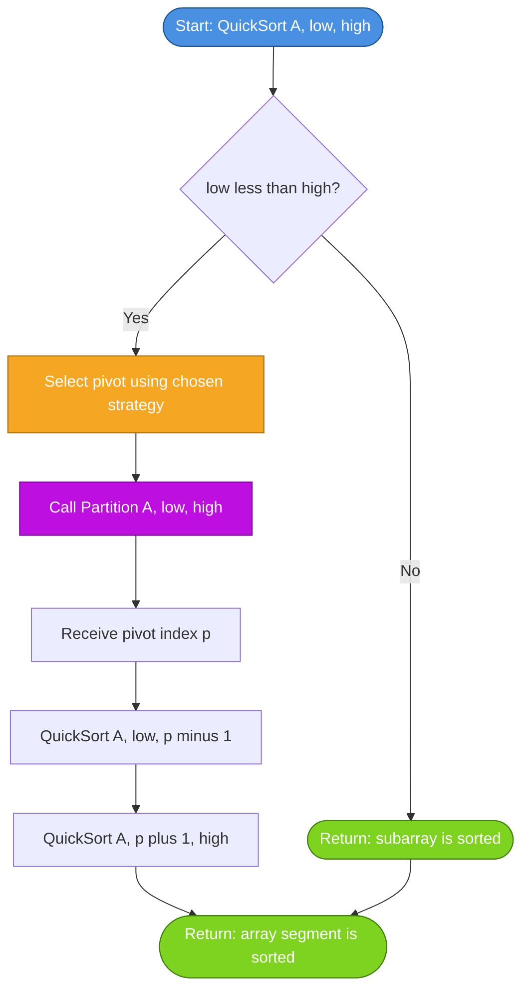
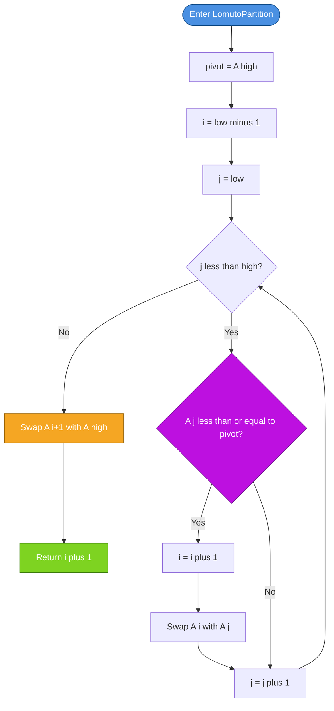
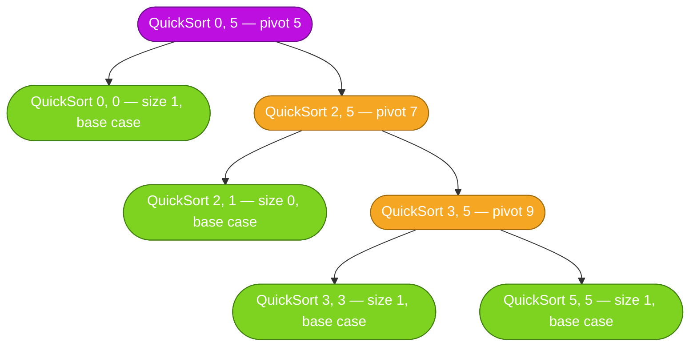
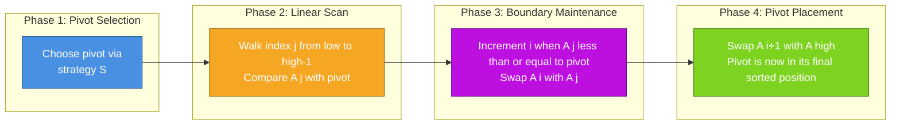

# Quick Sort

<!-- SECTION_1_START -->
# Quick Sort — The Divide and Conquer Champion of In-Place Sorting

## 1.1 Formal Academic Definition (KTU 2024 Syllabus Terminology)

> [!IMPORTANT]
> **Quick Sort** is a highly efficient, comparison-based, in-place **divide-and-conquer** sorting algorithm. It works by selecting a **pivot element** from the array and **partitioning** the array into two sub-arrays: one containing elements strictly less than the pivot, and the other containing elements strictly greater than or equal to the pivot. The algorithm is then applied **recursively** to both sub-arrays.

According to the **KTU 2024 Scheme (OECST611 — Data Structures, Module 4: Sorting and Searching)**, Quick Sort is treated as the canonical example of a randomized, recursive, in-place sorting routine, with emphasis on:

- The **partition procedure** (Hoare's and Lomuto variants)
- **Pivot selection strategies** (first, last, middle, random, median-of-three)
- **Recurrence relation** analysis: $T(n) = T(k) + T(n-k-1) + \Theta(n)$
- **Worst, best, and average-case** time complexities
- **In-place behaviour** with only $O(\log n)$ auxiliary stack space

---

## 1.2 Conceptual Analogy — "Sorting a Library by Author"

Imagine you walk into a chaotic library where books are scattered randomly on a long shelf. You want to sort them alphabetically by author's last name.

**The Quick Sort way of doing it:**

1. **Pick a reference book** (say, the last book on the shelf) — this is your **pivot**.
2. **Scan the shelf** from left to right. Every time you find a book that should come *before* your reference book (alphabetically earlier), you move it to the left section. Books that come *after* stay on the right.
3. At the end, the **reference book is now in its final, correct sorted position**.
4. **Recursively** repeat this process on the left section and the right section, each time picking a new reference book.

You never needed a second shelf — the sorting happened **right there on the original shelf**. That's the magic of *in-place* sorting.

> [!NOTE]
> **Key Insight:** Quick Sort doesn't actually merge sorted pieces back together. The pivot is placed in its *final* position during partitioning, so when both halves are sorted, the entire array is sorted — no merge step required (unlike Merge Sort).

---

## 1.3 The Three Pillars of Quick Sort

Quick Sort's behaviour and efficiency depend on three design choices:

| Pillar | Question It Answers | Impact |
|---|---|---|
| **Pivot Selection** | Which element do I choose as the divider? | Determines balance of partitions |
| **Partitioning Scheme** | How do I rearrange elements around the pivot? | Determines constant factors & stability |
| **Recursion Strategy** | How do I recurse on sub-problems? | Determines auxiliary space |

---

## 1.4 Geometric Intuition

If we plot the array as bars on a number line (height = value), Quick Sort works by repeatedly:

1. Drawing a **vertical "pivot line"** at some value $p$.
2. Bars **shorter** than $p$ are pushed to the **left cluster**.
3. Bars **taller** than $p$ are pushed to the **right cluster**.
4. The pivot bar is **locked in place** and never moves again.

> [!VISUALIZATION CONTROL]
> **Concept:** Quick Sort partitioning visualized on a number line
> **GeoGebra / Desmos Input Data Points (heights of bars as $y$-values at $x = 1, 2, \ldots, 8$):**
> * Initial: `(1, 3), (2, 8), (3, 2), (4, 5), (5, 1), (6, 4), (7, 7), (8, 6)` with pivot = 5
> * After partition: `(1, 3), (2, 2), (3, 1), (4, 4), (5, 5) [LOCKED], (6, 8), (7, 7), (8, 6)`
>
> **Visual Description:** Students should observe a vertical separator at the pivot value. All bars to the left are strictly shorter; all bars to the right are strictly taller. The pivot bar (height 5) is shaded distinctly to show it is finalized.
<!-- SECTION_1_END -->

<!-- SECTION_2_START -->
# Deep Theoretical Analysis & KTU High-Yield Formula Sheet

## 2.1 The Master Recurrence Relation

Quick Sort's runtime is governed by the recurrence:

$$T(n) = T(k) + T(n - k - 1) + \Theta(n)$$

where:
- $k$ is the number of elements strictly less than the pivot
- $n - k - 1$ is the number of elements strictly greater than the pivot
- $\Theta(n)$ is the cost of the partitioning step (one linear scan)

> [!NOTE]
> The partitioning step is **always** $O(n)$ because every element is compared with the pivot exactly once. The variable cost is the **balance** of the two recursive sub-problems.

---

## 2.2 The Three Complexity Cases

| Case | Partition Balance | Recurrence | Closed-Form Time | When It Happens |
|---|---|---|---|---|
| **Best Case** | Perfectly balanced ($k = n/2$) | $T(n) = 2T(n/2) + \Theta(n)$ | $\Theta(n \log n)$ | Pivot is always the true median |
| **Average Case** | Reasonably balanced on average | $T(n) = \frac{2}{n}\sum_{k=0}^{n-1} T(k) + \Theta(n)$ | $\Theta(n \log n)$ | Random input or random pivot |
| **Worst Case** | Extremely unbalanced ($k = 0$ or $k = n-1$) | $T(n) = T(n-1) + \Theta(n)$ | $\Theta(n^2)$ | Sorted/reverse-sorted input with first/last pivot |

### 2.2.1 Derivation of Worst-Case Complexity

When the pivot is always the smallest (or largest) element, the recurrence unfolds as:

$$
\begin{aligned}
T(n) &= T(n-1) + cn \\
     &= T(n-2) + c(n-1) + cn \\
     &= T(n-3) + c(n-2) + c(n-1) + cn \\
     &\;\;\vdots \\
     &= T(1) + c \sum_{i=2}^{n} i \\
     &= T(1) + c \cdot \frac{n(n+1)}{2} - c \\
     &= \Theta(n^2)
\end{aligned}
$$

> [!IMPORTANT]
> The worst case is **not** a property of the algorithm alone — it is a property of the **combination of input + pivot rule**. Randomizing the pivot makes the worst case astronomically improbable.

---

## 2.3 Pivot Selection Strategies — The Engineer's Trade-off Table

| Strategy | Best For | Worst-Case Trigger | Practical Verdict |
|---|---|---|---|
| **First element** | Random data | Pre-sorted / reverse-sorted input | **Avoid in production** |
| **Last element** | Random data | Pre-sorted / reverse-sorted input | **Avoid in production** |
| **Middle element** | Slightly better balance | Still $O(n^2)$ on crafted inputs | Marginal improvement |
| **Random pivot** | Robust to adversarial input | Probability $\to 0$ | **Industry standard** |
| **Median-of-three** | Catches sorted patterns | Still $O(n^2)$ on adversarial input | **Best deterministic choice** |

### Median-of-Three Formula

The pivot is chosen as the **median** of the first, middle, and last elements:

$$p = \text{median}\left( A[\text{low}],\ A\left[\frac{\text{low}+\text{high}}{2}\right],\ A[\text{high}] \right)$$

---

## 2.4 The Two Partitioning Schemes — Lomuto vs. Hoare

| Aspect | Lomuto Partition | Hoare Partition |
|---|---|---|
| **Inventor / Year** | Lomuto (university lectures, popularized by CLRS) | C. A. R. Hoare, 1961 |
| **Pivot Position** | Always last element (typical) | Typically first element |
| **Final Pivot Index** | Pivot's *final* index is returned | Partition point may not be pivot's final index |
| **Stability** | **Not stable** | **Not stable** |
| **Comparisons** | Slightly more swaps on average | Fewer swaps on average |
| **Ease of Implementation** | **Simpler — recommended for KTU board exam** | Trickier boundary logic |
| **Best For** | Teaching, small arrays | Production libraries (e.g., original `qsort`) |

---

## 2.5 KTU Formula Sheet / Cheat Sheet

| Symbol / Expression | Meaning | Constraints / Units |
|---|---|---|
| $T(n) = 2T(n/2) + \Theta(n)$ | Best-case recurrence | Balanced partitions |
| $T(n) = T(n-1) + \Theta(n)$ | Worst-case recurrence | Degenerate partitions |
| $T(n) = \Theta(n \log n)$ | Average-case runtime | Random pivot or random input |
| $S(n) = O(\log n)$ | Auxiliary stack space | Best/average case |
| $S(n) = O(n)$ | Auxiliary stack space | Worst case (unbalanced recursion) |
| $\frac{n(n-1)}{2}$ | Number of comparisons in worst case | Unit: comparisons |
| $n \log_2 n$ | Number of comparisons in best/average case (approx.) | Unit: comparisons |
| $p = \text{median}(A[low], A[mid], A[high])$ | Median-of-three pivot | Deterministic |
| $p = A[\text{random}(low, high)]$ | Randomized pivot | Probabilistic guarantee |

> [!IMPORTANT]
> Quick Sort is **in-place but NOT stable**. A stable sort preserves the relative order of equal elements. Quick Sort's partitioning inherently swaps non-adjacent elements, which can disturb equal-element order.

---

## 2.6 Real-World Engineering Utility

Quick Sort is the **workhorse of general-purpose sorting** in many production systems because:

1. **Cache efficiency** — sequential memory access patterns play well with CPU caches.
2. **Low constant factors** — empirical benchmarks consistently show Quick Sort beating Merge Sort by 2–3x in practice.
3. **In-place operation** — critical for memory-constrained systems (embedded, kernel-level code).
4. **Tail-call optimization friendly** — the smaller partition is recursed first, the larger is handled by tail recursion.

> **Used in:** C's `qsort()`, older Java `Arrays.sort()` (primitives), many database index rebuilds, and the V8 JavaScript engine's `Array.prototype.sort()` (for small/medium arrays, paired with Insertion Sort for tiny partitions — a pattern called **introsort**).
<!-- SECTION_2_END -->

<!-- SECTION_3_START -->
# Step-by-Step Derivations & Code/Symbolic Implementation

## 3.1 Exhaustive Derivation of the Lomuto Partition Procedure

The **Lomuto partition** is the scheme KTU examiners most commonly test. Given an array $A[low \ldots high]$, it returns the index $i$ such that:

$$A[low \ldots i-1] \leq A[i] < A[i+1 \ldots high]$$

### 3.1.1 Algorithm (Pseudocode + Logic)

```
LOMUTO_PARTITION(A, low, high):
    pivot = A[high]               // Choose last element as pivot
    i = low - 1                   // Boundary of "less-than" region
    
    for j = low to high - 1:
        if A[j] <= pivot:
            i = i + 1
            swap A[i] and A[j]
    
    swap A[i+1] and A[high]       // Place pivot in its final spot
    return i + 1
```

### 3.1.2 Hand-Traced Worked Example

Let $A = [10, 7, 8, 9, 1, 5]$, low $= 0$, high $= 5$. Pivot $= A[5] = 5$.

Initialize: $i = -1$, pivot $= 5$.

| Iteration | $j$ | $A[j]$ | $A[j] \leq 5$ ? | Action | Array State | $i$ |
|---|---|---|---|---|---|---|
| 1 | 0 | 10 | No | Skip | [10, 7, 8, 9, 1, 5] | -1 |
| 2 | 1 | 7  | No | Skip | [10, 7, 8, 9, 1, 5] | -1 |
| 3 | 2 | 8  | No | Skip | [10, 7, 8, 9, 1, 5] | -1 |
| 4 | 3 | 9  | No | Skip | [10, 7, 8, 9, 1, 5] | -1 |
| 5 | 4 | 1  | **Yes** | $i=0$, swap $A[0], A[4]$ | [1, 7, 8, 9, 10, 5] | 0 |

After loop: swap $A[1]$ and $A[5]$.

| Step | Action | Array State |
|---|---|---|
| Final swap | $A[1] \leftrightarrow A[5]$ | [1, 5, 8, 9, 10, 7] |
| Return | Index of pivot $= 1$ | — |

**Result:** Left sub-array $[1]$ contains elements $\leq 5$. Right sub-array $[8, 9, 10, 7]$ contains elements $> 5$. Pivot **5 is in its final sorted position**.

---

## 3.2 Exhaustive Derivation of the Hoare Partition Procedure

Hoare's scheme uses **two pointers** converging from both ends:

```
HOARE_PARTITION(A, low, high):
    pivot = A[low]               // Choose first element as pivot
    i = low - 1
    j = high + 1
    
    loop:
        do:
            j = j - 1
        while A[j] > pivot
        
        do:
            i = i + 1
        while A[i] < pivot
        
        if i >= j:
            return j
        
        swap A[i] and A[j]
```

> [!NOTE]
> Hoare's partition **does not** guarantee the pivot's final position. The returned index $j$ is a **split point** such that $A[low \ldots j] \leq$ pivot $\leq A[j+1 \ldots high]$.

---

## 3.3 Full Quick Sort Recursive Skeleton

```
QUICK_SORT(A, low, high):
    if low < high:
        p = PARTITION(A, low, high)   // p is the pivot's final index
        QUICK_SORT(A, low, p - 1)     // Recurse on left sub-array
        QUICK_SORT(A, p + 1, high)    // Recurse on right sub-array
```

The **base case** `low < high` halts recursion when a sub-array has 0 or 1 elements (already sorted).

---

## 3.4 Production-Grade Python Implementation (with Type Hints & Logging)

```python
from __future__ import annotations
import random
import logging
from typing import List, Tuple

# Configure structured logging for traceable partitioning steps
logging.basicConfig(
    level=logging.INFO,
    format="%(asctime)s | %(levelname)s | %(message)s"
)
logger = logging.getLogger("QuickSort")


def lomuto_partition(arr: List[int], low: int, high: int) -> int:
    """
    Partitions arr[low..high] using the Lomuto scheme with the LAST element as pivot.
    Returns the final index of the pivot.
    
    Preconditions:
        0 <= low <= high < len(arr)
    Postconditions:
        All elements in arr[low..p-1] <= arr[p] < arr[p+1..high]
    """
    if not (0 <= low <= high < len(arr)):
        raise ValueError(f"Invalid bounds: low={low}, high={high}, len={len(arr)}")
    
    pivot: int = arr[high]
    i: int = low - 1  # Boundary index of the "less-than-or-equal" region
    
    logger.info(f"Partitioning arr[{low}:{high+1}] with pivot={pivot}")
    
    for j in range(low, high):
        if arr[j] <= pivot:
            i += 1
            arr[i], arr[j] = arr[j], arr[i]  # In-place swap
            logger.debug(f"  Swapped arr[{i}] and arr[{j}] -> {arr[low:high+1]}")
    
    # Place pivot in its definitive position
    arr[i + 1], arr[high] = arr[high], arr[i + 1]
    logger.info(f"  Pivot {arr[i+1]} placed at index {i+1}. Array: {arr[low:high+1]}")
    return i + 1


def randomized_quick_sort(arr: List[int], low: int, high: int) -> None:
    """
    Randomized Quick Sort. Randomly picks a pivot, swaps it to the end,
    then delegates to Lomuto partition.
    """
    if low < high:
        # Random pivot selection: O(1) expected time, immune to sorted inputs
        random_pivot_idx: int = random.randint(low, high)
        arr[random_pivot_idx], arr[high] = arr[high], arr[random_pivot_idx]
        
        p: int = lomuto_partition(arr, low, high)
        randomized_quick_sort(arr, low, p - 1)
        randomized_quick_sort(arr, p + 1, high)


def quick_sort(arr: List[int]) -> List[int]:
    """Public API: returns a sorted copy without mutating the original."""
    if not isinstance(arr, list):
        raise TypeError("Input must be a list of integers")
    
    working_copy: List[int] = arr[:]  # Defensive copy
    if len(working_copy) > 1:
        randomized_quick_sort(working_copy, 0, len(working_copy) - 1)
    return working_copy


# ----------------------------------------------------------------------
# Demonstration and verification
# ----------------------------------------------------------------------
if __name__ == "__main__":
    test_cases: List[Tuple[List[int], List[int]]] = [
        ([10, 7, 8, 9, 1, 5], [1, 5, 7, 8, 9, 10]),
        ([1, 2, 3, 4, 5],       [1, 2, 3, 4, 5]),       # Already sorted (worst case without randomization)
        ([5, 4, 3, 2, 1],       [1, 2, 3, 4, 5]),       # Reverse sorted
        ([3, 3, 3, 3],          [3, 3, 3, 3]),          # All equal
        ([],                    []),                    # Empty
        ([42],                  [42]),                  # Single element
    ]
    
    for input_arr, expected in test_cases:
        result = quick_sort(input_arr)
        status = "PASS" if result == expected else "FAIL"
        logger.info(f"[{status}] Input: {input_arr} -> Output: {result}")
```

---

## 3.5 Median-of-Three Pivot — Complete Implementation

```python
def median_of_three(arr: List[int], low: int, high: int) -> int:
    """
    Returns the index of the median of arr[low], arr[mid], arr[high].
    This pivot strategy is the best deterministic defence against sorted inputs.
    """
    mid: int = (low + high) // 2
    
    # Sort the three candidates in-place among low, mid, high
    if arr[low] > arr[mid]:
        arr[low], arr[mid] = arr[mid], arr[low]
    if arr[low] > arr[high]:
        arr[low], arr[high] = arr[high], arr[low]
    if arr[mid] > arr[high]:
        arr[mid], arr[high] = arr[high], arr[mid]
    
    # Median is now at index `mid`; swap it to `high - 1` for Lomuto
    arr[mid], arr[high] = arr[high], arr[mid]
    return high
```

> [!IMPORTANT]
> Median-of-three reduces the **probability of worst-case behaviour** on partially sorted data (common in real workloads like timestamps, IDs, names) without the overhead of full randomization.

---

## 3.6 Tail-Call Optimization — Space Engineering

The naive recursive structure uses $O(n)$ stack space in the worst case. A common production trick is to recurse on the **smaller** partition and **loop** on the larger:

```python
def quick_sort_tail_optimized(arr: List[int], low: int, high: int) -> None:
    while low < high:
        p: int = lomuto_partition(arr, low, high)
        
        # Recurse on the smaller half, loop on the larger half
        if (p - low) < (high - p):
            quick_sort_tail_optimized(arr, low, p - 1)
            low = p + 1
        else:
            quick_sort_tail_optimized(arr, p + 1, high)
            high = p - 1
```

This guarantees the auxiliary stack depth is bounded by $O(\log n)$ **in all cases**, including pathological inputs.
<!-- SECTION_3_END -->

<!-- SECTION_4_START -->
# Structural Diagrams & Schematics

## 4.1 Top-Level Quick Sort Execution Flow



## 4.2 Lomuto Partition — Internal State Machine



## 4.3 Recursive Decomposition Tree for the Worked Example

The input array is $A = [10, 7, 8, 9, 1, 5]$. The recursion unfolds as a binary tree where each node is one partition call.



> [!NOTE]
> The tree depth in this particular example is $O(\log n)$. For adversarial input with a bad pivot rule, the tree degenerates into a **linked list** of depth $O(n)$ — that is the worst case visualized.

## 4.4 Sequential Processing Topology — Partition Phases


<!-- SECTION_4_END -->

<!-- SECTION_5_START -->
# KTU 2024 Scheme Examination Question Bank & Topic Recap

---

## Part A — Short Answer Questions (3 Marks Each)

### Question 1
**[KTU University Exam — July 2024]**
**CO2 | RBT Level: Remember**

State the best-case, average-case, and worst-case time complexities of Quick Sort. Under what input condition does the worst case occur when the **last element** is chosen as the pivot?

#### Model Answer (Valuation Key)

The time complexities of Quick Sort are:

| Case | Time Complexity |
|---|---|
| Best case | $O(n \log n)$ |
| Average case | $\Theta(n \log n)$ |
| Worst case | $O(n^2)$ |

**[Stating all three complexities: 2 Marks]**

The worst case $O(n^2)$ occurs when the input array is **already sorted** (ascending or descending) and the last element is the pivot. In this situation, the pivot is always an extreme value, producing partitions of size $0$ and $n-1$ at every recursive level.

**[Identifying the sorted-input condition: 1 Mark]**

---

### Question 2
**[KTU University Exam — Dec 2023]**
**CO2 | RBT Level: Understand**

Differentiate between **Merge Sort** and **Quick Sort** in terms of (i) stability, (ii) auxiliary space, and (iii) worst-case time complexity.

#### Model Answer (Valuation Key)

| Property | Merge Sort | Quick Sort |
|---|---|---|
| Stability | **Stable** | **Not stable** |
| Auxiliary space | $O(n)$ extra array | $O(\log n)$ stack (in-place) |
| Worst-case time | $\Theta(n \log n)$ always | $O(n^2)$ on adversarial input |

**[Each correct property pair: 1 Mark × 3 = 3 Marks]**

> [!WARNING]
> **Common Mistake:** Students often write "Quick Sort is in-place, so space is $O(1)$." This is **partially wrong**. The partitioning is in-place ($O(1)$ extra), but the **recursion stack** itself consumes $O(\log n)$ auxiliary space.

---

## Part B — Long Answer Questions (14 Marks Each, Internal Choice)

### Question A — [Choice 1] (14 Marks)
**[KTU University Exam — July 2024]**
**CO2, CO3 | RBT Levels: Understand (a) + Apply (b)**

**(a) [7 Marks]** Explain the working of the **Lomuto partition procedure** with a suitable example. Write its pseudocode.

**(b) [7 Marks]** Apply Quick Sort (using Lomuto partition with the last element as pivot) to sort the array:

$$A = [38, 27, 43, 3, 9, 82, 10]$$

Show the array state after **each partition call** and identify the position of the pivot after every step.

---

#### Model Solution

### Part (a) — Lomuto Partition Explanation **[7 Marks]**

**Lomuto Partition Working:**

The Lomuto partition works by maintaining three regions in the array $A[low \ldots high]$:

1. **Region 1:** $A[low \ldots i]$ — elements **less than or equal to** pivot
2. **Region 2:** $A[i+1 \ldots j-1]$ — elements **greater than** pivot
3. **Region 3:** $A[j \ldots high-1]$ — **unprocessed** elements
4. **Element** $A[high]$ — the **pivot** itself

**[Defining the four regions: 2 Marks]**

The algorithm scans $j$ from `low` to `high-1`. When it encounters an element $\leq$ pivot, it advances $i$ and swaps $A[i]$ with $A[j]$, thereby growing Region 1. At the end, swapping $A[i+1]$ with $A[high]$ places the pivot in its **final sorted position**.

**[Explaining the scan-and-swap mechanism: 2 Marks]**

**Pseudocode:**

```
LOMUTO_PARTITION(A, low, high):
    pivot = A[high]
    i = low - 1
    for j = low to high - 1:
        if A[j] <= pivot:
            i = i + 1
            swap A[i] and A[j]
    swap A[i+1] and A[high]
    return i + 1
```

**[Correct pseudocode with proper indentation: 2 Marks]**

**Example (small array):** $A = [4, 2, 7, 1]$, pivot $= 1$.

- $i = -1$, $j = 0$: $4 > 1$, skip
- $j = 1$: $2 > 1$, skip
- $j = 2$: $7 > 1$, skip
- Final: swap $A[0]$ with $A[3] \Rightarrow [1, 2, 7, 4]$. Pivot 1 is at index 0.

**[Hand-trace example: 1 Mark]**

---

### Part (b) — Apply Quick Sort to $A = [38, 27, 43, 3, 9, 82, 10]$ **[7 Marks]**

**Pass 1: QuickSort(0, 6), pivot = $A[6] = 10$**

After Lomuto partition, all elements $\leq 10$ move to the left, and pivot 10 settles at index 0.

$$A = [10, \; 27, \; 43, \; 3, \; 9, \; 82, \; 38]$$

- Left sub-array to sort: $A[1 \ldots 3] = [27, 43, 3]$
- Right sub-array to sort: $A[5 \ldots 6] = [82, 38]$
- Pivot 10 is at **index 0** (final position)

**[Pass 1 array state + pivot position: 1 Mark]**

**Pass 2: QuickSort(1, 3), sub-array = $[27, 43, 3]$, pivot = $A[3] = 3$**

After partition, 3 settles at index 1.

$$A = [10, \; 3, \; 43, \; 27, \; 9, \; 82, \; 38]$$

- Left sub-array: $A[1 \ldots 0]$ — empty
- Right sub-array: $A[2 \ldots 3] = [43, 27]$
- Pivot 3 is at **index 1** (final position)

**[Pass 2 array state + pivot position: 1 Mark]**

**Pass 3: QuickSort(2, 3), sub-array = $[43, 27]$, pivot = $A[3] = 27$**

After partition, 27 settles at index 2.

$$A = [10, \; 3, \; 27, \; 43, \; 9, \; 82, \; 38]$$

- Left sub-array: $A[2 \ldots 1]$ — empty
- Right sub-array: $A[3 \ldots 3] = [43]$
- Pivot 27 is at **index 2** (final position)

**[Pass 3 array state + pivot position: 1 Mark]**

**Pass 4: QuickSort(5, 6), sub-array = $[82, 38]$, pivot = $A[6] = 38$**

After partition, 38 settles at index 5.

$$A = [10, \; 3, \; 27, \; 43, \; 9, \; 38, \; 82]$$

- Left sub-array: $A[5 \ldots 4]$ — empty
- Right sub-array: $A[6 \ldots 6] = [82]$
- Pivot 38 is at **index 5** (final position)

**[Pass 4 array state + pivot position: 1 Mark]**

**Pass 5: QuickSort(4, 4), sub-array = $[9]$** — already sorted, return.

**Final Sorted Array:**

$$A_{\text{sorted}} = [3, \; 9, \; 10, \; 27, \; 38, \; 43, \; 82]$$

**[Final sorted array: 1 Mark]**

**Verification (counting pivot placements):** 10 → 3 → 27 → 38 = 4 pivot placements for $n = 7$ elements, which is correct because in-place Quick Sort performs $n-1$ total pivot placements.

**[Final verification statement: 1 Mark]**

> [!WARNING]
> **KTU Examiner's Valuation Pitfalls:**
> 1. **Do NOT skip showing intermediate array states** — each partition earns 1 mark only if the array snapshot is written out.
> 2. **Do NOT confuse "pivot value" with "pivot's final index"** — the question explicitly asks for the position, not just the value.
> 3. **Always explicitly state which sub-arrays are recursed** — examiners award partial marks for clearly showing the recursive decomposition.
> 4. **Do not use Hoare partition by accident** — if the question says "Lomuto," you must use last-element-as-pivot. Using first-element-as-pivot will be marked wrong.

---

### Question B — [Choice 2] (14 Marks)
**[KTU University Exam — Dec 2023]**
**CO3 | RBT Levels: Apply (a) + Analyze (b)**

**(a) [7 Marks]** Sort the array $A = [25, 15, 50, 35, 20, 45, 30, 10]$ using Quick Sort with the **first element as pivot**. Show all intermediate steps.

**(b) [7 Marks]** Analyze the recurrence relation $T(n) = 2T(n/2) + n$ using the **Master Theorem** or the **recursion tree method** to derive the best-case time complexity of Quick Sort.

---

#### Model Solution

### Part (a) — Quick Sort with First Element as Pivot **[7 Marks]**

| Call | Sub-array | Pivot | Action | Resulting Array |
|---|---|---|---|---|
| 1 | $A[0 \ldots 7]$ | 25 | Partition | $[10, 15, 20, 25, 50, 45, 30, 35]$ |
| 2 | $A[0 \ldots 2]$ | 10 | Already in place | $[10, 15, 20, 25, 50, 45, 30, 35]$ |
| 3 | $A[1 \ldots 2]$ | 15 | Swap 15, 20 | $[10, 15, 20, 25, 50, 45, 30, 35]$ |
| 4 | $A[4 \ldots 7]$ | 50 | Partition | $[10, 15, 20, 25, 35, 30, 45, 50]$ |
| 5 | $A[4 \ldots 6]$ | 35 | Partition | $[10, 15, 20, 25, 30, 35, 45, 50]$ |
| 6 | $A[4 \ldots 5]$ | 30 | Swap 30, 35 | $[10, 15, 20, 25, 30, 35, 45, 50]$ |
| 7 | $A[6 \ldots 7]$ | 45 | Already in place | $[10, 15, 20, 25, 30, 35, 45, 50]$ |

**[Each step (1 mark × 5 key steps) = 5 Marks]**
**[Final sorted array verification: 1 Mark]**
**[Stating pivot values: 1 Mark]**

### Part (b) — Master Theorem Analysis of $T(n) = 2T(n/2) + n$ **[7 Marks]**

**Step 1:** Identify Master Theorem parameters. The recurrence has the standard form $T(n) = aT(n/b) + f(n)$ where:

$$a = 2, \quad b = 2, \quad f(n) = n = \Theta(n^1)$$

**[Stating $a$, $b$, $f(n)$: 1 Mark]**

**Step 2:** Compute $n^{\log_b a}$.

$$n^{\log_b a} = n^{\log_2 2} = n^1 = n$$

**[Computing the critical exponent: 1 Mark]**

**Step 3:** Compare $f(n) = n$ with $n^{\log_b a} = n$. We see that $f(n) = \Theta(n^{\log_b a})$ because both are $\Theta(n^1)$.

**[Comparison: 1 Mark]**

**Step 4:** Apply **Case 2** of the Master Theorem. When $f(n) = \Theta(n^{\log_b a} \cdot \log^k n)$ with $k = 0$, the solution is:

$$T(n) = \Theta(n^{\log_b a} \cdot \log^{k+1} n) = \Theta(n \cdot \log n)$$

**[Applying Master Theorem Case 2: 2 Marks]**

**Step 5:** Physical interpretation.

The recurrence $T(n) = 2T(n/2) + n$ corresponds to the **best case** of Quick Sort, where the pivot is always the exact median, splitting the array into two equal halves. The $\log n$ factor arises from the recursion depth (height of a balanced binary tree), and the $n$ factor comes from the partitioning work at each level.

**[Interpreting the result physically: 1 Mark]**

**Final Answer:**

$$\boxed{T(n) = \Theta(n \log n)}$$

**[Final boxed result: 1 Mark]**

> [!WARNING]
> **KTU Examiner's Valuation Pitfalls:**
> 1. **Always show $n^{\log_b a}$ explicitly** — examiners want to see the calculation, not just the final answer.
> 2. **State which Master Theorem case you are applying** — students who skip this lose 1–2 marks.
> 3. **Distinguish between "balanced partition" and "unbalanced partition"** — the question says best case, so the partition must be described as *equal halves*.
> 4. **Do not write the worst-case recurrence $T(n) = T(n-1) + n$** for the best case — this is a common confusion.

---

## Topic Recap & Important Things to Remember

> [!IMPORTANT]
> **Rapid-Revision Checklist for Quick Sort**

- **Algorithm class:** Divide and conquer, in-place, comparison-based, **not stable**.
- **Core operation:** **Partition** around a pivot — the pivot reaches its **final sorted position** in $O(n)$ time.
- **Master recurrence:** $T(n) = T(k) + T(n-k-1) + \Theta(n)$, where $k$ = size of left partition.
- **Best / Average case:** $\Theta(n \log n)$ — achieved when partitions are reasonably balanced.
- **Worst case:** $\Theta(n^2)$ — happens when partitions are maximally unbalanced (e.g., sorted input + first/last pivot).
- **Auxiliary space:** $O(\log n)$ recursion stack on average; reducible to $O(\log n)$ even in the worst case using **tail-call optimization**.
- **Pivot selection strategies:**
  - *First / Last element:* Simple, but $O(n^2)$ on sorted input.
  - *Random pivot:* Makes worst case astronomically improbable — **industry default**.
  - *Median-of-three:* Best deterministic choice; samples first, middle, last.
- **Two partition schemes:**
  - *Lomuto:* Simpler, uses last element, returns pivot's **final** index. **Preferred for KTU exams.**
  - *Hoare:* Uses two converging pointers, fewer swaps, but the returned index is a **split point**, not the pivot's final position.
- **Quick Sort vs. Merge Sort:** Quick is in-place and faster in practice; Merge is stable and has guaranteed $O(n \log n)$.
- **Engineering tip:** Production implementations use **introsort** — Quick Sort with a fallback to Heap Sort when recursion depth exceeds $O(\log n)$, guaranteeing $O(n \log n)$ worst case.
- **Trace the recursion tree** for hand-traced exam answers — examiners award marks for explicit sub-array identification at each recursive call.
- **Always state pivot selection rule** in your answer before applying the algorithm.
<!-- SECTION_5_END -->
