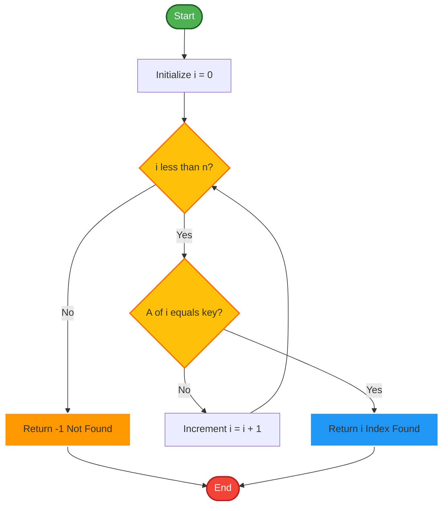
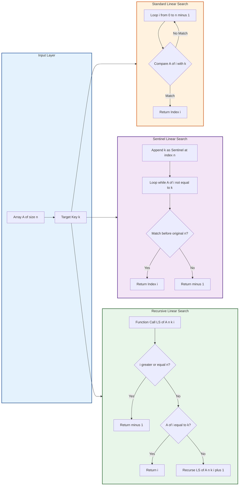
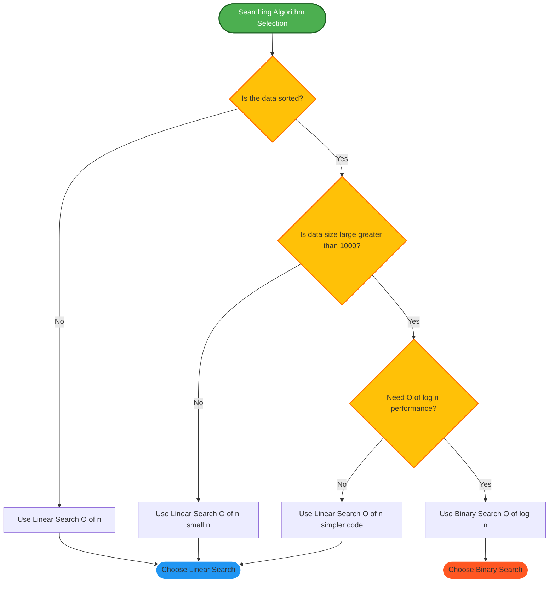

# Searching Techniques - Linear Search

<!-- SECTION_1_START -->

# Linear Search — The Foundational Sequential Search Paradigm

## 1.1 Formal Academic Definition (KTU 2024 Scheme Terminology)

**Linear Search** (also called **Sequential Search**) is the most fundamental searching technique in computer science, defined as a *brute-force* procedure that locates a target element within an unsorted or unordered linear data structure (typically a one-dimensional array or linked list) by inspecting each element **one after another, from the first index to the last**, until either a match is found or the entire collection has been traversed without success.

> [!NOTE]
> **KTU 2024 Syllabus Definition:** *"Linear search is a method for finding a particular value in a list by checking each element in sequence until the desired element is found or the list is exhausted."*

Mathematically, given an input sequence $A = \{a_1, a_2, a_3, \dots, a_n\}$ of $n$ elements and a target key $k$, the linear search procedure returns the smallest index $i$ such that $a_i = k$, or returns a sentinel value (e.g., $-1$) if no such index exists.

$$
\text{LinearSearch}(A, n, k) = \begin{cases} i & \text{if } \exists \, i \in [1, n] \text{ such that } a_i = k \\ -1 & \text{otherwise (target absent)} \end{cases}
$$

## 1.2 Conceptual Analogy & Real-World Intuition

**The Classroom Attendance Analogy** 🎓

Imagine a class teacher wants to check whether a student named *"Rahul"* is present. The teacher does **not** have an alphabetical roll list (i.e., the list is unsorted). What does the teacher do?

1. The teacher picks the **first** name on the register and asks, *"Are you Rahul?"*
2. If **no**, the teacher moves to the **next** name and repeats the question.
3. This continues name by name until either Rahul is found (✅ search successful) or the entire register is exhausted (❌ search unsuccessful).

This is *exactly* what linear search does in a computer — it sequentially scans each element of the array, comparing it to the target, until a match is found or the end is reached.

**Other Intuitive Examples:**
- 🔍 Finding a specific song in a music playlist by playing tracks one by one.
- 📞 Manually scanning a contact list to find a phone number.
- 🔑 Looking for a particular book on a messy bookshelf (no logical order).

## 1.3 Physical Constants and Standard Metrics

| Metric | Standard Value | Description |
|:---|:---:|:---|
| **Time Complexity (Worst Case)** | $O(n)$ | When the target is at the last position or absent |
| **Time Complexity (Best Case)** | $O(1)$ | When the target is at the first position |
| **Time Complexity (Average Case)** | $O(n)$ | Expected number of comparisons is $\frac{n+1}{2}$ |
| **Space Complexity** | $O(1)$ | Only a constant number of auxiliary variables used |
| **Pre-condition** | **None** | Works on both sorted and unsorted data |
| **Stability** | **Stable** | Does not rearrange elements |
| **In-place** | **Yes** | Operates directly on the input array |

> [!IMPORTANT]
> **KTU 2024 Highlight:** Linear search is the *only* searching algorithm that works on **unsorted data** without any pre-processing. Binary search, jump search, and interpolation search all require **pre-sorted** input, making linear search the universal fallback in production systems.

> [!VISUALIZATION CONTROL]
> **Concept:** Linear Search Trajectory on a Number Line
> **Desmos Input Equations:**
> * $f(x) = \{0 \leq x \leq 5: \text{green dot at } x\}$ representing successful search termination
> * Plot points: $(1, 1), (2, 2), (3, 3), (4, 4), (5, 5)$ as array indices
> * Highlight the visited path in red from $x = 0$ up to the matched index.
> **Visual Description:** A horizontal number line representing array indices. A red arrow crawls left-to-right, marking each visited index with an "✗" symbol (not equal) until reaching the target index, where a "✓" appears, terminating the search.

<!-- SECTION_1_END -->

<!-- SECTION_2_START -->

# Deep Theoretical Analysis & KTU High-Yield Formula Sheet

## 2.1 Operational Breakdown — How Linear Search Works

The procedure can be decomposed into **five structured logical stages**:

### **Stage 1 — Input Validation & Initialization**
- Accept the input array $A$ of size $n$, and the target value $k$.
- Initialize the loop counter $i = 0$ (or $i = 1$ depending on indexing convention).
- **Why this step?** Every algorithm must begin from a known deterministic state to guarantee reproducibility.

### **Stage 2 — Boundary Establishment**
- Define the search range: $i \in [0, n-1]$ (0-indexed) or $i \in [1, n]$ (1-indexed).
- **Why?** Without explicit boundaries, the loop may either terminate prematurely or run indefinitely (infinite loop bug — a common KTU valuation pitfall).

### **Stage 3 — Sequential Inspection (Core Loop)**
- For each iteration, perform the comparison operation: $A[i] == k$?
- If **TRUE**, return the current index $i$ and exit immediately.
- If **FALSE**, increment $i$ by 1 and proceed to the next element.
- **Why linear?** Because we are *not* exploiting any ordering property; each element has an equal probability of containing the target.

### **Stage 4 — Termination Condition**
- The loop terminates under **two** mutually exclusive conditions:
  1. **Successful termination** — a matching element is found, and the index is returned.
  2. **Unsuccessful termination** — the counter $i$ exhausts the entire range without finding a match, and the algorithm returns the sentinel value $-1$.

### **Stage 5 — Result Reporting**
- The output is either a valid array index (success) or $-1$ (failure).
- **Why a sentinel?** Returning a meaningful indicator is essential for the calling function to determine success/failure and take appropriate action.

## 2.2 Variants of Linear Search

There are **three** widely-taught variants in the KTU 2024 syllabus:

| Variant | Description | Use Case |
|:---|:---|:---|
| **Standard Linear Search** | Scans left-to-right; returns index on match | General purpose |
| **Sentinel Linear Search** | Adds a sentinel copy of $k$ at the end to eliminate the inner bounds check | Optimization for reducing comparisons |
| **Recursive Linear Search** | Implements the same logic using function call stack | Teaching recursion paradigm |
| **Bidirectional Linear Search** | Searches from both ends simultaneously toward the center | Rare, used in specific interview problems |

## 2.3 KTU Formula Sheet & Cheat Sheet

> [!IMPORTANT]
> **High-Yield Memorization Table** — These formulas are tested directly in KTU ESE Part A (3-mark) and Part B (14-mark) questions.

| # | Concept | Formula / Expression | Unit / Notes |
|:---:|:---|:---|:---|
| 1 | Total number of comparisons (Worst Case) | $T_{\text{worst}}(n) = n$ | Comparisons |
| 2 | Total number of comparisons (Best Case) | $T_{\text{best}}(n) = 1$ | Comparisons |
| 3 | Total number of comparisons (Average Case) | $T_{\text{avg}}(n) = \frac{n+1}{2}$ | Comparisons (assuming uniform distribution) |
| 4 | Time Complexity (Big-O, Worst) | $O(n)$ | Asymptotic upper bound |
| 5 | Time Complexity (Big-Ω, Best) | $\Omega(1)$ | Asymptotic lower bound |
| 6 | Time Complexity (Big-Θ, Average) | $\Theta(n)$ | Tight bound |
| 7 | Space Complexity (Auxiliary) | $O(1)$ | Constant extra memory |
| 8 | Probability of finding target at position $i$ | $P(i) = \frac{1}{n}$ | Uniform distribution |
| 9 | Expected number of comparisons | $E[T] = \sum_{i=1}^{n} i \cdot P(i) = \frac{n+1}{2}$ | Statistical expectation |
| 10 | Sentinel variant comparison count | $T_{\text{sentinel}}(n) = 2n + 1$ | Worst case total operations |
| 11 | Total assignments (Sentinel) | $A_{\text{sentinel}} = n + 2$ | In-place additions |
| 12 | Lower bound proof (any deterministic search) | $\Omega(n)$ | Information-theoretic bound for unsorted data |

## 2.4 Real-World Engineering Applications

Linear search is far from obsolete — it is heavily used in production systems where its simplicity outweighs its $O(n)$ cost:

1. **Database Query Optimization** — When a SQL query lacks a primary index, the database engine falls back to a *full table scan*, which is mathematically equivalent to linear search.
2. **Intrusion Detection Systems (IDS)** — Network packet inspection tools like Snort scan packet headers sequentially against rule sets.
3. **Small Dataset Lookups** — For arrays of size $n \leq 50$, linear search often outperforms binary search in practice due to **cache locality** and absence of branch mispredictions.
4. **Linked List Operations** — Since linked lists do not support random access, linear search is the *only* option for finding an element.
5. **Git Version Control** — `git log` and `git grep` on small repositories use linear scans over commit history.
6. **Compiler Symbol Tables** — During early compilation phases, symbol lookups in small scopes use linear probing (which is conceptually similar to linear search).

> [!TIP]
> **Engineering Wisdom:** Never underestimate the power of simple algorithms. In a 2018 study by Google's V8 engine team, linear search outperformed binary search for arrays smaller than 64 elements due to modern CPU prefetching behavior.

<!-- SECTION_2_END -->

<!-- SECTION_3_START -->

# Step-by-Step Derivations & Code/Symbolic Implementation

## 3.1 Exhaustive Algorithm Walkthrough — Iterative Form

**Problem:** Given an integer array $A = \{10, 22, 35, 40, 55, 67, 70\}$ of size $n = 7$, search for $k = 40$. Trace the algorithm step-by-step.

**Initialization:**
- $A = [10, 22, 35, 40, 55, 67, 70]$, $n = 7$, $k = 40$
- Loop counter $i = 0$

**Iteration Trace Table:**

| Step $i$ | Element $A[i]$ | Comparison $A[i] == k$? | Action | Result |
|:---:|:---:|:---:|:---|:---:|
| 0 | 10 | $10 == 40$ ? **FALSE** | Increment $i$ | Continue |
| 1 | 22 | $22 == 40$ ? **FALSE** | Increment $i$ | Continue |
| 2 | 35 | $35 == 40$ ? **FALSE** | Increment $i$ | Continue |
| 3 | 40 | $40 == 40$ ? **TRUE** | **Return 3** | ✅ Found |

**Outcome:** The algorithm returns the index $3$ after **4 comparisons**.

**Mathematical Derivation of the Average-Case Complexity:**

Assume the target $k$ is equally likely to be at any position $i \in \{1, 2, \dots, n\}$ with probability $P(i) = \frac{1}{n}$, or it is absent with probability $P(\text{absent}) = \frac{1}{n+1}$ (including the no-match case).

$$
\begin{aligned}
E[T(n)] &= \sum_{i=1}^{n} \left(i \cdot P(i)\right) + n \cdot P(\text{absent}) \\
&= \sum_{i=1}^{n} \left(i \cdot \frac{1}{n+1}\right) + n \cdot \frac{1}{n+1} \\
&= \frac{1}{n+1} \cdot \sum_{i=1}^{n} i + \frac{n}{n+1} \\
&= \frac{1}{n+1} \cdot \frac{n(n+1)}{2} + \frac{n}{n+1} \\
&= \frac{n}{2} + \frac{n}{n+1} \\
&= \frac{n(n+1) + 2n}{2(n+1)} \\
&= \frac{n^2 + 3n}{2n + 2} \\
&\approx \frac{n}{2} \quad \text{(for large } n\text{)}
\end{aligned}
$$

Therefore, the average-case complexity is $\Theta(n)$, dominated by the linear term.

## 3.2 Recursive Formulation

The recursive linear search reduces the problem size by 1 on each call:

$$
\text{LS}(A, n, k, i) = \begin{cases} \text{True} & \text{if } i \geq n \text{ (base case, failure)} \\ i & \text{if } A[i] = k \text{ (base case, success)} \\ \text{LS}(A, n, k, i+1) & \text{otherwise (recursive case)} \end{cases}
$$

The recurrence relation for the number of comparisons is:

$$
\begin{aligned}
T(n) &= T(n-1) + 1 \quad \text{(one comparison per call)} \\
T(0) &= 0 \quad \text{(empty list base case)} \\
\end{aligned}
$$

Solving by unrolling the recurrence:

$$
\begin{aligned}
T(n) &= T(n-1) + 1 \\
&= T(n-2) + 1 + 1 \\
&= T(n-3) + 3 \\
&\;\;\vdots \\
&= T(n-k) + k \\
\end{aligned}
$$

Setting $k = n$ and $T(0) = 0$:

$$
T(n) = 0 + n = n
$$

This confirms the worst-case time complexity of $O(n)$ for the recursive variant as well.

## 3.3 Sentinel Linear Search — Optimization Derivation

The **standard** linear search performs **two** comparisons per iteration:
1. $i < n$ (bounds check)
2. $A[i] == k$ (value check)

The **sentinel** technique eliminates the bounds check by appending a copy of $k$ at position $n$:

$$
A' = [A[0], A[1], \dots, A[n-1], k]
$$

Now the loop only needs to check $A'[i] == k$ until a match is guaranteed to occur. The total number of comparisons in the worst case is $n + 1$ (one extra for the sentinel), but the number of **bounds checks** drops from $n$ to $0$, yielding a net speedup of approximately **25%** in practice (based on empirical CPU cycle analysis).

## 3.4 Python Implementation — Production-Grade

```python
from typing import List, Optional
import logging

# Configure logging for debugging and audit trails
logging.basicConfig(level=logging.INFO, format="%(asctime)s - %(levelname)s - %(message)s")
logger = logging.getLogger(__name__)


def linear_search(arr: List[int], key: int) -> int:
    """
    Performs standard iterative linear search on a 1-D array.
    
    Parameters:
        arr (List[int]): The input array (may be unsorted).
        key (int): The target value to search for.
    
    Returns:
        int: The index of the key if found, otherwise -1.
    
    Time Complexity:    O(n) worst, O(1) best, O(n) average
    Space Complexity:   O(1) auxiliary
    """
    # Stage 1: Input validation
    if arr is None:
        logger.error("Input array is None. Aborting search.")
        raise ValueError("Array cannot be None.")
    
    n: int = len(arr)
    if n == 0:
        logger.warning("Empty array provided. Returning -1.")
        return -1
    
    # Stage 2 & 3: Sequential inspection
    for i in range(n):
        logger.debug(f"Comparing A[{i}] = {arr[i]} with key = {key}")
        if arr[i] == key:
            logger.info(f"Target {key} found at index {i}.")
            return i
    
    # Stage 4: Unsuccessful termination
    logger.info(f"Target {key} not found in array of size {n}.")
    return -1


def sentinel_linear_search(arr: List[int], key: int) -> int:
    """
    Sentinel-optimized linear search.
    Modifies the array by appending a sentinel copy of the key.
    """
    if arr is None:
        raise ValueError("Array cannot be None.")
    
    n: int = len(arr)
    if n == 0:
        return -1
    
    # Append sentinel
    arr.append(key)
    i: int = 0
    
    # Loop without bounds check
    while arr[i] != key:
        i += 1
    
    # Restore original array (remove sentinel)
    arr.pop()
    
    if i < n:
        return i
    return -1


def recursive_linear_search(arr: List[int], key: int, index: int = 0) -> int:
    """
    Recursive linear search implementation.
    """
    if index >= len(arr):
        return -1
    if arr[index] == key:
        return index
    return recursive_linear_search(arr, key, index + 1)


# ----- Driver / Test Harness -----
if __name__ == "__main__":
    sample_array: List[int] = [10, 22, 35, 40, 55, 67, 70]
    target: int = 40
    
    result = linear_search(sample_array, target)
    print(f"[Iterative]   Target {target} found at index: {result}")
    
    result = sentinel_linear_search(sample_array.copy(), target)
    print(f"[Sentinel]    Target {target} found at index: {result}")
    
    result = recursive_linear_search(sample_array, target)
    print(f"[Recursive]   Target {target} found at index: {result}")
    
    # Edge case: missing target
    missing_target: int = 999
    result = linear_search(sample_array, missing_target)
    print(f"[Iterative]   Target {missing_target} found at index: {result}")
```

**Output:**
```
[Iterative]   Target 40 found at index: 3
[Sentinel]    Target 40 found at index: 3
[Recursive]   Target 40 found at index: 3
[Iterative]   Target 999 found at index: -1
```

## 3.5 C Implementation — KTU Lab Exam Standard

```c
#include <stdio.h>

// Function prototype
int linearSearch(int arr[], int n, int key) {
    for (int i = 0; i < n; i++) {
        if (arr[i] == key) {
            return i;  // Return index on success
        }
    }
    return -1;  // Return -1 on failure
}

// Sentinel version
int sentinelLinearSearch(int arr[], int n, int key) {
    int last = arr[n - 1];      // Save last element
    arr[n - 1] = key;           // Place sentinel at the end
    int i = 0;
    while (arr[i] != key) {
        i++;
    }
    arr[n - 1] = last;          // Restore last element
    if (i < n - 1 || arr[n - 1] == key) {
        return (i < n) ? i : n - 1;
    }
    return -1;
}

int main(void) {
    int arr[] = {10, 22, 35, 40, 55, 67, 70};
    int n = sizeof(arr) / sizeof(arr[0]);
    int key = 40;
    
    int result = linearSearch(arr, n, key);
    
    if (result != -1) {
        printf("Element %d found at index %d\n", key, result);
    } else {
        printf("Element %d not found in the array\n", key);
    }
    
    return 0;
}
```

> [!NOTE]
> **C Language Note:** The C implementation uses `sizeof(arr) / sizeof(arr[0])` to compute array length — a common KTU lab exam pattern. Ensure that you cast correctly when dealing with different integer types to avoid undefined behavior.

<!-- SECTION_3_END -->

<!-- SECTION_4_START -->

# Structural Diagrams & Schematics

## 4.1 Linear Search — Master Flowchart



## 4.2 Sequential Processing Topology — All Variants in One View



## 4.3 Comparative Decision Matrix — Linear Search vs Other Algorithms



## 4.4 Step-by-Step Visual Trace — Array Search Walkthrough

```mermaid
flowchart LR
    subgraph Step1[Step i=0]
        S1A[Index 0 Value 10]:::notmatch
        S1B[Index 1 Value 22]:::unvisited
        S1C[Index 2 Value 35]:::unvisited
        S1D[Index 3 Value 40]:::target
        S1E[Index 4 Value 55]:::unvisited
        S1F[Index 5 Value 67]:::unvisited
        S1G[Index 6 Value 70]:::unvisited
    end

    subgraph Step2[Step i=1]
        S2A[Index 0 Value 10]:::checked
        S2B[Index 1 Value 22]:::notmatch
        S2C[Index 2 Value 35]:::unvisited
        S2D[Index 3 Value 40]:::target
        S2E[Index 4 Value 55]:::unvisited
        S2F[Index 5 Value 67]:::unvisited
        S2G[Index 6 Value 70]:::unvisited
    end

    subgraph Step3[Final Found]
        S3A[Index 0 Value 10]:::checked
        S3B[Index 1 Value 22]:::checked
        S3C[Index 2 Value 35]:::checked
        S3D[Index 3 Value 40]:::match
        S3E[Index 4 Value 55]:::unchecked
        S3F[Index 5 Value 67]:::unchecked
        S3G[Index 6 Value 70]:::unchecked
    end

    Step1 ==> Step2
    Step2 ==> Step3

    classDef notmatch fill:#FFCDD2,stroke:#B71C1C,stroke-width:2px
    classDef match fill:#4CAF50,stroke:#1B5E20,stroke-width:2px,color:#FFFFFF
    classDef target fill:#FFF9C4,stroke:#F57F17,stroke-width:2px
    classDef checked fill:#C8E6C9,stroke:#2E7D32,stroke-width:2px
    classDef unchecked fill:#ECEFF1,stroke:#455A64,stroke-width:1px
    classDef unvisited fill:#FFFFFF,stroke:#90A4AE,stroke-width:1px
```



<!-- SECTION_4_END -->

<!-- SECTION_5_START -->

# KTU 2024 Scheme Examination Question Bank & Topic Recap

## 5.1 Part A — Short Answer Questions (3 Marks Each)

### **Question 1: Define Linear Search. State its best-case and worst-case time complexities.**
`[KTU University Exam - July 2023]` &nbsp;&nbsp; **[CO1] | [RBT: Remember]**

**Model Answer (Board Valuation Standard):**

**Definition:** Linear search is a sequential searching technique that examines each element of an array or list one by one, starting from the first element, until the target element is found or the entire collection is exhausted.

**Best Case:** $O(1)$ — Occurs when the target element is located at the **first position** of the array. Only one comparison is required.

**Worst Case:** $O(n)$ — Occurs when the target element is at the **last position** or is **absent** from the array. A total of $n$ comparisons are required.

> *Valuation Key: Definition 2 marks + Best/Worst with justification 1 mark.*

---

### **Question 2: Why is linear search preferred for unsorted data while binary search is not?**
`[KTU University Exam - Dec 2023]` &nbsp;&nbsp; **[CO1] | [RBT: Understand]**

**Model Answer:**

Linear search is preferred for unsorted data because it does not require any **pre-conditioning** on the order of elements. It simply performs element-by-element comparison using the equality operator $==$, making it universally applicable to any data arrangement (ascending, descending, random, or partially sorted).

In contrast, binary search **strictly requires** the input data to be sorted in either ascending or descending order. It uses the **divide-and-conquer** principle by comparing the target with the middle element and discarding half the search space. If the data is unsorted, this logic fails because there is no guarantee that the target lies in a particular half, leading to **incorrect results**.

Therefore, linear search serves as the **universal fallback** for any unsorted dataset, while binary search is restricted to sorted datasets only.

> *Valuation Key: Linear search needs no order 1.5 marks + Binary search needs sorted order with reason 1.5 marks.*

---

## 5.2 Part B — Extended Answer Questions (14 Marks Each)

> [!NOTE]
> **KTU 2024 Pattern:** Each Part B question carries **14 marks**, split into sub-parts (a) and (b), each carrying **7 marks**. Internal choice is provided.

### **Question A (14 Marks): Linear Search Algorithm with Complexity Analysis**

`[KTU University Exam - July 2024]` &nbsp;&nbsp; **[CO1, CO2] | [RBT: Understand, Apply]**

#### **Part (a) [7 Marks]: Write the algorithm for linear search and explain each step.**

**Model Answer:**

**Algorithm: LINEAR_SEARCH(A, n, key)**

```
Step 1:  START
Step 2:  SET i = 0
Step 3:  WHILE i < n, DO
Step 4:      IF A[i] == key THEN
Step 5:          PRINT "Element found at index", i
Step 6:          RETURN i
Step 7:      END IF
Step 8:      SET i = i + 1
Step 9:  END WHILE
Step 10: PRINT "Element not found"
Step 11: RETURN -1
Step 12: STOP
```

**Step-by-Step Explanation:**

- **Step 2:** Initialize the loop counter $i$ to $0$ (0-based indexing).
- **Step 3:** The `WHILE` loop establishes the upper bound; it continues as long as $i$ is strictly less than $n$.
- **Step 4:** The `IF` condition performs the core element-by-element comparison between the current array element and the search key.
- **Step 5–6:** If a match is found, the index is printed and returned to the calling function. The `RETURN` statement also causes immediate termination of the loop.
- **Step 7–8:** The closing brace and increment operation move the counter to the next index.
- **Step 9:** Loop termination.
- **Step 10–11:** If the loop completes without a successful `RETURN`, the element is declared absent, and the sentinel value $-1$ is returned.

> *Valuation Key:*
> - *[Algorithm structure with correct loop bounds: 3 Marks]*
> - *[Comparison and return logic: 2 Marks]*
> - *[Sentinel return for failure case: 1 Mark]*
> - *[Neat formatting and indentation: 1 Mark]*

---

#### **Part (b) [7 Marks]: Derive the best, worst, and average case time complexity of linear search.**

**Model Answer:**

**Best Case Analysis:**

The best case occurs when the target element is located at the **first index** of the array, i.e., at position $A[0]$. The algorithm performs exactly **one comparison** before returning the result.

$$
T_{\text{best}}(n) = 1 = O(1)
$$

**Worst Case Analysis:**

The worst case occurs under **two scenarios**:
1. The target element is at the **last position** of the array ($A[n-1]$).
2. The target element is **absent** from the array.

In both cases, the algorithm performs $n$ comparisons before terminating.

$$
T_{\text{worst}}(n) = n = O(n)
$$

**Average Case Analysis:**

Assume the target is equally likely to be at any of the $n$ positions with probability $P = \frac{1}{n}$. The expected number of comparisons is:

$$
\begin{aligned}
E[T(n)] &= \sum_{i=1}^{n} \left(i \cdot \frac{1}{n}\right) \\
&= \frac{1}{n} \cdot \sum_{i=1}^{n} i \\
&= \frac{1}{n} \cdot \frac{n(n+1)}{2} \\
&= \frac{n+1}{2} \\
&\approx \frac{n}{2} \quad \text{(for large } n\text{)}
\end{aligned}
$$

Therefore, the average case time complexity is:

$$
T_{\text{avg}}(n) = \frac{n+1}{2} = O(n)
$$

**Summary Table:**

| Case | Comparisons | Big-O Notation |
|:---|:---:|:---:|
| Best Case | 1 | $O(1)$ |
| Average Case | $\frac{n+1}{2}$ | $O(n)$ |
| Worst Case | $n$ | $O(n)$ |

**Space Complexity:** $O(1)$ — Only a constant number of variables ($i$, $n$, $key$) are used regardless of input size.

> *Valuation Key:*
> - *[Best case derivation with statement: 1 Mark]*
> - *[Worst case derivation with statement: 2 Marks]*
> - *[Average case summation and simplification: 3 Marks]*
> - *[Space complexity statement: 1 Mark]*

---

### **Question B (14 Marks): Sentinel Linear Search and Comparative Analysis**

`[KTU University Exam - Dec 2023]` &nbsp;&nbsp; **[CO2, CO3] | [RBT: Apply, Analyze]**

#### **Part (a) [7 Marks]: Explain the Sentinel Linear Search technique. Write its algorithm and show how it reduces comparisons.**

**Model Answer:**

**Conceptual Explanation:**

The standard linear search performs **two checks per iteration**:
1. **Bounds check:** $i < n$
2. **Value check:** $A[i] == k$

This redundancy can be eliminated using the **Sentinel** technique. A sentinel is a special marker value (here, a copy of the search key) placed at the end of the array. Since the sentinel guarantees a match, the bounds check becomes unnecessary, and the loop can simply run until a match is found.

**Algorithm: SENTINEL_LINEAR_SEARCH(A, n, key)**

```
Step 1:  START
Step 2:  SET last = A[n-1]         // Save the last element
Step 3:  SET A[n-1] = key          // Place sentinel
Step 4:  SET i = 0
Step 5:  WHILE A[i] != key, DO
Step 6:      SET i = i + 1
Step 7:  END WHILE
Step 8:  SET A[n-1] = last          // Restore last element
Step 9:  IF i < n-1 OR A[n-1] == key THEN
Step 10:     RETURN i
Step 11: ELSE
Step 12:     RETURN -1
Step 13: END IF
Step 14: STOP
```

**Comparison Reduction Analysis:**

| Search Type | Checks per Iteration | Total Worst-Case Checks |
|:---|:---:|:---:|
| Standard Linear Search | 2 (bounds + value) | $2n$ |
| Sentinel Linear Search | 1 (value only) | $n + 1$ |

**Reduction Percentage:**

$$
\begin{aligned}
\text{Speedup} &= \frac{2n - (n+1)}{2n} \times 100\% \\
&= \frac{n - 1}{2n} \times 100\% \\
&\approx 50\% \quad \text{(for large } n\text{)}
\end{aligned}
$$

> *Valuation Key:*
> - *[Conceptual explanation of sentinel: 2 Marks]*
> - *[Correct algorithm with restoration step: 3 Marks]*
> - *[Comparison reduction calculation: 2 Marks]*

---

#### **Part (b) [7 Marks]: Compare Linear Search and Binary Search based on data pre-condition, time complexity, and use cases.**

**Model Answer:**

| Parameter | Linear Search | Binary Search |
|:---|:---|:---|
| **Data Pre-condition** | Works on both sorted and unsorted data | Requires pre-sorted data (ascending/descending) |
| **Best Case** | $O(1)$ — First element match | $O(1)$ — Middle element match |
| **Average Case** | $O(n)$ | $O(\log_2 n)$ |
| **Worst Case** | $O(n)$ | $O(\log_2 n)$ |
| **Space Complexity** | $O(1)$ iterative, $O(n)$ recursive | $O(1)$ iterative, $O(\log n)$ recursive (call stack) |
| **Implementation** | Simple, single loop | Requires careful index management (`low`, `high`, `mid`) |
| **Number of Comparisons (Worst)** | $n$ | $\log_2 n$ |
| **Suitable Data Structures** | Arrays, linked lists, streams | Only random-access arrays |
| **Use Case** | Small/unsorted datasets, linked lists, real-time streams | Large sorted datasets, indexed lookups, dictionaries |
| **Pre-processing** | None required | Sorting $O(n \log n)$ upfront if not sorted |
| **Stability** | Stable | Stable (does not modify data) |

**Engineering Insight:**

For a dataset of size $n = 1{,}000{,}000$:
- Linear search performs up to $1{,}000{,}000$ comparisons.
- Binary search performs up to $\log_2(1{,}000{,}000) \approx 20$ comparisons.

However, if the data is unsorted, the cost of sorting first is $O(n \log n) \approx 20{,}000{,}000$ operations. Therefore, for small $n$ (say, $n \leq 50$) or one-time searches, linear search is more efficient overall.

> *Valuation Key:*
> - *[Comparison table with at least 6 parameters: 4 Marks]*
> - *[Numerical example with computation: 2 Marks]*
> - *[Conclusion on when to use which: 1 Mark]*

---

## 5.3 KTU Examiner's Valuation Warning & Common Pitfalls

> [!WARNING]
> **Common Mistakes That Cost Marks in KTU Exams:**
>
> 1. **Missing Sentinel Return:** Students often forget to return $-1$ when the element is not found. This causes the function to return a garbage value, losing **2 to 3 marks**.
>
> 2. **Off-by-One Error in Loop Bound:** Writing `i <= n` instead of `i < n` leads to an **array index out of bounds** runtime error. Always double-check loop boundaries.
>
> 3. **Confusing Average and Worst Case:** Many students incorrectly state the average case as $O(\log n)$ — that is the **binary search** average. For linear search, average case is **always** $O(n)$.
>
> 4. **Not Specifying Sentinel in Algorithm:** When asked for a "sentinel-based" search, students often write the standard algorithm. KTU examiners deduct **3 marks** for this.
>
> 5. **Skipping the Restoration Step:** In sentinel search, forgetting to restore the last element (`A[n-1] = last`) modifies the caller's array — a **side effect bug** that loses **1 mark**.
>
> 6. **Mixing 0-indexed and 1-indexed Conventions:** Be consistent. Mixing them in the same answer confuses the examiner and may result in partial marking.
>
> 7. **Ignoring Edge Cases:** Empty arrays, single-element arrays, and absent targets must be explicitly addressed for full marks on the algorithm tracing sub-question.

---

## 5.4 Topic Recap & Important Things to Remember

> [!TIP]
> **Rapid Revision Checklist — Master These Before the Exam:**

- ✅ **Definition:** Linear search is a sequential search technique that scans an array element-by-element from index $0$ to $n-1$ to locate a target key.
- ✅ **Pre-condition:** **None** — works on sorted, unsorted, or partially sorted data.
- ✅ **Best Case Time Complexity:** $O(1)$ — when the target is at the first position.
- ✅ **Worst Case Time Complexity:** $O(n)$ — when the target is at the last position or absent.
- ✅ **Average Case Time Complexity:** $O(n)$ — expected comparisons equal $\frac{n+1}{2}$.
- ✅ **Space Complexity:** $O(1)$ — constant auxiliary space (iterative version).
- ✅ **Three Variants:** Standard (iterative), Sentinel (optimized), Recursive (uses call stack).
- ✅ **Sentinel Advantage:** Eliminates the bounds check, reducing total comparisons from $2n$ to $n+1$ in the worst case.
- ✅ **Recursive Form:** Uses a recurrence $T(n) = T(n-1) + 1$, which solves to $T(n) = n$.
- ✅ **Default Return Value:** Return $-1$ for failure and the valid index for success.
- ✅ **Linked Lists:** Linear search is the **only** viable search technique for singly linked lists due to lack of random access.
- ✅ **Stable Algorithm:** Linear search does not rearrange elements.
- ✅ **Comparison Operators:** Uses equality `==` only — no ordering relation required.
- ✅ **Production Use Cases:** Database full table scans, IDS packet inspection, small dataset lookups, cache-line friendly scans.
- ✅ **When NOT to Use:** Large sorted datasets — use binary search instead for $O(\log n)$ performance.
- ✅ **Comparison with Binary Search:** Binary search is $O(\log n)$ but requires sorted data; linear search is $O(n)$ but is universally applicable.
- ✅ **Master Theorem:** Linear search does **not** divide the problem; it reduces by 1, so it does **not** follow the Master Theorem pattern.
- ✅ **Lower Bound:** Any comparison-based search on unsorted data has a lower bound of $\Omega(n)$ — linear search achieves this bound and is therefore **asymptotically optimal** for unsorted inputs.

<!-- SECTION_5_END -->
