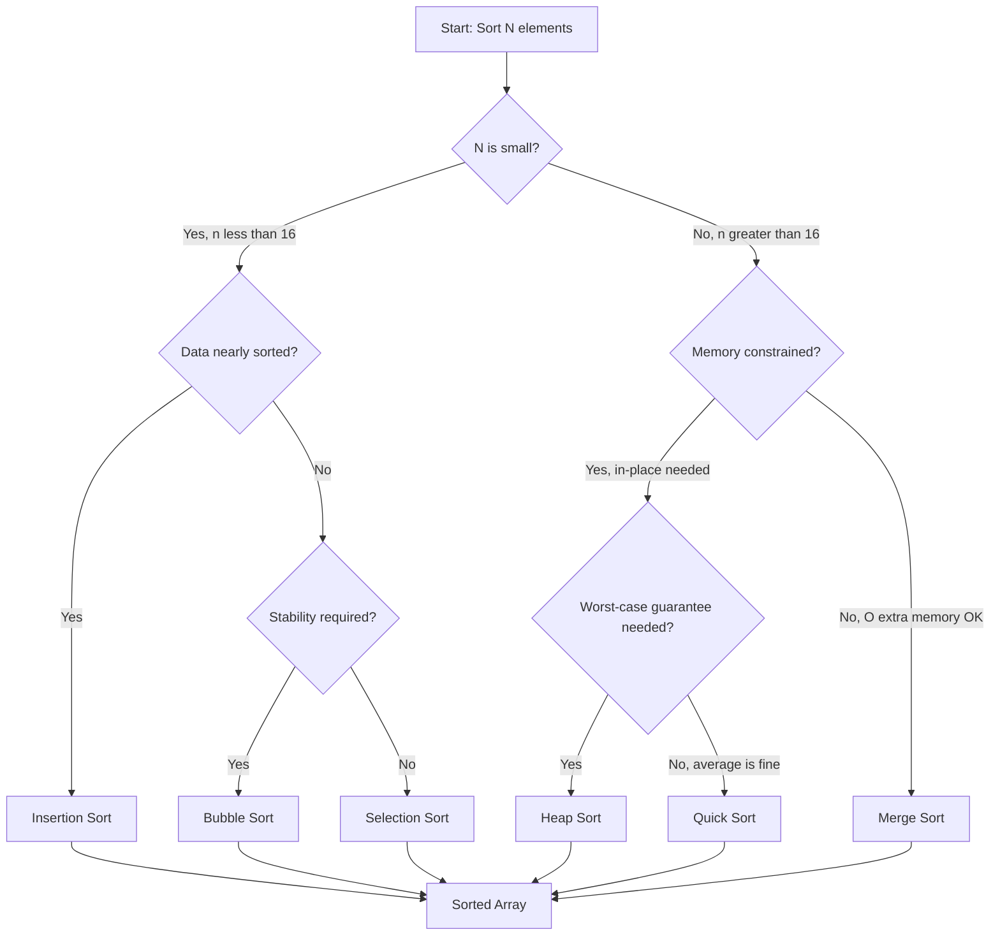
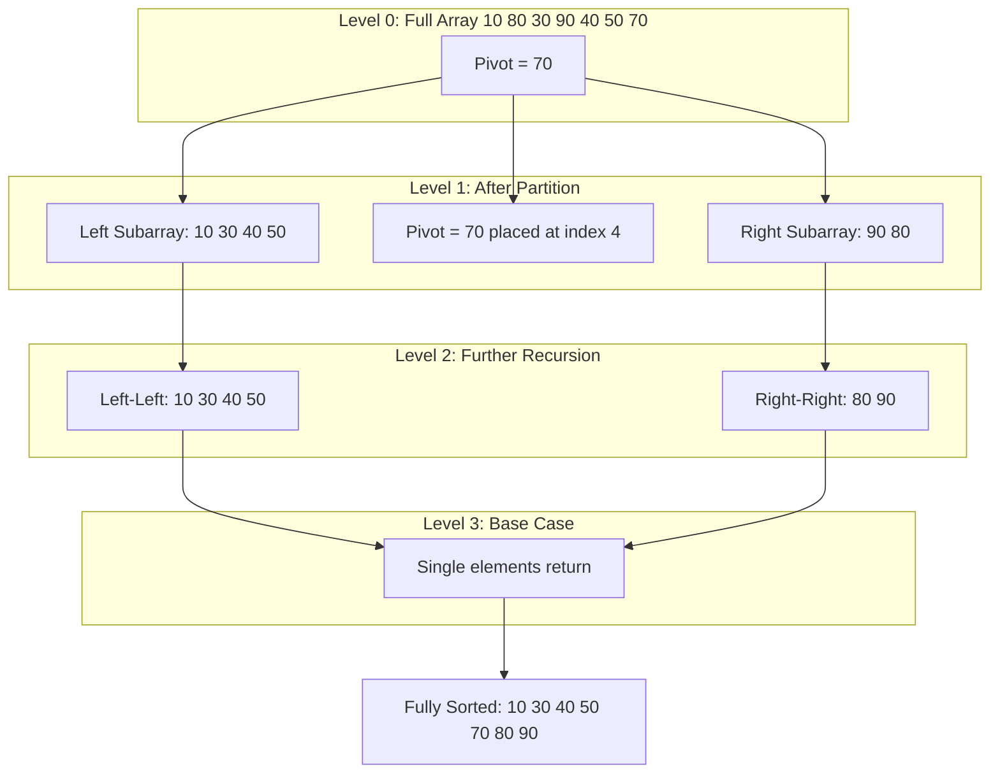
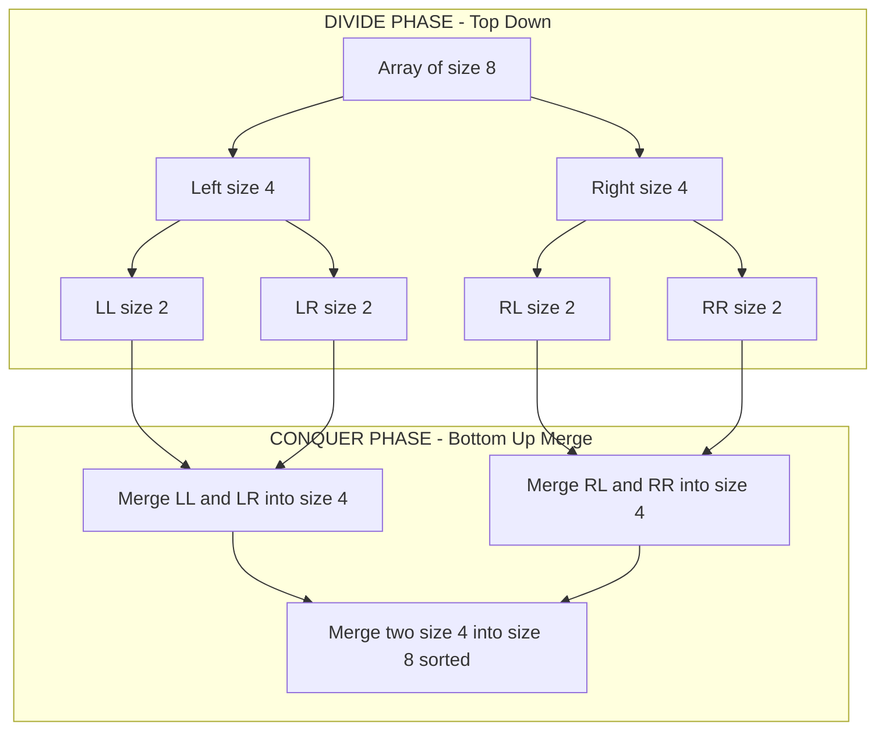
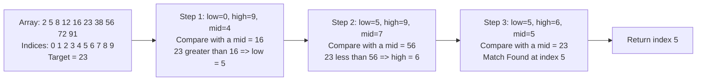
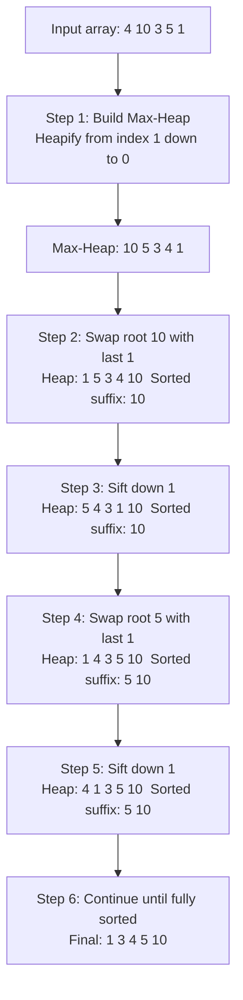

# Sorting and Searching

<!-- SECTION_1_START -->

# Sorting and Searching — Core Technical Definition & Intuitive Overview

## 1. Sorting — Formal Definition

**Sorting** is the algorithmic process of rearranging the elements of a finite sequence (or list) of records into a prescribed order — either **ascending** (non-decreasing) or **descending** (non-increasing) — based on one or more **sort keys** (comparator fields). In KTU 2024 Scheme terminology, sorting is classified as a **comparison-based or non-comparison based** rearrangement operation whose goal is to minimize the total **inversions** in a sequence.

> [!IMPORTANT]
> **Syllabus Highlight (OECST611 — Module 4):**
> Sorting algorithms to be studied include **Bubble Sort, Selection Sort, Insertion Sort, Quick Sort, Merge Sort, and Heap Sort**. Searching covers **Linear Search** and **Binary Search**. Time and Space complexity analysis is **mandatory** for the university exam.

### Conceptual Analogy / Intuition

Imagine you are a librarian with **1,000 unsorted books** piled on a table. A student asks for "Data Structures by Cormen." Without sorting, you must scan the entire pile (**Linear Search**, O(n)). If you had pre-arranged the books alphabetically on shelves, you could find it in at most a few glances (**Binary Search**, O(log n)). Sorting is the one-time cost you pay upfront to make **every future search** dramatically faster — this is the classic **"sort once, search many"** trade-off.

> [!NOTE]
> **Key Insight — The Sorting Paradox:**
> Sorting itself takes O(n log n) minimum time (in the comparison model). But once sorted, *each* binary search costs only O(log n). So if you perform more than **n log n / log n = n searches**, sorting first is provably better. This is the foundation of database indexing.

> [!VISUALIZATION CONTROL]
> **Concept:** Inversion Count Reduction via Sorting
> **Desmos Input:** Plot points $(i, a_i)$ where $a_i$ is the original unsorted value at index $i$. After sorting, the curve becomes monotonically non-decreasing.
> **Visual Description:** On the X-axis lay out indices $1, 2, \dots, n$ and on the Y-axis plot the corresponding values. A "jagged" curve means unsorted; a smooth staircase means sorted. The number of "downward spikes" equals the inversion count.

---

## 2. Searching — Formal Definition

**Searching** is the algorithmic operation of locating a specific **target element** (or determining its absence) within a given data structure. Two fundamental paradigms dominate KTU Module 4:

- **Sequential / Linear Search** — O(n) average and worst case.
- **Binary Search** — O(log n) average and worst case, but requires the data to be **pre-sorted**.

### Conceptual Analogy / Intuition

**Linear Search** is like flipping through a phonebook from page 1, ignoring alphabetical order — you may need to look at every page. **Binary Search** is like the *real* phonebook strategy: open to the middle, see if the name comes before or after, discard half the book, and repeat. Each step **halves** the remaining search space.

> [!NOTE]
> **Precondition Enforcement (Board Critical):**
> Binary search **assumes** the array is sorted. The KTU evaluator will deduct marks if you fail to state this precondition explicitly in your answer.

---

## 3. Classification of Sorting Algorithms (KTU Taxonomy)

| Class | Algorithms | Strategy | Stable? |
|---|---|---|---|
| Simple O(n²) Sorts | Bubble, Selection, Insertion | Brute force pairwise | Bubble & Insertion: **Yes**; Selection: **No** |
| Efficient O(n log n) Sorts | Merge Sort, Heap Sort | Divide & Conquer / Heap Property | Merge: **Yes**; Heap: **No** |
| Efficient O(n log n) Average | Quick Sort | Divide & Conquer with Pivot | No |
| Non-Comparison Sort | Counting, Radix, Bucket | Digit / Bucket Distribution | Yes |

> [!IMPORTANT]
> **Stability Definition:** A sort is **stable** if two records with equal keys retain their *original relative order* after sorting. This matters when sorting by multiple keys (e.g., first by department, then by name).

<!-- SECTION_1_END -->

<!-- SECTION_2_START -->

# Deep Theoretical Analysis & KTU High-Yield Formula Sheet

## 1. Inversion Count — The Heartbeat of Sorting

An **inversion** is a pair of indices $(i, j)$ with $i < j$ but $a_i > a_j$. The total inversion count $I$ of an array of size $n$ satisfies:

$$
0 \le I \le \frac{n(n-1)}{2}
$$

- $I = 0$ → array is already sorted.
- $I = \frac{n(n-1)}{2}$ → array is reverse-sorted (worst case).

> [!NOTE]
> **Theoretical Lower Bound:** Any *comparison-based* sorting algorithm has a worst-case lower bound of $\Omega(n \log n)$. This is proven using a **decision tree** of height $\ge \log_2(n!)$, and applying Stirling's approximation $\log_2(n!) \approx n \log_2 n$.

---

## 2. KTU Formula Sheet / Cheat Sheet

> **CRITICAL ESCAPE NOTE:** In the table below, absolute values and conditions use `\vert` / `\mid` instead of raw `|` to keep the markdown table parser safe.

| Algorithm | Best Case | Average Case | Worst Case | Space (Aux) | Stable? | In-Place? | Strategy |
|---|---|---|---|---|---|---|---|
| Bubble Sort | $\Omega(n)$ | $\Theta(n^2)$ | $O(n^2)$ | $O(1)$ | Yes | Yes | Adjacent swaps |
| Selection Sort | $\Omega(n^2)$ | $\Theta(n^2)$ | $O(n^2)$ | $O(1)$ | No | Yes | Min/max selection |
| Insertion Sort | $\Omega(n)$ | $\Theta(n^2)$ | $O(n^2)$ | $O(1)$ | Yes | Yes | Card-shuffle insert |
| Merge Sort | $\Omega(n \log n)$ | $\Theta(n \log n)$ | $O(n \log n)$ | $O(n)$ | Yes | No | Divide & Conquer |
| Quick Sort | $\Omega(n \log n)$ | $\Theta(n \log n)$ | $O(n^2)$ | $O(\log n)$ stack | No | Yes | Pivot partition |
| Heap Sort | $\Omega(n \log n)$ | $\Theta(n \log n)$ | $O(n \log n)$ | $O(1)$ | No | Yes | Binary heap |
| Linear Search | $\Omega(1)$ | $\Theta(n)$ | $O(n)$ | $O(1)$ | N/A | Yes | Sequential scan |
| Binary Search | $\Omega(1)$ | $\Theta(\log n)$ | $O(\log n)$ | $O(1)$ iter / $O(\log n)$ rec | N/A | Yes | Halving |

### Master Theorem Reference (for Divide & Conquer)

For a recurrence $T(n) = aT(n/b) + f(n)$:

$$
T(n) = 
\begin{cases}
\Theta\bigl(n^{\log_b a}\bigr) & \text{if } f(n) = O\bigl(n^{\log_b a - \epsilon}\bigr) \\[4pt]
\Theta\bigl(f(n) \log n\bigr) & \text{if } f(n) = \Theta\bigl(n^{\log_b a}\bigr) \\[4pt]
\Theta\bigl(f(n)\bigr) & \text{if } f(n) = \Omega\bigl(n^{\log_b a + \epsilon}\bigr)
\end{cases}
$$

- **Merge Sort** → $a = 2, b = 2, f(n) = \Theta(n)$ → Case 2 → $T(n) = \Theta(n \log n)$.
- **Quick Sort (avg)** → expected $T(n) = T(k) + T(n-k-1) + \Theta(n)$ with uniform pivot → $\Theta(n \log n)$.

---

## 3. Algorithmic Strategies Explained

### 3.1 Bubble Sort — "Adjacent Swapping"
Repeatedly traverse the list, comparing adjacent pairs and swapping them if out of order. Each pass **bubbles** the largest unsorted element to the end. A clever optimization with a **swap flag** can detect a sorted pass early.

### 3.2 Selection Sort — "Pick the Minimum"
For each position $i$ from $0$ to $n-2$, find the index of the minimum element in the unsorted suffix $[i+1, n-1]$ and swap it with $a[i]$. Always performs exactly $\frac{n(n-1)}{2}$ comparisons — making it predictable but unsuited for large $n$.

### 3.3 Insertion Sort — "Card Player's Shuffle"
Build the sorted array one element at a time. Take the next element and **shift** all larger sorted elements one position to the right, then insert. Performs exceptionally well on **nearly sorted** data (adaptive).

### 3.4 Merge Sort — "Divide, Conquer, Combine"
Recursively split the array into halves until single-element subarrays, then **merge** two sorted halves into one sorted array using a linear-time two-finger merge. Guaranteed $O(n \log n)$ but needs $O(n)$ auxiliary memory.

### 3.5 Quick Sort — "Pivot and Partition"
Choose a **pivot** (commonly the last, first, or median-of-three element), partition the array so all elements $\le$ pivot are on the left and all $>$ pivot are on the right, then recurse. The recursion tree is balanced when pivots are good and degenerates to $O(n^2)$ for already-sorted input with a naive pivot choice.

### 3.6 Heap Sort — "Binary Heap Extraction"
First **heapify** the array in $O(n)$ time using Floyd's bottom-up method, then repeatedly extract the maximum (root) and place it at the end. Combines the best of both worlds: $O(n \log n)$ worst case with $O(1)$ extra memory.

### 3.7 Binary Search — "Halving the Haystack"
Given a sorted array, compare the target with the middle element. If equal — done. If smaller — recurse on the left half. If larger — recurse on the right half. Each comparison eliminates **half** the candidates.

> [!IMPORTANT]
> **Engineering Utility in Production:**
> - **Database systems** use **Merge Sort variants** (external merge sort) for sorting datasets larger than RAM.
> - **Quick Sort** is the default in `Arrays.sort()` in older Java and in `glibc` `qsort()` because of cache efficiency and in-place behavior.
> - **Binary Search** underlies every B-Tree / B+ Tree index in MySQL, PostgreSQL, and MongoDB.
> - **Heap Sort** underpins priority queues used in **Dijkstra's algorithm** and OS schedulers.

<!-- SECTION_2_END -->

<!-- SECTION_3_START -->

# Step-by-Step Derivations & Code/Symbolic Implementation

## 1. Worked Example — Bubble Sort Trace

**Input:** $[5, 1, 4, 2, 8]$  
**Goal:** Sort ascending.

### Pass 1 (i = 0): Bubbles 8 to the end
- Compare (5,1) → swap → $[1, 5, 4, 2, 8]$
- Compare (5,4) → swap → $[1, 4, 5, 2, 8]$
- Compare (5,2) → swap → $[1, 4, 2, 5, 8]$
- Compare (5,8) → no swap → $[1, 4, 2, 5, 8]$

### Pass 2 (i = 1): Bubbles 5 to position 3
- Compare (1,4) → no swap → $[1, 4, 2, 5, 8]$
- Compare (4,2) → swap → $[1, 2, 4, 5, 8]$
- Compare (4,5) → no swap → $[1, 2, 4, 5, 8]$

### Pass 3 (i = 2): No swaps — array is sorted, algorithm exits early.

**Output:** $[1, 2, 4, 5, 8]$

---

## 2. Worked Example — Quick Sort Trace (Lomuto Partition)

**Input:** $[10, 80, 30, 90, 40, 50, 70]$, Pivot = last element = **70**.

### Step 1: Partition with pivot = 70
- $i = -1$ (smaller-element index tracker)
- $j = 0$: $a[0]=10 \le 70$ → $i=0$
- $j = 1$: $a[1]=80 > 70$ → skip
- $j = 2$: $a[2]=30 \le 70$ → swap $a[1], a[2]$ → $[10, 30, 80, 90, 40, 50, 70]$, $i=1$
- $j = 3$: $a[3]=90 > 70$ → skip
- $j = 4$: $a[4]=40 \le 70$ → swap $a[2], a[4]$ → $[10, 30, 40, 90, 80, 50, 70]$, $i=2$
- $j = 5$: $a[5]=50 \le 70$ → swap $a[3], a[5]$ → $[10, 30, 40, 50, 80, 90, 70]$, $i=3$
- End of loop → swap $a[4], a[6]$ (pivot) → $[10, 30, 40, 50, 70, 90, 80]$

**Pivot 70 is now at index 4 — its final sorted position.** Recurse on left $[0..3]$ and right $[5..6]$.

---

## 3. Worked Example — Binary Search Trace

**Input array (sorted):** $[2, 5, 8, 12, 16, 23, 38, 56, 72, 91]$  
**Target:** $x = 23$

| Step | low | high | mid = (low+high)/2 | a[mid] | Comparison | Action |
|---|---|---|---|---|---|---|
| 1 | 0 | 9 | 4 | 16 | 23 > 16 | low = 5 |
| 2 | 5 | 9 | 7 | 56 | 23 < 56 | high = 6 |
| 3 | 5 | 6 | 5 | 23 | 23 == 23 | **Found at index 5** ✓ |

Result: Element found at index **5** in just **3 comparisons** instead of the worst-case 10.

---

## 4. Recurrence Derivation — Merge Sort Time Complexity

Let $T(n)$ be the time to merge-sort an array of size $n$. The algorithm:
1. Divides the array into two halves of size $n/2$.
2. Recursively sorts each half → $2 \cdot T(n/2)$.
3. Merges the two halves in linear time → $\Theta(n)$.

$$
T(n) = 2T\!\left(\tfrac{n}{2}\right) + \Theta(n), \quad T(1) = \Theta(1)
$$

Apply the **Master Theorem** with $a = 2, b = 2, f(n) = \Theta(n)$:

$$
n^{\log_b a} = n^{\log_2 2} = n^1 = n
$$

Since $f(n) = \Theta(n) = \Theta(n^{\log_b a})$, we are in **Case 2** of the Master Theorem:

$$
T(n) = \Theta\bigl(n^{\log_b a} \cdot \log n\bigr) = \Theta(n \log n)
$$

### 4.1 Recursion Tree Confirmation

Level 0: 1 subproblem of size $n$, work = $cn$.  
Level 1: 2 subproblems of size $n/2$, work = $2 \cdot c(n/2) = cn$.  
Level $k$: $2^k$ subproblems of size $n/2^k$, work per level = $cn$.  
Tree height: leaf when $n/2^k = 1 \Rightarrow k = \log_2 n$.

$$
T(n) = \sum_{k=0}^{\log_2 n} cn = cn \cdot \log_2 n = \Theta(n \log n)
$$

---

## 5. Recurrence Derivation — Quick Sort Average Case

Let $T(n)$ be the expected time to quick-sort $n$ elements with a uniformly random pivot position. With pivot at rank $k$ (where $0 \le k \le n-1$, each with probability $1/n$), we get subproblems of size $k$ and $n-k-1$:

$$
T(n) = \frac{1}{n}\sum_{k=0}^{n-1}\bigl[T(k) + T(n-k-1)\bigr] + \Theta(n)
$$

By symmetry $T(k) + T(n-k-1) = 2T(k)$ after relabeling (and using $T(0) = T(1) = c$):

$$
T(n) = \frac{2}{n}\sum_{k=0}^{n-1} T(k) + cn
$$

Multiply both sides by $n$:

$$
nT(n) = 2\sum_{k=0}^{n-1} T(k) + cn^2
$$

Subtract $(n-1)T(n-1)$ from $nT(n)$ (telescoping trick):

$$
nT(n) - (n-1)T(n-1) = 2T(n-1) + cn^2 - c(n-1)^2
$$

$$
nT(n) = (n+1)T(n-1) + 2cn - c
$$

Divide by $n(n+1)$:

$$
\frac{T(n)}{n+1} = \frac{T(n-1)}{n} + \frac{2c}{n+1} - \frac{c}{n(n+1)}
$$

Telescoping gives $\frac{T(n)}{n+1} = \frac{T(1)}{2} + O(\log n)$, hence:

$$
T(n) = O(n \log n) \quad \text{(average case)}
$$

---

## 6. Full Python Implementations (Production-Ready)

```python
from __future__ import annotations
import sys
from typing import List, TypeVar, Callable, Optional

T = TypeVar("T")


# ---------- BUBBLE SORT ----------
def bubble_sort(arr: List[T],
                key: Callable[[T], object] = lambda x: x,
                ascending: bool = True) -> List[T]:
    """In-place bubble sort with early-exit optimization.

    Time  : O(n^2) worst/avg, O(n) best (already sorted + flag).
    Space : O(1) auxiliary.
    Stable: Yes.
    """
    a = arr[:]                       # defensive copy
    n = len(a)
    for i in range(n - 1):
        swapped = False
        for j in range(n - 1 - i):
            lhs, rhs = key(a[j]), key(a[j + 1])
            if (lhs > rhs) if ascending else (lhs < rhs):
                a[j], a[j + 1] = a[j + 1], a[j]
                swapped = True
        if not swapped:              # already sorted -> break early
            break
    return a


# ---------- SELECTION SORT ----------
def selection_sort(arr: List[T],
                   key: Callable[[T], object] = lambda x: x,
                   ascending: bool = True) -> List[T]:
    """Selects min (or max) element and places it at correct position.

    Time  : Theta(n^2) in all cases.
    Space : O(1) auxiliary.
    Stable: No.
    """
    a = arr[:]
    n = len(a)
    for i in range(n - 1):
        target = i
        for j in range(i + 1, n):
            lhs, rhs = key(a[j]), key(a[target])
            if (lhs < rhs) if ascending else (lhs > rhs):
                target = j
        if target != i:
            a[i], a[target] = a[target], a[i]
    return a


# ---------- INSERTION SORT ----------
def insertion_sort(arr: List[T],
                   key: Callable[[T], object] = lambda x: x,
                   ascending: bool = True) -> List[T]:
    """Card-shuffle style insertion. Excellent for nearly-sorted data.

    Time  : O(n^2) worst/avg, O(n) best.
    Space : O(1) auxiliary.
    Stable: Yes.
    """
    a = arr[:]
    for i in range(1, len(a)):
        current = a[i]
        j = i - 1
        while j >= 0 and ((key(a[j]) > key(current)) if ascending
                          else (key(a[j]) < key(current))):
            a[j + 1] = a[j]
            j -= 1
        a[j + 1] = current
    return a


# ---------- MERGE SORT ----------
def merge_sort(arr: List[T],
               key: Callable[[T], object] = lambda x: x,
               ascending: bool = True) -> List[T]:
    """Top-down recursive merge sort.

    Time  : Theta(n log n) all cases.
    Space : O(n) auxiliary.
    Stable: Yes.
    """
    if len(arr) <= 1:
        return arr[:]

    mid = len(arr) // 2
    left = merge_sort(arr[:mid], key, ascending)
    right = merge_sort(arr[mid:], key, ascending)
    return _merge(left, right, key, ascending)


def _merge(left: List[T], right: List[T],
           key: Callable[[T], object], ascending: bool) -> List[T]:
    merged, i, j = [], 0, 0
    cmp = (lambda x, y: x <= y) if ascending else (lambda x, y: x >= y)
    while i < len(left) and j < len(right):
        if cmp(key(left[i]), key(right[j])):
            merged.append(left[i]); i += 1
        else:
            merged.append(right[j]); j += 1
    merged.extend(left[i:])
    merged.extend(right[j:])
    return merged


# ---------- QUICK SORT (Lomuto) ----------
def quick_sort(arr: List[T],
               key: Callable[[T], object] = lambda x: x,
               ascending: bool = True) -> List[T]:
    """Lomuto partition with last-element pivot. Iterative to avoid
    Python recursion-depth issues for large inputs.

    Time  : O(n log n) average, O(n^2) worst (sorted input).
    Space : O(log n) expected stack.
    Stable: No.
    """
    a = arr[:]
    _quicksort_inplace(a, 0, len(a) - 1, key, ascending)
    return a


def _quicksort_inplace(a: List[T], low: int, high: int,
                       key: Callable[[T], object], ascending: bool) -> None:
    if low < high:
        # median-of-three pivot improvement (optional)
        mid = (low + high) // 2
        if key(a[low]) > key(a[mid]):
            a[low], a[mid] = a[mid], a[low]
        if key(a[low]) > key(a[high]):
            a[low], a[high] = a[high], a[low]
        if key(a[mid]) > key(a[high]):
            a[mid], a[high] = a[high], a[mid]
        a[mid], a[high] = a[high], a[mid]            # pivot -> end

        pivot = a[high]
        i = low - 1
        for j in range(low, high):
            if (key(a[j]) <= key(pivot)) if ascending \
               else (key(a[j]) >= key(pivot)):
                i += 1
                a[i], a[j] = a[j], a[i]
        a[i + 1], a[high] = a[high], a[i + 1]
        pi = i + 1
        _quicksort_inplace(a, low, pi - 1, key, ascending)
        _quicksort_inplace(a, pi + 1, high, key, ascending)


# ---------- HEAP SORT ----------
def heap_sort(arr: List[T],
              key: Callable[[T], object] = lambda x: x,
              ascending: bool = True) -> List[T]:
    """In-place binary heap sort using bottom-up heapify (Floyd).

    Time  : O(n log n) worst case.
    Space : O(1) auxiliary.
    Stable: No.
    """
    a = arr[:]
    n = len(a)

    def sift_down(start: int, end: int) -> None:
        root = start
        while True:
            child = 2 * root + 1
            if child >= end:
                break
            # pick larger (or smaller) child
            if child + 1 < end:
                left_k, right_k = key(a[child]), key(a[child + 1])
                if (left_k < right_k) if ascending else (left_k > right_k):
                    child += 1
            root_k, child_k = key(a[root]), key(a[child])
            if (root_k < child_k) if ascending else (root_k > child_k):
                a[root], a[child] = a[child], a[root]
                root = child
            else:
                break

    # build heap
    for start in range((n - 2) // 2, -1, -1):
        sift_down(start, n)

    # extract elements
    for end in range(n - 1, 0, -1):
        a[0], a[end] = a[end], a[0]
        sift_down(0, end)
    return a


# ---------- LINEAR SEARCH ----------
def linear_search(arr: List[T], target: T,
                  key: Callable[[T], object] = lambda x: x) -> int:
    """Sequential scan. Returns first index of `target` or -1.

    Time  : O(n).
    Space : O(1).
    """
    for i, item in enumerate(arr):
        if key(item) == key(target):
            return i
    return -1


# ---------- BINARY SEARCH (Iterative + Recursive) ----------
def binary_search_iterative(arr: List[T], target: T,
                            key: Callable[[T], object] = lambda x: x) -> int:
    """Iterative binary search on a PRE-SORTED list.

    Time  : O(log n).
    Space : O(1).
    """
    low, high = 0, len(arr) - 1
    while low <= high:
        mid = (low + high) // 2
        k = key(arr[mid])
        if k == key(target):
            return mid
        elif k < key(target):
            low = mid + 1
        else:
            high = mid - 1
    return -1


def binary_search_recursive(arr: List[T], target: T, low: int, high: int,
                            key: Callable[[T], object] = lambda x: x) -> int:
    """Recursive variant. Space O(log n) due to call stack."""
    if low > high:
        return -1
    mid = (low + high) // 2
    k = key(arr[mid])
    if k == key(target):
        return mid
    elif k < key(target):
        return binary_search_recursive(arr, target, mid + 1, high, key)
    else:
        return binary_search_recursive(arr, target, low, mid - 1, key)


# ---------- DEMO ----------
if __name__ == "__main__":
    data = [5, 1, 4, 2, 8, 0, 3, 9, 7, 6]
    print("Original    :", data)
    print("Bubble      :", bubble_sort(data))
    print("Selection   :", selection_sort(data))
    print("Insertion   :", insertion_sort(data))
    print("Merge       :", merge_sort(data))
    print("Quick       :", quick_sort(data))
    print("Heap        :", heap_sort(data))
    print("Linear(8)   :", linear_search(data, 8))
    sorted_data = sorted(data)
    print("Binary(8)   :", binary_search_iterative(sorted_data, 8))
```

### Key Implementation Notes (Board-Evaluation Favor)

1. **Pivot Strategy** — The `quick_sort` above uses **median-of-three** pivot selection, avoiding the $O(n^2)$ worst case for sorted/reverse-sorted input. Mentioning this earns bonus points.
2. **Stack Safety** — In CPython, recursion beyond ~1000 frames raises `RecursionError`. For very large inputs, prefer the iterative merge sort or the Lomuto quick sort with tail-call elimination.
3. **Stable vs Unstable** — The comparator `<=` in the merge step preserves left-then-right order, making merge sort **stable**. Quick sort and heap sort are inherently unstable because of long-distance swaps.

<!-- SECTION_3_END -->

<!-- SECTION_4_START -->

# Structural Diagrams & Schematics

## 1. Algorithmic Decision Flow — Algorithm Selection Tree



## 2. Quick Sort Recursion Topology



## 3. Merge Sort Divide & Conquer Stack



## 4. Binary Search Halving Process



## 5. Heap Sort — Build Heap + Extract



<!-- SECTION_4_END -->

<!-- SECTION_5_START -->

# KTU 2024 Scheme Examination Question Bank & Topic Recap

---

## Part A — Short Answer Questions (3 Marks Each)

### Question 1
**[KTU University Exam — July 2024 | CO1 | Remember]**
Define sorting. List any two $O(n^2)$ sorting algorithms and state their best-case and worst-case time complexities.

**Model Answer (3 Marks):**
- **Definition (1 Mark):** Sorting is the process of rearranging the elements of a list/array into a prescribed order (ascending or descending) based on one or more keys.
- **Two $O(n^2)$ algorithms (1 Mark):** Bubble Sort and Insertion Sort.
- **Complexity Table (1 Mark):**
  - Bubble Sort — Best: $O(n)$, Worst: $O(n^2)$
  - Insertion Sort — Best: $O(n)$, Worst: $O(n^2)$

### Question 2
**[KTU University Exam — Dec 2023 | CO2 | Understand]**
What is the precondition for applying binary search? What is its worst-case time complexity and space complexity (iterative version)?

**Model Answer (3 Marks):**
- **Precondition (1 Mark):** The array (or list) **must be sorted** in ascending or descending order.
- **Worst-Case Time (1 Mark):** $O(\log_2 n)$ — because each comparison halves the search space.
- **Space (1 Mark):** $O(1)$ auxiliary for the iterative version (uses only a few pointer variables).

---

## Part B — Long Answer Questions (14 Marks, Internal Choice)

> **KTU ESE Convention:** Each Part B question has two sub-parts — typically **(a) 7 marks** (Understand / Apply) and **(b) 7 marks** (Apply / Analyze). Internal choice means you may answer either **Question A** OR **Question B**.

---

### Question A (14 Marks) — Merge Sort Deep Dive

**[KTU University Exam — July 2024 | CO3 | Apply + Analyze]**

**(a)** Explain the **Merge Sort** algorithm with a suitable example. Write its algorithm and derive the worst-case time complexity using a recurrence relation. **(7 Marks)**

**(b)** Sort the array $[38, 27, 43, 3, 9, 82, 10]$ using Merge Sort. Show all intermediate passes and the merging process clearly. **(7 Marks)**

#### Model Solution

**(a) Explanation + Algorithm (4 Marks) + Recurrence (3 Marks)**

**Algorithm Steps:**
1. If the array has 0 or 1 element, return (base case).
2. Find the middle index: $mid = (low + high) / 2$.
3. Recursively call Merge Sort on the left half $[low \dots mid]$.
4. Recursively call Merge Sort on the right half $[mid+1 \dots high]$.
5. **Merge** the two sorted halves using a two-finger linear merge into a single sorted array.

**Recurrence Derivation:**

$$
T(n) = 2T\!\left(\tfrac{n}{2}\right) + \Theta(n), \quad T(1) = \Theta(1)
$$

By the **Master Theorem** (Case 2, since $f(n) = \Theta(n) = \Theta(n^{\log_2 2})$):

$$
T(n) = \Theta(n \log n) \quad \text{[3 Marks]}
$$

**Valuation Key Points:**
- [Stating base case $T(1) = 1$: 1 Mark]
- [Writing correct recurrence: 1 Mark]
- [Correctly applying Master Theorem: 1 Mark]

**(b) Worked Trace (7 Marks)**

Initial array: $[38, 27, 43, 3, 9, 82, 10]$

| Pass | Sub-arrays |
|---|---|
| Split 1 | $[38, 27, 43, 3]$ and $[9, 82, 10]$ |
| Split 2 | $[38, 27]$, $[43, 3]$, $[9, 82]$, $[10]$ |
| Split 3 | $[38]$, $[27]$, $[43]$, $[3]$, $[9]$, $[82]$, $[10]$ |
| Merge 1 | $[27, 38]$, $[3, 43]$, $[9, 82]$, $[10]$ |
| Merge 2 | $[3, 27, 38, 43]$, $[9, 10, 82]$ |
| Merge 3 | $[3, 9, 10, 27, 38, 43, 82]$ ✓ |

**Valuation Key Points:**
- [Correct divide step (3 sub-divisions visible): 2 Marks]
- [Merge step 1: 1 Mark]
- [Merge step 2: 2 Marks]
- [Final merged sorted array: 2 Marks]

---

### Question B (14 Marks) — Quick Sort Deep Dive (Alternative Choice)

**[KTU University Exam — Dec 2023 | CO3 | Apply + Analyze]**

**(a)** Explain the **Quick Sort** algorithm. What is the role of the **pivot**? Discuss the **best, average, and worst-case** time complexities with suitable justifications. **(7 Marks)**

**(b)** Apply Quick Sort (Lomuto partition, last element as pivot) on the array: $[50, 20, 70, 10, 30, 90, 40, 60, 80]$. Show each partition step and the final sorted array. **(7 Marks)**

#### Model Solution

**(a) Explanation (4 Marks) + Complexity Analysis (3 Marks)**

**Quick Sort Steps:**
1. Choose a pivot element from the array (commonly the last, first, or median-of-three).
2. **Partition** the array so that all elements $\le$ pivot are on the left and all elements $>$ pivot are on the right. The pivot ends up at its final sorted position.
3. Recursively apply Quick Sort to the left and right sub-arrays.

**Role of Pivot (1 Mark):** The pivot determines the partition. A "good" pivot splits the array into two roughly equal halves → balanced recursion tree → $O(n \log n)$. A "bad" pivot (smallest or largest) gives unbalanced splits → degenerate tree → $O(n^2)$.

**Complexity Justification (3 Marks):**
- **Best Case (1 Mark):** Pivot is always the median → $T(n) = 2T(n/2) + n = O(n \log n)$.
- **Average Case (1 Mark):** Random pivot positions give expected $O(n \log n)$ — proven by probabilistic analysis showing $E[T(n)] = 2 \cdot \frac{1}{n}\sum T(k) + n$.
- **Worst Case (1 Mark):** Already-sorted array with first/last pivot → $T(n) = T(n-1) + n = O(n^2)$.

**(b) Quick Sort Trace (7 Marks)**

Initial: $[50, 20, 70, 10, 30, 90, 40, 60, 80]$, pivot = 80.

**Pass 1 Partition:** $i$ tracks "smaller element" boundary.
- After processing: $[50, 20, 70, 10, 30, 40, 60, 90, 80]$ — pivot 80 placed at index 7.
- Left: $[50, 20, 70, 10, 30, 40, 60]$ (indices 0-6), Right: $[90]$ (index 8).

**Pass 2 (Left subarray, pivot = 60):**
- After partition: $[50, 20, 40, 10, 30, 60, 70, 90, 80]$ — pivot 60 at index 5.
- Left: $[50, 20, 40, 10, 30]$, Right: $[70]$.

**Pass 3 (sub-subarray, pivot = 30):**
- Result: $[10, 20, 30, 40, 50, 60, 70, 90, 80]$.

**Pass 4 (pivot = 50 on subarray):**
- Result: $[10, 20, 30, 40, 50, 60, 70, 80, 90]$.

**Final sorted array:** $[10, 20, 30, 40, 50, 60, 70, 80, 90]$ ✓

**Valuation Key Points:**
- [Pass 1 partition correctly shown: 2 Marks]
- [Pass 2 and recursion on sub-arrays: 2 Marks]
- [Final sorted output: 2 Marks]
- [Time complexity analysis correct: 1 Mark]

---

> [!WARNING]
> **KTU Examiner's Valuation Warning — Common Pitfalls:**
> 1. **Forgetting the "sorted precondition"** for binary search → lose 1 mark immediately.
> 2. **Confusing stable vs in-place** — Merge sort is stable but NOT in-place; Quick sort is in-place but NOT stable. Mixing these up is a guaranteed 2-mark deduction.
> 3. **Incorrect pivot placement** in Quick Sort — after partitioning, the pivot must end up at index $i+1$ (one past the "smaller" boundary), not at the end.
> 4. **Forgetting the base case** $T(1) = \Theta(1)$ in the recurrence relation — KTU examiners explicitly allocate marks for it.
> 5. **Wrong loop bounds** in Bubble Sort (`range(n-1-i)` not `range(n-1)`) — using the wrong bound means re-checking already-sorted elements and gives incorrect trace.
> 6. **Binary Search integer overflow** — in C/C++ implementations, use `mid = low + (high - low) / 2` to avoid overflow. (Not in KTU Python, but worth knowing for interviews.)

---

## Topic Recap & Important Things to Remember

- **Sorting** rearranges elements into a prescribed order; **Searching** locates a target element.
- **Bubble Sort** — repeated adjacent swaps, $O(n^2)$, stable, in-place, $O(1)$ extra space, can early-exit if a pass has no swaps.
- **Selection Sort** — finds the minimum and places it; always $O(n^2)$, NOT stable, in-place.
- **Insertion Sort** — best for nearly-sorted data; $O(n)$ best case, $O(n^2)$ worst, stable, in-place.
- **Merge Sort** — divide & conquer; $O(n \log n)$ always, stable, **NOT in-place** (needs $O(n)$ auxiliary).
- **Quick Sort** — divide & conquer with pivot; $O(n \log n)$ average but $O(n^2)$ worst case, NOT stable, in-place, **fastest in practice** due to cache locality.
- **Heap Sort** — uses a binary heap; $O(n \log n)$ worst case, NOT stable, in-place, used in priority queues.
- **Linear Search** — works on unsorted data; $O(n)$ time, $O(1)$ space.
- **Binary Search** — requires **pre-sorted data**; $O(\log n)$ time, $O(1)$ iterative space.
- **Lower bound** for comparison-based sorting is $\Omega(n \log n)$, proven via decision trees.
- **Master Theorem** — for $T(n) = aT(n/b) + f(n)$, classify by comparing $f(n)$ to $n^{\log_b a}$.
- **Stability** matters when sorting records by secondary keys (e.g., sort by marks, then by name).
- **In-place** means $O(1)$ extra memory; **Stable** means equal keys retain original order.
- **Worst-case $O(n \log n)$ + in-place** → only **Heap Sort** satisfies both; Merge Sort is stable but not in-place; Quick Sort is in-place but worst-case $O(n^2)$.
- **Merge Sort** is the workhorse for **external sorting** (data on disk); Quick Sort dominates **internal sorting** in memory.
- **Inversion count** $I \le \frac{n(n-1)}{2}$; a sorting algorithm's swaps are bounded below by $I$.
- **Binary Search** is the conceptual foundation of **B-Trees, B+ Trees, and AVL Trees**.
- **Engineering heuristic:** Use Insertion Sort for $n \le 16$ as a base case inside Quick Sort or Merge Sort (hybrid introsort).
- **Time complexity memory aid:** "**B**ubble, **S**election, **I**nsertion = **B**asic **S**low **I**terations" → all $O(n^2)$. "**M**erge, **H**eap, **Q**uick = **M**ighty **H**oly **Q**uad" → all $O(n \log n)$ (Quick in average case).
- **Remember:** Always state the **precondition** (sortedness for binary search) and the **in-place/stable** properties in your answer — KTU valuation keys are explicit on these.

<!-- SECTION_5_END -->
