# Sorting Techniques :- Selection Sort

<!-- SECTION_1_START -->
# Selection Sort — Core Technical Definition & Intuitive Overview

## Formal Definition (KTU 2024 Syllabus Terminology)

> [!IMPORTANT]
> **Selection Sort** is a comparison-based, **in-place**, **non-stable** internal sorting algorithm that divides the input list into two logical partitions — a **sorted sub-array** built up from left to right at the front of the list, and an **unsorted sub-array** occupying the remainder. In every pass $i$ (where $i$ ranges from $0$ to $n-2$), the algorithm **searches for the minimum element** in the unsorted region $A[i \ldots n-1]$ and **swaps** it into position $i$, thereby extending the sorted region by exactly one element.

It belongs to the family of **Brute Force** sorting techniques in the KTU Data Structures syllabus, as it follows a straightforward, non-recursive, deterministic approach without any divide-and-conquer or incremental insertion logic.

---

## Conceptual Analogy / Intuition

Imagine a music teacher arranging **5 students in a line by height** in front of a stage.

1. The teacher scans the entire line from left to right, locates the **shortest student**, and pulls that student to **position 1** (front of the line).
2. Now positions $1$ is fixed (sorted). The teacher repeats the scan — but this time, only from the **second student onwards**, finds the shortest among the remaining, and places them at **position 2**.
3. This continues until only one student remains at the end, who is automatically the tallest.

> [!NOTE]
> **Key Insight:** The teacher never re-touches the already-sorted portion. Each pass performs exactly **one swap** — the cheapest swap cost of any comparison-based sort.

### Visual Intuition (Card Game Analogy)
Consider holding a hand of playing cards unsorted. With **Selection Sort**, you keep picking the **lowest card visible** in your hand and placing it **face-up on the table in order**. Your hand shrinks; the sorted row grows. This is the opposite philosophy of **Insertion Sort**, which takes the next incoming card and slides it into its correct place within the already sorted row.

---

## Algorithmic Identity Card

| Property | Value |
|---|---|
| **Category** | Comparison-Based, Internal, In-Place |
| **Strategy** | Selection (Find Minimum + Swap) |
| **Best Case Time** | $O(n^2)$ |
| **Average Case Time** | $O(n^2)$ |
| **Worst Case Time** | $O(n^2)$ |
| **Auxiliary Space** | $O(1)$ |
| **Stable?** | **No** (Standard implementation) |
| **Number of Swaps** | $n - 1$ (minimum possible) |
| **Adaptive?** | No |

> [!VISUALIZATION CONTROL]
> **Concept:** Selection Sort Pass-wise minimum extraction on a 1-D axis
> **GeoGebra / Desmos Input Equations (for n=5 elements):**
> * Initial data points: $(1,29), (2,10), (3,14), (4,37), (5,13)$
> * Pass 1 finds min at $x=2$, swaps with $x=1$ → new plot: $(1,10), (2,29), (3,14), (4,37), (5,13)$
> * Pass 2 finds min at $x=5$, swaps with $x=2$ → $(1,10), (2,13), (3,14), (4,37), (5,29)$
> **Visual Description:** A discrete scatter of 5 vertical bars (y-axis = element value, x-axis = array index). After each pass, the leftmost bar becomes the global minimum of the remaining unsorted region; the rightmost bars gradually settle in ascending height order.

---

<!-- SECTION_1_END -->

<!-- SECTION_2_START -->
# Deep Theoretical Analysis & KTU High-Yield Formula Sheet

## Operational Concept Breakdown

The Selection Sort algorithm operates on the following structured logic:

- **Step 1 — Initialization:** Set the boundary index of the sorted region to $i = 0$. Initially, the sorted region is empty.
- **Step 2 — Minimum Search (Inner Loop):** Assume the minimum is at index $min\_idx = i$. Compare $A[min\_idx]$ with every element $A[j]$ where $j$ runs from $i+1$ to $n-1$. If $A[j] < A[min\_idx]$, update $min\_idx = j$.
- **Step 3 — Placement via Swap:** After scanning the entire unsorted region, swap $A[i]$ and $A[min\_idx]$. This places the correct minimum value at the boundary of the sorted region.
- **Step 4 — Boundary Advance:** Increment $i$ by $1$ and repeat Steps 2–3 until $i = n-2$ (the second-last element). The last element $A[n-1]$ is automatically the largest.
- **Step 5 — Termination:** The array is now sorted in non-decreasing order. Return the sorted array $A$.

> [!NOTE]
> **Why the algorithm is "non-adaptive":** Even if the array is already sorted, the algorithm still performs the full $\frac{n(n-1)}{2}$ comparisons. It cannot detect pre-sortedness and short-circuit — a major difference from Insertion Sort and Bubble Sort (with optimization).

---

## KTU Formula Sheet / Cheat Sheet

| Metric | Formula / Value | Explanation |
|---|---|---|
| Total number of passes | $n - 1$ | After pass $n-1$, only 1 element remains unsorted. |
| Comparisons per pass $i$ | $n - 1 - i$ | Inner loop runs from $i+1$ to $n-1$. |
| **Total Comparisons** | $\sum_{i=0}^{n-2}(n-1-i) = \dfrac{n(n-1)}{2}$ | Independent of input order. |
| Swaps per pass | $1$ | Exactly one swap places the minimum in position. |
| **Total Swaps** | $n - 1$ | The defining advantage of Selection Sort. |
| **Time Complexity (All cases)** | $O(n^2)$ | Quadratic due to nested loops. |
| **Space Complexity** | $O(1)$ | Only a constant number of extra variables ($i, j, min\_idx, temp$). |
| Stability under swap | **Not stable** | A long-distance swap can displace equal elements past each other. |
| Best-case behaviour | Same as worst-case | No early-exit condition is triggered. |

### Theta Notation Refinement

Because the comparison count is **fixed** regardless of input permutation, we can state:

$$T(n) = \sum_{i=0}^{n-2}\sum_{j=i+1}^{n-1} 1 = \frac{n(n-1)}{2}$$

Therefore, both the **best, worst, and average-case** running times share the same asymptotic bound:

$$T_{best}(n) = T_{worst}(n) = T_{avg}(n) = \Theta(n^2)$$

---

## Real-World Engineering Utility

Selection Sort is rarely used in production sorting pipelines (where $O(n \log n)$ algorithms dominate), but it has niche, high-value applications:

- **Memory-Constrained Embedded Systems:** With only $O(1)$ auxiliary space and the **minimum possible swap count** ($n-1$), it is ideal for sorting data in **EEPROM/Flash memory** where every write operation costs time and erodes write-cycle endurance.
- **Small Arrays ($n \leq 20$):** The low constant factor and lack of recursion overhead often make it faster than Quick Sort or Merge Sort on tiny inputs — which is why production standard libraries (e.g., introsort variants) switch to a Selection/Insertion Sort hybrid for small partitions.
- **Teaching Pedagogy:** In KTU laboratory examinations, it is the canonical algorithm to test the student's grasp of nested loops, swap mechanics, and pass-based sorting reasoning.
- **Predictable Cost:** Since swap count is exactly $n-1$, it is used when **write operations are extraordinarily expensive** (e.g., sorting records on magnetic tape with limited rewind cycles).

---

<!-- SECTION_2_END -->

<!-- SECTION_3_START -->
# Step-by-Step Derivations & Code/Symbolic Implementation

## 3.1 Mathematical Derivation of Comparison Count

Let the input array be $A[0], A[1], \ldots, A[n-1]$.

The Selection Sort algorithm performs nested iterations. The outer loop variable $i$ takes values from $0$ to $n-2$. For each fixed $i$, the inner loop variable $j$ takes values from $i+1$ to $n-1$. The number of times the comparison "$A[j] < A[min\_idx]$" executes is therefore the cardinality of the iteration range:

$$C(i) = (n-1) - (i+1) + 1 = n - 1 - i$$

Summing $C(i)$ over all $i \in \{0, 1, 2, \ldots, n-2\}$:

$$C_{total} = \sum_{i=0}^{n-2} C(i) = \sum_{i=0}^{n-2} (n - 1 - i)$$

Rewriting the sum by substituting $k = n - 1 - i$ (so when $i=0$, $k=n-1$; when $i=n-2$, $k=1$):

$$C_{total} = \sum_{k=1}^{n-1} k = \frac{(n-1)(n-1+1)}{2} = \frac{n(n-1)}{2}$$

Hence the total comparison count is exactly $\dfrac{n(n-1)}{2}$ in every case.

---

## 3.2 Worked Example: Trace of Selection Sort

**Input Array (n=5):** $A = [29, 10, 14, 37, 13]$

### Pass 1 ($i = 0$)
- Assume $min\_idx = 0 \Rightarrow min = 29$
- $j=1$: $A[1]=10 < 29$ → $min\_idx = 1$, $min = 10$
- $j=2$: $A[2]=14 \not< 10$ → no update
- $j=3$: $A[3]=37 \not< 10$ → no update
- $j=4$: $A[4]=13 \not< 10$ → no update
- **Swap** $A[0] \leftrightarrow A[1]$ → $A = [10, 29, 14, 37, 13]$
- **Sorted region:** $\{10\}$ | **Unsorted region:** $\{29, 14, 37, 13\}$

### Pass 2 ($i = 1$)
- Assume $min\_idx = 1 \Rightarrow min = 29$
- $j=2$: $A[2]=14 < 29$ → $min\_idx = 2$, $min = 14$
- $j=3$: $A[3]=37 \not< 14$ → no update
- $j=4$: $A[4]=13 < 14$ → $min\_idx = 4$, $min = 13$
- **Swap** $A[1] \leftrightarrow A[4]$ → $A = [10, 13, 14, 37, 29]$
- **Sorted region:** $\{10, 13\}$ | **Unsorted region:** $\{14, 37, 29\}$

### Pass 3 ($i = 2$)
- Assume $min\_idx = 2 \Rightarrow min = 14$
- $j=3$: $A[3]=37 \not< 14$ → no update
- $j=4$: $A[4]=29 \not< 14$ → no update
- **Swap** $A[2] \leftrightarrow A[2]$ (no-op self-swap) → $A = [10, 13, 14, 37, 29]$
- **Sorted region:** $\{10, 13, 14\}$ | **Unsorted region:** $\{37, 29\}$

### Pass 4 ($i = 3$)
- Assume $min\_idx = 3 \Rightarrow min = 37$
- $j=4$: $A[4]=29 < 37$ → $min\_idx = 4$, $min = 29$
- **Swap** $A[3] \leftrightarrow A[4]$ → $A = [10, 13, 14, 29, 37]$
- **Sorted region:** $\{10, 13, 14, 29\}$ | **Unsorted region:** $\{37\}$

**Final Sorted Array:** $A = [10, 13, 14, 29, 37]$ ✓

### Total Operations Tally
- Total comparisons: $4 + 3 + 2 + 1 = 10 = \dfrac{5 \cdot 4}{2}$ ✓
- Total swaps: $4 = n - 1$ ✓

---

## 3.3 Production-Grade Python Implementation

```python
from typing import List
import logging

logging.basicConfig(level=logging.INFO, format="%(asctime)s | %(message)s")
logger = logging.getLogger(__name__)


def selection_sort(arr: List[int], trace: bool = False) -> List[int]:
    """
    Sorts an integer list in ascending order using the Selection Sort algorithm.

    Parameters
    ----------
    arr : List[int]
        The list to be sorted in-place.
    trace : bool, optional
        If True, logs the state of the array after every pass (default False).

    Returns
    -------
    List[int]
        The same list object, now sorted in non-decreasing order.

    Raises
    ------
    TypeError
        If any element of `arr` is not an integer.
    """
    if not all(isinstance(x, int) for x in arr):
        raise TypeError("All elements must be of type int.")

    n: int = len(arr)
    if n < 2:
        logger.info("Array has fewer than 2 elements — nothing to sort.")
        return arr

    total_comparisons: int = 0
    total_swaps: int = 0

    # Outer loop: boundary between sorted and unsorted regions
    for i in range(n - 1):
        min_idx: int = i
        # Inner loop: scan unsorted region for the actual minimum
        for j in range(i + 1, n):
            total_comparisons += 1
            if arr[j] < arr[min_idx]:
                min_idx = j

        # Perform a single swap to place the minimum at position i
        if min_idx != i:
            arr[i], arr[min_idx] = arr[min_idx], arr[i]
            total_swaps += 1

        if trace:
            logger.info(f"Pass {i + 1:>2}: arr = {arr} | min placed = {arr[i]}")

    logger.info(
        f"Selection Sort complete | Comparisons = {total_comparisons} | Swaps = {total_swaps}"
    )
    return arr


if __name__ == "__main__":
    sample: List[int] = [29, 10, 14, 37, 13]
    print("Before:", sample)
    selection_sort(sample, trace=True)
    print("After :", sample)
```

**Sample Output Trace:**
```
Pass  1: arr = [10, 29, 14, 37, 13] | min placed = 10
Pass  2: arr = [10, 13, 14, 37, 29] | min placed = 13
Pass  3: arr = [10, 13, 14, 37, 29] | min placed = 14
Pass  4: arr = [10, 13, 14, 29, 37] | min placed = 29
Selection Sort complete | Comparisons = 10 | Swaps = 4
```

---

## 3.4 Equivalent C Implementation (KTU Lab Reference)

```c
#include <stdio.h>

void selectionSort(int arr[], int n) {
    int i, j, min_idx, temp;
    int comparisons = 0, swaps = 0;

    for (i = 0; i < n - 1; i++) {
        min_idx = i;
        for (j = i + 1; j < n; j++) {
            comparisons++;
            if (arr[j] < arr[min_idx]) {
                min_idx = j;
            }
        }
        if (min_idx != i) {
            temp = arr[i];
            arr[i] = arr[min_idx];
            arr[min_idx] = temp;
            swaps++;
        }
        printf("Pass %d: ", i + 1);
        for (int k = 0; k < n; k++) printf("%d ", arr[k]);
        printf("\n");
    }
    printf("Total comparisons = %d, Total swaps = %d\n", comparisons, swaps);
}

int main(void) {
    int arr[] = {29, 10, 14, 37, 13};
    int n = sizeof(arr) / sizeof(arr[0]);
    selectionSort(arr, n);
    return 0;
}
```

---

<!-- SECTION_3_END -->

<!-- SECTION_4_START -->
# Structural Diagrams & Schematics

## 4.1 Algorithm Flowchart (Mermaid)

```mermaid
flowchart TD
    A([Start]) --> B[/Read array A of size n/]
    B --> C{i lt n minus 1 ?}
    C -- No --> Z([End: Array is sorted])
    C -- Yes --> D["Set min_idx = i"]
    D --> E["Set min = A[i]"]
    E --> F{j lt n ?}
    F -- No --> H{min_idx not equal i ?}
    F -- Yes --> G{A[j] lt A[min_idx] ?}
    G -- Yes --> G1["min_idx = j"]
    G -- No --> F2[Increment j]
    G1 --> F2
    F2 --> F
    H -- Yes --> I["Swap A[i] and A[min_idx]"]
    H -- No --> J[Skip swap]
    I --> K[Increment i]
    J --> K
    K --> C
```

## 4.2 Pass-Wise Sequential Processing Topology

```mermaid
flowchart LR
    subgraph P1["Pass 1 — i = 0"]
        P1A["Unsorted: 29, 10, 14, 37, 13"] --> P1B["Scan for minimum"]
        P1B --> P1C["Min found: 10 at index 1"]
        P1C --> P1D["Swap index 0 and 1"]
        P1D --> P1E["Result: 10, 29, 14, 37, 13"]
    end

    subgraph P2["Pass 2 — i = 1"]
        P2A["Unsorted suffix: 29, 14, 37, 13"] --> P2B["Scan for minimum"]
        P2B --> P2C["Min found: 13 at index 4"]
        P2C --> P2D["Swap index 1 and 4"]
        P2D --> P2E["Result: 10, 13, 14, 37, 29"]
    end

    subgraph P3["Pass 3 — i = 2"]
        P3A["Unsorted suffix: 14, 37, 29"] --> P3B["Scan for minimum"]
        P3B --> P3C["Min found: 14 at index 2"]
        P3C --> P3D["No swap required"]
        P3D --> P3E["Result: 10, 13, 14, 37, 29"]
    end

    subgraph P4["Pass 4 — i = 3"]
        P4A["Unsorted suffix: 37, 29"] --> P4B["Scan for minimum"]
        P4B --> P4C["Min found: 29 at index 4"]
        P4C --> P4D["Swap index 3 and 4"]
        P4D --> P4E["Result: 10, 13, 14, 29, 37"]
    end

    P1E --> P2A
    P2E --> P3A
    P3E --> P4A
    P4E --> FINAL([Final Sorted Array])
```



## 4.3 Memory Access Pattern Matrix

| Operation Phase | Memory Reads | Memory Writes | Notes |
|---|---|---|---|
| Inner-loop comparison | $n(n-1)/2$ | 0 | Pure read, no modification. |
| Outer-loop initialization | $n-1$ | 0 | Setting $min\_idx$ and $min$. |
| Conditional swap | $n-1$ | $2(n-1)$ | Worst-case scenario. |
| **Total worst-case writes** | — | $2(n-1)$ | Equivalent to $2n-2$ writes. |
| **Total worst-case reads** | $\approx n^2/2$ | — | Dominates cache pressure. |

---

<!-- SECTION_4_END -->

<!-- SECTION_5_START -->
# KTU 2024 Scheme Examination Question Bank & Topic Recap

## Part A — Short Answer Questions (3 Marks Each)

### Question 1
`[KTU University Exam — July 2024]` | **CO1** | **RBT Level: Remember**

**State whether Selection Sort is a stable sorting algorithm. Justify your answer with a counter-example.**

**Model Answer (3 Marks):**
Selection Sort is **not stable** in its standard implementation. *(1 Mark)*

**Counter-example:** Consider the array $[4_A, 3, 4_B, 1]$ where $4_A$ and $4_B$ are distinct elements with the same value but different identities.
- Pass 1 ($i=0$): minimum is $1$ at index $3$, swap with index $0$ → $[1, 3, 4_B, 4_A]$.
- The two equal elements $4_A$ and $4_B$ have **swapped their relative order** in the sorted output. *(1 Mark)*
- This violates the stability condition, which requires that equal elements retain their original relative ordering. Hence, Selection Sort is **unstable**. *(1 Mark)*

---

### Question 2
`[KTU University Exam — Dec 2023]` | **CO1** | **RBT Level: Understand**

**Differentiate between Selection Sort and Bubble Sort based on the number of swaps performed.**

**Model Answer (3 Marks):**

| Criterion | Selection Sort | Bubble Sort |
|---|---|---|
| Swaps per pass | Exactly $1$ (placing the min) | Up to $n-1-i$ (adjacent bubbling) |
| **Total swaps (worst case)** | $n - 1$ | $\dfrac{n(n-1)}{2}$ |
| **Total swaps (best case)** | $n - 1$ | $0$ (with swapped flag optimization) |
| Swap cost dependency | Independent of input order | Highly dependent on input disorder |

*(1 Mark per key differentiation — award 1 mark for identifying swap-count formula of Selection Sort, 1 mark for Bubble Sort swap count, 1 mark for the comparative inference.)*

---

## Part B — Long Answer Questions (14 Marks Each, with Internal Choice)

### Question 1 (Module Internal Choice — Option A) — 14 Marks

`[KTU University Exam — July 2024]` | **CO2, CO3** | **RBT Level: Apply + Analyze**

**(a)** Sort the following array using Selection Sort. Show all passes explicitly and state the total number of comparisons and swaps. **(7 Marks)**

Input: $A = [64, 25, 12, 22, 11]$ (n = 5)

**(b)** Write the Selection Sort algorithm in pseudocode and analyze its **time complexity** in the best, average, and worst cases. **(7 Marks)**

---

#### Model Solution — Part (a) [7 Marks]

| Pass $i$ | Array State (after pass) | Min Found | Comparison Count | Swap Count |
|---|---|---|---|---|
| Initial | $[64, 25, 12, 22, 11]$ | — | 0 | 0 |
| Pass 1 ($i=0$) | $[11, 25, 12, 22, 64]$ | $11$ at idx $4$ | $4$ | $1$ |
| Pass 2 ($i=1$) | $[11, 12, 25, 22, 64]$ | $12$ at idx $2$ | $3$ | $1$ |
| Pass 3 ($i=2$) | $[11, 12, 22, 25, 64]$ | $22$ at idx $3$ | $2$ | $1$ |
| Pass 4 ($i=3$) | $[11, 12, 22, 25, 64]$ | $25$ (no move) | $1$ | $0$ |

**Valuation Key:**
- [Correctly identifying minimum per pass: 1 Mark per pass × 4 passes = 4 Marks]
- [Final sorted array: 1 Mark]
- [Total comparisons $= 4+3+2+1 = 10$: 1 Mark]
- [Total swaps $= 3$: 1 Mark]

**Final Sorted Array:** $A = [11, 12, 22, 25, 64]$ ✓

---

#### Model Solution — Part (b) [7 Marks]

**Pseudocode:**

```
ALGORITHM SelectionSort(A[0...n-1])
BEGIN
    FOR i ← 0 TO n-2 DO
        min_idx ← i
        FOR j ← i+1 TO n-1 DO
            IF A[j] < A[min_idx] THEN
                min_idx ← j
            END IF
        END FOR
        IF min_idx ≠ i THEN
            SWAP(A[i], A[min_idx])
        END IF
    END FOR
END
```

**Time Complexity Analysis:**

The inner loop always executes $(n - 1 - i)$ times regardless of input order.

$$T(n) = \sum_{i=0}^{n-2}(n-1-i) = \frac{n(n-1)}{2}$$

- **Best Case:** Already sorted array — no early exit, still $\frac{n(n-1)}{2}$ comparisons. $T_{best}(n) = O(n^2)$. *(1 Mark)*
- **Average Case:** Random permutation — same comparison count. $T_{avg}(n) = O(n^2)$. *(1 Mark)*
- **Worst Case:** Reverse-sorted array — maximum $\frac{n(n-1)}{2}$ comparisons and $n-1$ swaps. $T_{worst}(n) = O(n^2)$. *(1 Mark)*

**Valuation Key:**
- [Correct pseudocode with proper loop bounds: 3 Marks]
- [Mathematical summation and final expression: 1 Mark]
- [Best/Average/Worst case inferences: 1.5 Marks]
- [Final statement $O(n^2)$ with justification: 1.5 Marks]

---

### Question 2 (Module Internal Choice — Option B) — 14 Marks

`[KTU University Exam — Dec 2023]` | **CO2, CO3** | **RBT Level: Apply + Analyze**

**(a)** Trace the Selection Sort algorithm on the array $A = [45, 11, 50, 25, 78, 32]$ and produce the sorted output. Highlight the position of the sorted and unsorted regions after each pass. **(7 Marks)**

**(b)** Compare Selection Sort with Insertion Sort in terms of: (i) number of swaps, (ii) stability, (iii) in-place property, (iv) best-case time complexity. **(7 Marks)**

---

#### Model Solution — Part (a) [7 Marks]

| Pass $i$ | Sorted Region (Left) | Unsorted Region (Right) | Min Swapped In | Comparisons |
|---|---|---|---|---|
| Initial | $\{\}$ | $\{45, 11, 50, 25, 78, 32\}$ | — | 0 |
| Pass 1 ($i=0$) | $\{11\}$ | $\{45, 50, 25, 78, 32\}$ | $11$ from idx $1$ | $5$ |
| Pass 2 ($i=1$) | $\{11, 25\}$ | $\{50, 78, 32\}$ (wait — re-check) | $25$ from idx $3$ | $4$ |
| Pass 3 ($i=2$) | $\{11, 25, 32\}$ | $\{45, 50, 78\}$ | $32$ from idx $5$ | $3$ |
| Pass 4 ($i=3$) | $\{11, 25, 32, 45\}$ | $\{50, 78\}$ | $45$ from idx $0$ of unsorted | $2$ |
| Pass 5 ($i=4$) | $\{11, 25, 32, 45, 50\}$ | $\{78\}$ | $50$ from idx $0$ of unsorted | $1$ |

**Corrected Pass 2 trace:** After Pass 1: $[11, 45, 50, 25, 78, 32]$. Unsorted suffix is $\{45, 50, 25, 78, 32\}$ with minimum $25$ at index $3$. Swap with index $1$ → $[11, 25, 50, 45, 78, 32]$. ✓

**Final Sorted Array:** $A = [11, 25, 32, 45, 50, 78]$ ✓

**Total Comparisons:** $5+4+3+2+1 = 15 = \dfrac{6 \cdot 5}{2}$ ✓

**Valuation Key:**
- [Correct pass-by-pass array states: 1 Mark × 5 = 5 Marks]
- [Sorted/unsorted region demarcation: 1 Mark]
- [Final sorted array: 1 Mark]

---

#### Model Solution — Part (b) [7 Marks]

| Property | Selection Sort | Insertion Sort |
|---|---|---|
| (i) Number of swaps | Always $n-1$ in worst case | Up to $\frac{n(n-1)}{2}$ |
| (ii) Stability | **Unstable** (long-distance swap) | **Stable** (uses $>$ not $\geq$, inserts right of equals) |
| (iii) In-place property | Yes — $O(1)$ auxiliary space | Yes — $O(1)$ auxiliary space |
| (iv) Best-case time | $O(n^2)$ (no early exit) | $O(n)$ (already sorted, single comparison per element) |

**Valuation Key:**
- [Each of the 4 properties correctly identified for both algorithms: 1.5 Marks each = 6 Marks]
- [Concluding remark on practical preference: 1 Mark]

> [!WARNING]
> **KTU Examiner's Valuation Pitfall — Read Carefully**
>
> 1. **Stability Trap:** Many students claim Selection Sort is stable because the algorithm "does not disturb equal elements." This is **false** in the standard implementation. A long-distance swap of $A[i]$ with $A[min\_idx]$ where $i \neq min\_idx$ **does** move the original $A[i]$ past equal-valued elements further to the right. You will lose 1 mark if you do not provide a counter-example.
>
> 2. **Swap Count Trap:** A common mistake is to count "self-swaps" (where $min\_idx == i$ and no actual data movement occurs) as real swaps. KTU valuation expects you to count only **actual element movements**. Use an explicit `if (min_idx != i)` guard.
>
> 3. **Comparison Count Trap:** The comparison count $\frac{n(n-1)}{2}$ is for the inner-loop body. Some students incorrectly include the outer-loop iteration check. There are **no extra comparisons** in the outer loop in the standard pseudocode shown above.
>
> 4. **Pass Termination Trap:** The outer loop must run from $i=0$ to $i=n-2$, **not** to $i=n-1$. The last element is automatically the largest and requires no pass. Writing $i < n$ instead of $i < n - 1$ is a logic error that will lose marks.

---

## Topic Recap & Important Things to Remember

> [!IMPORTANT]
> **High-Density Rapid Revision Checklist — Selection Sort**

- **Definition:** A comparison-based, in-place, **non-stable** sort that selects the minimum from the unsorted region and swaps it into the boundary position of the sorted region. *(1 Mark definition in viva)*
- **Total Comparisons:** Exactly $\dfrac{n(n-1)}{2}$ in **all** cases — best, average, and worst. This is the defining $O(n^2)$ characteristic.
- **Total Swaps:** Exactly $n - 1$ in the worst case. The minimum possible among all comparison-based sorts.
- **Auxiliary Space:** $O(1)$ — only a few index variables and one temporary swap buffer.
- **Stability:** **Unstable.** A long-distance swap can reorder equal-valued elements.
- **Adaptivity:** **Not adaptive.** It cannot detect pre-sortedness and short-circuit early.
- **Loop Bounds (Crystal Clear):** Outer loop `i` from $0$ to $n-2$. Inner loop `j` from $i+1$ to $n-1$.
- **Pass-by-Pass Logic:** Each pass extends the sorted prefix by exactly one element — the global minimum of the remaining suffix.
- **Real-World Use Cases:** Memory-constrained embedded systems, EEPROM/Flash sorting, small-array hybrid sorts in standard libraries.
- **Stability Fix (Advanced):** A stable variant can be constructed by using **binary search + insertion** to place the minimum, but this raises complexity to $O(n^2 \log n)$ and is rarely used in practice.
- **Comparison with Siblings:** Insertion Sort wins on best-case $O(n)$ and stability; Bubble Sort wins on adaptive early-termination; Selection Sort wins on **minimum swap count**.
- **Key Trick Question:** "Why is Selection Sort preferred over Bubble Sort for write-expensive media?" → Because Selection Sort performs exactly $n-1$ swaps regardless of disorder, whereas Bubble Sort may perform up to $O(n^2)$ swaps.
- **Code Skeleton to Memorize:** Outer `for i in range(n-1)` → inner `for j in range(i+1, n)` → `if A[j] < A[min_idx]: min_idx = j` → `swap A[i], A[min_idx]`.

<!-- SECTION_5_END -->
