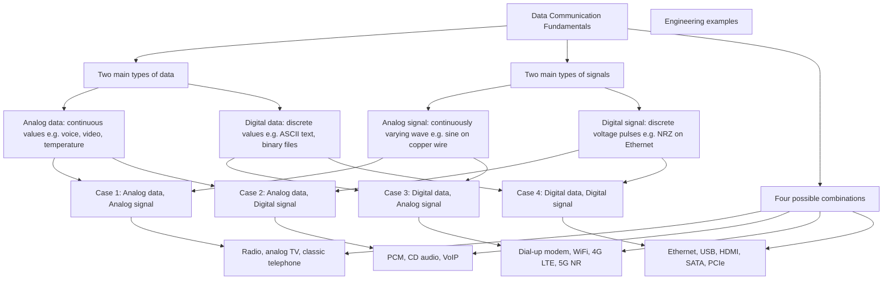
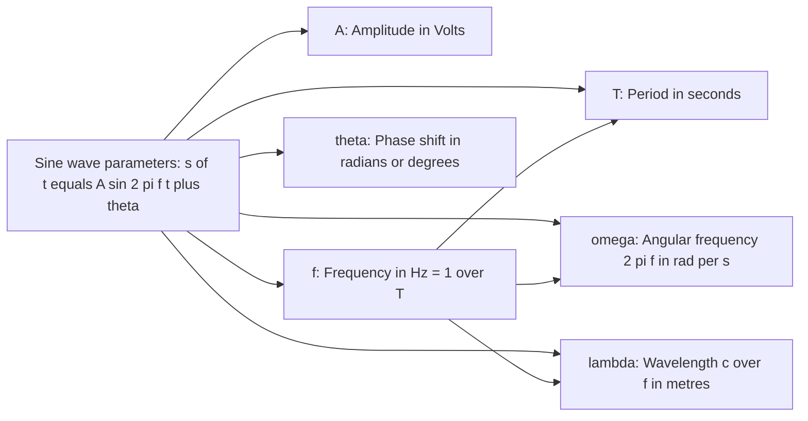
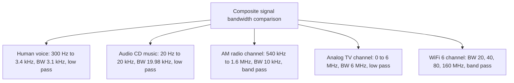

# Analog & digital data and signals.

<!-- SECTION_1_START -->

# Module 1 – Communication Model: Analog & Digital Data and Signals

## 1.1 Core Technical Definition

> [!IMPORTANT]
> **Data** refers to facts, concepts, or instructions presented in a formalized manner suitable for communication, interpretation, or processing by humans or by automated systems. **Signals** are the physical encoding of data — electromagnetic or optical variations in voltage, current, light intensity, or radio waves that propagate along a transmission medium.

In the context of **KTU DATA COMMUNICATION (OECST612)**, the communication model begins with two fundamental dichotomies:

| Aspect | Analog | Digital |
|---|---|---|
| **Data** | Continuous values (e.g., voice, temperature, video intensity) | Discrete values (binary `0` and `1`) |
| **Signal** | Continuously varying electromagnetic wave | Sequence of discrete voltage pulses |
| **Examples** | Human voice on a copper wire, FM radio | Ethernet frames on a CAT-6 cable, HDMI video |
| **Time Variable** | Continuous (every real $t$ in an interval) | Discrete (only at $t = 0, T, 2T, \ldots$) |
| **Amplitude Variable** | Continuous (any value in a range) | Discrete (finite set of permitted levels) |

> [!NOTE]
> A signal is **always** the carrier of data, never the data itself. The same data can be encoded in many different signal types — the choice depends on the medium (copper, fibre, wireless) and the **bandwidth** available.

---

## 1.2 Conceptual Analogy / Intuition

Think of a **mercury thermometer** versus a **digital fever reader**:

- The **mercury thermometer** uses a continuous column of liquid — the height of mercury can take *any* value between $35.0^\circ\text{C}$ and $42.0^\circ\text{C}$. This is **analog data**.
- The **digital fever reader** shows the temperature in steps of $0.1^\circ\text{C}$ (e.g., $36.6$, $36.7$, $36.8$) — only certain discrete readings are possible. This is **digital data**.

Now, imagine transmitting the temperature from a remote weather station to a control room:

- An **analog signal** would vary its voltage *smoothly* between, say, $0\text{ V}$ and $5\text{ V}$, mirroring the temperature continuously.
- A **digital signal** would switch between two discrete voltage levels — say, $+5\text{ V}$ for binary `1` and $0\text{ V}$ for binary `0` — sending the temperature as a stream of `0`s and `1`s.

### The "Why" of the Two Domains

> [!TIP]
> Real-world phenomena (sound, light, temperature, pressure) are inherently **analog**. Computers and digital networks, however, internally operate in **binary**. Data Communication exists precisely to translate between these two worlds.

---

## 1.3 The Two Domains of Signals

> [!IMPORTANT]
> **Time-Domain Plot:** A signal drawn as amplitude $s(t)$ versus time $t$. Shows *what* happens *when*.  
> **Frequency-Domain Plot:** A signal drawn as amplitude (or power) versus frequency $f$. Shows *how much* of each frequency the signal contains.  
> These two views are linked mathematically by the **Fourier Transform** $\mathcal{F}\{s(t)\} = S(f)$.

> [!VISUALIZATION CONTROL]
> **Concept:** A pure $1\text{ kHz}$ sine wave shown simultaneously in the time and frequency domains.  
> **GeoGebra / Desmos Input Equations:**
> * `f(x) = sin(2 * pi * 1000 * x)` (time domain)  
> * A single impulse at $f = 1000\text{ Hz}$ with height $= 1$ (frequency domain)  
> **Visual Description:** On the $(t, s)$ axes, observe a smooth sinusoid repeating every $1\text{ ms}$. On the $(f, \vert S(f)\vert)$ axes, observe a single isolated spike at $1000\text{ Hz}$ — proving the signal contains *only one* frequency component.

---

## 1.4 The Four Possible Data–Signal Combinations

Following the canonical **Forouzan model** adopted in the KTU 2024 syllabus:

$$
\text{Data} \in \{\text{Analog}, \text{Digital}\}
\quad \times \quad
\text{Signal} \in \{\text{Analog}, \text{Digital}\}
\quad\Longrightarrow\quad
4 \text{ combinations}
$$

1. **Analog data + Analog signal** — Classical voice telephony, AM/FM broadcast.
2. **Analog data + Digital signal** — Pulse Code Modulation (PCM) used in fixed-line digital telephony.
3. **Digital data + Analog signal** — A modem converts laptop bits into audio tones over a telephone line.
4. **Digital data + Digital signal** — Ethernet LAN, USB, HDMI, all computer-to-computer links.

> [!NOTE]
> Each combination uses a different pair of *encoding* and *modulation* techniques. The remainder of Module 1 and the entirety of Module 2 in the KTU syllabus explore these mechanisms in detail.

---

## 1.5 Chapter Scope Map (per KTU 2024 OECST612 Syllabus)

| Sub-topic | KTU Weightage Hint |
|---|---|
| Analog vs Digital data; Analog vs Digital signals | High — direct 2-mark definitions |
| Periodic (sine) and non-periodic (composite) signals | High — frequently asked |
| Time-domain and frequency-domain representations | High — graph-based questions |
| Bandwidth and signal components | High — Part B standard |
| Bit rate, bit interval, DC component | Moderate |
| Four data–signal combinations | High — conceptual 14-markers |

<!-- SECTION_1_END -->

<!-- SECTION_2_START -->

# Deep Theoretical Analysis & KTU High-Yield Formula Sheet

## 2.1 The Sine Wave — Building Block of Every Signal

A **periodic analog signal** is mathematically expressed as a *sine* (or *cosine*) wave, which is the most fundamental analogue waveform. Every composite signal — voice, music, video, modulated data — can be decomposed into a sum of sine waves (Fourier's theorem).

The general equation of a sine wave is:

$$
s(t) = A \sin\!\left(2\pi f t + \theta\right)
$$

The four parameters are the *only* things you must master:

### 2.1.1 Amplitude ($A$)

- The **peak value** of the signal above (or below) its mean.
- Units: **volts** (V) for electrical signals, or **decibels** (dB) for power-ratios.
- For a power signal, instantaneous power $\propto s^{2}(t)$; the **peak-to-peak** value $= 2A$.

### 2.1.2 Period ($T$) and Frequency ($f$)

- **Period** $T$: time taken for one complete cycle, measured in **seconds (s)**.
- **Frequency** $f$: number of cycles per second, measured in **hertz (Hz)**.
- They are reciprocal:

$$
f = \frac{1}{T} \qquad\Longleftrightarrow\qquad T = \frac{1}{f}
$$

- A higher frequency means a *shorter* period (more oscillations per second).

### 2.1.3 Angular Frequency ($\omega$)

- Equivalent of frequency expressed in **radians per second**:

$$
\omega = 2\pi f = \frac{2\pi}{T}
$$

- Used when working with the radian form $s(t) = A \sin(\omega t + \theta)$.

### 2.1.4 Phase ($\theta$)

- The position of the waveform relative to time $t = 0$, measured in **radians** (or degrees).
- Indicates a *time-shift* of the wave; $\theta > 0$ shifts the wave to the **left** (early start).

### 2.1.5 Wavelength ($\lambda$)

- The physical distance occupied by one cycle as it propagates through a medium.

$$
\lambda = \frac{c}{f} \qquad\text{where } c \text{ is the speed of light} = 3 \times 10^{8}\ \text{m/s in free space}
$$

> [!NOTE]
> In copper cables, the propagation speed is roughly $2 \times 10^{8}\ \text{m/s}$ (about $2/3$ of $c$). In fibre, it is $\approx 2 \times 10^{8}\ \text{m/s}$.

---

## 2.2 Time Domain vs Frequency Domain

> [!IMPORTANT]
> A single-frequency sine wave appears as a *spike* in the frequency domain. A complex real-world signal (e.g., speech) appears as a *spectrum* — a continuous band of frequencies.

### Why does this matter in engineering?

- **Bandwidth planning:** Knowing which frequencies a signal occupies lets the network engineer allocate channels without interference.
- **Medium suitability:** Copper wires attenuate high frequencies; fibre attenuates low frequencies poorly — a match is critical.
- **Filtering & equalization:** Receivers use frequency-domain knowledge to compensate for channel distortion.

> [!TIP]
> The KTU textbook (Forouzan, *Data Communications and Networking*) and the Behrouz-Forouzan reference are extremely consistent: **every periodic signal = sum of discrete sines**, and **every non-periodic signal = integral of continuous sines**.

---

## 2.3 Composite Signals and Bandwidth

> [!IMPORTANT]
> **Bandwidth** of a signal = the range of frequencies contained in that signal, measured in **Hz**. It is *not* the same as the bandwidth of a channel (the carrying capacity of the medium).

For a composite analog signal that contains frequency components from $f_{\min}$ to $f_{\max}$:

$$
B_{\text{signal}} = f_{\max} - f_{\min}
$$

For a band-pass signal (does not start at DC, i.e. $f_{\min} > 0$):

$$
B_{\text{signal}} = f_{\max} - f_{\min}
$$

For a low-pass signal (starts at $0\text{ Hz}$):

$$
B_{\text{signal}} = f_{\max} - 0 = f_{\max}
$$

### Examples of real-world bandwidths

| Source | Frequency Range | Bandwidth |
|---|---|---|
| Human voice (telephony) | $300\text{ Hz} - 3.4\text{ kHz}$ | $3.1\text{ kHz}$ |
| AM radio | $540\text{ kHz} - 1.7\text{ MHz}$ | $\approx 1.16\text{ MHz}$ |
| FM radio | $88\text{ MHz} - 108\text{ MHz}$ | $\approx 20\text{ MHz}$ per channel |
| Human ear | $20\text{ Hz} - 20\text{ kHz}$ | $19.98\text{ kHz}$ |
| Standard TV (analog) | $0 - 6\text{ MHz}$ per channel | $6\text{ MHz}$ |
| 4G LTE downlink | $\text{DC} - 20\text{ MHz}$ typical | $20\text{ MHz}$ |
| Wi-Fi 6 channel | $\text{around } 5/6\text{ GHz}$ | $20/40/80/160\text{ MHz}$ |

---

## 2.4 Digital Signals — Bit Rate, Bit Interval, and DC Component

> [!IMPORTANT]
> A **digital signal** is a sequence of discrete, separate pulses representing binary `0` and `1`. Each pulse has a **bit interval** $T_b$ (duration) and a **bit rate** $N_b$ (bits per second).

$$
T_b = \frac{1}{N_b} \qquad\Longleftrightarrow\qquad N_b = \frac{1}{T_b}
$$

### 2.4.1 Bit Rate vs Baud Rate

- **Bit rate ($N_b$)**: number of *bits* transmitted per second (bps).
- **Baud rate ($S$)**: number of *signal units* (symbols) transmitted per second.
- For a signal that carries $k$ bits per symbol:

$$
N_b = S \times \log_{2} L
$$

where $L$ is the number of discrete signal levels (e.g., $L=2$ for NRZ, $L=4$ for 4-PAM).

### 2.4.2 The "Infinite Bandwidth" Problem

> [!CAUTION]
> A pure square-wave digital signal contains **theoretically infinite** frequency components (all odd harmonics of the bit rate). In practice, the medium acts as a **low-pass filter** and strips off the high frequencies, which causes the pulses to "smear" (intersymbol interference).

The **DC component** is the average voltage of the digital signal. A long run of `1`s raises the DC level, while a long run of `0`s lowers it. Receivers cannot easily pass DC (e.g., through transformers or AC-coupled links), so **DC-balanced line codes** (Manchester, 8B/10B) are used in Ethernet.

---

## 2.5 The Four Data–Signal Cases — Engineering Use

| Case | Data | Signal | Typical Technique | Real-World Example |
|---|---|---|---|---|
| (i) | Analog | Analog | Direct modulation (AM/FM/PM) | Radio broadcast, analog TV |
| (ii) | Analog | Digital | **PCM** (sampling, quantizing, encoding) | CD audio, landline digital voice |
| (iii) | Digital | Analog | **Modulation** (ASK, FSK, PSK, QAM) | Dial-up modem, Wi-Fi, 4G/5G |
| (iv) | Digital | Digital | **Line coding** (NRZ, Manchester, AMI) | Ethernet, USB, HDMI, SATA |

---

## 2.6 KTU Formula Sheet / Cheat Sheet

> [!IMPORTANT]
> **Master these 12 expressions — they appear in nearly every KTU Board question on this module.**

| # | Quantity | Formula | Units / Notes |
|---|---|---|---|
| 1 | Frequency | $f = 1/T$ | Hz (s$^{-1}$) |
| 2 | Period | $T = 1/f$ | seconds |
| 3 | Angular frequency | $\omega = 2\pi f$ | rad/s |
| 4 | Phase | $\theta$ (constant in $s(t) = A\sin(2\pi f t + \theta)$) | radians or degrees |
| 5 | Wavelength | $\lambda = c/f$ | metres; $c \approx 3 \times 10^{8}$ m/s (vacuum) |
| 6 | Signal Bandwidth | $B = f_{\max} - f_{\min}$ | Hz |
| 7 | Sine wave model | $s(t) = A \sin(2\pi f t + \theta)$ | Volts (electrical) |
| 8 | Bit interval | $T_b = 1/N_b$ | seconds per bit |
| 9 | Bit rate | $N_b = 1/T_b$ | bits per second (bps) |
| 10 | Bit rate from baud | $N_b = S \log_{2} L$ | bps; $L$ = signal levels |
| 11 | First harmonic BW of digital signal | $B_{1^{\text{st}}} = N_b / 2$ | Hz (rough practical estimate) |
| 12 | Nyquist sampling rate | $f_{s} \geq 2 f_{\max}$ | Hz (links to Module 2 / PCM) |

> [!TIP]
> Formula 11 is a *Forouzan-style approximation*: the *first* harmonic (fundamental) of a digital signal at bit rate $N_b$ has frequency $N_b/2$, and it is the only component the receiver *must* recover for the bit stream to remain intelligible (degraded but recognizable).

---

## 2.7 Why This Matters in Real Engineering

- **Telecom operators** allocate spectrum blocks (e.g., $700\text{ MHz}$, $2.6\text{ GHz}$ in India) using precise bandwidth calculations.
- **PCB and chip designers** specify *rise-time budgets* to guarantee digital signal integrity up to multi-Gbps speeds.
- **Audio engineers** choose sampling rates ($44.1\text{ kHz}$ for CD audio) based on the Nyquist limit and the $20\text{ kHz}$ human hearing cutoff.
- **Network engineers** choose modulation schemes (BPSK, QPSK, 64-QAM, 256-QAM) based on the bandwidth–SNR trade-off.

<!-- SECTION_2_END -->

<!-- SECTION_3_START -->

# Step-by-Step Derivations, Worked Examples & Code Implementation

## 3.1 Worked Example 1 — Identify the Parameters of a Sine Wave

> **Problem.** A periodic signal is described by $s(t) = 10 \sin(50\pi t + \pi/3)$ volts. Determine its amplitude, frequency, period, phase (in degrees), angular frequency, and wavelength when the signal propagates in free space.

**Step 1 — Identify the standard form.** Compare with $s(t) = A \sin(2\pi f t + \theta)$.

$$
10 \sin(50\pi t + \pi/3) \;\; \longleftrightarrow \;\; A \sin(2\pi f t + \theta)
$$

**Step 2 — Extract the parameters.**

$$
\begin{aligned}
A &= 10\ \text{V} \quad \text{(amplitude)} \\
2\pi f &= 50\pi \;\;\Longrightarrow\;\; f = \frac{50\pi}{2\pi} = 25\ \text{Hz} \quad \text{(frequency)} \\
T &= \frac{1}{f} = \frac{1}{25} = 0.04\ \text{s} = 40\ \text{ms} \quad \text{(period)} \\
\omega &= 50\pi\ \text{rad/s} \quad \text{(angular frequency)} \\
\theta &= \frac{\pi}{3}\ \text{rad} = \frac{\pi}{3} \cdot \frac{180^\circ}{\pi} = 60^\circ \quad \text{(phase in degrees)} \\
\lambda &= \frac{c}{f} = \frac{3 \times 10^{8}\ \text{m/s}}{25\ \text{Hz}} = 1.2 \times 10^{7}\ \text{m} = 12{,}000\ \text{km} \quad \text{(wavelength)}
\end{aligned}
$$

> [!NOTE]
> A $25\text{ Hz}$ signal has a wavelength of $12{,}000$ km — that is why extremely low frequencies (ELF) can wrap around the Earth for submarine communication.

---

## 3.2 Worked Example 2 — Bit Rate, Bit Interval, and Bandwidth

> **Problem.** A digital channel transmits data at $8\text{ Mbps}$ using NRZ-L encoding. Compute the bit interval, the bit duration, the first-harmonic bandwidth estimate, and the bit rate in *kilo-baud* if the system uses 4-level signalling.

**Step 1 — Bit interval.** Using $T_b = 1/N_b$:

$$
T_b = \frac{1}{8 \times 10^{6}} = 1.25 \times 10^{-7}\ \text{s} = 125\ \text{ns}
$$

**Step 2 — First-harmonic bandwidth.** Using $B = N_b/2$:

$$
B = \frac{8 \times 10^{6}}{2} = 4 \times 10^{6}\ \text{Hz} = 4\ \text{MHz}
$$

**Step 3 — Baud rate with 4-level signalling.** Using $N_b = S \log_{2} L$:

$$
S = \frac{N_b}{\log_{2} L} = \frac{8\ \text{Mbps}}{\log_{2} 4} = \frac{8\ \text{Mbps}}{2} = 4\ \text{MBaud}
$$

```
Parameter         Value
Bit rate (N_b)    8 000 000 bps
Bit interval      125 ns
Bandwidth         4 MHz (first harmonic)
Baud rate (4-PAM) 4 MBaud
```

> [!TIP]
> Note how increasing signal levels from $2$ (NRZ) to $4$ (4-PAM) doubles the bit rate for the same baud rate — this is exactly how modern modems (e.g., 256-QAM on 4G/5G) achieve high throughput.

---

## 3.3 Worked Example 3 — Composite Signal and Bandwidth

> **Problem.** A composite signal contains frequencies from $20\text{ Hz}$ to $4\text{ kHz}$. Another contains frequencies from $1\text{ MHz}$ to $1.01\text{ MHz}$. Which one has a larger bandwidth? What kind of signal is each?

**Step 1 — First composite signal.** It is **low-pass** (starts near DC) and represents human voice / music.

$$
B_1 = 4\,000 - 20 = 3\,980\ \text{Hz} \approx 4\ \text{kHz}
$$

**Step 2 — Second composite signal.** It is **band-pass** (does not start at DC) and represents a typical broadcast or radar channel.

$$
B_2 = 1.01\ \text{MHz} - 1.00\ \text{MHz} = 0.01\ \text{MHz} = 10\ \text{kHz}
$$

**Step 3 — Comparison.**

$$
B_1 \approx 4\ \text{kHz} \;\;\text{vs.}\;\; B_2 = 10\ \text{kHz} \;\;\Longrightarrow\;\; B_2 > B_1
$$

> [!IMPORTANT]
> A signal's *bandwidth* says nothing about the *absolute frequencies* it uses. The $1\text{ MHz}$ band-pass signal is a *narrow-band* signal (only $10\text{ kHz}$ wide), while the audio signal is a *wide-band* relative-to-its-baseband signal.

---

## 3.4 Python Implementation — Generate, Sample, and Plot a Sine Wave

A complete, runnable, KTU-lab-ready Python program that demonstrates the analog/digital concept. Uses only the standard library plus `matplotlib` and `numpy`.

```python
"""
Filename : sine_wave_demo.py
Purpose  : Demonstrate analog vs digital representation of a sine wave.
Course   : KTU DATA COMMUNICATION (OECST612) — Module 1
"""
import numpy as np
import matplotlib.pyplot as plt
from typing import Tuple

# ---------------------------------------------------------------
# Helper: Generate a clean continuous (analog) sine wave
# ---------------------------------------------------------------
def analog_sine_wave(
    amplitude: float,
    frequency_hz: float,
    phase_rad: float,
    duration_s: float,
    sample_rate_hz: float
) -> Tuple[np.ndarray, np.ndarray]:
    """
    Returns (t, s) arrays representing a high-fidelity analog sine wave.

    Parameters
    ----------
    amplitude       : Peak amplitude in volts (must be > 0)
    frequency_hz    : Signal frequency in Hz (must be > 0)
    phase_rad       : Initial phase in radians
    duration_s      : Total signal duration in seconds (must be > 0)
    sample_rate_hz  : Sampling rate in samples/second (must be > 2 * frequency)
    """
    if amplitude <= 0 or frequency_hz <= 0 or duration_s <= 0:
        raise ValueError("amplitude, frequency, duration must be positive")
    if sample_rate_hz < 2 * frequency_hz:
        raise ValueError("sample_rate must satisfy Nyquist (>= 2*frequency)")

    t = np.arange(0.0, duration_s, 1.0 / sample_rate_hz)
    s = amplitude * np.sin(2.0 * np.pi * frequency_hz * t + phase_rad)
    return t, s


# ---------------------------------------------------------------
# Helper: Convert an analog sample stream to a digital NRZ stream
# ---------------------------------------------------------------
def analog_to_digital_nrz(
    t: np.ndarray,
    s: np.ndarray,
    bit_rate_bps: float,
    levels: int = 2
) -> Tuple[np.ndarray, np.ndarray, np.ndarray]:
    """
    Quantize a continuous sine wave into a multi-level NRZ digital stream.

    Returns
    -------
    bit_centers  : Time stamps (s) at which each bit is centred
    bit_values   : Discrete amplitude levels (volts) for each bit
    bit_pattern  : Integer index of the chosen level (0 .. levels-1)
    """
    if bit_rate_bps <= 0 or levels < 2:
        raise ValueError("bit_rate_bps must be > 0 and levels >= 2")

    bit_interval = 1.0 / bit_rate_bps
    total_duration = t[-1] - t[0]
    num_bits = int(np.floor(total_duration / bit_interval))

    bit_centers = np.array([t[0] + (i + 0.5) * bit_interval for i in range(num_bits)])
    # Sample the analog wave at the centre of each bit interval
    sample_indices = np.searchsorted(t, bit_centers)
    sample_indices = np.clip(sample_indices, 0, len(t) - 1)
    analog_samples = s[sample_indices]

    # Quantize uniformly into 'levels' steps
    v_min, v_max = analog_samples.min(), analog_samples.max()
    thresholds = np.linspace(v_min, v_max, levels + 1)
    bit_pattern = np.digitize(analog_samples, thresholds) - 1
    bit_pattern = np.clip(bit_pattern, 0, levels - 1)
    bit_values = thresholds[:-1] + (thresholds[1] - thresholds[0]) / 2.0

    return bit_centers, bit_values[bit_pattern], bit_pattern


# ---------------------------------------------------------------
# Main: Plot analog + digital side-by-side
# ---------------------------------------------------------------
def main() -> None:
    # Signal parameters (edit these freely to explore the concepts)
    A, f, phi, T, fs = 5.0, 50.0, np.pi / 4, 0.10, 100_000
    bit_rate = 1_000     # 1 kbps NRZ

    t, s = analog_sine_wave(A, f, phi, T, fs)
    bit_t, bit_v, _ = analog_to_digital_nrz(t, s, bit_rate, levels=2)

    # Time-domain plot
    plt.figure(figsize=(11, 5))
    plt.plot(t * 1e3, s, label="Analog sine wave", linewidth=1.6)
    plt.step(bit_t * 1e3, bit_v, where="mid", color="red",
             label="Digital NRZ (1 kbps, 2 levels)", linewidth=1.8)
    plt.title(f"Analog vs Digital: A={A} V, f={f} Hz, Bit rate={bit_rate} bps")
    plt.xlabel("Time (ms)")
    plt.ylabel("Amplitude (V)")
    plt.grid(True, linestyle="--", alpha=0.5)
    plt.legend(loc="upper right")
    plt.tight_layout()
    plt.savefig("analog_vs_digital.png", dpi=150)
    plt.show()


if __name__ == "__main__":
    main()
```

> [!NOTE]
> Running this script produces a PNG where the **smooth blue sinusoid** is the *analog* signal, and the **red square step** trace is the *digital* NRZ-L approximation. Reducing the `bit_rate` to `200` bps makes the digital trace look "blockier" — a clear visualization of how a low bit rate loses detail (a real-world analogue of pixelation).

---

## 3.5 Symbolic Derivation — From a Real Audio Signal to Frequency Components

> **Problem.** A piano plays middle-C (≈ $261.6\text{ Hz}$). If the recorded electrical signal is modelled as $s(t) = 1.2 \sin(2\pi \cdot 261.6\, t) + 0.4 \sin(2\pi \cdot 523.2\, t) + 0.15 \sin(2\pi \cdot 784.8\, t)$ volts, find the **bandwidth**, the **fundamental frequency**, and the **percentage harmonic content** of the second harmonic.

**Step 1 — Identify components.** There are three sine terms:

$$
\begin{aligned}
&\text{1st (fundamental)}: f_1 = 261.6\ \text{Hz},\ A_1 = 1.2\ \text{V} \\
&\text{2nd harmonic}     : f_2 = 523.2\ \text{Hz},\ A_2 = 0.4\ \text{V} \\
&\text{3rd harmonic}     : f_3 = 784.8\ \text{Hz},\ A_3 = 0.15\ \text{V}
\end{aligned}
$$

**Step 2 — Bandwidth.**

$$
B = f_{\max} - f_{\min} = 784.8 - 261.6 = 523.2\ \text{Hz}
$$

**Step 3 — Fundamental.**

$$
f_0 = 261.6\ \text{Hz}
$$

**Step 4 — Percentage of the second harmonic** (using power $\propto A^{2}$):

$$
\text{Total power} \propto A_1^{2} + A_2^{2} + A_3^{2}
= (1.2)^{2} + (0.4)^{2} + (0.15)^{2}
= 1.44 + 0.16 + 0.0225
= 1.6225
$$

$$
\%P_2 = \frac{A_2^{2}}{1.6225} \times 100 = \frac{0.16}{1.6225} \times 100 \approx 9.86\%
$$

> [!TIP]
> This calculation is exactly what audio codecs (MP3, AAC) do in reverse — they identify the "loudest" harmonics and discard the inaudible ones, achieving 10:1 compression without perceptible loss.

<!-- SECTION_3_END -->

<!-- SECTION_4_START -->

# Structural Diagrams & Schematics

> [!IMPORTANT]
> The following Mermaid diagrams summarize the entire data/signal taxonomy. All node IDs are alphanumeric, all labels are double-quoted plain text — fully compliant with the Mermaid safety rules.

## 4.1 High-Level Taxonomy — Data and Signal Types



## 4.2 Sine Wave Anatomy — Parameters of a Periodic Signal



## 4.3 Sequential Processing Topology — How a Sender Translates Data to Signal

```mermaid
flowchart LR
    subgraph sourceLayer["Source side"]
        src1["Source data: text, audio, image"]
        src2["Encoder / Sampler"]
        src3["Modulator or Line Coder"]
        src4["Transmitter electronics"]
    end

    subgraph channelLayer["Channel"]
        ch1["Transmission medium: copper, fibre, wireless"]
    end

    subgraph destLayer["Destination side"]
        dst1["Receiver electronics"]
        dst2["Demodulator or Line Decoder"]
        dst3["Decoder / DAC"]
        dst4["Destination data: identical to source"]
    end

    src1 --> src2
    src2 --> src3
    src3 --> src4
    src4 --> ch1
    ch1 --> dst1
    dst1 --> dst2
    dst2 --> dst3
    dst3 --> dst4
```



> [!NOTE]
> Every communication system in the KTU syllabus (modems, optical links, satellite uplinks) is an instance of this template — only the *encoder*, *modulator*, and *medium* change.

## 4.4 Bandwidth Comparison — Voice vs Music vs Video



<!-- SECTION_4_END -->

<!-- SECTION_5_START -->

# KTU 2024 Scheme Examination Question Bank & Topic Recap

## 5.1 Part A — Short Answer Questions (2 & 3 Marks)

### Q1. [KTU University Exam – Dec 2023, CO1, Remember, 3 Marks]
**Differentiate between analog and digital signals with suitable examples.**

**Model Answer (Board-expected structure):**

| Feature | Analog Signal | Digital Signal |
|---|---|---|
| Definition | Continuously varying in amplitude and time | Discrete pulses with finite levels |
| Levels | Infinite possible amplitude values | Finite set (typically 2, 4, 8, …) |
| Noise immunity | Poor — noise is additive to the signal | High — small distortions are removed at the regenerator |
| Bandwidth | Often low (voice: $3.1\text{ kHz}$) | Theoretically infinite; practically limited |
| Example | Sine wave on a phone line | NRZ on Ethernet |

> **Valuation key:** [Clear 2-line definition: 1 Mark] [Tabular comparison with 3 differences: 2 Marks]

### Q2. [KTU University Exam – July 2024, CO1, Understand, 3 Marks]
**Explain the four possible combinations of data and signals with one real-world example each.**

**Model Answer:**

1. **Analog data + Analog signal** — *Example:* AM/FM radio broadcast; the human voice modulates a high-frequency carrier.
2. **Analog data + Digital signal** — *Example:* Pulse Code Modulation (PCM) in a digital telephone exchange; voice is sampled, quantized, and sent as binary bits.
3. **Digital data + Analog signal** — *Example:* Dial-up modem using FSK/PSK modulation; computer bits modulate an audio carrier on the telephone line.
4. **Digital data + Digital signal** — *Example:* Ethernet LAN using Manchester line coding; computer bits are encoded directly as voltage pulses on the cable.

> **Valuation key:** [All four combinations: 2 Marks] [One real example each: 1 Mark]

---

## 5.2 Part B — Long Answer Questions (14 Marks, Module-Internal Choice)

### Question A (14 Marks) — `[KTU University Exam — July 2024, CO1, Understand + Apply]`

#### (a) [7 Marks] With the help of a neat time-domain and frequency-domain diagram, explain the parameters of a sine wave. Derive the relationship between frequency, period, angular frequency, and wavelength.

**Model Solution:**

**Step 1 — Define the sine wave** (1 Mark):

$$
s(t) = A \sin(2\pi f t + \theta) \quad \text{(volts)}
$$

**Step 2 — Define each parameter** (3 Marks):

- $A$ — amplitude in **volts**, peak deviation from the mean.
- $f$ — frequency in **Hz**, cycles per second.
- $T$ — period in **seconds**, time for one full cycle.
- $\theta$ — phase in **radians**, time-shift relative to $t = 0$.
- $\omega$ — angular frequency in **rad/s**, used in $s(t) = A \sin(\omega t + \theta)$.
- $\lambda$ — wavelength in **metres**, physical length of one cycle in the medium.

**Step 3 — Derive the relationships** (2 Marks):

$$
\begin{aligned}
f &= \frac{1}{T} \\
\omega &= 2\pi f = \frac{2\pi}{T} \\
\lambda &= \frac{c}{f} = c\,T \quad \text{where } c \text{ is propagation speed}
\end{aligned}
$$

**Step 4 — Diagram description** (1 Mark): A time-domain sinusoid crosses zero at $t = 0$, $T/2$, $T$, $3T/2$, … with peaks $+A$ at $T/4$ and $-A$ at $3T/4$. The frequency-domain plot is a single impulse of height $A$ at $f = 1/T$ on the horizontal axis.

> **Valuation key:** [Standard form with all parameters: 1 Mark] [Definitions of A, f, T, θ, ω, λ: 3 Marks] [Derivations of the three relations: 2 Marks] [Diagram description: 1 Mark]

#### (b) [7 Marks] A periodic signal has a fundamental frequency of $1\text{ kHz}$ and contains the first three odd harmonics. If the amplitude of the $n^{\text{th}}$ harmonic is $A_n = 8/n$ volts, compute (i) the bandwidth, (ii) the period, (iii) the amplitude of each component, and (iv) the RMS voltage of the composite signal.

**Model Solution:**

**Step 1 — Identify harmonics** (1 Mark). Odd harmonics of $1\text{ kHz}$ are $1$, $3$, $5$ kHz. So:

$$
f_1 = 1\ \text{kHz}, \quad f_3 = 3\ \text{kHz}, \quad f_5 = 5\ \text{kHz}
$$

**Step 2 — Bandwidth** (1 Mark):

$$
B = f_5 - f_1 = 5\,000 - 1\,000 = 4\,000\ \text{Hz} = 4\ \text{kHz}
$$

**Step 3 — Period** (1 Mark):

$$
T = \frac{1}{f_1} = \frac{1}{1\,000} = 1\ \text{ms}
$$

**Step 4 — Amplitudes** (1 Mark):

$$
\begin{aligned}
A_1 &= \frac{8}{1} = 8\ \text{V} \\
A_3 &= \frac{8}{3} \approx 2.667\ \text{V} \\
A_5 &= \frac{8}{5} = 1.6\ \text{V}
\end{aligned}
$$

**Step 5 — RMS voltage** (3 Marks). For a sum of orthogonal sinusoids, total RMS is the square root of the sum of individual RMS² values, and RMS of a sine is $A/\sqrt{2}$:

$$
\begin{aligned}
V_{\text{rms}} &= \sqrt{\left(\frac{A_1}{\sqrt{2}}\right)^{2} + \left(\frac{A_3}{\sqrt{2}}\right)^{2} + \left(\frac{A_5}{\sqrt{2}}\right)^{2}} \\
&= \sqrt{\frac{A_1^{2} + A_3^{2} + A_5^{2}}{2}} \\
&= \sqrt{\frac{8^{2} + (8/3)^{2} + (8/5)^{2}}{2}} \\
&= \sqrt{\frac{64 + 7.111 + 2.56}{2}} \\
&= \sqrt{\frac{73.671}{2}} \\
&= \sqrt{36.836} \\
&\approx 6.069\ \text{V}
\end{aligned}
$$

> **Valuation key:** [Listing odd harmonics: 1 Mark] [B, T, and amplitudes: 1+1+1=3 Marks] [RMS expression with orthogonality: 2 Marks] [Final numerical value: 1 Mark]

---

### Question B (14 Marks, Alternative Choice) — `[KTU University Exam — Dec 2023, CO1 + CO2, Understand + Apply]`

#### (a) [7 Marks] Compare time-domain and frequency-domain representations of signals. Why is the frequency-domain view indispensable in data communication?

**Model Solution:**

**Step 1 — Time-domain representation** (2 Marks): A signal $s(t)$ is plotted with amplitude on the vertical axis and time $t$ on the horizontal axis. It directly shows *when* a value occurs, *what* the amplitude is at each instant, and the *period* (if periodic). It does **not** easily reveal which frequencies are present.

**Step 2 — Frequency-domain representation** (2 Marks): A signal is described by the set of frequencies it contains, with their relative amplitudes/phases. The **Fourier transform** $S(f) = \mathcal{F}\{s(t)\} = \int_{-\infty}^{\infty} s(t) e^{-j 2\pi f t}\, dt$ converts the time-domain view to the frequency-domain view. A pure sine becomes a single impulse.

**Step 3 — Why indispensable in data communication** (3 Marks):

- *Bandwidth identification:* Channel capacity (Shannon) and channel selection depend on knowing the signal's frequency range.
- *Multiplexing:* Frequency-Division Multiplexing (FDM) stacks many signals at different carrier frequencies — only possible if each signal's frequency content is known.
- *Filter design:* Receivers use band-pass/low-pass filters to extract the desired band.
- *Impairment analysis:* Attenuation, distortion, and noise are frequency-dependent.
- *Modulation design:* Choosing AM/FM/PM or ASK/FSK/PSK requires frequency-domain analysis.

> **Valuation key:** [Time-domain description with limitation: 2 Marks] [Frequency-domain description with Fourier: 2 Marks] [Three engineering reasons: 3 Marks]

#### (b) [7 Marks] A digital communication system transmits at $10\text{ Mbps}$ using an NRZ-L line code. Calculate (i) the bit interval, (ii) the baud rate, (iii) the first-harmonic bandwidth, and (iv) the new bit rate if the system is upgraded to 4-PAM with the same baud.

**Model Solution:**

**Step 1 — Bit interval** (2 Marks):

$$
T_b = \frac{1}{N_b} = \frac{1}{10 \times 10^{6}} = 1 \times 10^{-7}\ \text{s} = 100\ \text{ns}
$$

**Step 2 — Baud rate (NRZ-L)** (1 Mark). With $L = 2$ levels, 1 bit per symbol:

$$
S = \frac{N_b}{\log_2 L} = \frac{10\ \text{Mbps}}{1} = 10\ \text{MBaud}
$$

**Step 3 — First-harmonic bandwidth** (1 Mark):

$$
B = \frac{N_b}{2} = \frac{10\ \text{Mbps}}{2} = 5\ \text{MHz}
$$

**Step 4 — New bit rate with 4-PAM at the same baud** (3 Marks). With $L = 4$, each symbol carries $\log_2 4 = 2$ bits:

$$
N_b' = S \times \log_2 L = 10\ \text{MBaud} \times 2 = 20\ \text{Mbps}
$$

> **Valuation key:** [Correct application of $T_b = 1/N_b$: 2 Marks] [Baud rate with NRZ-L: 1 Mark] [Bandwidth formula: 1 Mark] [4-PAM doubling argument: 3 Marks]

---

## 5.3 KTU Examiner's Valuation Warning / Pitfall Callout

> [!WARNING]
> **Where students typically lose marks on this topic:**
> 1. **Mixing up frequency ($f$) and angular frequency ($\omega$).** Examiners *will* deduct a mark if you compute $\omega$ but call it $f$ or vice-versa. Always write units.
> 2. **Forgetting the $2\pi$ factor.** In $s(t) = A\sin(2\pi f t + \theta)$, the $2\pi$ converts frequency (Hz) to angular rate (rad/s). Forgetting it changes the answer by $2\pi$.
> 3. **Confusing bit rate (bps) and baud rate (Baud).** If $L = 2$, they are equal; if $L = 4$, baud is half. Many marks are lost on this.
> 4. **Bandwidth confusion.** *Signal bandwidth* (range of frequencies in the signal) ≠ *Channel bandwidth* (carrying capacity of the medium). State explicitly which one you are computing.
> 5. **No units in the final answer.** KTU examiners are strict: "$\lambda = 12{,}000$" with no unit is a guaranteed half-mark cut. Always write "$\lambda = 12{,}000\text{ km}$".
> 6. **Forgetting the Nyquist criterion.** When sampling analog data into digital, you MUST mention $f_s \geq 2 f_{\max}$.

---

## 5.4 Topic Recap & Important Things to Remember

> [!TIP]
> **High-density rapid-revision checklist — read this 5 minutes before entering the exam hall.**

- **Data vs Signal:** Data is *what* is being conveyed (facts/information); Signal is *how* it is conveyed (physical waveform).
- **Analog** = continuous in time **and** amplitude. **Digital** = discrete in time **and** amplitude.
- **Sine wave** $s(t) = A \sin(2\pi f t + \theta)$ is the atom of *every* analog signal (Fourier).
- **Four parameters of a sine wave:** Amplitude $A$ (V), Frequency $f$ (Hz), Phase $\theta$ (rad), Period $T = 1/f$ (s).
- **Wavelength** $\lambda = c / f$ (m); $c = 3 \times 10^{8}\ \text{m/s}$ in vacuum.
- **Angular frequency** $\omega = 2\pi f$ (rad/s) — needed for radian-based equations.
- **Time domain** plots amplitude vs time; **Frequency domain** plots amplitude vs frequency.
- **Bandwidth** of a signal $B = f_{\max} - f_{\min}$ (Hz). Low-pass signals have $f_{\min} = 0$.
- **Bit rate** $N_b$ (bps) is bits per second. **Bit interval** $T_b = 1/N_b$ (s).
- **Baud rate** $S$ is symbols per second. **$N_b = S \log_2 L$** where $L$ is signal levels.
- **First-harmonic BW** of a digital signal is approximately $N_b / 2$ (Forouzan-style estimate).
- **Four data–signal cases:** (i) A-A → radio, (ii) A-D → PCM, (iii) D-A → modem, (iv) D-D → Ethernet.
- **DC component** = time-averaged value of a digital signal; long runs of `1`s raise it.
- **Nyquist sampling rate** $f_s \geq 2 f_{\max}$ is required to reconstruct an analog signal from samples.
- **Real-world bandwidths to memorize:** Voice $\approx 4\text{ kHz}$, Audio CD $\approx 20\text{ kHz}$, TV channel $\approx 6\text{ MHz}$, Wi-Fi 6 channel up to $160\text{ MHz}$.
- **Conventions:** Always quote units; always quote which bandwidth (signal vs channel); always state the propagation medium when computing $\lambda$.
- **Common KTU trap:** A periodic *composite* signal's *fundamental* is the lowest frequency present, *not* the lowest harmonic of a particular sinusoid.

<!-- SECTION_5_END -->
