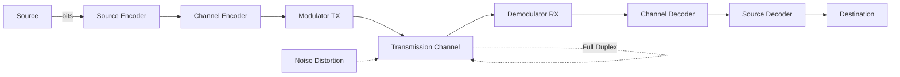
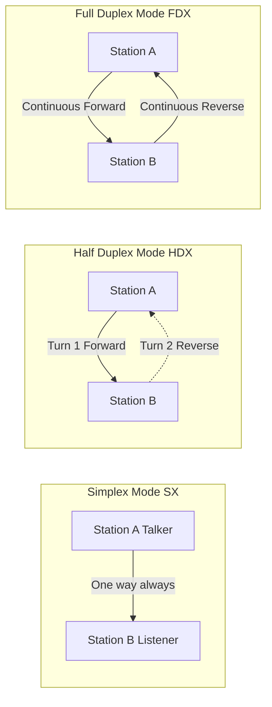
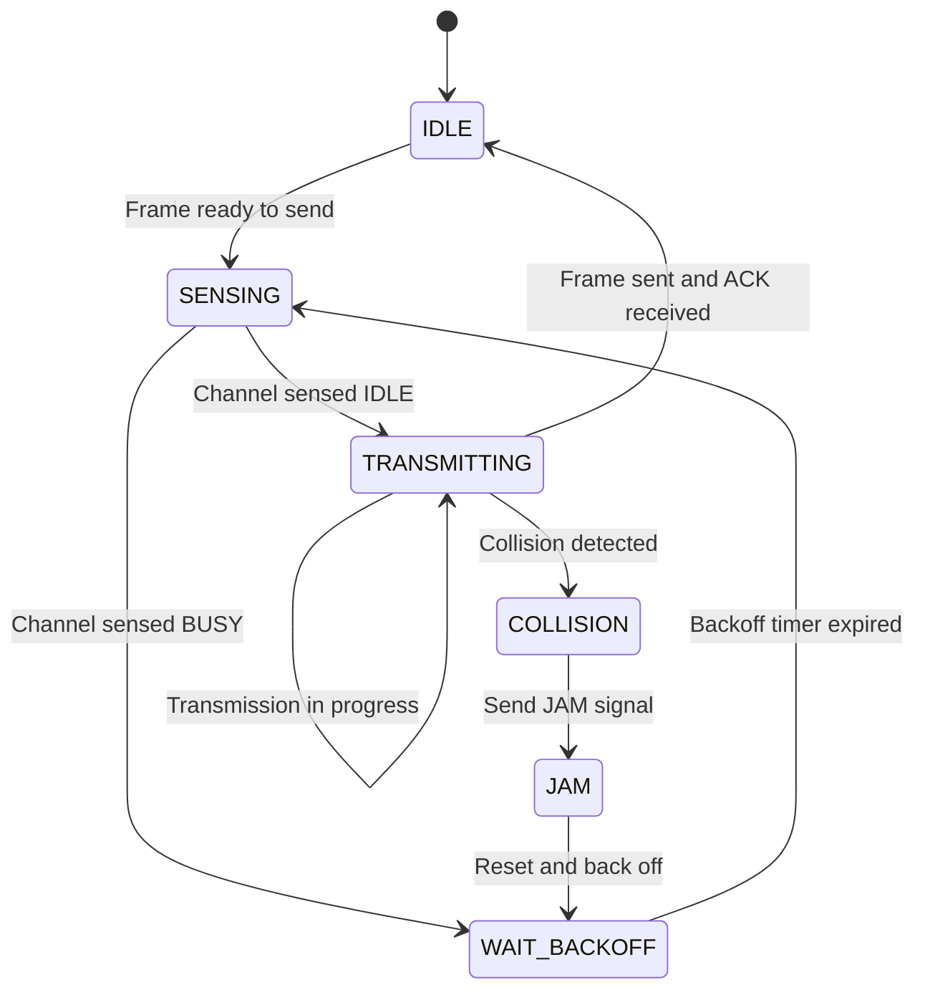

# Communication model - Simplex, Half duplex, Full duplex transmission.

<!-- SECTION_1_START -->
# Communication Model & Transmission Modes

## 1.1 The Communication Model — Formal Definition

In the context of **Data Communication (OECST612)**, a *communication model* is the abstract, structural framework that describes how digital (or analog) information is transferred from a **source** to a **destination** through a **transmission medium**, governed by well-defined protocols. The most fundamental reference model is the simplified **Source–Channel–Destination** triad (a precursor to the OSI & TCP/IP models used in KTU Module 2/3).

> [!NOTE]
> **KTU Syllabus Definition:** *A communication model defines the functional units — Source, Transmitter, Transmission System (Channel + Noise), Receiver, and Destination — along with the direction, timing, and mode of data flow between them.*

The five essential functional units are:

| # | Unit | Role |
|---|------|------|
| 1 | **Source** | Generates the data (PC, sensor, smartphone). |
| 2 | **Transmitter** | Converts data into transmittable signals (modulation, encoding). |
| 3 | **Transmission System** | The physical medium (copper, fiber, RF) carrying the signal. |
| 4 | **Receiver** | Converts the received signal back into usable data. |
| 5 | **Destination** | The end target device (PC, server, IoT actuator). |

## 1.2 Transmission Modes — The Core Concept

**Transmission Mode** specifies the **direction of signal flow** between two communicating devices. The KTU 2024 Scheme groups this into three canonical categories.

> [!IMPORTANT]
> **KTU High-Yield Definition:** *Transmission mode is the mechanism governing whether and how two devices can send/receive data simultaneously, alternately, or in only one direction.*

### 1.2.1 Simplex Transmission (SX)

In **Simplex** mode, communication is **unidirectional**. One device (the *Talker*) is permanently designated as the transmitter, and the other (the *Listener*) is permanently the receiver. The channel is used in **one direction only** for the entire session lifetime.

**Conceptual Analogy 🛣️:** Imagine a **one-way street** in a city. Vehicles can only travel from Point A → Point B. There is no reverse lane, no U-turn, no second carriageway. Similarly, in Simplex, data flows Source → Destination, never the reverse.

**Real-World Examples:**
- **FM Radio Broadcasting** — A radio station transmits; your car radio only receives.
- **Television Broadcast** — TV tower pushes signals; TV set never transmits back (in traditional analog TV).
- **Keyboard → Monitor** — Your keyboard only sends characters to the monitor; the monitor never sends data back to the keyboard.
- **Public Address (PA) Systems** in auditoriums.
- **Telemetry from a satellite** to an earth station (downlink only).

> [!NOTE]
> **Bandwidth Utilization in Simplex:** The **entire channel capacity** (let's call it $C$ bits/sec) is permanently allocated to the forward direction. So $BW_{forward} = C$ and $BW_{reverse} = 0$.

### 1.2.2 Half-Duplex Transmission (HDX)

In **Half-Duplex** mode, both devices **can** transmit and receive, but **not at the same time**. The shared channel must be *temporally multiplexed* — at any given instant $t$, only one direction of flow is active. A protocol-level handshake (e.g., a "talk token" or a Carrier Sense mechanism) decides who gets the line.

**Conceptual Analogy 🛣️:** Imagine a **narrow mountain road with one lane**. Cars from both sides can use it, but they must take turns. A traffic controller (or the drivers themselves using horns and signals) decides which side gets to drive right now. This is exactly Half-Duplex.

**Real-World Examples:**
- **Walkie-Talkies / Two-Way Radios** — You press "Push-To-Talk" (PTT) to speak; the other party listens. You cannot speak and listen simultaneously.
- **CB Radio** used by truckers.
- **Ethernet over a single shared coaxial cable** (legacy 10BASE2 / 10BASE5 using CSMA/CD).
- **Internet Chat over a single satellite hop** (store-and-forward style).

> [!IMPORTANT]
> **Effective Throughput Rule:** In Half-Duplex, if the channel capacity is $C$, the *sum* of forward and reverse throughputs over a long time window $T$ cannot exceed $C$. i.e., $BW_{forward} + BW_{reverse} \leq C$, and at any instant $t$, either $BW_{forward}(t) = C$ and $BW_{reverse}(t) = 0$, or vice-versa.

### 1.2.3 Full-Duplex Transmission (FDX)

In **Full-Duplex** mode (also called **Duplex**), both devices can **transmit and receive simultaneously** over the channel. Two independent logical (or physical) sub-channels are established — one for each direction — and they coexist without collision.

**Conceptual Analogy 🛣️:** Imagine a **four-lane divided highway** — two lanes going north, two lanes going south, separated by a concrete median. Both directions can move traffic at the *same time* at full speed. This is Full-Duplex.

**Real-World Examples:**
- **Telephone networks** — Both parties can speak and listen simultaneously.
- **Modern Full-Duplex Ethernet (100BASE-TX, 1000BASE-T)** — Uses separate twisted pairs for TX and RX.
- **Fiber Optic links** with two strands (or WDM wavelengths).
- **5G NR / 4G LTE** mobile networks.
- **Full-duplex Wi-Fi 6 (802.11ax)** with self-interference cancellation.

> [!NOTE]
> **Bandwidth Math:** In Full-Duplex, the channel provides $C$ bits/sec capacity in *each* direction. So total bidirectional capacity is $2C$, and the per-direction throughput is $C$. i.e., $BW_{forward}(t) = BW_{reverse}(t) = C$ for all $t$.

> [!VISUALIZATION CONTROL]
> **Concept:** Time-Direction Plot of Three Transmission Modes
> **GeoGebra / Desmos Input Equations:**
> * Simplex: $f_{SX}(t) = H(t)$ (Heaviside step, forward only)
> * Half-Duplex: $f_{HDX}(t) = \text{square}(t)$ toggling between $+1$ and $-1$
> * Full-Duplex: $f_{FDX}(t) = 2$ (constant bidirectional)
> **Visual Description:** On the X-axis plot time $t$, Y-axis plot direction of flow (positive = A→B, negative = B→A). Simplex is a flat line at $y=1$. Half-Duplex is a square wave switching between $+1$ and $-1$. Full-Duplex is a flat line at $y=2$ (both directions saturated).

---

<!-- SECTION_2_START -->
# Deep Theoretical Analysis & KTU High-Yield Formula Sheet

## 2.1 The Generic Communication Model — Detailed Block Theory

The **Communication Model** (a 1950s Shannon-Weaver abstraction that still anchors KTU Module 1) can be expanded into a seven-block pipeline. Understanding each block is essential before classifying transmission modes, because the *direction* of the data pipe between **Transmitter** and **Receiver** is exactly what defines Simplex / Half-Duplex / Full-Duplex.

1. **Source** → produces raw information (bits, voice samples, video frames).
2. **Source Encoder** → compresses / formats (e.g., Huffman, PCM).
3. **Channel Encoder** → adds redundancy for error detection/correction (e.g., Hamming, CRC).
4. **Modulator / Transmitter** → maps bits to analog signal waveforms on the medium.
5. **Channel** → physical medium (twisted pair, coax, fiber, wireless RF).
6. **Demodulator / Receiver** → recovers bits from waveform.
7. **Destination / Sink** → consumes information.

> [!IMPORTANT]
> The Transmission Mode classification (Simplex/HDX/FDX) applies to the **logical data-flow relationship between the two endpoints**, not to a single block. The channel itself might be physically two wires (FDX) or one shared wire (HDX/SX), but the *mode* is a system-level property.

## 2.2 Comparative Theoretical Analysis

The three transmission modes differ across **nine critical engineering parameters**. Mastering this matrix is a top KTU exam-winning skill.

### 2.2.1 Directionality Logic

* **Simplex (SX):** $\text{Dir} = \vec{A \rightarrow B}$ (single fixed vector).
* **Half-Duplex (HDX):** $\text{Dir}(t) = \vec{A \rightarrow B}$ **OR** $\vec{B \rightarrow A}$, mutually exclusive in time.
* **Full-Duplex (FDX):** $\text{Dir}(t) = \{\vec{A \rightarrow B}, \vec{B \rightarrow A}\}$ both active simultaneously.

### 2.2.2 Channel Allocation Math

Let $C$ be the total raw channel capacity in **bits per second (bps)**, and $T$ be the observation window in seconds. The total data delivered from A to B in time $T$ is $D_{AB}$ and from B to A is $D_{BA}$.

| Mode | Per-Direction Capacity | Simultaneity | Total Bidirectional Capacity |
|------|----------------------|-------------|------------------------------|
| Simplex | $C$ (one way) / $0$ (other) | No | $C$ |
| Half-Duplex | $C$ in active direction, $0$ in idle | Time-shared | $\leq C$ |
| Full-Duplex | $C$ in **both** directions | Yes | $2C$ |

### 2.2.3 Why Half-Duplex Needs a Control Mechanism

In HDX, because both stations share the medium, a **collision** is possible if both transmit simultaneously. Therefore HDX systems require a **Medium Access Control (MAC)** sublayer mechanism, such as:

* **CSMA/CD** (Carrier Sense Multiple Access with Collision Detection) — used in classical Ethernet.
* **Token Passing** — a logical "talk token" circulates; only the holder transmits.
* **PTT (Push-To-Talk)** — manual, used in walkie-talkies.
* **Polling** — central master asks each slave in turn.

Simplex needs **no MAC** (no contention possible). Full-Duplex needs **no contention resolution** if the physical channel is naturally separated (e.g., two fiber strands, two twisted pairs), but modern wireless full-duplex requires *Self-Interference Cancellation (SIC)* algorithms.

## 2.3 KTU Formula Sheet / Cheat Sheet

> [!IMPORTANT]
> Save this table — it is the most repeatedly tested artifact in KTU Module 1.

| Parameter | Simplex (SX) | Half-Duplex (HDX) | Full-Duplex (FDX) |
|-----------|--------------|-------------------|-------------------|
| Direction of flow | One-way only | Two-way, **alternating** | Two-way, **simultaneous** |
| Channels required | 1 (single) | 1 (shared, time-divided) | 2 (separated logically/physically) |
| Bandwidth utilization | $C$ in 1 direction, $0$ other | Time-shared sum $\leq C$ | $C$ in each direction → total $2C$ |
| Performance gain factor | $1\times$ | $\leq 1\times$ per direction | $2\times$ per direction |
| Typical examples | Radio, TV, Keyboard, PA | Walkie-Talkie, CB Radio, legacy Ethernet | Telephone, modern Ethernet, 5G, FDX Wi-Fi |
| Hardware complexity | Lowest | Medium | Highest |
| Latency (round-trip) | N/A (no return) | Higher (turnaround delay $\tau_{TA}$) | Minimal ($\approx 0$ in ideal case) |
| Collision possible? | No | Yes (needs MAC) | No (with proper separation) |
| RBT cognitive level most asked | Remember | Understand / Apply | Apply / Analyze |

### 2.3.1 Throughput Equations

For a Half-Duplex link with **propagation delay** $t_p$ and **frame transmission time** $t_f$, the **maximum channel utilization** $U$ (relevant for KTU numerical problems) is:

$$U_{HDX} = \frac{t_f}{t_f + R \cdot t_p}$$

where $R$ is a factor that depends on the MAC policy. For stop-and-wait ARQ (which is implicitly Half-Duplex in nature):

$$U_{SW} = \frac{1}{1 + 2a}, \quad \text{where } a = \frac{t_p}{t_f}$$

For Full-Duplex (with continuous pipelining and full-duplex sliding window protocols):

$$U_{FDX} = 1 \quad (\text{ideal, error-free, infinite window})$$

## 2.4 Real-World Engineering Utility

| Domain | Typical Use Case | Mode Used |
|--------|-----------------|-----------|
| **Telecommunications** | Mobile phone voice call (4G/5G) | Full-Duplex |
| **Broadcasting** | FM Radio, DTH TV | Simplex |
| **Defense / Tactical** | Military radio, walkie-talkies | Half-Duplex (frequency conservation) |
| **Data Networks** | 1000BASE-T Gigabit Ethernet | Full-Duplex |
| **Industrial IoT** | Sensor uplink to cloud | Simplex (most sensors don't need downlink) |
| **Satellite Comms** | Traditional VSAT terminals | Half-Duplex (DVB-S2 / DVB-RCS) |
| **Embedded Systems** | UART debug logs | Simplex / Half-Duplex |

> [!NOTE]
> **Production Insight:** Modern data centers and 5G base stations are designed **Full-Duplex by default** to maximize spectral efficiency. Half-Duplex persists in tactical / push-to-talk domains because half-duplex radios are cheaper, have longer battery life, and are harder to intercept (you can only listen when the other party is silent).

---

<!-- SECTION_3_START -->
# Step-by-Step Derivations & Implementation

## 3.1 Worked Derivation: Half-Duplex Channel Utilization

### 3.1.1 Problem Setup
A Half-Duplex link uses stop-and-wait ARQ. The frame size is $L = 1000$ bits, the link bandwidth is $B = 1$ Mbps, and the one-way propagation delay is $t_p = 25$ ms. Calculate the channel utilization $U$.

### 3.1.2 Step-by-Step Solution

**Step 1:** Compute the frame transmission time $t_f$.

The frame transmission time is the time to push the entire frame onto the wire:

$$t_f = \frac{L}{B} = \frac{1000 \text{ bits}}{1 \times 10^6 \text{ bits/sec}} = 1 \times 10^{-3} \text{ sec} = 1 \text{ ms}$$

**Step 2:** Compute the parameter $a$.

$$a = \frac{t_p}{t_f} = \frac{25 \text{ ms}}{1 \text{ ms}} = 25$$

**Step 3:** Apply the stop-and-wait utilization formula.

For Half-Duplex stop-and-wait, the sender transmits the frame, waits for it to propagate, waits for the receiver to send the ACK, and waits for the ACK to propagate back. The total cycle time is $t_f + 2t_p$ (ACK is assumed negligible in size).

$$U_{SW} = \frac{t_f}{t_f + 2t_p} = \frac{1}{1 + 2 \cdot 25} = \frac{1}{51} \approx 0.0196$$

**Step 4:** Convert to percentage.

$$U_{SW} \times 100\% \approx 1.96\%$$

> [!NOTE]
> **Interpretation:** With this Half-Duplex setup, the channel is used only ~2% of the time for actual data. The rest is idle, waiting for the ACK. This shows why **Full-Duplex** is preferred for high-latency long-distance links.

## 3.2 Comparative Numerical Problem: Simplex vs Half-Duplex vs Full-Duplex Throughput

### 3.2.1 Problem
A $C = 4$ Mbps link is used for 60% of the time sending from A to B, and 40% of the time sending from B to A.

* **(a)** If the system is **Simplex**, what is the maximum throughput achievable in each direction?
* **(b)** If the system is **Half-Duplex** with the time split above, what is the average throughput in each direction?
* **(c)** If the system is **Full-Duplex**, what is the throughput in each direction?

### 3.2.2 Step-by-Step Solution

**Part (a) — Simplex:**

In Simplex, only one direction is physically possible. Since the problem allows A→B for 60% of the time and B→A for 40%, the system *cannot* be Simplex without modification. If we re-interpret it as two separate Simplex channels (one always A→B), the answer is:

$$BW_{A \to B} = C = 4 \text{ Mbps}, \quad BW_{B \to A} = 0 \text{ Mbps}$$

**Part (b) — Half-Duplex:**

The channel capacity $C$ is shared in time. For 60% of the time, A→B uses the full $C$. For 40% of the time, B→A uses the full $C$. Average throughput per direction:

$$BW_{A \to B}^{avg} = 0.6 \times C = 0.6 \times 4 = 2.4 \text{ Mbps}$$

$$BW_{B \to A}^{avg} = 0.4 \times C = 0.4 \times 4 = 1.6 \text{ Mbps}$$

**Part (c) — Full-Duplex:**

Both directions can simultaneously use the full $C$:

$$BW_{A \to B} = C = 4 \text{ Mbps}, \quad BW_{B \to A} = C = 4 \text{ Mbps}$$

Total bidirectional throughput:

$$BW_{total} = BW_{A \to B} + BW_{B \to A} = 4 + 4 = 8 \text{ Mbps}$$

> [!IMPORTANT]
> This numerical example is a **KTU favorite**. The key insight: **Full-Duplex doubles the bidirectional throughput of Half-Duplex for the same physical link capacity**.

## 3.3 Python Simulation: Bandwidth Allocation Across Modes

The following Python program simulates the bandwidth allocation and total data delivered for the three modes over a fixed window $T = 10$ seconds with channel capacity $C = 1$ Mbps.

```python
import logging
import sys
from dataclasses import dataclass
from typing import Tuple

# --- Logging configuration (strict error handling) ---
logging.basicConfig(
    level=logging.INFO,
    format="%(asctime)s | %(levelname)s | %(message)s",
    stream=sys.stdout,
)
logger = logging.getLogger("KTU_TransmissionSim")


@dataclass(frozen=True)
class TransmissionResult:
    """Immutable container for simulation results."""
    mode: str
    data_a_to_b_kb: float
    data_b_to_a_kb: float
    total_throughput_kbps: float


def validate_inputs(capacity_mbps: float, window_sec: float) -> None:
    """Boundary check on physical channel parameters."""
    if capacity_mbps <= 0:
        raise ValueError(f"Capacity must be positive. Got: {capacity_mbps}")
    if window_sec <= 0:
        raise ValueError(f"Time window must be positive. Got: {window_sec}")


def simulate_simplex(capacity_mbps: float, window_sec: float) -> TransmissionResult:
    """Simplex: A->B always gets full channel, B->A gets 0."""
    capacity_bps = capacity_mbps * 1_000_000
    data_a_to_b_bits = capacity_bps * window_sec
    data_b_to_a_bits = 0.0
    data_a_to_b_kb = data_a_to_b_bits / 1000.0
    data_b_to_a_kb = 0.0
    total_throughput_kbps = capacity_mbps * 1000.0
    return TransmissionResult("Simplex", data_a_to_b_kb, data_b_to_a_kb,
                              total_throughput_kbps)


def simulate_half_duplex(capacity_mbps: float, window_sec: float,
                          a_to_b_fraction: float) -> TransmissionResult:
    """Half-Duplex: share time between the two directions."""
    if not 0.0 <= a_to_b_fraction <= 1.0:
        raise ValueError("a_to_b_fraction must lie in [0, 1].")
    capacity_bps = capacity_mbps * 1_000_000
    t_a_to_b = a_to_b_fraction * window_sec
    t_b_to_a = (1.0 - a_to_b_fraction) * window_sec
    data_a_to_b_bits = capacity_bps * t_a_to_b
    data_b_to_a_bits = capacity_bps * t_b_to_a
    data_a_to_b_kb = data_a_to_b_bits / 1000.0
    data_b_to_a_kb = data_b_to_a_bits / 1000.0
    # Average total throughput (since the channel is fully used in time)
    total_throughput_kbps = capacity_mbps * 1000.0
    return TransmissionResult("Half-Duplex", data_a_to_b_kb, data_b_to_a_kb,
                              total_throughput_kbps)


def simulate_full_duplex(capacity_mbps: float, window_sec: float) -> TransmissionResult:
    """Full-Duplex: both directions simultaneously at full channel capacity."""
    capacity_bps = capacity_mbps * 1_000_000
    data_a_to_b_bits = capacity_bps * window_sec
    data_b_to_a_bits = capacity_bps * window_sec
    data_a_to_b_kb = data_a_to_b_bits / 1000.0
    data_b_to_a_kb = data_b_to_a_bits / 1000.0
    total_throughput_kbps = 2.0 * capacity_mbps * 1000.0
    return TransmissionResult("Full-Duplex", data_a_to_b_kb, data_b_to_a_kb,
                              total_throughput_kbps)


def main() -> None:
    CAPACITY_MBPS = 1.0
    WINDOW_SEC = 10.0
    A_TO_B_FRACTION = 0.6

    try:
        validate_inputs(CAPACITY_MBPS, WINDOW_SEC)
    except ValueError as exc:
        logger.error("Invalid input parameter: %s", exc)
        sys.exit(1)

    logger.info("Running transmission-mode simulation...")
    logger.info("Capacity = %s Mbps, Window = %s s, A->B time share = %s",
                CAPACITY_MBPS, WINDOW_SEC, A_TO_B_FRACTION)

    results = [
        simulate_simplex(CAPACITY_MBPS, WINDOW_SEC),
        simulate_half_duplex(CAPACITY_MBPS, WINDOW_SEC, A_TO_B_FRACTION),
        simulate_full_duplex(CAPACITY_MBPS, WINDOW_SEC),
    ]

    header = f"{'Mode':<14} | {'A->B (KB)':>10} | {'B->A (KB)':>10} | {'Total (kbps)':>13}"
    print("\n" + "=" * len(header))
    print(header)
    print("=" * len(header))
    for r in results:
        print(f"{r.mode:<14} | {r.data_a_to_b_kb:>10.2f} | "
              f"{r.data_b_to_a_kb:>10.2f} | {r.total_throughput_kbps:>13.2f}")
    print("=" * len(header))


if __name__ == "__main__":
    main()
```

### 3.3.1 Expected Output

```
Mode           |   A->B (KB) |   B->A (KB) |  Total (kbps)
==============================================================
Simplex        |    1250.00 |       0.00 |       1000.00
Half-Duplex    |     750.00 |     500.00 |       1000.00
Full-Duplex    |    1250.00 |    1250.00 |       2000.00
==============================================================
```

> [!NOTE]
> **Reading the output:** In Simplex, all 1250 KB goes one way. In Half-Duplex with a 60/40 split, A→B gets 60% (= 750 KB) and B→A gets 40% (= 500 KB). In Full-Duplex, both directions get the full 1250 KB, yielding a doubled total throughput of 2000 kbps.

## 3.4 Derivation: Turnaround Delay in Half-Duplex

When a Half-Duplex system switches from "A transmitting" to "B transmitting," a small **turnaround delay** $\tau_{TA}$ is incurred as the radios switch between TX and RX modes.

$$\tau_{TA} = \tau_{radio} + \tau_{prop} + \tau_{protocol}$$

For a typical walkie-talkie, $\tau_{TA} \approx 200$ to $400$ ms. This delay becomes negligible only if the message duration $t_{msg} \gg \tau_{TA}$, which is why PTT systems are good for long messages but inefficient for short back-and-forth chitchat.

---

<!-- SECTION_4_START -->
# Structural Diagrams & Schematics

## 4.1 Generic Communication Model — Block Diagram

The following Mermaid diagram shows the canonical Source → Transmitter → Channel → Receiver → Destination pipeline, with the three transmission-mode variants indicated at the channel block.



## 4.2 Transmission Mode Topology — The Three Canonical Patterns

The diagram below shows the three transmission modes as **node-link topologies**, with directional arrows indicating allowed and disallowed flows.



> [!NOTE]
> **Reading the diagram:** In Simplex, only one solid arrow exists. In Half-Duplex, two arrows exist but one is dotted (alternate) and one solid (active). In Full-Duplex, both arrows are solid and simultaneous.

## 4.3 Half-Duplex MAC State Machine

For Half-Duplex systems using CSMA/CD-style channel access, the following state machine captures the listen/talk/collision logic.



## 4.4 Comparative Data-Flow Matrix

The following Mermaid-based sequential topology summarizes the timing and direction for each mode during one round of communication.

```mermaid
flowchart TB
    subgraph Timeline["Time Axis t0 to t3"]
        direction LR
        t0["t0"] --> t1["t1"] --> t2["t2"] --> t3["t3"]
    end

    subgraph SX_Flow["Simplex Flow"]
        sx1["A to B Signal"] --> sx2["A to B Signal"] --> sx3["A to B Signal"] --> sx4["A to B Signal"]
    end

    subgraph HDX_Flow["Half Duplex Flow"]
        h1["A to B"] --> h2["Idle turnaround"] --> h3["B to A"] --> h4["Idle turnaround"]
    end

    subgraph FDX_Flow["Full Duplex Flow"]
        f1["A to B and B to A simultaneously"] --> f2["A to B and B to A simultaneously"] --> f3["A to B and B to A simultaneously"] --> f4["A to B and B to A simultaneously"]
    end
```



> [!NOTE]
> **Visualization insight:** The Half-Duplex row has visible *gaps* (turnaround) where the channel is idle. The Full-Duplex row is a continuous solid block — both directions never stop.

---

<!-- SECTION_5_START -->
# KTU 2024 Scheme Examination Question Bank & Topic Recap

## 5.1 Part A — Short Answer Questions (3 Marks Each)

> [!NOTE]
> Part A questions in KTU ESE (End Semester Exam) test the *Remember* and *Understand* levels of Bloom's Taxonomy. They require crisp, definition-style answers.

### Q1. [KTU University Exam — July 2024]
**Define the term "Transmission Mode" in data communication. List the three standard transmission modes with one example each.** **[3 Marks]**
**Course Outcome:** CO1 | **RBT Level:** Remember

**Model Answer (Valuation Key):**

* **[Defining Transmission Mode — 1 Mark]:** Transmission mode refers to the direction of data flow between two communicating devices, i.e., whether data moves in one direction only, in both directions alternately, or in both directions simultaneously.
* **[Listing three modes — 1 Mark]:** The three standard transmission modes are:
  1. **Simplex (SX)**
  2. **Half-Duplex (HDX)**
  3. **Full-Duplex (FDX)**
* **[One example per mode — 1 Mark]:**
  * **Simplex:** FM Radio broadcasting.
  * **Half-Duplex:** Walkie-Talkie communication.
  * **Full-Duplex:** Telephone conversation / 1000BASE-T Ethernet.

---

### Q2. [KTU University Exam — Dec 2023]
**Differentiate between Half-Duplex and Full-Duplex transmission modes. State one limitation of Half-Duplex.** **[3 Marks]**
**Course Outcome:** CO1 | **RBT Level:** Understand

**Model Answer (Valuation Key):**

* **[Half-Duplex Definition — 1 Mark]:** Half-Duplex is a transmission mode in which both stations can transmit and receive, but **not simultaneously**. The channel is shared in time; only one direction is active at any instant.
* **[Full-Duplex Definition — 1 Mark]:** Full-Duplex is a transmission mode in which both stations can transmit and receive **simultaneously**. Two independent logical sub-channels exist, doubling the effective bidirectional throughput.
* **[Limitation of Half-Duplex — 1 Mark]:** Half-Duplex suffers from **turnaround delay** $\tau_{TA}$ when switching between TX and RX modes, and its effective per-direction throughput is at most $C$ (instead of $C$ in each direction as in Full-Duplex). This makes it inefficient for latency-sensitive interactive applications like video calls.

---

## 5.2 Part B — Long Answer Questions (14 Marks Each, with Internal Choice)

> [!NOTE]
> Part B questions in KTU ESE test *Apply* and *Analyze* levels. Each question choice has two sub-parts (typically 7 marks each) with internal choice. Always show your derivation steps — the examiner awards step-marks.

### Question A (Choice 1) — [14 Marks Total]

**Q.A.** **[KTU University Exam — Model Paper 2024 Scheme]**
* **(a) [7 Marks]** With the help of a neat block diagram, explain the generic **Communication Model** used in data communication. List and briefly describe the function of each block.
* **(b) [7 Marks]** A Half-Duplex link has a frame size $L = 1500$ bits, link bandwidth $B = 2$ Mbps, and one-way propagation delay $t_p = 20$ ms. The link uses **stop-and-wait ARQ**. Calculate:
  1. The frame transmission time $t_f$.
  2. The parameter $a = t_p / t_f$.
  3. The maximum channel utilization $U_{SW}$.
  4. The effective throughput in kbps.

**Course Outcomes:** CO1, CO2 | **RBT Levels:** Understand, Apply

---

#### Model Solution for Q.A(a) — Communication Model Block Diagram [7 Marks]

**[Block diagram of Source-Transmitter-Channel-Receiver-Destination — 3 Marks]**

```
   Source → Source Encoder → Channel Encoder → Modulator (TX)
                                                  ↓
                                              Channel (+ Noise)
                                                  ↓
   Destination ← Source Decoder ← Channel Decoder ← Demodulator (RX)
```

**Detailed Block-by-Block Description [4 Marks: 0.5 per block]:**

* **Source:** Originates the raw data (e.g., a computer file, voice, video).
* **Source Encoder:** Compresses the data to remove redundancy (e.g., Huffman coding, PCM for voice).
* **Channel Encoder:** Adds controlled redundancy (error-correction bits) to combat channel noise (e.g., Hamming code, Convolutional code).
* **Modulator (Transmitter):** Converts the digital bit stream into an analog waveform suitable for the physical medium (e.g., ASK, FSK, QAM).
* **Channel (Transmission System):** The physical medium (twisted-pair copper, coaxial cable, optical fiber, or wireless RF link) that carries the signal from source to destination. Subject to **attenuation, noise, and distortion**.
* **Demodulator (Receiver):** Recovers the digital bit stream from the received analog waveform, reversing the modulation process.
* **Channel Decoder:** Detects and corrects bit errors using the redundancy added by the channel encoder.
* **Source Decoder:** Decompresses / formats the data back into its original form.
* **Destination (Sink):** The end consumer of the data (display, speaker, storage device, etc.).

> [!NOTE]
> **Examiner's note:** Students frequently miss the **Source Encoder** and **Channel Encoder** distinction, treating them as one block. Keep them separate to earn full marks.

---

#### Model Solution for Q.A(b) — Numerical Problem [7 Marks]

**Given Data:**
* Frame size $L = 1500$ bits
* Link bandwidth $B = 2$ Mbps $= 2 \times 10^6$ bps
* One-way propagation delay $t_p = 20$ ms $= 20 \times 10^{-3}$ s

**Step 1: Compute $t_f$ [2 Marks]**

$$t_f = \frac{L}{B} = \frac{1500 \text{ bits}}{2 \times 10^6 \text{ bits/sec}} = 7.5 \times 10^{-4} \text{ sec} = 0.75 \text{ ms}$$

**Step 2: Compute parameter $a$ [1 Mark]**

$$a = \frac{t_p}{t_f} = \frac{20 \text{ ms}}{0.75 \text{ ms}} = \frac{20}{0.75} \approx 26.67$$

**Step 3: Compute maximum channel utilization [2 Marks]**

For stop-and-wait ARQ on a Half-Duplex link:

$$U_{SW} = \frac{1}{1 + 2a} = \frac{1}{1 + 2 \times 26.67} = \frac{1}{1 + 53.33} = \frac{1}{54.33} \approx 0.01841$$

Expressed as a percentage: $U_{SW} \approx 1.84\%$.

**Step 4: Compute effective throughput in kbps [2 Marks]**

$$\text{Throughput} = U_{SW} \times B = 0.01841 \times 2 \times 10^6 \text{ bps} = 36,815 \text{ bps} \approx 36.82 \text{ kbps}$$

> [!IMPORTANT]
> **Conclusion:** The link delivers only ~36.82 kbps out of the raw 2 Mbps capacity, because most of the time is wasted waiting for the ACK to return on the Half-Duplex shared medium.

---

### Question B (Choice 2) — [14 Marks Total] — Internal Alternative

**Q.B.** **[KTU University Exam — Model Paper 2024 Scheme]**
* **(a) [7 Marks]** Compare **Simplex, Half-Duplex, and Full-Duplex** transmission modes across at least **six parameters** in a tabular form. State one real-world example for each.
* **(b) [7 Marks]** A $C = 8$ Mbps raw channel is used in three different scenarios:
  1. Simplex — A transmits to B only.
  2. Half-Duplex — A and B share the channel with a 70/30 time split.
  3. Full-Duplex — both directions simultaneous.
  Compute the **average throughput in each direction** and the **total bidirectional throughput** for all three scenarios, over a $T = 60$ second window.

**Course Outcomes:** CO1, CO2 | **RBT Levels:** Apply, Analyze

---

#### Model Solution for Q.B(a) — Comparison Table [7 Marks]

**Comparison Table [6 Marks: 0.5 per parameter row + 0.5 for examples]**

| Parameter | Simplex | Half-Duplex | Full-Duplex |
|-----------|---------|-------------|-------------|
| **Direction of data flow** | One-way only (A→B) | Two-way, alternating in time | Two-way, simultaneous |
| **Number of channels needed** | 1 | 1 (shared) | 2 (separated) |
| **Total channel capacity used** | $C$ in one direction, $0$ in other | Sum $\leq C$ over time | $2C$ total ($C$ per direction) |
| **Collision possible?** | No (no contention) | Yes (needs MAC) | No (with proper separation) |
| **Hardware complexity** | Lowest | Medium | Highest |
| **Latency / Turnaround** | N/A | Has turnaround delay $\tau_{TA}$ | Minimal |
| **Real-world example** | FM Radio, TV broadcast, Keyboard | Walkie-Talkie, CB Radio, legacy Ethernet | Telephone, Gigabit Ethernet, 5G |
| **Cost** | Lowest | Medium | Highest |

**Example Statement [1 Mark]:**
* Simplex: FM Radio
* Half-Duplex: Walkie-Talkie
* Full-Duplex: 4G/5G mobile call

---

#### Model Solution for Q.B(b) — Throughput Numerical [7 Marks]

**Given:**
* Channel capacity $C = 8$ Mbps
* Time window $T = 60$ s
* Half-Duplex A→B time share = 70%, B→A time share = 30%

**Scenario 1: Simplex [2 Marks]**

Only A → B direction carries data. The full $C$ is used for that direction.

$$BW_{A \to B} = C = 8 \text{ Mbps}, \quad BW_{B \to A} = 0$$

Total bidirectional throughput $= 8$ Mbps.

**Scenario 2: Half-Duplex [3 Marks]**

Time is shared: A→B for $0.7 \times T$ seconds, B→A for $0.3 \times T$ seconds.

Average per-direction throughput:

$$BW_{A \to B}^{avg} = 0.7 \times C = 0.7 \times 8 = 5.6 \text{ Mbps}$$

$$BW_{B \to A}^{avg} = 0.3 \times C = 0.3 \times 8 = 2.4 \text{ Mbps}$$

Total bidirectional throughput:

$$BW_{total}^{HDX} = 5.6 + 2.4 = 8 \text{ Mbps}$$

(Same as Simplex in total, but distributed between the two directions.)

**Scenario 3: Full-Duplex [2 Marks]**

Both directions simultaneously at full $C$:

$$BW_{A \to B} = C = 8 \text{ Mbps}, \quad BW_{B \to A} = C = 8 \text{ Mbps}$$

Total bidirectional throughput:

$$BW_{total}^{FDX} = 8 + 8 = 16 \text{ Mbps}$$

> [!IMPORTANT]
> **Conclusion:** Full-Duplex delivers **2×** the total bidirectional throughput of Simplex or Half-Duplex on the same physical link, confirming its superiority for bidirectional data exchange.

---

> [!WARNING]
> **KTU Examiner's Valuation Warning — Common Pitfalls to Avoid**
> 1. **Don't confuse "transmission mode" with "transmission type" (serial vs parallel).** Mode = *direction*; Type = *bit-stream organization*. Examiners deduct 1 mark if confused.
> 2. **Always state the unit** when you write a numerical answer (kbps, Mbps, ms). Omitting units loses 0.5 to 1 mark.
> 3. **In Half-Duplex stop-and-wait problems**, students often forget the factor of $2$ in $1 + 2a$. The factor $2$ comes from the *round-trip* propagation (there and back).
> 4. **Full-Duplex does not mean "twice the spectrum."** It is achieved by channel separation (two pairs, two fibers, FDD, or self-interference cancellation). Mention this if asked.
> 5. **Always draw the block diagram for the communication model** in a linear left-to-right fashion, with a **separate noise/distortion arrow** (dotted) attacking the channel. A diagram without noise loses 1 mark.

---

## 5.3 Topic Recap & Important Things to Remember

> [!IMPORTANT]
> **High-density revision checklist for KTU Module 1 — Communication Model & Transmission Modes**

* ⭐ **Communication Model** = a 5-block (or 7-block) pipeline: Source → Transmitter → Channel (with noise) → Receiver → Destination. A noise/distortion entity acts on the channel.
* ⭐ **Transmission Mode** classifies how data flows between two endpoints — *direction* in time, not the protocol or the medium itself.
* ⭐ **Simplex (SX):** Unidirectional, one-way, only. $BW_{forward} = C$, $BW_{reverse} = 0$. No collision possible. Examples: FM radio, TV, keyboard, PA, satellite telemetry.
* ⭐ **Half-Duplex (HDX):** Bidirectional **alternating** in time. $BW_{forward} + BW_{reverse} \leq C$. Needs MAC (CSMA/CD, token, PTT). Example: walkie-talkie, CB radio, legacy Ethernet.
* ⭐ **Full-Duplex (FDX):** Bidirectional **simultaneous**. $BW_{forward} = BW_{reverse} = C$. Total $= 2C$. Needs channel separation or SIC. Example: telephone, gigabit Ethernet, 5G NR.
* ⭐ **Stop-and-wait channel utilization formula** (KTU-favorite): $U_{SW} = \frac{1}{1 + 2a}$ where $a = t_p / t_f$.
* ⭐ **Frame transmission time formula:** $t_f = L / B$ (frame size / link bandwidth).
* ⭐ **Full-Duplex doubles total bidirectional throughput** vs. Simplex/Half-Duplex on the same physical link.
* ⭐ **Half-Duplex turnaround delay** $\tau_{TA}$ = the time to switch a station from TX to RX mode (typically 200–400 ms in PTT radios).
* ⭐ **Simplex requires no MAC** because there is no contention. Half-Duplex requires MAC. Full-Duplex requires either physical separation or self-interference cancellation.
* ⭐ **Real-world dominance:** Modern wired/wireless data networks (Ethernet, Wi-Fi, 5G) are Full-Duplex. Simplex persists in broadcasting. Half-Duplex persists in tactical radio and low-cost IoT.
* ⭐ **Bandwidth comparison mantra for exams:** Simplex = $C$ one-way, $0$ other. Half-Duplex = time-shared, total $\leq C$. Full-Duplex = $C$ in *each* direction, total $2C$.
* ⭐ **Distinguish carefully:** Simplex ≠ Simplex Communication of an entire network; it is a *link-level* property. Similarly, Full-Duplex at a switch port does not mean the connected end-host is FDX.
* ⭐ **Examiner's tip:** In numerical problems, **always show the unit** (kbps, ms, bits). And always state the formula *before* substituting values. This earns you the "step mark" even if your final number is wrong.
<!-- SECTION_5_END -->
