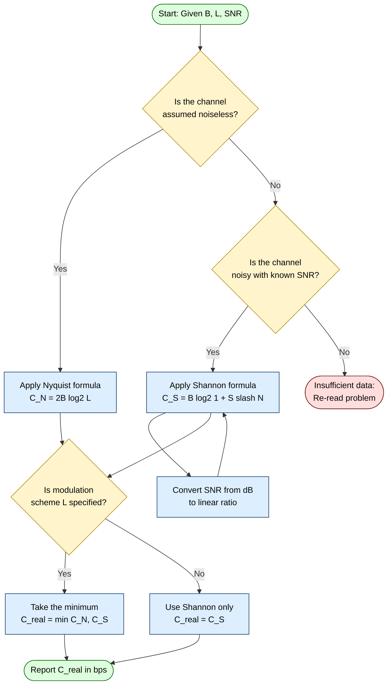
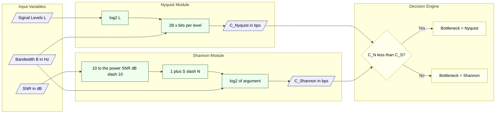
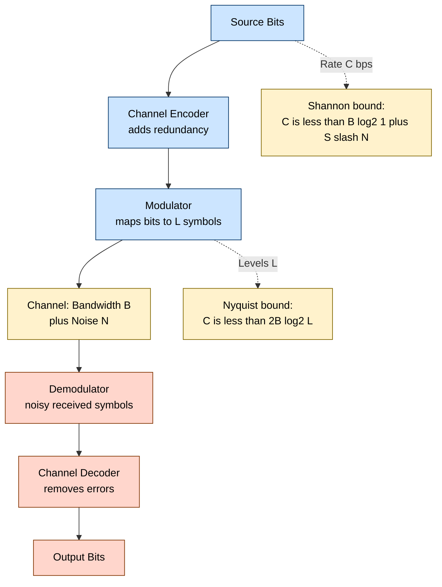
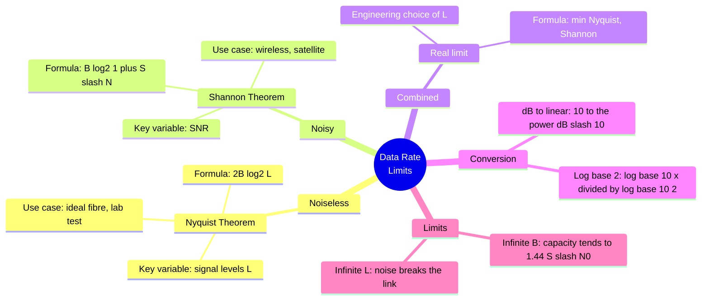

# Data rate limits - Noiseless channel, Nyquist bandwidth, Noisy channel, Shannon's capacity formula.

<!-- SECTION_1_START -->
# Data Rate Limits in Data Communication

## 1.1 Core Technical Definition

> [!IMPORTANT]
> **Data Rate Limit (KTU 2024 Definition):** The *maximum reliable data rate* (in bits per second) at which information can be transmitted over a communication channel, bounded fundamentally by two physical realities: the **available bandwidth** of the channel and the **level of noise** present in the medium.

In the KTU 2024 Scheme syllabus (OECST612 — Data Communication), the concept of data rate limits is split into two canonical, examiner-favoured scenarios:

1. **Noiseless Channel** → governed by **Harry Nyquist's** theorem (a *bandwidth-limited* system).
2. **Noisy Channel** → governed by **Claude Shannon's** theorem (a *noise-limited* system).

These two results are the **two pillars of Module 1** and appear in nearly every KTU Board examination paper.

| Term | Formal Meaning (KTU Terminology) |
|---|---|
| Data Rate ($C$ or $R$) | Number of information bits delivered per second, measured in **bits/second (bps)**. |
| Bandwidth ($B$) | The range of frequencies a channel can pass, measured in **Hertz (Hz)**. |
| Signal Level ($L$) | The number of distinct, distinguishable symbols the line can represent. |
| Signal-to-Noise Ratio (SNR) | The ratio of useful signal power to the noise power corrupting it. |

> [!NOTE]
> **Mnemonic for the Board Exam:** "**Nyquist is about Levels, Shannon is about Noise.**"

---

## 1.2 Conceptual Analogy / Intuition

Imagine a **two-lane tunnel** carved through a mountain:

- **Bandwidth ($B$)** is the **width of the tunnel** (more width = more cars per second).
- **Signal Levels ($L$)** is the **colour-coding scheme** of the cars (e.g., red = 00, blue = 01, green = 10, yellow = 11). More colours = more bits per car.
- **Noise (SNR)** is the **fog** inside the tunnel. Heavy fog means the colour-recognition cameras (receivers) cannot reliably distinguish colours. To stay reliable, the system must slow down or use fewer colours.

So we have **two different bottlenecks**:
- A *perfect, fog-free* tunnel → limit is purely geometric (Nyquist).
- A *foggy* tunnel → limit is set by visibility (Shannon).

> [!VISUALIZATION CONTROL]
> **Concept:** Data Rate as a function of Bandwidth under varying SNR.
> **GeoGebra / Desmos Input Equations:**
> * `f1(x) = 2*x*log2(16)` → Nyquist curve (L = 16 levels, noiseless)
> * `f2(x) = x*log2(1 + 10)` → Shannon curve (SNR = 10, 40 dB equivalent)
> * `f3(x) = x*log2(1 + 1000)` → Shannon curve (SNR = 1000, 30 dB)
> **Visual Description:** Three monotonically increasing curves. $f_1$ rises fastest (no noise penalty). $f_2$ and $f_3$ grow linearly with $B$ but with a much smaller slope, showing that even infinite bandwidth yields only a logarithmic gain in capacity against noise.

---

## 1.3 Why These Limits Matter in Real Engineering

- **Network Design:** ISPs (e.g., Airtel, Jio, BSNL fibre in Kerala) use Shannon's bound to advertise the *theoretical* maximum throughput of their fibre and DSL lines.
- **5G/6G Planning:** Cell tower engineers compute Shannon capacity for a given SNR to plan sector capacity.
- **Storage Media:** SSD/HDD designers use Nyquist's limit to choose sampling rates.
- **Data Compression (Module 4 link):** Knowing the channel's capacity tells you the *minimum* bits needed to represent a source.
- **Error Correction (Module 5 link):** The closer we operate to Shannon's limit, the more sophisticated the error-correcting codes (LDPC, Turbo, Polar codes) must be.

---

## 1.4 Physical Constants & Standard Metrics

> [!IMPORTANT]
> **Standard Constants Used in KTU Problems:**
> * **Nyquist Sampling Rate** for a voice channel (4 kHz): $f_s = 2B = 8\,\text{kHz}$ (8,000 samples/sec).
> * **Logarithmic base switch:** $\log_2 M = \dfrac{\log_{10} M}{\log_{10} 2} = \dfrac{\ln M}{\ln 2}$.
> * **SNR conversion:** $\text{SNR}_{\text{dB}} = 10 \log_{10}\!\left(\dfrac{S}{N}\right)$, hence $\dfrac{S}{N} = 10^{\text{SNR}_{\text{dB}}/10}$.
> * **Thermal Noise Floor at room temperature** ($T = 290\,\text{K}$): $N = kTB$, where Boltzmann's constant $k \approx 1.38 \times 10^{-23}\,\text{J/K}$. This is the irreducible noise against which the signal must fight.

<!-- SECTION_1_END -->

<!-- SECTION_2_START -->
# Deep Theoretical Analysis & KTU High-Yield Formula Sheet

## 2.1 The Noiseless Channel — Nyquist Bandwidth Theorem

### 2.1.1 Pre-requisites (Assume the channel is *ideal*)

- Channel has bandwidth $B$ Hz.
- Channel is **free of noise** (an idealisation useful as a *theoretical upper bound*).
- The transmitter can use $L$ discrete signal levels (e.g., 2 for binary, 4 for 4-PAM, 16 for 16-QAM).

### 2.1.2 Intuitive Reasoning

A noiseless channel of bandwidth $B$ Hz can support a **maximum signalling rate of $2B$ signal changes (symbols) per second** — this is the Nyquist *symbol rate* (also called the **baud rate**). Each symbol, if it can be one of $L$ levels, carries $\log_2 L$ bits. Therefore, the *bit rate* is the symbol rate multiplied by the bits per symbol.

### 2.1.3 Formal Statement

> [!IMPORTANT]
> **Nyquist Bit-Rate Theorem (Noiseless Channel):**
> $$\boxed{\,C \;=\; 2\,B \,\log_2 L \quad \text{[bits/second]}\,}$$
> Where:
> * $C$ = maximum data rate (bps)
> * $B$ = channel bandwidth (Hz)
> * $L$ = number of discrete signal levels (an integer, $L \geq 2$)

### 2.1.4 Engineering Implications

- Doubling the bandwidth **doubles** the data rate (linear scaling).
- Doubling the number of levels ($L \to L^2$) **doubles** the data rate (logarithmic gain).
- However, increasing $L$ makes the receiver's job harder because adjacent levels become closer in voltage/phase. In a *real* (noisy) channel, this directly reduces the noise margin. Hence, on a noisy channel, simply increasing $L$ does **not** increase $C$ — that's the lesson of Shannon.

---

## 2.2 The Noisy Channel — Shannon Capacity Formula

### 2.2.1 Pre-requisites (Real channel with thermal, cross-talk, etc.)

- Channel bandwidth = $B$ Hz.
- Average signal power = $S$ watts.
- Average noise power = $N$ watts.
- SNR (linear) = $S/N$ (a dimensionless ratio).
- The receiver is assumed to be **optimal** (Shannon proved an optimum code exists, but did not construct it).

### 2.2.2 Intuitive Reasoning

In a noisy channel, the receiver must distinguish between $L$ levels. The smallest *voltage gap* between adjacent levels depends on $S$ and $N$. If the noise is high, the gap must be large, so $L$ is forced down. Shannon proved an exact closed-form expression for the maximum number of *distinguishable* levels per symbol, leading to a maximum bit rate that depends on bandwidth and SNR.

### 2.2.3 Formal Statement

> [!IMPORTANT]
> **Shannon-Hartley Theorem (Noisy Channel):**
> $$\boxed{\,C \;=\; B \,\log_2\!\left(1 + \dfrac{S}{N}\right) \quad \text{[bits/second]}\,}$$
> Where:
> * $C$ = channel capacity (bps)
> * $B$ = bandwidth (Hz)
> * $S/N$ = signal-to-noise power ratio (linear, not in dB)

### 2.2.4 Engineering Implications

- Capacity grows **logarithmically** with SNR. To *double* the capacity, you must *square* the SNR (or square the signal power for fixed noise).
- Capacity grows **linearly** with bandwidth. For *infinite bandwidth* (unphysical) with $S/N$ kept constant, capacity grows only as $\log B$ — wait, no — with **noise spectral density** $N_0$ held constant (i.e., white noise $N = N_0 B$), capacity grows like $B \log_2(1 + S/(N_0 B))$ and saturates, illustrating the *infinite-bandwidth limit*:
  $$\lim_{B \to \infty} B \log_2\!\left(1 + \frac{S}{N_0 B}\right) = \frac{S}{N_0 \ln 2} \approx 1.44\,\frac{S}{N_0}$$
- In dB form: $C = B \log_2\!\left(1 + 10^{\text{SNR}_{\text{dB}}/10}\right)$.

---

## 2.3 Nyquist vs Shannon — Side-by-Side

> [!NOTE]
> When a question asks for "the **maximum** data rate of a real channel", you must use **both** formulas and take the **lesser** value (since Nyquist is the optimistic ideal and Shannon is the realistic noise bound). The actual achievable rate is:
> $$C_{\text{real}} \;=\; \min\!\Big\{\, 2B \log_2 L,\;\; B \log_2(1+S/N)\,\Big\}$$

---

## 2.4 KTU High-Yield Formula Sheet

| # | Formula | Description | Typical Use in KTU Paper |
|---|---|---|---|
| 1 | $C = 2 B \log_2 L$ | Nyquist bit rate (noiseless) | "Find the bit rate if $L$ levels are used." |
| 2 | $C = B \log_2\!\left(1 + S/N\right)$ | Shannon capacity (noisy) | "Find the capacity of a channel with SNR = X dB." |
| 3 | $C = B \log_2\!\left(1 + 10^{\text{SNR}_{\text{dB}}/10}\right)$ | Shannon in dB form | Given SNR in dB, capacity in bps. |
| 4 | $\text{SNR}_{\text{dB}} = 10 \log_{10}(S/N)$ | dB conversion | Converting linear SNR to dB and vice versa. |
| 5 | $r_{\text{max}} = 2B$ | Max signalling rate (baud) | "Highest symbol rate possible." |
| 6 | $\text{bits/symbol} = \log_2 L$ | Information per level | When asked "how many bits does one signal level represent?" |
| 7 | $N = k T B$ | Thermal noise power | Noise-power calculations (advanced sub-questions). |
| 8 | $C = \min\{2B\log_2 L,\; B\log_2(1+S/N)\}$ | Real-world limit | Combined constraint questions (very common in KTU 2024). |
| 9 | $C_{\infty} = 1.44 \, S / N_0$ | Infinite-bandwidth Shannon limit | Theoretical upper bound (rare but appears as a 1-mark twist). |
| 10 | Bandwidth Efficiency $\eta = C / B$ | Bits/sec/Hz | Spectral efficiency comparison of modulation schemes. |

> [!IMPORTANT]
> **Common Slip-ups (KTU Examiner Pitfall):**
> * Do not feed $S/N$ in **dB** directly into $\log_2(1+S/N)$. Convert dB → linear first.
> * $L$ must be an **integer power of 2** in most textbook problems. If a problem gives $L = 8$, then $\log_2 8 = 3$ bits/level.
> * Bandwidth $B$ is the *channel* bandwidth in **Hz**, not kHz. Watch the units!

---

## 2.5 Real-World Engineering Utility

- **Fibre Optics:** $S/N$ is enormous (often 30–40 dB); Shannon predicts terabits/sec. Nyquist's choice of $L$ is what limits practical fibre speeds.
- **Satellite Links:** $S/N$ is very small (often 0–10 dB). Shannon is the *binding* constraint.
- **Wi-Fi (802.11):** Adaptive Modulation and Coding (AMC) dynamically chooses $L$ to stay just under Shannon's curve.
- **Mobile (4G/5G):** Cell-edge users operate at low SNR, so Shannon is dominant; mid-cell users are bandwidth-limited (Nyquist).

<!-- SECTION_2_END -->

<!-- SECTION_3_START -->
# Step-by-Step Derivations & Worked Solutions

## 3.1 Derivation of the Nyquist Bit-Rate Formula

### 3.1.1 Starting Point — Fourier Bandlimiting

A channel of bandwidth $B$ Hz can be modelled as an **ideal low-pass filter** with cutoff $B$. According to the Nyquist–Shannon sampling theorem, a signal *bandlimited* to $B$ Hz is fully described by $2B$ **independent samples per second** (the Nyquist rate for the *signal*, not the data).

Each sample may be quantised to one of $L$ discrete levels. The number of bits required to label $L$ levels is:

$$
\text{bits per sample} = \log_2 L
$$

### 3.1.2 Combine Samples × Bits/Sample

$$
\text{Bit rate} \;=\; (\text{samples per second}) \times (\text{bits per sample})
$$

$$
C \;=\; 2B \times \log_2 L
$$

$$
\boxed{\,C = 2B \log_2 L\,}
$$

> [!NOTE]
> **Why exactly $2B$ and not $B$?** Because a real bandlimited signal has both positive and negative frequency components from $-B$ to $+B$ Hz, giving a total of $2B$ Hz of usable spectrum. The factor 2 is therefore fundamental to *real* (two-sided) baseband channels.

---

## 3.2 Derivation of the Shannon Capacity Formula

### 3.2.1 Information-Theoretic Setup

Shannon considered a *discrete* channel with input alphabet $\mathcal{X}$ and output alphabet $\mathcal{Y}$, corrupted by additive Gaussian noise of power $N$. With a fixed signal power $S$, the **maximum mutual information** $I(X;Y)$ over all input distributions gives the capacity.

For an AWGN (additive white Gaussian noise) channel:

$$
I(X;Y) \;=\; H(Y) - H(Y \mid X)
$$

Because the noise is Gaussian with variance $N$, the conditional entropy $H(Y \mid X)$ is fixed (independent of the input distribution). The maximum of $H(Y)$ over all input distributions of power $S$ is achieved by a *Gaussian* input, yielding:

$$
H(Y)_{\max} = \frac{1}{2} \log_2\!\left(2\pi e (S+N)\right)
$$

$$
H(Y \mid X) = \frac{1}{2} \log_2\!\left(2\pi e N\right)
$$

### 3.2.2 Subtract to Get Capacity

$$
C = H(Y)_{\max} - H(Y \mid X)
$$

$$
C = \frac{1}{2} \log_2\!\left(\frac{S+N}{N}\right) \;=\; \frac{1}{2} \log_2\!\left(1 + \frac{S}{N}\right) \quad \text{(bits per channel use)}
$$

For a channel of bandwidth $B$ Hz, the channel can be used $2B$ times per second (independent real dimensions), giving:

$$
C = 2B \times \frac{1}{2} \log_2\!\left(1 + \frac{S}{N}\right) = B \log_2\!\left(1 + \frac{S}{N}\right)
$$

$$
\boxed{\,C = B \log_2\!\left(1 + \dfrac{S}{N}\right)\,}
$$

> [!NOTE]
> **Key Insight:** The factor of 2 (from $2B$ real dimensions) and the factor of $\tfrac{1}{2}$ (from the Gaussian entropy) *cancel out*, leaving the famously clean form.

---

## 3.3 Worked Example 1 — Pure Nyquist (Noiseless)

**Problem:** A noiseless channel has a bandwidth of $4\,\text{kHz}$. The transmitter uses $16$ signal levels. Find the maximum data rate.

**Solution:**

Given: $B = 4000\,\text{Hz}$, $L = 16$.

$$
C = 2B \log_2 L
$$

$$
\log_2 16 = 4
$$

$$
C = 2 \times 4000 \times 4
$$

$$
\boxed{\,C = 32{,}000\,\text{bits/sec}\,}
$$

**Valuation Key (KTU style):**
- [Stating Nyquist formula: 1 Mark]
- [Correct $\log_2 16 = 4$: 1 Mark]
- [Substitution: 1 Mark]

---

## 3.4 Worked Example 2 — Pure Shannon (Noisy, SNR in dB)

**Problem:** A channel of bandwidth $3\,\text{kHz}$ has an SNR of $30\,\text{dB}$. Find the Shannon capacity.

**Solution:**

Step 1: Convert SNR from dB to linear.

$$
\text{SNR}_{\text{linear}} = 10^{30/10} = 10^{3} = 1000
$$

Step 2: Apply Shannon's formula.

$$
C = B \log_2\!\left(1 + \frac{S}{N}\right)
$$

$$
C = 3000 \times \log_2(1 + 1000) = 3000 \times \log_2(1001)
$$

Step 3: Evaluate the log.

$$
\log_2(1001) = \frac{\log_{10}(1001)}{\log_{10}(2)} = \frac{3.00043}{0.30103} \approx 9.967
$$

Step 4: Final value.

$$
C = 3000 \times 9.967 \approx 29{,}901\,\text{bps}
$$

$$
\boxed{\,C \approx 29.9\,\text{kbps}\,}
$$

**Valuation Key (KTU style):**
- [dB → linear conversion: 2 Marks]
- [Substitution into Shannon: 1 Mark]
- [Final numerical value: 1 Mark]

---

## 3.5 Worked Example 3 — Combined Nyquist + Shannon (Favourite KTU Question!)

**Problem:** A channel of bandwidth $B = 4\,\text{kHz}$ and SNR $= 24\,\text{dB}$ is to be used with $L = 8$ signal levels. Determine:
1. The Nyquist bit rate.
2. The Shannon capacity.
3. The actual maximum achievable data rate.

**Solution:**

**Part (1) — Nyquist:**

$$
C_N = 2B \log_2 L = 2 \times 4000 \times \log_2 8 = 2 \times 4000 \times 3 = 24{,}000\,\text{bps}
$$

**Part (2) — Shannon:**

$$
S/N = 10^{24/10} = 10^{2.4} \approx 251.19
$$

$$
C_S = 4000 \times \log_2(1 + 251.19) = 4000 \times \log_2(252.19)
$$

$$
\log_2(252.19) = \frac{\log_{10}(252.19)}{0.30103} = \frac{2.4016}{0.30103} \approx 7.978
$$

$$
C_S \approx 4000 \times 7.978 \approx 31{,}913\,\text{bps}
$$

**Part (3) — Real Limit:**

$$
C_{\text{real}} = \min\{C_N, C_S\} = \min\{24{,}000,\; 31{,}913\} = 24{,}000\,\text{bps}
$$

$$
\boxed{\,C_{\text{real}} = 24\,\text{kbps}\,}
$$

> [!NOTE]
> **Interpretation:** Although the channel *could* support 31.9 kbps by Shannon's measure, the *modulation scheme* (8 levels) is the limiting factor. To exceed 24 kbps, the engineer must increase $L$ to 16 (giving $C_N = 32$ kbps > $C_S$).

---

## 3.6 Worked Example 4 — Finding Required Bandwidth

**Problem:** We need a data rate of $C = 100\,\text{kbps}$ over a noisy channel with SNR $= 20\,\text{dB}$. Find the minimum bandwidth required.

**Solution:**

Step 1: SNR linear.

$$
S/N = 10^{20/10} = 100
$$

Step 2: Shannon inversion.

$$
C = B \log_2(1 + S/N) \;\Longrightarrow\; B = \frac{C}{\log_2(1 + 100)} = \frac{100{,}000}{\log_2(101)}
$$

$$
\log_2(101) = \frac{\log_{10}(101)}{0.30103} = \frac{2.0043}{0.30103} \approx 6.658
$$

$$
B = \frac{100{,}000}{6.658} \approx 15{,}019\,\text{Hz} \approx 15.02\,\text{kHz}
$$

$$
\boxed{\,B_{\min} \approx 15.02\,\text{kHz}\,}
$$

---

## 3.7 Python Implementation (Symbolic + Numerical)

```python
import math

def nyquist_capacity(bandwidth_hz: float, signal_levels: int) -> float:
    """
    Nyquist bit-rate for a NOISELESS channel.
    C = 2 * B * log2(L)
    """
    if bandwidth_hz <= 0:
        raise ValueError("Bandwidth must be > 0 Hz.")
    if not isinstance(signal_levels, int) or signal_levels < 2:
        raise ValueError("Signal levels L must be an integer >= 2.")
    return 2.0 * bandwidth_hz * math.log2(signal_levels)


def shannon_capacity(bandwidth_hz: float, snr_db: float) -> float:
    """
    Shannon-Hartley capacity for a NOISY channel.
    C = B * log2(1 + S/N),  where S/N = 10^(SNR_dB / 10).
    """
    if bandwidth_hz <= 0:
        raise ValueError("Bandwidth must be > 0 Hz.")
    snr_linear = 10.0 ** (snr_db / 10.0)
    return bandwidth_hz * math.log2(1.0 + snr_linear)


def real_channel_capacity(bandwidth_hz: float,
                          signal_levels: int,
                          snr_db: float) -> dict:
    """
    Real-world limit = min(Nyquist, Shannon).
    Returns a dictionary with the breakdown.
    """
    c_nyq = nyquist_capacity(bandwidth_hz, signal_levels)
    c_sha = shannon_capacity(bandwidth_hz, snr_db)
    return {
        "nyquist_bps":   c_nyq,
        "shannon_bps":   c_sha,
        "actual_bps":    min(c_nyq, c_sha),
        "binding_limit": "Nyquist" if c_nyq < c_sha else "Shannon",
    }


# ---- Verification against the worked examples ----
if __name__ == "__main__":
    # Example 1: B = 4 kHz, L = 16
    print("Ex1 Nyquist  :", nyquist_capacity(4000, 16), "bps")   # 32000

    # Example 2: B = 3 kHz, SNR = 30 dB
    print("Ex2 Shannon  :", shannon_capacity(3000, 30), "bps")   # ~29901

    # Example 3: B = 4 kHz, L = 8, SNR = 24 dB
    result = real_channel_capacity(4000, 8, 24)
    print("Ex3 Breakdown:", result)

    # Example 4: Find B for C = 100 kbps, SNR = 20 dB
    target_c   = 100_000
    snr_lin    = 10 ** (20 / 10)
    b_required = target_c / math.log2(1 + snr_lin)
    print("Ex4 B needed :", b_required, "Hz")                    # ~15019
```

**Expected Output:**
```
Ex1 Nyquist  : 32000.0 bps
Ex2 Shannon  : 29901.29947831979 bps
Ex3 Breakdown: {'nyquist_bps': 24000.0, 'shannon_bps': 31913.1182..., 'actual_bps': 24000.0, 'binding_limit': 'Nyquist'}
Ex4 B needed : 15019.4992... Hz
```

<!-- SECTION_3_END -->

<!-- SECTION_4_START -->
# Structural Diagrams & Schematics

## 4.1 Master Block Diagram — Determining the Data-Rate Limit

The following Mermaid block-diagram captures the *complete* decision flow a KTU examiner expects when a problem gives you $B$, $L$, and $S/N$. Read this and memorise the flow.



> [!NOTE]
> **Reading the diagram:** The "minimum" gate is the *crux* — it is the most common reason students lose 2–3 marks in KTU 2024 papers. The actual data rate is governed by the **smaller** of the two bounds.

---

## 4.2 Modular Subgraph — Nyquist vs Shannon Decision Engine

This is a *decomposed* view, isolating the algorithmic engine that decides which bound is binding.



---

## 4.3 Sequential Processing Topology — Data Through a Noisy Channel



> [!NOTE]
> **Interpretation:** The source bits can only flow if the chosen rate $C$ simultaneously satisfies *both* upper bounds. The intersection of the Nyquist and Shannon feasible regions is the *operational envelope* of the channel.

---

## 4.4 Concept Map — From Bandwidth to Capacity



<!-- SECTION_4_END -->

<!-- SECTION_5_START -->
# KTU 2024 Scheme Examination Question Bank & Topic Recap

## 5.1 Part A — Short-Answer Questions (3 Marks Each)

> [!IMPORTANT]
> **KTU Marking Convention (Part A):** Each question carries **3 marks**. Answers are expected to be 3–5 lines with a formula or two. No lengthy derivations.

---

### **Question A1** `[KTU University Exam – Dec 2023]`
**CO1 | Remember | 3 Marks**

State and explain the **Nyquist Bit-Rate Theorem** for a noiseless channel. Mention the role of the number of signal levels $L$.

**Model Answer:**

> Nyquist's theorem gives the maximum theoretical bit rate achievable on a *noiseless* channel of bandwidth $B$ Hz using $L$ discrete signal levels. The formula is:
>
> $$C = 2B \log_2 L \quad \text{bits/second}$$
>
> The bandwidth $B$ limits the number of independent signal changes per second to $2B$ (the Nyquist symbol rate). The factor $\log_2 L$ represents the number of bits that can be encoded into each of the $L$ possible signal levels. Doubling $L$ from 2 to 4 doubles $C$, and so on. The theorem assumes an ideal, distortion-free channel and serves as the *optimistic* upper bound for any real communication system.

**[Valuation Key:][Stating formula: 2 Marks][Role of L explained: 1 Mark]**

---

### **Question A2** `[KTU University Exam – July 2024]`
**CO1, CO2 | Understand & Apply | 3 Marks**

A channel has a bandwidth of $6\,\text{kHz}$ and an SNR of $36\,\text{dB}$. Using **Shannon's capacity formula**, calculate the maximum theoretical data rate.

**Model Answer:**

Convert SNR from dB to linear:

$$\frac{S}{N} = 10^{36/10} = 10^{3.6} \approx 3981.07$$

Apply Shannon:

$$C = B \log_2\!\left(1 + \frac{S}{N}\right) = 6000 \times \log_2(3982.07)$$

$$\log_2(3982.07) = \frac{\log_{10}(3982.07)}{\log_{10}(2)} \approx \frac{3.6000}{0.3010} \approx 11.96$$

$$C \approx 6000 \times 11.96 \approx 71{,}760\,\text{bps}$$

$$\boxed{C \approx 71.76\,\text{kbps}}$$

**[Valuation Key:][dB conversion: 1 Mark][Substitution: 1 Mark][Final value: 1 Mark]**

---

## 5.2 Part B — Long-Answer Questions (14 Marks Each, with Internal Choice)

> [!IMPORTANT]
> **KTU ESE Pattern (Part B):** Each Part B question has two *internal* choices (a and b). The student answers **one** out of (a) or (b) for **7 marks**, plus a compulsory second sub-part worth **7 marks**, totalling **14 marks**. The structure below mirrors this exactly.

---

### **Question B — Option A** `[KTU University Exam – Dec 2024]`
**CO1, CO2 | Understand, Apply | 14 Marks**

**(a)** *Attempt any ONE of the following:* **[7 Marks]**

**(a)(i)** With the aid of neat diagrams, **derive the Nyquist bit-rate formula** $C = 2B \log_2 L$ for a noiseless channel. Clearly state the assumptions made. **(Understand — 7 Marks)**

**Model Solution:**

1. **Assumption 1:** The channel is **ideal low-pass** with cutoff $B$ Hz, no distortion.
2. **Assumption 2:** The channel is **noiseless** (no thermal, cross-talk, or impulse noise).
3. **Sampling Theorem:** A signal bandlimited to $B$ Hz can be uniquely reconstructed from $2B$ independent samples per second.
4. **Quantisation:** Each sample is quantised to one of $L$ discrete amplitude levels. The number of bits required to label $L$ levels is $\log_2 L$.
5. **Bit rate = samples per second × bits per sample:**

$$
C = 2B \times \log_2 L
$$

```
[Stating the two assumptions: 2 Marks]
[Applying sampling theorem: 2 Marks]
[Defining bits per level: 1 Mark]
[Final formula: 2 Marks]
```

---

**(a)(ii)** OR: A noiseless channel of bandwidth $B = 8\,\text{kHz}$ uses $L = 32$ signal levels. Compute the bit rate. **(Apply — 7 Marks)**

**Model Solution:**

$$
C = 2B \log_2 L = 2 \times 8000 \times \log_2(32)
$$

Since $2^5 = 32$:

$$
\log_2 32 = 5
$$

$$
C = 2 \times 8000 \times 5 = 80{,}000\,\text{bps}
$$

$$
\boxed{C = 80\,\text{kbps}}
$$

```
[Formula written: 2 Marks]
[log2 32 = 5: 2 Marks]
[Substitution and final answer: 3 Marks]
```

---

**(b)** A channel of bandwidth $4\,\text{kHz}$ has an SNR of $30\,\text{dB}$. **(Apply — 7 Marks)**

**(i)** Calculate the **Shannon capacity**.  
**(ii)** If the system designer wishes to use $L = 4$ signal levels, determine whether the modulation scheme or the channel noise is the *binding* constraint.

**Model Solution:**

**(i)** Convert SNR to linear:

$$\frac{S}{N} = 10^{30/10} = 10^3 = 1000$$

$$C_S = 4000 \times \log_2(1 + 1000) = 4000 \times \log_2(1001)$$

$$\log_2(1001) \approx 9.967$$

$$C_S \approx 39{,}868\,\text{bps}$$

**(ii)** Nyquist with $L = 4$:

$$C_N = 2 \times 4000 \times \log_2 4 = 8000 \times 2 = 16{,}000\,\text{bps}$$

**Compare:** $C_N = 16\,\text{kbps} < C_S = 39.87\,\text{kbps}$.

**Binding limit = Nyquist (modulation scheme).** The actual data rate is $16\,\text{kbps}$.

```
[i Shannon calculation: 3 Marks]
[Final C_S value: 1 Mark]
[Nyquist calculation: 1 Mark]
[Comparison and binding-limit identification: 2 Marks]
```

---

### **Question B — Option B** `[KTU University Exam – July 2024]`
**CO1, CO2 | Understand, Apply, Analyse | 14 Marks**

**(a)** *Attempt any ONE of the following:* **[7 Marks]**

**(a)(i)** With the aid of a labelled block diagram, **explain Shannon's channel capacity theorem** and discuss its significance in modern digital communication. **(Understand — 7 Marks)**

**Model Solution:**

1. **Statement:** The Shannon-Hartley theorem gives the theoretical maximum data rate $C$ of a communication channel of bandwidth $B$ Hz operating in the presence of Gaussian noise with signal-to-noise ratio $S/N$:

$$
C = B \log_2\!\left(1 + \dfrac{S}{N}\right) \quad \text{bits/second}
$$

2. **Block Diagram (description):** Source → Encoder → Modulator → Channel (adds noise $N$) → Demodulator → Decoder → Sink. The channel acts as a *rate-limiter* at $C$ bps.

3. **Key Implications:**
   * Capacity grows **logarithmically** with SNR.
   * Capacity grows **linearly** with bandwidth.
   * A non-zero capacity exists even for *arbitrarily* small SNR (as long as $S > 0$).
   * Shannon's theorem proves the **existence** of codes that approach this limit; it does not construct them.

4. **Modern Significance:** 4G/5G systems (LTE, NR), Wi-Fi (802.11ax), and deep-space communication (Voyager) all operate within fractions of a dB of the Shannon limit using Turbo, LDPC, and Polar codes.

```
[Statement and formula: 2 Marks]
[Block diagram description: 2 Marks]
[Four implications listed: 2 Marks]
[Modern relevance: 1 Mark]
```

---

**(a)(ii)** OR: A noisy channel has $B = 3\,\text{kHz}$. Compute the capacity when the SNR is **(a)** $20\,\text{dB}$ and **(b)** $40\,\text{dB}$. Comment on the result. **(Apply — 7 Marks)**

**Model Solution:**

**Case (a):** $S/N = 10^{20/10} = 100$.

$$C_a = 3000 \times \log_2(101) \approx 3000 \times 6.658 \approx 19{,}974\,\text{bps} \approx 19.97\,\text{kbps}$$

**Case (b):** $S/N = 10^{40/10} = 10{,}000$.

$$C_b = 3000 \times \log_2(10{,}001) \approx 3000 \times 13.289 \approx 39{,}867\,\text{bps} \approx 39.87\,\text{kbps}$$

**Comment:** A 20 dB (100×) increase in signal power results in only a 2× increase in capacity. This is the logarithmic nature of Shannon's law — *doubling capacity requires squaring the SNR*.

```
[Case a calculation: 2 Marks]
[Case b calculation: 2 Marks]
[Final values: 1 Mark]
[Logarithmic-growth comment: 2 Marks]
```

---

**(b)** A communication system must support $C = 50\,\text{kbps}$ over a channel of $B = 10\,\text{kHz}$ with an SNR of $20\,\text{dB}$. The engineer proposes to use $L = 16$ levels. **(Apply & Analyse — 7 Marks)**

**(i)** Verify whether the proposed design is feasible.  
**(ii)** Suggest the minimum $L$ needed to meet the target.

**Model Solution:**

**(i)** Compute both bounds.

Shannon:

$$\frac{S}{N} = 100, \quad C_S = 10000 \times \log_2(101) \approx 66{,}580\,\text{bps}$$

Nyquist with $L = 16$:

$$C_N = 2 \times 10000 \times \log_2 16 = 20000 \times 4 = 80{,}000\,\text{bps}$$

Real capacity:

$$C_{\text{real}} = \min\{80{,}000,\; 66{,}580\} = 66{,}580\,\text{bps} \approx 66.58\,\text{kbps}$$

Since $66.58\,\text{kbps} \geq 50\,\text{kbps}$ → **Feasible**. The binding limit is Shannon.

**(ii)** To find the minimum $L$ such that $C_N \geq C_S$:

$$2 \times 10000 \times \log_2 L \geq 66{,}580 \;\Longrightarrow\; \log_2 L \geq 3.329 \;\Longrightarrow\; L \geq 2^{3.329} \approx 10.04$$

Since $L$ must be an integer power of 2, choose $L = 16$ (already proposed — perfectly fine).

If the engineer *wanted* the lowest $L$ such that $C_N$ is just above $C_S$, then any $L \geq 11$ continuous, but as a power-of-2, $L = 16$ is the smallest valid choice.

```
[Shannon bound: 2 Marks]
[Nyquist with L=16: 1 Mark]
[Comparison and feasibility: 2 Marks]
[Minimum L derivation: 2 Marks]
```

---

> [!WARNING]
> **KTU Examiner's Valuation Warning — Common Pitfalls**
>
> 1. **dB Trap:** Students often substitute SNR in dB directly into $\log_2(1 + S/N)$. This is the *#1* mark-loss cause. Always do: $S/N = 10^{\text{dB}/10}$ first.
> 2. **Units Mix-up:** $B$ must be in **Hz** (not kHz) when reporting $C$ in bps. If $B$ is given in kHz, multiply by 1000.
> 3. **Forgetting the Minimum Rule:** In "real channel" questions, students calculate *both* Nyquist and Shannon but forget to take the minimum. This forfeits at least **2 marks**.
> 4. **Non-integer $L$:** $L$ is the number of *signal levels*, so it must be a positive integer. If a calculation gives $L = 3.7$, the student must round **up** to the next integer (or next power of 2 if the modulation scheme requires it).
> 5. **Skipping the Assumption Box:** A 7-mark derivation question that does not *list the assumptions* (no noise, ideal low-pass, etc.) loses 2 marks.
> 6. **Writing Baud instead of bps:** The Nyquist formula gives the bit rate, not the baud rate. The baud rate is $2B$, and the bit rate is $2B \log_2 L$. Mixing these up is a 1-mark penalty in valuation.
> 7. **Missing Units in Final Answer:** $C$ must be reported with units (bps, kbps, or Mbps). A bare number is incomplete.

---

## 5.3 Topic Recap & Important Things to Remember

> [!IMPORTANT]
> **Rapid Revision Checklist — Data Rate Limits (Module 1, OECST612)**

### **Core Theorems**
- ✅ Nyquist's Theorem (1928) applies to **noiseless** channels: $C = 2B \log_2 L$.
- ✅ Shannon's Theorem (1948) applies to **noisy** channels: $C = B \log_2(1 + S/N)$.
- ✅ Real-world limit: $C_{\text{real}} = \min\{\text{Nyquist}, \text{Shannon}\}$.

### **Key Variables & Units**
- ✅ $B$ — Channel bandwidth in **Hz** (not kHz, not MHz without conversion).
- ✅ $L$ — Number of discrete signal levels, an integer $\geq 2$ (often a power of 2).
- ✅ $S/N$ — **Linear** signal-to-noise power ratio. To convert from dB: $S/N = 10^{\text{dB}/10}$.
- ✅ $C$ — Channel capacity in **bits per second (bps)**.

### **Critical Numerical Conversions**
- ✅ $\log_2 2 = 1$, $\log_2 4 = 2$, $\log_2 8 = 3$, $\log_2 16 = 4$, $\log_2 32 = 5$, $\log_2 64 = 6$.
- ✅ $\log_2 10 \approx 3.3219$, $\log_2 100 \approx 6.6439$.
- ✅ $\log_2(1 + S/N) = \dfrac{\log_{10}(1 + S/N)}{\log_{10} 2} = \dfrac{\log_{10}(1 + S/N)}{0.30103}$.

### **Bandwidth-Signal Level Coupling**
- ✅ Doubling $B$ doubles $C$ (linear gain).
- ✅ Doubling $L$ doubles $C$ (logarithmic gain — but raises noise-sensitivity).
- ✅ Doubling $S/N$ does **not** double $C$ — capacity grows only as $\log_2(1 + S/N)$.

### **Mnemonic Anchors**
- ✅ "**Nyquist is about Levels, Shannon is about Noise.**"
- ✅ "**SNR in dB → divide by 10 → power of 10 → linear ratio.**"
- ✅ "**Take the MIN of Nyquist and Shannon — the real channel obeys the stricter boss.**"

### **Engineering Touch-Points to Mention in Answers**
- ✅ Fibre-optic links are bandwidth-limited (Nyquist binding).
- ✅ Wireless/satellite links are noise-limited (Shannon binding).
- ✅ Infinite-bandwidth Shannon limit: $C_\infty = 1.44 \cdot S / N_0$ bps.
- ✅ Spectral efficiency $\eta = C / B$ in bits/sec/Hz — used to compare modulation schemes.

### **Common Board-Exam Traps**
- ✅ Mistaking $S/N$ in dB for the linear ratio (costly).
- ✅ Reporting $C$ in kbps when $B$ was given in Hz (unit mismatch).
- ✅ Forgetting the $\min\{\cdot\}$ operation in combined problems.
- ✅ Omitting assumption statements in derivation questions.

### **Sample 2-Line Summary for the Answer Sheet**
> "The Nyquist theorem limits the bit rate of a noiseless channel to $C = 2B \log_2 L$, while the Shannon-Hartley theorem limits the capacity of a noisy channel to $C = B \log_2(1 + S/N)$. The real achievable rate is the smaller of the two, since the channel must satisfy *both* constraints simultaneously."

<!-- SECTION_5_END -->
